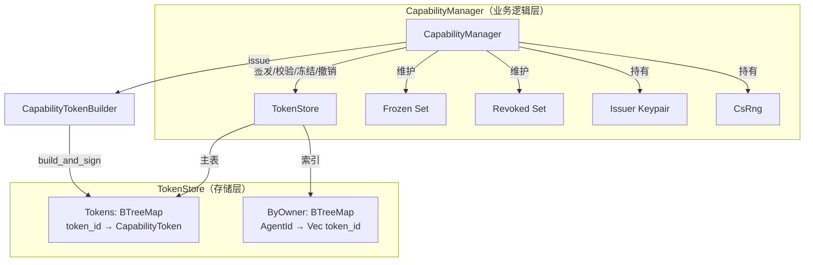
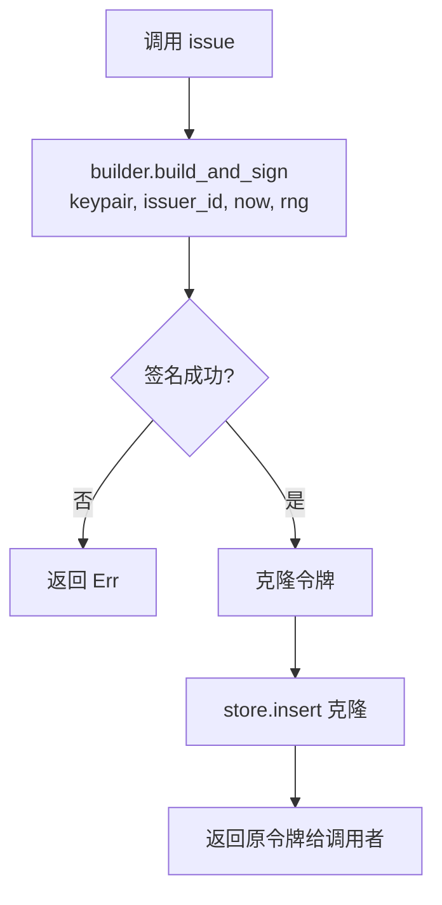
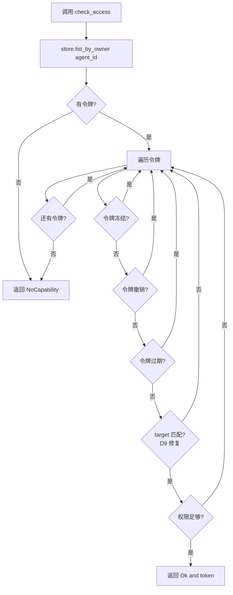

# EnerOS v0.40.0 能力管理器（Capability Manager）设计文档

> **版本**：v0.40.0  
> **日期**：2026-07-14  
> **状态**：已实现  
> **依赖**：v0.39.0（能力令牌 Capability Token）

---

## 1. 概述

v0.40.0 实现能力管理器（`CapabilityManager`），作为 Agent 访问控制的安全边界。在 v0.39.0 单令牌结构与签名的基础上，v0.40.0 提供集中式管理器，支持令牌的签发、校验、冻结、撤销和过期清理。

### 核心功能

| 功能 | 方法 | 说明 |
|------|------|------|
| 签发 | `issue` | 使用 SM2 签名生成新令牌 |
| 校验 | `check_access` | 检查 Agent 是否有权限访问目标资源 |
| 签名验证 | `verify_token` | 验证令牌签名有效性 |
| 冻结 | `freeze` | 冻结 Agent 所有令牌（崩溃处理） |
| 解冻 | `unfreeze` | 解冻单个令牌 |
| 撤销 | `revoke` | 永久移除令牌 |
| 过期清理 | `cleanup_expired` | 清理过期令牌 |

---

## 2. 背景与动机

### v0.39.0 的局限

v0.39.0 实现了单令牌结构（`CapabilityToken`）和构建器（`CapabilityTokenBuilder`），但缺少：

1. **集中管理**：无法统一管理所有已签发令牌
2. **冻结机制**：崩溃 Agent 的令牌仍有效，可能导致僵尸 Agent 发命令
3. **撤销机制**：无法永久撤销已签发令牌
4. **过期清理**：过期令牌无法自动清理

### v0.40.0 的改进

v0.40.0 引入 `CapabilityManager` 和 `TokenStore`，解决上述问题：

- **双层架构**：`TokenStore` 负责存储与索引，`CapabilityManager` 负责业务逻辑
- **冻结/解冻**：崩溃 Agent 的所有令牌被冻结，恢复后可解冻
- **撤销**：永久移除令牌，防止重放攻击
- **过期清理**：定期清理过期令牌，释放存储空间

---

## 3. 架构设计

### 双层架构



### 模块结构

```
crates/agents/agent/src/capability/
├── mod.rs          # 模块声明与 re-exports
├── token.rs        # CapabilityToken（v0.39.0）
├── builder.rs      # CapabilityTokenBuilder（v0.39.0）
├── verifier.rs     # TokenVerifier（v0.39.0）
├── store.rs        # TokenStore（v0.40.0 新增）
└── manager.rs      # CapabilityManager（v0.40.0 新增）
```

---

## 4. TokenStore 数据结构

### 双索引结构

```rust
pub struct TokenStore {
    tokens: BTreeMap<u64, CapabilityToken>,
    by_owner: BTreeMap<AgentId, Vec<u64>>,
}
```

| 字段 | 类型 | 说明 |
|------|------|------|
| `tokens` | `BTreeMap<u64, CapabilityToken>` | 令牌主表，token_id → 令牌 |
| `by_owner` | `BTreeMap<AgentId, Vec<u64>>` | 按 owner 索引，owner → token_id 列表 |

### 支持操作

| 方法 | 时间复杂度 | 说明 |
|------|-----------|------|
| `new()` | O(1) | 创建空存储 |
| `insert(token)` | O(log n) | 插入令牌并更新索引 |
| `remove(token_id)` | O(log n) | 移除令牌并同步索引 |
| `get(token_id)` | O(log n) | 按 ID 查询 |
| `list_by_owner(owner)` | O(log n + k) | 列出 owner 的所有令牌 |
| `token_ids_by_owner(owner)` | O(log n) | 列出 owner 的所有令牌 ID |
| `list_expired_ids(now)` | O(n) | 列出所有过期令牌 ID |
| `len()` / `is_empty()` | O(1) | 数量查询 |

### 索引同步

`insert` 和 `remove` 操作自动维护 `by_owner` 索引的一致性：

- **insert**：若 owner 不存在则创建新 Vec，否则追加 token_id
- **remove**：从 by_owner 中移除 token_id，若 Vec 变空则移除 owner 键

---

## 5. CapabilityManager 数据结构

```rust
pub struct CapabilityManager {
    store: TokenStore,
    frozen: BTreeSet<u64>,
    revoked: BTreeSet<u64>,
    issuer_keypair: Sm2KeyPair,
    issuer_id: AgentId,
    rng: CsRng,
}
```

| 字段 | 类型 | 说明 |
|------|------|------|
| `store` | `TokenStore` | 令牌存储 |
| `frozen` | `BTreeSet<u64>` | 已冻结令牌 ID 集合 |
| `revoked` | `BTreeSet<u64>` | 已撤销令牌 ID 集合 |
| `issuer_keypair` | `Sm2KeyPair` | 签发者密钥对（SM2） |
| `issuer_id` | `AgentId` | 签发者 Agent ID |
| `rng` | `CsRng` | 随机数生成器 |

### Debug 实现

`CsRng` 不实现 `Debug`（内部状态不应泄露），因此 `CapabilityManager` 手动实现 `Debug`，`rng` 字段输出 `<CsRng: redacted>`。

---

## 6. 签发流程

### `issue(builder, now)` 方法



### 签发参数

| 参数 | 类型 | 说明 |
|------|------|------|
| `builder` | `CapabilityTokenBuilder` | 已配置好的构建器 |
| `now` | `u64` | 当前时间戳（毫秒） |

### 签发过程

1. 调用 `builder.build_and_sign(&self.issuer_keypair, self.issuer_id, now, &mut self.rng)`
2. `build_and_sign` 内部：
   - 使用 CSRNG 生成随机 `token_id`
   - 计算 `expires_at = now + ttl_ms`（若 ttl > 0）
   - 序列化未签名部分
   - SM2 签名（需要私钥 + 公钥 + RNG）
3. 将令牌克隆存入 `store`
4. 返回原令牌给调用者

---

## 7. 校验流程

### `check_access(agent_id, target, perm, now)` 方法



### D9 安全修复

蓝图原始代码的 `check_access` **不检查 target 匹配**，存在安全漏洞：Agent 持有 target=Device(1) 的令牌可以访问 target=Device(2)。

v0.40.0 修复此漏洞，在 `check_access` 中添加 `token.target == *target` 检查。

### 跳过条件

以下令牌被跳过（不视为有效）：

1. **冻结令牌**：`frozen.contains(&token.token_id)` — 崩溃 Agent 的令牌
2. **撤销令牌**：`revoked.contains(&token.token_id)` — 已永久撤销
3. **过期令牌**：`token.is_expired(now)` — 超过 expires_at
4. **target 不匹配**：`token.target != *target` — D9 修复
5. **权限不足**：`!token.check_permission(perm)` — 缺少所需权限

---

## 8. 冻结/解冻机制

### 冻结（`freeze`）

当 Agent 崩溃时，调用 `freeze(agent_id)` 冻结该 Agent 的所有令牌：

1. 获取 `store.token_ids_by_owner(agent_id)`
2. 将每个 token_id 加入 `frozen` 集合
3. 返回冻结数量

冻结后，`check_access` 跳过冻结令牌，防止僵尸 Agent 发命令。

### 解冻（`unfreeze`）

Agent 恢复后，调用 `unfreeze(token_id)` 解冻单个令牌：

1. 从 `frozen` 集合中移除 token_id
2. 返回是否成功（true = 原处于冻结状态）

解冻后，令牌恢复有效，`check_access` 不再跳过。

### 使用场景

```
Agent 崩溃 → freeze(agent_id) → 令牌冻结
    ↓
Agent 恢复 → unfreeze(token_id) → 令牌解冻
    ↓
check_access 恢复正常
```

---

## 9. 撤销机制

### `revoke(token_id)` 方法

1. 调用 `store.remove(token_id)` 从存储中移除令牌
2. 将 token_id 加入 `revoked` 集合（防止重放）
3. 返回是否成功移除

### 与冻结的区别

| 特性 | 冻结（freeze） | 撤销（revoke） |
|------|---------------|---------------|
| 可逆 | 是（unfreeze） | 否（永久） |
| 令牌保留 | 是（仍在 store 中） | 否（从 store 移除） |
| 使用场景 | 崩溃恢复 | 永久吊销 |

---

## 10. 过期清理

### `cleanup_expired(now)` 方法

1. 调用 `store.list_expired_ids(now)` 获取所有过期令牌 ID
2. 逐个调用 `store.remove(id)` 移除
3. 返回清理数量

### 过期判定

令牌的 `is_expired(now)` 方法：
- `expires_at = None` → 永不过期
- `expires_at = Some(exp)` → `now >= exp` 时过期

---

## 11. 错误处理

### 新增错误变体（v0.40.0）

```rust
/// 能力 Token 已冻结
TokenFrozen,

/// 能力 Token 已撤销
TokenRevoked,

/// 无匹配能力（agent 无对应 target 的有效令牌）
NoCapability { agent: AgentId, target: String },
```

### `NoCapability` 设计

`NoCapability.target` 使用 `String`（`format!("{:?}", target)`）而非 `ResourceTarget`，避免 `error` 模块依赖 `capability` 模块造成循环引用。

### 错误使用场景

| 错误 | 触发场景 |
|------|---------|
| `NoCapability` | `check_access` 找不到匹配令牌 |
| `TokenFrozen` | 预留（当前 `check_access` 跳过冻结令牌，返回 `NoCapability`） |
| `TokenRevoked` | 预留（当前 `check_access` 跳过撤销令牌，返回 `NoCapability`） |

---

## 12. no_std 合规性

### 合规要求

- 所有代码 `#![cfg_attr(not(test), no_std)]`（继承 lib.rs）
- 仅使用 `alloc::*` 与 `core::*`
- 禁止 `use std::*`、`panic!`、`todo!`、`unimplemented!`

### 数据结构选择

| 蓝图 | 实际实现 | 原因 |
|------|---------|------|
| `HashMap` | `BTreeMap` | no_std 无 `std::collections::HashMap` |
| `HashSet` | `BTreeSet` | no_std 无 `std::collections::HashSet` |
| `crate::time::now_ms()` | `now: u64` 参数 | no_std 无系统时钟 |

### 依赖

- `eneros-crypto`：SM2 签名/验签、CSRNG
- `alloc`：`BTreeMap`、`BTreeSet`、`Vec`、`String`、`format!`

---

## 13. 偏差声明表

| 偏差 | 蓝图描述 | 实际实现 | 原因 |
|------|---------|---------|------|
| D1 | `HashMap`/`HashSet` | `BTreeMap`/`BTreeSet` | no_std 无 `std::collections::HashMap`/`HashSet` |
| D2 | `issuer_key: Sm2PrivateKey` + `issuer_pk: Sm2PublicKey` | `issuer_keypair: Sm2KeyPair` | `build_and_sign` 需要完整 keypair（sk+pk） |
| D3 | `issue(builder, owner: AgentId)` | `issue(builder, now: u64)` | owner 已在 builder 中设置；需要 `now` 用于 `issued_at` |
| D4 | `check_access(agent_id, target, perm)` | `check_access(agent_id, target, perm, now: u64)` | no_std 无 `crate::time::now_ms()` |
| D5 | `next_token_id: u64` 递增 | 移除 | token_id 由 `build_and_sign` 内部 CSRNG 随机生成 |
| D6 | `TokenStore.by_target: HashMap<String, Vec<u64>>` | 跳过 `by_target` 索引 | `ResourceTarget` 非 `String`；`check_access` 仅用 `by_owner` 索引 |
| D7 | `new(keypair: Sm2KeyPair)` | `new(keypair: Sm2KeyPair, issuer_id: AgentId)` | 签发者 ID 需要配置，不可硬编码 `AgentId(0)` |
| D8 | `builder.build_and_sign(&self.issuer_key, AgentId(0))?` | `builder.build_and_sign(&self.issuer_keypair, self.issuer_id, now, &mut self.rng)?` | 真实 API 需 4 参数（keypair + issuer_id + now + rng） |
| D9 | `check_access` 不检查 target | 添加 `token.target == *target` 匹配检查 | 修复蓝图安全漏洞：无 target 检查会导致越权 |
| D10 | `manager.rs` 内联存储 | 拆分为 `store.rs` + `manager.rs` | 蓝图交付物清单要求 `store.rs`；分离存储与业务逻辑 |

---

## 14. 测试覆盖

### 单元测试

| 模块 | 测试数量 | 覆盖场景 |
|------|---------|---------|
| `store.rs` | 10 | 空存储、插入/查询、索引更新、移除、过期、迭代 |
| `manager.rs` | 13 | 构造、签发、验证、check_access 各拒绝路径、冻结/解冻/撤销/清理 |
| `error.rs` | 2 | 新错误变体 Display + PartialEq |

### 集成测试

| 测试 | 覆盖场景 |
|------|---------|
| `test_manager_issue_and_check_access_end_to_end` | 端到端签发 + 访问检查 |
| `test_manager_check_access_wrong_target_rejected` | D9 target 匹配修复验证 |
| `test_manager_freeze_blocks_check_access` | 冻结阻断访问 |
| `test_manager_unfreeze_restores_access` | 解冻恢复访问 |
| `test_manager_revoke_removes_token` | 撤销移除令牌 |
| `test_manager_cleanup_expired_removes_expired` | 过期清理 |
| `test_manager_multiple_agents_isolation` | 多 Agent 隔离 |
| `test_manager_multiple_tokens_same_agent` | 同一 Agent 多令牌 |
| `test_manager_verify_token_signature` | 签名验证 |
| `test_manager_no_capability_error` | 无能力错误字段验证 |

### 安全性验证

- D9 修复已验证：`check_access` 检查 `token.target == *target`
- 冻结令牌被 `check_access` 跳过
- 撤销令牌被 `check_access` 跳过
- 过期令牌被 `check_access` 跳过
- `NoCapability` 错误包含 agent 和 target 信息（便于审计）
- `issue` 使用 CSRNG 生成 token_id（不可预测）
- `issue` 使用 SM2 签名（不可伪造）

---

## 附录

### 解锁的后续版本

- **v0.41.0**：System Agent（使用 CapabilityManager 管理系统权限）
- **v0.42.0**：故障恢复编排（集成 freeze/unfreeze 到崩溃恢复流程）

### 相关文档

- [能力令牌设计（v0.39.0）](./agent-capability-token-design.md)
- [Agent 崩溃恢复设计（v0.38.0）](./agent-crash-recovery-design.md)
- [Agent 心跳监控设计（v0.37.0）](./agent-heartbeat-design.md)
