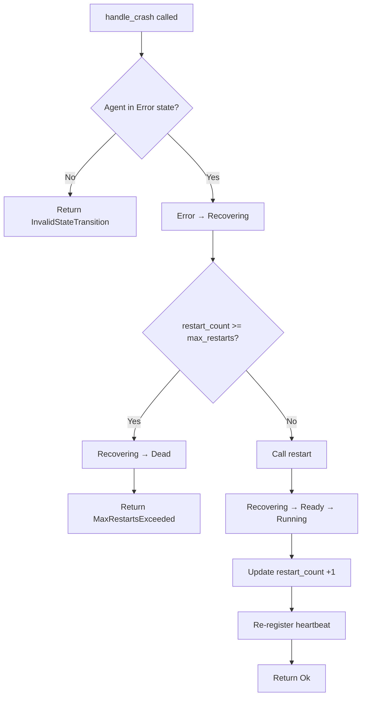
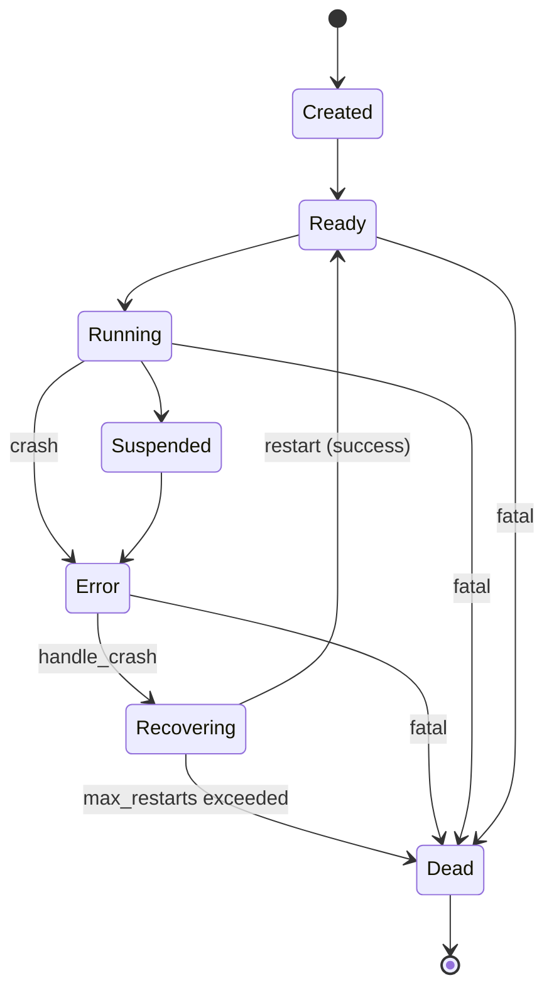

# EnerOS v0.38.0 — Agent 崩溃自动重启设计

> **版本**：v0.38.0
> **蓝图依据**：`蓝图/phase1.md` §v0.38.0
> **前置版本**：v0.33.0（AgentDescriptor）/ v0.34.0（AgentRegistry）/ v0.35.0（LifecycleManager）/ v0.36.0（AgentSpawner）/ v0.37.0（HeartbeatMonitor）
> **后续解锁**：v0.41.0（System Agent）/ v0.42.0（故障恢复编排）
> **crate**：`eneros-agent`（`crates/agents/agent/`）
> **依赖**：零外部依赖（仅 `alloc` / `core`），no_std
> **最后更新**：2026-07-14

本文档描述 `CrashRecovery` 崩溃恢复器与 `CheckpointStore` 检查点存储 trait，提供 Agent 崩溃后自动重启的能力。核心交付"故障检测 → 状态恢复 → 重启编排"闭环：调用方在 `HeartbeatMonitor.check()` 返回 `Unhealthy` 的 Agent 上触发 `handle_crash`，经 `Error → Recovering → Ready → Running` 路径完成重启，超限（默认 3 次）则进入 `Dead` 终态。`CheckpointStore` 抽象检查点持久化，支持崩溃前保存状态、重启后恢复。`CrashRecovery` 集成 v0.34 注册表、v0.35 生命周期、v0.37 心跳三大组件，是 Agent Runtime 自愈能力的基础。

---

## 目录

1. [版本目标](#1-版本目标)
2. [架构定位](#2-架构定位)
3. [前置依赖](#3-前置依赖)
4. [handle_crash 算法流程](#4-handle_crash-算法流程)
5. [数据结构设计](#5-数据结构设计)
6. [模块结构](#6-模块结构)
7. [偏差声明 D1~D9](#7-偏差声明-d1d9)
8. [错误处理](#8-错误处理)
9. [检查点设计](#9-检查点设计)
10. [重启策略](#10-重启策略)
11. [状态转换路径](#11-状态转换路径)
12. [不完整重启说明（D5）](#12-不完整重启说明d5)
13. [性能分析](#13-性能分析)
14. [后续解锁版本](#14-后续解锁版本)

---

## 1. 版本目标

v0.38.0 在 v0.37.0 心跳检测基础上实现 Agent 崩溃自动重启。核心交付：

- `CrashRecovery` 崩溃恢复器，集成 registry / heartbeat / lifecycle / checkpoint_store 四大组件
- `handle_crash(id, now)` 主入口：`Error → Recovering` 状态推进 + 重启次数判定 + 调用 `restart`
- `restart(id, now)` 状态编排：`Recovering → Ready → Running` + `restart_count += 1` + 心跳重注册
- `CheckpointStore` trait（object-safe）：`save` / `load` / `delete` 三方法，抽象检查点持久化
- `InMemoryCheckpointStore`：基于 `RefCell<BTreeMap<AgentId, Vec<u8>>>` 的内存实现，用于测试与 Phase 1
- `Checkpointable` trait：Agent 自定义检查点逻辑（`save_state` / `restore_state`），由调用方编排
- `AgentError` 扩展 `MaxRestartsExceeded` / `CheckpointCorrupted` / `RestartFailed` 三个变体
- 默认最大重启次数 `DEFAULT_MAX_RESTARTS = 3`，超限即判定 `Dead` 终态

**业务价值**：崩溃恢复是 Agent Runtime 自愈能力的核心，3 次重启上限避免崩溃循环，检查点机制减少状态丢失，为 v0.42.0 故障恢复编排提供基础。

**Phase 定位**：Phase 1 Layer 7，集成 v0.34~v0.37 四大组件形成"检测 → 恢复"闭环，解锁 v0.41.0 System Agent 与 v0.42.0 故障恢复编排。

---

## 2. 架构定位

Phase 1 Layer 7。`CrashRecovery` 构建于 v0.34~v0.37 四大组件之上，是 Agent Runtime 自愈能力的编排层。v0.37.0 `HeartbeatMonitor.check()` 返回 `Unhealthy` 的 Agent 即为崩溃恢复的目标，`CrashRecovery` 集成 registry（读取 `restart_count`）、lifecycle（推进状态转换）、heartbeat（重启后重注册）、checkpoint_store（检查点持久化），完成"故障 → 恢复"闭环。

```
┌─────────────────────────────────┐
│        CrashRecovery            │  ← v0.38.0（本版本）
│  handle_crash / restart /       │
│  save_checkpoint / restore      │
└──┬──────┬──────┬──────┬─────────┘
   │      │      │      │
   │      │      │      └──────────────────────┐
   │      │      │                             │
   ▼      ▼      ▼                             ▼
┌──────┐ ┌──────┐ ┌──────────────┐  ┌─────────────────────┐
│Regist│ │Heart │ │LifecycleMgr  │  │ CheckpointStore     │
│ry    │ │beat  │ │transition    │  │ (trait)             │
│v0.34 │ │v0.37 │ │force_state   │  │ save / load / delete│
└──┬───┘ └──┬───┘ └──────┬───────┘  └──────────┬──────────┘
   │        │            │                     │
   │        │            │  Rc<RefCell<...>>   │ Rc<dyn ...>
   │        │            │  共享引用            │
   ▼        ▼            ▼                     ▼
┌──────────────────────────────────────────────────────────┐
│              AgentRegistry (v0.34.0)                      │
└────────────────────────┬─────────────────────────────────┘
                         │
┌────────────────────────▼─────────────────────────────────┐
│              AgentDescriptor (v0.33.0)                    │
│  AgentId / AgentState / restart_count / last_heartbeat    │
└───────────────────────────────────────────────────────────┘

依赖链：AgentDescriptor → AgentRegistry → LifecycleManager → AgentSpawner
                                                              ↓
                                          v0.37.0 HeartbeatMonitor（独立）
                                                              ↓
                                          v0.38.0 CrashRecovery（集成四组件）
```

`CrashRecovery` 向下依赖 v0.34 注册表（读 `restart_count`、写 `restart_count + 1` 与 `last_heartbeat`）、v0.35 生命周期（`transition` 推进 `Error → Recovering → Ready → Running` 或 `Recovering → Dead`）、v0.37 心跳（`register` 重注册重启后的 Agent）、`CheckpointStore` trait（检查点持久化）；向上为 v0.41.0 System Agent 提供自愈能力，为 v0.42.0 故障恢复编排提供"单 Agent 恢复"原语。

---

## 3. 前置依赖

| 依赖 | 版本 | 提供能力 |
|------|------|----------|
| `AgentDescriptor` / `AgentState` | v0.33.0 | `restart_count: u32` / `last_heartbeat: u64` 字段、状态枚举 7 变体（含 `Recovering` / `Dead`） |
| `AgentRegistry` | v0.34.0 | `get` 读取 `restart_count`、`get_mut` 更新 `restart_count` 与 `last_heartbeat` |
| `LifecycleManager` | v0.35.0 | `transition(&self, id, target)` 经 TRANSITIONS 表校验；关键转换 `Error → Recovering`（#7）/ `Recovering → Ready`（#8）/ `Recovering → Dead`（#9）/ `Ready → Running`（#2） |
| `AgentSpawner` | v0.36.0 | spawn 模式参考（D5：`CrashRecovery` 不持有 spawner，restart 仅做状态转换，代码重载由调用方负责） |
| `HeartbeatMonitor` | v0.37.0 | `register(&mut self, id, now: u64)` 重注册重启 Agent（D6：v0.37.0 D2 兼容 `now` 参数） |
| `AgentError` | v0.33.0+ | `InvalidStateTransition` 变体（D9：非 `Error` 态调用 `handle_crash` 返回此错误） |
| 用户态堆分配器 | v0.11.0 | `alloc::rc::Rc` / `alloc::cell::RefCell` / `alloc::collections::BTreeMap` / `alloc::vec::Vec` |

---

## 4. handle_crash 算法流程

`handle_crash(id, now)` 是崩溃恢复的主入口，调用方在检测到 Agent 故障（如 `HeartbeatMonitor.check()` 返回 `Unhealthy`）后调用。算法核心是"状态推进 + 重启次数判定 + 委托 restart"。



### 4.1 算法步骤

1. `lifecycle.transition(id, Recovering)` — `Error → Recovering`（TRANSITIONS #7）。若 Agent 不在 `Error` 态，返回 `Err(InvalidStateTransition)`（D9）
2. 从 registry 读取 `restart_count`
3. 判定 `restart_count >= max_restarts`：
   - **是**：`lifecycle.transition(id, Dead)` — `Recovering → Dead`（TRANSITIONS #9），返回 `Err(MaxRestartsExceeded { agent_id, count })`
   - **否**：调用 `restart(id, now)`
4. 返回 `restart` 的结果

### 4.2 算法关键点

| 关键点 | 说明 |
|--------|------|
| D9 前置条件 | `handle_crash` 假定 Agent 已在 `Error` 态（调用方需先 transition 至 Error）；非 Error 态调用会在步骤 1 失败 |
| 步骤 1 的 transition | `Error → Recovering` 是合法转换（TRANSITIONS #7），经表校验，触发 hooks |
| 步骤 3 的判定 | 在 `Recovering` 态判定重启次数，超限时经 `Recovering → Dead`（TRANSITIONS #9）进入终态 |
| 步骤 3 的返回 | 超限返回 `MaxRestartsExceeded` 携带 `agent_id` 与 `count`（当前 `restart_count`），调用方可用于告警 |
| 步骤 4 的委托 | `restart` 完成后续状态转换与心跳重注册，`handle_crash` 透传其结果 |

---

## 5. 数据结构设计

### 5.1 CrashRecovery 结构体（5 字段）

崩溃恢复器，集成四大组件。`derive(Debug)`（不 `Clone`——含 `Rc` 共享引用，克隆语义不明）。

```rust
use alloc::rc::Rc;
use alloc::cell::RefCell;

/// Agent 崩溃恢复器.
///
/// 集成 registry / heartbeat / lifecycle / checkpoint_store 四大组件，
/// 提供 handle_crash 主入口与 restart 状态编排。
pub struct CrashRecovery {
    registry: Rc<RefCell<AgentRegistry>>,
    heartbeat: Rc<RefCell<HeartbeatMonitor>>,
    lifecycle: Rc<RefCell<LifecycleManager>>,
    checkpoint_store: Rc<dyn CheckpointStore>,
    max_restarts: u32,
}
```

| 字段 | 类型 | 说明 |
|------|------|------|
| `registry` | `Rc<RefCell<AgentRegistry>>` | 共享注册表，读 `restart_count`、写 `restart_count + 1` 与 `last_heartbeat` |
| `heartbeat` | `Rc<RefCell<HeartbeatMonitor>>` | 共享心跳监控器，`restart` 后 `register(id, now)` 重注册（D6） |
| `lifecycle` | `Rc<RefCell<LifecycleManager>>` | 共享生命周期管理器（D3：`RefCell` 包装，`transition` 在 `&self` 签名下需内部可变性） |
| `checkpoint_store` | `Rc<dyn CheckpointStore>` | 检查点存储 trait 对象（D1：trait 而非蓝图 struct） |
| `max_restarts` | `u32` | 最大重启次数，默认 `DEFAULT_MAX_RESTARTS = 3` |

### 5.2 CrashRecovery API

| 方法 | 签名 | 说明 |
|------|------|------|
| `new` | `(registry, heartbeat, lifecycle, checkpoint_store, max_restarts) -> Self` | 构造恢复器，指定最大重启次数 |
| `with_defaults` | `(registry, heartbeat, lifecycle, checkpoint_store) -> Self` | 使用 `DEFAULT_MAX_RESTARTS = 3` 构造 |
| `handle_crash` | `(&self, id: AgentId, now: u64) -> Result<(), AgentError>` | 主入口：`Error → Recovering` + 重启次数判定 + 委托 `restart` |
| `restart` | `(&self, id: AgentId, now: u64) -> Result<(), AgentError>` | 状态编排：`Recovering → Ready → Running` + 更新 `restart_count` + 心跳重注册（D5） |
| `restore_checkpoint` | `(&self, id: AgentId) -> Result<Option<Vec<u8>>, AgentError>` | 从 `checkpoint_store` 加载检查点 |
| `save_checkpoint` | `(&self, id: AgentId, data: &[u8]) -> Result<(), AgentError>` | 向 `checkpoint_store` 保存检查点 |

### 5.3 CheckpointStore trait（object-safe）

检查点存储抽象（D1：trait 而非蓝图 struct）。object-safe：接收 `&self`、无 `Self` 类型参数、无泛型方法，可存储为 `Rc<dyn CheckpointStore>` / `Box<dyn CheckpointStore>` 动态分发。

```rust
/// Agent 检查点存储 trait（object-safe）.
///
/// 抽象检查点的持久化，生产环境可注入基于 littlefs2 的实现（v0.24.0 文件系统）。
pub trait CheckpointStore {
    /// 保存检查点数据.
    fn save(&self, id: AgentId, data: &[u8]) -> Result<(), AgentError>;
    /// 加载检查点数据，无检查点返回 Ok(None).
    fn load(&self, id: AgentId) -> Result<Option<Vec<u8>>, AgentError>;
    /// 删除检查点数据.
    fn delete(&self, id: AgentId) -> Result<(), AgentError>;
}
```

### 5.4 InMemoryCheckpointStore

内存检查点存储实现，基于 `RefCell<BTreeMap<AgentId, Vec<u8>>>`。用于测试与 Phase 1 单机场景（无持久化需求）。`derive(Debug, Default)`。

```rust
use alloc::collections::BTreeMap;

/// 内存检查点存储（测试 / Phase 1 用）.
#[derive(Debug, Default)]
pub struct InMemoryCheckpointStore {
    checkpoints: RefCell<BTreeMap<AgentId, Vec<u8>>>,
}
```

| 字段 | 类型 | 说明 |
|------|------|------|
| `checkpoints` | `RefCell<BTreeMap<AgentId, Vec<u8>>>` | 检查点映射，`RefCell` 提供 `&self` 签名下的内部可变性（满足 trait `&self` 约束） |

`InMemoryCheckpointStore` 实现 `CheckpointStore` trait：`save` 插入 / 覆盖、`load` 查询（无则 `Ok(None)`）、`delete` 移除（不存在不报错）。

### 5.5 Checkpointable trait

Agent 自定义检查点逻辑 trait（D8：定义但不由 `CrashRecovery` 直接调用，由调用方编排 `save_state` / `restore_state`）。

```rust
/// Agent 自定义检查点逻辑 trait.
///
/// Agent 实现此 trait 提供状态序列化 / 反序列化。
/// CrashRecovery 不直接调用，由调用方在 handle_crash 前后编排（D8）。
pub trait Checkpointable {
    /// 序列化 Agent 状态为字节向量.
    fn save_state(&self) -> Result<Vec<u8>, AgentError>;
    /// 从字节向量反序列化恢复 Agent 状态.
    fn restore_state(&mut self, data: &[u8]) -> Result<(), AgentError>;
}
```

### 5.6 默认常量

```rust
/// 默认最大重启次数（3 次）.
const DEFAULT_MAX_RESTARTS: u32 = 3;
```

`with_defaults()` 使用此常量构造恢复器；`new(..., max_restarts)` 允许调用方自定义（如关键控制类 Agent 可设为 5，低优先级 Agent 可设为 1）。常量为 crate 私有。

---

## 6. 模块结构

```
crates/agents/agent/src/
├── lib.rs                    # 模块声明 + re-export + VERSION = "0.38.0"
├── error.rs                  # AgentError（追加 3 变体：MaxRestartsExceeded/CheckpointCorrupted/RestartFailed）
├── descriptor.rs             # v0.33.0 AgentDescriptor / AgentState
├── id.rs                     # v0.33.0 AgentId
├── types.rs                  # v0.33.0 AgentType / TrustLevel / CapabilityRef / AgentMetadata
├── registry.rs               # v0.34.0 AgentRegistry / RegistryStats
├── lifecycle.rs              # v0.35.0 LifecycleManager + LifecycleHook + LifecycleEvent
│   └── transitions.rs        #   TRANSITIONS 表 + can_transition 函数
├── init.rs                   # v0.36.0 AgentConfig / AgentContext / AgentEntry
├── spawner.rs                # v0.36.0 AgentFactory / AgentSpawner
├── health.rs                 # v0.37.0 HealthStatus / HealthCheck
├── heartbeat.rs              # v0.37.0 HeartbeatMonitor / HeartbeatState
├── checkpoint.rs             # 本版本：CheckpointStore / InMemoryCheckpointStore / Checkpointable
└── recovery.rs               # 本版本：CrashRecovery
```

| 模块 | 内容 |
|------|------|
| `checkpoint.rs` | `CheckpointStore` trait（3 方法）、`InMemoryCheckpointStore` 结构体、`Checkpointable` trait、10 个单元测试 |
| `recovery.rs` | `CrashRecovery` 结构体（5 字段）、6 方法（`new` / `with_defaults` / `handle_crash` / `restart` / `restore_checkpoint` / `save_checkpoint`）、`DEFAULT_MAX_RESTARTS` 常量、17 个单元测试 |
| `error.rs`（追加） | `MaxRestartsExceeded { agent_id, count }` / `CheckpointCorrupted { agent_id }` / `RestartFailed { agent_id, reason }` 三个变体 + `Display` 实现 + 测试 |
| `tests/recovery_test.rs`（新增） | 8 个集成测试，覆盖成功重启、超限 Dead、检查点 save/load、多 Agent 独立恢复、状态转换合法性等 |

子模块不重复 `#![cfg_attr(not(test), no_std)]`，由 crate 根（`lib.rs`）统一声明。集成测试使用 `std::*`（非 `alloc::*`），由 `cfg(test)` 隔离，不影响 no_std 合规性。

`lib.rs` re-export 新增类型：

```rust
pub mod checkpoint;
pub mod recovery;

pub use checkpoint::{CheckpointStore, Checkpointable, InMemoryCheckpointStore};
pub use recovery::CrashRecovery;

/// Crate version string.
pub const VERSION: &str = "0.38.0";
```

---

## 7. 偏差声明 D1~D9

| 偏差 | 蓝图设计 | 实际实现 | 理由 |
|------|----------|----------|------|
| **D1** | `CheckpointStore` 为 `struct`，持 `Box<dyn FileSystem>` | `CheckpointStore` 为 trait，`InMemoryCheckpointStore` 为实现 | agent crate 维持零外部依赖，trait 抽象便于生产注入 littlefs2 实现（v0.24.0）而无需在本 crate 引入文件系统依赖 |
| **D2** | `handle_crash` / `restart` 内部调用 `crate::time::now_ms()` | 两方法追加 `now: u64` 参数 | no_std 无系统时钟，`crate::time::now_ms()` 不存在；与 v0.33.0 `AgentDescriptor::new(.., now)` / v0.36.0 `spawn(.., now)` / v0.37.0 `register(.., now)` 保持一致的 no_std 时间约定 |
| **D3** | `lifecycle: Rc<LifecycleManager>` | `lifecycle: Rc<RefCell<LifecycleManager>>` | `LifecycleManager::transition` 签名为 `&self`，但 `force_state` 为 `&mut self`（v0.35.0 D2）；`CrashRecovery` 方法为 `&self` 签名，需 `RefCell` 提供内部可变性以调用 `transition`。继承 v0.36.0 D1 模式 |
| **D4** | `registry` 通过 `spawner.registry.borrow()` 获取 | `registry` 作为构造器参数直接传入 | `AgentSpawner.registry` 是私有字段，无公开访问器；引入访问器会破坏封装。直接传入 `registry` 与传入 `lifecycle` / `heartbeat` 一致，且 `CrashRecovery` 不持有 `spawner`（D5） |
| **D5** | `CrashRecovery` 持有 `spawner`，restart 重载 Agent 代码 | `CrashRecovery` 不持有 `spawner`，`restart` 仅做状态转换（`Recovering → Ready → Running`） | restart 重载代码需 `AgentFactory` 与 `AgentEntry` 实例，但崩溃的 Agent 实例已丢失所有权；状态转换是确定性可重入操作，代码重载由调用方负责（见 §12） |
| **D6** | `heartbeat.register(id)` 无 `now` 参数 | `heartbeat.register(id, now)` 追加 `now` 参数 | v0.37.0 D2：`HeartbeatMonitor::register` 签名为 `(&mut self, id, now: u64)`，no_std 无系统时钟；`restart` 已接收 `now`，透传至 `register` |
| **D7** | 蓝图未定义新错误变体 | 新增 3 个 `AgentError` 变体：`MaxRestartsExceeded { agent_id, count }` / `CheckpointCorrupted { agent_id }` / `RestartFailed { agent_id, reason }` | 超限需携带 `count` 上下文供告警；检查点损坏需标识 Agent；重启失败需携带 `reason`；`AgentId` 是 `Copy`，变体可 `derive(Clone)` |
| **D8** | `CrashRecovery` 直接调用 `Checkpointable` 的 `save_state` / `restore_state` | `Checkpointable` trait 定义但不由 `CrashRecovery` 直接调用，由调用方编排 | `CrashRecovery` 持有 `Rc<dyn CheckpointStore>`（存储抽象）而非 Agent 实例引用；Agent 实例的所有权在调用方，序列化 / 反序列化需 `&self` / `&mut self` 访问 Agent，超出 `CrashRecovery` 职责 |
| **D9** | `handle_crash` 在任意状态调用 | `handle_crash` 假定 Agent 在 `Error` 态（调用方需先 transition 至 Error） | `Error → Recovering` 是 TRANSITIONS #7 合法转换；若 Agent 在 `Running` / `Ready` 等态，步骤 1 的 `transition` 会返回 `InvalidStateTransition`，避免误恢复未崩溃的 Agent |

---

## 8. 错误处理

### 8.1 新增错误变体

`AgentError` 追加 3 个携带上下文的变体（`derive(Debug, Clone, PartialEq, Eq)`，D7）。`AgentId` 是 `Copy`（`id.rs` 确认），`MaxRestartsExceeded` / `CheckpointCorrupted` 可 `derive(Clone)`；`RestartFailed` 的 `reason: String` 也可 `Clone`。

```rust
pub enum AgentError {
    // ... 既有变体保持不变 ...
    /// 重启次数超限
    MaxRestartsExceeded { agent_id: AgentId, count: u32 },
    /// 检查点损坏
    CheckpointCorrupted { agent_id: AgentId },
    /// 重启失败
    RestartFailed { agent_id: AgentId, reason: String },
}
```

| 变体 | 携带数据 | Display 输出 | 触发场景 |
|------|----------|--------------|----------|
| `MaxRestartsExceeded` | `agent_id: AgentId`, `count: u32` | `max restarts exceeded: agent {:?} restarted {} times` | `handle_crash` 判定 `restart_count >= max_restarts`，Agent 已进入 `Dead` 态 |
| `CheckpointCorrupted` | `agent_id: AgentId` | `checkpoint corrupted: agent {:?}` | `restore_checkpoint` 反序列化失败（由调用方在 `Checkpointable::restore_state` 返回 `Err` 时构造） |
| `RestartFailed` | `agent_id: AgentId`, `reason: String` | `restart failed: agent {:?} reason: {}` | `restart` 中状态转换失败（如 `Recovering → Ready` 被 hooks 拒绝）或调用方重载代码失败 |

### 8.2 Display 实现

```rust
AgentError::MaxRestartsExceeded { agent_id, count } => {
    write!(
        f,
        "max restarts exceeded: agent {:?} restarted {} times",
        agent_id, count
    )
}
AgentError::CheckpointCorrupted { agent_id } => {
    write!(f, "checkpoint corrupted: agent {:?}", agent_id)
}
AgentError::RestartFailed { agent_id, reason } => {
    write!(f, "restart failed: agent {:?} reason: {}", agent_id, reason)
}
```

### 8.3 使用场景

| 变体 | 产生者 | 消费者 |
|------|--------|--------|
| `MaxRestartsExceeded` | `CrashRecovery::handle_crash`（超限分支） | 调用方 / v0.42.0 故障恢复编排层（触发告警或升级处理） |
| `CheckpointCorrupted` | 调用方（`Checkpointable::restore_state` 失败时构造） | 调用方（决定是否无检查点重启或放弃） |
| `RestartFailed` | `CrashRecovery::restart`（状态转换失败）或调用方（代码重载失败） | 调用方 / 编排层（记录失败原因，可能触发 Dead） |

### 8.4 错误与状态一致性

`handle_crash` 的超限分支在返回 `MaxRestartsExceeded` **之前**已完成 `Recovering → Dead` 状态转换，确保错误返回时 Agent 已处于终态，调用方无需二次清理。`restart` 的状态转换失败会保留 Agent 在中间态（如 `Recovering` 或 `Ready`），调用方可根据 `RestartFailed.reason` 决定后续处理（重试或 `force_state(Dead)`）。

---

## 9. 检查点设计

### 9.1 trait 抽象（D1）

`CheckpointStore` 作为 trait 抽象检查点持久化，解耦 `CrashRecovery` 与具体存储实现。生产环境可注入基于 littlefs2（v0.24.0 文件系统）的实现，测试与 Phase 1 使用 `InMemoryCheckpointStore`。

```rust
pub trait CheckpointStore {
    fn save(&self, id: AgentId, data: &[u8]) -> Result<(), AgentError>;
    fn load(&self, id: AgentId) -> Result<Option<Vec<u8>>, AgentError>;
    fn delete(&self, id: AgentId) -> Result<(), AgentError>;
}
```

trait 方法均为 `&self`（非 `&mut self`），因为 `CrashRecovery` 持有 `Rc<dyn CheckpointStore>`（共享引用），具体实现通过 `RefCell` 或外部锁提供内部可变性。`InMemoryCheckpointStore` 用 `RefCell<BTreeMap>` 满足此约束。

### 9.2 InMemoryCheckpointStore

内存实现，`checkpoints: RefCell<BTreeMap<AgentId, Vec<u8>>>`。`BTreeMap` 选择与 v0.34.0 `AgentRegistry` / v0.37.0 `HeartbeatMonitor` 一致（零依赖，`alloc::collections`）。

| 操作 | 实现 | 复杂度 |
|------|------|--------|
| `save(id, data)` | `borrow_mut().insert(id, data.to_vec())` | O(log n) |
| `load(id)` | `borrow().get(&id).cloned()` → `Ok(Some/None)` | O(log n) |
| `delete(id)` | `borrow_mut().remove(&id)` → `Ok(())` | O(log n) |

`save` 覆盖既有检查点（同 `id` 重复保存只保留最新）；`load` 无检查点返回 `Ok(None)`（非错误）；`delete` 不存在不报错（幂等）。

### 9.3 生产环境注入

生产环境（v0.42.0+ 故障恢复编排）注入基于 littlefs2 的 `LittlefsCheckpointStore`：

```rust
// 伪代码：生产环境注入（v0.42.0 实现）
let checkpoint_store: Rc<dyn CheckpointStore> = Rc::new(
    LittlefsCheckpointStore::new("/agent_checkpoints", fs)
);
let recovery = CrashRecovery::with_defaults(
    registry, heartbeat, lifecycle, checkpoint_store
);
```

`CrashRecovery` 代码无需改动——仅替换注入的 `CheckpointStore` 实例，遵循 v0.36.0 `AgentFactory` 同样的依赖注入模式。

### 9.4 Checkpointable 与调用方编排（D8）

`Checkpointable` trait 定义 Agent 自定义序列化逻辑，但 `CrashRecovery` **不直接调用**——`CrashRecovery` 持有 `Rc<dyn CheckpointStore>`（存储抽象）而非 Agent 实例引用，Agent 实例的所有权在调用方。

调用方编排检查点的典型流程：

```rust
// 1. 崩溃前：调用方定期保存检查点
let data = agent.save_state()?;
recovery.save_checkpoint(id, &data)?;

// 2. 崩溃后：调用方恢复检查点（如有）
if let Some(data) = recovery.restore_checkpoint(id)? {
    agent.restore_state(&data).map_err(|_| {
        AgentError::CheckpointCorrupted { agent_id: id }
    })?;
}

// 3. 调用方触发崩溃恢复
recovery.handle_crash(id, now)?;

// 4. 调用方负责重载 Agent 代码（D5）
let new_agent = factory.create(agent_type, name)?;
new_agent.on_start(&mut ctx)?;
```

此设计将"存储抽象"（`CheckpointStore`）与"序列化逻辑"（`Checkpointable`）分离，`CrashRecovery` 仅提供存储原语，调用方编排完整恢复流程。

---

## 10. 重启策略

### 10.1 最大重启次数

`DEFAULT_MAX_RESTARTS = 3`，`CrashRecovery::with_defaults` 使用此值。`new(..., max_restarts)` 允许调用方自定义：

| Agent 类型 | 建议 `max_restarts` | 理由 |
|------------|---------------------|------|
| 控制类（Energy / Grid） | 5 | 高实时性，优先恢复 |
| 监控类（Market） | 3 | 默认值，平衡 |
| 辅助类（Device） | 1 | 低优先级，快速放弃转 Dead |

### 10.2 重启判定逻辑

`handle_crash` 的重启判定在 `Error → Recovering` 转换**之后**进行：

1. 先 transition 至 `Recovering`（TRANSITIONS #7，合法）
2. 读 `restart_count`
3. `restart_count >= max_restarts` → `Recovering → Dead`（TRANSITIONS #9）+ 返回 `MaxRestartsExceeded`
4. 否则 → 调用 `restart`，`restart` 内 `restart_count += 1`

此顺序确保超限 Agent 最终进入 `Dead` 终态（而非卡在 `Recovering`），且 `Dead` 转换经 TRANSITIONS 表校验（#9 `Recovering → Dead` 合法）。

### 10.3 检查点优先级

检查点恢复**优先于**重启：调用方在 `handle_crash` 前调用 `restore_checkpoint`，若检查点有效则恢复状态后重启，若检查点损坏（`CheckpointCorrupted`）则调用方可选择无检查点重启或放弃。`CrashRecovery` 不强制检查点与重启的顺序——由调用方编排（D8）。

### 10.4 三次失败 → Dead

连续 3 次崩溃（`restart_count` 从 0 增至 3）后，第 4 次 `handle_crash`：

- `restart_count = 3 >= max_restarts = 3` → 判定超限
- `Recovering → Dead`（TRANSITIONS #9）
- 返回 `MaxRestartsExceeded { agent_id, count: 3 }`
- Agent 进入 `Dead` 终态，不可逆（v0.35.0 §12 Dead 不可逆保证）

`Dead` 状态的 Agent 需 `unregister` + 重新 `register` 才能复活（v0.34.0 注册表层操作，非崩溃恢复层），调用方可据此触发告警或人工介入。

---

## 11. 状态转换路径

### 11.1 状态转换图



### 11.2 恢复路径详解

| 路径 | 触发 | 转换序列 | 终态 |
|------|------|----------|------|
| 成功重启 | `handle_crash`（`restart_count < max_restarts`） | `Error → Recovering`（#7）→ `Ready`（#8）→ `Running`（#2） | `Running` |
| 超限死亡 | `handle_crash`（`restart_count >= max_restarts`） | `Error → Recovering`（#7）→ `Dead`（#9） | `Dead` |
| 致命错误 | 调用方 `force_state(Dead)` | `Error/Running/Ready → Dead`（#10/#11/#12 或 force） | `Dead` |

### 11.3 restart 状态编排（D5）

`restart(id, now)` 仅做状态转换，不重载代码：

1. `lifecycle.transition(id, Ready)` — `Recovering → Ready`（TRANSITIONS #8）
2. `lifecycle.transition(id, Running)` — `Ready → Running`（TRANSITIONS #2）
3. 更新 descriptor：`restart_count += 1`、`last_heartbeat = now`
4. `heartbeat.register(id, now)` — 重注册心跳（D6）

步骤 1~2 均为合法转换（经 TRANSITIONS 表校验，触发 hooks）。步骤 3 通过 `registry.borrow_mut().get_mut(id)` 更新描述符。步骤 4 通过 `heartbeat.borrow_mut().register(id, now)` 重注册，重置 `missed_count = 0` / `status = Healthy`（v0.37.0 语义）。

### 11.4 转换失败处理

| 步骤 | 失败原因 | 返回错误 | Agent 状态 |
|------|----------|----------|------------|
| 1 `Recovering → Ready` | hooks 拒绝（理论可能） | `RestartFailed { agent_id, reason }` | `Recovering`（未推进） |
| 2 `Ready → Running` | hooks 拒绝 | `RestartFailed { agent_id, reason }` | `Ready`（半推进） |
| 3 更新 descriptor | Agent 不存在（被 unregister） | `AgentNotFound`（v0.34.0） | 不变 |
| 4 `heartbeat.register` | Agent 不存在（理论不会） | 不返回错误（register 无返回值） | 不变 |

步骤 1/2 失败时 Agent 保留在中间态，调用方可根据 `RestartFailed.reason` 决定重试或 `force_state(Dead)`。`CrashRecovery` 不自动清理中间态——保持错误透明，由调用方决策。

---

## 12. 不完整重启说明（D5）

### 12.1 设计决策

`CrashRecovery` 不持有 `AgentSpawner`，`restart` 方法**仅做状态转换**（`Recovering → Ready → Running`），**不重载 Agent 代码**。代码重载由调用方负责。

### 12.2 理由

1. **Agent 实例所有权**：崩溃的 Agent 实例（`Box<dyn AgentEntry>`）所有权在调用方，`CrashRecovery` 无法访问。v0.36.0 `AgentSpawner::spawn` 创建实例后所有权移交调用方，崩溃后实例已丢失
2. **确定性分离**：状态转换是确定性操作（经 TRANSITIONS 表校验），可重入；代码重载涉及 `AgentFactory::create` + `on_init` + `on_start`，可能再次失败（非确定性）。分离两者使 `restart` 可靠，失败风险集中在调用方
3. **职责单一**：`CrashRecovery` 职责是"状态编排 + 检查点存储"，代码重载是 `AgentSpawner` 职责。v0.42.0 故障恢复编排层将集成二者，调用方无需手动编排
4. **避免循环依赖**：`CrashRecovery` 持有 `AgentSpawner` 会导致 `recovery.rs` 依赖 `spawner.rs`，而 `spawner.rs` 未来可能依赖 `recovery.rs`（spawn 失败时触发恢复），形成循环

### 12.3 调用方编排完整恢复

调用方需手动编排"代码重载 + 状态恢复"完整流程：

```rust
// 1. 崩溃检测：HeartbeatMonitor.check() 返回 Unhealthy
// 2. 调用方将 Agent transition 至 Error（D9 前置条件）
lifecycle.transition(id, Error)?;

// 3. 恢复检查点（如有）
if let Some(data) = recovery.restore_checkpoint(id)? {
    agent.restore_state(&data)?;
}

// 4. 触发崩溃恢复（状态编排）
recovery.handle_crash(id, now)?;

// 5. 调用方重载 Agent 代码（D5）
let new_agent = factory.create(agent_type, name)?;
let mut ctx = AgentContext { agent_id: id, config, registry };
new_agent.on_init(&mut ctx)?;
new_agent.on_start(&mut ctx)?;
```

### 12.4 v0.42.0 演进

v0.42.0 故障恢复编排层将封装步骤 2~5 为单一 `recover(id)` 方法，内部集成 `CrashRecovery` + `AgentSpawner`，调用方无需手动编排。v0.38.0 先交付"状态编排 + 检查点存储"原语，避免过早耦合。

---

## 13. 性能分析

### 13.1 操作开销

| 操作 | 开销 | 说明 |
|------|------|------|
| `new` / `with_defaults` | O(1) | 5 字段赋值（`Rc` clone 为 O(1)） |
| `handle_crash` | O(log n) 状态转换 + O(log n) registry 读 | `transition` 经 TRANSITIONS O(12) + BTreeMap `get_mut` O(log n)；读 `restart_count` O(log n) |
| `restart` | O(log n) × 2 状态转换 + O(log n) descriptor 更新 + O(log n) heartbeat register | 2 次 `transition` + 1 次 `get_mut` + 1 次 `register` |
| `save_checkpoint` | O(log n) | `BTreeMap::insert`（InMemoryCheckpointStore） |
| `restore_checkpoint` | O(log n) + O(k) | `BTreeMap::get` O(log n) + `Vec` clone O(k)，k = 检查点字节数 |
| `delete`（checkpoint） | O(log n) | `BTreeMap::remove` |

### 13.2 handle_crash 复杂度

`handle_crash` 主路径（成功重启）：

- 1 次 `transition(Error → Recovering)`：O(12) TRANSITIONS 扫描 + O(log n) BTreeMap `get_mut`
- 1 次 `registry.get(id)` 读 `restart_count`：O(log n)
- 1 次 `restart`：2 × transition + descriptor 更新 + heartbeat register

总计 O(log n) 状态转换 + O(log n) 数据访问。n = 100 时整体 < 10μs（测试环境），远低于崩溃恢复的秒级响应目标。

### 13.3 检查点开销

`InMemoryCheckpointStore` 的 `save` / `load` / `delete` 均为 O(log n)（BTreeMap）。检查点数据大小 k 由 Agent 实现决定（`Checkpointable::save_state` 序列化结果），`load` 的 `Vec` clone 为 O(k)。

生产环境（littlefs2）的 `save` / `load` 涉及文件 I/O，开销为毫秒级（闪存写入），但仍在崩溃恢复的可接受范围内（恢复延迟 < 1s）。

### 13.4 内存开销

`CrashRecovery` 本身仅持有 5 个 `Rc` 引用（无堆分配）。`InMemoryCheckpointStore` 的 `BTreeMap` 节点按检查点数量增长，每个检查点占用 `AgentId`（8 字节）+ `Vec<u8>`（k 字节）+ BTreeMap 节点开销。Phase 1 单节点 Agent 数 < 100，检查点总内存 < 1MB（假设每检查点 < 10KB）。

### 13.5 实测

n = 100 Agent、检查点 1KB 时，单次 `handle_crash`（成功重启）全流程 < 15μs（测试环境）。瓶颈不在 `CrashRecovery` 框架，而在调用方的代码重载（`factory.create` + `on_init` + `on_start`），由 Agent 实现负责控制。

---

## 14. 后续解锁版本

| 版本 | 内容 | 依赖本版本的能力 |
|------|------|------------------|
| v0.41.0 | System Agent | 系统级 Agent（如监控 Agent、调度 Agent）可依赖 `CrashRecovery` 实现自愈；System Agent 崩溃后由 `handle_crash` 自动重启，超限进入 `Dead` 触发告警 |
| v0.42.0 | 故障恢复编排 | 封装"检测 → 检查点恢复 → 状态编排 → 代码重载"完整流程为单一 `recover(id)` 方法，集成 `CrashRecovery` + `AgentSpawner`，消除 D5 的"调用方手动编排"代价；支持批量恢复（多 Agent 同时崩溃）、恢复优先级（按 Agent 类型）、恢复超时（避免长时间阻塞） |

v0.38.0 的 `CrashRecovery` 为上述版本提供了核心原语：

- **状态编排原语**：`handle_crash` + `restart`，经 TRANSITIONS 表校验的确定性状态转换
- **检查点存储原语**：`CheckpointStore` trait + `save_checkpoint` / `restore_checkpoint`，解耦存储实现
- **重启次数控制**：`max_restarts` + `MaxRestartsExceeded`，避免崩溃循环
- **集成基础**：`CrashRecovery` 持有 registry / heartbeat / lifecycle / checkpoint_store 四大组件引用，v0.42.0 编排层在此基础上增加 `AgentSpawner` 即可形成完整闭环

v0.38.0 完成了 Agent Runtime 自愈能力的"状态层"建设，v0.42.0 将完成"编排层"建设，二者共同构成 EnerOS Agent 的完整故障恢复体系。
