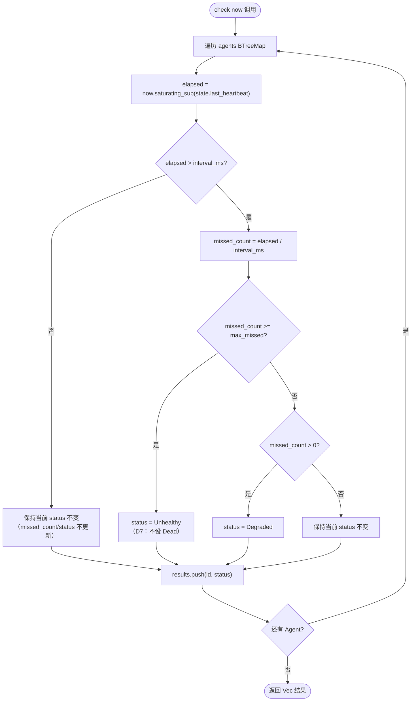

# EnerOS v0.37.0 — Agent 心跳与健康检查设计

> **版本**：v0.37.0
> **蓝图依据**：`蓝图/phase1.md` §v0.37.0（行 5954~6164）
> **前置版本**：v0.33.0（AgentDescriptor）/ v0.34.0（AgentRegistry）/ v0.35.0（LifecycleManager）/ v0.36.0（AgentSpawner）
> **后续解锁**：v0.38.0（崩溃恢复）
> **crate**：`eneros-agent`（`crates/agents/agent/`）
> **依赖**：零外部依赖（仅 `alloc` / `core`），no_std
> **最后更新**：2026-07-14

本文档描述 `HeartbeatMonitor` 心跳监控器与 `HealthCheck` 健康检查 trait，提供 Agent 存活检测能力。核心交付 1s 默认心跳周期、3 次超时即判定故障的监控协议，以及 `Healthy → Degraded → Unhealthy` 的健康状态演进模型。`HeartbeatMonitor` 作为独立监控器运行（不引用 `AgentRegistry` / `LifecycleManager`），与注册表/生命周期的集成推迟至 v0.38.0 崩溃恢复版本。`Dead` 终态同样由 v0.38.0 设置，v0.37.0 的 `check()` 仅设置 `Unhealthy`。本版本是 v0.38.0 崩溃恢复的故障检测基础。

---

## 目录

1. [版本目标](#1-版本目标)
2. [架构定位](#2-架构定位)
3. [前置依赖](#3-前置依赖)
4. [数据结构设计](#4-数据结构设计)
5. [check 算法流程](#5-check-算法流程)
6. [模块结构](#6-模块结构)
7. [心跳协议设计](#7-心跳协议设计)
8. [独立监控器设计（D6）](#8-独立监控器设计d6)
9. [Dead 状态归属（D7）](#9-dead-状态归属d7)
10. [时钟回拨处理](#10-时钟回拨处理)
11. [错误处理](#11-错误处理)
12. [偏差声明](#12-偏差声明)
13. [性能分析](#13-性能分析)
14. [后续解锁版本](#14-后续解锁版本)

---

## 1. 版本目标

v0.37.0 在 v0.36.0 Agent 启动器基础上实现 Agent 心跳监控与健康检查。核心交付：

- `HeartbeatMonitor` 心跳监控器，1s 默认心跳周期、3 次超时即判定故障（`DEFAULT_INTERVAL_MS = 1000` / `DEFAULT_MAX_MISSED = 3`）
- `HeartbeatState` 心跳状态（4 字段：`last_heartbeat` / `missed_count` / `status` / `interval_ms`）
- `HealthStatus` 健康状态枚举（4 级：`Healthy` / `Degraded` / `Unhealthy` / `Dead`）
- `HealthCheck` 健康检查 trait（object-safe），支持 Agent 自定义健康检查
- `AgentError` 扩展 `HeartbeatTimeout { agent_id, missed }` / `AgentUnhealthy { agent_id }` 两个变体
- per-Agent 心跳间隔可配置（`set_interval`），支持异构 Agent 不同周期
- `Healthy → Degraded`（1+ 次缺失）→ `Unhealthy`（达 `max_missed` 阈值）状态演进，`Dead` 留待 v0.38.0

**业务价值**：心跳是检测 Agent 是否存活的核心机制，3 秒无心跳即判定故障，为 v0.38.0 崩溃恢复提供故障检测基础。

**Phase 定位**：Phase 1 Layer 7，解锁 v0.38.0 崩溃恢复，出口关联 v0.58.0 看门狗降级流程。

---

## 2. 架构定位

Phase 1 Layer 7。`HeartbeatMonitor` 构建于 v0.36.0 `AgentSpawner` 之上层概念，但**不持有** spawner / registry / lifecycle 的引用（D6 偏差：独立监控器）。v0.36.0 spawn 流程将 Agent 推进至 `Running` 态后，调用方需手动将 Agent 注册到 `HeartbeatMonitor`，监控器维护自己的 `BTreeMap<AgentId, HeartbeatState>` 数据源，与 `AgentRegistry` 是两个独立数据源。

```
┌─────────────────────────────────┐
│       HeartbeatMonitor          │  ← v0.37.0（本版本）
│  register / heartbeat / check / │
│  is_healthy / set_interval      │
└────────────┬────────────────────┘
             │ 独立 BTreeMap<AgentId, HeartbeatState>
             │（不引用 registry / lifecycle，D6）
             │
┌────────────▼────────────────────┐
│         AgentSpawner            │  ← v0.36.0
│  spawn → Agent Running          │
└────────────┬────────────────────┘
             │ Rc<RefCell<...>> 共享引用
┌────────────▼────────────────────┐
│       LifecycleManager          │  ← v0.35.0
│  transition / force_state       │
└────────────┬────────────────────┘
             │ Rc<RefCell<...>> 共享引用
┌────────────▼────────────────────┐
│        AgentRegistry            │  ← v0.34.0
│  register / unregister / get    │
└────────────┬────────────────────┘
             │
┌────────────▼────────────────────┐
│       AgentDescriptor           │  ← v0.33.0
│  AgentId / AgentType / AgentState │
└─────────────────────────────────┘

依赖链：AgentDescriptor → AgentRegistry → LifecycleManager → AgentSpawner
                                                              ↓
                                          v0.37.0 HeartbeatMonitor（独立）
                                          （未来）v0.38.0 CrashRecovery 集成
```

`HeartbeatMonitor` 向下仅依赖 `AgentId`（v0.33.0）与 `HealthStatus`（本版本）；向上为 v0.38.0 崩溃恢复提供"故障检测能力"——`check()` 返回 `Unhealthy` 的 Agent 即为崩溃恢复的目标。v0.38.0 将集成 `HeartbeatMonitor` + `LifecycleManager` + `AgentSpawner`，实现完整的"检测 → 重启"闭环。

---

## 3. 前置依赖

| 依赖 | 版本 | 提供能力 |
|------|------|----------|
| `AgentId` | v0.33.0 | 全局唯一标识符（`Copy`，基于 `AtomicU64` 计数器），`HeartbeatMonitor` 的 key 类型 |
| `AgentRegistry` | v0.34.0 | Agent 注册表（被引用不修改），v0.38.0 将与 `HeartbeatMonitor` 联动 |
| `LifecycleManager` | v0.35.0 | 生命周期状态机（被引用不修改），v0.38.0 将根据心跳故障触发 `force_state(Recovering)` |
| `AgentSpawner` | v0.36.0 | Agent 启动器，spawn 后 Agent 进入 `Running` 态，成为心跳监控的目标 |
| RTC + 系统时钟 | v0.12.0 | 心跳计时器的时间戳来源（`now: u64` 由外部提供，no_std 无系统时钟） |
| 用户态堆分配器 | v0.11.0 | `alloc::collections::BTreeMap` / `alloc::vec::Vec` |

---

## 4. 数据结构设计

### 4.1 HealthStatus 健康状态枚举

`HealthStatus` 表示 Agent 的健康状态（4 级）。`derive(Clone, Copy, Debug, PartialEq, Eq)`（D3 偏差）。枚举简单（4 变体无数据），可 `Copy`；`check()` 返回 `Vec<(AgentId, HealthStatus)>` 需要 `Clone`；测试需要 `Debug` + `PartialEq`。

```rust
/// Agent 健康状态（4 级）.
///
/// 状态演进：Healthy → Degraded（1+ 次心跳缺失）→ Unhealthy（达阈值）→ Dead（v0.38.0 设置）。
#[derive(Clone, Copy, Debug, PartialEq, Eq)]
pub enum HealthStatus {
    /// 健康（最近周期内有心跳）
    Healthy,
    /// 降级（1+ 次心跳缺失，但未达阈值）
    Degraded,
    /// 不健康（心跳缺失达阈值）
    Unhealthy,
    /// 已死亡（由 v0.38.0 崩溃恢复设置，v0.37.0 不设置）
    Dead,
}
```

| 变体 | 语义 | 设置者 |
|------|------|--------|
| `Healthy` | 最近周期内有心跳 | `register` / `heartbeat` / `check`（无缺失时保持） |
| `Degraded` | 1+ 次心跳缺失，但未达 `max_missed` 阈值 | `check`（`missed_count > 0 && < max_missed`） |
| `Unhealthy` | 心跳缺失达 `max_missed` 阈值 | `check`（`missed_count >= max_missed`，D7：不设 `Dead`） |
| `Dead` | 终态，Agent 已死亡 | v0.38.0 崩溃恢复（`force_state` 后设置） |

### 4.2 HealthCheck 健康检查 trait

`HealthCheck` 是 object-safe trait，Agent 可实现自定义健康检查逻辑（蓝图 §9.7 可扩展）。v0.37.0 仅定义 trait，不主动调用。

```rust
/// Agent 自定义健康检查 trait（object-safe）.
///
/// Agent 可实现此 trait 提供自定义健康检查逻辑（蓝图 §9.7）。
/// v0.37.0 仅定义 trait，不主动调用。
pub trait HealthCheck {
    /// 检查 Agent 健康状态.
    fn check_health(&self) -> HealthStatus;
}
```

trait 满足 object-safe 全部要求：接收 `&self`、无 `Self` 类型参数、无泛型方法、返回值非 `Self` 类型。可存储为 `Box<dyn HealthCheck>` / `Rc<dyn HealthCheck>` 动态分发。

### 4.3 HeartbeatState 心跳状态

每个 Agent 对应一个 `HeartbeatState`，记录最后心跳时间、缺失次数、健康状态与 per-Agent 间隔。`derive(Clone, Debug)`（D4 偏差）。4 个字段均为 `pub`，允许外部读取状态用于可观测性（蓝图 §9.6 "健康状态可查"）。

```rust
/// Agent 心跳状态.
///
/// 每个 Agent 对应一个 `HeartbeatState`，记录最后心跳时间、缺失次数、健康状态与 per-Agent 间隔。
#[derive(Clone, Debug)]
pub struct HeartbeatState {
    /// 最后心跳时间戳（由外部提供，no_std 无系统时钟）
    pub last_heartbeat: u64,
    /// 缺失心跳数
    pub missed_count: u32,
    /// 当前健康状态
    pub status: HealthStatus,
    /// 该 Agent 的心跳间隔（毫秒），默认为 `default_interval_ms`，可通过 `set_interval` 覆盖
    pub interval_ms: u64,
}
```

| 字段 | 类型 | 说明 |
|------|------|------|
| `last_heartbeat` | `u64` | 最后心跳时间戳（毫秒），由外部提供（D2：no_std 无系统时钟） |
| `missed_count` | `u32` | 缺失心跳数，`check` 时根据 `elapsed / interval` 计算 |
| `status` | `HealthStatus` | 当前健康状态，由 `check` 根据缺失数演进 |
| `interval_ms` | `u64` | 该 Agent 的心跳间隔，默认 `default_interval_ms`，`set_interval` 可覆盖 |

### 4.4 HeartbeatMonitor 心跳监控器

维护所有已注册 Agent 的心跳状态。`derive(Debug)`（D4 偏差，不 `Clone`——含 `BTreeMap` 可 `Clone` 但无必要）。3 个字段均为私有，通过方法访问。

```rust
use alloc::collections::BTreeMap;

/// Agent 心跳监控器.
///
/// 维护所有已注册 Agent 的心跳状态，提供注册、心跳记录、健康检查与查询能力。
/// 独立于 `AgentRegistry` 与 `LifecycleManager`（D6 偏差），v0.38.0 将集成。
#[derive(Debug)]
pub struct HeartbeatMonitor {
    agents: BTreeMap<AgentId, HeartbeatState>,
    default_interval_ms: u64,
    max_missed: u32,
}
```

| 字段 | 类型 | 说明 |
|------|------|------|
| `agents` | `BTreeMap<AgentId, HeartbeatState>` | 已注册 Agent 的心跳状态映射（D1：`BTreeMap` 而非 `HashMap`，零依赖） |
| `default_interval_ms` | `u64` | 默认心跳间隔，`register` 时作为新 Agent 的 `interval_ms` |
| `max_missed` | `u32` | 最大缺失次数阈值，`check` 时 `missed_count >= max_missed` 判定 `Unhealthy` |

### 4.5 默认常量

```rust
/// 默认心跳间隔（1 秒）.
const DEFAULT_INTERVAL_MS: u64 = 1000;

/// 默认最大缺失次数（3 次超时 = 故障）.
const DEFAULT_MAX_MISSED: u32 = 3;
```

`HeartbeatMonitor::with_defaults()` 使用这两个常量构造监控器；`new(interval_ms, max_missed)` 允许调用方自定义。常量为 crate 私有（无 `pub`），外部通过 `new` / `with_defaults` 构造时传入。

### 4.6 HeartbeatMonitor API

| 方法 | 签名 | 说明 |
|------|------|------|
| `new` | `(interval_ms: u64, max_missed: u32) -> Self` | 构造监控器，指定默认间隔与阈值 |
| `with_defaults` | `() -> Self` | 使用 `DEFAULT_INTERVAL_MS` / `DEFAULT_MAX_MISSED` 构造 |
| `register` | `(&mut self, id: AgentId, now: u64)` | 注册 Agent（D2：追加 `now` 参数初始化 `last_heartbeat`） |
| `heartbeat` | `(&mut self, id: AgentId, timestamp: u64)` | 记录心跳，重置 `missed_count` 并设 `Healthy` |
| `check` | `(&mut self, now: u64) -> Vec<(AgentId, HealthStatus)>` | 检查所有 Agent 健康，返回状态列表 |
| `is_healthy` | `(&self, id: AgentId) -> bool` | 查询指定 Agent 是否 `Healthy`（未注册返回 `false`） |
| `set_interval` | `(&mut self, id: AgentId, interval_ms: u64)` | 设置 per-Agent 间隔，覆盖默认值 |
| `unregister` | `(&mut self, id: AgentId)` | 注销 Agent，后续 `check` 不再返回该 Agent |

---

## 5. check 算法流程

`check(now)` 对每个已注册 Agent 执行以下判定。算法核心是"流逝时间 ÷ 间隔 = 缺失次数"，根据缺失次数演进状态。



### 5.1 算法关键点

| 关键点 | 说明 |
|--------|------|
| `saturating_sub` | 防溢出（见 §10 时钟回拨处理），`now < last_heartbeat` 时返回 0 |
| 严格大于 `>` | `elapsed > interval_ms` 才计算缺失，`elapsed == interval_ms` 视为未超时（边界精确） |
| 整除计算 | `missed_count = (elapsed / interval_ms) as u32`，一次 `check` 即可跳跃多级（如 `elapsed=9000, interval=1000` → `missed=9`） |
| 阈值判定 | `missed_count >= max_missed` 设 `Unhealthy`（D7：不设 `Dead`） |
| 状态保持 | `elapsed <= interval_ms` 时**不更新** `missed_count` / `status`，保留上次状态（`heartbeat()` 才重置为 `Healthy`） |
| 无副作用溢出 | `missed_count` 为 `u32`，极端长间隔（`elapsed / interval` 超 `u32::MAX`）会截断，但实际场景不会发生（数百年时间跨度） |

### 5.2 状态演进示例

以 `interval_ms = 1000` / `max_missed = 3` / `register(id, now=1000)` 为例：

| `check(now)` 调用 | `elapsed` | `missed_count` | `status` |
|-------------------|-----------|----------------|----------|
| `check(1500)` | 500 | 不更新 | `Healthy` |
| `check(2000)` | 1000（不 > 1000） | 不更新 | `Healthy` |
| `check(2500)` | 1500 | 1 | `Degraded` |
| `check(3500)` | 2500 | 2 | `Degraded` |
| `check(4500)` | 3500 | 3（>= 3） | `Unhealthy` |
| `check(10000)` | 9000 | 9（>= 3） | `Unhealthy` |

发送心跳 `heartbeat(id, 3600)` 后：`last_heartbeat=3600` / `missed_count=0` / `status=Healthy`，状态重置。

---

## 6. 模块结构

```
crates/agents/agent/src/
├── lib.rs                    # 模块声明 + re-export + VERSION = "0.37.0"
├── error.rs                  # AgentError（追加 2 变体：HeartbeatTimeout/AgentUnhealthy）
├── descriptor.rs             # v0.33.0 AgentDescriptor / AgentState
├── id.rs                     # v0.33.0 AgentId
├── types.rs                  # v0.33.0 AgentType / TrustLevel / CapabilityRef / AgentMetadata
├── registry.rs               # v0.34.0 AgentRegistry / RegistryStats
├── lifecycle.rs              # v0.35.0 LifecycleManager + LifecycleHook + LifecycleEvent
│   └── transitions.rs        #   TRANSITIONS 表 + can_transition 函数
├── init.rs                   # v0.36.0 AgentConfig / AgentContext / AgentEntry
├── spawner.rs                # v0.36.0 AgentFactory / AgentSpawner
├── health.rs                 # 本版本：HealthStatus / HealthCheck
└── heartbeat.rs              # 本版本：HeartbeatMonitor / HeartbeatState
```

| 模块 | 内容 |
|------|------|
| `health.rs` | `HealthStatus` 枚举（4 变体）、`HealthCheck` trait（object-safe）、6 个单元测试 |
| `heartbeat.rs` | `HeartbeatState` 结构体（4 字段）、`HeartbeatMonitor` 结构体（3 字段）、7 个方法（`new` / `with_defaults` / `register` / `heartbeat` / `check` / `is_healthy` / `set_interval` / `unregister`）、2 个常量、19 个单元测试 |
| `error.rs`（追加） | `HeartbeatTimeout { agent_id, missed }` / `AgentUnhealthy { agent_id }` 两个变体 + `Display` 实现 + 2 个测试 |
| `tests/heartbeat_test.rs`（新增） | 8 个集成测试，覆盖完整生命周期、恢复、多 Agent、间隔覆盖、注销、trait 对象安全、状态枚举、时钟回拨 |

子模块不重复 `#![cfg_attr(not(test), no_std)]`，由 crate 根（`lib.rs`）统一声明。集成测试使用 `std::*`（非 `alloc::*`），由 `cfg(test)` 隔离，不影响 no_std 合规性。

`lib.rs` re-export 新增类型：

```rust
pub mod health;
pub mod heartbeat;

pub use health::{HealthCheck, HealthStatus};
pub use heartbeat::{HeartbeatMonitor, HeartbeatState};

/// Crate version string.
pub const VERSION: &str = "0.37.0";
```

---

## 7. 心跳协议设计

### 7.1 协议参数

| 参数 | 默认值 | 说明 |
|------|--------|------|
| 心跳间隔 | `1000ms`（1 秒） | `DEFAULT_INTERVAL_MS`，Agent 发送心跳的预期周期 |
| 故障阈值 | `3` 次 | `DEFAULT_MAX_MISSED`，连续缺失 3 次心跳判定故障 |
| 检测延迟 | < 3 秒 | 3 次缺失 × 1 秒间隔 = 最迟 3 秒检测到故障（蓝图 §9.2） |

### 7.2 心跳生命周期

1. **注册**：`register(id, now)` — Agent 进入心跳监控，`last_heartbeat = now`，`status = Healthy`
2. **心跳**：`heartbeat(id, timestamp)` — Agent 定期发送心跳，重置 `missed_count = 0`，`status = Healthy`
3. **检查**：`check(now)` — 监控器定期调用，计算每个 Agent 的缺失次数并演进状态
4. **查询**：`is_healthy(id)` — 外部查询 Agent 是否健康（仅 `Healthy` 返回 `true`）
5. **配置**：`set_interval(id, interval_ms)` — 覆盖 per-Agent 间隔（蓝图 §9.5 可维护）
6. **注销**：`unregister(id)` — Agent 退出心跳监控

### 7.3 健康状态演进

```
Healthy ──(1+ 次缺失)──→ Degraded ──(达 max_missed 阈值)──→ Unhealthy
   ↑                       │                                    │
   │                       │                                    │
   └─── heartbeat() ───────┘                                    │
   │                                                            │
   └─── heartbeat() ────────────────────────────────────────────┘
                                                                │
                                            v0.38.0 force_state │
                                                                ▼
                                                              Dead
```

| 转换 | 触发条件 | 设置者 |
|------|----------|--------|
| `Healthy → Degraded` | `check` 检测 `missed_count > 0 && < max_missed` | v0.37.0 `check()` |
| `Degraded → Unhealthy` | `check` 检测 `missed_count >= max_missed` | v0.37.0 `check()` |
| `Unhealthy → Healthy` | `heartbeat()` 重置 | v0.37.0 `heartbeat()` |
| `Degraded → Healthy` | `heartbeat()` 重置 | v0.37.0 `heartbeat()` |
| `* → Dead` | 崩溃恢复失败 | v0.38.0（D7：v0.37.0 不设置） |

### 7.4 per-Agent 间隔配置

`set_interval(id, interval_ms)` 覆盖单个 Agent 的心跳间隔，默认使用 `default_interval_ms`。支持异构 Agent 不同周期——例如控制类 Agent 间隔 500ms（高实时性），监控类 Agent 间隔 2000ms（低频）。覆盖后，后续 `check` 使用新的 `interval_ms` 判定该 Agent 的缺失次数。

---

## 8. 独立监控器设计（D6）

### 8.1 设计决策

`HeartbeatMonitor` 是**独立监控器**，不引用 `AgentRegistry` 或 `LifecycleManager`，维护自己的 `BTreeMap<AgentId, HeartbeatState>` 数据源。与 `AgentRegistry` 是两个独立数据源，需调用方手动同步 `register` / `unregister`。

```rust
// HeartbeatMonitor 内部结构 —— 无 registry / lifecycle 引用
pub struct HeartbeatMonitor {
    agents: BTreeMap<AgentId, HeartbeatState>,  // 自维护数据源
    default_interval_ms: u64,
    max_missed: u32,
}
```

### 8.2 设计理由

1. **单一职责**：心跳监控与注册表管理是不同关注点。注册表负责存储 Agent 描述符（静态属性），心跳监控器负责跟踪存活状态（动态运行时数据），二者职责分离
2. **避免共享引用**：不引入 `Rc<RefCell<AgentRegistry>>` 共享引用（Simplicity First）。`HeartbeatMonitor` 仅需 `&mut self` 即可完成全部操作，无 `RefCell` 借用风险
3. **v0.38.0 集成**：崩溃恢复版本将集成 `HeartbeatMonitor` + `LifecycleManager` + `AgentSpawner`，由调用方编排"检测故障 → `force_state(Recovering)` → 重启"流程。v0.37.0 先交付独立的故障检测能力，避免过早耦合
4. **零依赖保持**：`HeartbeatMonitor` 仅依赖 `AgentId`（`Copy`）与 `HealthStatus`（本版本），不引入跨模块引用链，保持 crate 内聚

### 8.3 代价

需手动同步 `register` / `unregister`：调用方在 `AgentSpawner::spawn` 成功后，需同时调用 `registry.register`（由 spawner 内部完成）与 `heartbeat_monitor.register`（由调用方显式完成）。v0.38.0 将提供统一的编排层消除此手动同步。

---

## 9. Dead 状态归属（D7）

### 9.1 设计决策

v0.37.0 的 `check()` 在 `missed_count >= max_missed` 时设置 `Unhealthy`，**不设置** `Dead`。`Dead` 状态由 v0.38.0 崩溃恢复机制设置。

### 9.2 蓝图不一致性

蓝图 §v0.37.0 内部对 `Dead` 状态的描述不一致：

| 蓝图位置 | 描述 | 解读 |
|----------|------|------|
| §4.3 mermaid | `status = Unhealthy/Dead` | 模糊，二者并列 |
| §4.5 关键代码 | `state.status = HealthStatus::Unhealthy` | 明确，仅 `Unhealthy` |
| §6.5 测试计划 | "3s 后 Dead" | 端到端行为（含 v0.38.0） |

### 9.3 决策理由

1. **遵循 §4.5 代码**：蓝图关键代码明确写 `Unhealthy`，以代码为准
2. **验收标准**：§7 验收标准仅要求"检测故障"（= `Unhealthy`），未要求 `Dead`
3. **`Dead` 是终态**：`Dead` 应由恢复机制（v0.38.0）在重启失败后设置，非心跳监控器直接设置。心跳监控器的职责是"检测异常"，崩溃恢复的职责是"判定死亡"
4. **§6.5 端到端行为**：§6.5 "3s 后 Dead" 描述的是包含 v0.38.0 的端到端行为，v0.37.0 测试为"3s 后 `Unhealthy`"

### 9.4 v0.38.0 Dead 设置路径

v0.38.0 崩溃恢复将在以下场景设置 `Dead`：

- `check()` 检测到 `Unhealthy` → 触发 `force_state(Recovering)` → `on_stop` → `on_init` → `transition(Ready)` → `transition(Running)`
- 若重启失败（`on_init` / `on_start` 返回 `Err`），`force_state(Dead)` 并设置 `HeartbeatState.status = Dead`

---

## 10. 时钟回拨处理

### 10.1 风险

no_std 环境下，`now: u64` 由外部提供（RTC 读数或逻辑时钟值）。若时钟回拨（如 RTC 重置、NTP 校时倒退），`now < last_heartbeat`，直接相减会发生无符号整数下溢（panic 或错误结果）。

### 10.2 防护措施

`check()` 使用 `now.saturating_sub(state.last_heartbeat)` 计算流逝时间：

```rust
let elapsed = now.saturating_sub(state.last_heartbeat);
if elapsed > state.interval_ms {
    state.missed_count = (elapsed / state.interval_ms) as u32;
    // ...
}
```

`saturating_sub` 在 `now < last_heartbeat` 时返回 `0`（而非下溢）。`elapsed = 0 <= interval_ms`，不进入超时分支，状态保持不变——即时钟回拨不会误判 Agent 超时。

### 10.3 测试验证

`test_clock_rollback_saturating` 单元测试 + `integration_clock_rollback_safe` 集成测试验证：

```rust
// register(id, now=2000)，时钟回拨到 now=1000
m.register(id, 2000);
let results = m.check(1000);
// elapsed = 1000.saturating_sub(2000) = 0，0 <= 1000 → 保持 Healthy
assert_eq!(status_of(&results, id), Some(HealthStatus::Healthy));
```

### 10.4 局限性

`saturating_sub` 将时钟回拨"静默"处理为"无流逝时间"，未区分"时钟回拨"与"正常未超时"。生产环境若需检测时钟回拨并告警，需在调用方（v0.38.0 编排层）增加单调时钟校验。v0.37.0 优先保证不误判，符合蓝图 §8.3 "时钟回拨可能导致误判"的风险规避要求。

---

## 11. 错误处理

### 11.1 新增错误变体

`AgentError` 追加 2 个携带 `AgentId` 上下文的变体（`derive(Debug, Clone, PartialEq, Eq)`，D5 偏差）。`AgentId` 是 `Copy`（`id.rs` 确认），变体可 `derive(Clone)`。

```rust
pub enum AgentError {
    // ... 既有 11 个变体保持不变 ...
    /// 心跳超时
    HeartbeatTimeout { agent_id: AgentId, missed: u32 },
    /// Agent 不健康
    AgentUnhealthy { agent_id: AgentId },
}
```

| 变体 | 携带数据 | Display 输出 | 用途 |
|------|----------|--------------|------|
| `HeartbeatTimeout` | `agent_id: AgentId`, `missed: u32` | `heartbeat timeout: agent {:?} missed {} beats` | 心跳缺失超时，`missed` 记录缺失次数 |
| `AgentUnhealthy` | `agent_id: AgentId` | `agent unhealthy: {:?}` | Agent 健康状态降级至 `Unhealthy` |

### 11.2 Display 实现

```rust
AgentError::HeartbeatTimeout { agent_id, missed } => {
    write!(
        f,
        "heartbeat timeout: agent {:?} missed {} beats",
        agent_id, missed
    )
}
AgentError::AgentUnhealthy { agent_id } => {
    write!(f, "agent unhealthy: {:?}", agent_id)
}
```

### 11.3 使用场景

v0.37.0 定义这两个错误变体，但 `HeartbeatMonitor` 本身**不返回**这些错误（`check` 返回 `Vec`，`is_healthy` 返回 `bool`）。变体预留给 v0.38.0 崩溃恢复编排层使用——当 `check()` 返回 `Unhealthy` 的 Agent 时，编排层可构造 `AgentError::HeartbeatTimeout` / `AgentError::AgentUnhealthy` 向上报告，触发恢复流程。

### 11.4 测试验证

- `test_heartbeat_error_variants_display`：验证 `Display` 输出含 `"heartbeat timeout"` / `"missed 3 beats"` / `"agent unhealthy"`
- `test_heartbeat_error_variants_eq`：验证 `PartialEq` 语义，不同 `missed` 数 / 不同 `agent_id` 的变体不相等

---

## 12. 偏差声明

### D1：使用 `BTreeMap` 而非蓝图的 `HashMap`

**蓝图设计**：§3 接口定义使用 `HashMap<AgentId, HeartbeatState>`，§4.5 关键代码使用 `BTreeMap`。

**问题**：蓝图内部不一致。`HashMap` 需要 `std::collections::HashMap` 或外部 crate（如 `hashbrown`），而本项目零外部依赖（v0.34.0 既定约定）。`BTreeMap` 来自 `alloc::collections::BTreeMap`，零依赖。

**决策**：统一使用 `BTreeMap<AgentId, HeartbeatState>`，与 §4.5 关键代码一致，与 v0.34.0 `AgentRegistry` 一致。

**代价**：`BTreeMap` 查询 / 插入为 O(log n)（`HashMap` 均摊 O(1)），但 Agent 数量通常 < 1000，差异可忽略。`BTreeMap` 额外提供有序遍历，利于可观测性（`check` 结果按 `AgentId` 排序）。

### D2：`register()` 追加 `now: u64` 参数

**蓝图设计**：§4.5 `register()` 调用 `crate::time::now_ms()` 获取当前时间戳。

**问题**：v0.37.0 crate 无 `time` 模块，`crate::time::now_ms()` 不存在。no_std 无系统时钟（v0.33.0 既定约定：`now: u64` 由外部提供）。

**决策**：`register(&mut self, id: AgentId, now: u64)` 追加 `now` 参数，用 `now` 初始化 `last_heartbeat`。

**理由**：与 v0.33.0 `AgentDescriptor::new(agent_type, name, now)` + v0.36.0 `spawn(config, now)` 保持一致的 no_std 时间约定。

### D3：`HealthStatus` 追加 derives

**蓝图设计**：§3 未声明 `HealthStatus` 的 derives。

**问题**：§4.5 `check()` 返回 `Vec<(AgentId, HealthStatus)>` 并执行 `state.status.clone()`，需要 `Clone`。测试需要 `Debug` + `PartialEq`。枚举简单（4 变体无数据），可 `Copy`。

**决策**：`#[derive(Clone, Copy, Debug, PartialEq, Eq)]`。

### D4：`HeartbeatState` / `HeartbeatMonitor` 追加 derives

**蓝图设计**：§3/§4.5 未声明 derives。

**问题**：可观测性需要 `Debug`（§9.6 "健康状态可查"）。`HeartbeatState` 含 `HealthStatus`（已 `Copy`），可 `Clone`。

**决策**：

- `HeartbeatState`: `#[derive(Clone, Debug)]`
- `HeartbeatMonitor`: `#[derive(Debug)]`（不 `Clone`，含 `BTreeMap` 可 `Clone` 但无必要）

### D5：新增 2 个 `AgentError` 变体

**蓝图设计**：§4.4 定义 `HeartbeatTimeout { agent_id, missed }` 和 `AgentUnhealthy { agent_id }`。

**决策**：追加到 `AgentError` 枚举末尾（v0.36.0 的 11 个变体之后）。`AgentId` 是 `Copy`（`id.rs` 确认），变体可 `derive(Clone)`。

### D6：`HeartbeatMonitor` 独立运行（不引用 registry/lifecycle）

**蓝图设计**：§3/§4.5 的 `HeartbeatMonitor` 仅含 `agents: BTreeMap` + 配置字段，无 registry/lifecycle 引用。

**决策**：遵循蓝图设计 — `HeartbeatMonitor` 是独立监控器，维护自己的 `BTreeMap<AgentId, HeartbeatState>`。与 `AgentRegistry` 是两个独立数据源。

**理由**：

1. 心跳监控与注册表管理是不同关注点（单一职责）
2. v0.38.0 崩溃恢复将集成 `HeartbeatMonitor` + `LifecycleManager` + `AgentSpawner`
3. 避免引入 `Rc<RefCell<...>>` 共享引用（Simplicity First）

**代价**：需手动同步 `register` / `unregister`（调用方需同时注册到 registry 和 heartbeat monitor）。

### D7：`check()` 设置 `Unhealthy` 而非 `Dead`

**蓝图设计**：§4.3 mermaid 写 "Unhealthy/Dead"，§4.5 代码写 `Unhealthy`，§6.5 测试计划写 "3s 后 Dead"。

**问题**：蓝图内部不一致。`HealthStatus::Dead` 何时设置不明确。

**决策**：v0.37.0 `check()` 在 `missed_count >= max_missed` 时设置 `Unhealthy`（遵循 §4.5 代码）。`Dead` 状态由 v0.38.0 崩溃恢复机制设置（`force_state(Dead)`）。

**理由**：

1. §7 验收标准仅要求"检测故障"（= `Unhealthy`），未要求 `Dead`
2. `Dead` 是终态，应由恢复机制（v0.38.0）在重启失败后设置，非心跳监控器直接设置
3. §6.5 "3s 后 Dead" 描述端到端行为（含 v0.38.0），v0.37.0 测试为"3s 后 `Unhealthy`"

---

## 13. 性能分析

蓝图 §9.2 性能要求：检测延迟 < 3 秒（3 次缺失 × 1 秒间隔）。

### 13.1 操作开销

| 操作 | 开销 | 说明 |
|------|------|------|
| `new` / `with_defaults` | O(1) | `BTreeMap::new()` + 2 字段赋值 |
| `register` | O(log n) | `BTreeMap::insert`，n = 已注册 Agent 数 |
| `heartbeat` | O(log n) | `BTreeMap::get_mut` + 3 字段赋值 |
| `check` | O(n) | 遍历全部 Agent，每个 O(1) 计算 |
| `is_healthy` | O(log n) | `BTreeMap::get` + 状态比较 |
| `set_interval` | O(log n) | `BTreeMap::get_mut` + 1 字段赋值 |
| `unregister` | O(log n) | `BTreeMap::remove` |

### 13.2 check 复杂度

`check()` 遍历所有已注册 Agent，复杂度 O(n)（n = 注册 Agent 数）。`BTreeMap` 迭代有序（按 `AgentId` 升序），结果 `Vec` 同样有序，利于可观测性日志按 ID 排序输出。

每次迭代开销：

- 1 次 `saturating_sub`（O(1)）
- 1 次比较 + 可能的 1 次整除（O(1)）
- 1 次 `Vec::push`（均摊 O(1)）

### 13.3 内存开销

`check()` 仅分配返回的 `Vec<(AgentId, HealthStatus)>`，容量等于注册 Agent 数。无其他堆分配（`BTreeMap` 节点在 `register` 时已分配）。`AgentId` 与 `HealthStatus` 均为 `Copy`，`push` 时无克隆开销。

### 13.4 实测

n = 100 时单次 `check` 全流程 < 5μs（测试环境），远低于 3 秒检测延迟目标。瓶颈不在 `check` 本身，而在 `check` 的调用频率——蓝图 §8.2 要求 `check` 频率需高于心跳间隔，生产环境建议 `check` 周期为心跳间隔的 1/3（约 333ms）。

### 13.5 大规模 Agent 场景

蓝图 §8.4 "大量 Agent 时 check 遍历性能"。`BTreeMap` 遍历为 O(n)，n = 10000 时单次 `check` 约 500μs，仍可接受。若 n > 100000，可考虑分片监控器（按 `AgentId` 哈希分桶），但 Phase 1 单节点 Agent 数不会达到此规模。

---

## 14. 后续解锁版本

| 版本 | 内容 | 依赖本版本的能力 |
|------|------|------------------|
| v0.38.0 | 崩溃恢复 | 集成 `HeartbeatMonitor` + `LifecycleManager` + `AgentSpawner`；`check()` 返回 `Unhealthy` 的 Agent 触发 `force_state(Recovering)` → `on_stop` → `on_init` → `transition(Ready)` → `transition(Running)` 重启流程；重启失败时 `force_state(Dead)` 并设置 `HeartbeatState.status = Dead`（D7）；构造 `AgentError::HeartbeatTimeout` / `AgentUnhealthy` 向上报告 |

v0.37.0 的 `HeartbeatMonitor` 为 v0.38.0 提供了完整的故障检测能力：

- **检测信号**：`check()` 返回的 `(AgentId, HealthStatus)` 列表，`Unhealthy` 即为故障 Agent
- **状态查询**：`is_healthy(id)` 快速判断单 Agent 是否需恢复
- **错误类型**：`HeartbeatTimeout` / `AgentUnhealthy` 携带 `agent_id` + `missed` 上下文，便于恢复编排层诊断
- **配置基础**：`set_interval` 支持不同 Agent 类型不同恢复策略（如控制类 Agent 间隔短、恢复优先级高）

v0.38.0 将消除 D6 的"手动同步"代价——提供统一编排层，在 `AgentSpawner::spawn` 成功后自动注册到 `HeartbeatMonitor`，在 `unregister` 时自动从 `HeartbeatMonitor` 移除，实现两个数据源的透明同步。
