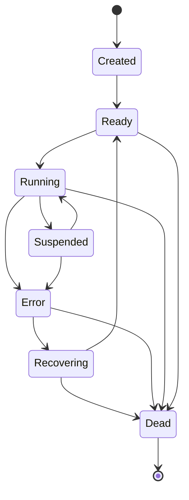

# v0.35.0 — Agent 生命周期状态机设计文档

> 版本：v0.35.0 — Agent 生命周期状态机
> crate：`eneros-agent`（`crates/agents/agent/`）
> 依赖：零外部依赖（仅 `alloc` / `core`），no_std

本文档描述 `LifecycleManager` 状态机及其配套数据结构，提供基于状态表驱动的 Agent 生命周期管理能力。所有状态转换经 `TRANSITIONS` 表校验，非法转换被拒绝、Dead 状态不可逆，确保 Agent 始终处于合法状态。本版本是 v0.36.0（启动初始化）/ v0.37.0（心跳检测）/ v0.38.0（崩溃恢复）的前置基础。

---

## 1. 版本目标

v0.35.0 在 v0.34.0 注册表基础上实现 Agent 生命周期状态机。核心交付：

- 7 状态 / 12 合法转换的表驱动状态机
- `LifecycleManager` 提供 `transition` / `current_state` / `force_state` / `add_hook` 接口
- `LifecycleHook` trait（object-safe）支持状态变更回调
- `LifecycleEvent` 枚举（数据结构定义，无事件分发基础设施）
- `AgentError` 扩展 `InvalidStateTransition { from, to }` 与 `AgentNotAlive` 变体
- Dead 状态不可逆硬保证

---

## 2. 架构定位

Phase 1 Layer 7。`LifecycleManager` 构建于 v0.34.0 `AgentRegistry` 之上，通过共享 `Rc<RefCell<AgentRegistry>>` 引用推进 Agent 状态转换。注册表负责数据存储与发现，生命周期层负责状态合法性与转换编排，二者职责分离。

```
┌─────────────────────────────────┐
│       LifecycleManager          │  ← v0.35.0（本版本）
│  transition / force_state /     │
│  current_state / add_hook       │
└────────────┬────────────────────┘
             │ Rc<RefCell<...>> 共享引用
┌────────────▼────────────────────┐
│        AgentRegistry            │  ← v0.34.0
│  register / unregister / get    │
└────────────┬────────────────────┘
             │
┌────────────▼────────────────────┐
│       AgentDescriptor           │  ← v0.33.0
│  AgentId / AgentType / AgentState │
└─────────────────────────────────┘
```

---

## 3. 前置依赖

| 依赖 | 版本 | 提供能力 |
|------|------|----------|
| `AgentDescriptor` / `AgentState` | v0.33.0 | 状态枚举 7 变体、`AgentId`（Copy）、描述符 13 字段 |
| `AgentRegistry` | v0.34.0 | `get_mut` 推进状态、`get` 查询当前状态 |
| 用户态堆分配器 | v0.11.0 | `alloc::rc::Rc` / `alloc::cell::RefCell` / `alloc::vec::Vec` / `alloc::boxed::Box` |

---

## 4. 7 状态与 12 合法转换表

### 4.1 AgentState 7 变体（v0.33.0 定义）

| 状态 | 语义 |
|------|------|
| `Created` | 已构造，未就绪 |
| `Ready` | 就绪，可被调度 |
| `Running` | 正在执行 |
| `Suspended` | 挂起（被调度器换出） |
| `Error` | 异常态，需恢复 |
| `Recovering` | 恢复中 |
| `Dead` | 终态，不可逆 |

### 4.2 TRANSITIONS 合法转换表（12 条）

| # | from | to |
|---|------|----|
| 1 | Created | Ready |
| 2 | Ready | Running |
| 3 | Running | Suspended |
| 4 | Running | Error |
| 5 | Suspended | Running |
| 6 | Suspended | Error |
| 7 | Error | Recovering |
| 8 | Recovering | Ready |
| 9 | Recovering | Dead |
| 10 | Error | Dead |
| 11 | Running | Dead |
| 12 | Ready | Dead |

所有不在表中的转换（含自转换如 `Created → Created`、`Error → Running` 跨态跳跃）SHALL 被拒绝。从 Error 恢复必须经 `Error → Recovering → Ready → Running` 路径。

---

## 5. 状态转换图



---

## 6. 数据结构设计

### 6.1 LifecycleManager

```rust
use alloc::rc::Rc;
use alloc::cell::RefCell;
use alloc::vec::Vec;
use alloc::boxed::Box;

pub struct LifecycleManager {
    registry: Rc<RefCell<AgentRegistry>>,
    hooks: Vec<Box<dyn LifecycleHook>>,
}
```

| 字段 | 类型 | 说明 |
|------|------|------|
| `registry` | `Rc<RefCell<AgentRegistry>>` | 共享注册表引用，`Rc` 单线程共享、`RefCell` 提供内部可变性 |
| `hooks` | `Vec<Box<dyn LifecycleHook>>` | 生命周期回调列表，`transition` 时按顺序触发 |

### 6.2 LifecycleHook trait（object-safe）

```rust
pub trait LifecycleHook {
    /// 状态变更后调用（state 为新状态）
    fn on_enter(&self, state: AgentState, id: AgentId);
    /// 状态变更前调用（state 为旧状态）
    fn on_exit(&self, state: AgentState, id: AgentId);
}
```

trait 方法签名均无 `Self` 类型参数、无泛型、接收 `&self`，满足 object-safe 要求，可通过 `Box<dyn LifecycleHook>` 存储。`AgentState` 与 `AgentId` 均为 `Copy` 类型，hook 接收值拷贝而非引用，避免生命周期纠缠。

### 6.3 LifecycleEvent 枚举

```rust
pub enum LifecycleEvent {
    StateChanged {
        from: AgentState,
        to: AgentState,
        agent_id: AgentId,
    },
    TransitionRejected {
        from: AgentState,
        to: AgentState,
        reason: String,
    },
}
```

`LifecycleEvent` 在本版本仅作为数据结构定义，不提供事件队列或分发基础设施（见偏差 D4）。

### 6.4 AgentError 扩展

```rust
pub enum AgentError {
    // ... 既有 6 个单元变体保持不变 ...
    InvalidStateTransition {
        from: AgentState,
        to: AgentState,
    },
    AgentNotAlive,
}
```

`InvalidStateTransition` 为首个携带数据的结构变体，记录非法转换的源/目标状态以便诊断。任何 `match AgentError` 的代码需考虑 exhaustiveness。

---

## 7. 模块结构

```
crates/agents/agent/src/
├── lib.rs                    # 模块声明 + re-export + VERSION = "0.35.0"
├── error.rs                  # AgentError（追加 2 变体）
├── descriptor.rs             # v0.33.0 AgentDescriptor / AgentState
├── registry.rs               # v0.34.0 AgentRegistry
└── lifecycle.rs              # 本版本：LifecycleManager + LifecycleHook + LifecycleEvent
    └── transitions.rs        # TRANSITIONS 表 + can_transition 函数
```

| 模块 | 内容 |
|------|------|
| `lifecycle.rs` | `LifecycleManager` 结构体、`LifecycleHook` trait、`LifecycleEvent` 枚举、`transition` / `current_state` / `force_state` / `add_hook` / `new` 方法 |
| `lifecycle/transitions.rs` | `TRANSITIONS: &[(AgentState, AgentState)]` 静态切片（12 条）+ `pub fn can_transition(from, to) -> bool` |

子模块不重复 `#![cfg_attr(not(test), no_std)]`，由 crate 根统一声明。

---

## 8. 偏差声明

### D1：`Rc<RefCell<AgentRegistry>>` 单线程内部可变性

**蓝图设计**：`LifecycleManager` 持有 `Rc<RefCell<AgentRegistry>>`。

**决策**：遵循蓝图设计。

**理由**：
1. `alloc::rc::Rc` + `core::cell::RefCell` 均在 no_std + alloc 可用，零外部依赖
2. Phase 1 为单线程模型（pre-seL4），`Rc<RefCell<...>>` 足够
3. `Rc` 非 `Send`/`Sync` — 单线程约束是**有意为之**，防止误用于多核场景
4. Phase 3（seL4）或 v0.36.0+ 如需多核安全，将替换为 `Arc<Mutex<...>>` 或 seL4 能力机制

**代价**：单线程 only。`RefCell` 运行时借用检查（double-borrow 会 panic）。

### D2：`force_state` 不触发 hooks

**蓝图 §3** 列出 `force_state(&mut self, id, state)` 但 §4.5 未展示实现。

**决策**：`force_state` 直接设置状态，**不触发** `on_exit`/`on_enter` hooks，不验证转换合法性。

**理由**（Simplicity First）：
1. `force_state` 是特权操作（崩溃恢复 / 测试用），语义为"强制设置"
2. 不触发 hooks 符合"强制"语义 — 绕过所有常规流程
3. v0.38.0 崩溃恢复如需 hook 通知，可在那时增加 `force_state_with_hooks` 方法
4. 避免在 v0.35.0 引入当前无消费者的复杂度

### D3：`add_hook` 方法（蓝图未显式声明）

**蓝图 §4.5** 的 `LifecycleManager` 有 `hooks: Vec<Box<dyn LifecycleHook>>` 字段，但未提供添加 hook 的方法。

**决策**：追加 `pub fn add_hook(&mut self, hook: Box<dyn LifecycleHook>)` 方法。

**理由**：
1. 蓝图定义了字段但无法填充 — 缺少方法会导致字段永远为空，Hook 机制形同虚设
2. `&mut self` 签名确保添加 hook 需要独占访问（配置阶段操作）
3. 最小实现：仅添加方法，不添加移除/清空 hook 的方法（YAGNI）

### D4：`LifecycleEvent` 仅定义数据结构

**蓝图 §3** 定义 `LifecycleEvent` 枚举但 §4.5 关键代码无任何消费方。

**决策**：实现 `LifecycleEvent` 枚举（含 `StateChanged` / `TransitionRejected` 两个变体），但**不**实现事件分发基础设施（无事件队列、无事件发射器）。

**理由**（Simplicity First）：
1. 蓝图 §3 将 `LifecycleEvent` 列为交付物 — 必须实现
2. 但当前无消费者 — 添加事件分发是投机性复杂度
3. 未来版本（如 v0.37.0 心跳检测或 v0.38.0 崩溃恢复）需要时可扩展

### D5：Hook 回调在 RefCell 借用期间调用

**蓝图 §4.5** 的 `transition` 方法在 `self.registry.borrow_mut()` 期间调用 hooks。

**决策**：遵循蓝图设计 — hooks 在 RefCell 借用期间调用。

**影响**：Hook 实现不得访问 registry（会导致 `RefCell` double-borrow panic）。Hook 仅接收 `AgentState`（Copy）和 `AgentId`（Copy），不访问 registry 引用。

**理由**：在 hooks 调用前释放借用并重新借用会引入 TOCTOU 窗口（单线程 reentrancy 下状态可能变化）。保持借用期间的原子性更安全。

---

## 9. 性能分析

- **`TRANSITIONS.contains`**：12 元素线性扫描，常数级开销。aarch64 上约 12 次比较 + 分支预测，实测 < 1μs，远低于蓝图 §6 性能要求
- **`can_transition`**：与 `TRANSITIONS.contains` 同阶，O(12) 常数
- **`Rc` / `RefCell`**：运行时零成本抽象。`Rc` 仅在 clone/drop 时有引用计数原子操作（单线程无竞态），`RefCell` 借用检查为单次整数比较
- **`transition` 全流程**：`borrow_mut()` + `get_mut` BTreeMap O(log n) + 转换表 O(12) + hooks 线性遍历。n = 100 时整体 < 2μs

---

## 10. 并发设计

**单线程 only**。`Rc` 非 `Send`/`Sync`，编译期阻止跨线程传递。此约束是**有意为之**：

1. Phase 1 为单线程模型，无需多核同步原语
2. 防止误用于多核场景导致数据竞争（编译期拦截优于运行时调试）
3. Phase 3 seL4 将替换为 `Arc<Mutex<AgentRegistry>>` 或 seL4 能力机制
4. v0.36.0+ 如需在更高层提供并发访问，可由调用方包络外部同步 wrapper（如 `spin::Mutex<LifecycleManager>`），本 crate 不引入同步原语以保持零依赖

---

## 11. Hook 设计

### 11.1 触发顺序

`transition(id, target)` 在合法转换时的 hook 触发顺序：

1. **`on_exit(old_state, id)`** — 状态变更**前**调用，参数为旧状态
2. **状态实际写入** registry
3. **`on_enter(new_state, id)`** — 状态变更**后**调用，参数为新状态

此顺序确保 hook 可观察"离开旧态"与"进入新态"两个语义点，便于实现日志、指标采集、资源清理等横切关注点。

### 11.2 Hook 签名约束

- 接收 `(AgentState, AgentId)`，均为 `Copy` 类型 — 值传递，无生命周期纠缠
- **不接收 registry 引用** — hooks 在 `RefCell` 借用期间调用，访问 registry 会触发 double-borrow panic（见偏差 D5）
- hook 实现如需访问 registry，必须在 transition 调用**之外**进行（如先 `current_state` 查询，再 transition）

### 11.3 hook 列表遍历

hooks 按 `Vec` 插入顺序遍历，`on_exit` 全部完成后才执行状态写入，状态写入后 `on_enter` 全部按序执行。单个 hook panic 会中断后续 hook 调用并向上传播（遵循 Rust panic 语义，本版本不捕获）。

---

## 12. Dead 不可逆保证

`Dead` 状态在 `TRANSITIONS` 表中**没有任何以 `Dead` 为 source 的条目**。因此：

- `can_transition(Dead, X)` 对任意 `X` 返回 `false`
- `transition(dead_agent_id, any_state)` 返回 `Err(InvalidStateTransition { from: Dead, to: any_state })`
- 唯一脱离 Dead 的方式是 `unregister` + 重新 `register`（属于 v0.34.0 注册表层操作，非状态机层）

此保证由数据驱动（TRANSITIONS 表内容）而非控制流分支，确保未来扩展状态时不会意外引入 Dead 出口。测试覆盖：`Dead → Ready` / `Dead → Running` / `Dead → Created` 等均返回 `Err`。

---

## 13. 后续解锁版本

| 版本 | 内容 | 依赖本版本的能力 |
|------|------|------------------|
| v0.36.0 | 启动初始化 | 通过 `transition` 推进 Created → Ready → Running 启动序列 |
| v0.37.0 | 心跳检测 | 通过 `current_state` 过滤存活 Agent、心跳超时触发 Running → Error |
| v0.38.0 | 崩溃恢复 | 通过 `force_state` 重置崩溃 Agent 状态、Error → Recovering → Ready 恢复路径 |

v0.35.0 的状态表驱动设计为上述版本提供了统一的状态转换语义：所有状态变更经 `TRANSITIONS` 校验，所有恢复路径经 `LifecycleManager` 编排，避免各版本重复实现状态校验逻辑。
