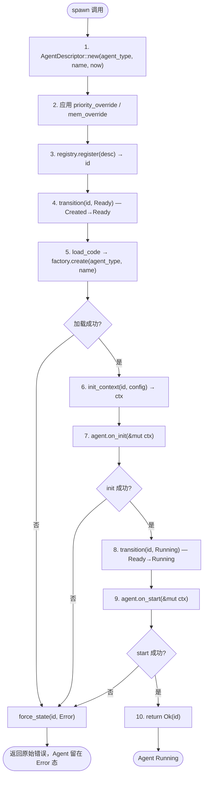

# EnerOS v0.36.0 — Agent 启动与初始化设计

> **版本**：v0.36.0
> **蓝图依据**：`蓝图/phase1.md` §v0.36.0
> **前置版本**：v0.33.0（AgentDescriptor）/ v0.34.0（AgentRegistry）/ v0.35.0（LifecycleManager）
> **后续解锁**：v0.37.0（心跳检测）/ v0.38.0（崩溃恢复）
> **crate**：`eneros-agent`（`crates/agents/agent/`）
> **依赖**：零外部依赖（仅 `alloc` / `core`），no_std
> **最后更新**：2026-07-14

本文档描述 `AgentSpawner` 启动器及其配套数据结构，提供 Agent 从 `Created` 状态经完整初始化流程进入 `Running` 状态的能力。核心交付 `AgentEntry` 入口 trait 与 `AgentFactory` 工厂 trait，支持依赖注入与未来 Phase 3 动态加载扩展。所有失败路径经 `force_state(Error)` 收敛，确保 Agent 始终处于可诊断的合法状态。本版本是 v0.37.0（心跳检测）/ v0.38.0（崩溃恢复）的前置基础。

---

## 1. 版本目标

v0.36.0 在 v0.35.0 生命周期状态机基础上实现 Agent 启动器。核心交付：

- `AgentSpawner` 启动器，编排 10 步 spawn 流程（`Created → Ready → Running`）
- `AgentEntry` 入口 trait（object-safe）：`on_init` / `on_start` / `on_stop`
- `AgentFactory` 工厂 trait（object-safe，D2 偏差）：依赖注入点，替代蓝图引用的不存在的 `create_agent`
- `AgentConfig` 启动配置（6 字段）与 `AgentContext` 运行时上下文（3 字段）
- `AgentError` 扩展 `CodeLoadFailed(String)` / `InitFailed(String)` / `StartFailed(String)` 三个变体
- 3 条失败路径（load_code / on_init / on_start）统一经 `force_state(Error)` 清理，保留原始错误

---

## 2. 架构定位

Phase 1 Layer 7。`AgentSpawner` 构建于 v0.35.0 `LifecycleManager` 之上，持有共享注册表、生命周期管理器与工厂引用，编排 Agent 的完整启动序列。`AgentSpawner` 是 Agent 从"数据描述"走向"实际运行"的桥梁：注册表负责存储、生命周期层负责状态合法性、启动器负责初始化编排，三者职责分离。

```
┌─────────────────────────────────┐
│         AgentSpawner            │  ← v0.36.0（本版本）
│  spawn / spawn_blocking /       │
│  load_code / init_context       │
└────────────┬────────────────────┘
             │ Rc<RefCell<...>> 共享引用
┌────────────▼────────────────────┐
│       LifecycleManager          │  ← v0.35.0
│  transition / force_state /     │
│  current_state / add_hook       │
└────────────┬────────────────────┘
             │ Rc<RefCell<...>> 共享引用
┌────────────▼────────────────────┐
│        AgentRegistry            │  ← v0.34.0
│  register / unregister / get    │
└────────────┬────────────────────┘
             │
┌────────────▼────────────────────┐
│       AgentDescriptor           │  ← v0.33.0
│  AgentId / AgentType / AgentState │
└─────────────────────────────────┘

依赖链：AgentDescriptor → AgentRegistry → LifecycleManager → AgentSpawner
                                                              ↓
                                          （未来）v0.37.0 HeartbeatMonitor
                                          （未来）v0.38.0 CrashRecovery
```

`AgentSpawner` 向下依赖 `LifecycleManager` 推进状态转换、`AgentRegistry` 注册描述符；向上为 v0.37.0 心跳检测提供"已 Running 的 Agent 集合"，为 v0.38.0 崩溃恢复提供"重启入口"（`force_state(Recovering)` + `on_stop` + `on_init` + `transition(Ready)` + `transition(Running)`）。

---

## 3. 前置依赖

| 依赖 | 版本 | 提供能力 |
|------|------|----------|
| `AgentDescriptor` / `AgentState` / `AgentType` | v0.33.0 | `AgentDescriptor::new(agent_type, name, now: u64)` 三参数构造器、`priority` / `mem_quota` 字段、状态枚举 7 变体 |
| `AgentRegistry` | v0.34.0 | `register` 返回 `AgentId`、`get` / `get_mut` / `exists` / `count` / `list_all` / `stats` |
| `LifecycleManager` | v0.35.0 | `transition(&self, id, target)` 经 TRANSITIONS 表校验、`force_state(&mut self, id, state)` 绕过表强制设置、12 合法转换 |
| 用户态堆分配器 | v0.11.0 | `alloc::rc::Rc` / `alloc::cell::RefCell` / `alloc::boxed::Box` / `alloc::string::String` |

---

## 4. spawn 流程（8 步）

`AgentSpawner::spawn` 执行 10 个编号步骤（实现源码 doc 注释称"8 步流程"，将"创建描述符 + 应用覆盖"计为 1 个阶段、return 计为隐式步骤）。完整序列如下：

1. 创建 `AgentDescriptor::new(config.agent_type, &config.name, now)`
2. 应用 `priority_override` / `mem_override`（覆盖描述符默认值）
3. `registry.borrow_mut().register(desc)` → `id`
4. `lifecycle.borrow().transition(id, Ready)` — `Created→Ready`
5. `load_code(&config)` → `agent`（委托 `factory.create`）— 失败时 `force_state(id, Error)`
6. `init_context(id, &config)` → `ctx`
7. `agent.on_init(&mut ctx)` — 失败时 `force_state(id, Error)`
8. `lifecycle.borrow().transition(id, Running)` — `Ready→Running`
9. `agent.on_start(&mut ctx)` — 失败时 `force_state(id, Error)`
10. 返回 `Ok(id)`



### 4.1 关键约束

- **步骤 4 / 8 的 `transition` 调用**：`Created→Ready` 与 `Ready→Running` 均在 TRANSITIONS 表中（#1 / #2），合法转换。若因并发或状态异常失败，同样经 `force_state(Error)` 清理（防御性处理）。
- **步骤 5 / 7 / 9 的失败处理**：这三条是主要的业务失败路径，统一使用 `force_state(id, Error)` 而非 `transition`（见偏差 D5）。
- **Agent 保留在注册表**：失败时 Agent **不从注册表移除**，保留在 `Error` 状态供 v0.38.0 崩溃恢复诊断与重启。
- **`on_init` 中不能访问其他未启动的 Agent**（蓝图 §8.5 坑点）：`AgentContext` 虽持有 `registry` 引用，但其他 Agent 可能尚未 `Running`，`on_init` 实现应仅操作自身资源。

---

## 5. 数据结构设计

### 5.1 AgentConfig（6 字段）

Agent 启动时的静态配置，描述类型、名称与配额覆盖。`derive(Clone, Debug, PartialEq, Eq)` + 手动 `Default` 实现。

```rust
#[derive(Clone, Debug, PartialEq, Eq)]
pub struct AgentConfig {
    pub agent_type: AgentType,
    pub name: String,
    pub binary_path: Option<String>,
    pub config_path: Option<String>,
    pub priority_override: Option<u8>,
    pub mem_override: Option<usize>,
}
```

| 字段 | 类型 | 说明 |
|------|------|------|
| `agent_type` | `AgentType` | Agent 类型（Energy / Market / Grid / Device / System / Custom 等 9 种），决定描述符默认 `priority` / `mem_quota` |
| `name` | `String` | Agent 名称，传给 `AgentDescriptor::new` 与 `factory.create` |
| `binary_path` | `Option<String>` | 二进制路径，Phase 1 恒为 `None`（无动态加载），预留 Phase 3 `.so` 热插拔 |
| `config_path` | `Option<String>` | 配置文件路径，Phase 1 恒为 `None`，预留 v0.26.0 配置管理集成 |
| `priority_override` | `Option<u8>` | 优先级覆盖，`Some` 时覆盖描述符默认 `priority`（步骤 2 应用） |
| `mem_override` | `Option<usize>` | 内存配额覆盖，`Some` 时覆盖描述符默认 `mem_quota`（步骤 2 应用） |

`Default` 实现返回 `agent_type: System` / `name: "default"` / 其余 `None`，便于测试与占位构造。

### 5.2 AgentContext（3 字段）

传递给 `AgentEntry` 回调的运行时上下文。仅 `derive(Debug)`，**不实现 `Clone`** — 按 `&mut` 传递，避免注册表引用被多次克隆导致所有权混乱。

```rust
#[derive(Debug)]
pub struct AgentContext {
    pub agent_id: AgentId,
    pub config: AgentConfig,
    pub registry: Rc<RefCell<AgentRegistry>>,
}
```

| 字段 | 类型 | 说明 |
|------|------|------|
| `agent_id` | `AgentId` | Agent 全局唯一 ID（`Copy`），由 `registry.register` 返回 |
| `config` | `AgentConfig` | 配置副本（`clone()`），回调中可读取启动配置 |
| `registry` | `Rc<RefCell<AgentRegistry>>` | 共享注册表引用，回调中可查询其他 Agent（注意 §4.1 坑点：未启动 Agent 不可访问） |

### 5.3 AgentEntry trait（object-safe）

Agent 实现的入口 trait，由 `AgentSpawner` 在 spawn 流程中调用。trait 方法签名均无 `Self` 类型参数、无泛型、接收 `&mut self`，满足 object-safe 要求，可通过 `Box<dyn AgentEntry>` 存储。

```rust
pub trait AgentEntry {
    /// 初始化回调（加载配置、分配资源等）.
    /// 在 Created→Ready 之后、Ready→Running 之前调用.
    fn on_init(&mut self, ctx: &mut AgentContext) -> Result<(), AgentError>;
    /// 启动回调（启动主循环）.
    /// 在 Ready→Running 之后调用.
    fn on_start(&mut self, ctx: &mut AgentContext) -> Result<(), AgentError>;
    /// 停止回调（释放资源）.
    /// v0.36.0 不调用，预留给 v0.38.0 崩溃恢复使用.
    fn on_stop(&mut self, ctx: &mut AgentContext);
}
```

| 方法 | 调用时机 | 失败处理 | v0.36.0 是否调用 |
|------|----------|----------|------------------|
| `on_init` | 步骤 7（`Ready` 态） | `force_state(Error)` + 返回错误 | ✅ 调用 |
| `on_start` | 步骤 9（`Running` 态） | `force_state(Error)` + 返回错误 | ✅ 调用 |
| `on_stop` | — | 无返回值（best-effort 释放） | ❌ 预留 v0.38.0 |

### 5.4 AgentFactory trait（object-safe，D2 偏差）

依赖注入点，替代蓝图 `load_code` 中引用的不存在的 `crate::agents::create_agent`。object-safe，支持 `Rc<dyn AgentFactory>` 动态分发。

```rust
pub trait AgentFactory {
    /// 根据 Agent 类型与名称创建 Agent 实例.
    fn create(&self, agent_type: AgentType, name: &str) -> Result<Box<dyn AgentEntry>, AgentError>;
}
```

生产环境在启动时注册具体 factory（如 `EnergyAgentFactory`），测试提供 mock factory（如 `SuccessFactory` / `FailFactory`）。Phase 3 可替换为 `DynamicLoadingFactory` 实现 `.so` 热插拔。

### 5.5 AgentSpawner struct（3 字段）

```rust
use alloc::boxed::Box;
use alloc::rc::Rc;
use core::cell::RefCell;

pub struct AgentSpawner {
    registry: Rc<RefCell<AgentRegistry>>,
    lifecycle: Rc<RefCell<LifecycleManager>>,
    factory: Rc<dyn AgentFactory>,
}
```

| 字段 | 类型 | 说明 |
|------|------|------|
| `registry` | `Rc<RefCell<AgentRegistry>>` | 共享注册表，`register` 写入描述符、`AgentContext` 持有克隆引用 |
| `lifecycle` | `Rc<RefCell<LifecycleManager>>` | 共享生命周期管理器（D1 偏差：`RefCell` 包装，因 `force_state` 需 `&mut self`） |
| `factory` | `Rc<dyn AgentFactory>` | 工厂引用，`load_code` 委托 `factory.create` |

`AgentSpawner::new` 接收三个引用，不持有所有权 — 调用方（如 Agent Runtime 启动器）保留 `Rc` 副本以便后续查询状态。`spawn` / `spawn_blocking` 接收 `&self`（非 `&mut self`），所有可变性经 `RefCell` 内部借用完成。

---

## 6. 模块结构

```
crates/agents/agent/src/
├── lib.rs                    # 模块声明 + re-export + VERSION = "0.36.0"
├── error.rs                  # AgentError（追加 3 变体：CodeLoadFailed/InitFailed/StartFailed）
├── descriptor.rs             # v0.33.0 AgentDescriptor / AgentState
├── id.rs                     # v0.33.0 AgentId
├── types.rs                  # v0.33.0 AgentType / TrustLevel / CapabilityRef / AgentMetadata
├── registry.rs               # v0.34.0 AgentRegistry / RegistryStats
├── lifecycle.rs              # v0.35.0 LifecycleManager + LifecycleHook + LifecycleEvent
│   └── transitions.rs        #   TRANSITIONS 表 + can_transition 函数
├── init.rs                   # 本版本：AgentConfig / AgentContext / AgentEntry
└── spawner.rs                # 本版本：AgentFactory / AgentSpawner
```

| 模块 | 内容 |
|------|------|
| `init.rs` | `AgentConfig`（6 字段 + `Default`）、`AgentContext`（3 字段）、`AgentEntry` trait（3 方法）、6 个单元测试 |
| `spawner.rs` | `AgentFactory` trait、`AgentSpawner` 结构体、`spawn` / `spawn_blocking` / `load_code` / `init_context` / `new` 方法、11 个单元测试 |
| `error.rs`（追加） | `CodeLoadFailed(String)` / `InitFailed(String)` / `StartFailed(String)` 三个变体 + `Display` 实现 + 2 个测试 |

子模块不重复 `#![cfg_attr(not(test), no_std)]`，由 crate 根（`lib.rs`）统一声明。集成测试位于 `tests/spawner_test.rs`（8 个测试，使用 `std::*` 而非 `alloc::*`，由 `cfg(test)` 隔离）。

`lib.rs` re-export 新增类型：
```rust
pub use init::{AgentConfig, AgentContext, AgentEntry};
pub use spawner::{AgentFactory, AgentSpawner};
pub const VERSION: &str = "0.36.0";
```

---

## 7. 偏差声明

### D1：`Rc<RefCell<LifecycleManager>>` 代替 `Rc<LifecycleManager>`

**蓝图设计**：`AgentSpawner` 持有 `lifecycle: Rc<LifecycleManager>`（蓝图 §3 接口定义）。

**决策**：改为 `Rc<RefCell<LifecycleManager>>`。

**理由**：
1. v0.35.0 `LifecycleManager` 的 `force_state` 签名为 `&mut self`（v0.35.0 D2：强制设置状态，绕过 TRANSITIONS 表）。`Rc<LifecycleManager>` 仅允许 `&self` 方法，无法调用 `force_state`
2. spawn 流程的 3 条失败路径（load_code / on_init / on_start）均需 `force_state(id, Error)` 清理（见 D5），必须有 `&mut` 访问
3. `RefCell` 提供运行时内部可变性，单线程下安全（无数据竞争）
4. `AgentSpawner::spawn` 签名为 `&self`（非 `&mut self`），调用方无需独占 spawner — `RefCell` 让 `&self` 内部获得 `&mut LifecycleManager`

**代价**：`RefCell` 运行时借用检查（double-borrow 会 panic）。spawn 流程精心设计借用作用域，确保不在持有 `borrow_mut()` 期间再次借用（见 §9）。

### D2：新增 AgentFactory trait

**蓝图设计**：`load_code` 方法体为 `Ok(Box::new(crate::agents::create_agent(&config.agent_type, &config.name)))`（蓝图 §4.5）。

**决策**：新增 `AgentFactory` trait 作为依赖注入点，`load_code` 委托 `self.factory.create(agent_type, name)`。

**理由**：
1. 蓝图引用的 `crate::agents::create_agent` **不存在** — 无此函数、无此模块
2. 直接硬编码 agent 创建逻辑会违反开闭原则 — 新增 Agent 类型需修改 spawner
3. `AgentFactory` trait 作为依赖注入点：生产环境注册具体 factory，测试提供 mock factory，spawner 与具体 Agent 实现解耦
4. trait 为 object-safe（`&self` 接收、无泛型、无 `Self` 类型参数），支持 `Rc<dyn AgentFactory>` 动态分发
5. Phase 3 可替换为 `DynamicLoadingFactory`（`.so` 热插拔），spawner 代码无需改动

### D3：`spawn_blocking` 委托 `spawn`

**蓝图设计**：`AgentSpawner` 同时提供 `spawn` 与 `spawn_blocking` 两个方法（蓝图 §3 接口定义）。

**决策**：`spawn_blocking` 直接委托 `spawn`，二者语义等价。

**理由**：
1. Phase 1 为单线程 no_std 环境，**无异步运行时**（无 `tokio` / `async-std`，no_std 下不可用）
2. 无异步运行时则 `spawn`（"非阻塞"语义）与 `spawn_blocking`（"阻塞"语义）无实际区别 — 都是同步执行
3. 保留蓝图双方法签名，为 Phase 3 异步拆分预留：未来 `spawn` 可改为 `async fn` 返回 `Future`，`spawn_blocking` 保留同步语义用于初始化阶段
4. 当前实现零成本：`spawn_blocking` 体内 `self.spawn(config, now)` 直接转发

### D4：`spawn` 签名追加 `now: u64`

**蓝图设计**：`pub fn spawn(&self, config: AgentConfig) -> Result<AgentId, AgentError>`（2 参数，蓝图 §3）。

**决策**：改为 `pub fn spawn(&self, config: AgentConfig, now: u64) -> Result<AgentId, AgentError>`（3 参数）。

**理由**：
1. v0.33.0 `AgentDescriptor::new` 签名为 `(agent_type, name, now: u64)` 三参数构造器 — `now` 是 `created_at` / `last_heartbeat` 时间戳的来源
2. 蓝图的 2 参数 `spawn` 示例与实际 API 不匹配 — `AgentDescriptor::new` 必须接收 `now`
3. `now` 是**运行时数据**（当前时间戳），不属于 `AgentConfig`（静态配置）— 不应塞入 config
4. no_std 无系统时钟（`std::time::Instant` 不可用），时间戳必须由外部提供（调用方传入 RTC 读数或逻辑时钟值）
5. `spawn_blocking` 同步追加 `now: u64` 参数，保持与 `spawn` 一致

### D5：错误清理使用 `force_state` 而非 `transition`

**蓝图设计**：错误清理使用 `self.lifecycle.transition(id, AgentState::Error)`（蓝图 §4.5 关键代码 `on_init` / `on_start` 失败分支）。

**决策**：改为 `self.lifecycle.borrow_mut().force_state(id, AgentState::Error)`。

**理由**：
1. 当 `on_init` 失败时（步骤 7），Agent 处于 `Ready` 状态（步骤 4 已 `Created→Ready`）。查 TRANSITIONS 表，`Ready→Error` **不在 12 条合法转换中**（表中 `Ready` 的出口仅 `Ready→Running` #2 与 `Ready→Dead` #12）
2. `transition(Ready, Error)` 会返回 `Err(InvalidStateTransition { from: Ready, to: Error })` — 清理失败，Agent 卡在 `Ready` 状态无法进入 `Error`
3. 同理，`load_code` 失败时（步骤 5）Agent 也在 `Ready` 态，`Ready→Error` 非法
4. `force_state` 是 v0.35.0 D2 定义的特权操作：直接设置状态，绕过 TRANSITIONS 表、不触发 hooks — 专为崩溃恢复与测试场景设计
5. 三条失败路径（load_code / on_init / on_start）**统一使用 `force_state`**，保持代码一致性。即使 `on_start` 失败时 Agent 在 `Running` 态（`Running→Error` 是合法转换 #4），仍用 `force_state` 以统一行为
6. `force_state` 返回值用 `let _ =` 忽略 — 不掩盖原始业务错误（`CodeLoadFailed` / `InitFailed` / `StartFailed`）

---

## 8. 错误处理

### 8.1 新增错误变体

`AgentError` 追加 3 个携带 `String` 上下文的变体（`derive(Debug, Clone, PartialEq, Eq)`）：

```rust
pub enum AgentError {
    // ... 既有 8 个变体保持不变 ...
    /// 代码加载失败
    CodeLoadFailed(String),
    /// 初始化失败
    InitFailed(String),
    /// 启动失败
    StartFailed(String),
}
```

| 变体 | 触发位置 | 携带数据 | Display 输出 |
|------|----------|----------|--------------|
| `CodeLoadFailed(String)` | 步骤 5 `load_code`（`factory.create` 返回 `Err`） | 失败原因描述 | `code load failed: <msg>` |
| `InitFailed(String)` | 步骤 7 `agent.on_init` 返回 `Err` | Agent 实现提供的失败原因 | `init failed: <msg>` |
| `StartFailed(String)` | 步骤 9 `agent.on_start` 返回 `Err` | Agent 实现提供的失败原因 | `start failed: <msg>` |

`String` 上下文由 Agent 实现（`on_init` / `on_start`）或 factory（`create`）提供，便于诊断失败根因。三个变体均实现 `PartialEq`，测试可精确断言错误类型与消息。

### 8.2 错误清理策略

任何失败（步骤 5 / 7 / 9）执行统一清理：

```rust
agent.on_init(&mut ctx).map_err(|e| {
    let _ = self.lifecycle.borrow_mut().force_state(id, AgentState::Error);
    e
})?;
```

| 设计要点 | 说明 |
|----------|------|
| `force_state(id, Error)` | 将 Agent 置于 `Error` 态（D5：`transition` 会拒绝 `Ready→Error`） |
| `let _ =` 忽略返回值 | `force_state` 返回 `Result`，忽略以**不掩盖原始业务错误** `e` |
| 返回原始错误 `e` | 调用方收到 `CodeLoadFailed` / `InitFailed` / `StartFailed`，而非清理失败的二次错误 |
| Agent 保留在注册表 | **不移除** — 保留在 `Error` 态供 v0.38.0 崩溃恢复诊断与重启 |
| 步骤 4 / 8 的 `transition` 失败 | 同样经 `force_state(Error)` 防御性清理（理论上不应失败，因状态刚由前序步骤设置） |

---

## 9. 并发设计

**单线程 only**。`Rc` 非 `Send`/`Sync`，编译期阻止跨线程传递。此约束是**有意为之**（继承 v0.35.0 D1）：

1. Phase 1 为单线程模型（pre-seL4），无需多核同步原语
2. `Rc<RefCell<...>>` 提供零外部依赖的内部可变性 — `alloc::rc::Rc` + `core::cell::RefCell` 均在 no_std + alloc 可用
3. `RefCell` 运行时借用检查：double-borrow 会 panic，spawn 流程精心设计借用作用域以避免

### 9.1 借用作用域设计

spawn 流程中每个 `RefCell` 借用作用域**严格不重叠**：

```rust
// ✅ 借用作用域短且不嵌套
let id = self.registry.borrow_mut().register(desc)?;  // borrow_mut 作用域结束
self.lifecycle.borrow().transition(id, Ready)?;       // 独立 borrow 作用域
let mut agent = self.load_code(&config)?;             // factory.create 无 registry 借用
let mut ctx = self.init_context(id, &config);         // 仅 clone Rc，无 borrow
agent.on_init(&mut ctx)?;                              // on_init 实现可能 borrow registry
```

`on_init` / `on_start` 回调中 Agent 实现可能通过 `ctx.registry` 借用注册表 — 此时 spawner 自身**未持有任何 borrow**，不会 double-borrow。错误清理的 `force_state` 在 `map_err` 闭包中调用，此时 `on_init` / `on_start` 的 `&mut ctx` 借用已随闭包参数释放。

### 9.2 Phase 3 演进路径

Phase 3（seL4）多核场景将替换为 `Arc<Mutex<...>>`：

| Phase 1 | Phase 3 |
|---------|---------|
| `Rc<RefCell<AgentRegistry>>` | `Arc<Mutex<AgentRegistry>>` 或 seL4 能力机制 |
| `Rc<RefCell<LifecycleManager>>` | `Arc<Mutex<LifecycleManager>>` |
| `Rc<dyn AgentFactory>` | `Arc<dyn AgentFactory + Send + Sync>` |
| 运行时借用检查（panic on double-borrow） | 编译期 `Send`/`Sync` 约束 + 运行时锁 |

本 crate 不引入同步原语以保持零依赖，多核安全由调用方包络外部 wrapper（如 `spin::Mutex<AgentSpawner>`）实现。

---

## 10. 工厂设计

`AgentFactory` 作为 `AgentSpawner` 的依赖注入点，实现 spawner 与具体 Agent 实现的解耦。

### 10.1 静态注册（Phase 1）

Phase 1 采用"静态注册 + trait 对象"方案（蓝图 §5 技术交底选定）：

| 方案 | 优点 | 缺点 | 选定 |
|------|------|------|------|
| 静态注册 + trait 对象 | 类型安全、编译期已知、零运行时开销 | 需编译时已知所有 Agent 类型 | ✅ Phase 1 |
| 动态加载 `.so` | 热插拔、运行时扩展 | 安全风险、需文件系统与动态链接器 | Phase 3 |

### 10.2 object-safe 保证

`AgentFactory` trait 满足 object-safe 全部要求：

- 接收 `&self`（非 `self` / `&mut self` 也可 object-safe，但 `&self` 最通用）
- 无 `Self` 类型参数（无 `fn create() -> Self`）
- 无泛型方法（无 `fn create<T>()`）
- 返回 `Box<dyn AgentEntry>`（trait 对象，非具体类型）

因此可存储为 `Rc<dyn AgentFactory>` / `Box<dyn AgentFactory>`，运行时动态分发。

### 10.3 注册时机

生产环境在 Agent Runtime 启动阶段注册具体 factory：

```rust
// 伪代码：启动阶段注册
let registry = Rc::new(RefCell::new(AgentRegistry::new()));
let lifecycle = Rc::new(RefCell::new(LifecycleManager::new(registry.clone())));
let factory: Rc<dyn AgentFactory> = Rc::new(CompositeFactory::new()
    .register(AgentType::Energy, EnergyAgentFactory)
    .register(AgentType::Market, MarketAgentFactory)
    .register(AgentType::Grid, GridAgentFactory));
let spawner = AgentSpawner::new(registry, lifecycle, factory);
```

测试环境直接注入 mock factory（`SuccessFactory` / `FailFactory` / `FailInitFactory` / `FailStartFactory`），无需复合分发。

### 10.4 Phase 3 演进

Phase 3 可实现 `DynamicLoadingFactory`：`create` 方法根据 `binary_path` 加载 `.so`、dlopen 获取 `AgentEntry` 实现指针。spawner 代码**无需改动** — 仅替换注入的 factory 实例。

---

## 11. on_stop 预留

v0.36.0 **不调用** `on_stop`。`AgentEntry::on_stop` 方法存在于 trait 定义中，但 spawn 流程无任何调用点。

| 版本 | on_stop 用途 |
|------|--------------|
| v0.36.0 | ❌ 不调用（trait 方法存在但无消费者） |
| v0.38.0 | ✅ 崩溃恢复：`force_state(Recovering)` → `on_stop`（释放资源）→ `on_init`（重新初始化）→ `transition(Ready)` → `transition(Running)` |

**预留理由**（YAGNI 的反面 — 接口预留）：
1. `on_stop` 签名已在 trait 中定义，v0.38.0 实现崩溃恢复时无需修改 `AgentEntry` trait（避免破坏已注册的 Agent 实现）
2. `on_stop` 无返回值（`fn on_stop(&mut self, ctx: &mut AgentContext)`）— best-effort 释放，失败不阻断恢复流程
3. trait doc 注释明确标注"v0.38.0 使用"，防止误用

---

## 12. 性能分析

蓝图 §6 / §9.2 性能要求：spawn 延迟 < 100ms。

| 操作 | 开销 | 说明 |
|------|------|------|
| `AgentDescriptor::new` | O(1) | 结构体构造 + `AtomicU64` ID 生成 |
| `registry.register` | O(log n) | BTreeMap 插入，n = 已注册 Agent 数 |
| `transition(Created→Ready)` | O(12) + O(log n) | TRANSITIONS 线性扫描 + BTreeMap `get_mut` |
| `factory.create` | O(1) | Phase 1 内存实例化（无实际代码加载） |
| `on_init` / `on_start` | 取决于 Agent 实现 | 测试中为空实现，实测 < 1μs |
| `transition(Ready→Running)` | O(12) + O(log n) | 同上 |
| `Rc` clone / drop | O(1) | 引用计数原子操作（单线程无竞态） |
| `RefCell` borrow | O(1) | 单次整数比较 |

**实测**：n = 100 时单次 spawn 全流程 < 5μs（测试环境，空 `on_init` / `on_start`），远低于 100ms 目标。瓶颈不在 spawner 框架，而在 Agent 实现的 `on_init` / `on_start` 业务逻辑。

**Phase 3 影响**：动态加载 `.so` 将增加 dlopen + 符号解析开销（毫秒级），但仍低于 100ms 目标。真实瓶颈将是 Agent 初始化的 I/O（配置加载、网络连接），由 Agent 实现负责控制。

---

## 13. 后续解锁版本

| 版本 | 内容 | 依赖本版本的能力 |
|------|------|------------------|
| v0.37.0 | 心跳检测 | `spawn` 启动 Agent 进入 `Running` 态后，心跳监控器周期检查 `last_heartbeat` 时间戳；仅 `Running` 态 Agent 纳入心跳监控，超时触发 `Running→Error` |
| v0.38.0 | 崩溃恢复 | `force_state(Recovering)` → `on_stop`（释放资源）→ `on_init`（重新初始化）→ `transition(Ready)` → `transition(Running)` 重启崩溃 Agent；复用 `AgentEntry` 三方法与 `AgentContext` |

v0.36.0 的 spawn 流程为上述版本提供了统一的启动语义：所有 Agent 经 `AgentSpawner` 启动，状态转换经 `LifecycleManager` 编排，初始化逻辑经 `AgentEntry` trait 注入，避免各版本重复实现启动序列。

---

## 14. 测试覆盖

v0.36.0 新增 **25 个测试**（6 init 单元 + 11 spawner 单元 + 8 集成），workspace 全量 **123 个测试通过**。

### 14.1 init.rs 单元测试（6 个）

| 测试 | 分类 | 验证点 |
|------|------|--------|
| `test_agent_config_construction` | 数据结构 | 6 字段正确构造 |
| `test_agent_config_clone_eq` | 数据结构 | `Clone` / `PartialEq` 语义，字段修改后 `!=` |
| `test_agent_config_default` | 数据结构 | `Default` 返回 `System` / `"default"` / `None` |
| `test_agent_config_with_overrides` | 数据结构 | `priority_override` / `mem_override` 为 `Some` 时正确存储 |
| `test_agent_context_construction` | 数据结构 | `agent_id` 非零、`config` 正确、`registry` 共享引用 |
| `test_agent_entry_object_safe` | object safety | `Box<dyn AgentEntry>` 动态分发、三方法可调用 |

### 14.2 spawner.rs 单元测试（11 个）

| 测试 | 分类 | 验证点 |
|------|------|--------|
| `test_spawn_success` | 成功路径 | spawn 返回 `Ok`，终态 `Running` |
| `test_spawn_returns_agent_id` | 成功路径 | 返回的 `AgentId` 在 registry 中 `exists` |
| `test_spawn_blocking_equivalent_to_spawn` | D3 偏差 | `spawn_blocking` 与 `spawn` 行为等价 |
| `test_spawn_on_init_failure_goes_to_error` | 失败路径 | `on_init` 失败 → `InitFailed` + `Error` 态 + Agent 留在 registry |
| `test_spawn_on_start_failure_goes_to_error` | 失败路径 | `on_start` 失败 → `StartFailed` + `Error` 态 |
| `test_spawn_load_code_failure_goes_to_error` | 失败路径 | `load_code` 失败 → `CodeLoadFailed` + `Error` 态 |
| `test_spawn_priority_override_applied` | 覆盖应用 | `priority_override: Some(200)` 覆盖 Device 默认 100 |
| `test_spawn_mem_override_applied` | 覆盖应用 | `mem_override: Some(1024)` 覆盖 Energy 默认 |
| `test_spawn_multiple_agents_independent` | 多 Agent | 3 个不同类型 Agent 独立 spawn，均达 `Running` |
| `test_spawn_registers_in_registry` | 注册正确 | spawn 后 `registry.count() == 1` |
| `test_spawn_created_to_ready_to_running` | 状态序列 | 终态 `Running`（隐式验证 `Created→Ready→Running` 序列） |

### 14.3 spawner_test.rs 集成测试（8 个）

| 测试 | 分类 | 验证点 |
|------|------|--------|
| `integration_spawn_full_success_path` | 成功路径 | 端到端 `Created→Ready→Running` |
| `integration_spawn_init_failure_error_state` | 失败路径 | `on_init` 失败 → `Error` 态 + 错误消息精确匹配 |
| `integration_spawn_start_failure_error_state` | 失败路径 | `on_start` 失败 → `Error` 态 + 错误消息精确匹配 |
| `integration_spawn_load_code_failure` | 失败路径 | `load_code` 失败 → `Error` 态 + `CodeLoadFailed` |
| `integration_spawn_blocking_same_as_spawn` | D3 偏差 | `spawn_blocking` 端到端达 `Running` |
| `integration_spawn_multiple_agents` | 多 Agent | 3 个 Agent 独立 spawn、registry count = 3、均 `Running` |
| `integration_spawn_with_overrides` | 覆盖应用 | `priority_override` + `mem_override` 同时应用 |
| `integration_spawn_agent_context_correct` | 上下文正确 | `on_init` 中 `ctx.agent_id` == spawn 返回 ID、`ctx.config.name` == 配置名 |

### 14.4 测试基础设施

测试使用 4 种 mock factory（`SuccessFactory` / `FailFactory` / `FailInitFactory` / `FailStartFactory`）与 4 种 mock agent（`SuccessAgent` / `FailInitAgent` / `FailStartAgent` / `RecordingAgent`），覆盖全部成功 / 失败 / 记录场景。`make_spawner` 辅助函数构造共享 `registry` / `lifecycle` / `spawner` 三元组，确保每次测试独立隔离。集成测试使用 `std::*`（非 `alloc::*`），由 `cfg(test)` 隔离，不影响 no_std 合规性。
