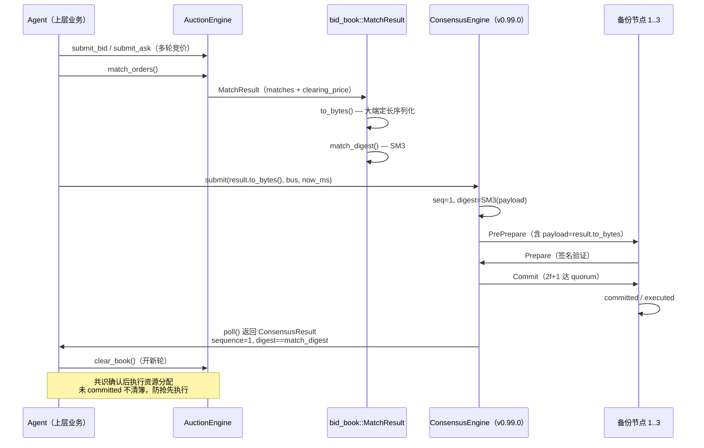

# EnerOS v0.100.0 资源争抢竞价（统一价格拍卖撮合）设计文档

> **版本**：v0.100.0
> **蓝图**：phase2.md §v0.100.0（P2-E 第 4 版）
> **Crate**：`eneros-federation`（`crates/agents/federation/src/{auction.rs,bid_book.rs,matching.rs}`，既有 crate 追加 3 模块）

---

## 1. 版本目标

实现 **联邦内多 Agent 对可调资源（储能充放、可中断负荷等）的资源争抢竞价**（**Phase 2 P2-E 第 4 版，竞价定价层**），交付三大能力：

- **统一价格拍卖撮合**：bids 降序 × asks 升序双指针匹配，成交单价 = `(bid_price + ask_price) / 2` 向下取整，出清价 = 末笔成交价；全部成交按同一出清价结算，规则简单可审计、无个体价格歧视；
- **安全底线 + 限价双重保护**：`safety_floor` 拦截异常低价（候选成交价 < floor 终止本轮），`max_price` 过滤超限报价（提交侧即拒绝，计入 `rejected_count`），防操纵与录入错误；
- **共识确认 seam**：撮合结果经 `MatchResult::to_bytes` 大端定长序列化后，由上层提交 `ConsensusEngine::submit`，PBFT 三阶段 committed 且各节点 `match_digest`（SM3）一致后方可执行资源分配。

辅助能力：

- **可观测计数器**：4 个 pub 计数器 `bid_count` / `ask_count` / `match_count` / `rejected_count` + `last_clearing_price`（D9）；no_std 无 log crate，metric 字段化本地可查；
- **快照语义**：`match_orders(&self)` 不修改 `self.book`，簿内容留待 `clear_book()` 显式清空，便于审计与重放（D12）；
- **纯函数撮合**：`match_book` 无引擎状态，独立可测、共识层可复用（D6）。

**业务价值**：共享馈线容量等域间稀缺资源由联邦内多 Agent 竞价争抢，统一价格拍卖公平定价；竞价结果经共识确认后执行，避免单点伪造撮合结果导致资源分配不公。P2-E 第 4 版为 P2-E 竞价出口的最后一环。

**Phase 定位**：P2-E 第 4 版；**上游解锁**：v0.99.0 联邦共识协议；**下游解锁**：v0.101.0 孤岛（v0.100.0 的延伸/测试）。

**性能目标**（蓝图 §7.2）：1 万订单（5000 bids + 5000 asks）撮合耗时 < 100ms（host `Instant` 口径，release 构建）—— **集成阶段验收**，本版本交付算法骨架 + Mock 单元验证（真实 Agent Runtime 注入后实测验收）。

---

## 2. 前置依赖

- **v0.99.0 联邦共识协议**（前序版本，P2-E 第 3 版）：PBFT 三阶段 + ViewChange 共识确认 seam；本版本 `MatchResult::to_bytes` 输出交由 `ConsensusEngine::submit` 确认，共识参数见 `configs/federation-consensus.toml`；
- **v0.86.0 报价意图**（Agent 业务层）：上游 Agent 将本地报价意图（Bid 类型）转换为 `BidOrder` / `AskOrder`，避免 agents 子系统内横向耦合（D11）；
- **eneros-crypto**（workspace 既有 crate，v0.33.0 国密 SM3 + CSRNG）：`sm3_hash` 复用，`match_digest` 对撮合结果取 SM3 摘要（§5.5 防重复造轮子）；`Cargo.toml` 中 path 依赖已在 v0.98.0 引入（零新增第三方依赖，SBOM 不变）；
- 蓝图 `phase2.md` v0.100.0 章节（9 节版本模板，§4.3 撮合时序 / §4.5 撮合算法 / §7.2 <100ms / §8.5 价格波动限价 / §9 可观测）；
- **no_std + alloc**：`core` / `alloc` only——`alloc::vec::Vec` / `alloc::collections::BTreeMap`；禁止 `std::*`（蓝图 §43.1 硬性要求）；
- **后续注入**：真实 Agent Runtime 调度 `AuctionEngine` 生命周期（submit → match → consensus → clear）后续由上层 Agent 注入，auction 模块不持有 ConsensusEngine（D10 seam 分离）。

**上游解锁**：v0.99.0 联邦共识协议 / v0.86.0 报价意图转换；**下游解锁**：v0.101.0 孤岛。

---

## 3. 交付物清单

- `crates/agents/federation/src/auction.rs` — **新增**：`AuctionEngine`（字段全 pub：book / safety_floor / max_price / bid_count / ask_count / match_count / rejected_count / last_clearing_price + `new` / `submit_bid` / `submit_ask` / `match_orders` / `clear_book`）
- `crates/agents/federation/src/bid_book.rs` — **新增**：定点订单簿类型——`AgentId` / `Price` / `Qty` / `BidOrder` / `AskOrder` / `Match` / `MatchResult` / `OrderBook` / `AuctionError` / `match_digest` + `to_bytes` 序列化
- `crates/agents/federation/src/matching.rs` — **新增**：纯函数 `match_book`——统一价格撮合算法（bids 降序 × asks 升序双指针，快照语义）
- `crates/agents/federation/Cargo.toml` — **修改**：description 追加 v0.100.0 段；依赖不变（eneros-crypto path 引用已在 v0.98.0 引入）
- `crates/agents/federation/src/lib.rs` — **修改**：`pub mod auction; pub mod bid_book; pub mod matching;` + 新增类型全量重导出 + crate 文档追加 v0.100.0 说明与 D1~D13 偏差表（既有 7 模块零改动）
- `configs/federation-auction.toml` — **新增**：`[auction]` 段（safety_floor / max_price + 中文注释 ≥6 点）
- `docs/agents/auction-design.md` — 本设计文档
- **30 个单元测试** TB1~TB10（bid_book.rs）/ TM11~TM22（matching.rs）/ TA23~TA30（auction.rs）（src 内嵌 `#[cfg(test)]`，v0.87.0~v0.99.0 项目惯例，不新增 tests/ 文件，D5）
- 根目录 4 文件版本同步 0.99.0 → 0.100.0（`Cargo.toml` / `Makefile` / `ci.yml` / `gate.rs` 注释）
- **无 BREAKING**：既有全部 crate 公共 API 零改动

---

## 4. 详细设计

### 4.1 数据结构（9 类型）

| 类型 | 说明 | 派生 / 备注 |
|------|------|-------------|
| `pub type AgentId = u64` | Agent 标识（D2：无堆字符串，v0.97.0 NodeId 惯例） | — |
| `pub type Price = u64` | 价格，单位毫元（1e-3 元；D1 定点替代蓝图 f32） | — |
| `pub type Qty = u64` | 数量，单位 Wh（1e-3 kWh；D1 定点） | — |
| `pub struct BidOrder { pub agent: AgentId, pub price: Price, pub qty: Qty }` | 买单 | Debug + Clone + Copy + PartialEq + Eq |
| `pub struct AskOrder { pub agent: AgentId, pub price: Price, pub qty: Qty }` | 卖单 | Debug + Clone + Copy + PartialEq + Eq |
| `pub struct Match { pub buyer: AgentId, pub seller: AgentId, pub price: Price, pub qty: Qty }` | 一笔成交记录 | Debug + Clone + Copy + PartialEq + Eq |
| `pub struct MatchResult { pub matches: Vec<Match>, pub clearing_price: Price }` | 撮合结果（一轮统一价格出清） | Debug + Clone + PartialEq + Eq |
| `pub struct OrderBook { pub bids: Vec<BidOrder>, pub asks: Vec<AskOrder> }` | 订单簿（买/卖双侧） | Debug + Clone + Default |
| `pub enum AuctionError { InvalidOrder, PriceCapExceeded }` | 竞价错误（最小完备） | Debug + Clone + Copy + PartialEq + Eq |

### 4.2 撮合算法（统一价格拍卖）

**排序规则**：
- 买单按 `price` 降序，同价按 `agent` 升序（跨节点可复现，C41）；
- 卖单按 `price` 升序，同价按 `agent` 升序。

**双指针匹配**：
- `i` 遍历 bids（已降序），`j` 遍历 asks（已升序）；
- 若 `bid[i].price < ask[j].price` → 无价格交叉，终止；
- 成交单价 `price = (bid_price + ask_price) / 2`，`u64` 除法天然向下取整（D13）；
- 若 `price < safety_floor` → 安全底线触发，终止本轮；
- 成交数量 `qty = min(bid_qty, ask_qty)`，双方数量各减，归零则指针前进；
- 出清价 `clearing_price = 末笔 match.price`；无成交则为 `0`。

**快照语义（D12）**：`match_book` 对 `book.bids` / `book.asks` 做 `clone()` 后排序并撮合，原簿不变；`AuctionEngine::match_orders` 借 `&self` 仅读簿，返回 `MatchResult` 后簿仍完整，可审计重放。

### 4.3 撮合流程 Mermaid 图

```mermaid
flowchart TD
    A[OrderBook 已入 bids/asks] --> B[clone bids & asks]
    B --> C[bids 降序排序<br/>同价 agent 升序]
    C --> D[asks 升序排序<br/>同价 agent 升序]
    D --> E{i & j 未越界?}
    E -->|否| F[无成交 → clearing_price=0]
    E -->|是| G{bid[i].price ≥ ask[j].price?}
    G -->|否| F
    G -->|是| H[price = (bid+ask)/2<br/>u64 向下取整]
    H --> I{price < safety_floor?}
    I -->|是| J[安全底线触发<br/>终止本轮]
    I -->|否| K[qty = min(bid_qty, ask_qty)]
    K --> L[push Match<br/>buyer/seller/price/qty]
    L --> M[bid_qty -= qty]
    M --> N{bid_qty == 0?}
    N -->|是| O[i += 1]
    N -->|否| P[ask_qty -= qty]
    P --> Q{ask_qty == 0?}
    Q -->|是| R[j += 1]
    Q -->|否| E
    O --> P
    R --> E
    J --> S[clearing_price = 末笔 match.price]
    F --> T[MatchResult<br/>matches + clearing_price]
    S --> T

    style A fill:#87CEEB
    style J fill:#FF6B6B
    style T fill:#90EE90
```

### 4.4 撮合 → 共识确认时序 Mermaid 图



### 4.5 to_bytes 字节布局（D10）

`MatchResult::to_bytes()` 输出：

| 字段 | 偏移 | 长度 | 编码 |
|------|------|------|------|
| `clearing_price` | 0 | 8 | u64 大端 |
| `matches.len()` | 8 | 8 | u64 大端 |
| 每 match `buyer` | 16 + 32×i | 8 | u64 大端 |
| 每 match `seller` | 24 + 32×i | 8 | u64 大端 |
| 每 match `price` | 32 + 32×i | 8 | u64 大端 |
| 每 match `qty` | 40 + 32×i | 8 | u64 大端 |

总长度 = 16 + 32 × `matches.len()`。

全部大端定长编码，跨节点逐字节一致，为 `match_digest`（SM3）共识确认前提。

### 4.6 错误处理

| 错误 | 触发条件 | 处理 | 副作用 |
|------|---------|------|--------|
| `AuctionError::InvalidOrder` | `submit_bid`/`submit_ask` 时 price==0 或 qty==0 | 拒绝入簿，返回 Err | `AuctionEngine.rejected_count += 1` |
| `AuctionError::PriceCapExceeded` | `submit_bid`/`submit_ask` 时 price > max_price（若 max_price 为 Some） | 拒绝入簿，返回 Err | `AuctionEngine.rejected_count += 1` |
| 无匹配兜底 | 价格无交叉 / safety_floor 终止 / 簿空 | 返回空 `matches` + `clearing_price=0` | 无计数器变化（match_count 不增） |

---

## 5. 技术交底

### 5.1 选型对比表（蓝图 §5.1）

| 机制 | 优势 | 劣势 | 结论 |
|------|------|------|------|
| **统一价格拍卖（uniform price）** | 规则简单可审计；全部成交按同一出清价结算，无个体价格歧视；公平性易于共识确认 | 边际 Agent 可能报高价/低价以影响出清价（策略性行为） | **采用**（蓝图 §5.1 ★） |
| 双向拍卖（double auction） | 价格发现更精细；连续撮合 | 规则复杂（撮合优先级、时间优先、数量优先交织），跨节点一致性难以逐字节对齐；共识确认成本高 | 备选（Phase 2+ 高频交易场景） |
| 轮询（round-robin） | 实现极简；无价格发现 | 无价格信号，不公平（先报先得），无法反映资源稀缺价值；无共识确认意义 | 不采用 |

### 5.2 定点化说明（D1/D13）

- **价格单位**：毫元（1e-3 元），u64；数量单位：Wh（1e-3 kWh），u64。蓝图原文 f32，偏差为定点 u64——跨节点共识确认需逐字节一致，IEEE 浮点存在平台/编译非确定风险（NaN、舍入模式、编译优化差异），定点 u64 无此问题；
- **取整规则**：成交价 `(bid_price + ask_price) / 2` 按 u64 除法天然向下取整（D13），取整方向全网点统一，方可逐字节一致；
- **无堆标识**：`AgentId = u64`，项目无堆值类型惯例（v0.97.0 NodeId=u64，电力调度确定性可复现审计）。

### 5.3 实现路径

1. `bid_book.rs`：定义 9 类型 + `to_bytes` + `match_digest`（依赖 eneros-crypto `sm3_hash`）；
2. `matching.rs`：纯函数 `match_book`——克隆簿、排序、双指针撮合、返回 `MatchResult`；零状态、零副作用；
3. `auction.rs`：`AuctionEngine` 封装簿管理、提交校验、限价过滤、快照撮合、计数器累计；不持有 `ConsensusEngine`，撮合结果字节流交由上层提交；
4. `lib.rs`：`pub mod` + re-export + crate 文档 D1~D13；
5. `configs/federation-auction.toml`：参数配置化（safety_floor / max_price）；
6. `docs/agents/auction-design.md`：设计文档。

### 5.4 难点

- **出清价公平性**：统一价格拍卖中，边际 Agent（最后一笔成交的买卖双方）的行为影响全部成交价格，存在策略性行为风险（如抬高出清价）。缓解：① `max_price` 限价过滤极端报价；② 共识确认（PBFT）防单点伪造撮合结果；③ 轮次制 + `clear_book` 降低单轮操纵影响；
- **安全底线边界**：`price == safety_floor` 含等可成交（TM19），`price < safety_floor` 终止——边界定义清晰，避免争议；
- **部分成交顺序**：同价 bid/ask 按 `agent` 升序，保证跨节点可复现（C41），否则同一簿不同节点撮合顺序不同导致 `to_bytes` 不一致、共识失败；
- **性能**：1 万订单排序为 O(n log n)，双指针 O(n)——瓶颈在排序，release 构建 < 100ms（debug 放宽到 500ms）。

### 5.5 交互

- **上游**：v0.99.0 `ConsensusEngine`（共识确认 seam）/ v0.86.0 报价意图（Agent 层将 Bid 转换为 BidOrder/AskOrder）；
- **下游**：v0.101.0 孤岛（v0.100.0 的延伸/测试版本，无新增模块）；
- **同层**：eneros-federation 内部仅新增 3 模块，既有 7 模块零改动；`AuctionEngine` 不持有 `ConsensusEngine`，字节流交由上层 Agent 注入调用。

### 5.6 国产化

- 无特殊硬件依赖；算法纯 Rust 标量计算；SM3 哈希复用 eneros-crypto（已国产化实现）；
- 无 GPU/NPU 需求；不涉及张量操作；不引入 PyTorch 等框架（边缘 LLM 用 llama.cpp，竞价为纯标量计算）。

---

## 6. 安全设计

- **安全底线保证（§7.3）**：`safety_floor` 为资源保底价值阈值（如储能度电成本下限），候选成交价 < floor 立即终止，防异常低价倾销/录入错误击穿价格体系；
- **市场操纵防御（§8.1）**：
  - `max_price` 限价：超限报价提交侧即拒绝，防恶意报高价/价格波动操纵；
  - 共识确认：撮合结果经 `to_bytes` + SM3 `match_digest` 后提交 `ConsensusEngine`，PBFT 三阶段 committed 且各节点 digest 一致后方可执行，防单点伪造撮合结果；
  - `rejected_count` 字段化可观测：斜率突增提示操纵攻击或限价配置失当；
- **提交校验**：`price == 0` 或 `qty == 0` 的订单以 `InvalidOrder` 拒绝，不入簿、不撮合，防零值攻击/空订单污染簿；
- **no_std 安全**：无 `std::` 依赖，无 panic 路径（`partial_cmp().unwrap()` 已消除，D1），无 alloc 失败默认 abort（Agent Runtime 分区 ≤ 64MB，OOM 由上层策略降级）。

---

## 7. 测试计划

30 个单元测试 TB1~TB10（bid_book.rs）/ TM11~TM22（matching.rs）/ TA23~TA30（auction.rs）（src 内嵌 `#[cfg(test)]`，v0.87.0~v0.99.0 项目惯例，不新增 tests/ 文件，D5）：

| 分组 | 编号 | 覆盖点 |
|------|------|--------|
| 类型 + 派生（TB1~TB4） | TB1 | BidOrder/AskOrder/Match Copy + Eq；AuctionError 变体互不等 |
| 簿基础（TB2~TB5） | TB2~TB5 | submit_bid/submit_ask 合法入簿、len/is_empty；price=0/qty=0 被拒；clear 后 is_empty |
| to_bytes + digest（TB6~TB10） | TB6~TB10 | 1 笔 match 字节布局（48 字节，大端位置）；空 matches 长度 16；同一结果两次 to_bytes 相等；同一 digest 相等；qty 改 1 → digest 不同 |
| 撮合基础（TM11~TM16） | TM11~TM16 | 空簿 → 空 + clearing=0；单笔交叉成交；无交叉；同价成交；partial bid remainder；partial ask remainder |
| 撮合规则（TM17~TM22） | TM17~TM22 | clearing_price == 末笔 price；safety_floor 拒绝全部；floor 边界含等；成交总 qty ≤ min(总 bids, 总 asks)；大簿冒烟（5000+5000）；同价 stable order（agent 升序） |
| 引擎基础（TA23~TA28） | TA23~TA28 | 初始状态全零；3 bid+2 ask 计数正确；max_price=Some 拒绝超限；max_price=None 接受 u64::MAX；match 更新计数器/last_clearing_price；快照语义（簿不变）；clear_book 后计数器累计 |
| 共识 e2e（TA29） | TA29 | 撮合结果经 4 节点 PBFT 集群提交，digest 一致，全部 committed |
| 性能（TA30） | TA30 | 5000 bids + 5000 asks release < 100ms（debug 放宽 500ms） |

**性能口径**：1 万订单 host `Instant` < 100ms（release 构建）；debug 构建断言阈值 500ms 防 CI 抖动。

**GPU 规则说明（蓝图 §6.6）**：本版本为纯标量 CPU 计算（排序、双指针、u64 算术、SM3 哈希），无张量操作，**不涉及 GPU**。

---

## 8. 验收标准

- **功能**：统一价格拍卖撮合（双指针、统一出清价、部分成交、安全底线、限价）；`MatchResult::to_bytes` 大端定长序列化；`match_digest` SM3 摘要；`AuctionEngine` 计数器/快照语义/轮次重置；
- **性能**：1 万订单（5000 bids + 5000 asks）撮合 < 100ms（release 构建，host `Instant` 口径）；
- **安全**：安全底线拦截异常低价；限价防操纵；提交校验 price/qty 非零；共识确认 seam（to_bytes → submit → committed）；
- **文档**：本设计文档 + `configs/federation-auction.toml` 配置模板（中文注释 ≥6 点）；
- **出口判定**：P2-E 第 4 版达成，解锁 v0.101.0 孤岛 / Phase 2 竞价出口。

---

## 9. 风险与注意事项

| 风险 | 说明 | 缓解 |
|------|------|------|
| 市场操纵（策略性行为） | 统一价格拍卖中边际 Agent 可影响全部成交价格 | `max_price` 限价过滤极端报价；共识确认防单点伪造；轮次制 + `clear_book` 降低单轮影响；`rejected_count` 可观测告警 |
| 依赖 v0.99.0 共识 | 撮合结果须经共识确认方可执行，若共识层未 ready 则竞价无法闭环 | 本模块独立可测（AuctionEngine 不持有 ConsensusEngine）；共识层 ready 后上层 Agent 注入调用 |
| 资源占用小 | 订单簿 Vec + 计数器 u64，内存占用极低；1 万订单约 < 1MB | Agent Runtime ≤ 64MB 预算内；大簿场景由上层 Agent 控制轮次窗口大小 |
| 多资源竞价兼容 | 当前版本单一资源类型（统一 price/qty 语义），多资源类型（如储能 + 光伏 + 负荷）需每资源独立 AuctionEngine 实例或后续扩展 resource_type 字段 | 本版本定位为单一资源竞价；多资源类型扩展见 Phase 2+ 蓝图 |
| 价格波动需限价（§8.5） | 电力现货价格日内波动大，无上限限价时恶意/错误报价可操纵市场 | `max_price` 配置化，按现货上限/园区封顶价设定；`rejected_count` 斜率突增告警 |

---

## 10. 多角度要求

- **功能**（蓝图 §9）：统一价格拍卖撮合全流程（submit → match → clear）；安全底线 + 限价；快照语义；部分成交；
- **性能**（蓝图 §9）：< 100ms（1 万订单，release 构建，host `Instant`）；
- **安全底线**（蓝图 §9）：`safety_floor` 拦截异常低价；`max_price` 防操纵；
- **无匹配兜底可靠**（蓝图 §9）：价格无交叉 / safety_floor 终止 / 簿空 → 空 `matches` + `clearing_price=0`，上层 Agent 可按规则降级（如轮询或保留上一轮出清价）；
- **规则配置化可维护**（蓝图 §9）：`configs/federation-auction.toml` 参数化 safety_floor / max_price；算法代码固化（跨节点必须逐字节一致）；
- **成交 metric 可观测**（蓝图 §9）：4 个 pub 计数器 + `last_clearing_price`；no_std 无 log crate，metric 字段化本地可查；
- **多资源类型可扩展**（蓝图 §9）：当前单一资源类型，后续可扩展 `resource_type: u64` 字段，每资源独立簿或复合簿；
- **no_std**（蓝图 §43.1）：`core` / `alloc` only；禁止 `std::*`；aarch64-unknown-none 交叉编译友好；path 依赖 eneros-crypto 既有 crate，零新增第三方依赖，SBOM 不变（D11）。

---

## 11. 接口契约

pub 项签名清单（与 spec.md 一致，含实现修正标注）：

```rust
// ===== bid_book.rs =====

/// Agent 标识（D2：无堆 u64，v0.97.0 NodeId 惯例）
pub type AgentId = u64;
/// 价格（毫元，1e-3 元；D1 定点替代蓝图 f32）
pub type Price = u64;
/// 数量（Wh，1e-3 kWh；D1 定点）
pub type Qty = u64;

/// 买单（竞价求购资源），Debug + Clone + Copy + PartialEq + Eq
pub struct BidOrder {
    pub agent: AgentId,
    pub price: Price,
    pub qty: Qty,
}

/// 卖单（出让资源），Debug + Clone + Copy + PartialEq + Eq
pub struct AskOrder {
    pub agent: AgentId,
    pub price: Price,
    pub qty: Qty,
}

/// 一笔成交记录，Debug + Clone + Copy + PartialEq + Eq
pub struct Match {
    pub buyer: AgentId,
    pub seller: AgentId,
    /// 成交单价（统一出清价口径，毫元/Wh）
    pub price: Price,
    pub qty: Qty,
}

/// 撮合结果（一轮统一价格出清），Debug + Clone + PartialEq + Eq
pub struct MatchResult {
    pub matches: Vec<Match>,
    /// 出清价（末笔成交价；无成交为 0）
    pub clearing_price: Price,
}

impl MatchResult {
    /// 确定性序列化（D10）：`clearing_price:u64be ‖ count:u64be ‖
    /// 每 match buyer‖seller‖price‖qty 各 u64be`。
    /// 长度 = 16 + 32 × matches.len()。全部大端定长编码，跨节点逐字节一致。
    pub fn to_bytes(&self) -> Vec<u8>;
}

/// 订单簿（买/卖双侧，快照语义由撮合层保证），Debug + Clone + Default
pub struct OrderBook {
    pub bids: Vec<BidOrder>,
    pub asks: Vec<AskOrder>,
}

impl OrderBook {
    pub fn new() -> Self;
    pub fn is_empty(&self) -> bool;
    pub fn len(&self) -> usize;
    /// 提交买单：price==0 或 qty==0 → `Err(InvalidOrder)` 且不入簿
    pub fn submit_bid(&mut self, b: BidOrder) -> Result<(), AuctionError>;
    /// 提交卖单：price==0 或 qty==0 → `Err(InvalidOrder)` 且不入簿
    pub fn submit_ask(&mut self, a: AskOrder) -> Result<(), AuctionError>;
    /// 清空双侧订单（新一轮竞价）
    pub fn clear(&mut self);
}

/// 竞价错误（最小完备），Debug + Clone + Copy + PartialEq + Eq
pub enum AuctionError {
    InvalidOrder,
    PriceCapExceeded,
}

/// 撮合结果 SM3 摘要（D10：供 v0.99.0 共识确认）
pub fn match_digest(result: &MatchResult) -> [u8; 32];

// ===== matching.rs =====

/// 统一价格撮合（蓝图 §4.5）：bids 价格降序 × asks 价格升序双指针；
/// 价格交叉成交，价=(bid+ask)/2 向下取整；`price < safety_floor` 停止；
/// 快照语义——不修改入参簿（D12）。
pub fn match_book(book: &OrderBook, safety_floor: Price) -> MatchResult;

// ===== auction.rs =====

/// 资源争抢竞价引擎（字段全 pub，便于测试观测）
pub struct AuctionEngine {
    pub book: OrderBook,
    pub safety_floor: Price,
    pub max_price: Option<Price>,
    pub bid_count: u64,
    pub ask_count: u64,
    pub match_count: u64,
    pub rejected_count: u64,
    pub last_clearing_price: Price,
}

impl AuctionEngine {
    /// 创建引擎：空簿、计数器全零
    pub fn new(safety_floor: Price, max_price: Option<Price>) -> Self;
    /// 提交买单：先簿校验，再 max_price 限价校验；
    /// 任一失败计入 `rejected_count`；成功计入 `bid_count`
    pub fn submit_bid(&mut self, b: BidOrder) -> Result<(), AuctionError>;
    /// 提交卖单：校验与计数语义同 `submit_bid`
    pub fn submit_ask(&mut self, a: AskOrder) -> Result<(), AuctionError>;
    /// 快照撮合（D12）：不修改 `self.book`；本轮成交笔数累入 `match_count`；
    /// 有成交则更新 `last_clearing_price`
    pub fn match_orders(&mut self) -> MatchResult;
    /// 清空订单簿（新一轮竞价；计数器不归零，全生命周期累计）
    pub fn clear_book(&mut self);
}
```

**与 ConsensusEngine 的对接约定**：
- `AuctionEngine` 不持有 `ConsensusEngine`（D10 seam 分离）；
- 上层 Agent 调用 `match_orders()` 得 `MatchResult`；
- `result.to_bytes()` 输出大端定长字节流（16 + 32×matches.len()）；
- `match_digest(&result)` 对其取 SM3 摘要；
- 字节流提交 `ConsensusEngine::submit(payload, bus, now_ms)`，seq 返回后由 `poll` 驱动；
- 4 节点 committed 且各节点 `digest == match_digest(&result)` 后，上层 Agent 调用 `clear_book()` 开新轮；
- 未 committed 前不清簿，防抢先执行。

**单位与取整规则（D13）**：
- 价格单位：毫元（1e-3 元），`Price = u64`；
- 数量单位：Wh（1e-3 kWh），`Qty = u64`；
- 成交价 `(bid_price + ask_price) / 2`，`u64` 除法天然向下取整，全网点一致；
- 出清价 = 末笔 `match.price`，无成交 = 0。

---

## 12. 偏差声明

| 偏差 | 蓝图原文 | 本版本处理 |
|------|---------|----------|
| **D1** | 蓝图 f32 price/qty | 定点 u64（Price=毫元 1e-3 元，Qty=Wh 1e-3 kWh）——跨节点共识确认需逐字节一致，IEEE 浮点存在平台/编译非确定风险；定点无 NaN、字节稳定，且消除 `partial_cmp().unwrap()` panic 路径（no_std 禁 panic 惯例） |
| **D2** | 蓝图 `agent.clone()` 暗示 String | `AgentId = u64`——项目无堆值类型惯例（v0.97.0 NodeId=u64，电力调度确定性可复现审计） |
| **D3** | 蓝图 `crates/federation/src/` | `crates/agents/federation/src/`——记忆 §2.3.1 强制：所有 crate 归 `crates/<subsystem>/`；eneros-federation 既有 crate 增量扩展（v0.98.0~v0.99.0 同例） |
| **D4** | 蓝图 `docs/phase2/auction.md` | `docs/agents/auction-design.md`——记忆 §2.3.3 强制：文档按方向分类，agents 子系统文档归 `docs/agents/` |
| **D5** | 蓝图 `tests/auction.rs` | src 内嵌 `#[cfg(test)]` 30 测试——v0.87.0~v0.99.0 项目惯例，不新增 tests/ 文件 |
| **D6** | 撮合算法在 `auction.rs` 内 | 独立 `matching.rs` 纯函数 `match_book`——蓝图文件名保留；纯函数（无引擎状态）独立可测，AuctionEngine 仅做簿管理/校验/计数 |
| **D7** | `submit_bid/submit_ask` 空返回 | 返回 `Result<(), AuctionError>`——price=0/qty=0/超限价需入簿前拒绝；蓝图 §4.4 错误处理"安全底线违反→拒绝"扩展至提交侧 |
| **D8** | 蓝图无限价 | `AuctionEngine` 增 `max_price: Option<Price>`——蓝图 §8.5 坑点"价格波动大需限价"的直接对策 |
| **D9** | 蓝图无可观测计数器 | 增 4 计数器（bid_count/ask_count/match_count/rejected_count）+ `last_clearing_price`——蓝图 §9 可观测"成交记录 metric"；no_std 无 log crate，metric 字段化（v0.99.0 D12 同例） |
| **D10** | 蓝图无共识序列化 | 增 `MatchResult::to_bytes()` + `match_digest()`（SM3）——蓝图 §4.3 末步"共识确认"的落地 seam；auction 模块不持有 ConsensusEngine，序列化字节交由上层 submit，保持模块独立可测 |
| **D11** | 复用 v0.86.0 `Bid` 类型 | 新建 `BidOrder/AskOrder`——eneros-federation 保持仅依赖 eneros-crypto（SBOM 不变）；v0.86.0 报价意图由上层适配转换，避免 agents 子系统内横向耦合 |
| **D12** | 蓝图 `match_orders` 消耗簿 | 保持 `&self` 快照语义（不消耗簿），增 `clear_book()` 轮次重置——蓝图 §4.2 签名为 `&self`；轮次制拍卖需在共识确认后清簿开新轮 |
| **D13** | 蓝图未定义取整方向 | 成交价 `(bid+ask)/2` 定点 u64 向下取整——定点化配套确定性规则；取整方向全网点一致方可逐字节一致 |

---

## 附录

### A. 源码路径

- `crates/agents/federation/src/auction.rs`
- `crates/agents/federation/src/bid_book.rs`
- `crates/agents/federation/src/matching.rs`
- `crates/agents/federation/src/lib.rs`
- crate 根：`crates/agents/federation/`

### B. 配置路径

- `../../configs/federation-auction.toml`
- 共识配置：`../../configs/federation-consensus.toml`

### C. 相关文档

- [pbft-consensus-design.md](./pbft-consensus-design.md) — v0.99.0 联邦共识协议设计文档（P2-E 第 3 版，共识确认 seam）
- [federation-discovery-design.md](./federation-discovery-design.md) — v0.97.0 联邦发现设计文档（P2-E 第 1 版）
- [cross-domain-channel-design.md](./cross-domain-channel-design.md) — v0.98.0 跨域通信通道设计文档（P2-E 第 2 版）
- [vertical-encrypt-design.md](./vertical-encrypt-design.md) — v0.98.1 纵向加密认证设计文档
- Spec：`.trae/specs/develop-v0100-auction/spec.md`（若存在）
- 蓝图：`蓝图/phase2.md` §v0.100.0（P2-E 第 4 版；§4.3 撮合时序 / §4.5 撮合算法 / §7.2 <100ms / §8.5 价格波动限价 / §9 可观测）

### D. 版本阶梯

- **Phase 定位**：Phase 2 多机联邦 P2-E 第 4 版（前序 v0.99.0 联邦共识 P2-E 第 3 版）
- **下游解锁**：v0.101.0 孤岛（v0.100.0 延伸测试）
- **版本阶梯**：v0.97.0 联邦发现 → v0.98.0 跨域通信通道 → v0.98.1 纵向加密 → v0.99.0 联邦共识 → **v0.100.0 资源争抢竞价（本版本）** → v0.101.0 孤岛
