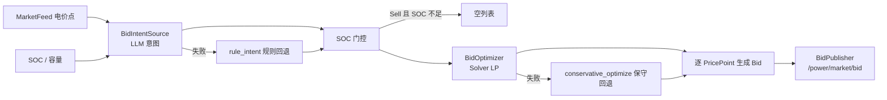
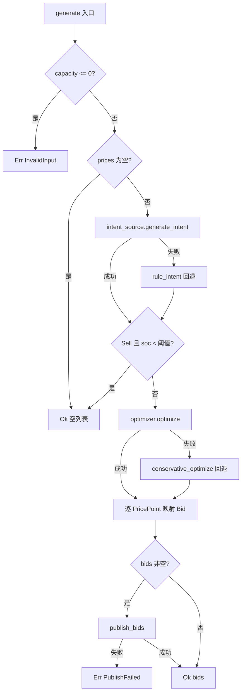

# EnerOS v0.86.0 报价生成设计文档

> **版本**：v0.86.0
> **Phase**：Phase 2 多机联邦
> **子系统**：`crates/agents/energy-market-agent`（subsystem = agents，追加模块 `bid_generator`）
> **蓝图依据**：`蓝图/phase2.md` §v0.86.0
> **状态**：设计中
> **最后更新**：2026-07-17

---

## 目录

1. [版本目标](#1-版本目标)
2. [前置依赖](#2-前置依赖)
3. [交付物清单](#3-交付物清单)
4. [数据结构](#4-数据结构)
5. [接口设计](#5-接口设计)
6. [错误处理](#6-错误处理)
7. [选型对比](#7-选型对比)
8. [实现路径](#8-实现路径)
9. [测试计划](#9-测试计划)
10. [验收标准](#10-验收标准)
11. [风险与坑点](#11-风险与坑点)
12. [偏差声明（D1~D14）](#12-偏差声明d1d14)

---

## 1. 版本目标

### 1.1 核心目标

v0.86.0 在 v0.85.0 市场数据订阅（`MarketFeed` / `PricePoint` / `MarketType` / `Period`）之上，进入 P2-C 子阶段 Agent 矩阵扩展的第五步，交付 **报价生成（Bid Generation）**：在既有 `eneros-energy-market-agent` crate 中追加 `bid_generator.rs` 单文件模块，Market Agent 基于市场数据 / SOC / 容量生成市场报价，发布到 `/power/market/bid`：

- **双脑架构**：「意图（`BidIntentSource` trait，未来接 LLM）→ 优化（`BidOptimizer` trait，未来接 Solver LP）→ 生成 → 发布（`BidPublisher` trait，未来接 DDS）」四段流水线（蓝图 §4.1~§4.3）。
- **两级确定性回退**：意图失败回退 `rule_intent()`（规则策略：`side=Sell`，`target_quantity=min(max_quantity, capacity*soc)`，偏差 D9）；优化失败回退 `conservative_optimize()`（保守报价：`price_adjust=margin`，`quantity=min(target, max_quantity)`，偏差 D10），保证 LLM / Solver 不可用时报价链路不中断（蓝图 §4.4）。
- **SOC 门控**：`Sell` 且 `soc < soc_threshold` 时不报价（返回空列表），防止低电量卖出导致储能过放。

产出 `Vec<Bid>` 为 **v0.100.0 竞价** 提供 `Bid` 输入（下游消费）。

本版本严格遵循 Karpathy 4 原则：

- **Simplicity First**：仅追加 1 个新源文件 + 一个配置模板 + 本设计文档；不新增 crate、不新增依赖、不修改 v0.72.0 / v0.85.0 既有源代码。
- **Surgical Changes**：`lib.rs` 仅追加 1 个 `pub mod` + 1 行 `pub use` 重导出；`Cargo.toml` 仅更新 `description` 字段；既有 66 tests 必须无回归。

### 1.2 核心数据流



**图示说明**：

- `MarketFeed.prices`（v0.85.0 电价点列表）与 SOC / 容量共同输入 `BidIntentSource` 生成报价意图（买 / 卖方向与目标量）
- 意图失败时回退 `rule_intent()` 规则策略（确定性，测试可复现）
- SOC 门控在意图之后、优化之前：`Sell` 且 SOC 低于阈值直接短路返回空列表
- `BidOptimizer` 输出价差调整与报价量；失败时回退 `conservative_optimize()` 保守报价
- 对 `feed.prices` 中每个 `PricePoint` 生成 1 条 `Bid`（period 级报价，偏差 D13）
- `bids` 非空时经 `BidPublisher` 发布到 `/power/market/bid`（蓝图 §4.3）

### 1.3 业务价值

| 业务价值 | 说明 |
|---------|------|
| **v0.100.0 竞价** | `Bid` 列表是竞价版本的直接输入，本版本是其唯一报价来源 |
| **现货套利闭环** | 消费 v0.85.0 现货电价点，结合储能 SOC / 容量自动生成卖出 / 买入报价 |
| **双脑落地** | LLM 意图 + Solver 优化的双脑模式（v0.69.0 意图契约概念）在市场报价场景落地 |
| **确定性降级** | 两级规则回退保证 LLM / Solver 故障时报价链路可用（蓝图 §4.4） |
| **储能保护** | SOC 门控防止低电量卖出报价，避免储能过放 |

### 1.4 Phase 定位

| 维度 | 定位 |
|------|------|
| Phase | Phase 2 多机联邦（v0.75.0~v0.126.0） |
| 子阶段 | P2-C Agent 矩阵扩展第五步 |
| 平面 | 慢平面（Agent Runtime 分区，管理信息大区） |
| 角色 | 报价生成器（意图 → 优化 → 生成 → 发布流水线） |
| 上游版本 | v0.85.0 市场数据订阅（`MarketFeed` 直接复用，零适配层） |
| 下游版本 | v0.100.0 竞价（消费 `Bid`）；v1.0.0 商用版 |

---

## 2. 前置依赖

### 2.1 前序版本依赖

| 版本 | 交付物 | 本版本使用方式 |
|------|--------|---------------|
| v0.85.0 | 市场数据订阅（`MarketFeed` / `PricePoint` / `MarketType` / `Period` / `MarketError`） | 直接复用为报价输入（偏差 D3：`feed: &MarketFeed`）；`MarketType` / `Period` 不重定义；沿用 trait + Mock 模式与内嵌测试模式 |
| v0.69.0 | 意图契约（双脑模式概念来源） | 「LLM 意图 + Solver 优化」双脑架构的概念来源；本版本 `BidIntent` 为其在报价场景的最小实例化 |
| v0.66.0 | Energy LP 模型 | 本版本不直接依赖；可选未来桥接方向：真实 `BidOptimizer` 适配器可基于 LP 模型实现 |
| v0.72.0 | Energy/Market Agent 基础 crate（`eneros-energy-market-agent`） | 直接扩展既有 crate（偏差 D2）；既有测试必须无回归 |

### 2.2 外部依赖

| 依赖 | 版本 | 用途 | feature |
|------|------|------|---------|
| `alloc::boxed::Box` | core | `BidGenerator.intent_source` / `optimizer` / `publisher` 动态派发 | 默认 |
| `alloc::vec::Vec` | core | `generate` 返回 `Vec<Bid>` | 默认 |

> **说明**：本版本为算法骨架，不引入 `eneros-llm-engine` / `eneros-solver-core` / `eneros-agent-bus-dds` 重依赖（偏差 D5 / D6 / D11，沿用 v0.85.0 D8 / D9 模式）。三个 trait 抽象隔离 LLM / Solver / DDS 层，真实适配器延后到集成阶段注入。SBOM 不变。

### 2.3 假设

1. **单线程 no_std 假设**：Agent Runtime 在 Phase 2 阶段为单线程模型（蓝图 §43.6 内存预算：Agent Runtime ≤ 64 MB），`BidIntentSource` / `BidOptimizer` / `BidPublisher` trait 不要求 `Send + Sync`（沿用 v0.82.0 D10 / v0.85.0 单线程假设）。
2. **gPTP 已同步假设**：v0.79.0 gPTP 已完成时间同步，`now_ms: u64` 注入的时间戳可信且单调递增，直接作为 `Bid.timestamp`。
3. **市场接口可用性假设**：`MarketFeed` 由 v0.85.0 `MarketSubscriber` 提供；缓存降级（last-good）保证市场接口中断时本版本仍有输入。
4. **外部调度器驱动假设**：`generate(feed, soc, capacity, now_ms)` 由外部调度器（Agent Runtime tick）周期驱动，本版本不内置 async runtime / ticker（偏差 D1）。

### 2.4 阻塞条件

无。本版本为算法骨架先行，不依赖真实 LLM / Solver / DDS 总线。`MockBidIntentSource` / `MockBidOptimizer` / `MockBidPublisher` 完全可单元测试。

---

## 3. 交付物清单

### 3.1 代码交付物

| # | 路径 | 类型 | 说明 |
|---|------|------|------|
| 1 | `crates/agents/energy-market-agent/src/bid_generator.rs` | 源码（新增） | 报价生成单文件模块：数据模型（`BidSide` / `Bid` / `BidStrategy` / `BidIntent` / `BidOptimization` / `BidError`）+ 3 trait（`BidIntentSource` / `BidOptimizer` / `BidPublisher`）+ 3 Mock + 回退函数（`rule_intent` / `conservative_optimize`）+ `BidGenerator` + T43~T80 共 38 个内嵌单元测试 |
| 2 | `crates/agents/energy-market-agent/src/lib.rs` | 源码（修改） | 追加 1 个 `pub mod bid_generator;` + 1 行 `pub use` 重导出 + 顶部文档注释更新（surgical，仅追加，不修改 v0.72.0 / v0.85.0 既有代码） |
| 3 | `crates/agents/energy-market-agent/Cargo.toml` | 配置（修改） | `description` 字段追加 "+ v0.86.0 报价生成"（无新依赖） |

### 3.2 配置与文档交付物

| # | 路径 | 类型 | 说明 |
|---|------|------|------|
| 4 | `configs/bid_strategy.toml` | 配置（新增） | 报价策略配置模板：`[strategy]` margin / max_quantity / soc_threshold + `[resource]` resource_id + `[publish]` bid_topic + `[fallback]` 两级回退注释 |
| 5 | `docs/agents/bid-generation-design.md` | 文档（新增） | 本设计文档：12 章节 + 2 Mermaid 图 + D1~D14 偏差声明 |

### 3.3 版本同步交付物

| # | 文件 | 修改内容 |
|---|------|---------|
| 6 | `Cargo.toml`（根） | `[workspace.package] version = "0.86.0"` |
| 7 | `Makefile` | VERSION 变量 + header 注释 → `0.86.0` |
| 8 | `.github/workflows/ci.yml` | 版本号 `0.86.0` |
| 9 | `ci/src/gate.rs` | clippy 段 / test 段注释同步（如适用） |

### 3.4 不交付内容（明确范围）

本版本**不**交付以下内容（避免范围蔓延，遵守 Karpathy "Surgical Changes" 原则）：

- ❌ 真实 LLM 意图适配器（`BidIntentSource` 桥接 `eneros-llm-engine`，集成阶段注入，偏差 D5）
- ❌ 真实 Solver LP 优化适配器（`BidOptimizer` 桥接 `eneros-solver-core` / v0.66.0 LP 模型，集成阶段注入，偏差 D6）
- ❌ 真实 DDS 发布适配器（`BidPublisher` 桥接 `eneros-agent-bus-dds`，集成阶段注入，偏差 D11）
- ❌ 竞价 / 出清逻辑（v0.100.0 范围）
- ❌ DR 信号报价（`feed.prices` 为空 → `Ok([])`，DR 报价 MVP 不覆盖，偏差 D13）
- ❌ 多资源批量报价（单 `resource_id`，后续版本扩展）

---

## 4. 数据结构

### 4.1 类型总览

| 类型 | 类别 | 字段 / 变体 | 派生 | 说明 |
|------|------|------------|------|------|
| `BidSide` | 枚举 | `Buy` / `Sell` | `Debug + Clone + Copy + PartialEq + Eq + Default` | 报价方向；**默认 `Buy`**（`#[default]`） |
| `Bid` | 结构体 | 8 字段（见 §4.2） | `Debug + Clone + Copy + PartialEq` | 单条报价，保持 `Copy`（偏差 D4） |
| `BidStrategy` | 结构体 | `margin` / `max_quantity` / `soc_threshold` | `Debug + Clone + Copy + PartialEq` | 报价策略参数（对应 `configs/bid_strategy.toml`） |
| `BidIntent` | 结构体 | `side` / `target_quantity` | `Debug + Clone + Copy + PartialEq` | 意图中间结构（偏差 D7） |
| `BidOptimization` | 结构体 | `price_adjust` / `quantity` | `Debug + Clone + Copy + PartialEq` | 优化中间结构（偏差 D7） |
| `BidError` | 枚举 | `InvalidInput` / `IntentFailed` / `OptimizeFailed` / `PublishFailed` | `Debug + Clone + Copy + PartialEq + Eq` | 4 变体错误（偏差 D8） |

> **复用声明**：`MarketType` / `Period` / `PricePoint` / `MarketFeed` 复用 v0.85.0 `market_feed.rs`，本模块**不重定义**（偏差 D3：同 crate 直接复用，零适配层）。

### 4.2 `Bid` 8 字段表

| # | 字段 | 类型 | 单位 | 说明 |
|---|------|------|------|------|
| 1 | `bid_id` | `u64` | — | 报价 ID，`BidGenerator.next_bid_id` 递增生成（偏差 D4） |
| 2 | `market_type` | `MarketType` | — | 市场类型（v0.85.0 复用：Spot / AncillaryService / Dr） |
| 3 | `resource_id` | `u64` | — | 报价资源 ID（偏差 D4：no_std 无堆 String，用 u64） |
| 4 | `price` | `f32` | 元/MWh | 报价价格（Sell：`point.price + price_adjust`；Buy：`(point.price - price_adjust).max(0.0)`，偏差 D14） |
| 5 | `quantity` | `f32` | MW | 报价量（`min(opt.quantity, max_quantity, capacity).max(0.0)`，偏差 D14） |
| 6 | `side` | `BidSide` | — | 报价方向（Buy / Sell） |
| 7 | `period` | `Period` | — | 报价时段（v0.85.0 复用，per-period 报价，偏差 D13） |
| 8 | `timestamp` | `u64` | ms | 报价生成时间戳（`now_ms` 注入，偏差 D1） |

### 4.3 `BidStrategy` 字段

| 字段 | 类型 | 单位 | 配置项 | 说明 |
|------|------|------|--------|------|
| `margin` | `f32` | 元/MWh | `strategy.margin` | 价差边际；保守回退时即 `price_adjust`（偏差 D14） |
| `max_quantity` | `f32` | MW | `strategy.max_quantity` | 单笔最大报价量（蓝图 §7.3 "报价不超容量上限"） |
| `soc_threshold` | `f32` | 0.0~1.0 | `strategy.soc_threshold` | SOC 阈值；`Sell` 且 `soc < soc_threshold` 时禁止卖出报价 |

### 4.4 中间结构（偏差 D7）

蓝图引用 `generate_bid_intent` / `solve_bid` / `into_bids` 但未定义其签名与中间类型。本版本定义两个 MVP 最小中间结构，禁止投机字段（Simplicity First）：

- `BidIntent { side: BidSide, target_quantity: f32 }`：意图阶段输出——报价方向 + 目标量
- `BidOptimization { price_adjust: f32, quantity: f32 }`：优化阶段输出——价差调整 + 报价量

最终 `Bid` 由 `generate` 内联映射生成（对每个 `PricePoint`，偏差 D13 / D14）。

---

## 5. 接口设计

### 5.1 三个 trait 签名

```rust
/// 报价意图来源（未来接 LLM，偏差 D5）.
pub trait BidIntentSource {
    /// 基于市场数据与 SOC 生成报价意图.
    fn generate_intent(&mut self, feed: &MarketFeed, soc: f32) -> Result<BidIntent, BidError>;
}

/// 报价优化器（未来接 Solver LP，偏差 D6）.
pub trait BidOptimizer {
    /// 基于意图、市场数据、SOC 与容量优化报价.
    fn optimize(
        &mut self,
        intent: &BidIntent,
        feed: &MarketFeed,
        soc: f32,
        capacity: f32,
    ) -> Result<BidOptimization, BidError>;
}

/// 报价发布器（未来接 DDS /power/market/bid，偏差 D11）.
pub trait BidPublisher {
    /// 发布报价列表.
    fn publish_bids(&mut self, bids: &[Bid]) -> Result<(), BidError>;
}
```

**设计要点**：

- 三个 trait **不要求 `Send + Sync`**：no_std 单线程 Agent Runtime 分区（§2.3 假设 1，沿用 v0.82.0 D10 / v0.85.0 先例）。
- 真实 LLM / Solver / DDS 适配器在集成阶段实现对应 trait 后注入（偏差 D5 / D6 / D11）；本版本交付 `MockBidIntentSource` / `MockBidOptimizer` / `MockBidPublisher` 支撑单元测试。
- `Box<dyn ...>` 动态派发（单线程，`Arc` 需要原子 + 线程语义，不适用，偏差 D5）。

### 5.2 `BidGenerator` 签名

```rust
impl BidGenerator {
    /// 构造报价生成器.
    pub fn new(
        strategy: BidStrategy,
        resource_id: u64,
        intent_source: Box<dyn BidIntentSource>,
        optimizer: Box<dyn BidOptimizer>,
        publisher: Box<dyn BidPublisher>,
    ) -> Self;

    /// 生成报价（意图 → SOC 门控 → 优化 → 逐 PricePoint 生成 → 发布）.
    ///
    /// - `feed`: v0.85.0 市场数据（电价点列表）
    /// - `soc`: 储能荷电状态（0.0~1.0）
    /// - `capacity`: 储能容量（MW）；`capacity <= 0.0` → `Err(BidError::InvalidInput)`
    /// - `now_ms`: 当前时间戳（注入，作为 `Bid.timestamp`）
    pub fn generate(
        &mut self,
        feed: &MarketFeed,
        soc: f32,
        capacity: f32,
        now_ms: u64,
    ) -> Result<Vec<Bid>, BidError>;
}
```

**设计要点**：

- `&mut self`：`next_bid_id` 递增 + Mock 内部状态更新（偏差 D1）。
- 同步 `fn`（非 `async`）：no_std 无 async runtime（偏差 D1，沿用 v0.82~v0.85 D1/D2）。
- `now_ms: u64` 参数注入：no_std 无系统时钟，确定性可测试。

---

## 6. 错误处理

### 6.1 `BidError` 4 变体（偏差 D8）

| 变体 | 触发点 | 语义 |
|------|--------|------|
| `InvalidInput` | `generate` 入口校验 | `capacity <= 0.0`（容量非法，无法报价） |
| `IntentFailed` | `BidIntentSource::generate_intent` 返回 `Err` | 意图生成失败（LLM 输出非法 / 不可用） |
| `OptimizeFailed` | `BidOptimizer::optimize` 返回 `Err` | 优化失败（Solver 不可用 / 超时） |
| `PublishFailed` | `BidPublisher::publish_bids` 返回 `Err` | 发布失败（DDS 总线异常） |

> MVP 错误分类，与 v0.85.0 D7 `MarketError` 3 变体风格一致（偏差 D8）。

### 6.2 两级回退映射表（蓝图 §4.4）

| 失败点 | 错误处理 | 结果 |
|--------|---------|------|
| `capacity <= 0.0` | **不回退**，直接 `Err(InvalidInput)` | 入口参数校验失败，上层修正 |
| 意图失败（`IntentFailed`） | 回退 `rule_intent()`（偏差 D9） | `side=Sell`，`target_quantity=min(max_quantity, capacity*soc)`；流水线继续 |
| 优化失败（`OptimizeFailed`） | 回退 `conservative_optimize()`（偏差 D10） | `price_adjust=margin`，`quantity=min(target, max_quantity)`；流水线继续 |
| 发布失败（`PublishFailed`） | **不回退**，`Err(PublishFailed)` 传播 | bids 已生成但发布失败，上层决定重试 |

**回退确定性原则**：`rule_intent()` 与 `conservative_optimize()` 均为纯函数式自由函数，输出仅由输入与 `BidStrategy` 决定，测试可复现（蓝图 §4.4 "LLM 输出非法 → 回退到规则策略" / "Solver 不可用 → 使用保守报价"）。

---

## 7. 选型对比

蓝图 §5.1 要求对比报价生成三种技术路线：

| 方案 | 延迟 | 可解释性 | 适用场景 | 依赖 |
|------|------|---------|---------|------|
| 规则报价（`rule_intent` + `conservative_optimize`） | 极低（< 1ms，纯算术） | 高（规则确定，可逐条审计） | 兜底降级、合规审计场景、LLM/Solver 不可用 | 无（本 crate 自包含） |
| **LP 优化（`BidOptimizer` 接 Solver）⭐ 主用** | 中（10~100ms，LP 求解） | 中高（目标函数 + 约束显式） | 常规现货报价、功率 / 价格联合优化 | `eneros-solver-core` / v0.66.0 LP 模型（集成阶段注入） |
| LLM + LP（`BidIntentSource` 接 LLM + Solver） | 高（秒级，LLM 推理 + LP） | 中（LLM 意图需契约校验） | 复杂市场场景（多市场联合、自然语言策略输入、非结构化信息融入） | `eneros-llm-engine` + Solver（集成阶段注入） |

**结论（蓝图 §5.1）**：

- **LP 优化为主用方案（⭐）**：延迟与可解释性平衡，满足现货报价常规需求，符合「L1 主路径 Solver-only」定位。
- **规则报价兜底**：两级回退（D9 / D10）保证 LLM / Solver 故障时链路不中断，且规则确定性便于合规审计。
- **LLM + LP 面向复杂场景**：作为增强路径（L2），仅在需要自然语言策略 / 非结构化信息时启用，可降级到 L1。

---

## 8. 实现路径

### 8.1 单文件模块

`crates/agents/energy-market-agent/src/bid_generator.rs` 单文件承载全部内容：

```
bid_generator.rs
├── 数据模型      BidSide / Bid / BidStrategy / BidIntent / BidOptimization / BidError
├── 3 trait       BidIntentSource / BidOptimizer / BidPublisher
├── 3 Mock        MockBidIntentSource / MockBidOptimizer / MockBidPublisher
├── 回退函数      rule_intent() / conservative_optimize()（自由函数，确定性）
├── BidGenerator  new() / generate()（next_bid_id 递增）
└── #[cfg(test)]  mod tests（T43~T80 共 38 个内嵌单元测试，沿用 v0.82~v0.85 模式）
```

### 8.2 Surgical 追加

- `lib.rs`：仅追加 `pub mod bid_generator;` + `pub use bid_generator::{...};` 重导出，**不修改 v0.72.0 / v0.85.0 既有代码任何一行**。
- `Cargo.toml`：仅更新 `description` 字段。
- **无新依赖**（偏差 D5 / D6 / D11）：不引入 `eneros-llm-engine` / `eneros-solver-core` / `eneros-agent-bus-dds`，SBOM 不变，`deny.toml` 不变。

### 8.3 `generate` 决策流程



**决策顺序要点**：

1. 入口校验：`capacity <= 0.0` → `Err(InvalidInput)`（不回退）
2. 空价格短路：`feed.prices` 为空（如 DR-only feed）→ `Ok([])`（偏差 D13：DR 信号 MVP 不报价）
3. 意图：失败回退 `rule_intent()`
4. **SOC 门控先于优化**：`Sell` 且 `soc < soc_threshold` → `Ok([])`（见 §11 坑点 2）
5. 优化：失败回退 `conservative_optimize()`
6. 逐 `PricePoint` 映射 `Bid`（per-period 报价，偏差 D13 / D14）
7. 发布：`bids` 非空才调用 `publish_bids`；失败传播 `Err(PublishFailed)`

---

## 9. 测试计划

### 9.1 测试概览

本版本共 **38 个单元测试**（T43~T80，编号承接 v0.85.0 T1~T42），全部位于 `bid_generator.rs` 文件内 `#[cfg(test)] mod tests`（偏差 D12，沿用 v0.82~v0.85 内嵌测试模式）。

| 分类 | 编号 | 数量 | 覆盖 |
|------|------|------|------|
| 数据模型 | T43~T49 | 7 | `BidSide` / `Bid` / `BidStrategy` / `BidIntent` / `BidOptimization` / `BidError` |
| Mock | T50~T56 | 7 | `MockBidIntentSource` / `MockBidOptimizer` / `MockBidPublisher` |
| 回退函数 | T57~T61 | 5 | `rule_intent` / `conservative_optimize` |
| generate 逻辑 | T62~T80 | 19 | 入口校验 / 空价格 / 正常链路 / 两级回退 / SOC 门控 / 量价映射 / 发布 |

### 9.2 数据模型测试（T43~T49）

| # | 测试 | 验证点 |
|---|------|--------|
| T43 | `t43_bid_side_default` | `BidSide::default() == BidSide::Buy` |
| T44 | `t44_bid_side_variants` | `Buy != Sell`，两变体可构造可比较 |
| T45 | `t45_bid_construction` | `Bid` 8 字段构造与读回（`Copy` 语义） |
| T46 | `t46_bid_strategy_construction` | `BidStrategy` 3 字段构造与读回 |
| T47 | `t47_bid_intent_construction` | `BidIntent{side, target_quantity}` 构造 |
| T48 | `t48_bid_optimization_construction` | `BidOptimization{price_adjust, quantity}` 构造 |
| T49 | `t49_bid_error_variants` | `BidError` 4 变体可构造且互不相等 |

### 9.3 Mock 测试（T50~T56）

| # | 测试 | 验证点 |
|---|------|--------|
| T50 | `t50_mock_intent_source_ok` | 预设 `Ok(intent)` 时 `generate_intent` 返回该意图 |
| T51 | `t51_mock_intent_source_fail` | 预设失败时返回 `Err(IntentFailed)` |
| T52 | `t52_mock_optimizer_ok` | 预设 `Ok(opt)` 时 `optimize` 返回该优化结果 |
| T53 | `t53_mock_optimizer_fail` | 预设失败时返回 `Err(OptimizeFailed)` |
| T54 | `t54_mock_publisher_ok` | `publish_bids` 返回 `Ok(())` 且记录发布次数 |
| T55 | `t55_mock_publisher_fail` | 预设失败时返回 `Err(PublishFailed)` |
| T56 | `t56_mock_publisher_call_count` | 多次调用发布计数累加正确 |

### 9.4 回退函数测试（T57~T61）

| # | 测试 | 验证点 |
|---|------|--------|
| T57 | `t57_rule_intent_side_sell` | `rule_intent` 恒返回 `side = Sell` |
| T58 | `t58_rule_intent_quantity_capacity_limited` | `capacity*soc < max_quantity` 时 `target_quantity = capacity*soc` |
| T59 | `t59_rule_intent_quantity_max_limited` | `capacity*soc > max_quantity` 时 `target_quantity = max_quantity` |
| T60 | `t60_conservative_optimize_price_adjust` | `conservative_optimize` 恒返回 `price_adjust = margin` |
| T61 | `t61_conservative_optimize_quantity` | `quantity = min(target, max_quantity)`（两分支） |

### 9.5 generate 逻辑测试（T62~T80）

| # | 测试 | 验证点 |
|---|------|--------|
| T62 | `t62_generate_invalid_capacity` | `capacity <= 0.0` → `Err(InvalidInput)`（含 0 与负数） |
| T63 | `t63_generate_empty_prices` | `feed.prices` 为空 → `Ok([])`，不调用意图 / 优化 / 发布 |
| T64 | `t64_generate_buy_normal` | 意图 Buy 正常链路：`side=Buy` 透传到每条 `Bid` |
| T65 | `t65_generate_sell_normal` | 意图 Sell 正常链路（SOC 充足） |
| T66 | `t66_generate_intent_fail_fallback` | 意图失败 → `rule_intent` 回退（Sell + `min(max_quantity, capacity*soc)`） |
| T67 | `t67_generate_soc_gate_blocks_sell` | Sell 且 `soc < soc_threshold` → `Ok([])`，不调用优化与发布 |
| T68 | `t68_generate_soc_gate_buy_unaffected` | Buy 不受 SOC 门控限制（soc 低于阈值仍报价） |
| T69 | `t69_generate_soc_gate_boundary` | `soc == soc_threshold` 边界：允许 Sell（不小于阈值） |
| T70 | `t70_generate_sell_price_mapping` | Sell 价 = `point.price + price_adjust`（EPSILON 断言） |
| T71 | `t71_generate_buy_price_mapping` | Buy 价 = `point.price - price_adjust`（EPSILON 断言） |
| T72 | `t72_generate_buy_price_floor_zero` | Buy 价负值 floor 0：`price_adjust > point.price` → `price = 0.0` |
| T73 | `t73_generate_quantity_clamped` | `quantity = min(opt.quantity, max_quantity, capacity)` 三分支 |
| T74 | `t74_generate_optimize_fail_fallback` | 优化失败 → `conservative_optimize` 回退（`price_adjust = margin`） |
| T75 | `t75_generate_conservative_quantity` | 保守回退 `quantity = min(target, max_quantity)` 映射到 `Bid` |
| T76 | `t76_generate_per_price_point` | N 个 `PricePoint` → N 条 `Bid`，`period` / `market_type` 透传 |
| T77 | `t77_generate_timestamp_injected` | 每条 `Bid.timestamp == now_ms` |
| T78 | `t78_generate_bid_id_increment` | `bid_id` 自 `next_bid_id` 递增，跨 `generate` 调用连续 |
| T79 | `t79_generate_publish_called` | bids 非空 → `publish_bids` 恰好调用一次 |
| T80 | `t80_generate_publish_failed` | 发布失败 → `Err(PublishFailed)` 传播（装箱后读不到 Mock 内部状态，采用与 v0.85.0 T36 相同变通：以返回值 / 错误传播断言，不回读 Mock 计数） |

### 9.6 构建校验（C6~C11，项目规则 §2.4.2）

| # | 校验 | 命令 | 通过标准 |
|---|------|------|---------|
| C6 | `cargo metadata` | `cargo metadata --format-version 1 > /dev/null` | exit 0 |
| C7 | 主机测试 | `cargo test -p eneros-energy-market-agent` | 104 passed, 0 failed |
| C8 | 交叉编译 | `cargo build -p eneros-energy-market-agent --target aarch64-unknown-none -Z build-std=core,alloc -Z build-std-features=compiler-builtins-mem` | exit 0 |
| C9 | 格式 | `cargo fmt -p eneros-energy-market-agent -- --check` | exit 0 |
| C10 | lint | `cargo clippy -p eneros-energy-market-agent --all-targets -- -D warnings` | exit 0（0 warning） |
| C11 | 供应链 | `cargo deny check advisories licenses bans sources` | exit 0 |

---

## 10. 验收标准

### 10.1 功能验收

| # | 验收项 | 通过标准 |
|---|--------|---------|
| F1 | 既有 66 tests + 新增 38 tests = **104 tests 全部通过** | `cargo test -p eneros-energy-market-agent`：`test result: ok. 104 passed` |
| F2 | 数据模型完整 | `BidSide` / `Bid` / `BidStrategy` / `BidIntent` / `BidOptimization` / `BidError` 可构造（T43~T49） |
| F3 | 两级回退确定性 | 意图失败 → `rule_intent`（T66）；优化失败 → `conservative_optimize`（T74/T75） |
| F4 | SOC 门控正确 | Sell 且 soc < 阈值 → 空列表（T67）；Buy 不受限（T68）；边界允许（T69） |
| F5 | 量价映射正确 | Sell/Buy 价映射（T70/T71）；Buy floor 0（T72）；quantity 裁剪（T73） |
| F6 | 发布语义正确 | 非空发布一次（T79）；发布失败传播 `PublishFailed`（T80） |

### 10.2 构建与回归验收

| # | 验收项 | 通过标准 |
|---|--------|---------|
| B1 | aarch64 交叉编译通过 | C8 exit 0 |
| B2 | clippy 无 warning | C10 exit 0 |
| B3 | fmt / metadata / deny 通过 | C6 / C9 / C11 exit 0 |
| B4 | 无回归：`eneros-grid-agent` 130 tests | 全过 |
| B5 | 无回归：`eneros-device-agent` 24 tests | 全过 |
| B6 | 无回归：`eneros-tsn-time` 84 tests | 全过 |
| B7 | 无回归：`eneros-agent-bus-dds` 63 tests | 全过 |

### 10.3 性能目标

| 指标 | 目标 | 说明 |
|------|------|------|
| 报价生成延迟 | < 2s | **集成阶段验收，本版本仅算法骨架**（Mock 环境实测远低于此值；真实 LLM + LP 链路在集成阶段测量） |

### 10.4 no_std 合规验收

- 无 `use std::*`（仅 `core::*` / `alloc::*`）
- 无 `async` / `Instant::now` / `SystemTime::now`（`now_ms` 注入，偏差 D1）
- 无 `Arc` / `Mutex`（单线程，`Box<dyn ...>`，偏差 D5）
- 无堆 `String` ID（`u64` ID，偏差 D4）
- 无 `unsafe`，无新第三方依赖（SBOM 不变）

---

## 11. 风险与坑点

### 11.1 f32 精度断言

**坑点**：`price` / `quantity` 为 `f32`，`point.price + margin` 等浮点运算存在舍入误差，`assert_eq!` 直接比较可能失败。

**处理**：所有浮点断言使用 `f32::EPSILON` 容差比较（如 `assert!((bid.price - expected).abs() < f32::EPSILON)`），与 v0.82~v0.85 浮点断言先例一致。

### 11.2 SOC 门控顺序必须先于 optimize

**坑点**：若 SOC 门控放在 `optimize` 之后，则「Mock optimizer 配置为失败」的测试场景会先走 `conservative_optimize` 保守回退、产出非空 bids，从而**绕过门控断言**——测试设计上无法区分「门控拦截」与「回退产出」。

**处理**：决策顺序固定为「意图 → SOC 门控 → 优化」（见 §8.3 图）：`Sell` 且 `soc < soc_threshold` 在调用 `optimizer.optimize` 之前短路返回 `Ok([])`。T67 据此断言「优化与发布均未被调用」。

### 11.3 Buy 价 floor 0 防负价

**坑点**：Buy 价 = `point.price - price_adjust`，当 `price_adjust > point.price`（如低价时段 + 大 margin 保守回退）时产生负价，负报价在电力市场语义非法。

**处理**：Buy 价取 `(point.price - price_adjust).max(0.0)`（偏差 D14）；T72 专项覆盖负值 floor 0 分支。

### 11.4 装箱后读不到 Mock 内部状态（T80 变通）

**坑点**：`BidGenerator::new` 接收 `Box<dyn BidPublisher>` 后，Mock 被装箱为 trait object，测试无法回读其内部状态（如发布计数 / 最后发布内容）——与 v0.85.0 T36 相同问题。

**处理**：T80 采用与 v0.85.0 T36 相同变通：以 `generate` 的返回值 / 错误传播（`Err(PublishFailed)`）作为断言依据，不回读装箱后的 Mock 内部状态；发布次数等内部状态在装箱前（T54~T56）单独验证。

---

## 12. 偏差声明（D1~D14）

| 偏差 | 蓝图原文 | 本版本处理 | 理由 |
|------|---------|-----------|------|
| **D1** | `pub async fn generate(&self, market, soc, capacity)` | sync `fn generate(&mut self, feed, soc, capacity, now_ms)` | no_std 无 async runtime；`&mut` 因 `next_bid_id` 递增 + Mock 状态；`now_ms` 参数注入（沿用 v0.82~v0.85 D1/D2） |
| **D2** | 新文件于 `crates/agents/market_agent/` | 扩展既有 `crates/agents/energy-market-agent` | v0.72.0 D12 已合并 Energy+Market 单 crate；新建会重复 MarketAgent 概念（沿用 v0.85.0 D2） |
| **D3** | `market: &MarketData` | `feed: &MarketFeed` | v0.85.0 D3 命名延续；同 crate 直接复用，零适配层 |
| **D4** | `bid_id: String` / `resource_id: String` | `u64` / `u64` | no_std 无堆 String；`Bid` 保持 Copy；`next_bid_id` 原子递增（沿用 v0.85.0 D4） |
| **D5** | `llm: Arc<dyn LlmEngine>` | 本地 `BidIntentSource` trait + `MockBidIntentSource` | 避免 eneros-llm-engine 重依赖（沿用 v0.85.0 D8 模式）；真实 LLM 适配器后续注入；Arc 需要原子+线程语义，单线程用 Box |
| **D6** | `solver: Arc<dyn Solver>` | 本地 `BidOptimizer` trait + `MockBidOptimizer` | 同上，避免 eneros-solver-core 重依赖 |
| **D7** | `generate_bid_intent` / `solve_bid` / `into_bids` 未定义 | `BidIntent{side,target_quantity}` / `BidOptimization{price_adjust,quantity}` 中间结构 + generate 内联映射 | 蓝图引用未定义方法；MVP 最小字段，禁止投机字段（Simplicity First） |
| **D8** | `BidError` 引用未定义 | 4 变体：`InvalidInput` / `IntentFailed` / `OptimizeFailed` / `PublishFailed` | MVP 错误分类；与 v0.85.0 D7 `MarketError` 3 变体风格一致 |
| **D9** | §4.4 "LLM 输出非法 → 回退到规则策略" | `rule_intent()` 自由函数 + generate 内失败回退 | 规则确定性：Sell + `min(max_quantity, capacity*soc)`；测试可复现 |
| **D10** | §4.4 "Solver 不可用 → 使用保守报价" | `conservative_optimize()` 自由函数 + 回退 | 保守确定性：`price_adjust=margin`，`quantity=min(target, max_quantity)` |
| **D11** | §4.3 "发布 /power/market/bid"（`dds::publish`） | `BidPublisher` trait + `MockBidPublisher` | 避免 eneros-agent-bus-dds 重依赖（沿用 v0.85.0 D9 `MarketFeedPublisher` 模式）；DDS 适配器后续注入 |
| **D12** | `docs/phase2/bid_generation.md` + `tests/bid_strategy.rs` | `docs/agents/bid-generation-design.md` + 文件内 `#[cfg(test)] mod tests` | 工作区规则 §2.3.3 禁止 docs/phase2 平面化；内嵌测试沿用 v0.82~v0.85 模式 |
| **D13** | `let bids = opt.into_bids(&self.strategy)`（生成数量未定义） | 对 `feed.prices` 每 `PricePoint` 生成 1 条 `Bid`（period 级报价） | 蓝图未定义列表长度；per-period 报价为电力市场标准做法；DR 信号 MVP 不报价（`prices` 空 → `Ok([])`) |
| **D14** | 报价价格/量算法未定义 | Sell: `point.price + price_adjust`；Buy: `(point.price - price_adjust).max(0.0)`；quantity: `min(opt.quantity, max_quantity, capacity).max(0.0)` | §7.3 "报价不超容量上限"具体化；Buy 价 floor 0 防负价；全确定性可测试 |

---

## 下游衔接

本版本产出的 `Vec<Bid>`（含 `bid_id` / `market_type` / `resource_id` / `price` / `quantity` / `side` / `period` / `timestamp`）是 **v0.100.0 竞价** 的直接输入——v0.100.0 将消费 `Bid` 列表执行竞价 / 出清逻辑。真实 LLM 意图适配器、Solver LP 优化适配器、DDS 发布适配器（`/power/market/bid`）在集成阶段注入三个 trait 后即形成完整双脑报价链路。

---

> **文档结束**
>
> 本文档遵循 EnerOS 项目规则 §2.3.3 文档分类规则，位于 `docs/agents/` 子目录下。
