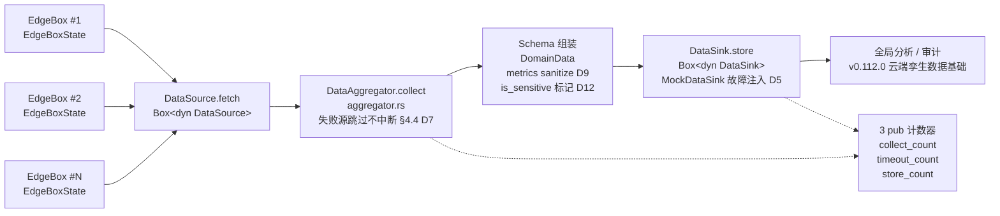
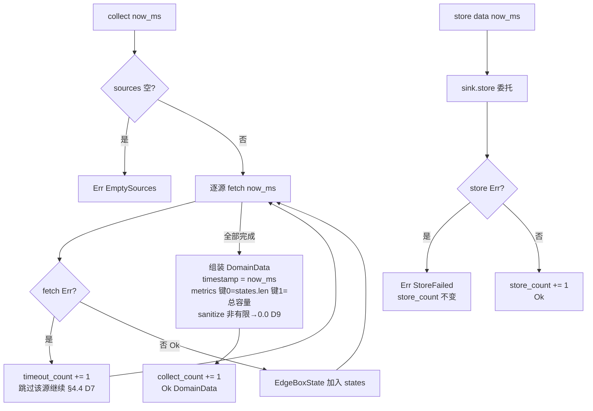

# EnerOS v0.96.0 Cloud Coordinator 数据汇聚设计文档

> **版本**：v0.96.0
> **蓝图**：phase2.md §v0.96.0
> **Crate**：`eneros-cloud-coordinator`（`crates/agents/cloud-coordinator/`，复用 v0.95.0 既有 crate 追加模块）

---

## 1. 版本目标

实现 Cloud Coordinator **数据汇聚**能力（**Phase 2 P2-D 收尾版**），交付三大能力：

- **域内数据汇总**：`DataAggregator.collect` 遍历注入的全部 `DataSource`（`Box<dyn DataSource>`），逐个 `fetch(now_ms)` 收集域内多个 Edge Box 状态（复用 v0.93.0 `EdgeBoxState`，D6）；单源失败（超时/故障）→ `timeout_count += 1` 跳过继续，**不中断**（蓝图 §4.4 部分可用优于全失败，D7）；sources 为空 → `Err(EmptySources)`；
- **Schema 组装与防御**：全部 fetch 完成后组装 `DomainData`（`timestamp = now_ms`，`metrics` 键 0 = `states.len()` 计数、键 1 = 总容量汇总）；metrics 值 sanitize——非有限 f32（NaN/±Inf）→ 0.0，capacity 非有限或 ≤0 → 按 0.0 计入（D9）；`is_sensitive` 脱敏标记字段占位（D12）；组装成功 `collect_count += 1`；
- **存储与审计**：`DataAggregator.store` 委托 `DataSink.store(data, now_ms)`（sync trait，D5），成功 → `store_count += 1`，失败 → `Err(StoreFailed)`；汇聚数据支撑**全局分析与审计**，3 个 pub 计数器（`collect_count` / `timeout_count` / `store_count`）全程留痕可观测。

辅助能力：

- **Mock 故障注入**：`MockDataSource`（fetch 前 N 次失败后成功，`Err(SourceFailed(id))`，id 从 1 顺序分配）/ `MockDataSink`（store 前 N 次失败后成功，成功数据入 `stored` 记录），真实 DataSource / TSDB / S3 / File 存储后端后续版本注入（D5）；
- **40 个内嵌单元测试** T1~T40：含 3 源混合故障、40 源压力、collect+store 全链路集成、NaN 风暴防御。

**业务价值**：v0.95.0 打通"云 → 边"策略下行通道，但云端尚无域内运行数据，全局优化与审计缺乏事实依据。本版本打通"边 → 云"数据上行：域内多 Edge Box 状态周期性汇聚 + 存储，与策略下发构成**完整云边闭环**，云端全局分析、合规审计、数字孪生建模自此有数可用。

**Phase 定位**：P2-D 收尾版；**出口关联 v0.112.0 云端孪生主节点数据基础**（汇聚数据即孪生模型输入），并为 v0.110.0 云边同步提供数据通道语义。

**性能目标**（蓝图 §7.2）：汇聚 < 5s —— **集成阶段验收**，本版本交付算法骨架 + Mock 数据源/存储单元验证（真实 DataSource / DataSink 注入后由集成阶段实测验收）。

---

## 2. 前置依赖

- **v0.95.0 Cloud Coordinator 策略下发**（前序版本，**同 crate 基础**）：`eneros-cloud-coordinator` crate 已建立（strategy / channel / publisher 3 模块），本版本在其上追加 `aggregator.rs`（P2-D 同 crate 连续追加惯例，D1）；
- **eneros-coordinator v0.93.0**：`EdgeBoxState` 复用（已导出；§5.5 防重复造轮子，不重复定义，D6）；
- **eneros-coordinator v0.92.0~v0.94.0**：Edge 侧域内仲裁/优化/VPP 聚合产出 EdgeBoxState 快照数据，为本版本汇聚提供数据源语义；
- 蓝图 `phase2.md` v0.96.0 章节（9 节版本模板，§4.4 容错 / §7.2 汇聚 <5s / §7.3 数据脱敏 / §9 可扩展性为落地依据）；
- **无新第三方依赖**：依赖仅既有 workspace path crate（`eneros-coordinator` 已存在于 crate 依赖表），SBOM 零新增。

**外部假设**（蓝图 §2）：云端 TSDB（时序数据库）为部署环境外部组件，**不在本版本交付范围**——本版本仅定义 `DataSink` trait 接口契约并以 `MockDataSink` 验证存储语义，真实 TSDB/S3/File 适配器后续由外部 crate 实现并注入（D5）。

---

## 3. 交付物清单

- `crates/agents/cloud-coordinator/src/aggregator.rs` — **新增**：`DomainData` / `EventRecord` / `EventType` / `Severity` / `AggError` / `DataSource` trait / `DataSink` trait / `DataAggregator`（collect + store + 3 计数器）+ `MockDataSource` / `MockDataSink` 故障注入
- `crates/agents/cloud-coordinator/src/lib.rs` — **追加**：`pub mod aggregator;` + 重导出（含 EdgeBoxState 复用声明）；v0.95.0 既有 3 模块（strategy / channel / publisher）**零改动**
- `crates/agents/cloud-coordinator/Cargo.toml` — description 追加 v0.96.0；**无新依赖**
- `configs/cloud_aggregator.toml` — 数据汇聚配置模板（`[cloud_aggregator]` collect_interval_ms / max_sources / metric_sanitize + 中文注释 6 点）
- `docs/agents/cloud-aggregation-design.md` — 本设计文档
- **40 个单元测试** T1~T40（src 内嵌），含 collect+store 全链路集成、多 source 汇聚、NaN 风暴防御、Mock 故障注入
- 根目录 4 文件版本同步 0.95.0 → 0.96.0（`Cargo.toml` / `Makefile` / `ci.yml` / `gate.rs` 注释）
- **无新 crate、无新依赖、无 BREAKING**：既有全部 crate 零改动

---

## 4. 详细设计

### 4.0 多 EdgeBox 数据汇聚数据流



### 4.1 DomainData（D2/D4/D12）

| 字段 | 类型 | 说明 |
|------|------|------|
| `domain_id` | `u64` | 域标识（D2：无堆字符串 + 确定性，v0.95.0 D2 惯例；本版本为 0 占位 MVP 单域，多域 schema §8.4 后续扩展） |
| `timestamp` | `u64` | 汇聚时间戳（u64 ms UTC epoch，`now_ms` 外部注入，D11 不涉及时区） |
| `states` | `Vec<EdgeBoxState>` | 域内 Edge Box 状态快照集合（D6：复用 v0.93.0；D10 轻量汇总仅保留快照不保留原始点表） |
| `events` | `Vec<EventRecord>` | 域内事件记录（本版本为空 Vec，事件采集后续版本填充） |
| `metrics` | `BTreeMap<u64, f32>` | 汇聚指标（D4：alloc 无 HashMap，u64 键确定性可重放；键 0 = states.len 计数，键 1 = 总容量汇总） |
| `is_sensitive` | `bool` | 数据脱敏标记（蓝图 §7.3，D12：默认 false 占位，脱敏执行逻辑后续 v0.101.0 实现） |

派生：`Debug, Clone, PartialEq`。

### 4.2 EventRecord / EventType / Severity（D6 MVP 最小定义）

**EventRecord**（Debug + Clone + Copy + PartialEq）：

| 字段 | 类型 | 说明 |
|------|------|------|
| `event_id` | `u64` | 事件唯一标识（D2 无堆字符串） |
| `event_type` | `EventType` | 事件类型（4 变体枚举） |
| `timestamp` | `u64` | 事件时间戳（u64 ms，D11） |
| `severity` | `Severity` | 事件严重级别（4 变体枚举） |

**EventType**（Debug + Clone + Copy + PartialEq + Eq + Default）：`StateChange` / `Alarm` / `Command` / `Metric`。

**Severity**（Debug + Clone + Copy + PartialEq + Eq + Default）：`Info` / `Warning` / `Error` / `Critical`。

### 4.3 AggError（D7）

`AggError { SourceFailed(u64), StoreFailed, EmptySources }`（Debug + Clone + Copy + PartialEq + Eq）：

| 变体 | 触发条件 |
|------|---------|
| `SourceFailed(u64)` | 单数据源 fetch 失败（载荷为数据源 id；D7：结构化错误替代 `warn!` 宏，no_std 无 log crate） |
| `StoreFailed` | DataSink 存储失败（store 返回 Err 时统一映射） |
| `EmptySources` | collect 时 sources 为空（无数据源可汇聚，快速失败） |

### 4.4 DataSource / DataSink sync trait（D3/D5）

```rust
pub trait DataSource {
    fn fetch(&mut self, now_ms: u64) -> Result<EdgeBoxState, AggError>;
}

pub trait DataSink {
    fn store(&mut self, data: &DomainData, now_ms: u64) -> Result<(), AggError>;
}
```

- sync trait（D3：no_std 无 async runtime，v0.95.0 D3 惯例）；`now_ms: u64` 参数注入（no_std 无系统时钟依赖）；不要求 Send + Sync（no_std 单线程惯例）；
- **DataSink 为 trait 而非蓝图枚举**（D5）：蓝图 `DataSink { Tsdb(String), File(String), S3(String) }` 枚举变体含外部存储后端——TSDB/S3/File 均为外部组件，引入会拖入非 no_std 依赖（§5.5 防重复造轮子）；本版本**接口先行**，仅以 `MockDataSink` 验证存储成功/失败/记录语义，真实实现后续由外部 crate 实现并以 `Box<dyn DataSink>` 注入；
- **可扩展性**（蓝图 §9）：新增数据源类型仅需实现 `DataSource` 并 `add_source`，汇聚器与存储层零改动。

### 4.5 DataAggregator（D7/D9）

| 字段 | 类型 | 说明 |
|------|------|------|
| `sources` | `Vec<Box<dyn DataSource>>` | 注入数据源列表（add_source 追加，蓝图 §9 可扩展） |
| `sink` | `Box<dyn DataSink>` | 注入存储后端（Mock / TSDB / S3 / File 适配器） |
| `collect_count` | `u64` | 累计汇聚成功数（pub 可观测） |
| `timeout_count` | `u64` | 累计数据源失败（超时跳过）数（pub 可观测，D7） |
| `store_count` | `u64` | 累计存储成功数（pub 可观测） |

字段全 pub（v0.95.0 D9 惯例：本地 metric 可查，no_std 无 log crate）。

**collect 语义**：遍历 sources 逐个 `fetch(now_ms)`——Ok 加入 states；Err → `timeout_count += 1` **跳过继续不中断**（蓝图 §4.4）；sources 空 → `Err(EmptySources)`；全部 fetch 后组装 DomainData（`timestamp = now_ms`，metrics 键 0 = `states.len()`、键 1 = 总容量汇总，**sanitize**：非有限 f32 → 0.0、capacity 非有限或 ≤0 → 按 0.0 计入，D9），`collect_count += 1`，返回 `Ok(DomainData)`。

**store 语义**：委托 `sink.store(data, now_ms)`——Ok → `store_count += 1` + `Ok(())`；Err → `Err(StoreFailed)`。

### 4.6 MockDataSource / MockDataSink 故障注入

**MockDataSource**（字段全 pub）：`state: EdgeBoxState`（成功时返回快照）/ `fail_times: u32`（剩余失败次数）。fetch 时 `fail_times > 0` → 减一并 `Err(SourceFailed(id))`（id 从 1 顺序分配），否则返回 `Ok(state.clone())`。

**MockDataSink**（字段全 pub）：`stored: Vec<DomainData>`（已存储记录）/ `fail_times: u32`（剩余失败次数）。store 时 `fail_times > 0` → 减一并 `Err(StoreFailed)`，否则 push `data.clone()` 到 `stored` 并 `Ok(())`。

### 4.7 collect / store 决策流程



---

## 5. 技术交底

### 5.1 为何复用既有 crate 追加模块（D1）

蓝图 crate 路径为 `crates/cloud_coordinator/src/{aggregator,storage,schema}.rs`，本版本复用 v0.95.0 已建的 `crates/agents/cloud-coordinator/`，追加单文件 `src/aggregator.rs`：① §2.3.1 硬规则——Agent 实现归 `crates/agents/` 子系统，禁止根目录/散放 crate；② P2-D 同一 crate 连续追加惯例（v0.92.0~v0.94.0 `eneros-coordinator` 三版本同 crate 追加 domain_optimizer / vpp_aggregator）；③ strategy/channel/publisher 与 aggregator 同属 Cloud Coordinator 语义内聚，拆 crate 只会增加 workspace 维护成本而无隔离收益；④ v0.95.0 既有 3 模块**零改动**，无 BREAKING。

### 5.2 为何 sync trait 而非 async（D3）

蓝图 `pub async fn collect/store/run` 落地为 sync 方法：no_std 环境**无 async runtime**（无 tokio / async-std，`core` 仅提供 `Future` 抽象而无执行器），v0.93.0 D5 / v0.95.0 D3 项目惯例已将全部蓝图 async 接口 sync 化。`Duration::from_secs` / `interval_timer` / `ticker.tick().await` 落地为 `now_ms: u64` 参数注入——时间源由调用方注入，no_std 无系统时钟依赖；`run` 循环**不实现**（无 ticker，集成阶段由调用方循环驱动 collect+store）。

### 5.3 为何 DataSink 是 trait 而非蓝图枚举（D5）

蓝图 `DataSink { Tsdb(String), File(String), S3(String) }` 为含外部存储后端的枚举，落地为 sync trait + `MockDataSink`：① TSDB/S3/File 均为**外部后端**，真实客户端依赖网络栈/文件系统/对象存储 SDK，引入会拖入非 no_std 依赖，违反 §43.1 硬性要求；② §5.5 防重复造轮子——存储后端选型（TSDB 品牌、S3 兼容层）属部署决策，不应硬编码进内核侧 crate；③ **接口先行 + Mock 验证语义**：本版本以 `MockDataSink` 锁死 store 成功/失败/记录语义（含故障注入时序），真实实现后续由外部 crate 实现 `DataSink` 并以 `Box<dyn DataSink>` 注入，aggregator 层零改动。

### 5.4 为何 EdgeBoxState 复用而非重定义（D6）

蓝图在 v0.96.0 内嵌定义 `EdgeBoxState`，本版本直接复用 `eneros_coordinator::EdgeBoxState`（v0.93.0 已导出）：① §5.5 防重复造轮子——Edge 侧 v0.92.0~v0.94.0 产出的状态快照与云端汇聚的数据源**本就是同一数据结构**，重定义会引入双向转换与漂移风险；② `eneros-coordinator` 已在本 crate 依赖表中（v0.95.0 引入），复用零新增依赖；③ schema 单一事实来源，Edge 侧字段演进自动传导云端。

### 5.5 为何数据源超时不中断（D7，蓝图 §4.4）

蓝图 §4.4 要求"部分可用优于全失败"：域内 N 个 Edge Box 中单个超时/故障**不应**导致整轮汇聚失败——丢失 1 个快照仍可基于其余 N-1 个做全局分析，而整轮失败则本周期数据全丢。落地：单源 fetch Err → `timeout_count += 1` 跳过继续，其余源正常收集；失败**可观测**——不用 `warn!` 宏（no_std 无 log crate，D7），错误以 `AggError::SourceFailed(u64)` 结构化返回 + `timeout_count` 计数器暴露，集成阶段可对 timeout 率设告警。同输入同输出，无随机源，可重放审计。

### 5.6 为何 metrics 用 u64 键 + NaN sanitize（D4/D9）

蓝图 `metrics: HashMap<String, f32>` 落地为 `BTreeMap<u64, f32>`：① `alloc::collections` 仅提供 BTreeMap 无 HashMap（no_std 无 SipHash 随机源）；② u64 键确定性——同输入同输出，指标表遍历可重放（电力审计要求）；③ 本版本仅 2 个固定语义键（键 0 = states.len 计数、键 1 = 总容量汇总），字符串键的灵活性无收益。NaN 防御（D9，v0.88.0 C140 / v0.94.0 D12 教训）：f32 值非有限（NaN/±Inf）→ sanitize 为 0.0；capacity 非有限或 ≤0 → 按 0.0 计入总容量；数据量计数独立用 u64 三计数器**不依赖 metric**——NaN 不传播、不 panic、不污染计数。

---

## 6. 测试计划

40 个单元测试 T1~T40（src 内嵌，v0.87.0~v0.95.0 项目惯例，不新增 tests/ 文件，D8）：

| 分组 | 编号 | 覆盖点 |
|------|------|--------|
| 数据结构（T1~T6） | T1~T6 | DomainData 构造字段回显（domain_id/timestamp/states/events/metrics/is_sensitive）、Clone 独立性、Debug 含类型名（spec 场景）；EventRecord Copy 语义、字段回显；EventType 四变体互不等、Default、Eq；Severity 四变体互不等、Default、Eq；AggError 三变体 Eq/Copy、SourceFailed 载荷回显；EdgeBoxState 复用编译校验（eneros_coordinator 路径，D6） |
| collect（T7~T14） | T7~T14 | new 构造：sources 空、3 计数器全零；add_source 追加后 sources.len==1；空 sources collect → Err(EmptySources)（spec 场景）；2 源全成功 → Ok、collect_count==1、timeout_count==0、states.len==2（spec 场景）；第 1 源成功第 2 源失败 → Ok、timeout_count==1、states.len==1 失败不中断（spec 场景）；全部源失败 → Ok、states 空、timeout==源数；metrics 键 0 == states.len()；timestamp == now_ms 回显 |
| store（T15~T20） | T15~T20 | MockDataSink 成功 store → Ok、store_count==1（spec 场景）；恒失败 sink → Err(StoreFailed)、store_count==0（spec 场景）；stored 记录内容与输入一致；stored 为 data 克隆（修改原 data 不影响已存）；多次 store 成功计数累计；now_ms 参数透传 sink |
| Mock 故障注入（T21~T26） | T21~T26 | MockDataSource fail_times=1 → 连续 2 次 fetch 第 1 次 Err 第 2 次 Ok（spec 场景）；Err 载荷 SourceFailed(id) id 从 1 顺序分配；MockDataSink fail_times=2 → 连续 3 次 store 前 2 次 Err 第 3 次 Ok 且 data 入 stored（spec 场景）；fail_times=0 恒成功；fail_times 递减至 0 后不再失败（不回绕）；source/sink 混合故障恢复序列确定性 |
| NaN 防御（T27~T30） | T27~T30 | metrics 含 NaN → sanitize 后对应键值为 0.0（spec 场景）；+Inf / -Inf → 0.0；capacity NaN 源 → 总容量按 0.0 计入；capacity ≤0 源 → 总容量按 0.0 计入（D9） |
| 脱敏标记（T31~T32） | T31~T32 | DomainData is_sensitive 默认 false；is_sensitive=true 构造后字段保留 true、脱敏执行逻辑留待后续版本（spec 场景，D12） |
| 多 source 汇聚（T33~T36） | T33~T36 | 3 源混合故障（成功/失败/成功）→ Ok、states.len==2、timeout_count==1、states 顺序为成功源顺序；多轮 collect 计数跨轮累计；40 源压力（超出 max_sources=32 配置语义边界）→ 全部 fetch 正确、计数一致、不 panic；sources 注入顺序保持（Vec 顺序语义） |
| 全链路集成（T37~T40） | T37~T40 | collect+store 全链路：collect → DomainData → store → MockDataSink.stored 回读与汇聚结果一致；部分源失败全链路：timeout 源跳过仍 store 成功、三计数器各自正确；store 失败不影响 collect：collect_count 已 +1、store_count 不变、Err(StoreFailed)；NaN + 多源 + 故障混合端到端：sanitize 生效、计数正确、不 panic |

性能目标（汇聚 < 5s，蓝图 §7.2）标注：**集成阶段验收，本版本交付算法骨架 + Mock 数据源/存储单元验证**。

**GPU 规则说明（蓝图 §6.6）**：本版本为纯标量 CPU 计算（状态收集 / Schema 组装 / 计数），无张量操作，**不涉及 GPU**。

---

## 7. 验收标准

- **功能**：多源 collect 全成功/部分失败/空源三分支正确（蓝图 §4.4）；Schema 组装 metrics 键 0/键 1 语义正确 + NaN sanitize（D9）；store 委托 sink 成功/失败语义正确；3 个 pub 计数器留痕；is_sensitive 脱敏标记占位（D12）；
- **测试**：**80 个测试通过**（v0.95.0 既有 40 + 本版本新增 40，`cargo test -p eneros-cloud-coordinator`，T1~T40）；下游回归零破坏（既有全部 crate 零改动，无 BREAKING）；
- **交叉编译**：`aarch64-unknown-none` 交叉编译通过（no_std + alloc）；
- **质量**：`cargo fmt --check` / `cargo clippy -D warnings` / `cargo deny check` 全过，**0 warning**；
- **性能**：汇聚 < 5s（蓝图 §7.2）——**集成阶段验收**，本版本交付算法骨架 + Mock 数据源/存储单元验证（真实 DataSource / DataSink 注入后实测）；
- **文档**：本设计文档 + `configs/cloud_aggregator.toml` 配置模板（中文注释 6 点）；
- **出口**：P2-D 收尾达成，云 → 边策略 + 边 → 云数据构成完整云边环，解锁 v0.112.0 云端孪生主节点数据基础。

---

## 8. 风险

| 风险 | 说明 | 缓解 |
|------|------|------|
| DataSink 仅 Mock 抽象 | 本版本 `DataSink` 仅有 `MockDataSink` 实现，无真实 TSDB/S3/File 存储适配器 | 接口契约先行（D5）：真实 TSDB 适配器后续版本以 `Box<dyn DataSink>` 注入，aggregator 层零改动；汇聚 <5s 列入**集成阶段验收** |
| DomainData.domain_id 为 0 占位 | 本版本 MVP 单域，domain_id 固定占位无多域路由 | 多域 schema 按蓝图 §8.4 后续版本扩展（domain_id 字段已预留 u64，结构兼容） |
| run 循环未实现 | 蓝图 `run` 含 `interval_timer` / `ticker.tick().await` 周期驱动，本版本无 ticker | sync collect/store 由调用方循环驱动（D3）；`collect_interval_ms = 5000` 配置占位，集成阶段由云端调度器按周期调用 |
| 压缩未实现（D10） | 蓝图 §5.4"数据量大需压缩"，no_std 无标准压缩库 | 域内数据聚合为轻量级汇总（仅保留 EdgeBoxState 快照，不保留原始点表），数据量可控；压缩列入后续版本数据量评估后决策 |
| events 为空 Vec | 本版本事件采集未实现，`events` 恒为空 | EventRecord/EventType/Severity 结构已定义并通过 T 组测试锁定契约，事件采集后续版本填充（Edge 侧事件源接入时） |
| 内存（蓝图 §43.6） | states Vec + BTreeMap 堆分配随源数增长 | Agent Runtime 分区 ≤ 64MB 预算内；EdgeBoxState 快照为定长小结构，max_sources=32 上限下占用可预估；极端场景由 OOM handler 冻结非关键 Agent（§43.6） |

---

## 9. 多角度要求

- **功能**：域内多 EdgeBox 状态汇聚（collect）+ Schema 组装 + 存储（store），支撑全局分析与审计；
- **性能**：汇聚 < 5s（蓝图 §7.2）——**集成阶段验收**，本版本 Mock 单元验证算法骨架；
- **安全**（蓝图 §7.3）：`is_sensitive` 脱敏标记字段占位（D12），供存储/上行环节按标记分流；脱敏执行逻辑后续 v0.101.0 实现；NaN 不传播不 panic（D9，v0.88.0 C140 / v0.94.0 D12 教训）；
- **可靠**（蓝图 §4.4）：数据源超时**跳过不中断**（部分可用优于全失败），`timeout_count` 计数器暴露可观测（D7，不用 warn! 宏）；存储失败显式 `Err(StoreFailed)` 不沉默；同输入同输出，无随机源；
- **可维护**（蓝图 §9）：schema 配置化——`configs/cloud_aggregator.toml` 的 `metric_sanitize` 开关与 NaN 防御语义一一对应；`collect_interval_ms` / `max_sources` 命名配置无魔法数；
- **可观测**（蓝图 §9）：3 个 pub 计数器 `collect_count` / `timeout_count` / `store_count` 全覆盖汇聚/超时/存储三路径；no_std 无 log crate，metric 全部字段化本地可查；
- **可扩展**（蓝图 §9）：`DataSource` trait + `add_source` 注入式数据源（新增源类型仅实现 trait 并注册，汇聚器与存储层零改动）；`DataSink` trait 注入式存储（Mock → TSDB/S3/File 平滑替换，D5）；
- **确定性**：u64 标识符/键（D2/D4）+ BTreeMap 指标表 → 汇聚、组装、迭代全部可重放；`now_ms` 外部注入（D11，u64 ms UTC epoch 不涉时区）；全链路无随机源；
- **no_std**：alloc / core only——`alloc::vec::Vec` / `alloc::boxed::Box` / `alloc::collections::BTreeMap` / `core::result::Result`，禁止 `std::*`（蓝图 §43.1 硬性要求）。

---

## 10. 接口契约

pub 项签名清单（与 spec.md ADDED Requirements 一致）：

```rust
// ===== aggregator.rs =====

/// 域内汇聚数据（D2/D4/D12），Debug + Clone + PartialEq
pub struct DomainData {
    pub domain_id: u64,
    pub timestamp: u64,
    pub states: Vec<EdgeBoxState>,
    pub events: Vec<EventRecord>,
    pub metrics: BTreeMap<u64, f32>,
    pub is_sensitive: bool,
}

/// 事件记录（D6 MVP），Debug + Clone + Copy + PartialEq
pub struct EventRecord {
    pub event_id: u64,
    pub event_type: EventType,
    pub timestamp: u64,
    pub severity: Severity,
}

/// 事件类型，Debug + Clone + Copy + PartialEq + Eq + Default
pub enum EventType {
    StateChange,
    Alarm,
    Command,
    Metric,
}

/// 事件严重级别，Debug + Clone + Copy + PartialEq + Eq + Default
pub enum Severity {
    Info,
    Warning,
    Error,
    Critical,
}

/// 汇聚错误（D7：结构化错误替代 warn! 宏），
/// Debug + Clone + Copy + PartialEq + Eq
pub enum AggError {
    SourceFailed(u64),
    StoreFailed,
    EmptySources,
}

/// 数据源抽象（D3：sync，no_std 无 async runtime；不要求 Send + Sync）
pub trait DataSource {
    fn fetch(&mut self, now_ms: u64) -> Result<EdgeBoxState, AggError>;
}

/// 数据存储抽象（D5：trait 而非蓝图枚举，TSDB/S3/File 外部后端后续注入；
/// sync，不要求 Send + Sync）
pub trait DataSink {
    fn store(&mut self, data: &DomainData, now_ms: u64) -> Result<(), AggError>;
}

/// 数据汇聚器（collect + store + 3 pub 可观测计数器），字段全 pub
pub struct DataAggregator {
    pub sources: Vec<Box<dyn DataSource>>,
    pub sink: Box<dyn DataSink>,
    pub collect_count: u64,
    pub timeout_count: u64,
    pub store_count: u64,
}

impl DataAggregator {
    /// 构造：注入 sink，sources 空、3 计数器全零
    pub fn new(sink: Box<dyn DataSink>) -> Self;
    /// 追加数据源（蓝图 §9 可扩展：新源实现 DataSource 并注册）
    pub fn add_source(&mut self, source: Box<dyn DataSource>);
    /// 汇聚：遍历 sources 逐个 fetch(now_ms)，Ok 加入 states；
    /// Err → timeout_count += 1 跳过继续（不中断，蓝图 §4.4）；
    /// sources 空 → Err(EmptySources)；全部 fetch 后组装 DomainData
    /// （timestamp=now_ms，metrics 键0=states.len 键1=总容量汇总，
    /// sanitize 非有限 f32 → 0.0，D9），collect_count += 1
    pub fn collect(&mut self, now_ms: u64) -> Result<DomainData, AggError>;
    /// 存储：委托 sink.store，Ok → store_count += 1；Err → Err(StoreFailed)
    pub fn store(&mut self, data: &DomainData, now_ms: u64) -> Result<(), AggError>;
}

/// Mock 数据源（故障注入：fetch 前 N 次失败后成功；
/// 失败时 Err(SourceFailed(id))，id 从 1 顺序分配），字段全 pub
pub struct MockDataSource {
    pub state: EdgeBoxState,
    pub fail_times: u32,
}

impl MockDataSource {
    /// 构造 Mock（fail_times=0 恒成功）
    pub fn new(state: EdgeBoxState) -> Self;
    /// 构造故障注入 Mock（前 N 次 fetch 失败）
    pub fn with_fail_times(state: EdgeBoxState, fail_times: u32) -> Self;
}

impl DataSource for MockDataSource {
    fn fetch(&mut self, now_ms: u64) -> Result<EdgeBoxState, AggError>;
}

/// Mock 存储（故障注入：store 前 N 次失败后成功；
/// 成功时 push data 克隆到 stored），字段全 pub
pub struct MockDataSink {
    pub stored: Vec<DomainData>,
    pub fail_times: u32,
}

impl MockDataSink {
    /// 构造 Mock（fail_times=0 恒成功，stored 空）
    pub fn new() -> Self;
    /// 构造故障注入 Mock（前 N 次 store 失败）
    pub fn with_fail_times(fail_times: u32) -> Self;
}

impl DataSink for MockDataSink {
    fn store(&mut self, data: &DomainData, now_ms: u64) -> Result<(), AggError>;
}
```

**复用类型**（不重复定义，D6）：`EdgeBoxState` ← `eneros-coordinator`（v0.93.0，已导出；§5.5 防重复造轮子）。

**计数器语义**：`collect_count` 仅 collect 组装成功时 +1；`timeout_count` 每次单源 fetch 失败 +1（跨多轮 collect 累计）；`store_count` 仅 sink.store 成功时 +1。

`lib.rs` 追加：

```rust
pub mod aggregator;
pub use aggregator::{
    DomainData, EventRecord, EventType, Severity, AggError,
    DataSource, DataSink, DataAggregator, MockDataSource, MockDataSink,
};
// EdgeBoxState 复用声明：pub use eneros_coordinator::EdgeBoxState;（D6）
```

---

## 11. 偏差声明

| 偏差 | 蓝图原文 | 本版本处理 |
|------|---------|-----------|
| **D1** | crate 路径 `crates/cloud_coordinator/src/{aggregator,storage,schema}.rs` | 复用既有 `crates/agents/cloud-coordinator/`（v0.95.0 已建），追加 `src/aggregator.rs`（§2.3.1 硬规则；P2-D 同一 crate 连续追加惯例） |
| **D2** | `domain_id: String` / metrics `HashMap<String, f32>` | 全部 `u64` / `BTreeMap<u64, f32>`（无堆字符串 + 确定性，v0.95.0 D2 惯例） |
| **D3** | `pub async fn collect/store/run`；`Duration::from_secs` / `interval_timer` / `ticker.tick().await` | sync 方法（no_std 无 async runtime，v0.95.0 D3 惯例）；`now_ms: u64` 参数注入；`run` 不实现（无 ticker，集成阶段由调用方循环驱动） |
| **D4** | `states: Vec<EdgeBoxState>` / `metrics: HashMap<String, f32>` | `Vec<EdgeBoxState>` 保留；`BTreeMap<u64, f32>` 替代 HashMap（no_std alloc 无 HashMap，u64 键确定性） |
| **D5** | `DataSink { Tsdb(String), File(String), S3(String) }`（枚举变体含外部存储后端） | `DataSink` 为 sync trait（`store(&mut self, data, now_ms)`）+ `MockDataSink`（测试覆盖存储失败/成功/记录）；不引入 TSDB/S3/File 外部依赖（§5.5 防重复造轮子，本版本仅定义接口与 Mock；真实存储后续由外部 crate 实现并注入 `Box<dyn DataSink>`） |
| **D6** | 蓝图 `EdgeBoxState` 内嵌定义 | 复用 `eneros_coordinator::EdgeBoxState`（v0.93.0，已导出；§5.5 防重复造轮子） |
| **D7** | `warn!("数据源失败: {}", e)` | 不用 warn! 宏（no_std 无 log crate）；数据源失败通过 `AggError::SourceFailed(u64)` + `timeout_count` 计数器暴露可观测 |
| **D8** | 测试 `tests/data_agg.rs` | crate 内嵌 `#[cfg(test)]` 40 测试（v0.87.0~v0.95.0 项目惯例） |
| **D9** | metrics 含 f32 值 | NaN 防御：metric 值非有限 → 存入前 sanitize 为 0.0；数据量计数独立用 u64（`collect_count`/`timeout_count`/`store_count`）不依赖 metric |
| **D10** | 蓝图 §5.4 "数据量大需压缩" | 本版本不做压缩（no_std 无标准压缩库）；域内数据聚合为轻量级汇总（仅保留 EdgeBoxState 快照，不保留原始点表），压缩列入后续版本评估 |
| **D11** | 蓝图 §8.5 "时区与时间戳统一" | 统一使用 u64 ms UTC epoch 时间戳（`now_ms` 外部注入），不涉及时区转换 |
| **D12** | 蓝图 §7.3 "数据脱敏" | 本版本定义脱敏标记字段 `is_sensitive: bool`（DomainData 字段），脱敏执行逻辑后续 v0.101.0 断网处理实现 |

---

## 12. 附录

### 相关文档

- [cloud-strategy-design.md](./cloud-strategy-design.md) — v0.95.0 Cloud Coordinator 策略下发设计文档（前序版本，同 crate 基础）
- 源码路径：`../../crates/agents/cloud-coordinator/src/`（`aggregator.rs` 新增；`strategy.rs` / `channel.rs` / `publisher.rs` / `lib.rs` 既有；crate 根：`crates/agents/cloud-coordinator/`）
- 配置模板：`../../configs/cloud_aggregator.toml`
- Spec：`.trae/specs/develop-v0960-cloud-aggregator/spec.md`
- 蓝图：`蓝图/phase2.md` §v0.96.0（P2-D 收尾版；§4.4 容错 / §5.4 压缩 / §7.2 汇聚 <5s / §7.3 数据脱敏 / §8.4 多域 schema / §8.5 时区时间戳 / §9 可扩展性）

### 下游解锁

| 下游版本 | 解锁内容 | 本版本提供的能力 |
|---------|---------|----------------|
| v0.112.0 云端孪生主节点 | 云端孪生模型数据输入 | DomainData 汇聚 Schema + EdgeBoxState 快照流（数据基础） |
| v0.110.0 云边同步 | 边 → 云数据上行通道语义 | DataSource / DataSink trait 契约 + 汇聚周期配置语义 |

### 版本历史

| 版本 | 内容 | Crate |
|------|------|-------|
| v0.92.0 | Edge Coordinator 域内仲裁（P2-D 起点） | `eneros-coordinator`（bid / arbiter / conflict） |
| v0.93.0 | Edge Coordinator 域级优化（P2-D 第 2 版，EdgeBoxState 导出） | `eneros-coordinator`（domain_optimizer 追加） |
| v0.94.0 | Edge Coordinator VPP 聚合（P2-D 关键版，★ Phase 2 出口标准） | `eneros-coordinator`（vpp_aggregator 追加） |
| v0.95.0 | Cloud Coordinator 基础——策略下发（P2-D 第 4 版，云边协同起点） | `eneros-cloud-coordinator`（新建，strategy / channel / publisher） |
| v0.96.0 | Cloud Coordinator 基础——数据汇聚（P2-D 收尾，本版本） | `eneros-cloud-coordinator`（aggregator 追加） |
