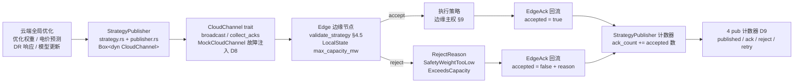
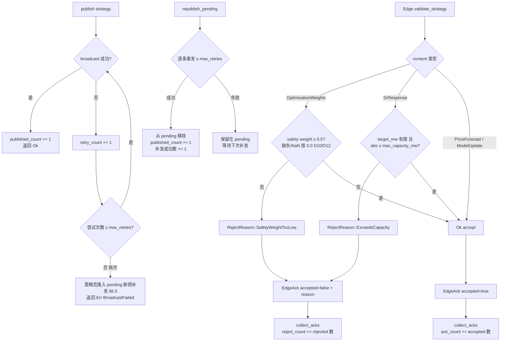

# EnerOS v0.95.0 Cloud Coordinator 云端策略下发设计文档

> **版本**：v0.95.0
> **蓝图**：phase2.md §v0.95.0
> **Crate**：`eneros-cloud-coordinator`（`crates/agents/cloud-coordinator/`，新建）

---

## 1. 版本目标

实现 Cloud Coordinator **策略下发**能力（**Phase 2 P2-D 第 4 版，云边协同起点**），交付三大能力：

- **全局策略下发**：云端生成全局策略 `Strategy`（优化权重 / 电价预测 / DR 响应 / 模型更新 4 类，`StrategyContent` 枚举承载），经 `CloudChannel` 通道广播到目标边缘节点；下发失败按 `max_retries` 超时重试，耗尽（断网）→ 策略入 `pending` 待补发队列，通道恢复后 `republish_pending()` 补发（蓝图 §6.5 网络断开 → 重连补发，D9）；
- **边缘安全校验**：`validate_strategy(strategy, local_state)` 落地蓝图 §4.5 关键代码——`OptimizationWeights` 的 safety weight < `SAFETY_WEIGHT_MIN`(0.5)（**缺失/NaN 按 0.0**，D10/D12）→ 拒绝 `SafetyWeightTooLow`；`DrResponse` 的 `target_mw` 非有限或 `abs() > max_capacity_mw` → 拒绝 `ExceedsCapacity`（`max_capacity_mw` 非有限或 ≤0 → 一切 DR 拒绝，D12）；`PriceForecast` / `ModelUpdate` → `Ok(())`。**策略非强制、边缘主权保留**（蓝图 §5.2/§9，安全侧默认拒绝，宁拒勿放）；
- **Ack 回流可观测**：`collect_acks(strategy_id, timeout_ms)` 收集边缘回执 `EdgeAck`（accepted / rejected + `RejectReason`），`StrategyPublisher` 4 个 pub 计数器 `published_count` / `ack_count` / `reject_count` / `retry_count` 全程留痕（蓝图 §9 "Ack/拒绝 metric"，D9）。

辅助能力：

- **故障注入测试通道**：`MockCloudChannel` 支持 broadcast 前 N 次失败后成功（重试测试）、预置 acks 按 `strategy_id` 过滤返回（ack 收集测试），Socket v0.29.0 / DDS 适配器后续版本注入（D8）；
- **策略版本化**（蓝图 §5.2/§8.4）：`Strategy.version` 标识策略格式版本，`ModelRef { model_id, version }` 双元组定位模型制品，支撑多版本边缘混布兼容。

**业务价值**：v0.94.0 完成 VPP 聚合（边缘侧容量可市场化），但边缘仅具备本地自治能力；云端全局优化（跨域电价预测、全网 DR 调度、模型制品分发）需要一条"云 → 边"的策略通道。本版本打通云边协同起点，**策略非强制**保证边缘安全自治不被云端故障/错误策略破坏。

**Phase 定位**：P2-D 第 4 版，云边协同起点；**下游解锁 v0.96.0 数据汇聚（P2-D 收尾）与 v0.112.0 云端孪生主节点**。

**性能目标**（蓝图 §7.2）：下发延迟 < 1s —— **集成阶段验收**，本版本交付算法骨架 + Mock 通道单元验证（真实通道注入后由集成阶段实测验收）。

---

## 2. 前置依赖

- **v0.94.0 VPP 聚合**（前序版本，`eneros-coordinator`）：边缘侧容量已市场化（VppProfile / dispatch / market_bid），为本版本云端策略下发提供边缘自治基座；
- **eneros-energy-market-agent v0.86.0**：`Objective`（已 derive Ord，v0.88.0 核实，可作 BTreeMap key）/ `PricePoint` / `DrSignal` 复用为策略内容载体（不重复定义，path 依赖）；
- **eneros-coordinator v0.92.0**：`Priority` 复用为策略优先级（派生 Ord 序即优先级序；§5.5 防重复造轮子，不重新定义，D5）；
- 蓝图 `phase2.md` v0.95.0 章节（9 节版本模板，§4.5 关键代码为 validate_strategy 落地依据）；
- **无新第三方依赖**：依赖仅 2 个既有 workspace path crate，SBOM 零新增。

**下游解锁**：v0.96.0 数据汇聚（P2-D 收尾，云 → 边策略 + 边 → 云数据构成完整云边环）/ v0.112.0 云端孪生主节点（策略通道复用为孪生指令下发通道）。

---

## 3. 交付物清单

- `crates/agents/cloud-coordinator/src/strategy.rs` — **新增**：`Strategy` / `StrategyContent`（4 变体）/ `ModelRef` / `EdgeAck` / `RejectReason` / `LocalState` + `validate_strategy` 边缘安全校验（蓝图 §4.5 落地）+ 常量 `SAFETY_WEIGHT_MIN` / `DEFAULT_ACK_TIMEOUT_MS` / `DEFAULT_MAX_RETRIES`
- `crates/agents/cloud-coordinator/src/channel.rs` — **新增**：`CloudChannel` trait（sync，D3/D8）+ `CloudError` + `MockCloudChannel`（可故障注入：broadcast 前 N 次失败、预置 acks）
- `crates/agents/cloud-coordinator/src/publisher.rs` — **新增**：`StrategyPublisher`（`Box<dyn CloudChannel>` + 超时重试 + pending 断网补发队列 + 4 个 pub 可观测计数器，D9）
- `crates/agents/cloud-coordinator/src/lib.rs` — **新增**：no_std crate 文档（D1~D12 偏差表）+ 重导出
- `crates/agents/cloud-coordinator/Cargo.toml` — **新增**：依赖仅 2 个既有 path crate（`eneros-energy-market-agent` / `eneros-coordinator`，D5）
- 根 `Cargo.toml` members 追加 `"crates/agents/cloud-coordinator"`（既有成员零改动）
- `configs/cloud_coordinator.toml` — 云端连接配置模板（`[cloud_coordinator]` endpoint / ack_timeout_ms / max_retries / safety_weight_min + 中文注释 6 点）
- `docs/agents/cloud-strategy-design.md` — 本设计文档
- **40 个单元测试** T1~T40（src 内嵌），含 publish+ack 全链路集成、断网补发故障注入、NaN 风暴防御
- 根目录 4 文件版本同步 0.94.0 → 0.95.0（`Cargo.toml` / `Makefile` / `ci.yml` / `gate.rs` 注释）
- **无 BREAKING**：既有全部 crate 零改动

---

## 4. 详细设计

### 4.0 云边策略下发数据流



### 4.1 Strategy（D2/D5）

| 字段 | 类型 | 说明 |
|------|------|------|
| `strategy_id` | `u64` | 策略唯一标识（D2：无堆字符串 + 确定性，v0.87.0 D3 / v0.94.0 D2 惯例） |
| `version` | `u32` | 策略格式版本（蓝图 §5.2/§8.4 多版本兼容，云边按版本协商解析） |
| `targets` | `Vec<u64>` | 目标边缘节点 id 列表（D2：`Vec<u64>` 替代 `Vec<String>`） |
| `content` | `StrategyContent` | 策略内容（4 变体枚举，见 §4.2） |
| `deadline` | `u64` | 策略截止时间戳（u64 ms，外部时间注入惯例） |
| `priority` | `Priority` | 策略优先级（D5：复用 `eneros-coordinator::Priority`，派生 Ord 序即优先级序） |

派生：`Debug, Clone, PartialEq`。

### 4.2 StrategyContent（4 变体，D4）

| 变体 | 载荷 | 说明 |
|------|------|------|
| `OptimizationWeights` | `BTreeMap<Objective, f32>` | 优化权重下发（D4：alloc 无 HashMap；Objective 已 derive Ord；BTreeMap 确定性迭代可重放） |
| `PriceForecast` | `Vec<PricePoint>` | 电价预测下发（复用 eneros-energy-market-agent） |
| `DrResponse` | `DrSignal` | 需求响应信号下发（复用 eneros-energy-market-agent） |
| `ModelUpdate` | `ModelRef` | 模型更新下发（制品引用，见 §4.3） |

派生：`Debug, Clone, PartialEq`。**可扩展性**（蓝图 §9）：新增策略类型仅需追加变体 + validate 补充校验分支。

### 4.3 ModelRef / LocalState / CloudError（D6 MVP 最小定义）

**ModelRef**（Debug + Clone + Copy + PartialEq + Eq + Default）：

| 字段 | 类型 | 说明 |
|------|------|------|
| `model_id` | `u64` | 模型制品标识（D2 无堆字符串） |
| `version` | `u32` | 模型版本（蓝图 §8.4 多版本兼容） |

**LocalState**（Debug + Clone + Copy + PartialEq + Default）：

| 字段 | 类型 | 说明 |
|------|------|------|
| `edge_id` | `u64` | 边缘节点标识 |
| `max_capacity_mw` | `f32` | 本地最大可调容量（MW；非有限或 ≤0 → 一切 DR 策略拒绝，D12 安全侧） |

**CloudError**（Debug + Clone + Copy + PartialEq + Eq）：单变体 `BroadcastFailed`（重试耗尽即广播失败，D6）。

### 4.4 EdgeAck / RejectReason（D7）

**EdgeAck**（Debug + Clone + Copy + PartialEq）：

| 字段 | 类型 | 说明 |
|------|------|------|
| `strategy_id` | `u64` | 回执对应策略 |
| `edge_id` | `u64` | 回执边缘节点 |
| `accepted` | `bool` | 是否接受 |
| `reason` | `Option<RejectReason>` | 拒绝原因（D7：结构化枚举替代 `Option<String>`，机读审计） |

**RejectReason**（Debug + Clone + Copy + PartialEq + Eq，2 变体，与蓝图关键代码一致）：

| 变体 | 触发条件 |
|------|---------|
| `SafetyWeightTooLow` | OptimizationWeights 的 safety weight（缺失/非有限按 0.0，D10/D12）< `SAFETY_WEIGHT_MIN`(0.5) |
| `ExceedsCapacity` | DR `target_mw` 非有限或 `abs() > max_capacity_mw`（capacity 非有限或 ≤0 → 一切 DR 拒绝，D12） |

### 4.5 validate_strategy 边缘安全校验（蓝图 §4.5 落地，D10/D12）

```
① match strategy.content：
② OptimizationWeights(weights)：
     safety = weights.get(&Objective::Safety).copied().unwrap_or(0.0)
     safety 非有限 → 0.0（D12）
     safety < SAFETY_WEIGHT_MIN(0.5) → Err(SafetyWeightTooLow)
     否则 → Ok(())
③ DrResponse(signal)：
     max_capacity_mw 非有限或 ≤0 → Err(ExceedsCapacity)（D12 安全侧：本地容量不可信时一切 DR 拒绝）
     signal.target_mw 非有限 → Err(ExceedsCapacity)
     signal.target_mw.abs() > max_capacity_mw → Err(ExceedsCapacity)
     否则 → Ok(())
④ PriceForecast / ModelUpdate → Ok(())（无本地安全约束）
```

**安全侧默认拒绝原则**：任何缺失/脏数据（Safety 缺失、NaN、容量非有限）一律落入拒绝分支，宁拒勿放（边缘主权 §9）。

### 4.6 CloudChannel trait + MockCloudChannel（D3/D8）

```rust
pub trait CloudChannel {
    fn broadcast(&mut self, strategy: &Strategy) -> Result<(), CloudError>;
    fn collect_acks(&mut self, strategy_id: u64, timeout_ms: u64) -> Vec<EdgeAck>;
}
```

- sync trait（D3：no_std 无 async runtime，v0.93.0 D5 惯例）；`timeout_ms: u64` 参数注入（默认常量 `DEFAULT_ACK_TIMEOUT_MS = 10_000`，语义等价蓝图 `Duration::from_secs(10)`）；不要求 Send + Sync（no_std 单线程惯例）；
- **MockCloudChannel**（v0.86.0 D11 BidPublisher 模式）：broadcast 记录已发策略、可配置前 N 次失败后成功（重试测试）；collect_acks 从预置 acks 过滤 `strategy_id` 返回；
- **真实通道**：Socket v0.29.0 / DDS 适配器后续版本注入（D8，不在本版本范围）。

### 4.7 StrategyPublisher（D9）

| 字段 | 类型 | 说明 |
|------|------|------|
| `channel` | `Box<dyn CloudChannel>` | 注入通道（Mock / Socket / DDS 适配器） |
| `max_retries` | `u32` | 最大重试次数（默认 `DEFAULT_MAX_RETRIES` = 3；语义为**总尝试次数**） |
| `published_count` | `u64` | 累计发布成功数（pub 可观测，D9） |
| `retry_count` | `u64` | 累计重试次数（每次失败 +1，pub 可观测，D9） |
| `ack_count` | `u64` | 累计 accepted ack 数（pub 可观测，D9） |
| `reject_count` | `u64` | 累计 rejected ack 数（pub 可观测，蓝图 §9 拒绝 metric） |
| `pending` | `Vec<Strategy>` | 待补发队列（断网容错，蓝图 §6.5，D9） |

字段全 pub（v0.92.0 D9 惯例：本地 metric 可查，no_std 无 log crate）。

### 4.8 publish / validate / ack 决策流程



- `publish(&mut self, strategy)`：至多 `max_retries` 次尝试（每次失败 `retry_count += 1`）；成功 → `published_count += 1` + `Ok`；耗尽 → 策略克隆入 `pending`（断网补发，§6.5）+ `Err(BroadcastFailed)`；
- `republish_pending(&mut self) -> u32`：逐条重发 pending（每条仍限 `max_retries`），**成功者从 pending 移除、失败者保留**，返回成功补发数；
- `collect_acks(&mut self, strategy_id, timeout_ms)`：委托 channel；`ack_count += accepted 数`，`reject_count += rejected 数`。

---

## 5. 技术交底

### 5.1 为何 u64 替代 String（D2）

蓝图 `strategy_id: String` / `targets: Vec<String>` / `edge_id: String` 落地为 `u64` / `Vec<u64>`：① no_std 环境下堆字符串引入额外分配与不确定性，u64 为固定 8 字节无堆值类型，Copy 语义零成本；② 确定性——策略 id / 边缘 id 作为 BTreeMap key 与过滤条件时，整数比较序完全确定可重放（电力调度可复现审计要求）；③ 与 v0.87.0 D3 / v0.94.0 D2 项目惯例一致，标识符统一 u64。

### 5.2 为何 sync trait 而非 async（D3/D8）

蓝图 `pub async fn publish/collect_acks` 落地为 sync 方法：no_std 环境**无 async runtime**（无 tokio / async-std，`core` 仅提供 `Future` 抽象而无执行器），v0.93.0 D5 项目惯例已将全部蓝图 async 接口 sync 化。`Duration::from_secs(10)` 落地为 `timeout_ms: u64` 参数注入（默认常量 `DEFAULT_ACK_TIMEOUT_MS = 10_000`），语义等价且时间源由调用方注入（no_std 无系统时钟依赖）。

### 5.3 为何 BTreeMap 替代 HashMap（D4）

蓝图 `OptimizationWeights(HashMap<Objective, f32>)` 落地为 `BTreeMap<Objective, f32>`：① `alloc::collections` 仅提供 BTreeMap，无 HashMap（`std::collections::HashMap` 依赖 SipHash 随机源，no_std 不可用）；② `Objective` 已 derive Ord（v0.88.0 核实），可直接作 BTreeMap key；③ BTreeMap 迭代序确定——权重表遍历可重放，同输入同输出，满足电力审计确定性要求。

### 5.4 边缘主权设计——安全侧默认拒绝，宁拒勿放（D10/D12）

蓝图 §5.2"策略非强制"+ §9"边缘主权"是云边协同的核心安全约束：云端策略仅为全局优化**建议**，边缘对本地安全负最终责任。落地原则为**安全侧默认拒绝**：① safety weight **缺失**按 0.0 → 拒绝（云端忘发 safety 权重视同不安全策略）；② safety weight **NaN** 按 0.0 → 拒绝（脏数据不传播）；③ `max_capacity_mw` 非有限或 ≤0 → **一切 DR 策略拒绝**（本地容量不可信时，任何 DR 调度都可能越限）；④ DR `target_mw` 非有限 → 拒绝。所有拒绝路径返回结构化 `RejectReason`（D7：枚举替代 String，机读审计），并经 `reject_count` 可观测留痕——拒绝是显式决策而非沉默失败。

### 5.5 pending 补发的断网容错（D9，蓝图 §6.5）

蓝图 §6.5 要求"网络断开 → 重连补发"。落地：`publish` 重试 `max_retries` 次耗尽 → 策略**克隆**入 `pending: Vec<Strategy>`（不丢策略）+ 返回 `Err(BroadcastFailed)`（调用方知悉断网）；通道恢复后 `republish_pending()` 逐条重发（每条仍限 `max_retries`，防止单条顽疾策略阻塞队列），**成功者移除、失败者保留**（部分恢复场景不丢未补发策略），返回成功补发数供可观测。`retry_count` 全程累计，网络抖动频次可度量。

---

## 6. 测试计划

40 个单元测试 T1~T40（src 内嵌，v0.87.0~v0.94.0 项目惯例，不新增 tests/ 文件，D11）：

| 分组 | 编号 | 覆盖点 |
|------|------|--------|
| 数据结构（T1~T6） | T1~T6 | Strategy 构造字段回显（id/version/targets/deadline/priority）、Clone 独立性；StrategyContent 四变体不等、PartialEq；ModelRef Default 全零、Copy/Eq 语义；EdgeAck Copy 语义、reason Option 回显；RejectReason 两变体不等、Eq 语义；LocalState Default、字段回显 |
| validate（T7~T14） | T7~T14 | weights 含 Safety:0.6 → Ok；Safety:0.4 → Err(SafetyWeightTooLow)；Safety 缺失 → Err（按 0.0，D10）；Safety NaN → Err（D12）；DR target 15.0 > capacity 10.0 → Err(ExceedsCapacity)；DR target NaN → Err；capacity ≤0 / NaN → 一切 DR 拒绝（D12）；PriceForecast / ModelUpdate → Ok（蓝图 §4.5 全分支） |
| channel（T15~T22） | T15~T22 | Mock broadcast 记录已发策略（内容/顺序回显）；fail_times=2 时前 2 次 Err(BroadcastFailed) 第 3 次 Ok（故障注入场景）；fail_times=0 恒成功；恒失败配置；collect_acks 按 strategy_id 过滤返回预置 acks；无匹配 id → 空 Vec；timeout_ms 参数透传；CloudError Eq/Copy 语义 |
| publisher（T23~T36） | T23~T36 | new 默认 max_retries=3、计数器全零、pending 空；首次成功 → published_count==1、retry_count==0；前 1 次失败后成功 → Ok、published==1、retry==1、pending 空（spec 场景）；恒失败 → Err、retry==3、pending len=1（spec 场景）；channel 恢复后 republish_pending → 返回 1、pending 清空、published==1（断网补发 §6.5）；部分补发成功（2 条 pending 仅 1 条通道恢复）→ 返回 1、失败者保留；collect_acks 3 条（2 accepted/1 rejected）→ 返回 3、ack==2、reject==1（spec 场景）；计数器跨多次调用累计；自定义 max_retries 生效 |
| 集成 + NaN（T37~T40） | T37~T40 | publish → validate → ack 全链路集成（云端下发 → 边缘校验 accept/reject → ack 回流 → 计数器断言）；断网补发端到端（publish 失败入 pending → 新 ack 轮次 → republish 成功 → collect_acks 正常）；NaN 风暴（safety NaN + DR target NaN + capacity NaN 混合注入）→ 全部确定拒绝不 panic；多策略版本混布（version 1/2 交替下发）→ 各自独立 ack 统计 |

性能目标（下发延迟 < 1s，蓝图 §7.2）标注：**集成阶段验收，本版本交付算法骨架 + Mock 通道单元验证**。

**GPU 规则说明（蓝图 §6.6）**：本版本为纯标量 CPU 计算（策略校验 / 重试计数 / 队列管理），无张量操作，**不涉及 GPU**。

---

## 7. 验收标准

- **功能**：4 类策略下发与边缘校验全分支正确（蓝图 §4.5）；重试耗尽入 pending、恢复后补发（§6.5）；safety 缺失/NaN 按 0.0 拒绝（D10/D12 安全侧宁拒勿放）；DR 超容量拒绝；4 个 pub 计数器留痕（D9）；
- **测试**：**40 个测试通过**（`cargo test -p eneros-cloud-coordinator`，T1~T40）；下游回归零破坏（既有全部 crate 零改动，无 BREAKING）；
- **交叉编译**：`aarch64-unknown-none` 交叉编译通过（no_std + alloc）；
- **质量**：`cargo fmt --check` / `cargo clippy -D warnings` / `cargo deny check` 全过，0 warning；
- **性能**：下发延迟 < 1s（蓝图 §7.2）——**集成阶段验收**，本版本交付算法骨架 + Mock 通道单元验证（真实通道 Socket/DDS 注入后实测）；
- **文档**：本设计文档 + `configs/cloud_coordinator.toml` 配置模板（中文注释 6 点）；
- **出口**：云边协同起点达成，解锁 v0.96.0 数据汇聚 / v0.112.0 云端孪生主节点。

---

## 8. 风险

| 风险 | 说明 | 缓解 |
|------|------|------|
| 通道为 Mock 抽象 | 本版本 `CloudChannel` 仅有 `MockCloudChannel` 实现，无真实网络通道 | 接口契约先行（D8）：Socket v0.29.0 / DDS 适配器后续版本以 `Box<dyn CloudChannel>` 注入，publisher/strategy 层零改动；下发延迟 <1s 列入**集成阶段验收** |
| pending 队列无持久化 | `pending: Vec<Strategy>` 为内存队列，节点重启丢失未补发策略 | 本版本定位为策略下发 MVP（建议类策略丢失可由云端下一轮周期补发）；**v0.96.0 数据汇聚阶段评估**持久化（littlefs2 掉电安全存储，§5.5 默认集成清单） |
| max_retries 语义歧义 | "重试 3 次"易误解为"1 次首发 + 3 次重试 = 4 次尝试" | 显式声明语义为**总尝试次数**（含首发）：每次失败 retry_count += 1，尝试 ≤ max_retries 次；`DEFAULT_MAX_RETRIES = 3` 即至多 3 次尝试；T 组测试断言 retry_count==3 锁死语义 |
| 边缘伪造/丢失 ack | collect_acks 依赖边缘诚实回执，恶意/故障边缘可沉默 | 本版本 ack 仅用于可观测统计（不阻塞下发）；超时治理由 timeout_ms 调用方注入；云端侧 ack 缺失率监控与边缘信誉属后续版本范围 |
| 内存（蓝图 §43.6） | pending 队列 + BTreeMap 权重表堆分配 | Agent Runtime 分区 ≤ 64MB 预算内；策略为建议类低频下发（非 10ms 控制路径）；pending 规模由断网时长决定，极端场景由 OOM handler 冻结非关键 Agent（§43.6） |

---

## 9. 多角度要求

- **可观测**（蓝图 §9）：4 个 pub 计数器 `published_count` / `ack_count` / `reject_count` / `retry_count`（D9，Ack/拒绝 metric 全覆盖）+ `pending` 队列长度可查；no_std 无 log crate，metric 全部字段化本地可查；
- **可靠**（蓝图 §6.5）：广播失败重试（≤ max_retries，retry_count 留痕）+ 耗尽入 pending 断网补发（republish_pending 成功移除/失败保留，部分恢复不丢策略）；同输入同输出，无随机源；
- **安全**（蓝图 §5.2/§9）：validate_strategy **安全侧默认拒绝，宁拒勿放**——safety weight 缺失/NaN 按 0.0 → 拒绝（D10/D12）；DR 超容量/容量不可信 → 拒绝；策略非强制、边缘主权保留；NaN 不传播不 panic（v0.88.0 C140 / v0.94.0 D12 教训）；
- **可扩展**（蓝图 §9）：`StrategyContent` 枚举加变体即可扩展新策略类型（validate 补充对应校验分支，既有 4 变体与通道层零改动）；`CloudChannel` trait 注入式通道（Mock → Socket → DDS 平滑替换）；
- **可维护**（蓝图 §9）：命名常量无魔法数——`SAFETY_WEIGHT_MIN`(0.5) / `DEFAULT_ACK_TIMEOUT_MS`(10_000) / `DEFAULT_MAX_RETRIES`(3) 全部常量化（D10），配置模板 `configs/cloud_coordinator.toml` 与常量语义一一对应；
- **确定性**：u64 标识符（D2）+ BTreeMap 权重表（D4）→ 校验、过滤、迭代全部可重放；`timeout_ms` / 时间戳外部注入；全链路无随机源；
- **no_std**：alloc / core only——`alloc::collections::BTreeMap` / `alloc::vec::Vec` / `alloc::boxed::Box` / `core::option::Option`，禁止 `std::*`（蓝图 §43.1 硬性要求）。

---

## 10. 接口契约

pub 项签名清单（与 spec.md ADDED Requirements 一致）：

```rust
// ===== strategy.rs =====

/// 安全权重下限常量（D10）：safety weight 缺失/NaN 按 0.0 → 拒绝
pub const SAFETY_WEIGHT_MIN: f32 = 0.5;
/// Ack 收集默认超时（D3）：语义等价蓝图 Duration::from_secs(10)
pub const DEFAULT_ACK_TIMEOUT_MS: u64 = 10_000;
/// 默认最大重试次数（语义为总尝试次数，含首发）
pub const DEFAULT_MAX_RETRIES: u32 = 3;

/// 云端全局策略（D2/D5），Debug + Clone + PartialEq
pub struct Strategy {
    pub strategy_id: u64,
    pub version: u32,
    pub targets: Vec<u64>,
    pub content: StrategyContent,
    pub deadline: u64,
    pub priority: Priority,
}

/// 策略内容 4 变体（D4，可扩展），Debug + Clone + PartialEq
pub enum StrategyContent {
    OptimizationWeights(BTreeMap<Objective, f32>),
    PriceForecast(Vec<PricePoint>),
    DrResponse(DrSignal),
    ModelUpdate(ModelRef),
}

/// 模型制品引用（D6 MVP），Debug + Clone + Copy + PartialEq + Eq + Default
pub struct ModelRef {
    pub model_id: u64,
    pub version: u32,
}

/// 边缘回执（D7），Debug + Clone + Copy + PartialEq
pub struct EdgeAck {
    pub strategy_id: u64,
    pub edge_id: u64,
    pub accepted: bool,
    pub reason: Option<RejectReason>,
}

/// 拒绝原因（D7：结构化机读审计，与蓝图关键代码一致），
/// Debug + Clone + Copy + PartialEq + Eq
pub enum RejectReason {
    SafetyWeightTooLow,
    ExceedsCapacity,
}

/// 边缘本地状态（D6 MVP），Debug + Clone + Copy + PartialEq + Default
pub struct LocalState {
    pub edge_id: u64,
    pub max_capacity_mw: f32,
}

/// 边缘安全校验（蓝图 §4.5 落地，D10/D12 安全侧默认拒绝）：
/// OptimizationWeights → safety（缺失/非有限按 0.0）< SAFETY_WEIGHT_MIN → Err(SafetyWeightTooLow)；
/// DrResponse → target_mw 非有限或 abs() > max_capacity_mw → Err(ExceedsCapacity)
/// （max_capacity_mw 非有限或 ≤0 → 一切 DR 拒绝，D12）；
/// PriceForecast / ModelUpdate → Ok(())
pub fn validate_strategy(
    strategy: &Strategy,
    local_state: &LocalState,
) -> Result<(), RejectReason>;

// ===== channel.rs =====

/// 云端通道错误（D6 单变体：重试耗尽即广播失败），
/// Debug + Clone + Copy + PartialEq + Eq
pub enum CloudError {
    BroadcastFailed,
}

/// 云边通道抽象（D3/D8：sync，no_std 无 async runtime；不要求 Send + Sync）
pub trait CloudChannel {
    fn broadcast(&mut self, strategy: &Strategy) -> Result<(), CloudError>;
    fn collect_acks(&mut self, strategy_id: u64, timeout_ms: u64) -> Vec<EdgeAck>;
}

/// Mock 通道（v0.86.0 D11 BidPublisher 模式）：
/// broadcast 记录已发策略、可配置前 N 次失败后成功；
/// collect_acks 从预置 acks 过滤 strategy_id 返回
pub struct MockCloudChannel {
    /// 剩余失败次数（>0 时 broadcast 递减并 Err(BroadcastFailed)）
    pub fail_times: u32,
    /// 已广播策略记录（按发送顺序）
    pub sent: Vec<Strategy>,
    /// 预置回执池（collect_acks 按 strategy_id 过滤，不消耗）
    pub acks: Vec<EdgeAck>,
}

impl MockCloudChannel {
    /// 构造空 Mock（fail_times=0，无预置 acks）
    pub fn new() -> Self;
    /// 构造故障注入 Mock（前 N 次 broadcast 失败）
    pub fn with_fail_times(fail_times: u32) -> Self;
    /// 构造预置 acks Mock
    pub fn with_acks(acks: Vec<EdgeAck>) -> Self;
}

impl CloudChannel for MockCloudChannel {
    fn broadcast(&mut self, strategy: &Strategy) -> Result<(), CloudError>;
    fn collect_acks(&mut self, strategy_id: u64, timeout_ms: u64) -> Vec<EdgeAck>;
}

// ===== publisher.rs =====

/// 策略发布器（D9：重试 + 断网补发 + 可观测），字段全 pub
pub struct StrategyPublisher {
    pub channel: Box<dyn CloudChannel>,
    pub max_retries: u32,
    pub published_count: u64,
    pub retry_count: u64,
    pub ack_count: u64,
    pub reject_count: u64,
    pub pending: Vec<Strategy>,
}

impl StrategyPublisher {
    /// 构造：注入通道，max_retries = DEFAULT_MAX_RETRIES(3)，计数器全零，pending 空
    pub fn new(channel: Box<dyn CloudChannel>) -> Self;
    /// 下发：至多 max_retries 次尝试（每次失败 retry_count += 1）；
    /// 成功 → published_count += 1 + Ok；
    /// 耗尽 → 策略克隆入 pending（断网补发 §6.5）+ Err(BroadcastFailed)
    pub fn publish(&mut self, strategy: &Strategy) -> Result<(), CloudError>;
    /// 断网补发：逐条重发 pending（每条仍限 max_retries），
    /// 成功者移除、失败者保留，返回成功补发数
    pub fn republish_pending(&mut self) -> u32;
    /// 收集回执：委托 channel；ack_count += accepted 数，reject_count += rejected 数
    pub fn collect_acks(&mut self, strategy_id: u64, timeout_ms: u64) -> Vec<EdgeAck>;
}
```

**复用类型**（不重复定义，D5）：`Objective` / `PricePoint` / `DrSignal` ← `eneros-energy-market-agent`（v0.86.0）；`Priority` ← `eneros-coordinator`（v0.92.0）。

**计数器语义**：`published_count` 仅 broadcast 成功时 +1（含 republish_pending 补发成功）；`retry_count` 每次 broadcast 失败 +1（publish 与 republish_pending 共享累计）；`ack_count` / `reject_count` 仅 `collect_acks` 按 accepted 标志分类累计。

`lib.rs` 重导出：

```rust
pub mod strategy;
pub mod channel;
pub mod publisher;
pub use strategy::{
    Strategy, StrategyContent, ModelRef, EdgeAck, RejectReason, LocalState,
    validate_strategy, SAFETY_WEIGHT_MIN, DEFAULT_ACK_TIMEOUT_MS, DEFAULT_MAX_RETRIES,
};
pub use channel::{CloudChannel, CloudError, MockCloudChannel};
pub use publisher::StrategyPublisher;
```

---

## 11. 偏差声明

| 偏差 | 蓝图原文 | 本版本处理 |
|------|---------|-----------|
| **D1** | crate 路径 `crates/cloud_coordinator/`；文档 `docs/phase2/cloud_strategy.md` | `crates/agents/cloud-coordinator/` + `docs/agents/cloud-strategy-design.md`（项目 §2.3.1/§2.3.3 硬规则；Agent 实现归 agents 子系统） |
| **D2** | `strategy_id: String` / `targets: Vec<String>` / `edge_id: String` | 全部 `u64` / `Vec<u64>`（无堆字符串 + 确定性，v0.87.0 D3 / v0.94.0 D2 惯例） |
| **D3** | `pub async fn publish/collect_acks`；`Duration::from_secs(10)` | sync 方法（no_std 无 async runtime，v0.93.0 D5 惯例）；`timeout_ms: u64` 参数注入（默认常量 10_000，语义等价 10s） |
| **D4** | `OptimizationWeights(HashMap<Objective, f32>)` | `BTreeMap<Objective, f32>`（no_std alloc 无 HashMap；Objective 已 derive Ord（v0.88.0 核实）；BTreeMap 确定性迭代可重放） |
| **D5** | 蓝图 `priority: Priority` 未指明来源 | 复用 `eneros-coordinator::Priority`（v0.92.0，派生 Ord 序即优先级序；§5.5 防重复造轮子，不重新定义） |
| **D6** | 蓝图 `ModelRef` / `LocalState` / `CloudError` 未定义 | MVP 最小定义：`ModelRef { model_id: u64, version: u32 }`、`LocalState { edge_id: u64, max_capacity_mw: f32 }`、`CloudError { BroadcastFailed }`（单变体，重试耗尽即广播失败） |
| **D7** | `EdgeAck.reason: Option<String>` | `Option<RejectReason>`（结构化无堆字符串，机读审计；RejectReason 2 变体 `SafetyWeightTooLow / ExceedsCapacity`，与蓝图关键代码一致） |
| **D8** | `CloudChannel` 为蓝图隐式 async 通道 | 本地 sync trait `CloudChannel { broadcast, collect_acks }` + `MockCloudChannel`（v0.86.0 D11 BidPublisher 模式；Socket v0.29.0 / DDS 适配器后续注入，不在本版本） |
| **D9** | §9 可观测要求"Ack/拒绝 metric"；§6.5"网络断开 → 重连补发" | `StrategyPublisher` 4 个 pub 计数器 `published_count` / `ack_count` / `reject_count` / `retry_count` + `pending: Vec<Strategy>` 待补发队列与 `republish_pending() -> u32`（补发成功数） |
| **D10** | 蓝图硬编码 `0.5` 安全门限 | 命名常量 `SAFETY_WEIGHT_MIN: f32 = 0.5`；safety weight **缺失或 NaN 按 0.0 → 拒绝**（安全侧默认拒绝，宁拒勿放） |
| **D11** | 测试 `tests/strategy_push.rs` | crate 内嵌 `#[cfg(test)]` 40 测试（v0.87.0~v0.94.0 项目惯例，不新增 tests/ 文件；集成场景以 Mock 故障注入覆盖） |
| **D12** | 蓝图未覆盖 NaN | NaN 防御（v0.88.0 C140 / v0.94.0 D12 教训）：weight 非有限 → 0.0（触发安全拒绝）；DR `target_mw` 非有限 → `ExceedsCapacity`；`max_capacity_mw` 非有限或 ≤0 → 一切 DR 策略拒绝（安全侧） |

---

## 12. 附录

### 相关文档

- [vpp-aggregation-design.md](./vpp-aggregation-design.md) — v0.94.0 VPP 聚合设计文档（前序版本，边缘自治基座）
- 源码路径：`../../crates/agents/cloud-coordinator/src/`（`strategy.rs` / `channel.rs` / `publisher.rs` / `lib.rs`；crate 根：`crates/agents/cloud-coordinator/`）
- 配置模板：`../../configs/cloud_coordinator.toml`
- Spec：`.trae/specs/develop-v0950-cloud-strategy/spec.md`
- 蓝图：`蓝图/phase2.md` §v0.95.0（P2-D 第 4 版，云边协同起点；§4.5 关键代码 / §5.2 策略非强制 / §6.5 断网补发 / §7.2 下发延迟 / §8.4 多版本兼容 / §9 边缘主权与可观测）

### 下游解锁

| 下游版本 | 解锁内容 | 本版本提供的能力 |
|---------|---------|----------------|
| v0.96.0 数据汇聚（P2-D 收尾） | 边 → 云数据上行，与策略下行构成完整云边环 | `CloudChannel` 通道抽象 + 边缘 id 体系（u64，D2） |
| v0.112.0 云端孪生主节点 | 云端孪生指令下发 | 策略下发通道复用 + `Strategy.version` 版本化协商（§8.4） |

### 版本历史

| 版本 | 内容 | Crate |
|------|------|-------|
| v0.92.0 | Edge Coordinator 域内仲裁（P2-D 起点） | `eneros-coordinator`（bid / arbiter / conflict） |
| v0.93.0 | Edge Coordinator 域级优化（P2-D 第 2 版） | `eneros-coordinator`（domain_optimizer 追加） |
| v0.94.0 | Edge Coordinator VPP 聚合（P2-D 关键版，★ Phase 2 出口标准） | `eneros-coordinator`（vpp_aggregator 追加） |
| v0.95.0 | Cloud Coordinator 基础——策略下发（P2-D 第 4 版，云边协同起点，本版本） | `eneros-cloud-coordinator`（新建，strategy / channel / publisher） |
