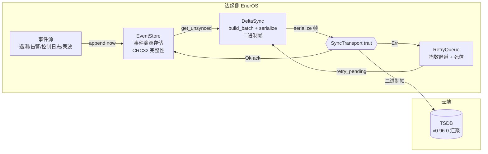
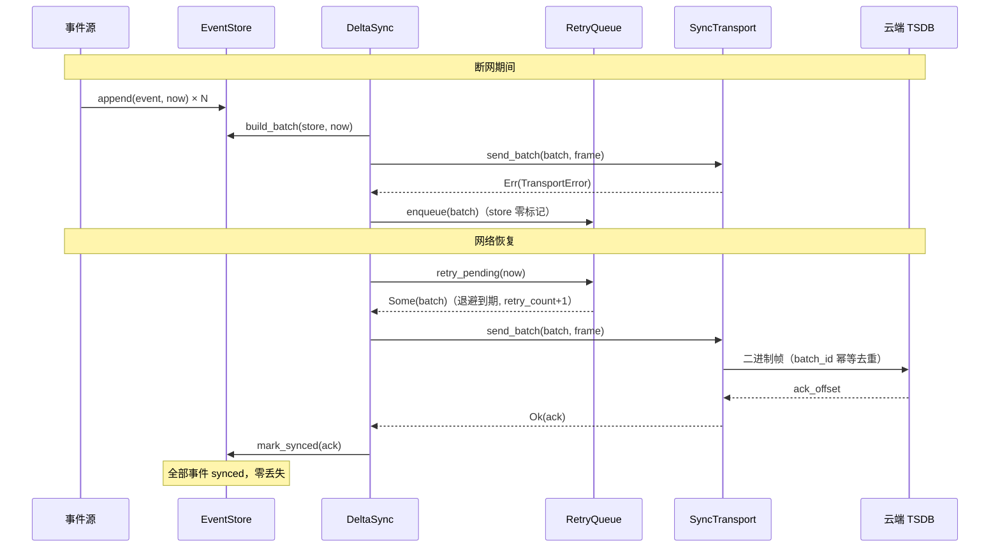
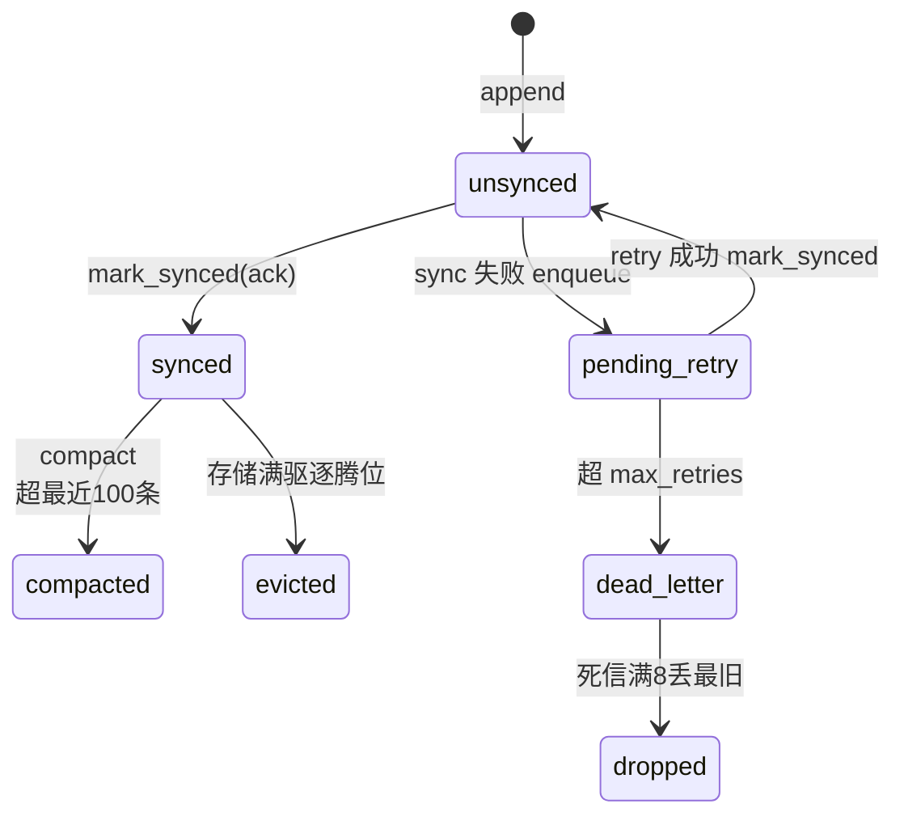

# EnerOS v0.110.0 云边数据同步设计文档

> **版本**：v0.110.0（Phase 2 P2-H 第 2 版）
> **Crate**：`eneros-cloud-sync`（`crates/agents/cloud-sync/`，no_std + alloc，零第三方依赖）
> **蓝图**：`phase2.md` §v0.110.0
> **日期**：2026-07-20
> **关联**：上游 v0.95.0 云端策略下发 / v0.96.0 云端数据汇聚 / v0.101.0 断网处理 / v0.109.0 故障录波；下游 v0.111.0 模型 OTA

---

## 1. 版本目标

边缘侧遥测/状态/告警/控制日志/交易/配置六类事件可靠汇聚到云端 TSDB，支撑全局分析与审计（蓝图 §1）。断网期间事件本地持久不丢，网络恢复后增量补传。本版交付：

- **事件溯源存储**（event_store.rs）：容量有界、满则压缩、CRC32-IEEE 完整性校验
- **增量批量同步**（delta_sync.rs）：`build_batch` 组批 + 自定义二进制帧序列化 + `sync_once`/`retry_once` 编排
- **指数退避重试队列**（retry_queue.rs）：封顶 300s + 确定性 xorshift32 抖动 + 有界死信队列
- **传输抽象**（lib.rs）：`SyncTransport` sync trait + `MockSyncTransport`（D4，真实网络适配器在集成层注入）

打通「事件 → 存储 → 同步 → 补传」链路，为 v0.111.0 模型 OTA 提供云边通道基础。

## 2. 前置依赖

| 依赖版本 | 提供能力 | 本版消费点 |
|---------|---------|-----------|
| v0.11.0 用户堆 | alloc（Vec/VecDeque） | Event/EventStore/RetryQueue 动态分配 |
| v0.12.0 RTC | 系统时钟 | `now: u64` 时间注入源（D7，集成层供给） |
| v0.95.0 Cloud Coordinator | 云边通道抽象先例 | SyncTransport trait 设计（D4） |
| v0.96.0 云端数据汇聚 | 云端 TSDB 汇聚对端 | 六类事件语义对齐 |
| v0.101.0 断网处理 | EventCache/RecoverySync | 孤岛事件缓存语义对齐 |
| v0.109.0 故障录波 | COMTRADE 录波文件 | 可上传数据源 |

Rust 工具链 nightly-2026-04-04（rust-toolchain.toml 锁定）；目标 aarch64-unknown-none + x86_64 主机测试。

## 3. 交付物清单

| 交付物 | 路径 | 说明 |
|--------|------|------|
| 事件溯源存储 | `crates/agents/cloud-sync/src/event_store.rs` | `Event`/`EventType`/`EventStore` + `crc32()`（D8/D9） |
| 增量同步 | `crates/agents/cloud-sync/src/delta_sync.rs` | `DeltaSync`/`SyncBatch`/`SyncStats`/`CompressionType`（D5/D10/D11） |
| 重试队列 | `crates/agents/cloud-sync/src/retry_queue.rs` | `RetryQueue`（D6/D10） |
| crate 基座 | `crates/agents/cloud-sync/src/lib.rs` | `SyncError`/`SyncTransport`/`MockSyncTransport` + 重导出 + crate 文档 |
| crate 清单 | `crates/agents/cloud-sync/Cargo.toml` | workspace 继承，零依赖 |
| 配置文件 | `configs/cloud-sync.toml` | `[event_store]`/`[delta_sync]`/`[retry_queue]` 三节 + 9 点中文注释 |
| 设计文档 | `docs/agents/cloud-sync-design.md` | 本文档（12 章节 + 2 Mermaid + D1~D12 偏差表） |
| 单元测试 | src 内嵌 `#[cfg(test)]` | 29 个（ES×9 + DS×7 + RQ×7 + INT×5 + PERF×1） |
| 版本同步 | 根 `Cargo.toml` / `Makefile` / `ci.yml` / `gate.rs` | 0.109.0 → 0.110.0 |

## 4. 详细设计

### 4.1 总体架构



三层结构：**存储层**（EventStore 事件溯源，append-only + offset 水位）、**同步层**（DeltaSync 组批序列化 + 编排）、**韧性层**（RetryQueue 退避重试 + 死信兜底）。传输经 `SyncTransport` trait 注入（D4），crate 零网络代码。

### 4.2 事件溯源存储（event_store.rs）

`EventStore { events: Vec<Event>, base_offset, current_offset, max_events }`（字段私有）：

- `new(max_events)`：==0 → `InvalidConfig`（D9）
- `append(event_type, payload, now) -> Result<u64, SyncError>`：计算 `checksum = crc32(payload)`，写入 `Event { offset: current_offset, timestamp: now, ..., synced: false }`，返回递增 offset。**容量满时先 `compact()`，仍满则驱逐最旧已同步事件腾位**（已同步数据云端已持久，本地驱逐不丢数据）；**全部未同步不可压缩 → `Err(StoreFull)`**（D9：宁可显式背压报错，不静默丢数据，蓝图 §7.1）
- `get_unsynced(max) -> Vec<&Event>`：未同步事件 offset 升序取前 max 条
- `mark_synced(up_to_offset)`：`offset <= up_to_offset` 置已同步（幂等，§6.4）
- `compact()`：移除最旧已同步，保留全部未同步 + 最近 100 条已同步，推进 `base_offset`
- `crc32(data)`：CRC32-IEEE（反射多项式 0xEDB88320，const 256 项表），已知向量 `"123456789" → 0xCBF43926`；`Event::verify()` 校验 `crc32(payload) == checksum`

### 4.3 断网补传时序（蓝图 §4.3 重绘）



### 4.4 增量同步与二进制帧（delta_sync.rs，D11）

`build_batch(store, now)`：取前 `batch_size` 条未同步事件克隆组批——`batch_id = from_offset`（云端幂等去重键）、`to_offset = last.offset`、`retry_count = 0`、`created_at = now`。

帧格式（全小端）：

```
[magic u16 LE = 0xC537][version u8 = 1][event_count u16 LE]
+ 每事件 [offset u64 LE][timestamp u64 LE][event_type u8]
        [payload_len u32 LE][payload][checksum u32 LE]
```

magic + version 支撑云端 API 版本演进（蓝图 §8.4）；per-event CRC32 支撑云端校验和不匹配按批重发（§4.4）。`sync_once` 成功：`mark_synced(ack)` + `last_synced_offset = ack` + `total_sent += 1`；失败：`queue.enqueue(batch)` + `total_retry_enqueued += 1`，不标记任何事件。`retry_once` 失败重入队时 `created_at = now`（D10 重试时间基线，防长断网后全批立即到期形成重试风暴）。

### 4.5 指数退避重试队列（retry_queue.rs，D6/D10）

- 退避公式：`min(base << retry_count, 300_000) + jitter`，`jitter = xorshift32(retry_count × 2654435761 | 1) mod (base + 1)`，区间 `[exp, exp + base]`；值溢出经 `saturating_pow`/`saturating_mul` 饱和后封顶 300s
- `retry_pending(now)` 仅检查队首：`retry_count >= max_retries` → 移死信（有界 8 批，溢出丢最旧）+ `dead_letter_count += 1` → `None`；`now - created_at >= backoff` → 弹出 `retry_count += 1` → `Some`；否则 `None`
- 生产路径零 `unwrap`（D10，`pop_front()` 改 if let）
- 死信队列替代蓝图「直接丢弃」（蓝图注释「进入死信队列」但无实现，丢弃即数据丢失），死信批次保留供运维人工干预/审计

### 4.6 事件状态迁移



## 5. 技术交底

- **事件溯源选型（蓝图 §5.1）**：append-only + offset 水位，云端按 offset 区间 ack，断点续传天然幂等；相比「发送即删」队列保留本地审计追溯能力，满足电力事故留痕要求
- **CRC32-IEEE 自实现（D8）**：eneros-crypto 为国密 SM 系列不含 CRC32；表驱动 ~30 行成熟算法不属重复造轮子（记忆 §5.5）
- **SyncTransport sync trait（D4）**：no_std 无 async runtime/std::net；蓝图 `async send_batch` + `HttpClient` 不可落地，改 sync trait + 集成层注入真实适配器（v0.95.0 CloudChannel / v0.106.0 MmsTransport 同先例）
- **确定性抖动（D6）**：`rand` 为 std 专用；xorshift32 同 retry_count 同结果，测试可断言，零依赖零状态；抖动 ∈ [0, base] 防多边缘盒恢复后重试风暴
- **LLM 必要性证据（P1-5）**：本版为纯数据传输通道，无优化决策，不涉及 LLM；Solver 亦无关（L1/L2 路径之外的基础服务）

## 6. 测试计划

29 个单元测试（src 内嵌 `#[cfg(test)]`，D3）：

| 组 | 编号 | 覆盖点 |
|----|------|--------|
| event_store | ES1~ES9 | append 递增 offset+timestamp 注入 / checksum+verify（含篡改）/ get_unsynced 过滤+take(max) / mark_synced 幂等 / compact 保留未同步+最近100已同步+base_offset 推进 / 满自动驱逐后写入 / 全未同步满 → StoreFull 不丢 / new(0) → InvalidConfig / crc32 已知向量（"123456789"→0xCBF43926） |
| delta_sync | DS10~DS16 | build_batch 空 → None / build_batch 语义 / new 校验（batch_size==0、Snappy/Gzip → InvalidConfig）/ serialize 帧布局（magic+version+count+TLV+CRC）/ sync_once 成功 mark_synced+stats / sync_once 失败入队不标记 / retry_once 成功+失败重入队 created_at 更新 |
| retry_queue | RQ17~RQ23 | enqueue+退避未到 → None / 退避到 → 出队 retry_count+1 / 超 max_retries → 死信+计数 / 死信有界 8 丢最旧 / 指数退避 1/2/4s…封顶 300s（含 rc=63 溢出）/ 抖动确定性+区间 [exp, exp+base] / max_retries=0 → 立即死信 |
| 集成 | INT24~INT28 | 断网→补传→数据不丢（5 事件+1 次失败注入全流程）/ 幂等重发 / 混合 6 类事件类型 / 长断网 StoreFull 不丢已有 / mock sent payload 可解析回放 |
| perf | PERF29 | 1000 事件 × 10 批 build_batch+serialize+mock send < 2000ms（cfg(test) Instant，D12） |

## 7. 验收标准

1. `cargo test -p eneros-cloud-sync`：29/29 全过
2. `cargo build -p eneros-cloud-sync --target aarch64-unknown-none -Z build-std=core,alloc -Z build-std-features=compiler-builtins-mem`：交叉编译通过
3. `cargo clippy -p eneros-cloud-sync --all-targets -- -D warnings`：零警告
4. `cargo fmt -p eneros-cloud-sync -- --check`：通过
5. 全 workspace 回归零破坏（纯新增 crate，既有 crate 零改动）
6. crc32 已知向量断言：`crc32(b"123456789") == 0xCBF43926`
7. 断网→补传→数据不丢集成链路（INT24）通过；StoreFull 背压不丢已有（INT27）通过

## 8. 风险

| 风险 | 等级 | 缓解 |
|------|------|------|
| 长断网事件量超 max_events | 中 | StoreFull 显式背压上游（D9）；集成层按 SLA 调大容量或外接 v0.24.0 文件系统溢出落盘 |
| 死信批次需人工干预 | 低 | 死信队列有界 8 + dead_letter_count 可观测；运维经 v0.41.0 System Agent 导出 |
| 抖动确定性降低随机性 | 低 | 单边缘盒场景冲突域小；多盒部署时 jitter 种子可按 device_id 混入（后续增强） |
| 压缩缺失增大带宽 | 低 | payload 平均 256B 小帧；Snappy/Gzip 预留枚举，后续按需引入（D5） |
| 真实网络时延未验证 | 低 | 性能口径为主机 Instant 断言（D12）；硬件在环为实验室项 |

## 9. 多角度要求

- **no_std 合规（§43.1）**：`#![cfg_attr(not(test), no_std)]` + `extern crate alloc`；零 `std::*`/零 `panic!`/零 `todo!`/零 `unimplemented!`/生产路径零 `unwrap`（D10）
- **内存预算（§43.6）**：max_events=10000 × (256B payload + 40B 开销) ≈ 2.9MB，归入 Agent Runtime ≤ 64MB 分区；重试/死信队列峰值 ≤ 2× 单批体积
- **可观测（蓝图 §9）**：`SyncStats { total_sent, total_retry_enqueued, total_dead_letter, last_synced_offset }`（D12）；`pending_len()`/`dead_letter_count()` 访问器
- **GPU 不适用（§6.6，记忆 §4.2）**：纯缓冲管理 + 字节序列化 workload，零 GPU 代码
- **SBOM（§43.8）**：零第三方依赖，`cargo deny` 无新增条目
- **安全**：payload 为 opaque 字节，机密性由传输层（v0.98.1 纵向加密/TLS）保证；本层仅 CRC32 完整性（非密码学校验）

## 10. 接口契约

```rust
// ============ crates/agents/cloud-sync/src/lib.rs ============
pub enum SyncError {                            // Debug/Clone/Copy/PartialEq（D12）
    StoreFull, TransportError, ServerError(u16), ChecksumMismatch, InvalidConfig,
}

pub trait SyncTransport {                       // D4（sync，no_std 单线程惯例，不要求 Send+Sync）
    /// 发送序列化批次；成功返回云端确认的 ack_offset（语义 ≤ batch.to_offset）。
    fn send_batch(&mut self, batch: &SyncBatch, payload: &[u8]) -> Result<u64, SyncError>;
}
pub struct MockSyncTransport {                  // D4（v0.95.0 MockCloudChannel 先例）
    pub fail_times: u32,                        // >0 时递减并返回 Err(TransportError)
    pub sent: Vec<Vec<u8>>,                     // 已成功发送的 payload 记录
}
impl MockSyncTransport {
    pub fn new() -> Self;
    pub fn with_fail_times(fail_times: u32) -> Self;
}

// ============ src/event_store.rs ============
pub enum EventType {                            // Debug/Clone/Copy/PartialEq
    Telemetry = 0, Status = 1, Alarm = 2,
    ControlLog = 3, TradeRecord = 4, ConfigChange = 5,
}
pub struct Event {                              // Debug/Clone/PartialEq
    pub offset: u64, pub timestamp: u64, pub event_type: EventType,
    pub payload: Vec<u8>, pub checksum: u32, pub synced: bool,
}
impl Event {
    pub fn verify(&self) -> bool;               // crc32(payload) == checksum（D8）
}
pub fn crc32(data: &[u8]) -> u32;               // CRC32-IEEE const 表（D8）

pub struct EventStore { /* events/base_offset/current_offset/max_events 私有 */ }
impl EventStore {
    pub fn new(max_events: usize) -> Result<Self, SyncError>;   // ==0 → InvalidConfig（D9）
    pub fn append(&mut self, event_type: EventType, payload: &[u8], now: u64)
        -> Result<u64, SyncError>;              // 满且不可压缩 → StoreFull（D7/D9）
    pub fn get_unsynced(&self, max: usize) -> Vec<&Event>;      // offset 升序
    pub fn mark_synced(&mut self, up_to_offset: u64);           // 幂等
    pub fn compact(&mut self);                  // 保留未同步 + 最近 100 条已同步
    pub fn len(&self) -> usize;
    pub fn is_empty(&self) -> bool;
    pub fn current_offset(&self) -> u64;
    pub fn base_offset(&self) -> u64;
}

// ============ src/delta_sync.rs ============
pub enum CompressionType { None, Snappy, Gzip } // Debug/Clone/Copy/PartialEq（D5：仅 None 可构造）
pub struct SyncBatch {                          // Debug/Clone/PartialEq（D10 归属本模块）
    pub batch_id: u64, pub events: Vec<Event>,
    pub from_offset: u64, pub to_offset: u64,
    pub retry_count: u32, pub created_at: u64,
}
pub struct SyncStats {                          // Debug/Clone/Copy/PartialEq（D12）
    pub total_sent: u64, pub total_retry_enqueued: u64,
    pub total_dead_letter: u64, pub last_synced_offset: u64,
}
pub struct DeltaSync { /* batch_size/compression/last_synced_offset/stats 私有（D4 endpoint 移出） */ }
impl DeltaSync {
    pub fn new(batch_size: usize, compression: CompressionType) -> Result<Self, SyncError>;  // D5
    pub fn build_batch(&self, store: &EventStore, now: u64) -> Option<SyncBatch>;
    pub fn serialize(batch: &SyncBatch) -> Vec<u8>;             // D11 二进制帧
    pub fn sync_once<S: SyncTransport>(&mut self, store: &mut EventStore,
        transport: &mut S, queue: &mut RetryQueue, now: u64) -> Result<Option<u64>, SyncError>;
    pub fn retry_once<S: SyncTransport>(&mut self, store: &mut EventStore,
        transport: &mut S, queue: &mut RetryQueue, now: u64) -> Result<Option<u64>, SyncError>;
    pub fn compression(&self) -> CompressionType;
    pub fn stats(&self) -> &SyncStats;
    pub fn last_synced_offset(&self) -> u64;
}

// ============ src/retry_queue.rs ============
pub struct RetryQueue { /* pending/max_retries/backoff_base_ms/dead_letters/dead_letter_count 私有（D10） */ }
impl RetryQueue {
    pub fn new(max_retries: u32, backoff_base_ms: u64) -> Self;
    pub fn enqueue(&mut self, batch: SyncBatch);
    pub fn retry_pending(&mut self, now: u64) -> Option<SyncBatch>;   // D7/D10
    pub fn calculate_backoff(&self, retry_count: u32) -> u64;         // 指数封顶 300s + 确定性抖动（D6）
    pub fn pending_len(&self) -> usize;
    pub fn dead_letter_count(&self) -> u64;
    pub fn dead_letters(&self) -> &VecDeque<SyncBatch>;
}
```

## 11. 偏差声明

| 编号 | 偏差 | 理由 |
|------|------|------|
| **D1** | 蓝图 `crates/cloud_sync/` → `crates/agents/cloud-sync/`（eneros-cloud-sync） | 记忆 §2.3.1 强制：crate 归 `crates/<subsystem>/`；云边同步与 v0.95.0 cloud-coordinator / v0.96.0 云端汇聚同属 agents 子系统 |
| **D2** | 蓝图 `docs/phase2/cloud_sync.md` → `docs/agents/cloud-sync-design.md` | 记忆 §2.3.3 强制：文档按方向分类（cloud-aggregation-design.md 同目录先例） |
| **D3** | 蓝图 `tests/sync_retry.rs` → src 内嵌 `#[cfg(test)]` | v0.87.0~v0.109.0 项目惯例，不新增 tests/ 文件 |
| **D4** | 蓝图 `async send_batch` + `HttpClient` → `SyncTransport` sync trait（`send_batch(batch, payload) -> Result<u64, SyncError>` 返回 ack_offset）+ `MockSyncTransport`（fail_times 故障注入 + sent 记录，置于 lib.rs）；`endpoint` 字段移出 `DeltaSync`（真实 transport 实现承载） | no_std 无 async runtime/无 std::net（v0.95.0 D3/D8 CloudChannel、v0.106.0 D4 MmsTransport 同先例）；主机可测；真实 HTTP/gRPC 适配器在集成层注入 |
| **D5** | `CompressionType` 保留 None/Snappy/Gzip 3 变体（对齐蓝图数据结构），但本版仅 None 可构造——`DeltaSync::new` 遇 Snappy/Gzip 返回 `InvalidConfig` | 零第三方依赖约束；记忆 §5.5 集成清单未列入 no_std 压缩库（snappy/gzip 无 no_std 成熟实现）；压缩为传输层可选增强，后续版本按需引入 |
| **D6** | 蓝图 `rand::thread_rng().gen_range(0..=base)` 抖动 → 确定性 xorshift32 抖动：`xorshift32(retry_count×2654435761\|1) mod (base+1)` | `rand` 为 std 专用，no_std 不可用；确定性抖动同 retry_count 同结果，测试可断言，零依赖零状态 |
| **D7** | 蓝图 `current_time_ms()` 全局时间函数 → `now: u64` 参数注入（append/build_batch/retry_pending/sync_once/retry_once） | no_std 无系统时间（v0.108.0 D9 KeyMgmt / v0.109.0 D11 同先例）；集成层由 v0.12.0 RTC 供给 |
| **D8** | 蓝图 `crc32_checksum` 未定义 → 自实现 CRC32-IEEE（多项式 0xEDB88320，const 256 项表，纯 core 零依赖）+ `Event::verify()` | 蓝图 §7.3 要求事件完整性 CRC32；eneros-crypto 无 CRC32 实现（SM 系列不含）；表驱动 ~30 行成熟算法不属重复造轮子 |
| **D9** | 蓝图 `append` 返回 u64 → `Result<u64, SyncError>`：存储满且 compact 后仍无可压缩已同步事件 → `Err(StoreFull)`；`EventStore::new` 校验 max_events>0 → `InvalidConfig` | 蓝图 append 在「全未同步且已满」时静默越界增长或丢数据，违反 §7.1「断网后数据不丢」；显式错误让上游（RTOS 采样侧）感知背压 |
| **D10** | ① 超 max_retries 直接丢弃 → 有界死信队列（容量 8 批，溢出丢最旧死信）+ `dead_letter_count` 统计；② 重试失败重入队时 `created_at` 更新为失败时刻（重试时间基线）；③ `SyncBatch` 归 delta_sync.rs（build_batch 产出地）；④ `retry_pending` 蓝图 `pop_front().unwrap()` 改 if let（生产零 unwrap） | ① 蓝图注释「进入死信队列」但无实现，丢弃即数据丢失；② 蓝图用原始 created_at 判定退避，长断网后全部批次立即到期、退避失效形成重试风暴；③ 内聚；④ 记忆 §4.3 no_std 合规 |
| **D11** | 蓝图 `serialize_batch` / `snappy_compress` 未定义 → 自定义二进制帧：`[magic u16 LE=0xC537][version u8=1][event_count u16 LE]` + 每事件 `[offset u64][timestamp u64][event_type u8][payload_len u32][payload][checksum u32]`（全 LE） | 零第三方依赖（serde/postcard 不入仓）；magic+version 支撑云端 API 版本演进（蓝图 §8.4）；帧内含 per-event CRC32 支撑 §4.4 校验和不匹配重发 |
| **D12** | 错误模型 `SyncError` = StoreFull / TransportError / ServerError(u16) / ChecksumMismatch / InvalidConfig（5 变体，Debug/Clone/Copy/PartialEq）；新增 `SyncStats { total_sent, total_retry_enqueued, total_dead_letter, last_synced_offset }`（Debug/Clone/Copy/PartialEq）落地蓝图 §9 可观测要求；性能「1000 事件 < 2s」落地为 cfg(test) Instant 主机断言 | 蓝图引用 SyncError 未定义；变体覆盖 §4.4 各失败面（对齐 v0.95.0 CloudError Copy 惯例）；性能口径与 v0.109.0 D12 一致（真实网络时延为实验室项） |

## 12. 附录

- **帧格式速查**：魔数 `0xC537`（u16 LE 字节序 `37 C5`）、版本 `1`、事件类型码 Telemetry=0 … ConfigChange=5；单事件固定字段 21B + payload + 4B CRC
- **内存预算声明（记忆 §5.6）**：事件存储默认 max_events=10000，单事件平均 payload 256B + 结构开销约 40B → 约 2.9MB；重试队列/死信队列按批次复用同一份事件克隆，峰值 ≤ 2× 单批体积。整体归入 Agent Runtime 分区（≤64MB，蓝图 §43.6），OOM 余量充足
- **性能口径声明（D12）**：PERF29 为 cfg(test) 主机 Instant 断言（1000 事件 < 2s）；真实硬件（飞腾/鲲鹏）与真实网络时延为实验室项，集成阶段补测
- **下游路线**：v0.111.0 模型 OTA 复用 SyncTransport 抽象与重试队列；v0.112.0+ 按需引入 Snappy 压缩（D5 预留枚举）
