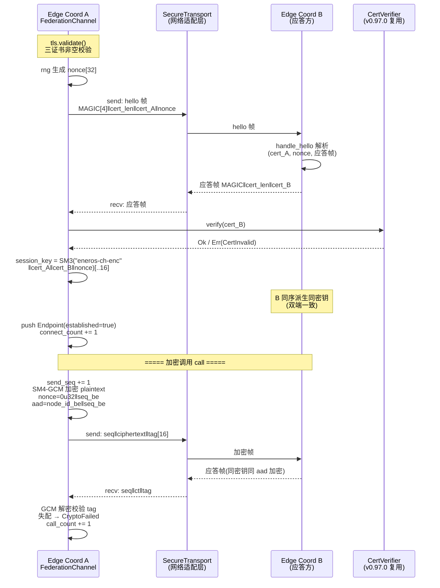
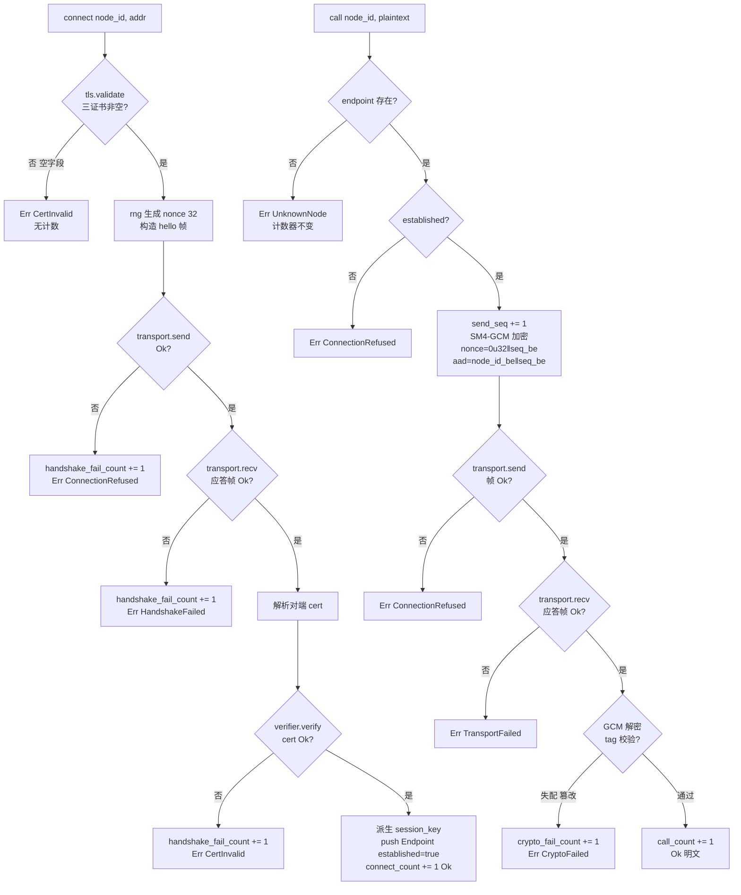

# EnerOS v0.98.0 Cross-Domain Channel 跨域通信通道（gRPC + mTLS）设计文档

> **版本**：v0.98.0
> **蓝图**：phase2.md §v0.98.0（P2-E 第 2 版）
> **Crate**：`eneros-federation`（`crates/agents/federation/src/channel.rs`，既有 crate 新增模块）

---

## 1. 版本目标

实现 **Edge Coordinator 间跨域加密通信通道**（**Phase 2 P2-E 第 2 版，多机联邦安全通道层**），交付三大能力：

- **mTLS 双向认证握手**：`connect(node_id, addr)` 以 `TlsConfig::validate` 非空校验（三证书任一空 → `Err(CertInvalid)`）为前置 → 注入 `CsRng` 生成 nonce[32] → hello 帧 `MAGIC[4]‖cert_len:u32‖cert‖nonce[32]` 经 `SecureTransport.send` 发出 → 收对端应答帧 → 复用 v0.97.0 `CertVerifier` 验证对端证书（拒绝 → `Err(CertInvalid)` + `handshake_fail_count` 留痕）→ 双方同序派生会话密钥 → 注册 `Endpoint`（established=true）；
- **SM4-GCM 加密调用**：`call(node_id, plaintext)` 查 endpoint → `send_seq+=1` → 以 session_key 做 SM4-GCM 认证加密（nonce = `0u32‖seq_be`，aad = `node_id_be‖seq_be`）→ 帧 `seq:u64‖ciphertext‖tag[16]` 传输 → 收应答帧解密（tag 失配 → `Err(CryptoFailed)` + `crypto_fail_count` 留痕）→ 返回明文；
- **断连重连**：`disconnect(node_id)` 移除 endpoint；`reconnect(node_id)` 按已存 addr 重握手（蓝图 §9 可靠：断连重连），端点状态机闭环。

辅助能力：

- **接口先行适配层**：`SecureTransport` sync trait 抽象真实 gRPC/TLS 栈（tonic 依赖 std/tokio 无法交叉编译，D3）+ `MockSecureTransport` 故障注入（fail_send_times / fail_recv_times）；真实栈由集成阶段 Agent Runtime 适配层以 `Box<dyn SecureTransport>` 注入；
- **确定性握手语义**：`derive_session_key(init_cert, resp_cert, nonce)`（SM3 折叠取前 16 字节，双方同序拼接可独立复算）与 `handle_hello(hello, own_cert)` 公开辅助函数，供应答方/回环双端测试复算（D6）；
- **可观测计数器**：4 个 pub 计数器 `connect_count` / `call_count` / `handshake_fail_count` / `crypto_fail_count` 全程留痕（蓝图 §9，D12）。

**业务价值**：v0.97.0 完成联邦发现（成员基础），但联邦成员间通信仍为明文假设——跨域策略协同、共识选举报文暴露于窃听/篡改风险。本版本建立**国密加密通道**（SM2 证书体系 + SM3 密钥派生 + SM4-GCM 数据加密），防窃听防篡改，为多机联邦全部跨域报文提供安全传输底座。

**Phase 定位**：P2-E 第 2 版；**下游解锁 v0.99.0 联邦共识协议（共识报文走加密通道）与 v0.98.1 纵向加密认证（刚性合规子版本）**。

**性能目标**（蓝图 §7.2）：跨域往返 < 50ms —— **集成阶段验收**，本版本交付算法骨架 + Mock 单元验证（真实 `SecureTransport` 适配器注入后由集成阶段实测验收）。

---

## 2. 前置依赖

- **v0.97.0 联邦发现**（前序版本，P2-E 起点）：联邦成员拓扑 + `CertVerifier` trait（本版本直接复用验证对端证书，§5.5 防重复造轮子，D5）；成员拓扑为 mTLS 通道建立提供对端节点基础；
- **eneros-crypto**（workspace 既有 crate，v0.33.0 国密 SM2/SM3/SM4 + CSRNG）：SM3 哈希（会话密钥派生）、`Sm4Gcm`（数据帧认证加密）、`CsRng`（nonce 生成）——`Cargo.toml` 追加 path 依赖（D9，零新增第三方依赖，SBOM 不变）；
- 蓝图 `phase2.md` v0.98.0 章节（9 节版本模板，§4.3 握手与加密调用 / §7.2 往返 <50ms / §7.3 mTLS 双向认证强制为落地依据）；
- **no_std + alloc**：`core` / `alloc` only——`alloc::vec::Vec` / `alloc::boxed::Box` / `alloc::collections::BTreeMap` / `core::net::SocketAddr`；禁止 `std::*`（蓝图 §43.1 硬性要求）；
- **后续注入**：真实 gRPC + TLS 栈（集成阶段 Agent Runtime 适配层实现 `SecureTransport`）与 PKI v0.32.0 证书链适配器（实现 `CertVerifier`）后续以 `Box<dyn>` 注入，channel 层零改动对接。

**下游解锁**：v0.99.0 联邦共识协议（共识报文加密传输）/ v0.98.1 纵向加密认证（同 crate tunnel.rs，联邦安全通道族）。

---

## 3. 交付物清单

- `crates/agents/federation/src/channel.rs` — **新增**：`TlsConfig`（+ validate）/ `Endpoint` / `ChannelError`（6 变体）/ `SecureTransport` trait（sync，D3）/ `MockSecureTransport`（故障注入）/ `FederationChannel`（new / connect / call / disconnect / reconnect + `derive_session_key` + `handle_hello` + 4 pub 计数器）
- `crates/agents/federation/Cargo.toml` — **修改**：`[dependencies]` 追加 `eneros-crypto = { path = "../../security/crypto" }`（D9）；description 升级为 v0.97.0+v0.98.0/v0.98.1 双版本
- `crates/agents/federation/src/lib.rs` — **修改**：`pub mod channel;` + 重导出（TlsConfig / Endpoint / ChannelError / SecureTransport / MockSecureTransport / FederationChannel）+ crate 文档追加 v0.98.0 说明与 D1~D12 偏差表（既有 membership.rs / discovery.rs 零改动）
- `configs/federation-channel.toml` — **新增**：`[channel]` 段（use_sm / ca_cert_path / client_cert_path / client_key_path / handshake_timeout_ms / max_endpoints + 中文注释 ≥6 点）
- `docs/agents/cross-domain-channel-design.md` — 本设计文档
- **40 个单元测试** TC1~TC40（src 内嵌），含握手全链路、证书拒绝、篡改检测、双端复算一致性、Mock 故障注入
- 根目录 4 文件版本同步 0.97.0 → 0.98.0（`Cargo.toml` / `Makefile` / `ci.yml` / `gate.rs` 注释）
- **无 BREAKING**：既有全部 crate 公共 API 零改动

---

## 4. 详细设计

### 4.0 mTLS 握手 + 加密调用时序



### 4.1 TlsConfig（TLS 配置，纯数据，D4）

| 字段 | 类型 | 说明 |
|------|------|------|
| `ca_cert` | `Vec<u8>` | CA 根证书字节（PEM 内容；解析/真实 TLS 握手后置集成） |
| `client_cert` | `Vec<u8>` | 本端客户端证书字节（hello 帧携带，对端 CertVerifier 验证） |
| `client_key` | `Vec<u8>` | 本端客户端私钥字节（与 client_cert 配对） |
| `use_sm` | `bool` | 国密开关（D8：纯配置字段保留，本版本仅国密路径，不产生分支行为差异） |

派生：`Debug, Clone, PartialEq`。

`validate(&self) -> Result<(), ChannelError>`：ca_cert / client_cert / client_key 任一空 → `Err(CertInvalid)`（D4：非空校验先行，无效配置拒绝握手）。

### 4.2 Endpoint（已建连端点）

| 字段 | 类型 | 说明 |
|------|------|------|
| `node_id` | `u64` | 对端节点标识（D2：无堆字符串，v0.97.0 D2 惯例） |
| `addr` | `core::net::SocketAddr` | 对端网络地址（connect 显式携带，reconnect 复用） |
| `established` | `bool` | 通道是否已建立（call 前置检查：false → `Err(ConnectionRefused)`） |
| `session_key` | `[u8; 16]` | 会话密钥（SM3 派生前 16 字节，SM4-GCM 加解密钥） |
| `send_seq` | `u64` | 发送序号（call 自增，GCM nonce/aad 组成，逐 seq 唯一） |

派生：`Debug, Clone, PartialEq`。

### 4.3 ChannelError（6 变体，D10）

| 变体 | 触发条件 |
|------|---------|
| `HandshakeFailed` | 握手失败（应答帧缺失/格式错/recv 失败） |
| `CertInvalid` | 证书无效（TlsConfig 空字段 / CertVerifier 拒绝对端证书） |
| `ConnectionRefused` | 对端拒绝（transport.send 失败）或对未建立端点调用 |
| `UnknownNode` | 未知节点（call/disconnect/reconnect 目标无 endpoint） |
| `CryptoFailed` | 加解密失败（应答帧 GCM tag 校验失配/帧格式错） |
| `TransportFailed` | 传输失败（call 阶段 recv 失败） |

派生：`Debug, Clone, Copy, PartialEq, Eq`。6 变体最小完备：握手 / 证书 / 对端拒绝 / 未知节点 / 加解密失败 / 传输失败。

### 4.4 SecureTransport trait / MockSecureTransport（D3）

```rust
pub trait SecureTransport {
    fn send(&mut self, node_id: u64, data: &[u8]) -> Result<(), ChannelError>;
    fn recv(&mut self, node_id: u64) -> Result<Vec<u8>, ChannelError>;
}
```

- sync trait（D3：no_std 无 async runtime，项目硬规则禁止 async）；无 `Send + Sync` 约束（单分区单线程模型，v0.97.0 D6 惯例）；
- **接口契约先行**（§5.5 防重复造轮子）：tonic gRPC 依赖 std/tokio/hyper 无法交叉编译 aarch64-unknown-none（D3），真实 gRPC 栈由集成阶段 Agent Runtime 适配层以 `Box<dyn SecureTransport>` 注入——channel 层零改动对接。

**MockSecureTransport**（Debug + Clone，故障注入）：

| 字段 | 类型 | 说明 |
|------|------|------|
| `sent` | `Vec<(u64, Vec<u8>)>` | 已发送帧记录（node_id + 字节，按发送顺序） |
| `inbox` | `BTreeMap<u64, Vec<Vec<u8>>>` | 预置应答队列（recv 依次弹出队首） |
| `fail_send_times` | `u32` | 剩余 send 应失败次数（>0 → 递减并 `Err(ConnectionRefused)`） |
| `fail_recv_times` | `u32` | 剩余 recv 应失败次数（>0 → 递减并 `Err(TransportFailed)`） |

recv：fail_recv_times>0 → 递减 + `Err(TransportFailed)`；inbox 队空 → `Err(TransportFailed)`；否则弹出队首返回 Ok。

### 4.5 FederationChannel（通道协调器）

| 字段 | 类型 | 说明 |
|------|------|------|
| `tls` | `TlsConfig` | TLS 配置（证书 + 国密开关） |
| `verifier` | `Box<dyn CertVerifier>` | 注入证书验证器（v0.97.0 复用，Mock / PKI 适配器，D5） |
| `transport` | `Box<dyn SecureTransport>` | 注入传输层（Mock / 真实 gRPC 适配器，D3） |
| `rng` | `CsRng` | 随机源（nonce 生成；测试固定种子确定性复现） |
| `endpoints` | `Vec<Endpoint>` | 已建连端点表（max_endpoints 上限由配置约束） |
| `connect_count` | `u64` | 成功建连计数（pub 可观测，D12） |
| `call_count` | `u64` | 成功加密调用计数（pub 可观测，D12） |
| `handshake_fail_count` | `u64` | 握手失败累计（send/recv/证书拒绝各 +1，pub 可观测，D12） |
| `crypto_fail_count` | `u64` | 加解密失败累计（pub 可观测，D12） |

字段全 pub（v0.95.0 D9 惯例：no_std 无 log crate，metric 全部字段化本地可查）。

### 4.6 握手帧与会话密钥派生（D6/D7）

- **hello 帧**（发起方 → 应答方）：`MAGIC[4]‖cert_len:u32‖cert‖nonce[32]`；
- **应答帧**（应答方 → 发起方）：`MAGIC[4]‖cert_len:u32‖cert`；
- **会话密钥**：`SM3("eneros-ch-enc"‖init_cert‖resp_cert‖nonce)` 取前 16 字节——双方同序拼接可独立复算（D6）；`derive_session_key` 与 `handle_hello` 公开辅助函数供应答方/回环双端测试；
- **数据帧**：`seq:u64‖ciphertext‖tag[16]`，SM4-GCM 认证加密（eneros-crypto 既有 `Sm4Gcm`，D7）；nonce = `0u32‖seq_be`（12 字节逐 seq 唯一，GCM 安全），aad = `node_id_be‖seq_be`。

### 4.7 connect / call 决策流程



- `connect(&mut self, node_id: u64, addr: SocketAddr) -> Result<(), ChannelError>`：validate → nonce → hello → send/recv → verify → 派生密钥 → 注册端点，任一失败路径 `handshake_fail_count += 1`（validate 失败除外，未发起握手）且错误显式返回；
- `call(&mut self, node_id: u64, plaintext: &[u8]) -> Result<Vec<u8>, ChannelError>`：查端点 → 自增 seq → GCM 加密 → 传输 → 解密应答，tag 失配 `crypto_fail_count += 1`；
- `disconnect(&mut self, node_id: u64) -> bool`：移除 endpoint，存在并移除返回 true；
- `reconnect(&mut self, node_id: u64) -> Result<(), ChannelError>`：按已存 addr 重握手（蓝图 §9 可靠：断连重连），未知节点 → `Err(UnknownNode)`。

---

## 5. 技术交底

### 5.1 为何 sync + SecureTransport trait 替代 tonic gRPC（D3）

蓝图 `pub async fn connect/call` + tonic gRPC 落地为 sync 方法 + `SecureTransport` sync trait：① **no_std 硬规则禁 async**——无 tokio/async-std runtime，`core` 仅提供 `Future` 抽象而无执行器（v0.95.0 D3 / v0.97.0 D3 惯例）；② **tonic 无法交叉编译**——tonic 依赖 std/tokio/hyper，aarch64-unknown-none 目标不可用；③ **接口先行模式**——本版本锁定 `send/recv` 签名，真实 gRPC + TLS 栈由集成阶段 Agent Runtime 适配层以 `Box<dyn SecureTransport>` 注入（同 v0.97.0 D5/D6 接口先行模式），channel 层零改动；④ Mock 故障注入（fail_send_times / fail_recv_times 递减）支撑 40 测试全分支覆盖。

### 5.2 为何确定性握手语义替代真实 TLS 握手（D6）

蓝图 TLS 握手（真实 socket）落地为确定性握手语义：hello 帧 → 应答帧 → CertVerifier 验证 → SM3 派生会话密钥。理由：① no_std 环境无真实 socket/TLS 栈，PEM 解析与完整 TLS 状态机后置集成阶段；② **确定性可复算**——`SM3("eneros-ch-enc"‖init_cert‖resp_cert‖nonce)` 双方同序拼接，任一方给三输入可独立复算同密钥，`derive_session_key` / `handle_hello` 公开供应答方与回环双端测试；③ 证书验证不缩水——复用 v0.97.0 `CertVerifier` trait（PKI v0.32.0 适配器后续注入），验证职责真实保留（D5）。

### 5.3 为何 SM4-GCM 数据帧（D7）

蓝图 TLS record 层加密落地为 SM4-GCM 认证加密：① eneros-crypto 既有 `Sm4Gcm`（§5.5 防重复造轮子，零新增依赖）；② **GCM 认证加密**同时提供机密性与完整性——tag 失配即篡改显式暴露（`CryptoFailed` + crypto_fail_count 留痕）；③ nonce = `0u32‖seq_be` 12 字节逐 seq 唯一（GCM 安全硬性要求：同密钥 nonce 不复用），seq 由 endpoint.send_seq 单调自增保证；④ aad = `node_id_be‖seq_be` 绑定对端身份与序号，防帧跨节点重放/乱序拼接。

### 5.4 为何 node_id: u64 / connect(node_id, addr)（D2）

蓝图 `node_id: String` / `connect(target: &str)` 落地为 `node_id: u64` / `connect(node_id: u64, addr: SocketAddr)`：与 v0.97.0 D2 同一惯例——u64 固定 8 字节无堆值类型，Copy 零成本，确定性可重放（电力调度可复现审计要求）；SocketAddr 显式携带（`core::net::SocketAddr` core 原生 no_std），不臆造 ID→地址映射。

### 5.5 为何 use_sm 纯配置字段保留（D8）

蓝图 `use_sm: bool` 国密开关落地为纯配置字段：本版本仅国密路径（SM2 证书体系 / SM3 派生 / SM4-GCM 加密）——项目无 RSA/AES 实现（§5.6 国密合规），use_sm 不产生分支行为差异；字段保留作配置兼容与未来非国密 TLS 集成占位，避免后续配置格式 BREAKING。

### 5.6 错误 6 变体最小完备（D10）

蓝图错误仅"握手失败/证书过期"2 类落地为 6 变体：HandshakeFailed（握手报文缺失/格式错）/ CertInvalid（证书配置空 + 对端证书拒绝）/ ConnectionRefused（对端拒绝、端点未建立）/ UnknownNode（未知节点调用）/ CryptoFailed（加解密失败、篡改）/ TransportFailed（传输层失败）。最小完备：覆盖握手 / 证书 / 对端拒绝 / 未知节点 / 加解密 / 传输 6 类故障域，全部 Copy 值类型无堆分配。

### 5.7 4 计数器可观测（D12）

蓝图 §9 可观测"连接状态 metric"落地为 4 个 pub 计数器：connect_count（成功建连）/ call_count（成功加密调用）/ handshake_fail_count（握手失败累计）/ crypto_fail_count（加解密失败累计）。no_std 无 log crate，metric 全部字段化本地可查（v0.95.0 D9 惯例）；通道健康度（失败率 = handshake_fail / connect）由上层 Agent Runtime 读字段聚合告警。

---

## 6. 测试计划

40 个单元测试 TC1~TC40（src 内嵌 `#[cfg(test)]`，v0.87.0~v0.97.0 项目惯例，不新增 tests/ 文件，D11）：

| 分组 | 编号 | 覆盖点 |
|------|------|--------|
| TlsConfig / Endpoint / ChannelError 数据结构（TC1~TC8） | TC1~TC8 | TlsConfig 字段回显、Clone 独立性、PartialEq；validate 全非空 → Ok；validate 空 ca_cert / 空 client_cert / 空 client_key → Err(CertInvalid)（三字段逐一）；Endpoint 字段回显（node_id/addr/established/session_key/send_seq）、Clone 独立性；ChannelError 六变体互不等、Copy/Eq |
| MockSecureTransport（TC9~TC14） | TC9~TC14 | new 初始状态（sent 空 / inbox 空 / fail 计数零）；send 正常入 sent 记录（node_id + 字节一致）；fail_send_times=2 → 前 2 次 Err(ConnectionRefused) 递减，第 3 次 Ok；recv 依次弹出 inbox 队首（顺序性）；fail_recv_times=1 → 首次 Err(TransportFailed) 后正常；inbox 空 → Err(TransportFailed)；Mock 可作 `Box<dyn SecureTransport>` 多态注入 |
| derive_session_key / handle_hello 辅助函数（TC15~TC20） | TC15~TC20 | derive_session_key 确定性（同三输入同密钥）；异 init_cert / 异 resp_cert / 异 nonce → 异密钥（三者逐一）；密钥长度 16 字节；handle_hello 解析合法 hello → Ok((对端 cert, nonce, 应答帧))，应答帧格式 MAGIC‖cert_len‖own_cert 正确；handle_hello 帧格式错（短帧 / MAGIC 错 / cert_len 越界）→ Err(HandshakeFailed)；**双端复算一致**：A 侧 derive_session_key(cert_A, cert_B, nonce) == B 侧同序复算（回环双端） |
| connect 握手（TC21~TC29） | TC21~TC29 | new 初始状态（endpoints 空、4 计数器全零）；connect 成功全链路（Mock verifier accept + inbox 预置合法应答帧）→ Ok、connect_count==1、endpoint established=true、session_key == derive_session_key 复算值（TC 内经 handle_hello 提取 nonce 复算，双向同密钥）；hello 帧格式正确（MAGIC‖cert_len‖client_cert‖nonce，sent 回读）；tls.validate 空证书 → Err(CertInvalid)、endpoints 空、无发送；send 故障注入 → Err(ConnectionRefused)、handshake_fail_count==1；recv 故障注入 → Err(HandshakeFailed)、handshake_fail_count==1；verifier reject → Err(CertInvalid)、handshake_fail_count==1、endpoints 空；拒绝后改 accept 重试成功（无残留状态）；重复 connect 同 node_id 行为确定 |
| call 加密调用（TC30~TC36） | TC30~TC36 | call 成功（inbox 预置同密钥同 aad/nonce 加密的应答帧）→ Ok(明文)、call_count==1、endpoint.send_seq==1；加密帧格式正确（seq‖ct‖tag，sent 回读解析）；nonce/aad 正确性（应答帧按 node_id_be‖seq_be 构造方可解密）；call(99) 未连接节点 → Err(UnknownNode)、计数器不变；端点 established=false → Err(ConnectionRefused)；**篡改应答帧 tag** → Err(CryptoFailed)、crypto_fail_count==1；**篡改应答帧密文** → Err(CryptoFailed)（GCM tag 失配）；call 阶段 recv 故障 → Err(TransportFailed) |
| disconnect / reconnect / 全链路集成（TC37~TC40） | TC37~TC40 | **TC37** disconnect 存在端点 → true、endpoints 移除、再 call → Err(UnknownNode)；disconnect(99) → false；**TC38** connect → disconnect → reconnect 按已存 addr 重握手成功（新 nonce 新密钥）、connect_count 累计；reconnect(99) 未知节点 → Err(UnknownNode)；**TC39** 双端回环全链路：A.connect → B handle_hello → A 派生密钥 == B 派生密钥 → A.call → B 同密钥解密 → B 加密应答 → A 解密成功（端到端双向加密通话）；**TC40** 计数器综合断言：混合 connect 成功 / send 失败 / recv 失败 / 证书拒绝 / call 成功 / 篡改失败 / 未知节点调用后 4 计数器精确等于预期值（connect=2 / call=1 / handshake_fail=3 / crypto_fail=1） |

性能目标（跨域往返 < 50ms，蓝图 §7.2）标注：**集成阶段验收，本版本交付算法骨架 + Mock 单元验证**。

**GPU 规则说明（蓝图 §6.6）**：本版本为纯标量 CPU 计算（SM3 哈希 / SM4-GCM 加解密 / 帧编解码 / 计数器累加），无张量操作，**不涉及 GPU**。

---

## 7. 验收标准

- **功能**：mTLS 双向认证握手全流程正确（validate → hello → 证书验证 → 密钥派生 → 端点注册，蓝图 §4.3）；SM4-GCM 加密调用（nonce/aad 逐 seq 唯一，tag 篡改显式暴露）；双端同序派生密钥一致（derive_session_key / handle_hello 复算）；断连重连端点状态机闭环（蓝图 §9）；4 个 pub 计数器留痕（D12）；
- **测试**：**40 个测试通过**（`cargo test -p eneros-federation`，TC1~TC40）；下游回归零破坏（既有全部 crate 公共 API 零改动，无 BREAKING）；
- **交叉编译**：`aarch64-unknown-none` 交叉编译通过（no_std + alloc）；
- **质量**：`cargo fmt --check` / `cargo clippy -D warnings` / `cargo deny check` 全过，0 warning；
- **性能**：跨域往返 < 50ms（蓝图 §7.2）——**集成阶段验收**，本版本交付算法骨架 + Mock 单元验证（真实 SecureTransport 适配器注入后实测）；
- **文档**：本设计文档 + `configs/federation-channel.toml` 配置模板（中文注释 ≥6 点）；
- **出口**：P2-E 第 2 版达成，解锁 v0.99.0 联邦共识协议 / v0.98.1 纵向加密认证。

---

## 8. 风险

| 风险 | 说明 | 缓解 |
|------|------|------|
| Mock 抽象无真实 TLS/gRPC | 本版本 `SecureTransport` 仅有 Mock 实现，无真实网络传输与 TLS 握手 | **接口契约先行**（D3）：真实 gRPC 栈由集成阶段 Agent Runtime 适配层以 `Box<dyn SecureTransport>` 注入，channel 层零改动；往返 <50ms 列入**集成阶段验收** |
| 确定性握手非完整 TLS 状态机 | D6 确定性握手语义不含完整 TLS 握手状态机/证书链解析/会话恢复 | 证书验证职责真实保留（复用 v0.97.0 `CertVerifier`，PKI v0.32.0 适配器后续注入，D5）；PEM 解析与真实 TLS 握手后置集成；会话密钥派生 SM3 域分离（"eneros-ch-enc" 前缀）防跨协议碰撞 |
| 证书过期导致全链中断 | 过期证书 → CertVerifier 拒绝 → 握手 CertInvalid，跨域通道全链中断（蓝图 §4.4/§8.5） | 证书轮换提示写入 `configs/federation-channel.toml`（运维侧监控有效期提前滚动更新）；`reconnect` 提供断连重握手补救通道；handshake_fail_count 计数器留痕可告警 |
| 会话密钥驻留内存 | Endpoint.session_key [u8;16] 明文凭内存，通道存续期长期驻留 | 密钥材料最小化（仅 16 字节派生密钥，不存证书私钥之外的长期秘密）；disconnect 即移除端点释放密钥；集成阶段可升级零化 Drop（TunnelKeys 模式 v0.98.1 已落地） |
| 内存（蓝图 §43.6） | endpoints Vec + inbox 队列 + sent 记录堆分配 | Agent Runtime 分区 ≤ 64MB 预算内；`max_endpoints = 16`（configs/federation-channel.toml）约束规模；通道管理为低频管理面操作（非 10ms 控制路径） |

---

## 9. 多角度要求

- **安全**（蓝图 §7.3/§8.5）：mTLS 双向认证**强制**（connect 必经 CertVerifier 验证对端证书，拒绝即 `Err(CertInvalid)` + handshake_fail_count 留痕，宁拒勿放）；SM4-GCM 认证加密（机密性 + 完整性，tag 失配即篡改显式暴露）；nonce 逐 seq 唯一（GCM 安全硬要求）；aad 绑定 node_id + seq 防跨节点重放；证书过期前轮换（配置注释提示，蓝图 §4.4/§8.5）；
- **可观测**（蓝图 §9）：4 个 pub 计数器 `connect_count` / `call_count` / `handshake_fail_count` / `crypto_fail_count`（建连 / 调用 / 握手失败 / 加解密失败全覆盖）；no_std 无 log crate，metric 全部字段化本地可查；
- **确定性**：u64 标识符（D2）+ SM3 域分离确定性密钥派生（双方同序拼接可独立复算）+ seq 单调自增（nonce/aad 逐次唯一）；全链路除注入 CsRng 外无随机源；测试固定种子确定性复现；
- **可扩展**（§5.5）：`SecureTransport` / `CertVerifier` trait 注入式适配（Mock → 真实 gRPC 栈 / PKI v0.32.0 平滑替换，channel 层零改动）；`use_sm` 配置字段预留非国密 TLS 集成位；ChannelError 枚举加变体即可扩展新故障域；
- **可靠**：握手失败显式返回 + 计数器留痕（拒绝是显式决策而非沉默失败）；`disconnect` / `reconnect` 端点状态机闭环（建连 → 通话 → 断连 → 重连无残留，TC38 锁定）；证书拒绝后可改 verifier 重试无残留状态（TC29 锁定）；
- **no_std**：`core` / `alloc` only（`core::net::SocketAddr` / `alloc::vec::Vec` / `alloc::boxed::Box` / `alloc::collections::BTreeMap`），禁止 `std::*`（蓝图 §43.1 硬性要求）；aarch64-unknown-none 交叉编译友好；path 依赖 eneros-crypto 既有 crate，零新增第三方依赖，SBOM 不变（D9）。

---

## 10. 接口契约

pub 项签名清单（与 spec.md ADDED Requirements 一致）：

```rust
// ===== channel.rs =====

/// TLS 配置（纯数据，D4），Debug + Clone + PartialEq
pub struct TlsConfig {
    pub ca_cert: Vec<u8>,
    pub client_cert: Vec<u8>,
    pub client_key: Vec<u8>,
    pub use_sm: bool,
}

impl TlsConfig {
    /// 非空校验：ca_cert/client_cert/client_key 任一空 → Err(CertInvalid)
    pub fn validate(&self) -> Result<(), ChannelError>;
}

/// 已建连端点，Debug + Clone + PartialEq
pub struct Endpoint {
    pub node_id: u64,
    pub addr: core::net::SocketAddr,
    pub established: bool,
    pub session_key: [u8; 16],
    pub send_seq: u64,
}

/// 通道错误（6 变体最小完备，D10），Debug + Clone + Copy + PartialEq + Eq
pub enum ChannelError {
    HandshakeFailed,
    CertInvalid,
    ConnectionRefused,
    UnknownNode,
    CryptoFailed,
    TransportFailed,
}

/// 安全传输层抽象（sync，无 Send+Sync 约束，D3）：
/// 真实 gRPC/TLS 栈由集成阶段以 Box<dyn SecureTransport> 注入
pub trait SecureTransport {
    /// 向指定节点发送数据
    fn send(&mut self, node_id: u64, data: &[u8]) -> Result<(), ChannelError>;
    /// 从指定节点接收数据
    fn recv(&mut self, node_id: u64) -> Result<Vec<u8>, ChannelError>;
}

/// Mock 传输层：故障注入（fail_send_times/fail_recv_times 递减），Debug + Clone
pub struct MockSecureTransport {
    pub sent: Vec<(u64, Vec<u8>)>,
    pub inbox: BTreeMap<u64, Vec<Vec<u8>>>,
    pub fail_send_times: u32,
    pub fail_recv_times: u32,
}

impl MockSecureTransport {
    /// 创建 Mock 传输层，sent/inbox 初始为空
    pub fn new(fail_send_times: u32, fail_recv_times: u32) -> Self;
}

impl SecureTransport for MockSecureTransport {
    fn send(&mut self, node_id: u64, data: &[u8]) -> Result<(), ChannelError>;
    fn recv(&mut self, node_id: u64) -> Result<Vec<u8>, ChannelError>;
}

/// 联邦跨域通信通道（字段全 pub：tls + 2 个 Box<dyn> + rng + endpoints + 4 计数器）
pub struct FederationChannel {
    pub tls: TlsConfig,
    pub verifier: Box<dyn CertVerifier>,
    pub transport: Box<dyn SecureTransport>,
    pub rng: CsRng,
    pub endpoints: Vec<Endpoint>,
    pub connect_count: u64,
    pub call_count: u64,
    pub handshake_fail_count: u64,
    pub crypto_fail_count: u64,
}

impl FederationChannel {
    /// 创建通道：endpoints 空、4 个计数器全零
    pub fn new(
        tls: TlsConfig,
        verifier: Box<dyn CertVerifier>,
        transport: Box<dyn SecureTransport>,
        rng: CsRng,
    ) -> Self;
    /// mTLS 双向认证握手：validate → nonce → hello 帧 → 收应答 →
    /// CertVerifier 验证 → 派生 session_key → 注册 Endpoint；
    /// 失败路径 handshake_fail_count += 1 且错误显式返回
    pub fn connect(&mut self, node_id: u64, addr: SocketAddr) -> Result<(), ChannelError>;
    /// 会话密钥派生：SM3("eneros-ch-enc"‖init_cert‖resp_cert‖nonce) 取前 16 字节，
    /// 双方同序拼接可独立复算（关联 pub fn 供应答方/测试复算）
    pub fn derive_session_key(init_cert: &[u8], resp_cert: &[u8], nonce: &[u8; 32]) -> [u8; 16];
    /// 应答方辅助：解析 hello 帧 → Ok((对端 cert, nonce, 应答帧))；
    /// 帧格式错 → Err(HandshakeFailed)
    pub fn handle_hello(hello: &[u8], own_cert: &[u8]) -> Result<(Vec<u8>, [u8; 32], Vec<u8>), ChannelError>;
    /// 加密调用：查 endpoint → send_seq+=1 → SM4-GCM 加密
    /// （nonce=0u32‖seq_be，aad=node_id_be‖seq_be）→ 帧传输 →
    /// 收应答帧 GCM 解密（tag 失配 → crypto_fail_count+=1 + Err(CryptoFailed)）→
    /// call_count+=1 + Ok(明文)
    pub fn call(&mut self, node_id: u64, plaintext: &[u8]) -> Result<Vec<u8>, ChannelError>;
    /// 断开：移除 endpoint；存在并移除返回 true
    pub fn disconnect(&mut self, node_id: u64) -> bool;
    /// 重连：按已存 addr 重握手（蓝图 §9 可靠：断连重连）；
    /// 未知节点 → Err(UnknownNode)
    pub fn reconnect(&mut self, node_id: u64) -> Result<(), ChannelError>;
}
```

`lib.rs` 重导出（channel 部分，6 项）：

```rust
pub mod channel;

pub use channel::{
    ChannelError, Endpoint, FederationChannel, MockSecureTransport, SecureTransport, TlsConfig,
};
```

**计数器语义**：`connect_count` 仅 connect 全链路成功（验证 + 注册端点）时 +1；`call_count` 仅 call 全链路成功（加密 + 应答解密通过）时 +1；`handshake_fail_count` 握手 send/recv/证书拒绝各 +1（可累计）；`crypto_fail_count` 应答帧 GCM 校验失败时 +1。

---

## 11. 偏差声明

| 偏差 | 蓝图原文 | 本版本处理 |
|------|---------|-----------|
| **D1** | crate 路径 `crates/federation/src/{channel,tls,grpc_service}.rs` | 既有 `crates/agents/federation/src/channel.rs` 单模块（项目 §2.3.1 硬规则；tls/grpc_service 语义并入 channel：TlsConfig 纯数据 + SecureTransport 服务抽象，不过度拆分） |
| **D2** | `node_id: String` / `connect(target: &str)` | `node_id: u64` / `connect(node_id: u64, addr: SocketAddr)`（无堆字符串，v0.97.0 D2 惯例） |
| **D3** | `pub async fn connect/call` + tonic gRPC | sync 方法 + `SecureTransport` sync trait（no_std 硬规则禁 async；tonic 依赖 std/tokio/hyper，无法交叉编译 aarch64-unknown-none；真实 gRPC 栈由集成阶段 Agent Runtime 适配层以 `Box<dyn SecureTransport>` 注入，接口先行模式同 v0.97.0 D5/D6） |
| **D4** | `tonic::transport::ClientTlsConfig` / `Certificate::from_pem` | `TlsConfig { ca_cert, client_cert, client_key, use_sm }` 纯数据 + `validate()` 非空校验（PEM 解析/真实 TLS 握手后置集成） |
| **D5** | mTLS 证书验证（tonic 内部） | 复用 v0.97.0 `CertVerifier` trait 验证对端证书（§5.5 防重复造轮子；PKI v0.32.0 适配器后续注入） |
| **D6** | TLS 握手（真实 socket） | 确定性握手语义：hello 帧 `MAGIC[4]‖cert_len:u32‖cert‖nonce[32]` → 对端应答帧 → CertVerifier 验证 → 会话密钥 `SM3("eneros-ch-enc"‖init_cert‖resp_cert‖nonce)` 取前 16 字节（双方同序拼接可独立复算；`derive_session_key` 与 `handle_hello` 公开辅助函数支持应答方/回环双端测试） |
| **D7** | TLS record 层加密 | SM4-GCM 认证加密（eneros-crypto 既有 `Sm4Gcm`）：帧 `seq:u64‖ciphertext‖tag[16]`，nonce = `0u32‖seq_be`（12 字节逐 seq 唯一，GCM 安全），aad = `node_id_be‖seq_be` |
| **D8** | `use_sm: bool` 国密开关 | 纯配置字段保留（配置兼容/未来非国密 TLS 集成占位）；本版本仅国密路径（项目无 RSA/AES 实现，§5.6 国密合规），use_sm 不产生分支行为差异 |
| **D9** | 外部依赖 tonic | 零新增第三方依赖；path 依赖 eneros-crypto（既有 workspace crate，SBOM 不变） |
| **D10** | 错误仅"握手失败/证书过期"2 类 | `ChannelError { HandshakeFailed, CertInvalid, ConnectionRefused, UnknownNode, CryptoFailed, TransportFailed }`（6 变体最小完备：握手/证书/对端拒绝/未知节点/加解密失败/传输失败） |
| **D11** | 测试 `tests/mtls.rs` | crate 内嵌 `#[cfg(test)]` ~40 测试（v0.87.0~v0.97.0 项目惯例；Mock 故障注入覆盖握手失败/证书拒绝/篡改） |
| **D12** | §9 可观测"连接状态 metric" | 4 个 pub 计数器：`connect_count` / `call_count` / `handshake_fail_count` / `crypto_fail_count` |

---

## 12. 附录

### 相关文档

- [federation-discovery-design.md](./federation-discovery-design.md) — v0.97.0 联邦发现协议设计文档（P2-E 起点，CertVerifier trait 为本版本证书验证复用来源）
- [vertical-encrypt-design.md](./vertical-encrypt-design.md) — v0.98.1 纵向加密认证设计文档（同 crate tunnel.rs，联邦安全通道族）
- 源码路径：`../../crates/agents/federation/src/`（`channel.rs` / `tunnel.rs` / `lib.rs`；crate 根：`crates/agents/federation/`）
- 配置模板：`../../configs/federation-channel.toml`
- Spec：`.trae/specs/develop-v0980-cross-domain-channel/spec.md`
- 蓝图：`蓝图/phase2.md` §v0.98.0（P2-E 第 2 版；§4.3 握手与加密调用 / §7.2 往返 <50ms / §7.3 mTLS 双向认证强制 / §4.4/§8.5 证书轮换 / §9 可观测）

### 关键文件路径

| 文件 | 用途 |
|------|------|
| `crates/agents/federation/Cargo.toml` | crate 清单（追加 eneros-crypto path 依赖，D9） |
| `crates/agents/federation/src/lib.rs` | crate 文档（v0.97.0+v0.98.0/v0.98.1 双版本 + D/E 偏差表）+ 全量重导出 |
| `crates/agents/federation/src/channel.rs` | TlsConfig / Endpoint / ChannelError / SecureTransport / MockSecureTransport / FederationChannel + TC1~TC40 |
| `crates/security/crypto/src/sm3/hmac.rs` | SM3-HMAC（v0.98.1 E11 纯增量，v0.117.0 审计哈希链复用） |
| `configs/federation-channel.toml` | 跨域通道配置模板（use_sm / 证书路径 / handshake_timeout_ms / max_endpoints） |
| `.trae/specs/develop-v0980-cross-domain-channel/spec.md` | 本版本 Spec（D1~D12 / E1~E12 偏差声明全文） |

### 版本基线

- **Phase 定位**：Phase 2 多机联邦 P2-E 第 2 版（前序 v0.97.0 联邦发现 P2-E 起点）
- **下游解锁**：v0.99.0 联邦共识协议（共识报文加密传输）/ v0.98.1 纵向加密认证（刚性合规子版本，同 crate tunnel.rs）/ v0.117.0 审计哈希链（SM3-HMAC 复用）
- **版本阶梯**：v0.95.0 云端策略下发 → v0.96.0 云端数据汇聚 → v0.97.0 联邦发现 → **v0.98.0 跨域通信通道（本版本）** → v0.98.1 纵向加密 → v0.99.0 联邦共识

### 版本历史

| 版本 | 内容 | Crate |
|------|------|-------|
| v0.96.0 | 数据汇聚（P2-D 收官，云边闭环） | `eneros-cloud-aggregator` |
| v0.97.0 | 联邦发现协议（P2-E 起点，多机联邦发现层） | `eneros-federation`（membership / discovery） |
| v0.98.0 | 跨域通信通道（gRPC + mTLS，本版本） | `eneros-federation`（channel.rs 新增） |
