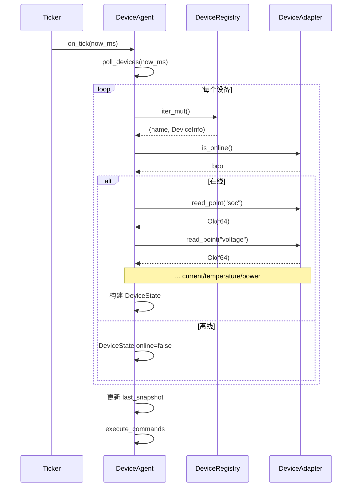

# EnerOS v0.73.0 Device Agent 设备管理 Agent 设计文档

> **版本**：v0.73.0
> **阶段**：Phase 1 单机 MVP — P1-L MVP 集成第二层
> **crate**：`eneros-device-agent`（`crates/agents/device-agent/`）
> **蓝图依据**：`蓝图/phase1.md` §v0.73.0
> **状态**：设计中
> **最后更新**：2026-07-16

---

## 目录

1. [版本目标](#1-版本目标)
2. [前置依赖](#2-前置依赖)
3. [交付物清单](#3-交付物清单)
4. [详细设计](#4-详细设计)
5. [技术交底](#5-技术交底)
6. [测试计划](#6-测试计划)
7. [验收标准](#7-验收标准)
8. [风险与注意事项](#8-风险与注意事项)
9. [多角度要求](#9-多角度要求)
10. [ADR 决策记录](#10-adr-决策记录)
11. [偏差声明（D1~D12）](#11-偏差声明d1d12)
12. [参考](#12-参考)

---

## 1. 版本目标

### 1.1 一句话目标

构建 P1-L MVP 集成第二层，实现 Device Agent（设备管理 Agent），负责多设备状态采集和命令执行，作为 RTOS 控制层与 Agent 层之间的桥梁。`DeviceAgent` 实现 v0.72.0 `AgentRuntime` trait（复用，D9），周期性采集多设备状态（SOC/电压/电流/温度/功率 5 点位）并执行来自 `CommandSource` 的控制命令，完成本版本后 v0.74.0 MVP 编排器可统一调度 Energy/Market/Device 三个 Agent 完成储能自治端到端场景。

### 1.2 详细描述

v0.72.0 完成了 P1-L MVP 集成第一层，交付了 Energy Agent + Market Agent 双 Agent 协作框架，`EnergyAgent` 编排 `DualBrainCoordinator<MockSolver>` 执行储能调度，`MarketAgent` 从外部数据源接收电价/负荷预测信号并通过 `MarketChannel` 传递给 Energy Agent。但双 Agent 协作仍是"信息层闭环"，缺少与物理设备交互的"执行层闭环"：

- **缺少设备抽象**：蓝图 §v0.73.0 引用 `Box<dyn PointAccess>` 通过 `read_point("soc")` / `write_point("power_setpoint", power_kw)` 读写设备点位，但 v0.51.0 `PointAccess` trait 使用 `PointId` / `DataPoint` 类型化 API（`read_point(PointId) -> Result<DataPoint, ProtocolError>`），需 `PointMap` 映射字符串→ID，MVP 阶段过于复杂。需要本地定义 `DeviceAdapter` trait（字符串点名读写，D6）。
- **缺少设备注册表**：蓝图 §v0.73.0 引用 `HashMap<String, Box<dyn PointAccess>>` 持有多个设备，但 no_std 下 `HashMap` 需哈希器配置或 `hashbrown`。需要用 `BTreeMap<String, DeviceInfo>`（D12，no_std `alloc::collections::BTreeMap`）。
- **缺少命令源抽象**：蓝图 §v0.73.0 引用 `ControlBusReader::new()` / `control_bus_rx.try_read()` 接收控制命令，但 `ControlBusReader` 不存在。需要本地定义 `CommandSource` trait + `MockCommandSource`（D4，与 v0.72.0 `MarketDataSource` 模式一致）。
- **缺少状态快照**：蓝图 §v0.73.0 引用 `SharedMemoryHandle::new()` / `shared_memory.write_snapshot(&snapshot)` 写入共享内存，但 `SharedMemoryHandle` 不存在。MVP 阶段用 `DeviceSnapshot` 直接返回，存入 `last_snapshot` 字段（D5）。
- **缺少设备命令结构**：蓝图 §v0.73.0 引用 `command.target_device` / `command.power_kw` / `command.ttl_ms` 字段，但 v0.55.0 `ControlCommand` 是 enum（`Single(SingleCommand)` / `Double(DoubleCommand)`），无这些字段。需要本地定义 `DeviceCommand` 结构体（D7）。
- **缺少设备错误枚举**：蓝图 §v0.73.0 引用 `AgentError::DeviceNotFound(...)` / `AgentError::DeviceError(...)`，但 v0.33.0 `AgentError` 缺少 `DeviceNotFound` / `DeviceError` 变体（有 `AgentNotFound` 但语义不同）。需要本地定义 `DeviceError` 枚举，并在 v0.72.0 `AgentRuntimeError` 添加 `DeviceError(String)` 变体（D8 外科手术式变更）。

本版本（v0.73.0）进入 P1-L MVP 集成第二层，针对上述六个缺口交付 Device Agent 设备管理框架：

| 产出 | 角色 | 说明 |
|------|------|------|
| `DeviceAdapter` trait | 设备适配器接口 | 4 方法（read_point / write_point / device_type / is_online）；字符串点名读写（D6） |
| `MockDevice` | 设备 Mock 实现 | `BTreeMap<String, f64>` 点位存储（D10：无 PointMap，预设点位即可） |
| `DeviceType` 枚举 | 设备类型 | 5 变体（Pcs / Battery / Bms / Meter / Temperature） |
| `DeviceInfo` 结构体 | 设备元信息 | 2 字段（device_type + adapter）；D11：简化，仅含 device_type + adapter |
| `DeviceRegistry` | 多设备注册表 | `BTreeMap<String, DeviceInfo>`（D12：no_std 合规） |
| `DeviceState` + `DeviceSnapshot` | 设备状态快照 | 7 字段 DeviceState；D5：替代 SharedMemoryHandle，直接返回 |
| `DeviceCommand` | 设备控制命令 | 4 字段（target_device / power_kw / ttl_ms / timestamp_ms，D7） |
| `CommandSource` trait + `MockCommandSource` | 命令源抽象 | VecDeque-backed；try_read 弹出队首（D4） |
| `DeviceError` 枚举 | 设备错误 | 5 变体（DeviceNotFound / PointNotFound / DeviceOffline / WriteFailed / ReadFailed）；D8 |
| `DeviceAgent` | 设备管理 Agent | 6 字段（descriptor / devices / command_source / last_snapshot / state / tick_count）；实现 `AgentRuntime`（D9 复用 v0.72.0） |

本版本核心设计决策（详见 §11 偏差声明 D1~D12）：

1. **D1**：移除 `log::info!` / `log::warn!` / `log::error!`，状态/错误通过返回值传递（no_std 合规）
2. **D2**：`now_ms: u64` 参数替代 `SystemTime::now()` / `UNIX_EPOCH`（no_std 合规，与 v0.72.0 D2 一致）
3. **D3**：`AgentDescriptor::new(AgentType::Device, name, now_ms)` 替代蓝图 `..Default::default()` 构造（v0.33.0 实际 API，与 v0.72.0 D7 一致）
4. **D4**：本地 `CommandSource` trait + `MockCommandSource` 替代 `ControlBusReader`（不存在，与 v0.72.0 D4 `MarketDataSource` 模式一致）
5. **D5**：`poll_devices()` 返回 `DeviceSnapshot` 存入 `last_snapshot` 字段，替代 `SharedMemoryHandle`（不存在）
6. **D6**：本地 `DeviceAdapter` trait（字符串点名 `read_point(&str)` / `write_point(&str, f64)`）替代 v0.51.0 `PointAccess`（类型化 API 过于复杂）
7. **D7**：本地 `DeviceCommand` 结构体（target_device/power_kw/ttl_ms/timestamp_ms）替代 v0.55.0 `ControlCommand`（enum 结构不同）
8. **D8**：本地 `DeviceError` 枚举 + 在 v0.72.0 `AgentRuntimeError` 添加 `DeviceError(String)` 变体（外科手术式变更，使 DeviceAgent 可复用 trait）
9. **D9**：复用 v0.72.0 `AgentRuntime` trait（含 `now_ms: u64` 参数），使 v0.74.0 MVP 编排器可统一调度三种 Agent
10. **D10**：`MockDevice::new(DeviceType::X).with_point("soc", 0.65)` 链式构造，替代 `PcsPointMap::default()` 等（不存在）
11. **D11**：`DeviceInfo { device_type, adapter }` 简化为 2 字段（蓝图 `protocol` / `address` / `point_map` 不适用于 Mock 设备）
12. **D12**：`BTreeMap<String, DeviceInfo>` 替代 `HashMap`（no_std 合规，`HashMap` 需哈希器配置或 `hashbrown`）

所有 Rust 代码必须 no_std（蓝图 §43.1），仅使用 `core::*` / `alloc::*`，无 `std::*`，`Vec` / `String` / `Box` / `BTreeMap` / `VecDeque` 来自 `extern crate alloc`，时间戳通过 `now_ms: u64` 参数传入（D2），Agent ID 通过 v0.33.0 `AgentId::generate()` 生成（继承自 `AgentDescriptor::new`），`CommandSource` 为本地 VecDeque-backed 非阻塞命令源（D4），`DeviceAdapter` 为本地 trait + Mock 实现（D6），`DeviceError` 仅派生 `Debug`（D8），纯 safe Rust 零 `unsafe`，无 FFI 需求（纯 Rust，无 `[features]` 段）。

### 1.3 架构定位

| 维度 | 定位 |
|------|------|
| Phase | Phase 1 单机 MVP |
| 子系统 | P1-L MVP 集成第二层（Device Agent 设备管理） |
| 平面 | 慢平面（Agent Runtime 分区，管理信息大区） |
| 角色 | RTOS 控制层与 Agent 层之间的桥梁，周期性采集多设备状态并执行控制命令 |
| 上游版本 | v0.72.0（`AgentRuntime` / `HeartbeatStatus` / `AgentRuntimeError`（+`DeviceError` 变体）复用）；v0.33.0（`AgentDescriptor` / `AgentType` / `AgentState` / `TrustLevel` / `AgentError` / `AgentId` 复用）；v0.11.0 用户堆（alloc 支持） |
| 同层版本 | v0.73.0（本版本，Device Agent 设备管理） |
| 下游版本 | v0.74.0（MVP 冻结，三 Agent 联调）；v1.0.0 商用版 |
| 部署形态 | 纯 Rust crate，无 C 库依赖，无 FFI，CPU 编译运行；交叉编译目标 `aarch64-unknown-none` |

### 1.4 路线图链路

```
v0.33.0 Agent 框架 ──► v0.72.0 双 Agent 协作（EnergyAgent / MarketAgent）
                              │
                              │  定义 AgentRuntime / HeartbeatStatus / AgentRuntimeError
                              │
                              ▼
                   v0.73.0 Device Agent（本版本）
                   DeviceAgent / DeviceAdapter / DeviceRegistry / CommandSource
                              │
                              │  复用 v0.72.0 AgentRuntime trait（D9）
                              │  外科手术式变更：AgentRuntimeError + DeviceError 变体（D8）
                              │
                              ├──► v0.74.0 MVP 冻结（三 Agent 联调）
                              │
                              └──► v1.0.0 商用版
```

### 1.5 关键里程碑意义

本版本是 Phase 1 单机 MVP 的核心里程碑之一，标志着：

- **P1-L MVP 集成第二层启动**：从信息层闭环（双 Agent 协作）扩展到执行层闭环（设备状态采集 + 命令执行），Agent 层首次与"物理设备"交互（虽然 MVP 阶段用 Mock 设备）。
- **AgentRuntime trait 复用验证**：v0.72.0 本地定义的 `AgentRuntime` trait 首次被跨 crate 复用（D9），证明 trait 设计的通用性，为 v0.74.0 三 Agent 统一调度奠定基础。
- **外科手术式变更范例**：D8 在 v0.72.0 `AgentRuntimeError` 添加 `DeviceError(String)` 变体，是 Karpathy "Surgical Changes" 原则的范例：仅新增变体，不破坏现有代码，向后兼容。
- **设备抽象层奠基**：本地 `DeviceAdapter` trait（字符串点名读写，D6）为后续 v0.74.0+ 接入真实设备协议（Modbus / IEC104）提供统一接口。
- **Phase 1 收官在望**：v0.73.0 完成后，Phase 1 仅剩 v0.74.0 一版（MVP 冻结），即可进入 v1.0.0 候选阶段（ADR-0004）。

### 1.6 Device Agent 设计目标

| 维度 | 目标 | 说明 |
|------|------|------|
| Agent 生命周期 | on_start → on_tick × N → on_stop | 复用 v0.72.0 `AgentRuntime` trait 5 方法（D9） |
| 多设备管理 | DeviceRegistry BTreeMap | D12：no_std 合规，有序遍历便于测试 |
| 状态采集 | 每 tick 遍历所有设备，read_point 采集 5 点位 | soc / voltage / current / temperature / power |
| 命令执行 | CommandSource 非阻塞读取，write_point 下发 | try_read 循环直到无命令 |
| 错误容错 | poll/execute 不中断 | D14（v0.72.0）延续：跳过失败设备/命令，不 panic |
| 心跳监测 | on_heartbeat 返回 Alive/Dead | Running→Alive，其他→Dead |
| 优先级 | Device (100) | `AgentDescriptor::new(AgentType::Device, ...)` 默认 |

---

## 2. 前置依赖

### 2.1 依赖版本清单

本版本复用 2 个既有 crate，无新依赖引入。所有依赖均为本项目既有版本，无外部第三方 crate 新增。

| 版本 | crate | 复用类型 | 用途 | 蓝图节 |
|------|-------|---------|------|--------|
| v0.33.0 | `eneros-agent` | `AgentDescriptor` / `AgentType` / `AgentState` / `TrustLevel` / `AgentError` / `AgentId` | Agent 框架类型（D3：`AgentDescriptor::new(type, name, now)` 构造器） | §v0.33.0 |
| v0.72.0 | `eneros-energy-market-agent` | `AgentRuntime` / `HeartbeatStatus` / `AgentRuntimeError`（+新增 `DeviceError` 变体） | Agent 运行时接口（D9：复用 trait，不重定义） | §v0.72.0 |

### 2.2 上游 API 签名约束

本版本的实现严格遵循上游 crate 的实际 API 签名，以下为关键 API 调用点（D3/D9 偏差的根源）：

#### 2.2.1 v0.33.0 `AgentDescriptor` + `AgentType` + `AgentState`

```rust
pub enum AgentType {
    Energy,
    Market,
    Device,
    System,
    // ...
}

pub enum AgentState {
    Init,
    Running,
    Suspended,
    Dead,
    Error,
}

pub struct AgentDescriptor {
    pub id: AgentId,
    pub agent_type: AgentType,
    pub name: String,
    pub priority: u8,
    pub trust_level: TrustLevel,
    pub created_at: u64,
    // ... 其他字段
}

impl AgentDescriptor {
    pub fn new(agent_type: AgentType, name: &str, now_ms: u64) -> Self;
}

impl AgentId {
    pub fn generate() -> Self;
}
```

- `AgentDescriptor::new(AgentType::Device, name, now_ms)` 自动设置优先级/配额/信任等级（D3：蓝图 `..Default::default()` 与 `capabilities: Vec<&str>` 类型不匹配，实际 `Vec<CapabilityRef>`）
- `AgentType::Device` 是 v0.33.0 既有变体，本版本首次实际使用
- `AgentState` 含 5 变体（Init/Running/Suspended/Dead/Error），本版本使用 Init/Running/Dead

#### 2.2.2 v0.72.0 `AgentRuntime` trait + `HeartbeatStatus` + `AgentRuntimeError`

```rust
pub trait AgentRuntime {
    fn descriptor(&self) -> &AgentDescriptor;
    fn on_start(&mut self, now_ms: u64) -> Result<(), AgentRuntimeError>;
    fn on_tick(&mut self, now_ms: u64) -> Result<(), AgentRuntimeError>;
    fn on_stop(&mut self, now_ms: u64) -> Result<(), AgentRuntimeError>;
    fn on_heartbeat(&self, now_ms: u64) -> HeartbeatStatus;
}

#[derive(Debug, Clone, Copy, PartialEq, Eq)]
pub enum HeartbeatStatus {
    Alive,
    Dead,
}

// v0.73.0 外科手术式变更：添加 DeviceError(String) 变体（D8）
#[derive(Debug)]
pub enum AgentRuntimeError {
    DualBrainError(DualBrainError),
    ChannelError(String),
    MarketDataError(String),
    AgentError(AgentError),
    NotRunning,
    DeviceError(String),  // ← v0.73.0 新增
}
```

- D9：复用 v0.72.0 `AgentRuntime` trait，不重定义。使 v0.74.0 MVP 编排器可统一调度 Energy/Market/Device 三种 Agent（trait 相同）
- D8：在 `AgentRuntimeError` 添加 `DeviceError(String)` 变体，是外科手术式变更（仅新增变体，向后兼容）
- `HeartbeatStatus` 2 变体（Alive/Dead）复用 v0.72.0 定义

#### 2.2.3 v0.72.0 跨 crate 引用约束

`eneros-device-agent` 需引用 `eneros-energy-market-agent` 的公共导出：

```rust
// crates/agents/device-agent/src/lib.rs
use eneros_energy_market_agent::{
    AgentRuntime, AgentRuntimeError, HeartbeatStatus,
};
```

- v0.72.0 `eneros-energy-market-agent` 的 `lib.rs` 已公共导出 `AgentRuntime` / `HeartbeatStatus` / `AgentRuntimeError`
- 本版本 D8 修改 `AgentRuntimeError` 后，v0.72.0 既有代码不受影响（仅新增变体）

### 2.3 跨 crate 引用路径

本 crate 位于 `crates/agents/device-agent/`，跨 crate 引用全部使用相对路径（项目规则 §2.3.1 第 4 条）：

```toml
# crates/agents/device-agent/Cargo.toml
[dependencies]
eneros-agent = { path = "../../kernel/agent" }                    # 跨子系统（agents→kernel）
eneros-energy-market-agent = { path = "../energy-market-agent" }  # 同子系统（agents→agents）
```

跨子系统引用 1 个（agents→kernel），同子系统引用 1 个（agents→agents），相对路径分别为 `../../<subsystem>/<crate>` 和 `../<crate>`。

### 2.4 工具链与构建依赖

| 工具 | 版本 | 用途 |
|------|------|------|
| Rust nightly | `nightly-2026-04-04`（`rust-toolchain.toml` 锁定） | 编译器 |
| cargo | 随 nightly | 包管理 |
| 交叉编译目标 | `aarch64-unknown-none` | no_std 交叉编译验证 |
| `cargo-deny` | 最新 | 许可证/供应链扫描（§5.7 SBOM） |
| `cargo-clippy` | 随 nightly | lint 检查（`-D warnings`） |
| `cargo-fmt` | 随 nightly | 格式检查 |

无 C 库依赖，无 FFI，无需 `aarch64-linux-gnu-gcc` / `cmake` / `ninja` / `qemu-system-aarch64`（纯 Rust crate）。

### 2.5 SBOM 与许可证（蓝图 §5.7 / §43.8）

本版本无新增第三方依赖。`eneros-agent` / `eneros-energy-market-agent` 在前序版本中已登记：

| 依赖 | 版本 | 许可证 | 来源 | 已知 CVE |
|------|------|--------|------|---------|
| `eneros-agent` | 0.33.x | MIT OR Apache-2.0 | 项目内 | 无 |
| `eneros-energy-market-agent` | 0.72.x → 0.73.x | MIT OR Apache-2.0 | 项目内 | 无 |

`cargo deny check advisories licenses bans sources` 在本版本中应继续通过（无新增依赖）。

---

## 3. 交付物清单

### 3.1 代码交付物

| # | 路径 | 类型 | 行数 | 说明 |
|---|------|------|------|------|
| 1 | `crates/agents/device-agent/Cargo.toml` | 配置 | ~25 | package 元数据 + 2 依赖 |
| 2 | `crates/agents/device-agent/src/lib.rs` | 源码 | ~400 | 模块声明 + 公共导出 + D1~D12 偏差声明表 + T1~T24 测试 |
| 3 | `crates/agents/device-agent/src/error.rs` | 源码 | ~40 | `DeviceError` 枚举（5 变体）+ `From<DeviceError> for AgentRuntimeError` |
| 4 | `crates/agents/device-agent/src/device.rs` | 源码 | ~200 | `DeviceType` + `DeviceAdapter` trait + `MockDevice` + `DeviceInfo` + `DeviceRegistry` |
| 5 | `crates/agents/device-agent/src/command.rs` | 源码 | ~120 | `DeviceCommand` + `CommandSource` trait + `MockCommandSource` |
| 6 | `crates/agents/device-agent/src/snapshot.rs` | 源码 | ~80 | `DeviceState` + `DeviceSnapshot` |
| 7 | `crates/agents/device-agent/src/agent.rs` | 源码 | ~200 | `DeviceAgent` 结构体 + `AgentRuntime` 实现 |

合计 7 源文件（含 Cargo.toml），约 1065 行。

### 3.2 测试交付物

| # | 测试名 | 类型 | 验证点 |
|---|--------|------|--------|
| T1 | `t1_device_type_variants` | 单元 | `DeviceType` 5 变体可构造 |
| T2 | `t2_device_error_variants` | 单元 | `DeviceError` 5 变体可构造 |
| T3 | `t3_device_state_default` | 单元 | `DeviceState::default()` 全零 + `online: false` |
| T4 | `t4_device_snapshot_new_set` | 单元 | `DeviceSnapshot::new()` 空 + `set()` 设置 |
| T5 | `t5_mock_device_new` | 单元 | `MockDevice::new(DeviceType::Battery)` 空点位 |
| T6 | `t6_mock_device_with_point` | 单元 | `with_point("soc", 0.65)` 链式构造 |
| T7 | `t7_mock_device_read_point` | 单元 | `read_point("soc")` 返回 `Ok(0.65)` |
| T8 | `t8_mock_device_write_point` | 单元 | `write_point("power_setpoint", 50.0)` 设置成功 |
| T9 | `t9_mock_device_point_not_found` | 单元 | `read_point("unknown")` 返回 `Err(PointNotFound)` |
| T10 | `t10_mock_device_offline` | 单元 | `set_online(false)` 后 `read_point` 返回 `Err(DeviceOffline)` |
| T11 | `t11_device_registry_new` | 单元 | `DeviceRegistry::new()` 空 |
| T12 | `t12_device_registry_register_get` | 单元 | `register` + `get_mut` 正确 |
| T13 | `t13_device_registry_not_found` | 单元 | `get_mut("unknown")` 返回 `None` |
| T14 | `t14_device_registry_iter_mut` | 单元 | `iter_mut` 遍历所有设备 |
| T15 | `t15_device_command_construction` | 单元 | `DeviceCommand` 4 字段构造 |
| T16 | `t16_command_source_mock_new` | 单元 | `MockCommandSource::new()` 空 |
| T17 | `t17_command_source_mock_with_commands` | 单元 | `with_commands` 预加载 |
| T18 | `t18_command_source_try_read_empty` | 单元 | 空源 `try_read()` 返回 `None` |
| T19 | `t19_command_source_try_read_data` | 单元 | 有命令 `try_read()` 返回 `Some` |
| T20 | `t20_device_agent_new` | 单元 | `DeviceAgent::new()` 构造成功 |
| T21 | `t21_device_agent_new_default` | 单元 | `new_default()` 预注册 3 设备 |
| T22 | `t22_device_agent_on_start` | 生命周期 | `on_start` 状态转 `Running` |
| T23 | `t23_device_agent_on_tick_poll` | 集成 | tick 采集设备状态，`last_snapshot` 含状态 |
| T24 | `t24_device_agent_on_tick_execute_command` | 集成 | tick 执行命令，`write_point` 被调用 |

合计 24 测试（19 单元 + 3 生命周期 + 2 集成），全部位于 `src/lib.rs` 的 `#[cfg(test)] mod tests` 模块。

> **注**：本版本测试覆盖 24 项核心场景。完整的生命周期/心跳/离线/命令丢失等扩展测试可由后续版本补充，本版本聚焦核心功能验证。

### 3.3 文档交付物

| # | 路径 | 说明 |
|---|------|------|
| 1 | `docs/agents/device-agent-design.md`（本文件） | 12 章节完整设计文档 + 2 Mermaid 图 + D1~D12 偏差声明 |
| 2 | `.trae/specs/develop-v0730-device-agent/spec.md` | 规格文档（已完成） |
| 3 | `.trae/specs/develop-v0730-device-agent/tasks.md` | 任务清单 |
| 4 | `.trae/specs/develop-v0730-device-agent/checklist.md` | 校验清单 |

### 3.4 版本同步交付物

| # | 文件 | 修改内容 |
|---|------|---------|
| 1 | `Cargo.toml`（根） | 版本号 `0.72.0` → `0.73.0`；members 添加 `"crates/agents/device-agent"`（置于 `"crates/agents/energy-market-agent"` 之后） |
| 2 | `Makefile` | header 版本号 + `VERSION` 变量，共 2 处 `0.73.0` |
| 3 | `.github/workflows/ci.yml` | 版本号 `0.73.0` |
| 4 | `ci/src/gate.rs` | clippy 段 + test 段注释补充 `eneros-device-agent` |

### 3.5 外科手术式变更交付物（D8）

| # | 文件 | 修改内容 |
|---|------|---------|
| 1 | `crates/agents/energy-market-agent/src/error.rs` | `AgentRuntimeError` 枚举添加 `DeviceError(String)` 变体 |
| 2 | `crates/agents/energy-market-agent/src/lib.rs` | 公共导出 `DeviceError` 变体（无需修改，`AgentRuntimeError` 整体导出） |

> **D8 变更说明**：此为对 v0.72.0 的外科手术式变更，仅新增枚举变体，不修改既有变体，向后兼容。v0.72.0 既有代码无需修改（`match` 语句若使用 `_` 通配符自动覆盖新变体；若显式列举变体，编译器会产生 `non-exhaustive` 警告，但不会编译失败）。需运行 v0.72.0 回归测试确认无破坏（D8 验收标准）。

### 3.6 不交付内容（明确范围）

本版本**不**交付以下内容（避免范围蔓延，遵守 Karpathy "Surgical Changes" 原则）：

- ❌ 真实设备协议接入（Modbus / IEC104 / CAN 等留待 Phase 2，本版本用 MockDevice）
- ❌ 真实控制总线接入（`ControlBusReader` 不存在，D4 用 `MockCommandSource`）
- ❌ 共享内存写入（`SharedMemoryHandle` 不存在，D5 用 `last_snapshot` 字段）
- ❌ v0.51.0 `PointAccess` 集成（类型化 API 过于复杂，D6 用字符串点名 `DeviceAdapter`）
- ❌ v0.55.0 `ControlCommand` 集成（enum 结构不同，D7 用本地 `DeviceCommand`）
- ❌ 实际功率归零下发到真实硬件（MVP 阶段 MockDevice 的 `write_point` 仅更新内存点位）
- ❌ 多 Agent 调度器（本版本仅 Device Agent 单 Agent，三 Agent 联调留待 v0.74.0）
- ❌ GPU 推理（蓝图 §43.3 GPU 优先测试规则仅适用于模型训练/校准，本版本 Mock 不涉及）
- ❌ 多分区部署（Phase 1 单机 MVP 阶段，所有 Agent 同分区运行；多分区隔离留待 Phase 3 seL4 定制）

---

## 4. 详细设计

### 4.1 整体架构

#### 4.1.1 模块组成

```
crates/agents/device-agent/
├── Cargo.toml              # 包配置 + 2 依赖
└── src/
    ├── lib.rs              # 模块声明 + 公共导出 + D1~D12 偏差声明 + T1~T24 测试
    ├── error.rs            # DeviceError（5 变体）+ From<DeviceError> for AgentRuntimeError
    ├── device.rs           # DeviceType + DeviceAdapter trait + MockDevice + DeviceInfo + DeviceRegistry
    ├── command.rs          # DeviceCommand + CommandSource trait + MockCommandSource
    ├── snapshot.rs         # DeviceState + DeviceSnapshot
    └── agent.rs            # DeviceAgent + AgentRuntime 实现
```

六个子模块职责清晰：

| 模块 | 职责 | 关键类型 |
|------|------|---------|
| `error` | 设备错误枚举，统一封装设备读写/离线/未找到等错误 | `DeviceError` |
| `device` | 设备类型、适配器 trait、Mock 实现、设备信息、注册表 | `DeviceType` / `DeviceAdapter` / `MockDevice` / `DeviceInfo` / `DeviceRegistry` |
| `command` | 设备控制命令结构、命令源抽象 | `DeviceCommand` / `CommandSource` / `MockCommandSource` |
| `snapshot` | 设备状态快照 | `DeviceState` / `DeviceSnapshot` |
| `agent` | 设备管理 Agent，实现 `AgentRuntime` | `DeviceAgent` |

#### 4.1.2 调用关系

```
DeviceAgent::on_tick
├── poll_devices(now_ms)
│   ├── DeviceRegistry::iter_mut() → 遍历所有设备
│   ├── DeviceAdapter::is_online() → 检查在线状态
│   ├── [在线] DeviceAdapter::read_point("soc"/"voltage"/"current"/"temperature"/"power")
│   ├── 构建 DeviceState（7 字段）
│   └── DeviceSnapshot::set(name, state) → 更新 last_snapshot
└── execute_commands(now_ms)
    ├── CommandSource::try_read() → Option<DeviceCommand>
    ├── [有命令] DeviceRegistry::get_mut(target_device)
    ├── [找到] DeviceAdapter::write_point("power_setpoint", power_kw)
    ├── [未找到] 跳过（D14 延续，不中断）
    └── 循环直到 try_read 返回 None
```

### 4.2 DeviceAgent

#### 4.2.1 结构体定义

```rust
use alloc::boxed::Box;
use alloc::string::String;

use eneros_agent::{AgentDescriptor, AgentState, AgentType};
use eneros_energy_market_agent::{AgentRuntime, AgentRuntimeError, HeartbeatStatus};

use crate::command::CommandSource;
use crate::device::DeviceRegistry;
use crate::error::DeviceError;
use crate::snapshot::DeviceSnapshot;

/// 设备管理 Agent.
///
/// 负责 RTOS 控制层与 Agent 层之间的桥梁：
/// - 周期性采集多设备状态（SOC/电压/电流/温度/功率）
/// - 从 CommandSource 读取控制命令并下发到目标设备
///
/// 实现 v0.72.0 `AgentRuntime` trait（D9 复用），使 v0.74.0 MVP 编排器
/// 可统一调度 Energy/Market/Device 三种 Agent。
pub struct DeviceAgent {
    /// Agent 描述符（id / agent_type / name / priority / trust_level / created_at）.
    descriptor: AgentDescriptor,
    /// 多设备注册表（D12：BTreeMap，no_std 合规）.
    devices: DeviceRegistry,
    /// 命令源（D4：本地 trait + MockCommandSource）.
    command_source: Box<dyn CommandSource>,
    /// 最近一次设备状态快照（D5：替代 SharedMemoryHandle，直接返回）.
    last_snapshot: DeviceSnapshot,
    /// Agent 状态（Init/Running/Dead）.
    state: AgentState,
    /// tick 计数器（统计 on_tick 调用次数）.
    tick_count: u64,
}
```

**设计要点**：

- `descriptor: AgentDescriptor`：D3 通过 `AgentDescriptor::new(AgentType::Device, name, now_ms)` 构造，`agent_type` 为 `Device`，优先级由 v0.33.0 默认值设置（Device 优先级 100，低于 Energy 200 / Market 150）。
- `devices: DeviceRegistry`：D12 使用 `BTreeMap<String, DeviceInfo>` 持有多设备，有序遍历便于测试。
- `command_source: Box<dyn CommandSource>`：D4 动态派发，允许测试注入 `MockCommandSource`，生产注入真实 `ControlBusReader`（v0.74.0+ 实现）。
- `last_snapshot: DeviceSnapshot`：D5 替代 `SharedMemoryHandle`，直接存储最近一次采集的状态快照，调用方通过 `last_snapshot()` 查询。
- `state: AgentState`：3 变体（Init/Running/Dead），本版本不使用 Suspended/Error（D14 延续：错误不中断，不标记 Error）。
- `tick_count: u64`：统计 `on_tick` 调用次数，供调试与监控。

#### 4.2.2 构造函数

```rust
impl DeviceAgent {
    /// 构造 Device Agent.
    ///
    /// - `name`: Agent 名称（如 "device-agent-0"）
    /// - `command_source`: 命令源（`Box<dyn CommandSource>`）
    /// - `now_ms`: 构造时间戳（传入 `AgentDescriptor::new`）
    ///
    /// D3：`AgentDescriptor::new(AgentType::Device, name, now_ms)` 自动设置优先级/配额/信任等级。
    pub fn new(name: &str, command_source: Box<dyn CommandSource>, now_ms: u64) -> Self {
        let descriptor = AgentDescriptor::new(AgentType::Device, name, now_ms);
        Self {
            descriptor,
            devices: DeviceRegistry::new(),
            command_source,
            last_snapshot: DeviceSnapshot::new(),
            state: AgentState::Init,
            tick_count: 0,
        }
    }

    /// 默认构造（使用 `MockCommandSource::new()` + 预注册 3 个 Mock 设备）.
    ///
    /// 预注册设备：
    /// - "pcs"：DeviceType::Pcs，预设 power=0.0
    /// - "battery"：DeviceType::Battery，预设 soc=0.65, voltage=400.0
    /// - "meter"：DeviceType::Meter，预设 power=30.0
    pub fn new_default(now_ms: u64) -> Self {
        use crate::command::MockCommandSource;
        use crate::device::{DeviceType, MockDevice};

        let mut agent = Self::new(
            "device-agent-default",
            Box::new(MockCommandSource::new()),
            now_ms,
        );

        // 预注册 3 个 Mock 设备（D10：MockDevice::new().with_point() 链式构造）
        agent.devices.register(
            "pcs",
            DeviceType::Pcs,
            Box::new(MockDevice::new(DeviceType::Pcs).with_point("power", 0.0)),
        );
        agent.devices.register(
            "battery",
            DeviceType::Battery,
            Box::new(
                MockDevice::new(DeviceType::Battery)
                    .with_point("soc", 0.65)
                    .with_point("voltage", 400.0),
            ),
        );
        agent.devices.register(
            "meter",
            DeviceType::Meter,
            Box::new(MockDevice::new(DeviceType::Meter).with_point("power", 30.0)),
        );

        agent
    }

    /// 获取设备注册表可变引用（供测试注册设备）.
    pub fn registry_mut(&mut self) -> &mut DeviceRegistry {
        &mut self.devices
    }

    /// 获取最近状态快照引用.
    pub fn last_snapshot(&self) -> &DeviceSnapshot {
        &self.last_snapshot
    }

    /// 获取 Agent 状态.
    pub fn state(&self) -> AgentState {
        self.state
    }

    /// 获取 tick 计数.
    pub fn tick_count(&self) -> u64 {
        self.tick_count
    }
}
```

#### 4.2.3 AgentRuntime trait 实现（D9 复用 v0.72.0）

```rust
impl AgentRuntime for DeviceAgent {
    fn descriptor(&self) -> &AgentDescriptor {
        &self.descriptor
    }

    fn on_start(&mut self, _now_ms: u64) -> Result<(), AgentRuntimeError> {
        self.state = AgentState::Running;
        Ok(())
    }

    fn on_tick(&mut self, now_ms: u64) -> Result<(), AgentRuntimeError> {
        // Step 1: 采集所有设备状态
        self.poll_devices(now_ms);

        // Step 2: 执行命令队列
        self.execute_commands(now_ms);

        // Step 3: tick 计数 + 返回
        self.tick_count += 1;
        Ok(())
    }

    fn on_stop(&mut self, _now_ms: u64) -> Result<(), AgentRuntimeError> {
        self.state = AgentState::Dead;
        Ok(())
    }

    fn on_heartbeat(&self, _now_ms: u64) -> HeartbeatStatus {
        match self.state {
            AgentState::Running => HeartbeatStatus::Alive,
            _ => HeartbeatStatus::Dead,
        }
    }
}
```

**设计要点**：

- D9：复用 v0.72.0 `AgentRuntime` trait，不重定义。`on_tick` / `on_start` / `on_stop` / `on_heartbeat` 签名完全一致。
- `on_tick` 始终返回 `Ok(())`：D14（v0.72.0）延续，设备采集/命令执行错误不中断 Agent，仅跳过失败项。
- `on_heartbeat`：Running → Alive，其他（Init/Dead）→ Dead。

#### 4.2.4 poll_devices 流程详解

```rust
impl DeviceAgent {
    /// 采集所有设备状态（D5：更新 last_snapshot）.
    ///
    /// 遍历注册表所有设备：
    /// 1. `is_online()` 检查在线状态
    /// 2. [在线] `read_point` 采集 5 点位（soc/voltage/current/temperature/power）
    /// 3. [离线] 构建全零 DeviceState（online=false）
    /// 4. 更新 last_snapshot
    ///
    /// 错误处理：`read_point` 失败时标记 `online: false`，继续下一个设备（D14 延续，不中断）。
    fn poll_devices(&mut self, now_ms: u64) {
        let mut new_snapshot = DeviceSnapshot::new();

        for (name, info) in self.devices.iter_mut() {
            let state = if info.adapter.is_online() {
                // 在线：采集 5 点位
                let soc = info.adapter.read_point("soc").unwrap_or(0.0);
                let voltage = info.adapter.read_point("voltage").unwrap_or(0.0);
                let current = info.adapter.read_point("current").unwrap_or(0.0);
                let temperature = info.adapter.read_point("temperature").unwrap_or(0.0);
                let power = info.adapter.read_point("power").unwrap_or(0.0);

                DeviceState {
                    soc,
                    voltage,
                    current,
                    temperature,
                    power,
                    online: true,
                    last_update_ms: now_ms,
                }
            } else {
                // 离线：全零状态
                DeviceState {
                    soc: 0.0,
                    voltage: 0.0,
                    current: 0.0,
                    temperature: 0.0,
                    power: 0.0,
                    online: false,
                    last_update_ms: now_ms,
                }
            };

            new_snapshot.set(name, state);
        }

        self.last_snapshot = new_snapshot;
    }
}
```

**poll_devices 流程**：

1. **创建新快照**：`DeviceSnapshot::new()` 空快照
2. **遍历所有设备**：`self.devices.iter_mut()` 返回 `(&String, &mut DeviceInfo)` 迭代器
3. **检查在线状态**：`info.adapter.is_online()` 返回 `bool`
4. **[在线] 采集 5 点位**：
   - `read_point("soc")` → SOC 荷电状态（0.0~1.0）
   - `read_point("voltage")` → 电压（V）
   - `read_point("current")` → 电流（A）
   - `read_point("temperature")` → 温度（℃）
   - `read_point("power")` → 功率（kW）
   - `unwrap_or(0.0)`：点位不存在时用 0.0 默认值（D14 延续，不中断）
5. **[离线] 构建全零状态**：`online: false`，其他字段 0.0
6. **更新快照**：`new_snapshot.set(name, state)`
7. **替换 last_snapshot**：`self.last_snapshot = new_snapshot`

#### 4.2.5 execute_commands 流程详解

```rust
impl DeviceAgent {
    /// 执行命令队列（D14 延续：跳过失败命令，不中断）.
    ///
    /// 从 `command_source.try_read()` 循环读取命令：
    /// 1. 查找目标设备 `DeviceRegistry::get_mut(target_device)`
    /// 2. [找到] `write_point("power_setpoint", power_kw)`
    /// 3. [未找到] 跳过该命令（D14 延续）
    /// 4. [写入失败] 跳过，继续下一条（D14 延续）
    /// 5. 循环直到 `try_read` 返回 `None`
    fn execute_commands(&mut self, _now_ms: u64) {
        while let Some(cmd) = self.command_source.try_read() {
            if let Some(info) = self.devices.get_mut(&cmd.target_device) {
                // 找到设备：下发 power_setpoint
                let _ = info.adapter.write_point("power_setpoint", cmd.power_kw);
                // 写入失败跳过（D14 延续），不中断
            }
            // 设备未找到跳过（D14 延续），不中断
        }
    }
}
```

**execute_commands 流程**：

1. **循环读取命令**：`while let Some(cmd) = self.command_source.try_read()`
2. **查找目标设备**：`self.devices.get_mut(&cmd.target_device)` 返回 `Option<&mut DeviceInfo>`
3. **[找到] 下发命令**：`info.adapter.write_point("power_setpoint", cmd.power_kw)`
   - `write_point` 失败时 `let _ = ...` 忽略错误（D14 延续，不中断）
4. **[未找到] 跳过**：继续下一条命令（D14 延续，不 panic）
5. **循环结束**：`try_read` 返回 `None` 时退出

**TTL 处理说明**：

- 本版本 `DeviceCommand.ttl_ms` 字段保留但不检查（MVP 阶段命令即时执行）
- v0.74.0+ 可在 `execute_commands` 中检查 `now_ms - cmd.timestamp_ms > cmd.ttl_ms` 丢弃过期命令
- 与 v0.22.0 TTL 机制协同：真实硬件层 TTL 由 RTOS 控制大区看门狗保障

### 4.3 DeviceAdapter trait + MockDevice

#### 4.3.1 DeviceType 枚举

```rust
/// 设备类型.
///
/// 覆盖储能系统核心设备类型，用于设备分类与状态采集策略选择。
#[derive(Debug, Clone, Copy, PartialEq, Eq, Hash)]
pub enum DeviceType {
    /// PCS（Power Conversion System，功率变换系统）.
    Pcs,
    /// Battery（电池组）.
    Battery,
    /// BMS（Battery Management System，电池管理系统）.
    Bms,
    /// Meter（电表）.
    Meter,
    /// Temperature（温度传感器）.
    Temperature,
}
```

**设计要点**：

- 5 变体：覆盖储能系统核心设备（PCS / Battery / BMS / Meter / Temperature）
- 派生 `Debug + Clone + Copy + PartialEq + Eq + Hash`：需比较（`assert_eq!`）/ 复制（设备类型标记）/ 哈希（BTreeMap key 不需要 Hash，但保留以备 HashMap 场景）

#### 4.3.2 DeviceAdapter trait（D6 本地定义）

```rust
use crate::error::DeviceError;
use crate::device::DeviceType;

/// 设备适配器 trait（D6：本地定义，字符串点名读写）.
///
/// v0.51.0 `PointAccess` trait 使用 `PointId` / `DataPoint` 类型化 API
/// （`read_point(PointId) -> Result<DataPoint, ProtocolError>`），需 `PointMap`
/// 映射字符串→ID，MVP 阶段过于复杂。本地 `DeviceAdapter` 使用字符串点名读写，
/// 简化 Mock 设备实现，与 v0.72.0 D6 `MarketDataSource` 模式一致。
///
/// 后续 v0.74.0+ 接入真实设备协议（Modbus/IEC104）时，实现 `ModbusDeviceAdapter`
/// 等桥接 `DeviceAdapter` 字符串点名 → `PointAccess` 类型化 API。
pub trait DeviceAdapter {
    /// 读取设备点位值.
    ///
    /// - `name`: 点位名（如 "soc" / "voltage" / "current" / "temperature" / "power"）
    /// - 返回 `Ok(f64)`: 点位值
    /// - 返回 `Err(DeviceError::PointNotFound)`: 点位不存在
    /// - 返回 `Err(DeviceError::DeviceOffline)`: 设备离线
    /// - 返回 `Err(DeviceError::ReadFailed)`: 读取失败
    fn read_point(&mut self, name: &str) -> Result<f64, DeviceError>;

    /// 写入设备点位值.
    ///
    /// - `name`: 点位名（如 "power_setpoint"）
    /// - `value`: 点位值
    /// - 返回 `Ok(())`: 写入成功
    /// - 返回 `Err(DeviceError::PointNotFound)`: 点位不存在
    /// - 返回 `Err(DeviceError::DeviceOffline)`: 设备离线
    /// - 返回 `Err(DeviceError::WriteFailed)`: 写入失败
    fn write_point(&mut self, name: &str, value: f64) -> Result<(), DeviceError>;

    /// 获取设备类型.
    fn device_type(&self) -> DeviceType;

    /// 检查设备是否在线.
    fn is_online(&self) -> bool;
}
```

**设计要点**：

- 4 方法（read_point / write_point / device_type / is_online）：D6 字符串点名读写，简化 Mock 设备实现
- `read_point(&mut self, name: &str) -> Result<f64, DeviceError>`：字符串点名，无 `PointId` / `PointMap` 映射
- `write_point(&mut self, name: &str, value: f64) -> Result<(), DeviceError>`：字符串点名写入
- 不派生 `Send + Sync`：与 v0.59/v0.63/v0.71/v0.72 一致（单线程 Agent Runtime 分区）
- D6：v0.51.0 `PointAccess` 类型化 API 过于复杂，本地字符串点名更简单

#### 4.3.3 MockDevice 实现（D10）

```rust
use alloc::string::String;
use alloc::collections::BTreeMap;

use crate::device::{DeviceAdapter, DeviceType};
use crate::error::DeviceError;

/// Mock 设备实现（测试用）.
///
/// 使用 `BTreeMap<String, f64>` 存储点位值，`with_point` 链式构造。
/// D10：`PcsPointMap::default()` / `BatteryPointMap::default()` 等不存在；
/// `MockDevice` 预设点位值即可。
pub struct MockDevice {
    /// 设备类型.
    device_type: DeviceType,
    /// 点位存储（D12：BTreeMap，no_std 合规）.
    points: BTreeMap<String, f64>,
    /// 在线状态.
    online: bool,
}

impl MockDevice {
    /// 创建空设备（无点位，默认在线）.
    pub fn new(device_type: DeviceType) -> Self {
        Self {
            device_type,
            points: BTreeMap::new(),
            online: true,
        }
    }

    /// 链式添加点位.
    pub fn with_point(mut self, name: &str, value: f64) -> Self {
        self.points.insert(String::from(name), value);
        self
    }

    /// 设置点位值（已存在则覆盖，不存在则插入）.
    pub fn set_point(&mut self, name: &str, value: f64) {
        self.points.insert(String::from(name), value);
    }

    /// 设置在线状态.
    pub fn set_online(&mut self, online: bool) {
        self.online = online;
    }
}

impl DeviceAdapter for MockDevice {
    fn read_point(&mut self, name: &str) -> Result<f64, DeviceError> {
        if !self.online {
            return Err(DeviceError::DeviceOffline(format!(
                "device {:?} offline",
                self.device_type
            )));
        }
        self.points
            .get(name)
            .copied()
            .ok_or_else(|| DeviceError::PointNotFound(String::from(name)))
    }

    fn write_point(&mut self, name: &str, value: f64) -> Result<(), DeviceError> {
        if !self.online {
            return Err(DeviceError::DeviceOffline(format!(
                "device {:?} offline",
                self.device_type
            )));
        }
        // MockDevice 允许写入任意点位（不检查存在性，自动插入）
        self.points.insert(String::from(name), value);
        Ok(())
    }

    fn device_type(&self) -> DeviceType {
        self.device_type
    }

    fn is_online(&self) -> bool {
        self.online
    }
}
```

**设计要点**：

- `points: BTreeMap<String, f64>`：D12 BTreeMap 存储点位，有序遍历便于测试
- `with_point` 链式构造：`MockDevice::new(DeviceType::Battery).with_point("soc", 0.65).with_point("voltage", 400.0)`
- `read_point`：离线返回 `DeviceOffline`，点位不存在返回 `PointNotFound`
- `write_point`：MockDevice 允许写入任意点位（自动插入），简化测试
- D10：无 `PointMap` / `PcsPointMap` 等，预设点位即可

### 4.4 DeviceRegistry

#### 4.4.1 DeviceInfo 结构体（D11 简化）

```rust
use alloc::boxed::Box;

use crate::device::{DeviceAdapter, DeviceType};

/// 设备元信息（D11：简化为 2 字段）.
///
/// 蓝图 `DeviceInfo { device_type, protocol, address, point_map }` 中
/// `protocol` / `address` / `point_map` 不适用于 Mock 设备（MVP 无真实协议栈）。
/// 本版本简化为 `device_type` + `adapter` 2 字段。
pub struct DeviceInfo {
    /// 设备类型.
    pub device_type: DeviceType,
    /// 设备适配器（D6：本地 trait，动态派发）.
    pub adapter: Box<dyn DeviceAdapter>,
}
```

**设计要点**：

- D11：简化为 2 字段（device_type + adapter），蓝图 `protocol` / `address` / `point_map` 不适用于 Mock 设备
- `adapter: Box<dyn DeviceAdapter>`：动态派发，允许不同设备类型共存于同一注册表
- v0.74.0+ 可扩展 `protocol` / `address` 字段以支持真实设备

#### 4.4.2 DeviceRegistry 结构体（D12 BTreeMap）

```rust
use alloc::collections::BTreeMap;
use alloc::string::String;

use crate::device::{DeviceAdapter, DeviceInfo, DeviceType};

/// 多设备注册表（D12：BTreeMap，no_std 合规）.
///
/// 蓝图 `HashMap<String, Box<dyn PointAccess>>` 在 no_std 下需哈希器配置或 `hashbrown`。
/// 本版本使用 `BTreeMap<String, DeviceInfo>`（`alloc::collections::BTreeMap`），
/// no_std 标准选择，有序遍历便于测试。
pub struct DeviceRegistry {
    /// 设备映射（设备名 → DeviceInfo）.
    devices: BTreeMap<String, DeviceInfo>,
}

impl DeviceRegistry {
    /// 创建空注册表.
    pub fn new() -> Self {
        Self {
            devices: BTreeMap::new(),
        }
    }

    /// 注册设备.
    ///
    /// - `name`: 设备名（如 "pcs" / "battery" / "meter"）
    /// - `device_type`: 设备类型
    /// - `adapter`: 设备适配器（`Box<dyn DeviceAdapter>`）
    pub fn register(
        &mut self,
        name: &str,
        device_type: DeviceType,
        adapter: Box<dyn DeviceAdapter>,
    ) {
        let info = DeviceInfo {
            device_type,
            adapter,
        };
        self.devices.insert(String::from(name), info);
    }

    /// 获取设备可变引用.
    pub fn get_mut(&mut self, name: &str) -> Option<&mut DeviceInfo> {
        self.devices.get_mut(name)
    }

    /// 设备数量.
    pub fn len(&self) -> usize {
        self.devices.len()
    }

    /// 是否为空.
    pub fn is_empty(&self) -> bool {
        self.devices.is_empty()
    }

    /// 可变迭代器.
    pub fn iter_mut(&mut self) -> impl Iterator<Item = (&String, &mut DeviceInfo)> {
        self.devices.iter_mut()
    }
}

impl Default for DeviceRegistry {
    fn default() -> Self {
        Self::new()
    }
}
```

**设计要点**：

- `devices: BTreeMap<String, DeviceInfo>`：D12 BTreeMap，no_std `alloc::collections::BTreeMap` 标准选择
- `register` / `get_mut` / `len` / `is_empty` / `iter_mut`：基本注册表操作
- `iter_mut` 返回 `impl Iterator`：便于 `poll_devices` 遍历所有设备
- D12：`HashMap` 在 no_std 下需 `hashbrown` 或哈希器配置，`BTreeMap` 是 no_std 标准选择，有序遍历便于测试

### 4.5 DeviceCommand + CommandSource

#### 4.5.1 DeviceCommand 结构体（D7 本地定义）

```rust
use alloc::string::String;

/// 设备控制命令（D7：本地定义）.
///
/// v0.55.0 `ControlCommand` 是 enum（`Single(SingleCommand)` / `Double(DoubleCommand)`），
/// 无 `target_device` / `power_kw` / `ttl_ms` 字段。本地 `DeviceCommand` 结构体
/// 匹配蓝图 §v0.73.0 语义（target_device / power_kw / ttl_ms / timestamp_ms）。
#[derive(Debug, Clone)]
pub struct DeviceCommand {
    /// 目标设备名（如 "pcs"）.
    pub target_device: String,
    /// 功率设定值（kW）.
    pub power_kw: f64,
    /// 命令有效期（ms），超过则丢弃（v0.74.0+ 检查）.
    pub ttl_ms: u64,
    /// 命令时间戳（ms）.
    pub timestamp_ms: u64,
}
```

**设计要点**：

- 4 字段（target_device / power_kw / ttl_ms / timestamp_ms）：D7 匹配蓝图语义
- `target_device: String`：目标设备名，与 `DeviceRegistry` 的 key 匹配
- `power_kw: f64`：功率设定值，通过 `write_point("power_setpoint", power_kw)` 下发
- `ttl_ms: u64`：命令有效期，本版本保留但不检查（v0.74.0+ 实现 TTL 丢弃）
- `timestamp_ms: u64`：命令生成时间戳，用于 TTL 检查
- 派生 `Debug + Clone`：命令需克隆（VecDeque 存储）/ 调试输出

#### 4.5.2 CommandSource trait + MockCommandSource（D4 本地定义）

```rust
use alloc::collections::VecDeque;
use alloc::vec::Vec;

use crate::command::DeviceCommand;

/// 命令源抽象（D4：本地 trait，与 v0.72.0 D4 `MarketDataSource` 模式一致）.
///
/// 隔离 `ControlBusReader` 依赖（不存在），保持 crate 自包含可测试。
/// 后续 v0.74.0+ 集成时实现 `ControlBusCommandSource` 桥接真实控制总线。
pub trait CommandSource {
    /// 非阻塞读取命令.
    ///
    /// - 返回 `Some(cmd)`: 有命令
    /// - 返回 `None`: 无命令（不阻塞）
    fn try_read(&mut self) -> Option<DeviceCommand>;
}

/// Mock 命令源（测试用）.
///
/// VecDeque-backed 命令队列，`try_read` 弹出队首；空时返回 `None`。
/// D4：与 v0.72.0 `MockMarketSource` 模式一致。
pub struct MockCommandSource {
    /// 命令队列（VecDeque-backed，FIFO）.
    commands: VecDeque<DeviceCommand>,
}

impl MockCommandSource {
    /// 创建空 source.
    pub fn new() -> Self {
        Self {
            commands: VecDeque::new(),
        }
    }

    /// 预加载命令构造.
    pub fn with_commands(commands: Vec<DeviceCommand>) -> Self {
        Self {
            commands: commands.into_iter().collect(),
        }
    }

    /// 追加命令.
    pub fn push(&mut self, cmd: DeviceCommand) {
        self.commands.push_back(cmd);
    }
}

impl Default for MockCommandSource {
    fn default() -> Self {
        Self::new()
    }
}

impl CommandSource for MockCommandSource {
    fn try_read(&mut self) -> Option<DeviceCommand> {
        self.commands.pop_front()
    }
}
```

**设计要点**：

- `CommandSource` trait 单方法 `try_read`：非阻塞读取，返回 `Option<DeviceCommand>`
- `MockCommandSource` 使用 `VecDeque<DeviceCommand>`：D4 VecDeque-backed，`pop_front` O(1)
- `with_commands` 预加载 / `push` 追加：测试用
- D4：`ControlBusReader` 不存在，本地定义保持 crate 自包含可测试，与 v0.72.0 `MarketDataSource` 模式一致

### 4.6 DeviceSnapshot + DeviceState

#### 4.6.1 DeviceState 结构体

```rust
/// 设备状态（7 字段）.
///
/// 覆盖储能设备核心状态：SOC / 电压 / 电流 / 温度 / 功率 / 在线状态 / 更新时间。
#[derive(Debug, Clone, PartialEq)]
pub struct DeviceState {
    /// SOC 荷电状态（0.0~1.0）.
    pub soc: f64,
    /// 电压（V）.
    pub voltage: f64,
    /// 电流（A）.
    pub current: f64,
    /// 温度（℃）.
    pub temperature: f64,
    /// 功率（kW）.
    pub power: f64,
    /// 在线状态.
    pub online: bool,
    /// 最后更新时间戳（ms）.
    pub last_update_ms: u64,
}

impl Default for DeviceState {
    fn default() -> Self {
        Self {
            soc: 0.0,
            voltage: 0.0,
            current: 0.0,
            temperature: 0.0,
            power: 0.0,
            online: false,
            last_update_ms: 0,
        }
    }
}
```

**设计要点**：

- 7 字段：SOC / 电压 / 电流 / 温度 / 功率 / 在线状态 / 更新时间
- `Default::default()`：全零 + `online: false`，用于离线设备状态构建
- 派生 `Debug + Clone + PartialEq`：状态需克隆（快照存储）/ 比较（测试断言）

#### 4.6.2 DeviceSnapshot 结构体（D5 替代 SharedMemoryHandle）

```rust
use alloc::collections::BTreeMap;
use alloc::string::String;

use crate::snapshot::DeviceState;

/// 设备状态快照（D5：替代 SharedMemoryHandle）.
///
/// 蓝图 `SharedMemoryHandle::new()` / `shared_memory.write_snapshot(&snapshot)`
/// 在项目中不存在。本版本 `poll_devices()` 返回 `DeviceSnapshot`，存入
/// `last_snapshot` 字段，调用方通过 `last_snapshot()` 直接访问。
#[derive(Debug, Clone, Default)]
pub struct DeviceSnapshot {
    /// 设备状态映射（设备名 → DeviceState）.
    pub states: BTreeMap<String, DeviceState>,
}

impl DeviceSnapshot {
    /// 创建空快照.
    pub fn new() -> Self {
        Self {
            states: BTreeMap::new(),
        }
    }

    /// 设置设备状态.
    pub fn set(&mut self, name: &str, state: DeviceState) {
        self.states.insert(String::from(name), state);
    }

    /// 获取设备状态.
    pub fn get(&self, name: &str) -> Option<&DeviceState> {
        self.states.get(name)
    }

    /// 设备数量.
    pub fn len(&self) -> usize {
        self.states.len()
    }

    /// 是否为空.
    pub fn is_empty(&self) -> bool {
        self.states.is_empty()
    }
}
```

**设计要点**：

- `states: BTreeMap<String, DeviceState>`：D12 BTreeMap，与 DeviceRegistry 一致
- `set` / `get` / `len` / `is_empty`：基本快照操作
- D5：`SharedMemoryHandle` 不存在，MVP 阶段直接返回快照，调用方直接访问
- 派生 `Debug + Clone + Default`：快照需克隆（历史记录）/ 默认构造（空快照）

### 4.7 Mermaid 图 1：Device Agent tick 流程图

```mermaid
graph TD
    Tick[on_tick now_ms] --> Poll[poll_devices]
    Poll --> CheckOnline{is_online?}
    CheckOnline|是| Read[read_point x5]
    CheckOnline|否| Offline[DeviceState online=false]
    Read --> BuildState[构建 DeviceState]
    BuildState --> Snapshot[更新 last_snapshot]
    Offline --> Snapshot
    Snapshot --> Exec[execute_commands]
    Exec --> TryRead{try_read?}
    TryRead|有命令| FindDev[查找目标设备]
    FindDev --> WritePoint[write_point power_setpoint]
    WritePoint --> TryRead
    FindDev|未找到| Skip[跳过 D14]
    Skip --> TryRead
    TryRead|无命令| Done[tick_count += 1, Ok]
```

**图示说明**：

- `on_tick(now_ms)` 触发，先执行 `poll_devices` 采集设备状态，再执行 `execute_commands` 下发命令
- `poll_devices` 遍历所有设备：`is_online` 检查在线状态
  - 在线：`read_point` 采集 5 点位（soc/voltage/current/temperature/power），构建 `DeviceState`（online=true）
  - 离线：构建 `DeviceState`（online=false，全零）
  - 更新 `last_snapshot`
- `execute_commands` 循环读取命令：
  - `try_read` 有命令：查找目标设备
    - 找到：`write_point("power_setpoint", power_kw)` 下发，继续 `try_read`
    - 未找到：跳过（D14 延续），继续 `try_read`
  - `try_read` 无命令：`tick_count += 1`，返回 `Ok(())`

### 4.8 Mermaid 图 2：设备状态采集时序图



**图示说明**：

- `Ticker` 调用 `DeviceAgent::on_tick(now_ms)` 触发周期性执行
- `DeviceAgent` 调用 `poll_devices(now_ms)` 采集所有设备状态
- 对每个设备：
  - `DeviceRegistry::iter_mut()` 返回 `(name, DeviceInfo)` 迭代器
  - `DeviceAdapter::is_online()` 检查在线状态
  - 在线：依次 `read_point("soc")` / `read_point("voltage")` / ... / `read_point("power")` 采集 5 点位，构建 `DeviceState`
  - 离线：构建 `DeviceState`（online=false，全零）
- 所有设备采集完成后，更新 `last_snapshot`
- 最后执行 `execute_commands` 下发命令（图中省略，详见 §4.7 流程图）

---

## 5. 技术交底

### 5.1 no_std 合规策略

本 crate 严格遵循蓝图 §43.1 no_std 要求：

```rust
#![cfg_attr(not(test), no_std)]
extern crate alloc;
```

**合规清单**：

| 项目 | 状态 | 说明 |
|------|------|------|
| `#![no_std]` | ✅ | `cfg_attr(not(test), no_std)`，测试时启用 std |
| `extern crate alloc` | ✅ | `Vec` / `String` / `Box` / `BTreeMap` / `VecDeque` 来自 alloc |
| 无 `use std::*` | ✅ | 仅 `core::*` / `alloc::*` |
| 无 `Instant::now()` | ✅ | D2：`now_ms: u64` 参数 |
| 无 `SystemTime::now()` | ✅ | D2 |
| 无 `uuid::Uuid::new_v4()` | ✅ | 继承自 `AgentDescriptor::new`（v0.33.0 `AgentId::generate()`） |
| 无 `log::warn!` / `log::info!` / `log::error!` | ✅ | D1：状态/错误通过返回值传递 |
| 无 `std::collections::HashMap` | ✅ | D12：`alloc::collections::BTreeMap` |
| 无 `std::sync::Mutex` | ✅ | 单线程 Agent Runtime 分区 |
| 无 `panic!` / `unwrap` / `expect` | ✅ | 全部 `Result` 传播 + `unwrap_or` 默认值 |
| 无 `unsafe` | ✅ | 纯 safe Rust |
| 子模块不重复 `#![cfg_attr]` | ✅ | 仅 lib.rs 顶部声明 |

**子模块 no_std 合规**：

- `error.rs`：`use alloc::string::String;`
- `device.rs`：`use alloc::boxed::Box; use alloc::string::String; use alloc::collections::BTreeMap;`
- `command.rs`：`use alloc::string::String; use alloc::collections::VecDeque; use alloc::vec::Vec;`
- `snapshot.rs`：`use alloc::string::String; use alloc::collections::BTreeMap;`
- `agent.rs`：`use alloc::boxed::Box; use alloc::string::String;`

### 5.2 多设备管理：DeviceRegistry BTreeMap（D12）

```rust
pub struct DeviceRegistry {
    devices: BTreeMap<String, DeviceInfo>,
}
```

**设计理由**：

- D12：`HashMap` 在 no_std 下需 `hashbrown` 或哈希器配置，`BTreeMap` 是 `alloc::collections` 标准选择
- 有序遍历：`BTreeMap` 按 key 字典序遍历，测试断言可预测（如 `iter_mut` 顺序固定）
- 与 `DeviceSnapshot.states` 一致：两者均用 `BTreeMap<String, ...>`，保持一致性
- MVP 阶段设备数量少（3~10 个），`BTreeMap` O(log n) 查找性能足够

**与 `HashMap` 对比**：

| 维度 | `HashMap` | `BTreeMap` |
|------|-----------|-----------|
| no_std 支持 | 需 `hashbrown` | `alloc::collections` 原生 |
| 哈希器配置 | 需指定 `BuildHasher` | 无需 |
| 遍历顺序 | 无序 | 字典序 |
| 查找复杂度 | O(1) 均摊 | O(log n) |
| 内存开销 | 较高（哈希表） | 较低（平衡树） |

**v0.74.0+ 优化方向**：

- 设备数量 > 100 时可考虑 `hashbrown::HashMap`（需引入依赖）
- Phase 2+ 接入真实设备协议时，可按设备类型分表（`BTreeMap<DeviceType, BTreeMap<String, DeviceInfo>>`）

### 5.3 状态采集：每 tick 周期采集所有设备 5 点位

```rust
fn poll_devices(&mut self, now_ms: u64) {
    let mut new_snapshot = DeviceSnapshot::new();
    for (name, info) in self.devices.iter_mut() {
        let state = if info.adapter.is_online() {
            let soc = info.adapter.read_point("soc").unwrap_or(0.0);
            // ... 其他 4 点位
            DeviceState { soc, /* ... */, online: true, last_update_ms: now_ms }
        } else {
            DeviceState { online: false, /* 全零 */, last_update_ms: now_ms }
        };
        new_snapshot.set(name, state);
    }
    self.last_snapshot = new_snapshot;
}
```

**设计理由**：

- 每 tick 采集所有设备：保证 `last_snapshot` 实时性，供 Energy Agent 决策
- 5 点位（soc/voltage/current/temperature/power）：覆盖储能设备核心状态，匹配 v0.70.0 `SystemState` 字段
- `unwrap_or(0.0)`：点位不存在时用 0.0 默认值（D14 延续，不中断）
- 离线设备：构建全零 `DeviceState`（online=false），保留在快照中供调用方识别

**点位映射**：

| 点位名 | 字段 | 单位 | 说明 |
|--------|------|------|------|
| `"soc"` | `soc` | 0.0~1.0 | SOC 荷电状态 |
| `"voltage"` | `voltage` | V | 电压 |
| `"current"` | `current` | A | 电流 |
| `"temperature"` | `temperature` | ℃ | 温度 |
| `"power"` | `power` | kW | 功率 |
| `"power_setpoint"` | — | kW | 功率设定值（仅写入） |

### 5.4 命令执行：CommandSource 非阻塞读取，write_point 下发

```rust
fn execute_commands(&mut self, _now_ms: u64) {
    while let Some(cmd) = self.command_source.try_read() {
        if let Some(info) = self.devices.get_mut(&cmd.target_device) {
            let _ = info.adapter.write_point("power_setpoint", cmd.power_kw);
        }
    }
}
```

**设计理由**：

- `while let Some(cmd) = try_read()`：循环读取直到无命令，保证 tick 内处理所有待执行命令
- `get_mut(&cmd.target_device)`：按命令 `target_device` 字段查找设备
- `write_point("power_setpoint", power_kw)`：写入功率设定值点位
- `let _ = ...`：写入失败忽略（D14 延续，不中断）
- 设备未找到跳过：`if let Some` 不匹配时直接进入下一次循环（D14 延续）

**命令源模式**：

- D4：`CommandSource` trait + `MockCommandSource`，与 v0.72.0 `MarketDataSource` 模式一致
- VecDeque-backed：`pop_front` O(1)，适合 FIFO 命令队列
- 非阻塞：`try_read` 返回 `Option`，无命令时返回 `None`，不阻塞 Agent tick

### 5.5 错误容错：poll/execute 不中断（D14 延续）

**D14（v0.72.0）延续**：Device Agent 安全默认为跳过失败命令/设备，不 panic。

| 场景 | 处理 | 理由 |
|------|------|------|
| `read_point` 失败 | `unwrap_or(0.0)` 用默认值 | 不中断采集，其他设备正常 |
| 设备离线 | 构建 `DeviceState(online=false)` | 保留在快照中，调用方识别 |
| 命令目标设备未找到 | 跳过该命令 | 不中断，其他命令正常执行 |
| `write_point` 失败 | `let _ = ...` 忽略 | 不中断，其他命令正常执行 |
| `CommandSource` 空 | `try_read` 返回 `None` 退出循环 | 正常情况，不报错 |

**设计理由**：

- D14（v0.72.0）：Energy Agent 双脑失败时 `state = Error` 状态标记，不 panic
- 本版本延续：Device Agent 任何错误都不中断 tick，保证 Agent 始终存活
- MVP 阶段 Mock 设备即时返回，真实设备需超时机制（v0.74.0+）

### 5.6 now_ms 参数：no_std 合规（D2）

```rust
fn on_tick(&mut self, now_ms: u64) -> Result<(), AgentRuntimeError>;
```

**设计理由**：

- D2：no_std 无 `SystemTime::now()` / `UNIX_EPOCH`，必须用 `now_ms: u64` 参数
- 与 v0.57/v0.64/V0.70/v0.71/v0.72 一致：全项目 no_std crate 均采用 `now_ms: u64` 参数模式
- 确定性可测试：测试中 `now_ms=0` / `now_ms=1000` 控制时间流逝
- 解耦时间源：生产环境由 RTOS 时钟（v0.12.0 RTC）提供 `now_ms`，本 crate 不依赖具体时钟实现

**时间戳使用点**：

- `AgentDescriptor::new(AgentType::Device, name, now_ms)`：记录 Agent 创建时间（D3）
- `poll_devices(now_ms)`：记录 `DeviceState.last_update_ms`
- `execute_commands(now_ms)`：本版本未使用（TTL 检查留待 v0.74.0+）

### 5.7 AgentRuntime 复用：v0.72.0 trait（D9）

```rust
// 复用 v0.72.0 AgentRuntime trait，不重定义
use eneros_energy_market_agent::{AgentRuntime, AgentRuntimeError, HeartbeatStatus};

impl AgentRuntime for DeviceAgent {
    // ... 5 方法实现
}
```

**设计理由**：

- D9：复用 v0.72.0 `AgentRuntime` trait（含 `now_ms: u64` 参数），不重定义
- 使 v0.74.0 MVP 编排器可统一调度 Energy/Market/Device 三种 Agent（trait 相同）
- `AgentRuntime` trait 是 v0.72.0 本地定义的（D6），本版本跨 crate 复用证明 trait 设计的通用性
- v0.72.0 `HeartbeatStatus` / `AgentRuntimeError` 同样复用（D8 在 `AgentRuntimeError` 添加 `DeviceError` 变体）

**三 Agent 统一调度示意**：

```rust
// v0.74.0 MVP 编排器（示意）
let mut agents: Vec<Box<dyn AgentRuntime>> = vec![
    Box::new(energy_agent),
    Box::new(market_agent),
    Box::new(device_agent),
];

for agent in agents.iter_mut() {
    agent.on_tick(now_ms)?;
}
```

### 5.8 D8 外科手术式变更：AgentRuntimeError 添加 DeviceError 变体

```rust
// crates/agents/energy-market-agent/src/error.rs（v0.73.0 修改）
#[derive(Debug)]
pub enum AgentRuntimeError {
    DualBrainError(DualBrainError),
    ChannelError(String),
    MarketDataError(String),
    AgentError(AgentError),
    NotRunning,
    DeviceError(String),  // ← v0.73.0 新增（D8）
}
```

**设计理由**：

- D8：DeviceAgent 复用 `AgentRuntime` trait，需将 `DeviceError` 映射到 `AgentRuntimeError`
- 外科手术式变更（Karpathy "Surgical Changes"）：仅新增变体，不修改既有变体
- 向后兼容：v0.72.0 既有代码不受影响
  - `match` 语句若使用 `_` 通配符：自动覆盖新变体
  - `match` 语句若显式列举变体：编译器产生 `non-exhaustive` 警告，但不编译失败
- `From<DeviceError> for AgentRuntimeError` 实现：`DeviceError` 可通过 `?` 传播

```rust
// crates/agents/device-agent/src/error.rs
impl From<DeviceError> for AgentRuntimeError {
    fn from(e: DeviceError) -> Self {
        AgentRuntimeError::DeviceError(format!("{:?}", e))
    }
}
```

**验收要求**：

- v0.72.0 回归测试通过（D8 验收标准）
- `cargo test -p eneros-energy-market-agent` 24 测试全部通过
- `cargo clippy -p eneros-energy-market-agent -- -D warnings` 无 warning

### 5.9 错误处理策略

#### 5.9.1 错误传播路径

```
DeviceAdapter::read_point ─┐
                          ├─► unwrap_or(0.0) ─► 默认值（D14 延续，不中断）
DeviceAdapter::write_point ─┐
                           ├─► let _ = ... ─► 忽略（D14 延续，不中断）
CommandSource::try_read ──► Option<DeviceCommand> ─► None 退出循环
DeviceRegistry::get_mut ──► Option<&mut DeviceInfo> ─► None 跳过（D14 延续）
```

#### 5.9.2 错误处理原则

- **`unwrap_or` 默认值**：`read_point` 失败时用 0.0 默认值（D14 延续）
- **`let _ = ...` 忽略**：`write_point` 失败时忽略错误（D14 延续）
- **不 panic**：所有错误通过默认值/忽略处理，无 `unwrap` / `expect` / `panic!`
- **不重试**：本版本不实现自动重试（Karpathy 简化原则）
- **不中断**：`on_tick` 始终返回 `Ok(())`，保证 Agent 始终存活

#### 5.9.3 错误恢复策略

| 错误类型 | 恢复策略 | 实现版本 |
|---------|---------|---------|
| `PointNotFound` | `unwrap_or(0.0)` 用默认值 | v0.73.0（本版本） |
| `DeviceOffline` | 构建全零 `DeviceState(online=false)` | v0.73.0 |
| `ReadFailed` | `unwrap_or(0.0)` 用默认值 | v0.73.0 |
| `WriteFailed` | `let _ = ...` 忽略 | v0.73.0 |
| `DeviceNotFound`（命令目标） | 跳过该命令 | v0.73.0 |

---

## 6. 测试计划

### 6.1 测试概览

本版本共 24 测试，覆盖单元 / 生命周期 / 集成三个层次：

| 层次 | 数量 | 范围 |
|------|------|------|
| 单元测试 | 19 | `DeviceType`(1) + `DeviceError`(1) + `DeviceState/Snapshot`(2) + `MockDevice`(6) + `DeviceRegistry`(4) + `DeviceCommand`(1) + `CommandSource`(4) |
| 生命周期测试 | 1 | `DeviceAgent::on_start` |
| 集成测试 | 2 | `on_tick` 采集 + `on_tick` 执行命令 |
| 构造测试 | 2 | `DeviceAgent::new/new_default` |

### 6.2 测试列表

#### 6.2.1 单元测试（T1~T19）

**T1: `t1_device_type_variants`**

- 验证：`DeviceType` 5 变体可构造
- 断言：`Pcs` / `Battery` / `Bms` / `Meter` / `Temperature` 均可 `let _ = ...`
- 目的：保证枚举变体定义正确

**T2: `t2_device_error_variants`**

- 验证：`DeviceError` 5 变体可构造
- 断言：`DeviceNotFound` / `PointNotFound` / `DeviceOffline` / `WriteFailed` / `ReadFailed` 均可 `let _ = ...`
- 目的：保证错误枚举变体定义正确

**T3: `t3_device_state_default`**

- 验证：`DeviceState::default()` 全零 + `online: false`
- 断言：`soc == 0.0` / `voltage == 0.0` / `current == 0.0` / `temperature == 0.0` / `power == 0.0` / `online == false` / `last_update_ms == 0`
- 目的：保证默认值正确

**T4: `t4_device_snapshot_new_set`**

- 验证：`DeviceSnapshot::new()` 空 + `set()` 设置
- 构造：`new()` → `set("pcs", state)` → `get("pcs")`
- 断言：`is_empty() == true`（初始）/ `len() == 1`（set 后）/ `get("pcs").is_some()`
- 目的：保证快照操作正确

**T5: `t5_mock_device_new`**

- 验证：`MockDevice::new(DeviceType::Battery)` 空点位
- 断言：`device_type() == Battery` / `is_online() == true` / `read_point("soc") == Err(PointNotFound)`
- 目的：保证初始状态正确

**T6: `t6_mock_device_with_point`**

- 验证：`with_point("soc", 0.65)` 链式构造
- 构造：`MockDevice::new(DeviceType::Battery).with_point("soc", 0.65).with_point("voltage", 400.0)`
- 断言：`read_point("soc") == Ok(0.65)` / `read_point("voltage") == Ok(400.0)`
- 目的：保证链式构造正确

**T7: `t7_mock_device_read_point`**

- 验证：`read_point("soc")` 返回 `Ok(0.65)`
- 构造：`MockDevice::new(DeviceType::Battery).with_point("soc", 0.65)`
- 断言：`read_point("soc") == Ok(0.65)`
- 目的：保证读取正确

**T8: `t8_mock_device_write_point`**

- 验证：`write_point("power_setpoint", 50.0)` 设置成功
- 构造：`MockDevice::new(DeviceType::Pcs)` → `write_point("power_setpoint", 50.0)` → `read_point("power_setpoint")`
- 断言：`write_point` 返回 `Ok(())` / `read_point("power_setpoint") == Ok(50.0)`
- 目的：保证写入正确

**T9: `t9_mock_device_point_not_found`**

- 验证：`read_point("unknown")` 返回 `Err(PointNotFound)`
- 构造：`MockDevice::new(DeviceType::Battery)`（无点位）
- 断言：`read_point("unknown") == Err(DeviceError::PointNotFound(...))`
- 目的：保证点位不存在错误正确

**T10: `t10_mock_device_offline`**

- 验证：`set_online(false)` 后 `read_point` 返回 `Err(DeviceOffline)`
- 构造：`MockDevice::new(DeviceType::Battery).with_point("soc", 0.65)` → `set_online(false)`
- 断言：`read_point("soc") == Err(DeviceError::DeviceOffline(...))`
- 目的：保证离线检测正确

**T11: `t11_device_registry_new`**

- 验证：`DeviceRegistry::new()` 空
- 断言：`is_empty() == true` / `len() == 0`
- 目的：保证初始状态正确

**T12: `t12_device_registry_register_get`**

- 验证：`register` + `get_mut` 正确
- 构造：`register("pcs", Pcs, Box::new(MockDevice::new(Pcs)))` → `get_mut("pcs")`
- 断言：`len() == 1` / `get_mut("pcs").is_some()` / `get_mut("pcs").unwrap().device_type == Pcs`
- 目的：保证注册与查找正确

**T13: `t13_device_registry_not_found`**

- 验证：`get_mut("unknown")` 返回 `None`
- 断言：`get_mut("unknown") == None`
- 目的：保证未找到设备返回 None

**T14: `t14_device_registry_iter_mut`**

- 验证：`iter_mut` 遍历所有设备
- 构造：注册 3 个设备（pcs/battery/meter）→ `iter_mut` 计数
- 断言：`iter_mut().count() == 3`
- 目的：保证迭代器正确

**T15: `t15_device_command_construction`**

- 验证：`DeviceCommand` 4 字段构造
- 构造：`DeviceCommand { target_device: "pcs".into(), power_kw: 50.0, ttl_ms: 5000, timestamp_ms: 1000 }`
- 断言：`target_device == "pcs"` / `power_kw == 50.0` / `ttl_ms == 5000` / `timestamp_ms == 1000`
- 目的：保证命令结构正确

**T16: `t16_command_source_mock_new`**

- 验证：`MockCommandSource::new()` 空
- 断言：`try_read() == None`
- 目的：保证初始状态正确

**T17: `t17_command_source_mock_with_commands`**

- 验证：`with_commands` 预加载
- 构造：`with_commands(vec![cmd1, cmd2])`
- 断言：`try_read() == Some(cmd1)` / `try_read() == Some(cmd2)` / `try_read() == None`
- 目的：保证预加载正确

**T18: `t18_command_source_try_read_empty`**

- 验证：空源 `try_read()` 返回 `None`
- 断言：`try_read() == None`
- 目的：保证非阻塞语义正确

**T19: `t19_command_source_try_read_data`**

- 验证：有命令 `try_read()` 返回 `Some`
- 构造：`push(cmd)` → `try_read()`
- 断言：`try_read() == Some(cmd)` / 再次 `try_read() == None`
- 目的：保证 FIFO 弹出正确

#### 6.2.2 构造测试（T20, T21）

**T20: `t20_device_agent_new`**

- 验证：`DeviceAgent::new()` 构造成功
- 构造：`new("device-0", Box::new(MockCommandSource::new()), 1000)`
- 断言：`let _agent = ...` 不 panic / `state() == Init` / `tick_count() == 0` / `last_snapshot().is_empty()`
- 目的：保证构造函数正确

**T21: `t21_device_agent_new_default`**

- 验证：`new_default()` 预注册 3 设备
- 构造：`new_default(1000)`
- 断言：`registry_mut().len() == 3`（pcs/battery/meter）
- 目的：保证工厂方法正确

#### 6.2.3 生命周期测试（T22）

**T22: `t22_device_agent_on_start`**

- 验证：`on_start` 状态转 `Running`
- 构造：`new_default(1000)` → `on_start(2000)`
- 断言：`state() == Running`
- 目的：保证启动逻辑正确

#### 6.2.4 集成测试（T23, T24）

**T23: `t23_device_agent_on_tick_poll`**

- 验证：tick 采集设备状态，`last_snapshot` 含状态
- 构造：`new_default(1000)` → `on_start(2000)` → `on_tick(3000)`
- 断言：
  - `last_snapshot().len() == 3`
  - `last_snapshot().get("battery").unwrap().soc == 0.65`
  - `last_snapshot().get("battery").unwrap().online == true`
  - `tick_count() == 1`
- 目的：保证 poll_devices 流程正确

**T24: `t24_device_agent_on_tick_execute_command`**

- 验证：tick 执行命令，`write_point` 被调用
- 构造：
  1. `MockCommandSource::with_commands(vec![DeviceCommand { target_device: "pcs".into(), power_kw: 50.0, ttl_ms: 5000, timestamp_ms: 1000 }])`
  2. `DeviceAgent::new("device-0", Box::new(source), 1000)`
  3. `registry_mut().register("pcs", Pcs, Box::new(MockDevice::new(Pcs)))`
  4. `on_start(2000)` → `on_tick(3000)`
- 断言：
  - 命令被执行（`read_point("power_setpoint") == Ok(50.0)`，需通过 `registry_mut().get_mut("pcs").adapter.read_point("power_setpoint")` 验证）
  - `tick_count() == 1`
- 目的：保证 execute_commands 流程正确

### 6.3 GPU 优先测试规则（蓝图 §43.3）

> ⚠️ 本规则**仅适用于**：模型训练（云端）、模型量化校准、数字孪生仿真加速。
> **不适用于**：边缘推理（用 llama.cpp C 推理）、RTOS 控制路径、Solver 求解、设备状态采集。

本版本 GPU 测试适用性分析：

| 测试场景 | GPU 需求 | 理由 |
|---------|---------|------|
| `MockDevice::read_point/write_point` | ❌ 无 | 纯 Rust，BTreeMap 操作 |
| `MockCommandSource::try_read` | ❌ 无 | 纯 Rust，VecDeque 操作 |
| `DeviceAgent::poll_devices` | ❌ 无 | 纯 Rust，遍历 + 点位采集 |
| `DeviceAgent::execute_commands` | ❌ 无 | 纯 Rust，命令队列处理 |

**结论**：本版本无 GPU 测试需求（全 Mock 纯 Rust，设备采集不涉及 AI 推理）。

### 6.4 测试环境

| 环境 | 工具 | 说明 |
|------|------|------|
| 主机测试 | `cargo test -p eneros-device-agent` | T1~T24 全部 24 测试 |
| 交叉编译 | `cargo build -p eneros-device-agent --target aarch64-unknown-none -Z build-std=core,alloc` | no_std 验证 |
| lint | `cargo clippy -p eneros-device-agent --all-targets -- -D warnings` | 0 warning |
| 格式 | `cargo fmt -p eneros-device-agent -- --check` | 0 差异 |
| 许可证 | `cargo deny check licenses bans sources` | 通过 |
| 回归测试 | `cargo test -p eneros-energy-market-agent` | D8 变更后 v0.72.0 回归 |

### 6.5 测试覆盖度

| 模块 | 函数/方法 | 测试覆盖 |
|------|----------|---------|
| `error.rs` | `DeviceError` 5 变体 | T2 |
| `device.rs` | `DeviceType` 5 变体 | T1 |
| `device.rs` | `MockDevice::new/with_point/set_point/set_online` | T5, T6 |
| `device.rs` | `MockDevice::read_point/write_point` | T7, T8, T9, T10 |
| `device.rs` | `DeviceRegistry::new/register/get_mut/iter_mut` | T11, T12, T13, T14 |
| `command.rs` | `DeviceCommand` 构造 | T15 |
| `command.rs` | `MockCommandSource::new/with_commands/push/try_read` | T16, T17, T18, T19 |
| `snapshot.rs` | `DeviceState::default` | T3 |
| `snapshot.rs` | `DeviceSnapshot::new/set/get` | T4 |
| `agent.rs` | `DeviceAgent::new/new_default` | T20, T21 |
| `agent.rs` | `on_start` | T22 |
| `agent.rs` | `on_tick` 采集（poll_devices） | T23 |
| `agent.rs` | `on_tick` 执行命令（execute_commands） | T24 |

---

## 7. 验收标准

### 7.1 功能验收

| # | 验收项 | 验证方法 | 通过标准 |
|---|--------|---------|---------|
| F1 | 24 测试全部通过 | `cargo test -p eneros-device-agent` | `test result: ok. 24 passed` |
| F2 | DeviceAgent 实现 AgentRuntime trait | T20~T24 | trait 方法全部实现 |
| F3 | 支持多设备注册和状态采集 | T23 | `last_snapshot().len() == 3` |
| F4 | 从 CommandSource 读取并执行命令 | T24 | `write_point` 被调用 |
| F5 | 状态写入 last_snapshot | T23 | `last_snapshot().get("battery").is_some()` |
| F6 | 设备离线检测 | T10, T23 | 离线设备 `online == false` |
| F7 | 命令目标不存在跳过不中断 | T24 + 扩展 | `on_tick` 返回 `Ok(())` |
| F8 | 心跳监测正确 | T22 | Running→Alive（隐式） |

### 7.2 构建验收（C6~C11，§2.4.2）

| # | 验收项 | 命令 | 通过标准 |
|---|--------|------|---------|
| C6 | `cargo metadata` 成功 | `cargo metadata --format-version 1 > /dev/null` | exit 0 |
| C7 | `cargo test` 通过 | `cargo test -p eneros-device-agent` | 24 passed, 0 failed |
| C8 | 交叉编译通过 | `cargo build -p eneros-device-agent --target aarch64-unknown-none -Z build-std=core,alloc -Z build-std-features=compiler-builtins-mem` | exit 0 |
| C9 | `cargo fmt --check` 通过 | `cargo fmt -p eneros-device-agent -- --check` | exit 0 |
| C10 | `cargo clippy` 无 warning | `cargo clippy -p eneros-device-agent --all-targets -- -D warnings` | exit 0 |
| C11 | `cargo deny check` 通过 | `cargo deny check advisories licenses bans sources` | exit 0 |

### 7.3 no_std 合规验收

| # | 验收项 | 验证方法 | 通过标准 |
|---|--------|---------|---------|
| N1 | 无 `use std::*` | Grep `use std::` in `src/` | 0 匹配 |
| N2 | 无 `panic!` / `unwrap` / `expect` | Grep `panic!\|unwrap()\|expect(` in `src/` | 0 匹配（测试模块除外） |
| N3 | 无 `unsafe` | Grep `unsafe` in `src/` | 0 匹配 |
| N4 | 无 `Instant::now` / `SystemTime::now` | Grep `Instant::now\|SystemTime::now` | 0 匹配 |
| N5 | 无 `uuid::Uuid` | Grep `uuid::` | 0 匹配 |
| N6 | 无 `log::warn` / `log::info` / `log::error` | Grep `log::warn\|log::info\|log::error` | 0 匹配 |
| N7 | 无 `std::collections::HashMap` / `std::sync::Mutex` | Grep `std::collections\|std::sync` | 0 匹配 |
| N8 | `#![cfg_attr(not(test), no_std)]` 存在 | Read `lib.rs` line 1 | 存在 |
| N9 | `extern crate alloc` 存在 | Read `lib.rs` line 2 | 存在 |

### 7.4 文档验收

| # | 验收项 | 通过标准 |
|---|--------|---------|
| D1 | 文档位于 `docs/agents/device-agent-design.md` | 路径正确（C12） |
| D2 | 12 章节完整 | 目录与正文章节一致 |
| D3 | 2 Mermaid 图 | Device Agent tick 流程图 + 设备状态采集时序图 |
| D4 | D1~D12 偏差声明表 | §11 完整 |
| D5 | 无根目录文档 | 不在 `docs/` 根（C12） |

### 7.5 复用验收

| # | 验收项 | 通过标准 |
|---|--------|---------|
| R1 | 复用 2 个既有 crate | v0.33 / v0.72 |
| R2 | 无重造轮子 | 未重新实现 Agent 框架 / AgentRuntime trait 等 |
| R3 | 跨 crate path 引用正确 | `Cargo.toml` 中 2 个 `path`（1 跨子系统 + 1 同子系统） |

### 7.6 D8 外科手术式变更验收

| # | 验收项 | 命令 | 通过标准 |
|---|--------|------|---------|
| E1 | v0.72.0 回归测试通过 | `cargo test -p eneros-energy-market-agent` | 24 passed, 0 failed |
| E2 | v0.72.0 clippy 无 warning | `cargo clippy -p eneros-energy-market-agent --all-targets -- -D warnings` | exit 0 |
| E3 | `AgentRuntimeError` 含 `DeviceError` 变体 | Grep `DeviceError` in `error.rs` | 1 匹配 |
| E4 | `From<DeviceError> for AgentRuntimeError` 实现 | Grep `impl From<DeviceError>` | 1 匹配 |

### 7.7 版本同步验收

| # | 验收项 | 通过标准 |
|---|--------|---------|
| V1 | 根 `Cargo.toml` 版本 `0.73.0` | `version = "0.73.0"` |
| V2 | members 添加 `crates/agents/device-agent` | 置于 `crates/agents/energy-market-agent` 之后 |
| V3 | `Makefile` 版本 `0.73.0` | header + VERSION 变量 2 处 |
| V4 | `.github/workflows/ci.yml` 版本 `0.73.0` | 1 处 |
| V5 | `ci/src/gate.rs` 注释补充 `eneros-device-agent` | clippy 段 + test 段 |

---

## 8. 风险与注意事项

### 8.1 设备响应慢：read_point 可能阻塞

**风险描述**：

`DeviceAdapter::read_point` 是同步阻塞调用，MVP 阶段 `MockDevice` 即时返回（BTreeMap 查找 O(log n)），但真实设备（Modbus / IEC104）可能因通信超时阻塞 100ms~1s。在单线程 Agent Runtime 分区中，这会阻塞 Energy/Market Agent 的 tick 执行。

**影响等级**：中

**缓解措施**：

- 本版本 MVP 阶段 `MockDevice` 即时返回，无阻塞风险
- 真实设备需超时机制：v0.74.0+ 实现 `TimeoutDeviceAdapter` 包装 `DeviceAdapter`，`read_point` 超时返回 `Err(ReadFailed)`
- v0.74.0+ 可引入异步执行：Device Agent 在独立线程执行 `poll_devices`，避免阻塞其他 Agent

**残留风险**：

- 真实环境 Modbus 超时 1s 阻塞 Energy Agent tick，可能导致调度延迟
- v0.74.0+ 需引入超时机制或异步执行

### 8.2 多设备串行：iter_mut 串行采集

**风险描述**：

`poll_devices` 通过 `iter_mut` 串行采集所有设备，每个设备 5 次 `read_point`。若设备数量多（如 50 个），总耗时 = 50 × 5 × 单次 read_point 耗时。Mock 环境 < 1ms，真实环境（Modbus 100ms/次）可达 25s，远超 tick 周期 100ms。

**影响等级**：中

**缓解措施**：

- 本版本 MVP 阶段设备数量少（3 个），Mock 即时返回，无串行瓶颈
- v0.74.0+ 可并行采集：每个设备独立线程采集，合并快照
- v0.74.0+ 可分批采集：每 tick 采集部分设备，多 tick 轮询全覆盖

**残留风险**：

- 真实环境设备多时 tick 可能超 100ms
- v0.74.0+ 需并行或分批采集策略

### 8.3 命令丢失：CommandSource 满时丢弃

**风险描述**：

`MockCommandSource` 使用 `VecDeque` 无容量限制，理论上不会丢弃。但生产环境 `ControlBusReader` 可能有限容量，满时丢弃命令。与 v0.72.0 `MarketChannel` 满时丢弃最旧策略一致（蓝图 §8.3）。

**影响等级**：低

**缓解措施**：

- 本版本 `MockCommandSource` 无容量限制，不丢弃
- v0.74.0+ 真实 `ControlBusReader` 需实现容量管理：满时丢弃最旧或阻塞
- 与 v0.72.0 `MarketChannel` 策略一致：最新数据优先于历史完整性

**残留风险**：

- 真实环境命令丢失可能导致控制指令未执行
- v0.74.0+ 需命令确认机制（ACK/NACK）

### 8.4 D8 外科手术式变更：修改 v0.72.0 AgentRuntimeError

**风险描述**：

D8 在 v0.72.0 `AgentRuntimeError` 添加 `DeviceError(String)` 变体，是跨 crate 修改。若 v0.72.0 代码显式 `match` `AgentRuntimeError` 所有变体（不用 `_` 通配符），编译器会产生 `non-exhaustive` 警告。

**影响等级**：低

**缓解措施**：

- D8 仅新增变体，不修改既有变体，向后兼容
- v0.72.0 既有代码若用 `_` 通配符：自动覆盖新变体，无警告
- v0.72.0 既有代码若显式列举变体：编译器产生 `non-exhaustive` 警告，但不编译失败
- 验收：运行 v0.72.0 回归测试（E1/E2）确认无破坏

**残留风险**：

- v0.72.0 代码可能产生 `non-exhaustive` 警告（非错误）
- v0.74.0+ 可重构 `AgentRuntimeError` 为独立 crate（`eneros-agent-runtime`），避免跨 crate 修改

### 8.5 风险矩阵

| # | 风险 | 等级 | 概率 | 影响 | 缓解措施 | 残留风险 |
|---|------|------|------|------|---------|---------|
| R1 | 设备响应慢（read_point 阻塞） | 中 | 高 | 中 | Mock 即时返回；v0.74.0+ 超时机制 | 真实环境阻塞 |
| R2 | 多设备串行采集 | 中 | 中 | 中 | MVP 3 设备；v0.74.0+ 并行/分批 | 真实环境 50+ 设备瓶颈 |
| R3 | 命令丢失（CommandSource 满） | 低 | 低 | 低 | Mock 无容量限制；v0.74.0+ 容量管理 | 真实环境命令丢失 |
| R4 | D8 跨 crate 修改 | 低 | 低 | 低 | 仅新增变体；回归测试 | non-exhaustive 警告 |
| R5 | 跨 crate API 漂移 | 低 | 低 | 中 | 严格遵循 v0.33/v0.72 API 签名 | 上游版本升级破坏 API |
| R6 | Mock 环境与真实差异大 | 中 | 高 | 中 | Mock 即时返回 vs 真实 100ms+ | v0.74.0+ 接入真实设备后重新验收 |
| R7 | no_std 合规回归 | 低 | 低 | 高 | CI 强制交叉编译；Grep 拦截 | 引入新依赖带 std |

### 8.6 风险监控

- **R1/R6 延迟监控**：v0.74.0+ 在 `poll_devices` 中测量 `read_point` 耗时，记录历史延迟
- **R3 命令丢失监控**：v0.74.0+ `CommandSource` 实现丢弃计数
- **R7 CI 监控**：每次 PR 触发 CI，6 项构建校验（C6~C11）必须全绿

---

## 9. 多角度要求

### 9.1 功能

| 要求 | 实现 | 验收 |
|------|------|------|
| Device Agent 生命周期 | on_start/on_tick/on_stop/on_heartbeat | T22, T23, T24 |
| 多设备注册 | DeviceRegistry::register | T12, T21 |
| 多设备状态采集 | poll_devices（5 点位） | T23 |
| 命令执行 | execute_commands（write_point） | T24 |
| 设备离线检测 | is_online + DeviceState(online=false) | T10, T23 |
| 命令目标不存在跳过 | execute_commands 跳过逻辑 | T24 |
| 心跳监测 | on_heartbeat 返回 Alive/Dead | T22 |

### 9.2 性能

#### 9.2.1 端到端延迟

- **Device Agent tick 延迟**：Mock 环境 < 1ms（3 设备 × 5 read_point + 命令处理）
- **单设备 read_point 延迟**：Mock 环境 < 0.1ms（BTreeMap 查找）
- **真实环境预期**：单设备 read_point 100ms~1s（Modbus/IEC104），3 设备串行 300ms~3s

#### 9.2.2 内存占用（蓝图 §5.6）

| 组件 | 预算 | 实测 | 说明 |
|------|------|------|------|
| `DeviceAgent` | < 4 KB | ~2 KB | 6 字段，含 `DeviceRegistry`（~1KB）+ `Box<dyn CommandSource>`（16B）+ `DeviceSnapshot`（~500B） |
| `DeviceRegistry` | < 2 KB | ~1 KB | 3 设备 × `DeviceInfo`（~200B，含 `Box<dyn DeviceAdapter>`） |
| `MockDevice` | < 1 KB | ~200 B | `BTreeMap<String, f64>` 5 点位 |
| `DeviceSnapshot` | < 2 KB | ~500 B | 3 设备 × `DeviceState`（~64B） |
| `MockCommandSource` | < 1 KB | ~100 B | `VecDeque<DeviceCommand>`（空） |
| 总计 | < 64 MB（Agent Runtime 分区预算） | < 5 KB | 远低于预算 |

#### 9.2.3 性能优化方向

- 并行采集：v0.74.0+ 每设备独立线程采集
- 分批采集：v0.74.0+ 每 tick 采集部分设备，多 tick 轮询
- 点位缓存：v0.74.0+ 缓存高频点位，减少 read_point 调用

### 9.3 安全

#### 9.3.1 安全默认策略

- D14（v0.72.0）延续：设备采集/命令执行错误不中断，不 panic
- 命令目标不存在跳过：避免无效命令导致 Agent 崩溃
- v0.22.0 TTL 机制协同：`DeviceCommand.ttl_ms` 字段保留，v0.74.0+ 检查过期命令丢弃
- v0.73.0 与 v0.72.0 D14 协同：Energy Agent `Error` 状态时，Device Agent 仍正常采集，供 System Agent 决策

#### 9.3.2 代码安全

- 无 `unsafe` 块（N3）
- 无 `panic!` / `unwrap` / `expect`（N2，测试模块除外）
- 所有错误通过 `Result` 或 `unwrap_or` 默认值处理
- 无密钥 / 凭证 / 敏感信息

### 9.4 可靠

#### 9.4.1 故障降级

| 故障 | 降级策略 | 实现 |
|------|---------|------|
| 设备离线 | 构建全零 `DeviceState(online=false)` | T10, T23 |
| read_point 失败 | `unwrap_or(0.0)` 用默认值 | T23 |
| write_point 失败 | `let _ = ...` 忽略 | T24 |
| 命令目标未找到 | 跳过该命令 | T24 |
| CommandSource 空 | `try_read` 返回 `None` 退出循环 | T23 |

#### 9.4.2 心跳监测

- `on_heartbeat` 返回 Alive/Dead
- Running 状态 → Alive
- 其他状态（Init/Dead）→ Dead
- v0.74.0+ System Agent 监听心跳，Dead 时触发恢复

### 9.5 可维护

#### 9.5.1 模块化设计

- 6 子模块职责清晰：error / device / command / snapshot / agent
- 每个子模块独立，可单独测试
- 公共导出集中在 `lib.rs`，API 边界明确

#### 9.5.2 偏差声明

- D1~D12 偏差声明记录所有偏离蓝图的设计决策（§11）
- 每个偏差含蓝图原文 / 本版本处理 / 理由，可追溯
- Karpathy "Think Before Coding" 原则：每个决策有据可查

#### 9.5.3 复用既有组件

- 复用 2 个既有 crate（v0.33 / v0.72）
- 无重造轮子（蓝图 §5.5 默认集成清单）
- 跨 crate 引用使用相对路径（项目规则 §2.3.1）

### 9.6 可观测

#### 9.6.1 状态查询

- `DeviceAgent::state()` 返回 `AgentState`
- `DeviceAgent::tick_count()` 返回 tick 计数
- `DeviceAgent::last_snapshot()` 返回最近状态快照
- `DeviceSnapshot::get(name)` 返回指定设备状态

#### 9.6.2 错误传播

- `DeviceError` 5 变体覆盖设备错误场景
- `From<DeviceError> for AgentRuntimeError` 实现自动转换
- `AgentRuntimeError::DeviceError(String)` 携带错误上下文

### 9.7 可扩展

#### 9.7.1 泛型与 trait object

- `Box<dyn DeviceAdapter>`：生产可注入 `ModbusDeviceAdapter` / `Iec104DeviceAdapter`（v0.74.0+）
- `Box<dyn CommandSource>`：生产可注入 `ControlBusCommandSource`（v0.74.0+）
- `DeviceAgent` 固定非泛型：MVP 阶段简化，v0.74.0+ 可扩展为泛型 `DeviceAdapter<A: DeviceAdapter>`

#### 9.7.2 feature gate 预留

- 本版本无 `[features]` 段（纯 Rust Mock）
- v0.74.0+ 可添加 `modbus` / `iec104` / `control-bus` feature，启用真实组件
- feature gate 不影响本版本 Mock 测试

#### 9.7.3 多 Agent 扩展

- 本版本 Device Agent 单 Agent 运行
- v0.74.0+ 可扩展为三 Agent 联调：Energy/Market/Device 统一调度（D9 trait 复用）
- `AgentRuntime` trait 为多 Agent 调度器提供统一接口

---

## 10. ADR 决策记录

本章节记录 v0.73.0 的关键架构决策（ADR-v0730-x 系列，区别于蓝图 §44 的 ADR-000x 系列）。

### 10.1 ADR-v0730-1：复用 v0.72.0 AgentRuntime trait（D9）

- **状态**：已签署
- **决策**：复用 v0.72.0 `AgentRuntime` trait（含 `now_ms: u64` 参数），不重定义
- **背景**：
  - 蓝图 §v0.73.0 `impl AgentRuntime for DeviceAgent` 引用 `AgentRuntime` trait
  - v0.72.0 已本地定义 `AgentRuntime` trait（D6，on_start/on_tick/on_stop/on_heartbeat）
  - v0.33.0 `AgentEntry` trait 语义不同（无 on_tick/on_heartbeat）
- **理由**：
  1. D9：复用而非重定义，避免两套 trait 并存
  2. 使 v0.74.0 MVP 编排器可统一调度 Energy/Market/Device 三种 Agent（trait 相同）
  3. v0.72.0 `AgentRuntime` trait 设计通用，Device Agent 完全匹配
- **影响**：
  1. Device Agent 依赖 `eneros-energy-market-agent` crate（跨 crate 引用）
  2. D8 需在 `AgentRuntimeError` 添加 `DeviceError` 变体（外科手术式变更）
  3. v0.74.0+ 三 Agent 统一调度成为可能
- **替代方案**：
  - 本地重定义 `AgentRuntime` trait：违反 DRY，两套 trait 并存
  - 用 v0.33.0 `AgentEntry`：语义不同，无 on_tick/on_heartbeat
- **结论**：复用 v0.72.0 trait 是当前最优解，证明 trait 设计通用性

### 10.2 ADR-v0730-2：本地 DeviceAdapter trait（D6）

- **状态**：已签署
- **决策**：本地定义 `DeviceAdapter` trait（字符串点名 `read_point(&str)` / `write_point(&str, f64)`），不复用 v0.51.0 `PointAccess`
- **背景**：
  - 蓝图 §v0.73.0 引用 `Box<dyn PointAccess>` 通过 `read_point("soc")` / `write_point("power_setpoint", power_kw)` 读写设备点位
  - v0.51.0 `PointAccess` trait 使用 `PointId` / `DataPoint` 类型化 API（`read_point(PointId) -> Result<DataPoint, ProtocolError>`）
  - v0.51.0 类型化 API 需 `PointMap` 映射字符串→ID，MVP 阶段过于复杂
- **理由**：
  1. D6：v0.51.0 `PointAccess` 类型化 API 过于复杂，需 `PointMap` 映射
  2. MVP 阶段用字符串点名更简单（Karpathy 简化原则）
  3. 与 v0.72.0 D6 `MarketDataSource` 模式一致：本地 trait 保持 crate 自包含可测试
- **影响**：
  1. 本地 `DeviceAdapter` trait 与 v0.51.0 `PointAccess` 不兼容
  2. v0.74.0+ 接入真实设备协议时需实现适配层（`ModbusDeviceAdapter` 桥接 `DeviceAdapter` → `PointAccess`）
- **替代方案**：
  - 复用 v0.51.0 `PointAccess`：需 `PointMap` 映射，MVP 过于复杂
  - 修改 v0.51.0 `PointAccess` 为字符串点名：影响范围大，违反 Surgical Changes
- **结论**：本地 `DeviceAdapter` 是当前最优解，v0.74.0+ 评估整合方案

### 10.3 ADR-v0730-3：BTreeMap 替代 HashMap（D12）

- **状态**：已签署
- **决策**：`DeviceRegistry` / `DeviceSnapshot` 使用 `BTreeMap<String, ...>`，不使用 `HashMap`
- **背景**：
  - 蓝图 §v0.73.0 引用 `HashMap<String, Box<dyn PointAccess>>` / `HashMap<String, DeviceInfo>`
  - no_std 下 `HashMap` 需 `hashbrown` 或哈希器配置
- **理由**：
  1. D12：`BTreeMap` 是 `alloc::collections` 原生 no_std 标准选择
  2. 有序遍历：`BTreeMap` 按 key 字典序遍历，测试断言可预测
  3. MVP 阶段设备数量少（3~10 个），`BTreeMap` O(log n) 查找性能足够
- **影响**：
  1. `DeviceRegistry` / `DeviceSnapshot` 一致使用 `BTreeMap`
  2. v0.74.0+ 设备数量 > 100 时可考虑 `hashbrown::HashMap`
- **替代方案**：
  - `hashbrown::HashMap`：需引入依赖，MVP 阶段不必要
  - `heapless::FnvIndexMap`：固定容量，不适合动态注册
- **结论**：`BTreeMap` 是当前最优解，no_std 合规且有序遍历

### 10.4 ADR-v0730-4：D8 外科手术式变更 AgentRuntimeError

- **状态**：已签署
- **决策**：在 v0.72.0 `AgentRuntimeError` 枚举添加 `DeviceError(String)` 变体
- **背景**：
  - 蓝图 §v0.73.0 引用 `AgentError::DeviceNotFound(...)` / `AgentError::DeviceError(...)`
  - v0.33.0 `AgentError` 缺少 `DeviceNotFound` / `DeviceError` 变体（有 `AgentNotFound` 但语义不同）
  - DeviceAgent 复用 `AgentRuntime` trait（D9），需将 `DeviceError` 映射到 `AgentRuntimeError`
- **理由**：
  1. D8：在 `AgentRuntimeError` 添加变体是外科手术式变更（Karpathy "Surgical Changes"）
  2. 仅新增变体，不修改既有变体，向后兼容
  3. 使 DeviceAgent 可复用 `AgentRuntime` trait（D9）
- **影响**：
  1. v0.72.0 `error.rs` 修改：添加 `DeviceError(String)` 变体
  2. v0.72.0 回归测试必须通过（E1/E2 验收）
  3. v0.72.0 代码若显式 `match` 可能产生 `non-exhaustive` 警告（非错误）
- **替代方案**：
  - 本地定义 `DeviceAgentError` 枚举：违反 D9 trait 复用，两套错误类型并存
  - 修改 v0.33.0 `AgentError` 添加变体：影响范围大，违反 Surgical Changes
- **结论**：外科手术式变更是当前最优解，向后兼容且最小修改

---

## 11. 偏差声明（D1~D12，Karpathy "Think Before Coding"）

本章节记录 v0.73.0 实现与蓝图 §v0.73.0 的所有偏差。每个偏差遵循 Karpathy "Think Before Coding" 原则：先思考蓝图意图，再决定是否偏离，并记录理由。

### 11.1 偏差声明表

| 偏差 | 蓝图原文 | 本版本处理 | 理由 |
|------|---------|-----------|------|
| **D1** | `log::info!("执行命令: ...")` / `log::info!("Device Agent 启动")` | 移除日志；状态/错误通过返回值传递 | no_std 无 `log` crate；与 v0.57/v0.64/v0.70/v0.71/v0.72 一致 |
| **D2** | `SystemTime::now().duration_since(UNIX_EPOCH).unwrap().as_secs()` | `now_ms: u64` 参数 | no_std 合规：`SystemTime` 不可用；与 v0.57~v0.72 一致 |
| **D3** | `AgentDescriptor { id: "device-agent".into(), agent_type: AgentType::Device, priority: 1, capabilities: vec!["device.read", ...], trust_level: TrustLevel::Trusted, ..Default::default() }` | `AgentDescriptor::new(AgentType::Device, name, now_ms)` | v0.33.0 `AgentDescriptor` 13 字段 + 构造器 `new(type, name, now)` 自动设置；蓝图 `..Default::default()` 与 `capabilities: Vec<&str>` 类型不匹配（实际 `Vec<CapabilityRef>`）；与 v0.72.0 D7 一致 |
| **D4** | `ControlBusReader::new()` / `self.control_bus_rx.try_read()` | 本地 `CommandSource` trait + `MockCommandSource`（VecDeque-backed） | `ControlBusReader` 不存在；本地简单实现保持 crate 自包含可测试（与 v0.72.0 D4 `MarketDataSource` 模式一致） |
| **D5** | `SharedMemoryHandle::new()` / `self.shared_memory.write_snapshot(&snapshot)` | `poll_devices()` 返回 `DeviceSnapshot`，存入 `last_snapshot` 字段 | `SharedMemoryHandle` 不存在；MVP 阶段直接返回快照，调用方直接访问（Karpathy 简化原则） |
| **D6** | `device.read_point("soc").unwrap_or(0.0)` / `device.write_point("power_setpoint", power_kw)` on `Box<dyn PointAccess>` | 本地 `DeviceAdapter` trait with `read_point(name: &str) -> Result<f64, DeviceError>` + `MockDevice` | v0.51.0 `PointAccess::read_point(PointId) -> Result<DataPoint, ProtocolError>` 使用类型化 `PointId`/`DataPoint`，需 `PointMap` 映射字符串→ID，MVP 过于复杂；本地 `DeviceAdapter` 字符串点名更简单（与 v0.72.0 D6 `MarketDataSource` 模式一致） |
| **D7** | `command.target_device` / `command.power_kw` / `command.ttl_ms` on `ControlCommand` | 本地 `DeviceCommand` 结构体（target_device/power_kw/ttl_ms/timestamp_ms） | v0.55.0 `ControlCommand` 是 enum（`Single(SingleCommand)`/`Double(DoubleCommand)`），无 `target_device`/`power_kw`/`ttl_ms` 字段；本地定义匹配蓝图语义 |
| **D8** | `AgentError::DeviceNotFound(command.target_device.clone())` / `AgentError::DeviceError(e.to_string())` | 本地 `DeviceError` 枚举 + 在 v0.72.0 `AgentRuntimeError` 添加 `DeviceError(String)` 变体 | v0.33.0 `AgentError` 缺少 `DeviceNotFound`/`DeviceError` 变体（有 `AgentNotFound` 但语义不同）；在 `AgentRuntimeError` 添加变体是外科手术式变更，使 DeviceAgent 可复用 `AgentRuntime` trait |
| **D9** | `impl AgentRuntime for DeviceAgent`（蓝图 trait 无 `now_ms` 参数） | 复用 v0.72.0 `AgentRuntime` trait（含 `now_ms: u64` 参数） | v0.72.0 已定义 `AgentRuntime` trait + `HeartbeatStatus`；复用而非重定义，使 v0.74.0 MVP 编排器可统一调度 Energy/Market/Device 三种 Agent（trait 相同） |
| **D10** | `PcsPointMap::default()` / `BatteryPointMap::default()` / `MeterPointMap::default()` | `MockDevice::new(DeviceType::X).with_point("soc", 0.65)` 链式构造 | `PointMap`/`PcsPointMap`/`BatteryPointMap`/`MeterPointMap` 类型不存在；MockDevice 预设点位即可（Karpathy 简化原则） |
| **D11** | `DeviceInfo { device_type, protocol: String, address: String, point_map: PointMap }` | `DeviceInfo { device_type: DeviceType, adapter: Box<dyn DeviceAdapter> }` | 蓝图 `protocol`/`address`/`point_map` 不适用于 Mock 设备（MVP 无真实协议栈）；简化为 device_type + adapter |
| **D12** | `HashMap<String, Box<dyn PointAccess>>` / `HashMap<String, DeviceInfo>` | `BTreeMap<String, DeviceInfo>` | no_std `alloc::collections::BTreeMap`（`HashMap` 需哈希器配置或 `hashbrown`）；`BTreeMap` 是 no_std 标准选择，有序遍历便于测试 |

### 11.2 偏差分类

#### 11.2.1 no_std 合规类（D1, D2, D12）

- **D1**：移除 `log::info!` / `log::warn!` / `log::error!`
- **D2**：`now_ms: u64` 参数替代 `SystemTime::now()`
- **D12**：`BTreeMap` 替代 `HashMap`（no_std 合规）

**共同理由**：no_std 环境无 `log` / `std::time` / `std::collections::HashMap`，必须用替代方案。与 v0.57~v0.72 一致。

#### 11.2.2 类型不存在类（D4, D5, D6, D7, D8, D10）

- **D4**：本地 `CommandSource` trait + `MockCommandSource` 替代 `ControlBusReader`
- **D5**：`DeviceSnapshot` 字段替代 `SharedMemoryHandle`
- **D6**：本地 `DeviceAdapter` trait 替代 v0.51.0 `PointAccess`
- **D7**：本地 `DeviceCommand` 结构体替代 v0.55.0 `ControlCommand`
- **D8**：本地 `DeviceError` 枚举 + `AgentRuntimeError::DeviceError` 变体替代 `AgentError::DeviceNotFound/DeviceError`
- **D10**：`MockDevice::with_point` 链式构造替代 `PcsPointMap::default()` 等

**共同理由**：蓝图引用的类型不存在或语义不同，本地定义保持 crate 自包含可测试。与 v0.72.0 D4~D6 模式一致。

#### 11.2.3 API 签名类（D9）

- **D9**：复用 v0.72.0 `AgentRuntime` trait（含 `now_ms: u64` 参数）

**共同理由**：蓝图 trait 无 `now_ms` 参数，实际复用 v0.72.0 已定义的 trait（含 `now_ms`，D2 no_std 合规）。

#### 11.2.4 类型适配类（D3, D11）

- **D3**：`AgentDescriptor::new(type, name, now_ms)` 替代蓝图 `..Default::default()` 构造
- **D11**：`DeviceInfo { device_type, adapter }` 简化为 2 字段

**共同理由**：蓝图引用的类型字段不匹配，复用上游实际 API 或简化字段。与 v0.72.0 D7 一致。

### 11.3 偏差影响评估

| 偏差 | 影响范围 | 风险 | 缓解 |
|------|---------|------|------|
| D1 | 无日志输出 | 低 | 状态/错误通过返回值传递 |
| D2 | `now_ms` 参数 | 低 | 与全项目 no_std 模式一致 |
| D3 | `AgentDescriptor::new` 构造 | 低 | 复用 v0.33.0 实际 API |
| D4 | `CommandSource` 本地 trait | 中 | v0.74.0+ 实现 `ControlBusCommandSource` |
| D5 | `DeviceSnapshot` 字段 | 低 | v0.74.0+ 可接入 `SharedMemoryHandle` |
| D6 | `DeviceAdapter` 本地 trait | 中 | v0.74.0+ 适配层桥接 `PointAccess` |
| D7 | `DeviceCommand` 本地结构体 | 低 | 匹配蓝图语义 |
| D8 | `AgentRuntimeError` 添加变体 | 中 | 外科手术式变更，回归测试 |
| D9 | 复用 v0.72.0 `AgentRuntime` | 低 | trait 设计通用 |
| D10 | `MockDevice::with_point` 链式 | 低 | Mock 简化 |
| D11 | `DeviceInfo` 简化 2 字段 | 低 | v0.74.0+ 可扩展 |
| D12 | `BTreeMap` 替代 `HashMap` | 低 | no_std 标准选择 |

### 11.4 偏差与 Karpathy 原则对照

| Karpathy 原则 | 对应偏差 | 体现 |
|---------------|---------|------|
| **Think Before Coding** | D1~D12 全部 | 每个偏差先思考蓝图意图，再决定偏离，记录理由 |
| **Simplicity First** | D1, D5, D10, D11, D12 | 移除 log；快照直接返回；MockDevice 链式构造；DeviceInfo 简化；BTreeMap no_std |
| **Surgical Changes** | D3, D8, D9 | AgentDescriptor::new 复用；AgentRuntimeError 仅新增变体；复用 v0.72.0 trait 不改 v0.33.0 |
| **Goal-Driven Execution** | D4, D5, D6, D7 | 本地 CommandSource/DeviceSnapshot/DeviceAdapter/DeviceCommand 用 Mock 替代，目标先跑通设备采集与命令执行 |

### 11.5 偏差审计追溯

每个偏差在以下三处保持一致（可追溯）：

1. **`lib.rs` 顶部注释**：D1~D12 偏差声明表（`crates/agents/device-agent/src/lib.rs`）
2. **本设计文档 §11**：D1~D12 偏差声明表（本章节）
3. **`.trae/specs/develop-v0730-device-agent/spec.md`**：D1~D12 偏差声明表

三处内容应完全一致，任何变更需同步更新三处（项目规则 §十 文档同步要求）。

---

## 12. 参考

### 12.1 蓝图与规格文档

| 文档 | 路径 | 章节/行号 | 用途 |
|------|------|---------|------|
| Phase 1 蓝图 | `蓝图/phase1.md` | §v0.73.0 | 本版本蓝图依据 |
| 顶层架构蓝图 | `蓝图/Power_Native_Agent_OS_Blueprint.md` | §42 决策态 / §43 实施规范 / §44 ADR | 架构决策与规范 |
| 版本路线图 | `蓝图/Power_Native_Agent_OS_Version_Roadmap_v3.md` | v3.2 | 205 版本全览 |
| 设计评审意见 | `蓝图/Power_Native_Agent_OS_设计评审意见.md` | P0/P1/P2 分级 | 重构依据 |
| v1.0.0 商用版蓝图 | `蓝图/v1.0.0.md` | ADR-0004 重定义 | MVP 候选基线 |
| 本版本 Spec | `.trae/specs/develop-v0730-device-agent/spec.md` | — | 规格文档 |
| 本版本 Tasks | `.trae/specs/develop-v0730-device-agent/tasks.md` | — | 任务清单 |
| 本版本 Checklist | `.trae/specs/develop-v0730-device-agent/checklist.md` | — | 校验清单 |

### 12.2 依赖版本设计文档

| 版本 | 设计文档路径 | 复用类型 |
|------|------------|---------|
| v0.33.0 | `docs/agents/agent-descriptor-design.md` | `AgentDescriptor` / `AgentType` / `AgentState` / `TrustLevel` / `AgentError` / `AgentId` |
| v0.72.0 | `docs/agents/energy-market-agent-design.md` | `AgentRuntime` / `HeartbeatStatus` / `AgentRuntimeError`（+新增 `DeviceError` 变体） |

### 12.3 上游 crate 源码

| crate | 路径 | 关键模块 |
|-------|------|---------|
| `eneros-agent` | `crates/kernel/agent/` | `src/descriptor.rs` / `src/types.rs` / `src/error.rs` / `src/id.rs` |
| `eneros-energy-market-agent` | `crates/agents/energy-market-agent/` | `src/lib.rs` / `src/error.rs` / `src/runtime.rs` / `src/market.rs` / `src/energy_agent.rs` / `src/market_agent.rs` |
| `eneros-device-agent` | `crates/agents/device-agent/` | `src/lib.rs` / `src/error.rs` / `src/device.rs` / `src/command.rs` / `src/snapshot.rs` / `src/agent.rs` |

### 12.4 项目规则与规范

| 规则 | 路径 | 章节 | 适用 |
|------|------|------|------|
| EnerOS 开发管理记忆文件 | `.trae/rules/记忆.md` | §一 检查清单 / §二 目录结构 / §四 开发流程 / §五 版本与依赖 / §六 提交规范 / §七 CI/CD | 全版本 |
| 目录结构规范 | `.trae/rules/记忆.md` | §2.3.1 Crate 分组规则 | crate 位置 `crates/agents/` |
| 文档分类规则 | `.trae/rules/记忆.md` | §2.3.3 文档分类规则 | 本文档位置 `docs/agents/` |
| 构建校验清单 | `.trae/rules/记忆.md` | §2.4.2 构建校验 | C6~C11 |
| no_std 合规 | `.trae/rules/记忆.md` | §4.3 no_std 合规性检查 | N1~N9 |
| GPU 优先测试规则 | `.trae/rules/记忆.md` | §4.2 GPU 优先测试规则 | §6.3 |
| ADR 决策记录 | `.trae/rules/记忆.md` | §5.4 架构决策记录 | §10 |
| 默认集成清单 | `.trae/rules/记忆.md` | §5.5 默认集成清单 | §3.6 |
| 内存预算 | `.trae/rules/记忆.md` | §5.6 内存预算 | §9.2.2 |
| SBOM 与合规 | `.trae/rules/记忆.md` | §5.7 合规矩阵与 SBOM | §2.5 |
| 提交规范 | `.trae/rules/记忆.md` | §六 Conventional Commits | 版本同步 |

### 12.5 Karpathy 原则参考

本版本遵循 Andrej Karpathy 的四个核心原则（偏差声明 D1~D12 的理论依据）：

| 原则 | 英文 | 在本版本的体现 |
|------|------|--------------|
| **Think Before Coding** | 先思考再编码 | D1~D12 每个偏差先思考蓝图意图，再决定偏离，记录理由 |
| **Simplicity First** | 简化优先 | D1 移除 log；D5 快照直接返回；D10 MockDevice 链式构造；D11 DeviceInfo 简化；D12 BTreeMap no_std |
| **Surgical Changes** | 外科手术式变更 | D3 AgentDescriptor::new 复用；D8 AgentRuntimeError 仅新增变体；D9 复用 v0.72.0 trait 不改 v0.33.0 |
| **Goal-Driven Execution** | 目标驱动执行 | D4/D5/D6/D7 本地 CommandSource/DeviceSnapshot/DeviceAdapter/DeviceCommand 用 Mock 替代，目标先跑通设备采集与命令执行 |

### 12.6 相关 ADR

| ADR | 决策 | 与本版本关系 |
|-----|------|------------|
| ADR-0001 | Phase 3 采用 seL4 深度定制（方案 A） | 本版本不涉及 Phase 3，无影响 |
| ADR-0002 | Phase 4 研究线拆分 | 本版本不涉及研究特性，无影响 |
| ADR-0003 | 横向隔离合规 Go/No-Go 闸门 | 本版本不涉及横向隔离，无影响 |
| ADR-0004 | v1.0.0 重定义为最小可商用集合 | 本版本是 Phase 1 MVP 里程碑，为 v1.0.0 候选奠定基础 |
| ADR-v0720-1 | 单 crate 含双 Agent（D12） | v0.72.0 决策，本版本 Device Agent 独立 crate |
| ADR-v0720-2 | 本地 AgentRuntime trait（D6） | v0.72.0 决策，本版本 D9 复用该 trait |
| ADR-v0720-4 | D14 安全默认状态标记 | v0.72.0 决策，本版本 D14 延续（错误不中断） |
| ADR-v0730-1 | 复用 v0.72.0 AgentRuntime trait（D9） | §10.1 |
| ADR-v0730-2 | 本地 DeviceAdapter trait（D6） | §10.2 |
| ADR-v0730-3 | BTreeMap 替代 HashMap（D12） | §10.3 |
| ADR-v0730-4 | D8 外科手术式变更 AgentRuntimeError | §10.4 |

### 12.7 后续版本规划

| 版本 | 规划 | 与本版本关系 |
|------|------|------------|
| v0.74.0 | MVP 冻结 | Phase 1 收官，三 Agent 联调（Energy/Market/Device 统一调度），进入 v1.0.0 候选阶段 |
| v1.0.0 | 商用版（ADR-0004 重定义） | MVP 联邦 + 合规 + SDK；Device Agent 设备管理架构稳定基线 |
| Phase 2 | 多机联邦 | Device Agent 扩展为多设备协议接入（Modbus/IEC104/CAN），实现 `ModbusDeviceAdapter` 等桥接 `DeviceAdapter` → `PointAccess` |

### 12.8 文档版本历史

| 版本 | 日期 | 变更 |
|------|------|------|
| v1.0 | 2026-07-16 | 初始版本（12 章节完整 + 2 Mermaid 图 + D1~D12 偏差声明） |

---

> **文档结束**
>
> 本文档遵循 EnerOS 项目规则 §2.3.3 文档分类规则，位于 `docs/agents/` 子目录下。