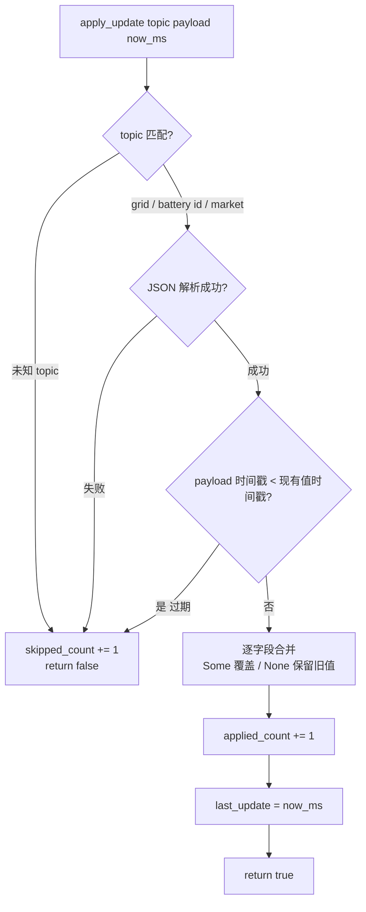

# EnerOS v0.89.0 数字孪生数据镜像设计文档

## 1. 版本目标

实现 Digital Twin Agent 数据镜像（eneros-twin-agent）：

- **旁路订阅**：TwinMirror 经 DDS 旁路订阅 `/power/state/*` 主题（显式 topic 列表），只读不写入控制通道；
- **TwinModel 实时镜像**：电网状态 / 电池设备状态 / 市场价格三类消息逐字段合并进内存镜像，过期消息跳过不更新；
- **周期快照**：`on_tick` 按 `publish_interval_ms` 周期判定，向 `/power/twin/update` 发布摘要快照 JSON。

本版本为 **v0.90.0 孪生预测** / **v0.91.0 What-if 推演** / **v0.112.0 云端孪生主节点** 提供实时状态输入，是数字孪生线的数据地基。

## 2. 前置依赖

- v0.75.0 agent-bus-dds（`DdsNode` / `DdsSample` / `ReaderId` / `WriterId` / `MockDdsNode` / `DdsError`；D7 已合并 DdsReader/DdsWriter 为 DdsNode）
- v0.77.0 路由器旁路订阅概念（旁路只读模式来源）
- v0.82.0 grid-agent（`GridState` 12 字段 + `DataQuality`，D7 复用）
- v0.73.0 device-agent（`DeviceState`，D6 复用）
- 蓝图 `phase2.md` v0.89.0 章节（9 节版本模板）

## 3. 交付物清单

- `crates/agents/twin-agent/Cargo.toml` — 新 crate 清单（eneros-twin-agent）
- `crates/agents/twin-agent/src/lib.rs` — crate 入口 + 模块导出
- `crates/agents/twin-agent/src/model.rs` — TwinModel / DeviceTwin / TwinSnapshot / MarketMirror
- `crates/agents/twin-agent/src/mirror.rs` — TwinMirror（订阅/合并/发布）+ payload DTO + TwinError + 内嵌测试
- 根 `Cargo.toml` — workspace members 注册 `crates/agents/twin-agent`
- `configs/twin_mirror.toml` — 数据镜像订阅配置模板
- `docs/agents/digital-twin-design.md` — 本设计文档
- 版本同步（路线图 / checklist）
- 40 个单元测试 T1~T40（文件内嵌，D12）

## 4. 数据结构

### 4.1 TwinModel

全网状态镜像聚合体。

| 字段 | 类型 | 说明 |
|------|------|------|
| `devices` | `BTreeMap<u64, DeviceTwin>` | 设备镜像表（D2：BTreeMap 迭代有序，快照输出确定；no_std 无 std HashMap） |
| `grid` | `GridState` | 电网状态（D7：复用 eneros-grid-agent，12 字段 + DataQuality） |
| `market` | `Option<MarketMirror>` | 市场价格镜像（D10：本地极简类型，仅当前价） |
| `last_update` | `u64` | 最近一次成功 apply 的 now_ms（快照时间戳来源） |

派生：`Debug, Clone, Default`。

### 4.2 DeviceTwin

| 字段 | 类型 | 说明 |
|------|------|------|
| `device_id` | `u64` | 设备 ID（D6：u64 Copy，从 topic 后缀解析） |
| `state` | `DeviceState` | 设备状态（D6：复用 device-agent，已含 soc/power/last_update_ms，删除蓝图重复字段） |

派生：`Debug, Clone, Default`。

### 4.3 TwinSnapshot

| 字段 | 类型 | 说明 |
|------|------|------|
| `timestamp` | `u64` | 快照时间戳（= model.last_update，非取快照时刻） |
| `model` | `TwinModel` | 镜像深拷贝 |

派生：`Debug, Clone`。

### 4.4 MarketMirror

| 字段 | 类型 | 说明 |
|------|------|------|
| `timestamp` | u64 | 价格时间戳（过期判定基准） |
| `current_price` | f32 | 当前电价（D10：不含 96 段预测，镜像只需当前价） |

派生：`Debug, Clone, Copy, PartialEq`。

### 4.5 TwinMirror

镜像主结构（10 字段）。

| 字段 | 类型 | 说明 |
|------|------|------|
| `node` | `Box<dyn DdsNode>` | DDS 节点（D4：复用 v0.75.0 合并后 trait，no_std 单线程用 Box） |
| `readers` | `Vec<(String, ReaderId)>` | 订阅 reader 句柄表（显式 topic 列表，D11） |
| `writer` | `WriterId` | `/power/twin/update` 发布句柄（crate 内固定，D9） |
| `model` | `TwinModel` | 实时镜像 |
| `publish_interval_ms` | `u64` | 发布周期（蓝图 §6.3：≤ 1s 保证镜像延迟 < 1s） |
| `take_max_samples` | `usize` | 单 tick 每 reader 最大取样本数（蓝图 §4.5，= 100） |
| `last_publish_ms` | `u64` | 上次发布时刻（周期判定基准） |
| `applied_count` | `u64` | 成功合并消息计数（发布摘要字段） |
| `skipped_count` | `u64` | 跳过消息计数（无效 JSON/无效 id/未知 topic/过期，发布摘要字段） |
| `published_count` | `u64` | 已发布摘要计数（发布摘要字段） |

派生：无（含 trait object）。

### 4.6 payload DTO（serde 反序列化目标）

| DTO | 字段 | 说明 |
|-----|------|------|
| `GridPayload` | `frequency` / `voltage` / `active_power` / `reactive_power` / `current` / `power_factor` / `grid_load` / `renewable_ratio` / `congestion_level` / `data_quality` / `timestamp` 等全 `Option` | 逐字段合并：`Some(v)` 覆盖，`None` 保留旧值（蓝图 §4.4）；timestamp 为过期判定基准 |
| `DevicePayload` | `soc` / `power` / `timestamp` 等全 `Option` | 逐字段合并进 `devices.entry(id).or_default().state`；timestamp 为过期判定基准 |
| `MarketPayload` | `timestamp: u64` / `current_price: f32`（必填） | 整体替换 `model.market`；缺必填字段 → JSON 解析失败 → 跳过 |

DTO 派生：`Debug, Clone, Default, serde::Deserialize`（GridPayload/DevicePayload 字段全 Option 故 Default 有意义）。

### 4.7 核心算法流程（蓝图 §4.3）

```mermaid
flowchart TD
    A[订阅 topic 列表<br/>/power/state/grid<br/>/power/state/battery/id<br/>/power/market/price] --> B[on_tick now_ms<br/>逐 reader take 100]
    B --> C{apply_update<br/>topic 三分支}
    C -->|/power/state/grid| D[GridPayload<br/>逐字段合并 model.grid]
    C -->|/power/state/battery/id| E[解析 id u64<br/>DevicePayload 合并<br/>devices.entry id or_default]
    C -->|/power/market/price| F[MarketPayload<br/>替换 model.market]
    D --> G[TwinModel 实时镜像]
    E --> G
    F --> G
    G --> H{now_ms - last_publish_ms<br/> >= publish_interval_ms?}
    H -->|是| I[publish 摘要 JSON<br/>timestamp/device_count/计数器]
    I --> J[/power/twin/update]
    H -->|否| K[本轮不发布]
```

## 5. 接口设计

### 5.1 接口签名与语义

| 接口 | 签名 | 语义 |
|------|------|------|
| `new` | `pub fn new(node: Box<dyn DdsNode>, topics: &[&str], publish_interval_ms: u64, take_max_samples: u64) -> Result<Self, TwinError>` | 逐 topic create_reader + create_writer(`/power/twin/update`)，构造 TwinMirror（任一失败 → TwinError::Dds） |
| `on_tick` | `pub fn on_tick(&mut self, now_ms: u64) -> Result<bool, TwinError>` | 单 tick 驱动：消费消息 + 周期判定发布；返回是否发布（D3：sync 替代蓝图 async run） |
| `apply_update` | `pub fn apply_update(&mut self, topic: &str, payload: &str, now_ms: u64) -> bool` | 单条消息合并入口；返回是否应用（true=applied，false=skipped） |
| `snapshot` | `pub fn snapshot(&self) -> TwinSnapshot` | 深拷贝镜像；timestamp = model.last_update |
| `publish` | `fn publish(&mut self, now_ms: u64) -> Result<(), TwinError>` | 组装摘要 JSON → node.write(writer, ...) → last_publish_ms/published_count 更新（D9） |

### 5.2 on_tick 三步流程

1. **消费**：逐 `(topic, reader)` 调 `node.take(reader, take_max_samples)`，逐 sample 调 `apply_update(topic, payload, now_ms)`；`take` 返回 Err → 返回 `TwinError::Dds`；
2. **周期判定**：`now_ms - last_publish_ms >= publish_interval_ms` → 进入发布；
3. **发布**：`publish(now_ms)` 摘要 JSON 到 `/power/twin/update`，返回 `Ok(true)`；否则 `Ok(false)`。

### 5.3 apply_update 四分支语义表

| 分支 | topic 模式 | 解析 | 过期判定 | 合并规则 | 计数 |
|------|-----------|------|---------|---------|------|
| grid | `/power/state/grid` 精确 | GridPayload（无效 JSON → skipped） | payload.timestamp < grid.timestamp → skipped | 逐字段 Some 覆盖 / None 保留 | applied/skipped |
| battery | `/power/state/battery/{id}` 前缀 + 后缀解析 u64（解析失败 → skipped） | DevicePayload（无效 JSON → skipped） | payload.timestamp < devices\[id\].state.last_update_ms → skipped | `entry(id).or_default()` 逐字段 Some 覆盖 / None 保留 | applied/skipped |
| market | `/power/market/price` 精确 | MarketPayload 必填字段（无效 JSON → skipped） | payload.timestamp < market.timestamp → skipped | 整体替换 model.market | applied/skipped |
| 未知 | 其他任意 topic | — | — | 不合并 | skipped |

应用成功时：`last_update = now_ms`，`applied_count += 1`，返回 `true`；跳过：`skipped_count += 1`，返回 `false`。

### 5.4 apply_update 决策流程



## 6. 错误处理

### 6.1 唯一硬错误

`TwinError` 单变体（D8）：

| 变体 | 含义 | 触发点 |
|------|------|--------|
| `Dds(DdsError)` | DDS 节点操作失败 | new 建 reader/writer、on_tick take、publish write |

派生：`Debug`（含 DdsError，no_std 下不实现 std Error trait）。

### 6.2 跳过路径全表（降级非错误，蓝图 §4.4）

| 跳过路径 | 处理 | 镜像影响 |
|---------|------|---------|
| 无效 JSON | skipped_count += 1，return false | 无 |
| 无效 id（battery 后缀非 u64） | skipped_count += 1，return false | 无 |
| 未知 topic | skipped_count += 1，return false | 无 |
| 过期消息（payload ts < 现有 ts） | skipped_count += 1，return false | 保留旧值（D11） |
| 字段缺失（Option = None） | 不跳过；该字段保留旧值，其余字段正常合并 | 部分更新（蓝图 §4.4） |

蓝图 §4.4 两条降级规则映射：**过期不更新** → 过期判定 skipped；**缺失保留** → Option None 保留旧值。

## 7. 选型对比（蓝图 §5.1）

| 方案 | 实时性 | 耦合度 | 结论 |
|------|--------|--------|------|
| **旁路订阅** ⭐ | 高（消息推送即镜像） | 低（只读旁路，不改控制路径，蓝图 §7.3） | **采用** |
| 主动查询 | 低（轮询周期决定，状态滞后） | 中（需各 Agent 暴露查询接口） | 否决 |
| 数据库快照 | 离线级（适合回溯分析，非实时镜像） | 高（依赖存储栈可用性） | 否决 |

## 8. 实现路径（Karpathy 4 原则落点）

| 原则 | 本版本落点 |
|------|-----------|
| Think Before Coding | D1~D12 偏差声明先行，蓝图与 no_std 现实逐条对齐后编码 |
| Simplicity First | 复用 DdsNode（v0.75.0）+ GridState（v0.82.0）+ DeviceState（v0.73.0），零类型重定义 |
| Surgical Changes | 全新 crate；既有 crate 源码零改动，仅根 Cargo.toml 追加 1 行 member |
| Goal-Driven | 40 测试 T1~T40 全过 + 端到端 MockDdsNode 广播验证（T31~T36） |

## 9. 测试计划

| 分组 | 编号 | 覆盖点 |
|------|------|--------|
| model | T1~T6 | TwinModel/DeviceTwin/TwinSnapshot/MarketMirror Default、Clone、snapshot timestamp = last_update |
| grid | T7~T12 | GridPayload 全量/部分字段合并、None 保留旧值、过期跳过、无效 JSON 跳过、计数器 |
| battery | T13~T19 | id 解析、entry or_default 新建、逐字段合并、None 保留、过期跳过、无效 id 跳过、无效 JSON 跳过 |
| market | T20~T23 | 首次替换、二次替换、过期跳过、缺必填字段跳过 |
| 通用 | T24~T26 | 未知 topic 跳过、applied/skipped 计数精确、last_update 更新 |
| snapshot | T27~T30 | 快照深拷贝隔离、时间戳一致、设备有序性（BTreeMap 键序）、空模型快照 |
| on_tick 端到端 | T31~T36 | MockDdsNode 广播 → take 消费 → 镜像更新、周期到发布 / 未到不发布、多 topic 混合、摘要 JSON 字段校验、take Err → TwinError::Dds |
| new 边界 | T37~T38 | 空 topic 列表构造、reader 创建失败 → TwinError::Dds |
| publish 摘要 | T39~T40 | 摘要 JSON 含 timestamp/device_count/grid_timestamp/market_timestamp/三计数器、published_count 递增 |

## 10. 验收标准

- 镜像延迟 < 1s（蓝图 §6.3）—— **集成阶段验收，本版本交付算法骨架 + 单元测试**（publish_interval_ms = 1000 配置保证周期 ≤ 1s）
- 只读旁路（蓝图 §7.3）：仅订阅 `/power/state/*` 与 `/power/market/price`，唯一写入为 `/power/twin/update` 摘要
- 40 tests 全过（T1~T40）
- aarch64-unknown-none 交叉编译通过
- clippy 0 warning
- 回归全绿：grid-agent 130+1 / device-agent 24 / energy-market-agent 185 / agent-bus-dds 63

## 11. 风险与坑点

| 风险 | 说明 | 缓解 |
|------|------|------|
| §8.1 内存随设备数增长 | devices BTreeMap 无上限，设备数线性增长 | 本版本接受；大规模部署需分区内存预算（蓝图 §43.6）+ 后续上限/淘汰策略 |
| §8.5 时钟不同步状态错位 | 多源时间戳不一致，旧消息覆盖新状态 | D11 过期判定：payload ts < 现有 ts → 跳过 |
| Mock 精确匹配 vs {id} 通配 | Mock 广播为 topic 精确匹配，`{id}` 通配仅 v0.76.0 注册表层 | 显式 topic 列表订阅（D11）；apply_update 内部按前缀 + u64 后缀解析分支 |
| take 消费语义 | take 取出即消费，样本不会重复投递 | 单 tick 内同一样本只 apply 一次，无重复应用风险 |
| JSON 字段命名约定 | payload 字段名须与 DTO serde 字段一致 | 测试锁定命名；文档示例对齐 |
| f32/f64 精度 | 价格/功率浮点经 JSON 序列化有精度截断 | DTO 统一 f32；测试用近似断言/精确可表示值 |

## 12. 偏差声明

| 偏差 | 蓝图原文 | 本版本处理 | 理由 |
|------|---------|-----------|------|
| D1 | crates/agents/twin_agent/ | crates/agents/twin-agent/（包名 eneros-twin-agent） | 规则 §2.3.1 目录名与包名去前缀一致；连字符惯例统一 |
| D2 | devices: HashMap | BTreeMap<u64, DeviceTwin> | no_std 无 std HashMap；迭代有序快照输出确定 |
| D3 | async run() + interval ticker | sync on_tick(now_ms) -> Result<bool, TwinError> | no_std 无 async runtime；沿用 v0.82.0 grid_agent on_tick 模式 |
| D4 | subscriber: DdsReader 独立模块 | Box<dyn DdsNode> + ReaderId/WriterId 句柄 | v0.75.0 D7 已合并 DdsReader/DdsWriter 为 DdsNode；蓝图类型不存在 |
| D5 | now_ms() 全局调用 | now_ms 参数注入 | no_std 无 Instant::now() |
| D6 | DeviceTwin 含 device_id: String + soc/power/timestamp 独立字段 | DeviceTwin{device_id: u64, state: DeviceState} 复用 device-agent 类型 | u64 Copy；内嵌 state 已含 soc/power/last_update_ms，删除重复字段 |
| D7 | grid: GridState（未定义） | 复用 eneros-grid-agent GridState（12 字段+DataQuality） | 既有权威类型，避免语义漂移 |
| D8 | TwinError（未定义变体） | 单变体 Dds(DdsError) | 过期/缺失/无效 JSON 为降级非硬错误（蓝图 §4.4） |
| D9 | publish 发布快照（格式未定义） | 快照摘要 JSON（时间戳/device_count/计数器） | GridState/DeviceState 无 serde 派生，全量序列化需改既有 crate 违反 surgical |
| D10 | market: Option<MarketData> | Option<MarketMirror{timestamp, current_price}> 本地极简 | MarketData 含 96 段预测且重量级传递依赖；镜像只需当前价 |
| D11 | 订阅 /power/state/* + 过期不更新 | 显式 topic 列表；过期=payload 时间戳<现有值→跳过 | Mock 精确匹配（{id} 通配仅注册表层）；判定确定性可测试 |
| D12 | docs/phase2/digital_twin.md + tests/twin_mirror.rs | docs/agents/digital-twin-design.md + 文件内嵌测试 | 规则 §2.3.3 禁止平面化；沿用 v0.82.0~v0.88.0 模式 |
