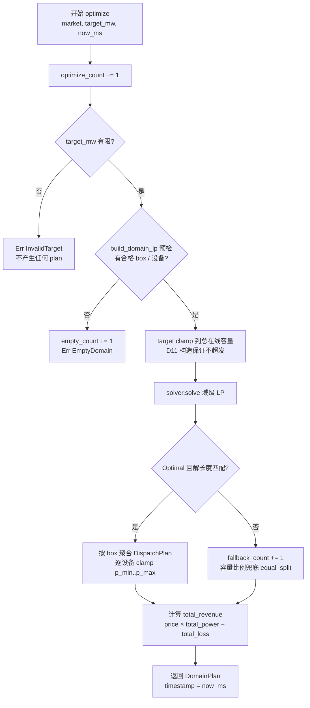

# EnerOS v0.93.0 Edge Coordinator 域级优化设计文档

> **版本**：v0.93.0
> **蓝图**：phase2.md §v0.93.0
> **Crate**：`eneros-coordinator`（`crates/agents/coordinator/`）

---

## 1. 版本目标

实现 Edge Coordinator 域级能源优化（P2-D 第 2 版，在 v0.92.0 同 crate 追加第 4 个模块 `domain_optimizer`）：收集域内所有 Edge Box 状态 → 构建**域级 LP**（各 box 容量约束 + 域平衡约束）→ Solver 求解 → 按 box 聚合并下发各 EdgeBox，使**园区级整体收益优于单机独立调度**：

- **域级 LP 协同**（D7 修正蓝图退化）：每在线 box 每台合格设备一个变量 `p_{box}_{dev}`（bounds `[p_min, p_max]`）；① 域平衡行 `Σp = target_mw`；② 每 box 容量行 `Σ_{i∈box} p_i ≤ capacity_mw`；目标 Minimize `Σ(1−eff_i)·p_i`（总损耗最小）——高效机组优先出力，直接降低园区总损耗；
- **Edge Box 离线排除**（D8）：`online=false` 从 LP 与 DomainPlan 中排除，状态保留可恢复；
- **确定性容量比例兜底**（D10）：LP 失败（Err / Infeasible / 解长度不符）→ 活跃 box 按 `capacity_mw` 比例分摊 target，box 内复用 `equal_split`，不迭代重试 LP；
- **域容量安全**（D11）：`target_mw` 超过总在线容量时 clamp 后再建 LP，构造上保证不超发；
- **NaN 全链路防御**（D12）：soc / capacity / efficiency / price 四类脏数据 sanitize，不传播不 panic；
- **可观测 metric**（D9）：`DomainOptimizer` 3 个 pub 计数器（optimize / fallback / empty）+ `DomainPlan.total_revenue` 净收益可观测。

**业务价值**：v0.92.0 解决了多 Agent 争抢单资源的仲裁问题，但域内多台 Edge Box 各自为政仍会导致园区级局部最优；域级 LP 统一优化使高效机组优先出力、园区总损耗最小化，净收益优于单机独立调度且可判定（D12 净收益语义）。

**Phase 定位**：P2-D 第 2 版，联邦治理域内层；**下游解锁 v0.94.0 VPP 聚合（Phase 2 出口标准）/ v0.96.0 Cloud Coordinator**。

**性能目标**（蓝图 §6.3）：求解耗时 < 2s —— **集成阶段验收**，本版本交付算法骨架 + 单元验证（`max_boxes=32` 限制变量规模，目标余量充足）。

---

## 2. 前置依赖

- **v0.92.0 域内仲裁**（同 crate）：`arbiter.rs` / `bid.rs` / `conflict.rs` **零改动**（Surgical），本版本仅追加第 4 个模块；
- **eneros-solver-core v0.64.0**：`Solver` trait（`solve(&mut self)`）/ `LpProblem`（变量 bounds / 约束行 rhs / 目标系数）——域级 LP 求解引擎；
- **eneros-energy-market-agent v0.85.0 / v0.87.0**：`MarketData`（price 来源，v0.85.0）/ `DevicePool` / `DeviceCapability` / `DeviceAssignment` / `DispatchPlan` / `equal_split`（v0.87.0，兜底 box 内均分）——复用防重复造轮子（§5.5 默认集成清单）；
- 蓝图 `phase2.md` v0.93.0 章节（9 节版本模板）；
- **无新第三方依赖**：两个依赖均为 workspace 内既有 crate，SBOM 零新增。

**下游解锁**：v0.94.0 VPP 聚合（DomainPlan 作为 VPP 域聚合输入）/ v0.96.0 Cloud Coordinator（域级优化结果上报云端协同）。

---

## 3. 交付物清单

- `crates/agents/coordinator/src/domain_optimizer.rs` — **新增**：`EdgeBoxState` / `DomainPlan` / `OptError` / `DomainOptimizer` + `build_domain_lp` 内部构造函数 + 内嵌测试 T1~T40
- `crates/agents/coordinator/src/lib.rs` — **仅追加**：`pub mod domain_optimizer;` + 4 项重导出 + crate 文档升级 v0.92.0 + v0.93.0 双版本说明（含 D1~D12 偏差简表）
- `crates/agents/coordinator/Cargo.toml` — **仅追加 dependencies**：`eneros-solver-core = { path = "../../ai/solver-core" }` + `eneros-energy-market-agent = { path = "../energy-market-agent" }`
- `configs/domain_optimizer.toml` — 域级优化配置模板（`[domain_optimizer]` max_boxes / fallback）
- `docs/agents/domain-optimizer-design.md` — 本设计文档
- **40 个单元测试** T1~T40（src 内嵌），含 5-Box 集成、Box 离线重优化故障注入、NaN 风暴防御
- 根目录 4 文件版本同步 0.92.0 → 0.93.0（`Cargo.toml` / `Makefile` / `ci.yml` / `gate.rs` 注释）
- **无 BREAKING**：既有 40 个 v0.92.0 测试与全部下游 crate 零影响

---

## 4. 详细设计

### 4.0 域级优化数据流

```mermaid
flowchart LR
    A[EdgeBox 状态上报<br/>EdgeBoxState × N<br/>devices / socs / capacity_mw / online] --> B[DomainOptimizer<br/>BTreeMap 盒管理<br/>add_box / remove_box / set_online]
    B --> C[build_domain_lp<br/>变量 p_{box}_{dev}<br/>域平衡行 + 每 box 容量行]
    C --> D[Solver 求解<br/>eneros-solver-core v0.64.0]
    D -->|Optimal 且解长度匹配| E[按 box 聚合<br/>DispatchPlan × N]
    D -->|Err / Infeasible / 长度不符| F[容量比例兜底<br/>equal_split（D10）]
    E --> G[DomainPlan<br/>box_plans + total_revenue + timestamp]
    F --> G
    G --> H[DomainPlan 下发各 EdgeBox 执行]
```

### 4.1 EdgeBoxState（D2/D3/D8）

| 字段 | 类型 | 说明 |
|------|------|------|
| `box_id` | `u64` | Edge Box 唯一标识（D2：无堆字符串，v0.87.0 D3 惯例） |
| `devices` | `DevicePool` | 设备池（复用 v0.87.0，不重定义；含 DeviceCapability p_min/p_max/efficiency） |
| `socs` | `BTreeMap<u64, f32>` | 设备 SOC 表（D3：DeviceId=u64，确定性迭代，同 dispatch 签名） |
| `capacity_mw` | `f32` | box 容量上限（MW；sanitize 非有限或 ≤0 → 排除该 box，D12） |
| `online` | `bool` | 在线标记（D8：false 从 LP 与计划排除，状态保留可恢复） |

派生：`Debug, Clone`。

### 4.2 DomainPlan（D2/D6/D12）

| 字段 | 类型 | 说明 |
|------|------|------|
| `box_plans` | `BTreeMap<u64, DispatchPlan>` | 各 box 下发计划（D2：BTreeMap 保证 LP 列映射与下发顺序可重放） |
| `total_revenue` | `f32` | 净收益（D12：`price × (total_power − total_loss)`） |
| `timestamp` | `u64` | 计划时间戳（= now_ms 外部注入，D6） |

派生：`Debug, Clone, PartialEq, Default`。

### 4.3 OptError（D10）

| 变体 | 触发条件 |
|------|---------|
| `EmptyDomain` | 无合格 box / 设备（无 box、全离线、或全设备 SOC 耗尽） |
| `InvalidTarget` | `target_mw` 非有限（NaN / ±Inf），不产生任何 plan |

派生：`Debug, Clone, Copy, PartialEq, Eq`。**Solver 失败为兜底非错误**（D10），故不在 OptError 中设求解失败变体。

### 4.4 DomainOptimizer（D4/D9）

| 字段 | 类型 | 说明 |
|------|------|------|
| `edge_boxes` | `BTreeMap<u64, EdgeBoxState>` | 盒管理（D2：确定性迭代，LP 列映射可重放） |
| `solver` | `Box<dyn Solver>` | LP 求解器（D4：no_std 单线程无共享所有权需求；Solver trait 本就 `&mut self` 不可共享） |
| `optimize_count` | `u64` | 累计优化次数（pub 可观测，D9） |
| `fallback_count` | `u64` | 兜底次数（pub 可观测，D9） |
| `empty_count` | `u64` | 空域次数（pub 可观测，D9） |

字段全 pub（v0.92.0 D9 惯例：本地 metric 可查，no_std 无 log crate）。

### 4.5 build_domain_lp 域级 LP（D7）

私有内部构造函数（测试直接调用），输入为"已 clamp 的 target + 合格 box 集合"：

- **合格设备判定**：所属 box `online == true && sanitize(capacity_mw) > 0`，且设备 SOC 合格（有 soc 记录时 NaN 或 ≤0 → 跳过该设备，D12）；
- **变量**：每合格设备一个 `p_{box_id}_{dev_id}`，bounds `[p_min, p_max]`，Continuous；
- **目标系数**：`1 − sanitize(efficiency)`（D12 clamp [0,1]，NaN → 0.5 中性）——总损耗最小；
- **约束行 0（域平衡）**：`Σp = clamped_target`（rhs 上下界相等，强制域级耦合）；
- **约束行 1..N（每 box 容量）**：每合格 box 一行 `Σ_{i∈box} p_i ≤ capacity_mw`（rhs_lower = `-f64::INFINITY`，rhs_upper = capacity）；
- **列序确定性**：按 (box_id, dev_id) 升序（BTreeMap 迭代序，D2），同输入两次 build 逐字段一致。

### 4.6 optimize 10 步流程

```
① optimize_count += 1
② target_mw 非有限 → Err(InvalidTarget)（不产生任何 plan）
③ 无合格 box/设备 → empty_count += 1 + Err(EmptyDomain)
④ target clamp 到总在线容量（D11：构造上保证不超发）
⑤ build_domain_lp 构建域级 LP
⑥ solver.solve(lp)
⑦ Optimal 且解长度匹配 → 按 box 聚合 DispatchPlan
   （逐设备 clamp [p_min, p_max]；box 内 objective_value = Σ(1−eff)·p_i）
⑧ 否则 → fallback_count += 1 + 容量比例兜底（D10，objective_value = 0.0）
⑨ total_revenue = price × (total_power − total_loss)（D12 净收益语义）
⑩ timestamp = now_ms，返回 Ok(DomainPlan)
```



### 4.7 容量比例兜底（D10）

- **触发条件**：solver 返回 Err / Infeasible / 解长度与变量数不符；
- **分摊规则**：活跃 box 间按 `capacity_mw` 比例分摊 clamped target；box 内复用 v0.87.0 `equal_split`（逐设备 clamp `[p_min, p_max]`）；
- **留痕**：`fallback_count += 1`；各 box `objective_value = 0.0`（v0.87.0 D8 惯例：失败为兜底非错误）；
- **收益**：`total_revenue` 仍按实际分配计算（D12），使兜底路径与优化路径收益可对比。

### 4.8 净收益公式（D12）

```
total_revenue = price × (total_power − total_loss)
total_power   = Σ box_plans[*].total_power      （实际出力总和）
total_loss    = Σ (1 − eff_i) · p_i             （损耗总和 = LP 目标函数值）
```

- `price` 取自 `MarketData`；price 非有限 → revenue 按 0.0；
- 损耗最小化直接转化为收益增量，支撑蓝图 §7.2"收益 > 单机"**可判定**（T40 严格断言优化收益 > 兜底收益）。

---

## 5. 技术交底

### 5.1 为何域级 LP 优于单机独立调度

单机独立调度时各 box 仅按自身目标出力，低效机组照常满发，园区总损耗偏高。域级 LP 以 Minimize `Σ(1−eff_i)·p_i` 为目标，在域平衡 `Σp = target` 约束下**让高效机组（`1−eff` 小）优先承担出力**：例 eff 0.95 与 0.75 两 box、target=8 时，LP 最优解将 6 MW 集中于高效 box，总损耗 `0.05×6 + 0.25×2 = 0.8`，严格低于容量比例分摊（各 4.8/3.2，损耗 `0.05×4.8 + 0.25×3.2 = 1.04`）。D12 净收益公式使该优势直接体现为 `total_revenue` 差值，可测试可审计。

### 5.2 D7：蓝图 LP 退化问题与修正

蓝图原 LP 存在**退化**：`domain_balance` 约束系数为空、`Σp ≤ Σcapacity` 被单变量上界隐含（无实际耦合），且 `optimize(market)` 无 target 参数——该"LP"无域级耦合，数学上等价于逐设备独立截断，优化无意义。本版本修正为**有实际域级耦合的 LP**：域平衡行 rhs 上下界相等（`= clamped_target`）强制跨 box 耦合，每 box 容量行表达物理上限；并增加 `target_mw: f32` 注入（域级调度目标，下游由仲裁/计划给定）。T21~T26 对 LP 结构做逐字段断言，防退化回归。

### 5.3 D10：不迭代重试 LP 的确定性兜底理由

蓝图 §4.4"LP 不可行 → 放松约束"若落地为迭代重试：① 重试次数与放松步长引入不确定性，同输入可能产生不同计划，违反电力调度可复现审计要求；② 重试放大求解耗时，威胁蓝图 §6.3 <2s 目标；③ no_std 无日志，重试链路难以排查。容量比例兜底为确定性 O(box 数) 计算，可复现可断言；失败语义为"兜底非错误"（`objective_value = 0.0` 留痕 + `fallback_count` 可观测），与 v0.87.0 D8 惯例一致。

### 5.4 D12：净收益语义使"收益 > 单机"可判定

蓝图 §7.2 要求"园区级收益优于单机独立调度"，但未定义 `total_revenue` 公式，判定无依据。本版本定义净收益 `price × (total_power − total_loss)`：LP 目标恰为 `total_loss` 最小化，故**优化路径损耗 < 兜底路径损耗 ⟺ 优化收益 > 兜底收益**，等价命题可在单元测试中严格断言（T40）。同时 NaN 防御全覆盖（v0.88.0 C140 教训）：soc NaN 按耗尽跳过、capacity 非有限/≤0 排除 box、efficiency NaN→0.5 并 clamp [0,1]、price 非有限→收益按 0.0，任何脏数据不传播不 panic。

---

## 6. 测试计划

40 个单元测试 T1~T40（src 内嵌）：

| 分组 | 编号 | 覆盖点 |
|------|------|--------|
| 数据结构（T1~T8） | T1~T8 | EdgeBoxState 构造字段回显、Clone 独立性、Debug 非空；DomainPlan Default 全零/空、PartialEq 逐字段一致与不等；OptError 两变体不等、Eq/Copy 语义 |
| sanitize（T9~T16） | T9~T16 | soc NaN → 按耗尽跳过；soc ≤0 → 跳过；capacity NaN → 排除 box；capacity +Inf → 排除；capacity 0 / 负 → 排除；efficiency NaN → 0.5 中性；efficiency <0 → 0、>1 → 1 clamp；price NaN / ±Inf → revenue 按 0.0 |
| 盒管理（T17~T20） | T17~T20 | add_box 字段回显、同 id 再次 add 覆盖；remove_box 首次 true、再删 false；set_online(false) 后 online 回显且后续 optimize 不纳入；set_online 不存在 id → false |
| LP 构建（T21~T26） | T21~T26 | 2 box × 2 设备变量 4 个按 (box,dev) 升序；约束共 3 行（1 平衡 + 2 容量）；平衡行 rhs == target（上下界相等）；容量行 rhs_upper == 各 box 容量；同输入两次 build 逐字段一致（确定性可重放）；离线 box 变量与容量行均排除 |
| 校验路径（T27~T29） | T27~T29 | 无 box → Err(EmptyDomain) + empty_count == 1；全 box 离线 / 全设备 SOC 耗尽 → EmptyDomain；target NaN / +Inf / −Inf → Err(InvalidTarget) 不产生任何 plan |
| 优化路径（T30~T32） | T30~T32 | 2 box（cap 6/4，eff 0.95/0.75）target=8，Optimal 解 [6.0, 2.0] → box1 total_power=6.0、box2=2.0；optimize_count / timestamp == now_ms 回显；total_revenue == price × (8.0 − (0.05×6 + 0.25×2)) |
| 离线重优化（T33~T34） | T33~T34 | 3 box 优化后 set_online(2, false) 再 optimize → box_plans 不含 box 2，target 全摊 box 1/3（蓝图 §4.4/§6.5 故障注入）；set_online(2, true) 后恢复纳入 |
| 兜底（T35~T36） | T35~T36 | solver Err / Infeasible → fallback_count += 1，2 box cap 6/4 target=10 分得 6.0/4.0（容量比例 + equal_split clamp），objective_value == 0.0；解长度不符 → 兜底，revenue 仍按实际分配计算 |
| 容量 clamp（T37） | T37 | target=100.0 总在线 capacity=10.0 → 不报错，LP 平衡目标 clamp 到 10.0，plan 总出力 ≤ 10.0（蓝图 §7.3，D11） |
| NaN 风暴（T38~T39） | T38~T39 | 全设备 soc NaN → EmptyDomain 不 panic；soc/capacity/efficiency/price 混合 NaN 注入 → 返回确定结果，不传播不 panic |
| 5-Box 集成（T40） | T40 | 5 box（不同 eff/capacity）端到端集成优化；优化路径 total_revenue **严格大于**同输入兜底路径 revenue（D12 净收益语义可判定，蓝图 §7.2） |

性能目标（求解 < 2s，蓝图 §6.3）标注：**集成阶段验收，本版本交付算法骨架 + 单元验证**。

**GPU 规则说明（蓝图 §6.6）**：本版本为纯标量 CPU 计算（LP 构建 / 比例分摊），无张量操作，**不涉及 GPU**。

---

## 7. 验收标准

- **功能**：域级 LP 正确（平衡 + 容量耦合，D7）；离线 box 排除与恢复（D8）；兜底确定性（D10）；target clamp 不超发（D11）；NaN 全链路防御不 panic（D12）；
- **测试**：**80 个测试通过**（新增 40 个 T1~T40 + 既有 40 个 v0.92.0 测试零破坏）；既有全部下游 crate 回归零影响；
- **交叉编译**：`aarch64-unknown-none` 交叉编译通过（no_std + alloc）；
- **质量**：`cargo fmt --check` / `cargo clippy -D warnings` / `cargo deny check` 全过，0 warning；
- **性能**：求解 < 2s（蓝图 §6.3）——**集成阶段验收**，本版本交付算法骨架 + 单元验证（max_boxes=32 限制变量规模）；
- **文档**：本设计文档 + `configs/domain_optimizer.toml` 配置模板；
- **出口**：域级优化可用，解锁 v0.94.0 VPP 聚合 / v0.96.0 Cloud Coordinator。

---

## 8. 风险

| 风险 | 说明 | 缓解 |
|------|------|------|
| Solver 求解耗时随域规模增长 | LP 变量数 = Σ 各 box 合格设备数，耗时随规模超线性增长 | `max_boxes = 32` 配置上限（内存预算 §43.6 内）；求解 < 2s 列入**集成阶段验收**；超时治理由下游调度层处理 |
| 状态一致性坑点（蓝图 §8.5） | socs / capacity_mw 需与 Edge Box 实际上报同步，脏数据导致 LP 失真 | sanitize 全链路防御（D12）；状态由上报驱动更新，optimize 只读快照；T38~T39 NaN 风暴注入验证 |
| 蓝图 LP 退化风险 | 原蓝图 LP 无实际域耦合（平衡行系数为空），优化无意义 | **已通过 D7 修正**（域平衡行强制耦合 + target 注入）；T21~T26 结构断言防回归 |
| 兜底收益低于优化收益 | LP 失败时容量比例分摊非最优 | `fallback_count` 可观测留痕；D12 净收益语义使差距可度量；solver Err 根因由集成阶段排查 |
| 内存（蓝图 §43.6） | edge_boxes BTreeMap + LpProblem 堆分配 | Agent Runtime 分区 ≤ 64MB 预算内；max_boxes=32 上限；无增量分配 |

---

## 9. 多角度要求

- **安全**：域容量**不超发**（D11：target clamp 到总在线容量后再建 LP，构造上保证，蓝图 §7.3）；离线 box 不参与出力（D8）；target 非有限直接拒绝（InvalidTarget）；NaN 不传播不 panic（D12，v0.88.0 C140 教训）；
- **可观测**：3 个 pub 计数器（`optimize_count` / `fallback_count` / `empty_count`，D9）+ `DomainPlan.total_revenue` 净收益可观测；no_std 无 log crate，metric 全部字段化本地可查；
- **确定性**：BTreeMap 迭代序确定（D2/D3）→ LP 列映射与计划下发顺序可重放（同输入两次 build 逐字段一致，T25）；同优先级取"首个最大"惯例；`now_ms` 外部时间注入（D6）；全链路无随机源，同输入同输出；
- **no_std**：alloc / core only——`alloc::collections::BTreeMap` / `alloc::boxed::Box` / `alloc::vec::Vec` / `core::cmp`，禁止 `std::*`（蓝图 §43.1 硬性要求）；C 底层（Solver 内部 HiGHS）例外遵循 §4.3 三层分层。

---

## 10. 接口契约

pub 项签名清单（`domain_optimizer.rs`）：

```rust
/// Edge Box 状态（D2/D3/D8），Debug + Clone
pub struct EdgeBoxState {
    pub box_id: u64,
    pub devices: DevicePool,
    pub socs: BTreeMap<u64, f32>,
    pub capacity_mw: f32,
    pub online: bool,
}

/// 域级优化计划（D2/D6/D12），Debug + Clone + PartialEq + Default
pub struct DomainPlan {
    pub box_plans: BTreeMap<u64, DispatchPlan>,
    pub total_revenue: f32,
    pub timestamp: u64,
}

/// 优化错误（D10：Solver 失败为兜底非错误，不在此列）
/// Debug + Clone + Copy + PartialEq + Eq
pub enum OptError {
    EmptyDomain,
    InvalidTarget,
}

/// 域级优化器（D4/D9），字段全 pub
pub struct DomainOptimizer {
    pub edge_boxes: BTreeMap<u64, EdgeBoxState>,
    pub solver: Box<dyn Solver>,
    pub optimize_count: u64,
    pub fallback_count: u64,
    pub empty_count: u64,
}

impl DomainOptimizer {
    /// 构造：注入 solver，计数器全零
    pub fn new(solver: Box<dyn Solver>) -> Self;
    /// 增/覆盖 box（同 id 再次 add 覆盖）
    pub fn add_box(&mut self, box_id: u64, state: EdgeBoxState);
    /// 删 box：存在 → true，不存在 → false
    pub fn remove_box(&mut self, box_id: u64) -> bool;
    /// 上/下线：不存在 id → false（D8：离线排除，状态保留可恢复）
    pub fn set_online(&mut self, box_id: u64, online: bool) -> bool;
    /// 域级优化主流程（10 步，见 §4.6；D5 sync &mut self，D6 外部时间注入）
    pub fn optimize(
        &mut self,
        market: &MarketData,
        target_mw: f32,
        now_ms: u64,
    ) -> Result<DomainPlan, OptError>;
}

/// 域级 LP 内部构造（私有，测试直接调用，D7）
fn build_domain_lp(/* 合格 box 集合 + clamped target */) -> LpProblem;
```

`lib.rs` 4 项重导出（既有 pub 项与 3 个既有模块零改动）：

```rust
pub mod domain_optimizer;
pub use domain_optimizer::{DomainOptimizer, EdgeBoxState, DomainPlan, OptError};
```

---

## 11. 偏差声明

| 偏差 | 蓝图原文 | 本版本处理 |
|------|---------|-----------|
| **D1** | crate 路径 `crates/coordinator/src/domain_optimizer.rs` | 既有 `crates/agents/coordinator/src/domain_optimizer.rs`（项目 §2.3.1 硬规则，v0.92.0 D1 惯例；同 crate 追加模块） |
| **D2** | `box_id: String` / `box_plans: HashMap<String, DispatchPlan>` | `box_id: u64` / `BTreeMap<u64, DispatchPlan>`（无堆字符串 + 确定性迭代，v0.87.0 D3 惯例；BTreeMap 保证 LP 列映射与计划下发顺序可重放） |
| **D3** | `socs: HashMap<DeviceId, f32>` | `socs: BTreeMap<u64, f32>`（DeviceId=u64，同 v0.87.0 dispatch 签名，确定性） |
| **D4** | `solver: Arc<dyn Solver>` | `solver: Box<dyn Solver>`（no_std 单线程无共享所有权需求，v0.87.0 D5 惯例；Solver trait 本就 `&mut self` 不可共享） |
| **D5** | `pub async fn optimize(&self, ...)` | sync `optimize(&mut self, market, target_mw, now_ms)`（no_std 无 async runtime；`&mut` 因 `Solver::solve` 需 `&mut` 且计数器更新，v0.87.0 D1 惯例） |
| **D6** | `now_ms()` 内部时间源 | `now_ms: u64` 外部时间注入（no_std 无 Instant，全项目统一惯例）；`DomainPlan.timestamp = now_ms` |
| **D7** | 蓝图 LP 退化：`domain_balance` 约束系数为空、`Σp ≤ Σcapacity` 被单变量上界隐含（无实际耦合），且无 target | 实现**有实际域级耦合的 LP**：每在线 box 的每台合格设备一个变量 `p_{box}_{dev}`（bounds [p_min, p_max]）；① 域平衡行 `Σp = target_mw`；② 每 box 容量行 `Σ_{i∈box} p_i ≤ capacity_mw`；目标 Minimize `Σ(1−eff_i)·p_i`（损耗最小，v0.87.0 D14 一致）。蓝图 `optimize(market)` 无 target 参数 → 增加 `target_mw: f32` 注入（域级调度目标，下游由仲裁/计划给定） |
| **D8** | 蓝图 `EdgeBoxState` 无 online 字段，但 §4.4 要求"Edge Box 离线 → 从优化中排除"且 §6.5 要求离线故障注入 | `EdgeBoxState` 增加 `online: bool` + `DomainOptimizer::set_online(box_id, online)`（离线 box 从 LP 与 DomainPlan 中排除，不删除状态便于恢复） |
| **D9** | 蓝图 §9 可观测要求"优化收益 metric" | `DomainOptimizer` 3 个 pub 计数器：`optimize_count` / `fallback_count` / `empty_count`（v0.92.0 D9 惯例；收益经 `DomainPlan.total_revenue` 可观测） |
| **D10** | §4.4"LP 不可行 → 放松约束" | 落地为**确定性容量比例兜底**（不迭代重试 LP）：solver Err / Infeasible / 解长度不符 → 活跃 box 间按 `capacity_mw` 比例分摊 target，box 内复用 v0.87.0 `equal_split`（clamp [p_min, p_max]）；`objective_value = 0.0`（v0.87.0 D8 惯例：失败为兜底非错误） |
| **D11** | §7.3 安全"不超域级容量" | `target_mw > Σ在线 capacity` → **clamp 到总在线容量**后再建 LP（构造上保证不超发，不报错中断调度）；`target_mw` 非有限 → `Err(OptError::InvalidTarget)` |
| **D12** | 蓝图未定义 `total_revenue` 公式；未覆盖 NaN | 净收益语义：`total_revenue = price × (total_power − total_loss)`（`total_loss = Σ(1−eff_i)·p_i`，使损耗最小化直接转化为收益，支撑 §7.2"收益 > 单机"可判定）；NaN 防御（v0.88.0 C140 教训）：soc NaN → 按耗尽跳过该设备；capacity 非有限或 ≤0 → box 排除；efficiency 非有限或越出 [0,1] → clamp（NaN→0.5 中性）；price 非有限 → revenue 按 0.0 |

---

## 12. 附录

### 相关文档

- [edge-arbiter-design.md](./edge-arbiter-design.md) — v0.92.0 域内仲裁设计文档（同 crate 前置模块，arbiter/bid/conflict）
- [multi-dispatch-design.md](./multi-dispatch-design.md) — v0.87.0 多设备调度设计文档（LP / equal_split 复用源）
- 源码路径：`../../crates/agents/coordinator/src/domain_optimizer.rs`（crate 根：`crates/agents/coordinator/`）
- 配置模板：`../../configs/domain_optimizer.toml`
- Spec：`.trae/specs/develop-v0930-domain-optimizer/spec.md`

### 版本历史

| 版本 | 内容 | 模块 |
|------|------|------|
| v0.92.0 | Edge Coordinator 域内仲裁（P2-D 起点）：三级仲裁 + 冲突告警 + 死锁检测 | `bid` / `arbiter` / `conflict` |
| v0.93.0 | Edge Coordinator 域级优化（P2-D 第 2 版）：域级 LP + 容量比例兜底 + 净收益判定（本版本） | `domain_optimizer`（追加，第 4 模块） |
