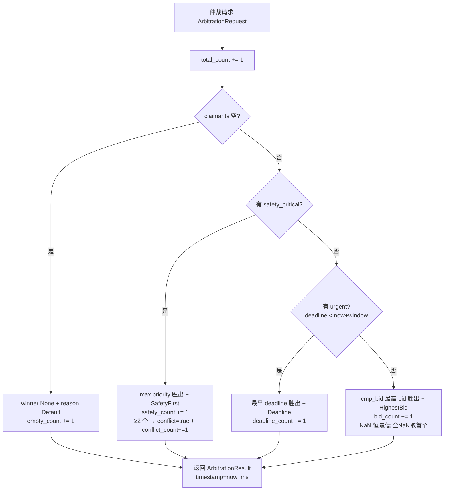
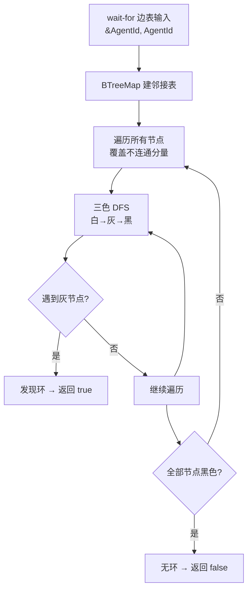

# EnerOS v0.92.0 Edge Coordinator 域内仲裁设计文档

> **版本**：v0.92.0
> **蓝图**：phase2.md §v0.92.0
> **Crate**：`eneros-coordinator`（`crates/agents/coordinator/`）

---

## 1. 版本目标

实现 Edge Coordinator 域内仲裁（`eneros-coordinator` 首个能力，P2-D 起点）：多 Agent 争抢同一共享资源（PCC 并网容量、变压器容量等）时，按"**竞价为主 + 安全底线**"原则三级仲裁：

- **安全底线（第 1 级）**：`safety_critical` claimant 永远胜出（最高 priority，蓝图 §7.3 安全压制）；≥2 个 safety 同优先级 → 确定性取输入序首个 + `conflict=true` 告警（D10）；
- **紧急优先（第 2 级）**：无 safety 时，urgent（`deadline < now + urgent_window_ms`）claimant 取最早 deadline 胜出；
- **竞价兜底（第 3 级）**：无 safety 无 urgent 时，最高 `bid` 胜出（`cmp_bid` 全序，NaN 恒最低永不胜出，全 NaN 确定性取首个，D11）；
- **空请求**：空 claimants → `winner: None` + `reason: Default`，不 panic（D8）；
- **冲突与死锁可观测**：`has_safety_conflict`（≥2 个 safety 告警）+ `detect_deadlock`（wait-for 图三色 DFS 环检测）；
- **仲裁记录 metric**：`DomainArbiter` 6 个 pub 可观测计数器（total/safety/deadline/bid/empty/conflict，D9）。

**业务价值**：避免多 Agent 资源争抢冲突，保障安全优先，为 VPP 域内协同提供统一资源裁决入口。

**Phase 定位**：P2-D 起点，联邦治理域内层；出口关联 VPP 域内协同基础。

**性能目标**（蓝图 §7.2）：仲裁耗时 < 10ms —— **集成阶段验收**，本版本交付算法骨架 + 单元验证（纯标量 O(claimant 数) 遍历，目标余量充足）。

---

## 2. 前置依赖

- **v0.88.0 多目标优化**：上游单 Agent 决策（产出各 Agent 的 bid 与 priority 诉求，本版本 claimant 数据来源）；
- **v0.77.0 路由器**：域内消息路由基础（仲裁请求/结果投递通道）；
- **v0.33.0 AgentId**：复用自 `eneros-agent`（仲裁参与方唯一标识，不重定义）；
- 蓝图 `phase2.md` v0.92.0 章节（9 节版本模板）；
- **无外部依赖**：无新第三方 crate；纯算法 crate，不触 DDS 总线、不写控制通道。

**下游解锁**：v0.93.0 域级优化（仲裁结果作为域级优化输入）/ v0.94.0 VPP 聚合（域内资源聚合）/ v0.96.0 Cloud Coordinator（云边协同仲裁上报）。

---

## 3. 交付物清单

- `crates/agents/coordinator/src/bid.rs` — `cmp_bid` 全序比较（NaN 防御）+ `is_urgent` + 内嵌测试 T1~T8
- `crates/agents/coordinator/src/arbiter.rs` — `Priority` / `Claim` / `ArbitrationRequest` / `ArbitrationResult` / `ArbitrationReason` / `ArbiterPolicy` / `DomainArbiter`（三级仲裁 + 6 计数器）+ 内嵌测试 T9~T30
- `crates/agents/coordinator/src/conflict.rs` — `has_safety_conflict` + `detect_deadlock`（wait-for 图三色 DFS）+ 内嵌测试 T31~T40
- `crates/agents/coordinator/src/lib.rs` — 模块声明 + 重导出 + crate 文档 v0.92.0
- `configs/edge_arbiter.toml` — 仲裁策略配置模板（`[arbiter]` urgent_window_ms）
- `docs/agents/edge-arbiter-design.md` — 本设计文档
- **40 个单元测试** T1~T40（src 内嵌，D6），含 NaN 注入与死锁环注入

---

## 4. 数据结构

### 4.1 Priority（D7）

| 变体 | 严重度 | 说明 |
|------|--------|------|
| `Low` | 最低 | 普通竞价请求 |
| `Normal` | 低 | 常规业务请求（Default） |
| `High` | 中 | 高优先级业务 |
| `Critical` | 高 | 关键业务（非安全） |
| `Safety` | 最高 | 安全相关（蓝图 §7.3 安全压制） |

派生：`Debug, Clone, Copy, PartialEq, Eq, PartialOrd, Ord, Default` —— `Default = Normal`；**声明序即序**：`Low < Normal < High < Critical < Safety`（Safety 最大，`max_by_key` 直接可用，D7）。

### 4.2 Claim（D3）

| 字段 | 类型 | 说明 |
|------|------|------|
| `agent_id` | `AgentId` | 复用 v0.33.0 `eneros-agent` 类型 |
| `priority` | `Priority` | 优先级（Ord 派生比较，D7） |
| `bid` | `f32` | 经济报价（竞价阶段使用；NaN 恒最低，D11） |
| `safety_critical` | `bool` | 是否安全关键请求（第 1 级压制） |
| `deadline` | `u64` | 请求 deadline（ms 时间戳，每 claimant 独立紧急度，D3） |

派生：`Debug, Clone, PartialEq`。

> **D3 说明**：蓝图 §4.1 `Claim` 无 deadline 字段，§4.5 代码却用 `c.deadline`（蓝图自相矛盾）。本版本 `Claim` 增加 `deadline: u64`（三级仲裁第 2 级必需）；`ArbitrationRequest.deadline` 保留为请求级字段（预留仲裁超时逻辑，本版本三级仲裁不使用）。

### 4.3 ArbitrationRequest（D2）

| 字段 | 类型 | 说明 |
|------|------|------|
| `resource_id` | `&'static str` | 资源标识（D2：无堆分配，同 v0.90.0/v0.91.0 D2 惯例），如 PCC 并网点、变压器编号 |
| `claimants` | `Vec<Claim>` | 仲裁参与方列表（空 → None+Default，D8） |
| `deadline` | `u64` | 请求级 deadline（预留仲裁超时逻辑，本版本不使用） |

派生：`Debug, Clone, PartialEq`。

### 4.4 ArbitrationResult（D8/D10）

| 字段 | 类型 | 说明 |
|------|------|------|
| `winner` | `Option<AgentId>` | 胜方（空 claimants → None，D8） |
| `reason` | `ArbitrationReason` | 胜出原因 |
| `timestamp` | `u64` | 仲裁时间戳（= now_ms 外部注入，D4） |
| `conflict` | `bool` | ≥2 个 safety_critical 同优先级 → true（D10，告警可观测化） |

派生：`Debug, Clone, PartialEq`。

### 4.5 ArbitrationReason

| 变体 | 触发条件 |
|------|---------|
| `SafetyFirst` | safety_critical 胜出（第 1 级） |
| `Deadline` | urgent 最早 deadline 胜出（第 2 级） |
| `HighestBid` | 最高 bid 胜出（第 3 级，含全 NaN 取首个，D11） |
| `Default` | 空 claimants（无胜方） |

派生：`Debug, Clone, Copy, PartialEq, Eq`。

### 4.6 ArbiterPolicy（D12）

| 字段 | 类型 | 说明 |
|------|------|------|
| `urgent_window_ms` | `u64` | 紧急窗口（ms），Default = 1000（蓝图 §9 策略配置化） |

### 4.7 DomainArbiter（D9，可观测计数器）

| 字段 | 类型 | 说明 |
|------|------|------|
| `policy` | `ArbiterPolicy` | 仲裁策略配置 |
| `total_count` | `u64` | 累计仲裁请求数（pub 可观测） |
| `safety_count` | `u64` | safety 胜出次数（pub 可观测） |
| `deadline_count` | `u64` | deadline 胜出次数（pub 可观测） |
| `bid_count` | `u64` | bid 胜出次数（pub 可观测） |
| `empty_count` | `u64` | 空 claimants 次数（pub 可观测） |
| `conflict_count` | `u64` | safety 冲突告警次数（pub 可观测，D10） |

> **D9 说明**：蓝图 `arbitrate(&self, req)`，本版本 `arbitrate(&mut self, ...)` —— 蓝图 §9 可观测要求仲裁记录 metric，6 个 pub 计数器需 `&mut` 更新，本地可查。

---

## 5. 接口设计

### 5.1 三级仲裁流程（arbitrate）

```rust
/// 三级仲裁：安全 > deadline > 竞价（顺序不可逾越）
/// now_ms 外部时间注入（no_std 无 Instant，全项目统一惯例，D4）
pub fn arbitrate(&mut self, req: &ArbitrationRequest, now_ms: u64) -> ArbitrationResult {
    self.total_count += 1;

    // ① 空 claimants → None + Default（D8，不 panic）
    if req.claimants.is_empty() {
        self.empty_count += 1;
        return ArbitrationResult { winner: None, reason: Default, timestamp: now_ms, conflict: false };
    }

    // ② 安全优先：safety_critical 中 max priority 胜出
    //    ≥2 个同最高优先级 → 确定性取输入序首个 + conflict=true（D10）
    //    reason = SafetyFirst，safety_count += 1，冲突时 conflict_count += 1

    // ③ 紧急优先：is_urgent(c, now_ms, window) 中取最早 deadline
    //    reason = Deadline，deadline_count += 1

    // ④ 竞价兜底：cmp_bid 全序取最高 bid（NaN 恒最低，全 NaN 取首个，D11）
    //    reason = HighestBid，bid_count += 1
}
```

### 5.2 辅助接口签名

| 接口 | 签名 | 语义 |
|------|------|------|
| `is_urgent` | `pub fn is_urgent(claim: &Claim, now_ms: u64, policy: &ArbiterPolicy) -> bool` | `claim.deadline < now_ms.saturating_add(policy.urgent_window_ms)`（saturating_add 防 u64 溢出，D12） |
| `cmp_bid` | `pub fn cmp_bid(a: f32, b: f32) -> Ordering` | 全序比较：NaN 恒最低（a NaN → Less；b NaN → Greater；双 NaN → Equal）；±Inf 保留偏序（D11） |
| `has_safety_conflict` | `pub fn has_safety_conflict(claimants: &[Claim]) -> bool` | safety_critical 数量 ≥ 2 → true（冲突告警判定） |
| `detect_deadlock` | `pub fn detect_deadlock(edges: &[(AgentId, AgentId)]) -> bool` | wait-for 边表 → BTreeMap 邻接表 → 三色 DFS 环检测，有环 → true（§5.4 仅检测不预防） |

### 5.3 三级仲裁决策流



### 5.4 死锁检测流程（仅检测不预防，蓝图 §5.4）



---

## 6. 错误处理

### 6.1 空 claimants（D8）

| 场景 | 行为 | 结果形态 |
|------|------|---------|
| `claimants.is_empty()` | 不 panic，计数器留痕 | `winner: None` + `reason: ArbitrationReason::Default` + `timestamp: now_ms` + `conflict: false`，`empty_count += 1` |

> 蓝图 §4.4"无 claimants → 返回空结果"，但 `winner: AgentId` 非空类型无法表达空；本版本 `winner: Option<AgentId>`（D8）。

### 6.2 NaN bid 全序防御（D11，v0.88.0 C140 教训）

| 场景 | cmp_bid 行为 |
|------|-------------|
| `a` NaN，`b` 非 NaN | `Less`（NaN 恒最低，永不胜出） |
| `b` NaN，`a` 非 NaN | `Greater` |
| 双 NaN | `Equal`（全 NaN 确定性取输入序首个） |
| ±Inf | 保留偏序（+Inf 最高正常值，-Inf 最低正常值，非 NaN） |

蓝图 §4.5 `partial_cmp(b.bid).unwrap()` 存在 NaN panic 风险；本版本 `cmp_bid` 全序，**任何输入不 panic**。

### 6.3 conflict 告警字段化（D10，no_std 无 log）

蓝图 §4.4"多个 safety_critical → 选优先级最高，并告警冲突"。no_std 无 log crate，告警可观测化为：

- `ArbitrationResult.conflict: bool` —— ≥2 个 safety_critical → true（结果字段，下游可消费）；
- `conflict_count` 计数器 —— 累计冲突次数（本地 metric 可查）；
- 同优先级时**确定性取输入序首个**（无随机源，可复现可断言）。

---

## 7. 选型对比（蓝图 §5.1）

| 方案 | 优点 | 缺点 | 结论 |
|------|------|------|------|
| **安全优先+竞价** | 安全底线不可逾越；竞价保障经济效率；确定性可复现 | 低 bid 可能饥饿（§8.1，老化机制后续版本） | ⭐ **采纳**：电力场景安全一票否决，竞价为主兼顾效率 |
| 纯竞价 | 实现简单；经济效率最高 | **安全风险**：低价安全需求被压制，电力安全场景不可接受 | 否决：违反蓝图 §7.3 safety_critical 永远胜出 |
| 轮询 | 公平性高；无饥饿 | 不区分紧急度，安全/deadline 诉求无法表达 | 否决：不适用电力安全场景 |

---

## 8. 实现路径

| 步骤 | 内容 | 原则落点 |
|------|------|---------|
| ① bid.rs | `cmp_bid` 全序（NaN 防御）+ `is_urgent`（saturating_add 防溢出） | Simplicity First：纯标量比较，无堆分配 |
| ② arbiter.rs | 数据结构（Priority/Claim/Request/Result/Reason/Policy）+ `DomainArbiter` 三级仲裁 + 6 计数器 | Goal-Driven：确定性可复现，测试可断言 |
| ③ conflict.rs | `has_safety_conflict` + `detect_deadlock`（BTreeMap 邻接表 + 三色 DFS） | Think Before Coding：D1~D12 偏差声明先行 |
| ④ lib.rs 集成 | `pub mod bid/arbiter/conflict` + 重导出 + crate 文档 v0.92.0 | Surgical Changes：模块内聚，对外仅重导出 |

文件组织：`crates/agents/coordinator/`（D1：crate 必须归入既有 7 子系统，coordinator 属 Phase 2+ 治理 Agent 归 agents/；v0.93/v0.94 模块后续同 crate 追加）。

---

## 9. 测试计划

40 个单元测试 T1~T40（src 内嵌，D6）：

| 分组 | 编号 | 覆盖点 |
|------|------|--------|
| bid（T1~T8） | T1~T8 | cmp_bid 正常比较（大/小/相等）、**NaN 注入**：a NaN→Less / b NaN→Greater / 双 NaN→Equal / NaN vs 最高有限值仍 Less、+Inf 胜过有限值、-Inf 低于有限值、is_urgent 边界（deadline 恰等于 now+window 不 urgent、小 1ms urgent、已过期 urgent）、saturating_add 溢出防御（now 近 u64::MAX 不 wrap） |
| arbiter（T9~T30） | T9~T30 | Priority 序 Low<Normal<High<Critical<Safety + Default==Normal、单 safety 胜出 SafetyFirst、多 safety 取最高 priority、**多 safety 同优先级取输入序首个 + conflict=true + conflict_count+=1**、safety 压制 urgent 与最高 bid（顺序不可逾越）、无 safety 时 urgent 最早 deadline 胜出、多个 urgent 取 min deadline、无 safety 无 urgent 最高 bid 胜出、bid 全 NaN 取首个不 panic、空 claimants→None+Default+empty_count+=1 不 panic、6 计数器逐场景断言、total_count 累计、timestamp==now_ms 回显、确定性（两次相同输入逐字段一致）、conflict=false 常态 |
| conflict（T31~T40） | T31~T40 | has_safety_conflict：0/1/2/3 个 safety → false/false/true/true、**死锁环注入**：双节点互等环→true、三节点环→true、自环→true、链式无环→false、不连通分量（一环一链）→true、空边表→false、多分量全无环→false |

性能目标（仲裁 < 10ms，蓝图 §7.2）标注：**集成阶段验收，本版本交付算法骨架 + 单元验证**（D6）。

**GPU 规则说明（蓝图 §6.6）**：本版本为纯标量 CPU 计算（比较/遍历/DFS），无张量操作，**不涉及 GPU**。

---

## 10. 验收标准

- **功能**：三级仲裁顺序正确（安全 > deadline > 竞价，不可逾越）；safety_critical 永远胜出（蓝图 §7.3）；空请求 None+Default 不 panic；NaN 全序防御不 panic；冲突告警字段化；死锁环检测正确；
- **性能**：仲裁 < 10ms（蓝图 §7.2）——**集成阶段验收**，本版本交付算法骨架 + 单元验证（O(claimant 数) 纯标量遍历）；
- **安全**：safety_critical 最高压制；确定性无随机源（同输入同输出，可复现）；
- **质量**：40 tests 全过（T1~T40）；aarch64-unknown-none 交叉编译通过；`cargo fmt --check` / `cargo clippy -D warnings` / `cargo deny check` 全过；既有全部下游 crate 回归零影响；
- **文档**：本设计文档 + `configs/edge_arbiter.toml` 配置模板；
- **GPU 规则**（蓝图 §6.6）：本版本纯标量 CPU 计算无张量，不涉及 GPU；
- **出口**：域内仲裁可用，解锁 v0.93.0 域级优化 / v0.94.0 VPP 聚合 / v0.96.0 Cloud Coordinator。

---

## 11. 风险与坑点

| 风险 | 说明 | 缓解 |
|------|------|------|
| 仲裁饥饿（蓝图 §8.1） | 纯即时三级仲裁，低 bid Agent 可能长期无法获胜 | 老化机制（递增优先级/保底配额）**后续版本**；本版本 6 计数器已预留可观测数据供老化策略决策 |
| 结果需广播所有 claimants（蓝图 §8.5 坑点） | ArbitrationResult 需通知全部 claimants（含落败方），否则预留资源不释放 | 本版本仅交付仲裁算法骨架；**下游 DDS 总线集成时处理广播投递** |
| 死锁仅检测不预防（蓝图 §5.4） | wait-for 环检测只能发现死锁，不能预防 | 本版本定位：检测 + 告警（true/false）；预防策略（资源排序/超时撤销）后续版本 |
| 确定性要求 | 电力仲裁结果必须可复现审计 | 全链路无随机源：同优先级取输入序首个、全 NaN 取首个、时间外部注入 |
| NaN/Inf 污染（D11） | 上游 v0.88.0 异常注入非有限报价 | cmp_bid 全序：NaN 恒最低、不传播不 panic（v0.88.0 C140 教训） |
| 内存（蓝图 §43.6） | claimants Vec 堆分配，O(参与方数) | Agent Runtime 分区 ≤ 64MB 预算内；域内 Agent 数量有限；无增量分配 |

---

## 12. 偏差声明

| 偏差 | 蓝图原文 | 本版本处理 |
|------|---------|-----------|
| **D1** | crate 路径 `crates/coordinator/src/` | `crates/agents/coordinator/`（项目 §2.3.1 硬规则优先：crate 必须归入既有 7 子系统；coordinator 属 Phase 2+ 治理 Agent 归 agents/；v0.93/v0.94 模块后续同 crate 追加） |
| **D2** | `resource_id: String` | `resource_id: &'static str`（无堆分配，同 v0.90.0/v0.91.0 D2 惯例） |
| **D3** | §4.1 `Claim` 无 deadline 字段，§4.5 代码却用 `c.deadline`（蓝图自相矛盾） | `Claim` 增加 `deadline: u64`（每 claimant 独立紧急度，三级仲裁必需）；`ArbitrationRequest.deadline` 保留为请求级字段（预留仲裁超时逻辑，本版本三级仲裁不使用） |
| **D4** | `now_ms()` 内部时间源 | `arbitrate(&mut self, req, now_ms: u64)` 外部时间注入（no_std 无 Instant，全项目统一惯例）；`result.timestamp = now_ms` |
| **D5** | `docs/phase2/edge_arbiter.md` | `docs/agents/edge-arbiter-design.md`（记忆 §2.3.3 文档分类强制） |
| **D6** | `tests/arbiter.rs` 独立集成测试 | src 内嵌单元测试 T1~T40（项目惯例）；仲裁 <10ms 标注**集成阶段验收** |
| **D7** | `Priority::value()` 方法 + 声明序 Safety 在前 | derive `PartialOrd/Ord`，声明序 `Low < Normal < High < Critical < Safety`（Safety 最大，`max_by_key` 直接可用）；Default=Normal |
| **D8** | §4.4"无 claimants → 返回空结果"（`winner: AgentId` 非空类型无法表达） | `winner: Option<AgentId>`（空 → `None` + `reason = ArbitrationReason::Default`） |
| **D9** | `arbitrate(&self, req)` | `arbitrate(&mut self, ...)`（蓝图 §9 可观测要求：6 个 pub 计数器 total/safety/deadline/bid/empty/conflict，仲裁记录 metric 本地可查） |
| **D10** | §4.4"多个 safety_critical → 选优先级最高，并告警冲突" | `ArbitrationResult.conflict: bool`（no_std 无 log crate，告警可观测化为结果字段）+ `conflict_count` 计数器；同优先级时确定性取输入序首个 |
| **D11** | §4.5 `partial_cmp(b.bid).unwrap()`（NaN panic 风险） | `cmp_bid` 全序：NaN 视为最低（v0.88.0 C140 教训），±Inf 保留偏序；全 NaN 确定性取首个，不 panic |
| **D12** | §4.5 硬编码 `now + 1000` 紧急窗口 | `ArbiterPolicy { urgent_window_ms: u64 }`（Default=1000，蓝图 §9 策略配置化）；`now_ms.saturating_add(window)` 防 u64 溢出 |
