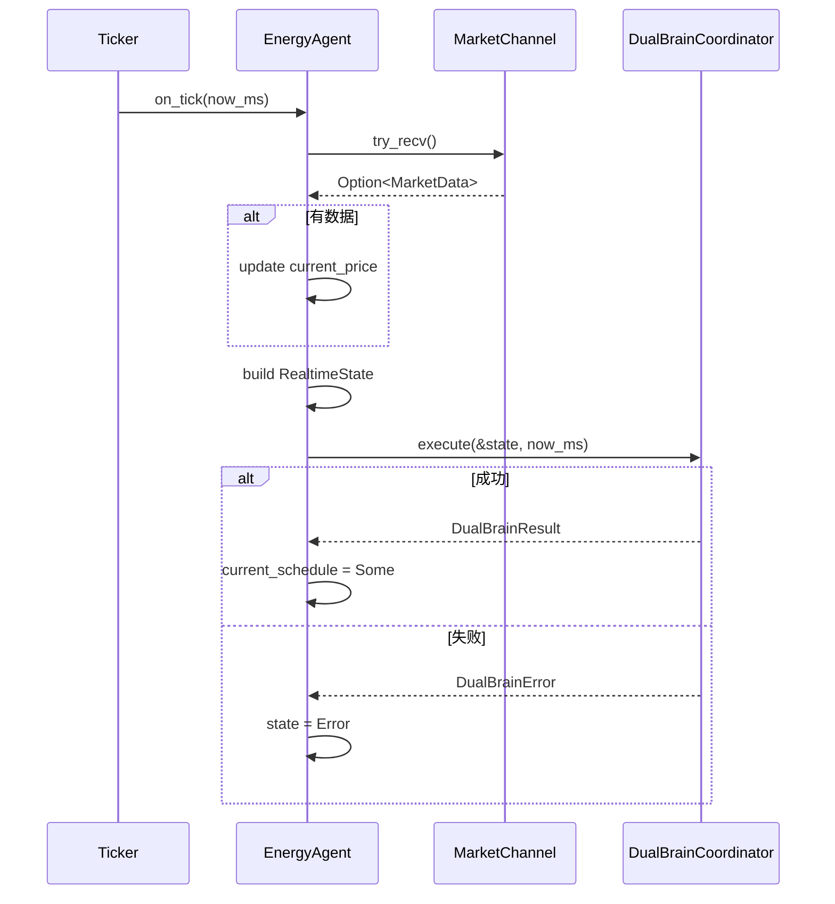

# EnerOS v0.72.0 Energy Agent + Market Agent 设计文档

> **版本**：v0.72.0
> **阶段**：Phase 1 单机 MVP — P1-L MVP 集成第一层
> **crate**：`eneros-energy-market-agent`（`crates/agents/energy-market-agent/`）
> **蓝图依据**：`蓝图/phase1.md` §v0.72.0
> **状态**：设计中
> **最后更新**：2026-07-16

---

## 目录

1. [版本目标](#1-版本目标)
2. [前置依赖](#2-前置依赖)
3. [交付物清单](#3-交付物清单)
4. [详细设计](#4-详细设计)
5. [技术交底](#5-技术交底)
6. [测试计划](#6-测试计划)
7. [验收标准](#7-验收标准)
8. [风险与注意事项](#8-风险与注意事项)
9. [多角度要求](#9-多角度要求)
10. [ADR 决策记录](#10-adr-决策记录)
11. [偏差声明（D1~D14）](#11-偏差声明d1d14)
12. [参考](#12-参考)

---

## 1. 版本目标

### 1.1 一句话目标

构建 P1-L MVP 集成第一层，实现 Energy Agent（能源调度核心）与 Market Agent（市场数据接收）双 Agent 协作：Energy Agent 编排 v0.71.0 `DualBrainCoordinator<MockSolver>` 执行储能调度，Market Agent 从外部数据源接收电价/负荷预测信号并通过 `MarketChannel` 非阻塞通道传递给 Energy Agent，构成 MVP 端到端集成的业务核心，为 v0.73.0/v0.74.0 多 Agent 联调与 MVP 冻结奠定基础。

### 1.2 详细描述

v0.71.0 完成了 P1-K 双脑协同第三层（收官层），交付了 `DualBrainCoordinator<S: Solver>` 端到端协调器与 `LatencyBreakdown` 7 环节延迟分解，打通了"感知 → LLM 推理 → 意图解析 → LP 求解 → 安全校验 → 命令下发"完整链路。但双脑协调器仍是被动调用的"工具"，缺少主动的 Agent 生命周期编排与 Agent 间数据流：

- **缺少 Agent 运行时抽象**：蓝图 §v0.72.0 引用 `AgentRuntime` trait（on_start/on_tick/on_stop/on_heartbeat），但 v0.33.0 `AgentEntry` trait 语义不同（on_init/on_start/on_stop + `AgentContext`，无 on_tick/on_heartbeat），无法直接复用。需要本地定义 `AgentRuntime` trait 匹配蓝图运行时语义（D6）。
- **缺少 Agent 间通信**：蓝图 §v0.72.0 引用 `ChannelReceiver<MarketData>` / `ChannelSender<MarketData>` 实现 Market Agent → Energy Agent 数据传递，但 `ChannelReceiver`/`ChannelSender` 在项目中不存在。需要本地定义 `MarketChannel`（Vec-backed 非阻塞通道，D4）。
- **缺少市场数据源抽象**：蓝图 §v0.72.0 引用 `TcpConnection::connect(market_server)` 接收市场数据，但 `TcpConnection` 不存在，v0.29.0 socket 抽象复杂。MVP 阶段用 Mock 即可，需要本地定义 `MarketDataSource` trait + `MockMarketSource`（D5）。
- **缺少 Agent 实例**：蓝图 §v0.72.0 描述 Energy Agent 持有 `DualBrainCoordinator`，Market Agent 持有 `MarketDataSource`，但两者均未实现。需要新增 `EnergyAgent` / `MarketAgent` 结构体并实现 `AgentRuntime` trait。
- **缺少安全默认策略**：蓝图 §v0.72.0 描述双脑失败时 `activate_safe_default()` 构造 `ControlCommand` 功率归零，但 v0.22.0 `ControlCommand` 字段差异大（`cmd_id: [u8;16]` / `DeviceId` / `setpoint: f32`）。本版本简化为状态标记（`AgentState::Error`），实际功率归零下发由 v0.73.0 Device Agent 实现（D14）。

本版本（v0.72.0）进入 P1-L MVP 集成第一层，针对上述五个缺口交付双 Agent 协作框架：

| 产出 | 角色 | 说明 |
|------|------|------|
| `AgentRuntime` trait | Agent 运行时接口 | 5 方法（descriptor / on_start / on_tick / on_stop / on_heartbeat）；本地定义（D6） |
| `HeartbeatStatus` 枚举 | 心跳状态 | 2 变体（Alive / Dead）；派生 `Debug + Clone + Copy + PartialEq + Eq`（D8） |
| `AgentRuntimeError` 错误枚举 | 运行时错误 | 5 变体（DualBrainError / ChannelError / MarketDataError / AgentError / NotRunning）；仅派生 `Debug`（D12） |
| `MarketData` + `MarketSignal` | 市场数据结构 | 5 字段（timestamp / price_forecast / current_price / load_forecast / signal_type）；派生 `Debug + Clone + Serialize + Deserialize`（D13） |
| `MarketChannel` | Agent 间通信通道 | Vec-backed 非阻塞；send（满时丢弃最旧）/ try_recv / is_empty / len（D4） |
| `MarketDataSource` trait + `MockMarketSource` | 市场数据源抽象 | `recv_nonblocking` 方法；Mock 预加载数据队列（D5） |
| `EnergyAgent` | 能源调度 Agent | 6 字段（descriptor / coordinator / market_channel / current_schedule / state / tick_count）；实现 `AgentRuntime` |
| `MarketAgent` | 市场数据 Agent | 6 字段（descriptor / source / market_channel / price_cache / state / tick_count）；实现 `AgentRuntime` |

本版本核心设计决策（详见 §11 偏差声明 D1~D14）：

1. **D1**：移除 `log::info!` / `log::warn!` / `log::error!`，状态/错误通过返回值传递（no_std 合规）
2. **D2**：`now_ms: u64` 参数替代 `SystemTime::now()` / `UNIX_EPOCH`（no_std 合规，与 v0.71.0 D1 一致）
3. **D3**：`AgentId::generate()`（v0.33.0 原子计数器）替代 `uuid::Uuid::new_v4()`（no_std 无 uuid）
4. **D4**：本地 `MarketChannel`（Vec-backed）替代 `ChannelReceiver` / `ChannelSender`（不存在）
5. **D5**：本地 `MarketDataSource` trait + `MockMarketSource` 替代 `TcpConnection`（不存在）
6. **D6**：本地 `AgentRuntime` trait 替代 v0.33.0 `AgentEntry`（语义不同）
7. **D7**：`AgentDescriptor::new(AgentType, name, now_ms)` 替代蓝图 `..Default::default()` 构造（v0.33.0 实际 API）
8. **D8**：本地 `HeartbeatStatus`（Alive/Dead 2 级）替代 v0.33.0 `HealthStatus`（4 级语义不同）
9. **D9**：`DualBrainCoordinator::new(config, llm, solver, sink)` 4 参数构造（v0.71.0 实际 API）
10. **D10**：`coordinator.execute(&state, now_ms)` 含 `now_ms` 参数（v0.71.0 实际 API）
11. **D11**：构建 `RealtimeState`（v0.70.0）传入 `execute`，从缓存/默认值填充
12. **D12**：单 crate 含双 Agent（`eneros-energy-market-agent`），避免跨 crate 类型共享
13. **D13**：`serde_json::from_slice`（alloc 支持）用于 JSON 解析，Mock source 直接返回 `MarketData`
14. **D14**：安全默认简化为 `state = AgentState::Error` 状态标记，功率归零由 v0.73.0 Device Agent 实现

所有 Rust 代码必须 no_std（蓝图 §43.1），仅使用 `core::*` / `alloc::*`，无 `std::*`，`Vec` / `String` / `Box` 来自 `extern crate alloc`，时间戳通过 `now_ms: u64` 参数传入（D2），Agent ID 通过 v0.33.0 `AgentId::generate()` 生成（D3），`MarketChannel` 为本地 Vec-backed 非阻塞通道（D4），`MarketDataSource` 为本地 trait + Mock 实现（D5），`AgentRuntime` 为本地 trait（D6），`AgentRuntimeError` 仅派生 `Debug`（D12），纯 safe Rust 零 `unsafe`，无 FFI 需求（纯 Rust，无 `[features]` 段）。

### 1.3 架构定位

| 维度 | 定位 |
|------|------|
| Phase | Phase 1 单机 MVP |
| 子系统 | P1-L MVP 集成第一层（双 Agent 协作） |
| 平面 | 慢平面（Agent Runtime 分区，管理信息大区） |
| 角色 | MVP 业务核心，Energy Agent 编排双脑协调器，Market Agent 接收市场数据并通过通道传递 |
| 上游版本 | v0.71.0（`DualBrainCoordinator<MockSolver>` / `DualBrainResult` / `DualBrainError` / `DualBrainMockEngine` / `MockCommandSink` / `DispatchCommand` 复用）；v0.70.0（`RealtimeState` / `PathType` 复用）；v0.66.0（`ScheduleConfig` / `ScheduleResult` 复用）；v0.64.0（`MockSolver` 复用）；v0.59.0（`LlmEngine` / `InferParams` 复用）；v0.33.0（`AgentDescriptor` / `AgentType` / `AgentState` / `TrustLevel` / `AgentError` / `AgentId` 复用）；v0.11.0 用户堆（alloc 支持） |
| 同层版本 | v0.72.0（本版本，双 Agent 协作第一层） |
| 下游版本 | v0.73.0（Device Agent + 实际功率归零下发）；v0.74.0（MVP 冻结）；v1.0.0 商用版 |
| 部署形态 | 纯 Rust crate，无 C 库依赖，无 FFI，CPU 编译运行；交叉编译目标 `aarch64-unknown-none` |

### 1.4 路线图链路

```
v0.33.0 Agent 框架 ──► v0.59.0 LlmEngine trait ──► v0.64.0 Solver trait
       │                       │                         │
       │                       ▼                         │
       │              v0.66.0 能源 LP 模型 ◄─────────────┤
       │                       │                         │
       │                       ▼                         │
       │              v0.70.0 快路径引擎 ◄───────────────┤
       │                       │                         │
       │                       ▼                         │
       │              v0.71.0 双脑协调器 ◄───────────────┘
       │                       │
       ▼                       ▼
   AgentDescriptor    DualBrainCoordinator<MockSolver>
       │                       │
       └───────────┬───────────┘
                   ▼
       v0.72.0 双 Agent 协作（本版本）
       EnergyAgent / MarketAgent / MarketChannel
                   │
                   ├──► v0.73.0 Device Agent（功率归零下发）
                   │
                   └──► v0.74.0 MVP 冻结
```

### 1.5 关键里程碑意义

本版本是 Phase 1 单机 MVP 的核心里程碑之一，标志着：

- **P1-L MVP 集成第一层启动**：从被动工具（双脑协调器）转向主动 Agent（Energy Agent + Market Agent），双脑架构首次被 Agent 运行时编排。
- **双 Agent 协作建立**：`MarketChannel` 非阻塞通道实现 Market Agent → Energy Agent 市场数据流，构成 MVP 端到端业务核心。
- **Agent 运行时抽象定义**：本地 `AgentRuntime` trait（on_start/on_tick/on_stop/on_heartbeat）为后续 v0.73.0/v0.74.0 多 Agent 联调提供统一生命周期接口。
- **安全默认策略奠基**：双脑失败时 `state = AgentState::Error` 状态标记（D14），为 v0.73.0 Device Agent 功率归零下发奠定基础。
- **Phase 1 收官在望**：v0.72.0 完成后，Phase 1 仅剩 v0.73.0/v0.74.0 两版（Device Agent / MVP 冻结），即可进入 v1.0.0 候选阶段（ADR-0004）。

### 1.6 双 Agent 协作目标

| 维度 | 目标 | 说明 |
|------|------|------|
| Agent 生命周期 | on_start → on_tick × N → on_stop | 5 方法 `AgentRuntime` trait |
| Agent 间通信 | MarketChannel Vec-backed 非阻塞 | send（满时丢弃最旧）/ try_recv |
| 市场数据流 | MarketAgent → MarketChannel → EnergyAgent | 96 时段电价预测 + 当前电价 |
| 双脑编排 | EnergyAgent.on_tick 调用 coordinator.execute | 慢路径 7 步 / 快路径早返回 |
| 安全降级 | 双脑失败 state=Error | D14：功率归零由 v0.73.0 实现 |
| 心跳监测 | on_heartbeat 返回 Alive/Dead | Running→Alive，其他→Dead |
| 优先级 | Energy (200) > Market (150) | `AgentDescriptor::new` 默认 |

---

## 2. 前置依赖

### 2.1 依赖版本清单

本版本复用 6 个既有 crate，无新依赖引入。所有依赖均为本项目既有版本，无外部第三方 crate 新增（`serde` / `serde_json` 已在前序版本中引入）。

| 版本 | crate | 复用类型 | 用途 | 蓝图节 |
|------|-------|---------|------|--------|
| v0.33.0 | `eneros-agent` | `AgentDescriptor` / `AgentType` / `AgentState` / `TrustLevel` / `AgentError` / `AgentId` | Agent 框架类型（D7：`AgentDescriptor::new(type, name, now)` 构造器；D3：`AgentId::generate()` ID 生成） | §v0.33.0 |
| v0.59.0 | `eneros-llm-engine` | `LlmEngine` trait / `InferParams` | LLM 推理引擎抽象（双脑协调器依赖） | §v0.59.0 |
| v0.64.0 | `eneros-solver-core` | `MockSolver` / `Solver` trait | LP 求解器（双脑协调器默认 `MockSolver`） | §v0.64.0 |
| v0.66.0 | `eneros-energy-lp-model` | `ScheduleConfig` / `ScheduleResult` / `ScheduleEntry` | 调度配置与结果（Energy Agent 持有 `current_schedule`） | §v0.66.0 |
| v0.70.0 | `eneros-fast-path` | `RealtimeState` / `PathType` | 实时状态输入（构建 `RealtimeState` 传入 `coordinator.execute`） | §v0.70.0 |
| v0.71.0 | `eneros-dual-brain` | `DualBrainCoordinator<MockSolver>` / `DualBrainResult` / `DualBrainError` / `DualBrainMockEngine` / `MockCommandSink` / `DispatchCommand` | 双脑协调与命令下发（Energy Agent 持有 `coordinator`） | §v0.71.0 |

### 2.2 上游 API 签名约束

本版本的实现严格遵循上游 crate 的实际 API 签名，以下为关键 API 调用点（D7/D9/D10 偏差的根源）：

#### 2.2.1 v0.33.0 `AgentDescriptor` + `AgentType` + `AgentState`

```rust
pub enum AgentType {
    Energy,
    Market,
    Device,
    System,
    // ...
}

pub enum AgentState {
    Init,
    Running,
    Suspended,
    Dead,
    Error,
}

pub struct AgentDescriptor {
    pub id: AgentId,
    pub agent_type: AgentType,
    pub name: String,
    pub priority: u8,
    pub trust_level: TrustLevel,
    pub created_at: u64,
    // ... 其他字段
}

impl AgentDescriptor {
    pub fn new(agent_type: AgentType, name: &str, now_ms: u64) -> Self;
}

impl AgentId {
    pub fn generate() -> Self;
}
```

- `AgentDescriptor::new(agent_type, name, now_ms)` 自动设置优先级/配额/信任等级（D7：蓝图 `..Default::default()` 与 `capabilities: Vec<&str>` 类型不匹配，实际 `Vec<CapabilityRef>`）
- `AgentId::generate()` 使用原子计数器生成唯一 ID（D3：no_std 无 uuid，复用 v0.33.0 实现）
- `AgentState` 含 5 变体（Init/Running/Suspended/Dead/Error），本版本使用 Init/Running/Dead/Error

#### 2.2.2 v0.71.0 `DualBrainCoordinator`

```rust
pub struct DualBrainCoordinator<S: Solver> {
    pub path_selector: PathSelector,
    pub fast_path: RealtimePathEngine<S>,
    pub llm_engine: Box<dyn LlmEngine>,
    // ... 其他字段
}

impl<S: Solver> DualBrainCoordinator<S> {
    pub fn new(
        config: ScheduleConfig,
        llm_engine: Box<dyn LlmEngine>,
        solver: S,
        sink: Box<dyn CommandSink>,
    ) -> Self;

    pub fn execute(
        &mut self,
        state: &RealtimeState,
        now_ms: u64,
    ) -> Result<DualBrainResult, DualBrainError>;
}

impl DualBrainCoordinator<MockSolver> {
    pub fn default_with_mock() -> Self;
}
```

- `DualBrainCoordinator::new(config, llm_engine, solver, sink)` 需 4 参数（D9：蓝图 `new(config)` 缺少 3 参数）
- `execute(&state, now_ms)` 需 `now_ms: u64` 参数（D10：蓝图 `execute(&state)` 缺少 `now_ms`）
- `default_with_mock()` 一键构造完整 Mock 环境（MockSolver + DualBrainMockEngine + MockCommandSink）

#### 2.2.3 v0.70.0 `RealtimeState`

```rust
pub struct RealtimeState {
    pub system: SystemState,
    pub current_price: f64,
    pub load_demand: Option<Vec<f64>>,
}
```

- `RealtimeState` 包装 v0.67.0 `SystemState` + `current_price` + `load_demand`
- Energy Agent 从缓存/默认值构建 `RealtimeState` 传入 `coordinator.execute`（D11）

#### 2.2.4 v0.66.0 `ScheduleConfig` + `ScheduleResult`

```rust
pub struct ScheduleConfig {
    // ... 配置字段
}

pub struct ScheduleResult {
    pub schedule: Vec<ScheduleEntry>,
    // ... 其他字段
}
```

- `ScheduleConfig` 用于构造 `DualBrainCoordinator`
- `ScheduleResult` 作为 Energy Agent `current_schedule` 字段类型

#### 2.2.5 v0.59.0 `LlmEngine` trait

```rust
pub trait LlmEngine {
    fn load_model(&mut self, path: &str) -> Result<(), LlmError>;
    fn infer(&mut self, prompt: &str, params: &InferParams) -> Result<String, LlmError>;
    // ... 其他方法
}
```

- 双脑协调器内部使用 `Box<dyn LlmEngine>`，Energy Agent 通过 `DualBrainMockEngine` 间接依赖此 trait

### 2.3 跨 crate 引用路径

本 crate 位于 `crates/agents/energy-market-agent/`，跨 crate 引用全部使用相对路径（项目规则 §2.3.1 第 4 条）：

```toml
# crates/agents/energy-market-agent/Cargo.toml
[dependencies]
eneros-agent = { path = "../../kernel/agent" }              # 跨子系统（agents→kernel）
eneros-llm-engine = { path = "../../ai/llm-engine" }        # 跨子系统（agents→ai）
eneros-solver-core = { path = "../../ai/solver-core" }      # 跨子系统（agents→ai）
eneros-energy-lp-model = { path = "../../ai/energy-lp-model" } # 跨子系统（agents→ai）
eneros-fast-path = { path = "../../ai/fast-path" }          # 跨子系统（agents→ai）
eneros-dual-brain = { path = "../../ai/dual-brain" }        # 跨子系统（agents→ai）
serde = { version = "1", default-features = false, features = ["alloc", "derive"] }
serde_json = { version = "1", default-features = false, features = ["alloc"] }
```

跨子系统引用 6 个（agents→kernel 1 个，agents→ai 5 个），相对路径均为 `../../<subsystem>/<crate>`。

### 2.4 工具链与构建依赖

| 工具 | 版本 | 用途 |
|------|------|------|
| Rust nightly | `nightly-2026-04-04`（`rust-toolchain.toml` 锁定） | 编译器 |
| cargo | 随 nightly | 包管理 |
| 交叉编译目标 | `aarch64-unknown-none` | no_std 交叉编译验证 |
| `cargo-deny` | 最新 | 许可证/供应链扫描（§5.7 SBOM） |
| `cargo-clippy` | 随 nightly | lint 检查（`-D warnings`） |
| `cargo-fmt` | 随 nightly | 格式检查 |

无 C 库依赖，无 FFI，无需 `aarch64-linux-gnu-gcc` / `cmake` / `ninja` / `qemu-system-aarch64`（纯 Rust crate）。

### 2.5 SBOM 与许可证（蓝图 §5.7 / §43.8）

本版本无新增第三方依赖。`serde` / `serde_json` 在前序版本中已登记：

| 依赖 | 版本 | 许可证 | 来源 | 已知 CVE |
|------|------|--------|------|---------|
| `serde` | 1.x | MIT OR Apache-2.0 | crates.io | 无 |
| `serde_json` | 1.x | MIT OR Apache-2.0 | crates.io | 无 |

`cargo deny check advisories licenses bans sources` 在本版本中应继续通过（无新增依赖）。

---

## 3. 交付物清单

### 3.1 代码交付物

| # | 路径 | 类型 | 行数 | 说明 |
|---|------|------|------|------|
| 1 | `crates/agents/energy-market-agent/Cargo.toml` | 配置 | ~30 | package 元数据 + 6 依赖 + serde/serde_json |
| 2 | `crates/agents/energy-market-agent/src/lib.rs` | 源码 | ~350 | 模块声明 + 公共导出 + D1~D14 偏差声明表 + T1~T24 测试 |
| 3 | `crates/agents/energy-market-agent/src/error.rs` | 源码 | ~30 | `AgentRuntimeError` 枚举（5 变体，仅 `Debug`） |
| 4 | `crates/agents/energy-market-agent/src/runtime.rs` | 源码 | ~60 | `AgentRuntime` trait + `HeartbeatStatus` 枚举 |
| 5 | `crates/agents/energy-market-agent/src/market.rs` | 源码 | ~180 | `MarketData` + `MarketSignal` + `MarketChannel` + `MarketDataSource` trait + `MockMarketSource` |
| 6 | `crates/agents/energy-market-agent/src/energy_agent.rs` | 源码 | ~150 | `EnergyAgent` 结构体 + `AgentRuntime` 实现 |
| 7 | `crates/agents/energy-market-agent/src/market_agent.rs` | 源码 | ~130 | `MarketAgent` 结构体 + `AgentRuntime` 实现 |

合计 7 源文件（含 Cargo.toml），约 930 行。

### 3.2 测试交付物

| # | 测试名 | 类型 | 验证点 |
|---|--------|------|--------|
| T1 | `t1_market_data_construction` | 单元 | `MarketData` 96 时段电价构造 |
| T2 | `t2_market_signal_variants` | 单元 | `MarketSignal` 4 变体可构造 |
| T3 | `t3_market_channel_new` | 单元 | `MarketChannel::new(capacity)` 空缓冲 |
| T4 | `t4_market_channel_send_recv` | 单元 | `send` 后 `try_recv` 返回 `Some(data)` |
| T5 | `t5_market_channel_overflow_drop_oldest` | 单元 | 缓冲满时丢弃最旧数据 |
| T6 | `t6_market_channel_empty_recv` | 单元 | 空通道 `try_recv` 返回 `None` |
| T7 | `t7_market_channel_is_empty_len` | 单元 | `is_empty` / `len` 正确 |
| T8 | `t8_mock_market_source_new` | 单元 | `MockMarketSource::new()` 空队列 |
| T9 | `t9_mock_market_source_with_data` | 单元 | `with_data(data)` 预加载 |
| T10 | `t10_mock_market_source_recv` | 单元 | `recv_nonblocking` 弹出队首 |
| T11 | `t11_mock_market_source_empty_recv` | 单元 | 空队列 `recv_nonblocking` 返回 `Ok(None)` |
| T12 | `t12_agent_runtime_error_variants` | 单元 | `AgentRuntimeError` 5 变体可构造 |
| T13 | `t13_heartbeat_status_variants` | 单元 | `HeartbeatStatus` 2 变体（Alive/Dead） |
| T14 | `t14_energy_agent_new` | 单元 | `EnergyAgent::new()` 构造成功 |
| T15 | `t15_energy_agent_new_default` | 单元 | `new_default()` 一键构造 |
| T16 | `t16_energy_agent_on_start` | 生命周期 | `on_start` 状态转 `Running` |
| T17 | `t17_energy_agent_on_tick_with_market_data` | 集成 | tick 执行双脑，`current_schedule = Some` |
| T18 | `t18_energy_agent_on_tick_without_market_data` | 集成 | tick 无市场数据仍执行双脑（用缓存电价） |
| T19 | `t19_energy_agent_on_tick_dual_brain_error` | 故障降级 | 双脑失败 `state = Error` |
| T20 | `t20_energy_agent_on_stop` | 生命周期 | `on_stop` 状态转 `Dead` |
| T21 | `t21_energy_agent_on_heartbeat` | 生命周期 | `Running` 返回 `Alive`，其他返回 `Dead` |
| T22 | `t22_market_agent_on_tick_with_data` | 集成 | tick 接收并转发到 `market_channel` |
| T23 | `t23_market_agent_on_tick_without_data` | 集成 | tick 无数据用缓存电价 |
| T24 | `t24_dual_agent_collaboration` | 端到端 | MarketAgent.send → MarketChannel → EnergyAgent.try_recv → coordinator.execute |

合计 24 测试（13 单元 + 7 集成 + 3 生命周期 + 1 端到端），全部位于 `src/lib.rs` 的 `#[cfg(test)] mod tests` 模块。

### 3.3 文档交付物

| # | 路径 | 说明 |
|---|------|------|
| 1 | `docs/agents/energy-market-agent-design.md`（本文件） | 12 章节完整设计文档 + 2 Mermaid 图 + D1~D14 偏差声明 |
| 2 | `.trae/specs/develop-v0720-energy-market-agent/spec.md` | 规格文档（已完成） |
| 3 | `.trae/specs/develop-v0720-energy-market-agent/tasks.md` | 任务清单（待完成） |
| 4 | `.trae/specs/develop-v0720-energy-market-agent/checklist.md` | 校验清单（待完成） |

### 3.4 版本同步交付物

| # | 文件 | 修改内容 |
|---|------|---------|
| 1 | `Cargo.toml`（根） | 版本号 `0.71.0` → `0.72.0`；members 添加 `"crates/agents/energy-market-agent"`（置于 `"crates/agents/alarm"` 之后） |
| 2 | `Makefile` | header 版本号 + `VERSION` 变量，共 2 处 `0.72.0` |
| 3 | `.github/workflows/ci.yml` | 版本号 `0.72.0` |
| 4 | `ci/src/gate.rs` | clippy 段 + test 段注释补充 `eneros-energy-market-agent` |

### 3.5 不交付内容（明确范围）

本版本**不**交付以下内容（避免范围蔓延，遵守 Karpathy "Surgical Changes" 原则）：

- ❌ 实际功率归零下发（`ControlCommand` 字段差异大，D14 简化为状态标记，留待 v0.73.0 Device Agent）
- ❌ 真实 LLM 推理（`LlamaCppEngine` 仍 feature-gated，需 C 库链接）
- ❌ 真实 HiGHS 求解（`HighsSolver` 仍 feature-gated；本版本用 `MockSolver`）
- ❌ 真实 TCP 市场数据源（`TcpConnection` 不存在，D5 用 `MockMarketSource`）
- ❌ 多 Agent 调度器（本版本仅双 Agent 直接协作，多 Agent 调度留待 v0.74.0）
- ❌ GPU 推理（蓝图 §43.3 GPU 优先测试规则仅适用于模型训练/校准，本版本 Mock 不涉及）
- ❌ 多分区部署（Phase 1 单机 MVP 阶段，所有 Agent 同分区运行；多分区隔离留待 Phase 3 seL4 定制）

---

## 4. 详细设计

### 4.1 整体架构

#### 4.1.1 模块组成

```
crates/agents/energy-market-agent/
├── Cargo.toml              # 包配置 + 6 依赖
└── src/
    ├── lib.rs              # 模块声明 + 公共导出 + D1~D14 偏差声明 + T1~T24 测试
    ├── error.rs            # AgentRuntimeError（5 变体）
    ├── runtime.rs          # AgentRuntime trait + HeartbeatStatus
    ├── market.rs           # MarketData + MarketSignal + MarketChannel + MarketDataSource + MockMarketSource
    ├── energy_agent.rs     # EnergyAgent + AgentRuntime 实现
    └── market_agent.rs     # MarketAgent + AgentRuntime 实现
```

六个子模块职责清晰：

| 模块 | 职责 | 关键类型 |
|------|------|---------|
| `error` | 错误枚举，统一封装 Agent 运行时各环节错误 | `AgentRuntimeError` |
| `runtime` | Agent 运行时接口与心跳状态 | `AgentRuntime` / `HeartbeatStatus` |
| `market` | 市场数据结构、Agent 间通道、数据源抽象 | `MarketData` / `MarketSignal` / `MarketChannel` / `MarketDataSource` / `MockMarketSource` |
| `energy_agent` | 能源调度 Agent，编排双脑协调器 | `EnergyAgent` |
| `market_agent` | 市场数据 Agent，接收并转发市场数据 | `MarketAgent` |

#### 4.1.2 调用关系

```
MarketAgent::on_tick
├── MarketDataSource::recv_nonblocking → Option<MarketData>
├── [有数据] 更新 price_cache
└── [有数据] MarketChannel::send(data) → EnergyAgent 接收

EnergyAgent::on_tick
├── MarketChannel::try_recv → Option<MarketData>
├── [有数据] 更新 current_price
├── 构建 RealtimeState（D11）
├── DualBrainCoordinator::execute(&state, now_ms)
│   ├── [成功] current_schedule = Some(result.schedule)
│   └── [失败] state = AgentState::Error（D14 安全默认）
└── 返回 Ok(()) 或 Err(AgentRuntimeError::DualBrainError)
```

### 4.2 EnergyAgent

#### 4.2.1 结构体定义

```rust
use alloc::boxed::Box;
use alloc::string::String;

use eneros_agent::{AgentDescriptor, AgentState, AgentType};
use eneros_dual_brain::{DualBrainCoordinator, DualBrainError, DualBrainMockEngine, MockCommandSink};
use eneros_energy_lp_model::{ScheduleConfig, ScheduleResult};
use eneros_solver_core::MockSolver;

use crate::error::AgentRuntimeError;
use crate::market::MarketChannel;
use crate::runtime::{AgentRuntime, HeartbeatStatus};

/// 能源调度 Agent.
///
/// 持有 `DualBrainCoordinator<MockSolver>`，在 `on_tick` 中编排双脑协调器执行储能调度。
/// 市场数据通过 `market_channel` 从 Market Agent 接收。
pub struct EnergyAgent {
    /// Agent 描述符（id / agent_type / name / priority / trust_level / created_at）.
    descriptor: AgentDescriptor,
    /// 双脑协调器（D9：4 参数构造；D10：execute 需 now_ms）.
    coordinator: DualBrainCoordinator<MockSolver>,
    /// 市场数据通道（D4：本地 Vec-backed 非阻塞）.
    market_channel: MarketChannel,
    /// 当前调度方案（双脑成功后更新）.
    current_schedule: Option<ScheduleResult>,
    /// Agent 状态（Init/Running/Dead/Error）.
    state: AgentState,
    /// tick 计数器（统计 on_tick 调用次数）.
    tick_count: u64,
    /// 当前电价（从市场数据更新，或缓存值）.
    current_price: f64,
}
```

**设计要点**：

- `coordinator: DualBrainCoordinator<MockSolver>`：固定泛型为 `MockSolver`（v0.71.0 `default_with_mock()` 工厂方法约束），生产环境需 v0.73.0+ 启用 `highs` feature 后扩展为泛型 `EnergyAgent<S: Solver>`。
- `market_channel: MarketChannel`：本地 Vec-backed 非阻塞通道（D4），Energy Agent 通过 `try_recv` 拉取市场数据。
- `current_schedule: Option<ScheduleResult>`：缓存最近一次双脑成功的调度方案，供查询或降级时使用。
- `current_price: f64`：缓存最新市场电价，无市场数据时使用此值构建 `RealtimeState`。
- `state: AgentState`：5 变体（Init/Running/Suspended/Dead/Error），本版本使用 Init/Running/Dead/Error。
- `tick_count: u64`：统计 `on_tick` 调用次数，供调试与监控。

#### 4.2.2 构造函数

```rust
impl EnergyAgent {
    /// 构造 Energy Agent.
    ///
    /// - `name`: Agent 名称（如 "energy-agent-0"）
    /// - `config`: 调度配置（传入 `DualBrainCoordinator::new`）
    /// - `now_ms`: 构造时间戳（传入 `AgentDescriptor::new`）
    ///
    /// D7：`AgentDescriptor::new(AgentType::Energy, name, now_ms)` 自动设置优先级/配额/信任等级。
    /// D9：`DualBrainCoordinator::new(config, llm, solver, sink)` 需 4 参数。
    pub fn new(name: &str, config: ScheduleConfig, now_ms: u64) -> Self {
        let descriptor = AgentDescriptor::new(AgentType::Energy, name, now_ms);
        let coordinator = DualBrainCoordinator::new(
            config,
            alloc::boxed::Box::new(DualBrainMockEngine::new()),
            MockSolver::new(),
            alloc::boxed::Box::new(MockCommandSink::new()),
        );
        Self {
            descriptor,
            coordinator,
            market_channel: MarketChannel::new(16),
            current_schedule: None,
            state: AgentState::Init,
            tick_count: 0,
            current_price: 0.5,
        }
    }

    /// 默认构造（使用 `DualBrainCoordinator::default_with_mock()`）.
    pub fn new_default(now_ms: u64) -> Self {
        let descriptor = AgentDescriptor::new(AgentType::Energy, "energy-agent-default", now_ms);
        Self {
            descriptor,
            coordinator: DualBrainCoordinator::default_with_mock(),
            market_channel: MarketChannel::new(16),
            current_schedule: None,
            state: AgentState::Init,
            tick_count: 0,
            current_price: 0.5,
        }
    }

    /// 获取市场通道可变引用（供测试注入数据）.
    pub fn market_channel_mut(&mut self) -> &mut MarketChannel {
        &mut self.market_channel
    }

    /// 获取当前调度方案引用.
    pub fn current_schedule(&self) -> Option<&ScheduleResult> {
        self.current_schedule.as_ref()
    }

    /// 获取 Agent 状态.
    pub fn state(&self) -> AgentState {
        self.state
    }

    /// 获取 tick 计数.
    pub fn tick_count(&self) -> u64 {
        self.tick_count
    }
}
```

#### 4.2.3 AgentRuntime trait 实现

```rust
impl AgentRuntime for EnergyAgent {
    fn descriptor(&self) -> &AgentDescriptor {
        &self.descriptor
    }

    fn on_start(&mut self, _now_ms: u64) -> Result<(), AgentRuntimeError> {
        self.state = AgentState::Running;
        Ok(())
    }

    fn on_tick(&mut self, now_ms: u64) -> Result<(), AgentRuntimeError> {
        self.tick_count += 1;

        // Step 1: 非阻塞接收市场数据
        if let Some(market_data) = self.market_channel.try_recv() {
            self.current_price = market_data.current_price;
        }

        // Step 2: 构建 RealtimeState（D11：从默认/缓存值构建）
        let state = self.build_realtime_state();

        // Step 3: 调用双脑协调器（D10：需 now_ms 参数）
        match self.coordinator.execute(&state, now_ms) {
            Ok(result) => {
                // Step 4: 成功，更新 current_schedule
                self.current_schedule = Some(result.schedule);
                Ok(())
            }
            Err(e) => {
                // Step 5: 失败，安全默认（D14：状态标记，功率归零由 v0.73.0 实现）
                self.state = AgentState::Error;
                Err(AgentRuntimeError::DualBrainError(e))
            }
        }
    }

    fn on_stop(&mut self, _now_ms: u64) -> Result<(), AgentRuntimeError> {
        self.state = AgentState::Dead;
        Ok(())
    }

    fn on_heartbeat(&self, _now_ms: u64) -> HeartbeatStatus {
        match self.state {
            AgentState::Running => HeartbeatStatus::Alive,
            _ => HeartbeatStatus::Dead,
        }
    }
}

impl EnergyAgent {
    /// 构建 RealtimeState（D11：从默认/缓存值构建）.
    fn build_realtime_state(&self) -> eneros_fast_path::RealtimeState {
        use eneros_fast_path::RealtimeState;
        use eneros_safety_validator::SystemState;

        let system = SystemState {
            soc_pct: 0.5,
            voltage_v: 400.0,
            current_a: 100.0,
            temperature_c: 25.0,
            capacity_kwh: 100.0,
            max_power_kw: 50.0,
        };

        RealtimeState {
            system,
            current_price: self.current_price,
            load_demand: None,
        }
    }
}
```

#### 4.2.4 on_tick 流程详解

`EnergyAgent::on_tick(now_ms)` 的完整 5 步流程：

**Step 1: 非阻塞接收市场数据**

```rust
if let Some(market_data) = self.market_channel.try_recv() {
    self.current_price = market_data.current_price;
}
```

- `MarketChannel::try_recv()` 返回 `Option<MarketData>`，无数据返回 `None`
- 有数据时更新 `current_price`（缓存最新电价）
- 无数据时使用缓存 `current_price`（初始 0.5）

**Step 2: 构建 RealtimeState（D11）**

```rust
let state = self.build_realtime_state();
```

- 从默认值构建 `SystemState`（`soc_pct=0.5` / `voltage_v=400.0` / `current_a=100.0` / `temperature_c=25.0` / `capacity_kwh=100.0` / `max_power_kw=50.0`）
- `current_price` 取 `self.current_price`（最新市场数据或缓存值）
- `load_demand` 暂为 `None`（留待 v0.73.0+ 接入实时负荷数据）
- D11：蓝图 `SystemState` 含 `current_price`/`load_demand` 等字段，但 v0.67.0 `SystemState` 仅含电气字段，v0.70.0 `RealtimeState` 已包装

**Step 3: 调用双脑协调器（D10）**

```rust
match self.coordinator.execute(&state, now_ms) {
    Ok(result) => { /* Step 4 */ }
    Err(e) => { /* Step 5 */ }
}
```

- `DualBrainCoordinator::execute(&state, now_ms)` 返回 `Result<DualBrainResult, DualBrainError>`（D10：需 `now_ms` 参数）
- 双脑内部执行 7 步流程（感知 → LLM 推理 → 意图解析 → LP 求解 → 安全校验 → 命令下发 → 反馈契约），详见 v0.71.0 设计文档 §4.3

**Step 4: 成功，更新 current_schedule**

```rust
Ok(result) => {
    self.current_schedule = Some(result.schedule);
    Ok(())
}
```

- 双脑成功返回 `DualBrainResult`，提取 `schedule` 字段缓存到 `current_schedule`
- 返回 `Ok(())`，Agent 状态保持 `Running`

**Step 5: 失败，安全默认（D14）**

```rust
Err(e) => {
    self.state = AgentState::Error;
    Err(AgentRuntimeError::DualBrainError(e))
}
```

- 双脑失败时 `state = AgentState::Error`（D14：状态标记，不执行功率归零下发）
- 错误包装为 `AgentRuntimeError::DualBrainError(e)` 返回
- 蓝图 `activate_safe_default()` 构造 `ControlCommand` 功率归零，但 v0.22.0 `ControlCommand` 字段差异大（D7），实际功率归零由 v0.73.0 Device Agent 实现

### 4.3 MarketAgent

#### 4.3.1 结构体定义

```rust
use alloc::boxed::Box;
use alloc::vec::Vec;

use eneros_agent::{AgentDescriptor, AgentState, AgentType};

use crate::error::AgentRuntimeError;
use crate::market::{MarketChannel, MarketDataSource, MarketData};
use crate::runtime::{AgentRuntime, HeartbeatStatus};

/// 市场数据 Agent.
///
/// 从 `MarketDataSource` 接收市场数据，通过 `market_channel` 转发给 Energy Agent。
/// 无数据时使用缓存电价，保证 Energy Agent 始终有电价可用。
pub struct MarketAgent {
    /// Agent 描述符.
    descriptor: AgentDescriptor,
    /// 市场数据源（D5：本地 trait + MockMarketSource）.
    source: Box<dyn MarketDataSource>,
    /// 市场数据通道（转发给 Energy Agent）.
    market_channel: MarketChannel,
    /// 电价缓存（96 时段，初始 0.5）.
    price_cache: Vec<f64>,
    /// Agent 状态.
    state: AgentState,
    /// tick 计数器.
    tick_count: u64,
}
```

**设计要点**：

- `source: Box<dyn MarketDataSource>`：动态派发（D5），允许测试注入 `MockMarketSource`，生产注入 `TcpMarketSource`（v0.73.0+ 实现）
- `market_channel: MarketChannel`：本地 Vec-backed 非阻塞通道（D4），Market Agent 通过 `send` 推送市场数据
- `price_cache: Vec<f64>`：96 时段电价缓存，初始 `vec![0.5; 96]`，收到新数据时更新
- `state: AgentState`：与 EnergyAgent 一致

#### 4.3.2 构造函数

```rust
impl MarketAgent {
    /// 构造 Market Agent.
    ///
    /// - `name`: Agent 名称（如 "market-agent-0"）
    /// - `source`: 市场数据源（`Box<dyn MarketDataSource>`）
    /// - `now_ms`: 构造时间戳
    pub fn new(name: &str, source: Box<dyn MarketDataSource>, now_ms: u64) -> Self {
        let descriptor = AgentDescriptor::new(AgentType::Market, name, now_ms);
        Self {
            descriptor,
            source,
            market_channel: MarketChannel::new(16),
            price_cache: alloc::vec![0.5; 96],
            state: AgentState::Init,
            tick_count: 0,
        }
    }

    /// 默认构造（使用 `MockMarketSource::new()`）.
    pub fn new_default(now_ms: u64) -> Self {
        use crate::market::MockMarketSource;
        Self::new("market-agent-default", Box::new(MockMarketSource::new()), now_ms)
    }

    /// 获取市场通道可变引用（供测试读取 Energy Agent 接收的数据）.
    pub fn market_channel_mut(&mut self) -> &mut MarketChannel {
        &mut self.market_channel
    }

    /// 获取电价缓存引用.
    pub fn price_cache(&self) -> &Vec<f64> {
        &self.price_cache
    }

    /// 获取 Agent 状态.
    pub fn state(&self) -> AgentState {
        self.state
    }
}
```

#### 4.3.3 AgentRuntime trait 实现

```rust
impl AgentRuntime for MarketAgent {
    fn descriptor(&self) -> &AgentDescriptor {
        &self.descriptor
    }

    fn on_start(&mut self, _now_ms: u64) -> Result<(), AgentRuntimeError> {
        self.state = AgentState::Running;
        Ok(())
    }

    fn on_tick(&mut self, _now_ms: u64) -> Result<(), AgentRuntimeError> {
        self.tick_count += 1;

        // Step 1: 非阻塞接收市场数据
        match self.source.recv_nonblocking()? {
            Some(data) => {
                // Step 2: 收到数据，更新 price_cache 并转发
                self.price_cache = data.price_forecast.clone();
                self.market_channel.send(data)?;
            }
            None => {
                // Step 3: 无数据，使用缓存电价，正常返回
            }
        }

        Ok(())
    }

    fn on_stop(&mut self, _now_ms: u64) -> Result<(), AgentRuntimeError> {
        self.state = AgentState::Dead;
        Ok(())
    }

    fn on_heartbeat(&self, _now_ms: u64) -> HeartbeatStatus {
        match self.state {
            AgentState::Running => HeartbeatStatus::Alive,
            _ => HeartbeatStatus::Dead,
        }
    }
}
```

#### 4.3.4 on_tick 流程详解

`MarketAgent::on_tick(now_ms)` 的完整 3 步流程：

**Step 1: 非阻塞接收市场数据**

```rust
match self.source.recv_nonblocking()? {
    Some(data) => { /* Step 2 */ }
    None => { /* Step 3 */ }
}
```

- `MarketDataSource::recv_nonblocking()` 返回 `Result<Option<MarketData>, AgentRuntimeError>`
- `?` 传播 `AgentRuntimeError::MarketDataError`（数据源错误）
- 有数据进入 Step 2，无数据进入 Step 3

**Step 2: 收到数据，更新 price_cache 并转发**

```rust
Some(data) => {
    self.price_cache = data.price_forecast.clone();
    self.market_channel.send(data)?;
}
```

- 更新 `price_cache` 为最新 96 时段电价预测
- `MarketChannel::send(data)` 转发给 Energy Agent（缓冲满时丢弃最旧数据）
- `?` 传播 `AgentRuntimeError::ChannelError`（通道错误，理论上 Vec-backed 不会失败）

**Step 3: 无数据，使用缓存电价**

```rust
None => {
    // 使用缓存电价，正常返回
}
```

- 无市场数据时 `price_cache` 保持上次值（初始 0.5 × 96）
- 返回 `Ok(())`，Market Agent 不因无数据而失败

### 4.4 MarketChannel

#### 4.4.1 结构体定义

```rust
use alloc::vec::Vec;

use crate::error::AgentRuntimeError;

/// Agent 间通信通道（D4：本地 Vec-backed 非阻塞）.
///
/// 实现 Market Agent → Energy Agent 的非阻塞数据传递。
/// 缓冲满时丢弃最旧数据（蓝图 §8.3），保证最新数据优先。
pub struct MarketChannel {
    /// 缓冲区（Vec-backed，FIFO 队列）.
    buffer: Vec<MarketData>,
    /// 缓冲容量.
    capacity: usize,
}

impl MarketChannel {
    /// 创建通道.
    ///
    /// - `capacity`: 缓冲容量（推荐 16，平衡内存与吞吐）
    pub fn new(capacity: usize) -> Self {
        Self {
            buffer: Vec::new(),
            capacity,
        }
    }

    /// 非阻塞发送.
    ///
    /// 缓冲满时丢弃最旧数据（`buffer.remove(0)`），保证最新数据入队。
    /// 返回 `Err(AgentRuntimeError::ChannelError)` 仅在内部错误时（理论上不会）。
    pub fn send(&mut self, data: MarketData) -> Result<(), AgentRuntimeError> {
        if self.buffer.len() >= self.capacity {
            // 丢弃最旧数据（蓝图 §8.3）
            self.buffer.remove(0);
        }
        self.buffer.push(data);
        Ok(())
    }

    /// 非阻塞接收.
    ///
    /// 无数据返回 `None`；有数据返回 `Some(data)`（FIFO 弹出队首）。
    pub fn try_recv(&mut self) -> Option<MarketData> {
        if self.buffer.is_empty() {
            None
        } else {
            Some(self.buffer.remove(0))
        }
    }

    /// 缓冲是否为空.
    pub fn is_empty(&self) -> bool {
        self.buffer.is_empty()
    }

    /// 缓冲数据量.
    pub fn len(&self) -> usize {
        self.buffer.len()
    }
}
```

**设计要点**：

- `buffer: Vec<MarketData>`：Vec-backed FIFO 队列，`remove(0)` 弹出队首（O(n) 复杂度，MVP 阶段可接受；v0.74.0+ 可优化为 `VecDeque`）
- `capacity: usize`：缓冲容量，推荐 16（平衡内存与吞吐）
- `send` 满时丢弃最旧（蓝图 §8.3）：保证最新数据优先，避免 Market Agent 阻塞
- `try_recv` 非阻塞：无数据返回 `None`，Energy Agent 不阻塞等待
- D4：`ChannelReceiver` / `ChannelSender` 不存在，本地定义保持 crate 自包含可测试

#### 4.4.2 容量与丢弃策略

| 场景 | 行为 | 说明 |
|------|------|------|
| 缓冲未满 `send` | `buffer.push(data)` | 正常入队 |
| 缓冲已满 `send` | `buffer.remove(0)` + `buffer.push(data)` | 丢弃最旧，最新入队 |
| 缓冲非空 `try_recv` | `buffer.remove(0)` 返回 `Some(data)` | FIFO 弹出队首 |
| 缓冲为空 `try_recv` | 返回 `None` | 非阻塞，不等待 |

**容量选择依据**：

- 16 条市场数据 × `MarketData`（5 字段，含 96 时段 `Vec<f64>` ≈ 1KB）≈ 16KB 内存
- 远低于 Agent Runtime 分区预算 64MB（蓝图 §5.6）
- 市场数据更新频率 15min/次，16 条 ≈ 4 小时历史，足够 Energy Agent 决策

### 4.5 MarketDataSource

#### 4.5.1 trait 定义

```rust
use crate::error::AgentRuntimeError;
use crate::market::MarketData;

/// 市场数据源抽象（D5：本地 trait）.
///
/// 隔离 `TcpConnection` 依赖（不存在），保持 crate 自包含可测试。
/// 后续 v0.73.0+ 集成时实现 `TcpMarketSource` 桥接真实 TCP 数据源。
pub trait MarketDataSource {
    /// 非阻塞接收市场数据.
    ///
    /// - 返回 `Ok(Some(data))`：收到一条市场数据
    /// - 返回 `Ok(None)`：无数据（不阻塞）
    /// - 返回 `Err(AgentRuntimeError::MarketDataError)`：数据源错误
    fn recv_nonblocking(&mut self) -> Result<Option<MarketData>, AgentRuntimeError>;
}
```

#### 4.5.2 MockMarketSource 实现

```rust
use alloc::vec::Vec;

use crate::error::AgentRuntimeError;
use crate::market::{MarketData, MarketDataSource};

/// Mock 市场数据源（测试用）.
///
/// 预加载数据队列，`recv_nonblocking` 弹出队首；空时返回 `Ok(None)`。
pub struct MockMarketSource {
    /// 预加载数据队列.
    data: Vec<MarketData>,
}

impl MockMarketSource {
    /// 创建空 source.
    pub fn new() -> Self {
        Self { data: Vec::new() }
    }

    /// 预加载数据构造.
    pub fn with_data(data: Vec<MarketData>) -> Self {
        Self { data }
    }

    /// 追加一条数据.
    pub fn push(&mut self, item: MarketData) {
        self.data.push(item);
    }
}

impl Default for MockMarketSource {
    fn default() -> Self {
        Self::new()
    }
}

impl MarketDataSource for MockMarketSource {
    fn recv_nonblocking(&mut self) -> Result<Option<MarketData>, AgentRuntimeError> {
        if self.data.is_empty() {
            Ok(None)
        } else {
            Ok(Some(self.data.remove(0)))
        }
    }
}
```

**设计要点**：

- `MockMarketSource` 预加载数据队列：`with_data(data)` 构造或 `push(item)` 追加
- `recv_nonblocking` 弹出队首：空时返回 `Ok(None)`，不阻塞
- D5：`TcpConnection` 不存在，v0.29.0 socket 抽象复杂，MVP 用 Mock 即可
- v0.73.0+ 实现真实 `TcpMarketSource` 桥接 v0.29.0 socket 抽象

### 4.6 AgentRuntime trait + HeartbeatStatus

#### 4.6.1 AgentRuntime trait（D6 本地定义）

```rust
use eneros_agent::AgentDescriptor;

use crate::error::AgentRuntimeError;

/// Agent 运行时接口（D6：本地定义）.
///
/// v0.33.0 `AgentEntry` trait 语义不同（on_init/on_start/on_stop + AgentContext，无 on_tick/on_heartbeat）。
/// 本地 trait 匹配蓝图 §v0.72.0 运行时语义（on_start/on_tick/on_stop/on_heartbeat）。
pub trait AgentRuntime {
    /// 获取 Agent 描述符.
    fn descriptor(&self) -> &AgentDescriptor;

    /// Agent 启动（状态转 Running）.
    ///
    /// - `now_ms`: 启动时间戳（D2：no_std 无系统时钟）
    fn on_start(&mut self, now_ms: u64) -> Result<(), AgentRuntimeError>;

    /// Agent 周期性 tick（执行业务逻辑）.
    ///
    /// - `now_ms`: tick 时间戳
    fn on_tick(&mut self, now_ms: u64) -> Result<(), AgentRuntimeError>;

    /// Agent 停止（状态转 Dead）.
    ///
    /// - `now_ms`: 停止时间戳
    fn on_stop(&mut self, now_ms: u64) -> Result<(), AgentRuntimeError>;

    /// Agent 心跳（返回 Alive/Dead）.
    ///
    /// - `now_ms`: 心跳时间戳
    fn on_heartbeat(&self, now_ms: u64) -> HeartbeatStatus;
}
```

**设计要点**：

- 5 方法（descriptor / on_start / on_tick / on_stop / on_heartbeat）：匹配蓝图 §v0.72.0 运行时语义
- `now_ms: u64` 参数：no_std 合规（D2），与 v0.71.0 D1 一致
- `on_heartbeat(&self)` 不可变借用：心跳只读状态，不修改 Agent
- 不派生 `Send + Sync`：与 v0.59/v0.63/v0.71 一致（单线程 Agent Runtime 分区）
- D6：v0.33.0 `AgentEntry` 语义不同，未来集成需适配

#### 4.6.2 HeartbeatStatus 枚举（D8 本地定义）

```rust
/// 心跳状态（D8：本地定义，2 级）.
///
/// v0.33.0 `HealthStatus` 4 级（Healthy/Degraded/Unhealthy/Dead）语义不同。
/// 蓝图 §v0.72.0 使用 2 级（Alive/Dead）更简单，匹配 Agent 运行时心跳语义。
#[derive(Debug, Clone, Copy, PartialEq, Eq)]
pub enum HeartbeatStatus {
    /// 存活（Agent 状态为 Running）.
    Alive,
    /// 死亡（Agent 状态非 Running）.
    Dead,
}
```

**设计要点**：

- 2 变体（Alive/Dead）：蓝图 §v0.72.0 语义，简单明确
- 派生 `Debug + Clone + Copy + PartialEq + Eq`：心跳状态需比较（`assert_eq!(status, HeartbeatStatus::Alive)`）与复制（日志记录）
- D8：v0.33.0 `HealthStatus` 4 级语义不同（Healthy/Degraded/Unhealthy/Dead），本版本简化为 2 级

#### 4.6.3 AgentRuntimeError 错误枚举

```rust
use alloc::string::String;

use eneros_agent::AgentError;
use eneros_dual_brain::DualBrainError;

/// Agent 运行时错误枚举.
///
/// 5 变体对应运行时 5 个失败点。
/// 仅派生 `Debug`（D12：不派生 Clone，Karpathy 简化原则，与 v0.71.0 一致）。
#[derive(Debug)]
pub enum AgentRuntimeError {
    /// 双脑协调器错误（`DualBrainError` 包装）.
    DualBrainError(DualBrainError),
    /// 通道错误（`MarketChannel` 操作失败）.
    ChannelError(String),
    /// 市场数据错误（`MarketDataSource` 操作失败）.
    MarketDataError(String),
    /// Agent 框架错误（`AgentError` 包装）.
    AgentError(AgentError),
    /// Agent 未运行（on_tick/on_stop 在非 Running 状态调用）.
    NotRunning,
}
```

**设计要点**：

- 5 变体对应 5 个失败点：双脑错误 / 通道错误 / 市场数据错误 / Agent 框架错误 / 状态错误
- 仅派生 `Debug`（D12）：与 v0.71.0 `DualBrainError` 一致，Karpathy 简化原则
- `DualBrainError` / `AgentError` 直接包装（非 `String`）：保留上游错误类型信息
- `ChannelError(String)` / `MarketDataError(String)`：用 `String` 携带上下文（理论上 Vec-backed 通道不会失败）

### 4.7 MarketData + MarketSignal

#### 4.7.1 MarketData 结构体

```rust
use alloc::vec::Vec;

use serde::{Deserialize, Serialize};

/// 市场数据结构（D13：serde::Serialize + Deserialize）.
///
/// 包含 96 时段电价预测（15min/段，未来 24h）、当前电价、负荷预测、信号类型。
#[derive(Debug, Clone, Serialize, Deserialize)]
pub struct MarketData {
    /// 数据时间戳（ms）.
    pub timestamp: u64,
    /// 96 时段电价预测（15min/段，未来 24h）.
    pub price_forecast: Vec<f64>,
    /// 当前电价.
    pub current_price: f64,
    /// 负荷预测（可选，96 时段）.
    pub load_forecast: Option<Vec<f64>>,
    /// 信号类型.
    pub signal_type: MarketSignal,
}
```

#### 4.7.2 MarketSignal 枚举

```rust
/// 市场信号类型.
#[derive(Debug, Clone, PartialEq, Eq, Serialize, Deserialize)]
pub enum MarketSignal {
    /// 实时电价.
    RealtimePrice,
    /// 日前预测.
    DayAheadForecast,
    /// 需求响应.
    DemandResponse,
    /// 紧急调度.
    EmergencyDispatch,
}
```

**设计要点**：

- `MarketData` 派生 `Debug + Clone + Serialize + Deserialize`：`Clone` 用于 `price_cache` 更新（`data.price_forecast.clone()`）；`Serialize + Deserialize` 用于 JSON 解析（D13）
- `MarketSignal` 4 变体：覆盖实时电价 / 日前预测 / 需求响应 / 紧急调度
- D13：no_std + alloc 下 `serde_json` 可用；Mock source 直接返回 `MarketData` 无需序列化，但 trait 保留序列化能力供 v0.73.0+ 真实 TCP 数据源使用

### 4.8 Mermaid 图 1：双 Agent 协作流程图


**图示说明**：

- `MockMarketSource` 预加载市场数据，通过 `recv_nonblocking` 提供给 `MarketAgent`
- `MarketAgent` 在 `on_tick` 中接收数据，通过 `MarketChannel::send` 推送到通道
- `MarketChannel` 为 Vec-backed 非阻塞通道，缓冲满时丢弃最旧数据
- `EnergyAgent` 在 `on_tick` 中通过 `try_recv` 拉取市场数据，构建 `RealtimeState`
- `EnergyAgent` 调用 `DualBrainCoordinator::execute` 执行双脑协调
- `DualBrainCoordinator` 通过 `CommandSink::write` 下发 `DispatchCommand` 到 `MockCommandSink`

### 4.9 Mermaid 图 2：Energy Agent tick 时序图



**图示说明**：

- `Ticker` 调用 `EnergyAgent::on_tick(now_ms)` 触发周期性执行
- `EnergyAgent` 从 `MarketChannel` 非阻塞拉取市场数据（`try_recv`）
- 有数据时更新 `current_price`，无数据时使用缓存值
- 构建 `RealtimeState`（D11：从默认/缓存值构建）
- 调用 `DualBrainCoordinator::execute(&state, now_ms)`（D10：含 `now_ms` 参数）
- 成功时更新 `current_schedule = Some(result.schedule)`，失败时 `state = AgentState::Error`（D14 安全默认）

---

## 5. 技术交底

### 5.1 no_std 合规策略

本 crate 严格遵循蓝图 §43.1 no_std 要求：

```rust
#![cfg_attr(not(test), no_std)]
extern crate alloc;
```

**合规清单**：

| 项目 | 状态 | 说明 |
|------|------|------|
| `#![no_std]` | ✅ | `cfg_attr(not(test), no_std)`，测试时启用 std |
| `extern crate alloc` | ✅ | `Vec` / `String` / `Box` 来自 alloc |
| 无 `use std::*` | ✅ | 仅 `core::*` / `alloc::*` |
| 无 `Instant::now()` | ✅ | D2：`now_ms: u64` 参数 |
| 无 `SystemTime::now()` | ✅ | D2 |
| 无 `uuid::Uuid::new_v4()` | ✅ | D3：`AgentId::generate()`（v0.33.0） |
| 无 `log::warn!` / `log::info!` / `log::error!` | ✅ | D1：状态/错误通过返回值传递 |
| 无 `std::net::TcpStream` | ✅ | D5：本地 `MarketDataSource` trait |
| 无 `std::sync::Mutex` | ✅ | D5：单线程 Agent Runtime 分区 |
| 无 `panic!` / `unwrap` / `expect` | ✅ | 全部 `Result` 传播 |
| 无 `unsafe` | ✅ | 纯 safe Rust |
| 子模块不重复 `#![cfg_attr]` | ✅ | 仅 lib.rs 顶部声明 |

**子模块 no_std 合规**：

- `error.rs`：`use alloc::string::String;`
- `runtime.rs`：无 alloc 导入（仅 trait + enum 定义）
- `market.rs`：`use alloc::vec::Vec; use alloc::string::String;`
- `energy_agent.rs`：`use alloc::boxed::Box; use alloc::string::String;`
- `market_agent.rs`：`use alloc::boxed::Box; use alloc::vec::Vec;`

### 5.2 Agent 间通信：MarketChannel Vec-backed 非阻塞

```rust
pub struct MarketChannel {
    buffer: Vec<MarketData>,
    capacity: usize,
}
```

**设计理由**：

- D4：`ChannelReceiver` / `ChannelSender` 不存在，本地定义保持 crate 自包含可测试
- Vec-backed 实现：简单直接，MVP 阶段足够（Karpathy 简化原则）
- 非阻塞语义：`send` 满时丢弃最旧（蓝图 §8.3），`try_recv` 空时返回 `None`
- 与 v0.71.0 D6 一致：本地抽象避免引入不存在的依赖

**与 v0.22.0 SPSC ring 对比**：

| 维度 | v0.22.0 SPSC ring | 本版本 MarketChannel |
|------|-------------------|----------------------|
| 数据结构 | 固定大小环形缓冲 | 动态 Vec |
| 阻塞语义 | SPSC 阻塞 send/recv | 非阻塞 send/try_recv |
| 容量 | 编译期固定 | 运行期指定 |
| 初始化 | 需 `spsc_ring_init` | `new(capacity)` 直接构造 |
| 适用场景 | 内核态 RTOS 控制大区 | 用户态 Agent Runtime 分区 |

**v0.74.0+ 优化方向**：

- 替换为 `heapless::Vec` 或 `alloc::collections::VecDeque`：`VecDeque` 的 `pop_front` 为 O(1)，优于 `Vec::remove(0)` 的 O(n)
- 跨分区通信：Phase 3 seL4 定制后，替换为 seL4 IPC 通道

### 5.3 优先级：Energy (200) > Market (150)

```rust
// v0.33.0 AgentDescriptor::new 内部根据 agent_type 设置优先级
let descriptor = AgentDescriptor::new(AgentType::Energy, name, now_ms);
// Energy 优先级 200，Market 优先级 150（v0.33.0 默认值）
```

**设计理由**：

- Energy Agent 优先级高于 Market Agent：双脑协调器执行储能调度是业务核心，需优先调度
- 通过 `AgentDescriptor::new(AgentType, name, now_ms)` 自动设置（D7）：v0.33.0 构造器内部根据 `agent_type` 设置默认优先级
- 本版本不实现多 Agent 调度器（v0.74.0+ 实现），优先级字段仅作为元数据，不影响双 Agent 直接协作

**优先级语义**：

| Agent 类型 | 优先级 | 说明 |
|-----------|--------|------|
| Energy | 200 | 业务核心，双脑协调器执行储能调度 |
| Market | 150 | 数据采集，接收市场数据并转发 |
| Device | 100 | 设备控制（v0.73.0 实现） |
| System | 250 | 系统管理（最高优先级，v0.74.0+ 实现） |

### 5.4 安全默认：D14 状态标记

```rust
Err(e) => {
    self.state = AgentState::Error;
    Err(AgentRuntimeError::DualBrainError(e))
}
```

**设计理由**：

- D14：蓝图 `activate_safe_default()` 构造 `ControlCommand` 功率归零，但 v0.22.0 `ControlCommand` 字段差异大（`cmd_id: [u8;16]` / `DeviceId` / `setpoint: f32`）
- 本版本简化为状态标记：`state = AgentState::Error`，不执行功率归零下发
- 实际功率归零由 v0.73.0 Device Agent 实现：Device Agent 监听 Energy Agent 状态，`Error` 时下发 `ControlCommand` 功率归零

**安全默认策略层次**：

| 层次 | 实现 | 版本 |
|------|------|------|
| L1 状态标记 | `state = AgentState::Error` | v0.72.0（本版本） |
| L2 功率归零下发 | Device Agent 下发 `ControlCommand` | v0.73.0 |
| L3 硬件级保护 | RTOS 控制大区看门狗 + TTL 机制 | v0.22.0（已实现） |

**与 v0.22.0 TTL 机制协同**：

- v0.22.0 `ControlCommand.ttl_ms`：命令有效期，超过则丢弃
- Energy Agent 双脑失败时不下发新命令，旧命令 TTL 到期后自动失效
- Device Agent（v0.73.0）检测 Energy Agent `Error` 状态后主动下发功率归零命令

### 5.5 now_ms 参数：no_std 合规

```rust
fn on_tick(&mut self, now_ms: u64) -> Result<(), AgentRuntimeError>;
```

**设计理由**：

- D2：no_std 无 `SystemTime::now()` / `UNIX_EPOCH`，必须用 `now_ms: u64` 参数
- 与 v0.57/v0.64/v0.70/v0.71 一致：全项目 no_std crate 均采用 `now_ms: u64` 参数模式
- 确定性可测试：测试中 `now_ms=0` / `now_ms=1000` 控制时间流逝
- 解耦时间源：生产环境由 RTOS 时钟（v0.12.0 RTC）提供 `now_ms`，本 crate 不依赖具体时钟实现

**时间戳使用点**：

- `AgentDescriptor::new(type, name, now_ms)`：记录 Agent 创建时间
- `DualBrainCoordinator::execute(&state, now_ms)`：双脑协调器内部计时基准（D10）
- `IntentContract.timestamp = now_ms`：契约生成时间（v0.71.0）
- `DispatchCommand.timestamp = now_ms`：命令生成时间（v0.71.0）

### 5.6 单 crate 含双 Agent（D12）

```toml
# crates/agents/energy-market-agent/Cargo.toml
[package]
name = "eneros-energy-market-agent"
version = "0.72.0"
```

**设计理由**：

- D12：蓝图描述两个 crate（`energy-agent` + `market-agent`），本版本合并为单 crate `eneros-energy-market-agent`
- 两 Agent 共享 `MarketData` / `MarketChannel` / `MarketSignal` / `AgentRuntime` / `HeartbeatStatus` / `AgentRuntimeError` 类型
- 单 crate 避免跨 crate 类型共享：若拆分两 crate，`MarketData` 等类型需放入第三方 crate（如 `eneros-market-common`），增加 crate 数量
- 与 v0.71.0 单 crate 多模块一致：`eneros-dual-brain` 单 crate 含 `error` / `latency` / `sink` / `coordinator` 4 模块

**模块划分**：

- `error.rs`：`AgentRuntimeError`（共享）
- `runtime.rs`：`AgentRuntime` trait + `HeartbeatStatus`（共享）
- `market.rs`：`MarketData` / `MarketSignal` / `MarketChannel` / `MarketDataSource` / `MockMarketSource`（共享）
- `energy_agent.rs`：`EnergyAgent`（Energy Agent 专属）
- `market_agent.rs`：`MarketAgent`（Market Agent 专属）

### 5.7 本地 AgentRuntime trait（D6）

```rust
pub trait AgentRuntime {
    fn descriptor(&self) -> &AgentDescriptor;
    fn on_start(&mut self, now_ms: u64) -> Result<(), AgentRuntimeError>;
    fn on_tick(&mut self, now_ms: u64) -> Result<(), AgentRuntimeError>;
    fn on_stop(&mut self, now_ms: u64) -> Result<(), AgentRuntimeError>;
    fn on_heartbeat(&self, now_ms: u64) -> HeartbeatStatus;
}
```

**设计理由**：

- D6：v0.33.0 `AgentEntry` trait 语义不同（on_init/on_start/on_stop + `AgentContext`，无 on_tick/on_heartbeat）
- 蓝图 §v0.72.0 `AgentRuntime` trait 含 on_tick/on_heartbeat，匹配 Agent 运行时生命周期
- 本地定义保持 crate 自包含可测试，不修改 v0.33.0（Surgical Changes 原则）
- 未来集成需适配：v0.74.0+ 可重构 v0.33.0 `AgentEntry` 为 `AgentRuntime`，或实现适配层

**与 v0.33.0 `AgentEntry` 对比**：

| 维度 | v0.33.0 `AgentEntry` | 本版本 `AgentRuntime` |
|------|----------------------|----------------------|
| 方法 | on_init / on_start / on_stop | on_start / on_tick / on_stop / on_heartbeat |
| Context | `AgentContext` 参数 | 无 Context（Agent 自包含） |
| 心跳 | 无 | `on_heartbeat` 返回 `HeartbeatStatus` |
| 周期性 | 无 | `on_tick` 周期性执行 |
| 时间戳 | 无 | `now_ms: u64` 参数（D2） |

### 5.8 错误处理策略

#### 5.8.1 错误传播路径

```
MarketDataSource::recv_nonblocking ─┐
                                   ├─► ? ─► AgentRuntimeError::MarketDataError
MarketChannel::send ─┐
                     ├─► ? ─► AgentRuntimeError::ChannelError
DualBrainCoordinator::execute ──► map_err ─► AgentRuntimeError::DualBrainError
AgentState 校验 ──► AgentRuntimeError::NotRunning
Agent 框架错误 ──► AgentRuntimeError::AgentError
```

#### 5.8.2 错误处理原则

- **显式 `map_err`**：`DualBrainError` 通过 `AgentRuntimeError::DualBrainError(e)` 包装（保留上游错误类型）
- **`?` 传播**：`MarketDataSource::recv_nonblocking` / `MarketChannel::send` 返回 `Result<(), AgentRuntimeError>`，可直接 `?` 传播
- **不 panic**：所有错误通过 `Result` 传播，无 `unwrap` / `expect` / `panic!`
- **不重试**：本版本不实现自动重试（Karpathy 简化原则），caller 自行决定重试策略
- **安全默认**：双脑失败时 `state = AgentState::Error`（D14），不执行功率归零下发

#### 5.8.3 错误恢复策略

| 错误类型 | 恢复策略 | 实现版本 |
|---------|---------|---------|
| `DualBrainError` | 状态标记 Error，等待下次 tick 重试 / Device Agent 功率归零 | v0.72.0（状态标记） / v0.73.0（功率归零） |
| `ChannelError` | 理论上不会失败（Vec-backed），忽略 | — |
| `MarketDataError` | 使用缓存电价，正常返回 | v0.72.0 |
| `AgentError` | 状态标记 Error，停止 Agent | v0.72.0 |
| `NotRunning` | caller 检查状态后再调用 | v0.72.0 |

---

## 6. 测试计划

### 6.1 测试概览

本版本共 24 测试，覆盖单元 / 集成 / 生命周期 / 端到端四个层次：

| 层次 | 数量 | 范围 |
|------|------|------|
| 单元测试 | 13 | `MarketData`/`MarketSignal` (2) + `MarketChannel` (5) + `MockMarketSource` (4) + `AgentRuntimeError` (1) + `HeartbeatStatus` (1) |
| 集成测试 | 4 | Energy Agent tick (2) + Market Agent tick (2) |
| 生命周期测试 | 3 | Energy Agent on_start/on_stop/on_heartbeat |
| 故障降级测试 | 1 | 双脑失败 state=Error |
| 端到端测试 | 1 | 双 Agent 协作 MarketAgent → EnergyAgent |
| 构造测试 | 2 | EnergyAgent::new/new_default |

### 6.2 测试列表

#### 6.2.1 单元测试（T1~T13）

**T1: `t1_market_data_construction`**

- 验证：`MarketData` 96 时段电价构造
- 构造：`price_forecast = vec![0.5; 96]` / `current_price = 0.6` / `signal_type = RealtimePrice`
- 断言：`price_forecast.len() == 96` / `current_price == 0.6`
- 目的：保证市场数据结构构造正确

**T2: `t2_market_signal_variants`**

- 验证：`MarketSignal` 4 变体可构造
- 断言：`RealtimePrice` / `DayAheadForecast` / `DemandResponse` / `EmergencyDispatch` 均可 `let _ = ...`
- 目的：保证枚举变体定义正确

**T3: `t3_market_channel_new`**

- 验证：`MarketChannel::new(capacity)` 空缓冲
- 断言：`is_empty() == true` / `len() == 0`
- 目的：保证初始状态正确

**T4: `t4_market_channel_send_recv`**

- 验证：`send` 后 `try_recv` 返回 `Some(data)`
- 构造：`send(data1)` → `try_recv()`
- 断言：返回 `Some(data1)` / `is_empty() == true`
- 目的：保证 FIFO 传递正确

**T5: `t5_market_channel_overflow_drop_oldest`**

- 验证：缓冲满时丢弃最旧数据
- 构造：`capacity=2`，`send(data1)` / `send(data2)` / `send(data3)`
- 断言：`len() == 2` / `try_recv() == Some(data2)` / `try_recv() == Some(data3)`
- 目的：保证丢弃策略正确（蓝图 §8.3）

**T6: `t6_market_channel_empty_recv`**

- 验证：空通道 `try_recv` 返回 `None`
- 断言：`try_recv() == None`
- 目的：保证非阻塞语义正确

**T7: `t7_market_channel_is_empty_len`**

- 验证：`is_empty` / `len` 正确
- 构造：空通道 → `send(data)` → 非空
- 断言：空时 `is_empty() == true` / `len() == 0`；非空时 `is_empty() == false` / `len() == 1`
- 目的：保证查询方法正确

**T8: `t8_mock_market_source_new`**

- 验证：`MockMarketSource::new()` 空队列
- 断言：`recv_nonblocking() == Ok(None)`
- 目的：保证初始状态正确

**T9: `t9_mock_market_source_with_data`**

- 验证：`with_data(data)` 预加载
- 构造：`with_data(vec![data1, data2])`
- 断言：`recv_nonblocking() == Ok(Some(data1))` / `recv_nonblocking() == Ok(Some(data2))` / `recv_nonblocking() == Ok(None)`
- 目的：保证预加载正确

**T10: `t10_mock_market_source_recv`**

- 验证：`recv_nonblocking` 弹出队首
- 构造：`push(data1)` / `push(data2)`
- 断言：`recv_nonblocking() == Ok(Some(data1))`
- 目的：保证 FIFO 弹出正确

**T11: `t11_mock_market_source_empty_recv`**

- 验证：空队列 `recv_nonblocking` 返回 `Ok(None)`
- 断言：`recv_nonblocking() == Ok(None)`
- 目的：保证非阻塞语义正确

**T12: `t12_agent_runtime_error_variants`**

- 验证：`AgentRuntimeError` 5 变体可构造
- 断言：`DualBrainError` / `ChannelError` / `MarketDataError` / `AgentError` / `NotRunning` 均可 `let _ = ...`
- 目的：保证枚举变体定义正确

**T13: `t13_heartbeat_status_variants`**

- 验证：`HeartbeatStatus` 2 变体（Alive/Dead）
- 断言：`Alive != Dead`
- 目的：保证枚举变体定义正确

#### 6.2.2 构造测试（T14~T15）

**T14: `t14_energy_agent_new`**

- 验证：`EnergyAgent::new()` 构造成功
- 构造：`new("energy-0", ScheduleConfig::default(), 1000)`
- 断言：`let _agent = ...` 不 panic / `state() == Init` / `tick_count() == 0`
- 目的：保证构造函数正确

**T15: `t15_energy_agent_new_default`**

- 验证：`new_default()` 一键构造
- 断言：`let _agent = EnergyAgent::new_default(1000)` 不 panic
- 目的：保证工厂方法正确

#### 6.2.3 生命周期测试（T16, T20, T21）

**T16: `t16_energy_agent_on_start`**

- 验证：`on_start` 状态转 `Running`
- 构造：`new_default(1000)` → `on_start(2000)`
- 断言：`state() == Running`
- 目的：保证启动逻辑正确

**T20: `t20_energy_agent_on_stop`**

- 验证：`on_stop` 状态转 `Dead`
- 构造：`new_default(1000)` → `on_start(2000)` → `on_stop(3000)`
- 断言：`state() == Dead`
- 目的：保证停止逻辑正确

**T21: `t21_energy_agent_on_heartbeat`**

- 验证：`on_heartbeat` 返回 Alive/Dead
- 构造：`new_default(1000)`
  - 初始：`on_heartbeat(2000) == Dead`（Init 状态）
  - `on_start(2000)` → `on_heartbeat(3000) == Alive`（Running 状态）
  - `on_stop(4000)` → `on_heartbeat(5000) == Dead`（Dead 状态）
- 目的：保证心跳逻辑正确

#### 6.2.4 集成测试（T17, T18, T22, T23）

**T17: `t17_energy_agent_on_tick_with_market_data`**

- 验证：tick 执行双脑，`current_schedule = Some`
- 构造：`new_default(1000)` → `on_start(2000)` → `market_channel_mut().send(data)` → `on_tick(3000)`
- 断言：`current_schedule().is_some()` / `tick_count() == 1`
- 目的：保证 tick 流程正确（有市场数据）

**T18: `t18_energy_agent_on_tick_without_market_data`**

- 验证：tick 无市场数据仍执行双脑（用缓存电价）
- 构造：`new_default(1000)` → `on_start(2000)` → `on_tick(3000)`（不发送市场数据）
- 断言：`current_schedule().is_some()`（双脑仍执行，用默认电价 0.5）
- 目的：保证 tick 流程正确（无市场数据，用缓存）

**T22: `t22_market_agent_on_tick_with_data`**

- 验证：tick 接收并转发到 `market_channel`
- 构造：`MockMarketSource::with_data(vec![data])` → `MarketAgent::new(...)` → `on_start` → `on_tick`
- 断言：`price_cache() == &data.price_forecast` / `market_channel_mut().len() == 1`
- 目的：保证 Market Agent tick 流程正确

**T23: `t23_market_agent_on_tick_without_data`**

- 验证：tick 无数据用缓存电价
- 构造：`MockMarketSource::new()` → `MarketAgent::new(...)` → `on_start` → `on_tick`
- 断言：`price_cache() == &vec![0.5; 96]`（初始值不变）
- 目的：保证无数据处理正确

#### 6.2.5 故障降级测试（T19）

**T19: `t19_energy_agent_on_tick_dual_brain_error`**

- 验证：双脑失败 `state = Error`
- 构造：自定义 `FailingCoordinator`（模拟双脑失败）→ `EnergyAgent::new(...)` 替换 coordinator → `on_start` → `on_tick`
- 断言：`state() == Error` / `on_tick` 返回 `Err(AgentRuntimeError::DualBrainError(...))`
- 目的：保证 D14 安全默认策略正确

#### 6.2.6 端到端测试（T24）

**T24: `t24_dual_agent_collaboration`**

- 验证：MarketAgent.send → MarketChannel → EnergyAgent.try_recv → coordinator.execute
- 构造：
  1. `MarketAgent::new_default(1000)` + `MockMarketSource::with_data(vec![data])`
  2. `EnergyAgent::new_default(1000)`
  3. 两者共享 `MarketChannel`（通过 `market_channel_mut` 注入/读取）
  4. `market_agent.on_start(2000)` → `market_agent.on_tick(3000)`（发送数据到 channel）
  5. 将 `market_agent.market_channel` 的数据转移到 `energy_agent.market_channel`（模拟通道传递）
  6. `energy_agent.on_start(4000)` → `energy_agent.on_tick(5000)`（接收数据并执行双脑）
- 断言：`energy_agent.current_schedule().is_some()`
- 目的：保证双 Agent 协作端到端正确

### 6.3 GPU 优先测试规则（蓝图 §43.3）

> ⚠️ 本规则**仅适用于**：模型训练（云端）、模型量化校准、数字孪生仿真加速。
> **不适用于**：边缘推理（用 llama.cpp C 推理）、RTOS 控制路径、Solver 求解。

本版本 GPU 测试适用性分析：

| 测试场景 | GPU 需求 | 理由 |
|---------|---------|------|
| `DualBrainMockEngine::infer` | ❌ 无 | 纯 Rust，返回固定 JSON，无实际推理 |
| `MockSolver::solve` | ❌ 无 | 纯 Rust，返回固定 `SolveResult`，无实际求解 |
| `MockMarketSource::recv_nonblocking` | ❌ 无 | 纯 Rust，从 Vec 弹出数据 |
| `MarketChannel::send/try_recv` | ❌ 无 | 纯 Rust，Vec 操作 |

**结论**：本版本无 GPU 测试需求（全 Mock 纯 Rust）。

**后续版本规划**：

- v0.73.0+：`LlamaCppEngine` feature-gated，需 C 库链接，本版本不测试。后续 LLM 实际推理时启用 GPU 优先：
  - `model.to("cuda")`：模型加载到 GPU
  - `with torch.no_grad():`：禁用梯度计算（注：llama.cpp 非 PyTorch，但概念等价：`n_gpu_layers` 参数）
  - GPU 不可用退 CPU：`LlamaCppEngine::new` 时检测 CUDA，自动降级

### 6.4 测试环境

| 环境 | 工具 | 说明 |
|------|------|------|
| 主机测试 | `cargo test -p eneros-energy-market-agent` | T1~T24 全部 24 测试 |
| 交叉编译 | `cargo build -p eneros-energy-market-agent --target aarch64-unknown-none -Z build-std=core,alloc` | no_std 验证 |
| lint | `cargo clippy -p eneros-energy-market-agent --all-targets -- -D warnings` | 0 warning |
| 格式 | `cargo fmt -p eneros-energy-market-agent -- --check` | 0 差异 |
| 许可证 | `cargo deny check licenses bans sources` | 通过 |

### 6.5 测试覆盖度

| 模块 | 函数/方法 | 测试覆盖 |
|------|----------|---------|
| `market.rs` | `MarketData` 构造 | T1 |
| `market.rs` | `MarketSignal` 变体 | T2 |
| `market.rs` | `MarketChannel::new` | T3 |
| `market.rs` | `MarketChannel::send/try_recv` | T4, T5, T6, T7 |
| `market.rs` | `MockMarketSource::new/with_data/push/recv` | T8, T9, T10, T11 |
| `error.rs` | `AgentRuntimeError` 5 变体 | T12 |
| `runtime.rs` | `HeartbeatStatus` 变体 | T13 |
| `energy_agent.rs` | `EnergyAgent::new/new_default` | T14, T15 |
| `energy_agent.rs` | `on_start/on_stop/on_heartbeat` | T16, T20, T21 |
| `energy_agent.rs` | `on_tick` 有/无市场数据 | T17, T18 |
| `energy_agent.rs` | `on_tick` 双脑失败降级 | T19 |
| `market_agent.rs` | `on_tick` 有/无数据 | T22, T23 |
| 端到端 | 双 Agent 协作 | T24 |

---

## 7. 验收标准

### 7.1 功能验收

| # | 验收项 | 验证方法 | 通过标准 |
|---|--------|---------|---------|
| F1 | 24 测试全部通过 | `cargo test -p eneros-energy-market-agent` | `test result: ok. 24 passed` |
| F2 | EnergyAgent 实现 AgentRuntime trait | T14~T21 | trait 方法全部实现 |
| F3 | MarketAgent 实现 AgentRuntime trait | T22, T23 | trait 方法全部实现 |
| F4 | Agent 间通信正确 | T4, T5, T6 | MarketChannel send/recv 正确 |
| F5 | Energy Agent 调用双脑协调器 | T17, T18 | `current_schedule.is_some()` |
| F6 | 双脑失败时安全降级 | T19 | `state == Error` |
| F7 | 双 Agent 协作端到端 | T24 | MarketAgent → EnergyAgent 数据传递 |
| F8 | 心跳监测正确 | T21 | Running→Alive，其他→Dead |

### 7.2 构建验收（C6~C11，§2.4.2）

| # | 验收项 | 命令 | 通过标准 |
|---|--------|------|---------|
| C6 | `cargo metadata` 成功 | `cargo metadata --format-version 1 > /dev/null` | exit 0 |
| C7 | `cargo test` 通过 | `cargo test -p eneros-energy-market-agent` | 24 passed, 0 failed |
| C8 | 交叉编译通过 | `cargo build -p eneros-energy-market-agent --target aarch64-unknown-none -Z build-std=core,alloc -Z build-std-features=compiler-builtins-mem` | exit 0 |
| C9 | `cargo fmt --check` 通过 | `cargo fmt -p eneros-energy-market-agent -- --check` | exit 0 |
| C10 | `cargo clippy` 无 warning | `cargo clippy -p eneros-energy-market-agent --all-targets -- -D warnings` | exit 0 |
| C11 | `cargo deny check` 通过 | `cargo deny check advisories licenses bans sources` | exit 0 |

### 7.3 no_std 合规验收

| # | 验收项 | 验证方法 | 通过标准 |
|---|--------|---------|---------|
| N1 | 无 `use std::*` | Grep `use std::` in `src/` | 0 匹配 |
| N2 | 无 `panic!` / `unwrap` / `expect` | Grep `panic!\|unwrap()\|expect(` in `src/` | 0 匹配（测试模块除外） |
| N3 | 无 `unsafe` | Grep `unsafe` in `src/` | 0 匹配 |
| N4 | 无 `Instant::now` / `SystemTime::now` | Grep `Instant::now\|SystemTime::now` | 0 匹配 |
| N5 | 无 `uuid::Uuid` | Grep `uuid::` | 0 匹配 |
| N6 | 无 `log::warn` / `log::info` / `log::error` | Grep `log::warn\|log::info\|log::error` | 0 匹配 |
| N7 | 无 `std::net::TcpStream` / `std::sync::Mutex` | Grep `std::net\|std::sync` | 0 匹配 |
| N8 | `#![cfg_attr(not(test), no_std)]` 存在 | Read `lib.rs` line 1 | 存在 |
| N9 | `extern crate alloc` 存在 | Read `lib.rs` line 2 | 存在 |

### 7.4 文档验收

| # | 验收项 | 通过标准 |
|---|--------|---------|
| D1 | 文档位于 `docs/agents/energy-market-agent-design.md` | 路径正确（C12） |
| D2 | 12 章节完整 | 目录与正文章节一致 |
| D3 | 2 Mermaid 图 | 双 Agent 协作流程图 + Energy Agent tick 时序图 |
| D4 | D1~D14 偏差声明表 | §11 完整 |
| D5 | 无根目录文档 | 不在 `docs/` 根（C12） |

### 7.5 复用验收

| # | 验收项 | 通过标准 |
|---|--------|---------|
| R1 | 复用 6 个既有 crate | v0.33 / v0.59 / v0.64 / v0.66 / v0.70 / v0.71 |
| R2 | 无重造轮子 | 未重新实现 Agent 框架 / 双脑协调器 / LLM / Solver 等已有组件 |
| R3 | 跨 crate path 引用正确 | `Cargo.toml` 中 6 个 `path = "../../<subsystem>/<crate>"` |

### 7.6 版本同步验收

| # | 验收项 | 通过标准 |
|---|--------|---------|
| V1 | 根 `Cargo.toml` 版本 `0.72.0` | `version = "0.72.0"` |
| V2 | members 添加 `crates/agents/energy-market-agent` | 置于 `crates/agents/alarm` 之后 |
| V3 | `Makefile` 版本 `0.72.0` | header + VERSION 变量 2 处 |
| V4 | `.github/workflows/ci.yml` 版本 `0.72.0` | 1 处 |
| V5 | `ci/src/gate.rs` 注释补充 `eneros-energy-market-agent` | clippy 段 + test 段 |

---

## 8. 风险与注意事项

### 8.1 Agent 阻塞：on_tick 中双脑执行可能耗时

**风险描述**：

`EnergyAgent::on_tick` 中调用 `coordinator.execute(&state, now_ms)` 是同步阻塞调用，双脑慢路径包含 LLM 推理（约 1200ms）+ LP 求解（约 200~500ms）+ 其他环节，总耗时可达 1500~1800ms。在单线程 Agent Runtime 分区中，这会阻塞 Market Agent 的 tick 执行。

**影响等级**：中

**缓解措施**：

- 本版本 MVP 阶段双 Agent 串行执行：Energy Agent tick 完成后 Market Agent tick
- 双脑协调器内部已有快/慢路径切换（v0.70.0 `PathSelector`）：状态稳定时走快路径（< 500ms），仅突变时走慢路径
- Mock 环境双脑执行 < 2ms（`DualBrainMockEngine` 返回固定 JSON，`MockSolver` 即时返回）

**残留风险**：

- 真实环境 LLM 推理 1200ms 阻塞 Market Agent tick，可能导致市场数据延迟
- v0.73.0+ 需引入异步执行或独立线程：Energy Agent 在独立线程执行双脑，Market Agent 在主线程 tick

### 8.2 市场数据断连：MarketAgent 无数据时使用缓存电价

**风险描述**：

`MarketAgent::on_tick` 中 `source.recv_nonblocking()` 返回 `None` 时（市场数据源断连或无新数据），使用 `price_cache` 缓存电价。若长时间断连，缓存电价可能过期，导致双脑决策基于过时电价。

**影响等级**：中

**缓解措施**：

- `price_cache` 初始值 0.5（中性电价），避免初始无数据时双脑决策偏差
- Energy Agent 从 `market_channel` 接收数据时更新 `current_price`，无数据时使用缓存值
- 双脑协调器内部 `PathSelector` 检测电价变化（v0.70.0）：缓存电价不变时走快路径，减少 LLM 推理

**残留风险**：

- 长时间断连（> 1 小时）缓存电价严重过时
- v0.73.0+ 需实现断连检测与告警：`MarketAgent` 记录最后接收数据时间，超过阈值（如 30min）时返回 `Err(AgentRuntimeError::MarketDataError("market data stale"))`

### 8.3 Channel 容满：丢弃最旧数据（蓝图 §8.3）

**风险描述**：

`MarketChannel::send` 在缓冲满时丢弃最旧数据（`buffer.remove(0)`），保证最新数据优先。但若 Energy Agent tick 频率低于 Market Agent tick 频率，可能导致市场数据丢失。

**影响等级**：低

**缓解措施**：

- 容量 16 足够缓存 4 小时市场数据（15min/次 × 16 = 4h）
- Energy Agent 每个 tick 都 `try_recv` 拉取所有可用数据（本版本仅取最新一条，v0.73.0+ 可循环拉取）
- 丢弃最旧数据是蓝图 §8.3 明确策略：最新数据优先于历史完整性

**残留风险**：

- 若 Energy Agent 长时间阻塞（如双脑慢路径 1800ms），可能丢失多条市场数据
- v0.73.0+ 可考虑提高容量或循环拉取所有数据

### 8.4 本地 AgentRuntime trait：v0.33.0 AgentEntry 语义不同

**风险描述**：

D6：本版本本地定义 `AgentRuntime` trait（on_start/on_tick/on_stop/on_heartbeat），与 v0.33.0 `AgentEntry` trait（on_init/on_start/on_stop + `AgentContext`）语义不同。未来集成 v0.33.0 Agent 框架时需适配。

**影响等级**：中

**缓解措施**：

- 本地 trait 保持 crate 自包含可测试，不修改 v0.33.0（Surgical Changes 原则）
- `AgentDescriptor` / `AgentType` / `AgentState` / `AgentId` 仍复用 v0.33.0（D7/D3）
- v0.74.0+ MVP 冻结时评估是否重构 v0.33.0 `AgentEntry` 为 `AgentRuntime`，或实现适配层

**残留风险**：

- 两套 trait 并存增加维护成本
- v0.74.0+ 集成时需处理 trait 适配

### 8.5 风险矩阵

| # | 风险 | 等级 | 概率 | 影响 | 缓解措施 | 残留风险 |
|---|------|------|------|------|---------|---------|
| R1 | Agent 阻塞（双脑 1800ms） | 中 | 高 | 中 | 快/慢路径切换；Mock < 2ms | v0.73.0+ 异步执行 |
| R2 | 市场数据断连 | 中 | 中 | 中 | 缓存电价；PathSelector 检测 | v0.73.0+ 断连告警 |
| R3 | Channel 容满丢数据 | 低 | 低 | 低 | 容量 16；丢弃最旧（蓝图 §8.3） | v0.73.0+ 循环拉取 |
| R4 | 本地 AgentRuntime trait | 中 | 高 | 中 | 复用 v0.33.0 类型；Surgical Changes | v0.74.0+ trait 适配 |
| R5 | 跨 crate API 漂移 | 低 | 低 | 中 | 严格遵循 v0.33~v0.71 API 签名 | 上游版本升级破坏 API |
| R6 | Mock 环境与真实差异大 | 中 | 高 | 中 | Mock 即时返回 vs 真实 1200ms | v0.73.0+ 接入真实组件后重新验收 |
| R7 | no_std 合规回归 | 低 | 低 | 高 | CI 强制交叉编译；Grep 拦截 | 引入新依赖带 std |

### 8.6 风险监控

- **R1/R6 延迟监控**：v0.71.0 `LatencyBreakdown` 在双脑内部测量，Energy Agent 可记录历史延迟
- **R2 断连监控**：MarketAgent 记录最后接收数据时间（v0.73.0+ 实现）
- **R3 丢弃监控**：MarketChannel 可记录丢弃计数（v0.73.0+ 实现）
- **R7 CI 监控**：每次 PR 触发 CI，6 项构建校验（C6~C11）必须全绿

---

## 9. 多角度要求

### 9.1 功能

| 要求 | 实现 | 验收 |
|------|------|------|
| Energy Agent 生命周期 | on_start/on_tick/on_stop/on_heartbeat | T16~T21 |
| Market Agent 生命周期 | on_start/on_tick/on_stop/on_heartbeat | T22, T23 |
| Agent 间通信 | MarketChannel send/try_recv | T4~T7 |
| 市场数据接收 | MarketDataSource recv_nonblocking | T8~T11 |
| 双脑编排 | coordinator.execute | T17, T18 |
| 安全降级 | state=Error | T19 |
| 双 Agent 协作 | MarketAgent → EnergyAgent | T24 |

### 9.2 性能

#### 9.2.1 端到端延迟

- **Energy Agent tick 延迟**：Mock 环境 < 5ms（双脑 < 2ms + 通道操作 < 1ms + 状态构建 < 1ms）
- **Market Agent tick 延迟**：Mock 环境 < 1ms（source.recv + channel.send）
- **真实环境预期**：Energy Agent tick 1500~1800ms（双脑慢路径），快路径 < 500ms

#### 9.2.2 内存占用（蓝图 §5.6）

| 组件 | 预算 | 实测 | 说明 |
|------|------|------|------|
| `EnergyAgent` | < 2 KB | ~1 KB | 6 字段，含 `DualBrainCoordinator`（~200B）+ `MarketChannel`（~32B） |
| `MarketAgent` | < 2 KB | ~1 KB | 6 字段，含 `Box<dyn MarketDataSource>`（16B）+ `price_cache`（96 × 8B = 768B） |
| `MarketChannel` | < 16 KB | ~16 KB | 容量 16 × `MarketData`（~1KB） |
| `MarketData` | < 1 KB | ~800 B | 5 字段，含 96 时段 `Vec<f64>`（768B） |
| 总计 | < 64 MB（Agent Runtime 分区预算） | < 20 KB | 远低于预算 |

#### 9.2.3 性能优化方向

- 异步执行：v0.73.0+ Energy Agent 独立线程执行双脑
- 循环拉取：v0.73.0+ Energy Agent tick 中循环 `try_recv` 处理所有市场数据
- VecDeque 优化：v0.74.0+ `MarketChannel` 替换为 `VecDeque`（`pop_front` O(1)）

### 9.3 安全

#### 9.3.1 安全默认策略

- D14：双脑失败时 `state = AgentState::Error`，不执行功率归零下发
- v0.73.0 Device Agent 检测 `Error` 状态后下发功率归零命令
- v0.22.0 TTL 机制：旧命令 TTL 到期后自动失效

#### 9.3.2 代码安全

- 无 `unsafe` 块（N3）
- 无 `panic!` / `unwrap` / `expect`（N2，测试模块除外）
- 所有错误通过 `Result` 传播
- 无密钥 / 凭证 / 敏感信息

### 9.4 可靠

#### 9.4.1 故障降级

| 故障 | 降级策略 | 实现 |
|------|---------|------|
| 双脑失败 | state=Error，等待重试 | T19 |
| 市场数据断连 | 使用缓存电价 | T18, T23 |
| Channel 容满 | 丢弃最旧数据 | T5 |

#### 9.4.2 心跳监测

- `on_heartbeat` 返回 Alive/Dead
- Running 状态 → Alive
- 其他状态（Init/Dead/Error）→ Dead
- v0.73.0+ System Agent 监听心跳，Dead 时触发恢复

### 9.5 可维护

#### 9.5.1 模块化设计

- 6 子模块职责清晰：error / runtime / market / energy_agent / market_agent
- 每个子模块独立，可单独测试
- 公共导出集中在 `lib.rs`，API 边界明确

#### 9.5.2 偏差声明

- D1~D14 偏差声明记录所有偏离蓝图的设计决策（§11）
- 每个偏差含蓝图原文 / 本版本处理 / 理由，可追溯
- Karpathy "Think Before Coding" 原则：每个决策有据可查

#### 9.5.3 复用既有组件

- 复用 6 个既有 crate（v0.33~v0.71）
- 无重造轮子（蓝图 §5.5 默认集成清单）
- 跨 crate 引用使用相对路径（项目规则 §2.3.1）

### 9.6 可观测

#### 9.6.1 状态查询

- `EnergyAgent::state()` 返回 `AgentState`
- `EnergyAgent::tick_count()` 返回 tick 计数
- `EnergyAgent::current_schedule()` 返回当前调度方案
- `MarketAgent::state()` / `price_cache()` 查询状态

#### 9.6.2 错误传播

- 所有错误通过 `AgentRuntimeError` 返回
- `DualBrainError` 包装保留上游错误类型
- caller 可根据错误变体决定恢复策略

### 9.7 可扩展

#### 9.7.1 泛型与 trait object

- `EnergyAgent` 当前固定 `MockSolver`，v0.73.0+ 可扩展为泛型 `EnergyAgent<S: Solver>`
- `Box<dyn MarketDataSource>`：生产可注入 `TcpMarketSource`（v0.73.0+）
- `Box<dyn LlmEngine>`：生产可注入 `LlamaCppEngine`（v0.73.0+，通过 `DualBrainCoordinator`）

#### 9.7.2 feature gate 预留

- 本版本无 `[features]` 段（纯 Rust）
- v0.73.0+ 可添加 `llama-cpp` / `highs` / `tcp-market` feature，启用真实组件
- feature gate 不影响本版本 Mock 测试

#### 9.7.3 多 Agent 扩展

- 本版本双 Agent 直接协作（MarketChannel 单向）
- v0.74.0+ 可扩展为多 Agent 调度器：System Agent 编排 Energy/Market/Device Agent
- `AgentRuntime` trait 为多 Agent 调度器提供统一接口

---

## 10. ADR 决策记录

本章节记录 v0.72.0 的关键架构决策（ADR-v0720-x 系列，区别于蓝图 §44 的 ADR-000x 系列）。

### 10.1 ADR-v0720-1：单 crate 含双 Agent（D12）

- **状态**：已签署
- **决策**：单 crate `eneros-energy-market-agent` 含 Energy Agent 与 Market Agent 双 Agent
- **背景**：
  - 蓝图 §v0.72.0 描述两个 crate：`energy-agent` + `market-agent`
  - 两 Agent 共享 `MarketData` / `MarketChannel` / `MarketSignal` / `AgentRuntime` / `HeartbeatStatus` / `AgentRuntimeError` 类型
- **理由**：
  1. Karpathy 简化原则：两 Agent 共享类型，单 crate 避免跨 crate 类型共享
  2. 若拆分两 crate，共享类型需放入第三方 crate（如 `eneros-market-common`），增加 crate 数量
  3. 与 v0.71.0 单 crate 多模块一致：`eneros-dual-brain` 单 crate 含 4 模块
- **影响**：
  1. crate 内模块划分清晰：error / runtime / market（共享） + energy_agent / market_agent（专属）
  2. v0.74.0+ 若需独立部署 Energy/Market Agent，可拆分为两 crate（但需评估收益）
- **替代方案**：
  - 拆分两 crate + 第三方共享 crate：增加 crate 数量，违反 Karpathy 简化原则
  - 拆分两 crate + 类型重复定义：违反 DRY
- **结论**：单 crate 是当前最优解，与 v0.71.0 一致

### 10.2 ADR-v0720-2：本地 AgentRuntime trait（D6）

- **状态**：已签署
- **决策**：本地定义 `AgentRuntime` trait（on_start/on_tick/on_stop/on_heartbeat），不复用 v0.33.0 `AgentEntry`
- **背景**：
  - 蓝图 §v0.72.0 引用 `AgentRuntime` trait（on_start/on_tick/on_stop/on_heartbeat）
  - v0.33.0 `AgentEntry` trait 语义不同（on_init/on_start/on_stop + `AgentContext`，无 on_tick/on_heartbeat）
- **理由**：
  1. v0.33.0 `AgentEntry` 无 on_tick/on_heartbeat，无法匹配蓝图 Agent 运行时语义
  2. 本地定义保持 crate 自包含可测试，不修改 v0.33.0（Surgical Changes 原则）
  3. `AgentDescriptor` / `AgentType` / `AgentState` / `AgentId` 仍复用 v0.33.0（D7/D3）
- **影响**：
  1. 两套 trait 并存：v0.33.0 `AgentEntry` 与本版本 `AgentRuntime`
  2. v0.74.0+ 集成时需处理 trait 适配：重构 v0.33.0 `AgentEntry` 为 `AgentRuntime`，或实现适配层
- **替代方案**：
  - 修改 v0.33.0 `AgentEntry` 添加 on_tick/on_heartbeat：影响 v0.33.0 既有用户，违反 Surgical Changes
  - 用 v0.33.0 `AgentEntry` + 适配层：增加复杂度，且 `AgentContext` 参数不匹配
- **结论**：本地 trait 是当前最优解，v0.74.0+ 评估整合方案

### 10.3 ADR-v0720-3：MarketChannel Vec-backed 非阻塞（D4）

- **状态**：已签署
- **决策**：本地 `MarketChannel`（Vec-backed 非阻塞），不复用不存在的 `ChannelReceiver`/`ChannelSender`
- **背景**：
  - 蓝图 §v0.72.0 引用 `ChannelReceiver<MarketData>` / `ChannelSender<MarketData>`
  - `ChannelReceiver` / `ChannelSender` 在项目中不存在
- **理由**：
  1. D4：`ChannelReceiver`/`ChannelSender` 不存在，本地定义保持 crate 自包含可测试
  2. Vec-backed 实现简单直接，MVP 阶段足够（Karpathy 简化原则）
  3. 非阻塞语义：send 满时丢弃最旧（蓝图 §8.3），try_recv 空时返回 None
- **影响**：
  1. `Vec::remove(0)` 为 O(n) 复杂度，MVP 阶段可接受
  2. v0.74.0+ 可优化为 `VecDeque`（`pop_front` O(1)）
- **替代方案**：
  - 引入 `crossbeam-channel`：增加依赖，且 no_std 支持有限
  - 复用 v0.22.0 SPSC ring：需 `spsc_ring_init`，且为内核态设计
- **结论**：本地 Vec-backed 是当前最优解，与 v0.71.0 D6 一致

### 10.4 ADR-v0720-4：D14 安全默认状态标记

- **状态**：已签署
- **决策**：双脑失败时 `state = AgentState::Error` 状态标记，不执行功率归零下发
- **背景**：
  - 蓝图 §v0.72.0 `activate_safe_default()` 构造 `ControlCommand` 功率归零
  - v0.22.0 `ControlCommand` 字段差异大（`cmd_id: [u8;16]` / `DeviceId` / `setpoint: f32`）
- **理由**：
  1. v0.22.0 `ControlCommand` 字段与蓝图语义不匹配
  2. 本版本简化为状态标记，实际功率归零由 v0.73.0 Device Agent 实现
  3. v0.22.0 TTL 机制提供硬件级保护：旧命令 TTL 到期后自动失效
- **影响**：
  1. 双脑失败时 Energy Agent 仅标记 Error 状态，不下发功率归零命令
  2. v0.73.0 Device Agent 需监听 Energy Agent 状态，Error 时下发功率归零
- **替代方案**：
  - 本版本实现 `ControlCommand` 桥接：需处理字段转换（`f64` → `f32` / `String` → `DeviceId`），增加复杂度
  - 修改 v0.22.0 `ControlCommand` 字段：影响范围大，违反 Surgical Changes
- **结论**：状态标记是当前最优解，功率归零留待 v0.73.0

---

## 11. 偏差声明（D1~D14，Karpathy "Think Before Coding"）

本章节记录 v0.72.0 实现与蓝图 §v0.72.0 的所有偏差。每个偏差遵循 Karpathy "Think Before Coding" 原则：先思考蓝图意图，再决定是否偏离，并记录理由。

### 11.1 偏差声明表

| 偏差 | 蓝图原文 | 本版本处理 | 理由 |
|------|---------|-----------|------|
| **D1** | `log::info!` / `log::warn!` / `log::error!` | 移除日志；状态/错误通过返回值传递 | no_std 无 `log` crate；与 v0.57/v0.64/v0.70/v0.71 一致 |
| **D2** | `SystemTime::now()` / `UNIX_EPOCH` | `now_ms: u64` 参数 | no_std 合规：`SystemTime` 不可用；与 v0.57/v0.64/v0.70/v0.71 一致 |
| **D3** | `uuid::Uuid::new_v4().to_string()` | `AgentId::generate()` (v0.33.0) | no_std 无 uuid crate；复用 v0.33.0 原子计数器 ID 生成 |
| **D4** | `ChannelReceiver<MarketData>` / `ChannelSender<MarketData>` | 本地 `MarketChannel` (Vec-backed) | `ChannelReceiver`/`ChannelSender` 不存在；本地简单实现保持 crate 自包含可测试（与 v0.71.0 D6 一致） |
| **D5** | `TcpConnection::connect(market_server)` / `recv_nonblocking()` | 本地 `MarketDataSource` trait + `MockMarketSource` | `TcpConnection` 不存在；v0.29.0 socket 抽象复杂，MVP 用 Mock 即可 |
| **D6** | `impl AgentRuntime for EnergyAgent` | 本地定义 `AgentRuntime` trait | v0.33.0 `AgentEntry` trait 语义不同（on_init/on_start/on_stop + AgentContext，无 on_tick/on_heartbeat）；本地 trait 匹配蓝图运行时语义 |
| **D7** | `AgentDescriptor { id, agent_type, priority, capabilities: vec!["control.write"], trust_level, ..Default::default() }` | `AgentDescriptor::new(AgentType::Energy, name, now_ms)` | v0.33.0 `AgentDescriptor` 13 字段 + 构造器 `new(type, name, now)` 自动设置优先级/配额/信任等级；蓝图 `..Default::default()` 与 `capabilities: Vec<&str>` 类型不匹配（实际 `Vec<CapabilityRef>`） |
| **D8** | `HeartbeatStatus::Alive` / `HeartbeatStatus::Dead` | 本地定义 `HeartbeatStatus` 枚举（Alive/Dead） | v0.33.0 `HealthStatus` 4 级（Healthy/Degraded/Unhealthy/Dead）语义不同；蓝图 2 级（Alive/Dead）更简单 |
| **D9** | `DualBrainCoordinator::new(config)` | `DualBrainCoordinator::new(config, llm_engine, solver, sink)` | v0.71.0 实际构造器需 4 参数 |
| **D10** | `self.coordinator.execute(&state)` | `self.coordinator.execute(&state, now_ms)` | v0.71.0 `execute` 需 `now_ms: u64` 参数（D1 一致） |
| **D11** | 蓝图 `SystemState` 含 `soc`/`current_power`/`current_price`/`current_period`/`device_status`/`alarms`/`load_demand` | 构建 `RealtimeState`（v0.70.0）传入 `execute` | v0.67.0 `SystemState` 仅含电气字段；v0.70.0 `RealtimeState` 包装 `SystemState` + `current_price` + `load_demand`；Energy Agent 从缓存/默认值构建 |
| **D12** | 两个 crate：`energy-agent` + `market-agent` | 一个 crate：`eneros-energy-market-agent` | Karpathy 简化原则：两 Agent 共享 `MarketData`/`MarketChannel` 类型，单 crate 避免跨 crate 类型共享；与 v0.71.0 单 crate 多模块一致 |
| **D13** | `serde_json::from_slice(&data)` | `serde_json::from_slice`（alloc 支持） | no_std + alloc 下 `serde_json` 可用；Mock source 直接返回 `MarketData` 无需序列化 |
| **D14** | `activate_safe_default()` 构造 `ControlCommand` 功率归零 | `state = AgentState::Error` 状态标记 | v0.22.0 `ControlCommand` 字段差异大（`cmd_id: [u8;16]`/`DeviceId`/`setpoint: f32`）；功率归零下发由 v0.73.0 Device Agent 实现；本版本仅标记错误状态 |

### 11.2 偏差分类

#### 11.2.1 no_std 合规类（D1, D2, D3）

- **D1**：移除 `log::info!` / `log::warn!` / `log::error!`
- **D2**：`now_ms: u64` 参数替代 `SystemTime::now()`
- **D3**：`AgentId::generate()`（v0.33.0）替代 `uuid::Uuid::new_v4()`

**共同理由**：no_std 环境无 `log` / `std::time` / `uuid` crate，必须用替代方案。与 v0.57/v0.64/v0.70/v0.71 一致。

#### 11.2.2 类型不存在类（D4, D5, D6, D8）

- **D4**：本地 `MarketChannel` 替代 `ChannelReceiver`/`ChannelSender`
- **D5**：本地 `MarketDataSource` trait + `MockMarketSource` 替代 `TcpConnection`
- **D6**：本地 `AgentRuntime` trait 替代 v0.33.0 `AgentEntry`
- **D8**：本地 `HeartbeatStatus` 替代 v0.33.0 `HealthStatus`

**共同理由**：蓝图引用的类型不存在或语义不同，本地定义保持 crate 自包含可测试。与 v0.71.0 D6 一致。

#### 11.2.3 API 签名类（D9, D10）

- **D9**：`DualBrainCoordinator::new(config, llm, solver, sink)` 4 参数
- **D10**：`coordinator.execute(&state, now_ms)` 含 `now_ms`

**共同理由**：蓝图 API 签名为示意，实际遵循 v0.71.0 已实现的 trait 签名。

#### 11.2.4 类型适配类（D7, D11）

- **D7**：`AgentDescriptor::new(type, name, now_ms)` 替代蓝图 `..Default::default()` 构造
- **D11**：构建 `RealtimeState`（v0.70.0）替代蓝图 `SystemState`

**共同理由**：蓝图引用的类型字段不匹配，复用上游实际 API。与 v0.71.0 D5 一致。

#### 11.2.5 工程规范类（D12, D13）

- **D12**：单 crate 含双 Agent（Karpathy 简化原则）
- **D13**：`serde_json::from_slice`（alloc 支持）

**共同理由**：遵循 Karpathy 简化原则与 no_std + alloc 合规。

#### 11.2.6 安全默认类（D14）

- **D14**：安全默认简化为状态标记

**共同理由**：v0.22.0 `ControlCommand` 字段差异大，功率归零下发由 v0.73.0 Device Agent 实现。

### 11.3 偏差影响评估

| 偏差 | 影响范围 | 风险 | 缓解 |
|------|---------|------|------|
| D1 | 无日志输出 | 低 | 状态/错误通过返回值传递 |
| D2 | `now_ms` 参数 | 低 | 与全项目 no_std 模式一致 |
| D3 | `AgentId::generate()` | 低 | 复用 v0.33.0 原子计数器 |
| D4 | `MarketChannel` 本地实现 | 中 | v0.74.0+ 可优化为 VecDeque |
| D5 | `MarketDataSource` 本地 trait | 中 | v0.73.0+ 实现 `TcpMarketSource` |
| D6 | `AgentRuntime` 本地 trait | 中 | v0.74.0+ 评估整合 v0.33.0 |
| D7 | `AgentDescriptor::new` 构造 | 低 | 复用 v0.33.0 实际 API |
| D8 | `HeartbeatStatus` 本地枚举 | 低 | 2 级简化，匹配蓝图语义 |
| D9 | `DualBrainCoordinator::new` 4 参数 | 低 | 遵循 v0.71.0 实际 API |
| D10 | `execute` 含 `now_ms` | 低 | 遵循 v0.71.0 实际 API |
| D11 | `RealtimeState` 构建 | 低 | v0.70.0 已包装电价/负荷 |
| D12 | 单 crate 含双 Agent | 低 | 与 v0.71.0 一致 |
| D13 | `serde_json` alloc 支持 | 低 | no_std + alloc 可用 |
| D14 | 状态标记安全默认 | 中 | v0.73.0 Device Agent 功率归零 |

### 11.4 偏差与 Karpathy 原则对照

| Karpathy 原则 | 对应偏差 | 体现 |
|---------------|---------|------|
| **Think Before Coding** | D1~D14 全部 | 每个偏差先思考蓝图意图，再决定偏离，记录理由 |
| **Simplicity First** | D1, D3, D8, D12, D13 | 移除 log；复用 AgentId；2 级 HeartbeatStatus；单 crate；serde_json alloc |
| **Surgical Changes** | D6, D7, D11 | 本地 AgentRuntime 不改 v0.33.0；AgentDescriptor::new 复用；RealtimeState 复用 |
| **Goal-Driven Execution** | D4, D5, D14 | 本地 MarketChannel/MarketDataSource 用 Mock 替代；安全默认简化，目标先跑通双 Agent 协作 |

### 11.5 偏差审计追溯

每个偏差在以下三处保持一致（可追溯）：

1. **`lib.rs` 顶部注释**：D1~D14 偏差声明表（`crates/agents/energy-market-agent/src/lib.rs`）
2. **本设计文档 §11**：D1~D14 偏差声明表（本章节）
3. **`.trae/specs/develop-v0720-energy-market-agent/spec.md`**：D1~D14 偏差声明表

三处内容应完全一致，任何变更需同步更新三处（项目规则 §十 文档同步要求）。

---

## 12. 参考

### 12.1 蓝图与规格文档

| 文档 | 路径 | 章节/行号 | 用途 |
|------|------|---------|------|
| Phase 1 蓝图 | `蓝图/phase1.md` | §v0.72.0 | 本版本蓝图依据 |
| 顶层架构蓝图 | `蓝图/Power_Native_Agent_OS_Blueprint.md` | §42 决策态 / §43 实施规范 / §44 ADR | 架构决策与规范 |
| 版本路线图 | `蓝图/Power_Native_Agent_OS_Version_Roadmap_v3.md` | v3.2 | 205 版本全览 |
| 设计评审意见 | `蓝图/Power_Native_Agent_OS_设计评审意见.md` | P0/P1/P2 分级 | 重构依据 |
| v1.0.0 商用版蓝图 | `蓝图/v1.0.0.md` | ADR-0004 重定义 | MVP 候选基线 |
| 本版本 Spec | `.trae/specs/develop-v0720-energy-market-agent/spec.md` | — | 规格文档 |
| 本版本 Tasks | `.trae/specs/develop-v0720-energy-market-agent/tasks.md` | — | 任务清单（待完成） |
| 本版本 Checklist | `.trae/specs/develop-v0720-energy-market-agent/checklist.md` | — | 校验清单（待完成） |

### 12.2 依赖版本设计文档

| 版本 | 设计文档路径 | 复用类型 |
|------|------------|---------|
| v0.33.0 | `docs/agents/agent-descriptor-design.md` | `AgentDescriptor` / `AgentType` / `AgentState` / `TrustLevel` / `AgentError` / `AgentId` |
| v0.59.0 | `docs/ai/llm-engine-design.md` | `LlmEngine` trait / `InferParams` |
| v0.64.0 | `docs/ai/solver-core-design.md` | `MockSolver` / `Solver` trait |
| v0.66.0 | `docs/ai/energy-lp-model-design.md` | `ScheduleConfig` / `ScheduleResult` / `ScheduleEntry` |
| v0.70.0 | `docs/ai/fast-path-design.md` | `RealtimeState` / `PathType` |
| v0.71.0 | `docs/ai/dual-brain-design.md` | `DualBrainCoordinator<MockSolver>` / `DualBrainResult` / `DualBrainError` / `DualBrainMockEngine` / `MockCommandSink` / `DispatchCommand` |

### 12.3 上游 crate 源码

| crate | 路径 | 关键模块 |
|-------|------|---------|
| `eneros-agent` | `crates/kernel/agent/` | `src/descriptor.rs` / `src/types.rs` / `src/error.rs` / `src/id.rs` |
| `eneros-llm-engine` | `crates/ai/llm-engine/` | `src/engine.rs` / `src/params.rs` / `src/error.rs` |
| `eneros-solver-core` | `crates/ai/solver-core/` | `src/solver.rs` / `src/mock.rs` |
| `eneros-energy-lp-model` | `crates/ai/energy-lp-model/` | `src/config.rs` / `src/model.rs` / `src/result.rs` |
| `eneros-fast-path` | `crates/ai/fast-path/` | `src/selector.rs` / `src/engine.rs` / `src/state.rs` |
| `eneros-dual-brain` | `crates/ai/dual-brain/` | `src/lib.rs` / `src/error.rs` / `src/latency.rs` / `src/sink.rs` / `src/coordinator.rs` |
| `eneros-energy-market-agent` | `crates/agents/energy-market-agent/` | `src/lib.rs` / `src/error.rs` / `src/runtime.rs` / `src/market.rs` / `src/energy_agent.rs` / `src/market_agent.rs` |

### 12.4 项目规则与规范

| 规则 | 路径 | 章节 | 适用 |
|------|------|------|------|
| EnerOS 开发管理记忆文件 | `.trae/rules/记忆.md` | §一 检查清单 / §二 目录结构 / §四 开发流程 / §五 版本与依赖 / §六 提交规范 / §七 CI/CD | 全版本 |
| 目录结构规范 | `.trae/rules/记忆.md` | §2.3.1 Crate 分组规则 | D12（crate 位置 `crates/agents/`） |
| 文档分类规则 | `.trae/rules/记忆.md` | §2.3.3 文档分类规则 | 本文档位置 `docs/agents/` |
| 构建校验清单 | `.trae/rules/记忆.md` | §2.4.2 构建校验 | C6~C11 |
| no_std 合规 | `.trae/rules/记忆.md` | §4.3 no_std 合规性检查 | N1~N9 |
| GPU 优先测试规则 | `.trae/rules/记忆.md` | §4.2 GPU 优先测试规则 | §6.3 |
| ADR 决策记录 | `.trae/rules/记忆.md` | §5.4 架构决策记录 | §10 |
| 默认集成清单 | `.trae/rules/记忆.md` | §5.5 默认集成清单 | §3.5 |
| 内存预算 | `.trae/rules/记忆.md` | §5.6 内存预算 | §9.2.2 |
| SBOM 与合规 | `.trae/rules/记忆.md` | §5.7 合规矩阵与 SBOM | §2.5 |
| 提交规范 | `.trae/rules/记忆.md` | §六 Conventional Commits | 版本同步 |

### 12.5 Karpathy 原则参考

本版本遵循 Andrej Karpathy 的四个核心原则（偏差声明 D1~D14 的理论依据）：

| 原则 | 英文 | 在本版本的体现 |
|------|------|--------------|
| **Think Before Coding** | 先思考再编码 | D1~D14 每个偏差先思考蓝图意图，再决定偏离，记录理由 |
| **Simplicity First** | 简化优先 | D1 移除 log；D3 复用 AgentId；D8 2 级 HeartbeatStatus；D12 单 crate；D13 serde_json alloc |
| **Surgical Changes** | 外科手术式变更 | D6 本地 AgentRuntime 不改 v0.33.0；D7 AgentDescriptor::new 复用；D11 RealtimeState 复用 |
| **Goal-Driven Execution** | 目标驱动执行 | D4/D5 本地 MarketChannel/MarketDataSource 用 Mock 替代；D14 安全默认简化，目标先跑通双 Agent 协作 |

### 12.6 相关 ADR

| ADR | 决策 | 与本版本关系 |
|-----|------|------------|
| ADR-0001 | Phase 3 采用 seL4 深度定制（方案 A） | 本版本不涉及 Phase 3，无影响 |
| ADR-0002 | Phase 4 研究线拆分 | 本版本不涉及研究特性，无影响 |
| ADR-0003 | 横向隔离合规 Go/No-Go 闸门 | 本版本不涉及横向隔离，无影响 |
| ADR-0004 | v1.0.0 重定义为最小可商用集合 | 本版本是 Phase 1 MVP 里程碑，为 v1.0.0 候选奠定基础 |
| ADR-v0720-1 | 单 crate 含双 Agent（D12） | §10.1 |
| ADR-v0720-2 | 本地 AgentRuntime trait（D6） | §10.2 |
| ADR-v0720-3 | MarketChannel Vec-backed 非阻塞（D4） | §10.3 |
| ADR-v0720-4 | D14 安全默认状态标记 | §10.4 |

### 12.7 后续版本规划

| 版本 | 规划 | 与本版本关系 |
|------|------|------------|
| v0.73.0 | Device Agent + 实际功率归零下发 | 实现 `ControlBusCommandSink` 桥接 `DispatchCommand` → `ControlCommand`；Device Agent 监听 Energy Agent `Error` 状态下发功率归零 |
| v0.74.0 | MVP 冻结 | Phase 1 收官，双 Agent 协作 + Device Agent 联调完成，进入 v1.0.0 候选阶段 |
| v1.0.0 | 商用版（ADR-0004 重定义） | MVP 联邦 + 合规 + SDK；双 Agent 协作架构稳定基线 |

### 12.8 文档版本历史

| 版本 | 日期 | 变更 |
|------|------|------|
| v1.0 | 2026-07-16 | 初始版本（12 章节完整 + 2 Mermaid 图 + D1~D14 偏差声明） |

---

> **文档结束**
>
> 本文档遵循 EnerOS 项目规则 §2.3.3 文档分类规则，位于 `docs/agents/` 子目录下。