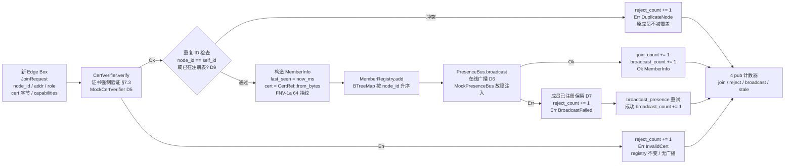
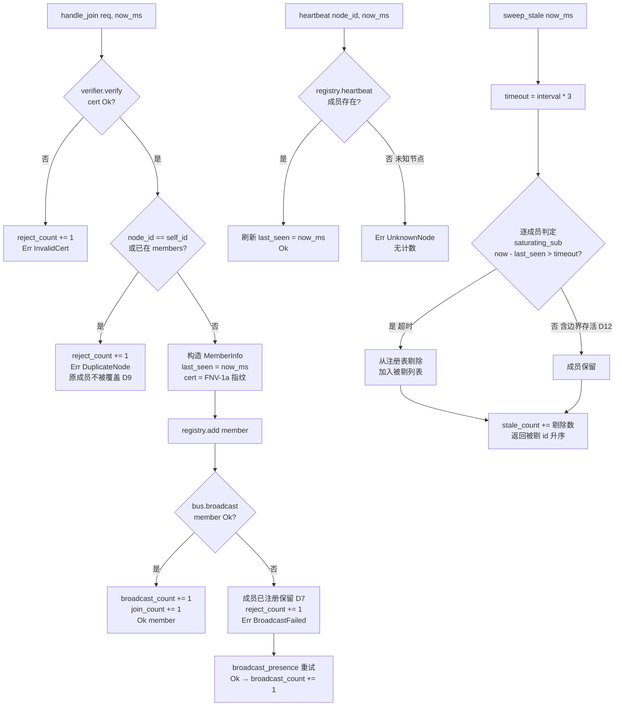

# EnerOS v0.97.0 Federation Discovery 联邦发现协议设计文档

> **版本**：v0.97.0
> **蓝图**：phase2.md §v0.97.0
> **Crate**：`eneros-federation`（`crates/agents/federation/`，新建）

---

## 1. 版本目标

实现**联邦发现协议**（**Phase 2 P2-E 起点，多机联邦发现层**），交付三大能力：

- **新 Edge Box 自动加入联邦**：新节点持有效证书发起 `JoinRequest`（node_id / addr / role / cert 字节 / capabilities），经 `CertVerifier.verify` 证书强制验证 → 重复 ID 确定性拒绝（含与 self_id 冲突，`DuplicateNode`）→ `MemberRegistry.add` 注册 → `PresenceBus.broadcast` 向联邦广播在线信息；广播失败时**成员保留**在注册表（注册与广播解耦，D7），可经 `broadcast_presence` 重试；
- **心跳保活**：成员周期上报心跳刷新 `last_seen = now_ms`；未知节点心跳返回 `Err(UnknownNode)` 显式暴露；
- **超时剔除**：`sweep_stale` 以 `heartbeat_interval_ms * 3` 为超时阈值（蓝图 §4.5 `* 3`），严格大于判定（`now_ms - last_seen > timeout_ms`，**边界存活**，D12）；时差用 `saturating_sub` 防时钟回拨下溢；返回被剔 node_id 升序列表，`stale_count` 累计可观测。

辅助能力：

- **故障注入测试设施**：`MockCertVerifier`（accept 开关 + verify_count 调用计数）/ `MockPresenceBus`（前 N 次广播失败后成功 + broadcasts 记录）；PKI v0.32.0 证书适配器与 DDS v0.78.0 总线适配器后续以 `Box<dyn>` 注入（D5/D6）；
- **可观测计数器**：`FederationDiscovery` 4 个 pub 计数器 `join_count` / `reject_count` / `broadcast_count` / `stale_count` 全程留痕（蓝图 §9）；
- **确定性成员视图**：`MemberRegistry` 基于 `BTreeMap<u64, MemberInfo>`，`list()` 与剔除结果天然按 node_id 升序，可重放审计。

**业务价值**：v0.96.0 完成 P2-D 收官（云边协同闭环），但联邦仍为静态拓扑——新 Edge Box 上线需人工登记成员表。本版本实现联邦**即插即用动态扩展**：持证节点自动加入、故障节点自动剔除，成员拓扑实时收敛，为多机联邦全部后续能力（跨域通信、共识选举、VPP 多机协同）提供成员基础。

**Phase 定位**：P2-E 起点；**下游解锁 v0.98.0 跨域通信通道（gRPC + mTLS）与 VPP 多机协同**。

**性能目标**（蓝图 §7.2）：发现延迟 < 5s —— **集成阶段验收**，本版本交付算法骨架 + Mock 单元验证（真实证书/总线适配器注入后由集成阶段实测验收）。

---

## 2. 前置依赖

- **v0.96.0 数据汇聚**（前序版本，P2-D 收官）：云边协同闭环完成（云 → 边策略下发 + 边 → 云数据上行），联邦进入多机扩展阶段，为本版本提供工程基座；
- 蓝图 `phase2.md` v0.97.0 章节（9 节版本模板，§4.3 加入流程 / §4.4 心跳超时 / §4.5 剔除代码为落地依据）；
- **零依赖 crate**：`Cargo.toml` 无任何依赖——仅 `core` / `alloc`；`core::net::IpAddr` 为 Rust core 原生 no_std 支持（D4）；证书验证与广播总线以本地 trait 抽象注入（D5/D6）；
- **无新第三方依赖**：SBOM 零新增（D11）；
- **后续注入**：PKI v0.32.0 证书链验证适配器（实现 `CertVerifier`）与 DDS v0.78.0 总线适配器（实现 `PresenceBus`）后续版本注入，本版本零改动对接。

**下游解锁**：v0.98.0 跨域通信通道（成员拓扑 + 证书体系为 mTLS 通道建立前提）/ VPP 多机协同（联邦成员为跨机聚合对象）。

---

## 3. 交付物清单

- `crates/agents/federation/src/membership.rs` — **新增**：`NodeRole`（3 变体）/ `CertRef`（FNV-1a 64 指纹）/ `MemberInfo` / `JoinRequest` / `MemberRegistry`（add / remove / heartbeat / remove_stale / list，BTreeMap 升序）
- `crates/agents/federation/src/discovery.rs` — **新增**：`FedError`（4 变体）+ `CertVerifier` trait（sync，D5）+ `PresenceBus` trait（sync，D6）+ `MockCertVerifier` / `MockPresenceBus` 故障注入 + `FederationDiscovery`（handle_join / broadcast_presence / heartbeat / sweep_stale + 4 pub 计数器）
- `crates/agents/federation/src/lib.rs` — **新增**：no_std crate 文档（D1~D12 偏差表）+ 重导出 11 项
- `crates/agents/federation/Cargo.toml` — **新增**：零依赖（core/alloc only，D11）
- 根 `Cargo.toml` members 追加 `"crates/agents/federation"`（既有成员零改动）
- `configs/federation.toml` — 联邦发现配置模板（`[federation]` heartbeat_interval_ms / stale_multiplier / max_members + 中文注释 6 点）
- `docs/agents/federation-discovery-design.md` — 本设计文档
- **40 个单元测试** T1~T40（src 内嵌），含 join→broadcast→heartbeat→stale 全链路、重复 ID 拒绝、证书拒绝、Mock 故障注入
- 根目录 4 文件版本同步 0.96.0 → 0.97.0（`Cargo.toml` / `Makefile` / `ci.yml` / `gate.rs` 注释）
- **无 BREAKING**：既有全部 crate 零改动

---

## 4. 详细设计

### 4.0 新 Edge Box 自动加入联邦数据流



### 4.1 NodeRole（3 变体，D7）

| 变体 | 说明 |
|------|------|
| `EdgeBox`（`#[default]`） | 边缘盒子（默认角色） |
| `EdgeCoordinator` | 边缘协调器（v0.92.0~v0.94.0 域内仲裁节点亦需加入联邦） |
| `CloudCoordinator` | 云端协调器（v0.95.0 云端节点亦需加入联邦） |

派生：`Debug, Clone, Copy, PartialEq, Eq, Default`。

### 4.2 CertRef（证书引用，D5）

| 字段 | 类型 | 说明 |
|------|------|------|
| `fingerprint` | `u64` | 证书内容的 FNV-1a 64 指纹（确定性折叠，**无密码学语义，仅标识**；真实证书链验证由 `CertVerifier` 承担） |

派生：`Debug, Clone, Copy, PartialEq, Eq, Default`。

`CertRef::from_bytes(cert: &[u8]) -> CertRef`：逐字节 `f ^= b; f = f.wrapping_mul(FNV_PRIME)`，初值 `FNV_OFFSET_BASIS = 14695981039346656037`，质数 `FNV_PRIME = 1099511628211`；空切片指纹 == offset basis。

### 4.3 MemberInfo（成员信息）

| 字段 | 类型 | 说明 |
|------|------|------|
| `node_id` | `u64` | 节点标识（D2：无堆字符串 + 确定性） |
| `addr` | `core::net::IpAddr` | 节点网络地址（D4：core 原生 no_std，JoinRequest 显式携带，不臆造 ID→地址映射） |
| `role` | `NodeRole` | 节点角色（D7：请求携带，非硬编码 EdgeBox） |
| `capabilities` | `Vec<u64>` | 能力标签集合（D2：能力码 u64，配置定义语义，§8.4 多版本节点协商） |
| `last_seen` | `u64` | 最后一次心跳/见到的时间（ms，外部注入） |
| `cert` | `CertRef` | 证书引用（FNV-1a 指纹） |

派生：`Debug, Clone, PartialEq`。

### 4.4 JoinRequest（加入请求，D7）

| 字段 | 类型 | 说明 |
|------|------|------|
| `node_id` | `u64` | 节点标识 |
| `addr` | `IpAddr` | 节点网络地址（显式携带，D4） |
| `role` | `NodeRole` | 节点角色（**蓝图无此字段、handle_join 硬编码 EdgeBox → 增加 role 字段**，D7） |
| `cert` | `Vec<u8>` | 证书原始字节（喂给 `CertVerifier.verify` 与 `CertRef::from_bytes`） |
| `capabilities` | `Vec<u64>` | 能力标签集合 |

派生：`Debug, Clone, PartialEq`。

### 4.5 MemberRegistry（成员注册表，D2/D8/D12）

| 字段 | 类型 | 说明 |
|------|------|------|
| `members` | `BTreeMap<u64, MemberInfo>` | 成员表（key 为 node_id，BTreeMap 遍历天然升序，D2/D4） |
| `self_id` | `u64` | 本节点 id（重复检查基准） |

字段全 pub。方法：

| 方法 | 语义 |
|------|------|
| `new(self_id) -> Self` | 创建空注册表 |
| `add(&mut self, m: MemberInfo)` | 添加成员；同 id 覆盖 |
| `remove(&mut self, node_id) -> bool` | 移除成员；存在并移除返回 true |
| `heartbeat(&mut self, node_id, now_ms) -> bool` | 成员存在 → 刷新 last_seen 返 true；不存在 → false |
| `remove_stale(&mut self, timeout_ms, now_ms) -> Vec<u64>` | 剔除 `now_ms.saturating_sub(last_seen) > timeout_ms` 成员（严格大于，**边界存活** D12；saturating_sub 防时钟回拨下溢 D12）；返回被剔 id **升序** |
| `list(&self) -> Vec<MemberInfo>` | 按 node_id 升序返回全部成员克隆 |

派生：`Debug, Clone`。

### 4.6 FedError（4 变体，D10）

| 变体 | 触发条件 |
|------|---------|
| `InvalidCert` | 证书验证失败（`CertVerifier.verify` 返回 Err） |
| `DuplicateNode` | 节点 id 重复（含与 self_id 冲突，D9 确定性拒绝） |
| `UnknownNode` | 未知节点（心跳目标不在注册表中） |
| `BroadcastFailed` | 广播失败（`PresenceBus.broadcast` 返回 Err） |

派生：`Debug, Clone, Copy, PartialEq, Eq`。4 变体最小完备：证书 / 冲突 / 心跳未知节点 / 广播失败。

### 4.7 CertVerifier / PresenceBus trait（D5/D6）

```rust
pub trait CertVerifier {
    fn verify(&mut self, cert: &[u8]) -> Result<(), FedError>;
}

pub trait PresenceBus {
    fn broadcast(&mut self, member: &MemberInfo) -> Result<(), FedError>;
}
```

- sync trait（D3/D5/D6：no_std 无 async runtime，项目硬规则禁止 async）；不要求 `Send + Sync`（单分区单线程模型，调度由上层 Agent Runtime 保证，D6）；
- **接口契约先行，防重复造轮子**（§5.5）：PKI v0.32.0 证书链验证适配器后续以 `Box<dyn CertVerifier>` 注入；DDS v0.78.0 总线适配器后续以 `Box<dyn PresenceBus>` 注入——本版本 membership/discovery 层零改动对接。

### 4.8 MockCertVerifier / MockPresenceBus（故障注入）

**MockCertVerifier**（Debug + Clone）：

| 字段 | 类型 | 说明 |
|------|------|------|
| `accept` | `bool` | true 放行，false 拒绝（`Err(InvalidCert)`） |
| `verify_count` | `u64` | verify 调用次数（pub 可观测） |

`MockCertVerifier::new(accept: bool) -> Self`：verify_count 初始为 0。

**MockPresenceBus**（Debug + Clone）：

| 字段 | 类型 | 说明 |
|------|------|------|
| `broadcasts` | `Vec<MemberInfo>` | 已成功广播的成员记录（按广播顺序） |
| `fail_times` | `u32` | 剩余应失败次数（>0 时 broadcast 递减并 `Err(BroadcastFailed)`） |

`MockPresenceBus::new(fail_times: u32) -> Self`：broadcasts 初始为空。前 N 次失败后成功（断网恢复故障注入）。

### 4.9 FederationDiscovery（发现协调器）

| 字段 | 类型 | 说明 |
|------|------|------|
| `registry` | `MemberRegistry` | 成员注册表 |
| `verifier` | `Box<dyn CertVerifier>` | 注入证书验证器（Mock / PKI 适配器） |
| `bus` | `Box<dyn PresenceBus>` | 注入广播总线（Mock / DDS 适配器） |
| `heartbeat_interval_ms` | `u64` | 心跳间隔（ms）；超时阈值为 `heartbeat_interval_ms * 3`（蓝图 §4.5，D8/D12） |
| `join_count` | `u64` | 成功加入计数（pub 可观测，§9） |
| `reject_count` | `u64` | 拒绝计数（证书拒绝 + 重复拒绝 + 广播失败，pub 可观测） |
| `broadcast_count` | `u64` | 成功广播计数（pub 可观测） |
| `stale_count` | `u64` | 累计剔除计数（pub 可观测，"标记离线"可观测化 D8） |

字段全 pub（v0.95.0 D9 惯例：no_std 无 log crate，metric 全部字段化本地可查）。

### 4.10 handle_join / heartbeat / sweep_stale 决策流程



- `handle_join(&mut self, req: JoinRequest, now_ms: u64) -> Result<MemberInfo, FedError>`：证书验证 → 重复检查 → 注册 → 广播四段流水；任一失败路径 `reject_count += 1` 且**错误显式返回**（拒绝是显式决策而非沉默失败）；
- `broadcast_presence(&mut self, member: &MemberInfo) -> Result<(), FedError>`：委托 bus，Ok → `broadcast_count += 1`（广播失败后的补救通道，D7）；
- `heartbeat(&mut self, node_id: u64, now_ms: u64) -> Result<(), FedError>`：registry.heartbeat false → `Err(UnknownNode)`；
- `sweep_stale(&mut self, now_ms: u64) -> Vec<u64>`：`remove_stale(heartbeat_interval_ms * 3, now_ms)`，`stale_count += 剔除数`，返回被剔 id 升序。

---

## 5. 技术交底

### 5.1 为何 u64 替代 String（D2）

蓝图 `node_id: String` / `self_id: String` / `capabilities: Vec<String>` / `members: HashMap<String, _>` 落地为 `u64` / `Vec<u64>` / `BTreeMap<u64, MemberInfo>`：① no_std 环境下堆字符串引入额外分配与不确定性，u64 为固定 8 字节无堆值类型，Copy 语义零成本；② 确定性——node_id 作为 BTreeMap key 时整数比较序完全确定可重放（电力调度可复现审计要求）；③ 能力码 u64 由配置定义语义（§8.4 多版本节点协商）；④ 与 v0.87.0 D3 / v0.95.0 D2 项目惯例一致，标识符统一 u64。

### 5.2 为何 sync 替代 async（D3）

蓝图 `pub async fn start/handle_join/broadcast_presence/run` 与 `interval().tick().await` 落地为 sync 方法：no_std 环境**无 async runtime**（无 tokio / async-std，`core` 仅提供 `Future` 抽象而无执行器），项目硬规则禁止 async（v0.95.0 D3 惯例）。全部时间以 `now_ms: u64` / `*_ms: u64` 参数注入——不读系统时钟，便于测试与跨平台移植；`start`/`run` 不实现（无 ticker，集成阶段由调用方循环驱动 `heartbeat` / `sweep_stale`）。

### 5.3 core::net::IpAddr no_std 原生支持（D4）

蓝图 `addr: IpAddr`（std::net）落地为 `core::net::IpAddr`：Rust core 自 1.77 起原生提供 `IpAddr` / `Ipv4Addr` / `Ipv6Addr`，no_std 零代价无偏差。蓝图 `parse_addr(&node_id)` 未定义（臆造 ID→地址映射）→ 改为 `JoinRequest.addr: IpAddr` **显式携带**，节点自报地址，职责清晰。

### 5.4 CertVerifier / PresenceBus trait 接口先行防重复造轮子（D5/D6）

蓝图 `verify_cert(&req.cert)?` 全局函数与内部网络广播落地为两个 sync trait：① **接口契约先行**——本版本锁定 `verify(&mut self, cert: &[u8]) -> Result<(), FedError>` 与 `broadcast(&mut self, member: &MemberInfo) -> Result<(), FedError>` 签名，PKI v0.32.0 证书链适配器与 DDS v0.78.0 总线适配器后续以 `Box<dyn>` 注入，membership/discovery 层零改动（§5.5 默认集成清单：证书用国密/PKI 硬件加速、总线用 Cyclone DDS，禁止自研重复造轮子）；② Mock 故障注入（accept 开关 / fail_times 递减）支撑 40 测试全分支覆盖；③ `CertRef { fingerprint: u64 }` 为 cert 字节确定性折叠（FNV-1a 64），**无密码学语义仅标识**——真实验证由 CertVerifier 承担，职责分离。

### 5.5 JoinRequest 增加 role 字段（D7）

蓝图 `JoinRequest` 无 role、`handle_join` 硬编码 `role: NodeRole::EdgeBox`：EdgeCoordinator（v0.92.0 域内仲裁）与 CloudCoordinator（v0.95.0 云端）节点亦需加入联邦，硬编码 EdgeBox 使多角色联邦拓扑不可能。落地为 `JoinRequest.role: NodeRole` 显式携带（默认 EdgeBox），三角色混布由 T39 测试锁定。

### 5.6 删除语义 vs 标记离线（D8）

蓝图 §4.4 文字"心跳超时 → 标记离线"与 §4.5 代码 `remove_stale` 删除并存：**采用删除语义（蓝图代码权威）**——`remove_stale(timeout_ms, now_ms) -> Vec<u64>` 返回被剔 id 并从注册表移除；`FederationDiscovery::sweep_stale` 累加 `stale_count` 计数器实现"标记"可观测（被剔事件全程留痕，被剔 id 升序返回可供上层审计/告警）。不引入 online 标志位（Karpathy 最简：状态即存在性，无冗余标志）。

### 5.7 节点 ID 冲突确定性拒绝（D9）

蓝图 §8.5 坑点"节点 ID 冲突"未定义行为。落地为**确定性拒绝**：`handle_join` 时 node_id 已存在（含 == self_id）→ `Err(FedError::DuplicateNode)`，`reject_count += 1`，**原成员不被覆盖**（T25/T26 锁定）。冲突显式暴露而非沉默覆盖——ID 分配唯一性由部署侧保证（证书绑定 node_id，PKI 适配器注入后强制），运行期冲突即部署事故，必须显式拒绝留痕。

### 5.8 FNV-1a 指纹折叠无密码学语义仅标识

`CertRef::from_bytes` 采用 FNV-1a 64（offset basis `14695981039346656037` / prime `1099511628211`，逐字节异或后乘质数，wrapping 溢出回绕）：① 确定性——同字节序列恒同指纹，可重放；② 零依赖——core 内手工折叠，无需哈希 crate（SBOM 零新增）；③ **明确声明无密码学语义**——指纹仅作证书内容标识（同一性判等、审计留痕），不防伪不抗碰撞；真实证书链验证（签名/有效期/信任链）由 `CertVerifier` 适配器承担（PKI v0.32.0 后续注入），职责分离。

---

## 6. 测试计划

40 个单元测试 T1~T40（src 内嵌，v0.87.0~v0.96.0 项目惯例，不新增 tests/ 文件，D11）：

| 分组 | 编号 | 覆盖点 |
|------|------|--------|
| membership 数据结构（T1~T6） | T1~T6 | NodeRole Default==EdgeBox、三变体互不等、Copy/Eq；CertRef Default fingerprint==0、Copy/Eq；MemberInfo 字段回显、Clone 独立性、PartialEq；JoinRequest 字段回显、Clone 独立性；CertRef::from_bytes 确定性（同字节同指纹、异字节异指纹）；空切片==offset basis、单字节折叠符合 FNV-1a 手工计算 |
| membership 注册表（T7~T12） | T7~T12 | new 空注册表、add 后 list 含成员、**同 id 覆盖**；add id 2、1 后 list() 按 node_id 升序；heartbeat 存在成员 → true 且 last_seen 刷新；heartbeat(99) → false；remove_stale **边界存活**（`9000 > 9000` 不成立 → 保留，D12）；remove_stale 剔除（`9001 > 9000` → 剔除）+ 多成员混合剔除返回**升序** |
| discovery 错误与 Mock（T13~T18） | T13~T18 | FedError 四变体互不等、Copy/Eq；MockCertVerifier accept=true → Ok、verify_count==1；accept=false → Err(InvalidCert)、verify_count 累加；MockPresenceBus fail_times=0 → Ok 入 broadcasts；fail_times=2 → 前 2 次 Err 第 3 次 Ok（故障恢复）；Mock 可作 `Box<dyn CertVerifier>` / `Box<dyn PresenceBus>` 多态注入 |
| discovery handle_join（T19~T29） | T19~T29 | new 初始状态（registry 空、self_id、4 计数器全零）；join 成功字段与请求一致（node_id/addr/role/capabilities/last_seen）；cert 指纹正确 + registry 含成员 + join/broadcast 计数器；bus 收到内容一致的 member（RecordingBus 回读）；verifier 拒绝 → Err(InvalidCert)、reject==1、registry 空、无广播；拒绝后改 accept 重试成功（无残留状态）；同 node_id 再次 join → Err(DuplicateNode)、**原成员不被覆盖**；node_id==self_id → Err(DuplicateNode)；reject_count 多次累计（D9）；bus fail_times=1 → Err(BroadcastFailed)、**成员已注册保留**、join_count 不加（D7）；broadcast_presence 重试成功 → broadcast_count+=1 |
| discovery 心跳与剔除（T30~T35） | T30~T35 | heartbeat 存在成员 → Ok、last_seen 刷新；heartbeat 未知节点 → Err(UnknownNode)；sweep_stale 边界保留（timeout=9000，`10000-1000=9000 > 9000` 不成立，D12）；sweep_stale 剔除（sweep(10_001) → 返回 [id]、stale_count==1）；剔除后 heartbeat → Err(UnknownNode)；多成员混合（1 超时 1 存活）仅剔超时者、返回升序、stale_count 跨次累计 |
| 全链路集成（T36~T40） | T36~T40 | **T36** join(A,1000) → heartbeat(A,2000) → join(B,3000) → sweep(12_000)：A 超时剔除、B 边界存活（`9000 > 9000` 不成立）；**T37** join → 断网（bus 故障）→ broadcast_presence 恢复 → heartbeat 正常（端到端故障恢复）；**T38** 3 节点乱序加入 list 升序、中间节点剔除后剩余仍升序；**T39** 多角色混布（EdgeBox/EdgeCoordinator/CloudCoordinator）role 各自回显（D7）；**T40** 计数器综合断言：混合 join/证书拒绝/重复拒绝/心跳未知/broadcast_presence/sweep 后 4 计数器精确等于预期值（join=3/reject=2/broadcast=4/stale=3） |

性能目标（发现延迟 < 5s，蓝图 §7.2）标注：**集成阶段验收，本版本交付算法骨架 + Mock 单元验证**。

**GPU 规则说明（蓝图 §6.6）**：本版本为纯标量 CPU 计算（指纹折叠 / 注册表查找 / 超时判定 / 计数器累加），无张量操作，**不涉及 GPU**。

---

## 7. 验收标准

- **功能**：新 Edge Box 持证自动加入联邦全流程正确（证书验证 → 重复拒绝 → 注册 → 广播，蓝图 §4.3）；心跳保活刷新 last_seen；超时剔除严格大于边界存活、被剔 id 升序（§4.4/§4.5，D12）；广播失败成员保留可重试（D7）；4 个 pub 计数器留痕（§9）；
- **测试**：**40 个测试通过**（`cargo test -p eneros-federation`，T1~T40）；下游回归零破坏（既有全部 crate 零改动，无 BREAKING）；
- **交叉编译**：`aarch64-unknown-none` 交叉编译通过（no_std + alloc，零依赖 crate）；
- **质量**：`cargo fmt --check` / `cargo clippy -D warnings` / `cargo deny check` 全过，0 warning；
- **性能**：发现延迟 < 5s（蓝图 §7.2）——**集成阶段验收**，本版本交付算法骨架 + Mock 单元验证（PKI/DDS 适配器注入后实测）；
- **文档**：本设计文档 + `configs/federation.toml` 配置模板（中文注释 6 点）；
- **出口**：P2-E 起点达成，解锁 v0.98.0 跨域通信通道 / VPP 多机协同。

---

## 8. 风险

| 风险 | 说明 | 缓解 |
|------|------|------|
| Mock 抽象无真实证书/总线 | 本版本 `CertVerifier` / `PresenceBus` 仅有 Mock 实现，无真实证书链验证与网络广播 | **接口契约先行**（D5/D6）：PKI v0.32.0 证书适配器与 DDS v0.78.0 总线适配器后续以 `Box<dyn>` 注入，membership/discovery 层零改动；发现延迟 <5s 列入**集成阶段验收** |
| 指纹折叠非密码学哈希 | FNV-1a 仅确定性标识，不防伪不抗碰撞——恶意节点可伪造同指纹证书字节 | **职责分离**（D5）：指纹仅作同一性标识/审计留痕；真实证书链验证（签名/有效期/信任链）由 `CertVerifier` 适配器承担（PKI v0.32.0 注入后强制，蓝图 §7.3 证书验证强制）；handle_join 先 verify 后注册，伪造证书无法过 verify 关 |
| ID 冲突拒绝策略依赖部署侧分配唯一性 | `DuplicateNode` 确定性拒绝（D9）假设 node_id 分配唯一；部署错误（两节点同 id）将导致后者恒被拒 | 冲突**显式暴露**而非沉默覆盖（reject_count 留痕可告警）；PKI 适配器注入后证书与 node_id 绑定，签发侧强制唯一；T25/T26 锁定拒绝语义 |
| start/run 主循环未实现 | 无 async ticker，heartbeat/sweep_stale 需调用方周期驱动 | D3 显式取舍：no_std 无 runtime，集成阶段由 Agent Runtime 调度循环驱动；全部时间 `now_ms` 注入，驱动节奏由调用方掌控 |
| 内存（蓝图 §43.6） | BTreeMap 成员表 + capabilities Vec + broadcasts 记录堆分配 | Agent Runtime 分区 ≤ 64MB 预算内；成员上限 `max_members = 64`（configs/federation.toml）约束规模；发现为低频管理面操作（非 10ms 控制路径） |

---

## 9. 多角度要求

- **安全**（蓝图 §7.3/§8.5）：证书**强制验证**（handle_join 第一关 verify，拒绝即 `Err(InvalidCert)` + reject_count 留痕，宁拒勿放）；节点 ID 冲突**确定性拒绝显式暴露**（D9：DuplicateNode 不覆盖不更新，冲突即部署事故必须留痕）；证书指纹职责分离（标识 ≠ 验证，真实链路由 CertVerifier 承担）；
- **可观测**（蓝图 §9）：4 个 pub 计数器 `join_count` / `reject_count` / `broadcast_count` / `stale_count`（加入/拒绝/广播/剔除全覆盖）+ 被剔 id 升序返回可供审计；no_std 无 log crate，metric 全部字段化本地可查；
- **确定性**：u64 标识符（D2）+ BTreeMap 注册表（遍历天然升序）→ list/剔除结果完全可重放；超时判定**严格大于边界存活**（D12：等值不剔，避免边界抖动误剔）；`saturating_sub` 防时钟回拨下溢（D12）；全 u64 时间无 f32 参与判定、无 NaN 风险；全链路无随机源；
- **可扩展**（§5.5）：`CertVerifier` / `PresenceBus` trait 注入式适配（Mock → PKI v0.32.0 → DDS v0.78.0 平滑替换，membership/discovery 层零改动）；`capabilities: Vec<u64>` 能力码协商支撑 §8.4 多版本节点混布；`NodeRole` 枚举加变体即可扩展新角色；
- **可靠**：注册与广播解耦（D7：广播失败成员保留，`broadcast_presence` 重试补救，部分故障不丢成员）；心跳/剔除状态机闭环（加入 → 保活 → 超时剔除 → 再加入无残留，T24/T34 锁定）；
- **no_std**：零依赖 crate——`core` / `alloc` only（`core::net::IpAddr` / `alloc::collections::BTreeMap` / `alloc::vec::Vec` / `alloc::boxed::Box`），禁止 `std::*`（蓝图 §43.1 硬性要求）；aarch64-unknown-none 交叉编译友好，SBOM 零新增（D11）。

---

## 10. 接口契约

pub 项签名清单（与 spec.md ADDED Requirements 一致）：

```rust
// ===== membership.rs =====

/// 联邦节点角色（默认 EdgeBox），Debug + Clone + Copy + PartialEq + Eq + Default
pub enum NodeRole {
    #[default]
    EdgeBox,
    EdgeCoordinator,
    CloudCoordinator,
}

/// 证书引用：仅作确定性标识，无密码学语义，
/// Debug + Clone + Copy + PartialEq + Eq + Default
pub struct CertRef {
    pub fingerprint: u64,
}

impl CertRef {
    /// 对证书字节做 FNV-1a 64 确定性折叠，生成指纹
    pub fn from_bytes(cert: &[u8]) -> CertRef;
}

/// 联邦成员信息，Debug + Clone + PartialEq
pub struct MemberInfo {
    pub node_id: u64,
    pub addr: IpAddr,
    pub role: NodeRole,
    pub capabilities: Vec<u64>,
    pub last_seen: u64,
    pub cert: CertRef,
}

/// 加入联邦请求（D7：显式携带 role），Debug + Clone + PartialEq
pub struct JoinRequest {
    pub node_id: u64,
    pub addr: IpAddr,
    pub role: NodeRole,
    pub cert: Vec<u8>,
    pub capabilities: Vec<u64>,
}

/// 成员注册表（字段全 pub，BTreeMap 遍历天然按 node_id 升序），Debug + Clone
pub struct MemberRegistry {
    pub members: BTreeMap<u64, MemberInfo>,
    pub self_id: u64,
}

impl MemberRegistry {
    /// 创建空注册表
    pub fn new(self_id: u64) -> Self;
    /// 添加成员；同 id 覆盖
    pub fn add(&mut self, m: MemberInfo);
    /// 移除成员；存在并移除返回 true
    pub fn remove(&mut self, node_id: u64) -> bool;
    /// 心跳：成员存在则刷新 last_seen 为 now_ms 并返回 true，否则返回 false
    pub fn heartbeat(&mut self, node_id: u64, now_ms: u64) -> bool;
    /// 剔除超时成员：now_ms.saturating_sub(last_seen) > timeout_ms
    /// （严格大于，边界存活；saturating_sub 防时钟回拨下溢），返回被剔 id 升序
    pub fn remove_stale(&mut self, timeout_ms: u64, now_ms: u64) -> Vec<u64>;
    /// 按 node_id 升序返回全部成员克隆
    pub fn list(&self) -> Vec<MemberInfo>;
}

// ===== discovery.rs =====

/// 联邦发现错误（4 变体最小完备），Debug + Clone + Copy + PartialEq + Eq
pub enum FedError {
    InvalidCert,
    DuplicateNode,
    UnknownNode,
    BroadcastFailed,
}

/// 证书验证器（sync，无 Send+Sync 约束，D5）
pub trait CertVerifier {
    /// 验证证书字节；通过返回 Ok(())，否则返回 Err(FedError)
    fn verify(&mut self, cert: &[u8]) -> Result<(), FedError>;
}

/// 在线广播总线（sync，无 Send+Sync 约束，D6）
pub trait PresenceBus {
    /// 向联邦广播成员在线信息
    fn broadcast(&mut self, member: &MemberInfo) -> Result<(), FedError>;
}

/// Mock 证书验证器：按 accept 开关放行/拒绝，Debug + Clone
pub struct MockCertVerifier {
    pub accept: bool,
    pub verify_count: u64,
}

impl MockCertVerifier {
    /// 创建 Mock 验证器，verify_count 初始为 0
    pub fn new(accept: bool) -> Self;
}

impl CertVerifier for MockCertVerifier {
    fn verify(&mut self, _cert: &[u8]) -> Result<(), FedError>;
}

/// Mock 广播总线：前 fail_times 次广播失败，之后成功并记录，Debug + Clone
pub struct MockPresenceBus {
    pub broadcasts: Vec<MemberInfo>,
    pub fail_times: u32,
}

impl MockPresenceBus {
    /// 创建 Mock 总线，fail_times 为前几次广播应失败次数，broadcasts 初始为空
    pub fn new(fail_times: u32) -> Self;
}

impl PresenceBus for MockPresenceBus {
    fn broadcast(&mut self, member: &MemberInfo) -> Result<(), FedError>;
}

/// 联邦发现协调器（字段全 pub：registry + 2 个 Box<dyn> + 间隔 + 4 计数器）
pub struct FederationDiscovery {
    pub registry: MemberRegistry,
    pub verifier: Box<dyn CertVerifier>,
    pub bus: Box<dyn PresenceBus>,
    pub heartbeat_interval_ms: u64,
    pub join_count: u64,
    pub reject_count: u64,
    pub broadcast_count: u64,
    pub stale_count: u64,
}

impl FederationDiscovery {
    /// 创建发现协调器：registry 为空，4 个计数器全零
    pub fn new(
        self_id: u64,
        verifier: Box<dyn CertVerifier>,
        bus: Box<dyn PresenceBus>,
        heartbeat_interval_ms: u64,
    ) -> Self;
    /// 处理加入请求：证书验证 → 重复检查 → 注册 → 广播；
    /// 广播失败成员已注册保留（D7），可经 broadcast_presence 重试
    pub fn handle_join(&mut self, req: JoinRequest, now_ms: u64) -> Result<MemberInfo, FedError>;
    /// 广播指定成员在线信息；成功计入 broadcast_count
    pub fn broadcast_presence(&mut self, member: &MemberInfo) -> Result<(), FedError>;
    /// 心跳：成员存在刷新 last_seen，未知节点返回 Err(UnknownNode)
    pub fn heartbeat(&mut self, node_id: u64, now_ms: u64) -> Result<(), FedError>;
    /// 剔除超时成员（阈值 = heartbeat_interval_ms * 3），
    /// stale_count += 剔除数，返回被剔 id 升序
    pub fn sweep_stale(&mut self, now_ms: u64) -> Vec<u64>;
}
```

`lib.rs` 重导出（11 项）：

```rust
pub mod discovery;
pub mod membership;

pub use discovery::{
    CertVerifier, FedError, FederationDiscovery, MockCertVerifier, MockPresenceBus, PresenceBus,
};
pub use membership::{CertRef, JoinRequest, MemberInfo, MemberRegistry, NodeRole};
```

**计数器语义**：`join_count` 仅 handle_join 全链路成功（注册+广播均 Ok）时 +1；`reject_count` 证书拒绝 / 重复拒绝 / 广播失败各 +1（可累计）；`broadcast_count` handle_join 广播成功或 broadcast_presence 成功时 +1；`stale_count` sweep_stale 按实际剔除数累计。

---

## 11. 偏差声明

| 偏差 | 蓝图原文 | 本版本处理 |
|------|---------|-----------|
| **D1** | crate 路径 `crates/federation/`；文档 `docs/phase2/federation_discovery.md` | `crates/agents/federation/` + `docs/agents/federation-discovery-design.md`（项目 §2.3.1/§2.3.3 硬规则；联邦为 Agent 级协调归 agents 子系统） |
| **D2** | `node_id: String` / `self_id: String` / `capabilities: Vec<String>` / `members: HashMap<String, _>` | 全部 `u64` / `Vec<u64>`（能力码 u64，配置定义语义）/ `BTreeMap<u64, MemberInfo>`（无堆字符串 + 确定性，v0.95.0 D2 惯例） |
| **D3** | `pub async fn start/handle_join/broadcast_presence/run`；`Duration` / `interval().tick().await` | sync 方法（no_std 无 async runtime，v0.95.0 D3 惯例）；全部时间以 `now_ms: u64` / `*_ms: u64` 参数注入；`start`/`run` 不实现（无 ticker，集成阶段调用方循环驱动） |
| **D4** | `addr: IpAddr`（std::net） | `core::net::IpAddr`（Rust core 原生支持 no_std，无偏差代价）；`parse_addr(&node_id)` 蓝图未定义 → 改为 `JoinRequest.addr: IpAddr` 显式携带（不臆造 ID→地址映射） |
| **D5** | `verify_cert(&req.cert)?` 全局函数；`CertRef::from(&req.cert)` | `CertVerifier` sync trait（`verify(&mut self, cert: &[u8]) -> Result<(), FedError>`）+ `MockCertVerifier` 故障注入（接口先行；PKI v0.32.0 适配器后续注入 `Box<dyn CertVerifier>`，§5.5 防重复造轮子）；`CertRef { fingerprint: u64 }`（cert 字节确定性折叠，无密码学语义，仅标识） |
| **D6** | `broadcast_presence` 为内部网络广播 | `PresenceBus` sync trait（`broadcast(&mut self, member: &MemberInfo) -> Result<(), FedError>`）+ `MockPresenceBus`（记录广播 + 故障注入；v0.95.0 D8 CloudChannel 模式；DDS v0.78.0 适配器后续注入） |
| **D7** | `JoinRequest` 无 role；`handle_join` 硬编码 `role: NodeRole::EdgeBox` | `JoinRequest` 增加 `role: NodeRole` 字段（EdgeCoordinator/CloudCoordinator 节点亦需加入联邦；默认 EdgeBox） |
| **D8** | §4.4"心跳超时 → 标记离线"；§4.5 代码 `remove_stale` 删除 | 采用删除语义（蓝图代码权威）：`MemberRegistry::remove_stale(timeout_ms, now_ms) -> Vec<u64>` 返回被剔除 id；`FederationDiscovery::sweep_stale` 累加 `stale_count` 计数器实现"标记"可观测（不引入 online 标志位，Karpathy 最简） |
| **D9** | §8.5 坑点"节点 ID 冲突"未定义行为 | 确定性拒绝：`handle_join` 时 node_id 已存在 → `Err(FedError::DuplicateNode)`（不覆盖不更新，冲突显式暴露） |
| **D10** | 蓝图未定义 `FedError` | `FedError { InvalidCert, DuplicateNode, UnknownNode, BroadcastFailed }`（4 变体最小完备：证书/冲突/心跳未知节点/广播失败） |
| **D11** | 测试 `tests/discovery.rs` | crate 内嵌 `#[cfg(test)]` 40 测试（v0.87.0~v0.96.0 项目惯例；集成场景以 Mock 故障注入覆盖） |
| **D12** | 蓝图未覆盖时间语义细节 | `last_seen = now_ms`（加入/心跳刷新）；stale 判定 `now_ms - last_seen > timeout_ms`（严格大于，边界存活）；`remove_stale` 默认 timeout = `heartbeat_interval_ms * 3`（蓝图 §4.5 `* 3`）；无 NaN 风险（全 u64 时间，无 f32 参与判定） |

---

## 12. 附录

### 相关文档

- [cloud-strategy-design.md](./cloud-strategy-design.md) — v0.95.0 Cloud Coordinator 策略下发设计文档（P2-D 云边协同，CloudChannel 模式为本版本 PresenceBus 参照）
- 源码路径：`../../crates/agents/federation/src/`（`membership.rs` / `discovery.rs` / `lib.rs`；crate 根：`crates/agents/federation/`）
- 配置模板：`../../configs/federation.toml`
- Spec：`.trae/specs/develop-v0970-federation-discovery/spec.md`
- 蓝图：`蓝图/phase2.md` §v0.97.0（P2-E 起点；§4.3 加入流程 / §4.4 心跳超时 / §4.5 剔除代码 / §7.2 发现延迟 <5s / §7.3 证书验证强制 / §8.4 多版本兼容 / §8.5 ID 冲突坑点 / §9 可观测）

### 关键文件路径

| 文件 | 用途 |
|------|------|
| `crates/agents/federation/Cargo.toml` | crate 清单（零依赖，core/alloc only） |
| `crates/agents/federation/src/lib.rs` | no_std crate 文档（D1~D12 偏差表）+ 重导出 11 项 |
| `crates/agents/federation/src/membership.rs` | NodeRole / CertRef / MemberInfo / JoinRequest / MemberRegistry + T1~T12 |
| `crates/agents/federation/src/discovery.rs` | FedError / CertVerifier / PresenceBus / Mock×2 / FederationDiscovery + T13~T40 |
| `configs/federation.toml` | 联邦发现配置模板（heartbeat_interval_ms / stale_multiplier / max_members） |
| `.trae/specs/develop-v0970-federation-discovery/spec.md` | 本版本 Spec（D1~D12 偏差声明全文） |

### 版本基线

- **Phase 定位**：Phase 2 多机联邦 P2-E 起点（前序 v0.96.0 数据汇聚 P2-D 收官）
- **下游解锁**：v0.98.0 跨域通信通道（gRPC + mTLS，成员拓扑 + 证书体系为前提）/ VPP 多机协同（联邦成员为跨机聚合对象）；v0.98.1 纵向加密（刚性子版本，真实证书链验证适配器注入点）
- **版本阶梯**：v0.92.0 域内仲裁 → v0.94.0 VPP 聚合 → v0.95.0 云边策略 → v0.96.0 数据汇聚 → **v0.97.0 联邦发现（本版本）** → v0.98.0 跨域通道

### 版本历史

| 版本 | 内容 | Crate |
|------|------|-------|
| v0.95.0 | Cloud Coordinator 策略下发（P2-D 第 4 版，云边协同起点） | `eneros-cloud-coordinator`（strategy / channel / publisher） |
| v0.96.0 | 数据汇聚（P2-D 收官，云边闭环） | `eneros-cloud-aggregator` |
| v0.97.0 | 联邦发现协议（P2-E 起点，多机联邦发现层，本版本） | `eneros-federation`（新建，membership / discovery） |
