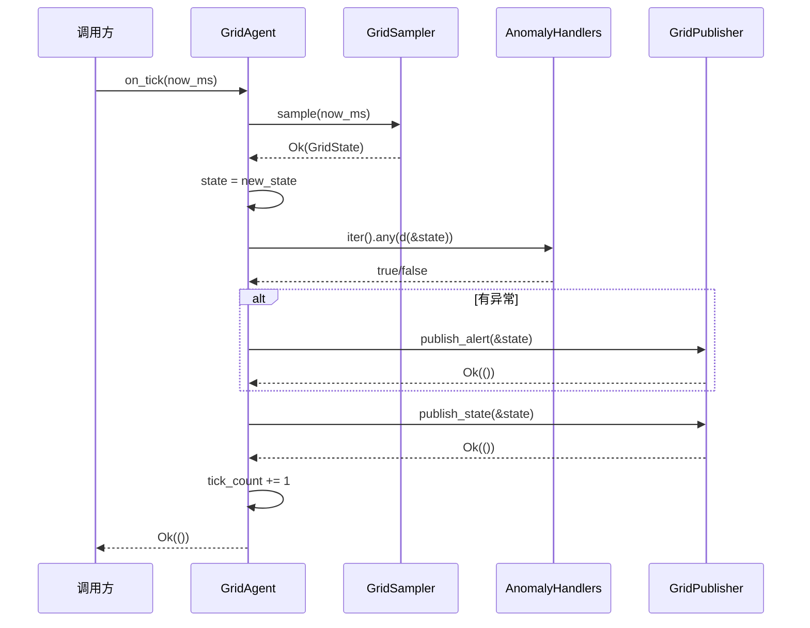
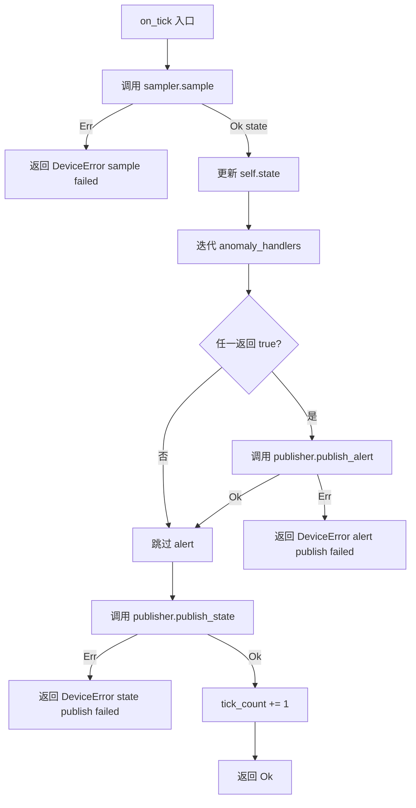

# EnerOS v0.82.0 Grid Agent 电网状态感知设计文档

> **版本**：v0.82.0
> **Phase**：Phase 2 多机联邦
> **子系统**：`crates/agents/grid_agent`（subsystem = agents）
> **蓝图依据**：`蓝图/phase2.md` §v0.82.0
> **状态**：设计中
> **最后更新**：2026-07-17

---

## 目录

1. [版本目标](#1-版本目标)
2. [前置依赖](#2-前置依赖)
3. [交付物清单](#3-交付物清单)
4. [数据结构](#4-数据结构)
5. [接口设计](#5-接口设计)
6. [错误处理](#6-错误处理)
7. [选型对比](#7-选型对比)
8. [实现路径](#8-实现路径)
9. [测试计划](#9-测试计划)
10. [验收标准](#10-验收标准)
11. [风险与坑点](#11-风险与坑点)
12. [偏差声明（D1~D14）](#12-偏差声明d1d14)

---

## 1. 版本目标

### 1.1 核心目标

v0.82.0 在 v0.73.0 device-agent 的 AgentRuntime 模式、v0.75.0~v0.78.0 Agent Bus DDS、v0.79.0 gPTP 时间同步、v0.80.0 TAS 调度整形与 v0.81.0 TSN 时延探针之上，进入 P2-C 子阶段（Agent 矩阵扩展）的起点，交付 **Grid Agent（电网状态感知 Agent）**：周期性采样电网频率、电压、电流、功率等关键量测，进行异常检测后将电网状态实时发布到 Agent Bus 的 `/power/state/grid` Topic，为后续并网点管理、并离网切换与 VPP 响应提供统一电网状态输入。

### 1.2 业务价值

| 业务价值 | 说明 |
|---------|------|
| **v0.83.0 并网点管理** | Grid Agent 发布的 `/power/state/grid` 为并网点功率/电压判定提供实时输入 |
| **v0.84.0 并离网切换** | 电网频率/电压越限检测是并离网切换决策的核心触发条件 |
| **v0.92.0 Edge Coordinator** | Edge Coordinator 联邦编排依赖本地 Grid Agent 的电网状态快照 |
| **VPP < 30s 响应** | 电网状态实时感知是 VPP 响应网络底座的输入源之一 |

### 1.3 Phase 定位

| 维度 | 定位 |
|------|------|
| Phase | Phase 2 多机联邦（v0.75.0~v0.126.0） |
| 子阶段 | P2-C Agent 矩阵扩展起点 |
| 平面 | 慢平面（Agent Runtime 分区，管理信息大区） |
| 角色 | 电网状态采集器 + 异常检测器 + 状态发布者 |
| 上游版本 | v0.51.0 协议抽象层 / v0.73.0 device-agent / v0.75.0~v0.78.0 Agent Bus DDS / v0.79.0 gPTP / v0.80.0 TAS / v0.81.0 TSN 时延探针 |

### 1.4 出口关联

本版本不构成 Phase 出口条件，但其交付物 `GridAgent` / `GridState` / `GridSampler` / `GridPublisher` 将被以下后续版本直接复用：

- **v0.83.0 并网点管理**：消费 `/power/state/grid` 进行并网点功率/电压判定
- **v0.84.0 并离网切换**：消费异常 alert 触发切换决策
- **v0.92.0 Edge Coordinator**：联邦级电网状态汇聚
- **VPP 响应基准**：电网状态实时感知为 VPP < 30s 响应提供输入

---

## 2. 前置依赖

### 2.1 前序版本依赖

| 版本 | 交付物 | 本版本使用方式 |
|------|--------|---------------|
| v0.51.0 | 协议抽象层（`PointAccess` trait） | 本版本不直接依赖；通过本地 `GridSampler` trait 抽象采样面（偏差 D7） |
| v0.73.0 | device-agent（`AgentRuntime` 模式参考） | `GridAgent` 沿用 `AgentRuntime` trait 实现 + `descriptor` / `state` / `tick_count` 字段模式（偏差 D6） |
| v0.75.0~v0.78.0 | Agent Bus DDS | 本版本不直接依赖；通过本地 `GridPublisher` trait 抽象发布面（偏差 D8） |
| v0.79.0 | gPTP 时间同步 | 假设联邦内节点已完成 gPTP 时间同步；`now_ms` 注入的时间戳依赖同步基线 |
| v0.80.0 | TAS 802.1Qbv 调度 | 假设 TSN 调度已生效；电网状态发布在 TAS 调度保障下满足时延约束 |
| v0.81.0 | TSN 时延探针 | 上层可用于验证 `/power/state/grid` 发布端到端时延 |

### 2.2 外部依赖

| 依赖 | 版本 | 用途 | feature |
|------|------|------|---------|
| `eneros-agent` | workspace 既有 | `AgentDescriptor` / `AgentType` / `AgentState` / `AgentId` 类型（v0.33.0 引入） | 默认 |
| `eneros-energy-market-agent` | workspace 既有 | `AgentRuntime` / `AgentRuntimeError` / `HeartbeatStatus` trait（v0.72.0 引入，含 `DeviceError(String)` 变体，v0.73.0 添加） | 默认 |

> **说明**：本版本为算法骨架，不引入任何外部协议栈、DDS 库或 `log` crate 依赖（沿用 v0.79.0 / v0.80.0 / v0.81.0 单线程 no_std 先例，偏差 D10）。`GridSampler` / `GridPublisher` 通过 trait 抽象，真实 IEC 104 / Modbus 量测装置与 DDS 发布延后到 v0.83.0+（偏差 D13）。

### 2.3 假设

1. **单线程 no_std 假设**：Agent Runtime 在 Phase 2 阶段为单线程模型（蓝图 §43.6 内存预算：Agent Runtime ≤ 64 MB），`GridAgent` 实现不要求 `Send + Sync`（偏差 D10）。
2. **gPTP 已同步假设**：假设 v0.79.0 gPTP 已完成时间同步，`now_ms: u64` 注入的时间戳可信。
3. **TSN 调度已生效假设**：假设 v0.80.0 TAS 调度已生效，`/power/state/grid` 发布时延满足约束。
4. **协议层无间接依赖假设**：本版本通过 `GridSampler` / `GridPublisher` trait 抽象隔离协议层与 Agent Bus（偏差 D7 / D8）。

### 2.4 阻塞条件

无。本版本为算法骨架先行，不依赖真实硬件或真实协议栈。

---

## 3. 交付物清单

### 3.1 代码交付物

| # | 路径 | 类型 | 说明 |
|---|------|------|------|
| 1 | `crates/agents/grid_agent/Cargo.toml` | 配置 | package 元数据 + 2 依赖（偏差 D1） |
| 2 | `crates/agents/grid_agent/src/lib.rs` | 源码 | 模块声明 + 公共导出 + D1~D14 偏差声明 + T1~T45 测试（偏差 D4） |
| 3 | `crates/agents/grid_agent/src/state.rs` | 源码 | `GridState`（12 字段） + `DataQuality`（3 变体） + `is_valid_grid` |
| 4 | `crates/agents/grid_agent/src/sampler.rs` | 源码 | `GridSampler` trait + `MockGridSampler` + 故障注入构造器 |
| 5 | `crates/agents/grid_agent/src/publisher.rs` | 源码 | `GridPublisher` trait + `MockGridPublisher` + 故障注入构造器 |

### 3.2 接口交付物

| 接口 | 类型 | 用途 |
|------|------|------|
| `GridAgent` | struct | 电网状态感知 Agent（8 字段） |
| `GridState` | struct | 电网状态快照（12 字段） |
| `DataQuality` | enum | 数据品质（3 变体：Good / Invalid / Uncertain，偏差 D11） |
| `GridSampler` | trait | 采样抽象面（偏差 D7） |
| `MockGridSampler` | struct | Mock 采样实现 + 故障注入 |
| `GridPublisher` | trait | 发布抽象面（偏差 D8） |
| `MockGridPublisher` | struct | Mock 发布实现 + 故障注入 |
| `GridError` | enum | Grid Agent 错误（3 变体，偏差 D6） |
| `is_valid_grid` | fn | 电网状态有效性检查函数 |
| `default_anomaly_detectors` | fn | 默认异常检测器集合（偏差 D14） |

### 3.3 文档交付物

| # | 路径 | 说明 |
|---|------|------|
| 1 | `docs/agents/grid-agent-design.md`（本文件） | 12 章节完整设计文档 + 2 Mermaid 图 + D1~D14 偏差声明（偏差 D2） |

### 3.4 测试交付物

| 测试 ID | 类型 | 位置 |
|---------|------|------|
| T1~T45 | 单元测试 | `crates/agents/grid_agent/src/lib.rs`（偏差 D4，沿用 v0.75.0~v0.81.0 模式） |

### 3.5 配置交付物

| # | 路径 | 说明 |
|---|------|------|
| 1 | `configs/grid_points.toml` | 电网量测点位配置模板（偏差 D3） |

### 3.6 不交付内容（明确范围）

- ❌ 真实 IEC 104 / Modbus 量测装置接入（延后到 v0.83.0+，偏差 D13）
- ❌ 真实 DDS 发布（`MockGridPublisher` 仅记录发布次数，偏差 D13）
- ❌ 真实 Agent Bus `/power/state/grid` Topic 路由（由 `MockGridPublisher` 模拟）
- ❌ 硬件性能基准（采样周期 100ms / 发布延迟 < 50ms 标注为"硬件集成阶段验收"，本版本仅算法骨架）
- ❌ 多线程并发采样（沿用 D10 单线程假设）

---

## 4. 数据结构

> 本章节详细定义 Grid Agent 所有公开数据结构。所有结构均满足 no_std 合规（蓝图 §43.1），不使用 `std::*`。

### 4.1 `DataQuality`

```rust
/// 数据品质枚举（3 变体）。
///
/// 偏差声明 D11：本地 3 变体枚举（Good / Invalid / Uncertain），
/// 不引入 `eneros-upa-model::PointQuality` 的 7 标志位复杂度。
/// blueprint 风格简化，覆盖电网量测主要品质场景。
#[derive(Debug, Clone, Copy, PartialEq, Eq, Default)]
pub enum DataQuality {
    /// 数据有效（品质良好）
    Good,
    /// 数据无效（采样失败、装置离线等）
    #[default]
    Invalid,
    /// 数据不确定（越限、超时等可疑场景）
    Uncertain,
}
```

**设计要点**：
- 3 变体覆盖电网量测主要品质场景：良好 / 无效 / 不确定。
- 派生 `Default`，标注 `#[default] Invalid`（偏差 D11；坑点 2：必须显式标注，否则编译失败）。
- `Copy + Clone`：值语义，无堆分配。

### 4.2 `GridState`

```rust
/// 电网状态快照（12 字段）。
///
/// 覆盖电网频率、三相电压、三相电流、有功/无功功率、功率因数、
/// 数据品质、采样时间戳。
#[derive(Debug, Clone, PartialEq)]
pub struct GridState {
    /// 电网频率（Hz，per blueprint，f32 简化）
    pub frequency: f32,
    /// A 相电压（V）
    pub voltage_a: f32,
    /// B 相电压（V）
    pub voltage_b: f32,
    /// C 相电压（V）
    pub voltage_c: f32,
    /// A 相电流（A）
    pub current_a: f32,
    /// B 相电流（A）
    pub current_b: f32,
    /// C 相电流（A）
    pub current_c: f32,
    /// 有功功率（kW）
    pub active_power: f32,
    /// 无功功率（kVar）
    pub reactive_power: f32,
    /// 功率因数（0.0~1.0）
    pub power_factor: f32,
    /// 数据品质
    pub quality: DataQuality,
    /// 采样时间戳（ms，由 now_ms 注入）
    pub timestamp_ms: u64,
}

impl Default for GridState {
    fn default() -> Self {
        Self {
            frequency: 50.0,
            voltage_a: 0.0,
            voltage_b: 0.0,
            voltage_c: 0.0,
            current_a: 0.0,
            current_b: 0.0,
            current_c: 0.0,
            active_power: 0.0,
            reactive_power: 0.0,
            power_factor: 1.0,
            quality: DataQuality::Invalid,
            timestamp_ms: 0,
        }
    }
}
```

**设计要点**：
- 12 字段：1 频率 + 3 相电压 + 3 相电流 + 2 功率 + 1 功率因数 + 1 品质 + 1 时间戳。
- `f32` 测量字段（偏差 D12，per blueprint 简化；与 `eneros-upa-model::PointValue::Float(f64)` 不同）。
- `Default`：频率默认 50.0 Hz（额定工频），功率因数默认 1.0，品质默认 `Invalid`，其他字段 0。
- 派生 `Debug + Clone + PartialEq`：状态需克隆（发布历史）/ 比较（测试断言）。

### 4.3 `GridError`

```rust
/// Grid Agent 错误枚举（3 变体）。
///
/// 偏差声明 D6：沿用 v0.73.0 device-agent 的 `AgentRuntimeError::DeviceError(String)`
/// 变体承载错误信息；本地 `GridError` 仅 3 变体，通过 `From<GridError> for AgentRuntimeError`
/// 转换后传播。
#[derive(Debug, Clone, PartialEq, Eq)]
pub enum GridError {
    /// 采样失败（sampler.sample 返回 Err）
    SampleFailed,
    /// 发布失败（publisher.publish_state / publish_alert 返回 Err）
    PublishFailed,
    /// 异常检测触发（anomaly_handlers 返回 true，需发布 alert）
    AnomalyDetected,
}
```

**设计要点**：
- 3 变体覆盖采样失败 / 发布失败 / 异常检测三类错误。
- 不含 `String` 字段：no_std 合规，错误上下文由 `GridState` 字段提供。
- 沿用 v0.81.0 `TsnError` 的设计风格（`#[derive(Debug, Clone, PartialEq, Eq)]`）。

### 4.4 `GridSampler` trait + `MockGridSampler`

```rust
/// 采样抽象面 trait（偏差 D7）。
///
/// 不依赖 `eneros-protocol-abstract` / `eneros-upa-model`，
/// 避免协议层间接依赖。后续 v0.83.0+ 接入真实 IEC 104 / Modbus
/// 量测装置时实现 `Iec104GridSampler` / `ModbusGridSampler` 桥接。
pub trait GridSampler {
    /// 采样电网状态。
    ///
    /// # 参数
    /// - `now_ms`: 当前时间戳（ms，由 on_tick 注入）
    ///
    /// # 返回
    /// - `Ok(GridState)`: 采样成功
    /// - `Err(GridError::SampleFailed)`: 采样失败
    fn sample(&mut self, now_ms: u64) -> Result<GridState, GridError>;
}

/// Mock 采样实现（测试用）。
///
/// 偏差声明 D7 / D13：通过 `MockGridSampler` 抽象采样面，
/// 不接入真实 IEC 104 / Modbus 量测装置。
/// 沿用 v0.80.0 `MockNicApplier` / v0.81.0 `MockTsnDriver` 模式。
#[derive(Debug, Clone)]
pub struct MockGridSampler {
    /// 预设返回的电网状态
    pub next_state: GridState,
    /// 是否模拟采样失败
    pub fail_sample: bool,
    /// 已采样次数
    pub sample_count: u32,
}

impl MockGridSampler {
    /// 创建默认 Mock 采样器（返回 GridState::default()，无故障）。
    pub fn new() -> Self {
        Self {
            next_state: GridState::default(),
            fail_sample: false,
            sample_count: 0,
        }
    }

    /// 设置预设返回的电网状态。
    pub fn with_state(mut self, state: GridState) -> Self {
        self.next_state = state;
        self
    }

    /// 创建总是失败的 Mock 采样器（故障注入）。
    pub fn new_failing() -> Self {
        Self {
            next_state: GridState::default(),
            fail_sample: true,
            sample_count: 0,
        }
    }
}

impl Default for MockGridSampler {
    fn default() -> Self {
        Self::new()
    }
}

impl GridSampler for MockGridSampler {
    fn sample(&mut self, now_ms: u64) -> Result<GridState, GridError> {
        self.sample_count += 1;
        if self.fail_sample {
            return Err(GridError::SampleFailed);
        }
        let mut state = self.next_state.clone();
        state.timestamp_ms = now_ms;
        Ok(state)
    }
}
```

### 4.5 `GridPublisher` trait + `MockGridPublisher`

```rust
/// 发布抽象面 trait（偏差 D8）。
///
/// 不依赖 `eneros-agent-bus-dds`，避免 Agent Bus 间接依赖。
/// 后续 v0.83.0+ 接入真实 DDS 时实现 `DdsGridPublisher` 桥接，
/// 将状态发布到 `/power/state/grid` Topic。
pub trait GridPublisher {
    /// 发布电网状态到 `/power/state/grid` Topic。
    ///
    /// # 参数
    /// - `state`: 电网状态
    ///
    /// # 返回
    /// - `Ok(())`: 发布成功
    /// - `Err(GridError::PublishFailed)`: 发布失败
    fn publish_state(&mut self, state: &GridState) -> Result<(), GridError>;

    /// 发布电网异常 alert 到 `/power/alert/grid` Topic。
    ///
    /// # 参数
    /// - `state`: 触发异常的电网状态
    ///
    /// # 返回
    /// - `Ok(())`: 发布成功
    /// - `Err(GridError::PublishFailed)`: 发布失败
    fn publish_alert(&mut self, state: &GridState) -> Result<(), GridError>;
}

/// Mock 发布实现（测试用）。
///
/// 偏差声明 D8 / D13：通过 `MockGridPublisher` 抽象发布面，
/// 不接入真实 DDS / Agent Bus。记录发布次数与最近一次状态，
/// 供测试断言使用。
#[derive(Debug, Clone)]
pub struct MockGridPublisher {
    /// 是否模拟状态发布失败
    pub fail_state: bool,
    /// 是否模拟 alert 发布失败
    pub fail_alert: bool,
    /// 状态发布次数
    pub state_publish_count: u32,
    /// alert 发布次数
    pub alert_publish_count: u32,
    /// 最近一次发布的状态
    pub last_state: Option<GridState>,
    /// 最近一次发布的 alert
    pub last_alert: Option<GridState>,
}

impl MockGridPublisher {
    /// 创建默认 Mock 发布器（无故障）。
    pub fn new() -> Self {
        Self {
            fail_state: false,
            fail_alert: false,
            state_publish_count: 0,
            alert_publish_count: 0,
            last_state: None,
            last_alert: None,
        }
    }

    /// 创建状态发布失败的 Mock 发布器（故障注入）。
    pub fn new_failing_state() -> Self {
        Self {
            fail_state: true,
            ..Self::new()
        }
    }

    /// 创建 alert 发布失败的 Mock 发布器（故障注入）。
    pub fn new_failing_alert() -> Self {
        Self {
            fail_alert: true,
            ..Self::new()
        }
    }
}

impl Default for MockGridPublisher {
    fn default() -> Self {
        Self::new()
    }
}

impl GridPublisher for MockGridPublisher {
    fn publish_state(&mut self, state: &GridState) -> Result<(), GridError> {
        if self.fail_state {
            return Err(GridError::PublishFailed);
        }
        self.state_publish_count += 1;
        self.last_state = Some(state.clone());
        Ok(())
    }

    fn publish_alert(&mut self, state: &GridState) -> Result<(), GridError> {
        if self.fail_alert {
            return Err(GridError::PublishFailed);
        }
        self.alert_publish_count += 1;
        self.last_alert = Some(state.clone());
        Ok(())
    }
}
```

### 4.6 `GridAgent` 结构体（8 字段）

```rust
use alloc::boxed::Box;
use alloc::vec::Vec;

use eneros_agent::{AgentDescriptor, AgentState, AgentType};
use eneros_energy_market_agent::{AgentRuntime, AgentRuntimeError, HeartbeatStatus};

use crate::publisher::GridPublisher;
use crate::sampler::GridSampler;
use crate::state::GridState;

/// 异常检测器函数指针类型。
///
/// 偏差声明 D14：使用 `fn(&GridState) -> bool` 函数指针，
/// Copy + 无堆分配，不沿用蓝图 `Box<dyn Fn + Send + Sync>` 复杂签名。
pub type AnomalyDetector = fn(&GridState) -> bool;

/// 电网状态感知 Agent.
///
/// 负责电网频率/电压/电流/功率的实时感知与发布：
/// - 周期性通过 `GridSampler` 采样电网状态
/// - 调用异常检测器集合判断电网是否异常
/// - 异常时通过 `GridPublisher::publish_alert` 发布 alert
/// - 正常时通过 `GridPublisher::publish_state` 发布状态到 `/power/state/grid`
///
/// 实现 v0.72.0 `AgentRuntime` trait（偏差 D6，沿用 v0.73.0 device-agent 模式）。
pub struct GridAgent {
    /// Agent 描述符（id / agent_type / name / priority / trust_level / created_at）
    descriptor: AgentDescriptor,
    /// 采样器（偏差 D7：GridSampler trait + MockGridSampler）
    sampler: Box<dyn GridSampler>,
    /// 发布器（偏差 D8：GridPublisher trait + MockGridPublisher）
    publisher: Box<dyn GridPublisher>,
    /// 异常检测器集合（偏差 D14：fn 指针 Vec）
    anomaly_handlers: Vec<AnomalyDetector>,
    /// 最近一次采样的电网状态
    state: GridState,
    /// Agent 状态（Init/Running/Dead）
    agent_state: AgentState,
    /// tick 计数器（统计 on_tick 调用次数）
    tick_count: u64,
    /// 异常触发计数（统计 publish_alert 调用次数）
    anomaly_count: u64,
}
```

**设计要点**：
- 8 字段：descriptor / sampler / publisher / anomaly_handlers / state / agent_state / tick_count / anomaly_count。
- `sampler: Box<dyn GridSampler>`：动态派发，允许测试注入 `MockGridSampler`，生产注入真实采样器（v0.83.0+）。
- `publisher: Box<dyn GridPublisher>`：动态派发，允许测试注入 `MockGridPublisher`，生产注入真实 DDS 发布器。
- `anomaly_handlers: Vec<AnomalyDetector>`：函数指针 Vec，Copy + 无堆分配（偏差 D14）。
- `state: GridState`：最近一次采样状态，供 `current_state()` 查询。
- `agent_state: AgentState`：3 变体（Init/Running/Dead）。
- `tick_count: u64` / `anomaly_count: u64`：监控统计字段。

### 4.7 `is_valid_grid` + `default_anomaly_detectors`

```rust
/// 电网状态有效性检查函数。
///
/// 判定规则（任一条件不满足即无效）：
/// - frequency ∈ [49.5, 50.5] Hz（频率合格范围）
/// - voltage_a / voltage_b / voltage_c ∈ [0.0, 100000.0] V（电压合理范围）
/// - current_a / current_b / current_c >= 0.0 A（电流非负）
/// - quality == DataQuality::Good
pub fn is_valid_grid(state: &GridState) -> bool {
    if state.quality != DataQuality::Good {
        return false;
    }
    if state.frequency < 49.5 || state.frequency > 50.5 {
        return false;
    }
    let v_min = 0.0_f32;
    let v_max = 100_000.0_f32;
    for v in [state.voltage_a, state.voltage_b, state.voltage_c] {
        if v < v_min || v > v_max {
            return false;
        }
    }
    for i in [state.current_a, state.current_b, state.current_c] {
        if i < 0.0 {
            return false;
        }
    }
    true
}

/// 默认异常检测器集合（偏差 D14）。
///
/// 返回 3 个独立函数指针，覆盖电网主要异常场景：
/// - `detector_frequency_deviation`: 频率越限（< 49.5 或 > 50.5 Hz）
/// - `detector_overvoltage`: 过压（任一相电压 > 253.0 V，单相 220V × 1.15）
/// - `detector_undervoltage`: 欠压（任一相电压 < 198.0 V，单相 220V × 0.9）
pub fn default_anomaly_detectors() -> Vec<AnomalyDetector> {
    vec![
        detector_frequency_deviation,
        detector_overvoltage,
        detector_undervoltage,
    ]
}

/// 频率越限检测器（< 49.5 或 > 50.5 Hz）。
fn detector_frequency_deviation(state: &GridState) -> bool {
    state.frequency < 49.5 || state.frequency > 50.5
}

/// 过压检测器（任一相电压 > 253.0 V）。
fn detector_overvoltage(state: &GridState) -> bool {
    state.voltage_a > 253.0 || state.voltage_b > 253.0 || state.voltage_c > 253.0
}

/// 欠压检测器（任一相电压 < 198.0 V）。
fn detector_undervoltage(state: &GridState) -> bool {
    state.voltage_a < 198.0 || state.voltage_b < 198.0 || state.voltage_c < 198.0
}
```

**设计要点**：
- `is_valid_grid`：综合频率 / 电压 / 电流 / 品质的有效性检查，用于 `GridState` 入参验证。
- `default_anomaly_detectors`：返回 3 个 `fn(&GridState) -> bool` 函数指针（坑点 1：不能用闭包字面量转换）。
- 检测器为独立 `fn`，便于复用与单测。

### 4.8 采样→检测→发布时序图

下图展示 `GridAgent::on_tick(now_ms)` 内的采样 → 异常检测 → 发布完整闭环：



---

## 5. 接口设计

### 5.1 `GridAgent::new`

```rust
impl GridAgent {
    /// 构造 Grid Agent.
    ///
    /// # 参数
    /// - `name`: Agent 名称（如 "grid-agent-0"）
    /// - `sampler`: 采样器（`Box<dyn GridSampler>`）
    /// - `publisher`: 发布器（`Box<dyn GridPublisher>`）
    /// - `now_ms`: 构造时间戳（传入 `AgentDescriptor::new`）
    ///
    /// 偏差声明 D6：`AgentDescriptor::new(AgentType::Device, name, now_ms)`
    /// 沿用 v0.73.0 device-agent 模式（AgentType::Device，作为设备类 Agent）。
    /// 偏差声明 D14：`anomaly_handlers` 默认装载 `default_anomaly_detectors()`。
    pub fn new(
        name: &str,
        sampler: Box<dyn GridSampler>,
        publisher: Box<dyn GridPublisher>,
        now_ms: u64,
    ) -> Self {
        let descriptor = AgentDescriptor::new(AgentType::Device, name, now_ms);
        Self {
            descriptor,
            sampler,
            publisher,
            anomaly_handlers: default_anomaly_detectors(),
            state: GridState::default(),
            agent_state: AgentState::Init,
            tick_count: 0,
            anomaly_count: 0,
        }
    }
}
```

### 5.2 `GridAgent::register_anomaly_detector`

```rust
impl GridAgent {
    /// 注册额外异常检测器。
    ///
    /// 偏差声明 D14：检测器为 `fn(&GridState) -> bool` 函数指针，
    /// 调用方需提供独立 `fn`（不能用闭包字面量转换，见坑点 1）。
    ///
    /// # 参数
    /// - `detector`: 异常检测器函数指针
    pub fn register_anomaly_detector(&mut self, detector: AnomalyDetector) {
        self.anomaly_handlers.push(detector);
    }
}
```

### 5.3 `GridAgent::current_state` + 访问器

```rust
impl GridAgent {
    /// 获取最近一次采样的电网状态引用。
    pub fn current_state(&self) -> &GridState {
        &self.state
    }

    /// 获取 Agent 状态。
    pub fn agent_state(&self) -> AgentState {
        self.agent_state
    }

    /// 获取 tick 计数。
    pub fn tick_count(&self) -> u64 {
        self.tick_count
    }

    /// 获取异常触发计数。
    pub fn anomaly_count(&self) -> u64 {
        self.anomaly_count
    }
}
```

### 5.4 `impl AgentRuntime`（5 方法，偏差 D6）

```rust
impl AgentRuntime for GridAgent {
    fn descriptor(&self) -> &AgentDescriptor {
        &self.descriptor
    }

    fn on_start(&mut self, _now_ms: u64) -> Result<(), AgentRuntimeError> {
        self.agent_state = AgentState::Running;
        Ok(())
    }

    fn on_tick(&mut self, now_ms: u64) -> Result<(), AgentRuntimeError> {
        // Step 1: 采样电网状态（失败立即返回 DeviceError）
        let new_state = self
            .sampler
            .sample(now_ms)
            .map_err(|_| AgentRuntimeError::DeviceError("grid sample failed".into()))?;
        self.state = new_state;

        // Step 2: 异常检测（坑点 3：迭代前 state 已更新）
        let has_anomaly = self
            .anomaly_handlers
            .iter()
            .any(|detector| detector(&self.state));

        // Step 3: 异常发布 alert（失败仍中断 on_tick，见 §6）
        if has_anomaly {
            self.publisher
                .publish_alert(&self.state)
                .map_err(|_| {
                    AgentRuntimeError::DeviceError("grid alert publish failed".into())
                })?;
            self.anomaly_count += 1;
        }

        // Step 4: 发布状态（失败立即返回 DeviceError）
        self.publisher
            .publish_state(&self.state)
            .map_err(|_| {
                AgentRuntimeError::DeviceError("grid state publish failed".into())
            })?;

        // Step 5: tick 计数 + 返回
        self.tick_count += 1;
        Ok(())
    }

    fn on_stop(&mut self, _now_ms: u64) -> Result<(), AgentRuntimeError> {
        self.agent_state = AgentState::Dead;
        Ok(())
    }

    fn on_heartbeat(&self, _now_ms: u64) -> HeartbeatStatus {
        match self.agent_state {
            AgentState::Running => HeartbeatStatus::Alive,
            _ => HeartbeatStatus::Dead,
        }
    }
}
```

**设计要点**：
- 偏差 D6：沿用 v0.73.0 device-agent 模式实现 `AgentRuntime` trait。
- 偏差 D5：`async fn run()` 改为 sync `on_tick(now_ms: u64)`，no_std 无 async runtime。
- `on_tick` 失败时 `tick_count` 不自增（保证幂等，见 §6）。
- `on_heartbeat`：Running → Alive，其他 → Dead。

### 5.5 `on_tick` 异常检测决策流程图

下图展示 `on_tick(now_ms)` 内采样、异常检测、alert / state 发布的分支决策：



---

## 6. 错误处理

### 6.1 采样失败

**场景**：`sampler.sample(now_ms)` 返回 `Err(GridError::SampleFailed)`。

**触发条件**：
- `MockGridSampler::new_failing()` 故障注入。
- 真实场景：IEC 104 / Modbus 量测装置离线、通信超时。

**返回**：`Err(AgentRuntimeError::DeviceError("grid sample failed".into()))`

**处理策略**：
- `on_tick` 立即返回错误，`tick_count` 不自增（保证幂等，调用方可重试）。
- 上层 Agent Runtime 责任监控连续失败次数，超阈值触发降级。

### 6.2 发布失败

**场景**：`publisher.publish_state` / `publish_alert` 返回 `Err(GridError::PublishFailed)`。

**触发条件**：
- `MockGridPublisher::new_failing_state()` / `new_failing_alert()` 故障注入。
- 真实场景：DDS 发布队列满、Agent Bus 不可达。

**返回**：`Err(AgentRuntimeError::DeviceError("grid state publish failed".into()))` 或 `Err(AgentRuntimeError::DeviceError("grid alert publish failed".into()))`

**处理策略**：
- `on_tick` 立即返回错误，`tick_count` 不自增（保证幂等）。
- 上层 Agent Runtime 责任重试或降级到 Solver-only（L1 路径）。

### 6.3 异常检测触发

**场景**：`anomaly_handlers.iter().any(|d| d(&state))` 返回 `true`。

**触发条件**：
- 默认检测器：频率越限 / 过压 / 欠压。
- 调用方通过 `register_anomaly_detector` 注册的额外检测器。

**处理策略**：
- 调用 `publisher.publish_alert(&state)` 发布 alert。
- alert 发布失败仍中断 `on_tick`（返回 `DeviceError`，见 §6.2），保证异常事件不丢失。
- alert 发布成功后 `anomaly_count += 1`，继续执行 `publish_state`。

### 6.4 `on_tick` 幂等保证

**保证**：`on_tick` 失败时 `tick_count` 不自增。

**实现**：
- `tick_count += 1` 位于 `on_tick` 末尾，所有错误返回点之前。
- 调用方重试 `on_tick(now_ms)` 时，`tick_count` 反映成功执行的次数。

**影响**：
- 上层编排器可安全重试失败的 `on_tick`，无需担心重复计数。
- 监控系统以 `tick_count` 作为成功执行基准。

### 6.5 错误恢复策略

| 错误类别 | 恢复策略 | 责任方 |
|---------|---------|--------|
| `SampleFailed` | `on_tick` 立即返回错误；上层重试或降级 | 上层 Agent Runtime |
| `PublishFailed`（state） | `on_tick` 立即返回错误；上层重试或降级到 L1 | 上层 Agent Runtime |
| `PublishFailed`（alert） | `on_tick` 立即返回错误；上层需保证 alert 不丢失 | 上层 Agent Runtime |
| `AnomalyDetected` | 触发 `publish_alert`；不视为错误，仅记录 `anomaly_count` | GridAgent 内部 |

---

## 7. 选型对比

### 7.1 采样抽象：`GridSampler` trait vs 直接依赖 `eneros-protocol-abstract`

| 维度 | `GridSampler` trait | 直接依赖 `eneros-protocol-abstract` |
|------|---------------------|------------------------------------|
| **协议层耦合** | 无（trait 抽象隔离） | 强（直接依赖 `PointAccess`） |
| **测试便捷性** | 高（`MockGridSampler` 故障注入） | 低（需 mock 协议栈） |
| **后续扩展** | v0.83.0+ 实现 `Iec104GridSampler` 桥接 | 已直接耦合，扩展受限 |
| **no_std 合规** | ✅ 纯 trait | ⚠️ 依赖 `eneros-upa-model` 复杂度 |
| **本版本采用** | ✅ | ❌ |

> **决策**：选择 `GridSampler` trait，避免协议层间接依赖（偏差 D7），与 v0.80.0 `NicApplier` / v0.81.0 `TsnDriver` 模式一致。

### 7.2 发布抽象：`GridPublisher` trait vs 直接依赖 `eneros-agent-bus-dds`

| 维度 | `GridPublisher` trait | 直接依赖 `eneros-agent-bus-dds` |
|------|----------------------|--------------------------------|
| **Agent Bus 耦合** | 无（trait 抽象隔离） | 强（直接依赖 DDS 实现） |
| **测试便捷性** | 高（`MockGridPublisher` 故障注入） | 低（需 mock DDS 节点） |
| **后续扩展** | v0.83.0+ 实现 `DdsGridPublisher` 桥接 | 已直接耦合 |
| **本版本采用** | ✅ | ❌ |

> **决策**：选择 `GridPublisher` trait，避免 Agent Bus 间接依赖（偏差 D8），与 v0.75.0~v0.78.0 DDS 集成的抽象模式一致。

### 7.3 异常检测：`Vec<fn(&GridState) -> bool>` vs `Box<dyn Fn + Send + Sync>`

| 维度 | `Vec<fn(&GridState) -> bool>` | `Box<dyn Fn + Send + Sync>` |
|------|------------------------------|-----------------------------|
| **Copy 语义** | ✅ 函数指针 Copy | ❌ Box 堆分配 |
| **堆分配** | 无（Vec 仅存指针） | 有（每个 Box 一次分配） |
| **no_std 合规** | ✅ | ✅（但更重） |
| **闭包支持** | ❌ 仅独立 fn（坑点 1） | ✅ 支持捕获环境 |
| **本版本采用** | ✅ | ❌ |

> **决策**：选择 `Vec<fn(&GridState) -> bool>` 函数指针（偏差 D14），Copy + 无堆分配，符合 no_std 单线程假设（偏差 D10）。

### 7.4 API 风格：sync `on_tick` vs `async fn run`

| 维度 | sync `on_tick(now_ms: u64)` | `async fn run()` |
|------|----------------------------|------------------|
| **no_std 合规** | ✅ | ❌（需 async runtime） |
| **AgentRuntime 兼容** | ✅ 沿用 v0.72.0 trait | ❌ 需重定义 trait |
| **测试确定性** | 高（时间戳注入） | 低（异步调度） |
| **本版本采用** | ✅ | ❌ |

> **决策**：选择 sync `on_tick(now_ms: u64)`（偏差 D5），沿用 v0.73.0 device-agent 模式，no_std 无 async runtime。

### 7.5 数据品质：本地 `DataQuality` 3 变体 vs `eneros-upa-model::PointQuality` 7 标志位

| 维度 | 本地 `DataQuality` 3 变体 | `eneros-upa-model::PointQuality` 7 标志位 |
|------|---------------------------|------------------------------------------|
| **复杂度** | 低（3 变体） | 高（7 标志位组合） |
| **依赖** | 无 | 引入 `eneros-upa-model` |
| **blueprint 风格** | ✅ 简化 | ❌ 工业完整 |
| **本版本采用** | ✅ | ❌ |

> **决策**：选择本地 `DataQuality` 3 变体（偏差 D11），blueprint 风格简化，覆盖电网量测主要品质场景。v0.83.0+ 接入真实协议时可映射到 `PointQuality` 7 标志位。

---

## 8. 实现路径

### 8.1 实现路径概览（8 步）

```
Step 1: 定义 GridState + DataQuality（state.rs）
   ↓
Step 2: 实现 GridSampler trait + MockGridSampler（sampler.rs）
   ↓
Step 3: 实现 GridPublisher trait + MockGridPublisher（publisher.rs）
   ↓
Step 4: 实现 GridAgent + impl AgentRuntime（lib.rs）
   ↓
Step 5: 实现 is_valid_grid + default_anomaly_detectors（state.rs）
   ↓
Step 6: 实现 GridError + From<GridError> for AgentRuntimeError（lib.rs）
   ↓
Step 7: 编写 T1~T45 测试（lib.rs）
   ↓
Step 8: 验证 cargo test / build / fmt / clippy
```

### 8.2 Step 1：定义 `GridState` + `DataQuality`

**文件**：`crates/agents/grid_agent/src/state.rs`

**内容**：
- 定义 `DataQuality`（见 §4.1）
- 定义 `GridState`（见 §4.2）+ `impl Default`
- 定义 `AnomalyDetector` type alias（见 §4.6）

**验证**：`cargo build -p eneros-grid-agent` 通过。

### 8.3 Step 2：实现 `GridSampler` trait + `MockGridSampler`

**文件**：`crates/agents/grid_agent/src/sampler.rs`

**内容**：
- 定义 `GridSampler` trait（见 §4.4）
- 定义 `MockGridSampler` + `new` / `with_state` / `new_failing` / `impl Default`
- 实现 `GridSampler for MockGridSampler`

**验证**：`cargo build -p eneros-grid-agent` 通过。

### 8.4 Step 3：实现 `GridPublisher` trait + `MockGridPublisher`

**文件**：`crates/agents/grid_agent/src/publisher.rs`

**内容**：
- 定义 `GridPublisher` trait（见 §4.5）
- 定义 `MockGridPublisher` + `new` / `new_failing_state` / `new_failing_alert` / `impl Default`
- 实现 `GridPublisher for MockGridPublisher`

**验证**：`cargo build -p eneros-grid-agent` 通过。

### 8.5 Step 4：实现 `GridAgent` + `impl AgentRuntime`

**文件**：`crates/agents/grid_agent/src/lib.rs`

**内容**：
- 定义 `GridAgent` 结构体（见 §4.6）
- 实现 `GridAgent::new` / `register_anomaly_detector` / `current_state` / 访问器（见 §5.1~§5.3）
- 实现 `impl AgentRuntime for GridAgent`（见 §5.4）

**验证**：`cargo build -p eneros-grid-agent` 通过。

### 8.6 Step 5：实现 `is_valid_grid` + `default_anomaly_detectors`

**文件**：`crates/agents/grid_agent/src/state.rs`

**内容**：
- 实现 `is_valid_grid`（见 §4.7）
- 实现 `default_anomaly_detectors` + 3 个独立 `fn` 检测器（见 §4.7）

**验证**：`cargo build -p eneros-grid-agent` 通过。

### 8.7 Step 6：实现 `GridError` + `From<GridError> for AgentRuntimeError`

**文件**：`crates/agents/grid_agent/src/lib.rs`

**内容**：
- 定义 `GridError`（见 §4.3）
- 实现 `From<GridError> for AgentRuntimeError`（沿用 v0.73.0 `From<DeviceError> for AgentRuntimeError` 模式）

```rust
impl From<GridError> for AgentRuntimeError {
    fn from(e: GridError) -> Self {
        match e {
            GridError::SampleFailed => {
                AgentRuntimeError::DeviceError("grid sample failed".into())
            }
            GridError::PublishFailed => {
                AgentRuntimeError::DeviceError("grid publish failed".into())
            }
            GridError::AnomalyDetected => {
                AgentRuntimeError::DeviceError("grid anomaly detected".into())
            }
        }
    }
}
```

**验证**：`cargo build -p eneros-grid-agent` 通过。

### 8.8 Step 7：编写 T1~T45 测试

**文件**：`crates/agents/grid_agent/src/lib.rs`（`#[cfg(test)] mod tests`）

**内容**：见 §9 测试计划。

### 8.9 Step 8：验证构建链

```bash
# 1. workspace 解析
cargo metadata --format-version 1 > /dev/null

# 2. 主机侧测试
cargo test -p eneros-grid-agent

# 3. 交叉编译验证
cargo build -p eneros-grid-agent --target aarch64-unknown-none -Z build-std=core,alloc -Z build-std-features=compiler-builtins-mem

# 4. 格式与 lint
cargo fmt --all -- --check
cargo clippy -p eneros-grid-agent --all-targets -- -D warnings

# 5. 安全扫描
cargo deny check advisories licenses bans sources
```

---

## 9. 测试计划

### 9.1 测试矩阵 T1~T45

> 本版本共 45 个单元测试，覆盖核心 API 100%。测试内嵌 `src/lib.rs`（偏差 D4，沿用 v0.75.0~v0.81.0 模式）。

| 测试 ID | 类型 | 测试名称 | 验证点 |
|---------|------|---------|--------|
| T1 | 单元 | `t1_data_quality_variants` | `DataQuality` 3 变体可构造 |
| T2 | 单元 | `t2_data_quality_default` | `DataQuality::default() == Invalid`（坑点 2） |
| T3 | 单元 | `t3_grid_state_default` | `GridState::default()` 全字段默认（频率 50.0、品质 Invalid 等） |
| T4 | 单元 | `t4_grid_state_construction` | `GridState` 12 字段构造 |
| T5 | 单元 | `t5_grid_state_clone_eq` | `Clone` + `PartialEq` 派生正确 |
| T6 | 单元 | `t6_grid_error_variants` | `GridError` 3 变体可构造 |
| T7 | 单元 | `t7_grid_error_from_for_runtime` | `From<GridError> for AgentRuntimeError` 转换正确 |
| T8 | 单元 | `t8_is_valid_grid_good` | 合法状态返回 `true` |
| T9 | 单元 | `t9_is_valid_grid_bad_frequency` | 频率越限返回 `false` |
| T10 | 单元 | `t10_is_valid_grid_bad_voltage` | 电压越限返回 `false` |
| T11 | 单元 | `t11_is_valid_grid_negative_current` | 电流负值返回 `false` |
| T12 | 单元 | `t12_is_valid_grid_invalid_quality` | 品质非 Good 返回 `false` |
| T13 | 单元 | `t13_default_anomaly_detectors_len` | `default_anomaly_detectors().len() == 3` |
| T14 | 单元 | `t14_detector_frequency_deviation_normal` | 50.0 Hz 不触发 |
| T15 | 单元 | `t15_detector_frequency_deviation_high` | 51.0 Hz 触发 |
| T16 | 单元 | `t16_detector_frequency_deviation_low` | 49.0 Hz 触发 |
| T17 | 单元 | `t17_detector_overvoltage_normal` | 220.0 V 不触发 |
| T18 | 单元 | `t18_detector_overvoltage_triggered` | 260.0 V 触发 |
| T19 | 单元 | `t19_detector_undervoltage_normal` | 220.0 V 不触发 |
| T20 | 单元 | `t20_detector_undervoltage_triggered` | 190.0 V 触发 |
| T21 | 单元 | `t21_mock_grid_sampler_new` | `MockGridSampler::new()` 默认无故障 |
| T22 | 单元 | `t22_mock_grid_sampler_with_state` | `with_state` 链式构造 |
| T23 | 单元 | `t23_mock_grid_sampler_new_failing` | `new_failing()` 故障注入 |
| T24 | 单元 | `t24_mock_grid_sampler_sample_ok` | `sample(now_ms)` 返回 Ok + timestamp_ms 注入 |
| T25 | 单元 | `t25_mock_grid_sampler_sample_err` | `fail_sample=true` 返回 `Err(SampleFailed)` |
| T26 | 单元 | `t26_mock_grid_sampler_count` | 多次调用 `sample_count` 累加 |
| T27 | 单元 | `t27_mock_grid_publisher_new` | `MockGridPublisher::new()` 默认无故障 |
| T28 | 单元 | `t28_mock_grid_publisher_new_failing_state` | `new_failing_state()` 故障注入 |
| T29 | 单元 | `t29_mock_grid_publisher_new_failing_alert` | `new_failing_alert()` 故障注入 |
| T30 | 单元 | `t30_mock_grid_publisher_publish_state_ok` | `publish_state` 成功 + count 累加 + last_state 记录 |
| T31 | 单元 | `t31_mock_grid_publisher_publish_state_err` | `fail_state=true` 返回 `Err(PublishFailed)` |
| T32 | 单元 | `t32_mock_grid_publisher_publish_alert_ok` | `publish_alert` 成功 + count 累加 + last_alert 记录 |
| T33 | 单元 | `t33_mock_grid_publisher_publish_alert_err` | `fail_alert=true` 返回 `Err(PublishFailed)` |
| T34 | 单元 | `t34_grid_agent_new` | `GridAgent::new()` 8 字段构造 |
| T35 | 单元 | `t35_grid_agent_default_anomaly_handlers` | 默认装载 3 个检测器 |
| T36 | 单元 | `t36_grid_agent_register_anomaly_detector` | 注册额外检测器后 `anomaly_handlers.len() == 4` |
| T37 | 单元 | `t37_grid_agent_current_state` | `current_state()` 返回 `GridState::default()`（初始） |
| T38 | 单元 | `t38_grid_agent_on_start` | `on_start` 状态转 `Running` |
| T39 | 单元 | `t39_grid_agent_on_tick_normal` | 正常 tick：采样 + 发布 + tick_count 自增 |
| T40 | 单元 | `t40_grid_agent_on_tick_anomaly` | 异常 tick：采样 + alert + state + anomaly_count 自增 |
| T41 | 单元 | `t41_grid_agent_on_tick_sample_failed` | 采样失败：返回 `DeviceError` + tick_count 不变（幂等） |
| T42 | 单元 | `t42_grid_agent_on_tick_publish_state_failed` | 状态发布失败：返回 `DeviceError` + tick_count 不变 |
| T43 | 单元 | `t43_grid_agent_on_tick_publish_alert_failed` | alert 发布失败：返回 `DeviceError` + tick_count 不变 |
| T44 | 单元 | `t44_grid_agent_on_stop` | `on_stop` 状态转 `Dead` |
| T45 | 单元 | `t45_grid_agent_on_heartbeat` | Running→Alive，Init/Dead→Dead |

### 9.2 集成测试

| 测试 ID | 类型 | 状态 | 说明 |
|---------|------|------|------|
| — | 真实 IEC 104 / Modbus 量测装置 | ❌ 不实现（偏差 D13） | CI 无真实硬件环境，延后到 v0.83.0+ |
| — | 真实 DDS `/power/state/grid` 发布 | ❌ 不实现（偏差 D13） | CI 无 Agent Bus 环境，延后到 v0.83.0+ |

### 9.3 性能基准

| 测试 ID | 类型 | 状态 | 说明 |
|---------|------|------|------|
| — | 采样周期 100ms | ❌ 不实现 | **硬件集成阶段验收，本版本仅算法骨架** |
| — | 发布延迟 < 50ms | ❌ 不实现 | **硬件集成阶段验收，本版本仅算法骨架** |

> **说明**：蓝图要求的采样周期 100ms / 发布延迟 < 50ms 性能基准，本版本仅做算法正确性测试，不在 CI 中验证性能基线。性能基准由 v0.83.0+ 硬件集成阶段回归验证。

### 9.4 回归测试

| 测试范围 | 验证内容 |
|---------|---------|
| v0.75.0~v0.81.0 既有测试 | `cargo test --workspace` 无回归 |
| v0.73.0 device-agent | `cargo test -p eneros-device-agent` 不受影响（D6 仅复用 trait，不修改） |
| aarch64 交叉编译 | `cargo build -p eneros-grid-agent --target aarch64-unknown-none` 通过 |

### 9.5 故障注入测试

本版本通过 `MockGridSampler` / `MockGridPublisher` 的故障注入构造器覆盖三类故障场景：

| 故障注入构造器 | 验证点 |
|---------------|--------|
| `MockGridSampler::new_failing()` | T23 / T25 / T41：采样失败路径 |
| `MockGridPublisher::new_failing_state()` | T28 / T31 / T42：状态发布失败路径 |
| `MockGridPublisher::new_failing_alert()` | T29 / T33 / T43：alert 发布失败路径 |

### 9.6 GPU 优先测试规则（蓝图 §43.3）

> ⚠️ 本规则**仅适用于**：模型训练（云端）、模型量化校准、数字孪生仿真加速。
> **不适用于**：边缘推理、RTOS 控制路径、Solver 求解、电网状态采集。

本版本 GPU 测试适用性分析：

| 测试场景 | GPU 需求 | 理由 |
|---------|---------|------|
| `MockGridSampler::sample` | ❌ 无 | 纯 Rust，BTreeMap / struct 操作 |
| `MockGridPublisher::publish_*` | ❌ 无 | 纯 Rust，计数 + 字段记录 |
| `GridAgent::on_tick` | ❌ 无 | 纯 Rust，采样 + 检测 + 发布 |
| 异常检测器 | ❌ 无 | 纯 Rust，f32 比较 |

**结论**：本版本无 GPU 测试需求（全 Mock 纯 Rust，电网状态采集不涉及 AI 推理）。

---

## 10. 验收标准

### 10.1 功能验收

- [ ] **F1**：45 个单元测试（T1~T45）全部通过
- [ ] **F2**：`GridAgent` 实现 `AgentRuntime` trait（5 方法全部实现）
- [ ] **F3**：采样 → 异常检测 → 发布完整闭环可用（T39 / T40）
- [ ] **F4**：异常状态触发 `publish_alert`（T40）
- [ ] **F5**：正常状态发布到 `/power/state/grid`（T39，`MockGridPublisher.state_publish_count` 累加）
- [ ] **F6**：故障注入三类场景正确返回 `DeviceError`（T41 / T42 / T43）
- [ ] **F7**：心跳监测正确（T45，Running→Alive）
- [ ] **F8**：`is_valid_grid` + `default_anomaly_detectors` 算法正确（T8~T20）

### 10.2 性能验收

- [ ] **P1**：采样周期 100ms（**硬件集成阶段验收，本版本仅算法骨架**）
- [ ] **P2**：发布延迟 < 50ms（**硬件集成阶段验收，本版本仅算法骨架**）

### 10.3 安全验收

- [ ] **S1**：异常状态触发 alert（不丢失异常事件）
- [ ] **S2**：`on_tick` 失败幂等（`tick_count` 不自增，可安全重试）
- [ ] **S3**：`configs/grid_points.toml` 不含密钥

### 10.4 文档验收

- [ ] **D1**：本设计文档 12 章节完整
- [ ] **D2**：2 个 Mermaid 图渲染正常（采样→检测→发布时序图 + on_tick 异常检测决策流程图）
- [ ] **D3**：D1~D14 偏差声明表完整
- [ ] **D4**：`cargo doc -p eneros-grid-agent` 无 warning

### 10.5 出口判定

- [ ] **E1**：T1~T45 全绿（45 个测试）
- [ ] **E2**：v0.75.0~v0.81.0 既有测试无回归
- [ ] **E3**：aarch64-unknown-none 交叉编译通过
- [ ] **E4**：`cargo fmt --all -- --check` 通过
- [ ] **E5**：`cargo clippy -p eneros-grid-agent --all-targets -- -D warnings` 无 warning
- [ ] **E6**：`cargo deny check advisories licenses bans sources` 通过
- [ ] **E7**：目录结构校验 C1~C15 全部通过（蓝图 §2.4）
- [ ] **E8**：电网状态实时感知算法骨架可用（**本版本仅算法骨架，性能验收延后到硬件集成阶段**）

---

## 11. 风险与坑点

### 11.1 技术风险

| 风险 | 影响 | 缓解措施 | 解决版本 |
|------|------|---------|---------|
| `Box<dyn GridSampler>` 后无法直接访问 `MockGridSampler` 内部状态 | 测试时无法直接断言 `sample_count`，需通过 `tick_count` + `current_state` 间接验证 | 测试用例通过 `GridAgent::tick_count()` 与 `MockGridPublisher.state_publish_count` 间接断言采样次数 | — |
| 真实采样阻塞 | 真实 IEC 104 / Modbus 量测装置可能阻塞 100ms~1s，影响 Agent tick | 本版本 Mock 即时返回，无阻塞；v0.83.0+ 引入超时机制 | v0.83.0+ |
| 异常检测漏报 | 默认 3 个检测器可能无法覆盖所有异常场景 | 调用方可通过 `register_anomaly_detector` 扩展；v0.83.0+ 评估补充检测器 | v0.83.0+ |

### 11.2 依赖风险

| 风险 | 影响 | 缓解措施 | 解决版本 |
|------|------|---------|---------|
| `AgentRuntime` trait 来自 `eneros-energy-market-agent` | 若该 crate 变更 trait 签名，需同步更新 `GridAgent` 实现 | 严格遵循 v0.72.0 API 签名；CI 回归测试 `eneros-energy-market-agent` | — |
| `eneros-agent` 类型变更 | `AgentDescriptor` / `AgentType` / `AgentState` 变更影响 `GridAgent::new` | 严格遵循 v0.33.0 API 签名；CI 回归测试 | — |

### 11.3 资源风险

| 风险 | 影响 | 缓解措施 |
|------|------|---------|
| Grid Agent 内存预算 ≤ 5MB（蓝图 §8.3） | 实际占用远小于此（算法骨架） | `GridAgent` 主体约 200 字节；`MockGridSampler` / `MockGridPublisher` 各约 100 字节；`anomaly_handlers: Vec<fn>` 约 24 字节（3 指针 × 8 字节） |

### 11.4 兼容风险

| 风险 | 影响 | 缓解措施 |
|------|------|---------|
| 与 v0.73.0 device-agent 共享 `AgentRuntime` trait | 行为需一致（`on_tick` 失败处理等） | 本版本 `on_tick` 失败立即返回错误（与 v0.73.0 `on_tick` 始终返回 `Ok` 不同，因 Grid Agent 异常需上层感知） |
| `AgentType::Device` 复用 | Grid Agent 与 Device Agent 同属 Device 类型 | v0.83.0+ 可在 `AgentType` 添加 `Grid` 变体（外科手术式变更） |

### 11.5 坑点

1. **函数指针 `fn(&GridState) -> bool` 不能用闭包字面量转换**：`register_anomaly_detector` 接受 `fn` 指针，调用方必须定义独立 `fn`，不能用 `|s| s.frequency > 50.5` 闭包字面量。原因：闭包与 `fn` 是不同类型，仅无捕获闭包可强制转换为 `fn`，但需显式 `as fn(&GridState) -> bool` 标注。
2. **`DataQuality` 派生 `Default` 时需用 `#[default]` 属性标注 `Invalid` 变体**：Rust 1.62+ 要求枚举派生 `Default` 时显式标注默认变体，否则编译失败。本版本标注 `#[default] Invalid`（电网状态初始品质默认无效，避免误用）。
3. **`anomaly_handlers` 迭代时调用 `detector(&self.state)` 需确保 `state` 已更新**：`on_tick` 中先 `self.state = new_state`，再迭代 `anomaly_handlers`，保证检测器看到最新状态。若顺序颠倒，检测器将基于旧状态判断，导致漏报或误报。

---

## 12. 偏差声明（D1~D14）

> 本章节记录 v0.82.0 实现相对蓝图要求的 14 项偏差。每个偏差遵循 Karpathy "Think Before Coding" 原则：先思考蓝图意图，再决定是否偏离，并记录理由。

### 12.1 偏差声明表

| 偏差 | 说明 |
|------|------|
| **D1** | 新建 crate `crates/agents/grid_agent/`（项目规则 §2.3.1，subsystem = agents） |
| **D2** | 文档位于 `docs/agents/grid-agent-design.md`（项目规则 §2.3.3，非蓝图 `docs/phase2/grid_agent.md`） |
| **D3** | 配置位于 `configs/grid_points.toml`（项目规则 §2.3，非蓝图 `config/grid_points.toml`） |
| **D4** | 测试内嵌 `src/lib.rs` T1~T45（沿用 v0.75.0~v0.81.0 模式，非蓝图 `tests/grid_state.rs`） |
| **D5** | `async fn run()` 改为 sync `on_tick(now_ms: u64)` 实现 `AgentRuntime` trait（no_std 无 async runtime，沿用 v0.73.0 device-agent 模式） |
| **D6** | 实现 `AgentRuntime` trait（沿用 v0.73.0 device-agent 模式） |
| **D7** | `GridSampler` trait + `MockGridSampler` 抽象采样面（不依赖 `eneros-protocol-abstract` / `eneros-upa-model`，避免协议层间接依赖） |
| **D8** | `GridPublisher` trait + `MockGridPublisher` 抽象发布面（不依赖 `eneros-agent-bus-dds`，避免 Agent Bus 间接依赖） |
| **D9** | `now_ms: u64` 参数注入时间戳（沿用 v0.51.0~v0.81.0 先例，无 `Instant::now()`） |
| **D10** | 不要求 `Send + Sync`（no_std 单线程，沿用 D2(v0.79.0) / D18(v0.80.0) / D10(v0.81.0)） |
| **D11** | `DataQuality` 本地 3 变体枚举（Good / Invalid / Uncertain，blueprint 风格简化，不引入 `eneros-upa-model::PointQuality` 的 7 标志位复杂度） |
| **D12** | `f32` 测量字段（per blueprint，与 `eneros-upa-model::PointValue::Float(f64)` 不同，本版本为简化算法骨架） |
| **D13** | 无真实 IEC 104 / Modbus 量测、无真实 DDS 发布（算法骨架先行，硬件集成延后到 v0.83.0+） |
| **D14** | `anomaly_handlers: Vec<fn(&GridState) -> bool>` 函数指针（Copy + 无堆分配，不沿用蓝图 `Box<dyn Fn + Send + Sync>` 复杂签名） |

### 12.2 偏差分类

#### 12.2.1 目录与配置类（D1, D2, D3, D4）

- **D1**：crate 位于 `crates/agents/grid_agent/`（项目规则 §2.3.1）。
- **D2**：文档位于 `docs/agents/`（项目规则 §2.3.3）。
- **D3**：配置位于 `configs/`（项目规则 §2.3）。
- **D4**：测试内嵌 `src/lib.rs`（沿用 v0.75.0~v0.81.0 模式）。

**共同理由**：遵守项目规则 §2.3 目录结构规范，与 v0.79.0~v0.81.0 模式一致。

#### 12.2.2 no_std 合规类（D5, D9, D10）

- **D5**：sync `on_tick` 替代 `async fn run`（no_std 无 async runtime）。
- **D9**：`now_ms: u64` 参数注入（no_std 无系统时钟）。
- **D10**：不要求 `Send + Sync`（单线程假设）。

**共同理由**：no_std 单线程环境，沿用 v0.51.0~v0.81.0 先例。

#### 12.2.3 抽象隔离类（D6, D7, D8）

- **D6**：复用 `AgentRuntime` trait（沿用 v0.73.0 模式）。
- **D7**：`GridSampler` trait 抽象采样面（避免协议层间接依赖）。
- **D8**：`GridPublisher` trait 抽象发布面（避免 Agent Bus 间接依赖）。

**共同理由**：trait 抽象隔离，保持 crate 自包含可测试，与 v0.80.0 `NicApplier` / v0.81.0 `TsnDriver` 模式一致。

#### 12.2.4 简化类（D11, D12, D14）

- **D11**：`DataQuality` 3 变体（blueprint 风格简化）。
- **D12**：`f32` 测量字段（per blueprint 简化）。
- **D14**：`fn` 指针 Vec（Copy + 无堆分配）。

**共同理由**：blueprint 风格简化，no_std 合规，避免引入复杂类型。

#### 12.2.5 范围限定类（D13）

- **D13**：无真实硬件 / DDS（算法骨架先行）。

**共同理由**：本版本聚焦算法骨架，硬件集成延后到 v0.83.0+。

### 12.3 偏差影响评估

| 偏差 | 影响范围 | 风险 | 缓解 |
|------|---------|------|------|
| D1 | 新建 crate | 低 | 项目规则 §2.3.1 |
| D2 | 文档位置 | 低 | 项目规则 §2.3.3 |
| D3 | 配置位置 | 低 | 项目规则 §2.3 |
| D4 | 测试位置 | 低 | 沿用既有模式 |
| D5 | sync API | 低 | no_std 合规 |
| D6 | trait 复用 | 低 | 沿用 v0.73.0 |
| D7 | 采样抽象 | 中 | v0.83.0+ 桥接 `PointAccess` |
| D8 | 发布抽象 | 中 | v0.83.0+ 桥接 DDS |
| D9 | `now_ms` 注入 | 低 | 全项目一致 |
| D10 | 单线程 | 低 | 沿用先例 |
| D11 | 品质简化 | 低 | v0.83.0+ 映射 `PointQuality` |
| D12 | f32 字段 | 低 | v0.83.0+ 评估 f64 |
| D13 | 算法骨架 | 中 | v0.83.0+ 接入真实硬件 |
| D14 | fn 指针 | 低 | Copy + 无堆分配 |

### 12.4 偏差与 Karpathy 原则对照

| Karpathy 原则 | 对应偏差 | 体现 |
|---------------|---------|------|
| **Think Before Coding** | D1~D14 全部 | 每个偏差先思考蓝图意图，再决定偏离，记录理由 |
| **Simplicity First** | D4, D5, D11, D12, D14 | 测试内嵌；sync API；3 变体品质；f32 字段；fn 指针 |
| **Surgical Changes** | D6, D9, D10 | 复用 trait；now_ms 注入；单线程 — 不修改既有 crate |
| **Goal-Driven Execution** | D7, D8, D13 | trait 抽象 + Mock 故障注入，目标先跑通采样→检测→发布闭环 |

### 12.5 偏差审计追溯

每个偏差在以下两处保持一致（可追溯）：

1. **`lib.rs` 顶部注释**：D1~D14 偏差声明表（`crates/agents/grid_agent/src/lib.rs`）
2. **本设计文档 §12**：D1~D14 偏差声明表（本章节）

两处内容应完全一致，任何变更需同步更新（项目规则 §十 文档同步要求）。

---

## 附录 A：参考文档

| 文档 | 关联 |
|------|------|
| `蓝图/Power_Native_Agent_OS_Blueprint.md` §42/§44 | ADR 决策记录 |
| `蓝图/phase2.md` §v0.82.0 | 本版本蓝图依据 |
| `蓝图/Power_Native_Agent_OS_Version_Roadmap_v3.md` | 版本路线图 |
| `docs/agents/device-agent-design.md` | v0.73.0 device-agent 设计（本版本直接参考 AgentRuntime 模式） |
| `docs/protocols/gptp-sync-design.md` | v0.79.0 gPTP 时间同步设计（本版本假设已就绪） |
| `docs/protocols/tsn-qbv-design.md` | v0.80.0 TAS 调度设计（本版本假设已生效） |
| `docs/protocols/tsn-determinism-report.md` | v0.81.0 TSN 时延探针设计（本版本风格参考） |
| `.trae/rules/记忆.md` §2.3 / §4.3 / §5.4 / §5.5 | 项目规则 |

## 附录 B：术语表

| 术语 | 含义 |
|------|------|
| Grid Agent | 电网状态感知 Agent |
| GridState | 电网状态快照（12 字段） |
| DataQuality | 数据品质（3 变体：Good / Invalid / Uncertain） |
| GridSampler | 采样抽象 trait |
| MockGridSampler | Mock 采样实现（测试用） |
| GridPublisher | 发布抽象 trait |
| MockGridPublisher | Mock 发布实现（测试用） |
| GridError | Grid Agent 错误（3 变体：SampleFailed / PublishFailed / AnomalyDetected） |
| AnomalyDetector | 异常检测器函数指针 `fn(&GridState) -> bool` |
| is_valid_grid | 电网状态有效性检查函数 |
| default_anomaly_detectors | 默认异常检测器集合（3 个：频率越限 / 过压 / 欠压） |
| `/power/state/grid` | Agent Bus 电网状态 Topic |
| `/power/alert/grid` | Agent Bus 电网异常 alert Topic |
| VPP | Vertical Plant Platform（垂直电站平台） |
| P2-C | Phase 2 Agent 矩阵扩展子阶段 |
| L1 路径 | Solver-only（无 LLM，实时控制） |
| L2 路径 | LLM + Solver（双脑，离线复杂规划） |

---

> **文档结束**。本设计文档遵循 EnerOS 项目规则 §2.3.3 文档分类规范，位于 `docs/agents/` 目录下。任何修改需同步更新本文件头部"最后更新"字段。
