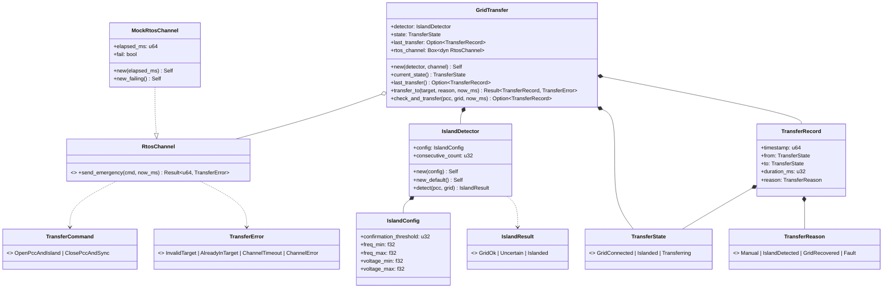
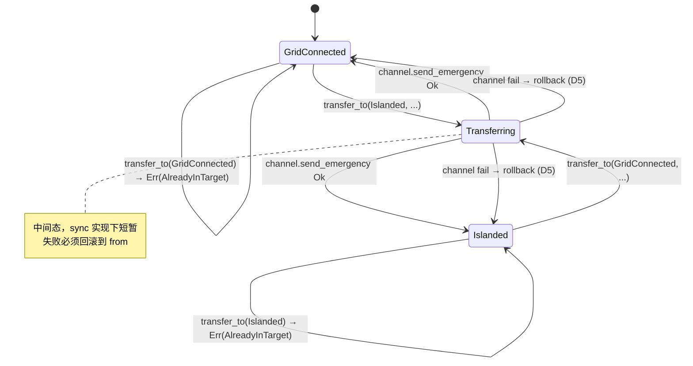

# EnerOS v0.84.0 Grid Agent 并离网切换设计文档

> **版本**：v0.84.0
> **Phase**：Phase 2 多机联邦
> **子系统**：`crates/agents/grid_agent`（subsystem = agents，扩展模块 `island_detect` + `transfer`）
> **蓝图依据**：`蓝图/phase2.md` §v0.84.0
> **状态**：设计中
> **最后更新**：2026-07-17

---

## 目录

1. [版本目标](#1-版本目标)
2. [前置依赖](#2-前置依赖)
3. [交付物清单](#3-交付物清单)
4. [数据结构](#4-数据结构)
5. [接口设计](#5-接口设计)
6. [错误处理](#6-错误处理)
7. [选型对比](#7-选型对比)
8. [实现路径](#8-实现路径)
9. [测试计划](#9-测试计划)
10. [验收标准](#10-验收标准)
11. [风险与坑点](#11-风险与坑点)
12. [偏差声明（D1~D14）](#12-偏差声明d1d14)

---

## 1. 版本目标

### 1.1 核心目标

v0.84.0 在 v0.83.0 PCC 并网点管理（开关状态 + 功率方向 + 防抖）之上，进入 P2-C 子阶段 Agent 矩阵扩展的第三步，交付 **并离网快速切换（Grid Transfer / Island Detection）**：在既有 `eneros-grid-agent` crate 中追加 `island_detect`（孤岛检测）与 `transfer`（切换状态机）两个新模块。当主网故障时，微电网需要在 < 100ms 内完成孤岛检测 + 切换执行，以保障本地重要负荷。本版本为 v0.87.0 Energy Agent 孤岛调度提供切换能力基础。

本版本严格遵循 Karpathy 4 原则：
- **Simplicity First**：仅追加 `island_detect.rs` + `transfer.rs` 两个新源文件 + 一个配置模板 + 本设计文档；不新增 crate、不新增依赖、不修改 v0.82.0/v0.83.0 既有源代码。
- **Surgical Changes**：`lib.rs` 仅追加 2 个 `pub mod` + 2 行 `pub use` + 顶部文档注释追加（约 5 行新增）；`Cargo.toml` 仅更新 `description` 字段；既有 86 个测试（T1~T86）必须无回归。

### 1.2 业务价值

| 业务价值 | 说明 |
|---------|------|
| **v0.87.0 Energy Agent 孤岛调度** | Energy Agent 在孤岛场景下需基于 `GridTransfer::current_state()` 决定本地调度策略（孤岛时切本地平衡模式） |
| **主网故障快速响应** | 主网失电时 < 100ms 完成孤岛检测 + PCC 分闸 + 离网运行，保障本地重要负荷不停电 |
| **主网恢复自动同期并网** | 主网恢复后自动检测 `GridOk` 并执行 `ClosePccAndSync` 命令，恢复并网运行 |
| **保护跳闸感知与复归** | PCC 保护跳闸由 v0.83.0 `PccStatus::Islanded` 主源触发，本版本自动转入孤岛状态 |
| **VPP < 30s 响应** | 并离网切换是 VPP 响应网络在主网故障期间降级到本地控制的前置条件 |
| **蓝图 §7.5 性能目标** | 切换耗时 < 100ms，保障实时控制大区与 Agent Runtime 协同 |

### 1.3 Phase 定位

| 维度 | 定位 |
|------|------|
| Phase | Phase 2 多机联邦（v0.75.0~v0.126.0） |
| 子阶段 | P2-C Agent 矩阵扩展第三步 |
| 平面 | 慢平面（Agent Runtime 分区，管理信息大区）+ 跨平面命令（通过 RtosChannel 下发到 RTOS 快平面） |
| 角色 | 孤岛检测器（多源融合） + 切换状态机 + RTOS 快平面命令通道抽象 |
| 上游版本 | v0.83.0 PCC 管理（`PccState`/`PccStatus` 主源） + v0.82.0 Grid Agent（`GridState` 辅源） |
| 下游版本 | v0.87.0 Energy Agent 孤岛调度（消费 `GridTransfer::current_state()` 与 `last_transfer()`） |

### 1.4 出口关联

本版本不构成 Phase 出口条件，但其交付物 `IslandDetector` / `IslandResult` / `GridTransfer` / `TransferState` / `TransferRecord` / `RtosChannel` 将被以下后续版本直接复用：

- **v0.87.0 Energy Agent 孤岛调度**：消费 `GridTransfer::current_state() == Islanded` 切换到本地平衡模式；消费 `last_transfer()` 触发调度策略刷新。
- **v0.92.0 Edge Coordinator**：联邦级并离网状态汇聚（含 `TransferRecord` 上报）。
- **v1.0.0 商用版**：MVP 联邦要求并离网切换可用（ADR-0004）。

---

## 2. 前置依赖

### 2.1 前序版本依赖

| 版本 | 交付物 | 本版本使用方式 |
|------|--------|---------------|
| v0.83.0 | PCC 管理（`PccState` / `PccStatus` / `PccManager`） | 直接复用 `PccState` 与 `PccStatus` 作为孤岛检测**主源**（`IslandDetector::detect` 参数）；`PccStatus::Islanded` 触发切换决策；T87~T126 续接 T47~T86 编号 |
| v0.82.0 | Grid Agent（`GridState` / `GridError` / `GridSampler` trait 模式 / 46 tests） | 直接复用 `GridState` 作为孤岛检测**辅源**（频率/电压越限判据）；沿用 `GridSampler` trait 抽象模式（D3，对应本版本 `RtosChannel` trait）；T87~T126 续接 T1~T45 编号 |
| v0.54.0 | RTOS 控制闭环引擎（快平面命令通道下游集成方向） | 本版本不直接依赖；`RtosChannel` trait 抽象隔离 RTOS 通道（D2），真实实现 `RtosCommandChannel` 在硬件集成阶段接入 v0.54.0 控制闭环 |
| v0.73.0 | device-agent（`AgentRuntime` trait） | 本版本不直接依赖；`GridTransfer` 独立组件，不嵌入 `GridAgent`（沿用 v0.83.0 D5 模式） |
| v0.51.0 | 协议抽象层（`PointAccess` trait） | 本版本不直接依赖；通过 `RtosChannel` trait 抽象隔离 RTOS 通道 |

### 2.2 外部依赖

| 依赖 | 版本 | 用途 | feature |
|------|------|------|---------|
| `eneros-agent` | workspace 既有 | 不直接使用（v0.82.0 已引用） | — |
| `eneros-energy-market-agent` | workspace 既有 | 不直接使用（v0.82.0 已引用） | — |
| `alloc::boxed::Box` | core | `GridTransfer.rtos_channel: Box<dyn RtosChannel>` 动态派发 | 默认 |
| `crate::GridState` | v0.82.0 既有 | `IslandDetector::detect` 辅源输入 | — |
| `crate::PccState` / `crate::PccStatus` | v0.83.0 既有 | `IslandDetector::detect` 主源输入 | — |

> **说明**：本版本为算法骨架，不引入任何外部协议栈、DDS 库、`log` crate 或 `eneros-time` 依赖（沿用 v0.82.0/v0.83.0 单线程 no_std 先例）。`RtosChannel` trait 抽象隔离 RTOS 通道层，真实 `RtosCommandChannel` 实现延后到硬件集成阶段（D2/D13）。SBOM 不变。

### 2.3 假设

1. **单线程 no_std 假设**：Agent Runtime 在 Phase 2 阶段为单线程模型（蓝图 §43.6 内存预算：Agent Runtime ≤ 64 MB），`RtosChannel` trait 不要求 `Send + Sync`（沿用 v0.82.0 D10 + v0.83.0 单线程假设）。
2. **gPTP 已同步假设**：v0.79.0 gPTP 已完成时间同步，`now_ms: u64` 注入的时间戳可信。
3. **外部 PCC + Grid 量测装置假设**：实际部署假设 v0.82.0 `GridSampler` + v0.83.0 `PccReader` 已注入真实装置量测，本版本仅消费 `PccState` + `GridState` 快照，不直接调用协议层。
4. **外部 RTOS 快平面命令通道假设**：实际部署假设存在外部 RTOS 控制闭环（v0.54.0），可通过 `RtosChannel` 实现下发紧急切换命令。本版本 `MockRtosChannel` 即时返回，不依赖真实硬件。
5. **PCC 与 Grid 状态一致假设**：`PccState` 与 `GridState` 由同一 Agent tick 周期更新，时间偏差小于一个采样周期（100ms）。多源融合按"PCC 主源 + Grid 辅源"判据。

### 2.4 阻塞条件

无。本版本为算法骨架先行，不依赖真实硬件或真实协议栈。`RtosChannel` + `MockRtosChannel` 完全可单元测试。

---

## 3. 交付物清单

### 3.1 代码交付物

| # | 路径 | 类型 | 说明 |
|---|------|------|------|
| 1 | `crates/agents/grid_agent/src/island_detect.rs` | 源码（新增） | 孤岛检测模块：3 数据结构 + `IslandDetector` + `new` / `new_default` / `detect` + T87~T106 测试（偏差 D9，沿用 v0.82.0/v0.83.0 内嵌测试模式） |
| 2 | `crates/agents/grid_agent/src/transfer.rs` | 源码（新增） | 切换状态机模块：5 数据结构 + `TransferError` + `RtosChannel` trait + `MockRtosChannel` + `GridTransfer` + T107~T126 测试 |
| 3 | `crates/agents/grid_agent/src/lib.rs` | 源码（修改） | 追加 `pub mod island_detect;` + `pub mod transfer;` + 2 行 `pub use` 重导出 + 顶部文档注释更新（偏差 D5：surgical，仅追加约 5 行） |
| 4 | `crates/agents/grid_agent/Cargo.toml` | 配置（修改） | `description` 字段追加 "+ v0.84.0 并离网切换"（无新依赖） |
| 5 | `Cargo.toml`（根） | 配置（修改） | `[workspace.package] version = "0.84.0"` |
| 6 | `Makefile` | 配置（修改） | VERSION 变量 + header 注释 → `0.84.0` |
| 7 | `.github/workflows/ci.yml` | 配置（修改） | header 注释 → `0.84.0` |
| 8 | `ci/src/gate.rs` | 源码（修改） | clippy 段 + test 段注释追加 v0.84.0 并离网切换 API 列表 |

### 3.2 接口交付物

| 接口 | 类型 | 用途 |
|------|------|------|
| `IslandResult` | enum（3 变体） | 孤岛检测结果：`Islanded` / `GridOk` / `Uncertain`（偏差 D6） |
| `IslandConfig` | struct（5 字段） | 孤岛检测配置：`confirmation_threshold` / `freq_min` / `freq_max` / `voltage_min` / `voltage_max`（偏差 D14） |
| `IslandDetector` | struct（2 字段） | 孤岛检测器：`config` / `consecutive_count`（偏差 D6） |
| `TransferState` | enum（3 变体） | 切换状态：`GridConnected` / `Islanded` / `Transferring`（偏差 D11） |
| `TransferReason` | enum（4 变体） | 切换原因：`Manual` / `IslandDetected` / `GridRecovered` / `Fault` |
| `TransferCommand` | enum（2 变体） | 切换命令：`OpenPccAndIsland` / `ClosePccAndSync` |
| `TransferRecord` | struct（5 字段） | 切换记录：`timestamp` / `from` / `to` / `duration_ms` / `reason`（偏差 D12，派生 `Copy`） |
| `TransferError` | enum（4 变体） | 切换错误：`InvalidTarget` / `AlreadyInTarget` / `ChannelTimeout` / `ChannelError`（偏差 D7） |
| `RtosChannel` | trait | RTOS 快平面紧急命令通道抽象（偏差 D2） |
| `MockRtosChannel` | struct | Mock 通道实现 + 故障注入 |
| `GridTransfer` | struct（4 字段） | 切换管理器：`detector` / `state` / `last_transfer` / `rtos_channel`（偏差 D5） |

### 3.3 文档交付物

| # | 路径 | 说明 |
|---|------|------|
| 1 | `docs/agents/grid-transfer-design.md`（本文件） | 12 章节完整设计文档 + 2 Mermaid 图 + D1~D14 偏差声明（偏差 D8） |

### 3.4 测试交付物

| 测试 ID | 类型 | 位置 |
|---------|------|------|
| T87~T126 | 单元测试（40 个） | `crates/agents/grid_agent/src/island_detect.rs`（T87~T106）+ `crates/agents/grid_agent/src/transfer.rs`（T107~T126），`#[cfg(test)] mod tests`，偏差 D9，沿用 v0.82.0/v0.83.0 内嵌模式 |

### 3.5 配置交付物

| # | 路径 | 说明 |
|---|------|------|
| 1 | `configs/grid_transfer.toml` | 并离网切换配置模板（偏差 D8：位于 `configs/` 而非蓝图 `config/`） |

### 3.6 不交付内容（明确范围）

- ❌ 真实 RTOS 控制闭环接入（延后到硬件集成阶段，偏差 D2/D13）
- ❌ 真实 `RtosCommandChannel` 实现（本版本仅 `MockRtosChannel`）
- ❌ 真实 DDS 发布（`TransferRecord` 由调用方消费，本版本不发布到 Agent Bus）
- ❌ 硬件性能基准（切换耗时 < 100ms 标注为"硬件集成阶段验收"，本版本仅算法骨架，偏差 D13）
- ❌ `GridAgent` 持有 `GridTransfer`（偏差 D5：surgical 不修改 v0.82.0 GridAgent 8 字段与构造器签名）
- ❌ 主动告警（`TransferRecord.duration_ms > max_duration_ms` 由调用方判断告警，偏差 D8）
- ❌ 同期检定（并网恢复时的同期检定逻辑由真实 `RtosCommandChannel` 在硬件层实现，本版本不模拟）

---

## 4. 数据结构

> 本章节详细定义并离网切换所有公开数据结构。所有结构均满足 no_std 合规（蓝图 §43.1），不使用 `std::*`。所有结构派生 `Debug, Clone, Copy, PartialEq`（`Eq`/`Default` 视情况），保证值语义无堆分配（`IslandDetector` / `GridTransfer` 因含 `Box` 不派生 `Copy`，见 §4.7 / §4.10）。

### 4.1 `IslandResult`

```rust
/// 孤岛检测结果枚举（3 变体）。
///
/// 偏差声明 D6：连续确认逻辑返回 3 态，区分"已确认孤岛"与"待确认"。
/// - `Islanded`：连续确认达到 `confirmation_threshold`，可触发切换
/// - `GridOk`：当前测量为并网正常，count 重置为 0
/// - `Uncertain`：检测到孤岛条件但未达阈值（count > 0 且 < threshold），等待下次确认
#[derive(Debug, Clone, Copy, PartialEq, Eq, Default)]
pub enum IslandResult {
    /// 并网正常（无孤岛条件，count = 0）
    #[default]
    GridOk,
    /// 待确认（检测到孤岛条件但未达阈值，0 < count < threshold）
    Uncertain,
    /// 已确认孤岛（count >= threshold）
    Islanded,
}
```

**设计要点**：
- 3 变体覆盖孤岛检测结果主要场景：正常 / 待确认 / 已确认孤岛。
- 派生 `Default`，标注 `#[default] GridOk`（初始状态视为并网正常，避免冷启动误触发切换）。
- `Copy + Clone + Eq`：值语义，无堆分配；可作函数返回值与状态机输入。

### 4.2 `IslandConfig`

```rust
/// 孤岛检测配置（5 字段）。
///
/// 偏差声明 D14：蓝图未定义 `IslandConfig`，本版本新增配置结构体。
/// 由 `configs/grid_transfer.toml` 的 `[island_detection]` 段注入。
/// 阈值可配置支持多场景调优（如不同电网标准 60Hz vs 50Hz）。
#[derive(Debug, Clone, Copy, PartialEq, Default)]
pub struct IslandConfig {
    /// 连续确认阈值：检测到孤岛条件后需要连续 N 次确认（偏差 D6）
    pub confirmation_threshold: u32,
    /// 频率下限（Hz），低于此值视为频率越限（辅源判据）
    pub freq_min: f32,
    /// 频率上限（Hz），高于此值视为频率越限（辅源判据）
    pub freq_max: f32,
    /// 电压下限（V，相电压），低于此值视为电压越限（辅源判据）
    pub voltage_min: f32,
    /// 电压上限（V，相电压），高于此值视为电压越限（辅源判据）
    pub voltage_max: f32,
}

impl IslandConfig {
    /// 默认配置（与 `configs/grid_transfer.toml` 一致）。
    ///
    /// - `confirmation_threshold = 3`
    /// - `freq_min = 49.5` / `freq_max = 50.5`（50Hz 系统，±0.5Hz 越限）
    /// - `voltage_min = 200.0` / `voltage_max = 240.0`（220V 相电压，±9% 越限）
    pub const fn default_config() -> Self {
        Self {
            confirmation_threshold: 3,
            freq_min: 49.5,
            freq_max: 50.5,
            voltage_min: 200.0,
            voltage_max: 240.0,
        }
    }
}
```

**设计要点**：
- 5 字段：1 阈值 + 2 频率边界 + 2 电压边界。
- 派生 `Copy`：配置注入后可值传递，无需 `clone()` 堆分配。
- `Default`：全字段归零（`confirmation_threshold = 0` 会导致首次即触发，不建议直接用 `Default`；推荐 `default_config()`）。
- `default_config()` const fn：编译期常量，运行时零开销。

### 4.3 `IslandDetector`

```rust
/// 孤岛检测器（2 字段）。
///
/// 偏差声明 D6：实现连续确认逻辑。
/// 持有 `IslandConfig` 与 `consecutive_count`，每次 `detect` 调用更新 count。
/// `&mut self` 因需更新 `consecutive_count`（D3）。
#[derive(Debug, Clone, PartialEq)]
pub struct IslandDetector {
    /// 检测配置
    pub config: IslandConfig,
    /// 连续孤岛条件计数（0 表示最近一次为 GridOk）
    pub consecutive_count: u32,
}
```

**设计要点**：
- 2 字段：`config` + `consecutive_count`。
- 不派生 `Copy`：虽然字段均 `Copy`，但保留 `Clone` 即可；后续若扩展（如多源历史窗口）可能引入非 `Copy` 字段。
- `consecutive_count` 公开字段：允许测试直接断言（T100~T103 验证 count 更新）。

### 4.4 `TransferState`

```rust
/// 切换状态枚举（3 变体）。
///
/// 偏差声明 D11：与 v0.83.0 `PccStatus` 名称重叠但语义不同。
/// - `PccStatus`：观测态（breaker 位置客观状态，含 `Transitioning` 防抖）
/// - `TransferState`：控制态（GridTransfer 切换命令意图，含 `Transferring` 切换中）
/// `Transferring` ≠ `Transitioning`：前者为切换执行中的瞬时态，后者为防抖期内的过渡态。
#[derive(Debug, Clone, Copy, PartialEq, Eq, Default)]
pub enum TransferState {
    /// 并网运行（稳态）
    #[default]
    GridConnected,
    /// 孤岛运行（稳态）
    Islanded,
    /// 切换中（瞬时态，sync 实现下短暂，失败必须回滚到 from，D5）
    Transferring,
}
```

**设计要点**：
- 3 变体覆盖切换状态主要场景：并网稳态 / 孤岛稳态 / 切换瞬时态。
- 派生 `Default`，标注 `#[default] GridConnected`（初始状态视为并网，与 `IslandResult::default() == GridOk` 一致）。
- `Transferring` 是 D5 回滚语义的核心：sync 实现下短暂存在，通道失败时回滚到 `from` 状态。

### 4.5 `TransferReason`

```rust
/// 切换原因枚举（4 变体）。
///
/// 记录每次切换的触发原因，写入 `TransferRecord.reason` 字段，
/// 用于事后审计与统计（蓝图 §4.4 多角度要求）。
#[derive(Debug, Clone, Copy, PartialEq, Eq, Default)]
pub enum TransferReason {
    /// 手动操作（运维人员主动切换）
    #[default]
    Manual,
    /// 孤岛检测触发（IslandDetector 达到阈值，自动切换到 Islanded）
    IslandDetected,
    /// 主网恢复（IslandDetector 返回 GridOk，自动切换到 GridConnected）
    GridRecovered,
    /// 故障切换（保护动作 / 上层故障逻辑触发）
    Fault,
}
```

**设计要点**：
- 4 变体覆盖切换原因主要场景：手动 / 孤岛检测 / 主网恢复 / 故障。
- 派生 `Default`，标注 `#[default] Manual`（与 `configs/grid_transfer.toml` 的 `default_reason = "Manual"` 一致）。
- `IslandDetected` 与 `GridRecovered` 由 `check_and_transfer` 自动填充；`Manual` 与 `Fault` 由调用方显式传入 `transfer_to`。

### 4.6 `TransferCommand`

```rust
/// 切换命令枚举（2 变体）。
///
/// 由 `GridTransfer::transfer_to` 根据 target 状态映射，
/// 通过 `RtosChannel::send_emergency` 下发到 RTOS 快平面。
#[derive(Debug, Clone, Copy, PartialEq, Eq)]
pub enum TransferCommand {
    /// 分开 PCC 开关 + 进入孤岛（target = Islanded）
    OpenPccAndIsland,
    /// 闭合 PCC 开关 + 同期并网（target = GridConnected）
    ClosePccAndSync,
}
```

**设计要点**：
- 2 变体对应 2 个稳态 target：`Islanded → OpenPccAndIsland` / `GridConnected → ClosePccAndSync`。
- 不派生 `Default`：命令无合理默认值，必须由 target 显式映射。
- 真实 `RtosCommandChannel` 实现层负责命令的物理执行（v0.54.0 RTOS 控制闭环）。

### 4.7 `TransferRecord`

```rust
/// 切换记录（5 字段）。
///
/// 偏差声明 D12：`Option<TransferRecord>` 用于 `last_transfer` 字段。
/// `TransferRecord` 派生 `Copy`，`Option<TransferRecord>` 也是 `Copy`，
/// `last_transfer()` 返回 `Option<TransferRecord>` 无需 `clone()` 堆分配。
#[derive(Debug, Clone, Copy, PartialEq)]
pub struct TransferRecord {
    /// 切换完成时间戳（ms，由调用方注入的 now_ms）
    pub timestamp: u64,
    /// 切换前状态（from）
    pub from: TransferState,
    /// 切换后状态（to）
    pub to: TransferState,
    /// 切换执行耗时（ms，由 RtosChannel::send_emergency 返回的 elapsed_ms）
    pub duration_ms: u32,
    /// 切换原因
    pub reason: TransferReason,
}
```

**设计要点**：
- 5 字段：1 时间戳 + 2 状态 + 1 耗时 + 1 原因。
- 派生 `Copy`：`last_transfer()` 返回 `Option<TransferRecord>` 无需 `clone()` 堆分配（D12）。
- `duration_ms: u32`：最大约 4.2 × 10^9 ms（~49 天），远超 RTOS 命令执行时间（< 100ms 目标）。
- `duration_ms` 由 `RtosChannel::send_emergency` 返回的 `elapsed_ms: u64` 截断为 `u32`（实际值远小于 `u32::MAX`，无溢出风险）。

### 4.8 `TransferError`

```rust
/// 切换错误枚举（4 变体）。
///
/// 偏差声明 D7：蓝图未定义 `TransferError` 变体，本版本新增 4 变体。
/// - `InvalidTarget`：target == Transferring（不能显式切换到 Transferring）
/// - `AlreadyInTarget`：target == self.state（同状态切换无意义）
/// - `ChannelTimeout`：RTOS 通道超时（预留给真实硬件实现，本版本 Mock 不触发）
/// - `ChannelError`：RTOS 通道错误（MockRtosChannel::new_failing 触发）
#[derive(Debug, Clone, Copy, PartialEq, Eq)]
pub enum TransferError {
    /// 无效目标（target == Transferring，不能显式切换到中间态）
    InvalidTarget,
    /// 已在目标状态（target == self.state，无需切换）
    AlreadyInTarget,
    /// 通道超时（RTOS 通道 wait_ack 超时，预留给真实硬件实现）
    ChannelTimeout,
    /// 通道错误（RTOS 通道发送/接收失败）
    ChannelError,
}
```

**设计要点**：
- 4 变体覆盖切换错误主要场景：无效目标 / 同状态 / 通道超时 / 通道错误。
- 不派生 `Default`：错误无合理默认值。
- `ChannelTimeout` 当前 `MockRtosChannel` 不触发（统一返回 `ChannelError`），预留给真实 `RtosCommandChannel` 实现（D7）。
- 派生 `Copy`：错误可在 `Result` 中值传递，无堆分配。

### 4.9 `RtosChannel` trait + `MockRtosChannel`

```rust
use crate::transfer::{TransferCommand, TransferError};

/// RTOS 快平面紧急命令通道抽象 trait（偏差 D2）。
///
/// 不依赖 `eneros-time` / `eneros-rtos` / `eneros-tsn-time`，
/// 避免协议层与 RTOS 实现间接依赖。后续硬件集成阶段实现
/// `RtosCommandChannel` 桥接 v0.54.0 RTOS 控制闭环。
///
/// 沿用 v0.82.0 `GridSampler` + v0.83.0 `PccReader` trait 抽象模式。
///
/// `send_emergency` 合并"发送命令 + 等待 ACK"，一次性返回 `elapsed_ms`，
/// 避免在 trait 层引入 `Duration` / `wait_ack` 异步语义（D2）。
pub trait RtosChannel {
    /// 下发紧急切换命令，返回 elapsed_ms（命令执行耗时，单位 ms）。
    ///
    /// # 参数
    /// - `cmd`: 切换命令（`OpenPccAndIsland` / `ClosePccAndSync`）
    /// - `now_ms`: 当前时间戳（ms，由调用方注入，用于真实实现计算 elapsed）
    ///
    /// # 返回
    /// - `Ok(elapsed_ms)`: 命令执行成功，返回耗时
    /// - `Err(TransferError::ChannelTimeout)`: 通道 wait_ack 超时（真实实现）
    /// - `Err(TransferError::ChannelError)`: 通道发送/接收失败
    fn send_emergency(
        &mut self,
        cmd: TransferCommand,
        now_ms: u64,
    ) -> Result<u64, TransferError>;
}

/// Mock 通道实现（测试用）。
///
/// 偏差声明 D2 / D13：通过 `MockRtosChannel` 抽象 RTOS 通道面，
/// 不接入真实 v0.54.0 RTOS 控制闭环。
/// 沿用 v0.82.0 `MockGridSampler` + v0.83.0 `MockPccReader` 模式。
#[derive(Debug, Clone)]
pub struct MockRtosChannel {
    /// 预设返回的命令执行耗时（ms）
    pub elapsed_ms: u64,
    /// 是否模拟通道失败
    pub fail: bool,
}

impl MockRtosChannel {
    /// 创建 Mock 通道（返回指定 elapsed_ms，无故障）。
    pub fn new(elapsed_ms: u64) -> Self {
        Self {
            elapsed_ms,
            fail: false,
        }
    }

    /// 创建总是失败的 Mock 通道（故障注入）。
    pub fn new_failing() -> Self {
        Self {
            elapsed_ms: 0,
            fail: true,
        }
    }
}

impl RtosChannel for MockRtosChannel {
    fn send_emergency(
        &mut self,
        _cmd: TransferCommand,
        _now_ms: u64,
    ) -> Result<u64, TransferError> {
        if self.fail {
            return Err(TransferError::ChannelError);
        }
        // cmd / now_ms 参数用于真实实现；Mock 实现忽略并返回 elapsed_ms。
        Ok(self.elapsed_ms)
    }
}
```

**设计要点**：
- 偏差 D2：trait 抽象隔离 RTOS 通道层，避免 `Duration` 与 `wait_ack` 异步语义。
- 偏差 D7：`MockRtosChannel` 统一返回 `ChannelError`，`ChannelTimeout` 预留给真实实现。
- `send_emergency` 合并发送+等待：简化 API，避免在 trait 层暴露 `wait_ack` 阻塞语义。
- `_cmd` / `_now_ms` 前缀下划线：Mock 实现不使用（真实实现需根据 cmd 选择执行路径，根据 now_ms 计算 elapsed）。

### 4.10 `GridTransfer`

```rust
use alloc::boxed::Box;
use crate::island_detect::{IslandDetector, IslandResult};
use crate::transfer::{TransferError, TransferRecord, TransferState};

/// 并离网切换管理器（4 字段）。
///
/// 偏差声明 D5：独立组件，不嵌入 `GridAgent`（surgical，不修改
/// v0.82.0 GridAgent 8 字段与构造器签名）。用户可在自己的 Agent
/// 中组合 `GridAgent` + `PccManager` + `GridTransfer`。
///
/// 持有 `IslandDetector` 与 `RtosChannel`，周期性调用
/// `check_and_transfer(pcc, grid, now_ms)` 自动切换，或调用
/// `transfer_to(target, reason, now_ms)` 手动切换。
pub struct GridTransfer {
    /// 孤岛检测器（双源融合 + 连续确认）
    detector: IslandDetector,
    /// 当前切换状态（GridConnected / Islanded / Transferring）
    state: TransferState,
    /// 最近一次切换记录（初始 None，首次成功切换后 Some）
    last_transfer: Option<TransferRecord>,
    /// RTOS 快平面命令通道（动态派发，允许测试注入 MockRtosChannel）
    rtos_channel: Box<dyn RtosChannel>,
}
```

**设计要点**：
- 4 字段：`detector` / `state` / `last_transfer` / `rtos_channel`。
- `rtos_channel: Box<dyn RtosChannel>`：动态派发，允许测试注入 `MockRtosChannel`，生产注入真实通道（硬件集成阶段）。
- 不派生 `Copy` / `Clone`：含 `Box<dyn RtosChannel>`，无法自动派生。
- `last_transfer: Option<TransferRecord>`：因 `TransferRecord: Copy`，`Option<TransferRecord>` 也是 `Copy`，但 `GridTransfer` 整体不 `Copy`（Box 限制）。

### 4.11 数据结构关系图

下图展示 11 个数据结构之间的关系（`IslandDetector` 持有 `IslandConfig`，`GridTransfer` 持有 `IslandDetector` + `RtosChannel` + `TransferState` + `Option<TransferRecord>`）：



---

## 5. 接口设计

### 5.1 `IslandDetector::new` + `new_default`

```rust
use crate::island_detect::{IslandConfig, IslandDetector};
use crate::{GridState, PccState, PccStatus};

impl IslandDetector {
    /// 构造孤岛检测器（指定配置）。
    ///
    /// # 参数
    /// - `config`: 检测配置（含 confirmation_threshold / 频率/电压边界）
    ///
    /// 初始化：
    /// - `consecutive_count = 0`
    pub fn new(config: IslandConfig) -> Self {
        Self {
            config,
            consecutive_count: 0,
        }
    }

    /// 构造孤岛检测器（默认配置）。
    ///
    /// 等价于 `IslandDetector::new(IslandConfig::default_config())`。
    pub fn new_default() -> Self {
        Self::new(IslandConfig::default_config())
    }
}
```

**设计要点**：
- `new` 接受 `IslandConfig`：支持自定义阈值（如 60Hz 系统调高 freq_min/freq_max）。
- `new_default` 便捷构造：使用 `default_config()`（3 / 49.5 / 50.5 / 200.0 / 240.0）。
- 沿用 v0.82.0 `GridAgent::new` + v0.83.0 `PccManager::new` 构造模式。

### 5.2 `IslandDetector::detect` 双源融合 + 连续确认

```rust
use crate::island_detect::IslandResult;

impl IslandDetector {
    /// 双源融合孤岛检测 + 连续确认。
    ///
    /// 偏差声明 D3：双源融合（PCC breaker 主源 + GridState 频率/电压辅源），
    /// 蓝图 §5.2 "多检测方法融合 + 开关位置确认"。
    /// 偏差声明 D6：连续确认逻辑（consecutive_count + confirmation_threshold）。
    ///
    /// # 参数
    /// - `pcc`: PCC 状态（主源：breaker 位置）
    /// - `grid`: 电网状态（辅源：频率/电压）
    ///
    /// # 返回
    /// - `IslandResult::Islanded`: count >= threshold
    /// - `IslandResult::Uncertain`: 0 < count < threshold
    /// - `IslandResult::GridOk`: count == 0
    ///
    /// # 算法步骤
    /// 1. 主源判定：`pcc.status == PccStatus::Islanded` → raw_islanded = true
    /// 2. 辅源判定：频率或电压越限 → raw_islanded = true
    /// 3. 连续确认：
    ///    - raw_islanded == true → consecutive_count += 1
    ///    - raw_islanded == false → consecutive_count = 0
    /// 4. 返回值映射：
    ///    - count >= threshold → Islanded
    ///    - count > 0 → Uncertain
    ///    - count == 0 → GridOk
    pub fn detect(&mut self, pcc: &PccState, grid: &GridState) -> IslandResult {
        // Step 1: 主源判定（PCC breaker 位置）
        let mut raw_islanded = pcc.status == PccStatus::Islanded;

        // Step 2: 辅源判定（频率/电压越限）
        let freq_out = grid.frequency < self.config.freq_min
            || grid.frequency > self.config.freq_max;
        let volt_out = grid.voltage_a < self.config.voltage_min
            || grid.voltage_a > self.config.voltage_max;
        if freq_out || volt_out {
            raw_islanded = true;
        }

        // Step 3: 连续确认计数
        if raw_islanded {
            self.consecutive_count = self.consecutive_count.saturating_add(1);
        } else {
            self.consecutive_count = 0;
        }

        // Step 4: 返回值映射
        if self.consecutive_count >= self.config.confirmation_threshold {
            IslandResult::Islanded
        } else if self.consecutive_count > 0 {
            IslandResult::Uncertain
        } else {
            IslandResult::GridOk
        }
    }
}
```

**设计要点**：
- 偏差 D3：双源融合，PCC 主源（breaker 位置直接判定）+ Grid 辅源（频率/电压越限间接判定）。任一源触发即 `raw_islanded = true`。
- 偏差 D6：连续确认 `saturating_add` 避免 u32 溢出（虽然实际不可能溢出，但 no_std 安全实践）。
- `&mut self`：因需更新 `consecutive_count`（D3 说明）。
- 频率/电压边界由 `IslandConfig` 配置，支持多场景调优（D14）。

### 5.3 `GridTransfer::new` + 访问器

```rust
use alloc::boxed::Box;
use crate::island_detect::IslandDetector;
use crate::transfer::{RtosChannel, TransferState, TransferRecord};

impl GridTransfer {
    /// 构造切换管理器。
    ///
    /// # 参数
    /// - `detector`: 孤岛检测器
    /// - `rtos_channel`: RTOS 快平面命令通道（`Box<dyn RtosChannel>`）
    ///
    /// 初始化：
    /// - `state = TransferState::GridConnected`（默认并网）
    /// - `last_transfer = None`
    pub fn new(detector: IslandDetector, rtos_channel: Box<dyn RtosChannel>) -> Self {
        Self {
            detector,
            state: TransferState::GridConnected,
            last_transfer: None,
            rtos_channel,
        }
    }

    /// 获取当前切换状态。
    ///
    /// 返回 `self.state`（Copy，无堆分配）。
    /// 用于 v0.87.0 Energy Agent 孤岛调度决策。
    pub fn current_state(&self) -> TransferState {
        self.state
    }

    /// 获取最近一次切换记录。
    ///
    /// 返回 `self.last_transfer`（Option<TransferRecord>，Copy，无堆分配）。
    /// 初始为 `None`，首次成功切换后为 `Some(record)`。
    pub fn last_transfer(&self) -> Option<TransferRecord> {
        self.last_transfer
    }
}
```

**设计要点**：
- 4 字段初始化：`detector` / `state = GridConnected` / `last_transfer = None` / `rtos_channel`。
- `current_state()` / `last_transfer()` 返回 Copy 值，无堆分配。
- 沿用 v0.83.0 `PccManager::current()` 访问器模式。

### 5.4 `GridTransfer::transfer_to` 状态机 + 回滚

```rust
use crate::transfer::{
    RtosChannel, TransferCommand, TransferError, TransferReason,
    TransferRecord, TransferState,
};

impl GridTransfer {
    /// 手动切换到目标状态。
    ///
    /// 偏差声明 D5：通道失败时 `state` 回滚到 `from`（保持原状态）。
    /// 偏差声明 D7：4 变体 `TransferError`（InvalidTarget / AlreadyInTarget /
    ///   ChannelTimeout / ChannelError）。
    ///
    /// # 参数
    /// - `target`: 目标状态（GridConnected / Islanded；Transferring 非法）
    /// - `reason`: 切换原因
    /// - `now_ms`: 当前时间戳（ms）
    ///
    /// # 返回
    /// - `Ok(TransferRecord)`: 切换成功
    /// - `Err(AlreadyInTarget)`: target == self.state
    /// - `Err(InvalidTarget)`: target == Transferring
    /// - `Err(ChannelTimeout)`: 通道超时（真实实现）
    /// - `Err(ChannelError)`: 通道错误
    ///
    /// # 算法步骤
    /// 1. 校验 target == self.state → Err(AlreadyInTarget)
    /// 2. 校验 target == Transferring → Err(InvalidTarget)
    /// 3. 记录 from = self.state
    /// 4. 设置 self.state = Transferring
    /// 5. 映射 target → command（Islanded → OpenPccAndIsland / GridConnected → ClosePccAndSync）
    /// 6. 调用 rtos_channel.send_emergency(cmd, now_ms)：
    ///    - 成功 → 构建 TransferRecord，更新 state = target，last_transfer = Some(record)，返回 Ok(record)
    ///    - 失败 → 回滚 state = from（D5），返回 Err(e)
    pub fn transfer_to(
        &mut self,
        target: TransferState,
        reason: TransferReason,
        now_ms: u64,
    ) -> Result<TransferRecord, TransferError> {
        // Step 1: 同状态切换
        if self.state == target {
            return Err(TransferError::AlreadyInTarget);
        }

        // Step 2: 非法目标（不能显式切换到 Transferring）
        if target == TransferState::Transferring {
            return Err(TransferError::InvalidTarget);
        }

        // Step 3-4: 记录 from + 进入 Transferring
        let from = self.state;
        self.state = TransferState::Transferring;

        // Step 5: 映射 target → command
        let cmd = match target {
            TransferState::Islanded => TransferCommand::OpenPccAndIsland,
            TransferState::GridConnected => TransferCommand::ClosePccAndSync,
            TransferState::Transferring => unreachable!("guarded by Step 2"),
        };

        // Step 6: 下发紧急命令
        match self.rtos_channel.send_emergency(cmd, now_ms) {
            Ok(elapsed_ms) => {
                let record = TransferRecord {
                    timestamp: now_ms,
                    from,
                    to: target,
                    duration_ms: elapsed_ms as u32,
                    reason,
                };
                self.state = target;
                self.last_transfer = Some(record);
                Ok(record)
            }
            Err(e) => {
                // D5: 回滚到 from 状态
                self.state = from;
                Err(e)
            }
        }
    }
}
```

**设计要点**：
- 偏差 D5：通道失败时 `self.state = from` 回滚，避免 `Transferring` 卡死。
- 偏差 D7：`AlreadyInTarget` / `InvalidTarget` 边界条件；`ChannelTimeout` / `ChannelError` 通道失败。
- `unreachable!` 在 Step 5：Step 2 已 guard `Transferring`，编译器需 match 穷尽，此处安全。
- `elapsed_ms as u32` 截断：实际值 < 100ms，远小于 `u32::MAX`，无溢出风险。
- `transfer_to` 是 `check_and_transfer` 的底层原语，也可由调用方直接调用（手动切换场景）。

### 5.5 `GridTransfer::check_and_transfer` 自动切换

```rust
use crate::{GridState, PccState};
use crate::island_detect::IslandResult;
use crate::transfer::{TransferReason, TransferRecord, TransferState};

impl GridTransfer {
    /// 自动检测 + 切换（周期性调用）。
    ///
    /// 偏差声明 D4：显式参数 `(pcc, grid, now_ms)`，避免持有
    /// `last_grid_state()`（蓝图代码不完整）。
    ///
    /// # 参数
    /// - `pcc`: PCC 状态快照
    /// - `grid`: 电网状态快照
    /// - `now_ms`: 当前时间戳（ms）
    ///
    /// # 返回
    /// - `Some(TransferRecord)`: 触发切换且成功
    /// - `None`: 无需切换 / 切换中 / 切换失败（错误吞掉，避免影响周期）
    ///
    /// # 算法步骤
    /// 1. 若 state == Transferring → 返回 None（避免重入）
    /// 2. result = detector.detect(pcc, grid)
    /// 3. 匹配 (result, state)：
    ///    - (Islanded, GridConnected) → transfer_to(Islanded, IslandDetected, now_ms).ok()
    ///    - (GridOk, Islanded) → transfer_to(GridConnected, GridRecovered, now_ms).ok()
    ///    - 其他 → None
    pub fn check_and_transfer(
        &mut self,
        pcc: &PccState,
        grid: &GridState,
        now_ms: u64,
    ) -> Option<TransferRecord> {
        // Step 1: 切换中避免重入
        if self.state == TransferState::Transferring {
            return None;
        }

        // Step 2: 孤岛检测
        let result = self.detector.detect(pcc, grid);

        // Step 3: 状态机映射（见 §5.7 状态机映射表）
        match (result, self.state) {
            (IslandResult::Islanded, TransferState::GridConnected) => {
                self.transfer_to(TransferState::Islanded, TransferReason::IslandDetected, now_ms)
                    .ok()
            }
            (IslandResult::GridOk, TransferState::Islanded) => {
                self.transfer_to(TransferState::GridConnected, TransferReason::GridRecovered, now_ms)
                    .ok()
            }
            _ => None,
        }
    }
}
```

**设计要点**：
- 偏差 D4：显式参数，不持有 `last_grid_state()`，surgical 不增加 `GridTransfer` 字段。
- Step 1 防重入：sync 实现下 `Transferring` 瞬时存在，此分支理论上不触发，但作为安全 guard。
- 错误吞掉（`.ok()`）：`check_and_transfer` 周期调用，切换失败不应中断周期；调用方若需感知失败应直接调用 `transfer_to`。
- 状态机映射见 §5.7。

### 5.6 `GridTransfer.transfer_to` 状态机图

下图展示 `GridTransfer::transfer_to` 的状态迁移与失败回滚（D5）：



### 5.7 `IslandDetector.detect` 双源融合决策流程图

下图展示 `IslandDetector::detect` 的双源融合 + 连续确认决策流程：

```mermaid
flowchart TD
    Start[detect pcc, grid] --> CheckPcc{pcc.status<br/>== Islanded?}
    CheckPcc -- Yes --> RawIsland[raw_islanded = true]
    CheckPcc -- No --> CheckFreq{freq out of<br/>[min,max]?}
    CheckFreq -- Yes --> RawIsland
    CheckFreq -- No --> CheckVolt{voltage_a out of<br/>[min,max]?}
    CheckVolt -- Yes --> RawIsland
    CheckVolt -- No --> RawOk[raw_islanded = false]
    RawIsland --> IncCount[count += 1]
    RawOk --> ResetCount[count = 0]
    IncCount --> CheckThreshold{count >=<br/>threshold?}
    ResetCount --> ReturnGridOk[return GridOk]
    CheckThreshold -- Yes --> ReturnIslanded[return Islanded]
    CheckThreshold -- No --> CheckCount{count > 0?}
    CheckCount -- Yes --> ReturnUncertain[return Uncertain]
    CheckCount -- No --> ReturnGridOk
```

### 5.8 状态机映射表（TransferState × IslandResult → behavior）

下表展示 `check_and_transfer` 的状态机映射逻辑（§5.5 Step 3 的 tabular 形式）：

| Current State | IslandResult | Action |
|---------------|-------------|--------|
| GridConnected  | GridOk      | None（保持并网，stay） |
| GridConnected  | Uncertain   | None（等待确认，wait） |
| GridConnected  | Islanded    | `transfer_to(Islanded, IslandDetected)` |
| Islanded       | Islanded    | None（保持孤岛，stay） |
| Islanded       | Uncertain   | None（等待确认，wait） |
| Islanded       | GridOk      | `transfer_to(GridConnected, GridRecovered)` |
| Transferring   | *           | None（避免重入，sync 下瞬时） |

**设计要点**：
- `Uncertain` 状态下不切换：避免抖动期间误触发，等待连续确认达到阈值。
- `Transferring` 状态下不响应任何 `IslandResult`：避免重入（sync 下瞬时，D5 回滚保证不卡死）。
- 对角线（同状态 + 同结果）：保持当前状态，不切换。

---

## 6. 错误处理

### 6.1 `InvalidTarget`

**场景**：`transfer_to(TransferState::Transferring, ...)` 被调用。

**触发条件**：
- 调用方编程错误（试图显式切换到中间态 `Transferring`）。
- `Transferring` 是 `transfer_to` 内部的瞬时态，不应作为显式 target。

**返回**：`Err(TransferError::InvalidTarget)`。

**处理策略**：
- 立即返回错误，`state` 不变（不进入 `Transferring`）。
- 不调用 `rtos_channel.send_emergency`，无副作用。
- 调用方应修正逻辑，`Transferring` 只能由 `transfer_to` 内部设置，不能作为 target。

### 6.2 `AlreadyInTarget`

**场景**：`transfer_to(target, ...)` 时 `target == self.state`。

**触发条件**：
- 调用方重复调用（如已 `Islanded` 再次 `transfer_to(Islanded, ...)`）。
- `check_and_transfer` 在 `state == Islanded` 且 `result == Islanded` 时不调用 `transfer_to`（§5.8 状态机映射），但调用方直接调用 `transfer_to` 可能触发。

**返回**：`Err(TransferError::AlreadyInTarget)`。

**处理策略**：
- 立即返回错误，`state` 不变。
- 不调用 `rtos_channel.send_emergency`，无副作用。
- 调用方可将 `AlreadyInTarget` 视为"幂等成功"（已处于目标状态），或视为编程错误（重复切换）。

### 6.3 `ChannelTimeout`

**场景**：`rtos_channel.send_emergency(cmd, now_ms)` 返回 `Err(TransferError::ChannelTimeout)`。

**触发条件**：
- 真实 `RtosCommandChannel` 实现：`wait_ack(Duration::from_millis(80))` 超时（蓝图 §5.3）。
- 本版本 `MockRtosChannel` 不触发（统一返回 `ChannelError`，D7）。

**返回**：`Err(TransferError::ChannelTimeout)` 传播。

**处理策略**：
- 偏差 D5：`state` 回滚到 `from`（保持原状态）。
- 上层 Agent Runtime 责任监控连续超时次数，超阈值触发降级（如冻结切换决策或降级到 L1 路径）。
- 蓝图 §5.3 配置 `timeout_ms = 80`（`configs/grid_transfer.toml` `[rtos_channel]` 段），真实实现按此超时。

### 6.4 `ChannelError`

**场景**：`rtos_channel.send_emergency(cmd, now_ms)` 返回 `Err(TransferError::ChannelError)`。

**触发条件**：
- `MockRtosChannel::new_failing()` 故障注入。
- 真实场景：RTOS 通道发送失败、接收 ACK 失败、协议解析失败等。

**返回**：`Err(TransferError::ChannelError)` 传播。

**处理策略**：
- 偏差 D5：`state` 回滚到 `from`（保持原状态）。
- 上层 Agent Runtime 责任监控连续失败次数，超阈值触发降级。
- 蓝图 §5.3 配置 `retry_count = 2`（`configs/grid_transfer.toml` `[rtos_channel]` 段），真实实现按此重试。

### 6.5 失败回滚语义（D5）

**保证**：`transfer_to` 通道失败时 `state` 完全回滚到 `from`。

**实现**：
```rust
let from = self.state;
self.state = TransferState::Transferring;
match self.rtos_channel.send_emergency(cmd, now_ms) {
    Ok(elapsed_ms) => { /* 更新 state = target */ },
    Err(e) => {
        self.state = from;  // D5: 回滚
        return Err(e);
    }
}
```

**影响**：
- `state` 永远不会卡在 `Transferring`（sync 实现下瞬时）。
- 调用方重试 `transfer_to` 时，`state` 反映最后一次成功切换的状态。
- `current_state()` 在失败后立即可读，返回 `from` 状态。
- 上层监控系统可以安全依赖 `current_state()`：通道失败期间状态不会闪烁为 `Transferring`。

### 6.6 错误传播链

```
MockRtosChannel.send_emergency() → Err(TransferError::ChannelError)
        ↓
GridTransfer.transfer_to() → Err(TransferError::ChannelError)（state 回滚到 from）
        ↓
GridTransfer.check_and_transfer() → None（.ok() 吞掉错误，避免影响周期）
        ↓
调用方（如 Energy Agent）→ 若需感知失败，直接调用 transfer_to 而非 check_and_transfer
```

> **说明**：本版本不实现 `From<TransferError> for AgentRuntimeError`（surgical — 不修改 v0.82.0 lib.rs 的 `impl From`）。若 v0.87.0+ Energy Agent 需要将 `TransferError` 转为 `AgentRuntimeError`，可在 lib.rs 追加 `impl From<TransferError> for AgentRuntimeError`（外科手术式追加，不破坏 v0.82.0/v0.83.0 既有 impl）。

### 6.7 错误恢复策略

| 错误类别 | 恢复策略 | 责任方 |
|---------|---------|--------|
| `InvalidTarget` | 调用方修正逻辑（不切换到 Transferring） | 调用方 |
| `AlreadyInTarget` | 视为幂等成功或修正重复切换逻辑 | 调用方 |
| `ChannelTimeout`（真实实现） | `state` 回滚；上层重试或降级 | 上层 Agent Runtime |
| `ChannelError` | `state` 回滚；上层重试或降级 | 上层 Agent Runtime |
| 通道连续失败超阈值 | 上层冻结切换决策或降级到 L1 路径 | 上层 Agent Runtime |
| `check_and_transfer` 吞掉错误 | 调用方若需感知失败，直接调用 `transfer_to` | 调用方 |

---

## 7. 选型对比

### 7.1 孤岛检测方式对比：双源融合 vs 单源检测

| 维度 | 双源融合（PCC + Grid，本版本） | 单源 PCC breaker | 单源 Grid 频率/电压 |
|------|------------------------------|------------------|---------------------|
| **原理** | PCC breaker 位置为主 + Grid 频率/电压越限为辅 | 仅读取 PCC breaker 辅助接点 | 仅检测频率/电压越限 |
| **抗扰动性** | 高（双源确认，单源抖动不触发） | 中（breaker 接点氧化误判） | 低（负荷扰动可能触发误判） |
| **响应时间** | 100ms~1s（取决于 PCC + Grid 采样周期） | 100ms~1s | 10ms~100ms |
| **硬件成本** | 低（复用 v0.82.0 Grid + v0.83.0 PCC 量测） | 低 | 中（需高精度频率测量） |
| **复杂度** | 中（双源融合 + 连续确认） | 低 | 中（阈值整定） |
| **no_std 合规** | ✅ | ✅ | ✅ |
| **本版本采用** | ✅ | ❌ | ❌ |

> **决策**：选择双源融合（偏差 D3）。理由：
> 1. 蓝图 §5.2 明确要求"多检测方法融合 + 开关位置确认"。
> 2. PCC breaker 为主源：直接反映物理开关位置，抗扰动性高。
> 3. Grid 频率/电压为辅源：在 PCC breaker 未及时报告时（如通信延迟）提供后备判据。
> 4. 复用 v0.82.0 `GridState` + v0.83.0 `PccState`，无额外硬件成本。

### 7.2 RTOS 通道抽象：`RtosChannel` trait vs 直接依赖 `eneros-time` + `RtosCommandChannel`

| 维度 | `RtosChannel` trait（本版本） | 直接依赖 `eneros-time` + `RtosCommandChannel` |
|------|------------------------------|-----------------------------------------------|
| **协议层耦合** | 无（trait 抽象隔离） | 强（直接依赖 `eneros-time::Instant`） |
| **测试便捷性** | 高（`MockRtosChannel` 故障注入） | 低（需 mock RTOS 通道） |
| **后续扩展** | 硬件集成阶段实现 `RtosCommandChannel` 桥接 | 已直接耦合，扩展受限 |
| **no_std 合规** | ✅ 纯 trait + `now_ms: u64` | ⚠️ 依赖 `Instant::now()` 与 `Duration` |
| **`wait_ack` 语义** | `send_emergency` 合并发送+等待，返回 `elapsed_ms` | 需暴露 `wait_ack(Duration)` 阻塞语义 |
| **本版本采用** | ✅ | ❌ |

> **决策**：选择 `RtosChannel` trait（偏差 D1/D2），避免 `eneros-time` 依赖与 `Duration` / `wait_ack` 异步语义，与 v0.82.0 `GridSampler` + v0.83.0 `PccReader` trait 抽象模式一致。

### 7.3 失败处理：保守回滚 vs 强制跳闸

| 维度 | 保守回滚（本版本，D5） | 强制跳闸 |
|------|------------------------|---------|
| **语义** | 通道失败时 `state` 回滚到 `from` | 通道失败时强制进入 `target`（假设命令已执行） |
| **安全性** | 高（保守，不假设命令成功） | 中（可能命令未执行但状态已迁移） |
| **可用性** | 中（需重试或降级） | 高（立即进入目标状态） |
| **复杂度** | 低（回滚 1 行） | 中（需额外跳闸逻辑） |
| **蓝图依据** | 蓝图 §4.4 "保持原状态或强制跳闸"二选一 | 蓝图 §4.4 二选一 |
| **本版本采用** | ✅ | ❌ |

> **决策**：选择保守回滚（偏差 D5）。理由：
> 1. 安全可控：不假设命令成功，避免状态与物理开关不一致。
> 2. 蓝图 §4.4 允许二选一，本版本取保守路径。
> 3. 上层可通过重试或降级策略恢复可用性。
> 4. 硬件集成阶段若需强制跳闸，可在真实 `RtosCommandChannel` 实现层追加跳闸逻辑（不影响本版本 API）。

### 7.4 `last_transfer` 字段类型：`Option<TransferRecord>` vs always `TransferRecord`

| 维度 | `Option<TransferRecord>`（本版本） | always `TransferRecord` |
|------|------------------------------------|--------------------------|
| **初始状态表达** | ✅ `None` 明确表示"从未切换" | ❌ 需虚构初始 record（timestamp=0 / from=GridConnected / to=GridConnected） |
| **Copy 语义** | ✅ `Option<T: Copy>` 也是 `Copy` | ✅ `TransferRecord: Copy` |
| **堆分配** | 无 | 无 |
| **调用方判断** | `if let Some(record) = gt.last_transfer()` | `if record.timestamp != 0`（隐式约定） |
| **本版本采用** | ✅ | ❌ |

> **决策**：选择 `Option<TransferRecord>`（偏差 D12）。理由：
> 1. 初始状态明确：`None` 表示"从未切换"，避免虚构初始 record。
> 2. `TransferRecord: Copy` ⇒ `Option<TransferRecord>: Copy`，无堆分配。
> 3. 调用方判断清晰：`if let Some(record)` 优于 `if record.timestamp != 0` 隐式约定。

### 7.5 错误类型：新增 `TransferError` vs 复用 `GridError`

| 维度 | 新增 `TransferError`（本版本） | 复用 `GridError` |
|------|-------------------------------|-------------------|
| **语义清晰度** | 高（4 变体精确表达切换错误） | 低（`GridError` 3 变体无切换语义） |
| **surgical** | ❌ 新增类型 | ✅ 不新增类型 |
| **v0.82.0 既有 impl** | 不影响 | ✅ 保留 |
| **后续扩展** | ✅ 独立演进 | ⚠️ 与 Grid 错误耦合 |
| **本版本采用** | ✅ | ❌ |

> **决策**：选择新增 `TransferError`（偏差 D7）。理由：
> 1. 切换错误语义与采样错误不同（`InvalidTarget` / `AlreadyInTarget` 无对应 `GridError` 变体）。
> 2. v0.82.0 `GridError` 仅 3 变体（`SampleFailed` / `PublishFailed` / `AnomalyDetected`），无法表达通道超时/错误。
> 3. 后续 v0.87.0+ 可追加 `impl From<TransferError> for AgentRuntimeError`（surgical 追加，不破坏 v0.82.0/v0.83.0 既有 impl）。

---

## 8. 实现路径

### 8.1 实现路径概览（6 步）

```
Step 1: 创建 island_detect.rs（IslandResult + IslandConfig + IslandDetector + new/new_default/detect + T87~T106）
   ↓
Step 2: 创建 transfer.rs（TransferState/Reason/Command/Record/Error + RtosChannel + MockRtosChannel + GridTransfer + T107~T126）
   ↓
Step 3: 修改 lib.rs 追加 pub mod island_detect; + pub mod transfer; + 2 行 pub use（surgical，约 5 行新增）
   ↓
Step 4: 版本同步（根 Cargo.toml / Makefile / ci.yml / gate.rs / grid_agent Cargo.toml description）
   ↓
Step 5: 编写 T87~T126 测试（island_detect.rs + transfer.rs 内 #[cfg(test)] mod tests）
   ↓
Step 6: 验证 cargo test / build / fmt / clippy / deny
```

### 8.2 Step 1：创建 `island_detect.rs`

**文件**：`crates/agents/grid_agent/src/island_detect.rs`（新增）

**内容**：
- 3 数据结构（见 §4.1~§4.3）
- `IslandDetector` + `new` / `new_default` / `detect`（见 §5.1~§5.2）
- T87~T106 测试（见 §9）

**依赖**：`use crate::GridState;` + `use crate::PccState;` + `use crate::PccStatus;` + `core::*`

**验证**：`cargo build -p eneros-grid-agent` 通过。

### 8.3 Step 2：创建 `transfer.rs`

**文件**：`crates/agents/grid_agent/src/transfer.rs`（新增）

**内容**：
- 5 数据结构 + `TransferError`（见 §4.4~§4.8）
- `RtosChannel` trait + `MockRtosChannel`（见 §4.9）
- `GridTransfer` + `new` / `current_state` / `last_transfer` / `transfer_to` / `check_and_transfer`（见 §5.3~§5.5）
- T107~T126 测试（见 §9）

**依赖**：`use alloc::boxed::Box;` + `use crate::island_detect::{IslandDetector, IslandResult};` + `use crate::{GridState, PccState};` + `core::*`

**验证**：`cargo build -p eneros-grid-agent` 通过。

### 8.4 Step 3：修改 `lib.rs`（surgical）

**文件**：`crates/agents/grid_agent/src/lib.rs`

**变更**（仅追加，不修改 v0.82.0/v0.83.0 既有代码行）：
- 顶部文档注释追加："+ v0.84.0 并离网切换（IslandResult / IslandConfig / IslandDetector / TransferState / TransferReason / TransferCommand / TransferRecord / TransferError / RtosChannel / MockRtosChannel / GridTransfer）"
- 追加 `pub mod island_detect;` + `pub mod transfer;` 模块声明
- 追加 `pub use island_detect::{IslandConfig, IslandDetector, IslandResult};` + `pub use transfer::{GridTransfer, MockRtosChannel, RtosChannel, TransferCommand, TransferError, TransferReason, TransferRecord, TransferState};` 重导出

**surgical 保证**：
- v0.82.0 既有 `state.rs` / `sampler.rs` / `publisher.rs` 完全未改动。
- v0.83.0 既有 `pcc.rs` 完全未改动。
- v0.82.0/v0.83.0 既有 `lib.rs` 的所有定义与 `impl` 完全未改动。
- v0.82.0 既有 46 个测试 + v0.83.0 既有 40 个测试（共 86 个）必须仍全部通过。

**验证**：`cargo build -p eneros-grid-agent` 通过。

### 8.5 Step 4：版本同步

**文件列表**：

| 文件 | 变更 |
|------|------|
| `Cargo.toml`（根） | `[workspace.package] version = "0.84.0"` |
| `Makefile` | `VERSION := 0.84.0` + header 注释 → `0.84.0` |
| `.github/workflows/ci.yml` | header 注释 → `0.84.0` |
| `ci/src/gate.rs` | clippy 段 + test 段注释追加：`+ v0.84.0 并离网切换：IslandResult / IslandConfig / IslandDetector / TransferState / TransferReason / TransferCommand / TransferRecord / TransferError / RtosChannel / MockRtosChannel / GridTransfer` |
| `crates/agents/grid_agent/Cargo.toml` | `description` 字段更新为 `"EnerOS v0.82.0 Grid Agent — 电网状态感知 + v0.83.0 PCC 并网点管理 + v0.84.0 并离网切换 (采样/异常检测/PCC/孤岛检测/切换状态机, no_std)"` |

**workspace members 不变**：`island_detect.rs` + `transfer.rs` 是既有 `eneros-grid-agent` crate 的新模块，非新 crate（不新增 workspace member，不触发 §2.4.1 C1~C5 校验）。

**验证**：`cargo metadata --format-version 1 > /dev/null` 通过。

### 8.6 Step 5：编写 T87~T126 测试

**文件**：`crates/agents/grid_agent/src/island_detect.rs`（T87~T106）+ `crates/agents/grid_agent/src/transfer.rs`（T107~T126）

**内容**：见 §9 测试计划。

**测试编号约定**：T87~T126 续接 v0.83.0 T47~T86（v0.82.0 T1~T45 + v0.83.0 T47~T86 共 86 个；本版本 T87 起始）。

**验证**：`cargo test -p eneros-grid-agent` 通过，T1~T86 + T87~T126 全绿。

### 8.7 Step 6：验证构建链

```bash
# 1. workspace 解析
cargo metadata --format-version 1 > /dev/null

# 2. 主机侧测试（含 v0.82.0 既有 46 + v0.83.0 既有 40 + 本版本 40 = 126 个）
cargo test -p eneros-grid-agent

# 3. 交叉编译验证
cargo build -p eneros-grid-agent --target aarch64-unknown-none -Z build-std=core,alloc -Z build-std-features=compiler-builtins-mem

# 4. 格式与 lint
cargo fmt --all -- --check
cargo clippy -p eneros-grid-agent --all-targets -- -D warnings

# 5. 安全扫描
cargo deny check advisories licenses bans sources

# 6. workspace 回归（v0.75.0~v0.83.0 既有 crate 不受影响）
cargo test --workspace --exclude eneros-kernel --exclude eneros-hello
```

---

## 9. 测试计划

### 9.1 测试矩阵 T87~T126（40 个）

> 本版本共 40 个单元测试，覆盖并离网切换 API 100%。测试内嵌 `src/island_detect.rs`（T87~T106）与 `src/transfer.rs`（T107~T126）（偏差 D9，沿用 v0.82.0/v0.83.0 内嵌测试模式）。测试编号 T87~T126 续接 v0.83.0 T47~T86。

#### 9.1.1 `island_detect.rs` 测试（T87~T106，20 个）

| 测试 ID | 类型 | 测试名称 | 验证点 |
|---------|------|---------|--------|
| T87 | 单元 | `t87_island_result_variants` | `IslandResult` 3 变体可构造（GridOk/Uncertain/Islanded） |
| T88 | 单元 | `t88_island_result_default` | `IslandResult::default() == GridOk` |
| T89 | 单元 | `t89_island_result_copy_eq` | `Copy` + `PartialEq + Eq` 派生正确 |
| T90 | 单元 | `t90_island_config_default_config` | `IslandConfig::default_config()` 全字段正确（3 / 49.5 / 50.5 / 200.0 / 240.0） |
| T91 | 单元 | `t91_island_config_construction` | `IslandConfig` 5 字段构造 |
| T92 | 单元 | `t92_island_config_copy_eq` | `Copy` + `PartialEq` 派生正确 |
| T93 | 单元 | `t93_island_detector_new` | `IslandDetector::new(config)` 初始化 `consecutive_count == 0` |
| T94 | 单元 | `t94_island_detector_new_default` | `IslandDetector::new_default()` 使用 `default_config()` |
| T95 | 单元 | `t95_detect_pcc_islanded_first_uncertain` | 首次 `detect(pcc_islanded, grid_normal)`（threshold=3）→ `Uncertain`（count=1 < 3） |
| T96 | 单元 | `t96_detect_pcc_islanded_3_consecutive_islanded` | 连续 3 次 `detect(pcc_islanded, grid_normal)` → 第 3 次 `Islanded` |
| T97 | 单元 | `t97_detect_freq_out_triggers` | PCC=GridConnected 但 frequency=49.0（< 49.5），连续 3 次 → 第 3 次 `Islanded`（辅源触发） |
| T98 | 单元 | `t98_detect_voltage_out_triggers` | PCC=GridConnected 但 voltage_a=180.0（< 200.0），连续 3 次 → 第 3 次 `Islanded`（辅源触发） |
| T99 | 单元 | `t99_detect_count_resets_on_gridok` | 2 次 `Uncertain` 后第 3 次输入 GridOk → `GridOk`（count 重置为 0） |
| T100 | 单元 | `t100_detect_custom_threshold_1` | `IslandConfig { confirmation_threshold: 1, .. }` + PCC=Islanded → 首次 `Islanded` |
| T101 | 单元 | `t101_detect_count_increment` | 连续 2 次 PCC=Islanded → count=2，返回 `Uncertain` |
| T102 | 单元 | `t102_detect_count_reset_to_zero` | count=2 后输入 GridOk → count=0，返回 `GridOk` |
| T103 | 单元 | `t103_detect_freq_high_triggers` | frequency=51.0（> 50.5），连续 3 次 → `Islanded` |
| T104 | 单元 | `t104_detect_voltage_high_triggers` | voltage_a=250.0（> 240.0），连续 3 次 → `Islanded` |
| T105 | 单元 | `t105_detect_both_sources_redundant` | PCC=Islanded + frequency 正常 + voltage 正常 → 仍 `Islanded`（主源触发） |
| T106 | 单元 | `t106_detect_saturating_count` | 长期孤岛 count 不溢出（`saturating_add` 验证，理论值 u32::MAX） |

#### 9.1.2 `transfer.rs` 测试（T107~T126，20 个）

| 测试 ID | 类型 | 测试名称 | 验证点 |
|---------|------|---------|--------|
| T107 | 单元 | `t107_transfer_state_variants` | `TransferState` 3 变体可构造 |
| T108 | 单元 | `t108_transfer_state_default` | `TransferState::default() == GridConnected` |
| T109 | 单元 | `t109_transfer_reason_variants` | `TransferReason` 4 变体可构造 |
| T110 | 单元 | `t110_transfer_reason_default` | `TransferReason::default() == Manual` |
| T111 | 单元 | `t111_transfer_command_variants` | `TransferCommand` 2 变体可构造 |
| T112 | 单元 | `t112_transfer_record_construction` | `TransferRecord` 5 字段构造 + `Copy` 派生 |
| T113 | 单元 | `t113_transfer_error_variants` | `TransferError` 4 变体可构造 + `Copy + Eq` 派生 |
| T114 | 单元 | `t114_mock_rtos_channel_new` | `MockRtosChannel::new(50)` 默认无故障，`elapsed_ms == 50` |
| T115 | 单元 | `t115_mock_rtos_channel_new_failing` | `MockRtosChannel::new_failing()` 故障注入（fail=true） |
| T116 | 单元 | `t116_mock_rtos_channel_send_ok` | `send_emergency(cmd, now_ms)` 返回 `Ok(elapsed_ms)` |
| T117 | 单元 | `t117_mock_rtos_channel_send_err` | `fail=true` 返回 `Err(ChannelError)` |
| T118 | 单元 | `t118_grid_transfer_new` | `GridTransfer::new` 4 字段构造，初始 `state == GridConnected` / `last_transfer == None` |
| T119 | 单元 | `t119_transfer_to_islanded_success` | `transfer_to(Islanded, IslandDetected, 1000)` → `Ok(record)`，`duration_ms == 50` / `from == GridConnected` / `to == Islanded`；`current_state() == Islanded` |
| T120 | 单元 | `t120_transfer_to_grid_connected_success` | `state == Islanded` 时 `transfer_to(GridConnected, GridRecovered, 2000)` → `Ok(record)`，`to == GridConnected` |
| T121 | 单元 | `t121_transfer_to_same_state_already_in_target` | `state == GridConnected` 时 `transfer_to(GridConnected, ...)` → `Err(AlreadyInTarget)` |
| T122 | 单元 | `t122_transfer_to_transferring_invalid_target` | `transfer_to(Transferring, ...)` → `Err(InvalidTarget)` |
| T123 | 单元 | `t123_transfer_to_channel_failure_rollback` | `MockRtosChannel::new_failing()` + `transfer_to(Islanded, ...)` → `Err(ChannelError)`；`current_state() == GridConnected`（D5 回滚） |
| T124 | 单元 | `t124_check_and_transfer_auto_islanding` | `state == GridConnected`，连续 3 次 `detect` 返回 `Islanded`，第 3 次 `check_and_transfer` → `Some(record)`，`to == Islanded` |
| T125 | 单元 | `t125_check_and_transfer_no_action` | `state == GridConnected`，`detect` 返回 `GridOk` → `None`，state 不变 |
| T126 | 单元 | `t126_check_and_transfer_avoids_reentry` | `state == Transferring`（理论场景）→ `None`（避免重入） |

### 9.2 集成测试

| 测试 ID | 类型 | 状态 | 说明 |
|---------|------|------|------|
| — | 真实 RTOS 控制闭环接入 | ❌ 不实现（偏差 D2/D13） | CI 无真实硬件环境，延后到硬件集成阶段 |
| — | 真实 Agent Bus `/power/state/transfer` 发布 | ❌ 不实现（偏差 D13） | 本版本 `TransferRecord` 由调用方消费，不发布到 Agent Bus |

### 9.3 性能基准

| 测试 ID | 类型 | 状态 | 说明 |
|---------|------|------|------|
| — | `transfer_to()` < 100ms | ❌ 不实现 | **硬件集成阶段验收，本版本仅算法骨架**（偏差 D13） |

> **说明**：蓝图 §7.5 要求切换耗时 < 100ms 性能基准，本版本仅做算法正确性测试，不在 CI 中验证性能基线。`MockRtosChannel` 即时返回预设 `elapsed_ms`，T119 验证 `duration_ms == 50`（来自 Mock 配置）。真实性能基准由硬件集成阶段回归验证（真实 `RtosCommandChannel` 实现 + v0.54.0 RTOS 控制闭环）。

### 9.4 回归测试

| 测试范围 | 验证内容 |
|---------|---------|
| v0.82.0 既有 46 个测试 | `cargo test -p eneros-grid-agent` T1~T45 + `_ensure_imports_used` 全绿 |
| v0.83.0 既有 40 个测试 | `cargo test -p eneros-grid-agent` T47~T86 全绿 |
| v0.75.0~v0.83.0 既有 crate | `cargo test --workspace --exclude eneros-kernel --exclude eneros-hello` 无回归 |
| aarch64 交叉编译 | `cargo build -p eneros-grid-agent --target aarch64-unknown-none` 通过 |

### 9.5 故障注入测试

本版本通过 `MockRtosChannel` 的故障注入构造器覆盖通道失败场景：

| 故障注入构造器 | 验证点 |
|---------------|--------|
| `MockRtosChannel::new_failing()` | T115 / T117 / T123：通道失败路径（`Err(ChannelError)` + state 回滚，D5） |
| `MockRtosChannel::new(elapsed_ms)` | T114 / T116 / T119：通道成功路径（`Ok(elapsed_ms)` + record 构建） |

### 9.6 GPU 优先测试规则（蓝图 §43.3）

> ⚠️ 本规则**仅适用于**：模型训练（云端）、模型量化校准、数字孪生仿真加速。
> **不适用于**：边缘推理、RTOS 控制路径、Solver 求解、孤岛检测、并离网切换。

本版本 GPU 测试适用性分析：

| 测试场景 | GPU 需求 | 理由 |
|---------|---------|------|
| `IslandDetector::detect` | ❌ 无 | 纯 Rust，枚举匹配 + f32 比较 |
| `GridTransfer::transfer_to` | ❌ 无 | 纯 Rust，状态机 + Box 派发 |
| `GridTransfer::check_and_transfer` | ❌ 无 | 纯 Rust，状态机映射 |
| `MockRtosChannel::send_emergency` | ❌ 无 | 纯 Rust，struct 字段返回 |

**结论**：本版本无 GPU 测试需求（全 Mock 纯 Rust，孤岛检测与并离网切换不涉及 AI 推理）。

---

## 10. 验收标准

### 10.1 功能验收

- [ ] **F1**：40 个单元测试（T87~T126）全部通过
- [ ] **F2**：`IslandDetector` 双源融合 + 连续确认逻辑正确（T95~T106）
- [ ] **F3**：`GridTransfer` 4 字段构造 + `new` / `current_state` / `last_transfer` / `transfer_to` / `check_and_transfer` API 可用（T118~T126）
- [ ] **F4**：`transfer_to` 状态机迁移正确（T119~T123）
- [ ] **F5**：`transfer_to` 通道失败时 `state` 回滚到 `from`（D5，T123）
- [ ] **F6**：`check_and_transfer` 自动切换 + 防重入正确（T124~T126）
- [ ] **F7**：`InvalidTarget` / `AlreadyInTarget` 边界条件正确（T121~T122）
- [ ] **F8**：`MockRtosChannel` 故障注入正确（T115 / T117 / T123）

### 10.2 性能验收

- [ ] **P1**：`transfer_to()` < 100ms（**硬件集成阶段验收，本版本仅算法骨架**，偏差 D13）

### 10.3 安全验收

- [ ] **S1**：通道失败时 `state` 回滚到 `from`，避免 `Transferring` 卡死（D5，T123）
- [ ] **S2**：`check_and_transfer` 在 `Transferring` 状态下返回 `None`，避免重入（T126）
- [ ] **S3**：连续确认逻辑避免单次抖动误触发切换（D6，T95~T96）
- [ ] **S4**：`configs/grid_transfer.toml` 不含密钥
- [ ] **S5**：v0.82.0 既有 46 个测试 + v0.83.0 既有 40 个测试无回归

### 10.4 文档验收

- [ ] **D1**：本设计文档 12 章节完整
- [ ] **D2**：2 个 Mermaid 图渲染正常（`transfer_to` 状态机图 + `detect` 双源融合决策流程图）
- [ ] **D3**：D1~D14 偏差声明表完整（与 spec.md 一致）
- [ ] **D4**：`cargo doc -p eneros-grid-agent` 无 warning

### 10.5 出口判定

- [ ] **E1**：T87~T126 全绿（40 个测试）
- [ ] **E2**：v0.82.0 既有 T1~T45 + `_ensure_imports_used` + v0.83.0 既有 T47~T86 全绿（无回归，共 86 个）
- [ ] **E3**：v0.75.0~v0.83.0 既有 crate 无回归
- [ ] **E4**：aarch64-unknown-none 交叉编译通过
- [ ] **E5**：`cargo fmt --all -- --check` 通过
- [ ] **E6**：`cargo clippy -p eneros-grid-agent --all-targets -- -D warnings` 无 warning
- [ ] **E7**：`cargo deny check advisories licenses bans sources` 通过
- [ ] **E8**：目录结构校验 C1~C15 全部通过（蓝图 §2.4）— 本版本不新增 crate，仅追加模块与配置文件
- [ ] **E9**：并离网切换算法骨架可用（**本版本仅算法骨架，性能验收延后到硬件集成阶段**，偏差 D13）
- [ ] **E10**：surgical changes 保证 — v0.82.0/v0.83.0 既有源文件 `state.rs` / `sampler.rs` / `publisher.rs` / `pcc.rs` 完全未改动

---

## 11. 风险与坑点

### 11.1 技术风险

| 风险 | 影响 | 缓解措施 | 解决版本 |
|------|------|---------|---------|
| 单次抖动误触发切换（D6） | PCC breaker 辅助接点抖动或 Grid 频率瞬时越限可能误触发切换 | 连续确认逻辑：`consecutive_count >= confirmation_threshold`（默认 3）才判定孤岛 | 本版本（D6） |
| 通道失败导致状态卡死（D5） | `Transferring` 状态若不回滚，`current_state()` 永远返回 `Transferring`，阻塞 `check_and_transfer` | 通道失败时 `state` 回滚到 `from`；`Transferring` 仅在 `transfer_to` 内部瞬时存在 | 本版本（D5） |
| 双源融合误判 | PCC breaker 报告 Islanded 但 Grid 频率/电压正常（如 PCC 误报） | PCC 为主源，breaker 位置直接判定；Grid 辅源仅在 PCC 未报告时提供后备；上层可结合功率方向（v0.83.0）综合判断 | 本版本（D3） |
| 真实 RTOS 通道阻塞 | 真实 `RtosCommandChannel.send_emergency` 可能阻塞 80ms~100ms，影响 Agent tick | 本版本 Mock 即时返回，无阻塞；真实实现按 `configs/grid_transfer.toml` `[rtos_channel] timeout_ms = 80` 超时 | 硬件集成阶段 |
| `Box<dyn RtosChannel>` 后无法直接访问 `MockRtosChannel` 内部状态 | 测试时无法直接断言 `elapsed_ms`，需通过 `last_transfer().duration_ms` 间接验证 | 测试用例通过 `last_transfer()` 间接断言读取结果 | — |
| 并网恢复同期检定缺失 | `ClosePccAndSync` 命令真实执行需同期检定，本版本 Mock 不模拟 | 真实 `RtosCommandChannel` 实现层负责同期检定；本版本仅下发命令，不验证同期条件 | 硬件集成阶段 |

### 11.2 依赖风险

| 风险 | 影响 | 缓解措施 | 解决版本 |
|------|------|---------|---------|
| `GridState` 来自 v0.82.0 lib.rs | 若 v0.85.0+ 修改 `GridState` 签名（如追加字段），需同步更新 island_detect.rs | 严格遵循 v0.82.0 API；CI 回归测试 | — |
| `PccState` / `PccStatus` 来自 v0.83.0 pcc.rs | 若 v0.85.0+ 修改 `PccStatus` 变体，需同步更新 island_detect.rs | 严格遵循 v0.83.0 API；CI 回归测试 | — |
| `core::*` 在 aarch64-unknown-none 可用 | 理论上 aarch64 原生支持，但其他 target 可能受限 | 本版本仅支持 aarch64-unknown-none；CI 交叉编译验证 | — |

### 11.3 资源风险

| 风险 | 影响 | 缓解措施 |
|------|------|---------|
| GridTransfer 内存预算（蓝图 §43.6 Agent Runtime ≤ 64 MB） | 实际占用远小于此（算法骨架） | `IslandDetector` 约 24 字节（IslandConfig 20 + u32 4）；`GridTransfer` 约 48 字节（IslandDetector 24 + TransferState 1 + Option<TransferRecord> 32 + Box 8 + padding）；`MockRtosChannel` 约 16 字节（u64 + bool + padding） |

### 11.4 兼容风险

| 风险 | 影响 | 缓解措施 |
|------|------|---------|
| 与 v0.82.0 GridAgent + v0.83.0 PccManager 共存 | 本版本 `GridTransfer` 独立组件，不嵌入 `GridAgent` / `PccManager`（偏差 D5），无兼容风险 | surgical：不修改 v0.82.0 GridAgent 8 字段 / v0.83.0 PccManager 6 字段与构造器签名 |
| `TransferState` 与 v0.83.0 `PccStatus` 名称重叠（D11） | 两套枚举变体名相似（GridConnected/Islanded），可能混淆 | 文档明确分工：`PccStatus` 为观测态（breaker 位置），`TransferState` 为控制态（切换命令意图）；`Transferring` ≠ `Transitioning` |
| `RtosChannel` trait 与 v0.82.0 `GridSampler` + v0.83.0 `PccReader` trait 共存 | 三个 trait 互不干扰，分别抽象不同面 | 文档明确分工：`GridSampler` 采样电网状态，`PccReader` 读取 PCC 开关，`RtosChannel` 下发 RTOS 命令 |

### 11.5 坑点

1. **`TransferState::Transferring` 是瞬时态，不应作为 `transfer_to` 的 target**：调用 `transfer_to(Transferring, ...)` 会返回 `Err(InvalidTarget)`。`Transferring` 仅在 `transfer_to` 内部从 `state = Transferring` 到 `state = target`（或回滚到 `from`）之间瞬时存在。坑点：不要在调用方代码中显式构造 `Transferring` 作为 target。

2. **`check_and_transfer` 吞掉 `transfer_to` 的错误**：`check_and_transfer` 使用 `.ok()` 将 `Result<TransferRecord, TransferError>` 转为 `Option<TransferRecord>`，错误被吞掉。这是预期行为（周期调用不应因单次失败中断）。坑点：若调用方需感知切换失败（如通道超时告警），应直接调用 `transfer_to` 而非 `check_and_transfer`。

3. **`consecutive_count` 在 `detect` 调用间持久化**：`IslandDetector` 持有 `consecutive_count` 字段，多次 `detect` 调用之间累加。坑点：不要在每次 `detect` 前手动重置 `consecutive_count`（那会破坏连续确认逻辑）。若需重置，应重新构造 `IslandDetector::new(config)` 或 `new_default()`。

4. **`confirmation_threshold == 0` 是合法但危险的配置**：`IslandConfig { confirmation_threshold: 0, .. }` 时，首次 `detect` 即返回 `Islanded`（`count >= 0` 恒成立）。坑点：`IslandConfig::default_config()` 使用 `confirmation_threshold = 3`，但用户自定义配置时若设为 0 会失去防抖意义。建议真实配置 ≥ 2。

5. **`TransferRecord.duration_ms` 由 `MockRtosChannel` 预设，非真实测量**：本版本 `duration_ms` 来自 `MockRtosChannel::new(elapsed_ms)` 的预设值，不反映真实切换耗时。坑点：T119 验证 `duration_ms == 50` 仅验证字段赋值正确，不验证真实性能。真实性能基准由硬件集成阶段验证（D13）。

6. **`PccStatus::Islanded` 与 `TransferState::Islanded` 语义不同**：`PccStatus::Islanded` 表示 PCC breaker 客观断开（观测态），`TransferState::Islanded` 表示 GridTransfer 控制意图为孤岛（控制态）。坑点：不要将两者直接比较或赋值。`check_and_transfer` 通过 `IslandDetector::detect` 将 `PccStatus` 转为 `IslandResult`，再映射到 `TransferState`。

---

## 12. 偏差声明（D1~D14）

> 本章节记录 v0.84.0 实现相对蓝图要求的 14 项偏差。每个偏差遵循 Karpathy "Think Before Coding" 原则：先思考蓝图意图，再决定是否偏离，并记录理由。
>
> **偏差表与 `e:\eneros\.trae\specs\develop-v0840-grid-transfer\spec.md` §偏差声明（D1~D14）保持一致**，任何变更需同步更新（项目规则 §十 文档同步要求）。

### 12.1 偏差声明表

| 偏差 | 蓝图原文 | 本版本处理 | 理由 |
|------|---------|-----------|------|
| **D1** | `use eneros_time::Instant;` + `Instant::now()` + `start.elapsed().as_millis()` | `now_ms: u64` 参数 + `RtosChannel::send_emergency` 返回 `elapsed_ms` | no_std 无 `Instant`；沿用 v0.82.0 D2/D3 + v0.83.0 D1 模式；避免引入 `eneros-time` 依赖（surgical — Cargo.toml deps 不变） |
| **D2** | `RtosCommandChannel` 具体类型 + `wait_ack(Duration::from_millis(80))` | `RtosChannel` trait + `MockRtosChannel`（`send_emergency` 一次性返回 `elapsed_ms`） | 沿用 v0.82.0 D5 + v0.83.0 D3 trait 抽象模式；避免 `Duration` 与阻塞等待语义；`send_emergency` 合并发送+等待，简化 API |
| **D3** | `IslandDetector::detect(&self, state: &GridState)` 单源 | `IslandDetector::detect(&mut self, pcc: &PccState, grid: &GridState) -> IslandResult` 双源融合 | 蓝图 §5.2 "多检测方法融合 + 开关位置确认"；PCC breaker 状态为主（v0.83.0 PccStatus），GridState 频率/电压为辅（v0.82.0）；`&mut self` 因 D6 需更新 consecutive_count |
| **D4** | `self.last_grid_state()` 未定义方法 | `check_and_transfer(&mut self, pcc, grid, now_ms)` 显式参数 | 蓝图代码不完整；surgical — 不增加 GridTransfer 持有状态字段；调用方提供 PCC + Grid 状态 |
| **D5** | "切换超时 → 告警，保持原状态或强制跳闸"（§4.4）未明确实现 | 通道失败时 `state` 回滚到 `from`（原始状态） | 选择"保持原状态"语义（非"强制跳闸"）；避免 `Transferring` 卡死；安全可控；蓝图 §4.4 二选一，本版本取保守路径 |
| **D6** | "连续 3 次确认"（§4.4）未明确实现 | `IslandDetector.consecutive_count` + `IslandConfig.confirmation_threshold`（默认 3） | 满足 §4.4 复检机制；阈值可配置；count > 0 且 < threshold 返回 `Uncertain`，达到 threshold 返回 `Islanded` |
| **D7** | `TransferError` 蓝图未定义变体 | 4 变体：`InvalidTarget` / `AlreadyInTarget` / `ChannelTimeout` / `ChannelError` | 蓝图 line 2489 暗示 `InvalidTarget`；`AlreadyInTarget` 处理同状态切换；通道失败区分超时（`ChannelTimeout`）/错误（`ChannelError`）；当前 `MockRtosChannel` 统一返回 `ChannelError`，`ChannelTimeout` 预留给真实硬件实现 |
| **D8** | `error!("切换超时: {}ms", duration)` 日志 | 移除日志；超时通过返回值 `TransferRecord.duration_ms` 由调用方判断 | no_std 无 `log` crate；沿用 v0.82.0 D1 模式；调用方可根据 `duration_ms > 100` 自行告警 |
| **D9** | `docs/phase2/grid_transfer.md` + `tests/transfer_latency.rs` | `docs/agents/grid-transfer-design.md` + 内嵌单元测试 T87~T126 | 工作区规则 §2.3.3 禁止 `docs/phase2/` 平面化；沿用 v0.82.0/v0.83.0 测试模式（lib.rs 内嵌 test 模块） |
| **D10** | 蓝图 2 文件 `transfer.rs` + `island_detect.rs` | 保持 2 文件（关注点分离：检测 vs 切换执行） | 沿用蓝图结构；模块边界清晰；每文件约 200~300 行可读 |
| **D11** | `TransferState`（GridConnected/Islanded/Transferring）与 v0.83.0 `PccStatus`（GridConnected/Islanded/Transitioning）名称重叠 | 保持两套枚举（语义不同：`PccStatus` 为观测态，`TransferState` 为控制态） | `PccStatus` 描述 PCC 客观状态（breaker 位置）；`TransferState` 描述 GridTransfer 控制意图（切换命令）；`Transferring` ≠ `Transitioning`；避免合并引入语义混淆 |
| **D12** | `Option<TransferRecord>` `last_transfer` 字段 | 保持 `Option<TransferRecord>`（初始 `None`，首次成功切换后 `Some`） | 沿用蓝图字段；`TransferRecord` 派生 `Copy`，无需 `Box`；`Option<TransferRecord>` 也是 `Copy`（因 `TransferRecord: Copy`） |
| **D13** | 性能目标 < 100ms（§7.5） | 标注为"硬件集成阶段验收，本版本仅算法骨架"；测试验证 `duration_ms` 正确记录 | 沿用 v0.82.0/v0.83.0 性能目标处理模式；Mock 通道无法验证真实硬件延迟；T119 验证 `duration_ms == 50`（来自 MockRtosChannel 配置） |
| **D14** | 蓝图未定义 `IslandConfig` | 新增 `IslandConfig { confirmation_threshold, freq_min, freq_max, voltage_min, voltage_max }` 配置结构体 | D6 派生：阈值可配置；频率/电压边界可配置；支持多场景调优（如不同电网标准 60Hz vs 50Hz） |

### 12.2 偏差分类

#### 12.2.1 目录与配置类（D8, D9）

- **D8**：文档位于 `docs/agents/grid-transfer-design.md` + 配置位于 `configs/grid_transfer.toml`（项目规则 §2.3.3 / §2.3）。
- **D9**：测试内嵌 `src/island_detect.rs` T87~T106 + `src/transfer.rs` T107~T126（沿用 v0.82.0/v0.83.0 内嵌模式）。

**共同理由**：遵守项目规则 §2.3 目录结构规范，与 v0.82.0~v0.83.0 模式一致。

#### 12.2.2 no_std 合规类（D1, D8）

- **D1**：`now_ms: u64` 参数 + `RtosChannel::send_emergency` 返回 `elapsed_ms`（no_std 无 `Instant`）。
- **D8**：移除 `error!` 日志（no_std 无 `log` crate）。

**共同理由**：no_std 单线程环境，沿用 v0.51.0~v0.83.0 先例。

#### 12.2.3 抽象隔离与简化类（D2, D3, D4, D7, D12, D14）

- **D2**：`RtosChannel` trait 抽象 RTOS 通道面（避免 `Duration` / `wait_ack` 异步语义）。
- **D3**：双源融合 `detect(&mut self, pcc, grid)`（蓝图 §5.2 多检测方法融合）。
- **D4**：`check_and_transfer` 显式参数（surgical 不增加字段）。
- **D7**：4 变体 `TransferError`（精确表达切换错误语义）。
- **D12**：`Option<TransferRecord>` 初始 `None`（明确初始状态）。
- **D14**：新增 `IslandConfig` 配置结构体（D6 阈值可配置派生）。

**共同理由**：Surgical Changes 原则，不破坏 v0.82.0/v0.83.0 既有 API；trait 抽象隔离协议层与 RTOS 层，保持 crate 自包含可测试。

#### 12.2.4 状态机与防抖类（D5, D6, D10, D11, D13）

- **D5**：通道失败回滚到 `from`（保守路径，避免 `Transferring` 卡死）。
- **D6**：连续确认逻辑（`consecutive_count` + `confirmation_threshold`）。
- **D10**：2 文件结构（检测 vs 切换执行，关注点分离）。
- **D11**：`TransferState` 与 `PccStatus` 两套枚举（观测态 vs 控制态）。
- **D13**：性能目标延后到硬件集成阶段（Mock 无法验证真实延迟）。

**共同理由**：覆盖并离网切换主要场景，与 §9 多角度要求一致；防抖逻辑满足"可靠：连续确认"；保守回滚满足"安全：失败不卡死"。

### 12.3 偏差影响评估

| 偏差 | 影响范围 | 风险 | 缓解 |
|------|---------|------|------|
| D1 | `now_ms` 参数 + `elapsed_ms` 返回 | 低 | no_std 合规 |
| D2 | `RtosChannel` trait 抽象 | 中 | 硬件集成阶段桥接 `RtosCommandChannel` |
| D3 | 双源融合 | 低 | 复用 v0.82.0 `GridState` + v0.83.0 `PccState` |
| D4 | 显式参数 | 低 | surgical 不增加字段 |
| D5 | 保守回滚 | 低 | 安全可控，T123 验证 |
| D6 | 连续确认 | 低 | 阈值可配置，T95~T106 充分覆盖 |
| D7 | 4 变体 `TransferError` | 低 | 精确表达错误语义 |
| D8 | 移除日志 | 低 | 调用方按 `duration_ms` 自行告警 |
| D9 | 文档/测试位置 | 低 | 项目规则 §2.3 |
| D10 | 2 文件结构 | 低 | 关注点分离 |
| D11 | 两套枚举 | 中 | 文档明确分工（观测态 vs 控制态） |
| D12 | `Option<TransferRecord>` | 低 | `TransferRecord: Copy` |
| D13 | 性能目标延后 | 中 | 硬件集成阶段验证 |
| D14 | `IslandConfig` 新增 | 低 | D6 阈值可配置派生 |

### 12.4 偏差与 Karpathy 原则对照

| Karpathy 原则 | 对应偏差 | 体现 |
|---------------|---------|------|
| **Think Before Coding** | D1~D14 全部 | 每个偏差先思考蓝图意图，再决定偏离，记录理由 |
| **Simplicity First** | D1, D4, D6, D8, D9, D10, D12, D14 | `now_ms` 参数；显式参数；连续确认；移除日志；内嵌测试；2 文件结构；`Option<TransferRecord>`；`IslandConfig` 配置 |
| **Surgical Changes** | D2, D3, D7, D8 | trait 抽象；双源融合；新增 `TransferError`；目录遵循规则 — 不修改 v0.82.0/v0.83.0 既有代码 |
| **Goal-Driven Execution** | D5, D6, D11, D13 | 保守回滚 + 连续确认 + 两套枚举 + 性能延后 — 目标先跑通并离网切换闭环 |

### 12.5 偏差审计追溯

每个偏差在以下两处保持一致（可追溯）：

1. **`spec.md` §偏差声明（D1~D14）**：`e:\eneros\.trae\specs\develop-v0840-grid-transfer\spec.md`
2. **本设计文档 §12**：本章节 D1~D14 偏差声明表

两处内容应完全一致（本章节已逐字对照 spec.md），任何变更需同步更新（项目规则 §十 文档同步要求）。

---

## 附录 A：参考文档

| 文档 | 关联 |
|------|------|
| `蓝图/Power_Native_Agent_OS_Blueprint.md` §42/§44 | ADR 决策记录 |
| `蓝图/phase2.md` §v0.84.0 | 本版本蓝图依据 |
| `蓝图/Power_Native_Agent_OS_Version_Roadmap_v3.md` | 版本路线图 |
| `.trae/specs/develop-v0840-grid-transfer/spec.md` | 本版本规格文档（D1~D14 偏差表源头） |
| `docs/agents/pcc-management-design.md` | v0.83.0 PCC 管理设计（本版本前置依赖，结构参考） |
| `docs/agents/grid-agent-design.md` | v0.82.0 Grid Agent 设计（本版本前置依赖，结构参考） |
| `docs/agents/device-agent-design.md` | v0.73.0 device-agent 设计（AgentRuntime trait 模式参考） |
| `configs/pcc.toml` | v0.83.0 PCC 配置（本版本 `configs/grid_transfer.toml` 风格参考） |
| `configs/grid_points.toml` | v0.82.0 电网量测点表配置（本版本 `configs/grid_transfer.toml` 风格参考） |
| `.trae/rules/记忆.md` §2.3 / §4.3 / §5.4 / §5.5 | 项目规则 |

## 附录 B：术语表

| 术语 | 含义 |
|------|------|
| Grid Transfer | 并离网切换（微电网在并网运行与孤岛运行之间的状态迁移） |
| Island Detection | 孤岛检测（检测微电网是否与主网解列） |
| IslandDetector | 孤岛检测器（2 字段，持有 config + consecutive_count） |
| IslandResult | 孤岛检测结果（3 变体：Islanded / GridOk / Uncertain） |
| IslandConfig | 孤岛检测配置（5 字段：confirmation_threshold + 频率/电压边界） |
| GridTransfer | 切换管理器（4 字段，持有 detector + state + last_transfer + rtos_channel） |
| TransferState | 切换状态（3 变体：GridConnected / Islanded / Transferring） |
| TransferReason | 切换原因（4 变体：Manual / IslandDetected / GridRecovered / Fault） |
| TransferCommand | 切换命令（2 变体：OpenPccAndIsland / ClosePccAndSync） |
| TransferRecord | 切换记录（5 字段：timestamp + from + to + duration_ms + reason） |
| TransferError | 切换错误（4 变体：InvalidTarget / AlreadyInTarget / ChannelTimeout / ChannelError） |
| RtosChannel | RTOS 快平面紧急命令通道抽象 trait（隔离 RTOS 实现层） |
| MockRtosChannel | Mock 通道实现（测试用 + 故障注入） |
| 双源融合 | PCC breaker 主源 + Grid 频率/电压辅源的孤岛检测策略（D3） |
| 连续确认 | 检测到孤岛条件后需连续 N 次确认才判定孤岛（D6，默认 N=3） |
| 保守回滚 | 通道失败时 state 回滚到 from，避免 Transferring 卡死（D5） |
| PCC | Point of Common Coupling（并网点，微电网与主网的物理接口） |
| PccStatus | PCC 观测态（v0.83.0，3 变体：GridConnected / Islanded / Transitioning） |
| Transitioning | PCC 防抖过渡态（v0.83.0 D6，不同于 TransferState::Transferring） |
| Transferring | 切换中瞬时态（本版本 D5，通道失败时回滚到 from） |
| 同期检定 | 并网恢复时检查主网与微电网的频率/电压/相位同步条件 |
| L1 路径 | Solver-only（无 LLM，实时控制） |
| L2 路径 | LLM + Solver（双脑，离线复杂规划） |
| P2-C | Phase 2 Agent 矩阵扩展子阶段 |
| RTOS 快平面 | 实时控制大区（蓝图 §43.6，≤ 32 MB，10ms 控制周期） |
| Agent Runtime | 管理信息大区（蓝图 §43.6，≤ 64 MB，本版本运行分区） |

---

> **文档结束**。本设计文档遵循 EnerOS 项目规则 §2.3.3 文档分类规范，位于 `docs/agents/` 目录下。任何修改需同步更新本文件与 `e:\eneros\.trae\specs\develop-v0840-grid-transfer\spec.md` §偏差声明（D1~D14）（项目规则 §十 文档同步要求）。
