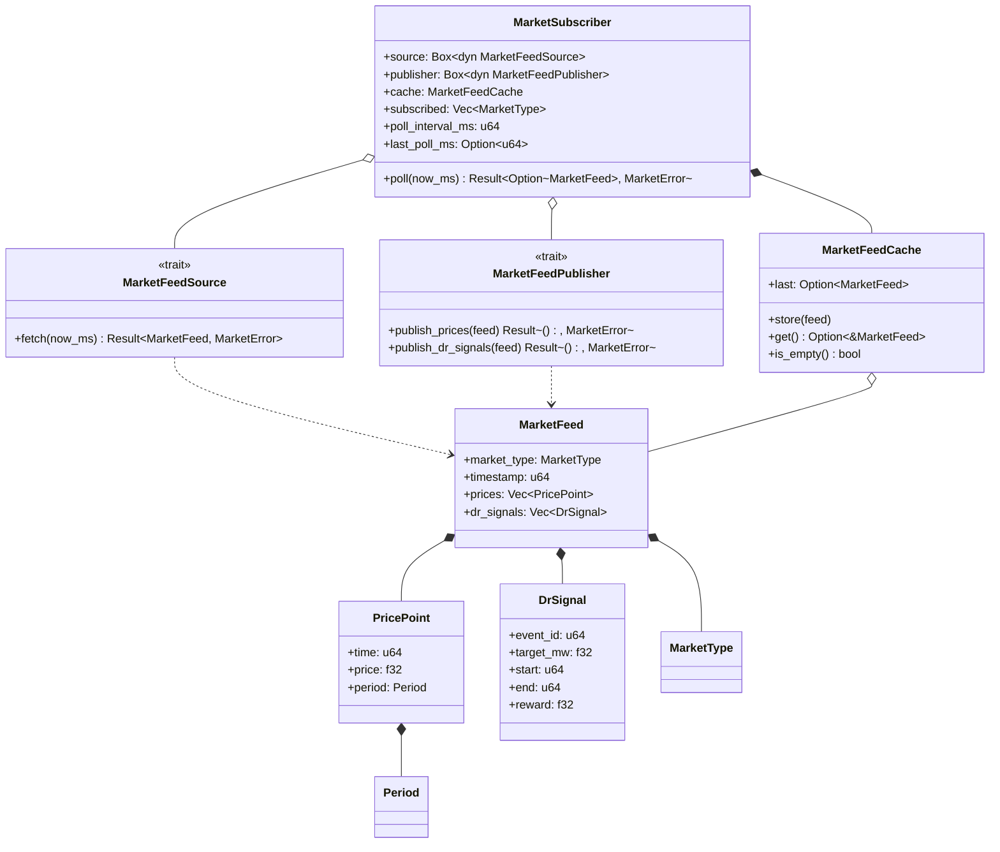
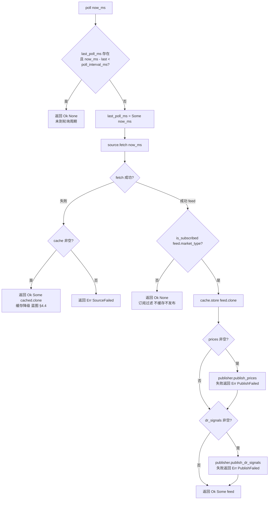
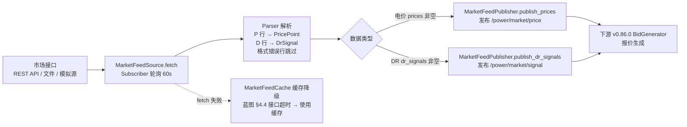

# EnerOS v0.85.0 市场数据订阅设计文档

> **版本**：v0.85.0
> **Phase**：Phase 2 多机联邦
> **子系统**：`crates/agents/energy-market-agent`（subsystem = agents，追加模块 `market_feed` / `parser` / `subscriber`）
> **蓝图依据**：`蓝图/phase2.md` §v0.85.0
> **状态**：设计中
> **最后更新**：2026-07-17

---

## 目录

1. [版本目标](#1-版本目标)
2. [前置依赖](#2-前置依赖)
3. [交付物清单](#3-交付物清单)
4. [数据结构](#4-数据结构)
5. [接口设计](#5-接口设计)
6. [错误处理](#6-错误处理)
7. [选型对比](#7-选型对比)
8. [实现路径](#8-实现路径)
9. [测试计划](#9-测试计划)
10. [验收标准](#10-验收标准)
11. [风险与坑点](#11-风险与坑点)
12. [偏差声明（D1~D14）](#12-偏差声明d1d14)

---

## 1. 版本目标

### 1.1 核心目标

v0.85.0 在 v0.72.0 Energy/Market Agent 基础（`MarketData` / `MarketChannel` / `MarketDataSource`）之上，进入 P2-C 子阶段 Agent 矩阵扩展的第四步，交付 **市场数据订阅（Market Subscription）**：在既有 `eneros-energy-market-agent` crate 中追加 3 个新模块，订阅现货 / 辅助服务 / DR（需求响应）市场数据，解析后发布到 `/power/market/price` 与 `/power/market/signal` 两个 Topic：

- `market_feed.rs` — 市场数据源数据模型（`MarketType` / `Period` / `PricePoint` / `DrSignal` / `MarketFeed` / `MarketError`）
- `parser.rs` — 文本行解析（`parse_price_point` / `parse_dr_signal` / `parse_feed`，手写 `core::str` 解析，无 `serde_json`）
- `subscriber.rs` — 订阅管理（`MarketFeedSource` / `MarketFeedPublisher` trait + Mock + `MarketFeedCache` last-good 缓存 + `MarketSubscriber` 轮询门控 / 缓存降级 / 订阅过滤）

本版本严格遵循 Karpathy 4 原则：
- **Simplicity First**：仅追加 3 个新源文件 + 一个配置模板 + 本设计文档；不新增 crate、不新增依赖、不修改 v0.72.0 既有源代码。
- **Surgical Changes**：`lib.rs` 仅追加 3 个 `pub mod` + 3 行 `pub use` 重导出；`Cargo.toml` 仅更新 `description` 字段；v0.72.0 既有 25 个测试必须无回归。

### 1.2 业务价值

| 业务价值 | 说明 |
|---------|------|
| **v0.86.0 报价生成** | `BidGenerator` 消费 `MarketFeed`（`PricePoint` / `DrSignal`）生成市场报价，本版本是其唯一数据输入通道 |
| **VPP 参与需求响应** | DR 信号（`event_id` / `target_mw` / `start` / `end` / `reward`）是 VPP 响应需求侧事件的触发输入 |
| **现货套利** | 现货电价点（`time` / `price` / `period`）为储能充放电调度提供价格信号 |
| **辅助服务市场** | `MarketType::AncillaryService` 支持调频 / 备用等辅助服务数据订阅 |
| **缓存降级可靠性** | 市场接口中断时 last-good 缓存保证下游 BidGenerator 可继续工作（蓝图 §4.4） |

### 1.3 Phase 定位

| 维度 | 定位 |
|------|------|
| Phase | Phase 2 多机联邦（v0.75.0~v0.126.0） |
| 子阶段 | P2-C Agent 矩阵扩展第四步 |
| 平面 | 慢平面（Agent Runtime 分区，管理信息大区） |
| 角色 | 市场数据订阅器 + 文本行解析器 + 周期轮询器 + 缓存降级器 |
| 上游版本 | v0.72.0 Energy/Market Agent（直接扩展，不破坏既有 API） |
| 下游版本 | v0.86.0 报价生成（`BidGenerator` 消费 `MarketFeed`） |

### 1.4 出口关联

本版本不构成 Phase 出口条件，但其交付物 `MarketSubscriber` / `MarketFeed` / `PricePoint` / `DrSignal` / `MarketFeedSource` / `MarketFeedPublisher` 将被以下后续版本直接复用：

- **v0.86.0 报价生成**：`BidGenerator` 消费 `MarketFeed.prices`（价格信号）与 `MarketFeed.dr_signals`（DR 事件）生成报价。
- **v0.92.0 Edge Coordinator**：联邦级市场数据汇聚与多节点报价协同。
- **v1.0.0 商用版**：MVP 联邦要求市场数据接入可用（ADR-0004，"市场数据接入可用"为蓝图 §7.5 出口判定）。

---

## 2. 前置依赖

### 2.1 前序版本依赖

| 版本 | 交付物 | 本版本使用方式 |
|------|--------|---------------|
| v0.72.0 | Energy/Market Agent（`MarketData` / `MarketChannel` / `MarketDataSource` / `MockMarketSource` / 25 tests） | 直接扩展既有 `eneros-energy-market-agent` crate（偏差 D2）；沿用 v0.72.0 `MarketDataSource` trait 抽象模式定义 `MarketFeedSource`；既有 25 tests 必须无回归 |
| v0.51.0 | 协议抽象层（`PointAccess` trait） | 本版本不直接依赖；可选未来集成方向：真实市场接口接入时可通过协议抽象层桥接（如 IEC 104 市场网关），与 v0.83.0 PCC 的 `PccReader` 桥接路径一致 |
| v0.77.0 | DDS 路由器 | 本版本不直接依赖；`MarketFeedPublisher` trait 抽象发布面（偏差 D9），真实 DDS 适配器后续注入 |
| v0.82.0 | Grid Agent（`GridSampler` / `GridPublisher` trait 模式） | 沿用 trait + Mock 模式（偏差 D8 / D9）；`MarketError` 3 变体对齐 `GridError` 3 变体（偏差 D7） |

### 2.2 外部依赖

| 依赖 | 版本 | 用途 | feature |
|------|------|------|---------|
| `alloc::boxed::Box` | core | `MarketSubscriber.source: Box<dyn MarketFeedSource>` / `publisher: Box<dyn MarketFeedPublisher>` 动态派发 | 默认 |
| `alloc::vec::Vec` | core | `MarketFeed.prices` / `dr_signals` / `subscribed: Vec<MarketType>` | 默认 |
| `core::str` 方法 | core | `split` / `trim` / `parse` 文本行解析 | 默认 |

> **说明**：本版本为算法骨架，不引入任何外部 HTTP 库、DDS 库、`serde_json` 或 `eneros-agent-bus-dds` / `eneros-time` 依赖（沿用 v0.82.0~v0.84.0 单线程 no_std 先例）。`MarketFeedSource` / `MarketFeedPublisher` trait 抽象隔离协议与总线层，真实 REST API / 文件 / DDS 适配器延后到集成阶段（偏差 D8 / D9）。SBOM 不变。

### 2.3 假设

1. **单线程 no_std 假设**：Agent Runtime 在 Phase 2 阶段为单线程模型（蓝图 §43.6 内存预算：Agent Runtime ≤ 64 MB），`MarketFeedSource` / `MarketFeedPublisher` trait 不要求 `Send + Sync`（沿用 v0.82.0 D10 单线程假设）。
2. **gPTP 已同步假设**：v0.79.0 gPTP 已完成时间同步，`now_ms: u64` 注入的时间戳可信且单调递增。
3. **市场接口可用性假设**：实际部署假设存在外部电力市场接口（REST API / 文件 / 专网直连）；蓝图 §2 阻塞条件声明"无市场接口则用模拟数据"，本版本 `kind = "simulated"` 的 Mock 源即为该假设的实现。
4. **外部调度器驱动假设**：`poll(now_ms)` 由外部调度器（Agent Runtime tick）周期驱动，本版本不内置 async runtime / ticker（偏差 D1）。

### 2.4 阻塞条件

无。本版本为算法骨架先行，不依赖真实市场接口或真实 DDS 总线。`MarketFeedSource` + `MockMarketFeedSource` / `MarketFeedPublisher` + `MockMarketFeedPublisher` 完全可单元测试。

---

## 3. 交付物清单

### 3.1 代码交付物

| # | 路径 | 类型 | 说明 |
|---|------|------|------|
| 1 | `crates/agents/energy-market-agent/src/market_feed.rs` | 源码（新增） | 市场数据模型：2 枚举 + 3 结构体 + 1 错误枚举 + T1~T12 测试（偏差 D13，内嵌单元测试） |
| 2 | `crates/agents/energy-market-agent/src/parser.rs` | 源码（新增） | 文本行解析：`parse_price_point` / `parse_dr_signal` / `parse_feed` + T13~T26 测试 |
| 3 | `crates/agents/energy-market-agent/src/subscriber.rs` | 源码（新增） | 订阅管理：2 trait + 2 Mock + `MarketFeedCache` + `MarketSubscriber` + T27~T42 测试 |
| 4 | `crates/agents/energy-market-agent/src/lib.rs` | 源码（修改） | 追加 3 个 `pub mod` + 3 行 `pub use` 重导出 + 顶部文档注释更新（surgical，仅追加） |
| 5 | `crates/agents/energy-market-agent/Cargo.toml` | 配置（修改） | `description` 字段追加 "+ v0.85.0 市场数据订阅"（无新依赖） |
| 6 | `Cargo.toml`（根） | 配置（修改） | `[workspace.package] version = "0.85.0"` |
| 7 | `Makefile` | 配置（修改） | VERSION 变量 + header 注释 → `0.85.0` |
| 8 | `.github/workflows/ci.yml` | 配置（修改） | header 注释 → `0.85.0` |
| 9 | `ci/src/gate.rs` | 源码（修改） | clippy 段 + test 段注释追加 v0.85.0 市场数据订阅 API 列表 |

### 3.2 接口交付物

| 接口 | 类型 | 用途 |
|------|------|------|
| `MarketType` | enum（3 变体） | 市场类型：`Spot` / `AncillaryService` / `DemandResponse`（默认 `Spot`） |
| `Period` | enum（3 变体） | 时段：`Peak` / `Flat` / `Valley`（默认 `Flat`，偏差 D6 新增） |
| `PricePoint` | struct（3 字段） | 电价点：`time` / `price` / `period`（偏差 D5 命名） |
| `DrSignal` | struct（5 字段） | DR 信号：`event_id: u64` / `target_mw` / `start` / `end` / `reward`（偏差 D4） |
| `MarketFeed` | struct（4 字段） | 市场数据馈送：`market_type` / `timestamp` / `prices` / `dr_signals`（偏差 D3 命名） |
| `MarketError` | enum（3 变体） | 错误：`SourceFailed` / `ParseFailed` / `PublishFailed`（偏差 D7） |
| `MarketFeedSource` | trait | 数据源抽象（偏差 D8，替代蓝图 `MarketSource` 枚举） |
| `MarketFeedPublisher` | trait | 发布抽象（偏差 D9，替代蓝图 `DdsNode`） |
| `MockMarketFeedSource` | struct | Mock 数据源 + 故障注入（`next_feed` / `fail`） |
| `MockMarketFeedPublisher` | struct | Mock 发布器 + 故障注入（`published` / `fail`） |
| `MarketFeedCache` | struct（1 字段） | last-good 缓存（偏差 D10，`last: Option<MarketFeed>`） |
| `MarketSubscriber` | struct（6 字段） | 订阅管理器：source / publisher / cache / subscribed / poll_interval_ms / last_poll_ms |
| `parse_price_point` | fn | 解析 `P,<time>,<price>,<period>` 行 |
| `parse_dr_signal` | fn | 解析 `D,<event_id>,<target_mw>,<start>,<end>,<reward>` 行 |
| `parse_feed` | fn | 多行解析，格式错误行跳过（蓝图 §4.4） |

### 3.3 文档交付物

| # | 路径 | 说明 |
|---|------|------|
| 1 | `docs/agents/market-subscription-design.md`（本文件） | 12 章节完整设计文档 + 2 Mermaid 图 + D1~D14 偏差声明（偏差 D12） |

### 3.4 测试交付物

| 测试 ID | 类型 | 位置 |
|---------|------|------|
| T1~T12 | 单元测试（12 个，market_feed） | `crates/agents/energy-market-agent/src/market_feed.rs`（`#[cfg(test)] mod tests`，偏差 D13） |
| T13~T26 | 单元测试（14 个，parser） | `crates/agents/energy-market-agent/src/parser.rs` |
| T27~T42 | 单元测试（16 个，subscriber） | `crates/agents/energy-market-agent/src/subscriber.rs` |

### 3.5 配置交付物

| # | 路径 | 说明 |
|---|------|------|
| 1 | `configs/market_source.toml` | 市场源配置模板（偏差 D12：位于 `configs/` 而非蓝图 `config/`）：`[market]` 订阅类型 + 轮询周期 / `[source]` 数据源类型 / `[publish]` Topic 路径 / `[cache]` last-good 缓存语义注释 |

### 3.6 不交付内容（明确范围）

- ❌ 真实 REST API / 文件 / 专网直连市场接口接入（延后到集成阶段，偏差 D8）
- ❌ 真实 DDS 发布（`MarketFeedPublisher` trait 抽象，DDS 适配器后续注入，偏差 D9）
- ❌ async 轮询循环 / 内置 ticker（sync `poll(now_ms)` + 外部调度器驱动，偏差 D1）
- ❌ 自动重连状态机（市场连接中断重连由 source 实现负责，见 §6.3）
- ❌ 硬件性能基准（轮询周期 60s / 端到端延迟 < 60s 标注为"集成阶段验收"，本版本仅算法骨架）
- ❌ 新增 crate（3 个模块追加到既有 `eneros-energy-market-agent`，偏差 D2）
- ❌ `serde` 序列化往返（手写文本行解析，偏差 D14）

---

## 4. 数据结构

> 本章节详细定义市场数据订阅所有公开数据结构。所有结构均满足 no_std 合规（蓝图 §43.1），不使用 `std::*`。`PricePoint` / `DrSignal` 全字段 Copy 可派生 `Copy`；`MarketFeed` 含 `Vec` 不派生 `Copy`。新类型不派生 `serde`（偏差 D14）。

### 4.1 `MarketType`

| 项 | 定义 |
|----|------|
| 类型 | enum（3 变体） |
| 变体 | `Spot`（现货市场，默认）/ `AncillaryService`（辅助服务市场）/ `DemandResponse`（需求响应） |
| 派生 | `Debug, Clone, Copy, PartialEq, Eq, Default`（`#[default]` on `Spot`） |
| 用途 | 订阅过滤键（`subscribed: Vec<MarketType>`）+ feed 类型标识 |

### 4.2 `Period`

| 项 | 定义 |
|----|------|
| 类型 | enum（3 变体） |
| 变体 | `Peak`（峰时段）/ `Flat`（平时段，默认）/ `Valley`（谷时段） |
| 派生 | `Debug, Clone, Copy, PartialEq, Eq, Default`（`#[default]` on `Flat`） |
| 用途 | `PricePoint.period` 时段标识 |
| 备注 | 偏差 D6：蓝图引用 `Period` 但未定义，本版本新增 3 变体对应电力市场峰/平/谷时段 |

### 4.3 `PricePoint`

| 字段 | 类型 | 说明 |
|------|------|------|
| `time` | `u64` | 时间点（市场时间戳，ms） |
| `price` | `f32` | 电价（元/kWh） |
| `period` | `Period` | 时段（峰/平/谷） |

- 派生：`Debug, Clone, Copy, PartialEq, Default`
- 备注：偏差 D5 — 蓝图交付物列表含 `PriceSignal`、§4.1 定义 `PricePoint`，以 §4.1 权威定义为准，`PriceSignal` 视为 `PricePoint` 的交付物别名。

### 4.4 `DrSignal`

| 字段 | 类型 | 说明 |
|------|------|------|
| `event_id` | `u64` | DR 事件标识（偏差 D4：u64 替代蓝图 `String`，Copy 语义无堆分配） |
| `target_mw` | `f32` | 目标功率（MW，正=削减/放电，负=增加/充电，符号约定由市场规则定义） |
| `start` | `u64` | 事件开始时间（ms） |
| `end` | `u64` | 事件结束时间（ms） |
| `reward` | `f32` | 响应补偿（元/MW 或元/次，单位由市场规则定义） |

- 派生：`Debug, Clone, Copy, PartialEq, Default`

### 4.5 `MarketFeed`

| 字段 | 类型 | 说明 |
|------|------|------|
| `market_type` | `MarketType` | 市场类型（订阅过滤依据） |
| `timestamp` | `u64` | feed 生成时间戳（ms） |
| `prices` | `Vec<PricePoint>` | 电价点列表（可空） |
| `dr_signals` | `Vec<DrSignal>` | DR 信号列表（可空） |

- 派生：`Debug, Clone, PartialEq, Default`（含 `Vec` 不派生 `Copy`）
- 备注：偏差 D3 — 蓝图命名 `MarketData`，但 v0.72.0 已存在 `MarketData`（字段 `price_forecast` / `current_price` / `signal_type`，形状不同）；改名 `MarketFeed` 避免 BREAKING 既有 API 与类型混淆。

### 4.6 `MarketError`

| 变体 | 语义 | 触发场景 |
|------|------|---------|
| `SourceFailed` | 数据源失败 | `source.fetch` 失败且无缓存可降级；parser 不产出此变体 |
| `ParseFailed` | 解析失败 | 文本行前缀错误 / 字段数不足 / 数字解析失败 / period 未知 |
| `PublishFailed` | 发布失败 | `publisher.publish_prices` / `publish_dr_signals` 失败 |

- 派生：`Debug, Clone, Copy, PartialEq, Eq`
- 备注：偏差 D7 — 蓝图引用 `MarketError` 但未定义；3 变体 MVP 收敛错误分类，与 v0.82.0 D10 `GridError` 3 变体一致。

### 4.7 数据结构关系图



---

## 5. 接口设计

### 5.1 `MarketFeedSource` / `MarketFeedPublisher` trait

```rust
pub trait MarketFeedSource {
    /// 拉取一次市场数据（同步语义，now_ms 参数注入）.
    fn fetch(&mut self, now_ms: u64) -> Result<MarketFeed, MarketError>;
}

pub trait MarketFeedPublisher {
    /// 发布电价点列表.
    fn publish_prices(&mut self, feed: &MarketFeed) -> Result<(), MarketError>;
    /// 发布 DR 信号列表.
    fn publish_dr_signals(&mut self, feed: &MarketFeed) -> Result<(), MarketError>;
}
```

**设计要点**：
- 偏差 D8：trait 抽象替代蓝图 `MarketSource { HttpApi(String), File(String), Simulated }` 枚举 — no_std 无 HTTP 栈 / 无文件系统；沿用 v0.82.0 `GridSampler` 模式；真实 HttpApi / File 适配器后续注入。
- 偏差 D9：trait 抽象替代蓝图 `run(&mut self, bus: &DdsNode)` + `dds::publish` — 避免 `eneros-agent-bus-dds` 重依赖；DDS 适配器后续注入。
- 不要求 `Send + Sync`（no_std 单线程假设，§2.3）。
- `fetch` 同步语义 + `now_ms` 参数注入（偏差 D1：no_std 无 async runtime / 无 `Instant` / 无 `Duration`）。

### 5.2 Mock 实现

| Mock | 字段 | 构造器 | 行为 |
|------|------|--------|------|
| `MockMarketFeedSource` | `next_feed: Option<MarketFeed>` / `fail: bool` | `new(feed)` / `new_failing()` / `with_feed(feed)` builder | `fail == true` → `Err(SourceFailed)`；`next_feed == None` → `Err(SourceFailed)`；否则 `Ok(next_feed.clone())` |
| `MockMarketFeedPublisher` | `published: Vec<MarketFeed>` / `fail: bool` | `new()` / `new_failing()` | `fail == true` → `Err(PublishFailed)`；否则记录 `feed.clone()` 到 `published` 并返回 `Ok(())` |

### 5.3 `MarketFeedCache`

| 方法 | 签名 | 语义 |
|------|------|------|
| `new` | `fn new() -> Self` | `last = None` |
| `store` | `fn store(&mut self, feed: MarketFeed)` | `last = Some(feed)`（覆盖式） |
| `get` | `fn get(&self) -> Option<&MarketFeed>` | 返回缓存引用 |
| `is_empty` | `fn is_empty(&self) -> bool` | `last.is_none()` |

- 派生 `Debug, Clone, Default`；单条 last-good 最小实现（偏差 D10），蓝图 §4.4 "接口超时 → 使用缓存"语义。

### 5.4 `MarketSubscriber`

| 方法 | 签名 | 语义 |
|------|------|------|
| `new` | `fn new(source: Box<dyn MarketFeedSource>, publisher: Box<dyn MarketFeedPublisher>, poll_interval_ms: u64) -> Self` | `subscribed = Vec::new()` / `last_poll_ms = None` / `cache = MarketFeedCache::new()` |
| `subscribe` | `fn subscribe(&mut self, mt: MarketType)` | 追加到 `subscribed`，重复订阅幂等 |
| `is_subscribed` | `fn is_subscribed(&self, mt: MarketType) -> bool` | 查询是否已订阅 |
| `cache` | `fn cache(&self) -> &MarketFeedCache` | 缓存只读访问 |
| `poll` | `fn poll(&mut self, now_ms: u64) -> Result<Option<MarketFeed>, MarketError>` | 核心轮询逻辑（见 §5.5） |

### 5.5 `MarketSubscriber::poll` 核心逻辑

1. **轮询门控**（偏差 D11）：若 `last_poll_ms == Some(last)` 且 `now_ms - last < poll_interval_ms` → `Ok(None)`（未到周期）
2. 设置 `last_poll_ms = Some(now_ms)`
3. 调用 `source.fetch(now_ms)`：
   - **失败**（蓝图 §4.4 缓存降级）：若 `cache.get()` 有数据 → `Ok(Some(cached.clone()))`；否则 → `Err(MarketError::SourceFailed)`
   - **成功** 得 `feed`：
     a. 若 `!is_subscribed(feed.market_type)` → `Ok(None)`（未订阅该类型，不缓存不发布）
     b. `cache.store(feed.clone())`
     c. 若 `!feed.prices.is_empty()` → `publisher.publish_prices(&feed)`，失败返回 `Err(PublishFailed)`
     d. 若 `!feed.dr_signals.is_empty()` → `publisher.publish_dr_signals(&feed)`，失败返回 `Err(PublishFailed)`
     e. `Ok(Some(feed))`

### 5.6 `MarketSubscriber.poll` 流程图

下图展示 `poll(now_ms)` 内的轮询门控 → source.fetch → 失败缓存降级 / 成功订阅过滤 → cache.store → publish 完整决策流程：



### 5.7 蓝图 §4.3 数据流图

下图展示市场数据从接口到两个 Topic 的端到端数据流（蓝图 §4.3 核心算法，本版本 trait 抽象后形态）：



> **说明**：本版本 `parse_feed` 在 source 实现内部调用（真实适配器从 HTTP body / 文件内容产出 `MarketFeed`）；Mock 源直接返回预构 `MarketFeed` 不经过 parser。parser 作为独立公开函数供真实适配器复用。

---

## 6. 错误处理

### 6.1 三类异常处理策略（蓝图 §4.4）

| 异常类别 | 蓝图原文 | 本版本处理策略 | 责任方 |
|---------|---------|---------------|--------|
| **接口超时** | 接口超时 → 重试 + 使用缓存 | `source.fetch` 失败 → 若 `cache.get()` 非空 → 返回缓存副本（`Ok(Some(cached.clone()))`，不报错）；缓存为空 → `Err(SourceFailed)`。重试由外部调度器下一周期自然触发（60s 后再次 poll） | `MarketSubscriber` 内部（缓存降级）+ 外部调度器（重试节奏） |
| **数据格式错误** | 数据格式错误 → 跳过 + 告警 | `parse_feed` 逐行解析，单行解析失败（前缀错误 / 字段数不足 / 数字解析失败 / period 未知）→ **跳过该行**继续下一行，不中断整体解析，无 panic。告警由调用方在适配器层记录（本版本无 log 依赖，跳过即静默） | `parser.rs` 内部（跳过语义） |
| **市场连接中断** | （蓝图 §4.4 未单列，§8.2 依赖网络可达） | 连接中断的重连逻辑由 `MarketFeedSource` 实现负责（真实 HttpApi 适配器内部维护连接状态与重连退避）；`MarketSubscriber` 仅感知 `fetch` 成功/失败二态，失败时走缓存降级路径 | source 实现（重连）+ `MarketSubscriber`（降级） |

### 6.2 `MarketError` 3 变体映射

| 变体 | 产生位置 | 传播路径 | 上层语义 |
|------|---------|---------|---------|
| `SourceFailed` | `source.fetch` 失败且缓存为空；Mock 源 `fail == true` 或 `next_feed == None` | `poll` → 调用方 | 首次启动即失败（无任何历史数据），上层应告警并延迟下游决策 |
| `ParseFailed` | `parse_price_point` / `parse_dr_signal` 单行解析失败 | 单行解析函数 → source 实现内部（`parse_feed` 跳过不传播） | 数据格式错误，单行丢弃；真实适配器可统计跳过行数用于可观测 |
| `PublishFailed` | `publisher.publish_prices` / `publish_dr_signals` 返回 `Err` | `poll` → 调用方 | 总线/发布通道异常；注意此时 `cache.store` 已完成（缓存已更新，下一周期 fetch 失败可降级） |

### 6.3 错误传播链

```
MockMarketFeedSource.fetch() → Err(MarketError::SourceFailed)
        ↓
MarketSubscriber.poll() → cache 空 → Err(MarketError::SourceFailed)
        ↓
调用方（上层 Agent / 编排器）→ 告警 + 保持使用上一次成功数据（由调用方自行持有）
```

> **发布失败顺序语义**：`poll` 步骤 c 先于 d — 若 `publish_prices` 失败返回 `Err(PublishFailed)`，`publish_dr_signals` 不再执行；但 `cache.store`（步骤 b）已完成，缓存不丢失。

### 6.4 `poll` 幂等性保证

- **轮询门控不消耗 source**：未到周期时 `Ok(None)`，source 不被调用（T 验证：Mock 源调用次数可断言）。
- **fetch 失败缓存降级**：缓存非空时返回缓存副本，`last_poll_ms` 已更新（下一周期仍按 60s 门控）。
- **订阅过滤不产生副作用**：未订阅类型的 feed 不缓存不发布，source 已被消费（feed 丢弃），`last_poll_ms` 已更新。
- **publish 失败缓存已更新**：步骤 b 先于 c/d，publish 失败不影响缓存完整性。

### 6.5 错误恢复策略

| 错误类别 | 恢复策略 | 责任方 |
|---------|---------|--------|
| `SourceFailed`（无缓存） | 上层告警；下一周期重试 poll（60s 门控） | 上层 Agent Runtime |
| `SourceFailed`（有缓存） | 自动降级（返回缓存副本，无错误） | `MarketSubscriber` 内部 |
| `ParseFailed` | 单行跳过；适配器层统计可观测 | parser + source 实现 |
| `PublishFailed` | 缓存已更新；上层重试或告警；下游可通过缓存补偿读取 | `MarketSubscriber`（缓存）+ 上层（重试） |
| 市场连接中断 | source 实现内部重连退避；`fetch` 持续失败时走缓存降级 | source 实现 |

---

## 7. 选型对比

### 7.1 市场数据接入方式对比（蓝图 §5.1）

| 维度 | REST API 轮询 | 文件导入 | 专网直连 |
|------|--------------|---------|---------|
| **实时性** | 中（60s 轮询周期内） | 低（依赖文件落地节奏） | 高（毫秒~秒级推送） |
| **集成难度** | 易（HTTP + JSON/文本） | 易（读取本地文件） | 难（专线 + 私有协议 + 认证） |
| **no_std 合规** | ⚠️ 需 no_std HTTP 客户端栈 | ⚠️ 需 no_std 文件系统（littlefs2 已具备） | ⚠️ 依赖专网协议栈 |
| **可靠性** | 中（公网抖动需缓存降级） | 高（本地文件无网络依赖） | 高（专线稳定） |
| **成本** | 低（公网/市场云平台） | 低（离线导出） | 高（专线租用 + 硬件加密机） |
| **适用场景** | 现货 / 辅助服务市场（本版本目标场景） | 历史数据回补 / 离线测试 | 大型场景 / 实时性敏感调度 |
| **蓝图结论（§5.1）** | ⭐ 采用 | 备选 | 大型场景 |
| **本版本落地** | `MarketFeedSource` trait + `MockMarketFeedSource`（simulated）；真实 HttpApi 适配器后续注入（偏差 D8） | 预留（`[source] kind = "file"`，适配器后续注入） | 不实现（Phase 2 无专线环境） |

> **决策**：遵循蓝图 §5.1 结论，REST API 轮询为目标接入方式；本版本以 trait + Mock 落地（偏差 D8），`configs/market_source.toml` 预留 `kind` / `endpoint` 字段，真实适配器在集成阶段实现 `MarketFeedSource` 后注入，无需修改 `MarketSubscriber` 任何代码。

### 7.2 数据源抽象：`MarketFeedSource` trait vs 蓝图 `MarketSource` 枚举

| 维度 | `MarketFeedSource` trait（本版本） | 蓝图 `MarketSource { HttpApi(String), File(String), Simulated }` 枚举 |
|------|-----------------------------------|-----------------------------------------------------------------------|
| **no_std 合规** | ✅ 纯 trait | ❌ `HttpApi(String)` 需 HTTP 栈；`File(String)` 需文件系统 |
| **测试便捷性** | 高（`MockMarketFeedSource` 故障注入） | 低（枚举分支需真实环境） |
| **后续扩展** | 实现 trait 即可注入新源（开放扩展） | 改枚举需改 match 分支（封闭扩展） |
| **堆分配** | 无（Mock 即时返回） | 有（`String` 端点） |
| **本版本采用** | ✅ | ❌ |

> **决策**：trait 抽象（偏差 D8），沿用 v0.82.0 `GridSampler` / v0.83.0 `PccReader` 模式。

### 7.3 发布抽象：`MarketFeedPublisher` trait vs 直接依赖 `DdsNode`

| 维度 | `MarketFeedPublisher` trait（本版本） | 蓝图 `run(&mut self, bus: &DdsNode)` |
|------|--------------------------------------|---------------------------------------|
| **crate 依赖** | 无（自包含） | 重（`eneros-agent-bus-dds` + Cyclone DDS FFI） |
| **测试便捷性** | 高（`MockMarketFeedPublisher` 断言 published） | 低（需 DDS 环境） |
| **Topic 语义** | 双方法（`publish_prices` / `publish_dr_signals`）天然对应双 Topic | 单 bus 需手动区分 Topic |
| **本版本采用** | ✅ | ❌ |

> **决策**：trait 抽象（偏差 D9），沿用 v0.82.0 `GridPublisher` 模式；DDS 适配器后续注入，将 `publish_prices` 桥接到 `/power/market/price`、`publish_dr_signals` 桥接到 `/power/market/signal`。

### 7.4 解析方式：手写 `core::str` 文本行解析 vs `serde_json`

| 维度 | 手写文本行解析（本版本） | `serde_json` |
|------|------------------------|--------------|
| **依赖** | 零依赖（`split` / `trim` / `parse`） | `serde` + `serde_json`（alloc feature） |
| **格式容错** | 单行失败跳过，不中断 | 整体反序列化失败即全失败 |
| **格式匹配** | 市场接口常见 CSV 行格式（`P,1000,0.85,peak`） | JSON（需市场接口提供 JSON 端点） |
| **类型派生** | 新类型无需派生 `serde`（偏差 D14） | 需派生 `Serialize` / `Deserialize` |
| **本版本采用** | ✅ | ❌ |

> **决策**：手写文本行解析（偏差 D14），与蓝图 §4.4 "数据格式错误 → 跳过"的行级容错语义天然匹配；v0.72.0 `MarketData` 的 `serde` 派生保留不动（surgical），新类型不派生。

### 7.5 轮询驱动：sync `poll(now_ms)` 门控 vs `async` + `interval` 循环

| 维度 | sync `poll(now_ms)` + `poll_interval_ms` 门控（本版本） | 蓝图 `async fn run` + `interval(Duration::from_secs(60))` 循环 |
|------|--------------------------------------------------------|----------------------------------------------------------------|
| **no_std 合规** | ✅ 无 async runtime / 无 `Instant` / 无 `Duration` | ❌ 依赖 tokio/embassy 等 runtime |
| **可测试性** | 高（`now_ms` 注入，门控边界精确断言） | 低（需时间 mock） |
| **调度权** | 外部调度器（Agent Runtime tick 驱动） | 内置 ticker（runtime 驱动） |
| **本版本采用** | ✅ | ❌ |

> **决策**：sync poll + 门控（偏差 D1 / D11），沿用 v0.82.0 D3/D4 + v0.83.0 D1 sync 模式；60s 周期作为 `configs/market_source.toml` 推荐默认值而非硬编码。

---

## 8. 实现路径

### 8.1 实现路径概览（5 步）

```
Step 1: 创建 market_feed.rs（6 数据结构 + T1~T12）
   ↓
Step 2: 创建 parser.rs（3 解析函数 + T13~T26）
   ↓
Step 3: 创建 subscriber.rs（2 trait + 2 Mock + Cache + Subscriber + T27~T42）
   ↓
Step 4: 修改 lib.rs 追加 pub mod + pub use（surgical）+ 版本同步（根 Cargo.toml / Makefile / ci.yml / gate.rs / crate Cargo.toml description）
   ↓
Step 5: 验证 cargo test / build / fmt / clippy / deny
```

### 8.2 Step 1：创建 `market_feed.rs`

**文件**：`crates/agents/energy-market-agent/src/market_feed.rs`（新增）

**内容**：6 数据结构（见 §4.1~§4.6）+ T1~T12 测试（见 §9）。

**验证**：`cargo build -p eneros-energy-market-agent` 通过。

### 8.3 Step 2：创建 `parser.rs`

**文件**：`crates/agents/energy-market-agent/src/parser.rs`（新增）

**内容**：
- `parse_price_point(line: &str) -> Result<PricePoint, MarketError>` — 格式 `P,<time>,<price>,<period>`（period ∈ `peak`/`flat`/`valley`，大小写不敏感）
- `parse_dr_signal(line: &str) -> Result<DrSignal, MarketError>` — 格式 `D,<event_id>,<target_mw>,<start>,<end>,<reward>`
- `parse_feed(input: &str, market_type: MarketType, timestamp: u64) -> MarketFeed` — 多行解析，格式错误行跳过（蓝图 §4.4）
- T13~T26 测试（见 §9）

**验证**：`cargo build -p eneros-energy-market-agent` 通过。

### 8.4 Step 3：创建 `subscriber.rs`

**文件**：`crates/agents/energy-market-agent/src/subscriber.rs`（新增）

**内容**：
- `MarketFeedSource` trait + `MockMarketFeedSource`（见 §5.1 / §5.2）
- `MarketFeedPublisher` trait + `MockMarketFeedPublisher`（见 §5.1 / §5.2）
- `MarketFeedCache`（见 §5.3）
- `MarketSubscriber`（6 字段 + `new` / `subscribe` / `is_subscribed` / `cache` / `poll`，见 §5.4 / §5.5）
- T27~T42 测试（见 §9）

**验证**：`cargo build -p eneros-energy-market-agent` 通过。

### 8.5 Step 4：修改 `lib.rs`（surgical）+ 版本同步

**`lib.rs` 变更**（仅追加，不修改 v0.72.0 既有代码行）：
- 顶部文档注释追加 v0.85.0 段落
- 追加 `pub mod market_feed;` / `pub mod parser;` / `pub mod subscriber;`
- 追加 3 行重导出：
  - `pub use market_feed::{DrSignal, MarketError, MarketFeed, MarketType, Period, PricePoint};`
  - `pub use parser::{parse_dr_signal, parse_feed, parse_price_point};`
  - `pub use subscriber::{MarketFeedCache, MarketFeedPublisher, MarketFeedSource, MarketSubscriber, MockMarketFeedPublisher, MockMarketFeedSource};`

**版本同步**：

| 文件 | 变更 |
|------|------|
| `Cargo.toml`（根） | `[workspace.package] version = "0.85.0"` |
| `Makefile` | `VERSION := 0.85.0` + header 注释 → `0.85.0` |
| `.github/workflows/ci.yml` | header 注释 → `0.85.0` |
| `ci/src/gate.rs` | clippy 段 + test 段注释追加：`+ v0.85.0 市场数据订阅：MarketType / Period / PricePoint / DrSignal / MarketFeed / MarketError / parse_price_point / parse_dr_signal / parse_feed / MarketFeedSource / MockMarketFeedSource / MarketFeedPublisher / MockMarketFeedPublisher / MarketFeedCache / MarketSubscriber` |
| `crates/agents/energy-market-agent/Cargo.toml` | `description` 字段追加 "+ v0.85.0 市场数据订阅" |

**workspace members 不变**：3 个新模块是既有 crate 的新文件（不新增 workspace member，不触发 §2.4.1 C1~C5 校验）。

**surgical 保证**：v0.72.0 既有源文件 `energy_agent.rs` / `error.rs` / `market.rs` / `market_agent.rs` / `runtime.rs` 完全未改动；既有 25 个测试必须仍全部通过。

### 8.6 Step 5：验证构建链

```bash
# 1. workspace 解析
cargo metadata --format-version 1 > /dev/null

# 2. 主机侧测试（v0.72.0 既有 25 个 + 本版本 42 个 = 67 个）
cargo test -p eneros-energy-market-agent

# 3. 交叉编译验证
cargo build -p eneros-energy-market-agent --target aarch64-unknown-none -Z build-std=core,alloc -Z build-std-features=compiler-builtins-mem

# 4. 格式与 lint
cargo fmt --all -- --check
cargo clippy -p eneros-energy-market-agent --all-targets -- -D warnings

# 5. 安全扫描
cargo deny check advisories licenses bans sources

# 6. workspace 回归（v0.75.0~v0.84.0 既有 crate 不受影响）
cargo test --workspace --exclude eneros-kernel --exclude eneros-hello
```

---

## 9. 测试计划

### 9.1 测试矩阵 T1~T42（42 个）

> 本版本共 42 个单元测试，覆盖市场数据订阅 API 100%。测试内嵌各源文件（偏差 D13，沿用 v0.82.0~v0.84.0 内嵌测试模式）。

#### 9.1.1 market_feed.rs（T1~T12，12 个）

| 测试 ID | 类型 | 测试名称 | 验证点 |
|---------|------|---------|--------|
| T1 | 单元 | `t1_market_type_variants` | `MarketType` 3 变体可构造（Spot / AncillaryService / DemandResponse） |
| T2 | 单元 | `t2_market_type_default` | `MarketType::default() == Spot` |
| T3 | 单元 | `t3_market_type_copy_eq` | `Copy` + `PartialEq + Eq` 派生正确 |
| T4 | 单元 | `t4_period_variants` | `Period` 3 变体可构造（Peak / Flat / Valley） |
| T5 | 单元 | `t5_period_default` | `Period::default() == Flat` |
| T6 | 单元 | `t6_price_point_construction` | `PricePoint` 3 字段构造（time / price / period） |
| T7 | 单元 | `t7_price_point_copy_eq_default` | `Copy` + `PartialEq` 派生 + `Default` 全零（time=0 / price=0.0 / period=Flat） |
| T8 | 单元 | `t8_dr_signal_construction` | `DrSignal` 5 字段构造（event_id / target_mw / start / end / reward） |
| T9 | 单元 | `t9_dr_signal_copy_eq_default` | `Copy` + `PartialEq` 派生 + `Default` 全零 |
| T10 | 单元 | `t10_market_feed_construction` | `MarketFeed` 4 字段构造（market_type / timestamp / prices / dr_signals） |
| T11 | 单元 | `t11_market_feed_default` | `MarketFeed::default()` 空结构（`prices.is_empty() && dr_signals.is_empty()`，`market_type == Spot`） |
| T12 | 单元 | `t12_market_error_variants` | `MarketError` 3 变体可构造 + `Copy` + `Eq`（SourceFailed / ParseFailed / PublishFailed） |

#### 9.1.2 parser.rs（T13~T26，14 个）

| 测试 ID | 类型 | 测试名称 | 验证点 |
|---------|------|---------|--------|
| T13 | 单元 | `t13_parse_price_point_valid` | `parse_price_point("P,1000,0.85,peak")` → `Ok(PricePoint { time: 1000, price: 0.85, period: Peak })` |
| T14 | 单元 | `t14_parse_price_point_flat_valley` | `flat` / `valley` period 解析正确 |
| T15 | 单元 | `t15_parse_price_point_case_insensitive` | `PEAK` / `Peak` / `pEaK` 大小写不敏感 |
| T16 | 单元 | `t16_parse_price_point_whitespace` | 字段含前后空白（`"P, 1000 , 0.85 , peak"`）trim 后解析成功 |
| T17 | 单元 | `t17_parse_price_point_wrong_prefix` | `"X,1000,0.85,peak"` → `Err(ParseFailed)` |
| T18 | 单元 | `t18_parse_price_point_missing_field` | `"P,1000,0.85"` 字段数不足 → `Err(ParseFailed)` |
| T19 | 单元 | `t19_parse_price_point_bad_number` | `"P,abc,0.85,peak"` / `"P,1000,xyz,peak"` → `Err(ParseFailed)` |
| T20 | 单元 | `t20_parse_price_point_unknown_period` | `"P,1000,0.85,mid"` 未知 period → `Err(ParseFailed)` |
| T21 | 单元 | `t21_parse_dr_signal_valid` | `parse_dr_signal("D,42,5.5,1000,2000,300.0")` → `Ok(DrSignal { event_id: 42, target_mw: 5.5, start: 1000, end: 2000, reward: 300.0 })` |
| T22 | 单元 | `t22_parse_dr_signal_wrong_prefix` | `"P,42,5.5,1000,2000,300.0"` → `Err(ParseFailed)` |
| T23 | 单元 | `t23_parse_dr_signal_missing_field` | 字段数不足（< 6 段）→ `Err(ParseFailed)` |
| T24 | 单元 | `t24_parse_dr_signal_bad_number` | 数字解析失败 → `Err(ParseFailed)` |
| T25 | 单元 | `t25_parse_feed_mixed_lines` | 3 行输入（1 合法 P + 1 非法 + 1 合法 D）→ `MarketFeed` 含 1 price + 1 dr_signal，无 panic（蓝图 §4.4 跳过语义） |
| T26 | 单元 | `t26_parse_feed_empty_and_blank_lines` | 空行 / 纯空白行跳过；`parse_feed("", Spot, 1000)` → 空 feed；`market_type` / `timestamp` 透传正确 |

#### 9.1.3 subscriber.rs（T27~T42，16 个）

| 测试 ID | 类型 | 测试名称 | 验证点 |
|---------|------|---------|--------|
| T27 | 单元 | `t27_mock_source_new` | `MockMarketFeedSource::new(feed)` 默认无故障，fetch 返回 `Ok(feed.clone())` |
| T28 | 单元 | `t28_mock_source_new_failing` | `new_failing()` → fetch 恒 `Err(SourceFailed)` |
| T29 | 单元 | `t29_mock_source_with_feed_builder` | `with_feed` builder 链式构造 + `next_feed == None` → `Err(SourceFailed)` |
| T30 | 单元 | `t30_mock_publisher_new` | `MockMarketFeedPublisher::new()` 默认无故障，publish 记录到 `published` |
| T31 | 单元 | `t31_mock_publisher_new_failing` | `new_failing()` → `publish_prices` / `publish_dr_signals` 恒 `Err(PublishFailed)` |
| T32 | 单元 | `t32_cache_new_empty` | `MarketFeedCache::new()` → `is_empty() == true` / `get() == None` |
| T33 | 单元 | `t33_cache_store_and_get` | `store(feed)` 后 `get() == Some(&feed)` / `is_empty() == false`；再次 store 覆盖 |
| T34 | 单元 | `t34_subscriber_new` | `MarketSubscriber::new` 6 字段构造：`subscribed` 空 / `last_poll_ms == None` / `cache.is_empty()` |
| T35 | 单元 | `t35_subscribe_and_is_subscribed` | `subscribe(Spot)` 后 `is_subscribed(Spot) == true`，`is_subscribed(DemandResponse) == false` |
| T36 | 单元 | `t36_subscribe_idempotent` | 重复 `subscribe(Spot)` 幂等（`subscribed.len() == 1`） |
| T37 | 单元 | `t37_first_poll_fetches` | 新建 subscriber（`last_poll_ms = None`）+ 已订阅 Spot + source 返回 Spot feed → `poll(0)` 返回 `Ok(Some(feed))`，cache 已存储，publisher 已记录 |
| T38 | 单元 | `t38_interval_gate` | `poll_interval_ms = 60_000`，`poll(0)` 成功后 `poll(30_000)` → `Ok(None)`（未到周期），source 未被二次调用 |
| T39 | 单元 | `t39_poll_after_interval` | `poll(0)` 成功后 `poll(60_000)` → 第二次重新 fetch（`now_ms - last >= poll_interval_ms` 边界） |
| T40 | 单元 | `t40_source_failure_with_cache_degrades` | `poll(0)` 成功（cache 已存），source 设 fail，`poll(60_000)` → `Ok(Some(cached_feed))`（缓存降级，蓝图 §4.4） |
| T41 | 单元 | `t41_source_failure_without_cache_errors` | 新建 subscriber + source 恒 fail + 首次 `poll(0)` → `Err(MarketError::SourceFailed)` |
| T42 | 单元 | `t42_unsubscribed_filtered_and_publish_failure` | ① 未订阅 DR，source 返回 DR feed → `Ok(None)`，cache 不更新，publisher 无记录；② publisher `fail = true`，source 返回 Spot feed 含 prices → `Err(PublishFailed)`（cache 已更新） |

### 9.2 集成测试

| 测试 ID | 类型 | 状态 | 说明 |
|---------|------|------|------|
| — | 真实市场接口（REST API / 文件） | ❌ 不实现（偏差 D8） | CI 无真实市场接口环境，延后到集成阶段；蓝图 §2 "无市场接口则用模拟数据" |
| — | 真实 DDS `/power/market/price` / `/power/market/signal` 发布 | ❌ 不实现（偏差 D9） | 本版本 `MarketFeedPublisher` trait 抽象，DDS 适配器后续注入 |

### 9.3 性能基准

| 测试 ID | 类型 | 状态 | 说明 |
|---------|------|------|------|
| — | 轮询周期 60s / 端到端延迟 < 60s | ❌ 不实现 | **集成阶段验收，本版本仅算法骨架** |

> **说明**：蓝图 §6.3 要求的轮询周期 60s 与 §7.2 端到端延迟 < 60s，本版本仅做算法正确性测试，不在 CI 中验证性能基线。`MockMarketFeedSource` 即时返回，单次 `poll` 算法复杂度 O(n)（n = prices + dr_signals 条数，仅 clone + Vec 操作），实际延迟远小于 1ms。性能基准由集成阶段真实市场接口 + DDS 环境回归验证。

### 9.4 回归测试

| 测试范围 | 验证内容 |
|---------|---------|
| v0.72.0 既有 25 个测试 | `cargo test -p eneros-energy-market-agent` 全绿（无回归） |
| v0.75.0~v0.84.0 既有 crate | `cargo test --workspace --exclude eneros-kernel --exclude eneros-hello` 无回归（grid-agent 130 tests / device-agent / tsn-time / agent-bus-dds） |
| aarch64 交叉编译 | `cargo build -p eneros-energy-market-agent --target aarch64-unknown-none` 通过 |

### 9.5 故障注入测试

本版本通过 Mock 的故障注入构造器覆盖失败场景：

| 故障注入构造器 | 验证点 |
|---------------|--------|
| `MockMarketFeedSource::new_failing()` | T28 / T40 / T41：source 失败路径（有缓存降级 / 无缓存报错） |
| `MockMarketFeedSource` `next_feed = None` | T29：无预设数据 → `Err(SourceFailed)` |
| `MockMarketFeedPublisher::new_failing()` | T31 / T42：发布失败 → `Err(PublishFailed)` 且 cache 已更新 |
| parser 非法行输入 | T17~T20 / T22~T25：格式错误 → `Err(ParseFailed)` / 行级跳过 |

### 9.6 GPU 优先测试规则（蓝图 §43.3）

> ⚠️ 本规则**仅适用于**：模型训练（云端）、模型量化校准、数字孪生仿真加速。
> **不适用于**：边缘推理、RTOS 控制路径、Solver 求解、市场数据订阅。

本版本 GPU 测试适用性分析：

| 测试场景 | GPU 需求 | 理由 |
|---------|---------|------|
| `MockMarketFeedSource::fetch` | ❌ 无 | 纯 Rust，struct clone 返回 |
| `parse_price_point` / `parse_dr_signal` / `parse_feed` | ❌ 无 | 纯 Rust，`core::str` 方法 |
| `MarketSubscriber::poll` | ❌ 无 | 纯 Rust，Vec 操作 + 枚举匹配 |

**结论**：本版本无 GPU 测试需求（全 Mock 纯 Rust，市场数据订阅不涉及 AI 推理；蓝图 §6.6 "不涉及 GPU"）。

---

## 10. 验收标准

### 10.1 功能验收

- [ ] **F1**：42 个单元测试（T1~T42）全部通过
- [ ] **F2**：6 数据结构（`MarketType` / `Period` / `PricePoint` / `DrSignal` / `MarketFeed` / `MarketError`）构造 + Default + Copy/Eq 派生正确（T1~T12）
- [ ] **F3**：3 解析函数正反例正确（T13~T26），`parse_feed` 格式错误行跳过（T25）
- [ ] **F4**：`MarketSubscriber` 轮询门控正确（T38 / T39）
- [ ] **F5**：缓存降级正确（T40 有缓存 / T41 无缓存）
- [ ] **F6**：订阅过滤正确（T42① 未订阅类型不缓存不发布）
- [ ] **F7**：发布失败传播正确（T42② `Err(PublishFailed)` 且 cache 已更新）
- [ ] **F8**：重复订阅幂等（T36）

### 10.2 性能验收

- [ ] **P1**：轮询周期 60s / 端到端延迟 < 60s（**集成阶段验收，本版本仅算法骨架**）

### 10.3 安全验收

- [ ] **S1**：`configs/market_source.toml` 不含密钥（endpoint 预留空串，凭证由密钥管理组件负责）
- [ ] **S2**：解析器无 panic 路径（任意非法输入 → `Err(ParseFailed)` 或行级跳过，T17~T26）
- [ ] **S3**：fetch 失败无缓存时明确报错而非静默返回空数据（T41）
- [ ] **S4**：v0.72.0 既有 25 个测试无回归

### 10.4 文档验收

- [ ] **D1**：本设计文档 12 章节完整
- [ ] **D2**：Mermaid 图渲染正常（数据结构关系图 + `poll` 流程图 + 蓝图 §4.3 数据流图）
- [ ] **D3**：D1~D14 偏差声明表完整（与 spec.md 一致）
- [ ] **D4**：`cargo doc -p eneros-energy-market-agent` 无 warning

### 10.5 出口判定

- [ ] **E1**：T1~T42 全绿（42 个测试）
- [ ] **E2**：v0.72.0 既有 25 个测试全绿（无回归）
- [ ] **E3**：v0.75.0~v0.84.0 既有 crate 无回归
- [ ] **E4**：aarch64-unknown-none 交叉编译通过
- [ ] **E5**：`cargo fmt --all -- --check` 通过
- [ ] **E6**：`cargo clippy -p eneros-energy-market-agent --all-targets -- -D warnings` 无 warning
- [ ] **E7**：`cargo deny check advisories licenses bans sources` 通过
- [ ] **E8**：目录结构校验 C1~C15 全部通过（蓝图 §2.4）— 本版本不新增 crate，仅追加模块与配置文件
- [ ] **E9**：市场数据接入算法骨架可用（**本版本仅算法骨架，性能验收延后到集成阶段**）
- [ ] **E10**：surgical changes 保证 — v0.72.0 既有源文件 `energy_agent.rs` / `error.rs` / `market.rs` / `market_agent.rs` / `runtime.rs` 完全未改动

---

## 11. 风险与坑点

### 11.1 技术风险

| 风险 | 影响 | 缓解措施 | 解决版本 |
|------|------|---------|---------|
| 市场接口格式差异（蓝图 §5.4 难点） | 不同市场（省间/省内/现货/辅助服务）接口格式不同，单一 parser 无法覆盖 | 本版本 parser 定义 MVP 文本行格式（`P,...` / `D,...`）；真实适配器在 `MarketFeedSource` 实现内部做格式转换（各自市场的 JSON/XML → MarketFeed），parser 仅作为通用工具函数 | 集成阶段 |
| 时区处理（蓝图 §8.5 坑点：市场时间 vs 本地时间） | `PricePoint.time` / `DrSignal.start/end` 若为市场时区时间，与 `now_ms`（本地 gPTP）不一致会导致门控/有效性判断错误 | 约定所有时间戳为统一时基（gPTP 同步后的 ms 时间戳，§2.3 假设 2）；真实适配器负责市场时间 → 统一时基转换 | 本版本（约定）+ 集成阶段（转换） |
| 缓存陈旧 | 市场接口长时间中断时，last-good 缓存可能严重过期，下游 BidGenerator 基于陈旧价格报价 | 本版本缓存无 TTL（最小实现）；上层可通过 `poll` 返回的 `feed.timestamp` 判断新鲜度；后续版本可扩展 TTL 字段 | 后续版本 |
| 真实 fetch 阻塞 | 真实 REST API 请求可能阻塞数秒，影响 Agent tick | 本版本 Mock 即时返回，无阻塞；真实适配器实现时需内置超时（`fetch` 签名含 `now_ms` 可用于超时判断） | 集成阶段 |
| `Box<dyn MarketFeedSource>` 后无法直接访问 Mock 内部状态 | 测试时无法直接断言 `next_feed` / `fail`，需通过 `poll` 返回值间接验证 | 测试用例在装箱前设置 Mock 状态，通过 `poll` 行为间接断言（T40 模式：先成功后 fail） | — |

### 11.2 依赖风险

| 风险 | 影响 | 缓解措施 | 解决版本 |
|------|------|---------|---------|
| 无新第三方依赖 | 无 | SBOM 不变；`cargo deny check` 回归 | — |
| v0.72.0 `MarketData` 与本版本 `MarketFeed` 命名相近 | 上层可能混淆两个类型（`MarketData` 为 v0.72.0 Agent 间通道数据；`MarketFeed` 为本版本市场订阅馈送） | 偏差 D3 改名即为避免混淆；文档明确分工：`MarketData` 走 `MarketChannel`（Agent 间），`MarketFeed` 走 `MarketFeedPublisher`（对外 Topic） | 本版本（D3） |

### 11.3 资源风险

| 风险 | 影响 | 缓解措施 |
|------|------|---------|
| 市场订阅模块内存预算（蓝图 §43.6 Agent Runtime ≤ 64 MB） | 实际占用远小于此（算法骨架） | `MarketSubscriber` 主体约 64 字节（2 Box + cache(Option<MarketFeed> 视 Vec 容量) + Vec<MarketType> + u64 + Option<u64>）；`MarketFeed` 堆占用 = prices/dr_signals 条数 × (16 / 24 字节)；单条缓存上限可控 |
| prices / dr_signals 列表无界增长 | 恶意/异常源返回超大 feed 导致堆膨胀 | 本版本信任 source 实现（内部代码）；真实适配器应在 fetch 内限制单 feed 条数上限（如 96 时段 × 24 点） | 

### 11.4 兼容风险

| 风险 | 影响 | 缓解措施 |
|------|------|---------|
| 与 v0.72.0 `MarketAgent` 共存 | 本版本 `MarketSubscriber` 独立组件，不嵌入 `MarketAgent`，无兼容风险 | surgical：不修改 v0.72.0 `MarketAgent` 字段与构造器签名；用户可在自己的 Agent 中组合 `MarketAgent` + `MarketSubscriber` |
| v0.86.0 报价生成消费接口变更 | `BidGenerator` 消费 `MarketFeed`，若本版本字段变更需同步 | 数据结构以 spec.md 为契约；CI 回归测试 |

### 11.5 坑点

1. **`now_ms` 必须单调递增**：轮询门控依赖 `now_ms - last >= poll_interval_ms`。若 `now_ms` 回绕（系统时钟跳变），减法下溢会导致门控行为异常（u64 减法下溢在 debug 下 panic，release 下 wrap 为巨大值导致永远重新 fetch）。缓解：调用方保证 `now_ms` 单调（gPTP 已同步假设，§2.3）；实现用 `saturating_sub` 防御。

2. **首次 poll 立即执行**：`last_poll_ms = None` 时门控不生效，首次 `poll(0)` 立即 fetch。坑点：不要在 `new` 中将 `last_poll_ms` 初始化为 `Some(0)`（那会导致 `poll(0)` 被门控拦截，首次数据延迟一个周期）。

3. **缓存降级返回的是缓存副本而非新 fetch 数据**：`Ok(Some(cached.clone()))` 的 `timestamp` 是历史时间戳，调用方需通过 `feed.timestamp` 判断数据新鲜度，不能假设 `Ok(Some)` 即为最新数据。

4. **publish 失败时 cache 已更新**：步骤 b（`cache.store`）先于步骤 c/d（publish）。坑点：`Err(PublishFailed)` 不代表缓存未更新 — 下一周期 fetch 失败时会降级到这份"发布失败但已缓存"的数据，这是预期行为（缓存语义独立于发布结果）。

5. **未订阅类型的 feed 被静默丢弃**：`Ok(None)` 与"未到周期"返回相同，调用方无法区分。坑点：若上层需要统计未订阅 feed，需在 source 实现层记录（本版本不提供该可观测性）。

6. **period 解析大小写不敏感但前缀敏感**：`"peak"` / `"PEAK"` / `"Peak"` 均可解析，但行首前缀必须严格为大写 `P` / `D`（`"p,1000,0.85,peak"` 解析失败）。坑点：市场接口若输出小写前缀需在适配器层预处理。

---

## 12. 偏差声明（D1~D14）

> 本章节记录 v0.85.0 实现相对蓝图要求的 14 项偏差。每个偏差遵循 Karpathy "Think Before Coding" 原则：先思考蓝图意图，再决定是否偏离，并记录理由。
>
> **偏差表与 `e:\eneros\.trae\specs\develop-v0850-market-subscription\spec.md` §偏差声明（D1~D14）保持一致**，任何变更需同步更新（项目规则 §十 文档同步要求）。

### 12.1 偏差声明表

| 偏差 | 蓝图原文 | 本版本处理 | 理由 |
|------|---------|-----------|------|
| **D1** | `async fn subscribe/poll/run` + `interval(Duration::from_secs(60))` 循环 | sync `poll(&mut self, now_ms) -> Result<Option<MarketFeed>, MarketError>` + `poll_interval_ms` 门控 | no_std 无 async runtime / 无 `Instant` / 无 `Duration`；沿用 v0.82.0 D3/D4 + v0.83.0 D1 sync 模式；外部调度器驱动 tick |
| **D2** | 新 crate `crates/agents/market_agent/` | 扩展既有 `crates/agents/energy-market-agent` | v0.72.0 D12 已将 Energy+Market 合并为单 crate；新建 market_agent crate 会重复 `MarketAgent` 概念；surgical — 沿用 v0.83/v0.84 扩展既有 crate 模式 |
| **D3** | `MarketData { market_type, timestamp, prices, dr_signals }` | 命名 `MarketFeed`（文件 `market_feed.rs`） | v0.72.0 已存在 `MarketData`（字段 price_forecast/current_price/signal_type，形状不同）；改名避免 BREAKING 既有 API 与类型混淆 |
| **D4** | `DrSignal.event_id: String` | `event_id: u64` | no_std 无堆 String；Copy 语义使 `DrSignal` 可 derive Copy；与 v0.83.0 D2（pcc_id: u32）一致 |
| **D5** | 交付物列表含 `PriceSignal`，§4.1 定义 `PricePoint` | 采用 `PricePoint`（§4.1 数据结构为准） | 蓝图内部命名不一致；§4.1 为权威定义；`PriceSignal` 视为 `PricePoint` 的交付物别名 |
| **D6** | `Period` 未定义（`PricePoint.period: Period` 引用） | 定义 `Period` 枚举（`Peak`/`Flat`/`Valley`，默认 `Flat`） | 蓝图引用未定义类型；3 变体对应电力市场峰/平/谷时段 |
| **D7** | `MarketError` 引用但未定义 | 3 变体：`SourceFailed` / `ParseFailed` / `PublishFailed` | MVP 收敛错误分类；与 v0.82.0 D10 `GridError` 3 变体一致 |
| **D8** | `MarketSource { HttpApi(String), File(String), Simulated }` 枚举 | `MarketFeedSource` trait + `MockMarketFeedSource` | no_std 无 HTTP/文件系统；trait 抽象数据源（沿用 v0.82.0 D5 `GridSampler` 模式）；真实 HTTP/File 适配器后续注入 |
| **D9** | `run(&mut self, bus: &DdsNode)` + `dds::publish` | `MarketFeedPublisher` trait + `MockMarketFeedPublisher` | 避免 `eneros-agent-bus-dds` 重依赖（沿用 v0.82.0 D5/D12 `GridPublisher` 模式）；DDS 适配器后续注入 |
| **D10** | `MarketCache` 引用但未定义 | `MarketFeedCache` 结构体（`last: Option<MarketFeed>` + store/get/is_empty） | 蓝图 §4.4 "接口超时 → 使用缓存"需要缓存语义；最小实现：单条 last-good |
| **D11** | 轮询周期 60s（§6.3） | `poll_interval_ms: u64` 构造参数 + `last_poll_ms: Option<u64>` 门控 | 60s 作为推荐默认值（configs/market_source.toml）；`Option<u64>` 使首次 poll 立即执行 |
| **D12** | `docs/phase2/market_agent.md` + `config/market_source.toml` | `docs/agents/market-subscription-design.md` + `configs/market_source.toml` | 工作区规则 §2.3.3 禁止 `docs/phase2/` 平面化；工作区使用 `configs/` 而非 `config/` |
| **D13** | `tests/market_parse.rs` 集成测试 | 各新文件内 `#[cfg(test)] mod tests` 单元测试 | 沿用 v0.82.0/v0.83.0/v0.84.0 内嵌测试模式 |
| **D14** | v0.72.0 `MarketData` 派生 `serde` | 新类型不派生 `serde` | 解析器为手写文本行解析（`core::str`），不引入 `serde_json`；新类型由 parser 直接产出、crate 内消费，无需序列化往返 |

### 12.2 偏差分类

#### 12.2.1 目录与配置类（D12, D13）

- **D12**：文档位于 `docs/agents/market-subscription-design.md` + 配置位于 `configs/market_source.toml`（项目规则 §2.3.3 / §2.3）。
- **D13**：测试内嵌各源文件 T1~T42（沿用 v0.82.0~v0.84.0 内嵌模式）。

**共同理由**：遵守项目规则 §2.3 目录结构规范，与 v0.82.0~v0.84.0 模式一致。

#### 12.2.2 no_std 合规类（D1, D4, D11, D14）

- **D1**：sync `poll` 替代 `async fn` + `interval` 循环（no_std 无 async runtime）。
- **D4**：`event_id: u64` 替代 `String`（无堆分配，Copy 语义）。
- **D11**：`poll_interval_ms: u64` + `Option<u64>` 门控替代 `Duration` 硬编码。
- **D14**：手写文本行解析替代 `serde` 派生（无 `serde_json` 依赖）。

**共同理由**：no_std 单线程环境，沿用 v0.51.0~v0.84.0 先例。

#### 12.2.3 抽象隔离与简化类（D2, D3, D7, D8, D9, D10）

- **D2**：扩展既有 crate（surgical，不重复 `MarketAgent` 概念）。
- **D3**：`MarketFeed` 命名（避免与 v0.72.0 `MarketData` 混淆）。
- **D7**：`MarketError` 3 变体（MVP 收敛错误分类）。
- **D8**：`MarketFeedSource` trait 抽象数据源。
- **D9**：`MarketFeedPublisher` trait 抽象发布面。
- **D10**：`MarketFeedCache` 单条 last-good 最小缓存。

**共同理由**：Surgical Changes 原则，不破坏 v0.72.0 既有 API；trait 抽象隔离协议/总线层，保持 crate 自包含可测试。

#### 12.2.4 数据模型补全类（D5, D6）

- **D5**：`PricePoint` 命名以蓝图 §4.1 权威定义为准。
- **D6**：补全 `Period` 枚举定义（蓝图引用未定义）。

**共同理由**：蓝图内部命名/定义不一致，以 §4.1 数据结构为权威并补齐缺失类型。

### 12.3 偏差影响评估

| 偏差 | 影响范围 | 风险 | 缓解 |
|------|---------|------|------|
| D1 | sync API | 低 | no_std 合规；外部调度器驱动 |
| D2 | crate 归属 | 低 | surgical 不破坏 v0.72.0 |
| D3 | 命名 | 低 | 文档明确 MarketData / MarketFeed 分工 |
| D4 | `event_id: u64` | 低 | Copy 语义；真实适配器负责 String → u64 映射 |
| D5 | 命名 | 低 | §4.1 权威定义 |
| D6 | Period 新增 | 低 | 3 变体峰/平/谷 |
| D7 | 错误分类 | 低 | 3 变体覆盖 source/parse/publish |
| D8 | 数据源抽象 | 中 | 集成阶段桥接真实 HTTP/File 适配器 |
| D9 | 发布抽象 | 中 | 集成阶段桥接 DDS 适配器 |
| D10 | 缓存语义 | 低 | 单条 last-good；后续可扩展 TTL |
| D11 | 门控参数化 | 低 | 60s 为配置默认值 |
| D12 | 文档/配置位置 | 低 | 项目规则 §2.3 |
| D13 | 测试位置 | 低 | 沿用内嵌模式 |
| D14 | 无 serde | 低 | parser 直接产出，crate 内消费 |

### 12.4 偏差与 Karpathy 原则对照

| Karpathy 原则 | 对应偏差 | 体现 |
|---------------|---------|------|
| **Think Before Coding** | D1~D14 全部 | 每个偏差先思考蓝图意图，再决定偏离，记录理由 |
| **Simplicity First** | D1, D4, D6, D7, D10, D11, D14 | sync API；u64 id；3 变体枚举；3 变体错误；单条缓存；u64 门控；手写解析 |
| **Surgical Changes** | D2, D3, D8, D9, D12, D13 | 扩展既有 crate；改名避混淆；trait 抽象；目录遵循规则 — 不修改 v0.72.0 既有代码 |
| **Goal-Driven Execution** | D5, D6, D8, D9, D10 | 权威定义 + 类型补全 + 双 trait 抽象 + 缓存降级 — 目标先跑通市场数据订阅闭环 |

### 12.5 偏差审计追溯

每个偏差在以下两处保持一致（可追溯）：

1. **`spec.md` §偏差声明（D1~D14）**：`e:\eneros\.trae\specs\develop-v0850-market-subscription\spec.md`
2. **本设计文档 §12**：本章节 D1~D14 偏差声明表

两处内容应完全一致（本章节已逐字对照 spec.md），任何变更需同步更新（项目规则 §十 文档同步要求）。

---

## 附录 A：参考文档

| 文档 | 关联 |
|------|------|
| `蓝图/Power_Native_Agent_OS_Blueprint.md` §42/§44 | ADR 决策记录 |
| `蓝图/phase2.md` §v0.85.0 | 本版本蓝图依据（§4.3 数据流 / §4.4 错误处理 / §5.1 选型 / §6.3 性能基准） |
| `蓝图/Power_Native_Agent_OS_Version_Roadmap_v3.md` | 版本路线图 |
| `.trae/specs/develop-v0850-market-subscription/spec.md` | 本版本规格文档（D1~D14 偏差表源头） |
| `docs/agents/energy-market-agent-design.md` | v0.72.0 Energy/Market Agent 设计（本版本直接扩展基础） |
| `docs/agents/grid-agent-design.md` | v0.82.0 Grid Agent 设计（trait + Mock 模式参考） |
| `docs/agents/pcc-management-design.md` | v0.83.0 PCC 管理设计（结构参考 + 扩展既有 crate 模式参考） |
| `configs/pcc.toml` / `configs/grid_transfer.toml` | v0.83.0/v0.84.0 配置模板（本版本 `configs/market_source.toml` 风格参考） |
| `.trae/rules/记忆.md` §2.3 / §4.3 / §5.4 / §5.5 | 项目规则 |

## 附录 B：术语表

| 术语 | 含义 |
|------|------|
| MarketFeed | 市场数据馈送（4 字段：market_type / timestamp / prices / dr_signals，偏差 D3 命名） |
| MarketType | 市场类型（3 变体：Spot / AncillaryService / DemandResponse） |
| Period | 时段（3 变体：Peak / Flat / Valley，偏差 D6 新增） |
| PricePoint | 电价点（3 字段：time / price / period，偏差 D5 命名） |
| DrSignal | DR 需求响应信号（5 字段：event_id / target_mw / start / end / reward） |
| MarketError | 市场错误（3 变体：SourceFailed / ParseFailed / PublishFailed） |
| MarketFeedSource | 数据源抽象 trait（偏差 D8，替代蓝图 MarketSource 枚举） |
| MarketFeedPublisher | 发布抽象 trait（偏差 D9，替代蓝图 DdsNode） |
| MarketFeedCache | last-good 缓存（单条 `Option<MarketFeed>`，偏差 D10） |
| MarketSubscriber | 订阅管理器（6 字段，轮询门控 + 缓存降级 + 订阅过滤） |
| 轮询门控 | `now_ms - last_poll_ms < poll_interval_ms` 时跳过 fetch（偏差 D11） |
| 缓存降级 | fetch 失败时返回缓存副本（蓝图 §4.4 "接口超时 → 使用缓存"） |
| 订阅过滤 | 未订阅类型的 feed 不缓存不发布（`Ok(None)`） |
| DR | Demand Response（需求响应，电力市场需求侧事件） |
| VPP | Virtual Power Plant（虚拟电厂） |
| last-good | 最近一次成功获取的数据副本 |
| L1 路径 | Solver-only（无 LLM，实时控制） |
| L2 路径 | LLM + Solver（双脑，离线复杂规划） |
| P2-C | Phase 2 Agent 矩阵扩展子阶段 |

---

> **文档结束**。本设计文档遵循 EnerOS 项目规则 §2.3.3 文档分类规范，位于 `docs/agents/` 目录下。任何修改需同步更新本文档与 spec.md 偏差表。
