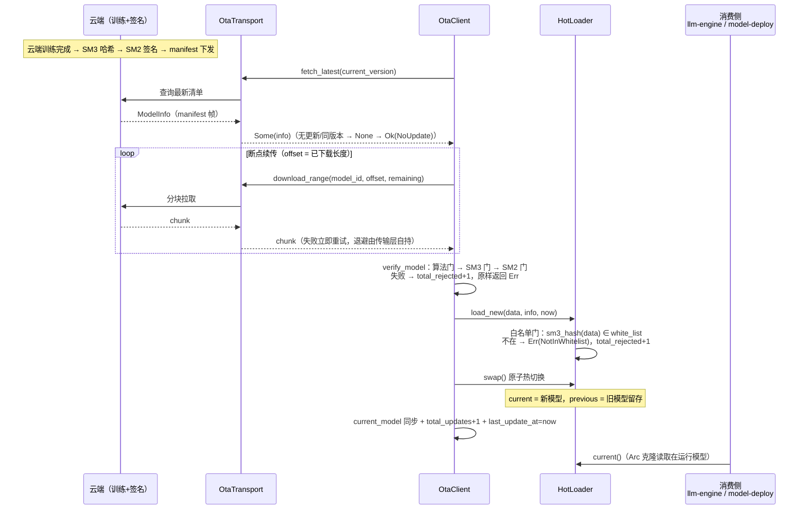

# EnerOS v0.111.0 模型 OTA 推送设计文档

> **版本**：v0.111.0（Phase 2 P2-H 第 3 版）
> **Crate**：`eneros-model-ota`（`crates/agents/model-ota/`，no_std + alloc，唯一依赖 eneros-crypto 国密）
> **蓝图**：`phase2.md` §v0.111.0
> **日期**：2026-07-20
> **关联**：上游 v0.110.0 云边数据同步 / v0.31.0~v0.33.0 国密基座；下游 v0.112.0 云端数字孪生

---

## 1. 版本目标

AI 模型需云端训练 → 签名 → 边缘热加载的远程迭代能力，免去现场维护（蓝图 §1）。无签名校验则模型可能被篡改（§2 阻塞项）。本版交付：

- **OTA 客户端**（ota_client.rs）：`check_update` 检查更新 + `download_model` 断点续传下载 + `verify_model` 验签 + `update_once`/`rollback_once` 端到端编排
- **国密双重验证**（signature.rs）：SM3 哈希 + SM2 签名三道门纯函数验证（复用 eneros-crypto）
- **模型热加载器**（model_loader.rs）：白名单 `load_new` + 原子 `swap` 热切换 + `rollback` 一键回滚（`alloc::sync::Arc` 无锁单线程惯例）
- **传输抽象与清单编解码**（lib.rs + ota_client.rs）：`OtaTransport` sync trait + `MockOtaTransport`（真实 HTTP/gRPC 适配器集成层注入）；自定义二进制 manifest 帧（magic 0x0A70 + version 1，零 serde 依赖）

打通「云端训练 → 签名 → 推送 → 验证 → 热加载」链路，为 v0.112.0 云端孪生与联邦 AI 持续演进提供模型更新通道。

## 2. 前置依赖

| 依赖版本 | 提供能力 | 本版消费点 |
|---------|---------|-----------|
| v0.11.0 用户堆 | alloc（Vec/String/Arc） | ModelInfo/模型字节缓冲/白名单/实例生命周期动态分配 |
| v0.12.0 RTC | 系统时钟 | `now: u64` 时间注入源（D8，集成层供给 load_new/update_once/rollback_once） |
| v0.31.0~v0.33.0 国密 eneros-crypto | `sm3_hash`/`sm2_verify`/`Sm2Signature`/`Sm2PublicKey` | 签名验证三道门（D7，workspace 内 path 依赖 `../../security/crypto`） |
| v0.110.0 云边数据同步 | 云边通道基座 + SyncTransport 先例 | OTA 传输通道；`OtaTransport` sync trait 设计（D4） |

Rust 工具链 nightly-2026-04-04（rust-toolchain.toml 锁定）；目标 aarch64-unknown-none + x86_64 主机测试。

## 3. 交付物清单

| 交付物 | 路径 | 说明 |
|--------|------|------|
| OTA 客户端与清单编解码 | `crates/agents/model-ota/src/ota_client.rs` | `ModelInfo`/`ModelSignature`/`SigAlgorithm`/`OtaClient`/`OtaStats` + `encode_manifest`/`decode_manifest`（D5/D6/D11） |
| 签名验证 | `crates/agents/model-ota/src/signature.rs` | `verify_model_signature` 纯函数（算法门 → SM3 门 → SM2 门，D6/D7） |
| 热加载器 | `crates/agents/model-ota/src/model_loader.rs` | `ModelInstance`/`HotLoader`（白名单 + swap + rollback，D9/D10） |
| crate 基座 | `crates/agents/model-ota/src/lib.rs` | `OtaError`（11 变体）/`OtaTransport`/`MockOtaTransport`/`OtaUpdateOutcome` + 重导出 + crate 文档（D4/D12） |
| crate 清单 | `crates/agents/model-ota/Cargo.toml` | workspace 继承，唯一 path 依赖 eneros-crypto |
| 配置文件 | `configs/model-ota.toml` | `[ota_client]`/`[hot_loader]`/`[security]` 三节 + 10 点中文注释 |
| 设计文档 | `docs/agents/model-ota-design.md` | 本文档（12 章节 + 2 Mermaid + D1~D12 偏差表） |
| 单元测试 | src 内嵌 `#[cfg(test)]` | 26 个（OC×10 + SIG×3 + HL×8 + INT×4 + PERF×1） |
| 版本同步 | 根 `Cargo.toml` / `Makefile` / `ci.yml` / `gate.rs` | 0.110.0 → 0.111.0 |

## 4. 详细设计

### 4.1 总体架构

三层结构，crate 零网络代码、零 serde 依赖：

- **传输层（OtaTransport）**：sync trait 抽象云端访问——`fetch_latest(current_version)` 查询最新清单、`download_range(model_id, offset, len)` 分块拉取模型字节。no_std 无 async runtime/std::net，真实 HTTP/gRPC 适配器在集成层注入（D4，v0.110.0 SyncTransport 同先例）；`MockOtaTransport` 供主机测试与故障注入。
- **客户端层（OtaClient）**：编排者——`check_update` 版本比对 → `download_model` 断点续传循环（失败重试 offset 从已下载长度继续）→ `verify_model` 委托三道门验签 → `update_once` 串起全流程并维护 `OtaStats` 可观测统计（total_updates/total_rejected/total_rollbacks/last_update_at）。信任锚 `trusted_pubkey: Sm2PublicKey` 构造注入（D11）。
- **加载层（HotLoader）**：`current`/`previous`/`loading` 三槽轮转——`load_new` 白名单门控将新模型置入待切换区，`swap` 原子轮换（loading → current，原 current → previous 留存），`rollback` 交换 current/previous 一键回滚。`alloc::sync::Arc` 承载实例生命周期，无锁 &mut self 单线程惯例（D9/D10）。

### 4.2 OTA 端到端时序（蓝图 §4.3 流程）



### 4.3 manifest 二进制帧格式（ota_client.rs，D5）

零 serde 依赖自定义帧（全小端 TLV，magic + version 支撑云端 API 版本演进）：

```
[magic u16 LE = 0x0A70][version u8 = 1]
[model_id_len u8 + model_id UTF-8]
[version_len u8 + version UTF-8]
[hash 32B][size u64 LE]
[sig_algo u8（0=Sm2Sm3 / 1=RsaSha256）]
[sig_len u16 LE + signature]
[sig_timestamp u64 LE][created_at u64 LE]
[cap_count u8 + 每 cap（len u8 + bytes）]
```

解码失败面统一收敛：magic 错误 / 版本不符 / 截断 / 字段越界 / 非法算法码 / 非法 UTF-8 → `Err(InvalidManifest)`（OC2 覆盖 6 种截断长度 + model_id_len 夸大的字段越界）。

### 4.4 签名验证三道门（signature.rs，D6/D7）

`verify_model_signature(data, info, pubkey)` 纯函数，顺序严格：

1. **算法门（D6）**：`info.signature.algorithm != Sm2Sm3` → `Err(UnsupportedAlgorithm)`——RsaSha256 仅占位不可验证（eneros-crypto 纯国密无 RSA，信创全程国密）
2. **SM3 门（D7）**：`sm3_hash(data) != info.hash` → `Err(HashMismatch)`——传输篡改/字节损坏在此拦截（蓝图 §4.4 安全告警）
3. **SM2 门（D7）**：签名值长度 != 64 → `Err(SignatureInvalid)`；否则 `Sm2Signature::from_bytes`（64B r‖s 大端序）解码，`sm2_verify(&hash, &sig, pubkey)` → false 或内部错误 ⇒ `Err(SignatureInvalid)`，true ⇒ `Ok(())`

签名消息为模型字节的 SM3 哈希（32 字节），与蓝图 `sm2_verify(&signature, &hash, &ca_pubkey)` 语义一致。`verify_model` 由蓝图 `Result<bool>` 改 `Result<(), OtaError>` 以区分哈希/签名失败支撑安全告警（D12）。

### 4.5 HotLoader 状态迁移（model_loader.rs，D9）

```mermaid
stateDiagram-v2
    [*] --> Stable: HotLoader::new(initial, white_list)<br/>current=v1, previous=None, loading=None
    Stable --> Loaded: load_new(data, info, now)<br/>白名单通过 → loading=Some
    Stable --> Stable: load_new 白名单拒绝<br/>Err(NotInWhitelist)，loading 保持 None
    Loaded --> Stable: swap() 原子切换<br/>loading→current，原 current→previous
    Loaded --> Loaded: load_new 重载<br/>loading 被新实例覆盖
    Stable --> Stable: swap 无 loading → Err(NothingToSwap)<br/>rollback 无 previous → Err(NoPreviousVersion)
    Stable --> Stable: rollback()<br/>current↔previous 交换（回滚后仍可再切回）
```

三槽轮转语义（HL18 覆盖 v1→v2→v3）：每次 swap 后 `previous` 恰为被替换下的上一版本，旧 previous 轮转下线（Arc 强引用归零自动释放，D10）；rollback 为 current/previous 对称交换，回滚后 previous 持有被替换下的较新版本，可再次 rollback 切回。

### 4.6 断点续传与失败语义（ota_client.rs，D4）

`download_model` 续传循环：

- `info.size == 0` → `Err(InvalidConfig)`（前置校验）
- 每轮 `download_range(&info.model_id, data.len() as u64, info.size - data.len() as u64)`：
  - 成功但 chunk 为空 → `Err(DownloadFailed)`（防蓝图死循环 bug，OC8）
  - 成功追加 `data.extend_from_slice(&chunk)`，`data.len() >= size` 退出
  - 失败 `retries += 1`，`retries > max_retries` → `Err(DownloadFailed)`（同步 trait 下立即重试，退避由传输实现层自持，D4）
- 循环后 `data.len() as u64 != info.size` → `Err(SizeMismatch)`

续传正确性由 OC6/INT24 断言：失败重试 offset 恒等于已下载长度（INT24 注入 2 次非连续失败，offset 序列 == `[0,0,4,4,8,12]` 单调前进，前段字节不重下）。

## 5. 技术交底

- **复用 eneros-crypto 选型理由（D7）**：蓝图 `sm3_hash`/`sm2_verify` 未指明实现；eneros-crypto（v0.31.0~v0.33.0）国密实现已经安全评审（常量时间/零化/Drop），记忆 §5.5/禁忌 14 禁止重复造轮子，自研重引入风险。本 crate 唯一依赖即 eneros-crypto（workspace 内 path）
- **OtaTransport sync trait（D4）**：no_std 无 async runtime/std::net/sleep，蓝图 `async check_update/download_model` + `HttpClient` + `sleep().await` 退避不可落地；改 sync trait（`fetch_latest` + `download_range`）+ 集成层注入真实 HTTP/gRPC 适配器（v0.110.0 D4 SyncTransport 同先例），主机可测；下载循环失败立即重试，退避由传输实现层自持；server_url/download_dir 移出 OtaClient
- **二进制 manifest 零 serde（D5）**：serde/serde_json 不入仓（零外部依赖，v0.110.0 D11 同先例）；自定义全小端 TLV 帧，magic 0x0A70 + version 1 支撑云端 API 版本演进
- **Arc 无锁单线程惯例（D9/D10）**：蓝图 HotLoader 用 std `Arc/Mutex/AtomicU32` + `swap_lock`，且 `mem::replace(&mut *self.current.as_ref())` 不可编译（Arc 不可变借用）、rollback 引用未声明的 `self.previous` 字段——两处编译错误必须修复；改 `alloc::sync::Arc` + 无锁 &mut self 编译期排他（v0.110.0 D4 单线程惯例），删除 swap_lock/AlreadySwapping；`ModelInstance.ref_count: AtomicU32` 删除，Arc 强引用计数即生命周期管理，「旧模型引用归零自动释放」由 Arc drop 承载
- **构造注入信任锚（D11）**：蓝图 `load_ca_pubkey().unwrap_or_default()` 静默默认空值——安全关键件禁止（空公钥语义不明，no_std 无本地安全存储抽象）；改构造注入 `trusted_pubkey: Sm2PublicKey`；删除 `ModelSignature.signer_cert` 字段，证书链验证归 v0.32.0 PKI 层职责（Karpathy 最小实现）；白名单同为构造注入，运维下发属集成层
- **LLM 必要性证据（P1-5）**：本版为模型分发通道（下载 + 验签 + 热加载），不涉及推理决策、无优化求解，LLM 推理归 v0.59.0 llm-engine 职责；Solver 亦无关（L1/L2 路径之外的基础服务）

## 6. 测试计划

26 个单元测试（src 内嵌 `#[cfg(test)]`，D3）：

| 组 | 编号 | 名称 | 断言要点 |
|----|------|------|---------|
| ota_client | OC1 | manifest 编解码往返 | 全字段（含 2 capabilities）encode→decode 逐字段相等；帧头 magic LE(0x70 0x0A)+version=1 |
| ota_client | OC2 | manifest 坏 magic / 截断 / 字段越界 | 6 种截断长度 + magic 篡改 + model_id_len 夸大 → 均 Err(InvalidManifest) |
| ota_client | OC3 | check_update 无更新 | Ok(None) |
| ota_client | OC4 | check_update 同版本 / 新版本 | Ok(None) / Ok(Some(info)) |
| ota_client | OC5 | download_model 单 chunk 成功 | 字节完整一致 + download_calls==1 |
| ota_client | OC6 | download_model 多 chunk + 1 次失败续传 | offset 序列 == [0,4,4,8]（重试 offset==已下载长度，前 4 字节不重下），最终字节一致 |
| ota_client | OC7 | download_model 连续失败超限 | Err(DownloadFailed)，调用次数 == max_retries+1 |
| ota_client | OC8 | download_model 空 chunk / size==0 | Err(DownloadFailed) / Err(InvalidConfig)（防死循环） |
| ota_client | OC9 | verify_model 哈希不匹配 | Err(HashMismatch) |
| ota_client | OC10 | verify_model 签名无效 | 错公钥 / 签名篡改 1 字节 / 签名长度非 64B 三例均 Err(SignatureInvalid) |
| signature | SIG11 | Sm2 真实签名往返 | eneros-crypto Sm2KeyPair + sm2_sign → verify_model_signature Ok(()) |
| signature | SIG12 | 篡改数据 1 字节 | Err(HashMismatch) |
| signature | SIG13 | RsaSha256 占位 | Err(UnsupportedAlgorithm)（D6） |
| model_loader | HL14 | load_new 不在白名单 | Err(NotInWhitelist)，loading 保持 None |
| model_loader | HL15 | load_new 成功 | loading 就绪（version/data/loaded_at 逐字段断言） |
| model_loader | HL16 | swap 无 loading | Err(NothingToSwap) |
| model_loader | HL17 | swap 成功 | current 更新 + previous 留存 + loading 清空 |
| model_loader | HL18 | 连续两次 swap | previous 轮转正确（v1→v2→v3） |
| model_loader | HL19 | rollback 无 previous | Err(NoPreviousVersion) |
| model_loader | HL20 | rollback 成功 | current 恢复上一版（v1），previous 变为被替换下的版本（v2） |
| model_loader | HL21 | current() Arc 克隆 | Arc::ptr_eq + 数据一致 + loaded_at 保留 |
| 集成 | INT22 | 端到端更新全流程 | Ok(Updated) + loader.current==v2 + client.current_model 同步 + total_updates==1 + last_update_at==now + total_rejected==0 |
| 集成 | INT23 | 篡改模型拒绝 | Err(HashMismatch) + total_rejected==1 + loader 零变化（Arc::ptr_eq + 版本不变） |
| 集成 | INT24 | 断点续传集成（2 次非连续失败） | Ok(Updated) + download_calls ≥ 4 + offset 序列 == [0,0,4,4,8,12] 单调前进 |
| 集成 | INT25 | 切换后回滚 | current 恢复 v1 + current_model 回滚 + total_rollbacks==1 + last_update_at==now |
| perf | PERF26 | 100MB 下载 + SM3 校验 | < 60s（cfg(test) Instant，D12）+ download_calls==100 + SM3 一致 |

## 7. 验收标准

1. `cargo test -p eneros-model-ota`：26/26 全过
2. `cargo build -p eneros-model-ota --target aarch64-unknown-none -Z build-std=core,alloc -Z build-std-features=compiler-builtins-mem`：交叉编译通过
3. `cargo clippy -p eneros-model-ota --all-targets -- -D warnings`：零警告
4. `cargo fmt -p eneros-model-ota -- --check`：通过
5. 全 workspace 回归零破坏（纯新增 crate，既有 crate 零改动；eneros-crypto 仅被 path 引用零源码改动）
6. 真实 SM2 签名往返（SIG11：eneros-crypto `sm2_sign` → `verify_model_signature` Ok(())）通过
7. 端到端篡改拒绝链路（INT23：Err(HashMismatch) + total_rejected==1 + loader 零变化）通过

## 8. 风险

| 风险 | 等级 | 缓解 |
|------|------|------|
| 恶意模型注入（传输篡改/伪造云端） | 高 | SM2 验签（信任锚构造注入，禁止默认空公钥，D11）+ 白名单双重门控；RsaSha256 占位算法直接拒绝（D6）；拒绝路径 total_rejected 可观测（D12） |
| 断网下载中断 | 中 | 断点续传（失败重试 offset 从已下载长度继续，前段不重下）+ max_retries 上限背压（D4）；退避由传输实现层自持；长断网由集成层调度下一轮 update_once |
| 热切换后新模型异常 | 中 | rollback 一键回滚 + previous 留存（D9）；rollback_once 同步 current_model + total_rollbacks 可观测（D12）；消费侧经 current() Arc 读取，切换期间读侧无撕裂 |
| 真实网络时延未验证 | 低 | 性能口径为主机 cfg(test) Instant 断言（D12）；真实网络与硬件在环为实验室项，集成阶段补测 |

## 9. 多角度要求

- **信创（全程国密 SM2/SM3）**：模型完整性 SM3、来源真实性 SM2，复用 eneros-crypto（D7）；RsaSha256 仅占位不可验证（D6），满足信创 §5.6 全程国密要求
- **安全（信任锚注入）**：`trusted_pubkey: Sm2PublicKey` 构造注入，禁止静默默认空公钥（D11）；白名单构造注入（运维下发属集成层）；`signer_cert` 字段删除，证书链验证归 v0.32.0 PKI 层；验签/白名单拒绝均计入 `total_rejected` 审计
- **性能口径声明（D12）**：「100MB 下载 + SM3 校验 < 60s」为主机 cfg(test) Instant 口径（PERF26：1MB/块 mock × 100 块），真实网络时延为实验室项，集成阶段补测（与 v0.109.0/v0.110.0 D12 口径一致）
- **内存预算声明（蓝图 §43.6）**：加载峰值内存 = 2× 模型大小（load_new 持有一份 data 克隆，swap 瞬间 current/previous 双实例并存）；LLM 7B INT4 模型归入 ≤ 4GB 分区预算，Solver/小模型归入 Agent Runtime ≤ 64MB 分区；OOM 阈值与大区一致（总用量 > 90% 触发 OOM handler）
- **GPU 不适用声明（记忆 §4.2）**：OTA 路径为字节搬运 + 哈希/验签 + 状态轮转 workload，无矩阵运算、无大规模张量，GPU 加速无意义——本 crate 零 GPU 代码，纯 CPU 处理

## 10. 接口契约

```rust
// ============ crates/agents/model-ota/src/lib.rs ============
pub enum OtaError {                             // Debug/Clone/Copy/PartialEq（D12，11 变体）
    TransportError,                             // 传输层错误（由 OtaTransport 上报）
    DownloadFailed,                             // 连续失败超 max_retries / 空 chunk 防死循环
    InvalidManifest,                            // magic 错误/版本不符/截断/字段越界
    HashMismatch,                               // 模型 SM3 哈希与清单声明不匹配
    SignatureInvalid,                           // 签名长度非 64B / 验签 false / 验签内部错误
    NotInWhitelist,                             // 模型哈希不在白名单
    NothingToSwap,                              // swap 前未 load_new
    NoPreviousVersion,                          // 无上一版本可回滚
    UnsupportedAlgorithm,                       // RsaSha256 仅占位不可验证（D6）
    InvalidConfig,                              // info.size == 0 等
    SizeMismatch,                               // 下载完成字节数与清单 size 不一致
}

pub trait OtaTransport {                        // D4（sync，no_std 单线程惯例，不要求 Send+Sync）
    /// 查询云端最新模型清单；无更新返回 Ok(None)（HTTP 204/JSON 语义由实现侧封装）。
    fn fetch_latest(&mut self, current_version: &str) -> Result<Option<ModelInfo>, OtaError>;
    /// 断点续传分块下载：返回 [offset, offset+len) 区间字节（可按块大小截断）。
    fn download_range(&mut self, model_id: &str, offset: u64, len: u64)
        -> Result<Vec<u8>, OtaError>;
}

pub struct MockOtaTransport {                   // D4（v0.110.0 MockSyncTransport 先例）
    /* latest/model_bytes/fail_remaining/chunk_size 私有 */
    pub download_calls: u32,                    // 成功下载调用次数统计（测试断言用）
}
impl MockOtaTransport {
    pub fn new(model_bytes: Vec<u8>, chunk_size: usize) -> Self;
    pub fn with_latest(latest: ModelInfo, model_bytes: Vec<u8>, chunk_size: usize) -> Self;
}
// impl OtaTransport for MockOtaTransport：fetch_latest 返回 latest 克隆；
// download_range 中 fail_remaining>0 递减返回 Err(TransportError)，否则按
// chunk_size 截断返回 [offset, offset+len) 区间字节克隆并 download_calls+1

pub enum OtaUpdateOutcome { NoUpdate, Updated } // Debug/Clone/Copy/PartialEq

// ============ src/ota_client.rs ============
pub enum SigAlgorithm { Sm2Sm3, RsaSha256 }     // Debug/Clone/Copy/PartialEq（D6）

pub struct ModelSignature {                     // Debug/Clone/PartialEq（D11：删除 signer_cert）
    pub algorithm: SigAlgorithm,
    pub signature: Vec<u8>,                     // SM2 为 64 字节 r‖s 大端序
    pub timestamp: u64,
}

pub struct ModelInfo {                          // Debug/Clone/PartialEq
    pub model_id: String,
    pub version: String,
    pub hash: [u8; 32],
    pub size: u64,
    pub signature: ModelSignature,
    pub created_at: u64,
    pub capabilities: Vec<String>,
}

pub fn encode_manifest(info: &ModelInfo) -> Vec<u8>;                  // D5（magic 0x0A70 + version 1，全小端 TLV）
pub fn decode_manifest(data: &[u8]) -> Result<ModelInfo, OtaError>;   // magic 错/截断/越界 → InvalidManifest

pub struct OtaStats {                           // Debug/Clone/Copy/PartialEq（D12，§9 可观测）
    pub total_updates: u64,
    pub total_rejected: u64,
    pub total_rollbacks: u64,
    pub last_update_at: u64,
}

pub struct OtaClient { /* current_model/trusted_pubkey/max_retries/stats 私有（D11） */ }
impl OtaClient {
    pub fn new(current_model: ModelInfo, trusted_pubkey: Sm2PublicKey, max_retries: u32) -> Self;
    pub fn check_update<T: OtaTransport>(&self, transport: &mut T)
        -> Result<Option<ModelInfo>, OtaError>;     // 无更新/同版本 → Ok(None)
    pub fn download_model<T: OtaTransport>(&self, transport: &mut T, info: &ModelInfo)
        -> Result<Vec<u8>, OtaError>;               // 断点续传（D4）
    pub fn verify_model(&self, data: &[u8], info: &ModelInfo) -> Result<(), OtaError>;  // 委托 verify_model_signature
    pub fn update_once<T: OtaTransport>(&mut self, transport: &mut T,
        loader: &mut HotLoader, now: u64) -> Result<OtaUpdateOutcome, OtaError>;        // 端到端编排（蓝图 §4.3）
    pub fn rollback_once(&mut self, loader: &mut HotLoader, now: u64) -> Result<(), OtaError>;
    pub fn current_model(&self) -> &ModelInfo;
    pub fn stats(&self) -> OtaStats;
}

// ============ src/signature.rs ============
pub fn verify_model_signature(data: &[u8], info: &ModelInfo, pubkey: &Sm2PublicKey)
    -> Result<(), OtaError>;                    // D7（算法门 → SM3 门 → SM2 门）

// ============ src/model_loader.rs ============
pub struct ModelInstance {                      // Debug/Clone/PartialEq（D10：删除 ref_count）
    pub info: ModelInfo,
    pub data: Vec<u8>,
    pub loaded_at: u64,
}

pub struct HotLoader { /* current/previous/loading/white_list 私有（D9） */ }
impl HotLoader {
    pub fn new(current: ModelInstance, white_list: Vec<[u8; 32]>) -> Self;
    pub fn load_new(&mut self, data: &[u8], info: &ModelInfo, now: u64)
        -> Result<(), OtaError>;                    // 白名单门：不在 → Err(NotInWhitelist)
    pub fn swap(&mut self) -> Result<Arc<ModelInstance>, OtaError>;     // loading 为 None → NothingToSwap
    pub fn rollback(&mut self) -> Result<(), OtaError>;                 // previous 为 None → NoPreviousVersion
    pub fn current(&self) -> Arc<ModelInstance>;
    pub fn previous(&self) -> Option<&Arc<ModelInstance>>;
}
```

## 11. 偏差声明

| 编号 | 偏差 | 理由 |
|------|------|------|
| **D1** | 蓝图 `crates/model_ota/` → `crates/agents/model-ota/`（eneros-model-ota） | 记忆 §2.3.1 强制：crate 归 `crates/<subsystem>/`；OTA 为云边推送通道，与 v0.110.0 cloud-sync / v0.95.0 cloud-coordinator 同属 agents 子系统 |
| **D2** | 蓝图 `docs/phase2/model_ota.md` → `docs/agents/model-ota-design.md` | 记忆 §2.3.3 强制：文档按方向分类（cloud-sync-design.md 同目录先例） |
| **D3** | 蓝图 `tests/model_ota.rs` → src 内嵌 `#[cfg(test)]` | v0.87.0~v0.110.0 项目惯例，不新增 tests/ 文件 |
| **D4** | 蓝图 `async check_update/download_model` + `HttpClient` + `server_url`/`download_dir` 字段 + `sleep().await` 退避 → `OtaTransport` sync trait（`fetch_latest(current_version)` + `download_range(model_id, offset, len)`）+ `MockOtaTransport`（fail_remaining 故障注入 + chunk_size 截断 + download_calls 计数，置于 lib.rs）；server_url/download_dir 移出 OtaClient；下载循环失败立即重试（退避由传输实现层自持） | no_std 无 async runtime/无 std::net/无 sleep（v0.110.0 D4 SyncTransport 同先例）；主机可测；真实 HTTP/gRPC 适配器在集成层注入；断点续传语义（offset 从已下载长度继续）保留 |
| **D5** | 蓝图 `serde_json::from_slice(&resp.body)` 解析 ModelInfo → 自定义二进制 manifest 编解码（`encode_manifest`/`decode_manifest`，magic 0x0A70 + version 1，全小端 TLV） | 零外部依赖（serde/serde_json 不入仓，v0.110.0 D11 同先例）；magic+version 支撑云端 API 版本演进 |
| **D6** | `SigAlgorithm { Sm2Sm3, RsaSha256 }` 保留 2 变体（对齐蓝图数据结构），但 RsaSha256 不可验证——`verify_model_signature` 遇之返回 `UnsupportedAlgorithm` | eneros-crypto 纯国密无 RSA（信创 §5.6 全程国密要求）；v0.110.0 D5 CompressionType 占位同先例 |
| **D7** | 蓝图 `sm3_hash`/`sm2_verify` 未指明实现 → 复用 eneros-crypto（path 依赖 `../../security/crypto`）：`sm3_hash(data) -> [u8;32]`、`sm2_verify(&hash, &Sm2Signature, &Sm2PublicKey)`、`Sm2Signature::from_bytes`（64B r‖s） | 记忆 §5.5/禁忌 14 禁止重复造轮子；国密实现已经安全评审（常量时间/零化/Drop），自研重引入风险 |
| **D8** | 蓝图 `current_time_ms()` 全局时间函数 → `now: u64` 参数注入（load_new/update_once/rollback_once） | no_std 无系统时间（v0.110.0 D7 / v0.108.0 D9 同先例）；集成层由 v0.12.0 RTC 供给 |
| **D9** | 蓝图 HotLoader 用 std `Arc/Mutex/AtomicU32` + `swap_lock` + `mem::replace(&mut *self.current.as_ref())`（不可编译：Arc 不可变借用）+ rollback 引用未声明的 `self.previous` 字段 → `alloc::sync::Arc` + 无锁 &mut self 单线程惯例：`current: Arc<ModelInstance>` / `previous: Option<Arc<ModelInstance>>` / `loading: Option<ModelInstance>`；swap 持 loading.take() + mem::replace 原子轮换并留存 previous；删除 swap_lock 与 AlreadySwapping 变体（&mut self 编译期排他） | 蓝图代码两处编译错误必须修复；v0.110.0 D4 单线程无 Send+Sync 惯例；Arc 仅在 current() 读侧克隆，写侧 &mut self 排他 |
| **D10** | 删除蓝图 `ModelInstance.ref_count: AtomicU32` | `alloc::sync::Arc` 强引用计数即生命周期管理，手写计数属重复造轮子（禁忌 14）；「旧模型引用归零自动释放」语义由 Arc drop 承载 |
| **D11** | ① 蓝图 `trusted_ca_pubkey()` 从本地存储 `load_ca_pubkey().unwrap_or_default()` → 构造注入 `trusted_pubkey: Sm2PublicKey`；② 删除蓝图 `ModelSignature.signer_cert: Sm2Cert` 字段；③ 白名单 white_list 构造注入 | ① 安全关键件禁止静默默认空值（空公钥语义不明，no_std 无本地安全存储抽象）；② 信任锚为注入公钥，证书链验证归 v0.32.0 PKI 层职责，本版不做链式验证（Karpathy 最小实现）；③ 白名单运维下发属集成层 |
| **D12** | 错误模型 `OtaError` = TransportError / DownloadFailed / InvalidManifest / HashMismatch / SignatureInvalid / NotInWhitelist / NothingToSwap / NoPreviousVersion / UnsupportedAlgorithm / InvalidConfig / SizeMismatch（11 变体，Debug/Clone/Copy/PartialEq，Copy 对齐 v0.95.0 CloudError 惯例；DownloadFailed 删除蓝图 String payload）；`verify_model` 由蓝图 `Result<bool>` 改 `Result<(), OtaError>` 区分哈希/签名失败支撑 §4.4 安全告警；新增 `OtaStats { total_updates, total_rejected, total_rollbacks, last_update_at }` 落地 §9 更新状态 metric；性能「100MB < 60s」落地为 cfg(test) Instant 主机断言 | 蓝图引用 OtaError 未定义；变体覆盖 §4.4 各失败面；bool 无法区分拒绝原因不利审计；性能口径与 v0.109.0/v0.110.0 D12 一致（真实网络时延为实验室项） |

## 12. 关联版本

- **上游**：v0.110.0 云边数据同步（OTA 通道基座，`SyncTransport` sync trait + 故障注入 mock 先例，本版 `OtaTransport`/`MockOtaTransport` 沿袭其 D4 惯例）；v0.31.0~v0.33.0 国密 eneros-crypto（`sm3_hash`/`sm2_verify`/`Sm2Signature`/`Sm2PublicKey`，workspace 内 path 依赖）；v0.11.0 用户堆（alloc）/ v0.12.0 RTC（`now` 注入源）/ v0.32.0 PKI（证书链验证职责归属，本版仅注入公钥信任锚）
- **下游**：v0.112.0 云端数字孪生主节点（模型持续演进通道——云端训练新模型 → 签名 → 推送 → 边缘热加载，本 OTA 为其模型更新链路）
- **消费侧**：v0.59.0 llm-engine / v0.61.0 model-deploy（热加载目标，经集成层接线 `loader.current()` 获取在运行模型实例；本版不接线，集成层完成）
