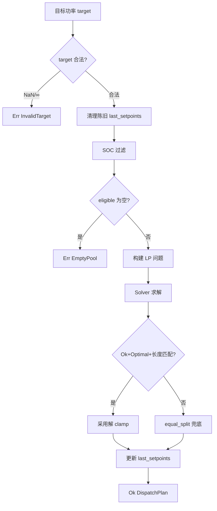
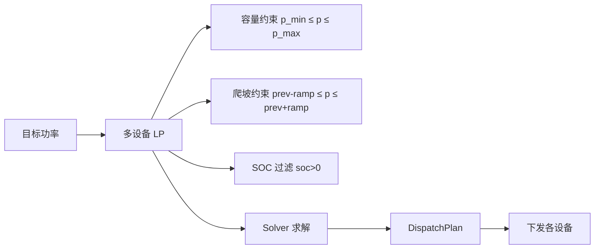

# EnerOS v0.87.0 多设备调度设计文档

## 1. 版本目标

实现 Energy Agent 多设备功率分配与全局优化能力。v0.72.0 完成单设备双脑调度，v0.86.0 完成报价生成，本版本将调度能力扩展到多设备（储能+光伏+充电桩），为 v0.88.0 多目标优化与 VPP 聚合奠定基础。

## 2. 前置依赖

- v0.72.0 Energy Agent + Market Agent（双 Agent 协作 MVP）
- v0.64.0 Solver trait + LpProblem CSR 格式
- v0.66.0 能源 LP 模型
- v0.85.0 市场数据订阅（MarketFeed）
- v0.86.0 报价生成（BidGenerator）

## 3. 交付物清单

- `crates/agents/energy-market-agent/src/device_pool.rs` — 设备能力模型与设备池
- `crates/agents/energy-market-agent/src/multi_dispatch.rs` — 多设备调度器
- `configs/device_pool.toml` — 设备清单配置模板
- `docs/agents/multi-dispatch-design.md` — 本设计文档

## 4. 数据结构

### 4.1 DeviceMode

2 变体枚举：`Auto`（默认）/ `Manual`。设备运行模式。

### 4.2 DeviceCapability

4 字段结构体：`p_min` / `p_max` / `ramp_rate` / `efficiency`。Copy 语义，纯静态能力模型。

### 4.3 DevicePool

`BTreeMap<u64, DeviceCapability>` 有序设备池。迭代有序保证 LP 列映射确定性（D3）。

### 4.4 DeviceAssignment

3 字段：`device_id` / `setpoint` / `mode`。单设备调度指令。

### 4.5 DispatchPlan

4 字段：`timestamp` / `assignments` / `total_power` / `objective_value`。调度计划结果。

### 4.6 DispatchError

2 变体：`EmptyPool` / `InvalidTarget`。Solver 失败为回退非错误（D8）。

## 5. 接口设计

### 5.1 MultiDeviceDispatcher

```rust
pub struct MultiDeviceDispatcher {
    pub pool: DevicePool,
    pub solver: Box<dyn Solver>,
    pub last_setpoints: BTreeMap<u64, f32>,
}
```

### 5.2 dispatch 流程



## 6. 核心算法

### 6.1 LP 问题构建



### 6.2 目标函数

`Minimize Σ (1.0 - efficiency_i) · p_i` — 损耗最小，高效设备优先承担功率（D14）。

### 6.3 平衡约束

`Σ p_i = target` — 功率平衡，rhs_lower == rhs_upper == target。

### 6.4 爬坡约束

`prev_i - ramp_rate_i ≤ p_i ≤ prev_i + ramp_rate_i` — 相对上次设定点的变化率约束（D9）。首次 dispatch 无爬坡行。

### 6.5 设备离线重分配

dispatch 前清理已不在 pool 中的设备的 last_setpoints 条目，保证离线设备不残留约束。

## 7. 错误处理

### 7.1 DispatchError

| 错误 | 场景 | 处理 |
|------|------|------|
| EmptyPool | 空池或全部 SOC ≤ 0 | 返回 Err，上层降级 |
| InvalidTarget | target 为 NaN/±∞ | 返回 Err，上层降级 |

### 7.2 Solver 失败兜底

Solver 返回 Err / 非 Optimal / 解长度不符 → `equal_split` 平均分配兜底，`objective_value = 0.0`（蓝图 §4.4）。

### 7.3 容量钳制

无论 solver 路径还是兜底路径，setpoint 均 clamp 到 `[p_min, p_max]`。

## 8. 选型对比

| 方案 | 优点 | 缺点 | 采用 |
|------|------|------|------|
| 比例分配 | 简单、无依赖 | 非全局最优、不考虑效率差异 | 兜底方案 |
| 贪心 | 简单、快 | 局部最优、无约束保证 | 不采用 |
| LP（HiGHS） | 全局最优、约束完备 | 需求解器、计算开销 | ⭐ 主方案 |

## 9. 实现路径

1. `device_pool.rs`：DeviceMode + DeviceCapability + DevicePool
2. `multi_dispatch.rs`：DeviceAssignment + DispatchPlan + DispatchError + equal_split + MultiDeviceDispatcher
3. `lib.rs`：追加 pub mod + pub use
4. 配置 + 文档

## 10. 测试计划

- T81~T92：device_pool 数据结构、增删查、有序迭代
- T93~T120：multi_dispatch 数据结构、equal_split（含 clamp/空输入）、dispatch 校验、LP 构造正确性、求解路径、三类兜底、5 设备协同、设备增减兼容、离线重分配

## 11. 验收标准

- [ ] 144 tests 全部通过（104 既有 + 40 新增）
- [ ] aarch64-unknown-none 交叉编译通过
- [ ] cargo fmt + clippy 无 warning
- [ ] 无回归（grid-agent/device-agent/tsn-time/agent-bus-dds）

## 12. 风险与坑点

1. **蓝图 §8.5 爬坡约束过紧**：蓝图原始代码 `p_i ≤ ramp_rate` 语义错误，已修正为 `|Δp| ≤ ramp`（D9）。
2. **SOC 无法换算功率界**：DeviceCapability 无能量容量字段，MVP 采用确定性可用性过滤（D10）。
3. **求解器不可用时必须兜底**：equal_split 保证任何情况下都有调度结果。

## 偏差声明（D1~D14）

| 偏差 | 蓝图原文 | 本版本处理 | 理由 |
|------|---------|-----------|------|
| **D1** | `pub async fn dispatch(&self, target, socs)` | sync `fn dispatch(&mut self, target, socs, now_ms)` | no_std 无 async runtime |
| **D2** | `crates/agents/energy_agent/src/` | 扩展既有 `crates/agents/energy-market-agent` | v0.72.0 已合并 Energy+Market |
| **D3** | `HashMap<DeviceId, DeviceCapability>` | `BTreeMap<u64, DeviceCapability>` | no_std 无 HashMap；有序迭代确定性 |
| **D4** | `device_id: String` / `DeviceId` | `device_id: u64` | no_std 无堆 String；Copy 语义 |
| **D5** | `solver: Arc<dyn Solver>` | `solver: Box<dyn Solver>` | no_std 单线程；已是既有依赖 |
| **D6** | `OptProblem::new()` DSL | 直接构建 LpProblem CSR | 蓝图 DSL 不存在；复用既有接口 |
| **D7** | `DeviceMode` 引用未定义 | 定义 2 变体枚举 | 蓝图引用未定义类型 |
| **D8** | `DispatchError` 引用未定义 | 2 变体：EmptyPool / InvalidTarget | Solver 失败为回退非错误 |
| **D9** | `p_i ≤ ramp_rate` | `prev - ramp ≤ p ≤ prev + ramp` | 蓝图语义过紧；正确为变化率约束 |
| **D10** | `socs` 参数未使用 | SOC 过滤：soc ≤ 0 跳过 | 蓝图未实现；MVP 确定性过滤 |
| **D11** | `timestamp: now_ms()` | `now_ms: u64` 参数注入 | no_std 无 Instant::now() |
| **D12** | 无上次设定点状态 | `last_setpoints` 字段 | 运行时状态归属调度器 |
| **D13** | `total_power: target` | `total_power = Σ setpoints` | clamp 后实际值可能偏离 target |
| **D14** | 目标函数未定义 | `Minimize Σ (1.0 - eff_i) * p_i` | 损耗最小，efficiency 字段有语义 |
