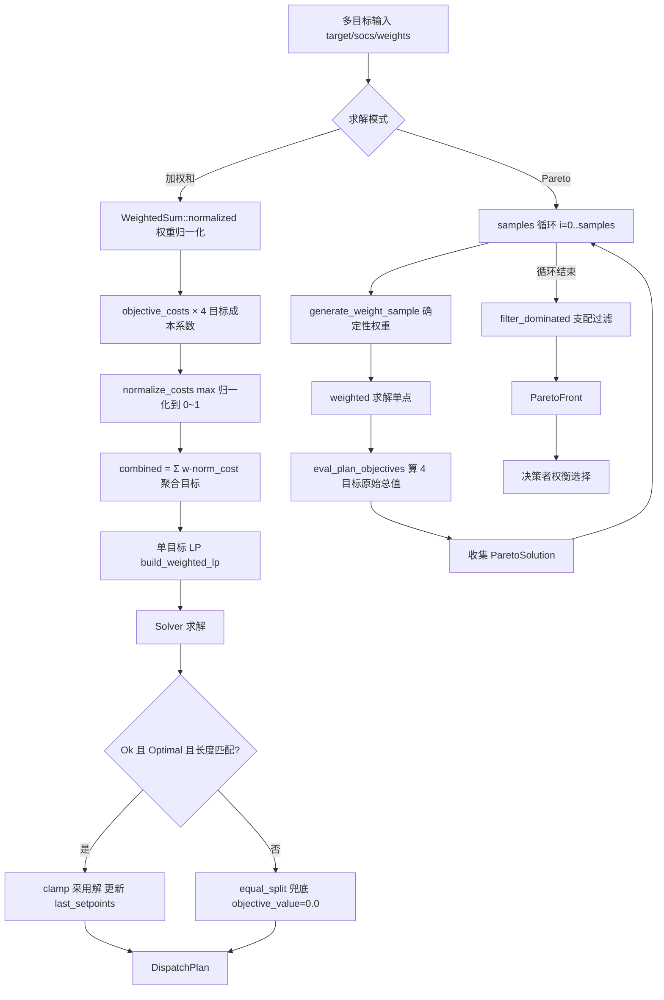
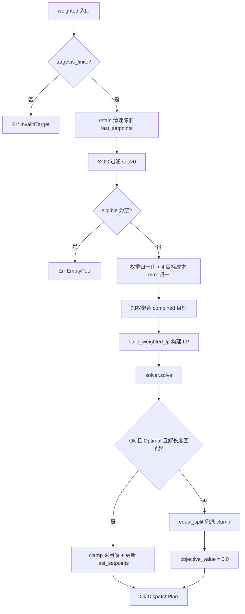

# EnerOS v0.88.0 多目标优化设计文档

## 1. 版本目标

实现 Energy Agent 多目标功率优化能力。v0.87.0 完成多设备调度（损耗单一目标），本版本将优化目标扩展为 **经济 vs 寿命 vs 安全 vs 碳排** 4 目标：

- **加权和法**：将 4 目标归一化后按权重聚合为单目标 LP，实时求解（< 500ms）；
- **Pareto 前沿**：确定性权重采样扫描目标空间，产出非支配解集供决策者权衡。

本版本为 v0.92.0 多目标仲裁提供目标建模与前沿求解基础。

## 2. 前置依赖

- v0.87.0 多设备调度（DevicePool / DeviceCapability / DispatchPlan / DispatchError / equal_split）
- v0.66.0 能源 LP 模型（energy-lp-model）
- v0.64.0 solver-core（Solver trait / LpProblem CSR 格式）
- 蓝图 `phase2.md` v0.88.0 章节（9 节版本模板）

## 3. 交付物清单

- `crates/agents/energy-market-agent/src/multi_objective.rs` — 多目标优化模块（新增，自包含）
- `crates/agents/energy-market-agent/src/lib.rs` — 追加 `pub mod multi_objective;` + `pub use`
- `crates/agents/energy-market-agent/Cargo.toml` — description 更新
- `configs/multi_objective.toml` — 多目标权重配置模板
- `docs/agents/multi-objective-design.md` — 本设计文档
- 版本同步（路线图 / checklist）
- 40 个单元测试 T121~T160（文件内嵌，D12）

## 4. 数据结构

### 4.1 Objective

4 变体枚举，优化目标标识。

| 项 | 内容 |
|----|------|
| 变体 | `Economy` / `BatteryLife` / `Safety` / `Carbon` |
| 派生 | `Debug, Clone, Copy, PartialEq, Eq, PartialOrd, Ord`（Ord 供 BTreeMap 键序，D2） |

### 4.2 WeightedSum

权重表封装，提供归一化。

| 字段 | 类型 | 说明 |
|------|------|------|
| `weights` | `BTreeMap<Objective, f32>` | 各目标权重（D2：BTreeMap 保证迭代有序、输出确定） |

- `normalized()`：非法权重（任一 NaN/负值/非有限，或总和 ≤ 0）→ 4 目标各 0.25 均权（D10）；合法 → 除以总和，归一后总和恒 1.0。
- 派生：`Debug, Clone`。

### 4.3 ParetoSolution

前沿单点：一组权重与其方案的 4 目标原始总值。

| 字段 | 类型 | 说明 |
|------|------|------|
| `weights` | `BTreeMap<Objective, f32>` | 产生该解的归一化权重 |
| `plan` | `DispatchPlan` | 该权重下的调度方案（复用 v0.87.0） |
| `objectives` | `BTreeMap<Objective, f32>` | 方案 4 目标原始总值（Σ cost·setpoint，D13） |

### 4.4 ParetoFront

前沿集合封装：`solutions: Vec<ParetoSolution>`，支配过滤后仅存非支配解（D14）。

### 4.5 MultiObjectiveOptimizer

多目标优化器主结构。

| 字段 | 类型 | 说明 |
|------|------|------|
| `pool` | `DevicePool` | 设备池（复用 v0.87.0） |
| `solver` | `Box<dyn Solver>` | LP 求解器（D3：no_std 单线程用 Box） |
| `last_setpoints` | `BTreeMap<u64, f32>` | 上次设定点（爬坡约束 + 陈旧清理，沿用 v0.87.0） |

### 4.6 核心算法流程

## 5. 接口设计

### 5.1 接口签名与语义

| 接口 | 签名 | 语义 |
|------|------|------|
| `weighted` | `pub fn weighted(&mut self, target: f32, socs: &BTreeMap<u64, f32>, w: &WeightedSum, now_ms: u64) -> Result<DispatchPlan, DispatchError>` | 加权聚合单目标 LP 求解（D4：补 target/socs/now_ms；&mut 因 Solver::solve + last_setpoints） |
| `pareto` | `pub fn pareto(&mut self, target: f32, socs: &BTreeMap<u64, f32>, samples: usize, now_ms: u64) -> Result<ParetoFront, DispatchError>` | 权重采样扫描 + 支配过滤产出前沿 |
| `objective_costs` | `fn objective_costs(obj: Objective, caps: &[DeviceCapability]) -> Vec<f32>` | 4 目标确定性成本系数（D8 公式 + 退化兜底 1.0） |
| `normalize_costs` | `fn normalize_costs(costs: &mut [f32])` | max 归一化到 [0,1]；max≤0 或全非有限 → 全 0.0（D9） |
| `generate_weight_sample` | `fn generate_weight_sample(i: usize, samples: usize) -> WeightedSum` | w_j = ((i·(j+1)) % samples + 1) 再归一化（D11，确定性扫描） |
| `filter_dominated` | `fn filter_dominated(sols: Vec<ParetoSolution>) -> Vec<ParetoSolution>` | O(n²) 支配过滤：A 支配 B ⟺ 全 ≤ 且至少一 <；相同向量保留先者（D14） |
| `eval_plan_objectives` | `fn eval_plan_objectives(plan: &DispatchPlan, pool: &DevicePool) -> BTreeMap<Objective, f32>` | 方案 4 目标原始总值 Σ cost·setpoint（D13） |
| `build_weighted_lp` | `fn build_weighted_lp(...)` 模块内私有 | 自包含 LP 构建（D7：复用 LpProblem CSR，不动 v0.87.0） |

### 5.2 目标成本系数（D8）

| 目标 | 公式 | 退化兜底 | 含义 |
|------|------|---------|------|
| Economy | `1.0 - efficiency` | — | 损耗代理，高效设备优先 |
| BatteryLife | `1.0 / p_max` | p_max ≤ 0 → 1.0 | 浅充放：大功率设备优先承担 |
| Safety | `1.0 / ramp_rate` | ramp ≤ 0 → 1.0 | 响应能力优先 |
| Carbon | `1.0 - efficiency` | — | 效率代理排放 |

### 5.3 weighted 9 步流程

1. 目标校验：`target.is_finite()`，否则 `Err(InvalidTarget)`；
2. 陈旧清理：`last_setpoints.retain` 剔除已离线设备条目；
3. SOC 过滤：`soc <= 0` 设备本轮跳过（沿用 v0.87.0）；
4. 空池校验：eligible 为空 → `Err(EmptyPool)`；
5. 权重归一化：`w.normalized()`（非法 → 各 0.25，D10）；
6. 成本计算：`objective_costs` × 4 → `normalize_costs` 逐目标归一（D9）；
7. 加权聚合：`combined_i = Σ_obj w_obj * norm_cost_obj_i`；
8. LP 求解：`build_weighted_lp`（容量/爬坡/平衡约束同 v0.87.0）→ `solve`；
9. 解采用：Ok+Optimal+长度匹配 → clamp 到 [p_min, p_max]、更新 last_setpoints；否则 `equal_split` 兜底、`objective_value = 0.0`。

### 5.4 weighted 决策流程

## 6. 错误处理

| 场景 | 处理 | 说明 |
|------|------|------|
| `DispatchError::EmptyPool` | 返回 Err | 空池或全部 SOC ≤ 0，上层降级 |
| `DispatchError::InvalidTarget` | 返回 Err | target 为 NaN/±∞ |
| Solver 返回 Err / 非 Optimal / 解长度不符 | `equal_split` 兜底，`objective_value = 0.0` | 回退非硬错误（D5） |
| `pareto` 中 samples = 0 | `Ok` 空 front | 空 front 即"采样不足"提示，MVP 语义（D13） |

无论求解路径还是兜底路径，setpoint 均 clamp 到 `[p_min, p_max]`。

## 7. 选型对比

蓝图 §5.1 三方案对比：

| 方案 | 实时性 | 实现复杂度 | 确定性 | 适用场景 | 采用 |
|------|--------|-----------|--------|---------|------|
| 加权和法 | ⭐ < 500ms（单次 LP） | 低（聚合为单目标） | 强（权重确定即解确定） | 实时调度主路径 | ⭐ 实时首选 |
| ε-约束法 | 中（多次 LP） | 中（ε 网格调参） | 强 | 主目标明确、其余设限 | 备选 |
| NSGA-II | 差（种群进化迭代） | 高（编码/交叉/变异） | 弱（随机进化） | 离线前沿分析 | 离线分析用 |

## 8. 实现路径（Karpathy 4 原则落点）

| 原则 | 落点 |
|------|------|
| Think Before Coding | D1~D14 偏差表先行：蓝图中 HashMap/Arc/DSL/未定义引用全部在编码前裁决 |
| Simplicity First | BTreeMap + Box 最简组合；复用 v0.87.0 的 DevicePool/DispatchPlan/DispatchError/equal_split 与 solver-core 的 Solver/LpProblem，零新增依赖 |
| Surgical Changes | 仅追加 `multi_objective.rs` 新文件 + `lib.rs` 追加 mod/use + Cargo.toml description；v0.87.0 既有文件一行不动（D7） |
| Goal-Driven | 40 个新测试（T121~T160）+ crate 总数 184（144 既有 + 40 新增）全过为完成标准 |

## 9. 测试计划

| 组 | 范围 | 内容 |
|----|------|------|
| T121~T124 | Objective | 枚举变体、Ord 排序、Copy 语义、BTreeMap 键序 |
| T125~T131 | WeightedSum | 构造/归一化总和 1.0、NaN→均权、负值→均权、总和≤0→均权、缺省目标补 0、全零→均权 |
| T132~T134 | Pareto 结构 | ParetoSolution/ParetoFront 构造与字段访问 |
| T135~T138 | objective_costs | 4 目标公式正确性、p_max≤0 兜底、ramp≤0 兜底、效率边界 |
| T139~T140 | normalize_costs | max 归一化到 [0,1]；max≤0/全非有限→全 0.0 |
| T141~T143 | 权重采样 | generate_weight_sample 确定性、归一化、不同 i 散布 |
| T144 | eval | eval_plan_objectives 4 目标原始总值正确性 |
| T145~T153 | weighted | 目标校验、空池、SOC 过滤、单/多设备求解、clamp、兜底三类、last_setpoints 更新、权重倾向性（安全权重高→高爬坡设备多承担） |
| T154~T155 | 支配过滤 | filter_dominated 支配剔除、相同向量保留先者 |
| T156~T158 | pareto | samples=0 空 front、小样本端到端、前沿非支配性 |
| T159~T160 | 权衡与滚动 | 不同权重产出不同方案、连续两周期滚动调度 |

crate 测试总数：144（既有）+ 40（新增）= **184**。

## 10. 验收标准

- [ ] 加权求解 < 500ms（集成阶段验收，本版本交付算法骨架 + 单元测试）
- [ ] Pareto(50) < 5s（蓝图 §6.3；集成阶段验收，本版本交付算法骨架 + 单元测试）
- [ ] 安全权重最高可配置验收（蓝图 §7.3：`configs/multi_objective.toml` 中 safety = 0.4 为各权重之最）
- [ ] 184 tests 全部通过（144 既有 + 40 新增）
- [ ] aarch64-unknown-none 交叉编译通过
- [ ] cargo fmt + clippy 0 warning
- [ ] 无回归：grid-agent 130 / device-agent 24 / tsn-time 84 / agent-bus-dds 63 全过

## 11. 风险与坑点

1. **量纲归一化坑（蓝图 §8.5）**：4 目标成本量纲不同不可直接相加 → D9 max 归一化到 [0,1]，max≤0/全非有限→全 0.0。
2. **权重非法**：NaN/负值/总和≤0 → D10 自动均权各 0.25，规则确定性可测试。
3. **SOC=0 设备跳过**：沿用 v0.87.0 确定性可用性过滤，不参与 LP 列构建也不进兜底分配。
4. **Solver 失败兜底**：Err/非 Optimal/解长度不符 → equal_split，任何情况下都有调度结果。
5. **f32 精度容差**：浮点比较用 epsilon 容差，支配判断注意近似相等场景。
6. **Pareto O(n²)**：支配过滤复杂度 O(n²)，仅适合 samples ≤ 数十的规模（默认 50），更大样本需集成阶段评估。

## 12. 偏差声明（D1~D14）

| 偏差 | 蓝图原文 | 本版本处理 | 理由 |
|------|---------|-----------|------|
| **D1** | 代码于 `crates/agents/energy_agent/src/multi_objective.rs` | 扩展既有 `crates/agents/energy-market-agent` | v0.72.0 D12 已合并 Energy+Market 单 crate；新建会重复概念 |
| **D2** | weights/objectives: HashMap | BTreeMap（Objective 派生 Ord） | no_std 无 std HashMap；迭代有序输出确定 |
| **D3** | solver: Arc&lt;dyn Solver&gt; | Box&lt;dyn Solver&gt; | no_std 单线程；复用既有依赖 |
| **D4** | weighted(&self, w) 无 target/socs/时间 | weighted(&mut self, target, socs, w, now_ms) | 蓝图签名缺目标功率与 SOC；&mut 因 Solver::solve + last_setpoints |
| **D5** | Result&lt;..., SolveError&gt; | 复用 v0.87.0 DispatchError | SolveError 不存在；回退非硬错误 |
| **D6** | OptProblem DSL + plan_from | 直接构建既有 LpProblem CSR | DSL 不存在；LpProblem 为权威接口 |
| **D7** | 未提 LP 构建复用 | 模块内私有 build_weighted_lp 自包含 | Surgical：v0.87.0 文件完全不动 |
| **D8** | 4 目标成本函数未定义 | 确定性定义（§5.2 公式 + 退化兜底 1.0） | 必须是 DeviceCapability 确定性函数才可测试；Carbon 用效率代理 |
| **D9** | §5.4 归一化未给方法 | max 归一化到 [0,1]；max≤0/非有限→全 0 | 蓝图 §8.5 自认量纲坑点；max-归一化最简单 |
| **D10** | §4.4 "权重非法→均权"未定义非法 | 任一 NaN/负值/总和≤0/非有限→各 0.25 | 规则确定性可测试 |
| **D11** | generate_weight_sample 引用未定义 | w_j = ((i·(j+1)) % samples + 1) 再归一化 | 确定性扫描（no_std 无 RNG），单纯形散布 |
| **D12** | docs/phase2/multi_objective.md + tests/multi_obj.rs | docs/agents/multi-objective-design.md + 文件内嵌测试 | 工作区规则禁止 docs/phase2 平面化 |
| **D13** | eval(&plan) 引用未定义；采样不足→提示 | eval_plan_objectives 原始值 Σcost·setpoint；samples=0→Ok 空 front | 确定性；空 front 即提示 MVP 语义 |
| **D14** | filter_dominated 引用未定义 | O(n²) 支配过滤，相同向量保留先者 | 标准支配语义；samples≤数十性能足够 |
