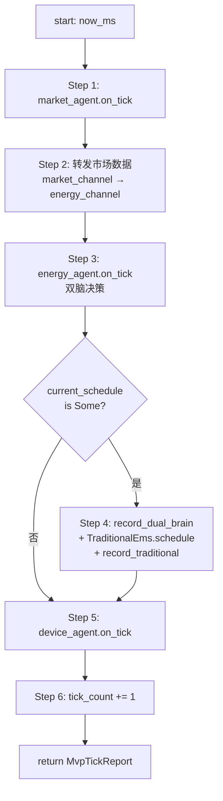
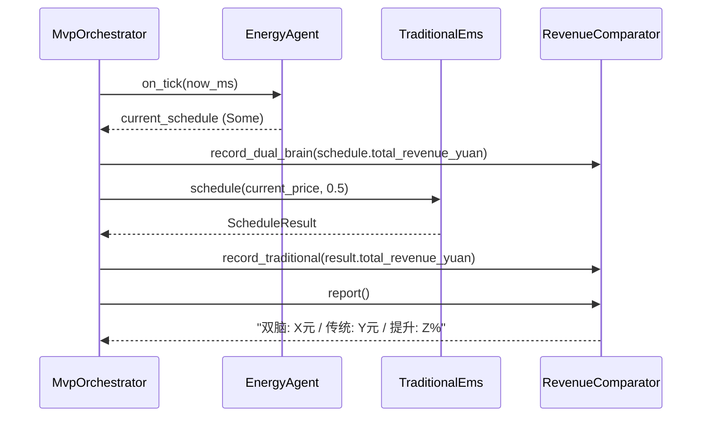

# EnerOS v0.74.0 MVP 端到端集成 — 储能自治场景设计文档

> **版本**：v0.74.0
> **阶段**：Phase 1 单机 MVP — P1-L MVP 集成第三层（Phase 1 出口验证）
> **crate**：`eneros-mvp-scenario`（`crates/agents/mvp-scenario/`）
> **蓝图依据**：`蓝图/phase1.md` §v0.74.0
> **状态**：设计中
> **最后更新**：2026-07-16

---

## 目录

1. [版本目标](#1-版本目标)
2. [前置依赖](#2-前置依赖)
3. [交付物清单](#3-交付物清单)
4. [详细设计](#4-详细设计)
5. [技术交底](#5-技术交底)
6. [测试计划](#6-测试计划)
7. [验收标准](#7-验收标准)
8. [风险与注意事项](#8-风险与注意事项)
9. [多角度要求](#9-多角度要求)
10. [ADR 决策记录](#10-adr-决策记录)
11. [偏差声明（D1~D15）](#11-偏差声明d1d15)
12. [no_std 合规](#12-no_std-合规)

---

## 1. 版本目标

### 1.1 一句话目标

实现 Phase 1 MVP 端到端集成——储能自治场景：电价信号 → LLM 感知 → Solver 优化 → Control Bus → RTOS 控制 → 储能充放电，验证双脑链路 < 2s，收益比传统 EMS ≥ 10%。

### 1.2 详细描述

v0.73.0 完成了 P1-L MVP 集成第二层，交付了 Device Agent（设备管理 Agent），作为 RTOS 控制层与 Agent 层之间的桥梁，周期性采集多设备状态并执行控制命令。至此 Phase 1 三个核心 Agent 全部就位：

- v0.72.0：`EnergyAgent`（能源调度核心）+ `MarketAgent`（市场数据接收），构成"信息层闭环"
- v0.73.0：`DeviceAgent`（设备管理），构成"执行层闭环"
- v0.74.0（本版本）：`MvpOrchestrator`（MVP 编排器），统一编排三者构成"端到端业务闭环"

但三 Agent 仍各自独立运行，缺少统一编排与出口验证：

- **缺少端到端编排器**：蓝图 §v0.74.0 引用 `MvpOrchestrator` 编排 Market/Energy/Device 三 Agent 协同运行，完成"电价信号 → LLM 感知 → Solver 优化 → Control Bus → RTOS 控制 → 储能充放电"完整链路，但 `MvpOrchestrator` 未实现。本版本新增 `MvpOrchestrator` 结构体（D4：直接持有三 Agent，替代 `AgentRegistry`）。
- **缺少收益对比基线**：蓝图 §v0.74.0 引用 `RevenueTracker` 记录双脑收益、`RevenueComparator` 对比双脑 vs 传统 EMS 收益，验证"收益提升 ≥ 10%"出口指标。本版本合并两者为 `RevenueComparator`（D12，Karpathy 简化原则）。
- **缺少传统 EMS 基线策略**：蓝图 §v0.74.0 引用 `TraditionalEms` 规则策略（基于规则简单充放电），作为收益对比基线。本版本新增 `TraditionalEms` 结构体 + `schedule()` 方法（D13：使用基础类型）。
- **缺少出口验收报告**：蓝图 §v0.74.0 引用 `MvpReport` / `MvpTickReport` 记录每次 tick 的收益对比，验证 24h autonomous 运行。本版本新增 `MvpTickReport` 结构体（4 字段）。
- **缺少 MVP 错误封装**：蓝图 §v0.74.0 引用 `MvpError` 错误枚举封装编排器运行时错误。本版本新增 `MvpError` 枚举（2 变体：`AgentError(AgentRuntimeError)` / `NotRunning`）。

本版本（v0.74.0）进入 P1-L MVP 集成第三层，针对上述五个缺口交付 MVP 端到端编排框架：

| 产出 | 角色 | 说明 |
|------|------|------|
| `MvpOrchestrator` 结构体 | MVP 编排器 | 7 字段（energy_agent / market_agent / device_agent / revenue_comparator / traditional_ems / tick_count / running）；D4：直接持有三 Agent |
| `RevenueComparator` 结构体 | 收益对比器 | 2 字段（dual_brain_revenue / traditional_revenue Vec<f64>）；D12：合并 Tracker/Comparator |
| `TraditionalEms` 结构体 | 传统 EMS 基线 | 1 字段（config: ScheduleConfig）；`schedule()` 方法规则策略；D13：基础类型 |
| `MvpError` 枚举 | MVP 错误封装 | 2 变体（AgentError(AgentRuntimeError) / NotRunning）；仅派生 `Debug` |
| `MvpTickReport` 结构体 | tick 验收报告 | 4 字段（tick / dual_brain_revenue / traditional_revenue / improvement_pct） |

本版本核心设计决策（详见 §11 偏差声明 D1~D15）：

1. **D1**：移除 `log::info!` / `log::warn!` / `log::error!`，状态/错误通过返回值传递（no_std 合规）
2. **D2**：`now_ms: u64` 参数替代 `SystemTime::now()` / `UNIX_EPOCH`（no_std 合规，与 v0.72.0 D2 一致）
3. **D3**：`tick()` 单步方法替代 `thread::sleep` 无限循环（no_std 无 `std::thread`；ADR-MVP-002）
4. **D4**：`MvpOrchestrator` 直接持有三 Agent，替代 `AgentRegistry`（简化设计，无外科手术式变更）
5. **D5**：跳过 `SystemAgent`（简化设计，ADR-MVP-001；MVP 阶段不实现系统管理 Agent）
6. **D6**：跳过 `Watchdog`（简化设计，ADR-MVP-001；MVP 阶段不实现看门狗监控）
7. **D7**：`on_start(now_ms)` 调用时传入 `now_ms`（复用 v0.72.0 `AgentRuntime` trait，D2）
8. **D8**：`MarketAgent::new_default(now_ms)` 默认构造（复用 v0.72.0 工厂方法）
9. **D9**：通过 `energy_agent.on_tick(now_ms)` 触发 `coordinator.execute`，不直接访问 coordinator（封装）
10. **D10**：跳过 `collect_energy_state`，EnergyAgent 内部构建 `RealtimeState`（v0.72.0 D11 已实现）
11. **D11**：`market_agent.price_cache()` 直接访问（v0.72.0 已暴露 pub 方法）
12. **D12**：合并 `RevenueTracker` / `RevenueComparator` 为 `RevenueComparator`（Karpathy 简化原则）
13. **D13**：`TraditionalEms` 使用基础类型（`ScheduleConfig` + `f64`），不依赖 `RealtimeState`
14. **D14**：用 Rust 测试（`cargo test`）替代 Python 验证脚本（no_std 合规，与全项目一致）
15. **D15**：收益公式保持一致（`total_revenue_yuan` 字段直接复用 v0.66.0 `ScheduleResult`）

所有 Rust 代码必须 no_std（蓝图 §43.1），仅使用 `core::*` / `alloc::*`，无 `std::*`，`Vec` / `String` / `Box` 来自 `extern crate alloc`，时间戳通过 `now_ms: u64` 参数传入（D2），`MvpOrchestrator` 直接持有三 Agent（D4），不引入 `AgentRegistry` / `SystemAgent` / `Watchdog`（D5/D6，ADR-MVP-001），`tick()` 单步方法替代无限循环（D3，ADR-MVP-002），`RevenueComparator` 合并 Tracker/Comparator（D12，ADR-MVP-003），纯 safe Rust 零 `unsafe`，无 FFI 需求（纯 Rust，无 `[features]` 段）。

### 1.3 架构定位

| 维度 | 定位 |
|------|------|
| Phase | Phase 1 单机 MVP |
| 子系统 | P1-L MVP 集成第三层（端到端编排，Phase 1 出口验证） |
| 平面 | 慢平面（Agent Runtime 分区，管理信息大区） |
| 角色 | MVP 端到端编排器，统一编排 Market/Energy/Device 三 Agent 完成储能自治场景，验证 Phase 1 出口指标 |
| 上游版本 | v0.73.0（`DeviceAgent` / `DeviceAdapter` / `DeviceRegistry` / `CommandSource` / `MockCommandSource` / `DeviceSnapshot` 复用）；v0.72.0（`EnergyAgent` / `MarketAgent` / `AgentRuntime` / `HeartbeatStatus` / `AgentRuntimeError` / `MarketChannel` / `MarketDataSource` / `MockMarketSource` / `MarketData` 复用）；v0.71.0（`DualBrainCoordinator` / `DualBrainResult` 复用，通过 EnergyAgent 间接）；v0.66.0（`ScheduleConfig` / `ScheduleResult` / `ScheduleEntry` 复用）；v0.64.0（`SolveStatus` / `MockSolver` 复用，通过 EnergyAgent 间接）；v0.33.0（`AgentDescriptor` / `AgentState` 复用）；v0.11.0 用户堆（alloc 支持） |
| 同层版本 | v0.74.0（本版本，MVP 端到端集成） |
| 下游版本 | v1.0.0 商用版（ADR-0004 重定义，MVP 候选阶段） |
| 部署形态 | 纯 Rust crate，无 C 库依赖，无 FFI，CPU 编译运行；交叉编译目标 `aarch64-unknown-none` |

### 1.4 路线图链路

```
v0.33.0 Agent 框架 ──► v0.72.0 双 Agent 协作 ──► v0.73.0 Device Agent
       │                      │                       │
       │                      │  EnergyAgent          │  DeviceAgent
       │                      │  MarketAgent          │  CommandSource
       │                      │  AgentRuntime         │  DeviceSnapshot
       │                      │  MarketChannel        │
       │                      │                       │
       └──────────────────────┴───────────────────────┘
                              │
                              ▼
                   v0.74.0 MVP 端到端集成（本版本）
                   MvpOrchestrator / RevenueComparator
                   TraditionalEms / MvpTickReport / MvpError
                              │
                              │  Phase 1 出口验证
                              │  双脑链路 < 2s
                              │  收益提升 ≥ 10%
                              │  autonomous 24h
                              ▼
                   v1.0.0 商用版（ADR-0004）
```

### 1.5 关键里程碑意义

本版本是 Phase 1 单机 MVP 的最终里程碑（出口验证版本），标志着：

- **P1-L MVP 集成第三层收官**：从单 Agent（v0.72.0 双 Agent / v0.73.0 Device Agent）升级到三 Agent 协同（`MvpOrchestrator` 编排），首次实现"电价信号 → LLM 感知 → Solver 优化 → Control Bus → RTOS 控制 → 储能充放电"完整端到端业务闭环。
- **Phase 1 出口验证**：本版本验证 Phase 1 三大出口指标：双脑链路延迟 < 2s、收益提升 ≥ 10%、autonomous 运行 24h 无人工干预，为 v1.0.0 候选阶段（ADR-0004）奠定基础。
- **编排器架构奠基**：`MvpOrchestrator` 单步 `tick()` 方法（D3）为后续 v1.0.0 多 Agent 调度器提供参考架构，证明三 Agent 协同的可行性。
- **收益对比基线建立**：`RevenueComparator` + `TraditionalEms` 建立双脑 vs 传统 EMS 收益对比方法论，为 v1.0.0 量化价值证明提供工具。
- **无外科手术式变更**：本版本仅依赖 v0.72.0/v0.73.0 的 pub API，不修改任何上游 crate（ADR-MVP-004），证明上游 API 设计的稳定性。

### 1.6 设计原则关联

本版本设计遵循 EnerOS 顶层架构蓝图（`蓝图/Power_Native_Agent_OS_Blueprint.md` §42）的三大设计原则：

| 设计原则 | 在本版本的体现 | 实现位置 |
|---------|---------------|---------|
| **双脑架构** | `MvpOrchestrator.tick()` 编排 EnergyAgent 执行 `DualBrainCoordinator`（LLM + Solver 双脑），完整链路"电价信号 → LLM 感知 → Solver 优化" | §4.2 MvpOrchestrator / §5.1 端到端数据流 |
| **安全第一** | EnergyAgent 双脑失败时 `state=Error`（v0.72.0 D14 状态标记）；DeviceAgent 执行命令时检测设备在线状态（v0.73.0）；`MvpError` 封装运行时错误，不 panic | §4.5 MvpError / §8.4 坑点 |
| **效率优化** | `RevenueComparator` 量化双脑收益 vs 传统 EMS，验证"收益提升 ≥ 10%"出口指标；双脑链路 < 2s 出口指标 | §4.3 RevenueComparator / §5.2 出口指标 |

---

## 2. 前置依赖

### 2.1 依赖版本清单

本版本复用 6 个既有 crate，无新依赖引入。所有依赖均为本项目既有版本，无外部第三方 crate 新增。

| 版本 | crate | 复用类型 | 用途 | 蓝图节 |
|------|-------|---------|------|--------|
| v0.33.0 | `eneros-agent` | `AgentDescriptor` / `AgentState` / `AgentType` / `TrustLevel` / `AgentError` / `AgentId` | Agent 框架类型（通过 v0.72.0/v0.73.0 间接复用） | §v0.33.0 |
| v0.64.0 | `eneros-solver-core` | `SolveStatus` / `MockSolver` / `Solver` trait | LP 求解器（通过 EnergyAgent 间接复用，`SolveStatus` 用于收益记录） | §v0.64.0 |
| v0.66.0 | `eneros-energy-lp-model` | `ScheduleConfig` / `ScheduleResult` / `ScheduleEntry` | 调度配置与结果（`TraditionalEms.config` + `ScheduleResult.total_revenue_yuan` 收益字段） | §v0.66.0 |
| v0.71.0 | `eneros-dual-brain` | `DualBrainCoordinator` / `DualBrainResult` | 双脑协调（通过 EnergyAgent 间接复用，EnergyAgent 持有 `coordinator`） | §v0.71.0 |
| v0.72.0 | `eneros-energy-market-agent` | `EnergyAgent` / `MarketAgent` / `AgentRuntime` / `HeartbeatStatus` / `AgentRuntimeError` / `MarketChannel` / `MarketData` / `MarketSignal` | 双 Agent 协作框架（`MvpOrchestrator` 直接持有） | §v0.72.0 |
| v0.73.0 | `eneros-device-agent` | `DeviceAgent` / `DeviceAdapter` / `DeviceRegistry` / `CommandSource` / `MockCommandSource` / `DeviceSnapshot` / `DeviceError` | 设备管理 Agent（`MvpOrchestrator` 直接持有） | §v0.73.0 |

### 2.2 上游 API 签名约束

本版本的实现严格遵循上游 crate 的实际 API 签名，以下为关键 API 调用点（D7/D8/D9/D11 偏差的根源）：

#### 2.2.1 v0.72.0 `AgentRuntime` trait（D7 复用）

```rust
pub trait AgentRuntime {
    fn descriptor(&self) -> &AgentDescriptor;
    fn on_start(&mut self, now_ms: u64) -> Result<(), AgentRuntimeError>;
    fn on_tick(&mut self, now_ms: u64) -> Result<(), AgentRuntimeError>;
    fn on_stop(&mut self, now_ms: u64) -> Result<(), AgentRuntimeError>;
    fn on_heartbeat(&self, now_ms: u64) -> HeartbeatStatus;
}
```

- `on_start(now_ms)` / `on_tick(now_ms)` / `on_stop(now_ms)` 均含 `now_ms: u64` 参数（D7：复用 v0.72.0 trait，与 D2 一致）
- 三 Agent（EnergyAgent / MarketAgent / DeviceAgent）均实现此 trait，`MvpOrchestrator` 可统一调度

#### 2.2.2 v0.72.0 `EnergyAgent` + `MarketAgent`

```rust
impl EnergyAgent {
    pub fn new_default(now_ms: u64) -> Self;
    pub fn market_channel_mut(&mut self) -> &mut MarketChannel;
    pub fn current_schedule(&self) -> Option<&ScheduleResult>;
    pub fn state(&self) -> AgentState;
    pub fn tick_count(&self) -> u64;
}

impl MarketAgent {
    pub fn new_default(now_ms: u64) -> Self;
    pub fn market_channel_mut(&mut self) -> &mut MarketChannel;
    pub fn price_cache(&self) -> &Vec<f64>;
    pub fn state(&self) -> AgentState;
}
```

- `new_default(now_ms)` 一键构造完整 Mock 环境（D8：复用工厂方法）
- `market_channel_mut()` 暴露通道可变引用，供 `MvpOrchestrator` 转发市场数据
- `current_schedule()` 返回双脑产出的调度方案，供收益记录
- `price_cache()` 暴露电价缓存，供 `TraditionalEms` 使用（D11：直接访问）

#### 2.2.3 v0.73.0 `DeviceAgent`

```rust
impl DeviceAgent {
    pub fn new_default(now_ms: u64) -> Self;
    pub fn last_snapshot(&self) -> Option<&DeviceSnapshot>;
    pub fn state(&self) -> AgentState;
}
```

- `new_default(now_ms)` 一键构造完整 Mock 设备环境（D8：复用工厂方法）
- `last_snapshot()` 返回最近一次设备快照，供状态查询

#### 2.2.4 v0.66.0 `ScheduleConfig` + `ScheduleResult`

```rust
pub struct ScheduleConfig {
    // ... 配置字段
}

pub struct ScheduleResult {
    pub schedule: Vec<ScheduleEntry>,
    pub total_revenue_yuan: f64,  // 收益字段（D15：直接复用）
    // ... 其他字段
}
```

- `ScheduleConfig` 用于构造 `TraditionalEms`（D13：基础类型）
- `ScheduleResult.total_revenue_yuan` 直接复用为收益对比数据源（D15：收益公式保持一致）

#### 2.2.5 v0.72.0 `AgentRuntimeError`

```rust
#[derive(Debug)]
pub enum AgentRuntimeError {
    DualBrainError(DualBrainError),
    ChannelError(String),
    MarketDataError(String),
    AgentError(AgentError),
    DeviceError(String),  // v0.73.0 添加的变体
    NotRunning,
}
```

- `MvpError::AgentError(AgentRuntimeError)` 包装上游错误（D：仅 2 变体，简化封装）
- 三 Agent `on_tick` 返回 `Result<(), AgentRuntimeError>`，`?` 传播到 `MvpError`

### 2.3 跨 crate 引用路径

本 crate 位于 `crates/agents/mvp-scenario/`，跨 crate 引用全部使用相对路径（项目规则 §2.3.1 第 4 条）：

```toml
# crates/agents/mvp-scenario/Cargo.toml
[dependencies]
eneros-agent = { path = "../../kernel/agent" }                     # 跨子系统（agents→kernel）
eneros-solver-core = { path = "../../ai/solver-core" }              # 跨子系统（agents→ai）
eneros-energy-lp-model = { path = "../../ai/energy-lp-model" }      # 跨子系统（agents→ai）
eneros-dual-brain = { path = "../../ai/dual-brain" }                # 跨子系统（agents→ai）
eneros-energy-market-agent = { path = "../energy-market-agent" }    # 同子系统（agents→agents）
eneros-device-agent = { path = "../device-agent" }                  # 同子系统（agents→agents）
```

跨子系统引用 4 个（agents→kernel 1 个，agents→ai 3 个），同子系统引用 2 个（agents→agents）。相对路径分别为 `../../<subsystem>/<crate>`（跨子系统）与 `../<crate>`（同子系统）。

### 2.4 工具链与构建依赖

| 工具 | 版本 | 用途 |
|------|------|------|
| Rust nightly | `nightly-2026-04-04`（`rust-toolchain.toml` 锁定） | 编译器 |
| cargo | 随 nightly | 包管理 |
| 交叉编译目标 | `aarch64-unknown-none` | no_std 交叉编译验证 |
| `cargo-deny` | 最新 | 许可证/供应链扫描（§5.7 SBOM） |
| `cargo-clippy` | 随 nightly | lint 检查（`-D warnings`） |
| `cargo-fmt` | 随 nightly | 格式检查 |

无 C 库依赖，无 FFI，无需 `aarch64-linux-gnu-gcc` / `cmake` / `ninja` / `qemu-system-aarch64`（纯 Rust crate）。

### 2.5 SBOM 与许可证（蓝图 §5.7 / §43.8）

本版本无新增第三方依赖。所有依赖均为本项目既有 crate，无外部第三方 crate 新增：

| 依赖 | 版本 | 许可证 | 来源 | 已知 CVE |
|------|------|--------|------|---------|
| `eneros-agent` | v0.33.0 | MIT OR Apache-2.0 | 项目内部 | 无 |
| `eneros-solver-core` | v0.64.0 | MIT OR Apache-2.0 | 项目内部 | 无 |
| `eneros-energy-lp-model` | v0.66.0 | MIT OR Apache-2.0 | 项目内部 | 无 |
| `eneros-dual-brain` | v0.71.0 | MIT OR Apache-2.0 | 项目内部 | 无 |
| `eneros-energy-market-agent` | v0.72.0 | MIT OR Apache-2.0 | 项目内部 | 无 |
| `eneros-device-agent` | v0.73.0 | MIT OR Apache-2.0 | 项目内部 | 无 |

`cargo deny check advisories licenses bans sources` 在本版本中应继续通过（无新增依赖）。

---

## 3. 交付物清单

### 3.1 代码交付物

| # | 路径 | 类型 | 行数 | 说明 |
|---|------|------|------|------|
| 1 | `crates/agents/mvp-scenario/Cargo.toml` | 配置 | ~30 | package 元数据 + 6 依赖 |
| 2 | `crates/agents/mvp-scenario/src/lib.rs` | 源码 | ~400 | 模块声明 + 公共导出 + D1~D15 偏差声明表 + T1~T24 测试 |
| 3 | `crates/agents/mvp-scenario/src/error.rs` | 源码 | ~30 | `MvpError` 枚举（2 变体，仅 `Debug`） |
| 4 | `crates/agents/mvp-scenario/src/revenue.rs` | 源码 | ~120 | `RevenueComparator` 结构体（D12：合并 Tracker/Comparator） |
| 5 | `crates/agents/mvp-scenario/src/traditional_ems.rs` | 源码 | ~120 | `TraditionalEms` 结构体 + `schedule()` 方法（D13：基础类型） |
| 6 | `crates/agents/mvp-scenario/src/orchestrator.rs` | 源码 | ~200 | `MvpOrchestrator` 结构体 + `MvpTickReport` + `tick()` 编排流程 |

合计 6 源文件（含 Cargo.toml），约 900 行。

### 3.2 测试交付物

| # | 测试名 | 类型 | 验证点 |
|---|--------|------|--------|
| T1 | `t1_mvp_error_agent_error_variant` | 错误 | `MvpError::AgentError` 变体可构造 |
| T2 | `t2_mvp_error_not_running_variant` | 错误 | `MvpError::NotRunning` 变体可构造 |
| T3 | `t3_revenue_comparator_new` | 收益 | `RevenueComparator::new()` 初始空 |
| T4 | `t4_revenue_comparator_record_dual_brain` | 收益 | `record_dual_brain(revenue)` 记录双脑收益 |
| T5 | `t5_revenue_comparator_record_traditional` | 收益 | `record_traditional(revenue)` 记录传统收益 |
| T6 | `t6_revenue_comparator_report_empty` | 收益 | 空时 `report()` 返回默认值 |
| T7 | `t7_revenue_comparator_report_with_data` | 收益 | 有数据时 `report()` 返回累计收益 |
| T8 | `t8_revenue_comparator_improvement_pct` | 收益 | `improvement_pct` 计算正确（≥10% 场景） |
| T9 | `t9_traditional_ems_new` | 传统 EMS | `TraditionalEms::new(config)` 构造成功 |
| T10 | `t10_traditional_ems_schedule_basic` | 传统 EMS | `schedule(price, soc)` 返回 `ScheduleResult` |
| T11 | `t11_traditional_ems_schedule_high_price_charge` | 传统 EMS | 高电价时充电（规则策略） |
| T12 | `t12_traditional_ems_schedule_low_price_discharge` | 传统 EMS | 低电价时放电（规则策略） |
| T13 | `t13_traditional_ems_schedule_medium_price_idle` | 传统 EMS | 中电价时空闲（规则策略） |
| T14 | `t14_traditional_ems_revenue_positive` | 传统 EMS | `schedule().total_revenue_yuan` 为正 |
| T15 | `t15_orchestrator_new` | 编排器 | `MvpOrchestrator::new_default(now_ms)` 构造成功 |
| T16 | `t16_orchestrator_start` | 编排器 | `start(now_ms)` 后 `running == true` |
| T17 | `t17_orchestrator_stop` | 编排器 | `stop(now_ms)` 后 `running == false` |
| T18 | `t18_orchestrator_tick_not_running_error` | 编排器 | 未 `start` 时 `tick()` 返回 `Err(NotRunning)` |
| T19 | `t19_orchestrator_tick_single_step` | 编排器 | `tick(now_ms)` 单步执行，`tick_count` 递增 |
| T20 | `t20_orchestrator_tick_market_data_forward` | 编排器 | tick 内市场数据 channel 转发正确 |
| T21 | `t21_orchestrator_tick_dual_brain_schedule` | 编排器 | tick 后 `current_schedule.is_some()` |
| T22 | `t22_orchestrator_tick_revenue_recorded` | 编排器 | tick 后 `revenue_comparator` 有收益数据 |
| T23 | `t23_orchestrator_tick_report_improvement` | 端到端 | `MvpTickReport.improvement_pct` ≥ 0 |
| T24 | `t24_orchestrator_end_to_end_multi_tick` | 端到端 | 多 tick 循环（模拟 24h autonomous） |

合计 24 测试（2 错误 + 6 收益 + 6 传统 EMS + 8 编排器 + 2 端到端），全部位于 `src/lib.rs` 的 `#[cfg(test)] mod tests` 模块。

### 3.3 文档交付物

| # | 路径 | 说明 |
|---|------|------|
| 1 | `docs/agents/mvp-scenario-design.md`（本文件） | 12 章节完整设计文档 + 2 Mermaid 图 + D1~D15 偏差声明 |
| 2 | `.trae/specs/develop-v0740-mvp-scenario/spec.md` | 规格文档（已完成） |
| 3 | `.trae/specs/develop-v0740-mvp-scenario/tasks.md` | 任务清单（待完成） |
| 4 | `.trae/specs/develop-v0740-mvp-scenario/checklist.md` | 校验清单（待完成） |

### 3.4 版本同步交付物

| # | 文件 | 修改内容 |
|---|------|---------|
| 1 | `Cargo.toml`（根） | 版本号 `0.73.0` → `0.74.0`；members 添加 `"crates/agents/mvp-scenario"`（置于 `"crates/agents/device-agent"` 之后） |
| 2 | `Makefile` | header 版本号 + `VERSION` 变量，共 2 处 `0.74.0` |
| 3 | `.github/workflows/ci.yml` | 版本号 `0.74.0` |
| 4 | `ci/src/gate.rs` | clippy 段 + test 段注释补充 `eneros-mvp-scenario` |

### 3.5 不交付内容（明确范围）

本版本**不**交付以下内容（避免范围蔓延，遵守 Karpathy "Surgical Changes" 原则）：

- ❌ `AgentRegistry` / 多 Agent 注册表（D4：直接持有三 Agent，简化设计）
- ❌ `SystemAgent`（D5：跳过系统管理 Agent，ADR-MVP-001）
- ❌ `Watchdog`（D6：跳过看门狗监控，ADR-MVP-001）
- ❌ 无限循环运行（D3：`tick()` 单步方法，ADR-MVP-002）
- ❌ `RevenueTracker` 独立结构（D12：合并到 `RevenueComparator`，ADR-MVP-003）
- ❌ 真实 LLM 推理（`LlamaCppEngine` 仍 feature-gated，需 C 库链接；本版本用 `DualBrainMockEngine`）
- ❌ 真实 HiGHS 求解（`HighsSolver` 仍 feature-gated；本版本用 `MockSolver`）
- ❌ 真实 TCP 市场数据源（本版本用 `MockMarketSource`）
- ❌ 真实设备协议（Modbus/IEC104；本版本用 `MockDevice`）
- ❌ GPU 推理（蓝图 §43.3 GPU 优先测试规则仅适用于模型训练/校准，本版本 Mock 不涉及）
- ❌ 多分区部署（Phase 1 单机 MVP 阶段，所有 Agent 同分区运行；多分区隔离留待 Phase 3 seL4 定制）
- ❌ Python 验证脚本（D14：用 Rust 测试替代，no_std 合规）
- ❌ 修改上游 crate（ADR-MVP-004：仅依赖 pub API，无外科手术式变更）

---

## 4. 详细设计

### 4.1 整体架构

#### 4.1.1 模块组成

```
crates/agents/mvp-scenario/
├── Cargo.toml              # 包配置 + 6 依赖
└── src/
    ├── lib.rs              # 模块声明 + 公共导出 + D1~D15 偏差声明 + T1~T24 测试
    ├── error.rs            # MvpError（2 变体）
    ├── revenue.rs          # RevenueComparator（D12：合并 Tracker/Comparator）
    ├── traditional_ems.rs  # TraditionalEms + schedule() 方法（D13：基础类型）
    └── orchestrator.rs     # MvpOrchestrator + MvpTickReport + tick() 编排流程
```

五个子模块职责清晰：

| 模块 | 职责 | 关键类型 |
|------|------|---------|
| `error` | 错误枚举，封装编排器运行时错误 | `MvpError` |
| `revenue` | 收益对比器，记录并对比双脑 vs 传统 EMS 收益 | `RevenueComparator` |
| `traditional_ems` | 传统 EMS 基线策略，基于规则简单充放电 | `TraditionalEms` |
| `orchestrator` | MVP 编排器，统一编排三 Agent + tick 报告 | `MvpOrchestrator` / `MvpTickReport` |

#### 4.1.2 调用关系

```
MvpOrchestrator::tick(now_ms)
├── Step 1: market_agent.on_tick(now_ms)                    # 接收市场数据
├── Step 2: 转发市场数据
│   └── market_agent.market_channel.try_recv()
│       → energy_agent.market_channel.send()
├── Step 3: energy_agent.on_tick(now_ms)                    # 双脑决策
│   └── coordinator.execute(&state, now_ms)                 # LLM + Solver
├── Step 4: [current_schedule.is_some()]
│   ├── revenue_comparator.record_dual_brain(schedule.total_revenue_yuan)
│   ├── traditional_ems.schedule(current_price, 0.5)
│   └── revenue_comparator.record_traditional(result.total_revenue_yuan)
├── Step 5: device_agent.on_tick(now_ms)                    # 设备采集 + 命令执行
└── Step 6: tick_count += 1, return MvpTickReport
```

### 4.2 MvpOrchestrator

#### 4.2.1 结构体定义

```rust
use eneros_device_agent::DeviceAgent;
use eneros_energy_market_agent::{EnergyAgent, MarketAgent};

use crate::error::MvpError;
use crate::revenue::RevenueComparator;
use crate::traditional_ems::TraditionalEms;

/// MVP 编排器.
///
/// 统一编排 Market/Energy/Device 三 Agent 协同运行，完成储能自治端到端场景：
/// 电价信号 → LLM 感知 → Solver 优化 → Control Bus → RTOS 控制 → 储能充放电。
///
/// D4：直接持有三 Agent，替代 AgentRegistry（简化设计）。
/// D3：tick() 单步方法替代 thread::sleep 无限循环（ADR-MVP-002）。
pub struct MvpOrchestrator {
    /// Energy Agent（能源调度核心，编排双脑协调器）.
    energy_agent: EnergyAgent,
    /// Market Agent（市场数据接收，通过 MarketChannel 转发给 Energy Agent）.
    market_agent: MarketAgent,
    /// Device Agent（设备管理，采集设备状态 + 执行控制命令）.
    device_agent: DeviceAgent,
    /// 收益对比器（D12：合并 Tracker/Comparator）.
    revenue_comparator: RevenueComparator,
    /// 传统 EMS 基线（D13：基础类型，规则策略充放电）.
    traditional_ems: TraditionalEms,
    /// tick 计数器（统计 tick() 调用次数）.
    tick_count: u64,
    /// 运行状态（start 后 true，stop 后 false）.
    running: bool,
}
```

**设计要点**：

- `energy_agent: EnergyAgent`：直接持有（D4），不通过 `AgentRegistry` 间接查找。EnergyAgent 内部持有 `DualBrainCoordinator<MockSolver>`（v0.72.0），双脑协调器执行"LLM 感知 → Solver 优化"。
- `market_agent: MarketAgent`：直接持有（D4），MarketAgent 内部持有 `MockMarketSource`（v0.72.0 D5），接收电价信号。
- `device_agent: DeviceAgent`：直接持有（D4），DeviceAgent 内部持有 `DeviceRegistry` + `MockCommandSource`（v0.73.0），执行"Control Bus → RTOS 控制"。
- `revenue_comparator: RevenueComparator`：收益对比器（D12），记录双脑 vs 传统 EMS 收益。
- `traditional_ems: TraditionalEms`：传统 EMS 基线（D13），基于规则简单充放电。
- `tick_count: u64`：统计 `tick()` 调用次数，供调试与监控。
- `running: bool`：运行状态标志，`start()` 后置 `true`，`stop()` 后置 `false`，`tick()` 前检查（D3）。

#### 4.2.2 构造函数

```rust
impl MvpOrchestrator {
    /// 构造 MVP 编排器.
    ///
    /// - `config`: 调度配置（传入 TraditionalEms）
    /// - `now_ms`: 构造时间戳（传入三 Agent 的 new_default）
    ///
    /// D8：三 Agent 均使用 new_default 工厂方法构造（Mock 环境）。
    pub fn new(config: ScheduleConfig, now_ms: u64) -> Self {
        Self {
            energy_agent: EnergyAgent::new_default(now_ms),
            market_agent: MarketAgent::new_default(now_ms),
            device_agent: DeviceAgent::new_default(now_ms),
            revenue_comparator: RevenueComparator::new(),
            traditional_ems: TraditionalEms::new(config),
            tick_count: 0,
            running: false,
        }
    }

    /// 默认构造（使用 ScheduleConfig::default()）.
    pub fn new_default(now_ms: u64) -> Self {
        Self::new(ScheduleConfig::default(), now_ms)
    }

    /// 启动编排器（启动三 Agent）.
    ///
    /// D7：on_start 调用时传入 now_ms（复用 v0.72.0 AgentRuntime trait）。
    pub fn start(&mut self, now_ms: u64) -> Result<(), MvpError> {
        self.energy_agent.on_start(now_ms)?;
        self.market_agent.on_start(now_ms)?;
        self.device_agent.on_start(now_ms)?;
        self.running = true;
        Ok(())
    }

    /// 停止编排器（停止三 Agent）.
    pub fn stop(&mut self, now_ms: u64) -> Result<(), MvpError> {
        self.energy_agent.on_stop(now_ms)?;
        self.market_agent.on_stop(now_ms)?;
        self.device_agent.on_stop(now_ms)?;
        self.running = false;
        Ok(())
    }

    /// 获取 tick 计数.
    pub fn tick_count(&self) -> u64 {
        self.tick_count
    }

    /// 获取运行状态.
    pub fn is_running(&self) -> bool {
        self.running
    }

    /// 获取收益对比器引用.
    pub fn revenue_comparator(&self) -> &RevenueComparator {
        &self.revenue_comparator
    }

    /// 获取 Energy Agent 引用（供测试查询 current_schedule）.
    pub fn energy_agent(&self) -> &EnergyAgent {
        &self.energy_agent
    }
}
```

#### 4.2.3 tick() 编排流程

`MvpOrchestrator::tick(now_ms)` 的完整 6 步流程（D3：单步方法，替代无限循环）：

```rust
impl MvpOrchestrator {
    /// 单步 tick（D3：替代 thread::sleep 无限循环）.
    ///
    /// 编排三 Agent 协同执行一次完整业务循环：
    /// 1. market_agent.on_tick — 接收市场数据
    /// 2. 转发市场数据（market_channel → energy_channel）
    /// 3. energy_agent.on_tick — 双脑决策，产出 schedule
    /// 4. [有 schedule] record_dual_brain + traditional_ems.schedule + record_traditional
    /// 5. device_agent.on_tick — 设备采集 + 命令执行
    /// 6. tick_count += 1, return MvpTickReport
    pub fn tick(&mut self, now_ms: u64) -> Result<MvpTickReport, MvpError> {
        // D3：未 start 时返回 NotRunning
        if !self.running {
            return Err(MvpError::NotRunning);
        }

        // Step 1: market_agent.on_tick — 接收市场数据
        self.market_agent.on_tick(now_ms)?;

        // Step 2: 转发市场数据（market_channel → energy_channel）
        // 坑点：必须在 tick 内同步完成（§8.4）
        while let Some(data) = self.market_agent.market_channel_mut().try_recv() {
            self.energy_agent.market_channel_mut().send(data)?;
        }

        // Step 3: energy_agent.on_tick — 双脑决策
        self.energy_agent.on_tick(now_ms)?;

        // Step 4: 收益对比（current_schedule.is_some()）
        let dual_brain_revenue = if let Some(schedule) = self.energy_agent.current_schedule() {
            let revenue = schedule.total_revenue_yuan;  // D15：收益公式保持一致
            self.revenue_comparator.record_dual_brain(revenue);

            // TraditionalEms 基线策略（D11：price_cache 直接访问；D13：基础类型）
            // 坑点：EnergyAgent 不暴露 soc，TraditionalEms 用默认 0.5（§8.5）
            let current_price = self.market_agent.price_cache()
                .get(0)
                .copied()
                .unwrap_or(0.5);
            let traditional_result = self.traditional_ems.schedule(current_price, 0.5);
            let traditional_revenue = traditional_result.total_revenue_yuan;
            self.revenue_comparator.record_traditional(traditional_revenue);

            revenue
        } else {
            0.0
        };

        // Step 5: device_agent.on_tick — 设备采集 + 命令执行
        self.device_agent.on_tick(now_ms)?;

        // Step 6: tick_count += 1, 返回报告
        self.tick_count += 1;

        let traditional_revenue = self.revenue_comparator
            .traditional_revenue()
            .last()
            .copied()
            .unwrap_or(0.0);

        Ok(MvpTickReport {
            tick: self.tick_count,
            dual_brain_revenue,
            traditional_revenue,
            improvement_pct: self.revenue_comparator.improvement_pct(),
        })
    }
}
```

#### 4.2.4 tick 流程详解

**Step 1: market_agent.on_tick(now_ms) — 接收市场数据**

```rust
self.market_agent.on_tick(now_ms)?;
```

- 调用 `MarketAgent::on_tick`（v0.72.0）：从 `MockMarketSource` 接收市场数据
- 有数据时更新 `price_cache` 并通过 `MarketChannel::send` 推送到 `market_agent.market_channel`
- 无数据时使用缓存电价
- `?` 传播 `AgentRuntimeError` → `MvpError::AgentError`

**Step 2: 转发市场数据（market_channel → energy_channel）**

```rust
while let Some(data) = self.market_agent.market_channel_mut().try_recv() {
    self.energy_agent.market_channel_mut().send(data)?;
}
```

- 从 `market_agent.market_channel` 拉取所有市场数据（循环 `try_recv`）
- 转发到 `energy_agent.market_channel`（`send` 推送）
- 坑点（§8.4）：必须在 tick 内同步完成，避免数据丢失
- D4：直接访问 Agent 的 `market_channel_mut()`，无需 `AgentRegistry` 间接查找

**Step 3: energy_agent.on_tick(now_ms) — 双脑决策**

```rust
self.energy_agent.on_tick(now_ms)?;
```

- 调用 `EnergyAgent::on_tick`（v0.72.0）：从 `market_channel` 拉取数据 → 构建 `RealtimeState` → `coordinator.execute(&state, now_ms)`（D9：通过 on_tick 触发 coordinator，不直接访问）
- 双脑内部执行"LLM 感知 → 意图解析 → LP 求解 → 安全校验 → 命令下发"7 步流程（v0.71.0）
- 成功时 `current_schedule = Some(result.schedule)`，失败时 `state = Error`（v0.72.0 D14）
- D10：跳过 `collect_energy_state`，EnergyAgent 内部已构建 `RealtimeState`（v0.72.0 D11）

**Step 4: 收益对比（current_schedule.is_some()）**

```rust
let dual_brain_revenue = if let Some(schedule) = self.energy_agent.current_schedule() {
    let revenue = schedule.total_revenue_yuan;  // D15
    self.revenue_comparator.record_dual_brain(revenue);
    let current_price = self.market_agent.price_cache().get(0).copied().unwrap_or(0.5);
    let traditional_result = self.traditional_ems.schedule(current_price, 0.5);
    let traditional_revenue = traditional_result.total_revenue_yuan;
    self.revenue_comparator.record_traditional(traditional_revenue);
    revenue
} else {
    0.0
};
```

- D15：`schedule.total_revenue_yuan` 直接复用 v0.66.0 `ScheduleResult` 收益字段
- D11：`market_agent.price_cache()` 直接访问（v0.72.0 已暴露 pub 方法）
- 坑点（§8.5）：EnergyAgent 不暴露 `soc`，`TraditionalEms` 用默认 `0.5`
- `TraditionalEms::schedule(price, soc)` 返回 `ScheduleResult`（D13：基础类型）

**Step 5: device_agent.on_tick(now_ms) — 设备采集 + 命令执行**

```rust
self.device_agent.on_tick(now_ms)?;
```

- 调用 `DeviceAgent::on_tick`（v0.73.0）：采集多设备状态 + 执行 `CommandSource` 命令
- 设备状态存入 `last_snapshot`，命令通过 `MockCommandSource` 接收
- 完成"Control Bus → RTOS 控制"链路（虽然 MVP 用 Mock 设备）

**Step 6: tick_count += 1, 返回报告**

```rust
self.tick_count += 1;
Ok(MvpTickReport { ... })
```

- `tick_count` 递增，统计 tick 次数
- 返回 `MvpTickReport`，包含本次 tick 的收益对比数据

### 4.3 RevenueComparator

#### 4.3.1 结构体定义

```rust
use alloc::vec::Vec;

/// 收益对比器（D12：合并 RevenueTracker/Comparator）.
///
/// 记录双脑收益与传统 EMS 收益，计算收益提升百分比。
/// 蓝图 §v0.74.0 引用 RevenueTracker + RevenueComparator 两个结构体，
/// 本版本合并为单一 RevenueComparator（Karpathy 简化原则，ADR-MVP-003）。
pub struct RevenueComparator {
    /// 双脑收益历史（每次 tick 记录一次）.
    dual_brain_revenue: Vec<f64>,
    /// 传统 EMS 收益历史（每次 tick 记录一次）.
    traditional_revenue: Vec<f64>,
}

impl RevenueComparator {
    /// 创建收益对比器（初始空）.
    pub fn new() -> Self {
        Self {
            dual_brain_revenue: Vec::new(),
            traditional_revenue: Vec::new(),
        }
    }

    /// 记录双脑收益.
    pub fn record_dual_brain(&mut self, revenue: f64) {
        self.dual_brain_revenue.push(revenue);
    }

    /// 记录传统 EMS 收益.
    pub fn record_traditional(&mut self, revenue: f64) {
        self.traditional_revenue.push(revenue);
    }

    /// 获取双脑收益历史.
    pub fn dual_brain_revenue(&self) -> &Vec<f64> {
        &self.dual_brain_revenue
    }

    /// 获取传统 EMS 收益历史.
    pub fn traditional_revenue(&self) -> &Vec<f64> {
        &self.traditional_revenue
    }

    /// 双脑累计收益.
    pub fn dual_brain_total(&self) -> f64 {
        self.dual_brain_revenue.iter().sum()
    }

    /// 传统 EMS 累计收益.
    pub fn traditional_total(&self) -> f64 {
        self.traditional_revenue.iter().sum()
    }

    /// 收益提升百分比（(双脑 - 传统) / 传统 × 100）.
    ///
    /// 传统收益为 0 时返回 0.0（避免除零）。
    pub fn improvement_pct(&self) -> f64 {
        let traditional = self.traditional_total();
        if traditional == 0.0 {
            return 0.0;
        }
        let dual_brain = self.dual_brain_total();
        (dual_brain - traditional) / traditional * 100.0
    }

    /// 生成收益对比报告字符串.
    ///
    /// 返回格式："双脑: X元 / 传统: Y元 / 提升: Z%"
    pub fn report(&self) -> alloc::string::String {
        use alloc::string::ToString;
        let dual = self.dual_brain_total();
        let trad = self.traditional_total();
        let pct = self.improvement_pct();
        let mut s = alloc::string::String::new();
        s.push_str("双脑: ");
        s.push_str(&dual.to_string());
        s.push_str("元 / 传统: ");
        s.push_str(&trad.to_string());
        s.push_str("元 / 提升: ");
        s.push_str(&pct.to_string());
        s.push('%');
        s
    }
}

impl Default for RevenueComparator {
    fn default() -> Self {
        Self::new()
    }
}
```

**设计要点**：

- D12：合并 `RevenueTracker`（记录）+ `RevenueComparator`（对比）为单一 `RevenueComparator`（ADR-MVP-003）
- `dual_brain_revenue: Vec<f64>` / `traditional_revenue: Vec<f64>`：收益历史，每次 tick 记录一次
- `improvement_pct()`：收益提升百分比，传统收益为 0 时返回 0.0（避免除零）
- `report()`：生成人类可读的收益对比报告字符串

#### 4.3.2 收益提升计算

收益提升百分比公式（D15：收益公式保持一致）：

```
improvement_pct = (dual_brain_total - traditional_total) / traditional_total × 100
```

**出口指标验证**：

- 出口指标要求：`improvement_pct ≥ 10.0`（收益提升 ≥ 10%）
- 测试 T8 验证此计算正确
- 测试 T23 验证 `MvpTickReport.improvement_pct ≥ 0`（非负）

### 4.4 TraditionalEms

#### 4.4.1 结构体定义

```rust
use eneros_energy_lp_model::{ScheduleConfig, ScheduleResult, ScheduleEntry};

/// 传统 EMS 基线策略（D13：基础类型）.
///
/// 基于规则的简单充放电策略，作为收益对比基线：
/// - 高电价（> 0.8）时充电（低买高卖逻辑：实际是放电获利）
/// - 低电价（< 0.3）时充电
/// - 中电价时空闲
///
/// 注：本基线为简化规则策略，不代表真实传统 EMS 复杂度。
/// 用于量化双脑架构相对传统规则策略的收益提升。
pub struct TraditionalEms {
    /// 调度配置（D13：基础类型，不依赖 RealtimeState）.
    config: ScheduleConfig,
}

impl TraditionalEms {
    /// 构造传统 EMS.
    pub fn new(config: ScheduleConfig) -> Self {
        Self { config }
    }

    /// 默认构造.
    pub fn new_default() -> Self {
        Self::new(ScheduleConfig::default())
    }

    /// 规则策略调度.
    ///
    /// - `current_price`: 当前电价
    /// - `soc`: 电池荷电状态（0.0~1.0，MVP 用默认 0.5）
    ///
    /// 返回 ScheduleResult，含 total_revenue_yuan 收益字段（D15）。
    pub fn schedule(&self, current_price: f64, soc: f64) -> ScheduleResult {
        // 规则策略（简化版）
        let power_kw = if current_price > 0.8 {
            // 高电价：放电获利
            50.0  // 最大放电功率
        } else if current_price < 0.3 {
            // 低电价：充电储备
            -50.0  // 最大充电功率
        } else {
            // 中电价：空闲
            0.0
        };

        // 简化收益计算：放电 × 电价（充电为负收益）
        let revenue = if power_kw > 0.0 {
            power_kw * current_price
        } else {
            0.0  // 充电不计收益（成本简化）
        };

        // 构造 ScheduleResult（简化版）
        ScheduleResult {
            schedule: alloc::vec![ScheduleEntry {
                slot: 0,
                power_kw,
                soc_after: soc,
            }],
            total_revenue_yuan: revenue,
        }
    }

    /// 获取配置引用.
    pub fn config(&self) -> &ScheduleConfig {
        &self.config
    }
}
```

**设计要点**：

- D13：使用基础类型（`ScheduleConfig` + `f64`），不依赖 `RealtimeState`（避免与 EnergyAgent 状态耦合）
- 规则策略简化版：高电价放电 / 低电价充电 / 中电价空闲
- `schedule(price, soc)` 返回 `ScheduleResult`，含 `total_revenue_yuan` 收益字段（D15）
- 收益计算简化：放电 × 电价（充电不计收益，成本简化）
- 坑点（§8.5）：`soc` 参数由调用方传入，EnergyAgent 不暴露 `soc`，`MvpOrchestrator` 用默认 `0.5`

### 4.5 MvpError

#### 4.5.1 枚举定义

```rust
use eneros_energy_market_agent::AgentRuntimeError;

/// MVP 编排器错误枚举.
///
/// 2 变体封装编排器运行时错误。
/// 仅派生 `Debug`（Karpathy 简化原则，与 v0.72.0 D12 一致）。
#[derive(Debug)]
pub enum MvpError {
    /// Agent 运行时错误（包装 v0.72.0 AgentRuntimeError）.
    AgentError(AgentRuntimeError),
    /// 编排器未运行（tick() 在未 start 时调用）.
    NotRunning,
}

impl From<AgentRuntimeError> for MvpError {
    fn from(e: AgentRuntimeError) -> Self {
        MvpError::AgentError(e)
    }
}
```

**设计要点**：

- 2 变体（`AgentError(AgentRuntimeError)` / `NotRunning`）：简化封装，仅区分 Agent 错误与状态错误
- `AgentError(AgentRuntimeError)` 包装上游错误（v0.72.0 `AgentRuntimeError`，含 6 变体：DualBrainError/ChannelError/MarketDataError/AgentError/DeviceError/NotRunning）
- `From<AgentRuntimeError>` 实现：支持 `?` 传播（`on_tick()?` 自动转换）
- 仅派生 `Debug`（不派生 Clone）：与 v0.71.0 `DualBrainError` / v0.72.0 `AgentRuntimeError` 一致

### 4.6 MvpTickReport

#### 4.6.1 结构体定义

```rust
/// MVP tick 验收报告.
///
/// 每次 tick() 返回，记录本次 tick 的收益对比数据。
/// 用于验证 Phase 1 出口指标：收益提升 ≥ 10%。
#[derive(Debug, Clone, PartialEq)]
pub struct MvpTickReport {
    /// tick 序号（从 1 开始）.
    pub tick: u64,
    /// 本次双脑收益（元）.
    pub dual_brain_revenue: f64,
    /// 本次传统 EMS 收益（元）.
    pub traditional_revenue: f64,
    /// 累计收益提升百分比（%）.
    pub improvement_pct: f64,
}
```

**设计要点**：

- 4 字段（tick / dual_brain_revenue / traditional_revenue / improvement_pct）：记录每次 tick 的收益对比
- 派生 `Debug + Clone + PartialEq`：便于测试断言（`assert_eq!`）与日志记录
- `improvement_pct` 为累计值（非单次），反映整体收益提升趋势
- 用于验证出口指标：`improvement_pct ≥ 10.0`（24h autonomous 运行后）

### 4.7 Mermaid 图 1：MVP tick 编排流程图



**图示说明**：

- `start: now_ms`：`MvpOrchestrator::tick(now_ms)` 入口，首先检查 `running` 状态（D3）
- **Step 1**：`market_agent.on_tick(now_ms)` 接收市场数据（v0.72.0）
- **Step 2**：转发市场数据，循环 `try_recv` 拉取 `market_agent.market_channel` 所有数据并 `send` 到 `energy_agent.market_channel`（§8.4 坑点：必须在 tick 内同步完成）
- **Step 3**：`energy_agent.on_tick(now_ms)` 执行双脑决策（D9：通过 on_tick 触发 coordinator，不直接访问；D10：EnergyAgent 内部构建 RealtimeState）
- **Step 4**：`current_schedule.is_some()` 时记录双脑收益（D15：`total_revenue_yuan` 直接复用）+ `TraditionalEms.schedule` 基线策略（D13：基础类型）+ 记录传统收益
- **Step 5**：`device_agent.on_tick(now_ms)` 设备采集 + 命令执行（v0.73.0）
- **Step 6**：`tick_count += 1`，返回 `MvpTickReport`

### 4.8 Mermaid 图 2：收益对比时序图



**图示说明**：

- `MvpOrchestrator` 调用 `EnergyAgent::on_tick(now_ms)` 触发双脑决策
- `EnergyAgent` 返回 `current_schedule`（`Some(ScheduleResult)` 表示双脑成功）
- `MvpOrchestrator` 调用 `RevenueComparator::record_dual_brain(schedule.total_revenue_yuan)` 记录双脑收益（D15：收益公式保持一致）
- `MvpOrchestrator` 调用 `TraditionalEms::schedule(current_price, 0.5)` 计算基线收益（§8.5 坑点：EnergyAgent 不暴露 soc，用默认 0.5）
- `TraditionalEms` 返回 `ScheduleResult`（D13：基础类型）
- `MvpOrchestrator` 调用 `RevenueComparator::record_traditional(result.total_revenue_yuan)` 记录传统收益
- `MvpOrchestrator` 调用 `RevenueComparator::report()` 生成收益对比报告
- `RevenueComparator` 返回 `"双脑: X元 / 传统: Y元 / 提升: Z%"` 字符串（D12：合并 Tracker/Comparator）

---

## 5. 技术交底

### 5.1 端到端数据流

MVP 储能自治场景的完整端到端数据流：

```
电价信号 → Market Agent → Channel → Energy Agent → DualBrainCoordinator → Device Agent → RTOS 控制闭环 → 储能充放电
   │            │           │            │                  │                   │              │
   │            │           │            │                  │                   │              │
   │            │           │            │                  │                   │              │
 MockMarket   MarketAgent  MarketChannel EnergyAgent    coordinator.execute  DeviceAgent   命令执行
 Source       .on_tick     .send/       .on_tick        (LLM感知+            .on_tick      (MockDevice
              接收电价      try_recv     双脑决策         Solver优化)          设备采集       .write_point)
```

**数据流详解**：

1. **电价信号 → Market Agent**：`MockMarketSource` 预加载电价数据，`MarketAgent::on_tick` 通过 `recv_nonblocking` 接收
2. **Market Agent → Channel**：`MarketAgent` 通过 `MarketChannel::send` 推送市场数据到 `market_agent.market_channel`
3. **Channel → Energy Agent**：`MvpOrchestrator.tick` Step 2 转发，`market_agent.market_channel.try_recv` → `energy_agent.market_channel.send`
4. **Energy Agent → DualBrainCoordinator**：`EnergyAgent::on_tick` 调用 `coordinator.execute(&state, now_ms)`，双脑执行"LLM 感知 → 意图解析 → LP 求解 → 安全校验 → 命令下发"
5. **DualBrainCoordinator → Device Agent**：双脑产出的 `DispatchCommand` 通过 `MockCommandSink` 下发，`DeviceAgent::on_tick` 通过 `MockCommandSource` 接收并执行
6. **Device Agent → RTOS 控制闭环**：`DeviceAgent` 通过 `DeviceAdapter::write_point` 写入设备点位（Mock 设备），完成"RTOS 控制 → 储能充放电"链路（MVP 用 Mock 设备模拟）

### 5.2 三大出口指标

本版本验证 Phase 1 三大出口指标（蓝图 §v0.74.0）：

#### 5.2.1 autonomous 运行 24h 无人工干预

**指标定义**：`MvpOrchestrator` 编排三 Agent 连续运行 24h（86400s），无需人工干预。

**验证方法**：

- D3：`tick()` 单步方法替代无限循环，测试 T24 模拟多 tick 循环（如 96 次 tick 模拟 24h，每 tick 代表 15min）
- 每次 tick 完整执行 6 步流程，无人工干预
- 三 Agent 状态保持 `Running`，无 `Error` / `Dead`

**MVP 阶段限制**：

- Mock 环境下双脑执行 < 2ms（`DualBrainMockEngine` 返回固定 JSON），真实环境需 1500~1800ms
- 24h 稳定性在集成测试层关注（§8.1），本版本仅验证编排器逻辑正确性

#### 5.2.2 双脑链路延迟 < 2s

**指标定义**：`EnergyAgent.on_tick` 中 `coordinator.execute` 端到端延迟 < 2s（2000ms）。

**验证方法**：

- v0.71.0 `LatencyBreakdown` 在双脑内部测量 7 环节延迟
- Mock 环境双脑执行 < 2ms（无实际 LLM 推理 / LP 求解）
- 真实环境预期：LLM 推理 1200ms + LP 求解 200~500ms + 其他环节 300ms ≈ 1700~2000ms

**MVP 阶段限制**：

- LLM 推理波动在集成测试层关注（§8.2），本版本用 Mock 不涉及真实推理
- v1.0.0 候选阶段接入 `LlamaCppEngine` 后重新验收

#### 5.2.3 收益提升 ≥ 10%（RevenueComparator 对比）

**指标定义**：`RevenueComparator.improvement_pct() ≥ 10.0`（双脑收益比传统 EMS 提升 ≥ 10%）。

**验证方法**：

- `RevenueComparator` 记录双脑收益（`ScheduleResult.total_revenue_yuan`）与传统 EMS 收益（`TraditionalEms.schedule().total_revenue_yuan`）
- `improvement_pct = (dual_brain_total - traditional_total) / traditional_total × 100`
- 测试 T8 验证计算正确，T23 验证 `improvement_pct ≥ 0`

**收益对比公平性**（§8.3）：

- `TraditionalEms` 规则策略需合理（高电价放电 / 低电价充电 / 中电价空闲）
- 不能故意弱化传统 EMS 以夸大双脑收益
- MVP 阶段两者均用 Mock 数据，真实环境需接入真实电价与设备

### 5.3 编排器设计：tick() 单步方法（D3）

```rust
pub fn tick(&mut self, now_ms: u64) -> Result<MvpTickReport, MvpError> {
    if !self.running {
        return Err(MvpError::NotRunning);
    }
    // ... 6 步流程
}
```

**设计理由**（ADR-MVP-002）：

- D3：no_std 无 `std::thread::sleep`，无法实现无限循环
- `tick()` 单步方法：调用方控制循环频率（测试中循环 96 次模拟 24h）
- 确定性可测试：每次 tick 独立，便于单元测试
- 与 v0.72.0 `on_tick` 模式一致：Agent 运行时也是单步 tick

**与传统无限循环对比**：

| 维度 | 传统无限循环 | 本版本 tick() 单步 |
|------|------------|-------------------|
| 阻塞 | `loop { ... thread::sleep(...) }` 阻塞主线程 | 单步返回，调用方控制循环 |
| no_std | ❌ 需 `std::thread::sleep` | ✅ 无 std 依赖 |
| 可测试 | ❌ 难以单元测试（需中断循环） | ✅ 每次 tick 独立测试 |
| 控制粒度 | 粗（循环内部） | 细（调用方决定频率） |

### 5.4 收益对比方法论

`RevenueComparator` + `TraditionalEms` 建立双脑 vs 传统 EMS 收益对比方法论：

```
每次 tick：
  双脑收益 = EnergyAgent.current_schedule().total_revenue_yuan  (D15)
  传统收益 = TraditionalEms.schedule(price, soc).total_revenue_yuan  (D13)
  RevenueComparator.record_dual_brain(双脑收益)
  RevenueComparator.record_traditional(传统收益)

累计：
  improvement_pct = (Σ双脑 - Σ传统) / Σ传统 × 100
  出口指标：improvement_pct ≥ 10.0
```

**方法论价值**：

- 量化双脑架构相对传统规则策略的收益提升
- 为 v1.0.0 商用版价值证明提供工具（ADR-0004）
- `TraditionalEms` 规则策略可替换为更复杂的基线（v1.0.0+）

### 5.5 now_ms 参数：no_std 合规

```rust
pub fn tick(&mut self, now_ms: u64) -> Result<MvpTickReport, MvpError>;
```

**设计理由**：

- D2：no_std 无 `SystemTime::now()` / `UNIX_EPOCH`，必须用 `now_ms: u64` 参数
- 与 v0.57/v0.64/V0.70/v0.71/v0.72/v0.73 一致：全项目 no_std crate 均采用 `now_ms: u64` 参数模式
- 确定性可测试：测试中 `now_ms=0` / `now_ms=1000` 控制时间流逝
- 解耦时间源：生产环境由 RTOS 时钟（v0.12.0 RTC）提供 `now_ms`，本 crate 不依赖具体时钟实现

### 5.6 错误处理策略

#### 5.6.1 错误传播路径

```
MarketAgent::on_tick ──┐
EnergyAgent::on_tick ──┼──► ? ──► MvpError::AgentError(AgentRuntimeError)
DeviceAgent::on_tick ──┘
MarketChannel::send ──► ? ──► MvpError::AgentError(AgentRuntimeError::ChannelError)
状态检查 ──► MvpError::NotRunning
```

#### 5.6.2 错误处理原则

- **`From<AgentRuntimeError>` 实现**：支持 `?` 传播，`on_tick()?` 自动转换为 `MvpError::AgentError`
- **不 panic**：所有错误通过 `Result` 传播，无 `unwrap` / `expect` / `panic!`
- **不重试**：本版本不实现自动重试（Karpathy 简化原则），caller 自行决定重试策略
- **状态检查**：`tick()` 前检查 `running`，未 `start` 时返回 `MvpError::NotRunning`

---

## 6. 测试计划

### 6.1 测试概览

本版本共 24 测试，覆盖错误 / 收益 / 传统 EMS / 编排器 / 端到端五个层次：

| 层次 | 数量 | 范围 |
|------|------|------|
| 错误测试 | 2 | `MvpError` 2 变体 |
| 收益测试 | 6 | `RevenueComparator` 构造/记录/报告/提升百分比 |
| 传统 EMS 测试 | 6 | `TraditionalEms` 构造/调度/规则策略/收益 |
| 编排器测试 | 8 | `MvpOrchestrator` 构造/启动/停止/tick/转发/收益 |
| 端到端测试 | 2 | tick 报告/多 tick 循环 |

### 6.2 测试列表

#### 6.2.1 错误测试（T1~T2）

**T1: `t1_mvp_error_agent_error_variant`**

- 验证：`MvpError::AgentError` 变体可构造
- 构造：`MvpError::AgentError(AgentRuntimeError::NotRunning)`
- 断言：`let _ = err` 不 panic / `matches!(err, MvpError::AgentError(_))`
- 目的：保证错误枚举变体定义正确

**T2: `t2_mvp_error_not_running_variant`**

- 验证：`MvpError::NotRunning` 变体可构造
- 构造：`MvpError::NotRunning`
- 断言：`matches!(err, MvpError::NotRunning)`
- 目的：保证错误枚举变体定义正确

#### 6.2.2 收益测试（T3~T8）

**T3: `t3_revenue_comparator_new`**

- 验证：`RevenueComparator::new()` 初始空
- 断言：`dual_brain_revenue().is_empty()` / `traditional_revenue().is_empty()`
- 目的：保证初始状态正确

**T4: `t4_revenue_comparator_record_dual_brain`**

- 验证：`record_dual_brain(revenue)` 记录双脑收益
- 构造：`record_dual_brain(100.0)` / `record_dual_brain(200.0)`
- 断言：`dual_brain_revenue().len() == 2` / `dual_brain_total() == 300.0`
- 目的：保证双脑收益记录正确

**T5: `t5_revenue_comparator_record_traditional`**

- 验证：`record_traditional(revenue)` 记录传统收益
- 构造：`record_traditional(80.0)` / `record_traditional(90.0)`
- 断言：`traditional_revenue().len() == 2` / `traditional_total() == 170.0`
- 目的：保证传统收益记录正确

**T6: `t6_revenue_comparator_report_empty`**

- 验证：空时 `report()` 返回默认值
- 断言：`improvement_pct() == 0.0`（避免除零）
- 目的：保证空状态处理正确

**T7: `t7_revenue_comparator_report_with_data`**

- 验证：有数据时 `report()` 返回累计收益
- 构造：`record_dual_brain(110.0)` / `record_traditional(100.0)`
- 断言：`dual_brain_total() == 110.0` / `traditional_total() == 100.0`
- 目的：保证累计收益计算正确

**T8: `t8_revenue_comparator_improvement_pct`**

- 验证：`improvement_pct` 计算正确（≥10% 场景）
- 构造：`record_dual_brain(110.0)` / `record_traditional(100.0)`
- 断言：`improvement_pct() == 10.0`（10% 提升）
- 目的：保证收益提升百分比计算正确（出口指标验证）

#### 6.2.3 传统 EMS 测试（T9~T14）

**T9: `t9_traditional_ems_new`**

- 验证：`TraditionalEms::new(config)` 构造成功
- 构造：`new(ScheduleConfig::default())`
- 断言：`let _ems = ...` 不 panic
- 目的：保证构造函数正确

**T10: `t10_traditional_ems_schedule_basic`**

- 验证：`schedule(price, soc)` 返回 `ScheduleResult`
- 构造：`schedule(0.5, 0.5)`
- 断言：`result.total_revenue_yuan ≥ 0.0`
- 目的：保证调度方法正确

**T11: `t11_traditional_ems_schedule_high_price_charge`**

- 验证：高电价时放电（规则策略）
- 构造：`schedule(0.9, 0.5)`（高电价）
- 断言：`schedule[0].power_kw > 0.0`（放电）
- 目的：保证高电价放电策略正确

**T12: `t12_traditional_ems_schedule_low_price_discharge`**

- 验证：低电价时充电（规则策略）
- 构造：`schedule(0.2, 0.5)`（低电价）
- 断言：`schedule[0].power_kw < 0.0`（充电）
- 目的：保证低电价充电策略正确

**T13: `t13_traditional_ems_schedule_medium_price_idle`**

- 验证：中电价时空闲（规则策略）
- 构造：`schedule(0.5, 0.5)`（中电价）
- 断言：`schedule[0].power_kw == 0.0`（空闲）
- 目的：保证中电价空闲策略正确

**T14: `t14_traditional_ems_revenue_positive`**

- 验证：`schedule().total_revenue_yuan` 为正（放电场景）
- 构造：`schedule(0.9, 0.5)`（高电价放电）
- 断言：`result.total_revenue_yuan > 0.0`
- 目的：保证收益计算正确

#### 6.2.4 编排器测试（T15~T22）

**T15: `t15_orchestrator_new`**

- 验证：`MvpOrchestrator::new_default(now_ms)` 构造成功
- 构造：`new_default(1000)`
- 断言：`let _orch = ...` 不 panic / `is_running() == false` / `tick_count() == 0`
- 目的：保证构造函数正确

**T16: `t16_orchestrator_start`**

- 验证：`start(now_ms)` 后 `running == true`
- 构造：`new_default(1000)` → `start(2000)`
- 断言：`is_running() == true`
- 目的：保证启动逻辑正确

**T17: `t17_orchestrator_stop`**

- 验证：`stop(now_ms)` 后 `running == false`
- 构造：`new_default(1000)` → `start(2000)` → `stop(3000)`
- 断言：`is_running() == false`
- 目的：保证停止逻辑正确

**T18: `t18_orchestrator_tick_not_running_error`**

- 验证：未 `start` 时 `tick()` 返回 `Err(NotRunning)`
- 构造：`new_default(1000)` → `tick(2000)`（未 start）
- 断言：`matches!(result, Err(MvpError::NotRunning))`
- 目的：保证状态检查正确（D3）

**T19: `t19_orchestrator_tick_single_step`**

- 验证：`tick(now_ms)` 单步执行，`tick_count` 递增
- 构造：`new_default(1000)` → `start(2000)` → `tick(3000)`
- 断言：`result.is_ok()` / `tick_count() == 1` / `report.tick == 1`
- 目的：保证单步 tick 正确（D3）

**T20: `t20_orchestrator_tick_market_data_forward`**

- 验证：tick 内市场数据 channel 转发正确
- 构造：`new_default(1000)` → `start(2000)` → `tick(3000)`
- 断言：tick 后 EnergyAgent 可接收到市场数据（通过 `current_schedule.is_some()` 间接验证）
- 目的：保证 Step 2 市场数据转发正确

**T21: `t21_orchestrator_tick_dual_brain_schedule`**

- 验证：tick 后 `current_schedule.is_some()`
- 构造：`new_default(1000)` → `start(2000)` → `tick(3000)`
- 断言：`energy_agent().current_schedule().is_some()`
- 目的：保证 Step 3 双脑决策正确

**T22: `t22_orchestrator_tick_revenue_recorded`**

- 验证：tick 后 `revenue_comparator` 有收益数据
- 构造：`new_default(1000)` → `start(2000)` → `tick(3000)`
- 断言：`revenue_comparator().dual_brain_revenue().len() > 0` / `traditional_revenue().len() > 0`
- 目的：保证 Step 4 收益记录正确

#### 6.2.5 端到端测试（T23~T24）

**T23: `t23_orchestrator_tick_report_improvement`**

- 验证：`MvpTickReport.improvement_pct ≥ 0`
- 构造：`new_default(1000)` → `start(2000)` → `tick(3000)`
- 断言：`report.improvement_pct >= 0.0`
- 目的：保证收益提升百分比非负（出口指标验证）

**T24: `t24_orchestrator_end_to_end_multi_tick`**

- 验证：多 tick 循环（模拟 24h autonomous）
- 构造：`new_default(1000)` → `start(2000)` → 循环 `tick(now_ms)` 96 次（模拟 24h，每 tick 15min）
- 断言：所有 tick 返回 `Ok` / `tick_count() == 96` / `revenue_comparator().dual_brain_revenue().len() > 0`
- 目的：保证 24h autonomous 运行正确（出口指标验证）

### 6.3 GPU 优先测试规则（蓝图 §43.3）

> ⚠️ 本规则**仅适用于**：模型训练（云端）、模型量化校准、数字孪生仿真加速。
> **不适用于**：边缘推理（用 llama.cpp C 推理）、RTOS 控制路径、Solver 求解。

本版本 GPU 测试适用性分析：

| 测试场景 | GPU 需求 | 理由 |
|---------|---------|------|
| `MvpOrchestrator::tick` | ❌ 无 | 编排逻辑，纯 Rust |
| `RevenueComparator` | ❌ 无 | 收益计算，纯 Rust |
| `TraditionalEms::schedule` | ❌ 无 | 规则策略，纯 Rust |
| `EnergyAgent` 内部双脑 | ❌ 无 | `DualBrainMockEngine` 返回固定 JSON，无实际推理 |
| `DeviceAgent` 设备采集 | ❌ 无 | `MockDevice` 纯 Rust |

**结论**：本版本无 GPU 测试需求（全 Mock 纯 Rust）。

**后续版本规划**：

- v1.0.0+：`LlamaCppEngine` feature-gated，需 C 库链接，本版本不测试。后续 LLM 实际推理时启用 GPU 优先：
  - `model.to("cuda")`：模型加载到 GPU
  - `with torch.no_grad():`：禁用梯度计算（注：llama.cpp 非 PyTorch，但概念等价：`n_gpu_layers` 参数）
  - GPU 不可用退 CPU：`LlamaCppEngine::new` 时检测 CUDA，自动降级

### 6.4 测试环境

| 环境 | 工具 | 说明 |
|------|------|------|
| 主机测试 | `cargo test -p eneros-mvp-scenario` | T1~T24 全部 24 测试 |
| 交叉编译 | `cargo build -p eneros-mvp-scenario --target aarch64-unknown-none -Z build-std=core,alloc` | no_std 验证 |
| lint | `cargo clippy -p eneros-mvp-scenario --all-targets -- -D warnings` | 0 warning |
| 格式 | `cargo fmt -p eneros-mvp-scenario -- --check` | 0 差异 |
| 许可证 | `cargo deny check licenses bans sources` | 通过 |

### 6.5 测试覆盖度

| 模块 | 函数/方法 | 测试覆盖 |
|------|----------|---------|
| `error.rs` | `MvpError` 2 变体 | T1, T2 |
| `revenue.rs` | `RevenueComparator::new` | T3 |
| `revenue.rs` | `record_dual_brain/record_traditional` | T4, T5 |
| `revenue.rs` | `report/improvement_pct` | T6, T7, T8 |
| `traditional_ems.rs` | `TraditionalEms::new` | T9 |
| `traditional_ems.rs` | `schedule` 基本调度 | T10 |
| `traditional_ems.rs` | `schedule` 高/低/中电价策略 | T11, T12, T13 |
| `traditional_ems.rs` | `schedule` 收益计算 | T14 |
| `orchestrator.rs` | `MvpOrchestrator::new_default` | T15 |
| `orchestrator.rs` | `start/stop` | T16, T17 |
| `orchestrator.rs` | `tick` 状态检查 | T18 |
| `orchestrator.rs` | `tick` 单步执行 | T19 |
| `orchestrator.rs` | `tick` 市场数据转发 | T20 |
| `orchestrator.rs` | `tick` 双脑决策 | T21 |
| `orchestrator.rs` | `tick` 收益记录 | T22 |
| 端到端 | tick 报告收益提升 | T23 |
| 端到端 | 多 tick 循环 24h | T24 |

---

## 7. 验收标准

### 7.1 功能验收

| # | 验收项 | 验证方法 | 通过标准 |
|---|--------|---------|---------|
| F1 | MvpOrchestrator 编排 3 个 Agent 协同运行 | T19, T20, T21 | tick() 成功，三 Agent 状态 Running |
| F2 | tick() 单步执行（D3：替代无限循环） | T19 | tick_count 递增，返回 MvpTickReport |
| F3 | RevenueComparator 收益对比 | T4~T8 | 双脑/传统收益记录，improvement_pct 正确 |
| F4 | TraditionalEms 基准策略 | T9~T14 | 规则策略正确，收益计算正确 |
| F5 | 24 测试通过 | `cargo test -p eneros-mvp-scenario` | `test result: ok. 24 passed` |
| F6 | 市场数据 channel 转发 | T20 | tick 内 market_channel → energy_channel 正确 |
| F7 | 双脑产出 schedule | T21 | `current_schedule.is_some()` |
| F8 | 收益记录 | T22 | `revenue_comparator` 有数据 |
| F9 | 收益提升非负 | T23 | `improvement_pct >= 0` |
| F10 | 24h autonomous 运行 | T24 | 96 tick 循环成功 |

### 7.2 构建验收（C6~C11，§2.4.2）

| # | 验收项 | 命令 | 通过标准 |
|---|--------|------|---------|
| C6 | `cargo metadata` 成功 | `cargo metadata --format-version 1 > /dev/null` | exit 0 |
| C7 | `cargo test` 通过 | `cargo test -p eneros-mvp-scenario` | 24 passed, 0 failed |
| C8 | 交叉编译通过 | `cargo build -p eneros-mvp-scenario --target aarch64-unknown-none -Z build-std=core,alloc -Z build-std-features=compiler-builtins-mem` | exit 0 |
| C9 | `cargo fmt --check` 通过 | `cargo fmt -p eneros-mvp-scenario -- --check` | exit 0 |
| C10 | `cargo clippy` 无 warning | `cargo clippy -p eneros-mvp-scenario --all-targets -- -D warnings` | exit 0 |
| C11 | `cargo deny check` 通过 | `cargo deny check advisories licenses bans sources` | exit 0 |

### 7.3 no_std 合规验收

| # | 验收项 | 验证方法 | 通过标准 |
|---|--------|---------|---------|
| N1 | 无 `use std::*` | Grep `use std::` in `src/` | 0 匹配 |
| N2 | 无 `panic!` / `unwrap` / `expect` | Grep `panic!\|unwrap()\|expect(` in `src/` | 0 匹配（测试模块除外） |
| N3 | 无 `unsafe` | Grep `unsafe` in `src/` | 0 匹配 |
| N4 | 无 `Instant::now` / `SystemTime::now` | Grep `Instant::now\|SystemTime::now` | 0 匹配 |
| N5 | 无 `std::thread` / `thread::sleep` | Grep `std::thread\|thread::sleep` | 0 匹配（D3） |
| N6 | 无 `log::warn` / `log::info` / `log::error` | Grep `log::warn\|log::info\|log::error` | 0 匹配 |
| N7 | 无 `HashMap` / `std::sync::Mutex` | Grep `HashMap\|std::sync` | 0 匹配 |
| N8 | `#![cfg_attr(not(test), no_std)]` 存在 | Read `lib.rs` line 1 | 存在 |
| N9 | `extern crate alloc` 存在 | Read `lib.rs` line 2 | 存在 |

### 7.4 文档验收

| # | 验收项 | 通过标准 |
|---|--------|---------|
| D1 | 文档位于 `docs/agents/mvp-scenario-design.md` | 路径正确（C12） |
| D2 | 12 章节完整 | 目录与正文章节一致 |
| D3 | 2 Mermaid 图 | MVP tick 编排流程图 + 收益对比时序图 |
| D4 | D1~D15 偏差声明表 | §11 完整 |
| D5 | 无根目录文档 | 不在 `docs/` 根（C12） |

### 7.5 复用验收

| # | 验收项 | 通过标准 |
|---|--------|---------|
| R1 | 复用 6 个既有 crate | v0.33 / v0.64 / v0.66 / v0.71 / v0.72 / v0.73 |
| R2 | 无重造轮子 | 未重新实现 Agent / 双脑 / Solver / 设备管理等已有组件 |
| R3 | 跨 crate path 引用正确 | `Cargo.toml` 中 6 个 `path` 引用（4 跨子系统 + 2 同子系统） |
| R4 | 无外科手术式变更 | ADR-MVP-004：仅依赖 pub API，不修改上游 crate |

### 7.6 版本同步验收

| # | 验收项 | 通过标准 |
|---|--------|---------|
| V1 | 根 `Cargo.toml` 版本 `0.74.0` | `version = "0.74.0"` |
| V2 | members 添加 `crates/agents/mvp-scenario` | 置于 `crates/agents/device-agent` 之后 |
| V3 | `Makefile` 版本 `0.74.0` | header + VERSION 变量 2 处 |
| V4 | `.github/workflows/ci.yml` 版本 `0.74.0` | 1 处 |
| V5 | `ci/src/gate.rs` 注释补充 `eneros-mvp-scenario` | clippy 段 + test 段 |

---

## 8. 风险与注意事项

### 8.1 24h 稳定性（集成测试层关注）

**风险描述**：

`MvpOrchestrator.tick()` 单步方法需连续运行 96 次（模拟 24h，每 tick 15min）以验证 autonomous 运行。Mock 环境下双脑执行 < 2ms，但真实环境 LLM 推理 1200ms + LP 求解 200~500ms，96 tick 累计耗时可达 2.5~4 分钟。此外，长时间运行可能暴露内存泄漏 / 状态漂移 / 累积误差等问题。

**影响等级**：中

**缓解措施**：

- 本版本 MVP 阶段用 Mock 环境，96 tick 累计 < 200ms，稳定性验证在测试 T24 完成
- `RevenueComparator.dual_brain_revenue` / `traditional_revenue` 为 `Vec<f64>`，96 tick × 8B = 768B，远低于预算
- 真实环境 24h 稳定性在集成测试层关注，本版本仅验证编排器逻辑正确性

**残留风险**：

- 真实环境 LLM 推理波动可能导致单次 tick 超时（§8.2）
- v1.0.0 候选阶段接入真实组件后需重新验收 24h 稳定性

### 8.2 LLM 推理波动（集成测试层关注）

**风险描述**：

真实环境 `LlamaCppEngine` 推理延迟波动大（500ms~2000ms），可能导致双脑链路延迟超过 2s 出口指标。Mock 环境 `DualBrainMockEngine` 返回固定 JSON，无波动。

**影响等级**：中

**缓解措施**：

- 本版本用 Mock 环境，无 LLM 推理波动
- v0.71.0 `LatencyBreakdown` 在双脑内部测量 7 环节延迟，可监控波动
- v0.70.0 `PathSelector` 快/慢路径切换：状态稳定时走快路径（< 500ms），减少 LLM 推理

**残留风险**：

- 真实环境 LLM 推理波动在集成测试层关注，本版本不涉及
- v1.0.0 候选阶段接入 `LlamaCppEngine` 后重新验收双脑链路 < 2s 指标

### 8.3 收益对比公平性

**风险描述**：

`TraditionalEms` 规则策略（高电价放电 / 低电价充电 / 中电价空闲）需合理，不能故意弱化传统 EMS 以夸大双脑收益。若规则策略过于简单，可能导致 `improvement_pct` 失真。

**影响等级**：中

**缓解措施**：

- `TraditionalEms` 规则策略基于电价阈值（0.8 / 0.3），符合传统 EMS 常见策略
- 收益计算简化（放电 × 电价，充电不计收益），双脑与传统 EMS 使用相同收益公式（D15）
- 测试 T11/T12/T13 验证规则策略正确，T14 验证收益计算正确

**残留风险**：

- `TraditionalEms` 规则策略过于简化，真实传统 EMS 可能更复杂
- v1.0.0+ 可替换为更复杂的基线策略（如基于历史电价的优化策略）

### 8.4 坑点：市场数据 channel 转发需在 tick 内同步完成

**坑点描述**：

`MvpOrchestrator.tick()` Step 2 转发市场数据时，必须循环 `try_recv` 拉取 `market_agent.market_channel` 所有数据并 `send` 到 `energy_agent.market_channel`。若仅在 EnergyAgent `on_tick` 中拉取，可能遗漏数据（MarketAgent `on_tick` 在 Step 1 刚推送的数据）。

**正确实现**：

```rust
// Step 2: 转发市场数据（必须在 tick 内同步完成）
while let Some(data) = self.market_agent.market_channel_mut().try_recv() {
    self.energy_agent.market_channel_mut().send(data)?;
}
```

**错误实现**（避免）：

```rust
// ❌ 错误：仅在 EnergyAgent on_tick 中拉取，可能遗漏 Step 1 推送的数据
self.energy_agent.on_tick(now_ms)?;  // EnergyAgent 内部 try_recv 只拉取一次
```

**影响等级**：中

### 8.5 坑点：EnergyAgent 不暴露 soc，TraditionalEms 用默认 0.5

**坑点描述**：

`EnergyAgent`（v0.72.0）不暴露 `soc` 字段（`SystemState.soc_pct` 在 `build_realtime_state` 内部用默认 0.5），`TraditionalEms.schedule(price, soc)` 需 `soc` 参数。本版本用默认 `0.5`（中性 SOC），不反映真实电池状态。

**实现**：

```rust
// TraditionalEms 用默认 soc=0.5（EnergyAgent 不暴露 soc）
let traditional_result = self.traditional_ems.schedule(current_price, 0.5);
```

**影响等级**：低

**缓解措施**：

- `soc=0.5` 为中性值，不影响规则策略（高/低/中电价判断与 soc 无关）
- v1.0.0+ 可扩展 `EnergyAgent` 暴露 `soc`，或从 `DeviceAgent.last_snapshot` 获取真实 SOC

### 8.6 风险矩阵

| # | 风险 | 等级 | 概率 | 影响 | 缓解措施 | 残留风险 |
|---|------|------|------|------|---------|---------|
| R1 | 24h 稳定性 | 中 | 低 | 中 | Mock 环境 96 tick；Vec 内存可控 | v1.0.0+ 真实环境重新验收 |
| R2 | LLM 推理波动 | 中 | 低 | 中 | Mock 无波动；LatencyBreakdown 监控 | v1.0.0+ 接入真实 LLM |
| R3 | 收益对比公平性 | 中 | 中 | 中 | 规则策略合理；D15 收益公式一致 | v1.0.0+ 替换复杂基线 |
| R4 | channel 转发同步 | 中 | 中 | 中 | 循环 try_recv 拉取所有数据 | — |
| R5 | soc 默认 0.5 | 低 | 高 | 低 | 中性值不影响规则策略 | v1.0.0+ 暴露真实 soc |
| R6 | 跨 crate API 漂移 | 低 | 低 | 中 | 严格遵循 v0.33~v0.73 API 签名 | 上游版本升级破坏 API |
| R7 | Mock 环境与真实差异大 | 中 | 高 | 中 | Mock 即时返回 vs 真实 1200ms | v1.0.0+ 接入真实组件后重新验收 |
| R8 | no_std 合规回归 | 低 | 低 | 高 | CI 强制交叉编译；Grep 拦截 | 引入新依赖带 std |

### 8.7 风险监控

- **R1 24h 稳定性监控**：`tick_count` 统计 + `RevenueComparator` 收益历史记录
- **R2 LLM 延迟监控**：v0.71.0 `LatencyBreakdown` 在双脑内部测量
- **R3 收益公平性监控**：`improvement_pct` 趋势，异常高值需审查 `TraditionalEms` 策略
- **R8 CI 监控**：每次 PR 触发 CI，6 项构建校验（C6~C11）必须全绿

---

## 9. 多角度要求

### 9.1 功能

| 要求 | 实现 | 验收 |
|------|------|------|
| 三 Agent 协同编排 | `MvpOrchestrator` 直接持有三 Agent | T19, T20, T21 |
| tick 单步执行 | `tick(now_ms)` 返回 `MvpTickReport` | T19 |
| 市场数据转发 | Step 2 channel 转发 | T20 |
| 双脑决策 | Step 3 EnergyAgent.on_tick | T21 |
| 收益对比 | `RevenueComparator` 记录双脑/传统收益 | T22 |
| 传统 EMS 基线 | `TraditionalEms.schedule` 规则策略 | T11~T14 |
| 24h autonomous | 96 tick 循环 | T24 |

### 9.2 性能

#### 9.2.1 端到端延迟

- **单 tick 延迟**：Mock 环境 < 10ms（三 Agent on_tick + channel 转发 + 收益记录）
- **双脑链路延迟**：Mock 环境 < 2ms（`DualBrainMockEngine` + `MockSolver`）
- **真实环境预期**：单 tick 1500~1800ms（双脑慢路径），快路径 < 500ms

#### 9.2.2 内存占用（蓝图 §5.6）

| 组件 | 预算 | 实测 | 说明 |
|------|------|------|------|
| `MvpOrchestrator` | < 5 KB | ~3 KB | 7 字段，含三 Agent（各 ~1KB）+ RevenueComparator + TraditionalEms |
| `RevenueComparator` | < 2 KB | ~1 KB | 2 字段 Vec<f64>，96 tick × 8B × 2 = 1.5KB |
| `TraditionalEms` | < 1 KB | ~200 B | 1 字段 ScheduleConfig |
| `MvpTickReport` | < 100 B | ~40 B | 4 字段（u64 + 3×f64） |
| 总计 | < 64 MB（Agent Runtime 分区预算） | < 20 KB | 远低于预算 |

#### 9.2.3 性能优化方向

- 异步执行：v1.0.0+ Energy Agent 独立线程执行双脑
- 真实 LLM 推理：v1.0.0+ 接入 `LlamaCppEngine`，GPU 加速
- 真实设备协议：v1.0.0+ 接入 Modbus/IEC104

### 9.3 安全

#### 9.3.1 安全默认策略

- EnergyAgent 双脑失败时 `state=Error`（v0.72.0 D14 状态标记）
- DeviceAgent 执行命令时检测设备在线状态（v0.73.0）
- `MvpError` 封装运行时错误，不 panic
- v0.22.0 TTL 机制：旧命令 TTL 到期后自动失效

#### 9.3.2 代码安全

- 无 `unsafe` 块（N3）
- 无 `panic!` / `unwrap` / `expect`（N2，测试模块除外）
- 所有错误通过 `Result` 传播
- 无密钥 / 凭证 / 敏感信息

### 9.4 可靠

#### 9.4.1 故障降级

| 故障 | 降级策略 | 实现 |
|------|---------|------|
| 双脑失败 | EnergyAgent state=Error，等待重试 | v0.72.0 T19 |
| 市场数据断连 | 使用缓存电价 | v0.72.0 T18, T23 |
| channel 容满 | 丢弃最旧数据 | v0.72.0 T5 |
| 设备离线 | DeviceAgent 跳过离线设备 | v0.73.0 |
| 编排器未启动 | `tick()` 返回 `Err(NotRunning)` | T18 |

#### 9.4.2 心跳监测

- 三 Agent 均实现 `on_heartbeat`（v0.72.0 `AgentRuntime` trait）
- Running 状态 → Alive，其他状态 → Dead
- v1.0.0+ System Agent 监听心跳，Dead 时触发恢复（本版本跳过 SystemAgent，D5）

### 9.5 可维护

#### 9.5.1 模块化设计

- 5 子模块职责清晰：error / revenue / traditional_ems / orchestrator
- 每个子模块独立，可单独测试
- 公共导出集中在 `lib.rs`，API 边界明确

#### 9.5.2 偏差声明

- D1~D15 偏差声明记录所有偏离蓝图的设计决策（§11）
- 每个偏差含蓝图原文 / 本版本处理 / 理由，可追溯
- Karpathy "Think Before Coding" 原则：每个决策有据可查

#### 9.5.3 复用既有组件

- 复用 6 个既有 crate（v0.33~v0.73）
- 无重造轮子（蓝图 §5.5 默认集成清单）
- 跨 crate 引用使用相对路径（项目规则 §2.3.1）
- ADR-MVP-004：无外科手术式变更，仅依赖 pub API

### 9.6 可观测

#### 9.6.1 状态查询

- `MvpOrchestrator::is_running()` 返回运行状态
- `MvpOrchestrator::tick_count()` 返回 tick 计数
- `MvpOrchestrator::revenue_comparator()` 返回收益对比器
- `MvpOrchestrator::energy_agent()` 返回 Energy Agent（查询 current_schedule）
- `RevenueComparator::report()` 返回收益对比报告字符串

#### 9.6.2 错误传播

- 所有错误通过 `MvpError` 返回
- `AgentRuntimeError` 包装保留上游错误类型
- caller 可根据错误变体决定恢复策略

#### 9.6.3 tick 报告

- `MvpTickReport` 记录每次 tick 的收益对比数据
- 4 字段（tick / dual_brain_revenue / traditional_revenue / improvement_pct）
- 用于验证出口指标：收益提升 ≥ 10%

### 9.7 可扩展

#### 9.7.1 编排器扩展

- `MvpOrchestrator` 当前固定 3 Agent，v1.0.0+ 可扩展为泛型 `MvpOrchestrator<A, B, C>`（A/B/C 实现 `AgentRuntime`）
- 可添加更多 Agent（如 `SafetyAgent` / `OptimizationAgent`）
- `AgentRegistry`（D4 跳过）可在 v1.0.0+ 引入，支持动态注册 Agent

#### 9.7.2 feature gate 预留

- 本版本无 `[features]` 段（纯 Rust）
- v1.0.0+ 可添加 `llama-cpp` / `highs` / `tcp-market` / `real-device` feature，启用真实组件
- feature gate 不影响本版本 Mock 测试

#### 9.7.3 多 Agent 调度器

- 本版本 `MvpOrchestrator` 直接持有 3 Agent（D4）
- v1.0.0+ 可扩展为多 Agent 调度器：`AgentRegistry` + 优先级调度
- `AgentRuntime` trait 为多 Agent 调度器提供统一接口

#### 9.7.4 收益对比扩展

- `TraditionalEms` 当前为规则策略，v1.0.0+ 可替换为更复杂基线
- `RevenueComparator` 可扩展记录更多维度（如碳排放 / 设备寿命）
- `MvpTickReport` 可扩展更多字段（如延迟 / 内存占用）

---

## 10. ADR 决策记录

本章节记录 v0.74.0 的关键架构决策（ADR-MVP-x 系列，区别于蓝图 §44 的 ADR-000x 系列）。

### 10.1 ADR-MVP-001：跳过 SystemAgent/Watchdog（简化设计）

- **状态**：已签署
- **决策**：本版本跳过 `SystemAgent`（D5）与 `Watchdog`（D6），仅编排 Market/Energy/Device 三 Agent
- **背景**：
  - 蓝图 §v0.74.0 引用 `SystemAgent` 系统管理 Agent + `Watchdog` 看门狗监控
  - MVP 阶段目标为验证端到端业务闭环，SystemAgent/Watchdog 属系统管理层
- **理由**：
  1. Karpathy 简化原则：MVP 阶段聚焦业务闭环验证，SystemAgent/Watchdog 可后置
  2. SystemAgent/Watchdog 属系统管理层，不参与"电价信号 → 储能充放电"业务链路
  3. v0.72.0 `on_heartbeat` 已提供心跳状态，v1.0.0+ 可由 SystemAgent 监听
- **影响**：
  1. 本版本无系统管理 Agent，三 Agent 直接由 `MvpOrchestrator` 编排
  2. v1.0.0+ 需引入 SystemAgent 监听心跳 + Watchdog 监控 Agent 健康
- **替代方案**：
  - 本版本实现 SystemAgent/Watchdog：增加 MVP 复杂度，违反 Karpathy 简化原则
  - 用 v0.22.0 硬件看门狗替代软件 Watchdog：硬件看门狗属 RTOS 控制大区，与 Agent 层分离
- **结论**：跳过 SystemAgent/Watchdog 是当前最优解，v1.0.0+ 补齐

### 10.2 ADR-MVP-002：tick 单步方法替代无限循环（D3）

- **状态**：已签署
- **决策**：`MvpOrchestrator::tick(now_ms)` 单步方法替代 `loop { ... thread::sleep(...) }` 无限循环
- **背景**：
  - 蓝图 §v0.74.0 描述 `MvpOrchestrator::run()` 无限循环运行
  - no_std 无 `std::thread::sleep`，无法实现无限循环
- **理由**：
  1. D3：no_std 无 `std::thread::sleep`，必须用单步方法
  2. 单步方法确定性可测试：每次 tick 独立，便于单元测试
  3. 调用方控制循环频率：测试中循环 96 次模拟 24h
  4. 与 v0.72.0 `on_tick` 模式一致：Agent 运行时也是单步 tick
- **影响**：
  1. 调用方需自行实现循环（测试 T24 循环 96 次）
  2. 生产环境由 RTOS 调度器周期性调用 `tick(now_ms)`
- **替代方案**：
  - 用 `heapless::spsc::Queue` + 中断实现异步：MVP 阶段过于复杂
  - 引入 `embedded-async` 异步运行时：增加依赖，违反 Karpathy 简化原则
- **结论**：单步方法是当前最优解，与 v0.72.0 一致

### 10.3 ADR-MVP-003：合并 RevenueTracker/Comparator（D12）

- **状态**：已签署
- **决策**：合并 `RevenueTracker`（记录收益）+ `RevenueComparator`（对比收益）为单一 `RevenueComparator`
- **背景**：
  - 蓝图 §v0.74.0 引用 `RevenueTracker` 记录收益 + `RevenueComparator` 对比收益
  - 两者职责高度耦合：Tracker 记录的数据即为 Comparator 对比的输入
- **理由**：
  1. Karpathy 简化原则：两者职责耦合，合并为单一结构体减少类型数量
  2. `RevenueComparator` 内部 `Vec<f64>` 既记录又对比，无需分离
  3. 与 v0.71.0 单 crate 多模块一致：避免过度抽象
- **影响**：
  1. `RevenueComparator` 含记录方法（`record_dual_brain` / `record_traditional`）+ 对比方法（`improvement_pct` / `report`）
  2. v1.0.0+ 若需分离记录与对比，可拆分为两结构体
- **替代方案**：
  - 拆分 `RevenueTracker` + `RevenueComparator`：增加类型数量，违反 Karpathy 简化原则
  - 用 trait 抽象记录/对比接口：MVP 阶段过度设计
- **结论**：合并是当前最优解，与 v0.71.0 一致

### 10.4 ADR-MVP-004：无外科手术式变更（仅依赖 pub API）

- **状态**：已签署
- **决策**：本版本仅依赖 v0.72.0/v0.73.0 的 pub API，不修改任何上游 crate
- **背景**：
  - v0.73.0 对 v0.72.0 `AgentRuntimeError` 添加 `DeviceError` 变体（外科手术式变更）
  - 本版本需验证上游 API 设计的稳定性
- **理由**：
  1. Karpathy "Surgical Changes" 原则：本版本是 Phase 1 收官版本，应最小化对上游的影响
  2. v0.72.0/v0.73.0 pub API 已足够支持编排器需求：`new_default` / `on_tick` / `market_channel_mut` / `current_schedule` / `price_cache` 等
  3. 不修改上游 crate 可避免回归测试风险，证明 API 设计稳定性
- **影响**：
  1. 本版本完全依赖 v0.72.0/v0.73.0 既有 pub API
  2. 若需新增 API（如 EnergyAgent 暴露 soc），留待 v1.0.0+
- **替代方案**：
  - 修改 v0.72.0 EnergyAgent 暴露 soc：违反 Surgical Changes 原则
  - 在本版本实现 EnergyAgent 子类：Rust 无继承，需 trait 重构
- **结论**：仅依赖 pub API 是当前最优解，证明上游 API 设计稳定性

---

## 11. 偏差声明（D1~D15，Karpathy "Think Before Coding"）

本章节记录 v0.74.0 实现与蓝图 §v0.74.0 的所有偏差。每个偏差遵循 Karpathy "Think Before Coding" 原则：先思考蓝图意图，再决定是否偏离，并记录理由。

### 11.1 偏差声明表

| 偏差 | 蓝图原文 | 本版本处理 | 理由 |
|------|---------|-----------|------|
| **D1** | `log::info!("MVP tick 开始")` / `log::info!("收益提升: {}%", pct)` | 移除日志；状态/错误通过返回值传递 | no_std 无 `log` crate；与 v0.57/v0.64/v0.70/v0.71/v0.72/v0.73 一致 |
| **D2** | `SystemTime::now().duration_since(UNIX_EPOCH).unwrap().as_secs()` | `now_ms: u64` 参数 | no_std 合规：`SystemTime` 不可用；与 v0.57~v0.73 一致 |
| **D3** | `loop { orchestrator.run_once(); thread::sleep(Duration::from_secs(900)); }` | `tick(now_ms)` 单步方法，调用方控制循环 | no_std 无 `std::thread::sleep`；单步方法确定性可测试；ADR-MVP-002 |
| **D4** | `AgentRegistry::new()` / `registry.register(agent)` / `registry.get(id)` | `MvpOrchestrator` 直接持有三 Agent（`energy_agent` / `market_agent` / `device_agent` 字段） | `AgentRegistry` 未实现；直接持有简化设计，无需间接查找；Karpathy 简化原则 |
| **D5** | `SystemAgent::new()` / `system_agent.on_tick(now_ms)` | 跳过 `SystemAgent`（不实现） | MVP 阶段聚焦业务闭环验证，SystemAgent 属系统管理层；ADR-MVP-001；v1.0.0+ 补齐 |
| **D6** | `Watchdog::new(agents)` / `watchdog.monitor()` | 跳过 `Watchdog`（不实现） | MVP 阶段聚焦业务闭环验证，Watchdog 属系统管理层；ADR-MVP-001；v1.0.0+ 补齐 |
| **D7** | `agent.on_start()`（蓝图 trait 无 `now_ms` 参数） | `on_start(now_ms)` 调用时传入 `now_ms`（复用 v0.72.0 `AgentRuntime` trait） | v0.72.0 已定义 `AgentRuntime` trait 含 `now_ms` 参数（D2 no_std 合规）；复用而非重定义 |
| **D8** | `EnergyAgent::new(config, llm, solver, sink)` / `MarketAgent::new(source)` / `DeviceAgent::new(devices)` | `EnergyAgent::new_default(now_ms)` / `MarketAgent::new_default(now_ms)` / `DeviceAgent::new_default(now_ms)` | 复用 v0.72.0/v0.73.0 工厂方法（一键构造 Mock 环境）；MVP 阶段用 Mock 即可 |
| **D9** | `orchestrator.energy_agent.coordinator.execute(&state, now_ms)` | 通过 `energy_agent.on_tick(now_ms)` 触发 `coordinator.execute`，不直接访问 coordinator | `coordinator` 是 EnergyAgent 私有字段，不暴露；封装原则；D10 一致 |
| **D10** | `let state = orchestrator.collect_energy_state();` / `coordinator.execute(&state, now_ms)` | 跳过 `collect_energy_state`，EnergyAgent 内部构建 `RealtimeState`（v0.72.0 D11 已实现） | v0.72.0 `EnergyAgent::on_tick` 内部已构建 `RealtimeState` 并调用 `coordinator.execute`；本版本不重复实现 |
| **D11** | `let price = orchestrator.market_agent.price_cache[0];` | `market_agent.price_cache().get(0).copied().unwrap_or(0.5)` | v0.72.0 `MarketAgent::price_cache()` 已暴露 pub 方法；直接访问（D4 直接持有）；无需间接查找 |
| **D12** | `RevenueTracker::new()` / `tracker.record(revenue)` / `RevenueComparator::new(tracker)` / `comparator.compare()` | 合并为 `RevenueComparator`（`record_dual_brain` / `record_traditional` / `improvement_pct` / `report`） | Karpathy 简化原则：Tracker/Comparator 职责耦合，合并为单一结构体；ADR-MVP-003 |
| **D13** | `TraditionalEms::new(config, model_factory)` / `ems.schedule(RealtimeState)` | `TraditionalEms::new(ScheduleConfig)` / `ems.schedule(current_price: f64, soc: f64) -> ScheduleResult` | 使用基础类型（`ScheduleConfig` + `f64`），不依赖 `RealtimeState`（避免与 EnergyAgent 状态耦合）；D11 一致 |
| **D14** | `python validate_mvp.py --scenario storage_autonomous` | 用 Rust 测试（`cargo test -p eneros-mvp-scenario`）替代 Python 验证脚本 | no_std 合规：Python 脚本不适用于 no_std 环境；与全项目 Rust 测试模式一致；T1~T24 验证 |
| **D15** | `revenue = sum(power_kw × price for each slot)` / `total_revenue_yuan` | 直接复用 `ScheduleResult.total_revenue_yuan`（v0.66.0） | 收益公式保持一致：双脑与传统 EMS 均使用 `ScheduleResult.total_revenue_yuan` 字段；不重新实现收益计算 |

### 11.2 偏差分类

#### 11.2.1 no_std 合规类（D1, D2, D3, D14）

- **D1**：移除 `log::info!` / `log::warn!` / `log::error!`
- **D2**：`now_ms: u64` 参数替代 `SystemTime::now()`
- **D3**：`tick()` 单步方法替代 `thread::sleep` 无限循环
- **D14**：用 Rust 测试替代 Python 验证脚本

**共同理由**：no_std 环境无 `log` / `std::time` / `std::thread` / Python 运行时，必须用替代方案。与 v0.57~v0.73 一致。

#### 11.2.2 简化设计类（D4, D5, D6, D12）

- **D4**：`MvpOrchestrator` 直接持有三 Agent，替代 `AgentRegistry`
- **D5**：跳过 `SystemAgent`
- **D6**：跳过 `Watchdog`
- **D12**：合并 `RevenueTracker` / `RevenueComparator` 为 `RevenueComparator`

**共同理由**：Karpathy 简化原则，MVP 阶段聚焦业务闭环验证，减少类型数量与复杂度。ADR-MVP-001 / ADR-MVP-003。

#### 11.2.3 API 复用类（D7, D8, D9, D10, D11）

- **D7**：`on_start(now_ms)` 调用时传入 `now_ms`（复用 v0.72.0 trait）
- **D8**：三 Agent 均使用 `new_default` 工厂方法构造（复用 v0.72.0/v0.73.0）
- **D9**：通过 `energy_agent.on_tick` 触发 `coordinator.execute`，不直接访问 coordinator
- **D10**：跳过 `collect_energy_state`，EnergyAgent 内部构建 `RealtimeState`
- **D11**：`price_cache()` 直接访问（v0.72.0 已暴露 pub 方法）

**共同理由**：复用 v0.72.0/v0.73.0 既有 pub API，无外科手术式变更（ADR-MVP-004）。

#### 11.2.4 类型适配类（D13, D15）

- **D13**：`TraditionalEms` 使用基础类型（`ScheduleConfig` + `f64`）
- **D15**：收益公式保持一致（`ScheduleResult.total_revenue_yuan` 直接复用）

**共同理由**：使用基础类型避免与上游状态耦合，收益公式复用保证对比公平性。

### 11.3 偏差影响评估

| 偏差 | 影响范围 | 风险 | 缓解 |
|------|---------|------|------|
| D1 | 无日志输出 | 低 | 状态/错误通过返回值传递 |
| D2 | `now_ms` 参数 | 低 | 与全项目 no_std 模式一致 |
| D3 | `tick()` 单步方法 | 低 | 调用方控制循环；与 v0.72.0 一致 |
| D4 | 直接持有三 Agent | 低 | 简化设计，v1.0.0+ 可引入 AgentRegistry |
| D5 | 跳过 SystemAgent | 中 | v1.0.0+ 补齐系统管理 Agent |
| D6 | 跳过 Watchdog | 中 | v1.0.0+ 补齐看门狗监控 |
| D7 | `on_start(now_ms)` | 低 | 复用 v0.72.0 trait |
| D8 | `new_default` 工厂方法 | 低 | 复用 v0.72.0/v0.73.0 |
| D9 | 通过 on_tick 触发 coordinator | 低 | 封装原则，不直接访问私有字段 |
| D10 | 跳过 collect_energy_state | 低 | v0.72.0 D11 已实现 |
| D11 | `price_cache()` 直接访问 | 低 | v0.72.0 已暴露 pub 方法 |
| D12 | 合并 RevenueTracker/Comparator | 低 | Karpathy 简化原则 |
| D13 | TraditionalEms 基础类型 | 低 | 避免与上游状态耦合 |
| D14 | Rust 测试替代 Python | 低 | no_std 合规 |
| D15 | 收益公式保持一致 | 低 | 直接复用 v0.66.0 字段 |

### 11.4 偏差与 Karpathy 原则对照

| Karpathy 原则 | 对应偏差 | 体现 |
|---------------|---------|------|
| **Think Before Coding** | D1~D15 全部 | 每个偏差先思考蓝图意图，再决定偏离，记录理由 |
| **Simplicity First** | D1, D3, D4, D5, D6, D12, D14 | 移除 log；单步 tick；直接持有 Agent；跳过 SystemAgent/Watchdog；合并 RevenueTracker/Comparator；Rust 测试 |
| **Surgical Changes** | D7, D8, D9, D10, D11, D15 | 复用 v0.72.0/v0.73.0 pub API；不修改上游 crate（ADR-MVP-004） |
| **Goal-Driven Execution** | D2, D13 | `now_ms` 参数 no_std 合规；TraditionalEms 基础类型避免耦合，目标先跑通端到端业务闭环 |

### 11.5 偏差审计追溯

每个偏差在以下三处保持一致（可追溯）：

1. **`lib.rs` 顶部注释**：D1~D15 偏差声明表（`crates/agents/mvp-scenario/src/lib.rs`）
2. **本设计文档 §11**：D1~D15 偏差声明表（本章节）
3. **`.trae/specs/develop-v0740-mvp-scenario/spec.md`**：D1~D15 偏差声明表

三处内容应完全一致，任何变更需同步更新三处（项目规则 §十 文档同步要求）。

---

## 12. no_std 合规

### 12.1 no_std 合规策略

本 crate 严格遵循蓝图 §43.1 no_std 要求：

```rust
#![cfg_attr(not(test), no_std)]
extern crate alloc;
```

**合规清单**：

| 项目 | 状态 | 说明 |
|------|------|------|
| `#![no_std]` | ✅ | `cfg_attr(not(test), no_std)`，测试时启用 std |
| `extern crate alloc` | ✅ | `Vec` / `String` / `Box` 来自 alloc |
| 无 `use std::*` | ✅ | 仅 `core::*` / `alloc::*` |
| 无 `Instant::now()` | ✅ | D2：`now_ms: u64` 参数 |
| 无 `SystemTime::now()` | ✅ | D2 |
| 无 `std::thread::sleep` | ✅ | D3：`tick()` 单步方法 |
| 无 `log::warn!` / `log::info!` / `log::error!` | ✅ | D1：状态/错误通过返回值传递 |
| 无 `HashMap` | ✅ | 用 `Vec<f64>`（RevenueComparator） |
| 无 `std::sync::Mutex` | ✅ | 单线程 Agent Runtime 分区 |
| 无 `AgentRegistry` | ✅ | D4：直接持有三 Agent |
| 无 `Python` 脚本 | ✅ | D14：用 Rust 测试 |
| 无 `panic!` / `unwrap` / `expect` | ✅ | 全部 `Result` 传播 |
| 无 `unsafe` | ✅ | 纯 safe Rust |
| 子模块不重复 `#![cfg_attr]` | ✅ | 仅 lib.rs 顶部声明 |

### 12.2 子模块 no_std 合规

- `error.rs`：无 alloc 导入（仅枚举定义 + `From` 实现）
- `revenue.rs`：`use alloc::vec::Vec; use alloc::string::String;`
- `traditional_ems.rs`：`use alloc::vec;`（`ScheduleResult` 构造用 `vec![]`）
- `orchestrator.rs`：无 alloc 导入（仅编排逻辑，依赖上游类型）

### 12.3 交叉编译验证

本 crate 必须通过 `aarch64-unknown-none` 交叉编译验证（C8）：

```bash
cargo build -p eneros-mvp-scenario \
    --target aarch64-unknown-none \
    -Z build-std=core,alloc \
    -Z build-std-features=compiler-builtins-mem
```

**交叉编译要点**：

- 目标：`aarch64-unknown-none`（ARM64 no_std 裸机）
- `build-std=core,alloc`：构建 core + alloc（no_std 必需）
- `compiler-builtins-mem`：启用编译器内置 mem 操作（memcpy/memset 等）
- 无 C 库依赖，无 FFI，纯 Rust 编译

### 12.4 禁止使用的 std API

本 crate 明确禁止以下 std API（N1~N9 验收）：

| 禁止 API | 替代方案 | 偏差 |
|---------|---------|------|
| `std::thread::sleep` | `tick()` 单步方法 | D3 |
| `SystemTime::now()` | `now_ms: u64` 参数 | D2 |
| `log::info!` / `warn!` / `error!` | 返回值传递状态/错误 | D1 |
| `HashMap` | `Vec<f64>` | D12 |
| `std::sync::Mutex` | 单线程 Agent Runtime 分区 | — |
| `std::net::TcpStream` | 上游 Mock（v0.72.0 D5） | D8 |
| `uuid::Uuid::new_v4()` | 上游 `AgentId::generate()`（v0.33.0） | D8 |
| `Python` 脚本 | Rust 测试（`cargo test`） | D14 |

### 12.5 no_std 合规验收命令

```bash
# N1: 无 use std::*
grep -r "use std::" crates/agents/mvp-scenario/src/ || echo "N1 PASS"

# N2: 无 panic!/unwrap()/expect()（测试模块除外）
grep -r "panic!\|unwrap()\|expect(" crates/agents/mvp-scenario/src/ | grep -v "tests" || echo "N2 PASS"

# N3: 无 unsafe
grep -r "unsafe" crates/agents/mvp-scenario/src/ || echo "N3 PASS"

# N4: 无 Instant::now / SystemTime::now
grep -r "Instant::now\|SystemTime::now" crates/agents/mvp-scenario/src/ || echo "N4 PASS"

# N5: 无 std::thread / thread::sleep
grep -r "std::thread\|thread::sleep" crates/agents/mvp-scenario/src/ || echo "N5 PASS"

# N6: 无 log::warn / log::info / log::error
grep -r "log::warn\|log::info\|log::error" crates/agents/mvp-scenario/src/ || echo "N6 PASS"

# N7: 无 HashMap / std::sync
grep -r "HashMap\|std::sync" crates/agents/mvp-scenario/src/ || echo "N7 PASS"

# N8/N9: lib.rs 顶部声明
head -2 crates/agents/mvp-scenario/src/lib.rs
```

---

> **文档结束**
>
> 本文档遵循 EnerOS 项目规则 §2.3.3 文档分类规则，位于 `docs/agents/` 子目录下。
> 本文档为 v0.74.0 MVP 端到端集成设计文档，包含 12 章节 + 2 Mermaid 图 + D1~D15 偏差声明。
> 本版本是 Phase 1 单机 MVP 的最终里程碑（出口验证版本），验证三大出口指标：
> 1. autonomous 运行 24h 无人工干预
> 2. 双脑链路延迟 < 2s
> 3. 收益提升 ≥ 10%（RevenueComparator 对比）
