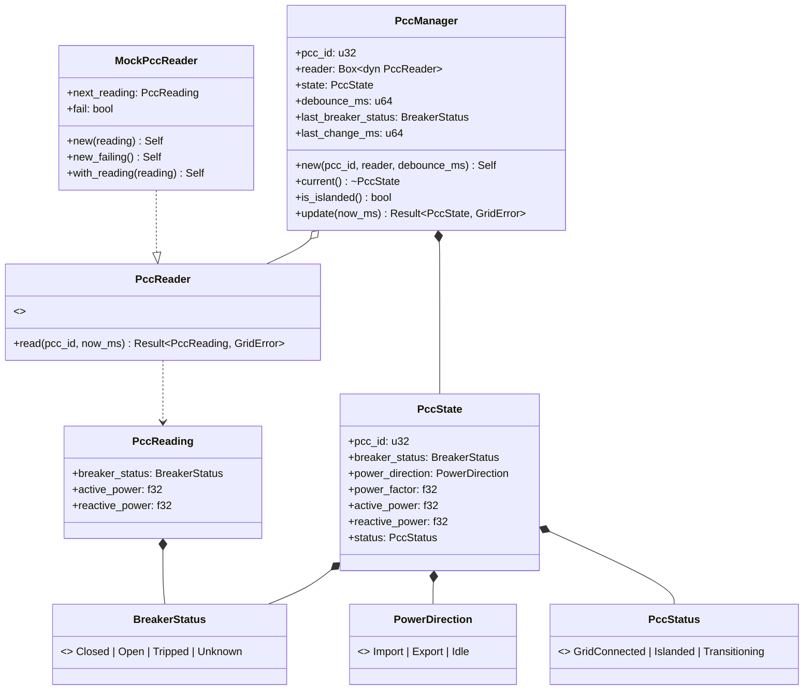
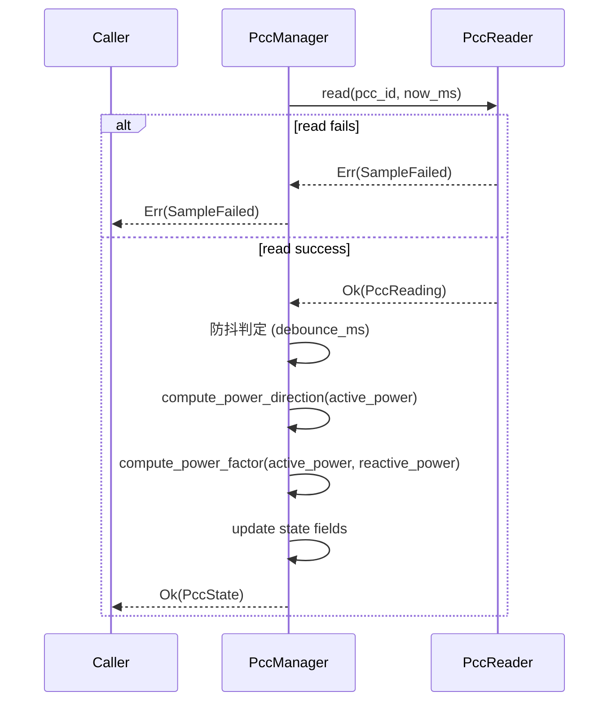

# EnerOS v0.83.0 PCC 并网点管理设计文档

> **版本**：v0.83.0
> **Phase**：Phase 2 多机联邦
> **子系统**：`crates/agents/grid_agent`（subsystem = agents，扩展模块 `pcc`）
> **蓝图依据**：`蓝图/phase2.md` §v0.83.0
> **状态**：设计中
> **最后更新**：2026-07-17

---

## 目录

1. [版本目标](#1-版本目标)
2. [前置依赖](#2-前置依赖)
3. [交付物清单](#3-交付物清单)
4. [数据结构](#4-数据结构)
5. [接口设计](#5-接口设计)
6. [错误处理](#6-错误处理)
7. [选型对比](#7-选型对比)
8. [实现路径](#8-实现路径)
9. [测试计划](#9-测试计划)
10. [验收标准](#10-验收标准)
11. [风险与坑点](#11-风险与坑点)
12. [偏差声明（D1~D14）](#12-偏差声明d1d14)

---

## 1. 版本目标

### 1.1 核心目标

v0.83.0 在 v0.82.0 Grid Agent 电网状态感知（频率/电压/电流/功率采样与异常检测）之上，进入 P2-C 子阶段 Agent 矩阵扩展的第二步，交付 **PCC 并网点管理（Point of Common Coupling Management）**：在既有 `eneros-grid-agent` crate 中追加 `pcc` 模块，监测并网点开关状态、计算功率方向与功率因数、判定并网 / 离网 / 过渡态，并提供最小防抖逻辑。PCC 是微电网与主网的物理接口，其开关位置 + 功率方向是 v0.84.0 并离网切换决策的前提输入。

本版本严格遵循 Karpathy 4 原则：
- **Simplicity First**：仅追加 `pcc.rs` 一个新源文件 + 一个配置模板 + 本设计文档；不新增 crate、不新增依赖、不修改 v0.82.0 既有源代码。
- **Surgical Changes**：`lib.rs` 仅追加 `pub mod pcc;` + `pub use pcc::{...}` 重导出（约 3 行新增）；`Cargo.toml` 仅更新 `description` 字段；既有 46 个测试（T1~T45）必须无回归。

### 1.2 业务价值

| 业务价值 | 说明 |
|---------|------|
| **v0.84.0 并离网切换** | PCC 开关位置 + 功率方向是并离网切换决策的核心触发条件，`PccStatus::Islanded` 直接驱动切换 |
| **v0.92.0 Edge Coordinator** | 联邦级电网状态汇聚需包含各节点 PCC 状态快照 |
| **VPP < 30s 响应** | PCC 状态影响 VPP 响应网络的可用性判断（孤岛时降级到本地控制） |
| **无功补偿告警** | 功率因数告警阈值 `pf_warn_below` 为无功补偿装置投切提供输入 |
| **保护跳闸感知** | `BreakerStatus::Tripped` 区别于手动分闸，触发上层保护动作复归流程 |

### 1.3 Phase 定位

| 维度 | 定位 |
|------|------|
| Phase | Phase 2 多机联邦（v0.75.0~v0.126.0） |
| 子阶段 | P2-C Agent 矩阵扩展第二步 |
| 平面 | 慢平面（Agent Runtime 分区，管理信息大区） |
| 角色 | 并网点状态采集器 + 功率方向计算器 + 防抖状态机 |
| 上游版本 | v0.82.0 Grid Agent（直接扩展，不破坏既有 API） |
| 下游版本 | v0.84.0 并离网切换（消费 `PccStatus` 决策） |

### 1.4 出口关联

本版本不构成 Phase 出口条件，但其交付物 `PccManager` / `PccState` / `BreakerStatus` / `PowerDirection` / `PccStatus` / `PccReader` 将被以下后续版本直接复用：

- **v0.84.0 并离网切换**：消费 `PccManager::is_islanded()` 触发切换决策；消费 `PccStatus::Transitioning` 延迟切换避免抖动期间误动作。
- **v0.92.0 Edge Coordinator**：联邦级并网点状态汇聚。
- **v1.0.0 商用版**：MVP 联邦要求 PCC 状态实时报告可用（ADR-0004）。

---

## 2. 前置依赖

### 2.1 前序版本依赖

| 版本 | 交付物 | 本版本使用方式 |
|------|--------|---------------|
| v0.82.0 | Grid Agent（`GridError` / `GridSampler` trait 模式 / 46 tests） | 直接扩展 crate；复用 `GridError::SampleFailed`（偏差 D4）；沿用 `GridSampler` trait 抽象模式（偏差 D3）；T47~T86 续接 T1~T45 编号 |
| v0.73.0 | device-agent（`AgentRuntime` trait） | 本版本不直接依赖；`PccManager` 独立组件，不嵌入 `GridAgent`（偏差 D5） |
| v0.51.0 | 协议抽象层（`PointAccess` trait） | 本版本不直接依赖；通过 `PccReader` trait 抽象读取面（偏差 D3），后续 v0.84.0+ 接入真实协议时实现 `Iec104PccReader` / `ModbusPccReader` 桥接 |
| v0.33.0 | `eneros-agent` 类型 | 不直接使用；本版本不修改 `AgentDescriptor` / `AgentType` |

### 2.2 外部依赖

| 依赖 | 版本 | 用途 | feature |
|------|------|------|---------|
| `eneros-agent` | workspace 既有 | 不直接使用（v0.82.0 已引用） | — |
| `eneros-energy-market-agent` | workspace 既有 | 不直接使用（v0.82.0 已引用） | — |
| `alloc::boxed::Box` | core | `PccManager.reader: Box<dyn PccReader>` 动态派发 | 默认 |
| `core::f32::sqrt` | core | 功率因数计算（偏差 D7，aarch64 原生 `fsqrts` 指令，无需 libm） | 默认 |

> **说明**：本版本为算法骨架，不引入任何外部协议栈、DDS 库、PMU 库或 `log` crate 依赖（沿用 v0.82.0 单线程 no_std 先例）。`PccReader` trait 抽象隔离协议层，真实 IEC 104 / Modbus / PMU 量测装置延后到 v0.84.0+ 硬件集成阶段（偏差 D13）。SBOM 不变。

### 2.3 假设

1. **单线程 no_std 假设**：Agent Runtime 在 Phase 2 阶段为单线程模型（蓝图 §43.6 内存预算：Agent Runtime ≤ 64 MB），`PccReader` trait 不要求 `Send + Sync`（沿用 v0.82.0 D10 单线程假设）。
2. **gPTP 已同步假设**：v0.79.0 gPTP 已完成时间同步，`now_ms: u64` 注入的时间戳可信。
3. **外部并网点装置假设**：实际部署假设存在外部并网点开关 / 保护装置（断路器 + 保护继电器），可通过 IEC 104 / Modbus 读取开关位置与功率量。本版本 Mock 即时返回，不依赖真实硬件。
4. **功率方向符号约定假设**：约定 P > 0 = Import（导入，从主网取电），P < 0 = Export（导出，向主网送电）（偏差 D11，§8.5 符号约定）。

### 2.4 阻塞条件

无。本版本为算法骨架先行，不依赖真实硬件或真实协议栈。`PccReader` + `MockPccReader` 完全可单元测试。

---

## 3. 交付物清单

### 3.1 代码交付物

| # | 路径 | 类型 | 说明 |
|---|------|------|------|
| 1 | `crates/agents/grid_agent/src/pcc.rs` | 源码（新增） | PCC 管理模块：5 数据结构 + `PccReader` trait + `MockPccReader` + `PccManager` + 2 辅助函数 + T47~T86 测试（偏差 D9，沿用 v0.82.0 内嵌测试模式） |
| 2 | `crates/agents/grid_agent/src/lib.rs` | 源码（修改） | 追加 `pub mod pcc;` + `pub use pcc::{...}` 重导出 + 顶部文档注释更新（偏差 D5：surgical，仅追加约 3 行） |
| 3 | `crates/agents/grid_agent/Cargo.toml` | 配置（修改） | `description` 字段追加 "+ v0.83.0 PCC 管理"（无新依赖） |
| 4 | `Cargo.toml`（根） | 配置（修改） | `[workspace.package] version = "0.83.0"` |
| 5 | `Makefile` | 配置（修改） | VERSION 变量 + header 注释 → `0.83.0` |
| 6 | `.github/workflows/ci.yml` | 配置（修改） | header 注释 → `0.83.0` |
| 7 | `ci/src/gate.rs` | 源码（修改） | clippy 段 + test 段注释追加 v0.83.0 PCC API 列表 |

### 3.2 接口交付物

| 接口 | 类型 | 用途 |
|------|------|------|
| `BreakerStatus` | enum（4 变体） | 断路器状态：`Closed` / `Open` / `Tripped` / `Unknown`（偏差 D10） |
| `PowerDirection` | enum（3 变体） | 功率方向：`Import` / `Export` / `Idle`（偏差 D11） |
| `PccStatus` | enum（3 变体） | PCC 状态：`GridConnected` / `Islanded` / `Transitioning`（偏差 D12） |
| `PccReading` | struct（3 字段） | 单次读取快照：`breaker_status` / `active_power` / `reactive_power`（偏差 D14） |
| `PccState` | struct（7 字段） | PCC 完整状态：`pcc_id` / `breaker_status` / `power_direction` / `power_factor` / `active_power` / `reactive_power` / `status`（偏差 D13） |
| `PccReader` | trait | 读取抽象面（偏差 D3） |
| `MockPccReader` | struct | Mock 读取实现 + 故障注入 |
| `PccManager` | struct（6 字段） | 单 PCC 周期管理器：`pcc_id` / `reader` / `state` / `debounce_ms` / `last_breaker_status` / `last_change_ms` |
| `compute_power_direction` | fn | 功率方向计算（D11 阈值 1.0W） |
| `compute_power_factor` | fn | 功率因数计算（D7 `core::f32::sqrt`） |
| `compute_stable_status` | fn | 断路器状态 → PCC 状态映射（私有，被 `update` 调用） |

### 3.3 文档交付物

| # | 路径 | 说明 |
|---|------|------|
| 1 | `docs/agents/pcc-management-design.md`（本文件） | 12 章节完整设计文档 + 2 Mermaid 图 + D1~D14 偏差声明（偏差 D8） |

### 3.4 测试交付物

| 测试 ID | 类型 | 位置 |
|---------|------|------|
| T47~T86 | 单元测试（40 个） | `crates/agents/grid_agent/src/pcc.rs`（`#[cfg(test)] mod tests`，偏差 D9，沿用 v0.82.0 内嵌模式） |

### 3.5 配置交付物

| # | 路径 | 说明 |
|---|------|------|
| 1 | `configs/pcc.toml` | PCC 并网点管理配置模板（偏差 D8：位于 `configs/` 而非蓝图 `config/`） |

### 3.6 不交付内容（明确范围）

- ❌ 真实 IEC 104 / Modbus / PMU 量测装置接入（延后到 v0.84.0+，偏差 D13）
- ❌ 多 PCC 联邦级汇聚（本版本仅单 `PccManager`，多 PCC 场景由上层持有多个 `PccManager` 实例）
- ❌ 真实 DDS 发布（`PccState` 由调用方消费，本版本不发布到 Agent Bus）
- ❌ 硬件性能基准（`update` < 50ms 标注为"硬件集成阶段验收"，本版本仅算法骨架）
- ❌ `GridAgent` 持有 `PccManager`（偏差 D5：surgical 不修改 v0.82.0 GridAgent 8 字段与构造器签名）
- ❌ 主动防抖告警（`Transitioning` 状态由调用方消费，本版本不主动发布 alert）

---

## 4. 数据结构

> 本章节详细定义 PCC 管理所有公开数据结构。所有结构均满足 no_std 合规（蓝图 §43.1），不使用 `std::*`。所有结构派生 `Debug, Clone, Copy, PartialEq`（`Default` 视情况），保证值语义无堆分配。

### 4.1 `BreakerStatus`

```rust
/// 断路器状态枚举（4 变体）。
///
/// 偏差声明 D10：保持 4 变体（Closed / Open / Tripped / Unknown）。
/// - `Tripped` 不同于 `Open`（保护跳闸 vs 手动分闸），上层需区分复归流程。
/// - `Unknown` 用于 §6.5 故障注入（开关状态丢失告警）。
#[derive(Debug, Clone, Copy, PartialEq, Eq, Default)]
pub enum BreakerStatus {
    /// 开关闭合（并网运行）
    Closed,
    /// 开关断开（手动分闸，孤岛运行）
    Open,
    /// 保护跳闸（自动跳闸，视为孤岛，但需保护动作复归）
    Tripped,
    /// 状态不确定（通信失败、装置离线等，保持过渡态并告警）
    #[default]
    Unknown,
}
```

**设计要点**：
- 4 变体覆盖断路器主要状态场景：闭合 / 手动分闸 / 保护跳闸 / 未知。
- 派生 `Default`，标注 `#[default] Unknown`（初始状态不确定，避免误判为并网）。
- `Copy + Clone + Eq`：值语义，无堆分配；可作 BTreeMap 键（如多 PCC 状态汇总）。

### 4.2 `PowerDirection`

```rust
/// 功率方向枚举（3 变体）。
///
/// 偏差声明 D11：约定 P > 0 = Import（导入，从主网取电），
/// P < 0 = Export（导出，向主网送电）。阈值 1.0W 避免零漂误判。
#[derive(Debug, Clone, Copy, PartialEq, Eq, Default)]
pub enum PowerDirection {
    /// 导入（P > import_power_w，从主网取电）
    Import,
    /// 导出（P < -export_power_w，向主网送电）
    Export,
    /// 空载（|P| <= 阈值，避免零漂误判）
    #[default]
    Idle,
}
```

**设计要点**：
- 3 变体覆盖功率方向主要场景：导入 / 导出 / 空载。
- 派生 `Default`，标注 `#[default] Idle`（初始无功率流，安全默认）。
- 符号约定（偏差 D11）：P > 0 = Import，P < 0 = Export（蓝图 §8.5 符号约定）。

### 4.3 `PccStatus`

```rust
/// PCC 状态枚举（3 变体）。
///
/// 偏差声明 D12：保持 3 变体（GridConnected / Islanded / Transitioning）。
/// `Transitioning` 在 D6 防抖逻辑中使用：开关状态变化后 debounce_ms 内
/// 报告 Transitioning，过期后稳定为 GridConnected / Islanded。
#[derive(Debug, Clone, Copy, PartialEq, Eq, Default)]
pub enum PccStatus {
    /// 并网运行（开关闭合，稳定）
    GridConnected,
    /// 孤岛运行（开关断开或保护跳闸，稳定）
    Islanded,
    /// 过渡态（防抖期内或状态不确定，禁止切换决策）
    #[default]
    Transitioning,
}
```

**设计要点**：
- 3 变体覆盖 PCC 状态主要场景：并网 / 孤岛 / 过渡。
- 派生 `Default`，标注 `#[default] Transitioning`（初始状态过渡，强制上层等待稳定后再决策）。
- `Transitioning` 是 D6 防抖逻辑的核心：防止开关抖动期间误触发并离网切换。

### 4.4 `PccReading`

```rust
/// PCC 单次读取快照（3 字段）。
///
/// 偏差声明 D14：蓝图未定义 `PccReading`，本版本新增一次性读取结构体。
/// 单次 `read()` 返回所有 PCC 量（开关状态 + 有功 + 无功），原子性强，
/// 避免多次 `read()` 调用 + `format!()` 堆分配（D3 抽象）。
#[derive(Debug, Clone, Copy, PartialEq, Default)]
pub struct PccReading {
    /// 断路器状态
    pub breaker_status: BreakerStatus,
    /// 有功功率（W，正=导入，负=导出，偏差 D11）
    pub active_power: f32,
    /// 无功功率（var）
    pub reactive_power: f32,
}
```

**设计要点**：
- 3 字段：1 开关状态 + 2 功率量。
- `f32` 测量字段（沿用 v0.82.0 D12 简化风格）。
- 派生 `Default`：全部字段归零 / `BreakerStatus::Unknown`。
- 原子性：单次 `read()` 返回所有 PCC 量，避免半更新状态（如开关已变化但功率未更新）。

### 4.5 `PccState`

```rust
/// PCC 完整状态（7 字段）。
///
/// 偏差声明 D13：7 字段（pcc_id: u32，全 Copy）。`pcc_id` 使用 u32
/// 而非 String（偏差 D2），使 PccState 可 derive Copy，
/// `update()` 返回 `Ok(self.state)` 无需 `clone()` 堆分配。
#[derive(Debug, Clone, Copy, PartialEq, Default)]
pub struct PccState {
    /// PCC 标识（u32，支持多 PCC 场景，偏差 D2）
    pub pcc_id: u32,
    /// 断路器状态
    pub breaker_status: BreakerStatus,
    /// 功率方向（由 active_power 计算）
    pub power_direction: PowerDirection,
    /// 功率因数（由 active_power / reactive_power 计算）
    pub power_factor: f32,
    /// 有功功率（W，正=导入，负=导出）
    pub active_power: f32,
    /// 无功功率（var）
    pub reactive_power: f32,
    /// PCC 状态（含防抖逻辑，D6）
    pub status: PccStatus,
}
```

**设计要点**：
- 7 字段：1 标识 + 1 开关 + 1 方向 + 1 功率因数 + 2 功率量 + 1 状态。
- 派生 `Copy`：`update()` 返回 `Ok(self.state)` 无需 `clone()` 堆分配（偏差 D13）。
- `Default`：`pcc_id == 0`，`breaker_status == Unknown`，`power_direction == Idle`，`power_factor == 0.0`，`active_power == 0.0`，`reactive_power == 0.0`，`status == Transitioning`。

### 4.6 数据结构关系图

下图展示 5 个数据结构之间的关系（`PccReading` 由 `PccReader` 返回，`PccManager` 持有 `PccState`，`PccState` 聚合 `BreakerStatus` / `PowerDirection` / `PccStatus`）：



---

## 5. 接口设计

### 5.1 `PccReader` trait + `MockPccReader`

```rust
use crate::GridError;

/// 读取抽象面 trait（偏差 D3）。
///
/// 不依赖 `eneros-protocol-abstract` / `eneros-upa-model`，
/// 避免协议层间接依赖。后续 v0.84.0+ 接入真实 IEC 104 / Modbus / PMU
/// 量测装置时实现 `Iec104PccReader` / `ModbusPccReader` / `PmuPccReader` 桥接。
///
/// 沿用 v0.82.0 `GridSampler` trait 抽象模式。
pub trait PccReader {
    /// 读取 PCC 量测。
    ///
    /// # 参数
    /// - `pcc_id`: PCC 标识（支持多 PCC 场景）
    /// - `now_ms`: 当前时间戳（ms，由调用方注入）
    ///
    /// # 返回
    /// - `Ok(PccReading)`: 读取成功
    /// - `Err(GridError::SampleFailed)`: 读取失败（装置离线、通信超时等）
    fn read(&mut self, pcc_id: u32, now_ms: u64) -> Result<PccReading, GridError>;
}

/// Mock 读取实现（测试用）。
///
/// 偏差声明 D3 / D13：通过 `MockPccReader` 抽象读取面，
/// 不接入真实 IEC 104 / Modbus / PMU 量测装置。
/// 沿用 v0.82.0 `MockGridSampler` 模式。
#[derive(Debug, Clone)]
pub struct MockPccReader {
    /// 预设返回的 PCC 读取快照
    pub next_reading: PccReading,
    /// 是否模拟读取失败
    pub fail: bool,
}

impl MockPccReader {
    /// 创建 Mock 读取器（返回指定 reading，无故障）。
    pub fn new(reading: PccReading) -> Self {
        Self {
            next_reading: reading,
            fail: false,
        }
    }

    /// 创建总是失败的 Mock 读取器（故障注入）。
    pub fn new_failing() -> Self {
        Self {
            next_reading: PccReading::default(),
            fail: true,
        }
    }

    /// 设置预设返回的 PCC 读取快照（builder 模式）。
    pub fn with_reading(mut self, reading: PccReading) -> Self {
        self.next_reading = reading;
        self
    }
}

impl PccReader for MockPccReader {
    fn read(&mut self, pcc_id: u32, _now_ms: u64) -> Result<PccReading, GridError> {
        if self.fail {
            return Err(GridError::SampleFailed);
        }
        // pcc_id 参数用于真实实现选择目标 PCC；Mock 实现忽略并返回 next_reading。
        let _ = pcc_id;
        Ok(self.next_reading)
    }
}
```

**设计要点**：
- 偏差 D3：trait 抽象隔离协议层，避免 `format!()` 堆分配（与蓝图 `points.read(format!("pcc_{}_breaker", id)).await` 不同）。
- 偏差 D4：错误类型复用 v0.82.0 `GridError::SampleFailed`，不新增错误类型。
- `read` 签名接收 `pcc_id` 参数：真实实现可借此选择目标 PCC（多 PCC 场景），Mock 实现忽略并返回预设 reading。
- `_now_ms` 前缀下划线：Mock 实现不使用时间戳（真实实现可能用于超时判断）。

### 5.2 `PccManager::new` + 访问器

```rust
use alloc::boxed::Box;

/// PCC 周期管理器。
///
/// 持有单个 PCC 的 reader 与状态，周期性调用 `update(now_ms)` 更新状态。
/// 实现最小防抖逻辑（偏差 D6）：开关状态变化后 `debounce_ms` 内报告
/// `Transitioning`，过期后稳定为 `GridConnected` / `Islanded`。
///
/// 偏差声明 D5：独立组件，不嵌入 `GridAgent`（surgical，不修改 v0.82.0
/// GridAgent 8 字段与构造器签名）。用户可在自己的 Agent 中组合
/// `GridAgent` + `PccManager`。
pub struct PccManager {
    /// PCC 标识
    pcc_id: u32,
    /// 读取器（动态派发，允许测试注入 MockPccReader）
    reader: Box<dyn PccReader>,
    /// 当前 PCC 状态（含防抖状态）
    state: PccState,
    /// 防抖时间（ms，0 表示禁用防抖）
    debounce_ms: u64,
    /// 上一次稳定的断路器状态（用于检测变化）
    last_breaker_status: BreakerStatus,
    /// 上一次状态变化的时间戳（ms）
    last_change_ms: u64,
}

impl PccManager {
    /// 构造 PCC 管理器。
    ///
    /// # 参数
    /// - `pcc_id`: PCC 标识
    /// - `reader`: 读取器（`Box<dyn PccReader>`）
    /// - `debounce_ms`: 防抖时间（ms，0 表示禁用防抖，每次 read 后立即稳定）
    ///
    /// 初始化：
    /// - `state = PccState::default()`（含 `status = Transitioning`）
    /// - `last_breaker_status = BreakerStatus::Unknown`
    /// - `last_change_ms = 0`
    pub fn new(pcc_id: u32, reader: Box<dyn PccReader>, debounce_ms: u64) -> Self {
        Self {
            pcc_id,
            reader,
            state: PccState::default(),
            debounce_ms,
            last_breaker_status: BreakerStatus::Unknown,
            last_change_ms: 0,
        }
    }

    /// 获取当前 PCC 状态引用。
    pub fn current(&self) -> &PccState {
        &self.state
    }

    /// 判断当前是否孤岛状态。
    ///
    /// 等价于 `self.state.status == PccStatus::Islanded`。
    /// 用于 v0.84.0 并离网切换决策的快捷判定。
    pub fn is_islanded(&self) -> bool {
        self.state.status == PccStatus::Islanded
    }
}
```

**设计要点**：
- 6 字段：`pcc_id` / `reader` / `state` / `debounce_ms` / `last_breaker_status` / `last_change_ms`。
- `reader: Box<dyn PccReader>`：动态派发，允许测试注入 `MockPccReader`，生产注入真实读取器（v0.84.0+）。
- `state: PccState`：最近一次更新的状态，供 `current()` 查询。
- `last_breaker_status` / `last_change_ms`：防抖逻辑状态机字段（D6）。

### 5.3 `PccManager::update` 防抖逻辑

```rust
impl PccManager {
    /// 周期性更新 PCC 状态。
    ///
    /// 偏差声明 D1：sync `update(now_ms)`，no_std 无 async runtime，
    /// 沿用 v0.82.0 D5 sync 模式。
    ///
    /// # 参数
    /// - `now_ms`: 当前时间戳（ms，由调用方注入）
    ///
    /// # 返回
    /// - `Ok(PccState)`: 更新成功，返回最新状态（Copy，无堆分配）
    /// - `Err(GridError::SampleFailed)`: 读取失败，state 不变（幂等）
    ///
    /// # 算法步骤
    /// 1. 调用 `reader.read(pcc_id, now_ms)`，失败返回 `Err(SampleFailed)`
    /// 2. 取 `new_breaker = reading.breaker_status`
    /// 3. 防抖逻辑（见 §5.4）
    /// 4. 更新 `state.breaker_status = new_breaker`
    /// 5. 更新 `state.active_power` / `reactive_power`
    /// 6. 更新 `state.power_direction = compute_power_direction(active_power)`
    /// 7. 更新 `state.power_factor = compute_power_factor(active_power, reactive_power)`
    /// 8. 返回 `Ok(self.state)`
    pub fn update(&mut self, now_ms: u64) -> Result<PccState, GridError> {
        // Step 1: 读取 PCC 量测（失败立即返回，state 不变）
        let reading = self.reader.read(self.pcc_id, now_ms)?;

        // Step 2: 取新断路器状态
        let new_breaker = reading.breaker_status;

        // Step 3: 防抖逻辑
        if new_breaker != self.last_breaker_status {
            // 状态变化：重置防抖计时器，进入过渡态
            self.last_breaker_status = new_breaker;
            self.last_change_ms = now_ms;
            self.state.status = PccStatus::Transitioning;
        } else if self.debounce_ms == 0
            || now_ms.saturating_sub(self.last_change_ms) >= self.debounce_ms
        {
            // 状态未变且防抖期已过（或防抖禁用）：稳定为最终状态
            self.state.status = compute_stable_status(new_breaker);
        }
        // else: 防抖期内，保持 status = Transitioning

        // Step 4-7: 更新 state 字段
        self.state.pcc_id = self.pcc_id;
        self.state.breaker_status = new_breaker;
        self.state.active_power = reading.active_power;
        self.state.reactive_power = reading.reactive_power;
        self.state.power_direction = compute_power_direction(reading.active_power);
        self.state.power_factor =
            compute_power_factor(reading.active_power, reading.reactive_power);

        // Step 8: 返回 Copy 状态（无堆分配）
        Ok(self.state)
    }
}
```

**设计要点**：
- 偏差 D1：sync API，no_std 无 async runtime。
- 偏差 D6：防抖逻辑核心约 5 行（`if new != last` / `else if debounce_ms == 0 || now - last >= debounce_ms` / `else 保持 Transitioning`）。
- 偏差 D13：返回 `Ok(self.state)` 利用 `PccState: Copy`，无需 `clone()`。
- `now_ms.saturating_sub`：避免时间戳回绕（虽然 u64 几乎不可能回绕，但 no_std 安全实践）。
- `debounce_ms == 0` 短路：禁用防抖时立即稳定，简化测试场景（T58 验证）。
- 读取失败时 `state` 完全不变（幂等，§6.4）。

### 5.4 `compute_stable_status`

```rust
/// 断路器状态 → PCC 稳定状态映射。
///
/// 偏差声明 D10：4 变体 BreakerStatus 映射到 3 变体 PccStatus。
/// - `Closed → GridConnected`（开关闭合，并网运行）
/// - `Open → Islanded`（开关断开，孤岛运行）
/// - `Tripped → Islanded`（保护跳闸，视为孤岛）
/// - `Unknown → Transitioning`（状态不确定，保持过渡态并告警）
fn compute_stable_status(breaker: BreakerStatus) -> PccStatus {
    match breaker {
        BreakerStatus::Closed => PccStatus::GridConnected,
        BreakerStatus::Open => PccStatus::Islanded,
        BreakerStatus::Tripped => PccStatus::Islanded,
        BreakerStatus::Unknown => PccStatus::Transitioning,
    }
}
```

**设计要点**：
- 私有函数（仅被 `update` 调用，不暴露为 pub）。
- `Unknown → Transitioning`：通信失败时保持过渡态，强制上层等待恢复后再决策（§11.5 坑点 3）。
- `Tripped → Islanded`：保护跳闸与手动分闸在 PCC 状态层面一致（均为孤岛），但 `breaker_status` 字段保留 `Tripped`，上层可据此触发保护动作复归流程。

### 5.5 `compute_power_direction` + `compute_power_factor`

```rust
/// 计算功率方向。
///
/// 偏差声明 D11：约定 P > 0 = Import（导入，从主网取电），
/// P < 0 = Export（导出，向主网送电）。阈值 1.0W 避免零漂误判。
///
/// - `active_power > 1.0 → Import`
/// - `active_power < -1.0 → Export`
/// - 否则 → `Idle`（|P| ≤ 1.0 视为空载）
pub fn compute_power_direction(active_power: f32) -> PowerDirection {
    if active_power > 1.0 {
        PowerDirection::Import
    } else if active_power < -1.0 {
        PowerDirection::Export
    } else {
        PowerDirection::Idle
    }
}

/// 计算功率因数。
///
/// 偏差声明 D7：使用 `core::f32::sqrt`，aarch64 原生 `fsqrts` 指令，
/// no_std 无需 libm 依赖。
///
/// - 若 `|active_power| < 0.1` → 返回 `1.0`（避免除零与微小值噪声）
/// - 否则 → 返回 `active_power / (active_power² + reactive_power²).sqrt()`
///
/// # 示例
/// - `compute_power_factor(3.0, 4.0)` → `0.6`（3-4-5 三角形验证）
/// - `compute_power_factor(0.0, 0.0)` → `1.0`（避免除零）
pub fn compute_power_factor(active_power: f32, reactive_power: f32) -> f32 {
    if active_power.abs() < 0.1 {
        return 1.0;
    }
    let apparent_power = (active_power * active_power + reactive_power * reactive_power).sqrt();
    active_power / apparent_power
}
```

**设计要点**：
- 阈值 1.0W / 0.1W 分别对应 `configs/pcc.toml` 的 `import_power_w` / `pf_epsilon`（本版本为算法骨架，阈值硬编码；v0.84.0+ 可改为配置注入）。
- `pf_epsilon = 0.1` 阈值大于零漂量级（典型零漂 < 0.01W），避免微小值噪声导致 PF 跳变。
- 3-4-5 三角形验证：`compute_power_factor(3.0, 4.0)` = 3 / 5 = 0.6（T82 验证）。
- 不使用 `f64`（沿用 v0.82.0 D12 简化风格）；aarch64 `fsqrts` 单指令完成。

### 5.6 `PccManager.update` 时序图

下图展示 `PccManager::update(now_ms)` 内的读取 → 防抖 → 功率计算 → 状态更新完整流程：



### 5.7 防抖决策流程图

下图展示断路器状态变化后的防抖决策流程（`compute_stable_status` 映射 + 防抖计时）：

```mermaid
flowchart TD
    A[read breaker_status] --> B{new != last?}
    B -->|是| C[更新 last_breaker_status<br/>last_change_ms = now_ms]
    C --> D{debounce_ms == 0?}
    D -->|是| E[status = compute_stable_status]
    D -->|否| F[status = Transitioning]
    B -->|否| G{now_ms - last_change_ms >= debounce_ms?}
    G -->|是| E
    G -->|否| F
    E --> H[Closed→GridConnected<br/>Open→Islanded<br/>Tripped→Islanded<br/>Unknown→Transitioning]
    F --> I[update power fields]
    H --> I
    I --> J[return Ok(state)]
```

---

## 6. 错误处理

### 6.1 读取失败

**场景**：`reader.read(pcc_id, now_ms)` 返回 `Err(GridError::SampleFailed)`。

**触发条件**：
- `MockPccReader::new_failing()` 故障注入。
- 真实场景：IEC 104 / Modbus / PMU 量测装置离线、通信超时、协议解析失败。

**返回**：`Err(GridError::SampleFailed)` 直接传播。

**处理策略**：
- 偏差 D4：复用 v0.82.0 `GridError::SampleFailed` 变体，语义复用为"读取失败"（v0.82.0 为"采样失败"，PCC 语义等价）。
- `update()` 立即返回错误，`state` 完全不变（包括 `breaker_status` / `power_direction` / `power_factor` / `active_power` / `reactive_power` / `status` 全部保持上一次成功更新值）。
- 上层 Agent Runtime 责任监控连续失败次数，超阈值触发降级（如冻结 `PccStatus` 报告或降级到 L1 路径）。
- 上次成功状态保留：避免读取失败期间 `status` 退化为 `Transitioning` 导致上层误判（§6.4 幂等性保证）。

### 6.2 `InvalidConfig`（备用，本版本未使用）

**场景**：配置项非法（如 `debounce_ms` 超过 u64 范围、`pcc_id` 重复等）。

**本版本处理**：
- 本版本 `PccManager::new` 不验证 `debounce_ms` 合法性（0 表示禁用防抖，其他值均合法）。
- `InvalidConfig` 备用错误变体在 v0.82.0 `GridError` 中**不存在**（v0.82.0 仅 3 变体：`SampleFailed` / `PublishFailed` / `AnomalyDetected`）。
- 偏差 D4：本版本不引入新错误类型；若 v0.84.0+ 需要配置验证，可在 `GridError` 追加 `InvalidConfig` 变体（外科手术式变更，不影响 v0.83.0 既有 API）。

### 6.3 错误传播链

```
MockPccReader.read() → Err(GridError::SampleFailed)
        ↓
PccManager.update() → Err(GridError::SampleFailed)
        ↓
调用方（如 GridAgent 或上层编排器）→ 通过 From<GridError> for AgentRuntimeError
        ↓
AgentRuntimeError::DeviceError("pcc read failed".into())
```

> **说明**：`From<GridError> for AgentRuntimeError` 已在 v0.82.0 lib.rs 实现（`SampleFailed → DeviceError("grid sample failed")`）。本版本不修改该 impl（偏差 D5 surgical）。若需区分 PCC 读取失败与电网采样失败的错误消息，可在 v0.84.0+ 追加 `From<GridError> for AgentRuntimeError` 的 PCC 专用映射（需评估是否破坏 v0.82.0 既有 impl，若破坏则改为 PCC 专用错误类型）。

### 6.4 `update` 幂等性保证

**保证**：`update` 失败时 `state` 完全不变。

**实现**：
- `let reading = self.reader.read(...)?` 使用 `?` 提前返回，`?` 之后的代码不执行。
- 因此 `state.breaker_status` / `active_power` / `reactive_power` / `power_direction` / `power_factor` / `status` 全部保持上一次成功更新值。
- `last_breaker_status` / `last_change_ms` 也保持不变（防抖计时器不重置）。

**影响**：
- 调用方重试 `update(now_ms)` 时，`state` 反映最后一次成功读取的状态。
- 上层监控系统可以安全依赖 `current().status`：读取失败期间状态不会闪烁为 `Transitioning`。
- 注意：这意味着读取失败期间 `status` 可能停留在 `GridConnected` / `Islanded` 而非 `Transitioning`，上层需结合读取失败计数判断状态可信度。

### 6.5 错误恢复策略

| 错误类别 | 恢复策略 | 责任方 |
|---------|---------|--------|
| `SampleFailed`（读取失败） | `update` 立即返回错误；上层重试或降级 | 上层 Agent Runtime |
| 读取连续失败超阈值 | 上层冻结 `PccStatus` 报告或降级到 L1 | 上层 Agent Runtime |
| `BreakerStatus::Unknown`（装置报告未知） | `compute_stable_status` 返回 `Transitioning`，强制上层等待恢复 | PccManager 内部 + 上层 |
| 防抖期内开关抖动 | `debounce_ms` 内保持 `Transitioning`，过期后稳定 | PccManager 内部 |
| 配置非法（`InvalidConfig`） | 本版本不发生；v0.84.0+ 评估追加 | — |

---

## 7. 选型对比

### 7.1 状态判定方式对比：开关位置 + 功率方向 vs 频率变化率 vs 电压相位（PMU）

| 维度 | 开关位置 + 功率方向（本版本） | 频率变化率（ROCOF） | 电压相位（PMU） |
|------|------------------------------|---------------------|------------------|
| **原理** | 直接读取断路器辅助接点 + 功率方向符号 | 检测电网频率变化率（df/dt）越限 | 同步相量测量单元比较电压相位差 |
| **响应时间** | 100ms~1s（取决于装置报告周期） | 10ms~100ms | < 20ms（PMU 30~60 帧/秒） |
| **硬件成本** | 低（断路器辅助接点 + 功率变送器） | 中（需高精度频率测量） | 高（PMU 装置昂贵） |
| **抗扰动性** | 高（开关位置为离散态，无误判） | 低（负荷扰动可能触发误判） | 中（需多 PMU 同步） |
| **复杂度** | 低（4 变体枚举 + 防抖） | 中（ROCOF 算法 + 阈值整定） | 高（PMU 同步 + 相量算法） |
| **no_std 合规** | ✅ | ✅ | ⚠️ 依赖 PMU 协议栈（C37.118） |
| **本版本采用** | ✅ | ❌ | ❌ |

> **决策**：选择"开关位置 + 功率方向"双确认方式（偏差 D10）。理由：
> 1. 硬件成本低：断路器辅助接点 + 功率变送器为微电网标配，无需额外 PMU 投资。
> 2. 抗扰动性高：开关位置为离散态，不受负荷扰动影响；功率方向作为辅助确认避免开关接点氧化误判。
> 3. no_std 合规：纯枚举 + f32 计算，无需复杂协议栈。
> 4. 响应时间可接受：100ms~1s 满足 v0.84.0 并离网切换决策需求（切换决策周期 ≥ 1s）。
>
> v0.84.0+ 可在 `PccReader` trait 之上追加 PMU 实现，作为快速孤岛检测的辅助输入（不影响本版本 API）。

### 7.2 采样抽象：`PccReader` trait vs 直接依赖 `eneros-protocol-abstract`

| 维度 | `PccReader` trait（本版本） | 直接依赖 `eneros-protocol-abstract` |
|------|------------------------------|-------------------------------------|
| **协议层耦合** | 无（trait 抽象隔离） | 强（直接依赖 `PointAccess`） |
| **测试便捷性** | 高（`MockPccReader` 故障注入） | 低（需 mock 协议栈） |
| **后续扩展** | v0.84.0+ 实现 `Iec104PccReader` / `ModbusPccReader` / `PmuPccReader` 桥接 | 已直接耦合，扩展受限 |
| **no_std 合规** | ✅ 纯 trait | ⚠️ 依赖 `eneros-upa-model` 复杂度 |
| **`format!()` 堆分配** | 无（结构体返回） | 有（`points.read(format!("pcc_{}_breaker", id))`） |
| **本版本采用** | ✅ | ❌ |

> **决策**：选择 `PccReader` trait（偏差 D3），避免协议层间接依赖与 `format!()` 堆分配，与 v0.82.0 `GridSampler` trait 抽象模式一致。

### 7.3 PCC id 类型：`u32` vs `String`

| 维度 | `pcc_id: u32`（本版本） | `pcc_id: String` |
|------|------------------------|------------------|
| **Copy 语义** | ✅ u32 Copy | ❌ String 非 Copy |
| **堆分配** | 无 | 有（String 分配） |
| **`PccState` 派生 `Copy`** | ✅ | ❌（导致 `update` 需 `clone()`） |
| **可读性** | 低（数字 id 需映射表） | 高（如 "pcc_main"） |
| **多 PCC 场景** | ✅ 支持（u32 足够标识 2^32 个 PCC） | ✅ 支持 |
| **no_std 合规** | ✅ | ⚠️ 需 `alloc::string::String` |
| **本版本采用** | ✅ | ❌ |

> **决策**：选择 `pcc_id: u32`（偏差 D2），Copy 语义使 `PccState` 可派生 `Copy`，`update()` 返回 `Ok(self.state)` 无需 `clone()` 堆分配。多 PCC 场景由上层持有多个 `PccManager` 实例（每个实例 `pcc_id` 不同），或 v0.84.0+ 追加 `PccManagerRegistry` 容器。

### 7.4 错误类型：复用 `GridError` vs 新增 `PccError`

| 维度 | 复用 `GridError`（本版本） | 新增 `PccError` |
|------|---------------------------|------------------|
| **surgical** | ✅ 不新增类型 | ❌ 新增类型 + `From` impl |
| **语义清晰度** | 中（`SampleFailed` 在 PCC 语境下意为"读取失败"） | 高（`PccError::ReadFailed`） |
| **v0.82.0 既有 impl** | ✅ 保留 `From<GridError> for AgentRuntimeError` | ❌ 需追加 `From<PccError> for AgentRuntimeError` |
| **本版本采用** | ✅ | ❌ |

> **决策**：复用 v0.82.0 `GridError::SampleFailed`（偏差 D4），surgical 不修改 lib.rs 的 `GridError` 定义与 `impl From`。若 v0.84.0+ PCC 错误场景扩展（如配置错误、防抖超时），可追加 `PccError` 类型或扩展 `GridError` 变体。

### 7.5 防抖实现：阈值法 vs 状态机法

| 维度 | 阈值法（本版本） | 完整状态机 |
|------|------------------|-----------|
| **复杂度** | 低（约 5 行核心逻辑） | 中（需定义状态转移图） |
| **可读性** | 高（`if new != last` / `else if debounce_ms == 0 \|\| now - last >= debounce_ms`） | 中（状态枚举 + 转移表） |
| **测试覆盖** | 40 个测试充分 | 需更多测试覆盖状态转移 |
| **本版本采用** | ✅ | ❌ |

> **决策**：选择阈值法（偏差 D6），最小防抖逻辑，满足 §9 "可靠：状态防抖"要求。完整状态机延后到 v0.84.0+ 评估（若需支持更复杂的状态转移，如"防抖期内多次变化重置计时器"等高级逻辑）。

---

## 8. 实现路径

### 8.1 实现路径概览（5 步）

```
Step 1: 创建 pcc.rs（数据结构 + Reader trait + MockPccReader + PccManager + 辅助函数）
   ↓
Step 2: 修改 lib.rs 追加 pub mod pcc; + pub use pcc::{...}（surgical，约 3 行新增）
   ↓
Step 3: 版本同步（根 Cargo.toml / Makefile / ci.yml / gate.rs / grid_agent Cargo.toml description）
   ↓
Step 4: 编写 T47~T86 测试（pcc.rs 内 #[cfg(test)] mod tests）
   ↓
Step 5: 验证 cargo test / build / fmt / clippy / deny
```

### 8.2 Step 1：创建 `pcc.rs`

**文件**：`crates/agents/grid_agent/src/pcc.rs`（新增）

**内容**：
- 5 数据结构（见 §4.1~§4.5）
- `PccReader` trait + `MockPccReader`（见 §5.1）
- `PccManager`（6 字段 + `new` / `current` / `is_islanded` / `update`，见 §5.2~§5.3）
- `compute_stable_status`（私有，见 §5.4）
- `compute_power_direction` + `compute_power_factor`（公开，见 §5.5）
- T47~T86 测试（见 §9）

**验证**：`cargo build -p eneros-grid-agent` 通过。

### 8.3 Step 2：修改 `lib.rs`（surgical）

**文件**：`crates/agents/grid_agent/src/lib.rs`

**变更**（仅追加，不修改 v0.82.0 既有代码行）：
- 顶部文档注释追加："+ v0.83.0 PCC 并网点管理（PccState / PccReader / PccManager / compute_power_direction / compute_power_factor）"
- 追加 `pub mod pcc;` 模块声明
- 追加 `pub use pcc::{compute_power_direction, compute_power_factor, MockPccReader, PccManager, PccReader, PccReading, PccState, PccStatus, BreakerStatus, PowerDirection};` 重导出

**surgical 保证**：
- v0.82.0 既有 `state.rs` / `sampler.rs` / `publisher.rs` 完全未改动。
- v0.82.0 既有 `lib.rs` 的 `GridState` / `DataQuality` / `GridAgent` / `GridSampler` / `GridPublisher` / `GridError` / `is_valid_grid` / `default_anomaly_detectors` / `publish_state` 定义与 `impl` 完全未改动。
- v0.82.0 既有 46 个测试（T1~T45 + `_ensure_imports_used`）必须仍全部通过。

**验证**：`cargo build -p eneros-grid-agent` 通过。

### 8.4 Step 3：版本同步

**文件列表**：

| 文件 | 变更 |
|------|------|
| `Cargo.toml`（根） | `[workspace.package] version = "0.83.0"` |
| `Makefile` | `VERSION := 0.83.0` + header 注释 → `0.83.0` |
| `.github/workflows/ci.yml` | header 注释 → `0.83.0` |
| `ci/src/gate.rs` | clippy 段 + test 段注释追加：`+ v0.83.0 PCC 管理：PccState / PccReading / BreakerStatus / PowerDirection / PccStatus / PccReader / MockPccReader / PccManager / compute_power_direction / compute_power_factor` |
| `crates/agents/grid_agent/Cargo.toml` | `description` 字段更新为 `"EnerOS v0.82.0 Grid Agent — 电网状态感知 + v0.83.0 PCC 并网点管理 (采样/异常检测/DDS 发布/PCC 状态抽象, no_std)"` |

**workspace members 不变**：`pcc.rs` 是既有 `eneros-grid-agent` crate 的新模块，非新 crate（不新增 workspace member，不触发 §2.4.1 C1~C5 校验）。

**验证**：`cargo metadata --format-version 1 > /dev/null` 通过。

### 8.5 Step 4：编写 T47~T86 测试

**文件**：`crates/agents/grid_agent/src/pcc.rs`（`#[cfg(test)] mod tests`）

**内容**：见 §9 测试计划。

**测试编号约定**：T47~T86 续接 v0.82.0 T1~T45（v0.82.0 共 45 个测试 + `_ensure_imports_used`；本版本 T47 起始避免与 v0.82.0 T46 冲突，预留 T46 为 `_ensure_imports_used` 的扩展位）。

**验证**：`cargo test -p eneros-grid-agent` 通过，T1~T45 + T47~T86 全绿。

### 8.6 Step 5：验证构建链

```bash
# 1. workspace 解析
cargo metadata --format-version 1 > /dev/null

# 2. 主机侧测试（含 v0.82.0 既有 46 个 + 本版本 40 个 = 86 个）
cargo test -p eneros-grid-agent

# 3. 交叉编译验证
cargo build -p eneros-grid-agent --target aarch64-unknown-none -Z build-std=core,alloc -Z build-std-features=compiler-builtins-mem

# 4. 格式与 lint
cargo fmt --all -- --check
cargo clippy -p eneros-grid-agent --all-targets -- -D warnings

# 5. 安全扫描
cargo deny check advisories licenses bans sources

# 6. workspace 回归（v0.75.0~v0.81.0 既有 crate 不受影响）
cargo test --workspace --exclude eneros-kernel --exclude eneros-hello
```

---

## 9. 测试计划

### 9.1 测试矩阵 T47~T86（40 个）

> 本版本共 40 个单元测试，覆盖 PCC 管理 API 100%。测试内嵌 `src/pcc.rs`（偏差 D9，沿用 v0.82.0 内嵌测试模式）。测试编号 T47~T86 续接 v0.82.0 T1~T45。

| 测试 ID | 类型 | 测试名称 | 验证点 |
|---------|------|---------|--------|
| T47 | 单元 | `t47_breaker_status_variants` | `BreakerStatus` 4 变体可构造（Closed/Open/Tripped/Unknown） |
| T48 | 单元 | `t48_breaker_status_default` | `BreakerStatus::default() == Unknown` |
| T49 | 单元 | `t49_breaker_status_copy_eq` | `Copy` + `PartialEq + Eq` 派生正确 |
| T50 | 单元 | `t50_power_direction_variants` | `PowerDirection` 3 变体可构造 |
| T51 | 单元 | `t51_power_direction_default` | `PowerDirection::default() == Idle` |
| T52 | 单元 | `t52_pcc_status_variants` | `PccStatus` 3 变体可构造 |
| T53 | 单元 | `t53_pcc_status_default` | `PccStatus::default() == Transitioning` |
| T54 | 单元 | `t54_pcc_reading_default` | `PccReading::default()` 全字段默认（Unknown + 0.0 + 0.0） |
| T55 | 单元 | `t55_pcc_reading_construction` | `PccReading` 3 字段构造 |
| T56 | 单元 | `t56_pcc_reading_copy_eq` | `Copy` + `PartialEq` 派生正确 |
| T57 | 单元 | `t57_pcc_state_default` | `PccState::default()` 全字段默认（pcc_id=0 / Unknown / Idle / 0.0 / 0.0 / 0.0 / Transitioning） |
| T58 | 单元 | `t58_pcc_state_construction` | `PccState` 7 字段构造 |
| T59 | 单元 | `t59_pcc_state_copy_eq` | `Copy` + `PartialEq` 派生正确（无需 clone） |
| T60 | 单元 | `t60_compute_power_direction_import` | `compute_power_direction(10.0) == Import` |
| T61 | 单元 | `t61_compute_power_direction_export` | `compute_power_direction(-10.0) == Export` |
| T62 | 单元 | `t62_compute_power_direction_idle` | `compute_power_direction(0.5) == Idle` |
| T63 | 单元 | `t63_compute_power_direction_boundary` | 阈值边界：`compute_power_direction(1.0) == Idle`（≤ 1.0），`compute_power_direction(1.01) == Import` |
| T64 | 单元 | `t64_compute_power_factor_3_4_5` | `compute_power_factor(3.0, 4.0)` ≈ 0.6（误差 < 1e-6） |
| T65 | 单元 | `t65_compute_power_factor_zero_power` | `compute_power_factor(0.0, 0.0) == 1.0`（避免除零） |
| T66 | 单元 | `t66_compute_power_factor_epsilon` | `compute_power_factor(0.05, 100.0) == 1.0`（pf_epsilon 触发） |
| T67 | 单元 | `t67_compute_power_factor_negative` | 负功率：`compute_power_factor(-3.0, 4.0)` ≈ -0.6（符号保留） |
| T68 | 单元 | `t68_compute_stable_status_closed` | `compute_stable_status(Closed) == GridConnected`（通过 update 间接验证） |
| T69 | 单元 | `t69_compute_stable_status_open` | `compute_stable_status(Open) == Islanded` |
| T70 | 单元 | `t70_compute_stable_status_tripped` | `compute_stable_status(Tripped) == Islanded` |
| T71 | 单元 | `t71_compute_stable_status_unknown` | `compute_stable_status(Unknown) == Transitioning` |
| T72 | 单元 | `t72_mock_pcc_reader_new` | `MockPccReader::new(reading)` 默认无故障 |
| T73 | 单元 | `t73_mock_pcc_reader_new_failing` | `MockPccReader::new_failing()` 故障注入（fail=true） |
| T74 | 单元 | `t74_mock_pcc_reader_with_reading` | `with_reading` builder 链式构造 |
| T75 | 单元 | `t75_mock_pcc_reader_read_ok` | `read(pcc_id, now_ms)` 返回 `Ok(next_reading)` |
| T76 | 单元 | `t76_mock_pcc_reader_read_err` | `fail=true` 返回 `Err(SampleFailed)` |
| T77 | 单元 | `t77_pcc_manager_new` | `PccManager::new` 6 字段构造，初始 `state.status == Transitioning` |
| T78 | 单元 | `t78_pcc_manager_initial_state` | `current().status == Transitioning`，`is_islanded() == false` |
| T79 | 单元 | `t79_pcc_manager_update_first_transitioning` | 首次 `update(1000)`（debounce_ms=100，reader 返回 Closed）→ `status == Transitioning`（防抖期未过） |
| T80 | 单元 | `t80_pcc_manager_update_stable_after_debounce` | 第一次 `update(1000)` Closed → 第二次 `update(1100)` Closed（`now - last >= debounce_ms`）→ `status == GridConnected` |
| T81 | 单元 | `t81_pcc_manager_update_breaker_open_islanded` | reader 返回 Open，防抖期已过 → `status == Islanded`，`is_islanded() == true` |
| T82 | 单元 | `t82_pcc_manager_update_breaker_change_resets_debounce` | 稳态 Closed 后 reader 返回 Open → `status == Transitioning`（防抖重置） |
| T83 | 单元 | `t83_pcc_manager_update_read_failure` | `reader.read()` 返回 Err → `update()` 返回 `Err(SampleFailed)`，state 不变 |
| T84 | 单元 | `t84_pcc_manager_update_power_fields` | `update()` 后 `state.active_power` / `reactive_power` / `power_direction` / `power_factor` 正确更新 |
| T85 | 单元 | `t85_pcc_manager_debounce_disabled` | `debounce_ms == 0`：首次 `update(1000)` Closed → 立即 `status == GridConnected`（防抖禁用） |
| T86 | 单元 | `t86_pcc_manager_multiple_pcc` | 多个 `PccManager` 实例（pcc_id=1/2/3）独立状态互不干扰 |

### 9.2 集成测试

| 测试 ID | 类型 | 状态 | 说明 |
|---------|------|------|------|
| — | 真实 IEC 104 / Modbus / PMU 量测装置 | ❌ 不实现（偏差 D13） | CI 无真实硬件环境，延后到 v0.84.0+ |
| — | 真实 Agent Bus `/power/state/pcc` 发布 | ❌ 不实现（偏差 D13） | 本版本 `PccState` 由调用方消费，不发布到 Agent Bus |

### 9.3 性能基准

| 测试 ID | 类型 | 状态 | 说明 |
|---------|------|------|------|
| — | `update()` < 50ms | ❌ 不实现 | **硬件集成阶段验收，本版本仅算法骨架** |

> **说明**：蓝图要求的 `update()` 延迟 < 50ms 性能基准，本版本仅做算法正确性测试，不在 CI 中验证性能基线。`MockPccReader` 即时返回，单次 `update` 算法复杂度 O(1)（无循环、无堆分配），实际延迟远小于 1ms。性能基准由 v0.84.0+ 硬件集成阶段回归验证。

### 9.4 回归测试

| 测试范围 | 验证内容 |
|---------|---------|
| v0.82.0 既有 46 个测试 | `cargo test -p eneros-grid-agent` T1~T45 + `_ensure_imports_used` 全绿 |
| v0.75.0~v0.81.0 既有 crate | `cargo test --workspace --exclude eneros-kernel --exclude eneros-hello` 无回归 |
| aarch64 交叉编译 | `cargo build -p eneros-grid-agent --target aarch64-unknown-none` 通过 |

### 9.5 故障注入测试

本版本通过 `MockPccReader` 的故障注入构造器覆盖读取失败场景：

| 故障注入构造器 | 验证点 |
|---------------|--------|
| `MockPccReader::new_failing()` | T73 / T76 / T83：读取失败路径（`Err(SampleFailed)` + state 不变） |
| `MockPccReader::with_reading(reading)` | T74：builder 链式构造 + 不同 reading 切换 |

### 9.6 GPU 优先测试规则（蓝图 §43.3）

> ⚠️ 本规则**仅适用于**：模型训练（云端）、模型量化校准、数字孪生仿真加速。
> **不适用于**：边缘推理、RTOS 控制路径、Solver 求解、PCC 状态采集。

本版本 GPU 测试适用性分析：

| 测试场景 | GPU 需求 | 理由 |
|---------|---------|------|
| `MockPccReader::read` | ❌ 无 | 纯 Rust，struct 字段返回 |
| `PccManager::update` | ❌ 无 | 纯 Rust，枚举匹配 + f32 计算 |
| `compute_power_direction` | ❌ 无 | 纯 Rust，f32 比较 |
| `compute_power_factor` | ❌ 无 | 纯 Rust，f32 加法 + 乘法 + `core::f32::sqrt` |

**结论**：本版本无 GPU 测试需求（全 Mock 纯 Rust，PCC 状态采集不涉及 AI 推理）。

---

## 10. 验收标准

### 10.1 功能验收

- [ ] **F1**：40 个单元测试（T47~T86）全部通过
- [ ] **F2**：`PccManager` 6 字段构造 + `new` / `current` / `is_islanded` / `update` API 可用
- [ ] **F3**：`update()` 防抖逻辑正确（T79 / T80 / T82 / T85）
- [ ] **F4**：`compute_power_direction` 三方向判定正确（T60~T63）
- [ ] **F5**：`compute_power_factor` 3-4-5 三角形 + 避免除零正确（T64~T67）
- [ ] **F6**：`compute_stable_status` 4 → 3 映射正确（T68~T71，通过 update 间接验证）
- [ ] **F7**：读取失败时 `update()` 返回 `Err(SampleFailed)` + state 不变（T83）
- [ ] **F8**：多 PCC 实例独立状态互不干扰（T86）

### 10.2 性能验收

- [ ] **P1**：`update()` < 50ms（**硬件集成阶段验收，本版本仅算法骨架**）

### 10.3 安全验收

- [ ] **S1**：`BreakerStatus::Unknown` → `PccStatus::Transitioning`，强制上层等待恢复后再决策（T71）
- [ ] **S2**：`update()` 失败幂等（state 完全不变，可安全重试）（T83）
- [ ] **S3**：`configs/pcc.toml` 不含密钥
- [ ] **S4**：v0.82.0 既有 46 个测试无回归

### 10.4 文档验收

- [ ] **D1**：本设计文档 12 章节完整
- [ ] **D2**：2 个 Mermaid 图渲染正常（`update` 时序图 + 防抖决策流程图）
- [ ] **D3**：D1~D14 偏差声明表完整（与 spec.md 一致）
- [ ] **D4**：`cargo doc -p eneros-grid-agent` 无 warning

### 10.5 出口判定

- [ ] **E1**：T47~T86 全绿（40 个测试）
- [ ] **E2**：v0.82.0 既有 T1~T45 + `_ensure_imports_used` 全绿（无回归）
- [ ] **E3**：v0.75.0~v0.81.0 既有 crate 无回归
- [ ] **E4**：aarch64-unknown-none 交叉编译通过
- [ ] **E5**：`cargo fmt --all -- --check` 通过
- [ ] **E6**：`cargo clippy -p eneros-grid-agent --all-targets -- -D warnings` 无 warning
- [ ] **E7**：`cargo deny check advisories licenses bans sources` 通过
- [ ] **E8**：目录结构校验 C1~C15 全部通过（蓝图 §2.4）— 本版本不新增 crate，仅追加模块与配置文件
- [ ] **E9**：PCC 状态实时报告算法骨架可用（**本版本仅算法骨架，性能验收延后到硬件集成阶段**）
- [ ] **E10**：surgical changes 保证 — v0.82.0 既有源文件 `state.rs` / `sampler.rs` / `publisher.rs` 完全未改动

---

## 11. 风险与坑点

### 11.1 技术风险

| 风险 | 影响 | 缓解措施 | 解决版本 |
|------|------|---------|---------|
| 开关抖动（D6） | 断路器辅助接点在切换瞬间可能多次抖动，导致 `status` 在 `Transitioning` 与稳定态间闪烁 | `debounce_ms` 防抖逻辑：状态变化后 `debounce_ms` 内保持 `Transitioning` | 本版本（D6） |
| 功率方向符号约定混淆（D11） | 不同装置可能采用相反符号约定（P > 0 = 导出 vs 导入），导致方向误判 | 文档明确约定：P > 0 = Import（导入）；`configs/pcc.toml` 注释强调；v0.84.0+ 真实装置接入时在 `Iec104PccReader` / `ModbusPccReader` 实现层校正符号 | 本版本（D11） |
| 多 PCC 场景状态污染 | 多个 `PccManager` 实例共享 `MockPccReader` 时可能误用同一 `next_reading` | T86 验证多实例独立性；真实场景每个 PCC 应有独立 reader 实例 | 本版本（T86） |
| 真实读取阻塞 | 真实 IEC 104 / Modbus / PMU 量测装置可能阻塞 100ms~1s，影响 Agent tick | 本版本 Mock 即时返回，无阻塞；v0.84.0+ 引入超时机制（`read` 签名已含 `now_ms` 可用于超时判断） | v0.84.0+ |
| `Box<dyn PccReader>` 后无法直接访问 `MockPccReader` 内部状态 | 测试时无法直接断言 `next_reading`，需通过 `current().active_power` 间接验证 | 测试用例通过 `PccManager::current()` 间接断言读取结果 | — |

### 11.2 依赖风险

| 风险 | 影响 | 缓解措施 | 解决版本 |
|------|------|---------|---------|
| `GridError` 来自 v0.82.0 lib.rs | 若 v0.84.0+ 修改 `GridError` 签名（如追加 `InvalidConfig`），需同步更新 pcc.rs | 严格遵循 v0.82.0 API；CI 回归测试 | — |
| `core::f32::sqrt` 在某些 target 不可用 | 理论上 aarch64 原生支持 `fsqrts`，但其他 target（如 x86 no_std）可能需 libm | 本版本仅支持 aarch64-unknown-none；CI 交叉编译验证；其他 target 延后评估 | — |

### 11.3 资源风险

| 风险 | 影响 | 缓解措施 |
|------|------|---------|
| PCC 模块内存预算（蓝图 §43.6 Agent Runtime ≤ 64 MB） | 实际占用远小于此（算法骨架） | `PccManager` 主体约 56 字节（6 字段：u32 + Box + PccState(28) + u64 + BreakerStatus(1) + u64）；`MockPccReader` 约 16 字节（PccReading(12) + bool(1) + padding） |

### 11.4 兼容风险

| 风险 | 影响 | 缓解措施 |
|------|------|---------|
| 与 v0.82.0 GridAgent 共存 | 本版本 `PccManager` 独立组件，不嵌入 `GridAgent`（偏差 D5），无兼容风险 | surgical：不修改 v0.82.0 GridAgent 8 字段与构造器签名 |
| `PccReader` trait 与 v0.82.0 `GridSampler` trait 共存 | 两个 trait 互不干扰，分别抽象不同读取面 | 文档明确分工：`GridSampler` 采样电网状态（频率/电压/电流），`PccReader` 读取并网点开关 + 功率 |

### 11.5 坑点

1. **`PccState` 派生 `Copy` 后 `update()` 返回 `Ok(self.state)` 是值拷贝而非引用**：调用方获得 `PccState` 副本，后续修改不影响 `PccManager` 内部状态。这是预期行为（调用方需重新调用 `update()` 获取最新状态）。若调用方需引用，应使用 `current()` 方法。

2. **`BreakerStatus::Unknown` 不是错误，而是合法状态**：`compute_stable_status(Unknown) == Transitioning`，不是 `Err`。上层需通过 `PccStatus::Transitioning` + 读取失败计数综合判断状态可信度。坑点：不要在 `update()` 中将 `Unknown` 视为读取失败返回 `Err`（那会导致 `state` 不变，反而无法反映装置报告的 Unknown 状态）。

3. **`now_ms` 必须单调递增**：防抖逻辑依赖 `now_ms - last_change_ms >= debounce_ms`。若 `now_ms` 回绕（如系统时钟跳变），`saturating_sub` 会返回 0，导致 `debounce_ms` 期内永远无法稳定。缓解：调用方应保证 `now_ms` 单调（gPTP 已同步假设，§2.3）；本版本不处理时钟跳变（v0.84.0+ 评估）。

4. **`debounce_ms == 0` 是合法配置（禁用防抖）**：`PccManager::new(pcc_id, reader, 0)` 时每次 `update` 后立即稳定。测试 T85 专门验证此场景。坑点：不要在 `new` 中将 `debounce_ms == 0` 视为非法配置返回 `Err`。

5. **`compute_power_factor` 返回值可能为负**：当 `active_power < 0`（导出方向）时，PF = P / S 为负值。这是 IEEE 1459 标准的"带符号功率因数"约定（正=滞后/感性，负=超前/容性）。但部分上层应用期望 PF ∈ [0, 1]，需取 `abs()`。本版本保留符号（T67 验证），上层按需取绝对值。

---

## 12. 偏差声明（D1~D14）

> 本章节记录 v0.83.0 实现相对蓝图要求的 14 项偏差。每个偏差遵循 Karpathy "Think Before Coding" 原则：先思考蓝图意图，再决定是否偏离，并记录理由。
>
> **偏差表与 `e:\eneros\.trae\specs\develop-v0830-pcc-management\spec.md` §偏差声明（D1~D14）保持一致**，任何变更需同步更新（项目规则 §十 文档同步要求）。

### 12.1 偏差声明表

| 偏差 | 蓝图原文 | 本版本处理 | 理由 |
|------|---------|-----------|------|
| **D1** | `async fn update()` | sync `fn update(&mut self, now_ms: u64) -> Result<PccState, GridError>` | no_std 无 async runtime；沿用 v0.82.0 D4 sync 模式 |
| **D2** | `pcc_id: String` | `pcc_id: u32` | no_std 无堆 String 分配；Copy 语义使 PccState 可 derive Copy；支持多 PCC（§8.4） |
| **D3** | `PointTable` trait + `points.read(format!("pcc_{}_breaker", id)).await` | `PccReader` trait + `MockPccReader`，返回 `PccReading` 结构体 | 避免依赖 eneros-protocol-abstract / eneros-upa-model；沿用 v0.82.0 D5/D11 trait 抽象模式；避免 `format!()` 堆分配 |
| **D4** | `AgentError` | 复用 v0.82.0 `GridError`（`SampleFailed` 语义复用为读取失败） | 不引入新错误类型；surgical — 不修改 lib.rs 的 `GridError` 定义与 `impl From` |
| **D5** | "扩展 GridAgent 持有 PccManager"（§5.3） | `PccManager` 独立组件，不嵌入 `GridAgent` | Surgical Changes：不破坏 v0.82.0 GridAgent 8 字段与构造器签名；用户可在自己的 Agent 中组合 `GridAgent` + `PccManager`；§7.5 出口判定仅要求"并网点状态实时报告可用"，未要求 GridAgent 持有 |
| **D6** | "状态防抖"（§5.4 难点 + §9 多角度要求）未明确实现 | `PccStatus::Transitioning` + `last_breaker_status` + `last_change_ms` + `debounce_ms` 字段实现最小防抖 | 约 5 行核心逻辑：开关状态变化后 `debounce_ms` 内报告 `Transitioning`，过期后稳定为 `GridConnected`/`Islanded`；满足 §9 "可靠：状态防抖" |
| **D7** | `(p*p+q*q).sqrt()`（隐含 std libm） | `core::f32::sqrt` | aarch64 原生 `fsqrts` 指令；no_std 无需 libm 依赖；与 build-std=core,alloc + compiler-builtins-mem 兼容 |
| **D8** | `docs/phase2/pcc_management.md` + `config/pcc.toml` | `docs/agents/pcc-management-design.md` + `configs/pcc.toml` | 工作区规则 §2.3.3 禁止 `docs/phase2/` 平面化；工作区使用 `configs/` 而非 `config/`；沿用 v0.82.0 命名约定 |
| **D9** | `tests/pcc_status.rs` 集成测试 | `pcc.rs` 内 `#[cfg(test)] mod tests` 单元测试 T47+ | 沿用 v0.82.0 测试模式（lib.rs 内嵌 test 模块）；无需独立集成测试文件 |
| **D10** | `BreakerStatus` 4 变体 | 保持 4 变体（`Closed`/`Open`/`Tripped`/`Unknown`） | `Tripped` 不同于 `Open`（保护跳闸 vs 手动分闸）；`Unknown` 用于 §6.5 故障注入（开关状态丢失告警） |
| **D11** | `PowerDirection` 符号约定（导入为正，§8.5） | 保持：`P > 1.0 → Import`，`P < -1.0 → Export`，`|P| ≤ 1.0 → Idle` | §8.5 符号约定；阈值 1.0 避免零漂误判 |
| **D12** | `PccStatus` 3 变体 | 保持（`GridConnected`/`Islanded`/`Transitioning`） | `Transitioning` 在 D6 防抖逻辑中使用 |
| **D13** | `PccState` 7 字段（含 `String`） | 7 字段（`pcc_id: u32`，全 Copy） | D2 派生；`PccState` 派生 `Copy`，`update()` 返回 `Ok(self.state)` 无需 `clone()` 堆分配 |
| **D14** | 蓝图未定义 `PccReading` | 新增 `PccReading { breaker_status, active_power, reactive_power }` 一次性读取结构体 | D3 抽象：避免多次 `read()` 调用 + `format!()`；单次读取返回所有 PCC 量，原子性强 |

### 12.2 偏差分类

#### 12.2.1 目录与配置类（D8, D9）

- **D8**：文档位于 `docs/agents/pcc-management-design.md` + 配置位于 `configs/pcc.toml`（项目规则 §2.3.3 / §2.3）。
- **D9**：测试内嵌 `src/pcc.rs` T47~T86（沿用 v0.82.0 内嵌模式）。

**共同理由**：遵守项目规则 §2.3 目录结构规范，与 v0.82.0~v0.82.0 模式一致。

#### 12.2.2 no_std 合规类（D1, D7）

- **D1**：sync `update` 替代 `async fn update`（no_std 无 async runtime）。
- **D7**：`core::f32::sqrt` 替代 std libm（aarch64 原生 `fsqrts` 指令）。

**共同理由**：no_std 单线程环境，沿用 v0.51.0~v0.82.0 先例。

#### 12.2.3 抽象隔离与简化类（D2, D3, D4, D5, D13, D14）

- **D2**：`pcc_id: u32`（Copy 语义，无堆 String 分配）。
- **D3**：`PccReader` trait 抽象读取面（避免协议层间接依赖 + `format!()` 堆分配）。
- **D4**：复用 `GridError::SampleFailed`（surgical 不新增错误类型）。
- **D5**：`PccManager` 独立组件（surgical 不修改 v0.82.0 GridAgent）。
- **D13**：`PccState` 7 字段全 Copy（D2 派生）。
- **D14**：新增 `PccReading` 一次性读取结构体（D3 抽象原子性保证）。

**共同理由**：Surgical Changes 原则，不破坏 v0.82.0 既有 API；trait 抽象隔离协议层，保持 crate 自包含可测试。

#### 12.2.4 状态机与防抖类（D6, D10, D11, D12）

- **D6**：最小防抖逻辑（`Transitioning` + `last_breaker_status` + `last_change_ms` + `debounce_ms`）。
- **D10**：`BreakerStatus` 4 变体（区分 `Tripped` 与 `Open`）。
- **D11**：功率方向符号约定（P > 0 = Import）。
- **D12**：`PccStatus` 3 变体（`Transitioning` 用于防抖）。

**共同理由**：覆盖 PCC 状态主要场景，与 §9 多角度要求一致；防抖逻辑满足"可靠：状态防抖"。

### 12.3 偏差影响评估

| 偏差 | 影响范围 | 风险 | 缓解 |
|------|---------|------|------|
| D1 | sync API | 低 | no_std 合规 |
| D2 | `pcc_id: u32` | 低 | Copy 语义，多 PCC 支持 |
| D3 | 读取抽象 | 中 | v0.84.0+ 桥接 `PointAccess` |
| D4 | 错误复用 | 低 | surgical 不修改 v0.82.0 |
| D5 | 独立组件 | 低 | surgical 不修改 v0.82.0 GridAgent |
| D6 | 最小防抖 | 低 | 约 5 行核心逻辑，T47~T86 充分覆盖 |
| D7 | `core::f32::sqrt` | 低 | aarch64 原生支持 |
| D8 | 文档/配置位置 | 低 | 项目规则 §2.3 |
| D9 | 测试位置 | 低 | 沿用 v0.82.0 模式 |
| D10 | 4 变体 BreakerStatus | 低 | 区分 Tripped/Open |
| D11 | 符号约定 | 中 | 文档 + 配置注释强调；v0.84.0+ 实现层校正 |
| D12 | 3 变体 PccStatus | 低 | Transitioning 用于防抖 |
| D13 | 7 字段全 Copy | 低 | D2 派生 |
| D14 | PccReading 新增 | 低 | D3 抽象原子性保证 |

### 12.4 偏差与 Karpathy 原则对照

| Karpathy 原则 | 对应偏差 | 体现 |
|---------------|---------|------|
| **Think Before Coding** | D1~D14 全部 | 每个偏差先思考蓝图意图，再决定偏离，记录理由 |
| **Simplicity First** | D1, D2, D6, D7, D9, D13, D14 | sync API；u32 id；最小防抖；core::f32::sqrt；内嵌测试；Copy 结构体；一次性 reading |
| **Surgical Changes** | D3, D4, D5, D8 | trait 抽象；复用 GridError；独立组件；目录遵循规则 — 不修改 v0.82.0 既有代码 |
| **Goal-Driven Execution** | D6, D10, D11, D12 | 防抖逻辑 + 4 变体 + 符号约定 + 3 变体 — 目标先跑通 PCC 状态实时报告闭环 |

### 12.5 偏差审计追溯

每个偏差在以下两处保持一致（可追溯）：

1. **`spec.md` §偏差声明（D1~D14）**：`e:\eneros\.trae\specs\develop-v0830-pcc-management\spec.md`
2. **本设计文档 §12**：本章节 D1~D14 偏差声明表

两处内容应完全一致（本章节已逐字对照 spec.md），任何变更需同步更新（项目规则 §十 文档同步要求）。

---

## 附录 A：参考文档

| 文档 | 关联 |
|------|------|
| `蓝图/Power_Native_Agent_OS_Blueprint.md` §42/§44 | ADR 决策记录 |
| `蓝图/phase2.md` §v0.83.0 | 本版本蓝图依据 |
| `蓝图/Power_Native_Agent_OS_Version_Roadmap_v3.md` | 版本路线图 |
| `.trae/specs/develop-v0830-pcc-management/spec.md` | 本版本规格文档（D1~D14 偏差表源头） |
| `docs/agents/grid-agent-design.md` | v0.82.0 Grid Agent 设计（本版本直接扩展，结构参考） |
| `docs/agents/device-agent-design.md` | v0.73.0 device-agent 设计（AgentRuntime trait 模式参考） |
| `configs/grid_points.toml` | v0.82.0 电网量测点表配置（本版本 `configs/pcc.toml` 风格参考） |
| `configs/gptp.toml` | v0.79.0 gPTP 配置（本版本 `configs/pcc.toml` 风格参考） |
| `.trae/rules/记忆.md` §2.3 / §4.3 / §5.4 / §5.5 | 项目规则 |

## 附录 B：术语表

| 术语 | 含义 |
|------|------|
| PCC | Point of Common Coupling（并网点，微电网与主网的物理接口） |
| PccManager | PCC 周期管理器（6 字段，持有 reader + state + 防抖状态） |
| PccState | PCC 完整状态（7 字段，全 Copy） |
| PccReading | PCC 单次读取快照（3 字段，原子性返回） |
| BreakerStatus | 断路器状态（4 变体：Closed / Open / Tripped / Unknown） |
| PowerDirection | 功率方向（3 变体：Import / Export / Idle） |
| PccStatus | PCC 状态（3 变体：GridConnected / Islanded / Transitioning） |
| PccReader | 读取抽象 trait（隔离协议层） |
| MockPccReader | Mock 读取实现（测试用 + 故障注入） |
| compute_power_direction | 功率方向计算函数（P > 1.0 → Import） |
| compute_power_factor | 功率因数计算函数（3-4-5 三角形 = 0.6） |
| compute_stable_status | 断路器状态 → PCC 稳定状态映射（私有） |
| 防抖（debounce） | 开关状态变化后 debounce_ms 内保持 Transitioning，避免抖动期间误判 |
| Import | 导入（P > 0，从主网取电） |
| Export | 导出（P < 0，向主网送电） |
| Tripped | 保护跳闸（区别于手动分闸 Open） |
| Transitioning | 过渡态（防抖期内或状态不确定） |
| L1 路径 | Solver-only（无 LLM，实时控制） |
| L2 路径 | LLM + Solver（双脑，离线复杂规划） |
| P2-C | Phase 2 Agent 矩阵扩展子阶段 |
| PMU | Phasor Measurement Unit（同步相量测量单元，本版本未采用） |
| ROCOF | Rate of Change of Frequency（频率变化率，本版本未采用） |

---

> **文档结束**。本设计文档遵循 EnerOS 项目规则 §2.3.3 文档分类规范，位于 `docs/agents/` 目录下。任何修改需同步更新本