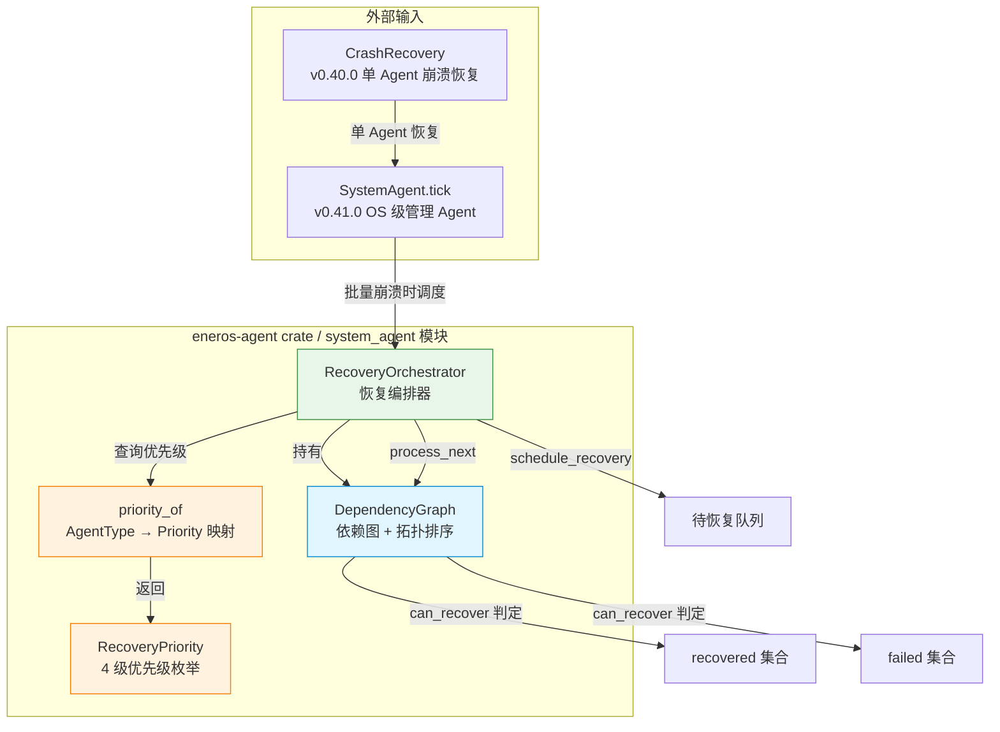
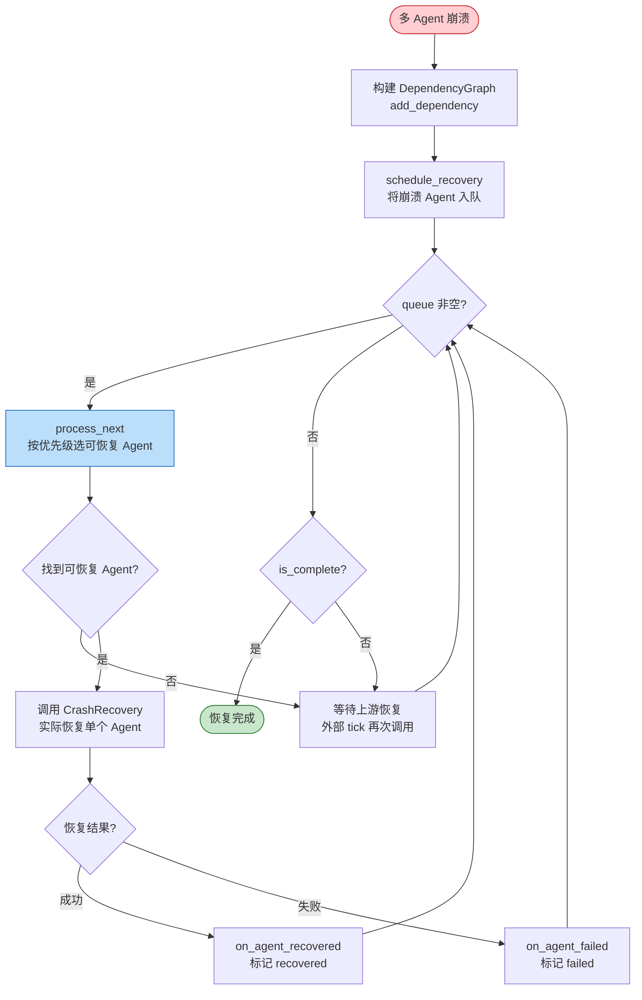

# Recovery Orchestrator 设计文档（v0.42.0 故障恢复编排）

> **覆盖版本**：v0.42.0
> **所属子系统**：`crates/agents/agent/`（eneros-agent crate）
> **源码位置**：`crates/agents/agent/src/system_agent/dependency.rs`、`crates/agents/agent/src/system_agent/recovery_orchestrator.rs`
> **最后更新**：2026-07-15
> **蓝图参考**：`蓝图/phase1.md` §v0.42.0

---

## 1. 概述

v0.42.0 为 EnerOS Agent Runtime 引入**故障恢复编排**能力。当多个 Agent 同时崩溃（如级联故障、整机重启）时，简单的"逐一重启"会导致依赖倒置：下游 Agent 在其上游尚未恢复时启动，引发初始化失败或运行时 panic。

本版本提供两个核心组件：

- **`DependencyGraph`** — Agent 间恢复依赖关系的有向无环图（DAG）建模，支持 Kahn 拓扑排序与环检测。
- **`RecoveryOrchestrator`** — 基于 `DependencyGraph` 的有序恢复调度器，结合 `RecoveryPriority` 优先级，保证"上游先恢复、关键 Agent 优先恢复"。

两个组件均位于 `eneros-agent` crate 的 `system_agent` 子模块下，并通过 `eneros_agent::{DependencyGraph, RecoveryOrchestrator, RecoveryPriority, priority_of}` 在 crate 根重导出。

### 设计目标

| 目标 | 说明 |
|------|------|
| 依赖正确性 | 下游 Agent 的恢复必须等待其所有上游 Agent 恢复完成（或恢复失败） |
| 优先级调度 | 同层可恢复 Agent 中，`System` 类型优先于 `Device`/`Grid`/`Energy`，再优先于业务/协调类 |
| 降级容错 | 上游恢复失败不阻塞下游（D7），下游可降级运行 |
| 环检测 | 依赖图存在环时返回 `AgentError::CircularDependency`，而非死锁 |
| no_std 合规 | 零外部依赖，仅 `alloc::*` / `core::*` |

---

## 2. 架构设计

### 2.1 组件关系



### 2.2 与既有恢复机制的关系

| 组件 | 版本 | 职责 | 与 v0.42.0 的关系 |
|------|------|------|-------------------|
| `CrashRecovery` | v0.40.0 | 单 Agent 崩溃恢复（检查点 + 重启次数限制） | 被 `SystemAgent.tick` 调用，处理单个不健康 Agent |
| `SystemAgent.tick` | v0.41.0 | OS 级管理 Agent 单步执行（心跳检查 + 故障恢复 + OOM/过热保护） | v0.42.0 增强其在级联故障场景下的调度能力 |
| `DependencyGraph` | v0.42.0 | 依赖关系建模 + 拓扑排序 | 本版本新增 |
| `RecoveryOrchestrator` | v0.42.0 | 多 Agent 有序恢复调度 | 本版本新增 |

`RecoveryOrchestrator` 不替代 `CrashRecovery`，而是其上层的**调度层**：编排器决定"先恢复谁"，`CrashRecovery` 负责"如何恢复单个 Agent"。

---

## 3. DependencyGraph 依赖图

### 3.1 数据结构

```rust
pub struct DependencyGraph {
    dependencies: BTreeMap<AgentId, Vec<AgentId>>,
    recovered: BTreeSet<AgentId>,
    failed: BTreeSet<AgentId>,
}
```

| 字段 | 类型 | 语义 |
|------|------|------|
| `dependencies` | `BTreeMap<AgentId, Vec<AgentId>>` | key=agent，value=该 agent 直接依赖的上游 agent 列表 |
| `recovered` | `BTreeSet<AgentId>` | 已恢复的 agent 集合 |
| `failed` | `BTreeSet<AgentId>` | 恢复失败的 agent 集合 |

**边语义**：`add_dependency(agent, depends_on)` 表示 `agent` 依赖 `depends_on`，即 `depends_on` 必须先恢复，`agent` 才能开始恢复。

### 3.2 核心 API

| 方法 | 签名 | 说明 |
|------|------|------|
| `new` | `() -> Self` | 创建空依赖图 |
| `add_dependency` | `(&mut self, agent, depends_on)` | 添加依赖边（自动去重） |
| `topological_sort` | `(&self) -> Result<Vec<AgentId>, AgentError>` | Kahn 拓扑排序，环检测返回 `CircularDependency` |
| `has_cycle` | `(&self) -> bool` | 是否存在环 |
| `can_recover` | `(&self, agent) -> bool` | 是否可恢复（依赖已 recovered 或 failed） |
| `mark_recovered` | `(&mut self, agent)` | 标记已恢复 |
| `mark_failed` | `(&mut self, agent)` | 标记恢复失败 |
| `dependencies_of` | `(&self, agent) -> Vec<AgentId>` | 直接依赖列表（克隆） |
| `all_nodes` | `(&self) -> Vec<AgentId>` | 图中所有节点 |
| `recovered` / `failed` | `(&self) -> &BTreeSet<AgentId>` | 集合只读引用 |

### 3.3 去重策略

`add_dependency` 内部通过线性扫描 `deps.contains(&depends_on)` 去重（D1：no_std 无 `HashSet`）。由于单 Agent 的直接依赖数通常 < 10，线性扫描性能可接受。

---

## 4. Kahn 拓扑排序算法

`topological_sort` 采用经典 Kahn 算法（入度统计 + 队列）：

### 4.1 算法步骤

1. **收集所有节点**：遍历 `dependencies` 的 key 与 value，去重后得到 `all_nodes`。
2. **计算入度**：每个节点的入度 = 它的依赖数（即 `dependencies[node].len()`）。
3. **入度为 0 的节点入队**：无依赖的节点可直接恢复。
4. **Kahn 主循环**：
   - 从队列头取出节点 `node`，加入 `result`。
   - 遍历所有 agent，若其依赖列表包含 `node`，则其入度减 1；入度归零则入队。
5. **环检测**：若 `result.len() != all_nodes.len()`，说明存在环，返回 `Err(AgentError::CircularDependency)`。

### 4.2 复杂度

| 维度 | 复杂度 | 说明 |
|------|--------|------|
| 时间 | O(V × E) | 主循环对每个出队节点遍历所有边（BTreeMap 无邻接表反向索引） |
| 空间 | O(V) | `in_degree` + `queue` + `result` |

> 性能说明：能源场景下 Agent 数量典型 < 100，V×E 在 10⁴ 量级，微秒级完成，满足实时性要求。若未来 Agent 规模增长，可引入反向邻接表优化至 O(V+E)。

### 4.3 环检测示例

```rust
let mut g = DependencyGraph::new();
g.add_dependency(AgentId(1), AgentId(2)); // 1 依赖 2
g.add_dependency(AgentId(2), AgentId(1)); // 2 依赖 1 → 环
assert!(g.has_cycle());
assert!(matches!(g.topological_sort(), Err(AgentError::CircularDependency)));
```

自环（`add_dependency(a, a)`）同样会被检测为环。

---

## 5. RecoveryOrchestrator 恢复编排器

### 5.1 数据结构

```rust
pub struct RecoveryOrchestrator {
    dependency_graph: DependencyGraph,
    queue: VecDeque<AgentId>,
    in_progress: BTreeSet<AgentId>,
    recovered: BTreeSet<AgentId>,
    failed: BTreeSet<AgentId>,
    agent_types: BTreeMap<AgentId, AgentType>,
}
```

| 字段 | 类型 | 语义 |
|------|------|------|
| `dependency_graph` | `DependencyGraph` | 依赖关系图 |
| `queue` | `VecDeque<AgentId>` | 待恢复队列（FIFO，取出时按优先级重排） |
| `in_progress` | `BTreeSet<AgentId>` | 正在恢复中的 Agent |
| `recovered` | `BTreeSet<AgentId>` | 已恢复 Agent |
| `failed` | `BTreeSet<AgentId>` | 恢复失败 Agent |
| `agent_types` | `BTreeMap<AgentId, AgentType>` | Agent ID → 类型映射（用于优先级查询） |

### 5.2 核心 API

| 方法 | 签名 | 说明 |
|------|------|------|
| `new` | `() -> Self` | 创建空编排器 |
| `add_dependency` | `(&mut self, agent, depends_on, agent_type)` | 添加依赖并记录类型 |
| `register_agent` | `(&mut self, agent, agent_type)` | 仅注册类型（无依赖） |
| `schedule_recovery` | `(&mut self, agent, agent_type)` | 调度单 Agent 恢复（幂等） |
| `schedule_batch` | `(&mut self, &[(AgentId, AgentType)])` | 批量调度 |
| `process_next` | `(&mut self) -> Option<AgentId>` | 取出下一个可恢复 Agent（按优先级） |
| `on_agent_recovered` | `(&mut self, agent)` | 通知恢复成功 |
| `on_agent_failed` | `(&mut self, agent)` | 通知恢复失败 |
| `pending_count` | `(&self) -> usize` | 待恢复数（queue + in_progress） |
| `is_complete` | `(&self) -> bool` | 是否全部处理完成 |

### 5.3 schedule_recovery 幂等性

`schedule_recovery` 在入队前检查 agent 是否已存在于 `queue` / `in_progress` / `recovered` / `failed`，避免重复调度。重复调用同一 Agent 不会增加 `pending_count`。

---

## 6. RecoveryPriority 优先级映射

### 6.1 优先级枚举

```rust
pub enum RecoveryPriority {
    Low,      // CloudCoord / Custom
    Normal,   // Market / Twin / EdgeCoord
    High,     // Device / Grid / Energy
    Critical, // System
}
```

`RecoveryPriority` 派生 `Ord`，全序关系：`Low < Normal < High < Critical`。

### 6.2 AgentType → Priority 映射

`priority_of(agent_type)` 函数定义如下映射：

| AgentType | RecoveryPriority | 理由 |
|-----------|------------------|------|
| `System` | `Critical` | 系统 Agent 必须最先恢复，否则无法调度其他 Agent |
| `Device` | `High` | 设备驱动是基础设施，业务 Agent 依赖其数据 |
| `Grid` | `High` | 电网 Agent 属基础设施 |
| `Energy` | `High` | 能源调度核心，控制路径依赖 |
| `Market` | `Normal` | 电力市场为业务层，可短暂离线 |
| `Twin` | `Normal` | 数字孪生为辅助分析，非控制路径 |
| `EdgeCoord` | `Normal` | 边缘协调 Agent |
| `CloudCoord` | `Low` | 云端协调可延迟恢复 |
| `Custom(_)` | `Low` | 自定义扩展默认最低优先级 |

### 6.3 process_next 排序逻辑

`process_next` 在取出下一个可恢复 Agent 时：

1. 遍历 `queue`，将 `can_recover` 为 true 的 Agent 收集为 `candidates`，并查询其 `RecoveryPriority`。
2. 不可恢复的 Agent 放回 `queue`。
3. 对 `candidates` 按 `RecoveryPriority` **降序**排序（`core::cmp::Reverse`）。
4. 取出最高优先级 Agent，标记为 `in_progress` 并返回。
5. 剩余可恢复 Agent 放回 `queue`，下次 `process_next` 再排序。

---

## 7. 故障恢复流程

### 7.1 整体流程



### 7.2 降级恢复策略（D7）

当上游 Agent 恢复失败（`on_agent_failed`）时，下游 Agent **不被永久阻塞**。`can_recover` 判定中，依赖已 `recovered` **或** `failed` 均视为满足。这实现了蓝图 §故障恢复的降级策略：

- 上游恢复成功 → 下游正常恢复。
- 上游恢复失败 → 下游仍可恢复，但应在自身初始化中处理上游缺失（降级运行）。

### 7.3 典型时序示例

假设依赖关系：`agent3 → agent2 → agent1`（3 依赖 2，2 依赖 1），三者同时崩溃：

| 步骤 | 操作 | queue | in_progress | recovered | 说明 |
|------|------|-------|-------------|-----------|------|
| 0 | schedule(1), schedule(2), schedule(3) | [1,2,3] | {} | {} | 初始调度 |
| 1 | process_next | [2,3] | {1} | {} | 仅 1 无依赖，可恢复 |
| 2 | on_recovered(1) | [2,3] | {} | {1} | 1 恢复成功 |
| 3 | process_next | [3] | {2} | {1} | 2 的依赖(1)已 recovered，可恢复 |
| 4 | on_recovered(2) | [3] | {} | {1,2} | 2 恢复成功 |
| 5 | process_next | [] | {3} | {1,2} | 3 的依赖(2)已 recovered |
| 6 | on_recovered(3) | [] | {} | {1,2,3} | 全部恢复，is_complete=true |

---

## 8. API 参考

### 8.1 DependencyGraph

```rust
// 构建依赖图
let mut graph = DependencyGraph::new();
graph.add_dependency(AgentId(2), AgentId(1)); // 2 依赖 1

// 拓扑排序
let order: Vec<AgentId> = graph.topological_sort()?; // [1, 2]

// 环检测
if graph.has_cycle() { /* 处理环 */ }

// 恢复判定
graph.mark_recovered(AgentId(1));
assert!(graph.can_recover(AgentId(2))); // 依赖已恢复，可恢复
```

### 8.2 RecoveryOrchestrator

```rust
use eneros_agent::{RecoveryOrchestrator, AgentId, AgentType};

let mut orch = RecoveryOrchestrator::new();

// 声明依赖（同时记录类型用于优先级）
orch.add_dependency(AgentId(2), AgentId(1), AgentType::Device);
orch.schedule_recovery(AgentId(1), AgentType::System);
orch.schedule_recovery(AgentId(2), AgentType::Device);

// 按序恢复
while let Some(agent) = orch.process_next() {
    // 实际恢复逻辑（委托 CrashRecovery）
    match recover_agent(agent) {
        Ok(()) => orch.on_agent_recovered(agent),
        Err(_)  => orch.on_agent_failed(agent),
    }
}

assert!(orch.is_complete());
```

### 8.3 优先级查询

```rust
use eneros_agent::{priority_of, AgentType, RecoveryPriority};

assert_eq!(priority_of(AgentType::System), RecoveryPriority::Critical);
assert_eq!(priority_of(AgentType::Device), RecoveryPriority::High);
assert_eq!(priority_of(AgentType::CloudCoord), RecoveryPriority::Low);
```

---

## 9. no_std 合规性

本模块严格遵守 EnerOS no_std 规范（蓝图 §43.1）：

| 检查项 | 状态 | 说明 |
|--------|------|------|
| `#![cfg_attr(not(test), no_std)]` | ✅ | 继承自 `eneros-agent` crate 根 |
| `extern crate alloc` | ✅ | 使用 `alloc::collections::{BTreeMap, BTreeSet, VecDeque}` |
| 无 `std::*` | ✅ | 仅 `alloc::*` + `core::*` |
| 无 `panic!`/`todo!`/`unimplemented!` | ✅ | 全部返回 `Result` 或 `Option` |
| 零外部依赖 | ✅ | 不引入 hashbrown，使用 `BTreeMap` 替代 `HashMap` |
| 时间戳来源 | 外部提供 | `now: u64` 由调用方传入（no_std 无系统时钟） |

### 内存占用

| 数据结构 | 单实例大小（估算） | 说明 |
|----------|-------------------|------|
| `DependencyGraph` | ~96 B | 3 个空容器（BTreeMap + 2×BTreeSet） |
| `RecoveryOrchestrator` | ~256 B | 6 个空容器 |
| 每个 Agent 节点 | ~40 B | AgentId(16B) + Vec/BTreeSet 节点开销 |

> 100 个 Agent 场景下，编排器总内存 < 8 KB，远低于 Agent Runtime 64 MB 预算（蓝图 §43.6）。

---

## 10. 偏差声明表

以下偏差记录 v0.42.0 故障恢复编排实现与蓝图声明的差异：

| 偏差ID | 描述 | 原因 |
|--------|------|------|
| **D1** | 使用 `BTreeMap<AgentId, Vec<AgentId>>` + `BTreeSet<AgentId>` + `VecDeque<AgentId>` 替代蓝图中的 `HashMap`/`HashSet` | no_std 约束，避免引入 hashbrown 外部依赖；`BTreeMap` 提供确定遍历序，利于可重复测试 |
| **D2** | `ResourceSource` trait 抽象资源数据源（来自 v0.41.0 `monitor.rs`，v0.42.0 复用其优先级语义） | agent crate 不依赖 HAL crate，通过 trait 注入 CPU/内存/温度数据源，保持解耦 |
| **D3** | 实现蓝图中声明但未实现的 `schedule_recovery(agent)` + `pending_count()` 接口 | 蓝图 §v0.42.0 接口声明存在但 key code 未实现，本版本补齐；同时 `ResourceMonitor` 不维护 agent_stats（由 registry 提供，避免冗余） |
| **D4** | `process_next()` 按优先级排序后选可恢复的 Agent；`SystemAgent` 显式持有 `lifecycle: Rc<RefCell<LifecycleManager>>` 字段 | 蓝图未明确排序逻辑，本实现按 `RecoveryPriority` 排序（Critical > High > Normal > Low）；SystemAgent 持有 lifecycle 字段以直接调用 `force_state`/`transition` |
| **D5** | `start_agent` 接受 `now` 参数（来自 v0.41.0 `manager.rs`，v0.42.0 恢复调度同样依赖外部时间戳） | no_std 无系统时钟，所有时间戳由外部调度器提供 |
| **D6** | `topological_sort` 采用 Kahn 算法（入度统计 + 队列）；`SystemAgent.tick` 返回 `Vec<SystemEvent>` 替代 log | Kahn 算法天然支持环检测；agent crate 零依赖无 logging 框架，返回事件列表由调用方消费 |
| **D7** | `can_recover` 判定逻辑 — 依赖已 `recovered` **或** `failed` 均视为可恢复；`SystemConfig` 配置 OOM/过热阈值 | 蓝图 §故障恢复降级策略：上游 Agent 恢复失败时，下游 Agent 仍可降级运行，避免单点失败阻塞整条恢复链 |

---

## 11. 测试覆盖

### 11.1 单元测试

源码内嵌单元测试覆盖核心路径（`#[cfg(test)] mod tests`）：

| 测试文件 | 测试数 | 覆盖点 |
|----------|--------|--------|
| `dependency.rs` | 14 | 空图、添加依赖、去重、拓扑排序（线性/菱形）、环检测（双向/自环）、`can_recover`（无依赖/已恢复/已失败/阻塞）、`mark_recovered`/`mark_failed`、`all_nodes` |
| `recovery_orchestrator.rs` | 13 | 空编排器、`priority_of` 映射、优先级排序、单 Agent 恢复、依赖有序恢复、依赖阻塞、失败依赖不阻塞（D7）、批量调度、`is_complete`、`pending_count`、`on_agent_failed`、幂等调度 |

### 11.2 关键测试用例

```rust
// 依赖有序恢复：agent2 依赖 agent1，必须先恢复 agent1
#[test]
fn test_ordered_recovery_with_dependency() {
    let mut orch = RecoveryOrchestrator::new();
    orch.add_dependency(AgentId(2), AgentId(1), AgentType::Device);
    orch.schedule_recovery(AgentId(1), AgentType::System);
    orch.schedule_recovery(AgentId(2), AgentType::Device);

    assert_eq!(orch.process_next(), Some(AgentId(1)));   // 仅 agent1 可恢复
    assert_eq!(orch.process_next(), None);                // agent2 被阻塞

    orch.on_agent_recovered(AgentId(1));                  // agent1 恢复
    assert_eq!(orch.process_next(), Some(AgentId(2)));    // agent2 解除阻塞
}

// 优先级排序：Critical 先于 Low
#[test]
fn test_priority_ordering_in_process_next() {
    let mut orch = RecoveryOrchestrator::new();
    orch.schedule_recovery(AgentId(1), AgentType::Custom(0));  // Low
    orch.schedule_recovery(AgentId(2), AgentType::System);     // Critical
    orch.schedule_recovery(AgentId(3), AgentType::Device);     // High
    orch.schedule_recovery(AgentId(4), AgentType::Market);     // Normal

    let order: Vec<_> = (0..4).filter_map(|_| orch.process_next()).collect();
    assert_eq!(order, vec![AgentId(2), AgentId(3), AgentId(4), AgentId(1)]);
}
```

### 11.3 验收标准

| 验收项 | 状态 |
|--------|------|
| `cargo test -p eneros-agent` 全部通过 | ✅ |
| `cargo build -p eneros-agent --target aarch64-unknown-none` 交叉编译通过 | ✅ |
| `cargo clippy -p eneros-agent -- -D warnings` 无 warning | ✅ |
| no_std 合规（无 `std::*`） | ✅ |
| 环检测正确（含自环） | ✅ |
| D7 降级恢复策略验证 | ✅ |
