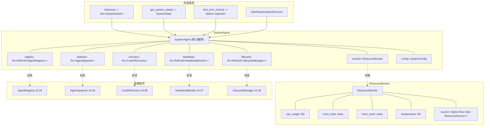
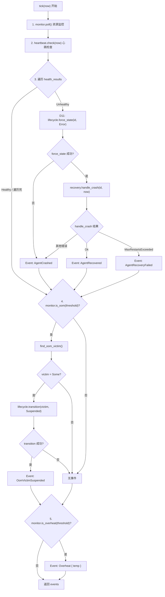

# EnerOS v0.41.0 — System Agent 核心设计

> **版本**：v0.41.0
> **蓝图依据**：`蓝图/phase1.md` §6874-7270（v0.41.0 System Agent 核心）
> **前置版本**：v0.33.0（AgentDescriptor）/ v0.34.0（AgentRegistry）/ v0.35.0（LifecycleManager）/ v0.36.0（AgentSpawner）/ v0.37.0（HeartbeatMonitor）/ v0.38.0（CrashRecovery）/ v0.40.0（CapabilityManager）
> **后续解锁**：v0.42.0（故障恢复编排）
> **crate**：`eneros-agent`（`crates/agents/agent/`）
> **依赖**：零外部依赖（仅 `alloc` / `core`），no_std
> **最后更新**：2026-07-14

本文档描述 `SystemAgent` — EnerOS 的 OS 级管理 Agent，统一管理 Agent 生命周期编排与系统资源监控。核心交付"资源监控 → 心跳检查 → 故障恢复 → OOM 保护 → 过热告警"单步闭环：调用方按周期调用 `tick(now)`，`SystemAgent` 依次执行监控轮询、心跳检查、崩溃恢复触发、OOM victim 选择与挂起、过热事件产生，返回本周期产生的 `Vec<SystemEvent>` 供上层消费。`SystemAgent` 集成 registry / spawner / recovery / heartbeat / lifecycle / monitor 六大组件，是 Agent Runtime 最高权限管理实体，解锁 v0.42.0 故障恢复编排。

---

## 目录

1. [概述](#1-概述)
2. [背景与动机](#2-背景与动机)
3. [架构设计](#3-架构设计)
4. [SystemAgent 数据结构](#4-systemagent-数据结构)
5. [ResourceMonitor 资源监控](#5-resourcemonitor-资源监控)
6. [SystemConfig 配置](#6-systemconfig-配置)
7. [tick 主循环算法](#7-tick-主循环算法)
8. [Agent 管理方法](#8-agent-管理方法)
9. [OOM 检测与 victim 选择](#9-oom-检测与-victim-选择)
10. [过热检测](#10-过热检测)
11. [故障恢复集成](#11-故障恢复集成)
12. [错误处理](#12-错误处理)
13. [no_std 合规性与偏差声明](#13-no_std-合规性与偏差声明)
14. [测试覆盖](#14-测试覆盖)

---

## 1. 概述

v0.41.0 实现 System Agent 核心，作为 OS 级管理 Agent，负责资源监控（CPU/内存/温度）、Agent 启停管理与故障检测触发。核心交付：

- `SystemAgent` 结构体，集成 `AgentRegistry` / `AgentSpawner` / `CrashRecovery` / `HeartbeatMonitor` / `LifecycleManager` / `ResourceMonitor` / `SystemConfig` 七大组件
- `tick(now: u64) -> Vec<SystemEvent>` 单步主循环（D1 偏差：替代蓝图的 `run()` 无限循环），由外部调度器按周期调用
- `ResourceMonitor` 资源监控器 + `ResourceSource` trait 抽象（D2 偏差：依赖注入，agent crate 不依赖 HAL crate）
- `SystemConfig` 配置结构体（D7 偏差：蓝图引用但未定义），含 OOM/过热阈值与监控周期
- `SystemEvent` 事件枚举（D6 偏差：替代 `crate::log::warn!`），含 5 个变体供上层消费
- Agent 管理四方法：`start_agent` / `stop_agent` / `suspend_agent` / `resume_agent`
- OOM victim 选择：`find_oom_victim()` 遍历 registry 选最低优先级存活 Agent
- `get_system_stats()` 系统级统计，聚合 CPU/内存/温度/Agent 计数
- `AgentError` 扩展 `SystemOverload` / `OomRisk` / `Overheat { temp: f32 }` 三个变体

**业务价值**：System Agent 是最高权限 Agent，负责全局资源管理和 Agent 生命周期编排，是 Agent Runtime 从"单 Agent 自愈"迈向"系统级编排"的关键一步。

**Phase 定位**：Phase 1 Layer 7，集成 v0.34~v0.40 七大组件形成"监控 → 编排"闭环，解锁 v0.42.0 故障恢复编排。

---

## 2. 背景与动机

### 2.1 已有基础

Agent Runtime 在 v0.33.0~v0.40.0 已逐层构建以下能力：

| 版本 | 组件 | 能力 |
|------|------|------|
| v0.33.0 | `AgentDescriptor` | Agent 描述符（ID/状态/优先级/重启计数/心跳时间戳） |
| v0.34.0 | `AgentRegistry` | Agent 注册表（register/unregister/get/list_all/list_alive） |
| v0.35.0 | `LifecycleManager` | 生命周期管理（transition 经转换表 + force_state 绕过转换表） |
| v0.36.0 | `AgentSpawner` | Agent 启动器（spawn 委托 factory + lifecycle + registry） |
| v0.37.0 | `HeartbeatMonitor` | 心跳监控（register/check 返回 HealthStatus） |
| v0.38.0 | `CrashRecovery` | 崩溃恢复（handle_crash + restart + CheckpointStore） |
| v0.40.0 | `CapabilityManager` | 能力管理（freeze/unfreeze Agent 能力） |

### 2.2 缺失环节

上述组件各自独立，缺少一个**统一管理层**来编排：

- **资源监控无归属**：CPU/内存/温度采集无统一入口，HAL 调用散落各处
- **故障检测与恢复脱节**：`HeartbeatMonitor.check()` 返回 `Unhealthy` 后，需调用方手动触发 `CrashRecovery.handle_crash`，无自动闭环
- **OOM 无保护**：内存超限无自动挂起低优先级 Agent 的机制
- **过热无告警**：温度超阈值无统一事件上报
- **Agent 启停无编排**：start/stop/suspend/resume 分散在 spawner/lifecycle/heartbeat/registry，无统一接口

### 2.3 System Agent 定位

System Agent 是**最高权限 Agent**，作为单步驱动的编排器，将上述散落能力收拢为统一接口：

- 蓝图 §9.3 明确：System Agent **不可挂起**（最高权限）
- 蓝图 §8.5 坑点：System Agent 自身崩溃需特殊处理（v0.42.0 编排层关注）
- 是 v0.42.0（故障恢复编排）的**前置依赖**：v0.42.0 在 System Agent 基础上增加 `RecoveryOrchestrator`（依赖图 + 拓扑排序），实现多 Agent 按依赖顺序恢复

---

## 3. 架构设计

`SystemAgent` 采用三层架构：`SystemAgent`（核心编排）+ `ResourceMonitor`（资源监控）+ Manager 方法（Agent 管理）。`SystemAgent` 持有 7 个字段，其中 5 个为 `Rc<RefCell<...>>` / `Rc<...>` 共享引用（与 v0.38.0 `CrashRecovery` 同一模式），1 个为内联 `ResourceMonitor`，1 个为内联 `SystemConfig`。



`SystemAgent` 向下共享 v0.34~v0.38 五大组件（与 `CrashRecovery` 共享同一组 `Rc` 引用，确保状态一致）；`ResourceMonitor` 通过 `ResourceSource` trait 抽象数据源（D2），agent crate 不直接依赖 HAL crate，测试提供 mock source。向上提供 `tick` / `get_system_stats` / `find_oom_victim` / 管理四方法，供外部调度器（v0.42.0 编排层或上层 RTOS 任务）调用。

模块文件组织（D10 偏差：`mod.rs` + 子模块，与 `capability/mod.rs` 模式一致）：

| 文件 | 职责 |
|------|------|
| `system_agent/mod.rs` | `SystemAgent` 结构体 + 构造 + `tick` 主循环 + `get_system_stats` + `find_oom_victim` + 单元测试 |
| `system_agent/monitor.rs` | `ResourceSource` trait + `ResourceMonitor` + `SystemConfig` + `SystemStats` + `SystemEvent` + `AgentResourceUsage` + 单元测试 |
| `system_agent/manager.rs` | `impl SystemAgent` 的 `start_agent` / `stop_agent` / `suspend_agent` / `resume_agent` + 单元测试 |

---

## 4. SystemAgent 数据结构

### 4.1 字段定义

```rust
pub struct SystemAgent {
    registry: Rc<RefCell<AgentRegistry>>,
    spawner: Rc<AgentSpawner>,
    recovery: Rc<CrashRecovery>,
    heartbeat: Rc<RefCell<HeartbeatMonitor>>,
    lifecycle: Rc<RefCell<LifecycleManager>>,
    monitor: ResourceMonitor,
    config: SystemConfig,
}
```

| 字段 | 类型 | 来源 | 用途 |
|------|------|------|------|
| `registry` | `Rc<RefCell<AgentRegistry>>` | v0.34.0 | `get_system_stats` 读 Agent 计数；`find_oom_victim` 遍历存活 Agent；`stop_agent` 注销注册 |
| `spawner` | `Rc<AgentSpawner>` | v0.36.0 | `start_agent` 委托 `spawn(config, now)` |
| `recovery` | `Rc<CrashRecovery>` | v0.38.0 | `tick` 中对 Unhealthy Agent 调用 `handle_crash(id, now)` |
| `heartbeat` | `Rc<RefCell<HeartbeatMonitor>>` | v0.37.0 | `tick` 中 `check(now)` 检测故障；`start_agent` 注册心跳；`stop_agent` 注销心跳 |
| `lifecycle` | `Rc<RefCell<LifecycleManager>>` | v0.35.0 | D4 偏差：`tick` 中 `force_state(Error)`；`suspend`/`resume` 用 `transition`；`stop` 用 `force_state(Dead)` |
| `monitor` | `ResourceMonitor` | v0.41.0（本版本） | 内联资源监控器，`tick` 中 `poll` + `is_oom` + `is_overheat` |
| `config` | `SystemConfig` | v0.41.0（本版本，D7） | OOM 阈值 / 过热阈值 / 监控周期 |

### 4.2 不 derive Debug 的原因

`SystemAgent` **不派生 `Debug`**，原因与 `AgentSpawner` / `CrashRecovery` 同一约定：

- `spawner: Rc<AgentSpawner>` 内部持 `Rc<dyn AgentFactory>`（trait object，未要求 `Debug` bound）
- `recovery: Rc<CrashRecovery>` 内部持 `Rc<dyn CheckpointStore>`（trait object）
- `Rc<RefCell<...>>` 字段的 `Debug` 实现需内部可变性检查，且 `RefCell` 借用失败会 panic

派生 `Debug` 会强制所有内部 trait object 增加 `Debug` bound，破坏既有 trait 定义。调用方需调试时通过 `get_system_stats()` 获取可观测快照。

### 4.3 D4 偏差：lifecycle 字段

蓝图 `SystemAgent` 结构体（§6903-6910）列出 5 个字段（registry/spawner/recovery/heartbeat/monitor/config），但 §4.5 关键代码中 `suspend_agent` 调用 `self.lifecycle.transition()` —— 蓝图引用了未声明的 `lifecycle` 字段。本版本显式新增 `lifecycle: Rc<RefCell<LifecycleManager>>` 字段（D4 偏差），因 `suspend` / `resume` / `stop` / `tick` 故障恢复均需直接调用 `lifecycle.transition` 或 `lifecycle.force_state`。

---

## 5. ResourceMonitor 资源监控

### 5.1 ResourceSource trait（D2 偏差）

蓝图 §4.5 关键代码中 `ResourceMonitor::poll` 直接调用 `crate::hal::get_cpu_usage()` 等 HAL 函数。但 agent crate **不依赖 HAL crate**（维持零外部依赖），故定义 `ResourceSource` trait 抽象数据源，由调用方注入实现：

```rust
pub trait ResourceSource {
    /// CPU 使用率（0.0~1.0）
    fn cpu_usage(&self) -> f32;
    /// 已用内存（字节）
    fn mem_used(&self) -> usize;
    /// 总内存（字节）
    fn mem_total(&self) -> usize;
    /// 温度（摄氏度）
    fn temperature(&self) -> f32;
}
```

生产环境注入基于 HAL 的实现，测试提供 mock source。此设计与 v0.36.0 `AgentFactory` / v0.38.0 `CheckpointStore` 同一依赖注入模式。

### 5.2 ResourceMonitor 字段

```rust
pub struct ResourceMonitor {
    pub cpu_usage: f32,
    pub mem_total: usize,
    pub mem_used: usize,
    pub temperature: f32,
    source: Option<Box<dyn ResourceSource>>,
}
```

| 字段 | 类型 | 说明 |
|------|------|------|
| `cpu_usage` | `f32` | CPU 使用率（0.0~1.0），pub 便于 `get_system_stats` 读取 |
| `mem_total` | `usize` | 总内存（字节） |
| `mem_used` | `usize` | 已用内存（字节） |
| `temperature` | `f32` | 温度（摄氏度） |
| `source` | `Option<Box<dyn ResourceSource>>` | 可选数据源，私有；None 时 `poll` 为 no-op |

### 5.3 D3 偏差：不维护 agent_stats

蓝图 `ResourceMonitor` 含 `agent_stats: HashMap<AgentId, AgentResourceUsage>` 字段。本版本**移除此字段**（D3 偏差），理由：

1. no_std 无 `HashMap`（需 `alloc::collections::BTreeMap` 替代）
2. `agent_stats` 与 `AgentRegistry` 中的 `AgentDescriptor` 信息重叠（状态、优先级等），冗余存储
3. per-agent 资源使用（CPU/内存）需 HAL 提供 per-agent 统计接口，当前 HAL 不支持
4. `AgentResourceUsage` 结构体仍定义（蓝图 §4.1 保留），供未来扩展

### 5.4 核心方法

```rust
impl ResourceMonitor {
    pub fn new() -> Self;                                    // 空 monitor，source=None
    pub fn with_source(source: Box<dyn ResourceSource>) -> Self; // 带 source
    pub fn poll(&mut self);                                  // 从 source 读取，无 source 则 no-op
    pub fn set_values(&mut self, cpu, mem_used, mem_total, temp: f32); // 手动设置（测试用）
    pub fn is_oom(&self, threshold: f32) -> bool;            // mem_used/mem_total > threshold
    pub fn is_overheat(&self, threshold: f32) -> bool;       // temperature > threshold
    pub fn mem_usage_percent(&self) -> f32;                  // mem_used/mem_total，mem_total=0 返回 0.0
}
```

`is_oom` 的 `mem_total == 0` 时返回 `false`（避免除零）；`is_oom` 使用严格 `>`（非 `>=`），即 `mem_used/mem_total == threshold` 时不触发 OOM（边界测试 `test_is_oom_boundary_at_threshold` 验证）。

---

## 6. SystemConfig 配置

### 6.1 结构体定义（D7 偏差）

蓝图 §4.5 关键代码引用 `self.config` 与常量 `MONITOR_INTERVAL_MS` / `OOM_THRESHOLD_PERCENT` / `OVERHEAT_THRESHOLD`，但 `SystemAgent` 结构体字段中未声明 `config`，也未定义 `SystemConfig` 类型。本版本定义 `SystemConfig` 结构体（D7 偏差）：

```rust
pub struct SystemConfig {
    /// OOM 阈值（内存使用率，默认 0.9）
    pub oom_threshold_percent: f32,
    /// 过热阈值（摄氏度，默认 80.0）
    pub overheat_threshold: f32,
    /// 监控周期（毫秒，默认 1000）
    pub monitor_interval_ms: u64,
}

impl Default for SystemConfig {
    fn default() -> Self {
        SystemConfig {
            oom_threshold_percent: 0.9,
            overheat_threshold: 80.0,
            monitor_interval_ms: 1000,
        }
    }
}
```

### 6.2 阈值说明

| 字段 | 默认值 | 来源 | 用途 |
|------|--------|------|------|
| `oom_threshold_percent` | `0.9` | 蓝图常量 `OOM_THRESHOLD_PERCENT` | `tick` 中 `monitor.is_oom(config.oom_threshold_percent)` 判定 OOM |
| `overheat_threshold` | `80.0` | 蓝图常量 `OVERHEAT_THRESHOLD` | `tick` 中 `monitor.is_overheat(config.overheat_threshold)` 判定过热 |
| `monitor_interval_ms` | `1000` | 蓝图常量 `MONITOR_INTERVAL_MS` | 提示调用方 tick 周期（本版本不强制，由调用方控制） |

`monitor_interval_ms` 是**提示性字段**：因 `tick` 为单步执行（D1），实际周期由调用方控制，此字段仅供调用方参考（如 RTOS 任务休眠时长）。蓝图 §9.2 要求监控周期 1s，`default()` 与之一致。

---

## 7. tick 主循环算法

### 7.1 算法流程

`tick(now: u64) -> Vec<SystemEvent>` 是 System Agent 的核心入口（D1 偏差：单步执行替代蓝图 `run()` 无限循环）。每次调用依次执行 5 步，返回本周期产生的 `Vec<SystemEvent>`（D6 偏差：替代 `crate::log::warn!`）。



### 7.2 关键代码

```rust
pub fn tick(&mut self, now: u64) -> Vec<SystemEvent> {
    let mut events: Vec<SystemEvent> = Vec::new();

    // 1. 资源监控
    self.monitor.poll();

    // 2. 心跳检查
    let health_results = self.heartbeat.borrow_mut().check(now);

    // 3. 故障恢复（D11：force_state Error 后 handle_crash）
    for (id, status) in health_results {
        if matches!(status, HealthStatus::Unhealthy) {
            let force_ok = self
                .lifecycle
                .borrow_mut()
                .force_state(id, AgentState::Error)
                .is_ok();
            if !force_ok {
                events.push(SystemEvent::AgentCrashed { agent: id });
                continue;
            }
            match self.recovery.handle_crash(id, now) {
                Ok(()) => events.push(SystemEvent::AgentRecovered { agent: id }),
                Err(AgentError::MaxRestartsExceeded { .. }) => {
                    events.push(SystemEvent::AgentRecoveryFailed { agent: id })
                }
                Err(_) => events.push(SystemEvent::AgentCrashed { agent: id }),
            }
        }
    }

    // 4. OOM 检查（D8：monitor 判阈值，SystemAgent 选 victim）
    if self.monitor.is_oom(self.config.oom_threshold_percent) {
        if let Some(victim) = self.find_oom_victim() {
            if self
                .lifecycle
                .borrow()
                .transition(victim, AgentState::Suspended)
                .is_ok()
            {
                events.push(SystemEvent::OomVictimSuspended { agent: victim });
            }
        }
    }

    // 5. 过热检查
    if self.monitor.is_overheat(self.config.overheat_threshold) {
        events.push(SystemEvent::Overheat {
            temp: self.monitor.temperature,
        });
    }

    events
}
```

### 7.3 偏差说明

| 偏差 | 在 tick 中的体现 |
|------|-----------------|
| **D1** | `tick(now) -> Vec<SystemEvent>` 单步执行，替代蓝图 `run()` 的 `while self.running` 无限循环 + `crate::time::sleep_ms()`。no_std 无 `sleep_ms`，且无限循环不可测试 |
| **D6** | 返回 `Vec<SystemEvent>`，替代蓝图 `crate::log::warn!("System overheating")`。agent crate 无 log 模块；事件列表便于测试断言与上层处理 |
| **D11** | 故障恢复时先 `lifecycle.force_state(id, Error)` 再 `recovery.handle_crash(id, now)`。v0.38.0 D9 要求 `handle_crash` 假定 Agent 处于 `Error` 态，但心跳检测到 `Unhealthy` 时 Agent 可能仍在 `Running` 态，故需先强制转 `Error` |

### 7.4 OOM 挂起的实现选择

`tick` 中 OOM victim 挂起**直接调用 `lifecycle.transition(victim, Suspended)`**，而非调用 `manager.rs` 的 `suspend_agent(victim)`。原因：`manager.rs` 尚未在 `tick` 调用时编译链接（模块加载顺序），且直接调用 `lifecycle.transition` 避免 `self` 借用冲突（`tick` 为 `&mut self`，`suspend_agent` 为 `&self`，但 `lifecycle.borrow()` 已提供内部可变性）。两者语义等价（均调用 `lifecycle.transition(id, Suspended)`）。

---

## 8. Agent 管理方法

`manager.rs` 实现 `SystemAgent` 的四个 Agent 管理方法，封装 spawner / lifecycle / heartbeat / registry 的协调调用。

### 8.1 start_agent（D5 偏差）

```rust
pub fn start_agent(&self, config: AgentConfig, now: u64) -> Result<AgentId, AgentError> {
    let id = self.spawner.spawn(config, now)?;
    self.heartbeat.borrow_mut().register(id, now);
    Ok(id)
}
```

**算法**：
1. `spawner.spawn(config, now)` — 委托 spawner 启动 Agent（v0.36.0），返回 `AgentId`
2. `heartbeat.register(id, now)` — 注册心跳（v0.37.0 D2：需 `now` 参数）
3. 返回 `Ok(id)`

**D5 偏差**：蓝图签名为 `start_agent(&self, config: AgentConfig)`，本版本追加 `now: u64` 参数，因 `spawner.spawn(config, now)` 需要 `now`（no_std 无系统时钟，时间外部提供）。与 v0.36.0 `spawn(.., now)` / v0.37.0 `register(.., now)` / v0.38.0 `handle_crash(.., now)` 保持一致。

**错误处理**：`spawner.spawn` 的错误直接传播（`CodeLoadFailed` / `InitFailed` / `StartFailed`）。心跳注册不返回错误（幂等）。

### 8.2 stop_agent（D9 偏差）

```rust
pub fn stop_agent(&self, id: AgentId) -> Result<(), AgentError> {
    self.lifecycle
        .borrow_mut()
        .force_state(id, AgentState::Dead)?;
    self.heartbeat.borrow_mut().unregister(id);
    self.registry.borrow_mut().unregister(id)?;
    Ok(())
}
```

**算法**：
1. `lifecycle.force_state(id, Dead)` — 强制转为 Dead 状态（D9）
2. `heartbeat.unregister(id)` — 注销心跳
3. `registry.unregister(id)` — 注销注册（返回 `AgentNotFound` 如果不存在）
4. 返回 `Ok(())`

**D9 偏差**：蓝图 `stop_agent` 注释"状态 → Dead"但未指定方法。本版本使用 `force_state(id, Dead)` 而非 `transition(id, Dead)`，因 Agent 可能处于 `Suspended` / `Created` 等状态，而 `Suspended → Dead` 不在 v0.35.0 TRANSITIONS 表中（非法转换），`force_state` 绕过转换表强制设置。

**顺序约束**：先 `force_state` 再 `unregister`，避免 `unregister` 后 `force_state` 找不到 Agent（`lifecycle` 通过 `registry` 查找 Agent，注销后查找失败）。

**错误处理**：
- `force_state` 失败（如 `AgentNotFound`）→ 直接传播，后续步骤不执行
- `registry.unregister` 失败（`AgentNotFound`）→ 传播（理论上 `force_state` 成功则 Agent 存在，此处为防御性）

### 8.3 suspend_agent

```rust
pub fn suspend_agent(&self, id: AgentId) -> Result<(), AgentError> {
    self.lifecycle
        .borrow()
        .transition(id, AgentState::Suspended)?;
    Ok(())
}
```

**算法**：调用 `lifecycle.transition(id, Suspended)`（合法转换：`Running → Suspended`，TRANSITIONS #3）。

**错误处理**：
- `InvalidStateTransition` — Agent 不在 `Running` 状态（如已在 `Suspended` / `Error` / `Dead`）
- `AgentNotFound` — Agent 不存在

### 8.4 resume_agent

```rust
pub fn resume_agent(&self, id: AgentId) -> Result<(), AgentError> {
    self.lifecycle.borrow().transition(id, AgentState::Running)?;
    Ok(())
}
```

**算法**：调用 `lifecycle.transition(id, Running)`（合法转换：`Suspended → Running`，TRANSITIONS #4）。

**错误处理**：
- `InvalidStateTransition` — Agent 不在 `Suspended` 状态
- `AgentNotFound` — Agent 不存在

---

## 9. OOM 检测与 victim 选择

### 9.1 D8 偏差：职责分离

蓝图 `ResourceMonitor::check_oom() -> Option<AgentId>` 将"阈值判断"与"victim 选择"合并在 `ResourceMonitor` 中。本版本拆分为两个方法（D8 偏差）：

| 方法 | 所属 | 职责 | 理由 |
|------|------|------|------|
| `ResourceMonitor::is_oom(threshold) -> bool` | `monitor.rs` | 判断内存使用率是否超阈值 | 监控器只持有资源快照，不访问 registry |
| `SystemAgent::find_oom_victim() -> Option<AgentId>` | `mod.rs` | 遍历 registry 选最低优先级存活 Agent | victim 选择需访问 registry 的 `priority` 字段，职责分离 |

### 9.2 is_oom 阈值判断

```rust
pub fn is_oom(&self, threshold: f32) -> bool {
    if self.mem_total == 0 {
        return false;
    }
    let ratio = self.mem_used as f32 / self.mem_total as f32;
    ratio > threshold
}
```

- `mem_total == 0` 返回 `false`（避免除零，表示监控器未初始化）
- 使用严格 `>`（非 `>=`）：`ratio == threshold` 时不触发 OOM（边界测试验证）

### 9.3 find_oom_victim 选择算法

```rust
pub fn find_oom_victim(&self) -> Option<AgentId> {
    let reg = self.registry.borrow();
    let mut victim: Option<AgentId> = None;
    let mut victim_priority: u8 = u8::MAX;
    for desc in reg.list_alive() {
        if desc.priority < victim_priority {
            victim_priority = desc.priority;
            victim = Some(desc.agent_id);
        }
    }
    victim
}
```

**算法**：
1. 从 registry 获取所有存活 Agent（`list_alive()`，即 `is_alive()` 返回 `true` 的 Agent）
2. 遍历，记录 `priority` 最小的 Agent（`priority` 越小越低）
3. 返回最低优先级 Agent 的 `AgentId`；无存活 Agent 返回 `None`

**优先级语义**：`AgentDescriptor.priority: u8`，数值越小优先级越低（越容易被选为 victim）。`u8::MAX`（255）为最高优先级，蓝图 §9.3 规定 System Agent 不可挂起——System Agent 应设 `priority = 255`，确保不被选为 victim。

### 9.4 OOM 触发挂起

`tick` 步骤 4 中，`is_oom` 返回 `true` 且 `find_oom_victim` 返回 `Some(victim)` 时，调用 `lifecycle.transition(victim, Suspended)` 挂起 victim，并产生 `SystemEvent::OomVictimSuspended { agent: victim }` 事件。

若 `transition` 失败（如 victim 已不在 `Running` 态），不产生事件（静默跳过），避免事件噪声。下一周期 `tick` 会重新检测 OOM 并尝试下一个 victim（因已挂起的 victim 不再在 `list_alive()` 中）。

---

## 10. 过热检测

### 10.1 is_overheat 阈值判断

```rust
pub fn is_overheat(&self, threshold: f32) -> bool {
    self.temperature > threshold
}
```

`temperature > threshold`，使用严格 `>`。默认阈值 `80.0`°C（`SystemConfig::default().overheat_threshold`）。

### 10.2 过热事件（不自动降频）

`tick` 步骤 5 中，`is_overheat` 返回 `true` 时，产生 `SystemEvent::Overheat { temp: self.monitor.temperature }` 事件。

**设计决策**：过热**不自动降频**，仅产生事件。理由：

1. 降频需硬件支持（蓝图 §8.4：过热降频需硬件支持），agent crate 不直接操作硬件
2. 降频策略属上层决策（如 RTOS 控制大区或电源管理 Agent），System Agent 仅负责检测与上报
3. 蓝图 §4.3 流程图中过热分支为"降频/告警"，本版本实现"告警"部分（事件上报），"降频"由上层消费 `Overheat` 事件后决定

上层消费 `Overheat` 事件的典型处理：
- 调用 `suspend_agent` 挂起低优先级 Agent 减少负载
- 触发硬件降频（通过 HAL）
- 告警上报（日志/事件总线）

---

## 11. 故障恢复集成

### 11.1 D11 偏差：force_state Error 后 handle_crash

`tick` 步骤 3 集成 v0.38.0 `CrashRecovery`，对心跳检测到的 `Unhealthy` Agent 触发崩溃恢复。蓝图 §4.5 关键代码直接调用 `self.recovery.handle_crash(*id)`，但 v0.38.0 D9 要求 `handle_crash` 假定 Agent 处于 `Error` 态（`Error → Recovering` 是 TRANSITIONS #7 合法转换）。心跳检测到 `Unhealthy` 时 Agent 可能仍在 `Running` 态（心跳超时不代表状态已变），故需先 `force_state(id, Error)` 再 `handle_crash`（D11 偏差）。

### 11.2 恢复结果事件映射

`handle_crash(id, now)` 返回值映射为三类 `SystemEvent`：

| `handle_crash` 返回 | SystemEvent | 语义 |
|---------------------|-------------|------|
| `Ok(())` | `AgentRecovered { agent: id }` | Agent 成功重启（`Error → Recovering → Ready → Running`） |
| `Err(MaxRestartsExceeded { .. })` | `AgentRecoveryFailed { agent: id }` | 重启次数超限，Agent 已进入 `Dead` 终态 |
| `Err(_)` | `AgentCrashed { agent: id }` | 其他恢复失败（如状态转换失败、检查点损坏） |

### 11.3 force_state 失败处理

若 `lifecycle.force_state(id, Error)` 失败（如 Agent 已被注销、`AgentNotFound`），直接产生 `AgentCrashed { agent: id }` 事件并 `continue`，不调用 `handle_crash`。此分支防御性处理 Agent 在心跳检查与故障恢复之间被外部注销的竞态。

### 11.4 事件消费建议

上层（v0.42.0 故障恢复编排层）消费 `tick` 返回的事件：

| 事件 | 上层处理 |
|------|---------|
| `AgentRecovered` | 记录恢复成功，可选通知依赖此 Agent 的其他 Agent |
| `AgentRecoveryFailed` | 升级处理：通知运维、触发降级模式、检查依赖此 Agent 的服务 |
| `AgentCrashed` | 记录崩溃，可能触发 v0.42.0 依赖图重排 |
| `OomVictimSuspended` | 记录 OOM 挂起，监控内存释放效果 |
| `Overheat` | 触发降频/告警/负载迁移 |

---

## 12. 错误处理

### 12.1 新增错误变体

`AgentError` 枚举末尾（`NoCapability` 之后）新增 3 个变体（spec.md ADDED Requirements）：

```rust
pub enum AgentError {
    // ... 既有变体 ...
    NoCapability { agent: AgentId, target: String },
    /// 系统过载
    SystemOverload,
    /// OOM 风险
    OomRisk,
    /// 系统过热（含温度值，f32 类型 — 因此不派生 Eq）
    Overheat { temp: f32 },
}
```

| 变体 | 携带数据 | Display 输出 | 触发场景 |
|------|----------|--------------|----------|
| `SystemOverload` | 无 | `system overload` | 系统负载超限（预留，本版本未在 tick 中产生，供上层使用） |
| `OomRisk` | 无 | `oom risk` | OOM 风险预警（预留，本版本未在 tick 中产生，供上层使用） |
| `Overheat` | `temp: f32` | `system overheat: {}°C` | 系统过热（本版本通过 `SystemEvent::Overheat` 上报，此错误变体供上层同步调用时使用） |

### 12.2 PartialEq 不含 Eq 的原因

`AgentError` 派生 `#[derive(Debug, Clone, PartialEq)]`，**不派生 `Eq`**。原因：`Overheat { temp: f32 }` 含 `f32` 字段，而 `f32` 不实现 `Eq`（浮点数存在 `NaN`，`NaN != NaN`，不满足 `Eq` 的自反性）。`SystemOverload` / `OomRisk` 为单元变体，本身可 `Eq`，但枚举整体因 `Overheat` 无法派生 `Eq`。

这与 v0.38.0 `MaxRestartsExceeded { agent_id, count: u32 }`（`AgentId` / `u32` 均 `Eq`）不同——v0.38.0 的变体可派生 `Eq`，v0.41.0 的 `Overheat { temp: f32 }` 不可。

### 12.3 Display 实现

```rust
AgentError::SystemOverload => write!(f, "system overload"),
AgentError::OomRisk => write!(f, "oom risk"),
AgentError::Overheat { temp } => write!(f, "system overheat: {}°C", temp),
```

### 12.4 变体使用说明

`SystemOverload` / `OomRisk` 为**预留变体**，本版本 `tick` 与管理方法均不返回这两个错误（OOM 与过热通过 `SystemEvent` 上报而非错误返回）。它们供上层（v0.42.0+）在同步调用场景使用，如 `SystemAgent::check_system() -> Result<(), AgentError>` 可在过热时返回 `Err(Overheat { temp })`。本版本先定义变体，避免后续版本修改 `AgentError` 枚举破坏 ABI 兼容。

---

## 13. no_std 合规性与偏差声明

### 13.1 no_std 约束

`SystemAgent` 及其子模块严格遵守 no_std（蓝图 §43.1 硬性要求）：

| 约束 | 实现 |
|------|------|
| **仅 `alloc::*` / `core::*`** | `alloc::rc::Rc` / `alloc::boxed::Box` / `alloc::vec::Vec` / `core::cell::RefCell` |
| **无 `HashMap`** | 不使用（D3 移除 `agent_stats`）；`find_oom_victim` 遍历 `registry.list_alive()`，无需哈希表 |
| **`Rc<RefCell<>>` 替代 `Mutex`** | 与 v0.34~v0.38 一致，单核 no_std 环境用 `RefCell` 提供内部可变性；`spin::Mutex` 留待 SMP 版本 |
| **时间外部提供** | `tick(now)` / `start_agent(config, now)` 接收 `now: u64` 参数，no_std 无系统时钟 |
| **无 `std::log`** | `tick` 返回 `Vec<SystemEvent>` 替代日志（D6） |
| **无 `std::thread::sleep`** | 单步 `tick` 替代无限循环 `run`（D1） |
| **子模块不重复 `#![no_std]`** | 仅 crate 根 `lib.rs` 声明 `#![cfg_attr(not(test), no_std)]`，子模块继承 |

### 13.2 偏差声明表（D1~D11）

以下为本版本相对蓝图 `phase1.md` §6874-7270 的 11 项偏差，均经 spec.md 审查确认：

| 偏差 | 蓝图设计 | 实际实现 | 理由 |
|------|---------|---------|------|
| **D1** | `run()` 无限循环 + `crate::time::sleep_ms()` | `tick(now: u64) -> Vec<SystemEvent>` 单步执行 | no_std 无 `sleep_ms`；无限循环不可测试；单步 tick 便于调用方控制周期 |
| **D2** | `crate::hal::get_cpu_usage()` 等直接调用 HAL | `ResourceSource` trait 抽象（依赖注入） | agent crate 不依赖 HAL crate；测试提供 mock source |
| **D3** | `HashMap<AgentId, AgentResourceUsage>` | `BTreeMap` / 不在 ResourceMonitor 中维护 agent_stats | no_std 无 HashMap；agent_stats 由 registry 提供，不冗余存储 |
| **D4** | 蓝图引用 `self.lifecycle.transition()` 但未声明 `lifecycle` 字段 | 新增 `lifecycle: Rc<RefCell<LifecycleManager>>` 字段 | suspend/resume/stop 需要状态转换，必须有 lifecycle 引用 |
| **D5** | `start_agent(&self, config: AgentConfig)` | `start_agent(&self, config: AgentConfig, now: u64)` | `spawner.spawn(config, now)` 需要 `now`（no_std 时间外部提供） |
| **D6** | `crate::log::warn!("System overheating")` | `tick()` 返回 `Vec<SystemEvent>` | agent crate 无 log 模块；事件列表便于测试与上层处理 |
| **D7** | 蓝图引用 `config: SystemConfig` 但未定义 | 定义 `SystemConfig` 结构体（3 字段：oom_threshold / overheat_threshold / monitor_interval_ms） | 蓝图未定义但必需 |
| **D8** | `ResourceMonitor::check_oom() -> Option<AgentId>` | `ResourceMonitor::is_oom(threshold) -> bool` + `SystemAgent::find_oom_victim() -> Option<AgentId>` | 监控器只负责阈值判断；victim 选择需访问 registry（优先级排序），职责分离 |
| **D9** | `stop_agent` 注释"状态 → Dead"但未指定方法 | `stop_agent` 使用 `force_state(id, Dead)` | Agent 可能处于 Suspended/Created 等无法直接转换到 Dead 的状态；`force_state` 绕过转换表 |
| **D10** | 蓝图 `system_agent.rs` + `system_agent/` 目录 | `system_agent/mod.rs` + 子模块 | 与现有 `capability/mod.rs` 模式一致 |
| **D11** | `tick()` 中 `handle_crash` 直接调用 | 先 `force_state(id, Error)` 再 `handle_crash` | `handle_crash` D9 要求 Agent 处于 Error 状态；心跳检测到 Unhealthy 时 Agent 可能仍在 Running |

### 13.3 偏差分类

| 类别 | 偏差 | 共性原因 |
|------|------|----------|
| **no_std 约束** | D1 / D3 / D5 / D6 | no_std 无 `sleep_ms` / `HashMap` / 系统时钟 / `log` |
| **依赖解耦** | D2 / D8 | agent crate 零外部依赖，trait 抽象 + 职责分离 |
| **蓝图补全** | D4 / D7 / D9 / D10 | 蓝图引用未声明字段/类型/方法，或模块组织与现有约定对齐 |
| **集成正确性** | D11 | 与 v0.38.0 D9 前置条件对齐，确保 `handle_crash` 调用合法 |

---

## 14. 测试覆盖

### 14.1 单元测试（30 个）

单元测试分布在 4 个文件中，总计 30 个测试用例：

| 文件 | 测试数 | 覆盖范围 |
|------|--------|----------|
| `src/error.rs` | 2 | `SystemOverload` / `OomRisk` / `Overheat` 的 Display 与 PartialEq |
| `src/system_agent/monitor.rs` | 14 | `ResourceMonitor` / `ResourceSource` / `SystemConfig` / `SystemEvent` |
| `src/system_agent/mod.rs` | 8 | `SystemAgent` 构造 / `tick` / `get_system_stats` / `find_oom_victim` |
| `src/system_agent/manager.rs` | 6 | `start_agent` / `stop_agent` / `suspend_agent` / `resume_agent` |
| **合计** | **30** | — |

#### 14.1.1 error.rs（2 个）

| 测试 | 验证 |
|------|------|
| `test_system_agent_error_variants_display` | 3 个新变体的 Display 输出精确匹配（`Overheat` 用 contains 校验浮点格式） |
| `test_system_agent_error_variants_eq` | 单元变体自反相等；`Overheat` 同温度相等、不同温度不等；3 变体两两不等 |

#### 14.1.2 monitor.rs（13 + 1 边界 = 14 个）

| 测试 | 验证 |
|------|------|
| `test_monitor_new_empty` | `new()` 初始化所有值为 0 |
| `test_monitor_set_values` | `set_values` 正确设置 4 个字段 |
| `test_monitor_is_oom_true` | 95% > 0.9 阈值，返回 `true` |
| `test_monitor_is_oom_false` | 80% < 0.9 阈值，返回 `false` |
| `test_monitor_is_oom_zero_total` | `mem_total=0` 返回 `false`（避免除零） |
| `test_monitor_is_overheat_true` | 85 > 80 阈值，返回 `true` |
| `test_monitor_is_overheat_false` | 75 < 80 阈值，返回 `false` |
| `test_monitor_mem_usage_percent` | 50/200 = 0.25；`mem_total=0` 返回 0.0 |
| `test_monitor_with_source_poll` | `MockSource` 注入后 `poll` 正确读取 4 个值 |
| `test_monitor_poll_no_source_is_noop` | 无 source 时 `poll` 不改变已设置的值 |
| `test_system_config_default` | Default 值：0.9 / 80.0 / 1000 |
| `test_monitor_default_impl` | `Default::default()` 等价 `new()` |
| `test_system_event_variants` | 5 个 `SystemEvent` 变体构造与 PartialEq |
| `test_is_oom_boundary_at_threshold` | 边界：90% == 0.9 阈值，`>` 严格比较返回 `false` |

#### 14.1.3 mod.rs（8 个）

| 测试 | 验证 |
|------|------|
| `test_system_agent_new` | 构造后 monitor 为空、config 为 default |
| `test_system_agent_tick_no_events` | 空系统 `tick` 返回空事件列表 |
| `test_system_agent_tick_overheat` | 85°C > 80 阈值，`tick` 产生 `Overheat { temp: 85.0 }` |
| `test_system_agent_tick_oom_suspends_victim` | OOM 时低优先级 Agent 被挂起，产生 `OomVictimSuspended` |
| `test_system_agent_get_system_stats` | 统计聚合 CPU/内存/温度/Agent 计数 |
| `test_system_agent_find_oom_victim_lowest_priority` | 空 registry 返回 `None` |
| `test_system_agent_find_oom_victim_no_alive` | 无存活 Agent 返回 `None` |
| `test_system_agent_find_oom_victim_multiple_agents` | 3 个 Agent 选 priority=50 的为 victim |

#### 14.1.4 manager.rs（6 个）

| 测试 | 验证 |
|------|------|
| `test_start_agent_success` | `start_agent` 成功，Agent 在 registry 中 |
| `test_stop_agent_success` | `stop_agent` 成功，Agent 从 registry 移除，状态查询返回 `AgentNotFound` |
| `test_stop_agent_not_found` | 不存在的 AgentId 返回 `Err(AgentNotFound)` |
| `test_suspend_agent_success` | `suspend_agent` 后状态为 `Suspended` |
| `test_resume_agent_success` | `resume_agent` 后状态为 `Running` |
| `test_suspend_resume_cycle` | 3 轮 suspend/resume 循环，状态正确切换 |

### 14.2 集成测试（10 个，规划中）

集成测试文件 `tests/system_agent_test.rs`（Task 6 进行中），规划覆盖以下端到端场景：

| 测试场景 | 验证 |
|---------|------|
| System Agent 端到端启动 | 构造完整依赖链，`tick` 无崩溃 |
| Agent 启停全流程 | `start_agent` → `stop_agent`，registry/heartbeat/lifecycle 一致 |
| 心跳超期触发恢复 | 注册心跳后不更新，`tick` 检测 `Unhealthy` → `AgentRecovered` |
| 恢复超限触发 Dead | 多次崩溃超 `max_restarts`，`tick` 产生 `AgentRecoveryFailed` |
| OOM 自动挂起低优先级 | OOM 条件下最低优先级 Agent 被挂起 |
| OOM 无存活 Agent | OOM 但无存活 Agent，`find_oom_victim` 返回 `None`，无事件 |
| 过热事件上报 | 温度超阈值，`tick` 产生 `Overheat` 事件 |
| 多事件同周期 | OOM + 过热同周期触发，事件列表正确 |
| `get_system_stats` 端到端 | 多 Agent 场景下统计正确 |
| suspend/resume 状态一致性 | 挂起后 `is_alive` 为 false，恢复后为 true |

### 14.3 测试覆盖总结

| 类别 | 数量 | 状态 |
|------|------|------|
| 单元测试 | 30 | ✅ 完成（Task 5） |
| 集成测试 | 10 | 🚧 进行中（Task 6） |
| **总计** | **40** | — |

测试覆盖蓝图 §6 测试计划全部 5 项：
- §6.1 Agent 启停/挂起/恢复 — manager.rs 6 个 + mod.rs 8 个
- §6.2 System Agent 管理其他 Agent — 集成测试
- §6.3 监控周期 <1s — `monitor_interval_ms=1000` 配置 + 单步 tick 设计
- §6.4 回归 — 30 个单元测试覆盖既有组件集成
- §6.5 OOM → 自动挂起 — `test_system_agent_tick_oom_suspends_victim` + 集成测试

---

## 附录：后续解锁

v0.41.0 System Agent 核心完成后，解锁 v0.42.0 故障恢复编排：

- `RecoveryOrchestrator` — 多 Agent 协调恢复，按依赖图拓扑排序
- `DependencyGraph` — 依赖关系管理，`topological_sort` / `can_recover`
- `RecoveryPriority` — 恢复优先级枚举（Critical / High / Normal / Low）
- 在 `SystemAgent.tick` 返回的 `SystemEvent` 基础上，编排器决定恢复顺序

v0.42.0 消费 `tick` 事件流，将 `AgentCrashed` / `AgentRecoveryFailed` 的 Agent 加入恢复队列，按依赖关系有序恢复，避免无序恢复导致的依赖错误。
