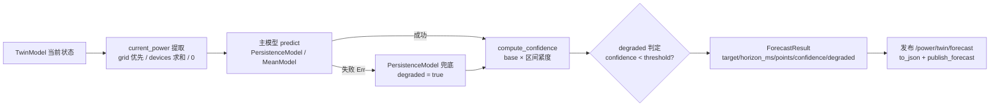
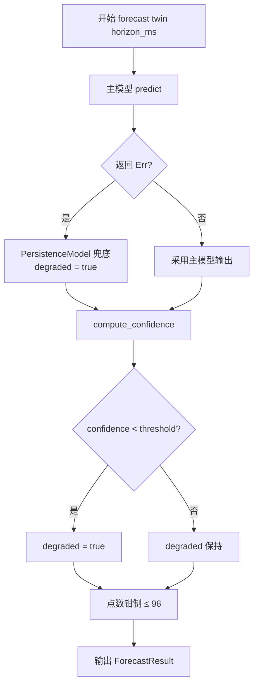

# EnerOS v0.90.0 数字孪生短期预测设计文档

## 1. 版本目标

实现 Digital Twin Agent 短期预测（eneros-twin-agent 预测能力扩展）：

- **秒~分钟级功率预测**：基于 v0.89.0 TwinModel 实时镜像的当前状态，以可配置步长（默认 1s）生成预测区间点序列（默认上限 96 点）；
- **主模型 + 兜底链**：`ForecastModel` trait 抽象，主模型 `predict` 失败自动切换 `PersistenceModel`（持续法）兜底，结果永远完整可用；
- **置信度与降级标记**：确定性 `compute_confidence`（base_confidence × 区间紧度），走兜底或置信度低于阈值时 `degraded = true`；
- **预测发布**：`ForecastResult::to_json()` 全量序列化，经 `publish_forecast` 向 `/power/twin/forecast` 发布。

性能目标（蓝图 §7.2）：预测误差 < 5%、推理 < 100ms——均为**集成阶段验收**（误差在 v0.25.0 TSDB 历史接入后回测判定），本版本交付算法骨架 + 合成数据单元验证。只读安全（蓝图 §7.3）：预测只读 TwinModel，不写控制通道。

本版本为 Phase 2 P2-C 线第 9 版，出口衔接 **v0.91.0 What-if 分析**（预测底座），并为 **v0.112.0 云端孪生联合仿真** 提供预测数据源。

## 2. 前置依赖

- v0.89.0 twin-agent 数据镜像（`TwinModel` / `DeviceTwin` / `TwinSnapshot`，预测输入来源）
- v0.75.0 agent-bus-dds（`DdsNode` / `WriterId` / `MockDdsNode` / `DdsError`，预测发布通道）
- v0.82.0 grid-agent（`GridState`，current_power 提取首选来源 `grid.active_power`）
- v0.73.0 device-agent（`DeviceState`，grid 无数据时设备功率求和回退）
- 蓝图 `phase2.md` v0.90.0 章节（9 节版本模板）
- 蓝图假设：历史数据可训练（蓝图 §2）——本版本以合成数据单元验证，真实历史回测待 v0.25.0 TSDB 接入
- **无阻塞依赖**：全部前置 crate 已交付，本版本为 twin-agent 内部新增 2 文件（Surgical）

## 3. 交付物清单

- `crates/agents/twin-agent/src/model_forecast.rs` — `ForecastPoint` / `ForecastResult` / `ForecastError` / `ForecastModel` trait + `PersistenceModel`（持续法兜底）+ `MeanModel`（均值法）+ `compute_confidence` + `sanitize`（NaN 防御）+ 内嵌测试
- `crates/agents/twin-agent/src/predictor.rs` — `Predictor`（主模型 + 兜底链 + 步长/点数/阈值配置）+ `publish_forecast`（发布 `/power/twin/forecast`）+ 内嵌测试
- `crates/agents/twin-agent/src/lib.rs` — 仅追加 `pub mod` + 重导出 + crate 文档升级 v0.90.0（mirror/model 零改动）
- `configs/twin_forecast.toml` — 短期预测配置模板（步长/点数上限/置信阈值/目标/主题/模型选择/兜底/权重占位）
- `docs/agents/twin-forecast-design.md` — 本设计文档
- 40 个单元测试 T1~T40（src 内嵌，D6）
- 版本同步（根 4 文件 0.89.0 → 0.90.0）

## 4. 数据结构

### 4.1 ForecastPoint

预测区间单点。

| 字段 | 类型 | 说明 |
|------|------|------|
| `time` | `u64` | 预测点时间戳（ms）= `model.last_update + (i+1)*step_ms`，外部时间注入（D3：u64 ms，无 Instant::now()） |
| `value` | `f32` | 预测值（中心值，经 sanitize 保证有限） |
| `lower` | `f32` | 预测区间下界（持续法为 value × 0.95） |
| `upper` | `f32` | 预测区间上界（持续法为 value × 1.05），恒有 `lower < value < upper`（value ≠ 0 时） |

派生：`Debug, Clone, Copy, PartialEq, serde::Serialize`。

### 4.2 ForecastResult

预测结果聚合体。

| 字段 | 类型 | 说明 |
|------|------|------|
| `target` | `&'static str` | 预测目标（D2：避免堆分配；默认 `"power"`，多目标扩展后续版本） |
| `horizon_ms` | `u64` | 预测时域（D3：u64 ms 外部时间注入惯例，同 v0.89.0 D8） |
| `points` | `Vec<ForecastPoint>` | 预测点序列（≤ max_points，默认 96，§43.6 防 OOM） |
| `confidence` | `f32` | 置信度 `[0.0, 1.0]` = base_confidence × 区间紧度，确定性可复现（D10） |
| `degraded` | `bool` | 降级标记：走兜底链 或 confidence < threshold 或 NaN 输入时置位（D10/D12） |

派生：`Debug, Clone, serde::Serialize`（`to_json()` 经 serde_json 序列化全量含 points 数组，≤96 点约 4KB）。

### 4.3 ForecastError

| 变体 | 含义 | 触发点 |
|------|------|--------|
| `Dds(DdsError)` | DDS 节点操作失败 | `publish_forecast` write 失败透传（单变体，同 v0.89.0 D8 模式） |

派生：`Debug`（no_std 下不实现 std Error trait）。

### 4.4 ForecastModel trait

```rust
/// 预测模型抽象（D7：LSTM 后续经本 trait 接入，无需改 Predictor）
pub trait ForecastModel {
    /// 基于 TwinModel 当前状态预测 horizon_ms 时域、step_ms 步长的点序列
    fn predict(
        &self,
        input: &TwinModel,
        horizon_ms: u64,
        step_ms: u64,
    ) -> Result<Vec<ForecastPoint>, ForecastError>;

    /// 模型名（结果溯源，如 "persistence" / "mean" / "lstm"）
    fn name(&self) -> &'static str;

    /// 基础置信度（compute_confidence 输入之一，确定性常数）
    fn base_confidence(&self) -> f32;
}
```

D4：不要求 `Send + Sync`（no_std 单线程惯例，同 agent-bus-dds D2）。全部 no_std + alloc 兼容。

### 4.5 基线模型

| 模型 | 语义 | base_confidence |
|------|------|-----------------|
| `PersistenceModel` | 持续法：以 current_power 恒定外推，±5% 区间带；**统一兜底模型**（D8） | 中（恒定输入上 MAPE == 0） |
| `MeanModel` | 均值法：以 current_power 均值为预测值；**可选主模型**——v0.89.0 镜像仅存最新态、无历史缓冲时均值 ≡ 持续法单样本（D8） | 低 |

### 4.6 current_power 提取规则（优先级递减）

1. **grid 优先**：`grid.timestamp > 0` → `grid.active_power`；
2. **devices 求和**：grid 无数据（timestamp == 0）但存在设备 → 全部设备 `power` 求和；
3. **全空回退**：grid 无数据且无设备 → `0.0`（结果低置信 + degraded）。
4. 任何路径取得的值经 `sanitize`：非有限（NaN/Inf）→ `0.0`（D12）。

### 4.7 核心算法流程



## 5. 接口设计

### 5.1 接口签名与语义

| 接口 | 签名 | 语义 |
|------|------|------|
| `Predictor::new` | `pub fn new(model: Box<dyn ForecastModel>, step_ms: u64, max_points: usize, confidence_threshold: f32) -> Self` | 构造注入主模型与周期配置（D9）；`step_ms == 0` 钳制为 1，`max_points == 0` 钳制为 1 |
| `forecast` | `pub fn forecast(&self, twin: &TwinModel, horizon_ms: u64) -> Result<ForecastResult, ForecastError>` | 主模型 `predict` 成功则用其输出；`Err` → 自动切换 `PersistenceModel` 兜底并置 `degraded = true`；confidence < threshold 亦置 `degraded = true` |
| `forecast_and_publish` | `pub fn forecast_and_publish(&self, node: &mut dyn DdsNode, writer: WriterId, twin: &TwinModel, horizon_ms: u64) -> Result<ForecastResult, ForecastError>` | forecast + 发布一体便捷接口；发布失败返回 `Err(ForecastError::Dds(_))` |
| `publish_forecast` | `pub fn publish_forecast(node: &mut dyn DdsNode, writer: WriterId, result: &ForecastResult) -> Result<(), ForecastError>` | 辅助函数：`result.to_json()` → `node.write(writer, ...)` 写入 `/power/twin/forecast`（D11：复用 agent-bus-dds DdsNode，不新增 writer 管理逻辑） |
| `compute_confidence` | `pub fn compute_confidence(base: f32, points: &[ForecastPoint]) -> f32` | 输出钳制 `[0.0, 1.0]`；区间越窄置信越高；空 points → 0.0；非有限输入不传播不 panic（D12） |
| `sanitize` | `fn sanitize(v: f32) -> f32` | NaN/Inf → 0.0（D12，v0.88.0 C140 教训） |

### 5.2 点数钳制规则（D9，§43.6 防 OOM）

- 原始点数 = `horizon_ms / step_ms` **向上取整**；
- 钳制区间 `1..=max_points`（默认 96，与市场 96 时段惯例一致）；
- 例：`horizon_ms = 10_000_000, step_ms = 1, max_points = 96` → 返回 96 点，不超限分配内存。

### 5.3 确定性保证

同一 `TwinModel` 相同 horizon 两次调用 `forecast`，结果逐点一致：无随机源、无 `Instant::now()`，时间戳全部由 `model.last_update` 与 `step_ms` 推导。

## 6. 错误处理

### 6.1 forecast 决策流程



### 6.2 降级路径全表（降级非错误）

| 路径 | 处理 | 结果影响 |
|------|------|---------|
| 主模型 `predict` 返回 `Err` | 自动切换 `PersistenceModel` 兜底（D8），`forecast` 仍返回 `Ok` | points 来自持续法，`degraded = true`，结果完整可用 |
| 空模型（grid.timestamp == 0 且无设备） | current_power = 0.0，预测不 panic | 全 `value == 0.0`，`confidence == 0.0` 且 `degraded` |
| NaN/Inf 输入（D12） | `sanitize` 按 0.0 处理，非有限不传播不 panic | 全 point value 有限（0.0），`confidence == 0.0`，`degraded = true` |
| confidence < threshold（D10） | 不拒绝结果，仅标记 | `degraded = true`，下游（v0.91.0）据此降权使用 |
| `publish_forecast` write 失败 | **唯一硬错误**：透传 `Err(ForecastError::Dds(_))` | 不 panic，调用方决定是否重试 |

## 7. 选型对比（蓝图 §5.1）

| 模型 | 精度 | 复杂度 | 结论 |
|------|------|--------|------|
| **持续法（Persistence）** | 低（恒定外推，突变失效） | 低（O(n) 标量） | **兜底采用**：统一兜底链末端，任意主模型失败均可回退（D8） |
| ARIMA | 中（需历史序列拟合） | 中（参数估计 + 矩阵运算） | 备选：依赖历史缓冲，v0.25.0 TSDB 接入后评估 |
| **LSTM/GRU** ⭐ | 高（非线性时序建模） | 高（权重分发 + 推理后端） | **后续接入**（D7）：本版本交付 trait 抽象，LSTM 经 `ForecastModel` 即插即用 |
| **均值法（Mean）** | 低（无历史缓冲时 ≡ 持续法单样本） | 低（O(n) 标量） | **可选主模型**（D8）：v0.89.0 镜像仅存最新态，均值无历史可用 |

说明：本版本交付 `ForecastModel` trait 抽象 + 持续法/均值基线 + 兜底链；LSTM 权重分发与推理后端后续版本接入（v0.61.0 模型部署线仅覆盖 LLM GGUF，不含 LSTM 通道）。

## 8. 实现路径（Karpathy 4 原则落点）

| 步骤 | 内容 | 原则落点 |
|------|------|---------|
| ① 数据结构与 trait | `ForecastPoint` / `ForecastResult` / `ForecastError` / `ForecastModel` + `sanitize` | Think Before Coding：D1~D12 偏差声明先行 |
| ② 基线模型 + 兜底链 | `PersistenceModel` / `MeanModel` / `Predictor` 主模型失败自动切换 | Simplicity First：纯标量 O(n)，无张量依赖 |
| ③ 置信度 + degraded | `compute_confidence`（base × 区间紧度，钳制 [0,1]）+ threshold 判定 | Goal-Driven：确定性可复现，测试可断言 |
| ④ 发布 | `to_json()` + `publish_forecast` 复用 `DdsNode` | Surgical Changes：mirror.rs / model.rs 零改动，仅新增 2 文件 |
| ⑤ 误差评估 | 合成数据单元验证（恒定 MAPE == 0、缓变斜坡 MAPE < 5%）；真实历史回测留待集成阶段 | Goal-Driven：性能目标标注验收阶段，不虚报达成 |

## 9. 测试计划

40 个单元测试 T1~T40（src 内嵌，D6）：

| 分组 | 编号 | 覆盖点 |
|------|------|--------|
| 结构 | T1~T6 | ForecastPoint/ForecastResult/ForecastError 构造与派生、to_json 字段齐全、target == "power"、degraded 默认值 |
| Persistence | T7~T12 | 恒定外推 value 精确、time = last_update + (i+1)*step_ms、±5% 区间带、name() == "persistence"、空模型全 0 低置信、设备求和回退 |
| Mean | T13~T14 | 均值预测值正确、无历史缓冲时 ≡ 持续法单样本（D8） |
| confidence | T15~T20 | 钳制 [0.0, 1.0]、区间越窄置信越高、空 points → 0.0、NaN 输入不传播、Inf 输入不 panic、确定性可复现 |
| Predictor | T21~T32 | 主模型成功路径、主模型 Err → 持续法兜底 + degraded、confidence < threshold → degraded、点数向上取整、点数钳制 ≤ 96 防 OOM、step_ms/max_points 为 0 钳制为 1、两次调用逐点一致（确定性）、NaN 防御端到端 |
| publish | T33~T36 | MockDdsNode 端到端：writer 发布 → reader 收 1 条样本、payload 可 serde_json 解析、含 target/confidence/points 数组、node shutdown → Err(ForecastError::Dds) 不 panic |
| 精度 | T37~T38 | 恒定输入持续法 MAPE == 0、缓变斜坡 MAPE < 5%（合成平滑数据单元级验证） |
| 端到端 | T39~T40 | TwinModel 镜像 → forecast → publish 全链路、forecast_and_publish 一体接口 |

性能目标（误差 < 5%、推理 < 100ms）标注：**集成阶段验收，本版本交付算法骨架 + 合成数据单元验证**；真实历史回测待 v0.25.0 TSDB 历史数据接入后进行（D6）。

## 10. 验收标准

- **功能**：预测可用（grid 优先 / devices 求和 / 空模型安全退化三分支）+ 主模型失败持续法兜底 + `/power/twin/forecast` 发布端到端贯通
- **性能**：预测误差 < 5%、推理 < 100ms（蓝图 §7.2）——**集成阶段验收**（误差待 v0.25.0 TSDB 历史接入后回测），本版本合成数据单元验证（T37/T38）
- **安全**：只读 TwinModel，不写任何控制通道（蓝图 §7.3）；唯一输出为预测主题
- **质量**：40 tests 全过（T1~T40）；aarch64-unknown-none 交叉编译通过；clippy 0 warning；既有 v0.89.0 40 测试与全部下游 crate 回归零影响
- **文档**：本设计文档 + `configs/twin_forecast.toml` 配置模板

## 11. 风险与坑点

| 风险 | 说明 | 缓解 |
|------|------|------|
| 突变场景预测失效（蓝图 §8.5） | 持续法/均值法恒定外推，负荷突变时误差剧增 | `degraded` 标记提示下游降权；LSTM 后续接入提升非线性建模能力 |
| 无历史缓冲限制（D8） | v0.89.0 镜像仅存最新态，均值 ≡ 持续法单样本，ARIMA/LSTM 无训练数据 | 本版本接受；后续接 v0.25.0 TSDB 历史数据解锁时序模型 |
| 模型过拟合 | LSTM 接入后离线训练可能过拟合历史 | 在线评估 + 置信度监控，后续 LSTM 接入时建立回测基线 |
| 内存超限 | 超大 horizon 触发 points 超限分配 | 点数钳制 ≤ 96（蓝图 §43.6），max_points 为 0 钳制为 1 |
| NaN/Inf 污染 | 上游镜像异常注入非有限值 | D12 sanitize 按 0.0 处理 + confidence 置 0 + degraded，不传播不 panic |
| GPU 规则（蓝图 §6.6） | LSTM 接入后推理优先 GPU（model.to("cuda")）+ 禁用梯度，无 GPU 退 CPU | 本版本基线为纯标量 CPU 计算、无张量，不涉及 GPU；规则在 LSTM 接入版本生效 |
| 下游耦合 | v0.91.0 What-if / v0.112.0 云端孪生依赖本预测底座 | ForecastModel trait 稳定抽象 + degraded 语义明确，下游按置信度降权使用 |

## 12. 偏差声明

| 偏差 | 蓝图原文 | 本版本处理 |
|------|---------|-----------|
| **D1** | crate 路径 `twin_agent/src/{predictor,model_forecast}.rs` | 既有 `twin-agent/src/` 内新增同名 2 文件（沿用 v0.89.0 D12 连字符命名） |
| **D2** | `target: String` | `target: &'static str`（避免堆分配；默认 `"power"`，多目标扩展后续版本） |
| **D3** | `horizon: Duration` | `horizon_ms: u64`（全 crate 统一 u64 ms 外部时间注入惯例，同 v0.89.0 D8） |
| **D4** | `ForecastModel: Send + Sync` | 不要求 Send+Sync（no_std 单线程惯例，同 agent-bus-dds D2） |
| **D5** | `docs/phase2/forecast.md` | `docs/agents/twin-forecast-design.md`（记忆 §2.3.3 文档分类强制） |
| **D6** | `tests/forecast_accuracy.rs` 独立集成测试 | src 内嵌单元测试 T1~T40（项目惯例）；历史回测误差 <5% 标注**集成阶段验收**（v0.25.0 TSDB 历史接入后回测），本版本以合成平滑数据验证持续法 MAPE < 5% |
| **D7** | 选型 LSTM/GRU ⭐ 采用 | 本版本交付 `ForecastModel` trait 抽象 + `PersistenceModel`/`MeanModel` 基线 + 兜底链；LSTM 权重分发与推理后端后续版本接入（v0.61.0 模型部署线仅覆盖 LLM GGUF，不含 LSTM 通道） |
| **D8** | §4.4"退化均值预测" vs §5.1"持续法兜底"表述不一致 | 统一兜底链：主模型 `Err` → `PersistenceModel`；`MeanModel` 为可选主模型（无历史缓冲时均值 ≡ 持续法单样本，v0.89.0 镜像仅存最新态） |
| **D9** | `forecast(model, horizon)` 无步长参数 | `Predictor::new(step_ms, max_points, confidence_threshold)` 构造注入；点数 = `horizon_ms / step_ms` 向上取整，钳制 `1..=max_points`（默认 96，§43.6 内存预算防 OOM） |
| **D10** | §4.4"置信度低 → 标记" | `ForecastResult` 增加 `degraded: bool`（走兜底链 或 confidence < threshold 时置位）；confidence = base_confidence × 区间紧度，确定性计算可复现 |
| **D11** | 发布 `/power/twin/forecast` | `ForecastResult::to_json()`（全量含 points 数组，≤96 点约 4KB）+ `publish_forecast(node, writer, result)` 辅助函数；复用 agent-bus-dds `DdsNode`，不新增 writer 管理逻辑 |
| **D12** | —（蓝图未覆盖） | NaN/Inf 防御（v0.88.0 C140 教训）：输入功率非有限 → `sanitize` 按 0.0 处理，`confidence` 置 0 且 `degraded = true` |
