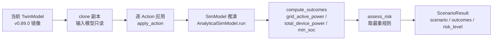
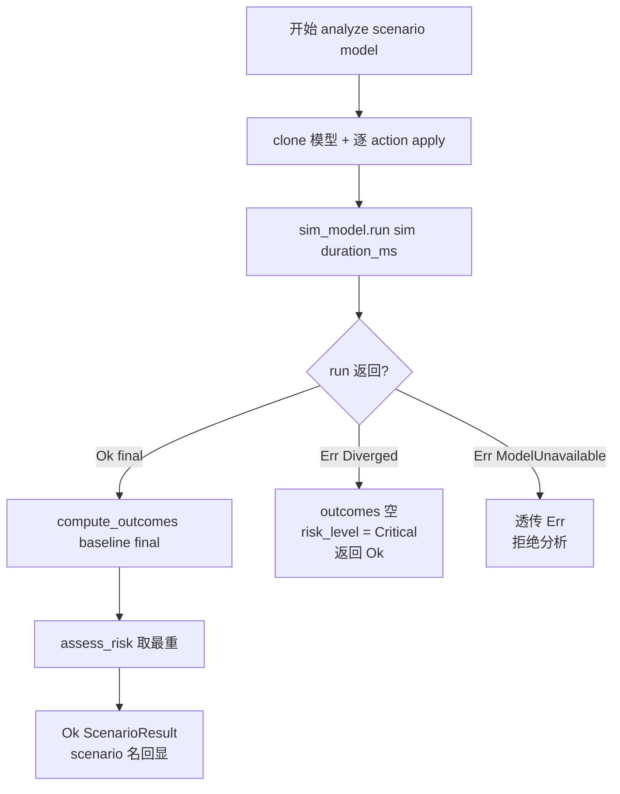

# EnerOS v0.91.0 数字孪生 What-if 分析设计文档

## 1. 版本目标

实现 Digital Twin Agent What-if 分析（eneros-twin-agent 决策预演能力扩展）：

- **假设动作应用**：`Action` 四变体覆盖 TwinModel 设备/电网/市场三面——`SetDevicePower`（设定设备功率）/ `RemoveDevice`（设备退出）/ `SetGridPower`（设定电网有功）/ `SetMarketPrice`（设定市场电价），逐动作应用到模型 clone 副本；
- **仿真推演**：`SimModel` trait 抽象 + `AnalyticalSimModel`（简化解析模型 ⭐）：SOC 线性推演（`soc -= power × hours / capacity`，clamp [0,1]），grid/market/last_update 透传；
- **Outcome 对比**：`compute_outcomes` 3 指标固定顺序（`grid_active_power` / `total_device_power` / `min_soc`），value vs baseline 同帧对照；
- **风险分级**：`assess_risk` 取最重规则输出 `RiskLevel`（Low < Medium < High < Critical），为下游决策层提供执行前拦截依据。

**业务价值**：v0.90.0 让孪生能"看未来"（预测），本版本补齐"如果……会怎样"的决策前预演——调度/市场动作下发前先在数字孪生上推演后果，避免决策失误（如重放电竞价导致 SOC 耗尽、电网功率越限）。

性能目标（蓝图 §7.2）：单次分析 < 1s——**集成阶段验收**，本版本交付算法骨架 + 单元验证（AnalyticalSimModel 为纯标量 O(设备数) 线性推演）。高风险拦截（蓝图 §7.3）：risk ≥ High 的场景下游决策层应拒绝执行。

本版本为 Phase 2 **P2-C 线收尾版**，出口衔接 **v0.112.0 云端孪生联合仿真**（本版完成后进入 P2-D Coordinator 线），What-if 预演能力是云端联合仿真的本地底座。

## 2. 前置依赖

- v0.89.0 twin-agent 数据镜像（`TwinModel` / `DeviceTwin` / `MarketMirror` / `GridMirror`，What-if 输入模型来源）
- v0.90.0 twin-agent 短期预测（`model_forecast::sanitize` 复用，f32 NaN/Inf 防御，D12）
- 蓝图 `phase2.md` v0.91.0 章节（9 节版本模板）
- **无外部依赖**：不触 DDS 总线、不写控制通道、无新第三方 crate；全部前置代码已交付，本版本为 twin-agent 内部新增 1 文件（Surgical，mirror.rs / model.rs / model_forecast.rs / predictor.rs 零改动）

## 3. 交付物清单

- `crates/agents/twin-agent/src/whatif.rs` — `Action` / `Scenario` / `Outcome` / `RiskLevel` / `ScenarioResult` / `WhatIfError` / `SimModel` trait + `AnalyticalSimModel` + `WhatIfAnalyzer` + `apply_action` / `compute_outcomes` / `assess_risk` 自由函数 + 内嵌测试
- `crates/agents/twin-agent/src/lib.rs` — 仅追加 `pub mod whatif;` + 12 项重导出 + crate 文档升级 v0.91.0（既有 4 模块零改动）
- `configs/twin_whatif.toml` — What-if 配置模板（`[whatif]` 容量/风险阈值 + `[[scenario]]` 场景模板 3 例）
- `docs/agents/twin-whatif-design.md` — 本设计文档
- 40 个单元测试 T1~T40（src 内嵌，D6），含发散/不可用故障注入
- 版本同步（根 4 文件 0.90.0 → 0.91.0）

## 4. 数据结构

### 4.1 Action（D7，蓝图 `Vec<Action>` 但类型未定义，本地定义 4 变体）

| 变体 | 字段 | 语义 |
|------|------|------|
| `SetDevicePower` | `device_id: u64, power: f64` | 设定存在设备的功率（kW，正放电负充电）；不存在设备无副作用 |
| `RemoveDevice` | `device_id: u64` | 设备退出镜像（设备表移除该 id） |
| `SetGridPower` | `active_power: f32` | 设定电网有功功率（其余 grid 字段不变） |
| `SetMarketPrice` | `price: f32` | 设定市场电价（market None → 新建 `MarketMirror`，Some → 覆盖 price） |

派生：`Debug, Clone, Copy, PartialEq`。

### 4.2 Scenario

| 字段 | 类型 | 说明 |
|------|------|------|
| `name` | `&'static str` | 场景名（D2：无堆分配；场景模板名静态化，动态命名后续版本） |
| `actions` | `Vec<Action>` | 假设动作序列，按序应用 |
| `duration_ms` | `u64` | 推演时长（D3：u64 ms 外部时间注入惯例，全 crate 统一，无 `Instant::now()`） |

派生：`Debug, Clone`。

### 4.3 Outcome

| 字段 | 类型 | 说明 |
|------|------|------|
| `metric` | `&'static str` | 指标名（D2：无堆分配；固定 3 指标之一） |
| `value` | `f32` | 仿真后值 |
| `baseline` | `f32` | 基线值（分析前 TwinModel 同指标） |

派生：`Debug, Clone, Copy, PartialEq`。

### 4.4 RiskLevel

| 变体 | 严重度 | 触发规则（assess_risk 取最重） |
|------|--------|-------------------------------|
| `Low` | 最低（Default） | 全部指标平稳 |
| `Medium` | 中 | grid_active_power 相对基线波动 > 50%（严格大于） |
| `High` | 高 | min_soc < 0.2（且 > 0） |
| `Critical` | 最高 | min_soc ≤ 0（SOC 耗尽）；或仿真发散（D10） |

派生：`Debug, Clone, Copy, PartialEq, Eq, PartialOrd, Ord, serde::Serialize` + `Default = Low`——**Ord 序即严重度**，`max` 语义可直接取最重。

### 4.5 ScenarioResult

| 字段 | 类型 | 说明 |
|------|------|------|
| `scenario` | `&'static str` | 场景名回显（溯源） |
| `outcomes` | `Vec<Outcome>` | 3 指标结果（固定顺序）；发散时为空（D10） |
| `risk_level` | `RiskLevel` | 风险分级 |

派生：`Debug, Clone, serde::Serialize`；`summary_json()` 摘要序列化（仿 v0.89.0 TwinSnapshot 模式：serde_json::to_string 失败兜底 `"{}"`）。

### 4.6 WhatIfError

| 变体 | 含义 | analyze 行为（D10） |
|------|------|--------------------|
| `ModelUnavailable` | 仿真模型不可用 | 透传 `Err` **拒绝分析**（蓝图 §4.4） |
| `Diverged` | 仿真发散 | 转 `Ok`：outcomes 空 + `risk_level = Critical`（标记高风险） |

派生：`Debug, Clone, Copy, PartialEq, Eq`。全部类型 no_std + alloc 兼容。

## 5. 接口设计

### 5.1 SimModel trait（D4：不要求 Send + Sync，no_std 单线程惯例）

```rust
/// 仿真模型抽象（详细动态仿真/蒙特卡洛后续经本 trait 接入，无需改 WhatIfAnalyzer）
pub trait SimModel {
    /// 对应用完动作的状态推演 duration_ms，返回最终状态
    fn run(&self, state: TwinModel, duration_ms: u64) -> Result<TwinModel, WhatIfError>;
    /// 模型名（结果溯源，如 "analytical"）
    fn name(&self) -> &'static str;
}
```

### 5.2 AnalyticalSimModel（D9，简化解析模型 ⭐）

- 字段：`battery_capacity_kwh: f64`（pub）；`new(capacity)`：非有限或 ≤ 0 → 100.0（D12）；
- `run`：`hours = duration_ms as f64 / 3_600_000.0`；逐设备 `soc -= sanitize(power as f32) as f64 * hours / capacity`，clamp [0,1]；grid / market / last_update 透传；
- `name() == "analytical"`。

### 5.3 WhatIfAnalyzer

| 接口 | 签名 | 语义 |
|------|------|------|
| 构造 | `WhatIfAnalyzer { sim_model: Box<dyn SimModel> }` | 字段 pub，构造注入仿真模型（D4） |
| `analyze` | `pub fn analyze(&self, scenario: &Scenario, model: &TwinModel) -> Result<ScenarioResult, WhatIfError>` | clone 模型 → 逐 action `apply_action` → `sim_model.run(sim, duration_ms)` → 发散转 Critical 结果（D10）→ `compute_outcomes(model, &final)` → `assess_risk` → 返回（scenario 名回显） |

### 5.4 自由函数（D8：TwinModel 无 apply 方法，model.rs 零改动）

| 函数 | 签名 | 语义 |
|------|------|------|
| `apply_action` | `pub fn apply_action(state: &mut TwinModel, action: &Action)` | 应用单动作到 sim 态；功率经 sanitize（D12）；SetDevicePower 仅更新存在设备 |
| `compute_outcomes` | `pub fn compute_outcomes(baseline: &TwinModel, final_state: &TwinModel) -> Vec<Outcome>` | 3 指标固定顺序：`grid_active_power` / `total_device_power`（Σ 设备 power，f32 饱和转换）/ `min_soc`（空设备 → 1.0 中性）（D11） |
| `assess_risk` | `pub fn assess_risk(outcomes: &[Outcome]) -> RiskLevel` | 取最重规则（D11）；空 outcomes → Low |

### 5.5 核心算法流程



## 6. 错误处理

### 6.1 D10 双分支语义（蓝图 §4.4"仿真发散 → 标记高风险" + "模型不可用 → 拒绝分析"）

| SimModel::run 返回 | analyze 行为 | 结果形态 |
|-------------------|-------------|---------|
| `Ok(final_state)` | 正常路径：compute_outcomes → assess_risk | `Ok(ScenarioResult)`，outcomes 3 条 |
| `Err(Diverged)` | **标记高风险**：转 Ok，不 panic | `Ok(ScenarioResult { outcomes: vec![], risk_level: Critical })` |
| `Err(ModelUnavailable)` | **拒绝分析**：透传 Err | `Err(WhatIfError::ModelUnavailable)` |

### 6.2 analyze 决策流程



### 6.3 NaN/Inf 与除零防御（D12，v0.88.0 C140 教训）

- action 功率非有限（NaN/Inf）：f32 复用 `model_forecast::sanitize` 按 0.0；f64 power 本地等价处理——非有限不传播、不 panic；
- 设备 power 非有限 → sanitize 0.0 → SOC 不变；
- `battery_capacity_kwh` 非有限或 ≤ 0 → 回退 100.0（构造时钳制，run 内不再判）；
- 波动率除零防御：|baseline| < 1e-6 时，|final| < 1e-6 → 波动 0；否则视为大波动（Medium 路径）。

## 7. 选型对比（蓝图 §5.1）

| 模型 | 精度 | 时延 | 结论 |
|------|------|------|------|
| **简化解析模型** ⭐ | 低（SOC 线性，无动态特性） | **实时**（O(设备数) 标量） | **本版本采用**：`AnalyticalSimModel`，决策前实时预演，< 1s 目标余量充足 |
| 详细动态仿真 | 高（含电气/热动态） | 离线（秒~分钟级） | 后续版本：v0.112.0 云端孪生联合仿真接入，经 `SimModel` trait 即插即用 |
| 蒙特卡洛 | 中（概率分布） | 批量（风险评估） | 后续版本：不确定性量化与风险分布评估，经 `SimModel` trait 接入 |

说明：本版本交付 `SimModel` trait 抽象 + 解析模型基线；详细动态仿真/蒙特卡洛无需改 `WhatIfAnalyzer`，仅新增实现（D9）。

## 8. 实现路径

| 步骤 | 内容 | 原则落点 |
|------|------|---------|
| ① 定义场景模型 | `Action` / `Scenario` / `Outcome` / `RiskLevel` / `ScenarioResult` / `WhatIfError` + `apply_action` | Think Before Coding：D1~D12 偏差声明先行 |
| ② 仿真推演 | `SimModel` trait + `AnalyticalSimModel`（SOC 线性 + clamp + 透传） | Simplicity First：纯标量 O(设备数)，无张量依赖 |
| ③ 风险评估 | `compute_outcomes`（3 指标）+ `assess_risk`（取最重）+ `WhatIfAnalyzer::analyze` | Goal-Driven：确定性可复现，测试可断言 |

文件组织：全部实现内聚于 `src/whatif.rs` 单文件（Surgical Changes：mirror.rs / model.rs / model_forecast.rs / predictor.rs 零改动），lib.rs 仅追加 `pub mod whatif;` + 重导出 + crate 文档升级。

## 9. 测试计划

40 个单元测试 T1~T40（src 内嵌，D6）：

| 分组 | 编号 | 覆盖点 |
|------|------|--------|
| 数据结构 | T1~T7 | Action 4 变体构造/Copy/相等、Scenario Clone 回显、Outcome 3 字段、RiskLevel 序 Low<Medium<High<Critical + Default==Low、ScenarioResult Clone、summary_json 可 serde_json 解析含 scenario/risk_level/outcomes、WhatIfError 两变体不等 |
| apply_action | T8~T14 | SetDevicePower 存在设备更新/不存在无副作用/NaN·Inf→0.0、RemoveDevice 移除+重复移除不 panic、SetGridPower 更新+其余字段不变+NaN→0.0、SetMarketPrice None→Some/已有覆盖 |
| 仿真模型 | T15~T21 | new 钳制（NaN/0/-5/+Inf→100.0；50 保留）、SOC 放电 0.8→0.7 精确推演、充电 soc 增加、clamp 双界、duration_ms=0 不变、多设备各自推演+grid/market/last_update 透传+name()=="analytical"、设备 power NaN→soc 不变 |
| outcomes+risk | T22~T31 | 恰好 3 条固定顺序指标、数值正确（grid 10→16/设备 Σ/min_soc 0.8→0.7）、空设备 min_soc==1.0 中性、min_soc==0→Critical、0.15→High、边界 0.2→Low/0.19→High、grid 波动>50%→Medium、恰 50%→Low、全平稳→Low、空 outcomes→Low、取最重（Critical 压 Medium） |
| analyzer | T32~T40 | 重放电端到端 Critical、平稳场景 Low+3 outcomes+名回显、**故障注入**：DivergingSimModel→Ok+空 outcomes+Critical（D10）、UnavailableSimModel→Err(ModelUnavailable) 拒绝分析、两次 analyze 逐字段一致（确定性）、输入 model 只读不被修改、组合动作（Set+Remove）、空 actions+0 时长全等、SetGridPower 16→Medium |

性能目标（分析 < 1s，蓝图 §6.3/§7.2）标注：**集成阶段验收，本版本交付算法骨架 + 单元验证**（D6）。

**GPU 规则说明（蓝图 §6.6）**：详细动态仿真/蒙特卡洛后续接入时，仿真计算优先使用 GPU（`model.to("cuda")` 等价语义）且**禁用梯度计算**（`torch.no_grad()` 等价语义），GPU 不可用退 CPU；本版本 AnalyticalSimModel 为纯标量 CPU 计算、无张量操作，不涉及 GPU。

## 10. 验收标准

- **功能**：Action 4 变体正确应用 + AnalyticalSimModel SOC 线性推演 + 3 指标 Outcome 对比 + 取最重风险分级 + analyze 全流程贯通；发散/不可用双分支语义正确（D10）
- **性能**：单次分析 < 1s（蓝图 §7.2）——**集成阶段验收**，本版本算法骨架为 O(设备数) 纯标量推演
- **安全**：高风险拦截（蓝图 §7.3：risk ≥ High 的场景下游决策层应拒绝执行）；只读分析——输入 TwinModel 不被修改，不写任何控制通道
- **质量**：40 tests 全过（T1~T40）；aarch64-unknown-none 交叉编译通过；clippy 0 warning；既有 v0.89.0+v0.90.0 共 80 测试与全部下游 crate 回归零影响
- **文档**：本设计文档 + `configs/twin_whatif.toml` 配置模板
- **出口**：决策前预演能力可用，为 v0.112.0 云端孪生联合仿真提供本地 What-if 底座（P2-C 收尾）

## 11. 风险与坑点

| 风险 | 说明 | 缓解 |
|------|------|------|
| 保真度不足误导决策（蓝图 §8.1） | 解析模型仅 SOC 线性推演，无电气/热动态，复杂场景结论可能失真 | risk 语义保守化（发散即 Critical）；高风险结果仅作拦截依据不作执行依据；详细动态仿真后续接入 |
| 仿真与真实偏差（蓝图 §8.5） | 模型参数（容量/效率）与真实设备漂移，推演偏差随时间累积 | 需持续校准：v0.112.0 云端联合仿真接入真实量测闭环校正；容量参数配置化（twin_whatif.toml） |
| 内存（蓝图 §43.6） | 单次分析 clone 整个 TwinModel，O(设备数) 堆分配 | Agent Runtime 分区 ≤ 64MB 预算内；设备表规模受 v0.89.0 镜像上限约束；无增量分配 |
| 解析模型局限（D9） | 仅 SOC 线性，grid/market 透传不推演 | SimModel trait 抽象，详细动态仿真/蒙特卡洛后续版本即插即用，WhatIfAnalyzer 零改动 |
| NaN/Inf 污染（D12） | 上游镜像异常注入非有限功率 | sanitize 按 0.0 处理 + 容量构造钳制，不传播不 panic |
| GPU 规则（蓝图 §6.6） | 详细仿真接入后需 GPU 优先 + 禁用梯度 | 本版本纯标量 CPU 无张量，不涉及 GPU；规则在详细仿真接入版本生效 |

## 12. 偏差声明

| 偏差 | 蓝图原文 | 本版本处理 |
|------|---------|-----------|
| **D1** | crate 路径 `twin_agent/src/whatif.rs` | 既有 `twin-agent/src/whatif.rs`（连字符命名，v0.89.0 D12 惯例） |
| **D2** | `name: String` / `scenario: String` / `metric: String` | 全部 `&'static str`（无堆分配，同 v0.90.0 D2；场景模板名静态化，动态命名后续版本） |
| **D3** | `duration: Duration` | `duration_ms: u64`（全 crate 统一 u64 ms 外部时间注入惯例） |
| **D4** | `Box<dyn SimModel>`（蓝图未标注约束） | trait 不要求 Send+Sync（no_std 单线程惯例，同 v0.90.0 D4） |
| **D5** | `docs/phase2/whatif.md` | `docs/agents/twin-whatif-design.md`（记忆 §2.3.3 文档分类强制） |
| **D6** | `tests/whatif.rs` 独立集成测试 | src 内嵌单元测试 T1~T40（项目惯例）；分析 <1s 标注**集成阶段验收** |
| **D7** | 蓝图 `Vec<Action>` 但 `Action` 类型未定义 | 本地定义 4 变体：`SetDevicePower { device_id, power: f64 }` / `RemoveDevice { device_id }` / `SetGridPower { active_power: f32 }` / `SetMarketPrice { price: f32 }`（覆盖 TwinModel 设备/电网/市场三面） |
| **D8** | 蓝图 `sim_state.apply(action)`（TwinModel 无此方法） | `whatif.rs` 内自由函数 `apply_action(state: &mut TwinModel, action: &Action)`（model.rs 零改动，Surgical） |
| **D9** | 选型"简化解析模型 ⭐ 实时" | `AnalyticalSimModel { battery_capacity_kwh: f64 }`：仅 SOC 线性推演（`soc -= power × hours / capacity`，clamp [0,1]），grid/market 透传；详细动态仿真/蒙特卡洛后续版本 |
| **D10** | §4.4"仿真发散 → 标记高风险"+"模型不可用 → 拒绝分析" | `WhatIfError { ModelUnavailable, Diverged }`；`SimModel::run` 返回 `Err(Diverged)` → analyze 转 `Ok(result)` 且 `risk_level = Critical` + outcomes 空；`Err(ModelUnavailable)` → analyze 拒绝（透传 Err） |
| **D11** | `compute_outcomes`/`assess_risk` 蓝图仅骨架未定义 | 本版本定义 3 指标：`grid_active_power` / `total_device_power` / `min_soc`（空设备 min_soc=1.0 中性）；风险规则取最重：min_soc ≤ 0 → Critical；min_soc < 0.2 → High；grid 功率相对波动 > 50% → Medium；else Low |
| **D12** | —（蓝图未覆盖） | NaN/Inf 防御（v0.88.0 C140 教训）：action/sim 中非有限功率复用 `model_forecast::sanitize` 按 0.0；`battery_capacity_kwh` 非有限或 ≤ 0 → 默认 100.0 |
