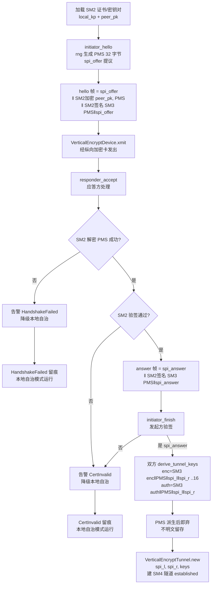
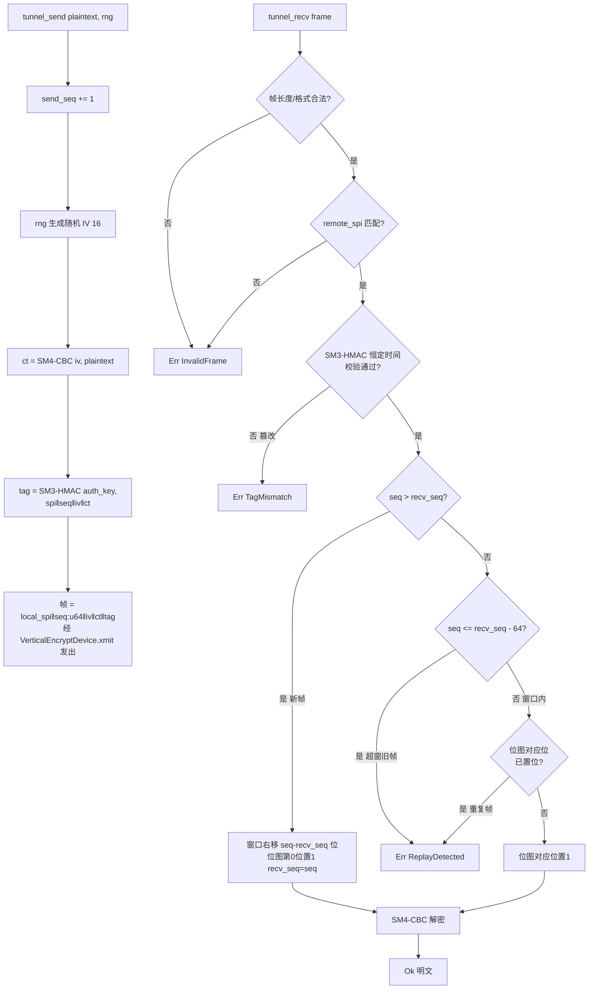

# EnerOS v0.98.1 Vertical Encrypt 纵向加密认证设计文档

> **版本**：v0.98.1（刚性合规子版本）
> **蓝图**：phase2.md §v0.98.1（36 号文合规，Phase 2 安全合规出口条件）
> **Crate**：`eneros-federation`（`crates/agents/federation/src/tunnel.rs`，既有 crate 新增模块）

---

## 1. 版本目标

实现**纵向加密认证**（**36 号文刚性合规子版本，调度主站合规接入**），交付三大能力：

- **SM2 IKE 密钥协商**：最小两方协商——发起方 `initiator_hello` 以注入 `CsRng` 生成 32 字节 PMS → SM2 加密至对端公钥 + SM2 签名 + SPI 提议 → 应答方 `responder_accept` 解密 PMS（失败 → `HandshakeFailed`）验签（失败 → `CertInvalid`）→ 发起方 `initiator_finish` 验签收官 → 双方 `derive_tunnel_keys` 独立派生 `TunnelKeys`（SM3 域分离，双端一致）；
- **SM4 密文隧道**：`tunnel_send` 自增 seq + 注入 RNG 生成随机 IV[16] → 帧 `local_spi‖seq:u64‖iv‖SM4-CBC(iv, plaintext)‖SM3-HMAC(auth_key, spi‖seq‖iv‖ct)`；`tunnel_recv` 解析 → SPI 匹配 → SM3-HMAC **恒定时间校验**（失配 → `TagMismatch`）→ **64 位滑动重放窗口**检查（已收/超窗 → `ReplayDetected`）→ CBC 解密 → 更新 recv_seq/位图；
- **调度主站认证**：`verify_dispatch_auth(token, pk, now_ms)` 对调度主站 `DispatchToken` 做 SM2 验签 + 过期判定（过期判定先于验签：`now_ms >= expires_ms` → `Expired` 不验签），三态 `AuthResult { Granted, Denied, Expired }`。

辅助能力：

- **装置适配 seam**：`VerticalEncryptDevice` sync trait（`xmit`/`poll`）+ `MockVerticalEncryptDevice` 回环故障注入（E2：CI 无硬件，真实纵向加密卡驱动现场适配注入）；
- **密钥轮换**：`VerticalEncryptTunnel::rotate(new_keys)` 原位替换派生密钥 + 重置重放窗口（E12：隧道持有派生密钥而非证书，证书轮换天然不影响已有连接）；
- **多隧道管理**：`TunnelManager` 按 local_spi 管理多隧道（BTreeMap 路由）+ 4 pub 计数器（established/send/recv/replay_reject）全程留痕（E12，蓝图 §9）。

**业务价值**：v0.98.0 完成跨域通信通道（联邦横向安全），但**调度主站纵向接入**（36 号文"横向隔离、纵向认证"体系）尚无合规通道——无纵向加密认证，调度主站下发指令无法合规接入边缘侧，Phase 2 安全合规出口不闭环。本版本以国密 SM2/SM3/SM4 实现纵向 IKE 协商 + 密文隧道 + 重放保护 + 调度指令认证，满足调度主站接入刚性合规要求。

**Phase 定位**：P2-E 刚性合规子版本；**Phase 2 安全合规出口条件；下游支撑调度主站指令接入与 v0.99.0 联邦共识合规运行**。

**性能目标**：吞吐 ≥ 10Mbps 且加密引入延迟增加 < 5ms —— **现场装置验收项**（E10：与真实纵向加密装置对接后实测，本版本交付算法骨架 + Mock 双端回环单元验证）。

---

## 2. 前置依赖

- **v0.98.0 跨域通信通道**（同任务主版本，P2-E 第 2 版）：联邦安全通道族工程基座（同 crate 追加 tunnel.rs；项目硬规则「0.98.x 下所有版本同一任务完成」）；
- **v0.97.0 联邦发现**：`CertVerifier` trait 复用（IKE 证书验证语义，E4）；
- **eneros-crypto**（workspace 既有 crate，v0.33.0 国密 SM2/SM3/SM4 + CSRNG）：`Sm2KeyPair`/`Sm2PublicKey`/`Sm2Signature`（IKE 签名验签）、SM3（隧道密钥派生）、SM4-CBC（隧道加密）、`CsRng`（PMS/IV 生成）；**纯增量** `sm3/hmac.rs`（E11：`hmac_sm3` 一次性接口 + `Sm3Hmac` 流式结构，RFC 2104 HMAC，既有代码零改动 + 1 行 mod 声明）；
- 蓝图 `phase2.md` v0.98.1 章节（9 节版本模板，§4.3 IKE 协商 + 密文隧道全链路 / §5 难点密钥更新与轮换 / §9 证书更新不影响隧道已有连接为落地依据）；
- **no_std + alloc**：`core` / `alloc` only——`alloc::vec::Vec`（E5：Agent Runtime 有用户堆 v0.11.0）/ `alloc::collections::BTreeMap`；禁止 `std::*`（蓝图 §43.1 硬性要求）；
- **后续注入**：真实纵向加密卡驱动（实现 `VerticalEncryptDevice`）现场适配注入（E2）；完整 IKE 状态机/证书链后置集成（E3）。

**下游解锁**：调度主站合规接入（36 号文纵向认证）/ Phase 2 安全合规出口 / v0.117.0 审计哈希链（SM3-HMAC 复用，E11）。

---

## 3. 交付物清单

- `crates/security/crypto/src/sm3/hmac.rs` — **新增（纯增量 E11）**：`hmac_sm3(key, msg) -> [u8; 32]` 一次性接口 + `Sm3Hmac` 流式结构（new/update/finalize，Drop 恒定时间清零）；`src/sm3/mod.rs` 仅加 `pub mod hmac;` 1 行声明，**既有代码零改动**
- `crates/agents/federation/src/tunnel.rs` — **新增**：`TunnelKeys`（禁 Debug + Drop 清零）/ `VerticalEncryptTunnel`（new/tunnel_send/tunnel_recv/rotate）/ `IkeSession`（4 个 pub fn：initiator_hello/responder_accept/initiator_finish/derive_tunnel_keys）/ `EncryptError`（7 变体）/ `DispatchToken` / `AuthResult` / `verify_dispatch_auth` / `VerticalEncryptDevice` trait（sync，E2）/ `MockVerticalEncryptDevice`（回环故障注入）/ `TunnelManager`（add/remove/send/recv + 4 pub 计数器）
- `crates/agents/federation/src/lib.rs` — **修改**：`pub mod tunnel;` + 重导出（tunnel 13 项 + crypto hmac 2 项）+ crate 文档追加 v0.98.1 说明与 E1~E12 偏差表（既有 membership.rs / discovery.rs / channel.rs 零改动）
- `configs/vertical-encrypt.toml` — **新增**：`[vertical_encrypt]` 段（spi_start / spi_end / replay_window / key_rotation_interval_ms / tunnel_policy / ike_timeout_ms + 中文注释 ≥6 点）
- `docs/agents/vertical-encrypt-design.md` — 本设计文档
- `docs/agents/vertical-encrypt-compliance.md` — 《纵向加密对接指南》+《合规控制点矩阵（纵向加密部分）》
- **40 个单元测试** TV1~TV40（tunnel.rs src 内嵌）+ ~10 个 hmac 测试（crypto crate 内嵌），含 IKE 双端协商、隧道收发全链路、重放攻击、篡改检测、密钥轮换、调度认证
- 根目录 4 文件版本同步 0.97.0 → 0.98.0（`Cargo.toml` / `Makefile` / `ci.yml` / `gate.rs` 注释）
- **无 BREAKING**：既有全部 crate 公共 API 零改动

---

## 4. 详细设计

### 4.0 IKE 协商 + 隧道建立流程



### 4.1 TunnelKeys（隧道密钥，密钥材料保护）

| 字段 | 类型 | 说明 |
|------|------|------|
| `encrypt_key` | `[u8; 16]` | SM4-CBC 加密钥（`SM3("enc"‖PMS‖spi_l‖spi_r)` 取前 16 字节） |
| `auth_key` | `[u8; 32]` | SM3-HMAC 认证钥（`SM3("auth"‖PMS‖spi_l‖spi_r)` 全 32 字节） |

派生：`Clone, PartialEq`；**不派生 Debug**（项目记忆硬约束：密钥不明文泄露——Debug 打印会泄露密钥材料）；**`Drop` 恒定时间清零**（密钥材料必须 zeroize，离开作用域即擦除）。

### 4.2 EncryptError（7 变体，E7）

| 变体 | 触发条件 |
|------|---------|
| `HandshakeFailed` | IKE 协商失败（PMS 解密失败/帧格式错） |
| `CertInvalid` | 证书/签名验证失败（IKE 验签失败） |
| `ReplayDetected` | 重放攻击（seq 已收或超出重放窗口） |
| `DeviceError` | 纵向加密装置错误（xmit/poll 失败） |
| `TagMismatch` | SM3-HMAC 校验失配（帧被篡改） |
| `InvalidFrame` | 帧格式错误（长度不足/SPI 不匹配） |
| `UnknownTunnel` | 未知隧道（TunnelManager 无此 SPI） |

派生：`Debug, Clone, Copy, PartialEq, Eq`。7 变体最小完备（E7）：蓝图 4 变体 + 补 HMAC 校验失败 / 帧格式错 / 未知 SPI。

### 4.3 IkeSession（SM2 IKE 最小两方协商，E3/E4）

```rust
pub fn initiator_hello(
    local_kp: &Sm2KeyPair,
    peer_pk: &Sm2PublicKey,
    spi_offer: u32,
    rng: &mut CsRng,
) -> Result<(Vec<u8>, [u8; 32]), EncryptError>;

pub fn responder_accept(
    hello: &[u8],
    own_kp: &Sm2KeyPair,
    peer_pk: &Sm2PublicKey,
    spi_answer: u32,
) -> Result<(Vec<u8>, [u8; 32]), EncryptError>;

pub fn initiator_finish(
    answer: &[u8],
    local_kp: &Sm2KeyPair,
    peer_pk: &Sm2PublicKey,
    pms: &[u8; 32],
) -> Result<u32, EncryptError>;

pub fn derive_tunnel_keys(pms: &[u8; 32], spi_l: u32, spi_r: u32) -> TunnelKeys;
```

- **hello 帧**：`spi_offer:u32‖SM2加密(peer_pk, PMS)‖SM2签名(SM3(PMS‖spi_offer))`——PMS[32] 由注入 CsRng 生成（测试固定种子确定性复现，生产接硬件 TRNG）；
- **responder_accept**：解密 PMS（失败 → `HandshakeFailed`）→ 验签（失败 → `CertInvalid`）→ Ok((answer 帧 `spi_answer‖SM2签名(SM3(PMS‖spi_answer))`, PMS))；
- **initiator_finish**：验签 → Ok(spi_answer)；
- **derive_tunnel_keys**：SM3 域分离确定性派生（"enc"/"auth" 前缀分离加密/认证钥），双方独立计算结果一致；
- **PMS 保护**：预主密钥不出内存明文留存、派生后即弃（安全要求：密钥材料最小驻留）；证书 opaque bytes + 复用 `CertVerifier`（E4：不新造证书类型，IKE 用既有 Sm2KeyPair/Sm2PublicKey/Sm2Signature）。

### 4.4 VerticalEncryptTunnel（密文隧道）

| 字段 | 类型 | 说明 |
|------|------|------|
| `local_spi` | `u32` | 本端安全参数索引（隧道标识，发送帧携带） |
| `remote_spi` | `u32` | 对端安全参数索引（接收帧匹配校验） |
| `keys` | `TunnelKeys` | 隧道密钥（禁 Debug + Drop 清零） |
| `send_seq` | `u64` | 发送序号（tunnel_send 自增） |
| `recv_seq` | `u64` | 最大已收序号（重放窗口基准） |
| `replay_bitmap` | `u64` | 64 位滑动位图（窗口内已收 seq 记录，E9） |

字段全 pub。方法：

| 方法 | 语义 |
|------|------|
| `new(local_spi, remote_spi, keys) -> Self` | 创建隧道：send_seq/recv_seq=0、replay_bitmap=0 |
| `tunnel_send(&mut self, plaintext, rng) -> Vec<u8>` | send_seq+=1 → 随机 IV[16]（注入 RNG，E6）→ 帧 `local_spi‖seq‖iv‖SM4-CBC‖SM3-HMAC` |
| `tunnel_recv(&mut self, frame) -> Result<Vec<u8>, EncryptError>` | 解析（错 → InvalidFrame）→ SPI 匹配（否 → InvalidFrame）→ HMAC 恒定时间校验（否 → TagMismatch）→ 重放检查（已收/超窗 → ReplayDetected）→ CBC 解密 → 更新 recv_seq/位图 → Ok(明文) |
| `rotate(&mut self, new_keys)` | 原位换钥 + send_seq/recv_seq/replay_bitmap 清零（E12） |

### 4.5 64 位滑动重放窗口（E9）

u64 seq + 64-bit 滑动位图（IPsec 惯例窗口 64）：

- `recv_seq` 记录最大已收 seq；`replay_bitmap` 第 i 位记录 `recv_seq - i` 是否已收；
- **新帧 seq > recv_seq**：窗口右移 `seq - recv_seq` 位，位图第 0 位置 1，recv_seq 更新为 seq；
- **窗口内 seq（recv_seq - 64 < seq ≤ recv_seq）**：查位图对应位——已置位 → `ReplayDetected`；未置位 → 置位接收；
- **超窗 seq ≤ recv_seq - 64** → `ReplayDetected`（乱序旧帧拒绝）。

### 4.6 tunnel_send / tunnel_recv 帧处理与重放窗口流程



### 4.7 DispatchToken / AuthResult / verify_dispatch_auth（E8）

| 结构 | 字段 | 说明 |
|------|------|------|
| `DispatchToken`（Debug/Clone/PartialEq） | `payload: Vec<u8>` / `signature: Sm2Signature` / `expires_ms: u64` | 调度主站指令令牌（指令内容 + SM2 签名 + 过期时刻） |
| `AuthResult`（Debug/Clone/Copy/PartialEq/Eq） | `Granted` / `Denied` / `Expired` | 认证三态：放行 / 拒绝 / 过期 |

`pub fn verify_dispatch_auth(token: &DispatchToken, pk: &Sm2PublicKey, now_ms: u64) -> AuthResult`：**过期判定先于验签**——`now_ms >= expires_ms` → `Expired`（不验签直接过期，边界等值过期）；SM2 验签 payload 通过 → `Granted`，否则 → `Denied`。

### 4.8 VerticalEncryptDevice trait / MockVerticalEncryptDevice（E2）

```rust
pub trait VerticalEncryptDevice {
    fn xmit(&mut self, frame: &[u8]) -> Result<(), EncryptError>;
    fn poll(&mut self) -> Result<Option<Vec<u8>>, EncryptError>;
}
```

- sync trait（no_std 硬规则禁 async）；无 `Send + Sync` 约束（单分区单线程模型）；
- **装置适配 seam**（E2）：驱动语义 = 帧收发 seam，真实纵向加密卡驱动现场适配注入 `Box<dyn VerticalEncryptDevice>`；CI 无硬件以 Mock 回环替代。

**MockVerticalEncryptDevice**（Debug + Clone，回环故障注入）：

| 字段 | 类型 | 说明 |
|------|------|------|
| `xmitted` | `Vec<Vec<u8>>` | 已发送帧记录（按发送顺序） |
| `pending` | `Vec<Vec<u8>>` | 待接收帧队列（poll 依次弹出队首） |
| `fail_times` | `u32` | 剩余应失败次数（>0 时 xmit/poll 递减并 `Err(DeviceError)`） |

### 4.9 TunnelManager（多隧道管理器，E12）

| 字段 | 类型 | 说明 |
|------|------|------|
| `tunnels` | `BTreeMap<u32, VerticalEncryptTunnel>` | 隧道表（key 为 local_spi，BTreeMap 遍历天然升序） |
| `established_count` | `u64` | 建隧计数（pub 可观测） |
| `send_count` | `u64` | 成功发送计数（pub 可观测） |
| `recv_count` | `u64` | 成功接收计数（pub 可观测） |
| `replay_reject_count` | `u64` | 重放拒绝累计（pub 可观测，蓝图 §9） |

字段全 pub。方法：

| 方法 | 语义 |
|------|------|
| `add(&mut self, tunnel)` | 添加隧道（同 spi 覆盖），established_count+=1 |
| `remove(&mut self, local_spi) -> bool` | 移除隧道；存在并移除返回 true |
| `send(&mut self, local_spi, plaintext, rng) -> Result<Vec<u8>, EncryptError>` | 无此 spi → `UnknownTunnel`；Ok → send_count+=1 + 返回加密帧 |
| `recv(&mut self, frame) -> Result<(u32, Vec<u8>), EncryptError>` | 按帧 spi 路由（无 → UnknownTunnel）；ReplayDetected → replay_reject_count+=1；Ok → recv_count+=1 + (spi, 明文) |

---

## 5. 技术交底

### 5.1 为何最小两方 IKE 替代完整 IKE 状态机（E3）

蓝图"SM2/SM3 基于证书的 IKE"落地为最小两方密钥协商：① **范围收敛**——完整 IKE 状态机（多报文交换 / 重传 / 超时 / 证书链 / NAT 穿越）在 no_std 环境工程量巨大且无 socket 依赖项，后置集成阶段；② **核心密码学语义真实保留**——PMS 生成（注入 CsRng）→ SM2 加密传输 → SM2 签名防抵赖 → 双方独立派生隧道密钥，协商机密性与可认证性不缩水；③ **确定性可复算**——`derive_tunnel_keys` SM3 域分离（"enc"/"auth" 前缀），双方同输入同输出，双端测试可独立复算一致；④ PMS 派生后即弃（密钥材料最小驻留，安全要求）。

### 5.2 为何 TunnelKeys 禁 Debug + Drop 清零

项目记忆硬约束「密钥材料必须 zeroize」落地为两条：① **不派生 Debug**——`#[derive(Debug)]` 会生成密钥明文格式化代码，日志/断言失败即泄露，编译期根除；② **Drop 恒定时间清零**——TunnelKeys 离开作用域（隧道移除/轮换替换）即逐字节覆写零值，编译器优化不得消除（恒定时间语义），密钥不明文凭内存残留。`Sm3Hmac` 同约束（E11：内部状态含密钥派生材料，Drop 清零）。

### 5.3 为何 SM4-CBC + SM3-HMAC + 随机 IV（E6）

隧道帧 `local_spi‖seq‖iv‖SM4-CBC(iv, plaintext)‖SM3-HMAC(auth_key, spi‖seq‖iv‖ct)`：① **Encrypt-then-MAC**——HMAC 覆盖 spi/seq/iv/ct 全帧，先校验后解密，篡改帧不解密直接 `TagMismatch`（防填充预言类攻击面）；② **随机 IV**——CBC 可预测 IV 不安全（BEAST 类），IV 由注入 CsRng 生成（E6：测试固定种子确定性复现，生产 `CsRng::from_seed` 接硬件 TRNG）；③ **恒定时间 HMAC 校验**——防时序侧信道逐字节探测 tag；④ SM3-HMAC 为 v0.98.1 纯增量密码原语（E11），v0.117.0 审计哈希链复用（§5.5 防重复造轮子）。

### 5.4 为何 64 位滑动位图重放窗口（E9）

蓝图 `replay_window: u32` 落地为 u64 seq + 64-bit 滑动位图：① **IPsec 惯例**（RFC 4303 窗口 64）——纵向加密与 IPsec 同类抗重放语义，64 位位图单 u64 承载，无堆零分配；② **乱序容忍**——窗口内乱序帧（网络乱序到达）按位图判重接收，超窗旧帧 `ReplayDetected`；③ **确定性**——位图操作纯位运算，可重放审计；④ TunnelManager 侧 `replay_reject_count` 计数器留痕（重放攻击可观测告警）。

### 5.5 为何 rotate 原位换钥 + 窗口清零（E12）

蓝图 §5 难点"密钥更新与轮换"与 §9"证书更新不影响隧道已有连接"落地为：① **隧道持有派生密钥而非证书**——证书轮换天然不影响已有连接（连接密钥已由 PMS 派生独立存在）；② `rotate(new_keys)` **原位替换**派生密钥——不拆建隧道（无 IKE 往返，业务不中断）；③ **重放窗口清零**——换钥后 seq 空间重置（新密钥新 seq 起点），旧密钥帧自然失效（HMAC 失配），防跨密钥周期重放；④ 轮换间隔由 `configs/vertical-encrypt.toml` `key_rotation_interval_ms`（默认 24h）驱动，上层周期触发。

### 5.6 为何过期判定先于验签（E8）

`verify_dispatch_auth` 对 `now_ms >= expires_ms` 直接返回 `Expired` 不验签：① **时序明确**——过期指令无认证必要，验签计算白费（SM2 验签为高耗操作）；② **边界等值过期**——`now_ms == expires_ms` 即过期（严格大于存活，与 v0.97.0 D12 边界语义惯例一致：边界从严）；③ 三态语义完备——Granted（合法指令放行）/ Denied（签名伪造拒绝）/ Expired（超时指令拒绝），调度审计可区分伪造攻击与网络延迟。

### 5.7 为何 Vec<u8> 替代 HeaplessVec（E5）

蓝图 `tunnel_recv -> HeaplessVec<u8, 1500>` 落地为 `Vec<u8>`：Agent Runtime 分区有用户堆（v0.11.0），alloc 可用；heapless 仅无堆场景（RTOS 控制大区）使用，全项目惯例（v0.97.0 capabilities: Vec 同理）；分区内存预算 ≤ 64MB（蓝图 §43.6）内堆分配合规。

---

## 6. 测试计划

40 个单元测试 TV1~TV40（tunnel.rs src 内嵌 `#[cfg(test)]`，v0.87.0~v0.97.0 项目惯例，不新增 tests/ 文件；hmac ~10 个测试在 crypto crate 内嵌）：

| 分组 | 编号 | 覆盖点 |
|------|------|--------|
| TunnelKeys / EncryptError 数据结构（TV1~TV5） | TV1~TV5 | TunnelKeys 字段回显、Clone 独立性、PartialEq（同密钥等、异密钥不等）；**不派生 Debug 编译期保证**（代码审查 + 无 Debug 格式化调用点）；EncryptError 七变体互不等、Copy/Eq |
| IkeSession 协商（TV6~TV12） | TV6~TV12 | initiator_hello 输出 hello 帧格式正确（spi_offer‖SM2密文‖签名）+ 返回 PMS 32 字节；PMS 确定性（固定种子 CsRng 同输出）；responder_accept 合法 hello → Ok((answer 帧, PMS))，**双端 PMS 一致**；hello 密文篡改 → 解密失败 Err(HandshakeFailed)；hello 签名篡改 → Err(CertInvalid)；initiator_finish 合法 answer → Ok(spi_answer)；answer 签名篡改 → Err(CertInvalid) |
| derive_tunnel_keys 派生（TV13~TV15） | TV13~TV15 | 双端 derive_tunnel_keys(pms, spi_l, spi_r) **完全一致**（encrypt_key/auth_key 逐字节等）；异 PMS → 异密钥；异 spi_l / 异 spi_r → 异密钥（域分离含 SPI 绑定，密钥与隧道参数绑定防跨隧道复用） |
| 隧道收发全链路（TV16~TV23） | TV16~TV23 | new 初始状态（send_seq/recv_seq=0、replay_bitmap=0）；A 隧道（spi_l=100, spi_r=200）tunnel_send → B 隧道（spi_l=200, spi_r=100）tunnel_recv → Ok(原文)；send_seq 自增（1、2、3...）；帧格式正确（local_spi‖seq‖iv‖ct‖tag，解析回读）；空明文收发正确；长明文（多 CBC 块）收发正确；IV 随机性（固定种子确定性、异种子异 IV）；recv 短帧/格式错 → Err(InvalidFrame)；SPI 不匹配 → Err(InvalidFrame) |
| 篡改与重放（TV24~TV29） | TV24~TV29 | **篡改密文** → Err(TagMismatch)（HMAC 失配）；**篡改 tag** → Err(TagMismatch)；**篡改 seq** → Err(TagMismatch)（HMAC 覆盖 seq）；**同帧第二次 recv** → Err(ReplayDetected)；**乱序窗口内帧**（先发 seq=3 再发 seq=2）→ 均正确接收；**超窗旧帧**（recv_seq=100 后收 seq=36）→ Err(ReplayDetected) |
| 密钥轮换 rotate（TV30~TV32） | TV30~TV32 | rotate(new_keys) 后 send_seq/recv_seq/replay_bitmap 清零；rotate 后新密钥收发正常（双端同步 rotate）；rotate 后旧密钥帧 → Err(TagMismatch)（旧帧自然失效，防跨密钥周期重放） |
| DispatchToken 认证（TV33~TV36） | TV33~TV36 | token expires_ms=5000，now_ms=4999 验签通过 → Granted；**now_ms=5000 → Expired**（边界等值过期，不验签——验签侧用永不通过 Mock 证明未调用）；签名错误（异密钥签名）→ Denied；payload 篡改 → Denied |
| VerticalEncryptDevice / TunnelManager（TV37~TV40） | TV37~TV40 | MockVerticalEncryptDevice xmit 入记录、poll 弹出 pending 队首、fail_times 故障注入 Err(DeviceError)；TunnelManager new 初始（tunnels 空、4 计数器全零）、add 建隧 established_count==1、remove 存在 → true / 不存在 → false；**send/recv 经管理器路由**：send(100, ...) → Ok 帧 send_count==1、recv(帧) → Ok((spi, 明文)) recv_count==1；send(999) 无隧道 → Err(UnknownTunnel)、recv 未知 spi 帧 → Err(UnknownTunnel)；重放帧经管理器 → Err(ReplayDetected) + replay_reject_count==1；**TV40 全链路综合**：双端 IKE 协商 → 建隧入 Manager → 多帧收发 → 乱序 + 重放注入 → rotate → 4 计数器精确等于预期值（established=2 / send=3 / recv=3 / replay_reject=1） |

性能目标（吞吐 ≥ 10Mbps、延迟增加 < 5ms）标注：**现场装置验收项**（E10：与真实纵向加密装置对接后实测，本版本交付算法骨架 + Mock 双端回环单元验证）。

**GPU 规则说明（蓝图 §6.6）**：本版本为纯标量 CPU 计算（SM2 签名验签 / SM3-HMAC / SM4-CBC 加解密 / 位图操作 / 计数器累加），无张量操作，**不涉及 GPU**。

---

## 7. 验收标准

- **功能**：SM2 IKE 双端协商全流程正确（hello → accept → finish → 双端密钥一致，蓝图 §4.3）；SM4-CBC 密文隧道收发正确（随机 IV + Encrypt-then-MAC）；SM3-HMAC 恒定时间校验（篡改显式 TagMismatch）；64 位滑动重放窗口（重复/超窗显式 ReplayDetected，窗口内乱序容忍）；rotate 原位换钥 + 窗口清零（E12）；调度认证三态（过期先于验签，E8）；4 个 pub 计数器留痕（蓝图 §9）；
- **测试**：**40 个测试通过**（`cargo test -p eneros-federation`，TV1~TV40）+ crypto hmac 测试通过；下游回归零破坏（既有全部 crate 公共 API 零改动，无 BREAKING）；
- **交叉编译**：`aarch64-unknown-none` 交叉编译通过（no_std + alloc）；
- **质量**：`cargo fmt --check` / `cargo clippy -D warnings` / `cargo deny check` 全过，0 warning；
- **性能**：吞吐 ≥ 10Mbps、加密延迟增加 < 5ms —— **现场装置验收项**（E10，真实纵向加密装置对接后实测）；
- **合规**：36 号文纵向加密合规控制点全覆盖（见 `vertical-encrypt-compliance.md` 合规控制点矩阵）；
- **文档**：本设计文档 + `configs/vertical-encrypt.toml` 配置模板（中文注释 ≥6 点）+ `vertical-encrypt-compliance.md` 对接指南与合规矩阵；
- **出口**：36 号文纵向加密合规达成，**Phase 2 安全合规出口条件闭环**。

---

## 8. 风险

| 风险 | 说明 | 缓解 |
|------|------|------|
| Mock 回环无真实装置互通 | 本版本 `VerticalEncryptDevice` 仅有 Mock 实现，与真实纵向加密装置互通未验证（蓝图 §2 阻塞条件：无对端调度主站测试环境则无法验证互通） | **接口契约先行**（E2）：装置 seam = xmit/poll 帧收发，真实卡驱动现场注入 `Box<dyn>`，tunnel 层零改动；互通测试标注为**现场验收项**（E10）；`vertical-encrypt-compliance.md` 给出 4 步现场互通验收流程 |
| 最小 IKE 非完整状态机 | E3 最小两方协商不含完整 IKE 状态机/证书链/重传超时 | 核心密码学语义真实保留（PMS 加密传输 + 签名防抵赖 + 域分离派生）；完整 IKE/证书链后置集成；`ike_timeout_ms` 配置兜底（configs/vertical-encrypt.toml） |
| 密钥材料内存泄露 | TunnelKeys/Sm3Hmac 含密钥材料，Debug 打印或残留内存即泄露 | **禁 Debug 派生**（编译期根除格式化泄露）+ **Drop 恒定时间清零**（项目记忆硬约束）；PMS 派生后即弃（最小驻留）；TunnelManager.remove 移除隧道即触发密钥 Drop 清零 |
| CBC 填充/IV 误用 | CBC 可预测 IV 不安全；填充处理不当引入侧信道 | 随机 IV 注入 CsRng（E6，生产接硬件 TRNG）；Encrypt-then-MAC（先校验后解密，篡改帧不进 CBC 解密路径）；HMAC 恒定时间比较（防时序探测） |
| 重放窗口边界误拒 | 高吞吐下窗口（64）可能过窄，乱序帧误拒为 ReplayDetected | IPsec 惯例窗口 64（RFC 4303 同源）；`replay_window` 配置可调（configs/vertical-encrypt.toml 当前固定 64 语义）；replay_reject_count 计数器留痕，误拒可观测告警后评估调窗 |
| 内存（蓝图 §43.6） | tunnels BTreeMap + 帧缓冲 Vec 堆分配 | Agent Runtime 分区 ≤ 64MB 预算内；隧道数由部署规模约束（SPI 范围 configs 界定）；隧道收发为管理面/纵向通道操作（非 10ms 控制路径） |

---

## 9. 多角度要求

- **安全**（36 号文纵向认证 / 蓝图 §7.3）：SM2 IKE 协商（PMS SM2 加密传输 + SM2 签名防抵赖）；SM4-CBC 密文隧道（纵向边界加密）；SM3-HMAC 恒定时间校验（消息完整性，防时序侧信道）；64 位滑动重放窗口（抗重放）；密钥材料保护（TunnelKeys 禁 Debug + Drop 清零、PMS 派生后即弃、Sm3Hmac Drop 清零）；调度指令 SM2 验签 + 过期判定（防伪造防超时重放）；
- **可观测**（蓝图 §9）：4 个 pub 计数器 `established_count` / `send_count` / `recv_count` / `replay_reject_count`（建隧/发送/接收/重放拒绝全覆盖）；重放攻击经计数器显式可观测（安全事件留痕）；no_std 无 log crate，metric 全部字段化本地可查；
- **确定性**：SM3 域分离密钥派生（双端同输入同输出可复算）；u64 seq + 位图纯位运算（重放判定可重放审计）；测试固定种子 CsRng 确定性复现（PMS/IV 可复算）；
- **可扩展**（§5.5）：`VerticalEncryptDevice` trait 注入式适配（Mock → 真实纵向加密卡现场平滑替换，tunnel 层零改动，E2）；`CertVerifier` 复用 v0.97.0（PKI v0.32.0 适配器后续注入，E4）；`Sm3Hmac` 通用密码原语（v0.117.0 审计哈希链复用，E11）；
- **可靠**：IKE 失败显式告警 + 降级本地自治（HandshakeFailed/CertInvalid 分支，现场装置故障不失控）；rotate 原位换钥业务不中断（无 IKE 往返）；隧道状态机闭环（协商 → 收发 → 轮换 → 移除无残留）；
- **no_std**：`core` / `alloc` only（`alloc::vec::Vec` E5 / `alloc::collections::BTreeMap`），禁止 `std::*`（蓝图 §43.1 硬性要求）；aarch64-unknown-none 交叉编译友好；eneros-crypto 纯增量（E11，既有代码零改动），零新增第三方依赖，SBOM 不变。

---

## 10. 接口契约

pub 项签名清单（与 spec.md ADDED Requirements 一致）：

```rust
// ===== crypto/src/sm3/hmac.rs（纯增量 E11）=====

/// SM3-HMAC 一次性计算（RFC 2104，块长 64 字节）：
/// key > 64 字节先 SM3 压缩，ipad=0x36/opad=0x5C 填充至 64 字节，
/// SM3(opad‖SM3(ipad‖msg))
pub fn hmac_sm3(key: &[u8], msg: &[u8]) -> [u8; 32];

/// SM3-HMAC 流式结构（与一次性接口结果一致）；
/// Drop 恒定时间清零内部状态（密钥材料必须 zeroize）
pub struct Sm3Hmac { /* 内部状态私有 */ }

impl Sm3Hmac {
    pub fn new(key: &[u8]) -> Self;
    pub fn update(&mut self, data: &[u8]);
    pub fn finalize(self) -> [u8; 32];
}

// ===== tunnel.rs =====

/// 隧道密钥（Clone + PartialEq；不派生 Debug：密钥不明文泄露；
/// Drop 恒定时间清零）
pub struct TunnelKeys {
    pub encrypt_key: [u8; 16],
    pub auth_key: [u8; 32],
}

/// 纵向加密错误（7 变体最小完备，E7），Debug + Clone + Copy + PartialEq + Eq
pub enum EncryptError {
    HandshakeFailed,
    CertInvalid,
    ReplayDetected,
    DeviceError,
    TagMismatch,
    InvalidFrame,
    UnknownTunnel,
}

/// SM2 IKE 会话（4 个 pub fn，E3/E4）
pub struct IkeSession;

impl IkeSession {
    /// 发起方 hello：生成 PMS[32]，
    /// hello = spi_offer:u32‖SM2加密(peer_pk, PMS)‖SM2签名(SM3(PMS‖spi_offer))，
    /// Ok((hello_frame, PMS))
    pub fn initiator_hello(
        local_kp: &Sm2KeyPair,
        peer_pk: &Sm2PublicKey,
        spi_offer: u32,
        rng: &mut CsRng,
    ) -> Result<(Vec<u8>, [u8; 32]), EncryptError>;
    /// 应答方 accept：解密 PMS（失败 → HandshakeFailed）→ 验签（失败 → CertInvalid）→
    /// Ok((answer_frame = spi_answer‖SM2签名(SM3(PMS‖spi_answer)), PMS))
    pub fn responder_accept(
        hello: &[u8],
        own_kp: &Sm2KeyPair,
        peer_pk: &Sm2PublicKey,
        spi_answer: u32,
    ) -> Result<(Vec<u8>, [u8; 32]), EncryptError>;
    /// 发起方收官：验签 → Ok(spi_answer)
    pub fn initiator_finish(
        answer: &[u8],
        local_kp: &Sm2KeyPair,
        peer_pk: &Sm2PublicKey,
        pms: &[u8; 32],
    ) -> Result<u32, EncryptError>;
    /// 隧道密钥派生：SM3 域分离确定性派生，双方一致
    /// （encrypt_key = SM3("enc"‖PMS‖spi_l‖spi_r)[..16]、
    ///   auth_key = SM3("auth"‖PMS‖spi_l‖spi_r)）
    pub fn derive_tunnel_keys(pms: &[u8; 32], spi_l: u32, spi_r: u32) -> TunnelKeys;
}

/// 纵向加密隧道（字段全 pub）
pub struct VerticalEncryptTunnel {
    pub local_spi: u32,
    pub remote_spi: u32,
    pub keys: TunnelKeys,
    pub send_seq: u64,
    pub recv_seq: u64,
    pub replay_bitmap: u64,
}

impl VerticalEncryptTunnel {
    /// 创建隧道：send_seq/recv_seq=0、replay_bitmap=0
    pub fn new(local_spi: u32, remote_spi: u32, keys: TunnelKeys) -> Self;
    /// 发送：send_seq+=1 → 随机 IV[16]（注入 RNG，E6）→
    /// 帧 local_spi‖seq:u64‖iv‖SM4-CBC(iv, plaintext)‖
    /// SM3-HMAC(auth_key, spi‖seq‖iv‖ct)
    pub fn tunnel_send(&mut self, plaintext: &[u8], rng: &mut CsRng) -> Vec<u8>;
    /// 接收：解析（错 → InvalidFrame）→ remote_spi 匹配（否 → InvalidFrame）→
    /// SM3-HMAC 恒定时间校验（否 → TagMismatch）→
    /// 重放检查（seq 已收或超窗 → ReplayDetected）→ CBC 解密 →
    /// 更新 recv_seq/位图 → Ok(明文)
    pub fn tunnel_recv(&mut self, frame: &[u8]) -> Result<Vec<u8>, EncryptError>;
    /// 密钥轮换：原位换钥 + send_seq/recv_seq/replay_bitmap 清零（E12）
    pub fn rotate(&mut self, new_keys: TunnelKeys);
}

/// 调度主站指令令牌，Debug + Clone + PartialEq
pub struct DispatchToken {
    pub payload: Vec<u8>,
    pub signature: Sm2Signature,
    pub expires_ms: u64,
}

/// 调度认证结果三态，Debug + Clone + Copy + PartialEq + Eq
pub enum AuthResult {
    Granted,
    Denied,
    Expired,
}

/// 调度主站认证：过期判定先于验签（now_ms >= expires_ms → Expired 不验签）；
/// SM2 验签 payload 通过 → Granted，否则 → Denied
pub fn verify_dispatch_auth(
    token: &DispatchToken,
    pk: &Sm2PublicKey,
    now_ms: u64,
) -> AuthResult;

/// 纵向加密装置抽象（sync，无 Send+Sync 约束，E2）：
/// 驱动语义 = 帧收发 seam，真实卡驱动现场适配注入
pub trait VerticalEncryptDevice {
    /// 发送帧
    fn xmit(&mut self, frame: &[u8]) -> Result<(), EncryptError>;
    /// 轮询接收帧（无帧 → Ok(None)）
    fn poll(&mut self) -> Result<Option<Vec<u8>>, EncryptError>;
}

/// Mock 纵向加密装置：回环 + 故障注入，Debug + Clone
pub struct MockVerticalEncryptDevice {
    pub xmitted: Vec<Vec<u8>>,
    pub pending: Vec<Vec<u8>>,
    pub fail_times: u32,
}

impl MockVerticalEncryptDevice {
    /// 创建 Mock 装置，xmitted/pending 初始为空
    pub fn new(fail_times: u32) -> Self;
}

impl VerticalEncryptDevice for MockVerticalEncryptDevice {
    fn xmit(&mut self, frame: &[u8]) -> Result<(), EncryptError>;
    fn poll(&mut self) -> Result<Option<Vec<u8>>, EncryptError>;
}

/// 多隧道管理器（字段全 pub，BTreeMap 按 local_spi 升序路由，E12）
pub struct TunnelManager {
    pub tunnels: BTreeMap<u32, VerticalEncryptTunnel>,
    pub established_count: u64,
    pub send_count: u64,
    pub recv_count: u64,
    pub replay_reject_count: u64,
}

impl TunnelManager {
    /// 创建空管理器：tunnels 空、4 个计数器全零
    pub fn new() -> Self;
    /// 添加隧道（同 spi 覆盖），established_count+=1
    pub fn add(&mut self, tunnel: VerticalEncryptTunnel);
    /// 移除隧道；存在并移除返回 true
    pub fn remove(&mut self, local_spi: u32) -> bool;
    /// 经指定隧道发送：无此 spi → Err(UnknownTunnel)；Ok → send_count+=1 + 返回加密帧
    pub fn send(
        &mut self,
        local_spi: u32,
        plaintext: &[u8],
        rng: &mut CsRng,
    ) -> Result<Vec<u8>, EncryptError>;
    /// 按帧 spi 路由接收：无 → Err(UnknownTunnel)；
    /// ReplayDetected → replay_reject_count+=1；
    /// Ok → recv_count+=1 + (spi, 明文)
    pub fn recv(&mut self, frame: &[u8]) -> Result<(u32, Vec<u8>), EncryptError>;
}
```

`lib.rs` 重导出（tunnel 部分，13 项）：

```rust
pub mod tunnel;

pub use tunnel::{
    AuthResult, DispatchToken, EncryptError, IkeSession, MockVerticalEncryptDevice, TunnelKeys,
    TunnelManager, VerticalEncryptDevice, VerticalEncryptTunnel, verify_dispatch_auth,
};
```

**计数器语义**：`established_count` 仅 add 建隧时 +1；`send_count` 仅 send 成功（帧生成）时 +1；`recv_count` 仅 recv 全链路成功（校验 + 解密通过）时 +1；`replay_reject_count` recv 判定重放（ReplayDetected）时 +1（可累计）。

---

## 11. 偏差声明

| 偏差 | 蓝图原文 | 本版本处理 |
|------|---------|-----------|
| **E1** | 纵向加密卡驱动/密钥协商/密文隧道为独立交付物 | 同 crate `tunnel.rs` 单模块（v0.98.1 为 v0.98.0 补充子版本，同属联邦安全通道族；crate 分组硬规则归 agents） |
| **E2** | 纵向加密卡驱动（真实硬件） | `VerticalEncryptDevice` sync trait（`xmit`/`poll`）+ `MockVerticalEncryptDevice` 回环（CI 无硬件；驱动语义=帧收发 seam，真实卡驱动现场适配注入） |
| **E3** | SM2/SM3 基于证书的 IKE | 最小两方密钥协商：发起方生成 32 字节 PMS（注入 CsRng）→ SM2 加密至对端公钥 + SM2 签名 + SPI 提议 → 应答方解密验签 → 双方独立派生 `TunnelKeys`（`encrypt_key = SM3("enc"‖PMS‖spi_l‖spi_r)[..16]`、`auth_key = SM3("auth"‖PMS‖spi_l‖spi_r)`）；完整 IKE 状态机/证书链后置集成 |
| **E4** | `cert: &Sm2Cert` | 证书 opaque bytes + 复用 `CertVerifier`；IKE 用 eneros-crypto 既有 `Sm2KeyPair`/`Sm2PublicKey`/`Sm2Signature`（不新造证书类型） |
| **E5** | `tunnel_recv -> HeaplessVec<u8, 1500>` | `Vec<u8>`（Agent Runtime 有用户堆 v0.11.0，alloc 可用；heapless 仅无堆场景，全项目惯例） |
| **E6** | tunnel_send（IV 来源未定义） | `tunnel_send(&mut self, plaintext, rng: &mut CsRng)`：随机 IV 由注入 RNG 生成（CBC 可预测 IV 不安全，测试用固定种子确定性复现，生产 `CsRng::from_seed` 接硬件 TRNG） |
| **E7** | `EncryptError { HandshakeFailed, CertInvalid, ReplayDetected, DeviceError }` | 补 `TagMismatch` / `InvalidFrame` / `UnknownTunnel`（7 变体最小完备：HMAC 校验失败/帧格式错/未知 SPI） |
| **E8** | `DispatchToken` / `AuthResult` 未定义结构 | `DispatchToken { payload: Vec<u8>, signature: Sm2Signature, expires_ms: u64 }`；`AuthResult { Granted, Denied, Expired }`；`verify_dispatch_auth(token, pk, now_ms)`：过期判定先于验签（过期不验签直接 Expired） |
| **E9** | `replay_window: u32` | u64 seq + 64-bit 滑动位图（IPsec 惯例窗口 64）：`recv_seq` 记录最大已收 seq，位图记录窗口内已收；`seq == 已收` 或 `seq <= recv_seq - 64` → ReplayDetected |
| **E10** | 与真实纵向加密装置互通测试 | Mock 双端回环互通测试替代（蓝图 §2 阻塞条件声明"无对端调度主站测试环境则无法验证互通"；真实装置互通为现场验收项，文档标注） |
| **E11** | `auth_key: Sm3HmacKey`（SM3-HMAC 未存在于算法库） | eneros-crypto 纯增量 `sm3/hmac.rs`（通用密码原语归属 crypto crate，§5.5；既有代码零改动 + 1 行 mod 声明；v0.117.0 审计哈希链复用） |
| **E12** | §5 难点"密钥更新与轮换" / §9"证书更新不影响隧道已有连接" | `VerticalEncryptTunnel::rotate(new_keys)` 原位替换派生密钥 + 重置重放窗口（隧道持有派生密钥而非证书，证书轮换天然不影响已有连接）；`TunnelManager` 按 local_spi 管理多隧道 + 4 计数器（established/send/recv/replay_reject） |

---

## 12. 附录

### 相关文档

- [cross-domain-channel-design.md](./cross-domain-channel-design.md) — v0.98.0 跨域通信通道设计文档（同任务主版本，联邦安全通道族）
- [vertical-encrypt-compliance.md](./vertical-encrypt-compliance.md) — v0.98.1 纵向加密对接指南 + 合规控制点矩阵（36 号文合规证据）
- [federation-discovery-design.md](./federation-discovery-design.md) — v0.97.0 联邦发现协议设计文档（CertVerifier trait 复用来源）
- 源码路径：`../../crates/agents/federation/src/`（`tunnel.rs` / `channel.rs` / `lib.rs`；crate 根：`crates/agents/federation/`）
- 配置模板：`../../configs/vertical-encrypt.toml`
- Spec：`.trae/specs/develop-v0980-cross-domain-channel/spec.md`
- 蓝图：`蓝图/phase2.md` §v0.98.1（36 号文合规；§4.3 IKE + 密文隧道全链路 / §5 难点密钥轮换 / §9 证书更新不影响已有连接）

### 关键文件路径

| 文件 | 用途 |
|------|------|
| `crates/agents/federation/src/lib.rs` | crate 文档（v0.97.0+v0.98.0/v0.98.1 双版本 + D/E 偏差表）+ 全量重导出 |
| `crates/agents/federation/src/tunnel.rs` | TunnelKeys / VerticalEncryptTunnel / IkeSession / EncryptError / DispatchToken / AuthResult / verify_dispatch_auth / VerticalEncryptDevice / MockVerticalEncryptDevice / TunnelManager + TV1~TV40 |
| `crates/security/crypto/src/sm3/hmac.rs` | `hmac_sm3` 一次性接口 + `Sm3Hmac` 流式结构（纯增量 E11，~10 测试） |
| `crates/security/crypto/src/sm3/mod.rs` | 仅追加 `pub mod hmac;` 1 行（既有代码零改动） |
| `configs/vertical-encrypt.toml` | 纵向加密配置模板（spi 范围 / replay_window / key_rotation_interval_ms / tunnel_policy / ike_timeout_ms） |
| `docs/agents/vertical-encrypt-compliance.md` | 纵向加密对接指南 + 合规控制点矩阵 |
| `.trae/specs/develop-v0980-cross-domain-channel/spec.md` | 本版本 Spec（D1~D12 / E1~E12 偏差声明全文） |

### 版本基线

- **Phase 定位**：Phase 2 多机联邦 P2-E 刚性合规子版本（同任务主版本 v0.98.0 跨域通信通道）
- **合规定位**：36 号文纵向加密合规（调度主站接入刚性要求）——**Phase 2 安全合规出口条件**
- **下游解锁**：调度主站合规接入 / v0.99.0 联邦共识合规运行 / v0.117.0 审计哈希链（SM3-HMAC 复用，E11）
- **版本阶梯**：v0.97.0 联邦发现 → v0.98.0 跨域通信通道 → **v0.98.1 纵向加密认证（本版本）** → v0.99.0 联邦共识

### 版本历史

| 版本 | 内容 | Crate |
|------|------|-------|
| v0.97.0 | 联邦发现协议（P2-E 起点，多机联邦发现层） | `eneros-federation`（membership / discovery） |
| v0.98.0 | 跨域通信通道（gRPC + mTLS） | `eneros-federation`（channel.rs 新增） |
| v0.98.1 | 纵向加密认证（36 号文刚性合规子版本，本版本） | `eneros-federation`（tunnel.rs 新增）+ `eneros-crypto`（sm3/hmac.rs 纯增量） |
