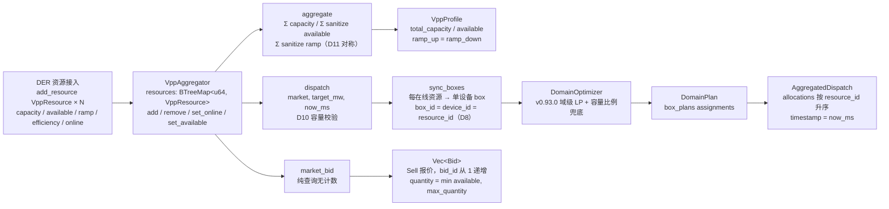

# EnerOS v0.94.0 Edge Coordinator VPP 聚合设计文档

> **版本**：v0.94.0
> **蓝图**：phase2.md §v0.94.0
> **Crate**：`eneros-coordinator`（`crates/agents/coordinator/`）

---

## 1. 版本目标

实现 Edge Coordinator VPP（Virtual Power Plant）聚合（**Phase 2 P2-D 关键版，★ Phase 2 出口标准**，在 v0.93.0 同 crate 追加第 5 个模块 `vpp_aggregator`），交付三大能力：

- **VPP 容量聚合**：聚合域内 DER 容量形成 `VppProfile`（总容量 / 聚合可用容量 / 聚合爬坡），仅统计 `online && capacity 有效` 的资源，离线资源即时排除、聚合重算（D6，蓝图 §6.5）；
- **聚合出力控制**：`dispatch(market, target_mw, now_ms)` 将聚合目标经复用的 v0.93.0 `DomainOptimizer` 分配到各资源（每在线资源映射为单设备 box，D8）；`|target| > available` → 确定性拒绝 `InsufficientCapacity`（含负 target 充电场景 abs 判定，D10，蓝图 §7.3）；solver 失败走 optimizer 内建容量比例兜底仍返回 Ok（D8）；
- **市场申报**：`market_bid(market, strategy, now_ms)` 按 resource_id 升序遍历在线资源生成 Sell 报价 `Vec<Bid>`（复用 v0.86.0 Bid 族），`quantity = min(available, max_quantity)` 保证申报量 ≤ 实际可用容量（蓝图 §8.5），纯查询无计数。

辅助能力：

- **NaN 全链路防御**（D12）：capacity 非有限或 ≤0 → 资源从聚合排除；available 非有限 → 0 且 clamp [0, capacity]；efficiency NaN→0.5 clamp [0,1]；ramp 非有限或负 → 0（D11，仅上报不参与分配）；price 非有限 → bid price 按 0+margin。复用 domain_optimizer 的 3 个 sanitize 函数（可见性放宽为 `pub(crate)`，零逻辑改动）；
- **可观测 metric**（D9）：`VppAggregator` 3 个 pub 计数器（aggregate / dispatch / reject，拒绝 = InvalidTarget + InsufficientCapacity + NoResource 三路合计）+ `VppProfile` 聚合容量可观测。

**业务价值**：v0.93.0 实现了域级 LP 优化，但域内 DER 仍需聚合成可市场交易容量才能参与电网调度/需求响应；VPP 聚合把分散 DER 打包为"一个电厂"对外提供容量申报与出力控制，是 Phase 2 多机联邦的出口能力。

**Phase 定位**：P2-D 关键版，★ Phase 2 出口标准；**下游解锁 v0.95.0 云端策略下发与 v0.96.0 Cloud Coordinator**。

**性能目标**（蓝图 §6.3/§7.2）：VPP 响应 < 30s —— **集成阶段验收**，本版本交付算法骨架 + 单元验证（`max_resources=64` 限制资源规模，目标余量充足）。

---

## 2. 前置依赖

- **v0.93.0 域级优化**（同 crate）：`DomainOptimizer` / `DomainPlan` / `OptError` 复用为 dispatch 分配引擎；`domain_optimizer.rs` 仅 4 个 sanitize 函数 `fn` → `pub(crate) fn` 可见性放宽（D12 复用，零逻辑改动）；`arbiter.rs` / `bid.rs` / `conflict.rs` 零改动（Surgical）；
- **eneros-energy-market-agent v0.86.0**：`Bid` / `BidSide` / `BidStrategy` / `MarketType` / `Period` / `MarketData` 复用（不重复定义，crate 既有依赖，**无新依赖**）；
- **eneros-solver-core v0.64.0**：`Solver` trait（经 DomainOptimizer 间接持有）；
- 蓝图 `phase2.md` v0.94.0 章节（9 节版本模板）；
- **无新第三方依赖**：SBOM 零新增。

**下游解锁**：v0.95.0 云端策略下发（VppProfile 作为聚合容量上报输入）/ v0.96.0 Cloud Coordinator（Phase 2 出口标准 VPP 聚合达成）。

---

## 3. 交付物清单

- `crates/agents/coordinator/src/vpp_aggregator.rs` — **新增**：`ResourceType` / `VppResource` / `VppProfile` / `Allocation` / `AggregatedDispatch` / `VppError` / `VppAggregator` + 内嵌测试 T1~T40
- `crates/agents/coordinator/src/domain_optimizer.rs` — **仅可见性调整**：4 个 sanitize 函数 `fn` → `pub(crate) fn`（零逻辑改动）
- `crates/agents/coordinator/src/lib.rs` — **仅追加**：`pub mod vpp_aggregator;` + 7 项重导出 + crate 文档升级 v0.92.0 + v0.93.0 + v0.94.0 三版本说明（含 D1~D12 偏差简表）
- `crates/agents/coordinator/Cargo.toml` — **仅追加** description v0.94.0（无新依赖）
- `configs/vpp_aggregator.toml` — VPP 聚合配置模板（`[vpp_aggregator]` max_resources / default_margin + `[[vpp_resource]]` 资源清单示例 ≥3，覆盖 Battery/Pv/Charger）
- `docs/agents/vpp-aggregation-design.md` — 本设计文档
- **40 个单元测试** T1~T40（src 内嵌），含 5 资源集成、资源离线重算故障注入、NaN 风暴防御
- 根目录 4 文件版本同步 0.93.0 → 0.94.0（`Cargo.toml` / `Makefile` / `ci.yml` / `gate.rs` 注释）
- **无 BREAKING**：既有 80 个 v0.92.0/v0.93.0 测试与全部下游 crate 零影响

---

## 4. 详细设计

### 4.0 VPP 聚合数据流



### 4.1 ResourceType

| 变体 | 说明 |
|------|------|
| `Battery` | 储能电池（默认变体，双向调节，VPP 主力可调资源） |
| `Pv` | 光伏（发电侧资源） |
| `Load` | 可调负荷 |
| `Charger` | 充电桩（负荷侧，支持负 target 充电场景） |

派生：`Debug, Clone, Copy, PartialEq, Eq, Default`（默认 `Battery`）。

### 4.2 VppResource（D2/D6/D7）

| 字段 | 类型 | 说明 |
|------|------|------|
| `resource_id` | `u64` | DER 唯一标识（D2：无堆字符串 + 确定性迭代，v0.87.0 D3 / v0.93.0 D2 惯例） |
| `capacity_mw` | `f32` | 额定容量（MW；sanitize 非有限或 ≤0 → 资源从聚合排除，D12） |
| `available_mw` | `f32` | 当前可用容量（MW；sanitize 非有限 → 0 且 clamp [0, capacity]，D12） |
| `ramp_rate` | `f32` | 爬坡速率（MW/min；非有限或 <0 → 按 0 计入 profile，仅上报不参与分配，D11） |
| `efficiency` | `f32` | 效率（D7：使复用的 DomainOptimizer 损耗最小目标可区分高效/低效 DER；NaN→0.5 clamp [0,1]，D12） |
| `type_` | `ResourceType` | 资源类型 |
| `online` | `bool` | 在线标记（D6：false 从聚合与分配即时排除，状态保留便于恢复） |

派生：`Debug, Clone, Copy, PartialEq`。

### 4.3 VppProfile

| 字段 | 类型 | 说明 |
|------|------|------|
| `total_capacity_mw` | `f32` | 聚合总额定容量 = Σ sanitize(capacity)（仅在线且 capacity 有效资源） |
| `available_mw` | `f32` | 聚合可用容量 = Σ sanitize(available)（clamp [0, capacity]，D12） |
| `ramp_up_mw_per_min` | `f32` | 聚合上爬坡 = Σ sanitize(ramp)（非有限/负 → 0，D11） |
| `ramp_down_mw_per_min` | `f32` | 聚合下爬坡 = ramp_up（蓝图对称实现，D11） |

派生：`Debug, Clone, Copy, PartialEq, Default`。

### 4.4 Allocation / AggregatedDispatch / VppError（D2/D4/D10）

**Allocation**（Debug + Clone + Copy + PartialEq）：

| 字段 | 类型 | 说明 |
|------|------|------|
| `resource_id` | `u64` | 分配目标资源（D2：无堆字符串；device_id 即 resource_id，D8 映射） |
| `setpoint_mw` | `f32` | 下发出力设定值（MW） |

**AggregatedDispatch**（Debug + Clone + PartialEq + Default）：

| 字段 | 类型 | 说明 |
|------|------|------|
| `target_mw` | `f32` | 聚合目标回显 |
| `allocations` | `Vec<Allocation>` | 各资源分配（按 resource_id 升序，BTreeMap 迭代序可重放） |
| `timestamp` | `u64` | 调度时间戳（= now_ms 外部注入，D4） |

**VppError**（Debug + Clone + Copy + PartialEq + Eq）：

| 变体 | 触发条件 |
|------|---------|
| `InvalidTarget` | `target_mw` 非有限（NaN / ±Inf），不产生任何 dispatch |
| `InsufficientCapacity` | `|target_mw| > profile.available_mw`（含负 target 充电场景 abs 判定，D10） |
| `NoResource` | 无合格资源（空聚合器 / 全离线 / 全 capacity 无效），DomainOptimizer 返回 EmptyDomain 映射 |

### 4.5 VppAggregator（D8/D9）

| 字段 | 类型 | 说明 |
|------|------|------|
| `resources` | `BTreeMap<u64, VppResource>` | 资源管理（D2：确定性迭代，聚合与分配顺序可重放） |
| `optimizer` | `DomainOptimizer` | 复用 v0.93.0 域级优化器（D8：dispatch 分配引擎） |
| `aggregate_count` | `u64` | 累计聚合次数（pub 可观测，D9） |
| `dispatch_count` | `u64` | 累计 dispatch 次数（pub 可观测，D9） |
| `reject_count` | `u64` | 累计拒绝次数 = InvalidTarget + InsufficientCapacity + NoResource 三路合计（pub 可观测，D9） |

字段全 pub（v0.92.0 D9 惯例：本地 metric 可查，no_std 无 log crate）。

### 4.6 aggregate 容量聚合

```
① aggregate_count += 1（私有 profile 计算为 &self 免计数，D4）
② 遍历 resources（BTreeMap 升序），仅纳入 online && sanitize_capacity(capacity_mw) > 0 的资源
③ total_capacity_mw = Σ capacity
④ available_mw       = Σ sanitize(available)（非有限 → 0，clamp [0, capacity]，D12）
⑤ ramp_up = ramp_down = Σ sanitize(ramp)（非有限或 <0 → 0，D11 对称）
⑥ 空聚合器 / 全离线 → 全零 profile
```

### 4.7 dispatch 决策流程（D8/D10）

```
① dispatch_count += 1
② target_mw 非有限 → reject_count += 1 + Err(InvalidTarget)
③ |target_mw| > aggregate().available_mw → reject_count += 1 + Err(InsufficientCapacity)（D10，abs 判定含充电场景）
④ sync_boxes：每在线资源映射为单设备 box（box_id = device_id = resource_id，
   p_min = 0、p_max = available_mw，soc = 1.0 恒通过合格过滤，D8）
⑤ optimizer.optimize(market, target, now_ms)
⑥ Ok(plan) → flat_map box_plans assignments 为 allocations（按 resource_id 升序）
⑦ Err(EmptyDomain) → reject_count += 1 + Err(NoResource)
⑧ solver 失败（Err / Infeasible / 解长度不符）→ optimizer 内建容量比例兜底仍 Ok（D8）
⑨ timestamp = now_ms，返回 Ok(AggregatedDispatch)
```

```mermaid
flowchart TD
    A[开始 dispatch<br/>market, target_mw, now_ms] --> B[dispatch_count += 1]
    B --> C{target_mw 有限?}
    C -->|否| D[reject_count += 1<br/>Err InvalidTarget<br/>不产生任何 dispatch]
    C -->|是| E{|target| ≤ aggregate<br/>available_mw?<br/>D10 abs 判定]
    E -->|否| F[reject_count += 1<br/>Err InsufficientCapacity<br/>不产生任何 dispatch]
    E -->|是| G[sync_boxes<br/>每在线资源 → 单设备 box<br/>box_id = device_id = resource_id]
    G --> H[optimizer.optimize<br/>v0.93.0 域级 LP]
    H --> I{返回结果}
    I -->|Ok plan| J[flat_map assignments → allocations<br/>按 resource_id 升序返回<br/>timestamp = now_ms]
    I -->|EmptyDomain| K[reject_count += 1<br/>Err NoResource]
    I -->|solver 失败| L[容量比例兜底<br/>v0.93.0 D10 内建<br/>仍返回 Ok]
    L --> J
```

### 4.8 market_bid 市场申报（纯查询）

- 按 resource_id 升序遍历在线资源，跳过 `sanitize(available) ≤ 0` 者；
- `quantity = min(available, strategy.max_quantity)`（`max_quantity` 非有限或 ≤0 → 按 available 全额）——**申报量 ≤ 实际可用容量**（蓝图 §8.5 申报坑点）；
- `price = sanitize_price(market.current_price as f32) + strategy.margin`（price 非有限 → 按 0+margin，D12）；
- `Bid { bid_id: 从 1 顺序递增（resource_id 升序）, market_type: MarketType::Spot, resource_id, price, quantity, side: BidSide::Sell, period: Period::Flat, timestamp: now_ms }`；
- 空聚合器 / 全离线 → 空 Vec；**无计数器更新**（纯查询语义）。

---

## 5. 技术交底

### 5.1 为何复用 DomainOptimizer 而非自研分配

VPP dispatch 的本质是"把聚合 target 按效率最优分配到各 DER"——这正是 v0.93.0 域级 LP 已解决的问题（Minimize `Σ(1−eff)·p` 损耗最小 + 容量比例兜底）。D8 通过 sync_boxes 把每在线资源映射为**单设备 box**（`box_id = device_id = resource_id`，`p_min = 0`、`p_max = available_mw`，`soc = 1.0` 恒通过合格过滤），零新增 LP 代码即获得：高效 DER 优先出力、容量约束不超发、solver 失败确定性兜底三能力。符合 §5.5 默认集成清单"防重复造轮子"原则。

### 5.2 D7：efficiency 字段的必要性

蓝图 `VppResource` 仅 5 字段（capacity/available/ramp/type），无 efficiency。但复用的 DomainOptimizer 目标函数为 Minimize `Σ(1−eff_i)·p_i`——若所有资源效率相同，LP 目标退化为常数，解任意（任何满足平衡的分配都是"最优"），优化失去意义。增加 `efficiency: f32` 使损耗最小目标可区分高效/低效 DER（例 eff 0.95 的储能与 eff 0.75 的充电桩，LP 将出力集中于高效资源），sanitize NaN→0.5 中性 clamp [0,1]，与 v0.93.0 D12 一致。

### 5.3 D10：拒绝而非部分响应的确定性理由

蓝图 §4.4"资源不足 → 拒绝或部分响应"若落地为部分响应：① 部分量依赖分配策略，同输入可能产生不同响应量，违反电力调度可复现审计要求；② 调用方无法从返回值区分"全部执行"与"部分执行"，偏差责任不清。落地为**确定性拒绝**：`|target_mw| > profile.available_mw` → `Err(InsufficientCapacity)`（含负 target 充电场景 abs 判定），与蓝图关键代码一致；拒绝计数 `reject_count` 可观测留痕，容量不足根因由上游调度层处理。

### 5.4 申报与执行偏差闭环（蓝图 §8.5）

蓝图 §8.5 坑点：market_bid 申报量若超过实际可用容量，执行侧将无法兑现形成考核偏差。本版本双保险：① 申报侧 `quantity = min(available, max_quantity)`，构造上保证申报量 ≤ 资源实际可用容量；② 执行侧 dispatch 经 DomainOptimizer 分配到各资源形成闭环，且 dispatch 前做 `|target| ≤ available` 校验（D10）。申报与执行共用同一份 `resources` 状态快照，偏差由聚合层统一管控。

### 5.5 D12：NaN 防御全链路

脏数据来源：DER 上报异常、配置录入错误。防御规则（v0.88.0 C140 / v0.93.0 D12 教训）：capacity 非有限或 ≤0 → 资源从聚合排除（不产生任何变量）；available 非有限 → 按 0 且 clamp [0, capacity]；efficiency NaN→0.5 中性 clamp [0,1]（不扭曲 LP 目标）；ramp 非有限或负 → 按 0 计入 profile（ramp 仅上报不参与分配，不阻断调度，D11）；price 非有限 → bid price 按 0+margin。复用 domain_optimizer 的 `sanitize_capacity` / `sanitize_efficiency` / `sanitize_price`（可见性放宽 `pub(crate)`，零逻辑改动），任何脏数据不传播不 panic。

---

## 6. 测试计划

40 个单元测试 T1~T40（src 内嵌）：

| 分组 | 编号 | 覆盖点 |
|------|------|--------|
| 数据结构（T1~T6） | T1~T6 | ResourceType 默认 Battery、四变体不等、Eq/Copy 语义；VppResource 构造字段回显、Clone 独立性；VppProfile Default 全零、PartialEq 逐字段一致；Allocation / AggregatedDispatch Default 与 PartialEq；VppError 三变体不等、Eq/Copy 语义 |
| 资源管理（T7~T10） | T7~T10 | add_resource 字段回显、同 id 再次 add 覆盖；remove_resource 首次 true、再删 false；set_online(false) 后 online 回显且后续 aggregate 不纳入、状态保留不删除；set_available 更新回显、不存在 id 返回 false |
| 聚合（T11~T16） | T11~T16 | 3 在线资源（cap 5/3/2，avail 4/3/2，ramp 1/0.5/0.5）→ total=10.0、available=9.0、ramp_up=ramp_down=2.0；aggregate_count 计数回显；空聚合器 → 全零 profile；全离线 → 全零 profile；capacity 非有限/≤0 资源排除聚合；available 非有限 → 0 且 clamp [0, capacity]、ramp 非有限/负 → 0 |
| dispatch 校验（T17~T20） | T17~T20 | target NaN → Err(InvalidTarget) + reject_count == 1 不产生 dispatch；target ±Inf → InvalidTarget；总 available=9.0 target=10.0 → Err(InsufficientCapacity)；target=-10.0（充电）→ InsufficientCapacity（abs 判定，D10） |
| dispatch 分配（T21~T28） | T21~T28 | 2 在线资源（r1 avail 6.0 eff 0.95 / r2 avail 4.0 eff 0.75）target=8.0，Optimal 解 [6.0, 2.0] → allocations 2 项（r1=6.0、r2=2.0 按 resource_id 升序）；target_mw == 8.0 回显；timestamp == now_ms；dispatch_count 回显；空聚合器 dispatch → Err(NoResource) + reject_count；全离线 → NoResource；负 target 充电场景合法分配；solver 解长度不符 → 兜底路径仍 Ok |
| 离线动态（T29~T32） | T29~T32 | 3 在线资源 dispatch 后 set_online(2, false) 再 dispatch → allocations 不含资源 2，target 全摊资源 1/3（蓝图 §6.5 故障注入）；set_online(2, true) 后恢复纳入；离线后 aggregate 重算（total 7.0 / available 6.0 / ramp 1.5）；set_available 动态调整 → 下次 dispatch 按新 available 分配 |
| market_bid（T33~T38） | T33~T38 | 2 在线资源（avail 4.0/6.0）strategy margin=5.0 max_quantity=3.0 price=400 → 2 个 Sell 报价 bid_id 1/2、quantity 3.0/3.0（max_quantity clamp）、price 405.0、timestamp == now_ms；market_type Spot / side Sell / period Flat 字段断言；max_quantity 非有限/≤0 → 按 available 全额；skip available ≤ 0 资源；空聚合器/全离线 → 空 Vec；纯查询无计数器更新 |
| 集成 + NaN（T39~T40） | T39~T40 | 5 资源集成（不同 type/eff/capacity）端到端 aggregate + dispatch + market_bid；NaN 风暴（capacity/available/efficiency/ramp/price 混合非有限注入）→ 返回确定结果，不传播不 panic |

性能目标（VPP 响应 < 30s，蓝图 §6.3/§7.2）标注：**集成阶段验收，本版本交付算法骨架 + 单元验证**。

**GPU 规则说明（蓝图 §6.6）**：本版本为纯标量 CPU 计算（聚合求和 / LP 分配 / 报价生成），无张量操作，**不涉及 GPU**。

---

## 7. 验收标准

- **功能**：容量聚合正确（仅在线有效资源，离线重算，D6）；dispatch 不超聚合容量（D10 abs 判定）；分配经 DomainOptimizer 高效优先 + 兜底确定性（D8）；market_bid 申报量 ≤ available（蓝图 §8.5）；NaN 全链路防御不 panic（D12）；
- **测试**：**120 个测试通过**（`cargo test -p eneros-coordinator`：新增 40 个 T1~T40 + 既有 80 个 v0.92.0/v0.93.0 测试零破坏）；下游回归零破坏：`eneros-energy-market-agent` 185 / `eneros-twin-agent` 120 / `eneros-agent-bus-dds` 63 / `eneros-agent` 33；
- **交叉编译**：`aarch64-unknown-none` 交叉编译通过（no_std + alloc）；
- **质量**：`cargo fmt --check` / `cargo clippy -D warnings` / `cargo deny check` 全过，0 warning；
- **性能**：VPP 响应 < 30s（蓝图 §6.3/§7.2）——**集成阶段验收**，本版本交付算法骨架 + 单元验证（max_resources=64 限制资源规模）；
- **文档**：本设计文档 + `configs/vpp_aggregator.toml` 配置模板；
- **出口**：★ Phase 2 出口标准 VPP 聚合达成，解锁 v0.95.0 云端策略下发 / v0.96.0 Cloud Coordinator。

---

## 8. 风险

| 风险 | 说明 | 缓解 |
|------|------|------|
| VPP 响应耗时随资源规模增长 | dispatch 复用域级 LP，变量数 = 在线资源数，耗时随规模增长 | `max_resources = 64` 配置上限（内存预算 §43.6 内）；响应 < 30s 列入**集成阶段验收**；超时治理由下游调度层处理 |
| 申报与执行偏差（蓝图 §8.5） | 申报量超实际可用容量 → 执行无法兑现形成考核偏差 | 申报侧 quantity = min(available, max_quantity) 构造上保证；执行侧 dispatch 容量校验（D10）；T33~T38 申报断言 + T21~T28 执行断言 |
| 状态一致性坑点 | resources 的 available / online 需与 DER 实际上报同步，脏数据导致聚合失真 | sanitize 全链路防御（D12）；状态由上报驱动 set_available / set_online 更新，aggregate / dispatch 只读快照；T40 NaN 风暴注入验证 |
| 兜底分配偏离最优 | solver 失败时容量比例分摊非效率最优 | `fallback_count`（optimizer 内建）可观测留痕；确定性可复现可审计（v0.93.0 D10 惯例）；solver Err 根因由集成阶段排查 |
| 内存（蓝图 §43.6） | resources BTreeMap + optimizer 内 LP 堆分配 | Agent Runtime 分区 ≤ 64MB 预算内；max_resources=64 上限；无增量分配 |

---

## 9. 多角度要求

- **安全**：dispatch **不超聚合可用容量**（D10：`|target| > available` 确定性拒绝，含负 target abs 判定，蓝图 §7.3）；离线资源不参与聚合与分配（D6）；target 非有限直接拒绝（InvalidTarget）；申报量 ≤ available（蓝图 §8.5）；NaN 不传播不 panic（D12，v0.88.0 C140 教训）；
- **可观测**：3 个 pub 计数器（`aggregate_count` / `dispatch_count` / `reject_count`，拒绝 = InvalidTarget + InsufficientCapacity + NoResource 三路合计，D9）+ `VppProfile` 聚合容量可观测；market_bid 纯查询无计数；no_std 无 log crate，metric 全部字段化本地可查；
- **确定性**：BTreeMap 迭代序确定（D2）→ 聚合、分配（allocations 按 resource_id 升序）、报价（bid_id 按 resource_id 升序从 1 递增）全部可重放；`now_ms` 外部时间注入（D4）；全链路无随机源，同输入同输出；
- **可维护**（蓝图 §9）：资源清单配置化——新增 DER 仅追加 `[[vpp_resource]]` 段（configs/vpp_aggregator.toml），运行时 add_resource 下一轮 aggregate 自动纳入，无需重启聚合器；
- **no_std**：alloc / core only——`alloc::collections::BTreeMap` / `alloc::vec::Vec` / `core::cmp`，禁止 `std::*`（蓝图 §43.1 硬性要求）；C 底层（Solver 内部 HiGHS）例外遵循 §4.3 三层分层。

---

## 10. 接口契约

pub 项签名清单（`vpp_aggregator.rs`）：

```rust
/// DER 资源类型，Debug + Clone + Copy + PartialEq + Eq + Default（默认 Battery）
pub enum ResourceType {
    Battery,
    Pv,
    Load,
    Charger,
}

/// VPP 资源（D2/D6/D7），Debug + Clone + Copy + PartialEq
pub struct VppResource {
    pub resource_id: u64,
    pub capacity_mw: f32,
    pub available_mw: f32,
    pub ramp_rate: f32,
    pub efficiency: f32,
    pub type_: ResourceType,
    pub online: bool,
}

/// VPP 聚合容量剖面（D11/D12），Debug + Clone + Copy + PartialEq + Default
pub struct VppProfile {
    pub total_capacity_mw: f32,
    pub available_mw: f32,
    pub ramp_up_mw_per_min: f32,
    pub ramp_down_mw_per_min: f32,
}

/// 单资源出力分配（D2/D8），Debug + Clone + Copy + PartialEq
pub struct Allocation {
    pub resource_id: u64,
    pub setpoint_mw: f32,
}

/// 聚合出力结果（D4），Debug + Clone + PartialEq + Default
pub struct AggregatedDispatch {
    pub target_mw: f32,
    pub allocations: Vec<Allocation>,
    pub timestamp: u64,
}

/// VPP 错误（D10），Debug + Clone + Copy + PartialEq + Eq
pub enum VppError {
    InsufficientCapacity,
    InvalidTarget,
    NoResource,
}

/// VPP 聚合器（D8/D9），字段全 pub
pub struct VppAggregator {
    pub resources: BTreeMap<u64, VppResource>,
    pub optimizer: DomainOptimizer,
    pub aggregate_count: u64,
    pub dispatch_count: u64,
    pub reject_count: u64,
}

impl VppAggregator {
    /// 构造：注入 solver（转交 DomainOptimizer），计数器全零
    pub fn new(solver: Box<dyn Solver>) -> Self;
    /// 增/覆盖资源（同 id 再次 add 覆盖）
    pub fn add_resource(&mut self, resource: VppResource);
    /// 删资源：存在 → true，不存在 → false
    pub fn remove_resource(&mut self, resource_id: u64) -> bool;
    /// 上/下线：不存在 id → false（D6：离线即时排除，状态保留便于恢复）
    pub fn set_online(&mut self, resource_id: u64, online: bool) -> bool;
    /// 可用容量动态调整（蓝图 §5.4）：不存在 id → false
    pub fn set_available(&mut self, resource_id: u64, available_mw: f32) -> bool;
    /// 容量聚合：aggregate_count += 1，仅统计在线且 capacity 有效资源
    pub fn aggregate(&mut self) -> VppProfile;
    /// 聚合出力控制（D8/D10）：dispatch_count += 1；
    /// 拒绝三路（InvalidTarget / InsufficientCapacity / NoResource）reject_count += 1；
    /// solver 失败经 DomainOptimizer 内建容量比例兜底仍返回 Ok
    pub fn dispatch(
        &mut self,
        market: &MarketData,
        target_mw: f32,
        now_ms: u64,
    ) -> Result<AggregatedDispatch, VppError>;
    /// 市场申报（纯查询无计数器）：按 resource_id 升序生成 Sell 报价，
    /// quantity = min(available, max_quantity)，price = sanitize(price) + margin
    pub fn market_bid(
        &self,
        market: &MarketData,
        strategy: &BidStrategy,
        now_ms: u64,
    ) -> Vec<Bid>;
}
```

**计数器语义**：`aggregate_count` 仅 `aggregate()` 更新；`dispatch_count` 每次 `dispatch()` 入口 +1（含拒绝路径）；`reject_count` = InvalidTarget + InsufficientCapacity + NoResource 三路合计；`market_bid` 为纯查询，**无计数器更新**。

`lib.rs` 7 项重导出（既有 pub 项与 4 个既有模块零改动；domain_optimizer.rs 仅 4 个 sanitize 函数可见性放宽 `pub(crate)`，零逻辑改动）：

```rust
pub mod vpp_aggregator;
pub use vpp_aggregator::{
    VppAggregator, VppResource, VppProfile, AggregatedDispatch, Allocation, VppError, ResourceType,
};
```

`Bid` / `BidSide` / `BidStrategy` / `MarketType` / `Period` / `MarketData` 复用 `eneros-energy-market-agent`（v0.86.0，不重复定义）。

---

## 11. 偏差声明

| 偏差 | 蓝图原文 | 本版本处理 |
|------|---------|-----------|
| **D1** | crate 路径 `crates/coordinator/src/vpp_aggregator.rs`；文档 `docs/phase2/vpp_aggregation.md` | 既有 `crates/agents/coordinator/src/vpp_aggregator.rs` + `docs/agents/vpp-aggregation-design.md`（项目 §2.3.1/§2.3.3 硬规则，v0.92.0/v0.93.0 D1 惯例；同 crate 追加模块） |
| **D2** | `resource_id: String` / `resources: Vec<VppResource>` / `Allocation.resource_id: String` | `resource_id: u64` / `BTreeMap<u64, VppResource>` / `Allocation.resource_id: u64`（无堆字符串 + 确定性迭代，v0.87.0 D3 / v0.93.0 D2 惯例；聚合与分配顺序可重放） |
| **D3** | `pub async fn dispatch(&self, target_mw)` | sync `dispatch(&mut self, market, target_mw, now_ms)`（no_std 无 async runtime；`&mut` 因 `DomainOptimizer::optimize` 需 `&mut` 且计数器更新，v0.93.0 D5 惯例） |
| **D4** | 蓝图 `AggregatedDispatch` 无 timestamp；`aggregate(&self)` | `AggregatedDispatch.timestamp = now_ms`（u64 ms 外部时间注入，全项目统一惯例）；`aggregate(&mut self)` 因 `aggregate_count` 计数器更新（内部 profile 计算为私有 `&self` 免计数） |
| **D5** | 蓝图 dispatch 调 `MarketData::default()` | `MarketData` **未派生 Default**（v0.85.0 实现核实），蓝图代码无法编译 → dispatch 增加 `market: &MarketData` 显式注入（净收益在 DomainPlan 内计算，v0.93.0 D12 链路透传） |
| **D6** | 蓝图 `VppResource` 无 online 字段，但 §6.5 要求"资源离线 → 聚合重算"且 §9 可靠性要求相同 | `VppResource` 增加 `online: bool` + `set_online(resource_id, online)` + `set_available(resource_id, available_mw)`（§5.4 容量动态变化）；离线资源从聚合与分配排除，状态保留便于恢复（v0.93.0 D8 惯例） |
| **D7** | 蓝图 `VppResource` 5 字段（capacity/available/ramp/type） | 增加 `efficiency: f32`（使复用的 DomainOptimizer 损耗最小目标可区分高效/低效 DER，否则 LP 目标退化为常数、解任意；sanitize NaN→0.5 clamp [0,1]，v0.93.0 D12 一致） |
| **D8** | `dispatch` 调 `self.optimizer.optimize(...)`；"分配失败 → 重新优化" | 复用 v0.93.0 `DomainOptimizer`：sync_boxes 将每在线资源映射为**单设备 box**（box_id=device_id=resource_id，`p_min=0`、`p_max=box capacity=available_mw`，`soc=1.0` 恒通过合格过滤）；"重新优化"落地为 optimizer 内建容量比例兜底（不迭代重试 LP，v0.93.0 D10 惯例） |
| **D9** | 蓝图 §9 可观测要求"聚合容量 metric" | `VppAggregator` 3 个 pub 计数器：`aggregate_count` / `dispatch_count` / `reject_count`（拒绝 = InvalidTarget + InsufficientCapacity + NoResource 三路合计；聚合容量经 `VppProfile` 可观测） |
| **D10** | §4.4"资源不足 → 拒绝或部分响应" | 落地为**拒绝**（确定性，blueprint 关键代码一致）：`target_mw.abs() > profile.available_mw` → `Err(VppError::InsufficientCapacity)`（含负 target 充电场景，abs 判定）；`VppError` 3 变体 `InsufficientCapacity / InvalidTarget / NoResource`（Debug/Clone/Copy/PartialEq/Eq） |
| **D11** | 蓝图 aggregate 实现 `ramp_down = ramp_up`（对称） | 保持对称实现（蓝图关键代码一致）；`ramp_rate` 非有限或 <0 → 按 0 计入 profile（ramp 仅上报不参与分配，不阻断调度） |
| **D12** | 蓝图未覆盖 NaN | NaN 防御（v0.88.0 C140 / v0.93.0 D12 教训）：capacity 非有限或 ≤0 → 资源从聚合排除；available 非有限 → 0 且 clamp [0, capacity]；efficiency NaN→0.5 clamp [0,1]；price 非有限 → bid price 按 0+margin。复用 domain_optimizer 的 `sanitize_capacity`/`sanitize_efficiency`/`sanitize_price`（可见性放宽为 `pub(crate)`，零逻辑改动） |

---

## 12. 附录

### 相关文档

- [domain-optimizer-design.md](./domain-optimizer-design.md) — v0.93.0 域级优化设计文档（同 crate 前置模块，DomainOptimizer / sanitize 复用源）
- [edge-arbiter-design.md](./edge-arbiter-design.md) — v0.92.0 域内仲裁设计文档（同 crate 前置模块，arbiter/bid/conflict）
- 源码路径：`../../crates/agents/coordinator/src/vpp_aggregator.rs`（crate 根：`crates/agents/coordinator/`）
- 配置模板：`../../configs/vpp_aggregator.toml`
- Spec：`.trae/specs/develop-v0940-vpp-aggregator/spec.md`

### 版本历史

| 版本 | 内容 | 模块 |
|------|------|------|
| v0.92.0 | Edge Coordinator 域内仲裁（P2-D 起点）：三级仲裁 + 冲突告警 + 死锁检测 | `bid` / `arbiter` / `conflict` |
| v0.93.0 | Edge Coordinator 域级优化（P2-D 第 2 版）：域级 LP + 容量比例兜底 + 净收益判定 | `domain_optimizer`（追加，第 4 模块） |
| v0.94.0 | Edge Coordinator VPP 聚合（P2-D 关键版，★ Phase 2 出口标准）：容量聚合 + 聚合出力控制 + 市场申报（本版本） | `vpp_aggregator`（追加，第 5 模块） |
