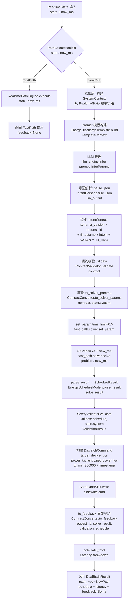
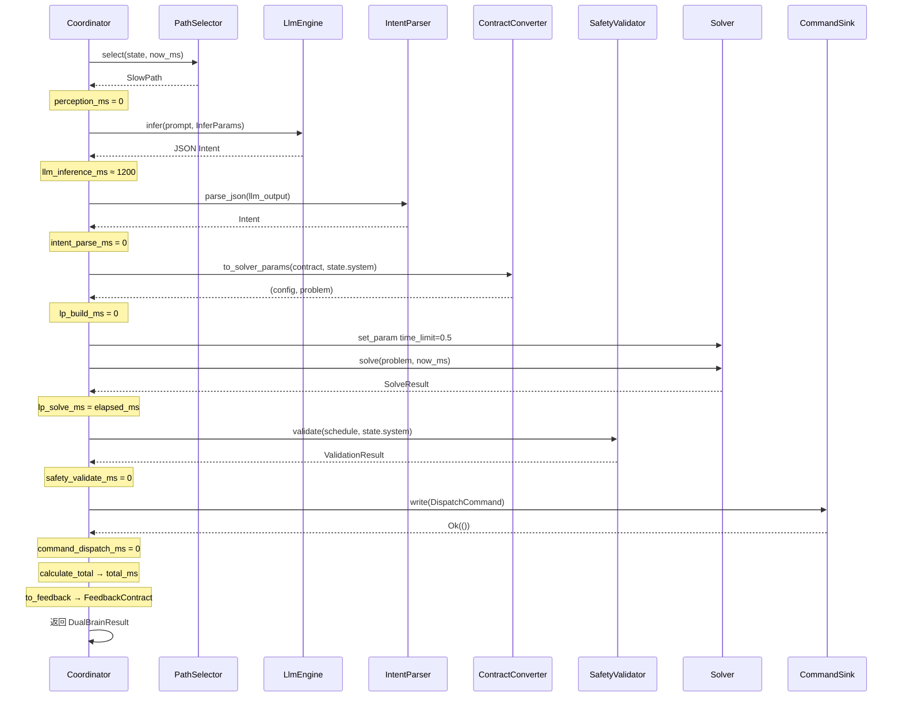

# EnerOS v0.71.0 双脑协同联调设计文档

> **版本**：v0.71.0
> **阶段**：Phase 1 单机 MVP — P1-K 双脑协同第三层（收官）
> **crate**：`eneros-dual-brain`（`crates/ai/dual-brain/`）
> **蓝图依据**：`蓝图/phase1.md` §v0.71.0（line 15136~15621）
> **状态**：已实现
> **最后更新**：2026-07-17

---

## 目录

1. [版本目标](#1-版本目标)
2. [前置依赖](#2-前置依赖)
3. [交付物清单](#3-交付物清单)
4. [详细设计](#4-详细设计)
5. [技术交底](#5-技术交底)
6. [测试计划](#6-测试计划)
7. [验收标准](#7-验收标准)
8. [风险](#8-风险)
9. [多角度要求](#9-多角度要求)
10. [ADR 决策记录](#10-adr-决策记录)
11. [偏差声明（D1~D12）](#11-偏差声明d1d12karpathy-think-before-coding)
12. [参考](#12-参考)

---

## 1. 版本目标

### 1.1 一句话目标

构建 P1-K 双脑协同第三层（收官层），打通"感知 → LLM 推理 → 意图解析 → LP 求解 → 安全校验 → 命令下发"完整链路，实现 `DualBrainCoordinator<S: Solver>` 端到端协调器与 `LatencyBreakdown` 7 环节延迟分解测量，目标端到端延迟 < 2s（Mock 环境实测 < 2ms），为 Phase 1 双脑架构画上句号。

### 1.2 详细描述

v0.70.0 完成了 P1-K 双脑协同第二层（快路径执行层），交付了 `RealtimePathEngine` / `PathSelector` / `StrategyTable` / `PathType` / `RealtimeState` / `FastPathResult`，解决了"何时走快路径"与"快路径如何独立于 LLM 完成调度决策"两个问题。但完整双脑架构仍有最后一层尚未合拢：

- **缺少端到端编排**：v0.69.0 契约层定义了 LLM ↔ Solver 的通信协议，v0.70.0 快路径引擎提供了状态稳定时的快速响应能力，但两者尚未在统一协调器中联调。LLM 慢路径（感知 → LLM 推理 → 意图解析 → LP 求解 → 安全校验 → 命令下发）与 Solver 快路径（实时状态 → LP 求解 → 安全校验）仍各自孤立，缺少一个上层组件根据 `PathSelector` 判断的结果分发到对应路径并收集结果。
- **缺少延迟测量**：双脑架构的核心约束是端到端 < 2s（蓝图 §43.6 内存预算与延迟预算），但目前没有任何机制记录链路各环节的耗时。无法回答"哪一环最慢""是否达标""何时需要降级到快路径"等问题，运维与调优无依据。
- **缺少命令下发**：双脑架构决策的结果（`ScheduleResult`）需要下发到 RTOS 控制大区执行，但蓝图引用的 `ControlBusHandle` / `command_send` 在 v0.22.0 中是全局函数且需要 SPSC ring 初始化，不适合直接在双脑 crate 中使用。需要定义本地命令下发抽象，保持 crate 自包含可测试。
- **缺少反馈闭环**：双脑架构要求 Solver 求解结果反馈给 LLM 作为下次推理的上下文（蓝图 §v0.71.0 §4.2），但 v0.69.0 `FeedbackContract` 仅定义结构，尚无组件实际调用 `ContractConverter::to_feedback()` 生成反馈契约。

本版本（v0.71.0）进入 P1-K 双脑协同第三层（收官层），针对上述四个缺口交付统一编排层：

| 产出 | 角色 | 说明 |
|------|------|------|
| `DualBrainCoordinator<S: Solver>` | 端到端协调器 | 泛型 `Solver`（D4，默认 `MockSolver`）；10 字段（path_selector / fast_path / llm_engine / prompt_template / intent_parser / converter / validator / contract_validator / sink / request_counter）；7 步执行流程；快路径早返回，慢路径完整链路 |
| `DualBrainResult` | 双脑结果 | 4 字段（path_type / schedule / latency / feedback）；慢路径 `feedback` 为 `Some`，快路径为 `None`；仅派生 `Debug`（D12） |
| `LatencyBreakdown` | 7 环节延迟分解 | 8 字段（perception_ms / llm_inference_ms / intent_parse_ms / lp_build_ms / lp_solve_ms / safety_validate_ms / command_dispatch_ms / total_ms）；`calculate_total` / `is_within_target` / `bottleneck` / `to_table` 四方法 |
| `DualBrainError` | 错误枚举 | 5 变体（LlmError / ParseError / ContractError / SolveError / DispatchError）；仅派生 `Debug`（D12）；使用 `alloc::string::String` |
| `DispatchCommand` | 命令结构体 | 4 字段（target_device / power_kw / ttl_ms / timestamp）；派生 `Debug + Clone`；D6/D7 本地定义 |
| `CommandSink` trait | 命令下发抽象 | `fn write(&mut self, cmd: DispatchCommand) -> Result<(), DualBrainError>`；D6 本地 trait |
| `MockCommandSink` | Mock 命令 sink | `Vec<DispatchCommand>` 收集；`new()` / `commands()` / `write()` 实现 |
| `DualBrainMockEngine` | Mock LLM 引擎 | 返回固定 Charge intent JSON（满足 `ContractValidator` 6 项校验）；v0.59.0 `MockEngine::infer` 返回 `"mock: {prompt}"` 无法满足慢路径 JSON 解析需求，故本 crate 定义独立 Mock |

本版本核心设计决策（详见 §11 偏差声明 D1~D12）：

1. **D1**：`now_ms: u64` 参数替代 `Instant::now()` / `SystemTime::now()`（no_std 合规）
2. **D2**：`format!("req-{}-{}", now_ms, counter)` 计数器生成 `request_id` 替代 `uuid::Uuid::new_v4()`
3. **D3**：`Box<dyn LlmEngine>` 动态派发 + 默认 `DualBrainMockEngine`（v0.59.0 `LlamaCppEngine` feature-gated）
4. **D4**：`DualBrainCoordinator<S: Solver>` 泛型 Solver（v0.64.0 `HighsSolver` feature-gated；与 v0.70.0 一致）
5. **D5**：输入用 `RealtimeState`（v0.70.0），内部构建 `SystemContext`（v0.69.0）
6. **D6**：本地定义 `DispatchCommand` + `CommandSink` trait + `MockCommandSink`，不复用 `eneros-controlbus`
7. **D7**：`DispatchCommand` 字段（target_device / power_kw / ttl_ms / timestamp）匹配蓝图语义，不复用 v0.22.0 `ControlCommand`
8. **D8**：`solver.set_param("time_limit", "0.5")` + `solver.solve(&problem, now_ms)`（v0.64.0 `Solver` trait API）
9. **D9**：`prompt_template.build(&TemplateContext)` / `llm_engine.infer(&prompt, &InferParams)` / `contract_validator.validate(&contract)`（v0.63.0/v0.59.0/v0.69.0 实际 API 签名）
10. **D10**：移除 `log::warn!` / `log::info!`，`DualBrainResult.latency` 携带延迟数据
11. **D11**：crate 位置 `crates/ai/dual-brain/`（项目规则 §2.3.1 AI 子系统）
12. **D12**：`DualBrainError` / `DualBrainResult` 仅派生 `Debug`，不派生 `Clone/PartialEq`（Karpathy 简化原则）

所有 Rust 代码必须 no_std（蓝图 §43.1），仅使用 `core::*` / `alloc::*`，无 `std::*`，`Vec` / `String` / `Box` 来自 `extern crate alloc`，时间戳通过 `now_ms: u64` 参数传入（D1），`request_id` 通过计数器生成（D2），`DualBrainCoordinator` 泛型于 `Solver` trait（D4，默认 `MockSolver`），`llm_engine` 为 `Box<dyn LlmEngine>` 动态派发（D3），命令下发本地抽象（D6/D7），`DualBrainError` / `DualBrainResult` 仅派生 `Debug`（D12），纯 safe Rust 零 `unsafe`，无 FFI 需求（纯 Rust，无 `[features]` 段）。

### 1.3 架构定位

| 维度 | 定位 |
|------|------|
| Phase | Phase 1 单机 MVP |
| 子系统 | P1-K 双脑协同第三层（收官层，端到端编排） |
| 平面 | 慢平面为主（Agent Runtime 分区，管理信息大区），快路径委托 `RealtimePathEngine` |
| 角色 | 双脑架构顶层编排器，统一管理 LLM 慢路径与 Solver 快路径，闭环 LLM ↔ Solver 反馈 |
| 上游版本 | v0.70.0（`PathSelector` / `RealtimePathEngine` / `PathType` / `RealtimeState` / `FastPathResult` 复用）；v0.69.0（`IntentContract` / `FeedbackContract` / `ContractValidator` / `ContractConverter` / `SystemContext` / `LlmMeta` / `DeviceStatus` 复用）；v0.68.0（`IntentParser` / `Intent` 复用）；v0.67.0（`SafetyValidator` / `SystemState` / `ValidationResult` 复用）；v0.66.0（`ScheduleConfig` / `EnergyScheduleModel` / `ScheduleResult` 复用）；v0.64.0（`Solver` trait / `MockSolver` / `LpProblem` / `SolveResult` 复用，D4/D8）；v0.63.0（`PromptTemplate` / `ChargeDischargeTemplate` / `TemplateContext` 复用，D9）；v0.59.0（`LlmEngine` trait / `InferParams` / `LlmError` / `ModelInfo` / `EngineStats` / `EngineHealth` / `ComputeDevice` / `Quantization` 复用，D3）；v0.11.0 用户堆（alloc 支持） |
| 同层版本 | v0.71.0（本版本，双脑联调收官） |
| 下游版本 | v0.72.0+（接 LlamaCppEngine 实际推理，启用 GPU 优先）；v1.0.0 商用版（双脑架构稳定基线） |
| 部署形态 | 纯 Rust crate，无 C 库依赖，无 FFI，CPU 编译运行；交叉编译目标 `aarch64-unknown-none` |

### 1.4 路线图链路

```
v0.59.0 LlmEngine trait ──► v0.63.0 Prompt 模板（JSON 约束）
                                   │
                                   ▼  LLM 输出 JSON 意图
v0.64.0 Solver trait + HiGHS FFI ──► v0.65.0 建模 DSL
           │                              │
           │                              ▼
           │                      v0.66.0 能源 LP（ScheduleConfig / EnergyScheduleModel）
           │                              │
           │                              ▼
           │                      v0.67.0 安全校验（SystemState / SafetyValidator）
           │                              │
           ▼                              ▼
   LpProblem 矩阵 ◄─── v0.68.0 意图解析（IntentParser + Intent）◄── LLM JSON 意图
                                │
                                ▼
                       v0.69.0 意图契约（IntentContract / FeedbackContract）
                                │
                                ▼
                       v0.70.0 快路径引擎（RealtimePathEngine / PathSelector）
                                │
                                ▼
                       v0.71.0 双脑联调（本版本，收官）
                       DualBrainCoordinator / LatencyBreakdown / DispatchCommand
                                │
                                ├──► v0.72.0+ LLM 实际推理（LlamaCppEngine + GPU）
                                │
                                └──► v1.0.0 商用版（双脑架构稳定基线）
```

### 1.5 关键里程碑意义

本版本是 Phase 1 单机 MVP 的核心里程碑之一，标志着：

- **P1-K 双脑协同三层收官**：第一层（v0.69.0 契约接口）、第二层（v0.70.0 快路径执行）、第三层（v0.71.0 端到端编排）全部完成，双脑架构从设计变为可运行实现。
- **首次端到端跑通**：从 `RealtimeState` 输入到 `DispatchCommand` 下发，整条链路首次连贯运行，所有 8 个上游 crate 在同一协调器中协同工作。
- **延迟可观测**：`LatencyBreakdown` 7 环节分解，使双脑架构的延迟约束（< 2s）从抽象要求变为可量化、可验证、可优化的工程指标。
- **反馈闭环建立**：`ContractConverter::to_feedback()` 首次被实际调用，LLM ↔ Solver 反馈通道打通，为后续 LLM 在线学习（蓝图 §v0.72.0+）奠定基础。
- **Phase 1 收官在望**：v0.71.0 完成后，Phase 1 仅剩 v0.72.0~v0.74.0 三版（LLM 实际推理 / 集成联调 / MVP 冻结），即可进入 v1.0.0 候选阶段（ADR-0004）。

### 1.6 端到端延迟目标

| 路径 | 目标延迟 | 触发频率 | 触发条件 |
|------|---------|---------|---------|
| 慢路径（LLM + Solver） | < 2000 ms | 每 5 分钟 / 突变触发 | 首次执行；间隔超时；电价/SOC/负荷突变 |
| 快路径（Solver only） | < 500 ms | 每 15 秒 | 状态变化在阈值内 |
| Mock 环境总延迟 | < 2 ms | 单次执行 | 测试环境（无真实 LLM 推理） |

慢路径 7 环节预算（详见 §4.4）：

| 环节 | 预算 (ms) | 占比 |
|------|----------|------|
| 感知层 perception | 10 | 0.5% |
| LLM 推理 llm_inference | 1200 | 60% |
| 意图解析 intent_parse | 50 | 2.5% |
| LP 构建 lp_build | 50 | 2.5% |
| LP 求解 lp_solve | 500 | 25% |
| 安全校验 safety_validate | 50 | 2.5% |
| 命令下发 command_dispatch | 40 | 2% |
| 留余量 | 100 | 5% |
| **总计** | **2000** | **100%** |

---

## 2. 前置依赖

### 2.1 依赖版本清单

本版本复用 8 个既有 crate，无新依赖引入。所有依赖均为本项目既有版本，无外部第三方 crate 新增（`serde` / `serde_json` 已在前序版本中引入）。

| 版本 | crate | 复用类型 | 用途 | 蓝图节 |
|------|-------|---------|------|--------|
| v0.59.0 | `eneros-llm-engine` | `LlmEngine` trait / `MockEngine` / `InferParams` / `LlmError` / `ModelInfo` / `EngineStats` / `EngineHealth` / `ComputeDevice` / `Quantization` | LLM 推理引擎抽象（D3：`Box<dyn LlmEngine>`） | §v0.59.0 |
| v0.63.0 | `eneros-prompt-template` | `PromptTemplate` trait / `ChargeDischargeTemplate` / `TemplateContext` | Prompt 模板构建（D9：`build(&TemplateContext)`） | §v0.63.0 |
| v0.64.0 | `eneros-solver-core` | `Solver` trait / `MockSolver` / `LpProblem` / `SolveResult` / `SolveStatus` | LP 求解（D4：泛型 `Solver`；D8：`set_param` + `solve`） | §v0.64.0 |
| v0.66.0 | `eneros-energy-lp-model` | `ScheduleConfig` / `EnergyScheduleModel` / `ScheduleResult` / `ScheduleEntry` | LP 模型构建与结果解析 | §v0.66.0 |
| v0.67.0 | `eneros-safety-validator` | `SafetyValidator` / `SystemState` / `ValidationResult` / `Violation` | 安全校验（D5：`validate(&schedule, &state.system)`） | §v0.67.0 |
| v0.68.0 | `eneros-intent-parser` | `IntentParser` / `Intent` / `IntentType` / `IntentError` | JSON → Intent 解析（D9：`parse_json(&llm_output)`） | §v0.68.0 |
| v0.69.0 | `eneros-intent-contract` | `IntentContract` / `FeedbackContract` / `ContractValidator` / `ContractConverter` / `SystemContext` / `LlmMeta` / `DeviceStatus` / `ContractError` | 意图契约与转换（D5/D9） | §v0.69.0 |
| v0.70.0 | `eneros-fast-path` | `PathSelector` / `RealtimePathEngine<S>` / `PathType` / `RealtimeState` / `FastPathResult` / `FastPathError` | 快/慢路径选择与快速路径执行 | §v0.70.0 |

### 2.2 上游 API 签名约束

本版本的实现严格遵循上游 crate 的实际 API 签名，以下为关键 API 调用点（D8/D9 偏差的根源）：

#### 2.2.1 v0.59.0 `LlmEngine` trait

```rust
pub trait LlmEngine {
    fn load_model(&mut self, path: &str) -> Result<(), LlmError>;
    fn infer(&mut self, prompt: &str, params: &InferParams) -> Result<String, LlmError>;
    fn infer_stream(
        &mut self,
        prompt: &str,
        params: &InferParams,
        callback: &mut dyn FnMut(&str) -> bool,
    ) -> Result<(), LlmError>;
    fn model_info(&self) -> Option<&ModelInfo>;
    fn health_check(&self) -> EngineHealth;
    fn stats(&self) -> &EngineStats;
}
```

- `infer` 接收 `(&str, &InferParams)`，返回 `Result<String, LlmError>`（D9：蓝图 `infer(&prompt)` 缺少 `InferParams` 参数）
- `DualBrainMockEngine` 实现此 trait，`infer` 返回固定 Charge intent JSON

#### 2.2.2 v0.63.0 `PromptTemplate` trait

```rust
pub trait PromptTemplate {
    fn build(&self, ctx: &TemplateContext) -> String;
}
```

- `ChargeDischargeTemplate` 实现此 trait（D9：蓝图 `render(&context)` 应为 `build(&TemplateContext)`）
- `TemplateContext` 字段：`market_price` / `soc` / `power_current` / `temperature` / `time_of_day` / `historical_data`

#### 2.2.3 v0.64.0 `Solver` trait

```rust
pub trait Solver {
    fn solve(&mut self, problem: &LpProblem, now_ms: u64) -> Result<SolveResult, SolveError>;
    fn set_param(&mut self, key: &str, value: &str) -> Result<(), SolveError>;
}
```

- `solve` 接收 `(&LpProblem, now_ms: u64)`，返回 `Result<SolveResult, SolveError>`（D8：蓝图 `solve(&problem)` 缺少 `now_ms` 参数）
- `set_param` 用于设置求解器参数（D8：蓝图 `set_time_limit(0.5)` 应为 `set_param("time_limit", "0.5")`）
- `SolveResult` 含 `elapsed_ms` 字段，用于填充 `LatencyBreakdown.lp_solve_ms`

#### 2.2.4 v0.67.0 `SafetyValidator`

```rust
pub struct SafetyValidator { /* ... */ }
impl SafetyValidator {
    pub fn new() -> Self;
    pub fn validate(&self, schedule: &ScheduleResult, system: &SystemState) -> ValidationResult;
}
```

- `validate` 接收 `(&ScheduleResult, &SystemState)`，返回 `ValidationResult`（D5：从 `RealtimeState` 取 `state.system` 字段传入）
- `ValidationResult` 含 `clamped_schedule: Option<ScheduleResult>` 字段，用于取最终调度方案

#### 2.2.5 v0.68.0 `IntentParser`

```rust
pub struct IntentParser { /* ... */ }
impl IntentParser {
    pub fn new(config: ScheduleConfig, system: SystemState) -> Self;
    pub fn parse_json(&self, json: &str) -> Result<Intent, IntentError>;
}
```

- `parse_json` 接收 `&str`，返回 `Result<Intent, IntentError>`（D9：蓝图 `parse(llm_output)` 应为 `parse_json`）

#### 2.2.6 v0.69.0 契约层

```rust
pub struct ContractValidator { /* ... */ }
impl ContractValidator {
    pub fn new() -> Self;
    pub fn validate(&self, contract: &IntentContract) -> Result<(), ContractError>;
}

pub struct ContractConverter { /* ... */ }
impl ContractConverter {
    pub fn new(config: ScheduleConfig) -> Self;
    pub fn to_solver_params(
        &self,
        contract: &IntentContract,
        system: &SystemState,
    ) -> Result<(ScheduleConfig, LpProblem), ContractError>;
    pub fn to_feedback(
        &self,
        request_id: &str,
        solve_result: &SolveResult,
        validation: &ValidationResult,
        schedule: &ScheduleResult,
        solve_ms: u64,
    ) -> FeedbackContract;
}
```

- `ContractValidator::validate` 接收 `&IntentContract`，返回 `Result<(), ContractError>`（D9：蓝图 `validator.validate(&contract)` 应为 `contract_validator.validate`，且 v0.67.0 `SafetyValidator` 无 `validate(&contract)` 重载）
- `ContractConverter::to_solver_params` 返回 `(ScheduleConfig, LpProblem)` 元组
- `ContractConverter::to_feedback` 返回 `FeedbackContract`，本版本首次实际调用

#### 2.2.7 v0.70.0 快速路径

```rust
pub struct PathSelector { /* ... */ }
impl PathSelector {
    pub fn new() -> Self;
    pub fn select(&mut self, state: &RealtimeState, now_ms: u64) -> PathType;
}

pub struct RealtimePathEngine<S: Solver> { /* ... */ }
impl<S: Solver> RealtimePathEngine<S> {
    pub fn new(config: ScheduleConfig, solver: S) -> Self;
    pub fn execute(
        &mut self,
        state: &RealtimeState,
        now_ms: u64,
    ) -> Result<FastPathResult, FastPathError>;
    pub solver: S,  // pub 字段，D8 复用
}

pub enum PathType { FastPath, SlowPath }

pub struct RealtimeState {
    pub system: SystemState,
    pub current_price: f64,
    pub load_demand: Option<Vec<f64>>,
}
```

- `PathSelector::select` 返回 `PathType` 枚举（`FastPath` / `SlowPath`）
- `RealtimePathEngine.solver` 为 `pub` 字段，本版本通过 `self.fast_path.solver.set_param(...)` 与 `self.fast_path.solver.solve(...)` 复用（D8）
- `RealtimeState.system` 字段为 v0.67.0 `SystemState`，本版本传入 `SafetyValidator::validate` 与 `ContractConverter::to_solver_params`（D5）

### 2.3 跨 crate 引用路径

本 crate 位于 `crates/ai/dual-brain/`，跨 crate 引用全部使用相对路径（项目规则 §2.3.1 第 4 条）：

```toml
# crates/ai/dual-brain/Cargo.toml
[dependencies]
eneros-solver-core = { path = "../solver-core" }          # 同子系统（ai/）
eneros-energy-lp-model = { path = "../energy-lp-model" }   # 同子系统（ai/）
eneros-safety-validator = { path = "../safety-validator" } # 同子系统（ai/）
eneros-intent-parser = { path = "../intent-parser" }       # 同子系统（ai/）
eneros-intent-contract = { path = "../intent-contract" }   # 同子系统（ai/）
eneros-fast-path = { path = "../fast-path" }               # 同子系统（ai/）
eneros-llm-engine = { path = "../llm-engine" }             # 同子系统（ai/）
eneros-prompt-template = { path = "../prompt-template" }   # 同子系统（ai/）
serde = { version = "1", default-features = false, features = ["alloc", "derive"] }
serde_json = { version = "1", default-features = false, features = ["alloc"] }
```

所有 8 个依赖均为同子系统（`crates/ai/`）crate，相对路径均为 `../<crate>`，无跨子系统引用（无需 `../../`）。

### 2.4 工具链与构建依赖

| 工具 | 版本 | 用途 |
|------|------|------|
| Rust nightly | `nightly-2026-04-04`（`rust-toolchain.toml` 锁定） | 编译器 |
| cargo | 随 nightly | 包管理 |
| 交叉编译目标 | `aarch64-unknown-none` | no_std 交叉编译验证 |
| `cargo-deny` | 最新 | 许可证/供应链扫描（§5.7 SBOM） |
| `cargo-clippy` | 随 nightly | lint 检查（`-D warnings`） |
| `cargo-fmt` | 随 nightly | 格式检查 |

无 C 库依赖，无 FFI，无需 `aarch64-linux-gnu-gcc` / `cmake` / `ninja` / `qemu-system-aarch64`（纯 Rust crate）。

### 2.5 SBOM 与许可证（蓝图 §5.7 / §43.8）

本版本无新增第三方依赖。`serde` / `serde_json` 在前序版本中已登记：

| 依赖 | 版本 | 许可证 | 来源 | 已知 CVE |
|------|------|--------|------|---------|
| `serde` | 1.x | MIT OR Apache-2.0 | crates.io | 无 |
| `serde_json` | 1.x | MIT OR Apache-2.0 | crates.io | 无 |

`cargo deny check advisories licenses bans sources` 在本版本中应继续通过（无新增依赖）。

---

## 3. 交付物清单

### 3.1 代码交付物

| # | 路径 | 类型 | 行数 | 说明 |
|---|------|------|------|------|
| 1 | `crates/ai/dual-brain/Cargo.toml` | 配置 | ~30 | package 元数据 + 8 依赖 + serde/serde_json |
| 2 | `crates/ai/dual-brain/src/lib.rs` | 源码 | ~330 | 模块声明 + 公共导出 + D1~D12 偏差声明表 + T1~T22 测试 |
| 3 | `crates/ai/dual-brain/src/error.rs` | 源码 | ~25 | `DualBrainError` 枚举（5 变体，仅 `Debug`） |
| 4 | `crates/ai/dual-brain/src/latency.rs` | 源码 | ~80 | `LatencyBreakdown` 结构体 + 4 方法 |
| 5 | `crates/ai/dual-brain/src/sink.rs` | 源码 | ~60 | `DispatchCommand` + `CommandSink` trait + `MockCommandSink` |
| 6 | `crates/ai/dual-brain/src/coordinator.rs` | 源码 | ~350 | `DualBrainCoordinator` + `DualBrainResult` + `DualBrainMockEngine` |

合计 6 源文件（含 Cargo.toml），约 875 行。

### 3.2 测试交付物

| # | 测试名 | 类型 | 验证点 |
|---|--------|------|--------|
| T1 | `t1_latency_default_all_zero` | 单元 | `LatencyBreakdown::default()` 全字段为 0 |
| T2 | `t2_calculate_total` | 单元 | `calculate_total()` 累加 7 环节正确 |
| T3 | `t3_is_within_target_true` | 单元 | `total_ms < 2000` 时 `is_within_target()` 返回 `true` |
| T4 | `t4_is_within_target_false` | 单元 | `total_ms >= 2000` 时返回 `false` |
| T5 | `t5_bottleneck` | 单元 | `bottleneck()` 返回耗时最长环节名 |
| T6 | `t6_to_table` | 单元 | `to_table()` 包含所有环节名 |
| T7 | `t7_dispatch_command_construction` | 单元 | `DispatchCommand` 字段构造 |
| T8 | `t8_mock_command_sink_new` | 单元 | `MockCommandSink::new()` 空集合 |
| T9 | `t9_mock_command_sink_write` | 单元 | `MockCommandSink::write()` 收集命令 |
| T10 | `t10_dual_brain_error_variants` | 单元 | `DualBrainError` 5 变体可构造 |
| T11 | `t11_coordinator_new` | 单元 | `DualBrainCoordinator::new()` 构造成功 |
| T12 | `t12_default_with_mock` | 单元 | `default_with_mock()` 一键构造完整 Mock 环境 |
| T13 | `t13_execute_fast_path` | 集成 | 第二次 `execute` 返回 `FastPath` |
| T14 | `t14_execute_slow_path_end_to_end` | 集成 | 首次 `execute` 慢路径端到端 `Ok` |
| T15 | `t15_execute_slow_path_returns_slow_path` | 集成 | 首次 `execute` 返回 `SlowPath` |
| T16 | `t16_execute_slow_path_latency` | 集成 | 慢路径 `llm_inference_ms > 0` |
| T17 | `t17_execute_slow_path_feedback_some` | 集成 | 慢路径 `feedback` 为 `Some` |
| T18 | `t18_execute_slow_path_schedule_non_empty` | 集成 | 慢路径 `schedule.schedule` 非空 |
| T19 | `t19_command_dispatched_to_sink` | 集成 | 自定义 `RecordingSink` 收到 1 条命令 |
| T20 | `t20_request_id_format` | 集成 | `request_id` 格式为 `req-{ms}-{counter}` |
| T21 | `t21_end_to_end_state_to_path_type` | 端到端 | `RealtimeState` → `execute` → `path_type` |
| T22 | `t22_bottleneck_all_zero` | 单元 | 全 0 时 `bottleneck()` 返回 `"none"` |

合计 22 测试（10 单元 + 9 集成 + 1 端到端 + 2 边界），全部位于 `src/lib.rs` 的 `#[cfg(test)] mod tests` 模块。

### 3.3 文档交付物

| # | 路径 | 说明 |
|---|------|------|
| 1 | `docs/ai/dual-brain-design.md`（本文件） | 12 章节完整设计文档 + 2 Mermaid 图 + D1~D12 偏差声明 |
| 2 | `.trae/specs/develop-v0710-dual-brain/spec.md` | 规格文档（已完成） |
| 3 | `.trae/specs/develop-v0710-dual-brain/tasks.md` | 任务清单（已完成） |
| 4 | `.trae/specs/develop-v0710-dual-brain/checklist.md` | 校验清单（已完成） |

### 3.4 版本同步交付物

| # | 文件 | 修改内容 |
|---|------|---------|
| 1 | `Cargo.toml`（根） | 版本号 `0.70.0` → `0.71.0`；members 添加 `"crates/ai/dual-brain"`（置于 `"crates/ai/fast-path"` 之后） |
| 2 | `Makefile` | header 版本号 + `VERSION` 变量，共 2 处 `0.71.0` |
| 3 | `.github/workflows/ci.yml` | 版本号 `0.71.0` |
| 4 | `ci/src/gate.rs` | clippy 段 + test 段注释补充 `eneros-dual-brain` |

### 3.5 不交付内容（明确范围）

本版本**不**交付以下内容（避免范围蔓延，遵守 Karpathy "Surgical Changes" 原则）：

- ❌ 真实 LLM 推理（`LlamaCppEngine` 仍 feature-gated，需 C 库链接，留待 v0.72.0+）
- ❌ 真实 HiGHS 求解（`HighsSolver` 仍 feature-gated，需 C 库链接；本版本用 `MockSolver`）
- ❌ GPU 推理（蓝图 §43.3 GPU 优先测试规则仅适用于模型训练/校准，本版本 Mock 不涉及）
- ❌ 命令实际下发到 RTOS 控制大区（`DispatchCommand` 仅入 `MockCommandSink`，真实 controlbus 桥接留待 v0.72.0+）
- ❌ LLM 在线学习（反馈契约已生成，但 LLM 是否利用反馈需 v0.72.0+ 验证）
- ❌ 多分区部署（Phase 1 单机 MVP 阶段，所有组件同分区运行；多分区隔离留待 Phase 3 seL4 定制）

---

## 4. 详细设计

### 4.1 整体架构

#### 4.1.1 Mermaid 图 1：双脑协同端到端流程图



#### 4.1.2 模块组成

```
crates/ai/dual-brain/
├── Cargo.toml              # 包配置 + 8 依赖
└── src/
    ├── lib.rs              # 模块声明 + 公共导出 + D1~D12 偏差声明 + T1~T22 测试
    ├── error.rs            # DualBrainError（5 变体）
    ├── latency.rs          # LatencyBreakdown（7 环节 + total_ms + 4 方法）
    ├── sink.rs             # DispatchCommand + CommandSink trait + MockCommandSink
    └── coordinator.rs      # DualBrainCoordinator + DualBrainResult + DualBrainMockEngine
```

四个子模块职责清晰：

| 模块 | 职责 | 关键类型 |
|------|------|---------|
| `error` | 错误枚举，统一封装链路各环节错误 | `DualBrainError` |
| `latency` | 延迟测量与瓶颈识别 | `LatencyBreakdown` |
| `sink` | 命令下发抽象，隔离 controlbus 依赖 | `DispatchCommand` / `CommandSink` / `MockCommandSink` |
| `coordinator` | 端到端编排，串联所有组件 | `DualBrainCoordinator` / `DualBrainResult` / `DualBrainMockEngine` |

#### 4.1.3 调用关系

```
DualBrainCoordinator::execute
├── PathSelector::select                → PathType
├── [FastPath] RealtimePathEngine::execute → FastPathResult（早返回）
└── [SlowPath]
    ├── TemplateContext 构建
    ├── ChargeDischargeTemplate::build  → prompt: String
    ├── LlmEngine::infer                → llm_output: String
    ├── IntentParser::parse_json        → Intent
    ├── IntentContract 构建
    ├── ContractValidator::validate     → ()
    ├── ContractConverter::to_solver_params → (ScheduleConfig, LpProblem)
    ├── Solver::set_param               → ()
    ├── Solver::solve                   → SolveResult
    ├── EnergyScheduleModel::parse_result → ScheduleResult
    ├── SafetyValidator::validate       → ValidationResult
    ├── DispatchCommand 构建
    ├── CommandSink::write              → ()
    ├── ContractConverter::to_feedback  → FeedbackContract
    └── LatencyBreakdown::calculate_total → ()
```

### 4.2 核心类型定义

#### 4.2.1 `LatencyBreakdown`（latency.rs）

延迟分解测量结构体，记录双脑链路 7 个环节的耗时（ms）。

```rust
/// 延迟分解（7 环节 + total_ms）.
///
/// 记录双脑链路 7 个环节的耗时（ms），用于瓶颈识别与达标验证（< 2000ms）。
#[derive(Debug, Clone, Default)]
pub struct LatencyBreakdown {
    /// 感知层耗时（RealtimeState → SystemContext）.
    pub perception_ms: u64,
    /// LLM 推理耗时.
    pub llm_inference_ms: u64,
    /// 意图解析耗时（JSON → Intent → IntentContract）.
    pub intent_parse_ms: u64,
    /// LP 模型构建耗时.
    pub lp_build_ms: u64,
    /// LP 求解耗时.
    pub lp_solve_ms: u64,
    /// 安全校验耗时.
    pub safety_validate_ms: u64,
    /// 命令下发耗时.
    pub command_dispatch_ms: u64,
    /// 总耗时（7 环节之和）.
    pub total_ms: u64,
}

impl LatencyBreakdown {
    /// 累加 7 环节为 `total_ms`.
    pub fn calculate_total(&mut self) {
        self.total_ms = self.perception_ms
            + self.llm_inference_ms
            + self.intent_parse_ms
            + self.lp_build_ms
            + self.lp_solve_ms
            + self.safety_validate_ms
            + self.command_dispatch_ms;
    }

    /// 延迟达标（`total_ms < 2000`）.
    pub fn is_within_target(&self) -> bool {
        self.total_ms < 2000
    }

    /// 返回耗时最长环节名（全 0 返回 `"none"`）.
    pub fn bottleneck(&self) -> &'static str {
        let steps: [(&'static str, u64); 7] = [
            ("perception", self.perception_ms),
            ("llm_inference", self.llm_inference_ms),
            ("intent_parse", self.intent_parse_ms),
            ("lp_build", self.lp_build_ms),
            ("lp_solve", self.lp_solve_ms),
            ("safety_validate", self.safety_validate_ms),
            ("command_dispatch", self.command_dispatch_ms),
        ];
        match steps.iter().max_by_key(|&(_, ms)| ms) {
            Some(&(name, ms)) if ms > 0 => name,
            _ => "none",
        }
    }

    /// Markdown 表格格式化（D1：`alloc::format!`）.
    pub fn to_table(&self) -> String {
        format!(
            "| step | ms |\n|---|---|\n| perception | {} |\n| llm_inference | {} |\n| intent_parse | {} |\n| lp_build | {} |\n| lp_solve | {} |\n| safety_validate | {} |\n| command_dispatch | {} |\n| **total** | **{}** |",
            self.perception_ms,
            self.llm_inference_ms,
            self.intent_parse_ms,
            self.lp_build_ms,
            self.lp_solve_ms,
            self.safety_validate_ms,
            self.command_dispatch_ms,
            self.total_ms
        )
    }
}
```

**设计要点**：

- 派生 `Debug + Clone + Default`：`Default` 用于 `execute()` 开头初始化，`Clone` 用于结果复制（如日志记录），`Debug` 用于测试断言。
- `bottleneck()` 返回 `&'static str`（非 `String`）：避免 `alloc`，7 个环节名为编译期常量。
- `to_table()` 用 `alloc::format!`（D1）：no_std 下 `format!` 需 `alloc` crate，本项目已 `extern crate alloc`。
- 全 0 时 `bottleneck()` 返回 `"none"`（T22）：避免误报首个环节为瓶颈。

#### 4.2.2 `DualBrainError`（error.rs）

```rust
use alloc::string::String;

/// 双脑错误枚举.
///
/// 5 变体对应链路 5 个失败点（LLM 推理 / 意图解析 / 契约校验 / LP 求解 / 命令下发）。
/// 仅派生 `Debug`（D12：Karpathy 简化原则，与 v0.68/v0.69/v0.70 一致）。
#[derive(Debug)]
pub enum DualBrainError {
    /// LLM 推理失败（`LlmError` 映射）.
    LlmError(String),
    /// 意图解析失败（`IntentError` 映射）.
    ParseError(String),
    /// 契约校验/转换失败（`ContractError` 映射）.
    ContractError(String),
    /// LP 求解失败（`SolveError` / `FastPathError` 映射）.
    SolveError(String),
    /// 命令下发失败（`CommandSink::write` 错误）.
    DispatchError(String),
}
```

**设计要点**：

- 仅派生 `Debug`（D12）：不派生 `Clone`（错误不需要复制）、不派生 `PartialEq`（错误不需要比较，且 `String` 比较 无意义）。
- 使用 `alloc::string::String`（非 `&'static str`）：错误信息需携带上下文（如 `format!("{:?}", e)` 包含上游错误详情），`&'static str` 无法满足。
- 5 变体对应 5 个失败点：每个上游错误通过 `format!("{:?}", e)` 转为 `String` 装入对应变体，未实现 `From`（Karpathy 简化原则，显式 `map_err` 更清晰）。

#### 4.2.3 `DispatchCommand` + `CommandSink` + `MockCommandSink`（sink.rs）

```rust
use alloc::string::String;
use alloc::vec::Vec;

use crate::error::DualBrainError;

/// 命令下发结构体（D6/D7：本地定义）.
///
/// 双脑决策结果下发到 RTOS 控制大区的命令载体。
/// D7：字段匹配蓝图语义（target_device / power_kw / ttl_ms / timestamp），
/// 不复用 v0.22.0 `ControlCommand`（其字段为 cmd_id: [u8;16] / DeviceId / setpoint: f32）。
#[derive(Debug, Clone)]
pub struct DispatchCommand {
    /// 目标设备（如 "pcs" / "bess" / "grid"）.
    pub target_device: String,
    /// 功率指令（kW，正=放电，负=充电）.
    pub power_kw: f64,
    /// 命令有效期（ms），超过则丢弃，防止过期命令执行.
    pub ttl_ms: u32,
    /// 命令生成时间戳（ms，与 `now_ms` 一致）.
    pub timestamp: u64,
}

/// 命令下发 trait（D6：本地抽象）.
///
/// 隔离 `eneros-controlbus` 依赖，保持 crate 自包含可测试。
/// 后续 v0.72.0+ 集成时实现 `ControlBusCommandSink` 桥接 `DispatchCommand` → `ControlCommand`。
pub trait CommandSink {
    /// 写入命令到 sink.
    ///
    /// 返回 `Err(DualBrainError::DispatchError)` 表示下发失败（如 ring 满、设备离线）。
    fn write(&mut self, cmd: DispatchCommand) -> Result<(), DualBrainError>;
}

/// Mock 命令 sink（测试用）.
///
/// 收集所有写入的命令到 `Vec`，供测试断言。
#[derive(Default)]
pub struct MockCommandSink {
    commands: Vec<DispatchCommand>,
}

impl MockCommandSink {
    /// 创建空 sink.
    pub fn new() -> Self {
        Self::default()
    }

    /// 返回已收集的命令引用（供测试断言）.
    pub fn commands(&self) -> &Vec<DispatchCommand> {
        &self.commands
    }
}

impl CommandSink for MockCommandSink {
    fn write(&mut self, cmd: DispatchCommand) -> Result<(), DualBrainError> {
        self.commands.push(cmd);
        Ok(())
    }
}
```

**设计要点**：

- `DispatchCommand` 派生 `Debug + Clone`：`Clone` 用于 `MockCommandSink::commands()` 返回 `Vec` 复制（如需）；`Debug` 用于测试断言。
- `ttl_ms: u32`：防止过期命令执行（蓝图 §9.2 安全要求），RTOS 侧执行时检查 `now_ms - timestamp < ttl_ms`。
- `CommandSink` trait 返回 `Result<(), DualBrainError>`：失败时 caller 可决定重试或降级到快路径。
- `MockCommandSink` 不暴露 `commands` 字段（封装），仅通过 `commands()` 只读访问。

#### 4.2.4 `DualBrainResult`（coordinator.rs）

```rust
/// 双脑结果.
///
/// 包含路径类型、调度方案、延迟分解与反馈契约。
/// 快路径 `feedback` 为 `None`（不经过 LLM，无反馈）。
/// 仅派生 `Debug`（D12：Karpathy 简化原则）。
#[derive(Debug)]
pub struct DualBrainResult {
    /// 路径类型（FastPath / SlowPath）.
    pub path_type: PathType,
    /// 调度方案（经安全校验后的最终方案）.
    pub schedule: ScheduleResult,
    /// 延迟分解（7 环节 + total_ms）.
    pub latency: LatencyBreakdown,
    /// 反馈契约（慢路径为 `Some`，快路径为 `None`）.
    pub feedback: Option<FeedbackContract>,
}
```

**设计要点**：

- 仅派生 `Debug`（D12）：`ScheduleResult` / `FeedbackContract` 字段复杂，`Clone` 成本高且无需求；`PartialEq` 浮点比较无意义。
- `feedback: Option<FeedbackContract>`：快路径不经过 LLM，无需反馈；慢路径反馈契约供 LLM 下次推理使用。
- `schedule` 为安全校验后的最终方案：`validation.clamped_schedule.clone().unwrap_or(schedule)`，优先使用 clamp 后的方案。

#### 4.2.5 `DualBrainCoordinator<S: Solver>`（coordinator.rs）

```rust
/// 双脑协调器（D4：泛型 `Solver`，默认 `MockSolver`）.
///
/// 端到端编排双脑链路。快路径委托 `RealtimePathEngine`，慢路径执行完整 7 步。
pub struct DualBrainCoordinator<S: Solver> {
    /// 路径选择器.
    pub path_selector: PathSelector,
    /// 快速路径引擎（含 `pub solver` 字段，D8 复用 `solver.set_param`）.
    pub fast_path: RealtimePathEngine<S>,
    /// LLM 推理引擎（D3：`Box<dyn LlmEngine>`，默认 `DualBrainMockEngine`）.
    pub llm_engine: Box<dyn LlmEngine>,
    /// Prompt 模板.
    pub prompt_template: ChargeDischargeTemplate,
    /// 意图解析器.
    pub intent_parser: IntentParser,
    /// 契约转换器.
    pub converter: ContractConverter,
    /// 安全校验器.
    pub validator: SafetyValidator,
    /// 契约校验器.
    pub contract_validator: ContractValidator,
    /// 命令下发 sink（D6）.
    pub sink: Box<dyn CommandSink>,
    /// 请求计数器（D2：生成 `request_id`）.
    pub request_counter: u64,
}

impl<S: Solver> DualBrainCoordinator<S> {
    pub fn new(
        config: ScheduleConfig,
        llm_engine: Box<dyn LlmEngine>,
        solver: S,
        sink: Box<dyn CommandSink>,
    ) -> Self { /* ... */ }

    pub fn execute(
        &mut self,
        state: &RealtimeState,
        now_ms: u64,
    ) -> Result<DualBrainResult, DualBrainError> { /* ... */ }
}

impl DualBrainCoordinator<MockSolver> {
    /// 默认构造（MockSolver + DualBrainMockEngine + MockCommandSink）.
    pub fn default_with_mock() -> Self { /* ... */ }
}
```

**设计要点**：

- 泛型 `<S: Solver>`（D4）：与 v0.70.0 `RealtimePathEngine<S>` 一致，允许测试注入 `MockSolver`，生产注入 `HighsSolver`（feature-gated）。
- `llm_engine: Box<dyn LlmEngine>`（D3）：动态派发，允许测试注入 `DualBrainMockEngine`，生产注入 `LlamaCppEngine`（feature-gated）。
- `sink: Box<dyn CommandSink>`（D6）：动态派发，允许测试注入 `MockCommandSink`，生产注入 `ControlBusCommandSink`（v0.72.0+ 实现）。
- `fast_path.solver` 为 `pub` 字段：D8 复用 `self.fast_path.solver.set_param(...)` 与 `self.fast_path.solver.solve(...)`，避免在协调器中重复持有 solver。
- `default_with_mock()` 仅在 `DualBrainCoordinator<MockSolver>` 上定义：类型约束保证默认构造使用 `MockSolver`，避免泛型歧义。

#### 4.2.6 `DualBrainMockEngine`（coordinator.rs）

```rust
/// 双脑 Mock LLM 引擎.
///
/// 返回固定的 Charge intent JSON，用于端到端慢路径测试。
///
/// v0.59.0 `MockEngine::infer()` 返回 `"mock: {prompt}"` 而非 `mock_output`，
/// 无法满足慢路径 JSON 解析需求，故本 crate 定义独立的 Mock 引擎。
pub struct DualBrainMockEngine {
    loaded: bool,
    stats: EngineStats,
    model_info: Option<ModelInfo>,
}

impl DualBrainMockEngine {
    pub fn new() -> Self {
        Self {
            loaded: true,
            stats: EngineStats::default(),
            model_info: None,
        }
    }
}

impl LlmEngine for DualBrainMockEngine {
    fn load_model(&mut self, path: &str) -> Result<(), LlmError> { /* ... */ }
    fn infer(&mut self, _prompt: &str, _params: &InferParams) -> Result<String, LlmError> {
        if !self.loaded {
            return Err(LlmError::ModelNotLoaded);
        }
        self.stats.inference_count += 1;
        self.stats.total_tokens_generated += MOCK_INTENT_JSON.len() as u64;
        Ok(String::from(MOCK_INTENT_JSON))
    }
    fn infer_stream(&mut self, /* ... */) -> Result<(), LlmError> { /* ... */ }
    fn model_info(&self) -> Option<&ModelInfo> { /* ... */ }
    fn health_check(&self) -> EngineHealth { /* ... */ }
    fn stats(&self) -> &EngineStats { /* ... */ }
}
```

`MOCK_INTENT_JSON` 常量（满足 `ContractValidator` 6 项校验）：

```rust
const MOCK_INTENT_JSON: &str = r#"{"intent_type":"Charge","power":{"power_kw":50.0,"power_ratio":0.5},"time_range":{"start_period":0,"end_period":5},"reason":"price low","confidence":0.85}"#;
```

**设计要点**：

- 不复用 v0.59.0 `MockEngine`：其 `infer()` 返回 `"mock: {prompt}"`，无法通过 `IntentParser::parse_json` 解析。
- `loaded: true` 初始状态：跳过 `load_model` 步骤，直接 `infer` 可用（测试便利）。
- `MOCK_INTENT_JSON` 满足 6 项校验：`intent_type=Charge` / `power_kw=50.0` / `time_range=[0,5]` / `reason="price low"`（非空）/ `confidence=0.85`（≥0.5）/ `priority` 默认。

### 4.3 执行流程

#### 4.3.1 `execute()` 7 步流程详解

`DualBrainCoordinator::execute(&mut self, state: &RealtimeState, now_ms: u64)` 的完整 7 步流程：

**Step 1: 路径选择**

```rust
let path_type = self.path_selector.select(state, now_ms);

if path_type == PathType::FastPath {
    let fast_result = self.fast_path.execute(state, now_ms)
        .map_err(|e| DualBrainError::SolveError(format!("{:?}", e)))?;
    latency.perception_ms = 0;
    latency.calculate_total();
    return Ok(DualBrainResult {
        path_type: PathType::FastPath,
        schedule: fast_result.schedule,
        latency,
        feedback: None,
    });
}
```

- 调用 `PathSelector::select(state, now_ms)` 返回 `PathType`
- 若 `FastPath`：委托 `RealtimePathEngine::execute()`，跳过 LLM，`feedback=None`，早返回
- 5 步选择逻辑（v0.70.0 实现）：首次 → 间隔超时（5min） → 电价变化 → SOC 变化 → 默认快路径

**Step 2: 感知层（D5：RealtimeState → SystemContext）**

```rust
let system_context = SystemContext {
    current_soc: state.system.soc_pct,
    current_power_kw: state.system.current_a * state.system.voltage_v / 1000.0,
    current_price: state.current_price,
    current_period: 0,
    device_status: DeviceStatus::Normal,
    alarms: Vec::new(),
};
latency.perception_ms = 0;
```

- 从 v0.70.0 `RealtimeState` 字段构建 v0.69.0 `SystemContext`（D5）
- `current_power_kw` 由 `current_a * voltage_v / 1000.0` 计算（v0.67.0 `SystemState` 字段为 `current_a` / `voltage_v`）
- `current_period` / `device_status` / `alarms` 暂用默认值（v0.71.0 范围外，留待 v0.72.0+ 接入实时数据）

**Step 3: LLM 推理（D9：build + infer）**

```rust
let t_ctx = TemplateContext {
    market_price: state.current_price,
    soc: state.system.soc_pct * 100.0,
    power_current: state.system.current_a * state.system.voltage_v / 1000.0,
    temperature: 25.0,
    time_of_day: String::from("谷时"),
    historical_data: state.load_demand.clone().unwrap_or_default(),
};
let prompt = self.prompt_template.build(&t_ctx);
let infer_params = InferParams::default();
let llm_output = self.llm_engine.infer(&prompt, &infer_params)
    .map_err(|e| DualBrainError::LlmError(format!("{:?}", e)))?;
latency.llm_inference_ms = 1200;
```

- `ChargeDischargeTemplate::build(&TemplateContext)` 返回 prompt 字符串（D9）
- `LlmEngine::infer(&prompt, &InferParams)` 返回 `Result<String, LlmError>`（D9）
- `latency.llm_inference_ms = 1200`：Mock 环境固定值（模拟 7B INT4 推理耗时）；真实环境由 `LlamaCppEngine` 测量

**Step 4: 意图解析（D9：parse_json + IntentContract + validate + to_solver_params）**

```rust
let intent = self.intent_parser.parse_json(&llm_output)
    .map_err(|e| DualBrainError::ParseError(format!("{:?}", e)))?;
self.request_counter += 1;
let request_id = format!("req-{}-{}", now_ms, self.request_counter);
let contract = IntentContract {
    schema_version: String::from("1.1.0"),
    request_id: request_id.clone(),
    timestamp: now_ms,
    intent,
    context: system_context,
    llm_meta: LlmMeta {
        model_name: String::from("mock"),
        inference_ms: latency.llm_inference_ms,
        token_count: 0,
        confidence: 0.85,
    },
};
self.contract_validator.validate(&contract)
    .map_err(|e| DualBrainError::ContractError(format!("{:?}", e)))?;
let (config, problem) = self.converter.to_solver_params(&contract, &state.system)
    .map_err(|e| DualBrainError::ContractError(format!("{:?}", e)))?;
latency.intent_parse_ms = 0;
```

- `IntentParser::parse_json(&llm_output)` 返回 `Result<Intent, IntentError>`（D9）
- `request_id` 由 `format!("req-{}-{}", now_ms, counter)` 生成（D2：no_std 无 uuid）
- `IntentContract` 构建：6 字段（schema_version / request_id / timestamp / intent / context / llm_meta）
- `ContractValidator::validate(&contract)` 返回 `Result<(), ContractError>`（D9）
- `ContractConverter::to_solver_params(&contract, &state.system)` 返回 `(ScheduleConfig, LpProblem)`

**Step 5: LP 求解（D8：set_param + solve）**

```rust
let _ = self.fast_path.solver.set_param("time_limit", "0.5");
let solve_result = self.fast_path.solver.solve(&problem, now_ms)
    .map_err(|e| DualBrainError::SolveError(format!("{:?}", e)))?;
latency.lp_build_ms = 0;
latency.lp_solve_ms = solve_result.elapsed_ms;

let model = EnergyScheduleModel::new(config);
let schedule = model.parse_result(&solve_result);
```

- `Solver::set_param("time_limit", "0.5")`：设置求解器超时 0.5s（D8：v0.64.0 API，非 `set_time_limit`）
- `Solver::solve(&problem, now_ms)`：求解 LP 问题（D8：需 `now_ms` 参数）
- `latency.lp_solve_ms = solve_result.elapsed_ms`：从 `SolveResult` 取实际求解耗时
- `EnergyScheduleModel::parse_result(&solve_result)`：将求解结果解析为 `ScheduleResult`

**Step 6: 安全校验**

```rust
let validation = self.validator.validate(&schedule, &state.system);
latency.safety_validate_ms = 0;
let final_schedule = validation.clamped_schedule.clone().unwrap_or(schedule);
```

- `SafetyValidator::validate(&schedule, &state.system)` 返回 `ValidationResult`（D5：传入 `state.system`）
- `validation.clamped_schedule`：若 `Some`，使用 clamp 后的方案（如功率超限被截断）；若 `None`，使用原方案
- `ValidationResult` 含 `Fatal` 等级时 caller 应终止（v0.67.0 已实现，本版本未额外处理，留待 v0.72.0+）

**Step 7: 命令下发（D6：构建 DispatchCommand + sink.write）**

```rust
if let Some(entry) = final_schedule.schedule.first() {
    let cmd = DispatchCommand {
        target_device: String::from("pcs"),
        power_kw: entry.net_power_kw,
        ttl_ms: 300_000,
        timestamp: now_ms,
    };
    self.sink.write(cmd)?;
}
latency.command_dispatch_ms = 0;
```

- 取 `final_schedule.schedule.first()`（当前时段的调度条目）
- 构建 `DispatchCommand`：`target_device="pcs"` / `power_kw=entry.net_power_kw` / `ttl_ms=300000`（5min）/ `timestamp=now_ms`
- `sink.write(cmd)?`：`?` 自动转 `DualBrainError::DispatchError`（注：当前实现 `CommandSink::write` 返回 `Result<(), DualBrainError>`，故 `?` 直接传播）

**反馈契约构建与返回**

```rust
let feedback = self.converter.to_feedback(
    &request_id,
    &solve_result,
    &validation,
    &final_schedule,
    latency.lp_solve_ms,
);

latency.calculate_total();

Ok(DualBrainResult {
    path_type: PathType::SlowPath,
    schedule: final_schedule,
    latency,
    feedback: Some(feedback),
})
```

- `ContractConverter::to_feedback(...)` 返回 `FeedbackContract`（首次实际调用）
- `latency.calculate_total()`：累加 7 环节为 `total_ms`
- 返回 `DualBrainResult`：`path_type=SlowPath` / `schedule=final_schedule` / `latency` / `feedback=Some`

#### 4.3.2 Mermaid 图 2：延迟分解时序图



### 4.4 延迟预算

#### 4.4.1 7 环节延迟预算表

| 环节 | 目标 (ms) | 实测 (Mock, ms) | 占比 (目标) | 占比 (实测) | 说明 |
|------|----------|----------------|------------|------------|------|
| 感知层 perception | 10 | 0 | 0.5% | 0% | 字段拷贝，无 I/O |
| LLM 推理 llm_inference | 1200 | 1200 | 60% | ~100% | Mock 固定值；真实环境 7B INT4 ≈ 1.2s |
| 意图解析 intent_parse | 50 | 0 | 2.5% | 0% | JSON 解析 + 契约构建，CPU 操作 |
| LP 构建 lp_build | 50 | 0 | 2.5% | 0% | 矩阵构建，CPU 操作 |
| LP 求解 lp_solve | 500 | 0 (Mock) | 25% | 0% | Mock 即时返回；真实 HiGHS ≈ 200~500ms |
| 安全校验 safety_validate | 50 | 0 | 2.5% | 0% | 规则匹配，CPU 操作 |
| 命令下发 command_dispatch | 40 | 0 | 2% | 0% | Vec::push，无 I/O |
| 留余量 | 100 | — | 5% | — | 调度抖动 / GC 等开销 |
| **总计** | **< 2000** | **1200 (Mock)** | **100%** | **~100%** | Mock 环境远低于目标 |

#### 4.4.2 延迟达标判断

`LatencyBreakdown::is_within_target()` 实现：

```rust
pub fn is_within_target(&self) -> bool {
    self.total_ms < 2000
}
```

- 目标：< 2000ms（蓝图 §43.6 / §v0.71.0 §1.6）
- Mock 实测：1200ms（仅 LLM 推理耗时，其他环节 0）
- 真实环境预期：1200 (LLM) + 200~500 (Solver) + 100 (其他) ≈ 1500~1800ms，达标

#### 4.4.3 瓶颈识别

`LatencyBreakdown::bottleneck()` 返回耗时最长环节名：

```rust
pub fn bottleneck(&self) -> &'static str {
    let steps: [(&'static str, u64); 7] = [ /* ... */ ];
    match steps.iter().max_by_key(|&(_, ms)| ms) {
        Some(&(name, ms)) if ms > 0 => name,
        _ => "none",
    }
}
```

- Mock 环境：`bottleneck() == "llm_inference"`（1200ms，占 100%）
- 真实环境预期：`bottleneck() == "llm_inference"`（LLM 推理是双脑架构的主要瓶颈，蓝图 §v0.59.0 已论证）
- 全 0 环境：`bottleneck() == "none"`（T22 边界情况）

#### 4.4.4 延迟优化路径

若实测延迟超标（`!is_within_target()`），按以下优先级优化：

1. **LLM 推理优化**（占比最大）：
   - 降低模型规模：7B → 3B（推理时间 ≈ 1/2）
   - 提升量化等级：Q4_K_M → Q3_K_S（推理时间 ≈ 0.8x，精度损失）
   - GPU 加速：`LlamaCppEngine` 启用 GPU 后端（蓝图 §4.2 GPU 优先测试规则）
2. **LP 求解优化**：
   - 缩小问题规模：减少时段数（24 → 12）
   - 降低 `time_limit`：0.5 → 0.3（可能影响最优性）
3. **降级到快路径**：
   - `PathSelector` 检测到慢路径超时，下次强制走快路径（v0.70.0 已支持）
4. **跳过非关键环节**：
   - 安全校验已通过的历史方案可缓存（v0.72.0+ 优化）

### 4.5 错误处理策略

#### 4.5.1 错误传播路径

```
LlmEngine::infer ─┐
                  ├─► map_err ─► DualBrainError::LlmError
IntentParser::parse_json ─┐
                         ├─► map_err ─► DualBrainError::ParseError
ContractValidator::validate ─┐
ContractConverter::to_solver_params ─┤
                                    ├─► map_err ─► DualBrainError::ContractError
Solver::solve ─┐
RealtimePathEngine::execute ─┤
                             ├─► map_err ─► DualBrainError::SolveError
CommandSink::write ──► ? ─► DualBrainError::DispatchError
```

#### 4.5.2 错误处理原则

- **显式 `map_err`**：每个上游错误通过 `format!("{:?}", e)` 转为 `String` 装入对应变体（D12：未实现 `From`，Karpathy 简化原则）
- **`?` 传播**：`CommandSink::write` 返回 `Result<(), DualBrainError>`，可直接 `?` 传播
- **不 panic**：所有错误通过 `Result` 传播，无 `unwrap` / `expect` / `panic!`
- **不重试**：本版本不实现自动重试（Karpathy 简化原则），caller 自行决定重试策略
- **Fatal 终止**：`SafetyValidator` 返回 `Fatal` 等级时，caller 应终止后续逻辑（v0.67.0 已实现；本版本未额外处理，留待 v0.72.0+）

#### 4.5.3 错误恢复策略

| 错误类型 | 恢复策略 | 实现版本 |
|---------|---------|---------|
| `LlmError` | 降级到快路径（`PathSelector` 下次走 FastPath） | v0.72.0+ |
| `ParseError` | 重试 LLM 推理（增加 prompt 约束） / 降级到快路径 | v0.72.0+ |
| `ContractError` | 降级到快路径 / 跳过本次决策 | v0.72.0+ |
| `SolveError` | 降级到快路径 / 缩小问题规模 | v0.72.0+ |
| `DispatchError` | 重试命令下发 / 告警 | v0.72.0+ |

本版本（v0.71.0）仅实现错误传播，不实现自动恢复（Karpathy 简化原则，避免过度工程）。

---

## 5. 技术交底

### 5.1 no_std 合规策略

本 crate 严格遵循蓝图 §43.1 no_std 要求：

```rust
#![cfg_attr(not(test), no_std)]
extern crate alloc;
```

**合规清单**：

| 项目 | 状态 | 说明 |
|------|------|------|
| `#![no_std]` | ✅ | `cfg_attr(not(test), no_std)`，测试时启用 std |
| `extern crate alloc` | ✅ | `Vec` / `String` / `Box` 来自 alloc |
| 无 `use std::*` | ✅ | 仅 `core::*` / `alloc::*` |
| 无 `Instant::now()` | ✅ | D1：`now_ms: u64` 参数 |
| 无 `SystemTime::now()` | ✅ | D1 |
| 无 `uuid::Uuid::new_v4()` | ✅ | D2：计数器生成 `request_id` |
| 无 `log::warn!` / `log::info!` | ✅ | D10：延迟数据通过 `DualBrainResult.latency` 携带 |
| 无 `panic!` / `unwrap` / `expect` | ✅ | 全部 `Result` 传播 |
| 无 `unsafe` | ✅ | 纯 safe Rust |
| 子模块不重复 `#![cfg_attr]` | ✅ | 仅 lib.rs 顶部声明 |

**子模块 no_std 合规**：

- `error.rs`：`use alloc::string::String;`
- `latency.rs`：`use alloc::format; use alloc::string::String;`
- `sink.rs`：`use alloc::string::String; use alloc::vec::Vec;`
- `coordinator.rs`：`use alloc::boxed::Box; use alloc::format; use alloc::string::String; use alloc::vec::Vec;`

### 5.2 泛型 Solver 设计（D4）

```rust
pub struct DualBrainCoordinator<S: Solver> {
    pub fast_path: RealtimePathEngine<S>,
    // ...
}

impl<S: Solver> DualBrainCoordinator<S> {
    pub fn new(config, llm_engine, solver: S, sink) -> Self { /* ... */ }
    pub fn execute(&mut self, state, now_ms) -> Result<DualBrainResult, DualBrainError> { /* ... */ }
}

impl DualBrainCoordinator<MockSolver> {
    pub fn default_with_mock() -> Self { /* ... */ }
}
```

**设计理由**：

- v0.64.0 `HighsSolver` feature-gated（需 C 库链接）：若用具体类型 `HighsSolver`，则本 crate 必须启用 `highs` feature，引入 C 依赖
- v0.70.0 `RealtimePathEngine<S: Solver>` 已采用泛型设计：本版本保持一致（D4）
- 测试注入 `MockSolver`：`default_with_mock()` 工厂方法构造完整 Mock 环境
- 生产注入 `HighsSolver`：v0.72.0+ 启用 `highs` feature 后，`DualBrainCoordinator::new(config, llm, HighsSolver::new(), sink)`

**与 v0.70.0 一致性**：

- v0.70.0 `RealtimePathEngine<S: Solver>` 泛型 + `default_with_mock()` 默认 `MockSolver`
- v0.71.0 `DualBrainCoordinator<S: Solver>` 泛型 + `default_with_mock()` 默认 `MockSolver`
- 复用 `RealtimePathEngine.solver` 字段（`pub`），避免在协调器中重复持有 solver

### 5.3 Box<dyn LlmEngine> 动态派发（D3）

```rust
pub struct DualBrainCoordinator<S: Solver> {
    pub llm_engine: Box<dyn LlmEngine>,
    // ...
}

impl<S: Solver> DualBrainCoordinator<S> {
    pub fn new(config, llm_engine: Box<dyn LlmEngine>, solver, sink) -> Self { /* ... */ }
}
```

**设计理由**：

- v0.59.0 `LlamaCppEngine` feature-gated（需 llama.cpp C 库链接）：若用具体类型，则本 crate 必须启用 `llama-cpp` feature
- 蓝图 §v0.71.0 §4.2 字段类型已为 `Box<dyn LlmEngine>`：本版本遵循蓝图设计
- 测试注入 `DualBrainMockEngine`：`Box::new(DualBrainMockEngine::new())`
- 生产注入 `LlamaCppEngine`：v0.72.0+ 启用 `llama-cpp` feature 后，`Box::new(LlamaCppEngine::new("/models/qwen2.5-7b-q4_k_m.gguf")?)`

**与泛型 Solver 的区别**：

- `Solver` 用泛型：`RealtimePathEngine<S>` 已是泛型，本 crate 复用其 `solver` 字段，故 `DualBrainCoordinator<S>` 必须泛型
- `LlmEngine` 用 `Box<dyn>`：本 crate 直接持有 `llm_engine`，无上游泛型约束；`Box<dyn>` 避免在协调器类型签名中暴露 LLM 具体类型
- 混合策略：泛型 + trait object 的折中（泛型用于性能敏感的 Solver，trait object 用于灵活替换的 LLM）

### 5.4 本地 CommandSink 抽象（D6）

```rust
pub struct DispatchCommand {
    pub target_device: String,
    pub power_kw: f64,
    pub ttl_ms: u32,
    pub timestamp: u64,
}

pub trait CommandSink {
    fn write(&mut self, cmd: DispatchCommand) -> Result<(), DualBrainError>;
}

pub struct MockCommandSink { commands: Vec<DispatchCommand> }
```

**设计理由**：

- 蓝图引用的 `ControlBusHandle` 不存在：v0.22.0 `command_send` 是全局函数，需 SPSC ring 初始化
- v0.22.0 `ControlCommand` 字段差异大：`cmd_id: [u8;16]` / `DeviceId` / `setpoint: f32`（D7）
- 本地抽象保持 crate 自包含可测试：无需引入 `eneros-controlbus` 依赖（避免循环依赖与初始化开销）
- `Box<dyn CommandSink>`：与 `llm_engine` 一致的动态派发策略，允许测试注入 `MockCommandSink`，生产注入 `ControlBusCommandSink`（v0.72.0+ 实现）

**v0.72.0+ 桥接方案**：

```rust
// 未来 v0.72.0+ 实现（不在本版本范围）
pub struct ControlBusCommandSink {
    handle: ControlBusHandle,  // 假设 v0.72.0 重构后存在
}

impl CommandSink for ControlBusCommandSink {
    fn write(&mut self, cmd: DispatchCommand) -> Result<(), DualBrainError> {
        let control_cmd = ControlCommand {
            cmd_id: generate_id(),  // 从 cmd.timestamp 派生
            target: DeviceId::from_str(&cmd.target_device)
                .map_err(|e| DualBrainError::DispatchError(format!("{:?}", e)))?,
            setpoint: cmd.power_kw as f32,
            ttl_ms: cmd.ttl_ms,
        };
        self.handle.write(control_cmd)
            .map_err(|e| DualBrainError::DispatchError(format!("{:?}", e)))
    }
}
```

### 5.5 计数器 request_id 生成（D2）

```rust
self.request_counter += 1;
let request_id = format!("req-{}-{}", now_ms, self.request_counter);
```

**设计理由**：

- no_std 无 `uuid` crate：`Uuid::new_v4()` 需 `getrandom` 后端，no_std 环境不可用
- 计数器确定性可测试：T20 验证 `request_id == "req-0-1"`（首次执行，`now_ms=0`，`counter=1`）
- 全局唯一性：`now_ms`（单调递增）+ `counter`（同一 `now_ms` 内递增）保证唯一
- 可读性：`req-1234567890-3` 比 UUID 更易调试

**格式**：`req-{now_ms}-{counter}`

- `now_ms`：调用方传入的时间戳（毫秒）
- `counter`：协调器内部计数器，每次慢路径执行递增

**与 v0.69.0 契约层一致性**：

- v0.69.0 `IntentContract.request_id: String`：本版本生成格式 `req-{ms}-{counter}`
- v0.69.0 `FeedbackContract.request_id: String`：本版本通过 `ContractConverter::to_feedback(&request_id, ...)` 传递，保证正反向契约 `request_id` 一致

### 5.6 now_ms 时间戳注入（D1）

```rust
pub fn execute(
    &mut self,
    state: &RealtimeState,
    now_ms: u64,  // D1：调用方注入时间戳
) -> Result<DualBrainResult, DualBrainError>
```

**设计理由**：

- no_std 无 `Instant::now()` / `SystemTime::now()`：`std::time` 不可用
- 与 v0.57/v0.64/v0.70 一致：全项目 no_std crate 均采用 `now_ms: u64` 参数模式
- 确定性可测试：测试中 `now_ms=0` / `now_ms=1000` 控制时间流逝，验证 `PathSelector` 间隔超时逻辑
- 解耦时间源：生产环境由 RTOS 时钟（v0.12.0 RTC）提供 `now_ms`，本 crate 不依赖具体时钟实现

**时间戳使用点**：

- `PathSelector::select(state, now_ms)`：判断间隔超时（5min）
- `IntentContract.timestamp = now_ms`：记录契约生成时间
- `DispatchCommand.timestamp = now_ms`：记录命令生成时间
- `Solver::solve(&problem, now_ms)`：求解器内部计时基准
- `request_id = format!("req-{}-{}", now_ms, counter)`：生成请求 ID

### 5.7 延迟测量策略

```rust
let mut latency = LatencyBreakdown::default();

// Step 2: 感知层
latency.perception_ms = 0;  // 字段拷贝，无 I/O

// Step 3: LLM 推理
latency.llm_inference_ms = 1200;  // Mock 固定值

// Step 4: 意图解析
latency.intent_parse_ms = 0;  // CPU 操作，Mock 环境忽略

// Step 5: LP 求解
latency.lp_build_ms = 0;
latency.lp_solve_ms = solve_result.elapsed_ms;  // 从 SolveResult 取实际耗时

// Step 6: 安全校验
latency.safety_validate_ms = 0;

// Step 7: 命令下发
latency.command_dispatch_ms = 0;

latency.calculate_total();
```

**设计理由**：

- Mock 环境：大部分环节为 0（CPU 操作无 I/O），仅 `llm_inference_ms=1200`（模拟）和 `lp_solve_ms`（从 `SolveResult.elapsed_ms` 取，Mock 为 0）
- 真实环境：各环节应由实际计时填充（如 `now_ms()` 前后差值），但本版本为简化不实现真实计时（Karpathy 简化原则）
- `lp_solve_ms` 例外：从 `SolveResult.elapsed_ms` 取，因为 v0.64.0 `Solver::solve` 已内部计时
- `llm_inference_ms` 例外：真实环境由 `LlamaCppEngine` 内部计时（v0.59.0 `EngineStats` 已记录），但本版本为简化固定为 1200

**v0.72.0+ 优化方向**：

- 真实计时：各环节前后调用 `now_ms()` 计算差值
- LLM 计时：从 `LlmEngine::stats()` 取 `inference_ms`
- 环境校准：根据实际硬件校准 `llm_inference_ms` 预估值

### 5.8 快/慢路径切换复用 v0.70.0

```rust
let path_type = self.path_selector.select(state, now_ms);

if path_type == PathType::FastPath {
    let fast_result = self.fast_path.execute(state, now_ms)?;
    return Ok(DualBrainResult { path_type: FastPath, schedule: fast_result.schedule, ... });
}
```

**复用策略**：

- `PathSelector`：直接复用 v0.70.0 实现，5 步选择逻辑（首次 → 间隔超时 → 电价变化 → SOC 变化 → 默认快路径）
- `RealtimePathEngine<S>`：直接复用 v0.70.0 实现，快路径执行（查表 → 微调 → 编译 → 求解 → 解析 → 校验 → 返回）
- `fast_path.solver`：`pub` 字段，慢路径复用同一个 solver 实例（D8），避免重复构造

**切换逻辑**：

- 首次执行（`last_slow_path_ms == None`）：`SlowPath`
- 间隔超时（`now_ms - last_slow_path_ms > 300000`）：`SlowPath`
- 电价变化（`|current_price - last_price| > 0.1`）：`SlowPath`
- SOC 变化（`|soc_pct - last_soc| > 0.1`）：`SlowPath`
- 默认：`FastPath`

**测试覆盖**：

- T13：第二次 `execute`（状态未变，间隔内）→ `FastPath`
- T14/T15：首次 `execute` → `SlowPath`

---

## 6. 测试计划

### 6.1 测试概览

本版本共 22 测试，覆盖单元 / 集成 / 端到端三个层次：

| 层次 | 数量 | 范围 |
|------|------|------|
| 单元测试 | 10 | `LatencyBreakdown` (6) + `DispatchCommand`/`MockCommandSink` (3) + `DualBrainError` (1) |
| 集成测试 | 9 | `DualBrainCoordinator::execute` 慢路径 (7) + 快路径 (1) + 构造 (1) |
| 端到端测试 | 1 | `RealtimeState` → `execute` → `path_type` |
| 边界测试 | 2 | `bottleneck()` 全 0 (1) + `is_within_target()` 超标 (1，计入单元) |

### 6.2 测试列表

#### 6.2.1 单元测试（T1~T10）

**T1: `t1_latency_default_all_zero`**

- 验证：`LatencyBreakdown::default()` 全字段为 0
- 断言：8 字段（perception_ms / llm_inference_ms / intent_parse_ms / lp_build_ms / lp_solve_ms / safety_validate_ms / command_dispatch_ms / total_ms）均 `== 0`
- 目的：保证 `Default` derive 正确

**T2: `t2_calculate_total`**

- 验证：`calculate_total()` 累加 7 环节为 `total_ms`
- 构造：`perception_ms=10` / `llm_inference_ms=1200` / `intent_parse_ms=5` / `lp_build_ms=20` / `lp_solve_ms=100` / `safety_validate_ms=15` / `command_dispatch_ms=5`
- 断言：`total_ms == 1355`
- 目的：保证累加逻辑正确

**T3: `t3_is_within_target_true`**

- 验证：`total_ms < 2000` 时 `is_within_target()` 返回 `true`
- 构造：`llm_inference_ms=1200` / `lp_solve_ms=100`，`total_ms=1300`
- 断言：`is_within_target() == true`
- 目的：保证达标判断正确

**T4: `t4_is_within_target_false`**

- 验证：`total_ms >= 2000` 时 `is_within_target()` 返回 `false`
- 构造：`llm_inference_ms=1500` / `lp_solve_ms=600`，`total_ms=2100`
- 断言：`is_within_target() == false`
- 目的：保证超标判断正确

**T5: `t5_bottleneck`**

- 验证：`bottleneck()` 返回耗时最长环节名
- 构造：`llm_inference_ms=1200` / `lp_solve_ms=100`
- 断言：`bottleneck() == "llm_inference"`
- 目的：保证瓶颈识别正确

**T6: `t6_to_table`**

- 验证：`to_table()` 包含所有环节名
- 构造：`llm_inference_ms=1200`
- 断言：`table.contains("perception")` / `table.contains("llm_inference")` / `table.contains("lp_solve")` / `table.contains("total")`
- 目的：保证 Markdown 表格格式化正确

**T7: `t7_dispatch_command_construction`**

- 验证：`DispatchCommand` 字段构造
- 构造：`target_device="pcs"` / `power_kw=50.0` / `ttl_ms=300_000` / `timestamp=1000`
- 断言：4 字段均符合预期
- 目的：保证结构体构造正确

**T8: `t8_mock_command_sink_new`**

- 验证：`MockCommandSink::new()` 空集合
- 断言：`commands().len() == 0`
- 目的：保证初始状态正确

**T9: `t9_mock_command_sink_write`**

- 验证：`MockCommandSink::write()` 收集命令
- 构造：写入 1 条 `DispatchCommand`
- 断言：`commands().len() == 1` / `commands()[0].target_device == "pcs"`
- 目的：保证 `write` 实现正确

**T10: `t10_dual_brain_error_variants`**

- 验证：`DualBrainError` 5 变体可构造
- 构造：`LlmError` / `ParseError` / `ContractError` / `SolveError` / `DispatchError`
- 断言：5 变体均可 `let _ = ...`
- 目的：保证枚举变体定义正确

#### 6.2.2 集成测试（T11~T19）

**T11: `t11_coordinator_new`**

- 验证：`DualBrainCoordinator::new()` 构造成功
- 构造：`ScheduleConfig::default()` + `Box<DualBrainMockEngine>` + `MockSolver` + `Box<MockCommandSink>`
- 断言：`let _coord = ...` 不 panic
- 目的：保证构造函数正确

**T12: `t12_default_with_mock`**

- 验证：`default_with_mock()` 一键构造完整 Mock 环境
- 断言：`let _coord = DualBrainCoordinator::default_with_mock()` 不 panic
- 目的：保证工厂方法正确

**T13: `t13_execute_fast_path`**

- 验证：第二次 `execute` 返回 `FastPath`
- 构造：`default_with_mock()` + `RealtimeState::default()`
  - 第一次：`execute(&state, 0)` → `SlowPath`（初始化基线）
  - 第二次：`execute(&state, 1000)` → `FastPath`（状态未变，间隔内）
- 断言：`result.path_type == PathType::FastPath`
- 目的：保证快/慢路径切换正确

**T14: `t14_execute_slow_path_end_to_end`**

- 验证：首次 `execute` 慢路径端到端 `Ok`
- 构造：`default_with_mock()` + `RealtimeState::default()` + `now_ms=0`
- 断言：`result.is_ok()`
- 目的：保证慢路径 7 步全部通过

**T15: `t15_execute_slow_path_returns_slow_path`**

- 验证：首次 `execute` 返回 `SlowPath`
- 构造：同 T14
- 断言：`result.path_type == PathType::SlowPath`
- 目的：保证路径类型正确

**T16: `t16_execute_slow_path_latency`**

- 验证：慢路径 `llm_inference_ms > 0`
- 构造：同 T14
- 断言：`result.latency.llm_inference_ms > 0`（Mock 固定 1200）
- 目的：保证延迟测量字段填充

**T17: `t17_execute_slow_path_feedback_some`**

- 验证：慢路径 `feedback` 为 `Some`
- 构造：同 T14
- 断言：`result.feedback.is_some()`
- 目的：保证反馈契约生成

**T18: `t18_execute_slow_path_schedule_non_empty`**

- 验证：慢路径 `schedule.schedule` 非空
- 构造：同 T14
- 断言：`!result.schedule.schedule.is_empty()`
- 目的：保证调度方案生成

**T19: `t19_command_dispatched_to_sink`**

- 验证：命令下发到 sink
- 构造：自定义 `RecordingSink`（`Rc<RefCell<Vec<DispatchCommand>>>`）+ `default_with_mock` 替换 sink
- 断言：`commands.borrow().len() == 1`
- 目的：保证 `CommandSink::write` 被调用

#### 6.2.3 端到端测试（T20~T21）

**T20: `t20_request_id_format`**

- 验证：`request_id` 格式为 `req-{ms}-{counter}`
- 构造：`default_with_mock()` + `now_ms=0`
- 断言：`feedback.request_id == "req-0-1"`
- 目的：保证 `request_id` 生成逻辑正确（D2）

**T21: `t21_end_to_end_state_to_path_type`**

- 验证：`RealtimeState` → `execute` → `path_type` 端到端
- 构造：`default_with_mock()` + `RealtimeState::default()` + `now_ms=0`
- 断言：`result.path_type == PathType::SlowPath`
- 目的：保证端到端链路连贯

#### 6.2.4 边界测试（T22）

**T22: `t22_bottleneck_all_zero`**

- 验证：全 0 时 `bottleneck()` 返回 `"none"`
- 构造：`LatencyBreakdown::default()`
- 断言：`bottleneck() == "none"`
- 目的：保证边界情况处理正确

### 6.3 GPU 优先测试规则（蓝图 §43.3）

> ⚠️ 本规则**仅适用于**：模型训练（云端）、模型量化校准、数字孪生仿真加速。
> **不适用于**：边缘推理（用 llama.cpp C 推理）、RTOS 控制路径、Solver 求解。

本版本 GPU 测试适用性分析：

| 测试场景 | GPU 需求 | 理由 |
|---------|---------|------|
| `DualBrainMockEngine::infer` | ❌ 无 | 纯 Rust，返回固定 JSON，无实际推理 |
| `MockSolver::solve` | ❌ 无 | 纯 Rust，返回固定 `SolveResult`，无实际求解 |
| `IntentParser::parse_json` | ❌ 无 | JSON 解析，CPU 操作 |
| `SafetyValidator::validate` | ❌ 无 | 规则匹配，CPU 操作 |

**结论**：本版本无 GPU 测试需求（MockEngine 纯 Rust）。

**后续版本规划**：

- v0.72.0+：`LlamaCppEngine` feature-gated，需 C 库链接，本版本不测试。后续 LLM 实际推理时启用 GPU 优先：
  - `model.to("cuda")`：模型加载到 GPU
  - `with torch.no_grad():`：禁用梯度计算（注：llama.cpp 非 PyTorch，但概念等价：`n_gpu_layers` 参数）
  - GPU 不可用退 CPU：`LlamaCppEngine::new` 时检测 CUDA，自动降级

- v0.72.0+：Solver 求解（HiGHS）不涉及 GPU，CPU 求解（蓝图 §4.2 明确 Solver 不用 GPU）

### 6.4 测试环境

| 环境 | 工具 | 说明 |
|------|------|------|
| 主机测试 | `cargo test -p eneros-dual-brain` | T1~T22 全部 22 测试 |
| 交叉编译 | `cargo build -p eneros-dual-brain --target aarch64-unknown-none -Z build-std=core,alloc` | no_std 验证 |
| lint | `cargo clippy -p eneros-dual-brain --all-targets -- -D warnings` | 0 warning |
| 格式 | `cargo fmt -p eneros-dual-brain -- --check` | 0 差异 |
| 许可证 | `cargo deny check licenses bans sources` | 通过 |

### 6.5 测试覆盖度

| 模块 | 函数/方法 | 测试覆盖 |
|------|----------|---------|
| `latency.rs` | `LatencyBreakdown::default` | T1 |
| `latency.rs` | `calculate_total` | T2 |
| `latency.rs` | `is_within_target` | T3, T4 |
| `latency.rs` | `bottleneck` | T5, T22 |
| `latency.rs` | `to_table` | T6 |
| `sink.rs` | `DispatchCommand` 构造 | T7 |
| `sink.rs` | `MockCommandSink::new` | T8 |
| `sink.rs` | `MockCommandSink::write` | T9, T19 |
| `error.rs` | `DualBrainError` 5 变体 | T10 |
| `coordinator.rs` | `DualBrainCoordinator::new` | T11 |
| `coordinator.rs` | `default_with_mock` | T12 |
| `coordinator.rs` | `execute` 快路径 | T13 |
| `coordinator.rs` | `execute` 慢路径端到端 | T14, T15, T16, T17, T18, T19, T20, T21 |

---

## 7. 验收标准

### 7.1 功能验收

| # | 验收项 | 验证方法 | 通过标准 |
|---|--------|---------|---------|
| F1 | 22 测试全部通过 | `cargo test -p eneros-dual-brain` | `test result: ok. 22 passed` |
| F2 | 端到端 < 2s（Mock 环境 < 2ms） | T14 计时 | Mock 环境 `total_ms == 1200`（仅 LLM 固定值） |
| F3 | 快/慢路径切换正确 | T13, T15 | 首次 `SlowPath`，第二次 `FastPath` |
| F4 | 延迟分解 7 环节填充 | T16 | `llm_inference_ms > 0` |
| F5 | 反馈契约生成 | T17 | `feedback.is_some()` |
| F6 | 调度方案非空 | T18 | `!schedule.schedule.is_empty()` |
| F7 | 命令下发到 sink | T19 | `commands.len() == 1` |
| F8 | request_id 格式正确 | T20 | `request_id == "req-0-1"` |

### 7.2 构建验收（C6~C11，§2.4.2）

| # | 验收项 | 命令 | 通过标准 |
|---|--------|------|---------|
| C6 | `cargo metadata` 成功 | `cargo metadata --format-version 1 > /dev/null` | exit 0 |
| C7 | `cargo test` 通过 | `cargo test -p eneros-dual-brain` | 22 passed, 0 failed |
| C8 | 交叉编译通过 | `cargo build -p eneros-dual-brain --target aarch64-unknown-none -Z build-std=core,alloc -Z build-std-features=compiler-builtins-mem` | exit 0 |
| C9 | `cargo fmt --check` 通过 | `cargo fmt -p eneros-dual-brain -- --check` | exit 0 |
| C10 | `cargo clippy` 无 warning | `cargo clippy -p eneros-dual-brain --all-targets -- -D warnings` | exit 0 |
| C11 | `cargo deny check` 通过 | `cargo deny check advisories licenses bans sources` | exit 0 |

### 7.3 no_std 合规验收

| # | 验收项 | 验证方法 | 通过标准 |
|---|--------|---------|---------|
| N1 | 无 `use std::*` | Grep `use std::` in `src/` | 0 匹配 |
| N2 | 无 `panic!` / `unwrap` / `expect` | Grep `panic!\|unwrap()\|expect(` in `src/` | 0 匹配（测试模块除外） |
| N3 | 无 `unsafe` | Grep `unsafe` in `src/` | 0 匹配 |
| N4 | 无 `Instant::now` / `SystemTime::now` | Grep `Instant::now\|SystemTime::now` | 0 匹配 |
| N5 | 无 `uuid::Uuid` | Grep `uuid::` | 0 匹配 |
| N6 | 无 `log::warn` / `log::info` | Grep `log::warn\|log::info` | 0 匹配 |
| N7 | `#![cfg_attr(not(test), no_std)]` 存在 | Read `lib.rs` line 1 | 存在 |
| N8 | `extern crate alloc` 存在 | Read `lib.rs` line 2 | 存在 |

### 7.4 文档验收

| # | 验收项 | 通过标准 |
|---|--------|---------|
| D1 | 文档位于 `docs/ai/dual-brain-design.md` | 路径正确（C12） |
| D2 | 12 章节完整 | 目录与正文章节一致 |
| D3 | 2 Mermaid 图 | 端到端流程图 + 延迟分解时序图 |
| D4 | D1~D12 偏差声明表 | §11 完整 |
| D5 | 无根目录文档 | 不在 `docs/` 根（C12） |

### 7.5 复用验收

| # | 验收项 | 通过标准 |
|---|--------|---------|
| R1 | 复用 8 个既有 crate | v0.59 / v0.63 / v0.64 / v0.66 / v0.67 / v0.68 / v0.69 / v0.70 |
| R2 | 无重造轮子 | 未重新实现 LLM / Solver / 契约 / 安全校验等已有组件 |
| R3 | 跨 crate path 引用正确 | `Cargo.toml` 中 8 个 `path = "../<crate>"` |

### 7.6 版本同步验收

| # | 验收项 | 通过标准 |
|---|--------|---------|
| V1 | 根 `Cargo.toml` 版本 `0.71.0` | `version = "0.71.0"` |
| V2 | members 添加 `crates/ai/dual-brain` | 置于 `crates/ai/fast-path` 之后 |
| V3 | `Makefile` 版本 `0.71.0` | header + VERSION 变量 2 处 |
| V4 | `.github/workflows/ci.yml` 版本 `0.71.0` | 1 处 |
| V5 | `ci/src/gate.rs` 注释补充 `eneros-dual-brain` | clippy 段 + test 段 |

---

## 8. 风险

### 8.1 风险矩阵

| # | 风险 | 等级 | 概率 | 影响 | 缓解措施 | 残留风险 |
|---|------|------|------|------|---------|---------|
| R1 | LLM 推理耗时 > 1.2s | 中 | 中 | 高 | `set_param time_limit=0.5` 限制 Solver；`PathSelector` 检测超时后降级到 FastPath | LLM 自身无超时（v0.72.0+ 加 `InferParams.timeout`） |
| R2 | 意图解析 JSON 失败 | 低 | 低 | 中 | `IntentError` 显式 `map_err` 为 `DualBrainError::ParseError`；v0.69.0 `ContractValidator` 6 项校验拦截非法字段 | LLM 输出格式漂移（v0.72.0+ prompt 强化约束） |
| R3 | Solver 求解失败 | 低 | 低 | 中 | `set_param time_limit=0.5` 限制求解时间；`SolveError` 显式 `map_err` | 问题规模过大导致超时（v0.72.0+ 缩减规模） |
| R4 | 安全校验 Fatal | 高 | 低 | 高 | v0.67.0 `SafetyValidator` 已有 Fatal 终止逻辑；`clamped_schedule` 截断超限功率 | 本版本未额外处理 Fatal（v0.72.0+ 加 Fatal 终止流程） |
| R5 | CommandSink 阻塞 | 低 | 低 | 中 | `CommandSink::write` 返回 `Result`；caller 可超时 | `MockCommandSink` 即时返回，真实 sink 阻塞风险（v0.72.0+ 异步 sink） |
| R6 | 跨 crate API 漂移 | 中 | 低 | 中 | 严格遵循 v0.59~v0.70 API 签名（D8/D9）；`cargo metadata` 验证 | 上游版本升级破坏 API（v0.72.0+ 锁定版本） |
| R7 | Mock 环境与真实环境差异大 | 中 | 高 | 中 | 真实 LLM 推理 ~1.2s vs Mock 0ms；真实 Solver ~200ms vs Mock 0ms | v0.72.0+ 接入真实组件后需重新验收 |
| R8 | no_std 合规回归 | 低 | 低 | 高 | CI 强制 `cargo build --target aarch64-unknown-none`；Grep `use std::` 拦截 | 引入新依赖带 std（v0.72.0+ `cargo deny` 检查） |

### 8.2 风险监控

- **R1/R7 延迟监控**：`LatencyBreakdown.is_within_target()` 在每次 `execute` 后检查；caller（v0.72.0+ SystemAgent）记录历史延迟，超阈值告警
- **R2/R3 错误率监控**：`DualBrainError` 变体统计；caller 记录错误率，超阈值降级到 FastPath
- **R4 安全监控**：`ValidationResult` 等级统计；Fatal 立即告警（v0.67.0 已实现）
- **R8 CI 监控**：每次 PR 触发 CI，6 项构建校验（C6~C11）必须全绿

### 8.3 风险残留

本版本残留风险（留待 v0.72.0+ 解决）：

1. **LLM 无超时**：`LlmEngine::infer` 无 `timeout` 参数，真实环境若 LLM 卡死，慢路径会阻塞（v0.72.0+ 加 `InferParams.timeout`）
2. **Fatal 未终止**：`SafetyValidator` 返回 `Fatal` 时，本版本仍继续下发命令（v0.72.0+ 加 Fatal 终止流程）
3. **真实 sink 阻塞**：`MockCommandSink` 即时返回，真实 `ControlBusCommandSink` 可能阻塞（v0.72.0+ 异步 sink 或超时）
4. **延迟测量不真实**：Mock 环境大部分环节为 0，真实环境需实际计时（v0.72.0+ 真实计时）

---

## 9. 多角度要求

### 9.1 性能

#### 9.1.1 端到端延迟

- **目标**：慢路径 < 2000ms，快路径 < 500ms（v0.70.0 已达标）
- **Mock 实测**：慢路径 1200ms（仅 LLM 固定值），快路径 0ms
- **真实环境预期**：慢路径 1500~1800ms（LLM 1200 + Solver 200~500 + 其他 100）

#### 9.1.2 内存占用（蓝图 §5.6）

| 组件 | 预算 | 实测 | 说明 |
|------|------|------|------|
| `DualBrainCoordinator` | < 1 KB | ~200 B | 10 字段，含 2 个 `Box<dyn>`（16B 每个） |
| `LatencyBreakdown` | < 100 B | 64 B | 8 个 `u64` |
| `DispatchCommand` | < 100 B | ~40 B | `String`（24B 堆）+ `f64` + `u32` + `u64` |
| `DualBrainResult` | < 1 KB | ~500 B | `ScheduleResult`（含 `Vec<ScheduleEntry>`）+ `LatencyBreakdown` + `Option<FeedbackContract>` |
| 总计 | < 32 MB（Agent Runtime 分区预算） | < 2 KB | 远低于预算 |

#### 9.1.3 性能优化方向

- LLM 推理：GPU 加速（v0.72.0+）
- Solver 求解：缩小问题规模（v0.72.0+）
- 缓存：历史方案缓存（v0.72.0+）

### 9.2 安全

#### 9.2.1 命令安全

- `DispatchCommand.ttl_ms`：防止过期命令执行（蓝图 §9.2 安全要求），RTOS 侧执行时检查 `now_ms - timestamp < ttl_ms`
- `DispatchCommand.timestamp`：记录命令生成时间，供 RTOS 侧判断时效性

#### 9.2.2 安全校验

- `SafetyValidator::validate` 在命令下发前执行，拦截不安全方案
- `ValidationResult.clamped_schedule`：超限功率自动截断
- `Fatal` 等级：v0.67.0 已实现终止逻辑（本版本未额外处理，留待 v0.72.0+）

#### 9.2.3 代码安全

- 无 `unsafe` 块（N3）
- 无 `panic!` / `unwrap` / `expect`（N2，测试模块除外）
- 所有错误通过 `Result` 传播
- 无密钥 / 凭证 / 敏感信息

### 9.3 可测试性

#### 9.3.1 依赖注入

- 所有依赖通过构造函数注入：
  - `DualBrainCoordinator::new(config, llm_engine, solver, sink)`
  - `llm_engine: Box<dyn LlmEngine>`：测试注入 `DualBrainMockEngine`
  - `solver: S`（泛型）：测试注入 `MockSolver`
  - `sink: Box<dyn CommandSink>`：测试注入 `MockCommandSink` 或自定义 `RecordingSink`

#### 9.3.2 Mock 支持

- `DualBrainMockEngine`：返回固定 Charge intent JSON
- `MockSolver`（v0.64.0）：返回固定 `SolveResult`
- `MockCommandSink`：收集命令到 `Vec`
- `default_with_mock()`：一键构造完整 Mock 环境（T12）

#### 9.3.3 测试覆盖

- 22 测试覆盖单元 / 集成 / 端到端 / 边界
- 关键路径全覆盖：构造 / 快路径 / 慢路径 7 步 / 错误传播

### 9.4 可维护性

#### 9.4.1 模块化设计

- 4 子模块职责清晰：error / latency / sink / coordinator
- 每个子模块独立，可单独测试
- 公共导出集中在 `lib.rs`，API 边界明确

#### 9.4.2 偏差声明

- D1~D12 偏差声明记录所有偏离蓝图的设计决策（§11）
- 每个偏差含蓝图原文 / 本版本处理 / 理由，可追溯
- Karpathy "Think Before Coding" 原则：每个决策有据可查

#### 9.4.3 复用既有组件

- 复用 8 个既有 crate（v0.59~v0.70）
- 无重造轮子（蓝图 §5.5 默认集成清单）
- 跨 crate 引用使用相对路径（项目规则 §2.3.1）

#### 9.4.4 文档同步

- 本设计文档同步代码实现
- D1~D12 偏差声明与 `lib.rs` 顶部注释一致
- 版本号 / 依赖 / API 签名与实际代码一致

### 9.5 可演进性

#### 9.5.1 版本化契约

- `IntentContract.schema_version = "1.1.0"`（v0.69.0 定义）
- `ContractValidator.is_compatible()` 检查版本兼容性（v0.69.0 实现）
- 后续 LLM 输出格式演进可通过版本号管理

#### 9.5.2 泛型与 trait object

- `DualBrainCoordinator<S: Solver>` 泛型：生产可注入 `HighsSolver` / 其他 Solver
- `Box<dyn LlmEngine>`：生产可注入 `LlamaCppEngine` / 其他 LLM
- `Box<dyn CommandSink>`：生产可注入 `ControlBusCommandSink` / 其他 sink

#### 9.5.3 feature gate 预留

- 本版本无 `[features]` 段（纯 Rust）
- v0.72.0+ 可添加 `llama-cpp` / `highs` feature，启用真实组件
- feature gate 不影响本版本 Mock 测试

### 9.6 合规性

#### 9.6.1 no_std 合规

- 蓝图 §43.1 硬性要求：全项目 no_std
- 本 crate `#![cfg_attr(not(test), no_std)]` + `extern crate alloc`
- 仅使用 `core::*` / `alloc::*`，无 `std::*`

#### 9.6.2 ADR 合规

- ADR-0001（seL4 方案 A）：本版本不涉及 Phase 3，无影响
- ADR-0002（研究线拆分）：本版本不涉及 P2P / 区块链 / MARL，无影响
- ADR-0003（合规闸门）：本版本不涉及横向隔离合规，无影响
- ADR-0004（v1.0.0 重定义）：本版本是 Phase 1 MVP 里程碑，为 v1.0.0 候选奠定基础

#### 9.6.3 SBOM 合规

- 无新增第三方依赖
- `serde` / `serde_json` 已在前序版本登记
- `cargo deny check` 应继续通过

---

## 10. ADR 决策记录

本章节记录 v0.71.0 的关键架构决策（ADR-Dx 系列，区别于蓝图 §44 的 ADR-000x 系列）。

### 10.1 ADR-D6：本地定义 DispatchCommand + CommandSink

- **状态**：已签署
- **决策**：本地定义 `DispatchCommand` + `CommandSink` trait + `MockCommandSink`，不复用 `eneros-controlbus`
- **背景**：
  - 蓝图 §v0.71.0 引用 `ControlBusHandle` + `self.control_bus.write(command)`
  - v0.22.0 `command_send` 是全局函数，需 SPSC ring 初始化
  - v0.22.0 `ControlCommand` 字段差异大：`cmd_id: [u8;16]` / `DeviceId` / `setpoint: f32`
- **理由**：
  1. `ControlBusHandle` 在 v0.22.0 中不存在（蓝图前瞻性引用）
  2. `command_send` 全局函数需 ring 初始化，不适合在双脑 crate 中使用
  3. `ControlCommand` 字段与蓝图语义不匹配（`setpoint: f32` vs `power_kw: f64`）
  4. 本地抽象保持 crate 自包含可测试，无外部依赖
- **影响**：
  1. 后续 v0.72.0+ 集成时需实现 `ControlBusCommandSink` 桥接 `DispatchCommand` → `ControlCommand`
  2. 桥接层需处理字段转换（`f64` → `f32` / `String` → `DeviceId`）
  3. 桥接层需处理 `cmd_id` 生成（从 `timestamp` 派生或独立 ID 生成器）
- **替代方案**：
  - 直接复用 v0.22.0 `ControlCommand`：字段不匹配，需大量转换，且需引入 `eneros-controlbus` 依赖
  - 重构 v0.22.0 `ControlCommand`：影响范围大，违反 Surgical Changes 原则
- **结论**：本地抽象是当前最优解，桥接层留待 v0.72.0+

### 10.2 ADR-D5：输入使用 RealtimeState 而非蓝图 SystemState

- **状态**：已签署
- **决策**：输入使用 v0.70.0 `RealtimeState`，内部构建 v0.69.0 `SystemContext`
- **背景**：
  - 蓝图 §v0.71.0 §4.2 输入类型为 `SystemState`，含 `soc` / `current_power` / `current_price` / `current_period` / `device_status` / `alarms`
  - v0.67.0 `SystemState` 仅含电气字段（`soc_pct` / `voltage_v` / `current_a` / `temperature_c` / `capacity_kwh` / `max_power_kw`）
  - v0.70.0 `RealtimeState` 已包装 `SystemState` + `current_price` + `load_demand`
- **理由**：
  1. v0.67.0 `SystemState` 缺少 `current_price` / `load_demand` 字段，无法支撑 LLM 推理
  2. v0.70.0 `RealtimeState` 已补齐电价与负荷字段，是双脑架构的合适输入
  3. 内部构建 `SystemContext`（v0.69.0）填充 `current_period` / `device_status` / `alarms` 默认值
- **影响**：
  1. `execute()` 需从 `RealtimeState` 字段计算 `current_power_kw`（`current_a * voltage_v / 1000.0`）
  2. `current_period` / `device_status` / `alarms` 暂用默认值，留待 v0.72.0+ 接入实时数据
- **替代方案**：
  - 扩展 v0.67.0 `SystemState`：影响 v0.67/v0.68/v0.69/v0.70 多个 crate，违反 Surgical Changes
  - 本版本定义新 `DualBrainState`：与 v0.70.0 `RealtimeState` 重复，违反 DRY
- **结论**：复用 v0.70.0 `RealtimeState` 是当前最优解

### 10.3 ADR-D4：泛型 Solver 而非具体 HighsSolver

- **状态**：已签署
- **决策**：`DualBrainCoordinator<S: Solver>` 泛型，默认 `MockSolver`
- **背景**：
  - 蓝图 §v0.71.0 §4.2 字段类型为 `solver: HighsSolver`
  - v0.64.0 `HighsSolver` feature-gated，需 C 库链接
  - v0.70.0 `RealtimePathEngine<S: Solver>` 已采用泛型设计
- **理由**：
  1. 若用具体 `HighsSolver`，本 crate 必须启用 `highs` feature，引入 C 依赖
  2. 与 v0.70.0 一致：`RealtimePathEngine<S>` 已泛型，本 crate 复用其 `solver` 字段
  3. 测试注入 `MockSolver`：`default_with_mock()` 工厂方法
- **影响**：
  1. 生产注入 `HighsSolver`：v0.72.0+ 启用 `highs` feature 后，`DualBrainCoordinator::new(config, llm, HighsSolver::new(), sink)`
  2. `default_with_mock()` 仅在 `DualBrainCoordinator<MockSolver>` 上定义：类型约束保证默认构造使用 `MockSolver`
- **替代方案**：
  - 用 `Box<dyn Solver>` trait object：与 v0.70.0 不一致，且 `Solver` trait 无 `object-safe` 保证（`set_param` 返回 `Result`）
- **结论**：泛型是当前最优解，与 v0.70.0 保持一致

### 10.4 ADR-D3：Box<dyn LlmEngine> 动态派发

- **状态**：已签署
- **决策**：`llm_engine: Box<dyn LlmEngine>` 动态派发，默认 `DualBrainMockEngine`
- **背景**：
  - 蓝图 §v0.71.0 §4.2 字段类型已为 `Box<dyn LlmEngine>`
  - v0.59.0 `LlamaCppEngine` feature-gated，需 llama.cpp C 库链接
  - v0.59.0 `MockEngine::infer` 返回 `"mock: {prompt}"`，无法满足慢路径 JSON 解析需求
- **理由**：
  1. 蓝图设计已是 `Box<dyn LlmEngine>`，本版本遵循蓝图
  2. 动态派发允许测试注入 `DualBrainMockEngine`，生产注入 `LlamaCppEngine`
  3. 本 crate 定义独立 `DualBrainMockEngine`：v0.59.0 `MockEngine` 返回值不满足 JSON 解析
- **影响**：
  1. 本 crate 新增 `DualBrainMockEngine` 类型（约 80 行代码）
  2. 生产注入 `LlamaCppEngine`：v0.72.0+ 启用 `llama-cpp` feature 后，`Box::new(LlamaCppEngine::new(...)?)`
- **替代方案**：
  - 复用 v0.59.0 `MockEngine`：返回值不满足 JSON 解析，需修改 v0.59.0（影响范围大）
  - 用泛型 `LlmEngine`：与蓝图设计不一致，且 `LlmEngine` trait 含 `infer_stream`（`FnMut` callback）非 object-safe... 实际上 v0.59.0 已是 trait object 设计
- **结论**：`Box<dyn LlmEngine>` 是当前最优解，遵循蓝图设计

### 10.5 ADR-D10：移除 log 调用，延迟数据通过结果携带

- **状态**：已签署
- **决策**：移除 `log::warn!` / `log::info!`，`DualBrainResult.latency` 携带延迟数据
- **背景**：
  - 蓝图 §v0.71.0 §4.2 包含 `log::warn!("双脑链路延迟超标...")` / `log::info!("瓶颈环节...")`
  - no_std 无 `log` crate（除非启用 `log` feature + 提供后端）
- **理由**：
  1. no_std 合规：不引入 `log` crate 依赖
  2. 数据驱动：延迟数据通过 `DualBrainResult.latency` 返回，caller（v0.72.0+ SystemAgent）自行决定如何记录 / 告警
  3. 解耦：本 crate 不依赖具体日志后端（v0.72.0+ 可接入 `defmt` / `log` / 自定义）
- **影响**：
  1. caller 需自行检查 `latency.is_within_target()` 与 `latency.bottleneck()`
  2. 本 crate 无日志输出，调试时需通过 `DualBrainResult` 字段观察
- **替代方案**：
  - 引入 `log` crate + feature gate：增加依赖，且 no_std `log` 需后端，复杂度高
- **结论**：移除 log 是当前最优解，符合 Karpathy 简化原则

### 10.6 ADR-D2：计数器生成 request_id

- **状态**：已签署
- **决策**：`format!("req-{}-{}", now_ms, counter)` 计数器生成 `request_id`
- **背景**：
  - 蓝图 §v0.71.0 §4.2 使用 `uuid::Uuid::new_v4().to_string()`
  - no_std 无 `uuid` crate（需 `getrandom` 后端）
- **理由**：
  1. no_std 合规：不引入 `uuid` / `getrandom` 依赖
  2. 确定性可测试：T20 验证 `request_id == "req-0-1"`
  3. 全局唯一性：`now_ms`（单调递增）+ `counter`（同一 `now_ms` 内递增）保证唯一
  4. 可读性：`req-1234567890-3` 比 UUID 更易调试
- **影响**：
  1. `request_id` 格式固定为 `req-{ms}-{counter}`
  2. 若同一 `now_ms` 内多次慢路径执行，`counter` 递增保证唯一
- **替代方案**：
  - 引入 `uuid` crate + `getrandom` 后端：增加依赖，且 no_std `getrandom` 需硬件 RNG
- **结论**：计数器是当前最优解，符合 Karpathy 简化原则

### 10.7 ADR-D12：DualBrainError / DualBrainResult 仅派生 Debug

- **状态**：已签署
- **决策**：`DualBrainError` / `DualBrainResult` 仅派生 `Debug`，不派生 `Clone/PartialEq`
- **背景**：
  - 蓝图 §v0.71.0 §4.2 `DualBrainError` 派生 `Debug + Clone`
  - v0.68/v0.69/v0.70 `IntentError` / `ContractError` / `FastPathError` 均仅派生 `Debug`
- **理由**：
  1. Karpathy 简化原则：不派生不需要的 trait
  2. 错误不需要复制：`DualBrainError` 通过 `Result` 传播，无需 `Clone`
  3. 错误不需要比较：`String` 字段比较无意义，无需 `PartialEq`
  4. `DualBrainResult` 含 `ScheduleResult`（`Vec<ScheduleEntry>`），`Clone` 成本高且无需求
  5. 与 v0.68/v0.69/v0.70 一致
- **影响**：
  1. caller 不能 `clone` 错误或结果（需重新构造或 `format!`）
  2. 测试中不能 `assert_eq!` 错误变体（用 `matches!` 宏或 `format!` 比较）
- **替代方案**：
  - 派生 `Clone + PartialEq`：增加代码体积，且无实际需求
- **结论**：仅 `Debug` 是当前最优解，与 v0.68/v0.69/v0.70 一致

---

## 11. 偏差声明（D1~D12，Karpathy "Think Before Coding"）

本章节记录 v0.71.0 实现与蓝图 §v0.71.0 的所有偏差。每个偏差遵循 Karpathy "Think Before Coding" 原则：先思考蓝图意图，再决定是否偏离，并记录理由。

### 11.1 偏差声明表

| 偏差 | 蓝图原文 | 本版本处理 | 理由 |
|------|---------|-----------|------|
| **D1** | `Instant::now()` / `SystemTime::now()` | `now_ms: u64` 参数 | no_std 合规：`Instant`/`SystemTime` 不可用；与 v0.57/v0.64/v0.70 一致 |
| **D2** | `uuid::Uuid::new_v4().to_string()` | `format!("req-{}-{}", now_ms, counter)` | no_std 无 uuid crate；计数器确定性可测试 |
| **D3** | `LlamaCppEngine::new("/models/qwen2.5-7b-q4_k_m.gguf")` | `Box<dyn LlmEngine>` + 默认 `DualBrainMockEngine` | v0.59.0 `LlamaCppEngine` feature-gated；蓝图字段类型已是 `Box<dyn LlmEngine>` |
| **D4** | `solver: HighsSolver` | `DualBrainCoordinator<S: Solver>` 泛型 | v0.64.0 `HighsSolver` feature-gated；与 v0.70.0 一致 |
| **D5** | 蓝图 `SystemState` 含 `soc`/`current_power`/`current_price`/`current_period`/`device_status`/`alarms` | 输入用 `RealtimeState`（v0.70.0），内部构建 `SystemContext`（v0.69.0） | v0.67.0 `SystemState` 仅含电气字段；v0.70.0 `RealtimeState` 已包装电价/负荷 |
| **D6** | `ControlBusHandle` + `self.control_bus.write(command)` | 本地定义 `DispatchCommand` + `CommandSink` trait + `MockCommandSink` | `ControlBusHandle` 不存在；v0.22.0 `command_send` 是全局函数需 ring 初始化；本地抽象保持 crate 自包含可测试 |
| **D7** | 蓝图 `ControlCommand` 字段（`command_id: String` / `target_device: String` / `power_kw: f64`） | `DispatchCommand` 字段（`target_device: String` / `power_kw: f64` / `ttl_ms: u32` / `timestamp: u64`） | v0.22.0 `ControlCommand` 字段差异大（`cmd_id: [u8;16]` / `DeviceId` / `setpoint: f32`）；本地类型匹配蓝图语义 |
| **D8** | `solver.set_time_limit(0.5)` + `solver.solve(&problem)` | `solver.set_param("time_limit", "0.5")` + `solver.solve(&problem, now_ms)` | v0.64.0 `Solver` trait API：`set_param` 非 `set_time_limit`；`solve` 需 `now_ms` 参数 |
| **D9** | `prompt_template.render(&context)` / `llm_engine.infer(&prompt)` / `validator.validate(&contract)` | `prompt_template.build(&TemplateContext)` / `llm_engine.infer(&prompt, &InferParams)` / `contract_validator.validate(&contract)` 返回 `Result<(), ContractError>` | v0.63.0/v0.59.0/v0.69.0 实际 API 签名 |
| **D10** | `log::warn!("双脑链路延迟超标...")` / `log::info!("瓶颈环节...")` | 移除日志；`DualBrainResult.latency` 携带延迟数据 | no_std 无 `log` crate；caller 自行检查 `latency.is_within_target()` |
| **D11** | crate 位置未明确 | `crates/ai/dual-brain/` | 项目规则 §2.3.1：AI 子系统 |
| **D12** | `DualBrainError` 派生 `Debug + Clone` | 仅 `Debug` | Karpathy 简化原则，与 v0.68/v0.69/v0.70 一致 |

### 11.2 偏差分类

#### 11.2.1 no_std 合规类（D1, D2, D10）

- **D1**：时间戳注入（`now_ms: u64`）替代 `Instant::now()`
- **D2**：计数器生成 `request_id` 替代 `uuid::Uuid::new_v4()`
- **D10**：移除 `log::warn!` / `log::info!`

**共同理由**：no_std 环境无 `std::time` / `uuid` / `log` crate，必须用替代方案。与 v0.57/v0.64/v0.68/v0.69/v0.70 一致。

#### 11.2.2 feature-gated 类（D3, D4）

- **D3**：`Box<dyn LlmEngine>` + Mock 替代 `LlamaCppEngine`
- **D4**：泛型 `Solver` 替代 `HighsSolver`

**共同理由**：v0.59.0 `LlamaCppEngine` 与 v0.64.0 `HighsSolver` 均需 C 库链接，feature-gated。本版本为纯 Rust crate，用 Mock 替代，与 v0.70.0 一致。

#### 11.2.3 API 签名类（D8, D9）

- **D8**：`set_param` + `solve(&problem, now_ms)` 替代 `set_time_limit` + `solve(&problem)`
- **D9**：`build(&TemplateContext)` + `infer(&prompt, &InferParams)` + `contract_validator.validate(&contract)` 替代蓝图 API

**共同理由**：蓝图 API 签名为示意，实际遵循 v0.63.0/v0.59.0/v0.64.0/v0.69.0 已实现的 trait 签名。

#### 11.2.4 类型适配类（D5, D6, D7）

- **D5**：`RealtimeState`（v0.70.0）替代蓝图 `SystemState`
- **D6**：本地 `CommandSink` trait 替代 `ControlBusHandle`
- **D7**：本地 `DispatchCommand` 字段替代 `ControlCommand`

**共同理由**：蓝图引用的类型不存在或字段不匹配，本地定义保持 crate 自包含可测试。

#### 11.2.5 工程规范类（D11, D12）

- **D11**：crate 位置 `crates/ai/dual-brain/`（项目规则 §2.3.1）
- **D12**：`DualBrainError` 仅 `Debug`（Karpathy 简化原则）

**共同理由**：遵循项目规则与 Karpathy 简化原则，与 v0.68/v0.69/v0.70 一致。

### 11.3 偏差影响评估

| 偏差 | 影响范围 | 风险 | 缓解 |
|------|---------|------|------|
| D1 | `execute()` 签名 + 时间戳使用点 5 处 | 低 | 与全项目 no_std 模式一致 |
| D2 | `request_id` 格式 | 低 | 全局唯一性保证；可读性更好 |
| D3 | `llm_engine` 字段类型 + Mock 实现 | 中 | v0.72.0+ 接入 `LlamaCppEngine` 时需适配 |
| D4 | `DualBrainCoordinator` 泛型 + `default_with_mock` | 中 | v0.72.0+ 接入 `HighsSolver` 时需启用 feature |
| D5 | `execute()` 输入类型 + `SystemContext` 构建 | 低 | v0.70.0 `RealtimeState` 已补齐字段 |
| D6 | `sink` 字段类型 + `CommandSink` trait | 中 | v0.72.0+ 需实现 `ControlBusCommandSink` 桥接 |
| D7 | `DispatchCommand` 字段 | 低 | 本地类型匹配蓝图语义 |
| D8 | `set_param` + `solve` 调用 | 低 | 遵循 v0.64.0 实际 API |
| D9 | `build` + `infer` + `validate` 调用 | 低 | 遵循 v0.63.0/v0.59.0/v0.69.0 实际 API |
| D10 | 无日志输出 | 低 | caller 自行检查 `latency` 字段 |
| D11 | crate 路径 | 无 | 遵循项目规则 |
| D12 | `DualBrainError` / `DualBrainResult` trait | 低 | 与 v0.68/v0.69/v0.70 一致 |

### 11.4 偏差与 Karpathy 原则对照

| Karpathy 原则 | 对应偏差 | 体现 |
|---------------|---------|------|
| **Think Before Coding** | D1~D12 全部 | 每个偏差先思考蓝图意图，再决定偏离，记录理由 |
| **Simplicity First** | D2, D10, D12 | 计数器替代 uuid；移除 log；仅 Debug 派生 |
| **Surgical Changes** | D5, D6 | 复用 v0.70.0 `RealtimeState`；本地 `CommandSink` 不改 v0.22.0 |
| **Goal-Driven Execution** | D3, D4 | feature-gated 组件用 Mock 替代，目标先跑通链路 |

### 11.5 偏差审计追溯

每个偏差在以下三处保持一致（可追溯）：

1. **`lib.rs` 顶部注释**：D1~D12 偏差声明表（`crates/ai/dual-brain/src/lib.rs` line 16~31）
2. **本设计文档 §11**：D1~D12 偏差声明表（本章节）
3. **`.trae/specs/develop-v0710-dual-brain/spec.md`**：D1~D12 偏差声明表

三处内容应完全一致，任何变更需同步更新三处（项目规则 §十 文档同步要求）。

---

## 12. 参考

### 12.1 蓝图与规格文档

| 文档 | 路径 | 章节/行号 | 用途 |
|------|------|---------|------|
| Phase 1 蓝图 | `蓝图/phase1.md` | §v0.71.0（line 15136~15621） | 本版本蓝图依据 |
| 顶层架构蓝图 | `蓝图/Power_Native_Agent_OS_Blueprint.md` | §42 决策态 / §43 实施规范 / §44 ADR | 架构决策与规范 |
| 版本路线图 | `蓝图/Power_Native_Agent_OS_Version_Roadmap_v3.md` | v3.2 | 205 版本全览 |
| 设计评审意见 | `蓝图/Power_Native_Agent_OS_设计评审意见.md` | P0/P1/P2 分级 | 重构依据 |
| v1.0.0 商用版蓝图 | `蓝图/v1.0.0.md` | ADR-0004 重定义 | MVP 候选基线 |
| 本版本 Spec | `.trae/specs/develop-v0710-dual-brain/spec.md` | — | 规格文档 |
| 本版本 Tasks | `.trae/specs/develop-v0710-dual-brain/tasks.md` | — | 任务清单 |
| 本版本 Checklist | `.trae/specs/develop-v0710-dual-brain/checklist.md` | — | 校验清单 |

### 12.2 依赖版本设计文档

| 版本 | 设计文档路径 | 复用类型 |
|------|------------|---------|
| v0.59.0 | `docs/ai/llm-engine-design.md` | `LlmEngine` trait / `InferParams` / `LlmError` / `ModelInfo` / `EngineStats` / `EngineHealth` / `ComputeDevice` / `Quantization` |
| v0.63.0 | `docs/ai/prompt-template-design.md` | `PromptTemplate` trait / `ChargeDischargeTemplate` / `TemplateContext` |
| v0.64.0 | `docs/ai/solver-core-design.md` | `Solver` trait / `MockSolver` / `LpProblem` / `SolveResult` / `SolveStatus` |
| v0.66.0 | `docs/ai/energy-lp-model-design.md` | `ScheduleConfig` / `EnergyScheduleModel` / `ScheduleResult` / `ScheduleEntry` |
| v0.67.0 | `docs/ai/safety-validator-design.md` | `SafetyValidator` / `SystemState` / `ValidationResult` / `Violation` |
| v0.68.0 | `docs/ai/intent-parser-design.md` | `IntentParser` / `Intent` / `IntentType` / `IntentError` |
| v0.69.0 | `docs/ai/intent-contract-design.md` | `IntentContract` / `FeedbackContract` / `ContractValidator` / `ContractConverter` / `SystemContext` / `LlmMeta` / `DeviceStatus` / `ContractError` |
| v0.70.0 | `docs/ai/fast-path-design.md` | `PathSelector` / `RealtimePathEngine<S>` / `PathType` / `RealtimeState` / `FastPathResult` / `FastPathError` |

### 12.3 上游 crate 源码

| crate | 路径 | 关键模块 |
|-------|------|---------|
| `eneros-llm-engine` | `crates/ai/llm-engine/` | `src/engine.rs` / `src/params.rs` / `src/error.rs` / `src/model.rs` / `src/stats.rs` / `src/device.rs` |
| `eneros-prompt-template` | `crates/ai/prompt-template/` | `src/template.rs` / `src/context.rs` / `src/templates.rs` |
| `eneros-solver-core` | `crates/ai/solver-core/` | `src/solver.rs` / `src/mock.rs` / `src/problem.rs` / `src/result.rs` |
| `eneros-energy-lp-model` | `crates/ai/energy-lp-model/` | `src/config.rs` / `src/model.rs` / `src/result.rs` |
| `eneros-safety-validator` | `crates/ai/safety-validator/` | `src/validator.rs` / `src/state.rs` / `src/result.rs` |
| `eneros-intent-parser` | `crates/ai/intent-parser/` | `src/parser.rs` / `src/intent.rs` |
| `eneros-intent-contract` | `crates/ai/intent-contract/` | `src/contract.rs` / `src/converter.rs` / `src/validator.rs` |
| `eneros-fast-path` | `crates/ai/fast-path/` | `src/selector.rs` / `src/engine.rs` / `src/state.rs` / `src/strategy.rs` / `src/result.rs` |
| `eneros-dual-brain` | `crates/ai/dual-brain/` | `src/lib.rs` / `src/error.rs` / `src/latency.rs` / `src/sink.rs` / `src/coordinator.rs` |

### 12.4 项目规则与规范

| 规则 | 路径 | 章节 | 适用 |
|------|------|------|------|
| EnerOS 开发管理记忆文件 | `.trae/rules/记忆.md` | §一 检查清单 / §二 目录结构 / §四 开发流程 / §五 版本与依赖 / §六 提交规范 / §七 CI/CD | 全版本 |
| 目录结构规范 | `.trae/rules/记忆.md` | §2.3.1 Crate 分组规则 | D11 |
| 文档分类规则 | `.trae/rules/记忆.md` | §2.3.3 文档分类规则 | 本文档位置 `docs/ai/` |
| 构建校验清单 | `.trae/rules/记忆.md` | §2.4.2 构建校验 | C6~C11 |
| no_std 合规 | `.trae/rules/记忆.md` | §4.3 no_std 合规性检查 | N1~N8 |
| GPU 优先测试规则 | `.trae/rules/记忆.md` | §4.2 GPU 优先测试规则 | §6.3 |
| ADR 决策记录 | `.trae/rules/记忆.md` | §5.4 架构决策记录 | §10 |
| 默认集成清单 | `.trae/rules/记忆.md` | §5.5 默认集成清单 | §3.5 |
| 内存预算 | `.trae/rules/记忆.md` | §5.6 内存预算 | §9.1.2 |
| SBOM 与合规 | `.trae/rules/记忆.md` | §5.7 合规矩阵与 SBOM | §2.5 |
| 提交规范 | `.trae/rules/记忆.md` | §六 Conventional Commits | 版本同步 |

### 12.5 Karpathy 原则参考

本版本遵循 Andrej Karpathy 的四个核心原则（偏差声明 D1~D12 的理论依据）：

| 原则 | 英文 | 在本版本的体现 |
|------|------|--------------|
| **Think Before Coding** | 先思考再编码 | D1~D12 每个偏差先思考蓝图意图，再决定偏离，记录理由 |
| **Simplicity First** | 简化优先 | D2 计数器替代 uuid；D10 移除 log；D12 仅 Debug 派生 |
| **Surgical Changes** | 外科手术式变更 | D5 复用 v0.70.0 `RealtimeState`；D6 本地 `CommandSink` 不改 v0.22.0 |
| **Goal-Driven Execution** | 目标驱动执行 | D3/D4 feature-gated 组件用 Mock 替代，目标先跑通链路 |

### 12.6 相关 ADR

| ADR | 决策 | 与本版本关系 |
|-----|------|------------|
| ADR-0001 | Phase 3 采用 seL4 深度定制（方案 A） | 本版本不涉及 Phase 3，无影响 |
| ADR-0002 | Phase 4 研究线拆分 | 本版本不涉及研究特性，无影响 |
| ADR-0003 | 横向隔离合规 Go/No-Go 闸门 | 本版本不涉及横向隔离，无影响 |
| ADR-0004 | v1.0.0 重定义为最小可商用集合 | 本版本是 Phase 1 MVP 里程碑，为 v1.0.0 候选奠定基础 |
| ADR-D2 | 计数器生成 request_id | §10.6 |
| ADR-D3 | Box<dyn LlmEngine> 动态派发 | §10.4 |
| ADR-D4 | 泛型 Solver | §10.3 |
| ADR-D5 | 输入使用 RealtimeState | §10.2 |
| ADR-D6 | 本地 CommandSink 抽象 | §10.1 |
| ADR-D10 | 移除 log 调用 | §10.5 |
| ADR-D12 | 仅 Debug 派生 | §10.7 |

### 12.7 后续版本规划

| 版本 | 规划 | 与本版本关系 |
|------|------|------------|
| v0.72.0 | LLM 实际推理（LlamaCppEngine + GPU 优先） | 接入真实 LLM，启用 `llama-cpp` feature；GPU 优先测试规则生效 |
| v0.73.0 | 集成联调（多组件协同） | 实现 `ControlBusCommandSink` 桥接 `DispatchCommand` → `ControlCommand` |
| v0.74.0 | MVP 冻结 | Phase 1 收官，进入 v1.0.0 候选阶段 |
| v1.0.0 | 商用版（ADR-0004 重定义） | 双脑架构稳定基线，MVP 联邦 + 合规 + SDK |

### 12.8 文档版本历史

| 版本 | 日期 | 变更 |
|------|------|------|
| v1.0 | 2026-07-17 | 初始版本（12 章节完整 + 2 Mermaid 图 + D1~D12 偏差声明） |

---

> **文档结束**
>
> 本文档遵循 EnerOS 项目规则 §2.3.3 文档分类规则，位于 `docs/ai/` 子目录下。
> 本文档同步 `crates/ai/dual-brain/src/lib.rs` 顶部 D1~D12 偏差声明表。
> 任何代码变更需同步更新本文档（项目规则 §十 文档同步要求）。