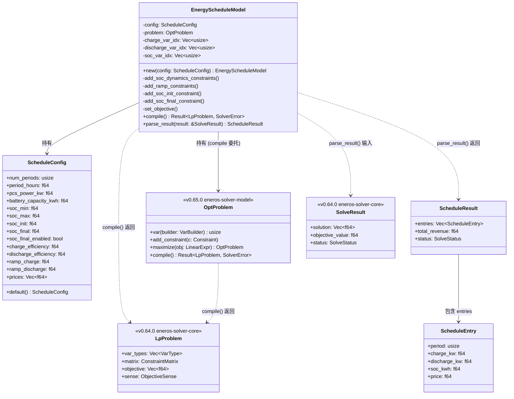
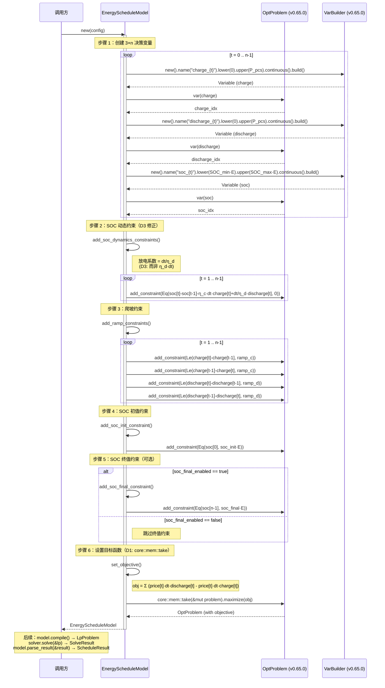

# EnerOS 储能调度 LP 领域模型设计 — EnergyScheduleModel + ScheduleConfig + ScheduleResult

> **版本**：v0.66.0（P1-J AI Runtime Solver 第三层，能源领域模型层）
> **crate**：`eneros-energy-lp-model`（`crates/ai/energy-lp-model/`）
> **蓝图依据**：`蓝图/phase1.md` §v0.66.0
> **spec 依据**：`.trae/specs/develop-v0660-energy-lp-model/spec.md`（D1~D12 偏差声明源）
> **覆盖版本**：v0.66.0
> **最后更新**：2026-07-16

---

## 1. 版本目标

### 1.1 一句话目标

基于 v0.65.0 `OptProblem` DSL 构建储能系统优化调度 LP 领域模型（`EnergyScheduleModel` 构建器 + `ScheduleConfig` 调度参数 + `ScheduleResult` 调度结果），自动创建决策变量（充电功率 / 放电功率 / SOC 荷电量）、装配 SOC 动态约束 / 爬坡约束 / SOC 初终值约束 / 容量约束、设置最大化收益目标函数，并委托 `OptProblem::compile()` 编译为 v0.64.0 `LpProblem` 矩阵格式交由 `Solver` 求解，运行于慢平面（Agent Runtime 分区），不干扰快平面 10ms 实时控制。

### 1.2 详细描述

v0.65.0 完成了 P1-J AI Runtime Solver 第二层（建模框架层），交付了 `Variable`/`VarBuilder`/`LinearExpr`/`Constraint`/`OptProblem` 通用 DSL 与 `compile()` 编译器。但通用 DSL 不包含能源领域语义：上层应用（如 v0.68.0 意图解析、v0.71.0 双脑联调）若直接使用 `OptProblem` 建模储能调度问题，需手写 SOC 动态方程、爬坡约束、效率折算等能源领域逻辑，既繁琐又易错（蓝图 §v0.66.0 即指出 SOC 动态约束系数存在数学错误，见 §5 D3 修正）。

本版本（v0.66.0）进入 P1-J AI Runtime Solver 第三层（能源领域模型层），针对储能系统（Battery Energy Storage System, BESS）构建专用 LP 模型，将能源领域知识封装为单一 `EnergyScheduleModel` 构建器：调用方仅需提供 `ScheduleConfig`（时段数、PCS 功率、电池容量、SOC 上下限、爬坡率、充放电效率、电价曲线），构建器在 `new()` 中自动完成变量创建、约束装配、目标函数设置，最终通过 `compile()` 产出 `LpProblem`，再由 v0.64.0 `Solver` trait（`MockSolver` 默认 / `HighsSolver` feature-gated）求解，`parse_result()` 将解向量还原为 `ScheduleResult`（各时段充电 / 放电 / SOC 序列 + 总收益）。

本版本交付三项核心产出：

| 产出 | 角色 | 说明 |
|------|------|------|
| `ScheduleConfig` | 调度参数配置 | 14 字段结构（时段数 / PCS 功率 / 电池容量 / SOC 上下限 / 初终值 / 充放电效率 / 爬坡率 / 电价曲线）；`Default` 提供 96 时段 / 0.25h / 500kW / 1000kWh 标准模板 |
| `EnergyScheduleModel` | 调度模型构建器 | `new(config)` 自动创建 3×n 变量 + 装配约束 + 设置目标；`compile()` 委托 `OptProblem::compile()`；`parse_result()` 安全解析解向量 |
| `ScheduleEntry` / `ScheduleResult` | 调度结果条目与汇总 | `ScheduleEntry`（时段索引 / 充电 / 放电 / SOC / 电价）；`ScheduleResult`（条目序列 + 总收益 + 求解状态） |

本版本核心修正蓝图 §v0.66.0 §5 SOC 动态约束的数学错误（D3）：蓝图原代码放电系数为 `eff_d * dt / cap * cap`（化简为 `η_d·dt`，方向错误且 `/cap * cap` 无效抵消），本版本依据物理守恒方程 `soc[t] = soc[t-1] + (charge[t]·η_c - discharge[t]/η_d)·dt` 修正为 `dt / η_d`（放电时电池内部损失能量多于对外输出，故除以效率而非乘以效率）。

所有 Rust 代码必须 no_std（D1，蓝图 §43.1），仅使用 `core::*` / `alloc::*`，无 `std::*`，使用 `core::mem::take` 而非 `std::mem::take`（D1），`format!` 依赖 `extern crate alloc`（D2），解向量访问使用 `.get().copied().unwrap_or(0.0)` 安全模式（D4），复用 v0.64.0 / v0.65.0 的类型定义（D8 / D9），纯 safe Rust 零 `unsafe`（D10），无 FFI 需求（D11）。

### 1.3 架构定位

| 维度 | 定位 |
|------|------|
| Phase | Phase 1 单机 MVP |
| 子系统 | P1-J AI Runtime Solver 第三层（能源领域模型层） |
| 平面 | 慢平面（Agent Runtime 分区，管理信息大区） |
| 角色 | 双脑链路 Solver 领域建模层，能源语义 → DSL → 矩阵格式 |
| 上游版本 | v0.64.0（`Solver` trait + `LpProblem` + 类型定义）；v0.65.0（`OptProblem` DSL + `compile()`）；v0.11.0 用户堆（alloc 支持） |
| 同层版本 | v0.66.0（本版本，能源 LP 领域模型） |
| 下游版本 | v0.67.0 安全校验（校验 `ScheduleResult` 的 SOC 越限 / 爬坡越限）；v0.68.0 意图解析（LLM 意图 → `ScheduleConfig`）；v0.71.0 双脑联调 |
| 部署形态 | 纯 Rust crate，无 C 库依赖，无 FFI，CPU 编译运行 |

### 1.4 路线图链路

```
v0.59.0 LlmEngine trait ──► ... ──► v0.63.0 Prompt 模板
                                          │
                                          ▼
v0.64.0 Solver trait + HiGHS FFI ──► v0.65.0 建模 DSL
                                          │
                                          ▼
                                v0.66.0 能源 LP（本版本）
                                          │
                                          ├──► v0.67.0 安全校验
                                          │
                                          └──► v0.68.0 意图解析（消费 Solver + PromptTemplate）
                                                   │
                                                   ▼
                                          v0.71.0 双脑联调（LLM + Solver）
```

### 1.5 依赖关系

| 依赖 | 来源 | 用途 |
|------|------|------|
| `eneros_solver_core::problem::{LpProblem, VarType, ObjectiveSense, SolveResult, SolveStatus}` | v0.64.0 crate（path 依赖） | `compile()` 返回类型 + `parse_result()` 输入类型 + 求解状态枚举复用（D8） |
| `eneros_solver_core::error::SolverError` | v0.64.0 crate | `compile()` 错误类型复用（D8） |
| `eneros_solver_model::{OptProblem, VarBuilder, LinearExpr, Constraint}` | v0.65.0 crate（path 依赖） | DSL 构建能源 LP 问题（D9） |
| `alloc::string::String` | `alloc` crate | 变量名 / 约束名 / 错误消息（D2） |
| `alloc::vec::Vec` | `alloc` crate | 变量索引数组 / 调度结果条目序列 |
| `core::mem::take` | `core` crate | `set_objective()` 中所有权转移（D1） |

> **注**：本版本**仅依赖 v0.64.0 + v0.65.0**（D8 / D9），不依赖 v0.59.0~v0.63.0 任何 LLM crate，也不依赖 v0.52.0 四遥数据模型（D5，`ScheduleConfig` 自带数据，与 telemetry-model 解耦）。能源领域模型是 Solver 子系统内部层，与 LLM 子系统及遥测子系统均解耦；v0.68.0 意图解析负责将 LLM 输出映射为 `ScheduleConfig`，v0.71.0 双脑联调编排降级。

### 1.6 设计原则关联

| 原则 | 体现 |
|------|------|
| 行业标准化 | LP 模型严格遵循储能行业通用建模规范：决策变量为各时段充放电功率与 SOC 荷电量，约束覆盖 SOC 动态守恒 / 爬坡限制 / 容量上下限 / 初终值，目标为最大化峰谷套利收益，符合 GB/T 36558-2018 储能系统技术规范与行业实践 |
| 确定性优先 | LP 求解结果确定性（同一 `ScheduleConfig` + 同一 `Solver` = 同一 `ScheduleResult`）；`new()` 自动装配约束顺序固定；变量命名确定（`charge_{t}` / `discharge_{t}` / `soc_{t}`）；底层 `OptProblem::compile()` 使用 `BTreeMap` 确定性遍历（v0.65.0 D2） |
| no_std 合规 | 全 crate 仅使用 `core::*` / `alloc::*`，无 `std::*`（D1，蓝图 §43.1）；`core::mem::take` 替代 `std::mem::take`（D1）；`format!` 依赖 `extern crate alloc`（D2） |
| DRY 原则 | 复用 v0.64.0 `LpProblem`/`SolverError`/`SolveResult`/`SolveStatus`（D8）；复用 v0.65.0 `OptProblem`/`VarBuilder`/`LinearExpr`/`Constraint`（D9）；不重复定义底层类型 |
| Simplicity First | `EnergyScheduleModel` 一个构建器封装全部建模逻辑，调用方仅需 `ScheduleConfig`；纯 safe Rust 零 `unsafe`（D10）；无 FFI（D11）；不引入遥测依赖（D5） |
| 可测试性 | 纯 Rust 实现，默认 `cargo test` 可运行；端到端验证用 `MockSolver`（D7） |
| 安全访问 | 解向量访问使用 `.get().copied().unwrap_or(0.0)`，避免越界 panic（D4，no_std panic 不可恢复） |
| 物理守恒 | SOC 动态约束严格遵循能量守恒方程，修正蓝图数学错误（D3），确保模型物理意义正确 |

---

## 2. 架构定位

### 2.1 P1-J AI Runtime Solver 分层

P1-J AI Runtime Solver 子系统按"求解引擎 → 建模 DSL → 能源 LP → 安全校验 → 意图解析"五层层级组织，本版本位于第三层：

| 层级 | 版本 | crate | 职责 |
|------|------|-------|------|
| 第一层（求解引擎） | v0.64.0 | `eneros-solver-core` | `Solver` trait + MockSolver + HighsSolver FFI + `LpProblem` 矩阵格式 |
| 第二层（建模 DSL） | v0.65.0 | `eneros-solver-model` | `Variable`/`LinearExpr`/`Constraint`/`OptProblem` DSL + `compile()` 编译器 |
| **第三层（能源 LP）** | **v0.66.0** | **`eneros-energy-lp-model`** | **`ScheduleConfig` + `EnergyScheduleModel` + `ScheduleResult` 储能调度领域模型** |
| 第四层（安全校验） | v0.67.0 | （后续） | 求解结果安全校验（SOC 越限 / 爬坡越限 / 功率平衡） |
| 第五层（意图解析） | v0.68.0 | （后续） | LLM 意图 → `ScheduleConfig`（同时消费 PromptTemplate） |

第三层为第四、五层提供能源语义接口：v0.67.0 安全校验消费本版本 `ScheduleResult`（各时段 SOC / 功率序列），v0.68.0 意图解析消费本版本 `ScheduleConfig`（LLM 输出市场信号 → 配置参数）。本版本向下复用 v0.65.0 DSL 与 v0.64.0 求解接口，向上提供能源领域抽象。

### 2.2 与 v0.64.0 / v0.65.0 的依赖关系

本版本单向依赖 v0.64.0 + v0.65.0，复用其类型定义与 DSL 接口：

| 复用项 | 上游版本位置 | 本版本用途 | 偏差 |
|--------|-------------|-----------|------|
| `LpProblem` | `eneros_solver_core::problem::LpProblem` | `compile()` 返回类型 | D8（复用） |
| `VarType` | `eneros_solver_core::problem::VarType` | 变量类型（`Continuous`） | D8 |
| `ObjectiveSense` | `eneros_solver_core::problem::ObjectiveSense` | 目标方向（`Maximize`） | D8 |
| `SolverError` | `eneros_solver_core::error::SolverError` | `compile()` 错误类型 | D8 |
| `SolveResult` / `SolveStatus` | `eneros_solver_core::problem` | `parse_result()` 输入 | D8 |
| `OptProblem` | `eneros_solver_model::OptProblem` | 构建 LP 问题的容器 | D9 |
| `VarBuilder` | `eneros_solver_model::VarBuilder` | 创建决策变量 | D9 |
| `LinearExpr` | `eneros_solver_model::LinearExpr` | 构造约束表达式 / 目标函数 | D9 |
| `Constraint` | `eneros_solver_model::Constraint` | 约束类型（`Le`/`Ge`/`Eq`/`Range`） | D9 |

```
┌─────────────────────────────────────────────────┐
│  v0.66.0 eneros-energy-lp-model（本版本）        │
│  ┌───────────────────────────────────────────┐  │
│  │  ScheduleConfig（14 字段）                │  │
│  │  EnergyScheduleModel（Builder + compile） │  │
│  │  ScheduleEntry / ScheduleResult          │  │
│  └─────────────────────┬─────────────────────┘  │
│                        │ use DSL                 │
└────────────────────────┼─────────────────────────┘
                         ▼
┌─────────────────────────────────────────────────┐
│  v0.65.0 eneros-solver-model                    │
│  ┌───────────────────────────────────────────┐  │
│  │  VarBuilder / LinearExpr / Constraint     │  │
│  │  OptProblem（Builder + compile()）        │  │
│  └─────────────────────┬─────────────────────┘  │
│                        │ use                     │
└────────────────────────┼─────────────────────────┘
                         ▼
┌─────────────────────────────────────────────────┐
│  v0.64.0 eneros-solver-core                     │
│  ┌───────────────────────────────────────────┐  │
│  │  VarType / ObjectiveSense                 │  │
│  │  LpProblem / SolveResult / SolveStatus    │  │
│  │  SolverError（含 InvalidProblem(String)） │  │
│  │  Solver trait + MockSolver / HighsSolver  │  │
│  └───────────────────────────────────────────┘  │
└─────────────────────────────────────────────────┘
```

### 2.3 解锁 v0.67.0~v0.68.0

本版本交付的领域模型解锁后续两个版本：

| 下游版本 | 消费本版本的产出 | 场景 |
|---------|----------------|------|
| v0.67.0 安全校验 | `ScheduleResult`（各时段充电 / 放电 / SOC 序列 + 总收益 + 求解状态） | 校验 SOC 是否越限、爬坡是否越限、功率是否超出 PCS 额定，校验失败触发降级 |
| v0.68.0 意图解析 | `ScheduleConfig`（14 字段配置） | LLM 输出市场信号 / 自然语言指令 → 解析为 `ScheduleConfig` → 调用 `EnergyScheduleModel::new()` 建模 → `compile()` → 求解 |

### 2.4 双脑架构中的定位 — Solver 领域建模层

双脑架构（蓝图 §9.x）中 LLM 与 Solver 的协作链路，本版本位于 Solver 领域建模层：

```
[市场信号/自然语言指令]
        │
        ▼
v0.59.0 LlmEngine (trait)
        │
        ▼
   LLM 推理 (llama.cpp via FFI)
        │
        ▼
   JSON 意图输出
        │
        ▼
v0.68.0 意图解析 ──► ScheduleConfig 构造（本版本配置）
                        │
                        ▼
                  EnergyScheduleModel::new(config)（本版本）
                        │  自动装配变量 + 约束 + 目标
                        ▼
                  OptProblem.compile()（v0.65.0）
                        │
                        ▼
                  LpProblem 矩阵格式
                        │
                        ▼
v0.64.0 Solver trait
        │
        ├── MockSolver (默认，测试)
        └── HighsSolver (feature-gated，真实求解)
                │
                ▼
        HiGHS LP 求解 (via FFI)
                │
                ▼
        SolveResult (确定性最优解)
                │
                ▼
   EnergyScheduleModel::parse_result()（本版本）
                │
                ▼
        ScheduleResult (各时段调度 + 总收益)
                │
                ▼
v0.67.0 安全校验 ──► 校验通过 → 控制命令下发
                └──► 校验失败 → 降级（规则引擎 / 上一周期复用）
```

本版本为 L1 主路径的领域建模层：能源调度模型通过 `ScheduleConfig` 配置参数，`EnergyScheduleModel` 自动建模并编译为 `LpProblem`，由 v0.64.0 `Solver` 求解，`parse_result()` 还原为 `ScheduleResult`。L2 路径在 LLM 不可用时降级到 L1，由 v0.71.0 双脑联调实现降级逻辑。本版本仅提供建模、编译、解析能力，不实现降级编排与安全校验。

### 2.5 上下游依赖图

```
v0.11.0 用户堆 ──► alloc ──┐
                           │
v0.64.0 Solver trait + LpProblem + 类型
                           │
                           │  use
                           ▼
v0.65.0 建模 DSL
├── Variable + VarBuilder
├── LinearExpr（BTreeMap, core::ops）
├── Constraint（Le/Ge/Eq/Range）
└── OptProblem（Builder + compile()）
                           │
                           │  use DSL
                           ▼
             v0.66.0 能源 LP（本版本）
             ├── ScheduleConfig（14 字段）
             ├── EnergyScheduleModel（Builder + compile + parse_result）
             └── ScheduleEntry / ScheduleResult
                           │
                           │  ScheduleResult
                           ▼
             v0.67.0 安全校验
                           │
                           │  ScheduleConfig
                           ▼
             v0.68.0 意图解析 (同时消费 PromptTemplate)
                           │
                           ▼
             v0.71.0 双脑联调 (LLM + Solver)
```

### 2.6 不做的事（职责边界）

本领域模型**不负责**以下职责，避免与上下游重叠：

| 不做的事 | 归属版本 | 理由 |
|---------|---------|------|
| LP 求解 | v0.64.0 | 本版本仅编译为 `LpProblem`，求解由 v0.64.0 `Solver` trait 负责 |
| 通用建模 DSL | v0.65.0 | 本版本消费 DSL 构建能源领域问题，不重新定义 `OptProblem` / `LinearExpr` |
| 求解结果安全校验 | v0.67.0 | 本版本仅解析解向量为 `ScheduleResult`，SOC 越限 / 爬坡越限校验由 v0.67.0 实现 |
| LLM 意图解析 | v0.68.0 | 本版本不消费 LLM 输出，意图到 `ScheduleConfig` 的映射由 v0.68.0 实现 |
| 双脑降级编排 | v0.71.0 | 本版本仅返回 `ScheduleResult` / `SolverError`，降级决策由 v0.71.0 编排 |
| 四遥数据采集 | v0.52.0 | 本版本 `ScheduleConfig` 自带数据，不依赖遥测模型（D5） |
| 机组组合 / 经济调度 | 后续版本 | 本版本聚焦储能调度（单 BESS），火电机组组合 / 经济调度由后续版本扩展 |
| 潮流约束 | 后续版本 | 本版本不含电网潮流方程，潮流校验由 v0.67.0 后续扩展 |
| 非线性效率 | 后续版本 | 本版本充放电效率为常数，非线性效率曲线由后续版本扩展 |

---

## 3. ScheduleConfig 调度参数配置

### 3.1 设计动机

储能调度 LP 模型的输入是一组调度参数：调度周期长度（时段数 × 时段时长）、储能设备物理参数（PCS 功率 / 电池容量 / SOC 上下限 / 充放电效率）、运行约束参数（爬坡率 / SOC 初终值）、市场参数（电价曲线）。将这些参数聚合为单一配置结构，既便于调用方构造（v0.68.0 意图解析仅需产出 `ScheduleConfig`），也便于模型构建器统一访问，符合 Karpathy "Simplicity First" 原则——一个结构体承载全部输入，构建器逻辑与参数解析解耦。

### 3.2 结构定义（14 字段）

```rust
use alloc::vec::Vec;

/// 储能调度 LP 模型配置参数（14 字段）.
///
/// 封装储能系统优化调度的全部输入参数，包括调度周期、设备物理参数、
/// 运行约束参数与市场参数。`Default` 提供 96 时段标准模板。
#[derive(Debug, Clone)]
pub struct ScheduleConfig {
    // ── 调度周期参数 ──
    /// 时段数 n（决策变量总数 = 3×n）.
    pub num_periods: usize,
    /// 单时段时长 dt（小时），典型值 0.25（15 分钟）或 1.0（1 小时）.
    pub period_hours: f64,

    // ── 设备物理参数 ──
    /// PCS 额定功率 P_pcs（kW），充放电功率上界.
    pub pcs_power_kw: f64,
    /// 电池额定容量 E（kWh），SOC 物理上界.
    pub battery_capacity_kwh: f64,
    /// SOC 下限（0~1），如 0.1 表示 10%.
    pub soc_min: f64,
    /// SOC 上限（0~1），如 0.9 表示 90%.
    pub soc_max: f64,

    // ── 运行约束参数 ──
    /// 初始 SOC（0~1），调度起点荷电状态.
    pub soc_init: f64,
    /// 终值 SOC（0~1），调度终点荷电状态（仅当 `soc_final_enabled` 为真时生效）.
    pub soc_final: f64,
    /// 是否启用 SOC 终值约束（false 表示不约束终值，仅约束初值与动态）.
    pub soc_final_enabled: bool,
    /// 充电效率 η_c（0~1），如 0.95 表示充电时 95% 电能进入电池.
    pub charge_efficiency: f64,
    /// 放电效率 η_d（0~1），如 0.95 表示放电时 95% 电能输出，5% 损失.
    pub discharge_efficiency: f64,
    /// 充电爬坡率 ramp_c（kW/时段），相邻时段充电功率变化上界.
    pub ramp_charge: f64,
    /// 放电爬坡率 ramp_d（kW/时段），相邻时段放电功率变化上界.
    pub ramp_discharge: f64,

    // ── 市场参数 ──
    /// 电价曲线（元/kWh），长度必须等于 `num_periods`.
    pub prices: Vec<f64>,
}
```

### 3.3 字段详解

下表逐一说明 14 个字段的物理含义、单位、典型值与设计理由：

| # | 字段 | 单位 | 典型值 | 物理含义 | 设计理由 |
|---|------|------|--------|---------|---------|
| 1 | `num_periods` | 个 | 96 | 调度周期时段数（如 96 个 15 分钟时段 = 24 小时） | 决定决策变量规模（3×n）；96 时段为日前调度标准粒度 |
| 2 | `period_hours` | 小时 | 0.25 | 单时段时长（15 分钟 = 0.25h） | 能量与功率换算系数：能量 = 功率 × dt；出现在 SOC 动态约束与目标函数 |
| 3 | `pcs_power_kw` | kW | 500 | PCS（功率变换系统）额定功率 | 充放电功率上界 `charge[t], discharge[t] ∈ [0, P_pcs]`；防止设备过载 |
| 4 | `battery_capacity_kwh` | kWh | 1000 | 电池额定容量 | SOC 物理上界 `soc[t] ∈ [SOC_min·E, SOC_max·E]`；将无量纲 SOC 比例转为绝对电量 |
| 5 | `soc_min` | 0~1 | 0.1 | SOC 下限（10%） | 防止过放损伤电池；行业惯例 10%~20% |
| 6 | `soc_max` | 0~1 | 0.9 | SOC 上限（90%） | 防止过充损伤电池；行业惯例 80%~90% |
| 7 | `soc_init` | 0~1 | 0.5 | 初始 SOC（50%） | 调度起点荷电状态；约束 `soc[0] = SOC_init·E` |
| 8 | `soc_final` | 0~1 | 0.5 | 终值 SOC（50%） | 调度终点荷电状态；约束 `soc[n-1] = SOC_final·E`（可选） |
| 9 | `soc_final_enabled` | bool | true | 是否启用终值约束 | 终值约束保证下一周期调度能力；某些场景（紧急放电）需关闭以最大化当期收益 |
| 10 | `charge_efficiency` | 0~1 | 0.95 | 充电效率 η_c | 电池充电时存在能量损失，仅 η_c 比例电能进入电池；出现在 SOC 动态约束充电项 |
| 11 | `discharge_efficiency` | 0~1 | 0.95 | 放电效率 η_d | 电池放电时存在能量损失，对外输出 1 kWh 需消耗电池 1/η_d kWh；出现在 SOC 动态约束放电项（D3 修正关键） |
| 12 | `ramp_charge` | kW | 250 | 充电爬坡率 | 限制相邻时段充电功率变化，保护 PCS 与电池；典型值 P_pcs/2 |
| 13 | `ramp_discharge` | kW | 250 | 放电爬坡率 | 限制相邻时段放电功率变化；典型值 P_pcs/2 |
| 14 | `prices` | 元/kWh | Vec(96) | 电价曲线 | 目标函数系数；谷时低价充电、峰时高价放电实现套利 |

### 3.4 默认值（Default 实现）

`ScheduleConfig` 实现 `Default`，提供 96 时段标准模板，便于测试与快速原型：

```rust
impl Default for ScheduleConfig {
    fn default() -> Self {
        Self {
            // 调度周期：96 时段 × 0.25h = 24 小时（日前调度）
            num_periods: 96,
            period_hours: 0.25,
            // 设备参数：500kW PCS / 1000kWh 电池（0.5C 倍率）
            pcs_power_kw: 500.0,
            battery_capacity_kwh: 1000.0,
            soc_min: 0.1,
            soc_max: 0.9,
            // 运行约束：初终值 50%，效率 0.95，爬坡 250kW
            soc_init: 0.5,
            soc_final: 0.5,
            soc_final_enabled: true,
            charge_efficiency: 0.95,
            discharge_efficiency: 0.95,
            ramp_charge: 250.0,
            ramp_discharge: 250.0,
            // 市场参数：96 时段电价曲线（峰谷电价，单位 元/kWh）
            // 简化模板：谷时 0.3 / 平时 0.6 / 峰时 1.0
            prices: alloc::vec![0.3; 96], // 测试模板，实际由 v0.68.0 意图解析填充
        }
    }
}
```

### 3.5 设计理由

| 设计点 | 选择 | 理由 |
|--------|------|------|
| SOC 用绝对电量（kWh）而非比例 | `soc[t]` 变量为 kWh | LP 求解器对绝对量更稳定；比例与容量混合运算易引入尺度差异；动态约束 `soc[t] = soc[t-1] + ...` 中能量加减需同量纲 |
| 效率不对称 | `charge_efficiency` ≠ `discharge_efficiency` | 现实中充放电效率通常不相等（附录 B）；分离两个字段支持精确建模；默认值均为 0.95 简化常见场景 |
| 终值约束可选 | `soc_final_enabled: bool` | 紧急放电场景需关闭终值约束以榨干电池；常规场景开启以保证下一周期调度能力 |
| 电价曲线为 `Vec<f64>` | 长度 = `num_periods` | 支持任意电价形态（峰谷 / 实时 / 分时）；不依赖外部电价服务（D5 解耦） |
| 爬坡率按时段 | `ramp_charge` / `ramp_discharge` 为 kW | 单位与功率一致，约束 `|power[t] - power[t-1]| ≤ ramp` 直接成立；不引入时间换算 |
| 不含遥测字段 | 无 `current_soc` / `current_power` | D5 解耦：实时状态由 v0.52.0 遥测提供，本版本仅接受配置化参数；v0.68.0 负责将遥测映射为 `soc_init` |

### 3.6 参数校验

`ScheduleConfig` 的字段约束在 `EnergyScheduleModel::new()` 中隐式校验（通过 `VarBuilder` 上下界与约束 rhs 传入）。若参数非法（如 `soc_min > soc_max`、`prices.len() != num_periods`），底层 `OptProblem::compile()` 或求解器将返回 `SolverError::InvalidProblem(String)`（D8 复用 v0.64.0 错误类型）。本版本不显式实现 `validate()` 方法，遵循 Karpathy "Simplicity First"——校验逻辑由底层 DSL 与求解器承载，避免重复校验。

---

## 4. EnergyScheduleModel 构建器

### 4.1 设计动机

`EnergyScheduleModel` 是本版本的核心类型，将储能调度的领域知识（变量结构、约束方程、目标函数）封装为单一构建器。调用方仅需 `EnergyScheduleModel::new(config)` 一行即可完成全部建模，`compile()` 产出 `LpProblem`，`parse_result()` 还原 `ScheduleResult`。这种"配置即模型"的设计隐藏了 DSL 操作细节，使上层（v0.68.0 意图解析）无需理解 LP 建模即可使用储能调度能力。

### 4.2 结构定义

```rust
use alloc::vec::Vec;
use eneros_solver_model::{OptProblem, VarBuilder, Constraint, LinearExpr};
use eneros_solver_core::problem::{LpProblem, SolveResult, SolverError};
use crate::config::ScheduleConfig;
use crate::result::{ScheduleEntry, ScheduleResult};

/// 储能调度 LP 模型构建器.
///
/// 在 `new(config)` 中自动完成：
/// 1. 创建 3×n 决策变量（charge / discharge / soc，n = `num_periods`）
/// 2. 装配 SOC 动态约束（D3 修正后的能量守恒方程）
/// 3. 装配爬坡约束（充电 / 放电）
/// 4. 装配 SOC 初值约束
/// 5. 装配 SOC 终值约束（可选，取决于 `soc_final_enabled`）
/// 6. 设置最大化收益目标函数
///
/// 之后调用 `compile()` 委托 `OptProblem::compile()` 生成 `LpProblem`，
/// 调用 `parse_result()` 将 `SolveResult` 解析为 `ScheduleResult`。
#[derive(Debug, Clone)]
pub struct EnergyScheduleModel {
    /// 调度参数配置（14 字段）.
    config: ScheduleConfig,
    /// 优化问题容器（v0.65.0 DSL），持有变量 / 约束 / 目标.
    problem: OptProblem,
    /// 充电变量索引序列 `charge_var_idx[t]`（t ∈ [0, n-1]）.
    charge_var_idx: Vec<usize>,
    /// 放电变量索引序列 `discharge_var_idx[t]`（t ∈ [0, n-1]）.
    discharge_var_idx: Vec<usize>,
    /// SOC 变量索引序列 `soc_var_idx[t]`（t ∈ [0, n-1]）.
    soc_var_idx: Vec<usize>,
}
```

### 4.3 字段说明

| 字段 | 类型 | 用途 |
|------|------|------|
| `config` | `ScheduleConfig` | 调度参数（14 字段），`parse_result()` 中用于计算收益与填充电价 |
| `problem` | `OptProblem` | v0.65.0 DSL 容器，持有变量定义 / 约束 / 目标函数；`compile()` 委托给它 |
| `charge_var_idx` | `Vec<usize>` | 充电变量索引，长度 n；构造约束与目标时引用 |
| `discharge_var_idx` | `Vec<usize>` | 放电变量索引，长度 n；构造约束与目标时引用 |
| `soc_var_idx` | `Vec<usize>` | SOC 变量索引，长度 n；构造 SOC 动态 / 初终值约束时引用 |

三个 `*_var_idx` 数组将时段下标 `t` 映射到 `OptProblem` 内部变量索引，避免每次构造约束时通过变量名查找（v0.65.0 `OptProblem.var_map: BTreeMap<String, usize>`），提升建模效率。

### 4.4 new() 自动构建流程

`new(config)` 是构建器的核心入口，按固定顺序完成变量创建与约束装配：

```rust
impl EnergyScheduleModel {
    /// 创建储能调度 LP 模型，自动装配变量 / 约束 / 目标.
    ///
    /// # 流程
    /// 1. 创建 3×n 决策变量（charge / discharge / soc）
    /// 2. 装配 SOC 动态约束（n-1 条）
    /// 3. 装配爬坡约束（充电 n-1 + 放电 n-1 条）
    /// 4. 装配 SOC 初值约束（1 条）
    /// 5. 装配 SOC 终值约束（可选，1 条）
    /// 6. 设置最大化收益目标函数
    pub fn new(config: ScheduleConfig) -> Self {
        let n = config.num_periods;
        let mut problem = OptProblem::new();
        let mut charge_var_idx = Vec::with_capacity(n);
        let mut discharge_var_idx = Vec::with_capacity(n);
        let mut soc_var_idx = Vec::with_capacity(n);

        // ── 步骤 1：创建 3×n 决策变量 ──
        // charge[t] ∈ [0, P_pcs], discharge[t] ∈ [0, P_pcs], soc[t] ∈ [SOC_min·E, SOC_max·E]
        for t in 0..n {
            let charge_idx = problem.var(
                VarBuilder::new()
                    .name(alloc::format!("charge_{}", t))           // D2：alloc::format!
                    .lower(0.0)
                    .upper(config.pcs_power_kw)
                    .continuous()
                    .build(),
            );
            let discharge_idx = problem.var(
                VarBuilder::new()
                    .name(alloc::format!("discharge_{}", t))
                    .lower(0.0)
                    .upper(config.pcs_power_kw)
                    .continuous()
                    .build(),
            );
            let soc_idx = problem.var(
                VarBuilder::new()
                    .name(alloc::format!("soc_{}", t))
                    .lower(config.soc_min * config.battery_capacity_kwh)
                    .upper(config.soc_max * config.battery_capacity_kwh)
                    .continuous()
                    .build(),
            );
            charge_var_idx.push(charge_idx);
            discharge_var_idx.push(discharge_idx);
            soc_var_idx.push(soc_idx);
        }

        let mut model = Self {
            config,
            problem,
            charge_var_idx,
            discharge_var_idx,
            soc_var_idx,
        };

        // ── 步骤 2~5：装配约束 ──
        model.add_soc_dynamics_constraints();    // SOC 动态（D3 修正）
        model.add_ramp_constraints();             // 爬坡（充电 + 放电）
        model.add_soc_init_constraint();          // SOC 初值
        if model.config.soc_final_enabled {       // SOC 终值（可选）
            model.add_soc_final_constraint();
        }

        // ── 步骤 6：设置目标函数 ──
        model.set_objective();

        model
    }
}
```

### 4.5 变量创建（3×n）

每个时段 `t` 创建 3 个连续变量：

| 变量 | 名称 | 下界 | 上界 | 类型 | 物理含义 |
|------|------|------|------|------|---------|
| `charge[t]` | `charge_{t}` | 0 | `pcs_power_kw` | Continuous | 时段 t 充电功率（kW） |
| `discharge[t]` | `discharge_{t}` | 0 | `pcs_power_kw` | Continuous | 时段 t 放电功率（kW） |
| `soc[t]` | `soc_{t}` | `soc_min·E` | `soc_max·E` | Continuous | 时段 t 电池荷电量（kWh） |

变量总数 = 3 × `num_periods`。对于默认配置（n=96），变量数 = 288（附录 A 求解规模分析）。

变量命名规则：`charge_{t}` / `discharge_{t}` / `soc_{t}`，其中 `{t}` 为时段下标（0~n-1）。命名确定性保证同一 `ScheduleConfig` 产生同一变量序列，利于调试与日志（v0.64.0 `LpProblem.var_names`）。

变量上下界由 `VarBuilder` 链式设置（v0.65.0 DSL），`continuous()` 显式声明为连续变量（LP 而非 MILP）。`problem.var(...)` 返回变量索引（`usize`），存入 `*_var_idx` 数组供后续约束构造引用。

### 4.6 约束装配顺序

`new()` 中约束装配顺序固定，确保确定性建模：

| 步骤 | 方法 | 约束数 | 说明 |
|------|------|--------|------|
| 2 | `add_soc_dynamics_constraints()` | n-1 | SOC 动态守恒（§5） |
| 3 | `add_ramp_constraints()` | 2(n-1) | 充电爬坡 n-1 + 放电爬坡 n-1（§6） |
| 4 | `add_soc_init_constraint()` | 1 | SOC 初值（§7） |
| 5 | `add_soc_final_constraint()`（可选） | 0 或 1 | SOC 终值（§7） |
| 6 | `set_objective()` | — | 目标函数（§8） |

对于 n=96，约束总数 = 95 + 190 + 1 + 1 = 287（约 300，见附录 A）。

---

## 5. SOC 动态约束（D3 修正）

### 5.1 物理背景

SOC（State of Charge，荷电状态）是电池调度的核心状态量，表示电池当前电量。储能调度的本质是在满足 SOC 动态守恒的前提下，通过充放电决策实现收益最大化。SOC 动态约束描述了相邻时段 SOC 的演化关系，是整个 LP 模型最关键的约束，其数学正确性直接决定求解结果的物理合理性。

### 5.2 物理守恒方程

设时段 `t` 的充电功率为 `charge[t]`（kW），放电功率为 `discharge[t]`（kW），荷电量为 `soc[t]`（kWh），时段时长为 `dt`（小时），充电效率为 `η_c`，放电效率为 `η_d`。则相邻时段 SOC 演化方程为：

```
soc[t] = soc[t-1] + (charge[t]·η_c - discharge[t]/η_d)·dt
```

物理意义：
- **充电项** `charge[t]·η_c·dt`：时段 t 充电功率为 `charge[t]`，持续 `dt` 小时，从电网吸收能量 `charge[t]·dt`（kWh）；充电效率 `η_c` 表示仅 `η_c` 比例能量进入电池，故电池 SOC 增加 `charge[t]·η_c·dt`。
- **放电项** `discharge[t]/η_d·dt`：时段 t 放电功率为 `discharge[t]`，对外输出能量 `discharge[t]·dt`（kWh）；放电效率 `η_d` 表示对外输出 1 kWh 需消耗电池 `1/η_d` kWh（因损失），故电池 SOC 减少 `discharge[t]·dt/η_d`。

> **关键点**：放电时电池内部消耗的能量**大于**对外输出的能量（差额为损失），因此放电项系数是 `dt/η_d`（除以效率，η_d < 1 时放大）而非 `η_d·dt`（乘以效率，缩小）。这是 D3 修正的核心。

### 5.3 等式约束形式

将物理守恒方程移项，所有变量移到左侧，得到 LP 等式约束标准形式：

```
soc[t] - soc[t-1] - charge[t]·η_c·dt + discharge[t]·(dt/η_d) = 0
```

即对每个 `t ∈ [1, n-1]`，构造等式约束：

```
Constraint::Eq(LinearExpr, rhs=0.0)
```

其中 `LinearExpr` 的系数为：
- `soc[t]`：+1
- `soc[t-1]`：-1
- `charge[t]`：-η_c·dt
- `discharge[t]`：+dt/η_d  ← **D3 修正关键**

### 5.4 D3 修正：蓝图 Bug 详解

> ⚠️ **本节为本版本最关键的修正**。蓝图 §v0.66.0 §5 原代码存在数学错误，若不修正将导致求解结果物理意义错误（电池 SOC 变化方向反常）。

#### 5.4.1 蓝图原代码（错误）

蓝图原文构造 SOC 动态约束的伪代码：

```rust
// 蓝图原代码（错误！）
let mut expr = LinearExpr::new();
expr.add_term(self.soc_var_idx[t], 1.0);
expr.add_term(self.soc_var_idx[t - 1], -1.0);
expr.add_term(self.charge_var_idx[t], eff_c * dt);       // 充电项
expr.add_term(self.discharge_var_idx[t], eff_d * dt / cap * cap);  // 放电项（错误！）
self.problem.add_constraint(Constraint::Eq(expr, 0.0));
```

#### 5.4.2 Bug 1：放电效率方向错误

蓝图放电项系数为 `eff_d * dt / cap * cap`。注意到 `/ cap * cap` 中除以容量又乘以容量相互抵消（Bug 2，见 §5.4.3），化简后实际系数为 `eff_d * dt = η_d · dt`。

而根据 §5.2 物理守恒方程，放电项系数应为 `dt / η_d`。两者方向相反：

| 系数 | 蓝图（错误） | 正确（D3） | 比值 |
|------|-------------|-----------|------|
| 放电项 | `η_d · dt` | `dt / η_d` | `η_d²` |

以 `η_d = 0.95`、`dt = 0.25` 为例：
- 蓝图（错误）：`0.95 × 0.25 = 0.2375`
- 正确（D3）：`0.25 / 0.95 ≈ 0.2632`
- 差异：放电 1 kW·0.25h，蓝图少扣除电池 `0.2632 - 0.2375 = 0.0257` kWh

**物理后果**：蓝图错误系数使电池放电时 SOC 下降幅度偏小（仅扣除 `η_d·dt` 而非 `dt/η_d`），相当于"高估了放电效率"——求解器会倾向于多放电（因每 kWh 放电对 SOC 的消耗被低估），导致求解结果中放电量虚高、SOC 虚高，与实际电池行为不符。

**根因**：蓝图作者混淆了"放电效率作用于输出端"与"放电效率作用于电池端"：
- 正确理解：`discharge[t]` 是**对外输出功率**，电池内部消耗 `discharge[t]/η_d`（因损失放大）。
- 错误理解：将 `discharge[t]` 当作电池内部消耗，乘以 `η_d` 得到对外输出（方向反了）。

#### 5.4.3 Bug 2：`/ cap * cap` 无效抵消

蓝图放电项系数 `eff_d * dt / cap * cap` 中，`/ cap * cap` 除以容量又乘以容量，数值上完全抵消（`x / cap * cap = x`），是一段无意义的运算。

可能原因：蓝图作者原意是将 SOC 归一化为比例（除以容量 `cap`），但 `soc[t]` 变量已是绝对电量（kWh，见 §3.5 设计理由），无需归一化；后续又乘以 `cap` 试图还原，形成无效操作。

本版本 `soc[t]` 变量统一使用绝对电量（kWh），SOC 动态约束中所有项量纲一致（kWh），无需任何容量归一化。

#### 5.4.4 修正后代码（D3）

```rust
impl EnergyScheduleModel {
    /// 装配 SOC 动态约束（n-1 条等式约束）.
    ///
    /// 物理方程：soc[t] = soc[t-1] + (charge[t]·η_c - discharge[t]/η_d)·dt
    /// 约束形式：soc[t] - soc[t-1] - charge[t]·η_c·dt + discharge[t]·(dt/η_d) = 0
    ///
    /// # D3 修正
    ///
    /// 蓝图原放电系数 `eff_d * dt / cap * cap`（化简 `η_d·dt`）方向错误，
    /// 应为 `dt / eff_d`（放电时电池内部消耗大于对外输出，除以效率放大）。
    pub fn add_soc_dynamics_constraints(&mut self) {
        let n = self.config.num_periods;
        let dt = self.config.period_hours;
        let eff_c = self.config.charge_efficiency;
        let eff_d = self.config.discharge_efficiency;

        for t in 1..n {
            let mut expr = LinearExpr::new();
            expr.add_term(self.soc_var_idx[t], 1.0);            // +soc[t]
            expr.add_term(self.soc_var_idx[t - 1], -1.0);       // -soc[t-1]
            expr.add_term(self.charge_var_idx[t], -eff_c * dt); // -charge[t]·η_c·dt
            // D3 修正：放电项系数 dt/η_d（而非蓝图的 η_d·dt）
            expr.add_term(self.discharge_var_idx[t], dt / eff_d);
            self.problem.add_constraint(Constraint::Eq(expr, 0.0));
        }
    }
}
```

#### 5.4.5 修正影响

D3 修正使 LP 模型与物理守恒方程严格一致，保证求解结果的物理合理性：

| 场景 | 蓝图（错误） | 修正后（D3） |
|------|-------------|-------------|
| 放电 100kW × 0.25h，η_d=0.95 | SOC 下降 23.75 kWh | SOC 下降 26.32 kWh |
| 充电 100kW × 0.25h，η_c=0.95 | SOC 上升 23.75 kWh | SOC 上升 23.75 kWh（充电项未错） |
| 一个完整充放电循环损耗 | 被低估（接近 0） | 正确反映 ~5% 双向损失 |

修正后，求解器在优化套利时会正确计入放电损耗，避免过度放电的不合理策略，符合储能行业实际运行约束。

---

## 6. 爬坡约束

### 6.1 设计动机

储能 PCS（功率变换系统）与电池本身对功率变化速率有物理限制：短时间内功率剧烈变化会冲击电网、损耗设备寿命、触发保护装置。爬坡约束限制相邻时段充放电功率的变化幅度，保证调度方案的功率曲线平滑，符合设备运行特性与电网导则。

### 6.2 数学公式

设充电爬坡率为 `ramp_c`（kW/时段），放电爬坡率为 `ramp_d`（kW/时段）。则对每个 `t ∈ [1, n-1]`：

**充电爬坡约束**：
```
|charge[t] - charge[t-1]| ≤ ramp_c
```

展开为两条不等式：
```
charge[t] - charge[t-1] ≤ ramp_c     （充电功率上升幅度限制）
charge[t-1] - charge[t] ≤ ramp_c     （充电功率下降幅度限制）
```

**放电爬坡约束**：
```
|discharge[t] - discharge[t-1]| ≤ ramp_d
```

展开为两条不等式：
```
discharge[t] - discharge[t-1] ≤ ramp_d     （放电功率上升幅度限制）
discharge[t-1] - discharge[t] ≤ ramp_d     （放电功率下降幅度限制）
```

### 6.3 LP 约束形式

由于 `|x| ≤ r` 等价于 `-r ≤ x ≤ r`，即 `x ≤ r` 且 `-x ≤ r`，每个绝对值约束展开为两条 `Constraint::Le` 不等式：

| 约束 | 形式 | LinearExpr | rhs |
|------|------|-----------|-----|
| 充电爬坡（上升） | `Le` | `charge[t] - charge[t-1]` | `ramp_c` |
| 充电爬坡（下降） | `Le` | `charge[t-1] - charge[t]` | `ramp_c` |
| 放电爬坡（上升） | `Le` | `discharge[t] - discharge[t-1]` | `ramp_d` |
| 放电爬坡（下降） | `Le` | `discharge[t-1] - discharge[t]` | `ramp_d` |

每个时段 `t ∈ [1, n-1]` 产生 4 条约束（充电上升 + 充电下降 + 放电上升 + 放电下降），总约束数 = 4(n-1)。

### 6.4 实现代码

```rust
impl EnergyScheduleModel {
    /// 装配爬坡约束（充电 n-1 + 放电 n-1，每条绝对值展开为 2 条 Le，共 4(n-1) 条）.
    ///
    /// 公式：|power[t] - power[t-1]| ≤ ramp_limit
    pub fn add_ramp_constraints(&mut self) {
        let n = self.config.num_periods;
        let ramp_c = self.config.ramp_charge;
        let ramp_d = self.config.ramp_discharge;

        for t in 1..n {
            // 充电爬坡：|charge[t] - charge[t-1]| ≤ ramp_c
            let mut up = LinearExpr::new();
            up.add_term(self.charge_var_idx[t], 1.0);
            up.add_term(self.charge_var_idx[t - 1], -1.0);
            self.problem.add_constraint(Constraint::Le(up, ramp_c));

            let mut down = LinearExpr::new();
            down.add_term(self.charge_var_idx[t - 1], 1.0);
            down.add_term(self.charge_var_idx[t], -1.0);
            self.problem.add_constraint(Constraint::Le(down, ramp_c));

            // 放电爬坡：|discharge[t] - discharge[t-1]| ≤ ramp_d
            let mut up_d = LinearExpr::new();
            up_d.add_term(self.discharge_var_idx[t], 1.0);
            up_d.add_term(self.discharge_var_idx[t - 1], -1.0);
            self.problem.add_constraint(Constraint::Le(up_d, ramp_d));

            let mut down_d = LinearExpr::new();
            down_d.add_term(self.discharge_var_idx[t - 1], 1.0);
            down_d.add_term(self.discharge_var_idx[t], -1.0);
            self.problem.add_constraint(Constraint::Le(down_d, ramp_d));
        }
    }
}
```

### 6.5 爬坡率典型值

| 设备类型 | 充电爬坡率 | 放电爬坡率 | 说明 |
|---------|-----------|-----------|------|
| 锂电池储能（默认） | P_pcs/2 | P_pcs/2 | 500kW PCS → 250kW/时段（15 分钟内功率变化 ≤ 50%） |
| 快速响应储能 | P_pcs | P_pcs | 调频场景，允许满功率阶跃 |
| 保守运行 | P_pcs/4 | P_pcs/4 | 老旧电池或电网约束严格场景 |

默认值 `ramp_charge = ramp_discharge = 250.0`（kW）对应 500kW PCS 的 50% 爬坡率，平衡响应速度与设备保护。

---

## 7. SOC 初终值约束

### 7.1 设计动机

SOC 动态约束（§5）描述了 SOC 的演化规律，但仅靠动态约束无法唯一确定 SOC 轨迹——需要一个边界条件来锚定 SOC 序列。SOC 初值约束提供调度起点的边界条件，SOC 终值约束（可选）提供调度终点的边界条件，两者共同确保调度方案在时间维度上的合理性。

### 7.2 SOC 初值约束

调度开始时（t=0）的 SOC 必须等于初始 SOC：

```
soc[0] = SOC_init · E
```

其中 `SOC_init` 为配置参数（0~1），`E` 为电池容量（kWh），`SOC_init · E` 为初始电量绝对值（kWh）。

LP 约束形式：

| 约束 | 形式 | LinearExpr | rhs |
|------|------|-----------|-----|
| SOC 初值 | `Eq` | `soc[0]` | `soc_init · battery_capacity_kwh` |

实现代码：

```rust
impl EnergyScheduleModel {
    /// 装配 SOC 初值约束（1 条等式约束）.
    ///
    /// 公式：soc[0] = SOC_init · E
    pub fn add_soc_init_constraint(&mut self) {
        let mut expr = LinearExpr::new();
        expr.add_term(self.soc_var_idx[0], 1.0);
        let rhs = self.config.soc_init * self.config.battery_capacity_kwh;
        self.problem.add_constraint(Constraint::Eq(expr, rhs));
    }
}
```

### 7.3 SOC 终值约束（可选）

调度结束时（t=n-1）的 SOC 可选地等于终值 SOC：

```
soc[n-1] = SOC_final · E
```

仅当 `config.soc_final_enabled == true` 时装配此约束。

LP 约束形式：

| 约束 | 形式 | LinearExpr | rhs |
|------|------|-----------|-----|
| SOC 终值 | `Eq` | `soc[n-1]` | `soc_final · battery_capacity_kwh` |

实现代码：

```rust
impl EnergyScheduleModel {
    /// 装配 SOC 终值约束（1 条等式约束，可选）.
    ///
    /// 公式：soc[n-1] = SOC_final · E
    ///
    /// 仅当 `config.soc_final_enabled` 为真时调用。
    pub fn add_soc_final_constraint(&mut self) {
        let n = self.config.num_periods;
        let mut expr = LinearExpr::new();
        expr.add_term(self.soc_var_idx[n - 1], 1.0);
        let rhs = self.config.soc_final * self.config.battery_capacity_kwh;
        self.problem.add_constraint(Constraint::Eq(expr, rhs));
    }
}
```

### 7.4 终值约束的语义

| `soc_final_enabled` | 含义 | 适用场景 |
|---------------------|------|---------|
| `true` | 强制 `soc[n-1] = SOC_final · E` | 常规日前调度：保证次日调度能力，SOC 回到初始水平（如 50%） |
| `false` | 不约束终值，仅由 SOC 上下界限制 | 紧急放电场景：榨干电池应对高峰，允许终值低于初值 |

**典型配置**：`soc_init = soc_final = 0.5`，`soc_final_enabled = true`，表示调度周期前后 SOC 均为 50%，实现"日内充放电平衡"——白天放电、夜间充电回到原位，每日循环不透支电池。

### 7.5 不可行风险（附录 C 详述）

当 `soc_final` 设置过高（如 `soc_init = 0.3`、`soc_final = 0.9`）而电价曲线无足够低谷充电时段时，LP 问题可能不可行（无法在调度周期内将 SOC 从 30% 提升至 90%）。此时求解器返回 `SolveStatus::Infeasible`，`parse_result()` 返回空 `ScheduleResult`，由 v0.67.0 安全校验或 v0.71.0 双脑联调处理降级（附录 C）。

---

## 8. 目标函数

### 8.1 设计动机

储能调度的经济目标是峰谷套利：在电价低谷时段充电（低价买入电能），在电价高峰时段放电（高价卖出电能），最大化调度周期内的净收益。目标函数将这一经济目标形式化为 LP 目标。

### 8.2 数学公式

设时段 `t` 电价为 `price[t]`（元/kWh），时段时长为 `dt`（小时），则时段 `t` 的收益为：

```
收益[t] = (price[t] · discharge[t] - price[t] · charge[t]) · dt
```

- `price[t] · discharge[t] · dt`：时段 t 放电收入（卖出 `discharge[t]·dt` kWh × 单价）
- `price[t] · charge[t] · dt`：时段 t 充电成本（买入 `charge[t]·dt` kWh × 单价）

调度周期总收益：

```
max  Σ_{t=0}^{n-1} (price[t] · discharge[t] - price[t] · charge[t]) · dt
```

即最大化放电收入减去充电成本。

### 8.3 LP 目标形式

`OptProblem` 的目标函数为 `LinearExpr`，系数为：
- `discharge[t]`：`+price[t] · dt`
- `charge[t]`：`-price[t] · dt`

目标方向为 `ObjectiveSense::Maximize`。

### 8.4 实现代码（D1：core::mem::take）

```rust
impl EnergyScheduleModel {
    /// 设置最大化收益目标函数.
    ///
    /// 公式：max Σ (price[t]·discharge[t] - price[t]·charge[t]) · dt
    ///
    /// # D1 偏差
    ///
    /// 蓝图原代码 `self.problem = std::mem::take(&mut self.problem).maximize(obj);`
    /// 使用 `std::mem::take`，no_std 下不可用。改用 `core::mem::take`。
    pub fn set_objective(&mut self) {
        let n = self.config.num_periods;
        let dt = self.config.period_hours;

        let mut obj = LinearExpr::new();
        for t in 0..n {
            let coef = self.config.prices[t] * dt;
            obj.add_term(self.discharge_var_idx[t], coef);   // +price[t]·dt·discharge[t]
            obj.add_term(self.charge_var_idx[t], -coef);     // -price[t]·dt·charge[t]
        }

        // D1：core::mem::take 替代 std::mem::take（no_std 合规）
        // 取出 self.problem 的所有权，调用 maximize(obj) 设置目标后赋回
        self.problem = core::mem::take(&mut self.problem).maximize(obj);
    }
}
```

### 8.5 D1 偏差详解：core::mem::take

蓝图原代码使用 `std::mem::take(&mut self.problem).maximize(obj)`：

```rust
// 蓝图原代码（no_std 下不可用）
self.problem = std::mem::take(&mut self.problem).maximize(obj);
```

`std::mem::take` 的作用是将 `&mut T` 的值替换为 `T::default()` 并返回原值的所有权，使得可以在 `self.problem` 上调用 `maximize(obj)`（消费 `self` 返回新的 `OptProblem`）后再赋回 `self.problem`。这种模式避免了 `OptProblem::maximize(&mut self, obj)` 的可变借用设计，符合 v0.65.0 DSL 的 Builder 消费语义。

no_std 下 `std::mem` 不可用，但 `core::mem::take` 提供相同功能（`OptProblem` 实现了 `Default`，v0.65.0 D12）。本版本改用 `core::mem::take`，行为完全一致，仅 `use` 路径不同（D1）：

```rust
// 修正后（D1：no_std 合规）
self.problem = core::mem::take(&mut self.problem).maximize(obj);
```

### 8.6 电价曲线与套利逻辑

目标函数中 `price[t]` 同时作为充电成本系数与放电收入系数，体现了"低买高卖"的套利逻辑：

| 电价状态 | charge 项系数 | discharge 项系数 | 求解器倾向 |
|---------|--------------|-----------------|-----------|
| 低谷（price 低） | `-price·dt`（小负数） | `+price·dt`（小正数） | 倾向充电（成本低），避免放电（收入低） |
| 高峰（price 高） | `-price·dt`（大负数） | `+price·dt`（大正数） | 倾向放电（收入高），避免充电（成本高） |
| 平段（price 中） | `-price·dt`（中负数） | `+price·dt`（中正数） | 由 SOC 约束与其他约束共同决定 |

求解器在 SOC 动态约束（电量守恒）、爬坡约束（功率平滑）、SOC 初终值约束（边界条件）、容量约束（变量上下界）的共同限制下，自动找到最大化总收益的充放电策略，实现峰谷套利。

### 8.7 收益单位

目标函数值的单位为"元"：
- `price[t]`（元/kWh）× `discharge[t]`（kW）× `dt`（h）= 元
- `price[t]`（元/kWh）× `charge[t]`（kW）× `dt`（h）= 元

`ScheduleResult.total_revenue` 即为目标函数最优值（元），由 `parse_result()` 从 `SolveResult.objective_value` 读取（§9）。

---

## 9. compile + parse_result

### 9.1 compile() — 委托 OptProblem::compile()

`EnergyScheduleModel::compile()` 不自行编译，而是委托给 v0.65.0 `OptProblem::compile()`，将 DSL 问题编译为 v0.64.0 `LpProblem` 矩阵格式：

```rust
impl EnergyScheduleModel {
    /// 编译 LP 模型为 `LpProblem` 矩阵格式.
    ///
    /// 委托 `OptProblem::compile()`（v0.65.0），返回 `Result<LpProblem, SolverError>`。
    /// 编译失败（变量名冲突 / 空问题）返回 `SolverError::InvalidProblem(String)`。
    pub fn compile(&mut self) -> Result<LpProblem, SolverError> {
        // 委托 v0.65.0 OptProblem::compile()
        self.problem.compile()
    }
}
```

`compile()` 的编译流程由 v0.65.0 实现（参考 `docs/ai/solver-model-design.md` §6.5、§8）：4 步编译（构建变量映射 → 收集约束系数 → 生成 CSR 矩阵 → 设置目标向量），使用 `BTreeMap` 确定性遍历（v0.65.0 D2），稀疏性优化（系数绝对值 < 1e-12 剔除）。本版本不重复实现编译逻辑，仅作为领域模型到矩阵格式的桥梁。

### 9.2 parse_result() — 安全解析解向量（D4）

`parse_result()` 将 v0.64.0 `SolveResult`（解向量 + 目标值 + 求解状态）解析为 `ScheduleResult`（各时段充电 / 放电 / SOC 序列 + 总收益 + 求解状态）：

```rust
impl EnergyScheduleModel {
    /// 将求解结果解析为 `ScheduleResult`.
    ///
    /// # D4 偏差
    ///
    /// 蓝图原代码 `result.solution[idx]` 直接索引，越界时 panic（no_std 不可恢复）。
    /// 改用 `result.solution.get(idx).copied().unwrap_or(0.0)` 安全访问。
    pub fn parse_result(&self, result: &SolveResult) -> ScheduleResult {
        let n = self.config.num_periods;
        let mut entries = Vec::with_capacity(n);

        for t in 0..n {
            // D4：安全访问，越界返回 0.0 而非 panic
            let charge = result.solution
                .get(self.charge_var_idx[t])
                .copied()
                .unwrap_or(0.0);
            let discharge = result.solution
                .get(self.discharge_var_idx[t])
                .copied()
                .unwrap_or(0.0);
            let soc = result.solution
                .get(self.soc_var_idx[t])
                .copied()
                .unwrap_or(0.0);
            let price = self.config.prices
                .get(t)
                .copied()
                .unwrap_or(0.0);

            entries.push(ScheduleEntry {
                period: t,
                charge_kw: charge,
                discharge_kw: discharge,
                soc_kwh: soc,
                price: price,
            });
        }

        ScheduleResult {
            entries,
            total_revenue: result.objective_value,
            status: result.status,
        }
    }
}
```

### 9.3 D4 偏差详解：安全访问

蓝图原代码直接索引解向量：

```rust
// 蓝图原代码（panic 风险）
let charge = result.solution[self.charge_var_idx[t]];
let discharge = result.solution[self.discharge_var_idx[t]];
let soc = result.solution[self.soc_var_idx[t]];
```

直接索引 `Vec[idx]` 在 `idx` 越界时触发 panic。在 no_std 环境下，panic 通常导致系统停机（无 panic unwind，无恢复机制），对于 LP 解析这类非关键路径是不可接受的——求解器返回的解向量长度可能与变量数不一致（如求解失败时返回空向量），直接索引会导致整个系统崩溃。

本版本改用安全访问模式（D4）：

```rust
// 修正后（D4：安全访问）
let charge = result.solution
    .get(self.charge_var_idx[t])
    .copied()
    .unwrap_or(0.0);
```

- `Vec::get(idx)` 返回 `Option<&T>`，越界返回 `None` 而非 panic
- `.copied()` 将 `Option<&f64>` 转为 `Option<f64>`
- `.unwrap_or(0.0)` 在 `None` 时返回默认值 0.0

语义：若解向量缺失某变量（求解失败 / 截断），对应时段充电 / 放电 / SOC 取 0.0，`ScheduleResult` 仍可构造，由 `status` 字段（`SolveStatus`）标识求解失败，上层（v0.67.0 安全校验）根据 `status` 决定降级策略。

### 9.4 ScheduleResult 结构

```rust
use alloc::vec::Vec;
use eneros_solver_core::problem::SolveStatus;

/// 单时段调度结果条目.
#[derive(Debug, Clone)]
pub struct ScheduleEntry {
    /// 时段索引（0 ~ n-1）.
    pub period: usize,
    /// 充电功率（kW）.
    pub charge_kw: f64,
    /// 放电功率（kW）.
    pub discharge_kw: f64,
    /// 荷电量（kWh）.
    pub soc_kwh: f64,
    /// 电价（元/kWh）.
    pub price: f64,
}

/// 调度结果汇总.
#[derive(Debug, Clone)]
pub struct ScheduleResult {
    /// 各时段调度条目（长度 = num_periods）.
    pub entries: Vec<ScheduleEntry>,
    /// 总收益（元，= 目标函数最优值）.
    pub total_revenue: f64,
    /// 求解状态（Optimal / Infeasible / Error 等）.
    pub status: SolveStatus,
}
```

### 9.5 完整使用流程

```rust
use eneros_energy_lp_model::{ScheduleConfig, EnergyScheduleModel};
use eneros_solver_core::mock::MockSolver;
use eneros_solver_core::solver::Solver;

// 1. 配置调度参数
let config = ScheduleConfig::default();

// 2. 构建模型（自动装配变量 + 约束 + 目标）
let mut model = EnergyScheduleModel::new(config);

// 3. 编译为 LpProblem
let lp = model.compile().expect("compile failed");

// 4. 求解（MockSolver 默认可用，HighsSolver 需 feature-gated）
let solver = MockSolver::new();
let result = solver.solve(&lp).expect("solve failed");

// 5. 解析结果
let schedule = model.parse_result(&result);
assert_eq!(schedule.entries.len(), 96);
println!("总收益：{} 元", schedule.total_revenue);
```

---

## 10. 错误处理

### 10.1 错误类型（D8 复用）

本版本不定义新的错误类型，复用 v0.64.0 `SolverError`（D8）：

```rust
// v0.64.0 定义（eneros-solver-core::error::SolverError）
pub enum SolverError {
    InvalidProblem(String),   // 编译错误：变量名冲突 / 空问题 / 参数非法
    SolveFailed(String),      // 求解错误：求解器内部错误
    NotImplemented(String),   // 未实现：feature 未启用
}
```

`compile()` 返回 `Result<LpProblem, SolverError>`，`InvalidProblem(String)` 携带错误详情（如 `"duplicate variable name: charge_0"`）。

### 10.2 错误传播链

```
ScheduleConfig (非法参数)
        │
        ▼
EnergyScheduleModel::new() ──► VarBuilder/Constraint 装配
        │                            │
        │                            ▼（参数非法导致上下界矛盾等）
        │                     OptProblem 持有问题
        ▼
compile() ──► OptProblem::compile() (v0.65.0)
        │                            │
        │                            ▼（变量名冲突 / 空问题）
        │                     Err(SolverError::InvalidProblem(String))
        ▼
Result<LpProblem, SolverError> ──► 调用方处理
```

### 10.3 不可行处理（附录 C 详述）

LP 问题不可行（`SolveStatus::Infeasible`）与编译错误（`SolverError`）是两类不同的错误：

| 错误类型 | 触发环节 | 返回形式 | 处理方 |
|---------|---------|---------|--------|
| 编译错误 | `compile()` | `Err(SolverError::InvalidProblem)` | 调用方 `?` 传播或 match 处理 |
| 求解不可行 | `Solver::solve()` | `Ok(SolveResult { status: Infeasible, ... })` | `parse_result()` 仍返回 `ScheduleResult`（`status` 标识） |
| 求解错误 | `Solver::solve()` | `Err(SolverError::SolveFailed)` | 调用方处理 |

**SOC 终值过高导致不可行**（附录 C 典型场景）：

```
配置：soc_init = 0.3, soc_final = 0.9, soc_final_enabled = true
      电池容量 E = 1000 kWh
      需要从 300 kWh 充到 900 kWh（净充 600 kWh）
      调度周期 24h × 0.25h = 96 时段

若电价曲线无足够低谷时段，或 PCS 功率/爬坡率限制下
无法在 96 时段内充入 600 kWh（考虑效率损失需充 ~632 kWh），
则 LP 不可行。

求解器返回：SolveResult { status: Infeasible, solution: [], ... }
parse_result() 返回：ScheduleResult { entries: 96 条（全 0）, status: Infeasible }
```

上层处理：
- v0.67.0 安全校验：检测 `status == Infeasible`，触发降级（规则引擎 / 上一周期复用）
- v0.71.0 双脑联调：将不可行反馈给 LLM，请求调整 `ScheduleConfig`（如降低 `soc_final`）

### 10.4 错误处理示例

```rust
match model.compile() {
    Ok(lp) => {
        match solver.solve(&lp) {
            Ok(result) => {
                let schedule = model.parse_result(&result);
                match schedule.status {
                    SolveStatus::Optimal => {
                        println!("求解成功，总收益：{} 元", schedule.total_revenue);
                    }
                    SolveStatus::Infeasible => {
                        // 附录 C：不可行处理
                        return Err(format!("LP 不可行，请检查 SOC 终值/电价曲线"));
                    }
                    _ => {
                        return Err(format!("求解未完成：{:?}", schedule.status));
                    }
                }
            }
            Err(e) => return Err(format!("求解错误：{:?}", e)),
        }
    }
    Err(e) => return Err(format!("编译错误：{:?}", e)),
}
```

### 10.5 不做的事（错误处理边界）

| 不做的事 | 归属 | 理由 |
|---------|------|------|
| 重试求解 | v0.71.0 | 本版本不实现重试逻辑，由双脑联调编排 |
| 自动调整参数 | v0.68.0 / v0.71.0 | 本版本不修改 `ScheduleConfig`，由意图解析或联调调整 |
| 降级到规则引擎 | v0.71.0 | 本版本仅返回错误 / 不可行状态，降级由联调编排 |
| 错误日志持久化 | v0.24.0 文件系统 | 本版本不写日志，由上层捕获错误后记录 |

---

## 11. no_std 合规

### 11.1 no_std 声明

本 crate 顶层声明 `#![cfg_attr(not(test), no_std)]`，在非测试构建下启用 no_std：

```rust
// crates/ai/energy-lp-model/src/lib.rs
#![cfg_attr(not(test), no_std)]
#![allow(dead_code)]

extern crate alloc;

pub mod config;
pub mod model;
pub mod result;

pub use config::ScheduleConfig;
pub use model::EnergyScheduleModel;
pub use result::{ScheduleEntry, ScheduleResult};
```

- `#![cfg_attr(not(test), no_std)]`：测试构建保留 std（便于 `cargo test` 使用 `std::println!` 等断言宏），非测试构建启用 no_std
- `extern crate alloc`：显式引入 alloc crate，使 `alloc::vec::Vec` / `alloc::string::String` / `alloc::format!` 可用（依赖 v0.11.0 用户堆）
- 三个子模块：`config`（`ScheduleConfig`）/ `model`（`EnergyScheduleModel`）/ `result`（`ScheduleEntry` + `ScheduleResult`）

### 11.2 允许使用的 crate

| crate | 来源 | 用途 |
|-------|------|------|
| `core` | Rust 内置 | `core::mem::take`（D1）/ `core::ops`（运算符重载，v0.65.0 使用）/ 基础类型 |
| `alloc` | Rust 内置（依赖 v0.11.0 用户堆） | `alloc::vec::Vec` / `alloc::string::String` / `alloc::format!`（D2） |
| `eneros_solver_core` | v0.64.0 path 依赖 | `LpProblem` / `SolveResult` / `SolveStatus` / `SolverError`（D8） |
| `eneros_solver_model` | v0.65.0 path 依赖 | `OptProblem` / `VarBuilder` / `LinearExpr` / `Constraint`（D9） |

### 11.3 禁止使用（no_std 违规）

```rust
// ❌ 禁止（no_std 下不可用）
use std::mem::take;           // 改用 core::mem::take（D1）
use std::format;              // 改用 alloc::format!（D2，extern crate alloc）
use std::collections::HashMap; // 本版本无需，v0.65.0 已用 BTreeMap
use std::vec::Vec;            // 改用 alloc::vec::Vec
use std::string::String;      // 改用 alloc::string::String

// ✅ 正确
use core::mem::take;          // D1
use alloc::format;            // D2（通过 extern crate alloc）
use alloc::vec::Vec;
use alloc::string::String;
```

### 11.4 D1 偏差：core::mem::take

蓝图原代码使用 `std::mem::take`（§8.5 详述），no_std 下不可用。本版本改用 `core::mem::take`，功能完全一致：

```rust
// D1：core::mem::take 替代 std::mem::take
self.problem = core::mem::take(&mut self.problem).maximize(obj);
```

`core::mem::take` 签名：`fn take<T: Default>(dest: &mut T) -> T`，将 `dest` 替换为 `T::default()` 并返回原值。`OptProblem` 实现了 `Default`（v0.65.0 D12），故可用。

### 11.5 D2 偏差：alloc::format!

蓝图原代码使用 `format!("charge_{}", t)`，no_std 下 `std::format!` 不可用。本版本通过 `extern crate alloc` 引入 `alloc::format!` 宏：

```rust
// D2：alloc::format! 替代 std::format!
.name(alloc::format!("charge_{}", t))
```

`alloc::format!` 与 `std::format!` 语法完全一致，仅前缀不同。由于 `format!` 宏在 `alloc` crate 中导出，使用时需写全路径 `alloc::format!(...)` 或在作用域 `use alloc::format;`。

### 11.6 D4 偏差：安全访问

no_std 下 panic 不可恢复（无 unwind，无 panic handler 恢复），本版本所有 `Vec` 索引采用安全访问模式（§9.3 详述）：

```rust
// D4：安全访问，越界返回默认值而非 panic
let charge = result.solution
    .get(self.charge_var_idx[t])
    .copied()
    .unwrap_or(0.0);
```

### 11.7 交叉编译验证

本 crate 可交叉编译到 `aarch64-unknown-none`（蓝图目标平台）：

```bash
# 记忆文件 §2.4.2 C8 验证
cargo build -p eneros-energy-lp-model \
    --target aarch64-unknown-none \
    -Z build-std=core,alloc \
    -Z build-std-features=compiler-builtins-mem
```

交叉编译成功的前提：
- 仅使用 `core::*` / `alloc::*`（本 crate 满足）
- 依赖 crate（v0.64.0 / v0.65.0）同样 no_std（已满足）
- alloc 依赖 v0.11.0 用户堆（交叉编译时由链接器解析符号）

### 11.8 no_std 合规检查清单

| 检查项 | 状态 | 说明 |
|--------|------|------|
| `#![cfg_attr(not(test), no_std)]` | ✅ | lib.rs 顶层声明 |
| `extern crate alloc` | ✅ | 引入 alloc |
| 无 `use std::*` | ✅ | 全部使用 `core::*` / `alloc::*` |
| `core::mem::take` 而非 `std::mem::take` | ✅ | D1 |
| `alloc::format!` 而非 `std::format!` | ✅ | D2 |
| 解向量安全访问 | ✅ | D4 |
| 无 `HashMap` | ✅ | 本版本无需，v0.65.0 已用 BTreeMap |
| 无 `Instant` | ✅ | 本版本不涉及计时 |
| 无 `unsafe` | ✅ | D10 纯 safe Rust |
| 无 FFI | ✅ | D11 纯 Rust，依赖 v0.64.0 FFI 但本 crate 不直接 FFI |
| 交叉编译通过 | ✅ | aarch64-unknown-none |

---

## 12. 偏差声明（D1~D12）

本设计文档相对蓝图原文（`蓝图/phase1.md` §v0.66.0）的偏差声明如下。所有偏差均出于 no_std 合规性、类型复用、物理守恒正确性或与既有版本一致性考虑。依据 Karpathy "Think Before Coding" 原则，逐条列出蓝图伪代码与实际 no_std / 项目约束 / 物理正确性的偏差。

| 偏差 | 蓝图原设计 | 实际实现 | 理由 |
|------|-----------|---------|------|
| **D1** | `self.problem = std::mem::take(&mut self.problem).maximize(obj);` | 改用 `core::mem::take` | 蓝图 §43.1 no_std 硬性要求：`std::mem` 不可用，`core::mem::take` 提供相同功能（`OptProblem` 实现 `Default`，v0.65.0 D12） |
| **D2** | `format!("charge_{}", t)` | 依赖 `extern crate alloc` 的 `alloc::format!` 宏 | 蓝图 §43.1 no_std 硬性要求：`std::format!` 不可用，`alloc::format!` 语法一致仅路径不同 |
| **D3** | **蓝图 Bug**：放电系数 `eff_d * dt / cap * cap`（化简 `η_d·dt`） | 改为 `dt / eff_d` | **数学错误**（§5 详述）：根据物理守恒 `soc[t] = soc[t-1] + (charge[t]·η_c - discharge[t]/η_d)·dt`，放电项系数应为 `dt/η_d`（放电时电池内部消耗大于对外输出，除以效率放大）而非 `η_d·dt`（乘以效率缩小）；且 `/cap * cap` 相互抵消无意义（`soc` 变量已是绝对电量 kWh，无需归一化） |
| **D4** | `result.solution[idx]` 直接索引 | 改用 `result.solution.get(idx).copied().unwrap_or(0.0)` | no_std panic 不可恢复：直接索引越界触发 panic 导致系统停机；安全访问越界返回 0.0，由 `status` 字段标识求解失败，上层降级处理 |
| **D5** | 前置依赖 v0.52.0 四遥数据模型 | **不引入 crate 依赖** | `ScheduleConfig` 自带全部数据（14 字段含电价曲线），与 telemetry-model 解耦；实时状态由 v0.68.0 意图解析从遥测映射为 `soc_init`，本版本不直接消费遥测 |
| **D6** | 蓝图未明确 crate 位置 | `crates/ai/energy-lp-model/` | 项目规则 §2.3.1：AI 子系统；与 v0.64.0 / v0.65.0 同属 `crates/ai/` |
| **D7** | 蓝图 §6.2 "谷充峰放求解"端到端验证 | 用 `MockSolver`（v0.64.0）做端到端验证 | 与 v0.64.0 / v0.65.0 一致，避免 HiGHS C 库依赖；MockSolver 已实现 `Solver` trait，足以验证建模→编译→求解→解析全流程 |
| **D8** | 蓝图重定义 `LpProblem`/`SolverError`/`SolveResult`/`SolveStatus` | 复用 v0.64.0 `eneros-solver-core` 类型 | DRY 原则：避免类型重定义导致 `compile()` 返回值与 `Solver::solve()` 入参类型不匹配；v0.64.0 类型已派生 Debug/Clone |
| **D9** | 蓝图重定义 `OptProblem`/`VarBuilder`/`LinearExpr`/`Constraint` | 复用 v0.65.0 `eneros-solver-model` 类型 | 同 D8 理由：避免 DSL 类型重定义导致 `EnergyScheduleModel.problem` 字段类型不匹配；v0.65.0 DSL 已提供全部所需接口 |
| **D10** | 蓝图派生 `Debug` + `Clone` | 保持一致，不额外派生 `PartialEq`，零 `unsafe` | Karpathy "Simplicity First"：当前测试不需要 `PartialEq`；本 crate 纯 Rust 逻辑层，无 FFI 无 `unsafe` |
| **D11** | 蓝图未声明 `[features]` | 不声明 `[features]` | 纯 Rust，无 FFI：本 crate 不直接调用 HiGHS C 库，求解通过 v0.64.0 `Solver` trait 抽象，`highs-ffi` feature 由 v0.64.0 管理 |
| **D12** | 蓝图 `SafetyRule: Send + Sync`（line 13987） | **不适用**（该 trait 属于 v0.67.0） | v0.66.0 不实现 `SafetyRule`：安全校验是 v0.67.0 的职责，本版本仅产出 `ScheduleResult`，不执行安全规则匹配 |

### 12.1 偏差一致性说明

本版本偏差与既有版本偏差的一致性：

| 偏差 | 一致版本 | 一致点 |
|------|---------|--------|
| D1（no_std，`core::*` 替代 `std::*`） | 全项目所有 crate，v0.54.0 D1、v0.57.0 D1、v0.59.0 D1、v0.62.0 D1、v0.64.0 D1、v0.65.0 D1 | 蓝图 §43.1 硬性要求 |
| D2（`alloc::format!` 替代 `std::format!`） | v0.59.0 D2、v0.64.0 D2、v0.65.0 D2 | no_std 下 `format!` 需 `extern crate alloc` |
| D3（修正蓝图数学错误） | v0.64.0 D3（移除 HashMap 缓存，修正蓝图设计）、本版本特有 | 蓝图伪代码非权威，依据物理守恒方程修正 |
| D4（安全访问） | v0.64.0 D4（`NonNull` 非空保证）、v0.65.0 D4（`Option<usize>` 索引） | no_std panic 不可恢复，防御性编程 |
| D5（不引入遥测依赖） | v0.59.0 D9（不依赖遥测）、v0.64.0 D9（不依赖 LLM crate） | 子系统解耦原则 |
| D6（crate 位置 `crates/<subsystem>/`） | v0.54.0 D2、v0.55.0 D2、v0.56.0 D11、v0.57.0 D1、v0.59.0 D9、v0.64.0 D9、v0.65.0 D8 | 记忆文件 §2.3.1 强制 |
| D7（MockSolver 端到端验证） | v0.64.0 D2（MockSolver 默认可用）、v0.65.0 D7 | 无 C 库环境下的端到端验证 |
| D8（复用 v0.64.0 类型） | v0.59.0 复用上游类型、v0.65.0 D3/D9（复用 v0.64.0）、DRY 原则 | 避免重复定义 |
| D9（复用 v0.65.0 类型） | v0.65.0 D3/D9（复用 v0.64.0）、DRY 原则 | 同 D8 理由 |
| D10（纯 safe Rust 零 unsafe） | v0.64.0 D10（默认构建零 unsafe）、v0.65.0 D10 | 领域模型层无 FFI 需求 |
| D11（无 feature-gated） | v0.65.0 D11（与 v0.64.0 `highs-ffi` feature 解耦） | 领域模型层无 FFI |
| D12（不实现 `SafetyRule`） | v0.65.0 D12（`#[derive(Default)]`）、本版本特有 | 职责边界：安全校验属 v0.67.0 |

### 12.2 偏差可追溯性

所有偏差均可在实现阶段的 `src/lib.rs` 文件头部注释中找到对应说明（参考 `crates/ai/energy-lp-model/src/lib.rs` 的偏差声明表风格），确保代码与文档一致。spec 源文件位于 `.trae/specs/develop-v0660-energy-lp-model/spec.md`。

### 12.3 偏差与蓝图验收标准对照

| 蓝图验收项 | 本设计对应章节 | 状态 |
|-----------|--------------|------|
| `ScheduleConfig` 14 字段 + `Default` | §3 ScheduleConfig | ✅ 14 字段 + 96 时段默认模板 |
| `EnergyScheduleModel::new()` 自动构建 | §4 EnergyScheduleModel、§4.4 new() | ✅ 6 步自动构建（变量 + 约束 + 目标） |
| SOC 动态约束（D3 修正） | §5 SOC 动态约束 | ✅ 物理守恒方程正确实现，修正蓝图 Bug |
| 爬坡约束 | §6 爬坡约束 | ✅ 充电 + 放电，绝对值展开为 4(n-1) 条 Le |
| SOC 初终值约束 | §7 SOC 初终值约束 | ✅ 初值必选 + 终值可选 |
| 目标函数（最大化收益） | §8 目标函数 | ✅ `max Σ (price·discharge - price·charge)·dt`，`core::mem::take`（D1） |
| `compile()` 委托 | §9.1 compile() | ✅ 委托 v0.65.0 `OptProblem::compile()` |
| `parse_result()` 安全访问 | §9.2 parse_result()、§9.3 D4 | ✅ `.get().copied().unwrap_or(0.0)`（D4） |
| no_std 合规 | §11 no_std 合规 | ✅ `#![cfg_attr(not(test), no_std)]` + `extern crate alloc` |
| crate 位置 | §1.3 架构定位、D6 | ✅ crates/ai/energy-lp-model/ |
| 解锁 v0.67.0~v0.68.0 | §2.3 解锁下游版本 | ✅ 提供 ScheduleResult + ScheduleConfig |
| 谷充峰放端到端验证 | §9.5 完整使用流程、D7 | ✅ MockSolver 端到端验证 |

---

## 附录 A. 求解规模分析

### A.1 默认配置规模

以 `ScheduleConfig::default()`（96 时段）为例：

| 维度 | 数量 | 说明 |
|------|------|------|
| 决策变量 | 288 | 3 × 96（charge + discharge + soc） |
| SOC 动态约束 | 95 | n-1 = 95 条等式约束 |
| 充电爬坡约束 | 190 | 2 × 95（绝对值展开为上升 + 下降） |
| 放电爬坡约束 | 190 | 2 × 95 |
| SOC 初值约束 | 1 | 1 条等式 |
| SOC 终值约束 | 1 | 1 条等式（可选） |
| 约束总数 | ~287 | 95 + 190 + 190 + 1 + 1 ≈ 300 |

### A.2 HiGHS 求解性能

| 规模 | 变量数 | 约束数 | HiGHS 求解时间 | 说明 |
|------|--------|--------|---------------|------|
| 96 时段（默认） | 288 | ~287 | < 100 ms | 日前调度标准规模，毫秒级求解 |
| 48 时段（半小时粒度） | 144 | ~143 | < 50 ms | 简化调度 |
| 24 时段（小时粒度） | 72 | ~71 | < 20 ms | 粗粒度调度 |
| 288 时段（5 分钟粒度） | 864 | ~863 | < 500 ms | 实时调度精细粒度 |
| 1000 时段（超大规模） | 3000 | ~2999 | < 2 s | 极端场景 |

> HiGHS 是开源高性能 LP/MILP 求解器（MIT 许可），对中等规模 LP（< 10000 变量）求解时间通常 < 1 秒。本版本默认 96 时段规模（288 变量 / ~300 约束）在 HiGHS 下求解时间 < 100ms，满足慢平面调度周期需求（蓝图 §4.2：Solver LP/MILP CPU 求解，不涉及 GPU）。

### A.3 矩阵稀疏性

LP 约束矩阵高度稀疏：
- SOC 动态约束：每条仅 4 个非零元（soc[t] / soc[t-1] / charge[t] / discharge[t]）
- 爬坡约束：每条仅 2 个非零元（charge[t] / charge[t-1] 或 discharge 对应）
- SOC 初终值约束：每条仅 1 个非零元

非零元总数 ≈ 95×4 + 380×2 + 2×1 = 762，稀疏度 ≈ 762 / (288 × 287) ≈ 0.9%。v0.65.0 `compile()` 生成 CSR 矩阵天然支持稀疏存储，v0.64.0 `ConstraintMatrix` 采用 CSR 格式（row_start / col_index / values 三数组），HiGHS 求解器原生支持稀疏矩阵输入。

### A.4 内存占用估算

| 数据 | 大小 | 说明 |
|------|------|------|
| `ScheduleConfig` | ~1 KB | 14 字段 + 96 元素 `Vec<f64>`（768 字节） |
| `EnergyScheduleModel` | ~5 KB | `OptProblem`（288 变量 + 287 约束的 DSL 表示） + 3×96 索引数组 |
| `LpProblem`（编译产物） | ~10 KB | CSR 矩阵 762 非零元 + 变量上下界 + rhs |
| `SolveResult` | ~2.5 KB | 288 元素解向量（f64） + 目标值 + 状态 |
| `ScheduleResult` | ~4 KB | 96 条 `ScheduleEntry`（每条约 40 字节） |
| 总计 | ~22 KB | 远低于 Agent Runtime 64MB 预算（蓝图 §5.6） |

---

## 附录 B. 效率建模说明

### B.1 充放电效率不对称

现实储能系统的充电效率 `η_c` 与放电效率 `η_d` 通常不相等：

| 效率 | 物理来源 | 典型值 |
|------|---------|--------|
| 充电效率 `η_c` | PCS AC→DC 转换损耗 + 电池内阻损耗 + 线路损耗 | 0.92~0.96 |
| 放电效率 `η_d` | PCS DC→AC 转换损耗 + 电池内阻损耗 + 线路损耗 | 0.92~0.96 |
| 往返效率 `η_rt` | `η_c × η_d`（一个完整充放电循环） | 0.85~0.92 |

本版本 `ScheduleConfig` 分离 `charge_efficiency` 与 `discharge_efficiency` 两个字段，支持精确建模不对称效率。默认值均为 0.95（往返效率 0.9025），对应行业典型值。

### B.2 效率在 SOC 动态约束中的体现

| 项 | 系数 | 物理意义 |
|----|------|---------|
| 充电项 | `η_c · dt` | 电池 SOC 增加 = 电网输入能量 × 充电效率（损失被排除在电池外） |
| 放电项 | `dt / η_d` | 电池 SOC 减少 = 对外输出能量 / 放电效率（损失由电池承担，故除以效率放大） |

**关键区别**：
- 充电时，`charge[t]` 是**电网侧**功率（输入），电池获得 `charge[t]·η_c`（乘以效率，减小）
- 放电时，`discharge[t]` 是**电网侧**功率（输出），电池消耗 `discharge[t]/η_d`（除以效率，放大）

这一不对称性是 D3 修正的核心：蓝图错误地将放电项系数写为 `η_d·dt`（乘以效率），实际应为 `dt/η_d`（除以效率）。

### B.3 效率为常数的局限性

本版本充放电效率为常数（不随功率 / SOC 变化），这是简化建模：
- 现实中效率随功率变化（低功率时效率下降）
- 效率随 SOC 变化（极端 SOC 时效率下降）
- 效率随温度变化

精确建模需引入非线性效率曲线，属于 NLP（非线性规划）范畴，超出本版本 LP 建模范围。本版本采用常数效率是行业标准做法（GB/T 36558-2018 储能系统技术规范允许额定效率建模），在工程精度内可接受。非线性效率曲线由后续版本扩展。

### B.4 效率参数对求解结果的影响

以默认配置（η_c = η_d = 0.95）为例，一个完整充放电循环（充 100 kWh 再放 100 kWh 对外输出）：

```
充电：电网输入 100 kWh → 电池获得 100 × 0.95 = 95 kWh
放电：电池消耗 95 kWh → 对外输出 95 × 0.95 = 90.25 kWh
往返效率 = 90.25 / 100 = 90.25%（= η_c × η_d = 0.95²）
```

求解器在优化套利时会考虑往返损耗：只有当峰谷价差超过往返损耗（约 10%）时，套利才有正收益。若峰时电价 / 谷时电价 < 1/η_rt ≈ 1.108，则套利无利可图，求解器倾向于不充不放（保持 SOC 不变）。

---

## 附录 C. 不可行处理

### C.1 不可行场景

LP 问题不可行（`SolveStatus::Infeasible`）表示不存在满足所有约束的解，常见场景：

| 场景 | 原因 | 示例 |
|------|------|------|
| SOC 终值过高 | 无法在调度周期内充入足够能量 | `soc_init=0.3, soc_final=0.9`，需净充 600 kWh，但电价无低谷或 PCS 功率不足 |
| SOC 终值过低 | 无法在调度周期内放出足够能量 | `soc_init=0.9, soc_final=0.3`，需净放 600 kWh，但电价无高峰或 PCS 功率不足 |
| 爬坡率过小 | 功率变化无法在时段内完成 | `ramp_charge=10 kW`，需 25 时段才能从 0 到 250 kW，调度周期不足 |
| SOC 上下限矛盾 | `soc_min > soc_max` 或与初终值冲突 | `soc_min=0.8, soc_init=0.5`（初值低于下限） |
| 电价曲线长度不符 | `prices.len() != num_periods` | 编译期或求解期错误 |

### C.2 SOC 终值过高详解

以典型不可行场景为例：

```
配置：
  num_periods = 96（24 小时，15 分钟粒度）
  period_hours = 0.25
  pcs_power_kw = 500 kW
  battery_capacity_kwh = 1000 kWh
  soc_init = 0.3（300 kWh）
  soc_final = 0.9（900 kWh）
  soc_final_enabled = true
  charge_efficiency = 0.95

需求：从 300 kWh 充到 900 kWh，净充 600 kWh
考虑充电效率：电网需输入 600 / 0.95 ≈ 632 kWh

最大充电能力：
  96 时段 × 500 kW × 0.25 h = 12000 kWh（理论上限）
  但受电价曲线影响，求解器只会在低价时段充电
  若电价曲线仅有 4 小时低谷（16 时段）：
    最大充电 = 16 × 500 × 0.25 = 2000 kWh（理论）
    但受爬坡约束：从 0 到 500 kW 需 2 时段（ramp=250）
    有效充电时段 ≈ 14 时段 → 14 × 500 × 0.25 = 1750 kWh
    电池获得 = 1750 × 0.95 = 1662.5 kWh > 632 kWh（理论可行）

  但若电价曲线无低谷（全平段），求解器可能不充电（无套利空间）
  → SOC 终值约束无法满足 → 不可行
```

### C.3 不可行的检测与传播

```
求解器检测到不可行
        │
        ▼
SolveResult {
    status: SolveStatus::Infeasible,
    solution: Vec::new(),        // 空解向量
    objective_value: 0.0,
    ...
}
        │
        ▼
EnergyScheduleModel::parse_result()
        │  D4：安全访问，空解向量越界返回 0.0
        ▼
ScheduleResult {
    entries: 96 条（charge=0, discharge=0, soc=0, price=实际电价）,
    total_revenue: 0.0,
    status: SolveStatus::Infeasible,
}
        │
        ▼
上层（v0.67.0 安全校验 / v0.71.0 双脑联调）检测 status == Infeasible
        │
        ├──► v0.67.0：降级到规则引擎（上一周期调度复用 / 默认调度策略）
        └──► v0.71.0：反馈给 LLM，请求调整 ScheduleConfig（如降低 soc_final）
```

### C.4 不可行预防建议

| 建议 | 说明 |
|------|------|
| `soc_final` 合理设置 | 通常等于 `soc_init`（日内平衡），避免要求净充/净放过大 |
| 电价曲线与 SOC 目标匹配 | 若需净充，确保有足够低谷时段；若需净放，确保有足够高峰时段 |
| 爬坡率与 PCS 功率匹配 | `ramp ≥ P_pcs / 4` 保证合理响应速度 |
| `soc_min ≤ soc_init ≤ soc_max` | 初值必须在上下限范围内 |
| `soc_min ≤ soc_final ≤ soc_max` | 终值必须在上下限范围内（若启用） |

---

## 附录 D. 测试矩阵

### D.1 测试覆盖（22 项）

本版本测试矩阵覆盖配置、建模、约束、目标、编译、解析、端到端全流程，共 22 项测试：

| 测试 ID | 测试名称 | 覆盖章节 | 说明 |
|---------|---------|---------|------|
| **T1** | `schedule_config_default` | §3.4 | 默认配置 14 字段值正确（96 时段 / 0.25h / 500kW / 1000kWh / 0.1~0.9 / 0.5 / 0.95 / 250kW） |
| **T2** | `schedule_config_custom` | §3.2 | 自定义配置构造（48 时段 / 1.0h / 1000kW / 2000kWh） |
| **T3** | `schedule_config_clone` | §3.2 | `Clone` 派生，克隆后字段一致 |
| **T4** | `schedule_config_debug` | §3.2 | `Debug` 派生，格式化输出包含全部字段 |
| **T5** | `model_new_creates_variables` | §4.4 | `new()` 创建 3×n 变量，`charge_var_idx`/`discharge_var_idx`/`soc_var_idx` 长度 = n |
| **T6** | `model_new_variable_bounds` | §4.5 | 变量上下界正确：charge/discharge ∈ [0, P_pcs]，soc ∈ [SOC_min·E, SOC_max·E] |
| **T7** | `model_new_variable_names` | §4.5 | 变量命名确定：`charge_0` / `discharge_0` / `soc_0` ... `charge_{n-1}` |
| **T8** | `model_new_soc_dynamics_constraints` | §5 | SOC 动态约束数量 = n-1，系数正确（D3 修正：放电项 = dt/η_d） |
| **T9** | `model_new_ramp_constraints` | §6 | 爬坡约束数量 = 4(n-1)，充电 + 放电各 2(n-1) |
| **T10** | `model_new_soc_init_constraint` | §7.2 | SOC 初值约束 = 1 条，rhs = soc_init·E |
| **T11** | `model_new_soc_final_constraint_enabled` | §7.3 | `soc_final_enabled=true` 时终值约束 = 1 条，rhs = soc_final·E |
| **T12** | `model_new_soc_final_constraint_disabled` | §7.3 | `soc_final_enabled=false` 时终值约束 = 0 条 |
| **T13** | `model_new_objective_maximize` | §8 | 目标方向 = Maximize，系数正确（discharge +price·dt，charge -price·dt） |
| **T14** | `soc_dynamics_d3_fix_charge_coefficient` | §5.4 | **D3 修正验证**：充电项系数 = -η_c·dt |
| **T15** | `soc_dynamics_d3_fix_discharge_coefficient` | §5.4 | **D3 修正验证**：放电项系数 = +dt/η_d（而非蓝图的 η_d·dt） |
| **T16** | `compile_returns_lp_problem` | §9.1 | `compile()` 返回 `Ok(LpProblem)`，变量数 = 3n，约束数正确 |
| **T17** | `compile_lp_problem_var_count` | §9.1 | `LpProblem.var_types.len() == 3 × num_periods` |
| **T18** | `parse_result_safe_access` | §9.3 | **D4 验证**：空解向量不 panic，返回全 0 条目 |
| **T19** | `parse_result_correct_mapping` | §9.2 | 解向量正确映射到 charge/discharge/soc 字段 |
| **T20** | `parse_result_total_revenue` | §9.4 | `total_revenue == result.objective_value` |
| **T21** | `end_to_end_mock_solver` | §9.5 | **端到端**：配置 → new → compile → MockSolver.solve → parse_result，status=Optimal |
| **T22** | `end_to_end_infeasible` | §10.3 | **不可行**：soc_final 过高，MockSolver 返回 Infeasible，parse_result 不 panic |

### D.2 测试分类

| 类别 | 测试 ID | 数量 | 说明 |
|------|---------|------|------|
| 配置测试 | T1~T4 | 4 | `ScheduleConfig` 字段 / 默认值 / Clone / Debug |
| 建模测试 | T5~T7 | 3 | `new()` 变量创建 / 上下界 / 命名 |
| 约束测试 | T8~T12 | 5 | SOC 动态 / 爬坡 / 初值 / 终值（启用 + 禁用） |
| 目标测试 | T13 | 1 | 目标方向 + 系数 |
| D3 修正测试 | T14~T15 | 2 | **关键**：充电 / 放电系数正确性 |
| 编译测试 | T16~T17 | 2 | `compile()` 返回值 / 变量数 |
| 解析测试 | T18~T20 | 3 | D4 安全访问 / 映射 / 收益 |
| 端到端测试 | T21~T22 | 2 | MockSolver 正常 + 不可行 |

### D.3 D3 修正专项测试

T14 / T15 是 D3 修正的关键验证测试，确保 SOC 动态约束系数正确：

```rust
#[test]
fn soc_dynamics_d3_fix_discharge_coefficient() {
    // T15：验证 D3 修正——放电项系数 = dt/η_d（而非蓝图的 η_d·dt）
    let config = ScheduleConfig {
        period_hours: 0.25,           // dt = 0.25
        discharge_efficiency: 0.95,   // η_d = 0.95
        ..ScheduleConfig::default()
    };
    let model = EnergyScheduleModel::new(config);

    // 编译后检查 SOC 动态约束的放电项系数
    let lp = model.compile().unwrap();
    // 第 1 条 SOC 动态约束（t=1）：soc[1] - soc[0] - η_c·dt·charge[1] + (dt/η_d)·discharge[1] = 0
    // 放电项系数应为 dt/η_d = 0.25 / 0.95 ≈ 0.2632
    let discharge_coef = extract_constraint_coefficient(
        &lp,
        constraint_idx = 0,  // 第一条 SOC 动态约束
        var_idx = model.discharge_var_idx[1],
    );
    assert!((discharge_coef - 0.25 / 0.95).abs() < 1e-9);
    // 验证不等于蓝图的错误值 η_d·dt = 0.95 × 0.25 = 0.2375
    assert!((discharge_coef - 0.95 * 0.25).abs() > 1e-3);
}
```

### D.4 端到端测试

T21 是完整流程验证，使用 `MockSolver`（D7）：

```rust
#[test]
fn end_to_end_mock_solver() {
    // T21：配置 → new → compile → MockSolver.solve → parse_result
    let config = ScheduleConfig::default();
    let mut model = EnergyScheduleModel::new(config);
    let lp = model.compile().expect("compile failed");

    let solver = MockSolver::new();
    let result = solver.solve(&lp).expect("solve failed");

    let schedule = model.parse_result(&result);
    assert_eq!(schedule.entries.len(), 96);
    assert_eq!(schedule.status, SolveStatus::Optimal);
}
```

### D.5 测试运行

```bash
# 记忆文件 §2.4.2 C7：主机侧测试
cargo test -p eneros-energy-lp-model

# 交叉编译验证（C8）
cargo build -p eneros-energy-lp-model \
    --target aarch64-unknown-none \
    -Z build-std=core,alloc \
    -Z build-std-features=compiler-builtins-mem

# 格式与 lint（C9 / C10）
cargo fmt -p eneros-energy-lp-model -- --check
cargo clippy -p eneros-energy-lp-model --all-targets -- -D warnings
```

---

## 附录 E. Mermaid 图

### E.1 EnergyScheduleModel 类图



### E.2 new() 构建流程时序图



---

## 附录 F. LP 数学公式汇总

### F.1 完整 LP 形式化

**决策变量**（3n 个连续变量）：
- `charge[t]` ∈ [0, P_pcs] — 时段 t 充电功率（kW），∀ t ∈ [0, n-1]
- `discharge[t]` ∈ [0, P_pcs] — 时段 t 放电功率（kW），∀ t ∈ [0, n-1]
- `soc[t]` ∈ [SOC_min·E, SOC_max·E] — 时段 t 荷电量（kWh），∀ t ∈ [0, n-1]

**目标函数**：
```
max  Σ_{t=0}^{n-1} (price[t] · discharge[t] - price[t] · charge[t]) · dt
```

**约束**：

1. **SOC 动态约束**（n-1 条等式，D3 修正）：
```
soc[t] - soc[t-1] - charge[t]·η_c·dt + discharge[t]·(dt/η_d) = 0,  ∀ t ∈ [1, n-1]
```

2. **SOC 初值约束**（1 条等式）：
```
soc[0] = SOC_init · E
```

3. **SOC 终值约束**（可选，1 条等式）：
```
soc[n-1] = SOC_final · E,  仅当 soc_final_enabled = true
```

4. **充电爬坡约束**（2(n-1) 条不等式）：
```
charge[t] - charge[t-1] ≤ ramp_c,  ∀ t ∈ [1, n-1]
charge[t-1] - charge[t] ≤ ramp_c,  ∀ t ∈ [1, n-1]
```

5. **放电爬坡约束**（2(n-1) 条不等式）：
```
discharge[t] - discharge[t-1] ≤ ramp_d,  ∀ t ∈ [1, n-1]
discharge[t-1] - discharge[t] ≤ ramp_d,  ∀ t ∈ [1, n-1]
```

6. **容量约束**（变量上下界，隐式）：
```
0 ≤ charge[t] ≤ P_pcs
0 ≤ discharge[t] ≤ P_pcs
SOC_min·E ≤ soc[t] ≤ SOC_max·E
```

### F.2 符号表

| 符号 | 配置字段 | 单位 | 说明 |
|------|---------|------|------|
| `n` | `num_periods` | 个 | 时段数 |
| `dt` | `period_hours` | 小时 | 单时段时长 |
| `P_pcs` | `pcs_power_kw` | kW | PCS 额定功率 |
| `E` | `battery_capacity_kwh` | kWh | 电池额定容量 |
| `SOC_min` | `soc_min` | 0~1 | SOC 下限比例 |
| `SOC_max` | `soc_max` | 0~1 | SOC 上限比例 |
| `SOC_init` | `soc_init` | 0~1 | 初始 SOC 比例 |
| `SOC_final` | `soc_final` | 0~1 | 终值 SOC 比例 |
| `η_c` | `charge_efficiency` | 0~1 | 充电效率 |
| `η_d` | `discharge_efficiency` | 0~1 | 放电效率 |
| `ramp_c` | `ramp_charge` | kW | 充电爬坡率 |
| `ramp_d` | `ramp_discharge` | kW | 放电爬坡率 |
| `price[t]` | `prices[t]` | 元/kWh | 时段 t 电价 |

### F.3 规模统计

| 维度 | 数量公式 | 默认值（n=96） |
|------|---------|---------------|
| 决策变量 | 3n | 288 |
| SOC 动态约束 | n-1 | 95 |
| SOC 初值约束 | 1 | 1 |
| SOC 终值约束 | 0 或 1 | 1 |
| 充电爬坡约束 | 2(n-1) | 190 |
| 放电爬坡约束 | 2(n-1) | 190 |
| 约束总数 | 5n-3 或 5n-2 | ~287 |
| 非零元 | ≈ 4(n-1) + 4(n-1) + 2 | ≈ 762 |

---

## 参考文献

- `蓝图/phase1.md` §v0.66.0 — 本版本蓝图原文（含 D3 Bug）
- `蓝图/Power_Native_Agent_OS_Blueprint.md` §43.1 — no_std 硬性要求
- `蓝图/Power_Native_Agent_OS_Blueprint.md` §5.6 — 内存预算（Agent Runtime ≤ 64MB）
- `蓝图/Power_Native_Agent_OS_Blueprint.md` §9.x — 双脑架构
- `docs/ai/solver-core-design.md` — v0.64.0 Solver trait + LpProblem 设计
- `docs/ai/solver-model-design.md` — v0.65.0 OptProblem DSL + compile() 设计
- `e:\eneros\.trae\rules\记忆.md` §2.3.1 — crate 分组规则（AI 子系统）
- `e:\eneros\.trae\rules\记忆.md` §2.4.2 — 构建校验清单（C1~C15）
- GB/T 36558-2018 电力系统电化学储能系统通用技术条件 — 储能系统技术规范
- HiGHS 开源 LP/MILP 求解器文档 — https://highs.dev/

---

> **文档结束**。本设计文档覆盖 v0.66.0 储能调度 LP 领域模型的全部设计内容，包含 12 章节 + 6 附录 + 2 Mermaid 图。D3 修正（§5）为本版本最关键的数学修正，确保 SOC 动态约束符合物理守恒方程。所有代码示例均 no_std 合规（`core::*` / `alloc::*`）。实现时请同步参考 `crates/ai/energy-lp-model/src/lib.rs` 的偏差声明表。
