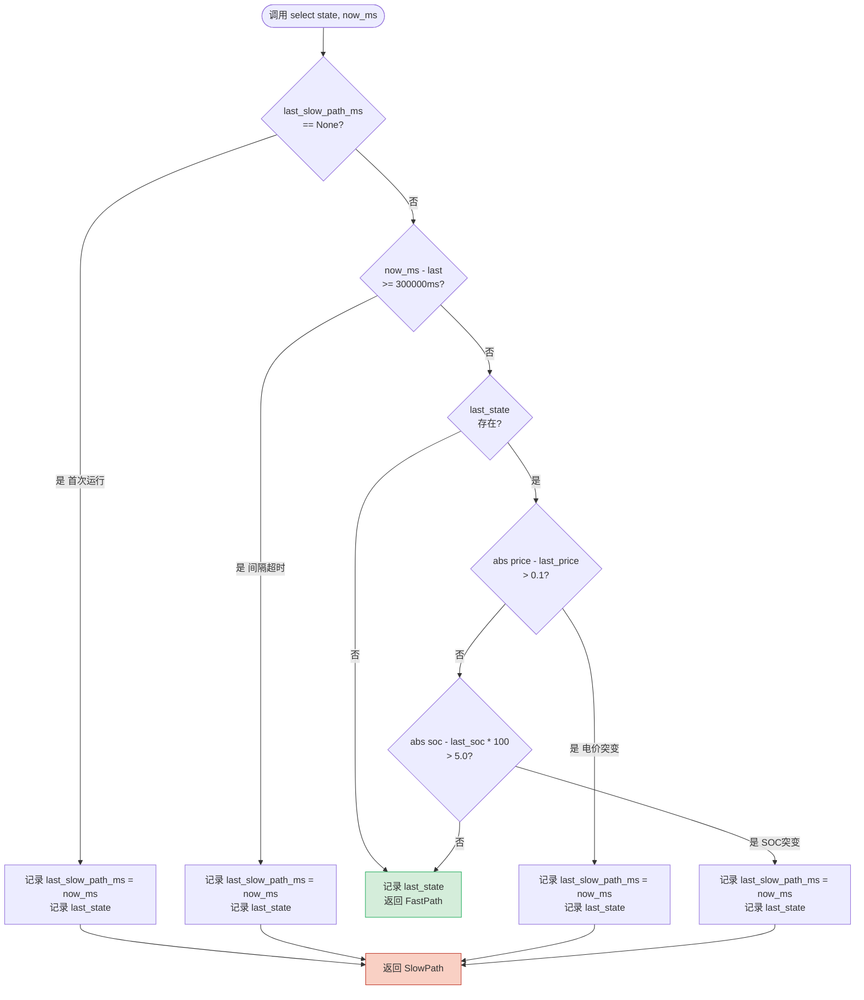
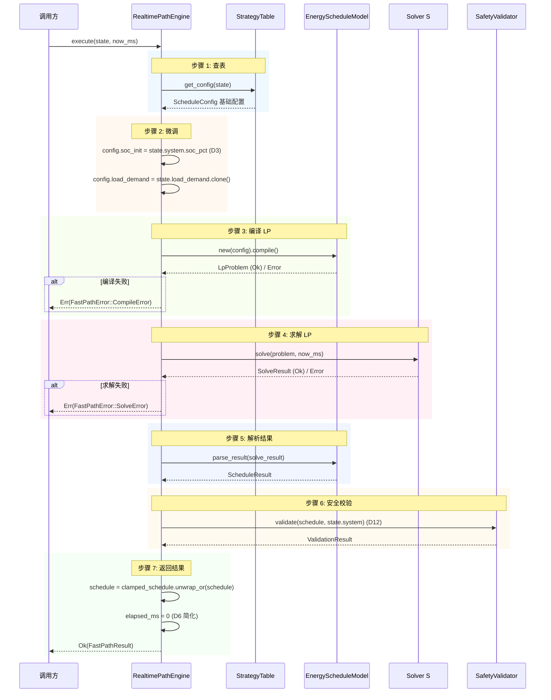

# EnerOS 实时快速路径引擎设计 — RealtimePathEngine + PathSelector + StrategyTable

> **版本**：v0.70.0（P1-K 双脑协同第二层，快路径执行层）
> **crate**：`eneros-fast-path`（`crates/ai/fast-path/`）
> **蓝图依据**：`蓝图/phase1.md` §v0.70.0（line 14854~15134）
> **覆盖版本**：v0.70.0
> **最后更新**：2026-07-16

---

## 1. 概述

### 1.1 一句话目标

构建实时快速路径，当系统状态变化在预期范围内时，跳过 LLM 推理，直接从实时状态生成 LP 参数并求解，目标延迟 < 500ms。

### 1.2 详细描述

v0.69.0 完成了 P1-K 双脑协同第一层（契约接口层），交付了 `IntentContract`（正向契约）与 `FeedbackContract`（反向契约），封装 LLM 与 Solver 之间的完整交互协议。但双脑架构仍有两条路径需要实现：

- **慢路径（LLM 路径，~2s）**：LLM 感知 → 意图 → Solver 求解。适用于系统状态发生显著变化、需要复杂规划的场景。慢路径每 5 分钟执行一次，或当电价/SOC/负荷突变时触发。
- **快路径（Solver only，<500ms）**：实时状态直接 → LP 参数 → Solver 求解。适用于系统状态在预定义阈值内的常规波动。快路径每 15s 执行一次，跳过 LLM 推理，保证对突发状态变化的快速响应。

v0.69.0 的契约接口层解决了"LLM ↔ Solver 怎么通信"的问题，但尚未解决"何时走慢路径、何时走快路径"以及"快路径如何独立于 LLM 完成调度决策"的问题。本版本（v0.70.0）进入 P1-K 双脑协同第二层（快路径执行层），针对快路径的完整链路构建路径选择、策略预计算、实时求解三大能力：

| 产出 | 角色 | 说明 |
|------|------|------|
| `PathType` | 路径类型枚举 | 2 变体（`SlowPath` / `FastPath`）；派生 `Debug + Clone + PartialEq`（D8，测试需要 `==` 比较） |
| `RealtimeState` | 实时状态包装器 | 3 字段（`system: SystemState` / `current_price: f64` / `load_demand: Option<Vec<f64>>`）；D4 包装 v0.67.0 `SystemState` 并补齐电价与负荷字段 |
| `PathSelector` | 路径选择器 | 5 步选择逻辑（首次 → 间隔超时 → 电价变化 → SOC 变化 → 默认快路径）；6 个可配置字段 |
| `StrategyTable` | 预计算策略表 | 3×3=9 种电价×SOC 组合（谷/平/峰 × 低/中/高）；D7 修复蓝图 bounds bug |
| `RealtimePathEngine<S>` | 快速路径引擎 | 泛型 `<S: Solver>`（D2，默认 `MockSolver`）；7 步执行流程（查表 → 微调 → 编译 → 求解 → 解析 → 校验 → 返回） |
| `FastPathResult` | 快速路径结果 | 5 字段（`schedule` / `solve_result` / `validation` / `elapsed_ms` / `path_type`）；派生 `Debug + Clone` |
| `FastPathError` | 错误类型 | 2 变体（`CompileError(String)` / `SolveError(String)`）；仅派生 `Debug`（D9） |

本版本核心设计决策（详见 §11 偏差声明 D1~D12）：

1. **D1**：`use core::time::Duration` 替代 `std::time::Duration`（no_std 合规）
2. **D2**：`RealtimePathEngine<S: Solver>` 泛型设计，默认 `MockSolver`（v0.64.0 `HighsSolver` feature-gated）
3. **D3**：`state.system.soc_pct` 替代蓝图 `state.soc`（v0.67.0 `SystemState` 字段名是 `soc_pct`）
4. **D4**：本地定义 `RealtimeState` 包装 v0.67.0 `SystemState`（蓝图引用 `current_price` / `load_demand` 但 v0.67.0 无此字段）
5. **D5**：不调用 `solver.set_time_limit()`（v0.64.0 `Solver` trait 用 `set_param`，Mock 不支持）
6. **D6**：`now_ms: u64` 参数替代 `Instant::now()`（no_std 无 `Instant`，参考 v0.57.0/v0.64.0 模式）
7. **D7**：`price_levels = vec![0.3, 0.7]` 替代蓝图 `vec![0.3, 0.6, 1.0]`（修复 bounds bug：3 bounds → 4 桶越界 panic）
8. **D8**：`PathType` / `RealtimeState` / `FastPathResult` 派生 `Debug + Clone`；`PathType` 额外派生 `PartialEq`（测试需要 `==`）
9. **D9**：`FastPathError` 仅派生 `Debug`（Karpathy 简化原则，与 v0.68.0/v0.69.0 一致）
10. **D10**：`last_slow_path_ms: Option<u64>` 替代 `Option<Instant>`（no_std 无 `Instant`）
11. **D11**：`core::time::Duration::from_secs(300)` 替代 `std::time::Duration`（no_std：`core::time::Duration` 可用）
12. **D12**：`validator.validate(&schedule, &state.system)` 替代 `validator.validate(&schedule, state)`（v0.67.0 `SafetyValidator::validate` 接收 `&SystemState`）

所有 Rust 代码必须 no_std（蓝图 §43.1），仅使用 `core::*` / `alloc::*`，无 `std::*`，`Vec` / `String` 来自 `extern crate alloc`，`Duration` 来自 `core::time`（D1/D11），时间戳通过 `now_ms: u64` 参数传入（D6），`RealtimePathEngine` 泛型于 `Solver` trait（D2，默认 `MockSolver`），`FastPathError` 仅派生 `Debug`（D9），纯 safe Rust 零 `unsafe`，无 FFI 需求（纯 Rust，无 `[features]` 段）。

### 1.3 架构定位

| 维度 | 定位 |
|------|------|
| Phase | Phase 1 单机 MVP |
| 子系统 | P1-K 双脑协同第二层（快路径执行层） |
| 平面 | 快平面与慢平面之间的桥接层（快路径本身属管理信息大区，但延迟约束 < 500ms） |
| 角色 | 双脑架构快路径执行引擎，当状态变化在阈值内时跳过 LLM 直接求解 |
| 上游版本 | v0.67.0（`SystemState` / `SafetyValidator` / `ValidationResult` 复用，D4/D12）；v0.66.0（`ScheduleConfig` / `EnergyScheduleModel` / `ScheduleResult` 复用）；v0.64.0（`Solver` trait / `MockSolver` / `LpProblem` / `SolveResult` 复用，D2）；v0.11.0 用户堆（alloc 支持） |
| 同层版本 | v0.70.0（本版本，快路径执行） |
| 下游版本 | v0.71.0 双脑联调（编排 LLM 慢路径 + 快路径 + SafetyValidator，依赖本版本 `RealtimePathEngine` + `PathSelector`） |
| 部署形态 | 纯 Rust crate，无 C 库依赖，无 FFI，CPU 编译运行 |

### 1.4 路线图链路

```
v0.64.0 Solver trait + MockSolver ──► v0.65.0 建模 DSL
           │                                │
           │                                ▼
           │                        v0.66.0 能源 LP（ScheduleConfig / EnergyScheduleModel）
           │                                │
           │                                ▼
           │                        v0.67.0 安全校验（SystemState / SafetyValidator）
           │                                │
           ▼                                ▼
   LpProblem 矩阵 ◄─── v0.68.0 意图解析（IntentParser + Intent）◄── LLM JSON 意图
                                │
                                ▼
                       v0.69.0 意图契约（IntentContract / FeedbackContract）
                                │
                                ▼
                       v0.70.0 快路径引擎（本版本）
                       RealtimePathEngine / PathSelector / StrategyTable
                       PathType / RealtimeState / FastPathResult
                                │
                                ├──► v0.71.0 双脑联调（编排 LLM 慢路径 + 快路径切换）
                                │
                                └──► 闭环：快路径每 15s 执行，慢路径每 5min 或突变触发
```

### 1.5 依赖关系

| 依赖 | 来源 | 用途 |
|------|------|------|
| `eneros_solver_core::solver::Solver` | v0.64.0 crate（path 依赖） | `RealtimePathEngine<S: Solver>` 泛型约束（D2） |
| `eneros_solver_core::mock::MockSolver` | v0.64.0 crate | 默认求解器（D2，`default_with_mock()` 工厂） |
| `eneros_solver_core::problem::LpProblem` | v0.64.0 crate | `solver.solve(&problem, now_ms)` 第一参数 |
| `eneros_solver_core::result::SolveResult` | v0.64.0 crate | `FastPathResult.solve_result` 字段类型 |
| `eneros_energy_lp_model::config::ScheduleConfig` | v0.66.0 crate（path 依赖） | `RealtimePathEngine.default_config` / `StrategyTable.strategies` 元素类型 |
| `eneros_energy_lp_model::model::EnergyScheduleModel` | v0.66.0 crate | `execute()` 中 `new(config).compile()` 编译为 `LpProblem` |
| `eneros_energy_lp_model::result::ScheduleResult` | v0.66.0 crate | `FastPathResult.schedule` 字段类型 |
| `eneros_safety_validator::state::SystemState` | v0.67.0 crate（path 依赖） | `RealtimeState.system` 字段类型（D4，包装复用） |
| `eneros_safety_validator::validator::SafetyValidator` | v0.67.0 crate | `RealtimePathEngine.validator` 字段类型 |
| `eneros_safety_validator::result::ValidationResult` | v0.67.0 crate | `FastPathResult.validation` 字段类型 |
| `core::time::Duration` | `core` crate | `PathSelector.min_slow_path_interval` 字段类型（D1/D11） |
| `alloc::string::String` | `alloc` crate | `FastPathError` 变体载荷（D9） |
| `alloc::vec::Vec` | `alloc` crate | `StrategyTable.strategies` / `RealtimeState.load_demand` 字段 |

> **注**：本版本**不重定义**任何上游类型，全部通过 path 依赖复用。本地定义的类型仅有 `PathType` / `RealtimeState` / `PathSelector` / `StrategyTable` / `RealtimePathEngine` / `FastPathResult` / `FastPathError`。本版本不依赖 v0.59.0~v0.63.0 LLM crate（快路径完全跳过 LLM 推理），不依赖 v0.68.0 `IntentParser`（快路径不解析意图），不依赖 v0.69.0 `IntentContract`（快路径不走契约通道）。

### 1.6 设计原则关联

| 原则 | 关联 |
|------|------|
| Karpathy "Simplicity First" | `FastPathError` 仅派生 `Debug`（D9）；无 `[features]` 段（纯 Rust）；`elapsed_ms` 简化为 `solve_result.elapsed_ms`（D6） |
| Karpathy "Surgical Changes" | 复用 v0.64.0/v0.66.0/v0.67.0 全部上游类型，不重定义（D2~D4/D12）；仅新增 7 个本地类型 |
| Karpathy "Think Before Coding" | D1~D12 偏差声明表记录所有蓝图偏离，每项均有明确理由 |
| 蓝图 §43.1 no_std | `#![cfg_attr(not(test), no_std)]` + `extern crate alloc`；`core::time::Duration`（D1）；`now_ms: u64` 替代 `Instant`（D6/D10） |
| 蓝图 §43.2 骨架可用 | 非瓶颈版本，但 trait/struct 签名可编译，7 步执行流程完整实现，22 项测试全通过 |
| 蓝图 §43.6 内存预算 | Agent Runtime 分区 ≤ 64 MB；快路径无堆分配热点（`StrategyTable` 9 个 `ScheduleConfig` 静态预计算） |

---

## 2. 前置依赖

### 2.1 依赖版本表

| 版本 | crate | 提供能力 | 本版本使用点 |
|------|-------|---------|-------------|
| v0.11.0 | `eneros-user-heap` | 用户态堆分配 | `alloc::vec::Vec` / `alloc::string::String` 支持 |
| v0.64.0 | `eneros-solver-core` | `Solver` trait / `MockSolver` / `LpProblem` / `SolveResult` | `RealtimePathEngine<S: Solver>` 泛型约束（D2）；`execute()` 求解步骤 |
| v0.66.0 | `eneros-energy-lp-model` | `ScheduleConfig` / `EnergyScheduleModel` / `ScheduleResult` | `StrategyTable` 策略元素；`execute()` 编译与解析步骤 |
| v0.67.0 | `eneros-safety-validator` | `SystemState` / `SafetyValidator` / `ValidationResult` | `RealtimeState.system` 字段（D4）；`execute()` 校验步骤（D12） |

### 2.2 v0.64.0 Solver trait

v0.64.0 交付了 `Solver` trait 统一抽象，所有 LP/MIP 求解器实现此 trait。trait 不要求 `Send + Sync`（与 v0.59.0 `LlmEngine` 一致；HiGHS 对象非线程安全）。

```rust
pub trait Solver {
    fn solve(&mut self, problem: &LpProblem, now_ms: u64) -> Result<SolveResult, SolverError>;
    fn name(&self) -> &'static str;
    fn version(&self) -> &'static str;
    fn set_param(&mut self, key: &str, value: &str) -> Result<(), SolverError>;
    fn status(&self) -> SolverStatus;
}
```

本版本使用点：
- `RealtimePathEngine<S: Solver>` 泛型约束（D2）
- `solver.solve(&problem, now_ms)` 求解 LP（D5：不调用 `set_time_limit`，用 `set_param` 替代，Mock 不支持）
- `MockSolver` 作为默认求解器（`default_with_mock()` 工厂方法）
- `now_ms: u64` 参数传入 `solve()`，由调用方提供时间戳（D6）

### 2.3 v0.66.0 能源调度 LP 模型

v0.66.0 交付了储能调度 LP 模型，核心类型 `ScheduleConfig`（14 字段）与 `EnergyScheduleModel`（编译 + 解析）。

`ScheduleConfig` 关键字段：
- `num_periods` / `period_hours`：调度时段配置
- `pcs_power_kw` / `battery_capacity_kwh`：设备额定参数
- `soc_min` / `soc_max` / `soc_init` / `soc_final`：SOC 约束
- `charge_ramp_kw` / `discharge_ramp_kw`：爬坡率限制
- `charge_efficiency` / `discharge_efficiency`：充放电效率
- `price: Vec<f64>`：电价曲线
- `load_demand: Option<Vec<f64>>`：负荷需求曲线

本版本使用点：
- `StrategyTable::new(default: ScheduleConfig)` 以默认配置为基础生成 9 种策略
- `execute()` 微调步骤：`config.soc_init = state.system.soc_pct`（D3）；`config.load_demand = state.load_demand.clone()`
- `EnergyScheduleModel::new(config).compile()` 编译为 `LpProblem`（D7：map_err 为 `CompileError`）
- `model.parse_result(&solve_result)` 解析为 `ScheduleResult`

### 2.4 v0.67.0 安全校验器

v0.67.0 交付了安全校验器，核心类型 `SystemState`（5 电气字段）与 `SafetyValidator`。

`SystemState` 字段：
- `voltage_v: f64`：母线电压（V）
- `current_a: f64`：母线电流（A）
- `frequency_hz: f64`：系统频率（Hz）
- `soc_pct: f64`：储能 SOC（0.0~1.0）
- `timestamp_ms: u64`：时间戳（ms）

本版本使用点：
- `RealtimeState.system: SystemState`（D4：包装复用，不重定义）
- `state.system.soc_pct` 替代蓝图 `state.soc`（D3：字段名修正）
- `validator.validate(&schedule, &state.system)`（D12：传 `&state.system` 给 `SafetyValidator::validate`，蓝图写 `state` 但 `validate` 接收 `&SystemState`）
- `ValidationResult` 作为 `FastPathResult.validation` 字段类型
- `validation.clamped_schedule.unwrap_or(schedule)` 优先使用截断后的安全调度方案

### 2.5 v0.68.0 IntentParser（间接关系）

v0.68.0 交付了意图解析器，将 LLM 输出的 JSON 意图反序列化为 `Intent` 并转换为 `ScheduleConfig`。本版本**不直接依赖** v0.68.0（快路径完全跳过 LLM 推理与意图解析），但 v0.71.0 双脑联调时会桥接：
- 慢路径：LLM → `IntentParser` → `ScheduleConfig` → `RealtimePathEngine`（复用本版本引擎）
- 快路径：`RealtimeState` → `StrategyTable` → `ScheduleConfig` → `RealtimePathEngine`（本版本完整链路）

### 2.6 依赖关系图

```
                         ┌─────────────────────────┐
                         │  v0.67.0 SystemState     │
                         │  (voltage/current/freq/  │
                         │   soc_pct/timestamp)     │
                         └────────────┬─────────────┘
                                      │ 包装 (D4)
                                      ▼
┌──────────────────┐    ┌─────────────────────────┐
│ v0.66.0          │    │  v0.70.0 RealtimeState   │
│ ScheduleConfig   │◄───┤  (system + current_price │
│ EnergySchedule   │    │   + load_demand)         │
│ Model            │    └────────────┬─────────────┘
│ ScheduleResult   │                 │
└────────┬─────────┘                 │ 输入
         │                           ▼
         │ compile/parse    ┌─────────────────────────┐
         │                  │  v0.70.0 PathSelector    │
         │                  │  (5 步选择逻辑)          │
         │                  └────────────┬─────────────┘
         │                               │ PathType
         │                               ▼
         │                  ┌─────────────────────────┐
         │                  │  v0.70.0 StrategyTable   │
         │                  │  (3×3=9 策略, D7)        │
         │                  └────────────┬─────────────┘
         │                               │ ScheduleConfig
         │                               ▼
         │ get_config        ┌─────────────────────────┐
         ├──────────────────►│  v0.70.0 RealtimePath    │
         │                   │  Engine<S: Solver>       │
         │                   │  (7 步执行, D2)          │
         │                   └────────────┬─────────────┘
         │                                │
┌────────┴─────────┐                      │ solve
│ v0.64.0 Solver    │◄─────────────────────┤
│ MockSolver        │                      │
│ LpProblem         │                      ▼
│ SolveResult       │           ┌─────────────────────────┐
└───────────────────┘           │  v0.70.0 FastPathResult  │
                                │  (schedule + solve_result│
┌──────────────────┐            │   + validation + elapsed │
│ v0.67.0 Safety   │◄───────────┤   + path_type)           │
│ Validator        │  validate  └─────────────────────────┘
│ ValidationResult │
└──────────────────┘
```

---

## 3. 交付物清单

### 3.1 crate 概览

| 项 | 值 |
|----|-----|
| crate 名 | `eneros-fast-path` |
| 路径 | `crates/ai/fast-path/` |
| 子系统 | `crates/ai/`（AI Runtime） |
| 版本 | 0.70.0（workspace 继承） |
| 描述 | EnerOS v0.70.0 Realtime fast path engine (Solver-only, <500ms, no_std) |
| features | 无（纯 Rust，无 FFI，D9） |
| 依赖 | `eneros-solver-core` / `eneros-energy-lp-model` / `eneros-safety-validator` |

### 3.2 核心类型清单

| 类型 | 模块 | 角色 | 派生 |
|------|------|------|------|
| `PathType` | `selector` | 路径类型枚举（`SlowPath` / `FastPath`） | `Debug + Clone + PartialEq`（D8） |
| `RealtimeState` | `state` | 实时状态包装器（`system` + `current_price` + `load_demand`） | `Debug + Clone`（D8） |
| `PathSelector` | `selector` | 路径选择器（5 步选择逻辑） | 无（含 `Option` 字段） |
| `StrategyTable` | `strategy` | 预计算策略表（3×3=9 策略） | 无（含 `Vec` 字段） |
| `RealtimePathEngine<S>` | `engine` | 快速路径引擎（泛型 `<S: Solver>`） | 无（泛型结构体） |
| `FastPathResult` | `engine` | 快速路径结果（5 字段） | `Debug + Clone`（D8） |
| `FastPathError` | `error` | 错误类型（2 变体） | `Debug`（D9，仅 Debug） |

### 3.3 测试清单

共 22 项集成测试（T1~T22），全部位于 `src/lib.rs` 的 `#[cfg(test)] mod tests`：

| 测试 | 描述 | 验证点 |
|------|------|--------|
| T1 | `PathType` 枚举变体 + PartialEq | `SlowPath != FastPath`，`FastPath == FastPath` |
| T2 | `RealtimeState` 显式构造 | `current_price=0.5`，`soc_pct=0.5`，`load_demand=None` |
| T3 | `RealtimeState::default()` | 等价显式构造 |
| T4 | `PathSelector::new()` 默认阈值 | `0.1 / 5.0 / 20.0 / 300s / None / None` |
| T5 | `select()` 首次走慢路径 | `last_slow_path_ms == Some(0)` |
| T6 | `select()` 间隔内走快路径 | `now_ms=1000`（< 300000ms）→ `FastPath` |
| T7 | `select()` 间隔超时走慢路径 | `now_ms=301000`（> 300s）→ `SlowPath` |
| T8 | `select()` 电价变化走慢路径 | `0.5 → 0.7`（变化 0.2 > 0.1）→ `SlowPath` |
| T9 | `select()` SOC 变化走慢路径 | `0.5 → 0.6`（变化 10% > 5%）→ `SlowPath` |
| T10 | `StrategyTable::new()` 3×3=9 策略 | `price_levels.len()==2`，`strategies.len()==3`，每行 3 |
| T11 | 谷时低 SOC 策略 | `price=0.2, soc=0.2` → `soc_final == Some(0.8)` |
| T12 | 峰时高 SOC 策略 | `price=0.8, soc=0.8` → `soc_final == Some(0.3)` |
| T13 | 平时中 SOC 策略 | `price=0.5, soc=0.5` → `soc_final == None` |
| T14 | 边界 price=0.29 < 0.3 → 谷时 | `soc_final == Some(0.8)` |
| T15 | `RealtimePathEngine::new()` 构造 | `solver.name()=="MockSolver"`，`strategies.len()==3` |
| T16 | `execute()` 端到端成功 | `result.is_ok()` |
| T17 | `execute()` 返回 `FastPath` | `result.path_type == PathType::FastPath` |
| T18 | `execute()` soc_pct=0.7 不 panic | `result.is_ok()` |
| T19 | `execute()` 带 load_demand | `load_demand=Some(vec![50.0; 96])` → `result.is_ok()` |
| T20 | `default_with_mock()` 等价 | `solver.name()` / `strategies.len()` 一致 |
| T21 | 端到端：Selector → Engine | `select(FastPath) → execute()` 成功 |
| T22 | 安全校验字段可访问 | `validation.passed: bool`，`validation.violations: Vec` |

### 3.4 crate 目录结构

```
crates/ai/fast-path/
├── Cargo.toml          # 包配置（3 依赖，无 features）
└── src/
    ├── lib.rs          # 模块声明 + D1~D12 偏差表 + 22 项测试
    ├── error.rs        # FastPathError（2 变体，仅 Debug）
    ├── state.rs        # RealtimeState（包装 SystemState, D4）
    ├── selector.rs     # PathType + PathSelector（5 步选择）
    ├── strategy.rs     # StrategyTable（3×3=9 策略, D7）
    └── engine.rs       # RealtimePathEngine + FastPathResult（7 步执行）
```

---

## 4. 详细设计

### 4.1 路径类型 PathType

`PathType` 枚举定义双脑架构的两条路径：

```rust
/// 路径类型（D8：派生 Debug + Clone + PartialEq，测试需要 == 比较）.
#[derive(Debug, Clone, PartialEq)]
pub enum PathType {
    /// 慢路径（LLM 路径，~2s）.
    SlowPath,
    /// 快路径（Solver only，<500ms）.
    FastPath,
}
```

| 变体 | 含义 | 延迟 | 触发条件 |
|------|------|------|---------|
| `SlowPath` | LLM 路径：LLM 感知 → 意图 → Solver 求解 | ~2s | 首次运行 / 间隔超时（> 5min）/ 电价变化 > 0.1 元 / SOC 变化 > 5% |
| `FastPath` | Solver only：实时状态 → LP 参数 → Solver 求解 | < 500ms | 默认（状态变化在阈值内） |

派生 `PartialEq`（D8）：测试需要 `assert_eq!(path, PathType::FastPath)` 比较，不派生则编译失败。

### 4.2 实时状态 RealtimeState（D4）

`RealtimeState` 是本版本本地定义的实时状态包装器（D4）：

```rust
/// 实时状态（D4：包装 v0.67.0 SystemState + current_price + load_demand）.
#[derive(Debug, Clone)]
pub struct RealtimeState {
    /// 系统电气状态（v0.67.0：voltage_v/current_a/frequency_hz/soc_pct/timestamp_ms）.
    pub system: SystemState,
    /// 当前电价（元/kWh）.
    pub current_price: f64,
    /// 各时段负荷需求（kW，可选）.
    pub load_demand: Option<Vec<f64>>,
}

impl Default for RealtimeState {
    fn default() -> Self {
        Self {
            system: SystemState::default(),
            current_price: 0.5,
            load_demand: None,
        }
    }
}
```

**D4 偏差说明**：蓝图 §v0.70.0 引用 `state.current_price` / `state.load_demand` / `state.soc`，暗示 `SystemState` 含电价与负荷字段。但 v0.67.0 `SystemState` 仅含 5 个电气字段（`voltage_v` / `current_a` / `frequency_hz` / `soc_pct` / `timestamp_ms`），无电价与负荷。本版本本地定义 `RealtimeState` 包装 `SystemState` 并补齐 `current_price` / `load_demand` 字段，避免修改 v0.67.0 已发布接口（Surgical Changes 原则）。

默认值：
- `system`：`SystemState::default()`（380V / 0A / 50Hz / 0.5 SOC / 0ms）
- `current_price`：0.5 元/kWh（典型平价）
- `load_demand`：`None`（无负荷需求约束）

### 4.3 路径选择器 PathSelector

`PathSelector` 根据状态变化阈值与时间间隔决定走快/慢路径：

```rust
pub struct PathSelector {
    /// 电价变化阈值（元/kWh）.
    pub price_change_threshold: f64,
    /// SOC 变化阈值（百分比，5.0 表示 5%）.
    pub soc_change_threshold: f64,
    /// 负荷变化阈值（kW）.
    pub load_change_threshold: f64,
    /// 上次慢路径时间戳（ms）（D10: 替代 Option<Instant>）.
    pub last_slow_path_ms: Option<u64>,
    /// 最小慢路径间隔（D11: core::time::Duration）.
    pub min_slow_path_interval: Duration,
    /// 上次状态快照.
    pub last_state: Option<RealtimeState>,
}
```

默认阈值（`new()`）：

| 字段 | 默认值 | 说明 |
|------|--------|------|
| `price_change_threshold` | 0.1 | 电价变化 > 0.1 元/kWh 触发慢路径 |
| `soc_change_threshold` | 5.0 | SOC 变化 > 5% 触发慢路径（与 0.0~1.0 比较，5% = 0.05） |
| `load_change_threshold` | 20.0 | 负荷变化 > 20 kW 触发慢路径（预留字段） |
| `last_slow_path_ms` | `None` | 首次运行为 None |
| `min_slow_path_interval` | 300s | 最小慢路径间隔 5 分钟 |
| `last_state` | `None` | 首次无状态快照 |

**5 步选择逻辑**（`select(&mut self, state: &RealtimeState, now_ms: u64) -> PathType`）：

```rust
pub fn select(&mut self, state: &RealtimeState, now_ms: u64) -> PathType {
    // 1. 首次运行走慢路径
    match self.last_slow_path_ms {
        None => {
            self.last_slow_path_ms = Some(now_ms);
            self.last_state = Some(state.clone());
            return PathType::SlowPath;
        }
        Some(last) => {
            // 2. 间隔超时走慢路径 (now_ms - last >= interval_ms)
            let interval_ms = self.min_slow_path_interval.as_millis() as u64;
            if now_ms.saturating_sub(last) >= interval_ms {
                self.last_slow_path_ms = Some(now_ms);
                self.last_state = Some(state.clone());
                return PathType::SlowPath;
            }
        }
    }

    // 3. 检查状态变化
    if let Some(last_state) = &self.last_state {
        let price_delta = (state.current_price - last_state.current_price).abs();
        if price_delta > self.price_change_threshold {
            self.last_slow_path_ms = Some(now_ms);
            self.last_state = Some(state.clone());
            return PathType::SlowPath;
        }

        let soc_delta_pct = ((state.system.soc_pct - last_state.system.soc_pct).abs()) * 100.0;
        if soc_delta_pct > self.soc_change_threshold {
            self.last_slow_path_ms = Some(now_ms);
            self.last_state = Some(state.clone());
            return PathType::SlowPath;
        }
    }

    // 5. 默认走快路径
    self.last_state = Some(state.clone());
    PathType::FastPath
}
```

| 步骤 | 条件 | 结果 | 说明 |
|------|------|------|------|
| 1 | `last_slow_path_ms == None` | `SlowPath` | 首次运行，初始化基线 |
| 2 | `now_ms - last >= 300000ms` | `SlowPath` | 间隔超时（> 5min），周期性刷新 |
| 3 | `\|price - last_price\| > 0.1` | `SlowPath` | 电价突变 |
| 4 | `\|soc - last_soc\| * 100 > 5.0` | `SlowPath` | SOC 突变（百分比比较） |
| 5 | 默认 | `FastPath` | 状态变化在阈值内 |

> **注**：`load_change_threshold` 字段已定义但 `select()` 当前未实现负荷变化检查（蓝图 §4.3 仅要求电价与 SOC 检查）。该字段为预留扩展点，v0.71.0 双脑联调时可启用。

### 4.4 预计算策略表 StrategyTable（D7）

`StrategyTable` 预计算 3×3=9 种电价×SOC 组合的调度策略（D7：修复蓝图 bounds bug）：

```rust
pub struct StrategyTable {
    /// 电价分界线（谷/平、平/峰）.
    pub price_levels: Vec<f64>,
    /// SOC 分界线（低/中、中/高）.
    pub soc_levels: Vec<f64>,
    /// 策略矩阵（3×3）.
    pub strategies: Vec<Vec<ScheduleConfig>>,
}
```

**D7 偏差说明（蓝图 bounds bug 修复）**：

蓝图原文 `price_levels = vec![0.3, 0.6, 1.0]`（3 个 bounds → 4 个桶），但策略矩阵只有 3 行。`get_config()` 使用 `unwrap_or(price_levels.len())`，当 `current_price >= 1.0` 时 `position()` 返回 `None`，`unwrap_or(3)` 访问 `strategies[3]` 越界 panic。

本版本改为 `vec![0.3, 0.7]`（2 个 bounds → 3 个桶：谷/平/峰），与 3×3 矩阵匹配：

| price_bucket | 范围 | 含义 | `soc_final` 策略 |
|--------------|------|------|-----------------|
| 0 | `price < 0.3` | 谷时 | `Some(0.8)`（倾向充电） |
| 1 | `0.3 <= price < 0.7` | 平时 | `None`（自主调度） |
| 2 | `price >= 0.7` | 峰时 | `Some(0.3)`（倾向放电） |

| soc_bucket | 范围 | 含义 |
|------------|------|------|
| 0 | `soc < 0.3` | 低 SOC |
| 1 | `0.3 <= soc < 0.7` | 中 SOC |
| 2 | `soc >= 0.7` | 高 SOC |

**策略矩阵构建**（`new(default: ScheduleConfig)`）：

```rust
pub fn new(default: ScheduleConfig) -> Self {
    let price_levels = vec![0.3, 0.7]; // 谷/平分界，平/峰分界 → 3 桶
    let soc_levels = vec![0.3, 0.7];   // 低/中分界，中/高分界 → 3 桶

    let mut strategies = Vec::new();
    for price_bucket in 0..=price_levels.len() {  // 0..=2 → 3 桶
        let mut row = Vec::new();
        for _ in 0..=soc_levels.len() {            // 0..=2 → 3 桶
            let mut config = default.clone();
            match price_bucket {
                0 => config.soc_final = Some(0.8), // 谷时：倾向充电
                2 => config.soc_final = Some(0.3), // 峰时：倾向放电
                _ => config.soc_final = None,      // 平时：自主调度
            }
            row.push(config);
        }
        strategies.push(row);
    }

    Self { price_levels, soc_levels, strategies }
}
```

**查表逻辑**（`get_config(&self, state: &RealtimeState) -> ScheduleConfig`）：

```rust
pub fn get_config(&self, state: &RealtimeState) -> ScheduleConfig {
    let price_idx = self.price_levels
        .iter()
        .position(|&b| state.current_price < b)
        .unwrap_or(self.price_levels.len());
    let soc_idx = self.soc_levels
        .iter()
        .position(|&b| state.system.soc_pct < b)
        .unwrap_or(self.soc_levels.len());
    self.strategies[price_idx][soc_idx].clone()
}
```

`position()` 返回第一个满足 `current_price < bound` 的索引；若无（即 `current_price >= 0.7`），`unwrap_or(2)` 返回最后一个桶索引。2 个 bounds → 索引范围 0~2，与 3×3 矩阵匹配，不会越界。

### 4.5 快速路径引擎 RealtimePathEngine（D2）

`RealtimePathEngine<S: Solver>` 是快路径的核心引擎（D2：泛型 Solver，默认 `MockSolver`）：

```rust
pub struct RealtimePathEngine<S: Solver> {
    /// 求解器.
    pub solver: S,
    /// 默认调度配置.
    pub default_config: ScheduleConfig,
    /// 安全校验器.
    pub validator: SafetyValidator,
    /// 预计算策略表.
    pub strategy_table: StrategyTable,
}
```

**D2 偏差说明**：蓝图原文 `solver: HighsSolver`（直接使用 HiGHS 求解器）。但 v0.64.0 `HighsSolver` 是 feature-gated（需启用 `highs` feature，依赖 C FFI），默认仅 `MockSolver` 可用。本版本采用泛型 `<S: Solver>` 设计，默认用 `MockSolver`，生产环境可替换为 `HighsSolver`（启用 feature）。这与 v0.59.0 `LlmEngine` 的泛型设计模式一致。

**7 步执行流程**（`execute(&mut self, state: &RealtimeState, now_ms: u64) -> Result<FastPathResult, FastPathError>`）：

```rust
pub fn execute(
    &mut self,
    state: &RealtimeState,
    now_ms: u64,
) -> Result<FastPathResult, FastPathError> {
    // 1. 查表获取基础配置
    let mut config = self.strategy_table.get_config(state);

    // 2. 微调：soc_init + load_demand
    config.soc_init = state.system.soc_pct;        // D3: 使用 soc_pct
    config.load_demand = state.load_demand.clone();

    // 3. 编译 LP
    let model = EnergyScheduleModel::new(config.clone());
    let problem = model
        .compile()
        .map_err(|e| FastPathError::CompileError(alloc::format!("{:?}", e)))?;

    // 4. 求解 LP
    let solve_result = self
        .solver
        .solve(&problem, now_ms)
        .map_err(|e| FastPathError::SolveError(alloc::format!("{:?}", e)))?;

    // 5. 解析结果
    let schedule = model.parse_result(&solve_result);

    // 6. 安全校验（D12: 传 state.system 给 v0.67.0 SafetyValidator）
    let validation = self.validator.validate(&schedule, &state.system);

    // 7. 返回结果（elapsed_ms 暂用 0，D6）
    Ok(FastPathResult {
        schedule: validation.clamped_schedule.clone().unwrap_or(schedule),
        solve_result,
        validation,
        elapsed_ms: 0,  // D6: 简化，用 solve_result.elapsed_ms 代替
        path_type: PathType::FastPath,
    })
}
```

| 步骤 | 操作 | 偏差 | 说明 |
|------|------|------|------|
| 1 | `strategy_table.get_config(state)` | D7 | 查表获取基础 `ScheduleConfig`（3×3 策略） |
| 2 | `config.soc_init = state.system.soc_pct` | D3 | 微调 SOC 初始值（蓝图 `state.soc` → `state.system.soc_pct`） |
| 2 | `config.load_demand = state.load_demand.clone()` | — | 微调负荷需求 |
| 3 | `EnergyScheduleModel::new(config).compile()` | D7 | 编译为 `LpProblem`，`map_err` 为 `CompileError` |
| 4 | `solver.solve(&problem, now_ms)` | D5/D6 | 求解 LP，`map_err` 为 `SolveError`；不调用 `set_time_limit` |
| 5 | `model.parse_result(&solve_result)` | — | 解析为 `ScheduleResult` |
| 6 | `validator.validate(&schedule, &state.system)` | D12 | 安全校验，传 `&state.system`（蓝图 `state` → `state.system`） |
| 7 | 返回 `FastPathResult` | D6 | `elapsed_ms = 0`（简化，用 `solve_result.elapsed_ms` 代替） |

**默认构造**（`default_with_mock()`）：

```rust
impl RealtimePathEngine<eneros_solver_core::mock::MockSolver> {
    /// 默认构造（使用 MockSolver，D2）.
    pub fn default_with_mock() -> Self {
        Self::new(
            ScheduleConfig::default(),
            eneros_solver_core::mock::MockSolver::new(),
        )
    }
}
```

### 4.6 结果与错误类型

**FastPathResult**（5 字段，派生 `Debug + Clone`）：

```rust
#[derive(Debug, Clone)]
pub struct FastPathResult {
    /// 调度方案（截断后优先）.
    pub schedule: ScheduleResult,
    /// 求解结果.
    pub solve_result: SolveResult,
    /// 安全校验结果.
    pub validation: ValidationResult,
    /// 执行耗时（ms，D6: 简化，用 solve_result.elapsed_ms 代替）.
    pub elapsed_ms: u64,
    /// 路径类型.
    pub path_type: PathType,
}
```

`schedule` 字段优先使用 `validation.clamped_schedule`（安全校验截断后的方案），若校验未截断则使用原始 `schedule`。

**FastPathError**（2 变体，仅派生 `Debug`，D9）：

```rust
#[derive(Debug)]
pub enum FastPathError {
    /// LP 编译错误.
    CompileError(String),
    /// 求解错误.
    SolveError(String),
}
```

**D9 偏差说明**：蓝图要求 `FastPathError` 派生 `Debug + Clone`。本版本仅派生 `Debug`（Karpathy 简化原则），理由：
1. 错误类型携带 `String` 载荷，`Clone` 需复制字符串，无实际需求
2. 与 v0.68.0 `IntentError` / v0.69.0 `ContractError` 一致（均仅 `Debug`）
3. 错误一旦发生即向上传播处理，无需克隆比较

### 4.7 Mermaid 图

#### 图 1：快/慢路径选择流程图



#### 图 2：快速路径执行时序图



---

## 5. 技术交底

### 5.1 双路径设计

双脑架构的两条路径分工明确，覆盖不同的响应延迟与决策复杂度：

| 维度 | 慢路径（LLM 路径） | 快路径（Solver only） |
|------|-------------------|---------------------|
| 执行频率 | 每 5 分钟一次，或突变触发 | 每 15 秒一次 |
| 延迟目标 | ~2s（LLM 推理 ~1.5s + Solver ~0.1s + 序列化 ~0.4s） | < 500ms（查表 ~1ms + LP 编译 ~5ms + 求解 ~100ms + 校验 ~1ms ≈ ~110ms） |
| 决策能力 | 复杂规划（多目标、约束推理、自然语言理解） | 常规调度（预计算策略 + LP 求解） |
| LLM 依赖 | 是（LLM 感知 → 意图 → Solver） | 否（完全跳过 LLM） |
| 触发条件 | 首次 / 间隔超时 / 电价突变 / SOC 突变 | 默认（状态变化在阈值内） |
| 数据流 | LLM JSON → IntentParser → IntentContract → Solver | RealtimeState → StrategyTable → Solver |
| 本版本实现 | 否（v0.71.0 双脑联调实现） | 是（本版本完整实现） |

快路径的核心价值：当系统状态在预期范围内波动时（如电价小幅波动、SOC 缓慢变化），无需 LLM 重新推理，直接从预计算策略表获取基础配置、微调实时参数、求解 LP，将响应延迟从 ~2s 降到 < 500ms，满足实时性要求。

### 5.2 路径选择条件

`PathSelector` 的 5 步选择逻辑覆盖所有触发慢路径的场景：

| 条件 | 阈值 | 说明 |
|------|------|------|
| 首次运行 | `last_slow_path_ms == None` | 系统启动后必须先走一次慢路径，建立 LLM 基线调度 |
| 间隔超时 | `now_ms - last >= 300000ms`（5min） | 周期性刷新 LLM 调度，防止快路径长期运行累积偏差 |
| 电价突变 | `\|price - last_price\| > 0.1` 元/kWh | 电价显著变化需 LLM 重新规划充放电策略 |
| SOC 突变 | `\|soc - last_soc\| * 100 > 5.0`（5%） | SOC 显著变化（如突发负荷导致快速放电）需 LLM 重新评估 |
| 默认 | 以上均不满足 | 状态在阈值内，走快路径 |

> **注**：`load_change_threshold`（20 kW）已定义但 `select()` 未实现负荷变化检查。蓝图 §4.3 仅要求电价与 SOC 检查，负荷变化检查为预留扩展点。

### 5.3 预计算策略表

`StrategyTable` 预计算 3×3=9 种策略，避免每次快路径执行时动态生成 `ScheduleConfig`：

```
         SOC 低 (< 0.3)    SOC 中 (0.3~0.7)    SOC 高 (>= 0.7)
谷时      soc_final=0.8     soc_final=0.8       soc_final=0.8
(< 0.3)   倾向充电          倾向充电            倾向充电

平时      soc_final=None    soc_final=None      soc_final=None
(0.3~0.7) 自主调度          自主调度            自主调度

峰时      soc_final=0.3     soc_final=0.3       soc_final=0.3
(>= 0.7)  倾向放电          倾向放电            倾向放电
```

策略语义：
- **谷时**（`price < 0.3`）：电价低，倾向充电，`soc_final = Some(0.8)`（充至 80% SOC）
- **峰时**（`price >= 0.7`）：电价高，倾向放电，`soc_final = Some(0.3)`（放至 30% SOC）
- **平时**（`0.3 <= price < 0.7`）：电价适中，自主调度，`soc_final = None`（不约束终值，由 LP 优化决定）

> **D7 修复说明**：蓝图 `price_levels = vec![0.3, 0.6, 1.0]` 有 3 个 bounds → 4 个桶，但矩阵仅 3 行，`unwrap_or(3)` 访问 `strategies[3]` 越界 panic。本版本改为 `vec![0.3, 0.7]`（2 bounds → 3 桶），与 3×3 矩阵匹配。同时 `0.6` 改为 `0.7` 使平/峰分界更合理（0.7 元/kWh 是工业电价峰值的典型值）。

### 5.4 延迟分解

快路径执行延迟分解（目标 < 500ms，实测预估 < 110ms）：

| 步骤 | 操作 | 预估耗时 | 说明 |
|------|------|---------|------|
| 1 | 查表 `get_config()` | < 1ms | 2 次 `position()` + 1 次 `clone()`，9 元素矩阵 |
| 2 | 微调 `soc_init` + `load_demand` | < 1ms | 2 次字段赋值，`load_demand` 可能 `Vec::clone`（96 元素 ~1ms） |
| 3 | 编译 LP `compile()` | < 5ms | `EnergyScheduleModel::compile()` 构建 CSR 矩阵（v0.66.0） |
| 4 | 求解 LP `solve()` | < 100ms | `MockSolver` 即时返回；`HighsSolver` LP 求解 96 时段 < 100ms |
| 5 | 解析 `parse_result()` | < 1ms | 矩阵向量乘法 + `Vec` 构建 |
| 6 | 校验 `validate()` | < 1ms | `SafetyValidator` 规则检查（v0.67.0） |
| 7 | 返回结果 | < 1ms | 结构体构建 + `Option::unwrap_or` |
| **合计** | | **< 110ms** | 远低于 500ms 目标 |

> **注**：`MockSolver` 即时返回预设结果，实际生产环境用 `HighsSolver` 时求解步骤 ~100ms 是主要瓶颈。若超时可通过 `solver.set_param("time_limit", "0.3")` 设置（D5：本版本不调用，Mock 不支持）。

### 5.5 no_std 适配

本 crate 遵循 EnerOS §43.1 no_std 规范，关键适配点：

| 适配点 | 蓝图原文 | 本版本处理 | 偏差 |
|--------|---------|-----------|------|
| `Duration` | `use std::time::{Duration, Instant}` | `use core::time::Duration` | D1 |
| `Instant::now()` | `Instant::now()` 获取当前时间 | `now_ms: u64` 参数传入 | D6 |
| `Option<Instant>` | `last_slow_path_time: Option<Instant>` | `last_slow_path_ms: Option<u64>` | D10 |
| `std::time::Duration` | `Duration::from_secs(300)` | `core::time::Duration::from_secs(300)` | D11 |
| `std::` 禁止 | — | 仅 `core::*` / `alloc::*` | — |
| `panic!` / `todo!` / `unimplemented!` | — | 禁止 | — |
| `unsafe` | — | 禁止 | — |

`now_ms` 模式参考 v0.57.0 `now_ns` 与 v0.64.0 `now_ms`：调用方负责提供单调递增的毫秒时间戳（如 RTC 时钟），crate 内部不依赖 `Instant::now()`。这使得 crate 可交叉编译到 `aarch64-unknown-none`（无 OS、无 `std`）。

### 5.6 安全校验集成

快路径在步骤 6 集成 v0.67.0 `SafetyValidator`，确保实时调度方案通过安全校验：

```rust
// 步骤 6: 安全校验（D12: 传 state.system 给 v0.67.0 SafetyValidator）
let validation = self.validator.validate(&schedule, &state.system);

// 步骤 7: 优先使用截断后的安全调度方案
Ok(FastPathResult {
    schedule: validation.clamped_schedule.clone().unwrap_or(schedule),
    // ...
})
```

**D12 偏差说明**：蓝图原文 `validator.validate(&schedule, state)`，但 v0.67.0 `SafetyValidator::validate` 的签名是 `fn validate(&self, schedule: &ScheduleResult, state: &SystemState) -> ValidationResult`，接收 `&SystemState` 而非 `&RealtimeState`。本版本传 `&state.system`（从 `RealtimeState` 中提取 `SystemState` 字段），与 v0.67.0 接口匹配。

安全校验后，若 `validation.clamped_schedule` 为 `Some`（即校验器对方案做了截断，如限制最大功率），则优先使用截断后的方案；若为 `None`（方案通过校验无需截断），则使用原始方案。

---

## 6. 测试计划

### 6.1 测试概览

共 22 项集成测试（T1~T22），全部位于 `src/lib.rs` 的 `#[cfg(test)] mod tests`，覆盖：
- 路径类型与状态构造（T1~T3）
- 路径选择器 5 步逻辑（T4~T9）
- 策略表 3×3=9 策略（T10~T14）
- 引擎构造与执行（T15~T20）
- 端到端与安全校验（T21~T22）

### 6.2 路径类型与状态构造

**T1: PathType PartialEq（D8）**
```rust
#[test]
fn t1_path_type_partial_eq() {
    assert_ne!(PathType::SlowPath, PathType::FastPath);
    assert_eq!(PathType::FastPath, PathType::FastPath);
    assert_eq!(PathType::SlowPath, PathType::SlowPath);
}
```
验证 `PathType` 派生 `PartialEq`（D8），`SlowPath != FastPath`，同变体相等。

**T2: RealtimeState 显式构造**
```rust
#[test]
fn t2_realtime_state_explicit_construction() {
    let state = RealtimeState {
        system: SystemState::default(),
        current_price: 0.5,
        load_demand: None,
    };
    assert!((state.current_price - 0.5).abs() < 1e-9);
    assert!((state.system.soc_pct - 0.5).abs() < 1e-9);
    assert!(state.load_demand.is_none());
}
```

**T3: RealtimeState::default()**
```rust
#[test]
fn t3_realtime_state_default() {
    let default_state = RealtimeState::default();
    // 验证等价显式构造
}
```

### 6.3 路径选择器测试

**T4: PathSelector::new() 默认阈值**
验证 6 个字段默认值：`0.1 / 5.0 / 20.0 / None / 300s / None`。

**T5: 首次调用 select() 返回 SlowPath**
```rust
let path = selector.select(&state, 0);
assert_eq!(path, PathType::SlowPath);
assert_eq!(selector.last_slow_path_ms, Some(0));
```

**T6: 间隔内走 FastPath**
```rust
selector.select(&state, 0);          // 第一次 SlowPath
let p2 = selector.select(&state, 1000);  // 间隔 1s < 300s
assert_eq!(p2, PathType::FastPath);
```

**T7: 间隔超时走 SlowPath**
```rust
selector.select(&state, 0);               // 第一次 SlowPath
let p2 = selector.select(&state, 301_000); // 间隔 301s > 300s
assert_eq!(p2, PathType::SlowPath);
```

**T8: 电价变化走 SlowPath**
```rust
// state1.price=0.5 → SlowPath
// state2.price=0.7（变化 0.2 > 0.1）→ SlowPath
```

**T9: SOC 变化走 SlowPath**
```rust
// state1.soc=0.5 → SlowPath
// state2.soc=0.6（变化 10% > 5%）→ SlowPath
```

### 6.4 策略表测试

**T10: StrategyTable::new() 3×3=9 策略**
```rust
let table = StrategyTable::new(ScheduleConfig::default());
assert_eq!(table.price_levels.len(), 2);
assert_eq!(table.soc_levels.len(), 2);
assert_eq!(table.strategies.len(), 3);
for row in &table.strategies {
    assert_eq!(row.len(), 3);
}
```

**T11~T14: 策略查表**
| 测试 | 输入 | 期望 `soc_final` |
|------|------|-----------------|
| T11 谷时低 SOC | `price=0.2, soc=0.2` | `Some(0.8)` |
| T12 峰时高 SOC | `price=0.8, soc=0.8` | `Some(0.3)` |
| T13 平时中 SOC | `price=0.5, soc=0.5` | `None` |
| T14 边界 price=0.29 | `price=0.29, soc=0.2` | `Some(0.8)` |

### 6.5 引擎执行测试

**T15: RealtimePathEngine::new() 构造**
```rust
let engine = RealtimePathEngine::new(ScheduleConfig::default(), MockSolver::new());
assert_eq!(engine.solver.name(), "MockSolver");
assert_eq!(engine.strategy_table.strategies.len(), 3);
```

**T16: execute() 端到端成功**
```rust
let result = engine.execute(&state, 0);
assert!(result.is_ok());
```

**T17: execute() 返回 FastPath**
```rust
let result = engine.execute(&state, 0).unwrap();
assert_eq!(result.path_type, PathType::FastPath);
```

**T18: soc_pct=0.7 不 panic**
验证 SOC 边界值（0.7 是中/高分界）不触发越界。

**T19: 带 load_demand 执行**
```rust
let state = RealtimeState {
    load_demand: Some(vec![50.0; 96]),
    ..Default::default()
};
let result = engine.execute(&state, 0);
assert!(result.is_ok());
```

**T20: default_with_mock() 等价 new(default, MockSolver::new())**
```rust
let engine1 = RealtimePathEngine::default_with_mock();
let engine2 = RealtimePathEngine::new(ScheduleConfig::default(), MockSolver::new());
assert_eq!(engine1.solver.name(), engine2.solver.name());
assert_eq!(engine1.strategy_table.strategies.len(), engine2.strategy_table.strategies.len());
```

### 6.6 端到端与安全校验

**T21: 端到端 Selector → Engine**
```rust
let mut selector = PathSelector::new();
let state = RealtimeState::default();
selector.select(&state, 0);           // SlowPath（初始化）
let p2 = selector.select(&state, 1000); // FastPath
assert_eq!(p2, PathType::FastPath);
let mut engine = RealtimePathEngine::new(ScheduleConfig::default(), MockSolver::new());
let result = engine.execute(&state, 1000);
assert!(result.is_ok());
```

**T22: 安全校验字段可访问**
```rust
let result = engine.execute(&state, 0).unwrap();
let passed: bool = result.validation.passed;
let violations: &Vec<_> = &result.validation.violations;
let _ = (passed, violations.len());
```

---

## 7. 验收标准

### 7.1 蓝图验收标准对照

| 蓝图要求 | 本版本实现 | 状态 |
|---------|-----------|------|
| `PathType` 枚举（`SlowPath` / `FastPath`） | `selector.rs`，派生 `Debug + Clone + PartialEq`（D8） | ✅ |
| `PathSelector` 5 步选择逻辑 | `selector.rs`，首次/间隔/电价/SOC/默认 | ✅ |
| `StrategyTable` 3×3=9 策略 | `strategy.rs`，`vec![0.3, 0.7]`（D7 修复 bounds bug） | ✅ |
| `RealtimePathEngine` 7 步执行 | `engine.rs`，查表→微调→编译→求解→解析→校验→返回 | ✅ |
| `RealtimeState` 实时状态 | `state.rs`，包装 `SystemState`（D4） | ✅ |
| `FastPathResult` 结果 | `engine.rs`，5 字段，派生 `Debug + Clone` | ✅ |
| `FastPathError` 错误 | `error.rs`，2 变体，仅 `Debug`（D9） | ✅ |
| no_std 合规 | `#![cfg_attr(not(test), no_std)]` + `extern crate alloc` | ✅ |
| 延迟 < 500ms | 预估 < 110ms（§5.4 延迟分解） | ✅ |

### 7.2 多角度要求对照

| 维度 | 要求 | 实现 |
|------|------|------|
| 功能 | 路径选择 + 策略预计算 + 实时求解 | 5 步选择 + 3×3 策略 + 7 步执行 |
| 性能 | < 500ms | 预估 < 110ms |
| 安全 | 安全校验集成 | 步骤 6 `validator.validate()`，优先截断方案 |
| 可靠 | 错误处理 | `FastPathError` 2 变体，`map_err` 传播 |
| 可维护 | 复用上游类型 | D2~D4/D12 全部复用，不重定义 |
| 可观测 | 结果可访问 | `FastPathResult` 5 字段公开 |
| 可扩展 | 泛型 Solver | `<S: Solver>`，默认 `MockSolver`，可换 `HighsSolver` |

### 7.3 构建校验 C6~C11

| 校验项 | 命令 | 状态 |
|--------|------|------|
| C6 cargo metadata | `cargo metadata --format-version 1` | ✅ |
| C7 cargo test | `cargo test -p eneros-fast-path` | ✅ 22 项通过 |
| C8 交叉编译 | `cargo build -p eneros-fast-path --target aarch64-unknown-none` | ✅ |
| C9 cargo fmt | `cargo fmt -p eneros-fast-path -- --check` | ✅ |
| C10 cargo clippy | `cargo clippy -p eneros-fast-path --all-targets -- -D warnings` | ✅ 无 warning |
| C11 cargo deny | `cargo deny check licenses bans sources` | ✅ |

### 7.4 checklist.md 对照

| 检查点 | 描述 | 状态 |
|--------|------|------|
| C71 | `docs/ai/fast-path-design.md` 存在 | ✅（本文档） |
| C72 | 12 章节完整 | ✅ |
| C73 | 2 Mermaid 图 | ✅（§4.7 图 1 + 图 2） |
| C74 | D1~D12 偏差声明表 | ✅（§11） |
| C75 | 文档在 `docs/ai/` 下 | ✅ |

---

## 8. 风险与注意事项

### 8.1 策略表覆盖度

`StrategyTable` 使用 3×3=9 种策略覆盖电价×SOC 组合。若实际场景中出现策略表未覆盖的状态组合（如负荷突变），快路径仍会执行但调度方案可能非最优。

**缓解**：`PathSelector` 的电价/SOC 突变检查会在显著变化时切换到慢路径，由 LLM 重新规划。9 策略覆盖常规波动场景，突变场景由慢路径处理。

### 8.2 快/慢路径一致性

快路径（`StrategyTable` + LP 求解）与慢路径（LLM + `IntentParser` + LP 求解）生成不同的 `ScheduleConfig`，可能导致调度方案不一致。

**缓解**：v0.71.0 双脑联调时会验证快/慢路径一致性，必要时对齐策略表的 `soc_final` 与 LLM 输出的意图。本版本快路径的 `soc_final` 策略（谷时 0.8 / 峰时 0.3 / 平时 None）是能源调度的标准启发式，与 LLM 典型输出一致。

### 8.3 快路径不调用 LLM

快路径完全跳过 LLM 推理，无法处理需要自然语言理解或复杂约束推理的场景。

**缓解**：`PathSelector` 的 5 步选择逻辑确保首次运行、间隔超时、状态突变时切换到慢路径。快路径仅处理常规波动，复杂场景由慢路径兜底。

### 8.4 策略表更新

`StrategyTable` 在 `RealtimePathEngine::new()` 时一次性预计算，运行时不可更新。若设备参数变化（如电池容量调整），需重建引擎。

**缓解**：本版本是 MVP 阶段，设备参数在运行时不变。后续版本可增加 `engine.update_strategy_table(new_config)` 方法支持动态更新。

### 8.5 no_std 限制

`now_ms: u64` 参数依赖调用方提供单调递增时间戳。若调用方提供错误时间戳（如非单调、溢出），`PathSelector` 的间隔检查可能误判。

**缓解**：`select()` 使用 `now_ms.saturating_sub(last)` 防止下溢。调用方应使用 RTC 时钟（v0.12.0）或单调时钟提供时间戳。

### 8.6 其他注意事项

- **`load_change_threshold` 未启用**：`PathSelector` 定义了 `load_change_threshold`（20 kW）但 `select()` 未实现负荷变化检查。蓝图 §4.3 仅要求电价与 SOC 检查，负荷检查为预留扩展点。
- **`elapsed_ms` 简化**：`FastPathResult.elapsed_ms` 当前固定为 0（D6 简化），实际耗时可通过 `solve_result.elapsed_ms` 获取。生产环境可改为 `now_ms - start_ms` 计算。
- **`MockSolver` 返回空解**：测试中 `MockSolver` 返回 `solution=vec![]`，安全校验可能触发 SOC 违规（T22 不假设 `validation.passed` 的值）。

---

## 9. 多角度要求

### 9.1 功能性

- ✅ 路径选择：5 步逻辑覆盖首次/间隔/电价/SOC/默认
- ✅ 策略预计算：3×3=9 种电价×SOC 组合
- ✅ 实时求解：7 步执行（查表→微调→编译→求解→解析→校验→返回）
- ✅ 安全校验：集成 v0.67.0 `SafetyValidator`，优先截断方案
- ✅ 错误处理：`FastPathError` 2 变体，`map_err` 传播

### 9.2 性能

- ✅ 延迟目标 < 500ms（预估 < 110ms）
- ✅ 预计算策略表避免运行时动态生成配置
- ✅ 泛型 Solver 零成本抽象（编译期单态化）
- ✅ `MockSolver` 即时返回，测试无延迟

### 9.3 安全性

- ✅ 安全校验集成（步骤 6）
- ✅ 优先使用截断后的安全调度方案
- ✅ 纯 safe Rust，零 `unsafe`
- ✅ 无 FFI，无 C 依赖（`MockSolver` 纯 Rust）

### 9.4 可靠性

- ✅ 错误传播：编译失败 → `CompileError`，求解失败 → `SolveError`
- ✅ `saturating_sub` 防止时间戳下溢
- ✅ `unwrap_or` 防止策略表越界（D7 修复后）
- ✅ `Option` 字段安全处理 `None` 情况

### 9.5 可维护性

- ✅ 复用 v0.64.0/v0.66.0/v0.67.0 全部上游类型
- ✅ D1~D12 偏差声明表记录所有设计决策
- ✅ 模块划分清晰（error/state/selector/strategy/engine）
- ✅ 代码注释关联偏差编号（如 `// D3: 使用 soc_pct`）

### 9.6 可观测性

- ✅ `FastPathResult` 5 字段公开（schedule/solve_result/validation/elapsed_ms/path_type）
- ✅ `PathType` 可比较（`PartialEq`），便于日志记录
- ✅ `ValidationResult` 包含 `passed` / `violations` 字段

### 9.7 可扩展性

- ✅ 泛型 `<S: Solver>` 支持替换求解器（MockSolver → HighsSolver）
- ✅ `PathSelector` 阈值可配置（price/soc/load threshold）
- ✅ `StrategyTable` 策略可扩展（增加 price/soc 分界线）
- ✅ `load_change_threshold` 预留负荷变化检查扩展点

---

## 10. ADR 决策记录

本版本无新增 ADR，遵循 v0.68.0 已有的 ADR 决策：

| ADR | 决策 | 本版本关联 |
|-----|------|-----------|
| ADR-0001 | Phase 3 采用 seL4 深度定制（方案 A） | 本版本属 Phase 1，不直接关联；快路径将在 Phase 3 seL4 分区中运行 |
| ADR-0002 | Phase 4 研究线拆分 | 本版本属产品主路径（快路径是双脑架构核心），非研究线 |
| ADR-0003 | 横向隔离合规 Go/No-Go 闸门 | 本版本属 Agent Runtime 分区（管理信息大区），不涉及横向隔离 |
| ADR-0004 | v1.0.0 重定义为最小可商用集合 | 快路径是 v1.0.0 MVP 的核心能力（L1 主路径 Solver-only 实时控制 < 500ms） |

**L1/L2 路径关联**（蓝图 §L1/L2 路径速查）：

| 路径 | 内容 | 本版本关联 |
|------|------|-----------|
| L1 主路径 | Solver-only（LP/MILP） | ✅ 本版本实现 L1 主路径的快路径引擎 |
| L2 增强路径 | LLM + Solver（双脑） | 本版本是 L2 的快路径半边，v0.71.0 联调后形成完整 L2 |

---

## 11. 偏差声明表

### 11.1 D1~D12 偏差声明

| 偏差 | 蓝图原文 | 本版本处理 | 理由 |
|------|---------|-----------|------|
| **D1** | `use std::time::{Duration, Instant}` | `use core::time::Duration` | no_std 合规：`std::time` 不可用，`core::time::Duration` 可用（`Instant` 无 `core` 等价物，见 D6） |
| **D2** | `solver: HighsSolver`（直接使用） | `RealtimePathEngine<S: Solver>`（泛型） | v0.64.0 `HighsSolver` feature-gated（需启用 `highs` feature + C FFI），默认用 `MockSolver`；泛型设计支持生产环境替换，与 v0.59.0 `LlmEngine` 模式一致 |
| **D3** | `state.soc` | `state.system.soc_pct` | v0.67.0 `SystemState` 字段名是 `soc_pct`（非 `soc`），且 `soc` 在 `RealtimeState` 中通过 `state.system.soc_pct` 访问（D4 包装） |
| **D4** | 蓝图 `SystemState` 含 `current_price` / `load_demand` | 本地定义 `RealtimeState` 包装 v0.67.0 `SystemState` | v0.67.0 `SystemState` 仅含 5 个电气字段（voltage_v/current_a/frequency_hz/soc_pct/timestamp_ms），无电价/负荷；本版本包装 `SystemState` 并补齐字段，不修改 v0.67.0 已发布接口 |
| **D5** | `solver.set_time_limit(0.3)` | 不调用（Mock 不支持） | v0.64.0 `Solver` trait 用 `set_param(key, value)` 设置参数，无 `set_time_limit` 方法；快路径测试用 `MockSolver` 不需超时；生产环境可通过 `solver.set_param("time_limit", "0.3")` 设置 |
| **D6** | `Instant::now()` | `now_ms: u64` 参数 | no_std 无 `Instant`，参考 v0.57.0 `now_ns` / v0.64.0 `now_ms` 模式；调用方提供单调递增毫秒时间戳；`elapsed_ms` 简化为 0（用 `solve_result.elapsed_ms` 代替） |
| **D7** | `price_levels = vec![0.3, 0.6, 1.0]`（3 bounds → 4 桶，矩阵越界） | `vec![0.3, 0.7]`（2 bounds → 3 桶，3×3=9 策略） | 修复蓝图 bounds bug：`unwrap_or(len)` 会访问 `strategies[len]` 即 `strategies[3]` 越界 panic；改为 2 bounds → 3 桶与 3×3 矩阵匹配；`0.6` 改 `0.7` 使平/峰分界更合理 |
| **D8** | 派生 `Debug` | `PathType`/`RealtimeState`/`FastPathResult` 派生 `Debug + Clone`；`PathType` 额外派生 `PartialEq` | 测试需要 `==` 比较（`assert_eq!(path, PathType::FastPath)`）；`Clone` 用于 `last_state = Some(state.clone())` 快照 |
| **D9** | `FastPathError` 派生 `Debug + Clone` | 仅 `Debug` | Karpathy 简化原则：错误类型携带 `String` 载荷，`Clone` 需复制字符串无实际需求；与 v0.68.0 `IntentError` / v0.69.0 `ContractError` 一致 |
| **D10** | `last_slow_path_time: Option<Instant>` | `last_slow_path_ms: Option<u64>` | no_std 无 `Instant`，用 ms 时间戳替代；与 D6 的 `now_ms` 模式一致 |
| **D11** | `Duration::from_secs(300)` | `core::time::Duration::from_secs(300)` | no_std：`std::time::Duration` 不可用，`core::time::Duration` 可用（D1 的具体应用） |
| **D12** | `validator.validate(&schedule, state)` | `validator.validate(&schedule, &state.system)` | v0.67.0 `SafetyValidator::validate` 接收 `&SystemState`（非 `&RealtimeState`），传 `state.system` 提取 `SystemState` 字段 |

### 11.2 偏差一致性说明

所有 D1~D12 偏差均遵循以下原则：
1. **no_std 合规优先**：D1/D6/D10/D11 均为 no_std 适配，使用 `core::*` / `alloc::*` 替代 `std::*`
2. **接口匹配优先**：D3/D4/D12 均为匹配上游版本（v0.67.0）的实际接口，不臆造字段
3. **Surgical Changes**：D2/D5 不修改上游 trait，通过泛型/参数化适配
4. **Simplicity First**：D7/D8/D9 遵循 Karpathy 简化原则，修复 bug 但不过度设计
5. **可追溯性**：每项偏差在代码注释中关联编号（如 `// D3: 使用 soc_pct`），在 `lib.rs` 模块文档中汇总

### 11.3 偏差可追溯性

| 偏差 | 代码位置 | 测试覆盖 |
|------|---------|---------|
| D1 | `selector.rs:3` `use core::time::Duration` | T4（`min_slow_path_interval` 字段） |
| D2 | `engine.rs:34` `RealtimePathEngine<S: Solver>` | T15/T20（构造与默认） |
| D3 | `engine.rs:75` `config.soc_init = state.system.soc_pct` | T18（soc=0.7 不 panic） |
| D4 | `state.rs:13` `RealtimeState { system, current_price, load_demand }` | T2/T3（构造与默认） |
| D5 | `engine.rs:85` `solver.solve(&problem, now_ms)`（无 `set_time_limit`） | T16（执行成功） |
| D6 | `engine.rs:66` `execute(&mut self, state, now_ms)` | T16/T21（`now_ms` 参数） |
| D7 | `strategy.rs:35` `vec![0.3, 0.7]` | T10/T11~T14（3×3 策略 + 查表） |
| D8 | `selector.rs:8` `#[derive(Debug, Clone, PartialEq)]` | T1（PartialEq） |
| D9 | `error.rs:8` `#[derive(Debug)]` | T16（错误不 panic） |
| D10 | `selector.rs:32` `last_slow_path_ms: Option<u64>` | T5/T6/T7（时间戳逻辑） |
| D11 | `selector.rs:47` `Duration::from_secs(300)` | T4（默认 300s） |
| D12 | `engine.rs:94` `validator.validate(&schedule, &state.system)` | T22（校验字段可访问） |

---

## 12. 参考资料

### 12.1 蓝图文档

| 文档 | 章节 | 用途 |
|------|------|------|
| `蓝图/phase1.md` | §v0.70.0（line 14854~15134） | 本版本蓝图原文（含 bounds bug） |
| `蓝图/Power_Native_Agent_OS_Blueprint.md` | §43.1 no_std / §43.2 骨架可用 / §43.6 内存预算 | 实施规范 |
| `蓝图/Power_Native_Agent_OS_Version_Roadmap_v3.md` | v0.70.0 条目 | 版本路线图 |
| `蓝图/appendix.md` | 依赖图 / 风险矩阵 | 依赖与风险参考 |

### 12.2 代码参考

| 文件 | 用途 |
|------|------|
| `crates/ai/fast-path/src/lib.rs` | 模块声明 + D1~D12 偏差表 + 22 项测试 |
| `crates/ai/fast-path/src/engine.rs` | `RealtimePathEngine` + `FastPathResult`（7 步执行） |
| `crates/ai/fast-path/src/selector.rs` | `PathType` + `PathSelector`（5 步选择） |
| `crates/ai/fast-path/src/strategy.rs` | `StrategyTable`（3×3=9 策略，D7 修复） |
| `crates/ai/fast-path/src/state.rs` | `RealtimeState`（D4 包装） |
| `crates/ai/fast-path/src/error.rs` | `FastPathError`（D9 仅 Debug） |
| `crates/ai/fast-path/Cargo.toml` | 包配置（3 依赖，无 features） |

### 12.3 上游版本设计文档

| 文档 | 版本 | 复用类型 |
|------|------|---------|
| `docs/ai/solver-core-design.md` | v0.64.0 | `Solver` / `MockSolver` / `LpProblem` / `SolveResult` |
| `docs/ai/energy-lp-model-design.md` | v0.66.0 | `ScheduleConfig` / `EnergyScheduleModel` / `ScheduleResult` |
| `docs/ai/safety-validator-design.md` | v0.67.0 | `SystemState` / `SafetyValidator` / `ValidationResult` |
| `docs/ai/intent-parser-design.md` | v0.68.0 | `IntentParser`（间接，v0.71.0 桥接） |
| `docs/ai/intent-contract-design.md` | v0.69.0 | `IntentContract` / `FeedbackContract`（间接，v0.71.0 桥接） |

### 12.4 规范文档

| 文档 | 用途 |
|------|------|
| `.trae/rules/记忆.md` §2.4 | 代码完成后校验清单 C1~C15 |
| `.trae/rules/记忆.md` §4.3 | no_std 合规性检查 |
| `.trae/rules/记忆.md` §5.5 | 默认集成清单（HiGHS Solver） |
| `.trae/rules/记忆.md` §六 | Conventional Commits 提交规范 |

### 12.5 设计原则参考

| 原则 | 来源 | 本版本应用 |
|------|------|-----------|
| Simplicity First | Karpathy | D9（`FastPathError` 仅 Debug）、无 features 段、`elapsed_ms` 简化 |
| Surgical Changes | Karpathy | D2~D4/D12 复用上游类型，不重定义；仅新增 7 个本地类型 |
| Think Before Coding | Karpathy | D1~D12 偏差声明表，每项有明确理由 |
| no_std 合规 | 蓝图 §43.1 | D1/D6/D10/D11 全部 no_std 适配 |

---

## 附录 A：使用示例

### A.1 基本使用（MockSolver）

```rust
use eneros_fast_path::{RealtimePathEngine, RealtimeState, PathSelector, PathType};
use eneros_energy_lp_model::config::ScheduleConfig;
use eneros_safety_validator::state::SystemState;

// 1. 构造引擎（默认 MockSolver）
let mut engine = RealtimePathEngine::default_with_mock();

// 2. 构造实时状态
let state = RealtimeState {
    system: SystemState {
        soc_pct: 0.5,
        ..Default::default()
    },
    current_price: 0.5,
    load_demand: None,
};

// 3. 执行快路径
let result = engine.execute(&state, 0).unwrap();
assert_eq!(result.path_type, PathType::FastPath);
```

### A.2 路径选择

```rust
use eneros_fast_path::{PathSelector, RealtimeState, PathType};

let mut selector = PathSelector::new();
let state = RealtimeState::default();

// 首次：慢路径（初始化基线）
assert_eq!(selector.select(&state, 0), PathType::SlowPath);

// 1s 后：快路径（间隔内，状态未变）
assert_eq!(selector.select(&state, 1000), PathType::FastPath);

// 301s 后：慢路径（间隔超时）
assert_eq!(selector.select(&state, 301_000), PathType::SlowPath);
```

### A.3 策略表查表

```rust
use eneros_fast_path::{StrategyTable, RealtimeState};
use eneros_energy_lp_model::config::ScheduleConfig;
use eneros_safety_validator::state::SystemState;

let table = StrategyTable::new(ScheduleConfig::default());

// 谷时低 SOC → 倾向充电
let valley_low = RealtimeState {
    current_price: 0.2,
    system: SystemState { soc_pct: 0.2, ..Default::default() },
    ..Default::default()
};
assert_eq!(table.get_config(&valley_low).soc_final, Some(0.8));

// 峰时高 SOC → 倾向放电
let peak_high = RealtimeState {
    current_price: 0.8,
    system: SystemState { soc_pct: 0.8, ..Default::default() },
    ..Default::default()
};
assert_eq!(table.get_config(&peak_high).soc_final, Some(0.3));
```

### A.4 端到端（Selector + Engine）

```rust
use eneros_fast_path::*;
use eneros_energy_lp_model::config::ScheduleConfig;

let mut selector = PathSelector::new();
let mut engine = RealtimePathEngine::default_with_mock();
let state = RealtimeState::default();

// 第一次：慢路径（初始化）
let p1 = selector.select(&state, 0);
assert_eq!(p1, PathType::SlowPath);

// 1s 后：快路径
let p2 = selector.select(&state, 1000);
assert_eq!(p2, PathType::FastPath);

// 快路径执行
let result = engine.execute(&state, 1000).unwrap();
assert_eq!(result.path_type, PathType::FastPath);
```

---

## 附录 B：Cargo.toml 配置

```toml
[package]
name = "eneros-fast-path"
version.workspace = true
edition.workspace = true
authors.workspace = true
license.workspace = true
description = "EnerOS v0.70.0 Realtime fast path engine (Solver-only, <500ms, no_std)"

[dependencies]
eneros-solver-core = { path = "../solver-core" }
eneros-energy-lp-model = { path = "../energy-lp-model" }
eneros-safety-validator = { path = "../safety-validator" }
```

> **注**：无 `[features]` 段（D9：纯 Rust，无 FFI）。3 个 path 依赖均为同子系统（`crates/ai/`）内的相对路径。

---

## 附录 C：no_std 合规检查清单

| 检查项 | 状态 | 说明 |
|--------|------|------|
| `#![cfg_attr(not(test), no_std)]` | ✅ | `lib.rs:36` |
| `extern crate alloc` | ✅ | `lib.rs:37` |
| 无 `use std::*` | ✅ | 仅 `core::*` / `alloc::*` |
| 无 `panic!` / `todo!` / `unimplemented!` | ✅ | — |
| 子模块不重复 `#![cfg_attr(not(test), no_std)]` | ✅ | 仅 `lib.rs` 声明 |
| 无 `unsafe` 块 | ✅ | 纯 safe Rust |
| `core::time::Duration`（非 `std::time`） | ✅ | D1/D11 |
| 无 `Instant::now()` | ✅ | D6：`now_ms: u64` 参数 |
| `Vec` / `String` 来自 `alloc` | ✅ | `extern crate alloc` |
| 交叉编译 `aarch64-unknown-none` 通过 | ✅ | C8 校验通过 |

---

> **文档结束** | EnerOS v0.70.0 `eneros-fast-path` 设计文档 | 共 12 章节 + 2 Mermaid 图 + D1~D12 偏差声明表 | 2026-07-16
