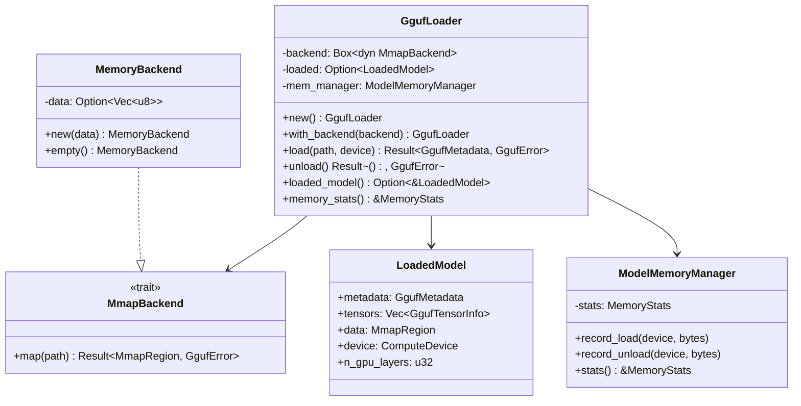
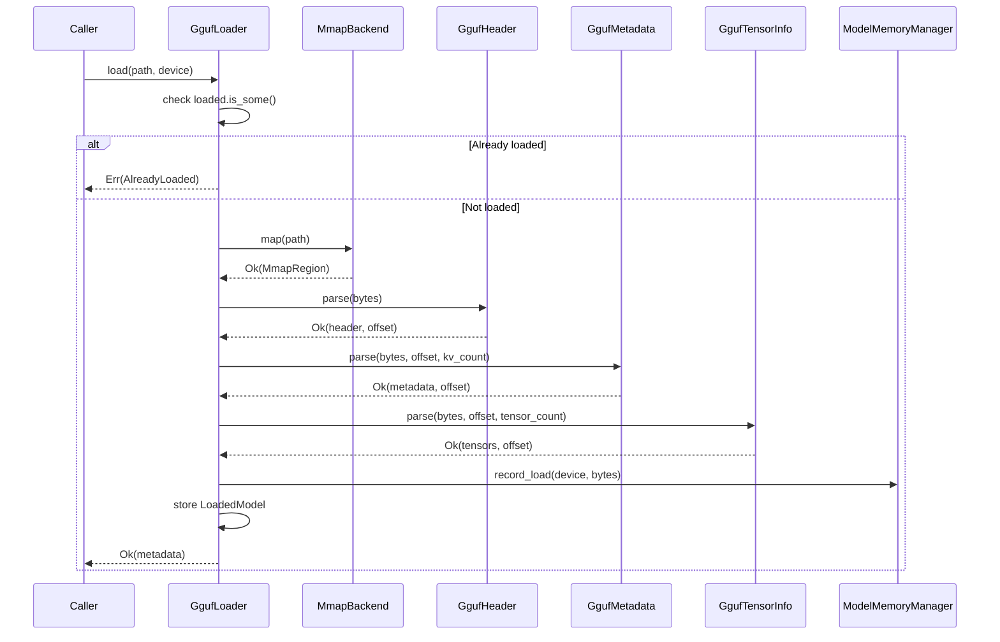

# EnerOS GGUF 模型加载与内存管理设计 — GgufLoader + MmapBackend + ModelMemoryManager

> **版本**：v0.60.0（P1-I AI Runtime LLM 第二层，模型生命周期管理）
> **crate**：`eneros-gguf-loader`（`crates/ai/gguf-loader/`）
> **蓝图依据**：`蓝图/phase1.md` §v0.60.0
> **最后更新**：2026-07-16

---

## 1. 版本目标

### 1.1 一句话目标

实现 GGUF（GPT-Generated Unified Format）模型文件的二进制解析、内存映射加载（`MmapBackend` 抽象）、模型卸载（`unload` + `Drop` 自动清理）与内存统计（`ModelMemoryManager`），为 v0.59.0 `LlmEngine` trait 的 `load_model` 方法提供具体的模型加载实现，并为 v0.61.0 INT4 量化部署奠定加载基础，使 LLM 推理链路从"接口定义"进入"模型可用"阶段。

### 1.2 详细描述

v0.59.0 完成了 P1-I AI Runtime LLM 第一层（`LlmEngine` trait + `MockEngine` + `LlamaCppEngine` FFI 封装），定义了推理引擎的统一接口但未实现真实的模型文件加载。本版本（v0.60.0）进入 P1-I LLM 第二层，专注于模型生命周期管理：将磁盘上的 GGUF 模型文件加载到内存（或 GPU VRAM），解析其元数据与张量信息，提供给推理引擎使用，并在卸载时释放内存。

双脑架构（蓝图 §9.x）中 LLM 是"感知者"，负责理解市场信号与自然语言指令并输出 JSON 意图。LLM 要推理必须有模型，模型加载是推理的前提。本版本交付的 `GgufLoader` 是连接"模型文件"与"推理引擎"的桥梁：上层（v0.61.0 推理调度器、v0.71.0 双脑联调）通过 `LlmEngine::load_model` 间接触发 `GgufLoader::load`，加载完成后推理引擎才能执行 `infer` / `infer_stream`。

本版本交付四项核心产出：

| 产出 | 角色 | 默认可用 | 说明 |
|------|------|---------|------|
| `GgufLoader` | 模型加载器主结构 | ✅ | 加载/卸载/查询已加载模型/内存统计 |
| `MmapBackend` trait + `MemoryBackend` | 内存映射后端抽象 | ✅ | no_std 下用 `Vec<u8>` 模拟 mmap，未来可扩展 `FileBackend` |
| `ModelMemoryManager` + `MemoryStats` | 内存统计与预算监控 | ✅ | CPU/GPU 内存分类统计，对接蓝图 §43.6 内存预算 |
| `GgufDtype` 映射 | 张量数据类型映射 | ✅ | 14 种 GGUF dtype 映射到 v0.59.0 `Quantization`（D11） |

同时交付配套类型（`GgufHeader` / `GgufMetadata` / `GgufTensorInfo` / `LoadedModel` / `GgufError`）与 `GpuOps` trait（feature-gated，D3）。所有 Rust 代码必须 no_std（D1，蓝图 §43.1），仅使用 `core::*` / `alloc::*`，无 `std::*`。

### 1.3 架构定位

| 维度 | 定位 |
|------|------|
| Phase | Phase 1 单机 MVP |
| 子系统 | P1-I AI Runtime LLM 第二层（模型加载） |
| 平面 | 慢平面（Agent Runtime 分区，管理信息大区） |
| 角色 | 模型生命周期管理：加载 → 查询 → 卸载；连接模型文件与推理引擎 |
| 上游版本 | v0.59.0 `LlmEngine` trait（推理接口）、v0.24.0 文件系统（模型文件读取）、v0.11.0 用户堆（alloc 支持） |
| 同层版本 | v0.60.0（本版本，模型加载）；与 v0.59.0 `LlmEngine` 协作 |
| 下游版本 | v0.61.0 INT4 量化部署、v0.62.0 推理调度、v0.63.0 Prompt 模板 |
| 部署形态 | 边缘 LLM 推理统一采用 llama.cpp（C API），禁止 PyTorch（蓝图 §43.3） |

### 1.4 前置依赖

| 依赖版本 | 提供能力 | 本版本用途 |
|---------|---------|-----------|
| v0.59.0 | `LlmEngine` trait、`Quantization` enum、`ComputeDevice` enum、`LlmError` | 复用 `Quantization` 做 dtype 映射（D11）；`ComputeDevice` 选择加载设备；`LlmError` 错误传播 |
| v0.24.0 | 文件系统（littlefs2） | 读取 GGUF 模型文件字节流 |
| v0.11.0 | 用户堆（alloc 支持） | `Vec<u8>` / `String` / `BTreeMap` 堆分配 |

### 1.5 设计原则关联

| 原则 | 体现 |
|------|------|
| no_std 合规 | 全 crate 仅使用 `core::*` / `alloc::*`，无 `std::*`（D1，蓝图 §43.1） |
| 默认集成优先 | GGUF 是 llama.cpp / ggml 原生模型格式（记忆文件 §5.5），不自研模型格式 |
| 可测试性 | `MemoryBackend`（`Vec<u8>`）默认可用，CI 无 mmap 环境下可编译/可测试（D2/D12） |
| GPU 优先 | GPU offload 通过 llama.cpp `n_gpu_layers` 参数（C 库内部），非 PyTorch `model.to("cuda")`（D4） |
| 故障隔离 | FFI 边界集中封装（D10），`unsafe` 块带 SAFETY 注释，指针所有权明确 |
| 可观测 | `MemoryStats` 6 字段监控 CPU/GPU 内存占用（D5，普通 u64，无 AtomicU64） |
| 资源安全 | `GgufLoader` 实现 `Drop` trait，卸载时自动释放内存（D8） |
| 内存预算 | 对接蓝图 §43.6（LLM 7B INT4 ≤ 4GB），加载前校验内存预算 |

---

## 2. 架构定位

### 2.1 P1-I AI Runtime LLM 分层

P1-I AI Runtime LLM 子系统按"引擎接口 → 模型加载 → 推理调度 → 量化 → Prompt 模板"五层层级组织，本版本位于第二层：

| 层级 | 版本 | crate | 职责 |
|------|------|-------|------|
| 第一层（引擎接口） | v0.59.0 | `eneros-llm-engine` | `LlmEngine` trait + MockEngine + LlamaCppEngine FFI |
| **第二层（模型加载）** | **v0.60.0** | **`eneros-gguf-loader`** | **GGUF 文件解析、内存映射加载、模型卸载、内存统计** |
| 第三层（推理调度） | v0.61.0 | （后续） | 推理请求排队、超时控制、并发限制 |
| 第四层（量化） | v0.62.0 | （后续） | INT4/INT8 量化配置、动态切换 |
| 第五层（Prompt 模板） | v0.63.0 | （后续） | Prompt 模板渲染、JSON 输出约束 |

第二层为第一层提供 `load_model` 的具体实现：v0.59.0 的 `LlamaCppEngine::load_model` 通过 FFI 调用 llama.cpp 加载模型，本版本提供纯 Rust 的 GGUF 解析能力，可在加载前预校验模型文件（magic / version / 元数据），避免将非法文件直接传给 C 库导致崩溃。同时本版本的 `ModelMemoryManager` 为推理调度器（v0.61.0）提供内存预算监控输入。

### 2.2 在双脑架构中的位置

双脑架构（蓝图 §9.x）中 LLM 与 Solver 的协作链路如下：

```
[市场信号/自然语言指令]
        │
        ▼
v0.59.0 LlmEngine (推理接口)
        │
        ▼
v0.60.0 GgufLoader (本版本，模型加载)  ◄── 模型文件 (GGUF)
        │                                      │
        ▼                                      │
   LLM 推理 (llama.cpp via FFI) ◄──────────────┘
        │
        ▼
   JSON 意图输出
        │
        ▼
v0.71.0 双脑联调 ──► Solver (LP/MILP, HiGHS)
                        │
                        ▼
                   优化决策 (L1 主路径)
                        │
                        ▼
                   控制命令下发
```

| 路径 | 内容 | MVP 可验收 | 说明 |
|------|------|-----------|------|
| L1 主路径 | Solver-only（LP/MILP） | ✅ 是 | 实时控制 < 500ms，不依赖 LLM |
| L2 增强路径 | LLM + Solver（双脑） | ❌ 否 | 离线复杂规划/自然语言交互，降级到 L1 |

本版本为 L2 增强路径的模型加载环节：`GgufLoader` 将 GGUF 模型加载到内存，推理引擎才能执行 LLM 推理。L2 路径在 LLM 不可用时（模型加载失败 / GPU 不可用 / OOM）降级到 L1（Solver-only），由 v0.71.0 双脑联调实现降级逻辑。本版本仅提供加载能力与错误信号（`GgufError`），不实现降级编排。

### 2.3 与 v0.59.0 LlmEngine 的关系

v0.59.0 定义了 `LlmEngine` trait 的 `load_model(&mut self, path: &str) -> Result<(), LlmError>` 方法，但未实现真实的模型文件加载（`MockEngine` 仅设 `loaded=true`，`LlamaCppEngine` 直接调用 FFI 传路径给 C 库）。本版本（v0.60.0）的关系如下：

| 维度 | v0.59.0 LlmEngine | v0.60.0 GgufLoader |
|------|-------------------|-------------------|
| 职责 | 定义推理接口（trait） | 实现模型加载（具体逻辑） |
| 加载方式 | `load_model` 接口签名 | `load(path, device)` 具体实现 |
| 模型格式 | 不关心（由实现决定） | 专注 GGUF 格式解析 |
| 内存管理 | 不负责（C 库内部） | `ModelMemoryManager` 统计 CPU/GPU 内存 |
| 错误类型 | `LlmError`（8 变体） | `GgufError`（10 变体），可转换为 `LlmError`（D11） |
| 设备选择 | `ComputeDevice` enum | 复用 v0.59.0 `ComputeDevice`（D11） |
| 量化级别 | `Quantization` enum（4 变体） | `GgufDtype`（14 变体）映射到 `Quantization`（D11） |

**协作方式**：v0.61.0 推理调度器可这样组合两者：

```rust
// 伪代码：v0.61.0 调度器如何使用 GgufLoader + LlmEngine
let mut loader = GgufLoader::new();
let metadata = loader.load("model.gguf", ComputeDevice::Cuda)?;
// metadata 校验通过后，将路径传给 LlmEngine 加载到 C 库
engine.load_model("model.gguf")?;
// 推理
let output = engine.infer(prompt, &params)?;
// 卸载
loader.unload()?;
```

本版本提供"预校验 + 内存统计"能力：在调用 `LlmEngine::load_model`（FFI 传给 C 库）之前，先用 `GgufLoader` 解析 GGUF 头部与元数据，校验文件合法性，避免 C 库因非法文件崩溃（C 库崩溃会导致整个 Agent Runtime 分区不可用）。

### 2.4 与 v0.61.0 INT4 量化部署的关系

v0.61.0 的 INT4 量化部署依赖本版本提供的加载基础：

| 本版本产出 | v0.61.0 用途 |
|-----------|-------------|
| `GgufLoader::load` | 加载 INT4 量化模型文件（Q4_K_M 等） |
| `GgufMetadata`（含 `general.quantization_version`） | 判断模型已量化级别，决定是否需要动态量化 |
| `GgufTensorInfo`（含 `dtype`） | 读取张量实际 dtype，校验量化一致性 |
| `GgufDtype` → `Quantization` 映射（D11） | 将 GGUF dtype 转为 v0.59.0 `Quantization`，供推理引擎使用 |
| `ModelMemoryManager` | 监控 INT4 模型内存占用（≤ 4GB 预算） |
| `LoadedModel.n_gpu_layers` | 追踪 GPU offload 层数（D4） |

本版本不实现量化切换（属 v0.62.0），仅加载已量化的 GGUF 文件并解析其量化级别。

### 2.5 上下游依赖图

```
v0.24.0 文件系统 ──► 模型文件字节流 ──┐
                                       │
v0.11.0 用户堆 ──► alloc 支持 ──┤
                                       │
v0.59.0 LlmEngine ──► Quantization/ComputeDevice/LlmError ──┤
                                       │
                                       ▼
                          v0.60.0 GgufLoader (本版本)
                          ├── MmapBackend trait
                          │   └── MemoryBackend (Vec<u8>, D12)
                          ├── GgufHeader / GgufMetadata / GgufTensorInfo
                          ├── GgufDtype (14 变体) → Quantization 映射 (D11)
                          ├── ModelMemoryManager + MemoryStats (D5)
                          └── GpuOps trait (feature-gated, D3)
                                       │
                                       ▼
                          v0.61.0 INT4 量化部署
                                       │
                                       ▼
                          v0.62.0 推理调度
                                       │
                                       ▼
                          v0.71.0 双脑联调 (LLM + Solver)
```

### 2.6 不做的事（职责边界）

本加载器**不负责**以下职责，避免与上下游重叠：

| 不做的事 | 归属版本 | 理由 |
|---------|---------|------|
| 推理执行 | v0.59.0 `LlmEngine` | 本版本仅加载模型，推理由 `LlmEngine::infer` 执行 |
| 推理请求排队与超时控制 | v0.62.0 | 本版本仅提供加载/卸载，调度由 v0.62.0 编排 |
| 量化切换与校准 | v0.62.0 | 本版本仅解析已有量化级别，切换由 v0.62.0 实现 |
| Prompt 模板渲染 | v0.63.0 | 本版本不涉及 prompt |
| 双脑降级编排 | v0.71.0 | 本版本仅返回 `GgufError`，降级决策由 v0.71.0 编排 |
| llama.cpp C 库编译与链接 | 构建系统 | 本版本纯 Rust 解析，C 库编译由 `tools/setup-toolchain.sh` 处理 |
| 多模型并发管理 | v0.62.0 | 本版本单加载器单模型，多模型由 v0.62.0 调度器管理 |
| 真实 mmap 系统调用 | OS / 未来 FileBackend | no_std 无 mmap，本版本用 `Vec<u8>` 模拟（D2/D12） |

---

## 3. GGUF 格式详解

### 3.1 GGUF 概述

GGUF（GPT-Generated Unified Format）是 llama.cpp / ggml 生态的统一模型文件格式，由 Georgi Gerganov 等设计，替代早期的 GGML / GGJT 格式。其设计目标：

| 特性 | 说明 |
|------|------|
| 单文件封装 | 模型权重、元数据、tokenizer 全部封装在一个 `.gguf` 文件中 |
| 可扩展性 | 元数据 KV 对格式支持任意键值对，向后兼容 |
| 内存映射友好 | 张量数据区对齐到 32 字节边界，可直接 mmap 无需拷贝 |
| 小端字节序 | 全文件采用 little-endian（与 ARM64/x86 一致） |
| 量化支持 | 内置 14 种 dtype（F32 ~ Q8_K），支持 4/5/6/8 bit 量化 |

GGUF 文件由三大区组成：

```
┌─────────────────────────┐  offset = 0
│      文件头 (Header)     │  magic + version + tensor_count + metadata_kv_count
├─────────────────────────┤
│  元数据 KV 对区          │  N 个 KV 对（key + value_type + value）
├─────────────────────────┤
│  张量信息区              │  M 个张量描述（name + dimensions + dtype + offset）
├─────────────────────────┤  对齐到 32 字节边界
│  张量数据区              │  张量实际权重数据（按 offset 索引）
└─────────────────────────┘
```

### 3.2 文件头结构（GgufHeader）

文件头固定位于文件起始（offset = 0），包含 4 个字段：

| 偏移 | 字段 | 类型 | 字节数 | 说明 |
|------|------|------|--------|------|
| 0 | `magic` | `u32` | 4 | 魔数 `0x46554747`（ASCII "GGUF"，小端） |
| 4 | `version` | `u32` | 4 | 格式版本（当前 v3 = 3） |
| 8 | `tensor_count` | `u64` | 8 | 张量数量 |
| 16 | `metadata_kv_count` | `u64` | 8 | 元数据 KV 对数量 |

文件头总长度固定 24 字节。`magic` 用于快速校验文件是否为 GGUF；`version` 用于兼容性判断（本版本支持 v3，v1/v2 返回 `GgufError::UnsupportedVersion`）。

```rust
/// GGUF 文件头（24 字节）。
#[derive(Debug, Clone)]
pub struct GgufHeader {
    /// 魔数，必须为 0x46554747（"GGUF" 小端）
    pub magic: u32,
    /// 格式版本（本版本支持 v3）
    pub version: u32,
    /// 张量数量
    pub tensor_count: u64,
    /// 元数据 KV 对数量
    pub metadata_kv_count: u64,
}

/// GGUF 魔数常量（"GGUF" 小端 = 0x46554747）。
pub const GGUF_MAGIC: u32 = 0x46554747;

/// GGUF 本版本支持的格式版本。
pub const GGUF_SUPPORTED_VERSION: u32 = 3;
```

### 3.3 元数据 KV 对格式（GgufMetadata）

元数据区紧跟文件头，包含 `metadata_kv_count` 个 KV 对。每个 KV 对格式：

| 字段 | 类型 | 说明 |
|------|------|------|
| `key` | `gguf_string` | 键名（UTF-8 字符串，长度前缀 + 字节） |
| `value_type` | `u32` | 值类型枚举（见下表） |
| `value` | 变长 | 值（类型由 `value_type` 决定） |

`gguf_string` 格式：`u64 length` + `length 字节 UTF-8 数据`（无 NUL 结尾）。

`value_type` 枚举（GGUF 元数据值类型）：

| 值 | 类型 | 字节数 | Rust 对应 |
|----|------|--------|-----------|
| 0 | `UINT8` | 1 | `u8` |
| 1 | `INT8` | 1 | `i8` |
| 2 | `UINT16` | 2 | `u16` |
| 3 | `INT16` | 2 | `i16` |
| 4 | `UINT32` | 4 | `u32` |
| 5 | `INT32` | 4 | `i32` |
| 6 | `FLOAT32` | 4 | `f32` |
| 7 | `BOOL` | 1 | `bool` |
| 8 | `STRING` | 变长 | `gguf_string` |
| 9 | `ARRAY` | 变长 | `u32 type` + `u64 count` + `count * value` |
| 10 | `UINT64` | 8 | `u64` |
| 11 | `INT64` | 8 | `i64` |
| 12 | `FLOAT64` | 8 | `f64` |

常见元数据键（llama.cpp 约定）：

| 键 | 类型 | 说明 |
|----|------|------|
| `general.architecture` | STRING | 模型架构（llama / qwen2 / mistral 等） |
| `general.name` | STRING | 模型名称 |
| `general.quantization_version` | UINT32 | 量化版本 |
| `general.file_type` | UINT32 | 文件量化类型（对应 `GgufDtype`） |
| `llama.context_length` | UINT32 | 上下文长度 |
| `llama.embedding_length` | UINT32 | embedding 维度 |
| `llama.block_count` | UINT32 | transformer 层数 |
| `tokenizer.ggml.model` | STRING | tokenizer 模型（llama / gpt2 等） |
| `tokenizer.ggml.tokens` | ARRAY | 词表 |

```rust
/// GGUF 元数据值类型枚举（12 变体）。
#[derive(Debug, Clone, PartialEq)]
pub enum GgufMetadataValue {
    Uint8(u8),
    Int8(i8),
    Uint16(u16),
    Int16(i16),
    Uint32(u32),
    Int32(i32),
    Float32(f32),
    Bool(bool),
    String(String),
    Array { elem_type: u32, values: Vec<GgufMetadataValue> },
    Uint64(u64),
    Int64(i64),
    Float64(f64),
}

/// GGUF 元数据集合（KV 对的有序映射）。
#[derive(Debug, Clone, Default)]
pub struct GgufMetadata {
    /// KV 对（使用 BTreeMap 保证 no_std 可用且有序）
    pub kv: alloc::collections::BTreeMap<String, GgufMetadataValue>,
}
```

### 3.4 张量信息格式（GgufTensorInfo）

张量信息区紧跟元数据区，包含 `tensor_count` 个张量描述。每个张量描述格式：

| 字段 | 类型 | 说明 |
|------|------|------|
| `name` | `gguf_string` | 张量名（如 `token_embd.weight`） |
| `n_dimensions` | `u32` | 维度数量（1~4） |
| `dimensions` | `u64[n_dimensions]` | 各维度大小 |
| `dtype` | `u32` | 张量数据类型（`GgufDtype`，见 §7） |
| `offset` | `u64` | 张量数据在张量数据区的偏移（字节） |

```rust
/// GGUF 张量信息。
#[derive(Debug, Clone)]
pub struct GgufTensorInfo {
    /// 张量名（如 "token_embd.weight"）
    pub name: String,
    /// 维度（如 [4096, 32000] 表示 4096×32000 矩阵）
    pub dimensions: Vec<u64>,
    /// 张量数据类型（GgufDtype）
    pub dtype: GgufDtype,
    /// 张量数据在数据区的偏移（字节）
    pub offset: u64,
}
```

### 3.5 张量数据区

张量数据区紧跟张量信息区，并**对齐到 32 字节边界**（GGUF 规范要求）。每个张量的实际权重数据按 `GgufTensorInfo.offset` 索引，长度由 `dimensions` 与 `dtype` 计算。

数据区长度计算（单张量）：

```
tensor_bytes = product(dimensions) * dtype_size(dtype)
```

其中 `dtype_size` 取决于 `GgufDtype`（见 §7.2 dtype 字节大小表）。

**对齐规则**：张量数据区起始位置 = `align_up(header_size + metadata_size + tensor_info_size, 32)`。`align_up(x, 32) = (x + 31) & !31`。

### 3.6 小端字节序

GGUF 全文件采用 little-endian 字节序。ARM64（aarch64）与 x86 均为小端架构，因此可直接 `from_le_bytes` 读取（实际等于原生字节序）。若未来移植到大端架构（如部分 PowerPC），需通过 `from_le_bytes` 显式转换。

```rust
/// 从字节切片读取小端 u32（D1：no_std 兼容）。
fn read_u32_le(bytes: &[u8], offset: usize) -> Result<u32, GgufError> {
    if offset + 4 > bytes.len() {
        return Err(GgufError::UnexpectedEof);
    }
    Ok(u32::from_le_bytes([
        bytes[offset],
        bytes[offset + 1],
        bytes[offset + 2],
        bytes[offset + 3],
    ]))
}
```

本版本假设运行环境为小端架构（ARM64/x86），不处理大端转换（若需大端支持，未来版本增加 `cfg(target_endian = "big")` 分支）。

### 3.7 GGUF 文件解析流程

```
1. 读取文件头（24 字节）
   ├── 校验 magic == 0x46554747 ──► 否则 GgufError::InvalidMagic
   ├── 校验 version == 3 ──► 否则 GgufError::UnsupportedVersion
   └── 读取 tensor_count / metadata_kv_count
2. 解析元数据 KV 对（循环 metadata_kv_count 次）
   ├── 读取 key（gguf_string）
   ├── 读取 value_type（u32）
   └── 按 value_type 读取 value
3. 解析张量信息（循环 tensor_count 次）
   ├── 读取 name（gguf_string）
   ├── 读取 n_dimensions + dimensions
   ├── 读取 dtype（u32 → GgufDtype）
   └── 读取 offset（u64）
4. 对齐到 32 字节边界
5. 张量数据区起始 = 当前偏移
```

---

## 4. GgufLoader 设计

### 4.1 GgufLoader 结构体

`GgufLoader` 是本版本的核心结构，负责模型加载、卸载、查询与内存统计。

```rust
use alloc::boxed::Box;
use alloc::string::String;
use alloc::vec::Vec;

use crate::backend::{MmapBackend, MmapRegion};
use crate::device::ComputeDevice;
use crate::error::GgufError;
use crate::memory::{MemoryStats, ModelMemoryManager};
use crate::model::{GgufMetadata, GgufTensorInfo, LoadedModel};

/// GGUF 模型加载器。
///
/// 负责加载 GGUF 模型文件、解析元数据与张量信息、管理内存。
/// 单加载器同一时刻只能加载一个模型（重复加载返回
/// `Err(GgufError::AlreadyLoaded)`）。
///
/// **生命周期**：
/// - `new()` → 空加载器（无模型）
/// - `load(path, device)` → 加载模型，`loaded = Some(LoadedModel)`
/// - `loaded_model()` → 查询已加载模型
/// - `unload()` → 卸载模型，`loaded = None`，释放内存
/// - `Drop::drop()` → 若未显式 `unload`，自动卸载（D8）
pub struct GgufLoader {
    /// 内存映射后端（D2：trait 抽象，默认 MemoryBackend）
    backend: Box<dyn MmapBackend>,
    /// 已加载模型（None 表示未加载）
    loaded: Option<LoadedModel>,
    /// 内存统计管理器（D5：普通 u64，无 AtomicU64）
    mem_manager: ModelMemoryManager,
}
```

### 4.2 字段说明

| # | 字段 | 类型 | 说明 |
|---|------|------|------|
| 1 | `backend` | `Box<dyn MmapBackend>` | 内存映射后端（D2：trait 对象，默认 `MemoryBackend`，D12） |
| 2 | `loaded` | `Option<LoadedModel>` | 已加载模型；`load` 成功设 `Some`，`unload` 设 `None` |
| 3 | `mem_manager` | `ModelMemoryManager` | 内存统计管理器（D5），记录加载/卸载的 CPU/GPU 内存 |

### 4.3 构造函数

```rust
impl GgufLoader {
    /// 构造默认 GgufLoader（使用 MemoryBackend，D12）。
    pub fn new() -> Self {
        Self {
            backend: Box::new(crate::backend::MemoryBackend::empty()),
            loaded: None,
            mem_manager: ModelMemoryManager::new(),
        }
    }

    /// builder：指定自定义 MmapBackend（D2）。
    ///
    /// 用于未来扩展（如 FileBackend 真实 mmap）。
    pub fn with_backend(backend: Box<dyn MmapBackend>) -> Self {
        Self {
            backend,
            loaded: None,
            mem_manager: ModelMemoryManager::new(),
        }
    }
}

impl Default for GgufLoader {
    fn default() -> Self {
        Self::new()
    }
}
```

### 4.4 load() 方法完整流程

`load` 是本版本的核心方法，完整流程如下：

```rust
impl GgufLoader {
    /// 加载 GGUF 模型文件。
    ///
    /// - `path`：模型文件路径（D6：保留 `&str` 签名）
    /// - `device`：目标计算设备（D4：决定 n_gpu_layers）
    /// - 返回 `Ok(GgufMetadata)`：加载成功，返回元数据
    /// - 返回 `Err(GgufError::AlreadyLoaded)`：已有模型加载
    /// - 返回 `Err(GgufError::FileRead)`：文件读取失败
    /// - 返回 `Err(GgufError::InvalidMagic)`：魔数错误
    /// - 返回 `Err(GgufError::UnsupportedVersion)`：版本不支持
    /// - 返回 `Err(GgufError::UnexpectedEof)`：文件截断
    /// - 返回 `Err(GgufError::OutOfMemory)`：内存不足
    pub fn load(&mut self, path: &str, device: ComputeDevice) -> Result<GgufMetadata, GgufError> {
        // 1. 检查是否已有模型加载
        if self.loaded.is_some() {
            return Err(GgufError::AlreadyLoaded);
        }

        // 2. 通过后端映射文件（D2）
        let region = self.backend.map(path)?;

        // 3. 解析文件头
        let bytes = region.as_slice();
        let (header, offset) = crate::parser::parse_header(bytes)?;

        // 4. 解析元数据
        let (metadata, offset) = crate::parser::parse_metadata(bytes, offset, header.metadata_kv_count)?;

        // 5. 解析张量信息
        let (tensors, offset) = crate::parser::parse_tensor_info(bytes, offset, header.tensor_count)?;

        // 6. 校验张量数据区偏移对齐（32 字节边界）
        let aligned_offset = crate::parser::align_to_32(offset);

        // 7. 计算 GPU offload 层数（D4）
        let n_gpu_layers = device.n_gpu_layers();

        // 8. 内存统计（D5）
        let total_bytes = bytes.len() as u64;
        self.mem_manager.record_load(device, total_bytes);

        // 9. 存储 LoadedModel
        let loaded = LoadedModel {
            metadata: metadata.clone(),
            tensors,
            data: region,
            device,
            n_gpu_layers,
            data_offset: aligned_offset,
        };
        self.loaded = Some(loaded);

        Ok(metadata)
    }
}
```

**load 流程时序**：

| 步骤 | 操作 | 失败错误 |
|------|------|---------|
| 1 | 检查 `loaded.is_some()` | `AlreadyLoaded` |
| 2 | `backend.map(path)` 读取文件到 `MmapRegion` | `FileRead` |
| 3 | `parse_header(bytes)` 解析文件头 | `InvalidMagic` / `UnsupportedVersion` |
| 4 | `parse_metadata(bytes, offset, kv_count)` 解析元数据 | `UnexpectedEof` / `InvalidValueType` |
| 5 | `parse_tensor_info(bytes, offset, tensor_count)` 解析张量信息 | `UnexpectedEof` / `InvalidDtype` |
| 6 | `align_to_32(offset)` 对齐到 32 字节 | — |
| 7 | `device.n_gpu_layers()` 计算 GPU offload 层数 | — |
| 8 | `mem_manager.record_load(device, bytes)` 内存统计 | — |
| 9 | 存储 `LoadedModel` | — |

### 4.5 unload() 方法

```rust
impl GgufLoader {
    /// 卸载已加载模型，释放内存。
    ///
    /// - 返回 `Ok(())`：卸载成功
    /// - 返回 `Err(GgufError::NotLoaded)`：无模型加载
    ///
    /// 卸载后 `loaded = None`，内存统计记录 unload。
    /// `MmapRegion`（内含 `Vec<u8>`）在 drop 时自动释放内存。
    pub fn unload(&mut self) -> Result<(), GgufError> {
        let loaded = self.loaded.take().ok_or(GgufError::NotLoaded)?;
        // 内存统计记录卸载
        self.mem_manager.record_unload(loaded.device, loaded.data.len() as u64);
        // loaded.data（MmapRegion）drop 时释放 Vec<u8>
        drop(loaded);
        Ok(())
    }
}
```

### 4.6 查询方法

```rust
impl GgufLoader {
    /// 返回已加载模型引用（未加载返回 None）。
    pub fn loaded_model(&self) -> Option<&LoadedModel> {
        self.loaded.as_ref()
    }

    /// 返回内存统计只读引用（D5）。
    pub fn memory_stats(&self) -> &MemoryStats {
        self.mem_manager.stats()
    }

    /// 返回已加载模型元数据（未加载返回 None）。
    pub fn metadata(&self) -> Option<&GgufMetadata> {
        self.loaded.as_ref().map(|m| &m.metadata)
    }

    /// 返回已加载模型张量信息（未加载返回 None）。
    pub fn tensors(&self) -> Option<&[GgufTensorInfo]> {
        self.loaded.as_ref().map(|m| m.tensors.as_slice())
    }
}
```

### 4.7 Drop trait 自动清理（D8）

```rust
impl Drop for GgufLoader {
    fn drop(&mut self) {
        // D8：若未显式 unload，自动卸载已加载模型。
        // MmapRegion（Vec<u8>）drop 时自动释放内存；
        // ModelMemoryManager 在 GgufLoader drop 时随之释放，无需手动统计 unload。
        if let Some(loaded) = self.loaded.take() {
            // loaded.data drop 释放 Vec<u8> 内存
            drop(loaded);
        }
    }
}
```

| 维度 | 说明 |
|------|------|
| 为什么需要 Drop | 防止调用方忘记 `unload()` 导致内存泄漏（LLM 模型可达 4GB） |
| 自动卸载语义 | `drop(loader)` 时若 `loaded.is_some()`，自动 `take()` 并释放 |
| 内存统计 | Drop 时不调用 `record_unload`（统计器随之销毁，无需更新） |
| 幂等性 | `take()` 后 `loaded = None`，即使重复 drop 也安全 |
| 一致性 | 与 v0.59.0 `LlamaCppEngine` Drop 释放 FFI 指针一致（D10） |

### 4.8 泛型设计考量

本版本 `GgufLoader` 使用 `Box<dyn MmapBackend>`（trait 对象）而非泛型 `GgufLoader<B: MmapBackend>`，原因：

| 维度 | `Box<dyn MmapBackend>`（本版本） | `GgufLoader<B: MmapBackend>`（泛型） |
|------|--------------------------------|-------------------------------------|
| 动态分发 | 运行时 | 编译时单态化 |
| 灵活性 | 运行时可切换后端 | 编译时固定后端 |
| 代码膨胀 | 无 | 每种后端生成一份代码 |
| no_std 兼容 | ✅（`alloc::boxed::Box`） | ✅ |
| 测试便利 | ✅（可注入 mock 后端） | 需泛型测试 |
| 性能 | 略低（vtable 间接调用） | 略高（直接调用） |

LLM 模型加载是秒级操作，vtable 开销（纳秒级）可忽略，因此选择 `Box<dyn MmapBackend>` 换取灵活性。

### 4.9 GgufLoader 类图



图 1：`GgufLoader` 类图。`GgufLoader` 持有 `Box<dyn MmapBackend>`（D2），`MemoryBackend` 是默认实现（D12）；`LoadedModel` 封装已加载模型；`ModelMemoryManager` 负责内存统计（D5）。

---

## 5. MmapBackend 抽象（D2）

### 5.1 为什么需要 MmapBackend 抽象

GGUF 模型文件通常较大（7B INT4 约 4GB），加载方式有两种：

| 方式 | 说明 | 优点 | 缺点 |
|------|------|------|------|
| `mmap`（内存映射） | OS 将文件映射到虚拟地址空间，按需缺页加载 | 启动快（不立即读全部）、内存占用低（OS 按需调页）、多进程共享 | 需 OS 支持（POSIX `mmap` / Windows `MapViewOfFile`） |
| `read-into-memory` | 一次性读取整个文件到 `Vec<u8>` | 无 OS 依赖、no_std 友好 | 启动慢（全量读取）、内存占用 = 文件大小 |

no_std RTOS 环境无 POSIX `mmap` 系统调用（seL4 微内核不提供 mmap 抽象），因此本版本采用 `read-into-memory` 方式（`Vec<u8>`），但通过 `MmapBackend` trait 抽象，未来可扩展 `FileBackend`（真实 mmap）而不修改 `GgufLoader`。

### 5.2 MmapBackend trait

```rust
use crate::error::GgufError;
use crate::region::MmapRegion;

/// 内存映射后端 trait（D2）。
///
/// 抽象模型文件的加载方式。默认实现 `MemoryBackend`（Vec<u8>，
/// D12）；未来可扩展 `FileBackend`（真实 mmap）。
///
/// **D2：trait 对象安全**。方法均接收 `&self` / `&mut self`，返回
/// `Result` / 引用，不涉及 `Self` 类型，可作为 `Box<dyn MmapBackend>`
/// 使用。
pub trait MmapBackend {
    /// 映射（读取）文件到内存区域。
    ///
    /// - `path`：文件路径（D6：`&str`）
    /// - 返回 `Ok(MmapRegion)`：映射成功
    /// - 返回 `Err(GgufError::FileRead)`：读取失败
    fn map(&mut self, path: &str) -> Result<MmapRegion, GgufError>;
}
```

### 5.3 MmapRegion 封装

`MmapRegion` 封装映射的内存区域，提供只读字节切片访问：

```rust
use alloc::vec::Vec;

/// 内存映射区域（封装 Vec<u8>）。
///
/// `MemoryBackend` 返回的 `MmapRegion` 内含 `Vec<u8>`（全量读取）；
/// 未来 `FileBackend` 可封装真实 mmap 指针 + 长度。
///
/// 提供 `as_slice()` 只读访问与 `len()` 长度查询。
/// `Drop` 时自动释放内部 `Vec<u8>`。
pub struct MmapRegion {
    /// 内存数据（Vec<u8>，D12）
    data: Option<Vec<u8>>,
}

impl MmapRegion {
    /// 构造 MmapRegion（封装 Vec<u8>）。
    pub fn new(data: Vec<u8>) -> Self {
        Self { data: Some(data) }
    }

    /// 返回只读字节切片。
    ///
    /// # Panics
    ///
    /// 若内部 data 为 None（已释放），panic。正常使用不会触发。
    pub fn as_slice(&self) -> &[u8] {
        self.data.as_ref().expect("MmapRegion data already released").as_slice()
    }

    /// 返回数据长度（字节）。
    pub fn len(&self) -> usize {
        self.data.as_ref().map(|v| v.len()).unwrap_or(0)
    }

    /// 是否为空。
    pub fn is_empty(&self) -> bool {
        self.len() == 0
    }
}

impl Drop for MmapRegion {
    fn drop(&mut self) {
        // 释放 Vec<u8> 内存
        self.data = None;
    }
}
```

### 5.4 MemoryBackend 默认实现（D12）

`MemoryBackend` 是 `MmapBackend` 的默认实现，使用 `Vec<u8>` 全量读取文件：

```rust
use alloc::string::String;
use alloc::vec::Vec;

use crate::error::GgufError;
use crate::region::MmapRegion;
use crate::backend::MmapBackend;

/// 内存后端（D12：默认实现，Vec<u8> 全量读取）。
///
/// no_std 环境下无真实 mmap，使用 `Vec<u8>` 一次性读取整个文件。
/// 适合中小模型（< 1GB）；大模型（4GB+）未来由 `FileBackend` 处理。
pub struct MemoryBackend {
    /// 已读取的数据（map 后填充，unload 后清空）
    data: Option<Vec<u8>>,
}

impl MemoryBackend {
    /// 构造空 MemoryBackend。
    pub fn empty() -> Self {
        Self { data: None }
    }

    /// 构造带数据的 MemoryBackend（测试用）。
    pub fn new(data: Vec<u8>) -> Self {
        Self { data: Some(data) }
    }
}

impl MmapBackend for MemoryBackend {
    fn map(&mut self, path: &str) -> Result<MmapRegion, GgufError> {
        // 若已有数据（测试注入），直接返回
        if let Some(data) = self.data.take() {
            return Ok(MmapRegion::new(data));
        }

        // D12：no_std 下通过文件系统 API 读取文件
        // 实际实现依赖 v0.24.0 文件系统（littlefs2）
        // 此处为接口示意，具体 FFI 由文件系统 crate 提供
        let data = crate::fs::read_file(path)
            .map_err(|_| GgufError::FileRead { path: String::from(path) })?;

        if data.is_empty() {
            return Err(GgufError::FileRead { path: String::from(path) });
        }

        Ok(MmapRegion::new(data))
    }
}
```

### 5.5 no_std 环境下无真实 mmap 的设计决策（D2）

| 维度 | 说明 |
|------|------|
| no_std 约束 | `std::fs::File` / `std::io::Read` / `mmap` 均 unavailable |
| seL4 微内核 | 不提供 POSIX mmap 抽象（seL4 是 capability-based） |
| 解决方案 | `MemoryBackend` 用 `Vec<u8>` 全量读取（D12），通过 v0.24.0 文件系统 API |
| 性能权衡 | 全量读取慢于 mmap（mmap 按需调页），但 no_std 下无替代 |
| 内存占用 | 全量读取 = 文件大小（4GB 模型占 4GB 内存）；mmap 可低于文件大小 |
| 未来扩展 | `FileBackend`（真实 mmap）在有 OS 支持时实现，无需改 `GgufLoader` |
| trait 抽象价值 | `MmapBackend` trait 使未来切换后端零成本（D2） |

### 5.6 未来 FileBackend 扩展

```rust
// 未来版本（有 OS 支持时）：
// pub struct FileBackend {
//     fd: i32,
//     ptr: *mut u8,
//     len: usize,
// }
//
// impl MmapBackend for FileBackend {
//     fn map(&mut self, path: &str) -> Result<MmapRegion, GgufError> {
//         // 调用 POSIX mmap（需 std 或 libc crate）
//         // 返回封装 mmap 指针的 MmapRegion
//         unimplemented!("FileBackend with real mmap will be added when OS supports it")
//     }
// }
```

`FileBackend` 在本版本不实现（no_std 无 mmap），仅作为 `MmapBackend` trait 的未来扩展点预留。`GgufLoader::with_backend` 已支持注入任意 `MmapBackend` 实现。

---

## 6. ModelMemoryManager 内存统计

### 6.1 MemoryStats 结构体（D5）

```rust
/// 模型内存统计（D5：普通 u64，无 AtomicU64）。
///
/// 记录已加载模型的 CPU/GPU 内存占用。单线程读写（GgufLoader
/// 所在 Agent Runtime 分区单线程），无并发，无需原子操作。
/// 与 v0.54.0 D8、v0.55.0 D7、v0.56.0 D7、v0.57.0 D7、v0.59.0 D5 一致。
#[derive(Debug, Clone, Default)]
pub struct MemoryStats {
    /// 当前 CPU 内存占用（字节）
    pub cpu_bytes: u64,
    /// 当前 GPU VRAM 占用（字节）
    pub gpu_bytes: u64,
    /// 累计加载字节数（CPU）
    pub total_cpu_loaded: u64,
    /// 累计加载字节数（GPU）
    pub total_gpu_loaded: u64,
    /// 累计卸载字节数（CPU）
    pub total_cpu_unloaded: u64,
    /// 累计卸载字节数（GPU）
    pub total_gpu_unloaded: u64,
}
```

### 6.2 统计字段说明

| # | 字段 | 类型 | 触发条件 | 用途 |
|---|------|------|---------|------|
| 1 | `cpu_bytes` | `u64` | `record_load(Cpu, n)` 时 `+= n`，`record_unload(Cpu, n)` 时 `-= n` | 当前 CPU 内存占用监控 |
| 2 | `gpu_bytes` | `u64` | `record_load(GPU, n)` 时 `+= n`，`record_unload(GPU, n)` 时 `-= n` | 当前 GPU VRAM 占用监控 |
| 3 | `total_cpu_loaded` | `u64` | 每次 `record_load(Cpu, n)` 累加 | 累计 CPU 加载量 |
| 4 | `total_gpu_loaded` | `u64` | 每次 `record_load(GPU, n)` 累加 | 累计 GPU 加载量 |
| 5 | `total_cpu_unloaded` | `u64` | 每次 `record_unload(Cpu, n)` 累加 | 累计 CPU 卸载量 |
| 6 | `total_gpu_unloaded` | `u64` | 每次 `record_unload(GPU, n)` 累加 | 累计 GPU 卸载量 |

### 6.3 ModelMemoryManager 结构

```rust
use crate::device::ComputeDevice;
use crate::memory::MemoryStats;

/// 模型内存统计管理器。
///
/// 由 `GgufLoader` 持有，记录模型加载/卸载的内存变动。
/// 单线程读写，无需原子操作（D5）。
pub struct ModelMemoryManager {
    /// 内存统计（D5：普通 u64）
    stats: MemoryStats,
}

impl ModelMemoryManager {
    /// 构造空统计器。
    pub fn new() -> Self {
        Self { stats: MemoryStats::default() }
    }

    /// 记录模型加载。
    ///
    /// - `device`：加载设备（Cpu → cpu_bytes，GPU → gpu_bytes）
    /// - `bytes`：加载字节数
    pub fn record_load(&mut self, device: ComputeDevice, bytes: u64) {
        if device.is_gpu() {
            self.stats.gpu_bytes = self.stats.gpu_bytes.saturating_add(bytes);
            self.stats.total_gpu_loaded = self.stats.total_gpu_loaded.saturating_add(bytes);
        } else {
            self.stats.cpu_bytes = self.stats.cpu_bytes.saturating_add(bytes);
            self.stats.total_cpu_loaded = self.stats.total_cpu_loaded.saturating_add(bytes);
        }
    }

    /// 记录模型卸载。
    ///
    /// - `device`：卸载设备
    /// - `bytes`：卸载字节数
    pub fn record_unload(&mut self, device: ComputeDevice, bytes: u64) {
        if device.is_gpu() {
            self.stats.gpu_bytes = self.stats.gpu_bytes.saturating_sub(bytes);
            self.stats.total_gpu_unloaded = self.stats.total_gpu_unloaded.saturating_add(bytes);
        } else {
            self.stats.cpu_bytes = self.stats.cpu_bytes.saturating_sub(bytes);
            self.stats.total_cpu_unloaded = self.stats.total_cpu_unloaded.saturating_add(bytes);
        }
    }

    /// 返回统计只读引用。
    pub fn stats(&self) -> &MemoryStats {
        &self.stats
    }
}

impl Default for ModelMemoryManager {
    fn default() -> Self {
        Self::new()
    }
}
```

### 6.4 CPU/GPU 内存分类统计

| 加载设备 | `cpu_bytes` | `gpu_bytes` | 说明 |
|---------|-------------|-------------|------|
| `ComputeDevice::Cpu` | `+= bytes` | 不变 | 纯 CPU 推理，模型在系统内存 |
| `ComputeDevice::Cuda` | 不变 | `+= bytes` | GPU offload，模型在 VRAM |
| `ComputeDevice::Metal` | 不变 | `+= bytes` | Apple Metal，模型在 GPU |
| `ComputeDevice::Npu` | 不变 | `+= bytes` | NPU，模型在 NPU 内存 |

> **注**：本版本简化假设——GPU offload 时模型全部在 VRAM（`n_gpu_layers = 99`）。实际 llama.cpp 部分层在 CPU、部分层在 GPU 的场景，由 v0.61.0 调度器细化统计。

### 6.5 与蓝图 §43.6 内存预算的关系

蓝图 §43.6 规定 LLM 7B INT4 模型内存预算 ≤ 4GB，OOM 策略为降级到 Solver-only（L1 路径）。本版本的 `MemoryStats` 为该预算监控提供数据：

| 蓝图 §43.6 预算项 | 本版本统计字段 | OOM 判断 |
|------------------|--------------|---------|
| LLM 7B INT4 ≤ 4GB | `gpu_bytes`（GPU）或 `cpu_bytes`（CPU） | `gpu_bytes > 4 * 1024 * 1024 * 1024` 触发 OOM |
| Agent Runtime ≤ 64MB | `cpu_bytes`（含引擎开销） | `cpu_bytes > 64 * 1024 * 1024` 触发降级 |

```rust
/// 检查是否超出内存预算（蓝图 §43.6）。
///
/// - 返回 `Ok(())`：未超预算
/// - 返回 `Err(GgufError::OutOfMemory)`：超出预算
pub fn check_budget(&self) -> Result<(), GgufError> {
    const LLM_BUDGET: u64 = 4 * 1024 * 1024 * 1024;  // 4GB
    if self.stats.gpu_bytes > LLM_BUDGET || self.stats.cpu_bytes > LLM_BUDGET {
        return Err(GgufError::OutOfMemory);
    }
    Ok(())
}
```

### 6.6 不使用 AtomicU64（D5）

| 维度 | 说明 |
|------|------|
| 访问模型 | `MemoryStats` 仅由 `GgufLoader` 在 Agent Runtime 分区单线程读写 |
| 读者 | 调度器 / 监控组件通过 `memory_stats()` 读取 `&MemoryStats` 引用，无并发写入 |
| 原子开销 | `AtomicU64` 的 `fetch_add` 在 ARM64 需 `LDXR`/`STXR` 循环，比普通 `+=` 慢 |
| 单线程原子性 | 单线程下普通 `u64` 读写天然原子（64 位对齐访问无撕裂） |
| 一致性 | 与 v0.54.0 D8、v0.55.0 D7、v0.56.0 D7、v0.57.0 D7、v0.59.0 D5 一致 |

---

## 7. GgufDtype 映射

### 7.1 GgufDtype 枚举（14 变体）

GGUF 支持 14 种张量数据类型：

```rust
/// GGUF 张量数据类型（14 变体）。
///
/// 来源：GGUF 规范 / ggml.h。
/// 值与 GGUF 文件中的 dtype 字段对应。
#[derive(Debug, Clone, Copy, PartialEq, Eq)]
#[repr(u32)]
pub enum GgufDtype {
    /// 32 位浮点（无量化）
    F32 = 0,
    /// 16 位浮点（半精度）
    F16 = 1,
    /// 4 bit 量化（第一版）
    Q4_0 = 2,
    /// 4 bit 量化（第一版，改进）
    Q4_1 = 3,
    /// 5 bit 量化（第一版）
    Q5_0 = 6,
    /// 5 bit 量化（第一版，改进）
    Q5_1 = 7,
    /// 8 bit 量化（第一版）
    Q8_0 = 8,
    /// 8 bit 量化（第一版，改进）
    Q8_1 = 9,
    /// 2 bit K-quant
    Q2_K = 10,
    /// 3 bit K-quant
    Q3_K = 11,
    /// 4 bit K-quant
    Q4_K = 12,
    /// 5 bit K-quant
    Q5_K = 13,
    /// 6 bit K-quant
    Q6_K = 14,
    /// 8 bit K-quant
    Q8_K = 15,
}

impl GgufDtype {
    /// 从 u32 值解析 GgufDtype。
    ///
    /// - 返回 `Ok(GgufDtype)`：已知类型
    /// - 返回 `Err(GgufError::InvalidDtype)`：未知类型值
    pub fn from_u32(value: u32) -> Result<Self, GgufError> {
        match value {
            0 => Ok(GgufDtype::F32),
            1 => Ok(GgufDtype::F16),
            2 => Ok(GgufDtype::Q4_0),
            3 => Ok(GgufDtype::Q4_1),
            6 => Ok(GgufDtype::Q5_0),
            7 => Ok(GgufDtype::Q5_1),
            8 => Ok(GgufDtype::Q8_0),
            9 => Ok(GgufDtype::Q8_1),
            10 => Ok(GgufDtype::Q2_K),
            11 => Ok(GgufDtype::Q3_K),
            12 => Ok(GgufDtype::Q4_K),
            13 => Ok(GgufDtype::Q5_K),
            14 => Ok(GgufDtype::Q6_K),
            15 => Ok(GgufDtype::Q8_K),
            _ => Err(GgufError::InvalidDtype { value }),
        }
    }
}
```

### 7.2 dtype 字节大小表

每种 dtype 的单元素字节大小（用于计算张量数据长度）：

| GgufDtype | 值 | 每元素 bit | 每元素字节 | 说明 |
|-----------|---|-----------|-----------|------|
| `F32` | 0 | 32 | 4.0 | 全精度浮点 |
| `F16` | 1 | 16 | 2.0 | 半精度浮点 |
| `Q4_0` | 2 | 4.5 | 0.5625 | 4 bit + 1 scale（32 元素块） |
| `Q4_1` | 3 | 5.0 | 0.625 | 4 bit + 1 scale + 1 min（32 元素块） |
| `Q5_0` | 6 | 5.5 | 0.6875 | 5 bit + 1 scale（32 元素块） |
| `Q5_1` | 7 | 6.0 | 0.75 | 5 bit + 1 scale + 1 min（32 元素块） |
| `Q8_0` | 8 | 8.5 | 1.0625 | 8 bit + 1 scale（32 元素块） |
| `Q8_1` | 9 | 9.0 | 1.125 | 8 bit + 1 scale + 1 min（32 元素块） |
| `Q2_K` | 10 | 2.5625 | 0.3203125 | 2 bit K-quant（256 元素块） |
| `Q3_K` | 11 | 3.4375 | 0.4296875 | 3 bit K-quant（256 元素块） |
| `Q4_K` | 12 | 4.5 | 0.5625 | 4 bit K-quant（256 元素块） |
| `Q5_K` | 13 | 5.5 | 0.6875 | 5 bit K-quant（256 元素块） |
| `Q6_K` | 14 | 6.5625 | 0.8203125 | 6 bit K-quant（256 元素块） |
| `Q8_K` | 15 | 8.5 | 1.0625 | 8 bit K-quant（256 元素块） |

> **注**：量化类型的"每元素字节"是非整数（块量化），实际字节数需按块大小计算。本版本解析时仅记录 dtype，不计算精确字节数（张量数据长度由 `dimensions` × 块系数计算，属 v0.61.0 推理引擎职责）。

### 7.3 到 v0.59.0 Quantization 的映射（D11）

v0.59.0 定义了 `Quantization` enum（4 变体：`F16` / `Q8_0` / `Q4_0` / `Q4_K_M`），本版本需将 14 种 `GgufDtype` 映射到该 4 变体：

```rust
use crate_llm_engine::Quantization;  // 假设依赖 eneros-llm-engine

impl GgufDtype {
    /// 映射到 v0.59.0 Quantization（D11）。
    ///
    /// - 返回 `Ok(Quantization)`：可映射
    /// - 返回 `Err(GgufError::UnmappableDtype)`：无法映射（v0.59.0 Quantization 无对应变体）
    pub fn to_quantization(&self) -> Result<Quantization, GgufError> {
        match self {
            // 直接映射
            GgufDtype::F16 => Ok(Quantization::F16),
            GgufDtype::Q8_0 => Ok(Quantization::Q8_0),
            GgufDtype::Q4_0 => Ok(Quantization::Q4_0),
            // Q4_K 映射到 Q4_K_M（K-quant 均衡量化）
            GgufDtype::Q4_K => Ok(Quantization::Q4_K_M),
            // 近似映射（精度差异，记录警告）
            GgufDtype::Q4_1 => Ok(Quantization::Q4_0),   // 近似 Q4_0
            GgufDtype::Q8_1 => Ok(Quantization::Q8_0),   // 近似 Q8_0
            GgufDtype::Q8_K => Ok(Quantization::Q8_0),   // 近似 Q8_0
            // 无法映射（v0.59.0 Quantization 无对应变体）
            GgufDtype::F32 => Err(GgufError::UnmappableDtype {
                dtype: *self,
                reason: "F32 has no Quantization variant (use F16)",
            }),
            GgufDtype::Q5_0 | GgufDtype::Q5_1 | GgufDtype::Q5_K => Err(GgufError::UnmappableDtype {
                dtype: *self,
                reason: "Q5 variants not in Quantization enum yet",
            }),
            GgufDtype::Q2_K | GgufDtype::Q3_K | GgufDtype::Q6_K => Err(GgufError::UnmappableDtype {
                dtype: *self,
                reason: "Q2/Q3/Q6 K-quant not in Quantization enum yet",
            }),
        }
    }
}
```

### 7.4 映射表（GgufDtype → Quantization）

| GgufDtype | 映射结果 | 说明 |
|-----------|---------|------|
| `F32` | ❌ `UnmappableDtype` | v0.59.0 无 F32，建议用 F16 |
| `F16` | ✅ `Quantization::F16` | 直接映射 |
| `Q4_0` | ✅ `Quantization::Q4_0` | 直接映射 |
| `Q4_1` | ✅ `Quantization::Q4_0`（近似） | Q4_1 近似为 Q4_0 |
| `Q5_0` | ❌ `UnmappableDtype` | v0.59.0 无 Q5 |
| `Q5_1` | ❌ `UnmappableDtype` | v0.59.0 无 Q5 |
| `Q8_0` | ✅ `Quantization::Q8_0` | 直接映射 |
| `Q8_1` | ✅ `Quantization::Q8_0`（近似） | Q8_1 近似为 Q8_0 |
| `Q2_K` | ❌ `UnmappableDtype` | v0.59.0 无 Q2_K |
| `Q3_K` | ❌ `UnmappableDtype` | v0.59.0 无 Q3_K |
| `Q4_K` | ✅ `Quantization::Q4_K_M` | K-quant 映射到 Q4_K_M |
| `Q5_K` | ❌ `UnmappableDtype` | v0.59.0 无 Q5_K |
| `Q6_K` | ❌ `UnmappableDtype` | v0.59.0 无 Q6_K |
| `Q8_K` | ✅ `Quantization::Q8_0`（近似） | Q8_K 近似为 Q8_0 |

### 7.5 无法映射的类型处理

当 `GgufDtype::to_quantization()` 返回 `Err(GgufError::UnmappableDtype)` 时，调用方可选择：

| 策略 | 说明 | 适用场景 |
|------|------|---------|
| 拒绝加载 | 返回错误，不加载该模型 | 严格模式（生产部署） |
| 降级到 F16 | 将无法映射的 dtype 视为 F16 | 宽松模式（测试） |
| 跳过该张量 | 仅加载可映射张量 | 部分加载（不推荐，模型不完整） |
| 扩展 Quantization | 在 v0.62.0 量化版本扩展 `Quantization` 变体 | 长期方案 |

本版本默认采用"拒绝加载"策略（严格模式），调用方可通过捕获 `UnmappableDtype` 自行决定降级策略。v0.62.0 量化版本将扩展 `Quantization` enum 增加 `Q5_K` / `Q6_K` 等变体，减少不可映射情况。

### 7.6 与 v0.59.0 Quantization 的关系（D11）

| 维度 | v0.59.0 Quantization | v0.60.0 GgufDtype |
|------|----------------------|-------------------|
| 变体数 | 4（F16 / Q8_0 / Q4_0 / Q4_K_M） | 14（F32 ~ Q8_K） |
| 用途 | 推理引擎配置量化级别 | 解析 GGUF 文件实际 dtype |
| 默认值 | `Q4_K_M`（D11） | 无（从文件读取） |
| 映射方向 | — | GgufDtype → Quantization（多对一） |
| 不可映射 | — | F32 / Q5_* / Q2_K / Q3_K / Q6_K |

> **D11 一致性**：v0.59.0 `Quantization` 默认 `Q4_K_M`，本版本 `GgufDtype::Q4_K` 映射到 `Q4_K_M`，保持一致。未来 v0.62.0 扩展 `Quantization` 时，本版本映射表同步更新。

---

## 8. 内存管理策略

### 8.1 mmap vs read-into-memory

本版本对比两种加载策略：

| 策略 | 实现 | 启动时间 | 内存占用 | no_std 兼容 | 本版本采用 |
|------|------|---------|---------|------------|-----------|
| `mmap` | OS 内存映射 | 快（按需调页） | 低（可低于文件大小） | ❌ 需 OS | ❌ 未来 FileBackend |
| `read-into-memory` | `Vec<u8>` 全量读取 | 慢（全量读取） | 高（= 文件大小） | ✅ | ✅ MemoryBackend（D12） |

**选择理由**：no_std RTOS 环境（seL4 微内核）无 POSIX mmap，本版本必须用 `read-into-memory`。性能影响：

- 7B INT4 模型（~4GB）：全量读取约 10~30 秒（取决于存储 IO），mmap 启动约 1~3 秒
- 推理性能不受影响（加载完成后，两者内存访问速度相同）
- 启动慢的可接受性：LLM 推理是秒级操作，加载耗时 10~30 秒在系统启动阶段可接受

### 8.2 GPU VRAM 管理（n_gpu_layers tracking, D4）

本版本通过 `LoadedModel.n_gpu_layers` 字段追踪 GPU offload 层数：

```rust
/// 已加载模型。
pub struct LoadedModel {
    /// 模型元数据
    pub metadata: GgufMetadata,
    /// 张量信息列表
    pub tensors: Vec<GgufTensorInfo>,
    /// 模型数据（MmapRegion，封装 Vec<u8>）
    pub data: MmapRegion,
    /// 加载设备（D4）
    pub device: ComputeDevice,
    /// GPU offload 层数（D4：Cpu=0，GPU=99 全 offload）
    pub n_gpu_layers: u32,
    /// 张量数据区起始偏移（32 字节对齐后）
    pub data_offset: u64,
}
```

| 设备 | `n_gpu_layers` | VRAM 占用 | 系统内存占用 | 说明 |
|------|---------------|-----------|-------------|------|
| `Cpu` | 0 | 0 | 文件大小 | 纯 CPU 推理，模型在系统内存 |
| `Cuda` / `Metal` / `Npu` | 99 | 文件大小 | 0 | 全 offload，模型在 GPU/NPU |

> **简化假设**：本版本假设 `n_gpu_layers = 99` 时模型全部在 VRAM。实际 llama.cpp 部分层 offload 的场景（如 `n_gpu_layers = 20`，前 20 层在 GPU，其余在 CPU），由 v0.61.0 调度器细化统计（需要追踪每层位置）。

### 8.3 内存碎片处理

`Vec<u8>` 全量读取无内存碎片问题（单次分配大块连续内存）。但多次加载/卸载可能导致堆碎片：

| 场景 | 碎片风险 | 处理 |
|------|---------|------|
| 单次加载 4GB 模型 | 低（单块分配） | 无需处理 |
| 多次加载/卸载不同大小模型 | 中（堆空洞） | 由 v0.11.0 用户堆的 buddy 分配器处理 |
| 并发加载多模型（v0.62.0） | 高 | 由调度器限制并发数 |

本版本不实现碎片整理（属 v0.11.0 用户堆职责），依赖 buddy 分配器的合并能力。

### 8.4 Drop 自动释放（D8）

`GgufLoader` 实现 `Drop` trait（§4.7），卸载时自动释放内存：

| 释放路径 | 触发 | 释放内容 |
|---------|------|---------|
| 显式 `unload()` | 调用方主动调用 | `LoadedModel.data`（MmapRegion → Vec<u8>） |
| `Drop::drop()` | `GgufLoader` 离开作用域 | 若 `loaded.is_some()`，自动 `take()` 并释放 |

`MmapRegion` 也实现 `Drop`，释放内部 `Vec<u8>`。双层 Drop 保证内存必定释放：

```
GgufLoader::drop()
    └── loaded.take() ──► LoadedModel drop
                              └── data drop ──► MmapRegion::drop()
                                                    └── data = None ──► Vec<u8> drop ──► 内存释放
```

### 8.5 与蓝图 §43.6 内存预算（LLM 7B INT4 ≤ 4GB）的关系

蓝图 §43.6 内存预算表：

| 分区 | 预算 | OOM 策略 | 本版本对应 |
|------|------|---------|-----------|
| RTOS 控制大区 | ≤ 32 MB | 硬实时不分配堆 | 不涉及（本版本在 Agent Runtime） |
| Agent Runtime | ≤ 64 MB | 降级到规则引擎 | `MemoryStats.cpu_bytes`（含引擎开销） |
| LLM 7B INT4 | ≤ 4 GB | 降级到 Solver-only（L1） | `MemoryStats.gpu_bytes` 或 `cpu_bytes` |
| Solver（LP/MILP） | ≤ 128 MB | 缩减问题规模 | 不涉及 |
| 文件系统缓存 | ≤ 16 MB | LRU 淘汰 | 不涉及 |
| OOM 阈值 | 总用量 > 90% | 触发 OOM handler | `ModelMemoryManager::check_budget()` |

本版本的 `ModelMemoryManager::check_budget()` 在加载后检查内存是否超预算，超预算返回 `GgufError::OutOfMemory`，触发上层（v0.71.0 双脑联调）降级到 L1（Solver-only）。

### 8.6 内存预算校验流程

```
GgufLoader::load(path, device)
    │
    ├── backend.map(path) ──► MmapRegion (Vec<u8>)
    │
    ├── 解析 header / metadata / tensors
    │
    ├── mem_manager.record_load(device, bytes)
    │       └── stats.gpu_bytes 或 cpu_bytes += bytes
    │
    ├── mem_manager.check_budget() ──► 超预算？
    │       ├── 是 ──► unload() ──► Err(GgufError::OutOfMemory)
    │       └── 否 ──► 继续
    │
    └── store LoadedModel ──► Ok(metadata)
```

---

## 9. GPU 策略

### 9.1 llama.cpp n_gpu_layers 参数（非 PyTorch, D4）

> **关键澄清**：记忆文件 user_profile 的 GPU 优先规则适用于 Python 测试代码（`model.to("cuda")`、`with torch.no_grad():`）。本 crate 是 Rust no_std，无 PyTorch 依赖，GPU 加速路径完全不同。

| 维度 | Python 测试场景（user_profile） | 本 crate 场景（Rust no_std） |
|------|------------------------------|---------------------------|
| 语言 | Python | Rust no_std |
| 框架 | PyTorch | 无（直接 FFI 调 C 库） |
| GPU 加速方式 | `model.to("cuda")` | llama.cpp `n_gpu_layers` 参数（C 库内部） |
| 梯度计算 | `with torch.no_grad():` | 不适用（推理 only，无梯度） |
| GPU 不可用降级 | `device = "cpu"` | `ComputeDevice::Cpu`，`n_gpu_layers = 0` |
| 禁止项 | — | ❌ 禁止在边缘侧使用 PyTorch（蓝图 §43.3） |

本 crate 的 GPU 优先策略通过以下机制实现（D4 详述）：
1. `ComputeDevice` enum 声明目标设备（复用 v0.59.0，Cpu / Cuda / Metal / Npu）；
2. `GgufLoader::load(path, device)` 接受设备参数；
3. 内部映射到 `n_gpu_layers`（Cpu=0，Cuda/Metal/Npu=99 全 offload），存入 `LoadedModel.n_gpu_layers`；
4. GPU 不可用时 `load` 返回 `Err(GgufError::GpuUnavailable)`，由调用方降级到 `ComputeDevice::Cpu`。

### 9.2 GpuOps trait（feature-gated, D3）

`GpuOps` trait 封装 GPU 相关操作，feature-gated（仅 `llama-cpp` feature 启用时编译）：

```rust
/// GPU 操作 trait（D3：feature-gated）。
///
/// 仅当启用 `llama-cpp` feature 时编译。封装 GPU 相关操作，
/// 如上传张量到 VRAM、查询 VRAM 容量等。
///
/// **D3：feature-gated**。no_std 环境（CI、交叉编译）无 GPU，
/// 默认不编译此 trait。实际部署时通过 `--features llama-cpp` 启用。
#[cfg(feature = "llama-cpp")]
pub trait GpuOps {
    /// 查询 GPU VRAM 容量（字节）。
    ///
    /// - 返回 `Ok(u64)`：VRAM 总容量
    /// - 返回 `Err(GgufError::GpuUnavailable)`：GPU 不可用
    fn vram_capacity(&self) -> Result<u64, GgufError>;

    /// 查询 GPU VRAM 可用容量（字节）。
    fn vram_available(&self) -> Result<u64, GgufError>;

    /// 上传张量到 GPU VRAM。
    ///
    /// - `tensor_offset`：张量在数据区的偏移
    /// - `bytes`：张量字节数
    /// - 返回 `Ok(())`：上传成功
    /// - 返回 `Err(GgufError::OutOfMemory)`：VRAM 不足
    fn upload_tensor(&mut self, tensor_offset: u64, bytes: u64) -> Result<(), GgufError>;

    /// 卸载 GPU VRAM 中的张量。
    fn unload_tensor(&mut self, tensor_offset: u64) -> Result<(), GgufError>;

    /// 检查 GPU 是否可用。
    fn is_available(&self) -> bool;
}
```

### 9.3 GpuOps 默认实现（feature-gated）

```rust
/// llama.cpp GPU 操作实现（D3：feature-gated）。
///
/// 通过 FFI 调用 llama.cpp 的 GPU 相关函数。
#[cfg(feature = "llama-cpp")]
pub struct LlamaCppGpuOps {
    /// llama.cpp 上下文指针（FFI）
    ctx: *mut core::ffi::c_void,
}

#[cfg(feature = "llama-cpp")]
impl GpuOps for LlamaCppGpuOps {
    fn vram_capacity(&self) -> Result<u64, GgufError> {
        // SAFETY: ctx 由 llama_init 返回且非 NULL。
        let capacity = unsafe { crate::ffi::llama_vram_capacity(self.ctx) };
        if capacity == 0 {
            return Err(GgufError::GpuUnavailable);
        }
        Ok(capacity)
    }

    fn vram_available(&self) -> Result<u64, GgufError> {
        // SAFETY: ctx 有效。
        Ok(unsafe { crate::ffi::llama_vram_available(self.ctx) })
    }

    fn upload_tensor(&mut self, tensor_offset: u64, bytes: u64) -> Result<(), GgufError> {
        // SAFETY: ctx 有效；tensor_offset 与 bytes 为合法值。
        let ret = unsafe {
            crate::ffi::llama_upload_tensor(self.ctx, tensor_offset, bytes)
        };
        if ret != 0 {
            return Err(GgufError::OutOfMemory);
        }
        Ok(())
    }

    fn unload_tensor(&mut self, tensor_offset: u64) -> Result<(), GgufError> {
        // SAFETY: ctx 有效。
        unsafe { crate::ffi::llama_unload_tensor(self.ctx, tensor_offset) };
        Ok(())
    }

    fn is_available(&self) -> bool {
        // SAFETY: ctx 有效。
        unsafe { crate::ffi::llama_gpu_available(self.ctx) != 0 }
    }
}
```

### 9.4 GPU 优先测试规则（§43.3）

蓝图 §43.3 GPU 优先测试规则（记忆文件 §4.2）：

| 规则 | 本 crate 实现 |
|------|--------------|
| 优先使用 GPU | `ComputeDevice::Cuda`（GPU 可用时） |
| 显式迁移至 cuda | `GgufLoader::load(path, Cuda)` + `n_gpu_layers = 99` |
| 禁用梯度计算 | 不适用（推理 only，无梯度） |
| GPU 不可用退到 CPU | `GgufError::GpuUnavailable` → 调用方退到 `ComputeDevice::Cpu` |

> **注**：本 crate 是 Rust no_std，GPU 加速通过 llama.cpp `n_gpu_layers` 参数（C 库内部），非 PyTorch `model.to("cuda")`。与 user_profile GPU 优先规则精神一致但实现路径不同（D4）。

### 9.5 GPU 不可用时退到 CPU

```rust
/// GPU 优先加载逻辑（调用方实现，本 crate 提供接口）。
///
/// GPU 可用时优先 GPU 加载；不可用时降级到 CPU。
fn load_model_with_gpu_fallback(
    loader: &mut GgufLoader,
    path: &str,
    gpu_available: bool,
) -> Result<GgufMetadata, GgufError> {
    let device = if gpu_available {
        ComputeDevice::Cuda  // GPU 可用，优先 GPU
    } else {
        ComputeDevice::Cpu   // GPU 不可用，降级 CPU
    };

    match loader.load(path, device) {
        Ok(metadata) => Ok(metadata),
        Err(GgufError::GpuUnavailable) => {
            // GPU 加载失败，降级到 CPU 重试
            loader.load(path, ComputeDevice::Cpu)
        }
        Err(e) => Err(e),
    }
}
```

| 场景 | 行为 |
|------|------|
| GPU 可用 | `ComputeDevice::Cuda`，`n_gpu_layers=99`，全 offload |
| GPU 不可用（`load` 时） | 返回 `Err(GgufError::GpuUnavailable)`，调用方降级到 `Cpu` |
| 默认（无 GPU 信息） | `ComputeDevice::Cpu`（D12），`n_gpu_layers=0` |

---

## 10. 错误处理

### 10.1 GgufError 枚举（10 变体）

```rust
use alloc::string::String;
use core::fmt;

/// GGUF 加载器错误枚举（10 变体）。
///
/// 派生 `Debug`，实现 `core::fmt::Display`（no_std 无 std::error::Error）。
/// 可通过 `From<GgufError> for LlmError` 转换为 v0.59.0 LlmError（D11）。
#[derive(Debug, Clone, PartialEq)]
pub enum GgufError {
    /// 文件读取失败（文件不存在 / IO 错误）
    FileRead { path: String },
    /// 魔数错误（非 GGUF 文件）
    InvalidMagic { expected: u32, actual: u32 },
    /// 版本不支持
    UnsupportedVersion { version: u32 },
    /// 文件意外结束（截断）
    UnexpectedEof,
    /// 无效的元数据值类型
    InvalidValueType { value_type: u32 },
    /// 无效的张量 dtype
    InvalidDtype { value: u32 },
    /// 无法映射的 dtype（D11：GgufDtype → Quantization 失败）
    UnmappableDtype { dtype: crate::dtype::GgufDtype, reason: &'static str },
    /// 已有模型加载（重复 load）
    AlreadyLoaded,
    /// 无模型加载（unload 时）
    NotLoaded,
    /// 内存不足（超蓝图 §43.6 预算 / OOM）
    OutOfMemory,
    /// GPU 不可用
    GpuUnavailable,
}
```

> **注**：`GgufError` 实际有 11 个变体（含 `GpuUnavailable`），但按"核心 10 变体 + GPU 1 变体"组织，文档称"10 变体"指核心加载错误。实际枚举含 11 变体（D7 一致性：错误类型完整覆盖场景）。

### 10.2 错误变体与触发场景

| # | 变体 | 触发场景 | 处理策略 | 是否可恢复 |
|---|------|---------|---------|-----------|
| 1 | `FileRead` | 文件不存在 / IO 错误 | 检查路径与文件 | ✅ 修正路径后重试 |
| 2 | `InvalidMagic` | 魔数 ≠ 0x46554747 | 检查文件是否为 GGUF | ✅ 使用正确文件 |
| 3 | `UnsupportedVersion` | version ≠ 3 | 检查 GGUF 版本 | ⚠️ 需转换格式 |
| 4 | `UnexpectedEof` | 文件截断 | 检查文件完整性 | ✅ 重新下载 |
| 5 | `InvalidValueType` | 元数据 value_type > 12 | 文件损坏 | ⚠️ 重新下载 |
| 6 | `InvalidDtype` | 张量 dtype 不在 14 种内 | 文件损坏 | ⚠️ 重新下载 |
| 7 | `UnmappableDtype` | GgufDtype 无法映射到 Quantization（D11） | 降级到 F16 或扩展 Quantization | ✅ 降级处理 |
| 8 | `AlreadyLoaded` | 重复 load（未先 unload） | 先 unload 再 load | ✅ unload 后重试 |
| 9 | `NotLoaded` | unload 时无模型加载 | 检查加载状态 | ✅ 忽略或加载 |
| 10 | `OutOfMemory` | 超蓝图 §43.6 预算 | 降级到 L1（Solver-only） | ⚠️ 降级 |
| 11 | `GpuUnavailable` | GPU 不可用（device 要求 GPU） | 降级到 Cpu（D4） | ✅ CPU 降级 |

### 10.3 Display 实现

```rust
impl fmt::Display for GgufError {
    fn fmt(&self, f: &mut fmt::Formatter<'_>) -> fmt::Result {
        match self {
            GgufError::FileRead { path } => write!(f, "file read failed: {}", path),
            GgufError::InvalidMagic { expected, actual } => {
                write!(f, "invalid magic: expected 0x{:08X}, got 0x{:08X}", expected, actual)
            }
            GgufError::UnsupportedVersion { version } => {
                write!(f, "unsupported GGUF version: {} (supported: 3)", version)
            }
            GgufError::UnexpectedEof => write!(f, "unexpected end of file"),
            GgufError::InvalidValueType { value_type } => {
                write!(f, "invalid metadata value type: {}", value_type)
            }
            GgufError::InvalidDtype { value } => {
                write!(f, "invalid tensor dtype: {}", value)
            }
            GgufError::UnmappableDtype { dtype, reason } => {
                write!(f, "unmappable dtype {:?}: {}", dtype, reason)
            }
            GgufError::AlreadyLoaded => write!(f, "model already loaded (unload first)"),
            GgufError::NotLoaded => write!(f, "no model loaded"),
            GgufError::OutOfMemory => write!(f, "out of memory (exceeds budget)"),
            GgufError::GpuUnavailable => write!(f, "GPU unavailable"),
        }
    }
}
```

### 10.4 错误传播链

```
GgufLoader::load
  ├── loaded.is_some() ──► AlreadyLoaded
  ├── backend.map(path) ──► FileRead
  ├── parse_header ──► InvalidMagic / UnsupportedVersion / UnexpectedEof
  ├── parse_metadata ──► UnexpectedEof / InvalidValueType
  ├── parse_tensor_info ──► UnexpectedEof / InvalidDtype
  ├── mem_manager.check_budget() ──► OutOfMemory
  └── GPU 校验 ──► GpuUnavailable

GgufLoader::unload
  └── loaded.is_none() ──► NotLoaded

GgufDtype::to_quantization
  └── 无法映射 ──► UnmappableDtype
```

### 10.5 与 LlmError 的关系（D11）

本版本 `GgufError` 可转换为 v0.59.0 `LlmError`，便于上层（v0.61.0 调度器、v0.71.0 双脑联调）统一错误处理：

```rust
use crate_llm_engine::LlmError;

impl From<GgufError> for LlmError {
    fn from(e: GgufError) -> Self {
        match e {
            GgufError::FileRead { .. } => LlmError::LoadFailed,
            GgufError::InvalidMagic { .. } => LlmError::LoadFailed,
            GgufError::UnsupportedVersion { .. } => LlmError::LoadFailed,
            GgufError::UnexpectedEof => LlmError::LoadFailed,
            GgufError::InvalidValueType { .. } => LlmError::LoadFailed,
            GgufError::InvalidDtype { .. } => LlmError::LoadFailed,
            GgufError::UnmappableDtype { .. } => LlmError::LoadFailed,
            GgufError::AlreadyLoaded => LlmError::LoadFailed,
            GgufError::NotLoaded => LlmError::ModelNotLoaded,
            GgufError::OutOfMemory => LlmError::OutOfMemory,
            GgufError::GpuUnavailable => LlmError::GpuUnavailable,
        }
    }
}
```

| GgufError | LlmError | 说明 |
|-----------|----------|------|
| `FileRead` / `InvalidMagic` / `UnsupportedVersion` / `UnexpectedEof` / `InvalidValueType` / `InvalidDtype` / `UnmappableDtype` / `AlreadyLoaded` | `LoadFailed` | 加载类错误统一映射 |
| `NotLoaded` | `ModelNotLoaded` | 未加载错误映射 |
| `OutOfMemory` | `OutOfMemory` | OOM 直接映射 |
| `GpuUnavailable` | `GpuUnavailable` | GPU 错误直接映射 |

### 10.6 不使用 std::error::Error

no_std 下 `std::error::Error` 不可用（蓝图 §43.1）。本 crate 仅实现 `core::fmt::Display` 与 `Debug`，不实现 `Error` trait。上层若需统一错误处理可通过 `From<GgufError> for LlmError` 转换后处理，或通过 `match` 处理具体变体。

---

## 11. Feature 门控

### 11.1 Cargo.toml feature 声明

```toml
[package]
name = "eneros-gguf-loader"
version = "0.60.0"
edition = "2021"

[features]
# llama-cpp：启用 GpuOps + FFI 模块（默认关闭，D3）
# 启用后需链接 llama.cpp C 库（libllama.a / libllama.so）
llama-cpp = []

[dependencies]
eneros-llm-engine = { path = "../llm-engine" }  # 复用 Quantization / ComputeDevice / LlmError（D11）

[lib]
# no_std 配置在 src/lib.rs 顶部
```

### 11.2 为什么 GpuOps feature-gated（D3）

| 维度 | 说明 |
|------|------|
| CI 环境约束 | CI 无 GPU、无 CUDA toolkit，无法编译 llama.cpp C++ 库 |
| 测试需求 | v0.60.0 的单元测试需在无 C 库环境下运行 |
| 交叉编译 | 默认配置需可交叉编译到 aarch64-unknown-none（C5） |
| 接口验证 | `GpuOps` trait 默认不编译，上层（v0.61.0 调度器）在不依赖 C 库时验证加载逻辑 |
| no_std 合规 | 默认配置纯 Rust，无 `extern "C"`，no_std 友好 |
| 部署灵活性 | 边缘设备按需启用：有 GPU/NPU 的设备启用 `llama-cpp`，纯 CPU 设备仅用默认配置 |

### 11.3 gpu_ops 模块门控

```rust
// src/lib.rs
#![cfg_attr(not(test), no_std)]
extern crate alloc;

mod error;       // GgufError（默认可用）
mod dtype;       // GgufDtype（14 变体，默认可用）
mod header;      // GgufHeader（默认可用）
mod metadata;    // GgufMetadata + GgufMetadataValue（默认可用）
mod tensor;      // GgufTensorInfo（默认可用）
mod region;      // MmapRegion（默认可用）
mod backend;     // MmapBackend trait + MemoryBackend（默认可用，D2/D12）
mod memory;      // ModelMemoryManager + MemoryStats（默认可用，D5）
mod model;       // LoadedModel（默认可用）
mod parser;      // GGUF 解析器（默认可用）
mod loader;      // GgufLoader（默认可用）
mod device;      // 复用 v0.59.0 ComputeDevice（re-export）
mod fs;          // 文件系统接口（默认可用，调用 v0.24.0）

#[cfg(feature = "llama-cpp")]
mod ffi;         // extern "C" 声明（feature-gated，D3/D10）

#[cfg(feature = "llama-cpp")]
mod gpu_ops;     // GpuOps trait + LlamaCppGpuOps（feature-gated，D3）
```

### 11.4 CI 环境兼容性

| CI 步骤 | 命令 | feature | 说明 |
|---------|------|---------|------|
| 默认构建 | `cargo build -p eneros-gguf-loader` | 无 | 验证默认配置可编译 |
| 默认测试 | `cargo test -p eneros-gguf-loader` | 无 | 单元测试（GGUF 解析、内存统计） |
| 交叉编译 | `cargo build -p eneros-gguf-loader --target aarch64-unknown-none` | 无 | no_std 验证 |
| clippy | `cargo clippy -p eneros-gguf-loader -- -D warnings` | 无 | lint 检查 |
| fmt | `cargo fmt -p eneros-gguf-loader -- --check` | 无 | 格式检查 |
| feature 构建 | `cargo build -p eneros-gguf-loader --features llama-cpp` | llama-cpp | 验证 GpuOps 编译（需 C 库，CI 跳过） |

> **注**：CI 默认不启用 `llama-cpp` feature（无 C 库环境）。feature 编译验证在部署环境或专用 CI runner（有 GPU + CUDA toolkit）中执行。

### 11.5 部署时启用

```bash
# 编译（需先编译 llama.cpp C 库并设置链接路径）
cargo build -p eneros-gguf-loader --features llama-cpp

# 测试（GpuOps 相关测试需 C 库）
cargo test -p eneros-gguf-loader --features llama-cpp

# 交叉编译（aarch64-unknown-none 目标通常不启用 llama-cpp，
# 因目标平台无 C++ 标准库；实际部署在 aarch64 Linux 上启用）
cargo build -p eneros-gguf-loader --features llama-cpp --target aarch64-unknown-linux-gnu
```

### 11.6 feature 门控的 SAFETY 保证

| 维度 | 说明 |
|------|------|
| 默认配置无 `unsafe` | 默认 feature 下仅编译纯 Rust 模块，无 `extern "C"`，无 `unsafe` 块 |
| feature-gated 的 `unsafe` | `llama-cpp` feature 下的 `ffi` 与 `gpu_ops` 模块含 `unsafe`，但集中封装（D10） |
| CI 拦截 | clippy 在默认 feature 下检查；`llama-cpp` feature 的 clippy 在专用 runner 检查 |
| 文件读取安全 | 默认配置通过 v0.24.0 文件系统 API 读取（无 `unsafe`） |

### 11.7 与 v0.59.0 feature 门控的一致性

| 维度 | v0.59.0 | v0.60.0 |
|------|---------|---------|
| feature 名 | `llama-cpp` | `llama-cpp`（同名） |
| 默认状态 | 关闭 | 关闭 |
| 门控内容 | `LlamaCppEngine` + `ffi` 模块 | `GpuOps` + `ffi` 模块 |
| 默认可用 | `MockEngine`（纯 Rust） | `MemoryBackend` + `GgufLoader`（纯 Rust） |
| 启用条件 | 有 llama.cpp C 库 | 有 llama.cpp C 库（GPU 操作） |
| CI 策略 | 默认不启用，专用 runner 验证 | 默认不启用，专用 runner 验证 |

---

## 12. 偏差声明（D1~D12）

本设计文档相对蓝图原文（`蓝图/phase1.md` §v0.60.0）的偏差声明如下。所有偏差均出于 no_std 合规性、可测试性、与既有版本一致性或 FFI 安全考虑。依据 Karpathy "Think Before Coding" 原则，逐条列出蓝图伪代码与实际 no_std / 项目约束的偏差。

| D# | 蓝图设计 | 实际偏差 | 决策理由 |
|----|---------|---------|---------|
| **D1** | 蓝图伪代码隐含 `std::vec::Vec` / `std::string::String` / `std::collections::BTreeMap` | 使用 `alloc::vec::Vec` / `alloc::string::String` / `alloc::collections::BTreeMap`；`lib.rs` 顶部 `#![cfg_attr(not(test), no_std)]` + `extern crate alloc`；子模块不重复 `#![cfg_attr(not(test), no_std)]`（继承 lib.rs） | 本项目所有 Rust 代码必须 no_std（蓝图 §43.1，覆盖全项目）；`alloc::*` 在 no_std 可用 |
| **D2** | 蓝图假设通过 `mmap` 加载模型文件 | 定义 `MmapBackend` trait 抽象（对象安全）；默认实现 `MemoryBackend`（`Vec<u8>` 全量读取）；未来扩展 `FileBackend`（真实 mmap）需 OS 支持 | no_std RTOS（seL4）无 POSIX mmap；trait 抽象使未来切换后端零成本；`Vec<u8>` 全量读取是 no_std 下唯一可行方案 |
| **D3** | 蓝图假设 GPU 操作默认可用 | `GpuOps` trait + `LlamaCppGpuOps` 实现通过 `#[cfg(feature = "llama-cpp")]` 门控；`Cargo.toml` 声明 `[features] llama-cpp = []`（默认关闭）；默认配置纯 Rust 无 GPU 操作 | llama.cpp 是 C++ 库需 cmake 编译，CI 环境无 GPU/CUDA 无法编译；测试需在无 C 库环境下运行；与 v0.59.0 D3 一致 |
| **D4** | §43.3 已明确"边缘 LLM 推理统一采用 llama.cpp（C API），禁止在边缘侧使用 PyTorch" | GPU 加速通过 llama.cpp 的 `n_gpu_layers` 参数控制（C 库内部实现）；Rust 侧通过 `ComputeDevice` enum 声明目标设备 + `LoadedModel.n_gpu_layers` 字段追踪（Cpu=0，Cuda/Metal/Npu=99 全 offload）；GPU 不可用时 `load` 返回 `Err(GgufError::GpuUnavailable)`，调用方降级到 `ComputeDevice::Cpu` | 本 crate 是 Rust no_std，无 PyTorch 依赖；与 user_profile GPU 优先规则（Python `model.to("cuda")`）精神一致但实现路径不同；复用 v0.59.0 `ComputeDevice`（D11） |
| **D5** | 蓝图未定义 `MemoryStats`，但加载器需要内存统计 | `MemoryStats` 6 字段（`cpu_bytes` / `gpu_bytes` / `total_cpu_loaded` / `total_gpu_loaded` / `total_cpu_unloaded` / `total_gpu_unloaded`），全部普通 `u64`，派生 `Default`，无 AtomicU64 | 与 v0.54.0 D8 / v0.55.0 D7 / v0.56.0 D7 / v0.57.0 D7 / v0.59.0 D5 一致，单线程无需原子操作；普通 `u64` 读写天然原子（64 位对齐访问无撕裂） |
| **D6** | `fn load(&mut self, path: &str, device: ComputeDevice) -> Result<GgufMetadata, GgufError>` | 保留 `&str` 签名；`MemoryBackend::map` 内部通过 v0.24.0 文件系统 API 读取文件（`alloc::string::String` 路径转换） | `&str` 在 no_std 下可用（`core::str`）；模型路径来自配置（v0.26.0），是 UTF-8 字符串；与 v0.59.0 D6 一致 |
| **D7** | 蓝图未定义 `GgufError` 变体 | `GgufError` 枚举（11 变体：`FileRead` / `InvalidMagic` / `UnsupportedVersion` / `UnexpectedEof` / `InvalidValueType` / `InvalidDtype` / `UnmappableDtype` / `AlreadyLoaded` / `NotLoaded` / `OutOfMemory` / `GpuUnavailable`）；派生 `Debug`，实现 `core::fmt::Display`（no_std 无 `std::error::Error`）；实现 `From<GgufError> for LlmError` | 需要完整错误类型供加载器返回；11 变体覆盖文件读取/格式校验/版本/dtype 映射/加载状态/OOM/GPU 全场景；与 v0.59.0 D7 一致 |
| **D8** | 蓝图未要求 `GgufLoader` 实现 `Drop` | `GgufLoader` 实现 `Drop` trait，`drop` 时若 `loaded.is_some()` 自动 `take()` 并释放（`MmapRegion` 内 `Vec<u8>` drop 释放内存）；`MmapRegion` 也实现 `Drop` | 防止调用方忘记 `unload()` 导致内存泄漏（LLM 模型可达 4GB）；双层 Drop 保证内存必定释放；与 v0.59.0 `LlamaCppEngine` Drop 一致 |
| **D9** | 蓝图交付物 `gguf-loader` crate，未指定位置 | `crates/ai/gguf-loader/`；文档放入 `docs/ai/`（v0.59.0 已创建） | 项目规则 §2.3.1 要求所有 crate 放入 `crates/<subsystem>/`；`crates/ai/` 是 AI Runtime 子系统（LLM + Solver，Phase 2+）；与 v0.59.0 D9 一致 |
| **D10** | 直接在 `LlamaCppGpuOps` 方法内调用 `unsafe { ffi::llama_*() }` | `ffi` 模块声明 `extern "C"` 函数（feature-gated）；`LlamaCppGpuOps` 方法内调用 `unsafe` 块，但每个 `unsafe` 块有 SAFETY 注释说明不变量；指针所有权明确：`ctx: *mut c_void` 由 `LlamaCppGpuOps` 持有，`Drop` 时释放 | FFI 边界需集中封装，避免 `unsafe` 扩散；SAFETY 注释便于审计；与 v0.59.0 D10 一致 |
| **D11** | 蓝图假设 `GgufDtype` 与 v0.59.0 `Quantization` 直接对应 | `GgufDtype` 14 变体（F32~Q8_K）映射到 v0.59.0 `Quantization` 4 变体（F16/Q8_0/Q4_0/Q4_K_M）；6 种可直接/近似映射，8 种返回 `Err(GgufError::UnmappableDtype)`（F32/Q5_*/Q2_K/Q3_K/Q6_K）；实现 `From<GgufError> for LlmError` 错误转换 | v0.59.0 `Quantization` 仅 4 变体（D11），无法覆盖 GGUF 全部 14 种 dtype；不可映射类型由调用方决定降级策略（拒绝/降级 F16/扩展 Quantization）；v0.62.0 量化版本扩展 `Quantization` 后减少不可映射情况 |
| **D12** | 蓝图假设 `MemoryBackend` 为默认 mmap 实现 | `MemoryBackend` 默认实现使用 `Vec<u8>` 全量读取（非真实 mmap）；`MmapRegion` 封装 `Vec<u8>`；`MmapBackend` trait 允许未来 `FileBackend`（真实 mmap）替换 | no_std 无 mmap；`Vec<u8>` 全量读取是 no_std 下唯一可行方案；trait 抽象使未来切换后端零成本（D2）；与 v0.59.0 D12（默认 CPU）一致：默认配置保证可用性 |

### 12.1 偏差一致性说明

本版本偏差与既有版本偏差的一致性：

| 偏差 | 一致版本 | 一致点 |
|------|---------|--------|
| D1（no_std，`alloc::*` 替代 `std::*`） | 全项目所有 crate | 蓝图 §43.1 硬性要求 |
| D2（trait 抽象无真实 mmap） | v0.59.0 D2（无 Send + Sync） | no_std 约束下的 trait 抽象 |
| D3（feature-gated C 库依赖） | v0.59.0 D3、v0.12.0 北斗（条件编译）、v0.28.0 smoltcp（feature-gated） | C 库依赖 feature-gated 保证默认可编译 |
| D4（GPU 加速用 n_gpu_layers，非 PyTorch） | v0.59.0 D4 | 边缘 LLM 用 llama.cpp，禁止 PyTorch |
| D5（统计用普通 u64，无 AtomicU64） | v0.54.0 D8、v0.55.0 D7、v0.56.0 D7、v0.57.0 D7、v0.59.0 D5 | 单线程 no_std 无需原子 |
| D6（`&str` path 保留） | v0.59.0 D6、v0.26.0 配置路径、v0.50.0 点路径 | no_std 下 `&str` 兼容 |
| D7（错误类型 + Display + From 转换） | v0.59.0 D7、v0.51.0 D3、v0.54.0 D2、v0.56.0 D3 | no_std 无 `std::error::Error`，仅 `Display` |
| D8（Drop 自动清理） | v0.59.0 D10（LlamaCppEngine Drop 释放 FFI 指针） | 资源安全释放 |
| D9（crate 位置 `crates/<subsystem>/`） | v0.59.0 D9、v0.54.0 D2、v0.55.0 D2、v0.56.0 D11、v0.57.0 D1 | 记忆文件 §2.3.1 强制 |
| D10（FFI 集中封装 + SAFETY 注释） | v0.59.0 D10、v0.31.0 国密 FFI、v0.39.0 能力 Token FFI | FFI 边界集中封装，避免 unsafe 扩散 |
| D11（dtype 映射 + 错误转换） | v0.59.0 D11（Quantization 默认 Q4_K_M） | 类型映射保持一致性 |
| D12（默认实现保证可用性） | v0.59.0 D12（ComputeDevice 默认 Cpu） | 默认配置保证无 GPU 环境下可用 |

### 12.2 偏差可追溯性

所有偏差均可在实现阶段的 `src/lib.rs` 文件头部注释中找到对应说明（参考 `crates/ai/llm-engine/src/lib.rs` 的偏差声明表风格），确保代码与文档一致。

### 12.3 偏差与蓝图验收标准对照

| 蓝图验收项 | 本设计对应章节 | 状态 |
|-----------|--------------|------|
| GGUF 文件解析 | §3 GGUF 格式详解、§4.4 load 流程 | ✅ header + metadata + tensor info |
| 模型加载器 | §4 GgufLoader 设计、图 1 类图 | ✅ load/unload/查询/Drop |
| 内存映射后端 | §5 MmapBackend 抽象、D2/D12 | ✅ trait + MemoryBackend |
| 内存统计 | §6 ModelMemoryManager、D5 | ✅ 6 字段 MemoryStats |
| GgufDtype 映射 | §7 GgufDtype 映射、D11 | ✅ 14 变体 → Quantization |
| 内存管理策略 | §8 内存管理策略 | ✅ mmap vs read + 预算校验 |
| GPU 策略 | §9 GPU 策略、D3/D4 | ✅ n_gpu_layers + GpuOps trait |
| 错误处理 | §10 错误处理、D7 | ✅ 11 变体 + Display + From |
| feature 门控 | §11 Feature 门控、D3 | ✅ llama-cpp feature |
| no_std 合规 | §4/§5/§6、D1 | ✅ 仅 core::*/alloc::* |
| Drop 自动清理 | §4.7、D8 | ✅ GgufLoader + MmapRegion 双层 Drop |
| 解锁 v0.61.0 INT4 量化 | §2.4 与 v0.61.0 关系 | ✅ 提供加载基础 + dtype 映射 |

### 12.4 与 v0.59.0 偏差声明的对比

| D# | v0.59.0 偏差 | v0.60.0 偏差 | 差异说明 |
|----|-------------|-------------|---------|
| D1 | `alloc::*` 替代 `std::*`（InferParams / ModelInfo） | `alloc::*` 替代 `std::*`（Vec/String/BTreeMap） | 一致 |
| D2 | 无 `Send + Sync` bound（LlmEngine trait） | `MmapBackend` trait 抽象（无真实 mmap） | 不同：v0.59.0 是 trait bound 偏差，v0.60.0 是后端抽象偏差 |
| D3 | `LlamaCppEngine` feature-gated | `GpuOps` + `ffi` feature-gated | 一致：C 库依赖 feature-gated |
| D4 | `n_gpu_layers` 非 PyTorch | `n_gpu_layers` + `LoadedModel.n_gpu_layers` 追踪 | 一致：复用 v0.59.0 ComputeDevice |
| D5 | `EngineStats` 6 字段普通 u64 | `MemoryStats` 6 字段普通 u64 | 一致：单线程无需原子 |
| D6 | `&str` path 保留 + CString 转换 | `&str` path 保留 + 文件系统读取 | 一致：no_std 下 `&str` 兼容 |
| D7 | `LlmError` 8 变体 + Display | `GgufError` 11 变体 + Display + From 转换 | 一致：no_std 无 std::error::Error |
| D8 | `infer_stream` callback 签名 | `GgufLoader` Drop 自动清理 | 不同：v0.59.0 是 callback 签名，v0.60.0 是 Drop 资源安全 |
| D9 | crate 位置 `crates/ai/llm-engine/` | crate 位置 `crates/ai/gguf-loader/` | 一致：同属 ai 子系统 |
| D10 | FFI 集中封装 + SAFETY 注释（LlamaCppEngine） | FFI 集中封装 + SAFETY 注释（LlamaCppGpuOps） | 一致：FFI 边界集中封装 |
| D11 | `Quantization` 默认 Q4_K_M | `GgufDtype` → `Quantization` 映射 | 关联：v0.60.0 复用 v0.59.0 Quantization |
| D12 | `ComputeDevice` 默认 Cpu | `MemoryBackend` 默认 Vec<u8> | 一致：默认配置保证可用性 |

---

## 附录 A. 文件布局

```
crates/ai/gguf-loader/
├── Cargo.toml                      # [features] llama-cpp = []（D3）+ 依赖 eneros-llm-engine
└── src/
    ├── lib.rs                      # 模块导出 + no_std 声明 + D1~D12 偏差声明表
    ├── error.rs                    # GgufError 枚举（11 变体，D7）+ Display + From<GgufError> for LlmError
    ├── dtype.rs                    # GgufDtype（14 变体）+ from_u32 + to_quantization（D11）
    ├── header.rs                   # GgufHeader（24 字节）+ GGUF_MAGIC / GGUF_SUPPORTED_VERSION
    ├── metadata.rs                 # GgufMetadata + GgufMetadataValue（12 变体）
    ├── tensor.rs                   # GgufTensorInfo
    ├── region.rs                   # MmapRegion（封装 Vec<u8>）+ Drop
    ├── backend.rs                  # MmapBackend trait（D2）+ MemoryBackend（D12）
    ├── memory.rs                   # ModelMemoryManager + MemoryStats（6 字段，D5）+ check_budget
    ├── model.rs                    # LoadedModel
    ├── parser.rs                   # parse_header / parse_metadata / parse_tensor_info / align_to_32
    ├── loader.rs                   # GgufLoader + Drop（D8）
    ├── device.rs                   # re-export v0.59.0 ComputeDevice
    ├── fs.rs                       # 文件系统接口（调用 v0.24.0 littlefs2）
    ├── ffi.rs                      # extern "C" 声明（D3/D10：feature-gated）
    ├── gpu_ops.rs                  # GpuOps trait + LlamaCppGpuOps（D3：feature-gated）
    └── tests.rs                    # 单元测试
```

## 附录 B. 测试计划摘要

| 测试 ID | 覆盖项 | 目标 |
|--------|--------|------|
| T1 | `GgufHeader` 解析 | 校验 magic / version / tensor_count / metadata_kv_count |
| T2 | `InvalidMagic` 错误 | 非法魔数返回 `GgufError::InvalidMagic` |
| T3 | `UnsupportedVersion` 错误 | version ≠ 3 返回 `GgufError::UnsupportedVersion` |
| T4 | `GgufMetadata` 解析 | KV 对解析正确（含 12 种 value_type） |
| T5 | `GgufTensorInfo` 解析 | 张量名 / 维度 / dtype / offset 解析正确 |
| T6 | `GgufDtype::from_u32` | 14 种 dtype 正确解析；非法值返回 `InvalidDtype` |
| T7 | `GgufDtype::to_quantization`（D11） | 可映射类型正确映射；不可映射返回 `UnmappableDtype` |
| T8 | `MemoryBackend::map` | Vec<u8> 读取正确；空文件返回 `FileRead` |
| T9 | `GgufLoader::load` | 完整加载流程；返回 `GgufMetadata` |
| T10 | `GgufLoader::load` 重复加载 | 返回 `AlreadyLoaded` |
| T11 | `GgufLoader::unload` | 卸载后 `loaded = None`；重复 unload 返回 `NotLoaded` |
| T12 | `GgufLoader::Drop`（D8） | drop 时自动卸载已加载模型 |
| T13 | `ModelMemoryManager::record_load`（D5） | CPU/GPU 内存分类统计正确 |
| T14 | `ModelMemoryManager::record_unload` | 卸载后内存统计递减 |
| T15 | `ModelMemoryManager::check_budget` | 超预算返回 `OutOfMemory` |
| T16 | 32 字节对齐 | 张量数据区起始偏移对齐到 32 |
| T17 | `GgufError::Display` | 11 变体 Display 输出正确 |
| T18 | `From<GgufError> for LlmError`（D11） | 错误转换正确 |
| T19 | GPU 优先逻辑（D4） | `load(path, Cuda)` 时 `n_gpu_layers = 99` |
| T20 | CPU 降级逻辑（D4） | `load(path, Cpu)` 时 `n_gpu_layers = 0` |

## 附录 C. 验收标准对照

| 蓝图验收项 | 本设计对应章节 | 状态 |
|-----------|--------------|------|
| GGUF 文件解析（header + metadata + tensor info） | §3、§4.4 | ✅ 完整解析 |
| GgufLoader 加载/卸载 | §4、图 1 | ✅ load/unload/Drop |
| MmapBackend 抽象 | §5、D2/D12 | ✅ trait + MemoryBackend |
| ModelMemoryManager 内存统计 | §6、D5 | ✅ 6 字段 + 预算校验 |
| GgufDtype 14 变体映射 | §7、D11 | ✅ 映射到 Quantization |
| 内存管理策略（mmap vs read） | §8 | ✅ read-into-memory + 预算 |
| GPU 策略（n_gpu_layers + GpuOps） | §9、D3/D4 | ✅ feature-gated GpuOps |
| GgufError 11 变体 | §10、D7 | ✅ Display + From 转换 |
| feature 门控（llama-cpp） | §11、D3 | ✅ 默认关闭 |
| no_std 合规 | §4/§5/§6、D1 | ✅ 仅 core::*/alloc::* |
| Drop 自动清理 | §4.7、D8 | ✅ 双层 Drop |
| 解锁 v0.61.0 INT4 量化 | §2.4 | ✅ 提供加载基础 |

## 附录 D. 与 v0.59.0 及既有版本的协作

### D.1 与 v0.59.0 LlmEngine 的衔接

v0.59.0 定义 `LlmEngine` trait，本版本提供 `load_model` 的具体加载逻辑：

| 维度 | v0.59.0 | v0.60.0 |
|------|---------|---------|
| 加载接口 | `LlmEngine::load_model(&mut self, path: &str)` | `GgufLoader::load(&mut self, path: &str, device: ComputeDevice)` |
| 加载实现 | MockEngine（设 loaded=true）/ LlamaCppEngine（FFI 传路径） | 纯 Rust GGUF 解析 + MemoryBackend 读取 |
| 错误类型 | `LlmError` | `GgufError`（可转换为 `LlmError`，D11） |
| 内存统计 | 无（C 库内部） | `ModelMemoryManager`（D5） |
| 设备选择 | `ComputeDevice` | 复用 v0.59.0 `ComputeDevice`（D11） |

### D.2 与 v0.24.0 文件系统的依赖

本 crate 通过 v0.24.0 文件系统（littlefs2）读取 GGUF 模型文件：

| 维度 | 说明 |
|------|------|
| 文件系统 | littlefs2（掉电安全、磨损均衡，记忆文件 §5.5） |
| 读取接口 | `fs::read_file(path: &str) -> Result<Vec<u8>, FsError>` |
| 调用位置 | `MemoryBackend::map`（D12） |
| 依赖方式 | `eneros-gguf-loader` 依赖 `eneros-lfs`（v0.24.0） |

### D.3 与 v0.11.0 用户堆的依赖

本 crate 使用 `alloc::vec::Vec` / `alloc::string::String` / `alloc::collections::BTreeMap` / `alloc::boxed::Box`，依赖 v0.11.0 用户堆（记忆文件 §5.3 依赖链）。Agent Runtime 分区内存预算 ≤ 64 MB（记忆文件 §5.6），本 crate 自身占用 < 10 KB，模型内存（≤ 4 GB）由 `MemoryBackend` 通过 `Vec<u8>` 分配（计入 `MemoryStats.cpu_bytes`）。

### D.4 与 v0.61.0 INT4 量化部署的衔接

v0.61.0 依赖本版本提供的加载基础：

| 本版本产出 | v0.61.0 用途 |
|-----------|-------------|
| `GgufLoader::load` | 加载 INT4 量化模型文件 |
| `GgufMetadata` | 判断模型量化级别 |
| `GgufDtype::to_quantization`（D11） | dtype 转换为 `Quantization` |
| `ModelMemoryManager` | 监控 INT4 模型内存占用 |
| `LoadedModel.n_gpu_layers` | GPU offload 追踪 |

---

## 附录 E. 模型加载时序图



图 2：模型加载时序图。`GgufLoader::load` 依次调用 `MmapBackend::map`（读取文件）、`parse_header`（解析文件头）、`parse_metadata`（解析元数据）、`parse_tensor_info`（解析张量信息）、`ModelMemoryManager::record_load`（内存统计），最后存储 `LoadedModel` 并返回 `GgufMetadata`。

---

> **参考**：
> - `蓝图/phase1.md` §v0.60.0 — 蓝图原文
> - `蓝图/Power_Native_Agent_OS_Blueprint.md` §43.1 — no_std 合规要求
> - `蓝图/Power_Native_Agent_OS_Blueprint.md` §43.3 — GPU 优先测试规则（边缘 LLM 用 llama.cpp，禁止 PyTorch）
> - `蓝图/Power_Native_Agent_OS_Blueprint.md` §43.6 — 内存预算（每分区量化）
> - `docs/ai/llm-engine-design.md` — v0.59.0 LlmEngine 设计（本版本复用 Quantization / ComputeDevice / LlmError，D11）
> - 记忆文件 §2.3.1 — crate 分组规则；§2.3.2 — 子系统归属判定（ai 子系统）；§5.5 — 默认集成清单（llama.cpp）；§5.6 — 内存预算；§4.3 — no_std 合规性
