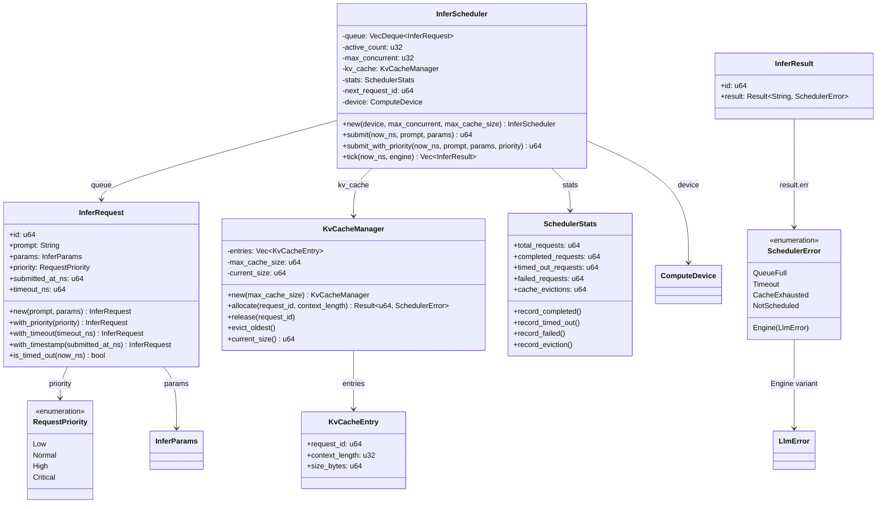
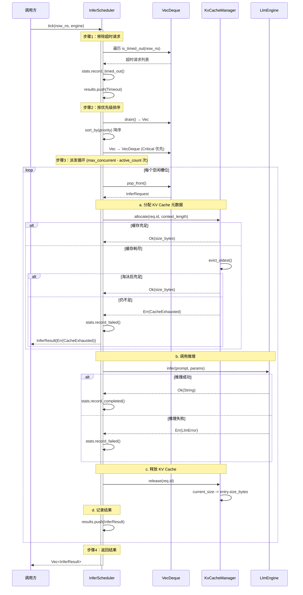

# EnerOS 推理调度与并发控制设计 — InferScheduler + KV Cache + 优先级队列

> **版本**：v0.62.0（P1-I AI Runtime LLM 第四层，推理调度层）
> **crate**：`eneros-infer-scheduler`（`crates/ai/infer-scheduler/`）
> **蓝图依据**：`蓝图/phase1.md` §v0.62.0
> **最后更新**：2026-07-16

---

## 1. 版本目标

### 1.1 一句话目标

定义推理调度器（`InferScheduler`）及其配套类型（`InferRequest` / `InferResult` / `RequestPriority` / `KvCacheManager` / `SchedulerStats` / `SchedulerError`），基于轮询式 `tick()` 模型在单线程 no_std 环境下对 LLM 推理请求进行排队、优先级调度、KV Cache 元数据追踪与超时控制，使上层（v0.63.0 Prompt 模板、v0.71.0 双脑联调）可基于该调度器编排 LLM 调用而不直接耦合 `LlmEngine` trait，并约束并发数 ≤ 2 以匹配 GPU 显存预算。

### 1.2 详细描述

v0.59.0 完成了 LLM 推理引擎接口层（`LlmEngine` trait + `MockEngine` + `LlamaCppEngine` FFI），v0.60.0 实现了模型加载，v0.61.0 实现了基础调度原型。本版本（v0.62.0）在 v0.59.0 的 `LlmEngine` trait 之上构建正式的推理调度器，引入四优先级（Low/Normal/High/Critical）、KV Cache 元数据追踪、超时控制与调度统计四项核心能力。

本版本交付六项核心产出：

| 产出 | 角色 | 说明 |
|------|------|------|
| `InferScheduler` | 调度器主体 | 轮询式 `tick(now_ns, engine) -> Vec<InferResult>`，队列 + 并发限制 + KV Cache 追踪 |
| `InferRequest` | 请求结构 | id / prompt / params / priority / submitted_at_ns / timeout_ns |
| `InferResult` | 结果结构 | id + `Result<String, SchedulerError>` |
| `RequestPriority` | 优先级枚举 | Low / Normal / High / Critical，派生 `Ord`（Critical > High > Normal > Low） |
| `KvCacheManager` | KV Cache 元数据追踪 | entries / max_cache_size / current_size；allocate / release / evict_oldest |
| `SchedulerStats` | 调度统计 | total / completed / timed_out / failed / evictions，普通 u64（D5） |

同时交付 `SchedulerError` 错误枚举（5 变体 + `From<LlmError>`）。所有 Rust 代码必须 no_std（D1，蓝图 §43.1），仅使用 `core::*` / `alloc::*`，无 `std::*`，无 FFI 声明，无 `unsafe` 块（D10，纯安全 Rust）。

### 1.3 路线图定位

| 维度 | 定位 |
|------|------|
| Phase | Phase 1 单机 MVP |
| 子系统 | P1-I AI Runtime LLM 第四层（推理调度层） |
| 平面 | 慢平面（Agent Runtime 分区，管理信息大区） |
| 角色 | LLM 推理调度器，编排 `LlmEngine` 调用 |
| 上游版本 | v0.59.0 `LlmEngine` trait + `InferParams` + `LlmError` + `ComputeDevice`；v0.11.0 用户堆（alloc 支持）；v0.12.0 RTC（`now_ns` 时间源） |
| 同层版本 | v0.62.0（本版本，推理调度与并发控制） |
| 下游版本 | v0.63.0 Prompt 模板（注入 prompt）；v0.71.0 双脑联调（编排 LLM + Solver） |
| 部署形态 | 边缘 LLM 推理统一采用 llama.cpp（C API），禁止 PyTorch（蓝图 §43.3） |

### 1.4 路线图链路

```
v0.59.0 LlmEngine trait ──► v0.60.0 模型加载 ──► v0.61.0 基础调度原型
                                                        │
                                                        ▼
                                              v0.62.0 推理调度与并发控制（本版本）
                                                        │
                                                        ▼
                                              v0.63.0 Prompt 模板
                                                        │
                                                        ▼
                                              v0.71.0 双脑联调
```

### 1.5 依赖关系

| 依赖 | 来源 | 用途 |
|------|------|------|
| `LlmEngine` trait | v0.59.0（[设计文档](./llm-engine-design.md)） | `tick()` 内调用 `engine.infer(prompt, params)` 执行推理 |
| `InferParams` | v0.59.0 | `InferRequest.params` 字段类型，传给 `engine.infer` |
| `LlmError` | v0.59.0 | `SchedulerError::Engine(LlmError)` 变体，`From<LlmError>` 转换 |
| `ComputeDevice` | v0.59.0 | `InferScheduler.device` 字段，记录目标设备用于 GPU 策略 |
| `alloc::collections::VecDeque` | `alloc` crate | 调度器队列（D1） |
| `alloc::string::String` | `alloc` crate | prompt 与推理结果（D1） |
| `now_ns: u64` | 调用方注入（v0.12.0 RTC 或测试 mock） | 超时判定与时间戳（D6） |

> **注**：本版本**仅依赖 v0.59.0**，不依赖 v0.60.0（模型加载）与 v0.61.0（基础调度原型）。`InferScheduler` 通过 `LlmEngine` trait 抽象调用推理引擎，与具体实现（`MockEngine` / `LlamaCppEngine`）解耦（D11）。

### 1.6 设计原则关联

| 原则 | 体现 |
|------|------|
| no_std 合规 | 全 crate 仅使用 `core::*` / `alloc::*`，无 `std::*`（D1，蓝图 §43.1） |
| 轮询式调度 | `tick(now_ns, engine) -> Vec<InferResult>`，无 async/await，无回调（D2） |
| 安全优先 | 无 FFI 声明，无 `unsafe` 块，纯安全 Rust（D10） |
| 元数据追踪 | KV Cache 仅追踪元数据（size_bytes），不分配 GPU 显存（D4） |
| 单线程无锁 | 统计使用普通 u64，无 AtomicU64（D5） |
| 时间注入 | `now_ns: u64` 由调用方注入，无 `MonotonicTime::now()`（D6） |
| 复用优先 | 复用 v0.59.0 类型，不重新定义（D11） |
| GPU 优先 | GPU 可用时 `max_concurrent` 仍 ≤ 2（显存约束），GPU offload 由 llama.cpp `n_gpu_layers` 控制 |

---

## 2. 架构定位

### 2.1 P1-I AI Runtime LLM 分层

P1-I AI Runtime LLM 子系统按"引擎接口 → 模型加载 → 基础调度 → 推理调度 → Prompt 模板"五层层级组织，本版本位于第四层：

| 层级 | 版本 | crate | 职责 |
|------|------|-------|------|
| 第一层（引擎接口） | v0.59.0 | `eneros-llm-engine` | `LlmEngine` trait + MockEngine + LlamaCppEngine FFI |
| 第二层（模型加载） | v0.60.0 | （后续） | 模型文件加载、校验、元信息解析 |
| 第三层（基础调度原型） | v0.61.0 | （后续） | 基础推理请求排队原型 |
| **第四层（推理调度）** | **v0.62.0** | **`eneros-infer-scheduler`** | **优先级调度 + KV Cache 追踪 + 超时控制 + 并发限制** |
| 第五层（Prompt 模板） | v0.63.0 | （后续） | Prompt 模板渲染、JSON 输出约束 |

第四层在第三层基础调度原型之上引入四项正式能力：四优先级（Low/Normal/High/Critical）、KV Cache 元数据追踪、超时控制与调度统计。所有上层版本依赖本版本的 `InferScheduler` 进行 LLM 调用编排，不直接调用 `LlmEngine::infer`。

### 2.2 与 LlmEngine 的关系

`InferScheduler` 是 `LlmEngine` 的上层编排者，而非替代品：

| 维度 | `LlmEngine`（v0.59.0） | `InferScheduler`（v0.62.0） |
|------|------------------------|------------------------------|
| 角色 | 推理接口抽象 | 推理调度编排 |
| 输入 | prompt + params | `InferRequest`（含优先级、超时） |
| 输出 | `Result<String, LlmError>` | `Vec<InferResult>`（每 tick 批量返回） |
| 并发 | 单次调用 | `max_concurrent ≤ 2`，队列排队 |
| 时间 | 无时间感知 | `now_ns` 注入，超时判定 |
| KV Cache | 不感知 | 元数据追踪（allocate / release / evict） |
| 优先级 | 无 | 四优先级，Critical 优先调度 |
| 错误 | `LlmError`（8 变体） | `SchedulerError`（5 变体，含 `Engine(LlmError)`） |

调用关系：

```
Caller ──submit()──► InferScheduler.queue (VecDeque<InferRequest>)
                          │
Caller ──tick(now_ns, engine)──► InferScheduler
                          │
                          ├── 1. 移除超时请求
                          ├── 2. 按优先级排序
                          ├── 3. 派发至 max_concurrent 槽位
                          │       │
                          │       ├── kv_cache.allocate(req.id, ctx_len)
                          │       ├── engine.infer(prompt, params)
                          │       └── kv_cache.release(req.id)
                          │
                          └──► Vec<InferResult>
```

### 2.3 双脑架构中的定位

双脑架构（蓝图 §9.x）中 LLM 与 Solver 的协作链路：

```
[市场信号/自然语言指令]
        │
        ▼
v0.62.0 InferScheduler (本版本)
        │
        ▼
v0.59.0 LlmEngine (trait)
        │
        ▼
   LLM 推理 (llama.cpp via FFI)
        │
        ▼
   JSON 意图输出
        │
        ▼
v0.71.0 双脑联调 ──► Solver (LP/MILP, HiGHS)
                        │
                        ▼
                   优化决策 (L1 主路径)
                        │
                        ▼
                   控制命令下发
```

| 路径 | 内容 | MVP 可验收 | 说明 |
|------|------|-----------|------|
| L1 主路径 | Solver-only（LP/MILP） | ✅ 是 | 实时控制 < 500ms，不依赖 LLM |
| L2 增强路径 | LLM + Solver（双脑） | ❌ 否 | 离线复杂规划/自然语言交互，降级到 L1 |

本版本为 L2 增强路径的调度中枢：上层（v0.71.0 双脑联调）通过 `submit()` 提交推理请求，通过 `tick()` 获取推理结果，由调度器内部处理排队、优先级、超时与 KV Cache 追踪。L2 路径在 LLM 不可用时降级到 L1（Solver-only），降级编排由 v0.71.0 实现；本版本在 KV Cache 耗尽或引擎连续失败时返回 `SchedulerError`，由上层决策降级。

### 2.4 P1-I LLM 第四层定位

本版本对应 P1-I AI Runtime LLM 子系统的第四层（推理调度层），其核心职责：

| 职责 | 实现方式 | 章节参考 |
|------|---------|---------|
| 请求排队 | `VecDeque<InferRequest>` 队列 | §4 InferScheduler |
| 优先级调度 | `RequestPriority` 枚举 + `Ord` 派生 | §7 RequestPriority |
| 并发限制 | `max_concurrent ≤ 2` 字段约束 | §4 InferScheduler |
| 超时控制 | `is_timed_out(now_ns)` + `timeout_ns` | §3 InferRequest |
| KV Cache 追踪 | `KvCacheManager` 元数据管理 | §6 KvCacheManager |
| 调度统计 | `SchedulerStats` 5 字段 | §8 SchedulerStats |
| 错误处理 | `SchedulerError` 5 变体 + `From<LlmError>` | §9 错误处理 |

### 2.5 上下游依赖图

```
v0.59.0 LlmEngine trait ──┐
v0.59.0 InferParams ──────┤
v0.59.0 LlmError ─────────┤
v0.59.0 ComputeDevice ────┤
                          │
v0.11.0 用户堆 ──► alloc ─┤
                          │
v0.12.0 RTC ──► now_ns ───┤
                          │
                          ▼
             v0.62.0 InferScheduler
             ├── InferRequest
             ├── InferResult
             ├── RequestPriority
             ├── KvCacheManager
             ├── SchedulerStats
             └── SchedulerError
                          │
                          ▼
             v0.63.0 Prompt 模板
                          │
                          ▼
             v0.71.0 双脑联调
```

### 2.6 不做的事（职责边界）

本调度器**不负责**以下职责，避免与上下游重叠：

| 不做的事 | 归属版本 | 理由 |
|---------|---------|------|
| 模型加载与校验 | v0.60.0 | 调度器假设引擎已加载模型，通过 `LlmEngine` trait 调用 |
| Prompt 模板渲染 | v0.63.0 | 调度器接收已渲染的 prompt 字符串（`InferRequest.prompt`） |
| 双脑降级编排 | v0.71.0 | 调度器仅返回 `SchedulerError`，降级决策由上层编排 |
| GPU 显存分配 | llama.cpp（C 库） | KV Cache 仅追踪元数据，实际显存由 llama.cpp `n_gpu_layers` 管理（D4） |
| 多模型管理 | v0.71.0+ | 调度器单引擎单模型，多模型由上层编排 |
| 持久化请求历史 | 后续版本 | 调度器仅维护内存队列，重启后丢失 |
| 跨核并发 | — | 单线程 no_std，无跨核需求（D2） |

---

## 3. InferRequest 推理请求

### 3.1 结构定义

```rust
use alloc::string::String;
use eneros_llm_engine::InferParams;

use crate::priority::RequestPriority;

/// 推理请求（6 字段）。
///
/// 由调用方通过 `InferScheduler::submit()` 构造并入队。
/// 调度器在 `tick()` 中按优先级取出并派发给 `LlmEngine`。
///
/// **超时判定**（D6）：`is_timed_out(now_ns)` 比较
/// `now_ns - submitted_at_ns > timeout_ns`，使用 `saturating_sub`
/// 防止 `now_ns < submitted_at_ns` 时下溢。
#[derive(Debug, Clone)]
pub struct InferRequest {
    /// 请求 ID（由调度器分配，全局唯一）
    pub id: u64,
    /// 输入提示词（已渲染，由 v0.63.0 Prompt 模板生成）
    pub prompt: String,
    /// 推理参数（max_tokens / temperature / top_p / ...）
    pub params: InferParams,
    /// 请求优先级（默认 Normal）
    pub priority: RequestPriority,
    /// 提交时间戳（纳秒，由调用方注入）
    pub submitted_at_ns: u64,
    /// 超时阈值（纳秒，超过则 `is_timed_out` 返回 true）
    pub timeout_ns: u64,
}
```

### 3.2 字段说明

| # | 字段 | 类型 | 说明 | 默认值 |
|---|------|------|------|--------|
| 1 | `id` | `u64` | 请求 ID，由 `InferScheduler::submit()` 分配（`next_request_id` 自增） | 调度器分配 |
| 2 | `prompt` | `String` | 输入提示词，已渲染（v0.63.0 Prompt 模板输出） | 必填 |
| 3 | `params` | `InferParams` | 推理参数，传给 `engine.infer`（复用 v0.59.0 类型，D11） | `InferParams::default()` |
| 4 | `priority` | `RequestPriority` | 请求优先级，影响 `tick()` 内排序（默认 Normal） | `Normal` |
| 5 | `submitted_at_ns` | `u64` | 提交时间戳（纳秒），由 `submit(now_ns, ...)` 注入（D6） | 调用方提供 |
| 6 | `timeout_ns` | `u64` | 超时阈值（纳秒），默认 30 秒（`30_000_000_000`） | 30s |

### 3.3 构造函数与 builder 方法

```rust
impl InferRequest {
    /// 构造推理请求（id 由调度器在 submit 时分配，此处填 0 占位）。
    ///
    /// - `prompt`：输入提示词
    /// - `params`：推理参数
    pub fn new(prompt: &str, params: InferParams) -> Self {
        Self {
            id: 0,  // 由 submit() 分配
            prompt: String::from(prompt),
            params,
            priority: RequestPriority::default(),  // Normal
            submitted_at_ns: 0,  // 由 submit() 注入
            timeout_ns: 30_000_000_000,  // 30 秒默认超时
        }
    }

    /// builder：设置优先级。
    pub fn with_priority(mut self, priority: RequestPriority) -> Self {
        self.priority = priority;
        self
    }

    /// builder：设置超时阈值（纳秒）。
    pub fn with_timeout(mut self, timeout_ns: u64) -> Self {
        self.timeout_ns = timeout_ns;
        self
    }

    /// builder：设置提交时间戳（纳秒，通常由 submit() 注入）。
    pub fn with_timestamp(mut self, submitted_at_ns: u64) -> Self {
        self.submitted_at_ns = submitted_at_ns;
        self
    }
}
```

### 3.4 超时判定（D6）

```rust
impl InferRequest {
    /// 判断请求是否超时。
    ///
    /// **D6**：使用 `saturating_sub` 防止 `now_ns < submitted_at_ns` 时下溢
    /// （理论上不应发生，但 RTC 回拨或测试 mock 可能触发）。
    ///
    /// - `now_ns`：当前时间戳（纳秒），由调用方注入
    /// - 返回 `true`：已超时（`now_ns - submitted_at_ns > timeout_ns`）
    pub fn is_timed_out(&self, now_ns: u64) -> bool {
        let elapsed = now_ns.saturating_sub(self.submitted_at_ns);
        elapsed > self.timeout_ns
    }
}
```

### 3.5 超时判定逻辑详解

| 维度 | 说明 |
|------|------|
| 时间源 | `now_ns: u64` 由调用方注入（v0.12.0 RTC 或测试 mock），调度器无 `MonotonicTime::now()`（D6） |
| 时间单位 | 纳秒（nanoseconds），与 v0.12.0 RTC 一致 |
| 比较方式 | `now_ns - submitted_at_ns > timeout_ns` |
| 下溢防护 | `saturating_sub`：`now_ns < submitted_at_ns` 时返回 0，不 panic |
| 默认超时 | 30 秒（`30_000_000_000` 纳秒） |
| 超时处理 | `tick()` 步骤 1 移除超时请求，记入 `SchedulerStats.timed_out_requests`，返回 `InferResult` 含 `SchedulerError::Timeout` |

### 3.6 超时判定示例

```rust
// 场景：请求提交于 t=0，超时 10s
let req = InferRequest::new("hello", InferParams::default())
    .with_timeout(10_000_000_000)  // 10s
    .with_timestamp(0);             // submitted_at_ns = 0

assert_eq!(req.is_timed_out(5_000_000_000), false);   // 5s 未超时
assert_eq!(req.is_timed_out(10_000_000_000), false);  // 10s 边界未超时（> 而非 >=）
assert_eq!(req.is_timed_out(10_000_000_001), true);   // 10s+1ns 超时
assert_eq!(req.is_timed_out(15_000_000_000), true);   // 15s 超时

// 场景：RTC 回拨（now_ns < submitted_at_ns），saturating_sub 返回 0，不超时
let req2 = InferRequest::new("hello", InferParams::default())
    .with_timestamp(1_000_000_000);  // submitted_at_ns = 1s
assert_eq!(req2.is_timed_out(500_000_000), false);  // now < submitted，elapsed=0，不超时
```

---

## 4. InferScheduler 调度器

### 4.1 结构定义

```rust
use alloc::collections::VecDeque;
use alloc::vec::Vec;

use eneros_llm_engine::{ComputeDevice, InferParams, LlmEngine};
use eneros_llm_engine::LlmError;

use crate::error::SchedulerError;
use crate::kv_cache::KvCacheManager;
use crate::request::{InferRequest, InferResult};
use crate::stats::SchedulerStats;

/// 推理调度器（7 字段）。
///
/// 轮询式调度器，通过 `tick(now_ns, engine)` 驱动推理。
/// 单线程 no_std（D1/D2），无 async/await，无回调。
///
/// **并发限制**：`max_concurrent ≤ 2`，受 GPU 显存约束（D4）。
///
/// **KV Cache 追踪**：`kv_cache` 字段为元数据追踪器，不分配 GPU 显存（D4）。
///
/// **不实现 Drop**（D8）：队列与 KV Cache 由 Rust 所有权自动释放。
pub struct InferScheduler {
    /// 请求队列（FIFO + 优先级排序）
    queue: VecDeque<InferRequest>,
    /// 当前活跃推理数（已派发但未完成）
    active_count: u32,
    /// 最大并发数（≤ 2，GPU 显存约束）
    max_concurrent: u32,
    /// KV Cache 元数据追踪器
    kv_cache: KvCacheManager,
    /// 调度统计
    stats: SchedulerStats,
    /// 下一个请求 ID（自增）
    next_request_id: u64,
    /// 目标计算设备（GPU 策略参考）
    device: ComputeDevice,
}
```

### 4.2 字段说明

| # | 字段 | 类型 | 说明 | 初始值 |
|---|------|------|------|--------|
| 1 | `queue` | `VecDeque<InferRequest>` | 请求队列，`tick()` 内按优先级排序 | 空 |
| 2 | `active_count` | `u32` | 当前活跃推理数（派发至 engine 但未完成） | 0 |
| 3 | `max_concurrent` | `u32` | 最大并发数（≤ 2），由 `new()` 参数约束 | 调用方指定 |
| 4 | `kv_cache` | `KvCacheManager` | KV Cache 元数据追踪器（D4） | `KvCacheManager::new(max_size)` |
| 5 | `stats` | `SchedulerStats` | 调度统计（D5：普通 u64） | `SchedulerStats::default()` |
| 6 | `next_request_id` | `u64` | 下一个请求 ID，自增分配 | 1 |
| 7 | `device` | `ComputeDevice` | 目标计算设备，GPU 策略参考 | 调用方指定 |

### 4.3 构造函数

```rust
impl InferScheduler {
    /// 构造推理调度器。
    ///
    /// - `device`：目标计算设备（Cpu / Cuda / Metal / Npu）
    /// - `max_concurrent`：最大并发数（≤ 2，超出截断为 2，GPU 显存约束）
    /// - `max_cache_size`：KV Cache 最大字节数（元数据追踪，非实际显存分配）
    ///
    /// # 约束
    ///
    /// - `max_concurrent` 上限为 2（D4，GPU 显存约束）
    /// - `max_cache_size` 由调用方根据设备显存预算指定
    pub fn new(
        device: ComputeDevice,
        max_concurrent: u32,
        max_cache_size: u64,
    ) -> Self {
        let max_concurrent = if max_concurrent > 2 { 2 } else { max_concurrent };
        Self {
            queue: VecDeque::new(),
            active_count: 0,
            max_concurrent,
            kv_cache: KvCacheManager::new(max_cache_size),
            stats: SchedulerStats::default(),
            next_request_id: 1,
            device,
        }
    }
}
```

### 4.4 submit() — 入队

```rust
impl InferScheduler {
    /// 提交推理请求并入队。
    ///
    /// - `now_ns`：当前时间戳（纳秒，D6：调用方注入）
    /// - `prompt`：输入提示词
    /// - `params`：推理参数
    /// - 返回分配的请求 ID
    ///
    /// # 流程
    ///
    /// 1. 分配请求 ID（`next_request_id` 自增）
    /// 2. 构造 `InferRequest`，注入 `submitted_at_ns = now_ns`
    /// 3. 入队（`queue.push_back`）
    /// 4. 更新 `stats.total_requests`
    pub fn submit(
        &mut self,
        now_ns: u64,
        prompt: &str,
        params: InferParams,
    ) -> u64 {
        let id = self.next_request_id;
        self.next_request_id += 1;

        let request = InferRequest {
            id,
            prompt: String::from(prompt),
            params,
            priority: RequestPriority::default(),  // Normal，调用方可通过 builder 修改
            submitted_at_ns: now_ns,
            timeout_ns: 30_000_000_000,  // 30s 默认超时
        };

        self.queue.push_back(request);
        self.stats.total_requests += 1;
        id
    }
}
```

### 4.5 submit_with_priority() — 带优先级入队

```rust
impl InferScheduler {
    /// 提交带优先级的推理请求。
    ///
    /// 在 `submit()` 基础上允许指定优先级，用于 Critical 请求（如双脑联调
    /// 的实时决策）插队调度。
    pub fn submit_with_priority(
        &mut self,
        now_ns: u64,
        prompt: &str,
        params: InferParams,
        priority: RequestPriority,
    ) -> u64 {
        let id = self.next_request_id;
        self.next_request_id += 1;

        let request = InferRequest {
            id,
            prompt: String::from(prompt),
            params,
            priority,
            submitted_at_ns: now_ns,
            timeout_ns: 30_000_000_000,
        };

        self.queue.push_back(request);
        self.stats.total_requests += 1;
        id
    }
}
```

### 4.6 tick() — 轮询式调度（D2）

```rust
impl InferScheduler {
    /// 轮询式调度一帧。
    ///
    /// **D2**：采用轮询式 `tick(now_ns, engine) -> Vec<InferResult>`，
    /// 而非 async 回调。单线程 no_std 无真正并发，轮询模型更简单、更可测。
    ///
    /// - `now_ns`：当前时间戳（纳秒，D6：调用方注入）
    /// - `engine`：LLM 推理引擎（实现 `LlmEngine` trait）
    /// - 返回：本 tick 完成的 `InferResult` 列表（含超时、成功、失败）
    ///
    /// # 流程（4 步）
    ///
    /// 1. 移除超时请求，记入 `stats.timed_out_requests`，加入结果列表
    /// 2. 按优先级降序排序队列（Critical 优先）
    /// 3. 派发至多 `max_concurrent - active_count` 个请求：
    ///    a. `kv_cache.allocate(req.id, context_length)`
    ///    b. `engine.infer(prompt, params)`
    ///    c. `kv_cache.release(req.id)`
    ///    d. 记录结果（成功或失败）
    /// 4. 返回 `Vec<InferResult>`
    pub fn tick(
        &mut self,
        now_ns: u64,
        engine: &mut dyn LlmEngine,
    ) -> Vec<InferResult> {
        let mut results: Vec<InferResult> = Vec::new();

        // 步骤 1：移除超时请求
        self.remove_timed_out(now_ns, &mut results);

        // 步骤 2：按优先级降序排序（Critical 优先）
        self.sort_by_priority();

        // 步骤 3：派发至空闲槽位
        let slots = self.max_concurrent.saturating_sub(self.active_count);
        for _ in 0..slots {
            if let Some(req) = self.queue.pop_front() {
                let result = self.dispatch(engine, &req);
                results.push(result);
            } else {
                break;  // 队列为空
            }
        }

        results
    }
}
```

### 4.7 类图（Mermaid）



图 1：`InferScheduler` 类图。调度器聚合 `InferRequest` 队列、`KvCacheManager`、`SchedulerStats`；`InferRequest` 引用 `RequestPriority` 与 `InferParams`（v0.59.0）；`InferResult` 包装 `SchedulerError`，后者含 `Engine(LlmError)` 变体引用 v0.59.0 的 `LlmError`。

### 4.8 为什么不实现 Drop（D8）

| 维度 | 说明 |
|------|------|
| 蓝图描述 | 蓝图未要求 `InferScheduler` 实现 `Drop` |
| 实际实现 | **不实现 `Drop`**（D8） |
| 决策理由 | `queue: VecDeque<InferRequest>` 与 `kv_cache: KvCacheManager` 均为 Rust 所有权类型，离开作用域时自动释放；无 FFI 指针、无 C 库资源、无文件句柄，无需自定义 `Drop` |
| 对比 v0.59.0 | v0.59.0 `LlamaCppEngine` 需 `Drop` 释放 `ctx: *mut c_void`（FFI 指针）；本调度器无 FFI，无 `unsafe`（D10） |
| 一致性 | 与 v0.59.0 `MockEngine`（无 `Drop`）一致 |

---

## 5. tick 执行流程

### 5.1 四步流程概述

`tick(now_ns, engine)` 是调度器的核心驱动方法，采用四步流程：

| 步骤 | 操作 | 影响 |
|------|------|------|
| 1. 移除超时 | 遍历队列，`is_timed_out(now_ns)` 为 true 的请求移除 | `stats.timed_out_requests += 1`；结果列表追加 `Timeout` |
| 2. 优先级排序 | 队列转 `Vec`，`sort_by(priority)` 降序，转回 `VecDeque` | Critical 优先 |
| 3. 派发执行 | 派发至多 `max_concurrent - active_count` 个请求 | allocate → infer → release → 记录结果 |
| 4. 返回结果 | 收集本 tick 所有 `InferResult` 返回 | 调用方处理结果 |

### 5.2 步骤 1：移除超时请求

```rust
impl InferScheduler {
    /// 移除队列中超时的请求，加入结果列表。
    fn remove_timed_out(&mut self, now_ns: u64, results: &mut Vec<InferResult>) {
        let mut i = 0;
        while i < self.queue.len() {
            if self.queue[i].is_timed_out(now_ns) {
                let req = self.queue.remove(i).expect("index valid");
                self.stats.record_timed_out();
                results.push(InferResult {
                    id: req.id,
                    result: Err(SchedulerError::Timeout),
                });
            } else {
                i += 1;
            }
        }
    }
}
```

### 5.3 步骤 2：按优先级排序

```rust
impl InferScheduler {
    /// 按优先级降序排序队列（Critical 优先）。
    ///
    /// 将 `VecDeque` 转 `Vec`，`sort_by` 按 `priority` 降序，
    /// 再转回 `VecDeque`。单线程下 O(n log n) 排序开销可接受
    /// （队列通常 < 16 个请求）。
    fn sort_by_priority(&mut self) {
        let mut vec: Vec<InferRequest> = self.queue.drain(..).collect();
        vec.sort_by(|a, b| b.priority.cmp(&a.priority));  // 降序
        self.queue = vec.into_iter().collect();
    }
}
```

### 5.4 步骤 3：派发执行

```rust
impl InferScheduler {
    /// 派发单个请求至 engine 执行。
    ///
    /// 流程：
    /// a. `kv_cache.allocate(req.id, context_length)` — 分配 KV Cache 元数据
    /// b. `engine.infer(prompt, params)` — 调用推理
    /// c. `kv_cache.release(req.id)` — 释放 KV Cache 元数据
    /// d. 记录结果（成功或失败），更新统计
    fn dispatch(
        &mut self,
        engine: &mut dyn LlmEngine,
        req: &InferRequest,
    ) -> InferResult {
        // a. 分配 KV Cache（元数据追踪，D4）
        let context_length = req.params.max_tokens as u32 + 256;  // 估算上下文长度
        match self.kv_cache.allocate(req.id, context_length) {
            Ok(_size_bytes) => {
                // b. 调用推理
                let infer_result = engine.infer(&req.prompt, &req.params);

                // c. 释放 KV Cache（无论推理成功与否）
                self.kv_cache.release(req.id);

                // d. 记录结果
                match infer_result {
                    Ok(text) => {
                        self.stats.record_completed();
                        InferResult {
                            id: req.id,
                            result: Ok(text),
                        }
                    }
                    Err(e) => {
                        self.stats.record_failed();
                        InferResult {
                            id: req.id,
                            result: Err(SchedulerError::from(e)),
                        }
                    }
                }
            }
            Err(e) => {
                // KV Cache 分配失败（CacheExhausted）
                self.stats.record_failed();
                InferResult {
                    id: req.id,
                    result: Err(e),
                }
            }
        }
    }
}
```

### 5.5 时序图（Mermaid）



图 2：`tick()` 执行时序图。调用方驱动 `tick(now_ns, engine)`，调度器依次执行移除超时、优先级排序、派发循环（含 KV Cache allocate/release 与 engine.infer），最终返回本 tick 的 `Vec<InferResult>`。

### 5.6 tick() 调用示例

```rust
use eneros_llm_engine::{ComputeDevice, InferParams, MockEngine};

let mut scheduler = InferScheduler::new(ComputeDevice::Cpu, 2, 1_073_741_824);  // 1GB cache
let mut engine = MockEngine::new(ComputeDevice::Cpu);
engine.load_model("model.gguf").unwrap();

// 提交 3 个请求（max_concurrent=2，第 3 个排队）
let now_ns: u64 = 0;
let id1 = scheduler.submit(now_ns, "prompt1", InferParams::default());
let id2 = scheduler.submit(now_ns, "prompt2", InferParams::default());
let id3 = scheduler.submit(now_ns, "prompt3", InferParams::default());

// 第一次 tick：派发前 2 个（max_concurrent=2）
let results = scheduler.tick(now_ns, &mut engine);
assert_eq!(results.len(), 2);  // id1, id2 完成
assert!(results.iter().all(|r| r.result.is_ok()));

// 第二次 tick：派发第 3 个
let results = scheduler.tick(now_ns, &mut engine);
assert_eq!(results.len(), 1);  // id3 完成
```

### 5.7 轮询式 vs async 回调（D2）

| 维度 | 轮询式 `tick()`（本设计，D2） | async 回调 |
|------|------------------------------|-----------|
| 调用模型 | 调用方主动调用 `tick(now_ns, engine)` | 调度器内部 async，回调通知完成 |
| 并发模型 | 单线程顺序执行（无真正并发） | async runtime 调度（需 `tokio` / `embassy`） |
| no_std 兼容 | ✅ 无 async runtime 依赖 | ❌ async no_std 需 `embassy`（复杂） |
| 可测试性 | ✅ 注入 `now_ns` 与 `engine`，断言结果 | ❌ async 测试需 runtime |
| 简单性 | ✅ 顺序代码，无 `async`/`.await` | ❌ async 状态机复杂 |
| 一致性 | 与 v0.54.0~v0.58.0 轮询式 tick 一致 | — |
| 蓝图描述 | 蓝图未指定调度模型 | — |

**决策**：采用轮询式 `tick()`（D2）。单线程 no_std 无真正并发，async/await 引入 `embassy` 等复杂依赖不划算；轮询模型更简单、更可测，与既有版本（v0.54.0~v0.58.0）一致。

---

## 6. KvCacheManager KV Cache 管理

### 6.1 设计原则（D4：元数据追踪，非显存分配）

| 维度 | 说明 |
|------|------|
| **D4 决策** | KV Cache 作为**元数据追踪器**，不分配 GPU 显存 |
| `allocate` 返回 | `Result<u64, SchedulerError>`，`u64` 为 `size_bytes`（非 `*mut u8`） |
| 实际显存分配 | 由 llama.cpp C 库通过 `n_gpu_layers` 参数内部管理 |
| 大小估算公式 | `context_length * 512 * 1024 bytes`（512KB/token） |
| 追踪目的 | 防止 KV Cache 累积超过 GPU 显存预算，触发 `CacheExhausted` 降级 |

> **关键澄清**：`KvCacheManager` 不调用任何 GPU API，不分配显存，不持有 `*mut u8` 指针。它仅追踪每个请求的 KV Cache 元数据（request_id / context_length / size_bytes），用于在元数据层面判断是否超过 `max_cache_size` 预算。实际 GPU 显存由 llama.cpp C 库管理（通过 `n_gpu_layers` 控制 offload 层数），Rust 侧无法也无需干预。

### 6.2 结构定义

```rust
use alloc::vec::Vec;

use crate::error::SchedulerError;

/// KV Cache 元数据追踪器（3 字段，D4）。
///
/// **D4：元数据追踪，非显存分配**。本结构仅追踪每个请求的 KV Cache
/// 大小元数据，不分配 GPU 显存。实际显存由 llama.cpp C 库通过
/// `n_gpu_layers` 参数内部管理。
///
/// **D12：无 Mock 后端**。本结构直接实例化，无 trait 抽象，纯元数据操作。
pub struct KvCacheManager {
    /// KV Cache 条目列表（每请求一条）
    entries: Vec<KvCacheEntry>,
    /// 最大缓存大小（字节，由调度器构造时指定）
    max_cache_size: u64,
    /// 当前已使用缓存大小（字节，所有 entries 的 size_bytes 之和）
    current_size: u64,
}

/// KV Cache 条目（3 字段）。
#[derive(Debug, Clone)]
pub struct KvCacheEntry {
    /// 关联的请求 ID
    pub request_id: u64,
    /// 上下文长度（token 数）
    pub context_length: u32,
    /// 缓存大小（字节，= context_length * 512 * 1024）
    pub size_bytes: u64,
}
```

### 6.3 大小估算公式

```rust
impl KvCacheManager {
    /// 计算 KV Cache 大小（字节）。
    ///
    /// **公式**：`context_length * 512 * 1024 bytes`（512KB/token）
    ///
    /// 该公式基于 llama.cpp 7B INT4 模型的经验估算：
    /// - 每层 KV Cache 约 32KB/token（7B 模型 32 层）
    /// - 实际值因模型而异，此处取保守上界 512KB/token
    ///
    /// - `context_length`：上下文长度（token 数）
    /// - 返回：缓存大小（字节）
    fn calculate_cache_size(context_length: u32) -> u64 {
        (context_length as u64)
            .saturating_mul(512)
            .saturating_mul(1024)
    }
}
```

| 参数 | 值 | 说明 |
|------|-----|------|
| 每 token KV Cache | 512 KB | 保守上界（7B INT4 模型 32 层） |
| 上下文长度 2048 | 1 GB | `2048 * 512 * 1024 = 1_073_741_824` |
| 上下文长度 4096 | 2 GB | `4096 * 512 * 1024 = 2_147_483_648` |
| 上下文长度 512 | 256 MB | `512 * 512 * 1024 = 268_435_456` |

### 6.4 构造函数

```rust
impl KvCacheManager {
    /// 构造 KV Cache 管理器。
    ///
    /// - `max_cache_size`：最大缓存大小（字节），由调度器根据设备显存预算指定
    pub fn new(max_cache_size: u64) -> Self {
        Self {
            entries: Vec::new(),
            max_cache_size,
            current_size: 0,
        }
    }
}
```

### 6.5 allocate() — 分配（含淘汰）

```rust
impl KvCacheManager {
    /// 分配 KV Cache 元数据。
    ///
    /// **D4**：仅追踪元数据，不分配 GPU 显存。
    ///
    /// - `request_id`：请求 ID
    /// - `context_length`：上下文长度（token 数）
    /// - 返回 `Ok(size_bytes)`：分配成功，返回缓存大小
    /// - 返回 `Err(SchedulerError::CacheExhausted)`：缓存耗尽（淘汰后仍不足）
    ///
    /// # 流程
    ///
    /// 1. 计算所需大小 `size_bytes = calculate_cache_size(context_length)`
    /// 2. 若 `current_size + size_bytes > max_cache_size`，调用 `evict_oldest()`
    /// 3. 淘汰后仍不足，返回 `Err(CacheExhausted)`
    /// 4. 创建 `KvCacheEntry`，加入 `entries`，更新 `current_size`
    pub fn allocate(
        &mut self,
        request_id: u64,
        context_length: u32,
    ) -> Result<u64, SchedulerError> {
        let size_bytes = Self::calculate_cache_size(context_length);

        // 检查容量，不足时淘汰
        while self.current_size + size_bytes > self.max_cache_size {
            if self.entries.is_empty() {
                // 单个请求就超过 max_cache_size，无法满足
                return Err(SchedulerError::CacheExhausted);
            }
            self.evict_oldest();
        }

        // 创建条目
        let entry = KvCacheEntry {
            request_id,
            context_length,
            size_bytes,
        };
        self.entries.push(entry);
        self.current_size += size_bytes;

        Ok(size_bytes)
    }
}
```

### 6.6 release() — 释放

```rust
impl KvCacheManager {
    /// 释放指定请求的 KV Cache 元数据。
    ///
    /// - `request_id`：请求 ID
    ///
    /// # 流程
    ///
    /// 1. 在 `entries` 中查找 `request_id` 匹配的条目
    /// 2. 找到则移除，`current_size -= entry.size_bytes`
    /// 3. 未找到则无操作（幂等，防止重复释放）
    pub fn release(&mut self, request_id: u64) {
        if let Some(pos) = self.entries.iter().position(|e| e.request_id == request_id) {
            let entry = self.entries.remove(pos);
            self.current_size = self.current_size.saturating_sub(entry.size_bytes);
        }
    }
}
```

### 6.7 evict_oldest() — 淘汰最旧

```rust
impl KvCacheManager {
    /// 淘汰最旧的 KV Cache 条目（entries[0]）。
    ///
    /// 由于 `entries` 按分配顺序追加，最旧的条目在队首（index 0）。
    /// 淘汰后更新 `current_size`，记入调度器统计（由调用方 `stats.record_eviction()`）。
    pub fn evict_oldest(&mut self) {
        if let Some(entry) = self.entries.first().cloned() {
            self.entries.remove(0);
            self.current_size = self.current_size.saturating_sub(entry.size_bytes);
        }
    }
}
```

### 6.8 为什么不直接分配 GPU 显存（D4 详解）

| 维度 | 直接分配 GPU 显存 | 元数据追踪（本设计，D4） |
|------|------------------|------------------------|
| GPU API | 需 `cudaMalloc` / `metalCreateBuffer` 等 FFI | 无 FFI |
| no_std 兼容 | ❌ CUDA/Metal SDK 不支持 no_std | ✅ 纯 Rust 元数据 |
| 实际控制权 | Rust 侧无法控制 llama.cpp 内部 KV Cache 分配 | llama.cpp 通过 `n_gpu_layers` 自管理 |
| 重复分配 | Rust 分配 + llama.cpp 分配 = 双重占用 | 仅 llama.cpp 分配，Rust 追踪元数据 |
| FFI 复杂度 | 高（需 FFI + unsafe + Drop） | 低（无 FFI，无 unsafe，D10） |
| 跨平台 | 需为 CUDA/Metal/NPU 分别实现 | 统一元数据接口 |
| 可测试性 | ❌ 测试需 GPU | ✅ 测试无需 GPU |

**决策**：采用元数据追踪（D4）。llama.cpp C 库内部已管理 KV Cache 显存分配（通过 `n_gpu_layers` 控制 offload 层数），Rust 侧再分配会导致双重占用且无法控制实际生命周期。本设计仅追踪元数据（`size_bytes`），在元数据层面判断是否超过预算，超过则触发 `CacheExhausted` 降级。

### 6.9 与 llama.cpp 的协作

```
Rust 侧（本 crate）          llama.cpp C 库（v0.59.0 FFI）
─────────────────────         ──────────────────────────
KvCacheManager.allocate()     
  └─ 元数据追踪                llama.cpp 内部分配 GPU 显存
     (size_bytes)                (n_gpu_layers 控制)
                                
KvCacheManager.release()      
  └─ 元数据移除                llama.cpp 内部释放（推理完成时）
                                
KvCacheManager.evict_oldest()
  └─ 元数据淘汰                llama.cpp 不感知（下次推理重新分配）
```

> **注**：Rust 侧的 `release()` 与 llama.cpp 内部的释放时机可能不完全同步。本设计保守估算（512KB/token），元数据层面的 `current_size` 是上界，实际 GPU 占用可能低于该值。若 `CacheExhausted` 触发频繁，调用方应增大 `max_cache_size` 或减小 `max_concurrent`。

### 6.10 D12：无 Mock 后端

| 维度 | 说明 |
|------|------|
| **D12 决策** | `KvCacheManager` 直接实例化，无 trait 抽象，无 Mock 后端 |
| 理由 | `KvCacheManager` 是纯元数据操作（Vec 增删查），无外部依赖，无需 Mock |
| 对比 v0.59.0 | v0.59.0 `LlmEngine` trait + `MockEngine` + `LlamaCppEngine`（因 FFI 需 Mock）；本版本无 FFI，无需 Mock |
| 测试方式 | 直接实例化 `KvCacheManager::new(max_size)`，调用 `allocate` / `release` / `evict_oldest` 断言 |

---

## 7. RequestPriority 请求优先级

### 7.1 枚举定义

```rust
/// 请求优先级（4 变体，派生 `Ord`）。
///
/// 优先级从低到高：Low < Normal < High < Critical。
/// `tick()` 内按优先级降序排序，Critical 优先调度。
///
/// **Ord 派生**：Rust 枚举变体的 `Ord` 派生按声明顺序，因此
/// `Low < Normal < High < Critical`（声明顺序即优先级顺序）。
#[derive(Debug, Clone, Copy, PartialEq, Eq, PartialOrd, Ord, Default)]
pub enum RequestPriority {
    /// 低优先级（后台批量推理）
    Low,
    /// 普通优先级（默认）
    #[default]
    Normal,
    /// 高优先级（交互式请求）
    High,
    /// 关键优先级（实时决策，如双脑联调的 L2 路径）
    Critical,
}
```

### 7.2 变体说明

| 变体 | 数值（Ord） | 场景 | 示例 |
|------|-----------|------|------|
| `Low` | 0 | 后台批量推理，无实时性要求 | 历史数据分析、模型预热 |
| `Normal` | 1（默认） | 普通推理请求 | 常规 LLM 调用 |
| `High` | 2 | 交互式请求，需较快响应 | 用户自然语言查询 |
| `Critical` | 3 | 实时决策，最高优先级 | 双脑联调 L2 路径的实时决策 |

### 7.3 Ord 派生机制

Rust 枚举的 `#[derive(Ord)]` 按变体声明顺序比较：

```rust
// 声明顺序：Low(0) < Normal(1) < High(2) < Critical(3)
assert!(RequestPriority::Low < RequestPriority::Normal);
assert!(RequestPriority::Normal < RequestPriority::High);
assert!(RequestPriority::High < RequestPriority::Critical);

// cmp 方法
assert_eq!(
    RequestPriority::Critical.cmp(&RequestPriority::Low),
    core::cmp::Ordering::Greater
);
```

### 7.4 默认值

| 维度 | 说明 |
|------|------|
| 默认变体 | `Normal`（`#[default]` 标注） |
| 理由 | 大多数推理请求为普通优先级；Critical/High 需显式指定 |
| nightly feature | `#[default]` 属性需 nightly（项目已用 nightly-2026-04-04） |
| 一致性 | 与 v0.59.0 `Quantization::Q4_K_M` / `ComputeDevice::Cpu` 的 `#[default]` 用法一致 |

### 7.5 优先级调度示例

```rust
let mut scheduler = InferScheduler::new(ComputeDevice::Cpu, 2, 1_073_741_824);
let now_ns: u64 = 0;

// 按提交顺序入队：Normal, Low, Critical, High
scheduler.submit_with_priority(now_ns, "normal", InferParams::default(), RequestPriority::Normal);
scheduler.submit_with_priority(now_ns, "low", InferParams::default(), RequestPriority::Low);
scheduler.submit_with_priority(now_ns, "critical", InferParams::default(), RequestPriority::Critical);
scheduler.submit_with_priority(now_ns, "high", InferParams::default(), RequestPriority::High);

// tick() 内排序后顺序：Critical, High, Normal, Low
// max_concurrent=2，派发前 2 个：Critical, High
let mut engine = MockEngine::new(ComputeDevice::Cpu);
engine.load_model("model.gguf").unwrap();
let results = scheduler.tick(now_ns, &mut engine);
assert_eq!(results.len(), 2);
// 第一个完成的是 Critical，第二个是 High
```

### 7.6 优先级在 tick() 中的应用

| 步骤 | 优先级作用 |
|------|-----------|
| 步骤 1（移除超时） | 不影响（超时判定与优先级无关） |
| 步骤 2（排序） | 按优先级降序排序（Critical 在队首） |
| 步骤 3（派发） | 从队首依次取出，Critical 优先派发 |
| 步骤 4（返回） | 结果按完成顺序返回（非优先级顺序） |

> **注**：优先级仅影响派发顺序，不影响结果返回顺序。结果按实际完成顺序追加到 `Vec<InferResult>`，调用方通过 `id` 字段匹配请求与结果。

---

## 8. SchedulerStats 调度器统计

### 8.1 结构定义（D5：普通 u64）

```rust
/// 调度器统计（5 字段，D5：普通 u64，无 AtomicU64）。
///
/// 单线程读写（调度器所在 Agent Runtime 分区单线程），无并发，
/// 无需原子操作。与 v0.54.0 D8、v0.55.0 D7、v0.56.0 D7、
/// v0.57.0 D7、v0.59.0 D5 一致。
#[derive(Debug, Clone, Default)]
pub struct SchedulerStats {
    /// 累计提交请求总数（submit/submit_with_priority 调用次数）
    pub total_requests: u64,
    /// 累计完成请求数（推理成功）
    pub completed_requests: u64,
    /// 累计超时请求数（is_timed_out 触发移除）
    pub timed_out_requests: u64,
    /// 累计失败请求数（推理失败或 CacheExhausted）
    pub failed_requests: u64,
    /// 累计 KV Cache 淘汰次数（evict_oldest 调用次数）
    pub cache_evictions: u64,
}
```

### 8.2 字段说明

| # | 字段 | 类型 | 触发条件 | 用途 |
|---|------|------|---------|------|
| 1 | `total_requests` | `u64` | `submit` / `submit_with_priority` 调用 | 调度器负载监控 |
| 2 | `completed_requests` | `u64` | `tick()` 内推理成功 | 完成率监控 |
| 3 | `timed_out_requests` | `u64` | `tick()` 步骤 1 移除超时请求 | 超时率监控 |
| 4 | `failed_requests` | `u64` | `tick()` 内推理失败或 CacheExhausted | 失败率监控 |
| 5 | `cache_evictions` | `u64` | `KvCacheManager.evict_oldest()` 调用 | 缓存压力监控 |

### 8.3 record_* 方法

```rust
impl SchedulerStats {
    /// 记录请求完成（推理成功）。
    pub fn record_completed(&mut self) {
        self.completed_requests += 1;
    }

    /// 记录请求超时。
    pub fn record_timed_out(&mut self) {
        self.timed_out_requests += 1;
    }

    /// 记录请求失败（推理失败或 CacheExhausted）。
    pub fn record_failed(&mut self) {
        self.failed_requests += 1;
    }

    /// 记录 KV Cache 淘汰。
    pub fn record_eviction(&mut self) {
        self.cache_evictions += 1;
    }
}
```

### 8.4 不使用 AtomicU64（D5）

| 维度 | 说明 |
|------|------|
| 访问模型 | `SchedulerStats` 仅由 `InferScheduler` 在 Agent Runtime 分区单线程读写 |
| 读者 | 调用方通过 `scheduler.stats()` 读取 `&SchedulerStats` 引用，无并发写入 |
| 原子开销 | `AtomicU64` 的 `fetch_add` 在 ARM64 需 `LDXR`/`STXR` 循环，比普通 `+=` 慢 |
| 单线程原子性 | 单线程下普通 `u64` 读写天然原子（64 位对齐访问无撕裂） |
| 一致性 | 与 v0.54.0 D8、v0.55.0 D7、v0.56.0 D7、v0.57.0 D7、v0.59.0 D5 一致 |

### 8.5 可观测性

调度器通过 `stats()` 方法提供可观测性：

```rust
impl InferScheduler {
    /// 返回调度统计只读引用。
    pub fn stats(&self) -> &SchedulerStats {
        &self.stats
    }

    /// 返回当前队列长度。
    pub fn queue_len(&self) -> usize {
        self.queue.len()
    }

    /// 返回当前 KV Cache 使用量（字节）。
    pub fn cache_usage(&self) -> u64 {
        self.kv_cache.current_size()
    }

    /// 返回当前 KV Cache 最大容量（字节）。
    pub fn cache_capacity(&self) -> u64 {
        self.kv_cache.max_cache_size()
    }
}
```

| 观测指标 | 方法 | 用途 |
|---------|------|------|
| 累计提交数 | `stats().total_requests` | 调度器负载 |
| 完成率 | `completed_requests / total_requests` | 健康度 |
| 超时率 | `timed_out_requests / total_requests` | 超时监控 |
| 失败率 | `failed_requests / total_requests` | 故障监控 |
| 缓存淘汰率 | `cache_evictions / total_requests` | 缓存压力 |
| 队列长度 | `queue_len()` | 积压监控 |
| 缓存使用率 | `cache_usage() / cache_capacity()` | 显存压力 |

### 8.6 与 v0.71.0 双脑联调的衔接

本调度器的统计为 v0.71.0 双脑联调提供降级决策输入：

| 本调度器统计信号 | v0.71.0 用途 |
|----------------|-------------|
| `failed_requests` 持续上升 | 触发 L2 → L1 降级（Solver-only） |
| `timed_out_requests` 持续上升 | 减小 `max_concurrent` 或增大 `timeout_ns` |
| `cache_evictions` 频繁 | 增大 `max_cache_size` 或减小上下文长度 |
| `queue_len()` 持续高 | 调度器过载，触发流控 |

---

## 9. 错误处理

### 9.1 SchedulerError 枚举（D7：5 变体 + From<LlmError>）

```rust
use core::fmt;

use eneros_llm_engine::LlmError;

/// 调度器错误枚举（5 变体，D7）。
///
/// 派生 `Debug`，实现 `core::fmt::Display`（no_std 无 `std::error::Error`）。
/// 实现 `From<LlmError>` 以支持 `?` 操作符在 `dispatch()` 内传播引擎错误。
#[derive(Debug, Clone, PartialEq)]
pub enum SchedulerError {
    /// 队列已满（预留变体，当前实现无队列大小限制）
    QueueFull,
    /// 请求超时（is_timed_out 触发）
    Timeout,
    /// KV Cache 耗尽（evict_oldest 后仍不足）
    CacheExhausted,
    /// LLM 引擎错误（包装 LlmError）
    Engine(LlmError),
    /// 请求未调度（不应发生，防御性变体）
    NotScheduled,
}
```

### 9.2 错误变体说明

| # | 变体 | 触发场景 | 处理策略 | 是否可恢复 |
|---|------|---------|---------|-----------|
| 1 | `QueueFull` | 队列达到上限（当前实现无上限，预留变体） | 调用方等待下个 tick | ✅ 等待 |
| 2 | `Timeout` | `is_timed_out(now_ns)` 返回 true | 请求丢弃，调用方可重试 | ✅ 重试 |
| 3 | `CacheExhausted` | `kv_cache.allocate()` 失败（evict 后仍不足） | 减小上下文长度或增大 `max_cache_size` | ⚠️ 调整参数 |
| 4 | `Engine(LlmError)` | `engine.infer()` 返回 `Err(LlmError)` | 根据 `LlmError` 变体处理（见下表） | 视变体而定 |
| 5 | `NotScheduled` | 请求未入队（防御性，不应发生） | 检查调度器逻辑 | ⚠️ 内部错误 |

### 9.3 Engine(LlmError) 变体的子错误处理

`SchedulerError::Engine(LlmError)` 包装 v0.59.0 的 `LlmError`，其变体处理策略：

| `LlmError` 变体 | 处理策略 | 是否可恢复 |
|----------------|---------|-----------|
| `LoadFailed` | 检查模型路径与文件 | ✅ 修正后重试 |
| `InferFailed` | 检查模型状态与参数 | ✅ 重试或降级 |
| `InvalidPath` | 检查路径合法性 | ✅ 修正路径 |
| `InvalidPrompt` | 检查 prompt 合法性 | ✅ 修正 prompt |
| `Utf8Error` | llama.cpp 应返回 UTF-8；失败属 C 库 bug | ⚠️ 重试或报告 |
| `GpuUnavailable` | 降级到 `ComputeDevice::Cpu`（D4） | ✅ CPU 降级 |
| `ModelNotLoaded` | 先调用 `load_model` | ✅ 加载后重试 |
| `OutOfMemory` | 减小模型/量化级别；触发 OOM handler | ⚠️ 缩减规模 |

### 9.4 Display 实现

```rust
impl fmt::Display for SchedulerError {
    fn fmt(&self, f: &mut fmt::Formatter<'_>) -> fmt::Result {
        match self {
            SchedulerError::QueueFull => write!(f, "scheduler queue full"),
            SchedulerError::Timeout => write!(f, "request timed out"),
            SchedulerError::CacheExhausted => write!(f, "KV cache exhausted"),
            SchedulerError::Engine(e) => write!(f, "engine error: {}", e),
            SchedulerError::NotScheduled => write!(f, "request not scheduled"),
        }
    }
}
```

### 9.5 From<LlmError> 转换

```rust
impl From<LlmError> for SchedulerError {
    /// 将 `LlmError` 转换为 `SchedulerError::Engine(LlmError)`。
    ///
    /// 支持 `dispatch()` 内 `engine.infer()?` 传播引擎错误。
    fn from(e: LlmError) -> Self {
        SchedulerError::Engine(e)
    }
}
```

| 转换前 | 转换后 | 场景 |
|--------|--------|------|
| `LlmError::ModelNotLoaded` | `SchedulerError::Engine(LlmError::ModelNotLoaded)` | 推理时模型未加载 |
| `LlmError::InferFailed` | `SchedulerError::Engine(LlmError::InferFailed)` | 推理失败 |
| `LlmError::GpuUnavailable` | `SchedulerError::Engine(LlmError::GpuUnavailable)` | GPU 不可用 |
| `LlmError::OutOfMemory` | `SchedulerError::Engine(LlmError::OutOfMemory)` | 引擎内存不足 |
| 其他 `LlmError` 变体 | `SchedulerError::Engine(...)` | 同理包装 |

### 9.6 错误传播路径

```
tick(now_ns, engine)
  │
  ├── 步骤1：remove_timed_out
  │     └── is_timed_out == true ──► InferResult(Err(Timeout))
  │                                   + stats.record_timed_out()
  │
  ├── 步骤2：sort_by_priority
  │     └── 无错误
  │
  └── 步骤3：dispatch（每个请求）
        ├── kv_cache.allocate()
        │     └── 失败 ──► InferResult(Err(CacheExhausted))
        │                    + stats.record_failed()
        │
        ├── engine.infer()
        │     ├── Ok(String) ──► InferResult(Ok(text))
        │     │                   + stats.record_completed()
        │     │
        │     └── Err(LlmError) ──► InferResult(Err(Engine(LlmError)))
        │                              + stats.record_failed()
        │
        └── kv_cache.release()
              └── 无错误（幂等）
```

### 9.7 InferResult 包装

```rust
/// 推理结果（2 字段）。
///
/// `tick()` 返回 `Vec<InferResult>`，调用方通过 `id` 匹配请求与结果。
#[derive(Debug, Clone)]
pub struct InferResult {
    /// 请求 ID（与 `InferRequest.id` 对应）
    pub id: u64,
    /// 推理结果（成功为 `String`，失败为 `SchedulerError`）
    pub result: Result<String, SchedulerError>,
}
```

### 9.8 不使用 std::error::Error

no_std 下 `std::error::Error` 不可用（蓝图 §43.1）。本 crate 仅实现 `core::fmt::Display` 与 `Debug`，不实现 `Error` trait。上层若需统一错误处理可通过 `Display` 输出错误信息，或通过 `match` 处理具体变体。

---

## 10. GPU 策略

### 10.1 D4：KV Cache 追踪，非显存分配

| 维度 | 说明 |
|------|------|
| **D4 决策** | KV Cache 作为元数据追踪器，不分配 GPU 显存 |
| Rust 侧职责 | 追踪 `size_bytes` 元数据，判断是否超过 `max_cache_size` 预算 |
| llama.cpp 侧职责 | 通过 `n_gpu_layers` 控制实际 GPU offload 层数与显存分配 |
| 协作方式 | Rust 侧 `CacheExhausted` 触发降级；llama.cpp 自管理实际显存 |

详见 §6 KvCacheManager。

### 10.2 GPU 优先级与 ComputeDevice

```rust
use eneros_llm_engine::ComputeDevice;

// GPU 优先逻辑（调用方实现）
fn create_scheduler(gpu_available: bool) -> InferScheduler {
    let device = if gpu_available {
        ComputeDevice::Cuda  // GPU 可用，优先 GPU
    } else {
        ComputeDevice::Cpu   // GPU 不可用，降级 CPU
    };
    // GPU 模式 max_cache_size 较大（4GB），CPU 模式较小（1GB）
    let max_cache_size = if device.is_gpu() {
        4_294_967_296  // 4GB
    } else {
        1_073_741_824  // 1GB
    };
    InferScheduler::new(device, 2, max_cache_size)
}
```

| `ComputeDevice` | `is_gpu()` | `n_gpu_layers()` | `max_cache_size` 建议 | 说明 |
|-----------------|-----------|------------------|---------------------|------|
| `Cpu`（默认） | `false` | 0 | 1 GB | 纯 CPU 推理，KV Cache 在内存 |
| `Cuda` | `true` | 99 | 4 GB | NVIDIA GPU 全 offload，KV Cache 在显存 |
| `Metal` | `true` | 99 | 4 GB | Apple Metal 全 offload |
| `Npu` | `true` | 99 | 4 GB | NPU 全 offload |

### 10.3 max_concurrent ≤ 2 的 GPU 显存约束

| 维度 | 说明 |
|------|------|
| **约束** | `max_concurrent ≤ 2`（`new()` 内截断） |
| 理由 | GPU 显存有限（4GB 预算），并发推理会成倍增加 KV Cache 占用 |
| 7B INT4 模型 | 模型本身约 4GB，剩余显存不足以支持 > 2 个并发 KV Cache |
| CPU 模式 | CPU 内存较大，但仍限制 ≤ 2 防止内存碎片与上下文切换开销 |
| 一致性 | 与蓝图 §43.6 内存预算一致（LLM 7B INT4 ≤ 4GB） |

### 10.4 GPU 优先与 CPU 降级流程

```rust
// 场景：GPU 不可用时降级到 CPU
let mut scheduler = InferScheduler::new(ComputeDevice::Cuda, 2, 4_294_967_296);
let mut engine = MockEngine::new(ComputeDevice::Cuda);

// load_model 失败（GPU 不可用）
match engine.load_model("model.gguf") {
    Ok(()) => {
        // GPU 可用，正常调度
        let id = scheduler.submit(0, "prompt", InferParams::default());
        let results = scheduler.tick(0, &mut engine);
    }
    Err(LlmError::GpuUnavailable) => {
        // GPU 不可用，降级到 CPU
        scheduler = InferScheduler::new(ComputeDevice::Cpu, 2, 1_073_741_824);
        engine = MockEngine::new(ComputeDevice::Cpu);
        engine.load_model("model.gguf").unwrap();
    }
    Err(e) => {
        // 其他错误，降级到 Solver-only（L1 路径，由 v0.71.0 编排）
    }
}
```

### 10.5 与 user_profile GPU 优先规则的一致性

user_profile 规则要求："所有测试代码必须优先使用 GPU，模型和数据需显式迁移至 cuda 设备。若 GPU 不可用退到 CPU。"

本 crate 的对应实现：

| user_profile 规则 | 本 crate 实现 |
|------------------|--------------|
| 优先使用 GPU | `ComputeDevice::Cuda`（GPU 可用时） |
| 显式迁移至 cuda | `InferScheduler::new(Cuda, ...)` + `engine.load_model` |
| 禁用梯度计算 | 不适用（推理 only，无梯度） |
| GPU 不可用退到 CPU | `LlmError::GpuUnavailable` → 调用方退到 `ComputeDevice::Cpu` |
| PyTorch | ❌ 禁止（蓝图 §43.3，边缘 LLM 用 llama.cpp） |

### 10.6 不使用 PyTorch（蓝图 §43.3）

| 维度 | 说明 |
|------|------|
| 蓝图要求 | 边缘 LLM 推理统一采用 llama.cpp（C API），禁止 PyTorch |
| 本 crate 实现 | 通过 v0.59.0 `LlmEngine` trait 调用 llama.cpp（FFI），无 PyTorch 依赖 |
| GPU 加速方式 | llama.cpp `n_gpu_layers` 参数（C 库内部），非 `model.to("cuda")` |
| 测试 GPU 优先 | 单元测试用 `MockEngine::new(Cuda)` 验证 GPU 优先逻辑（无真实 GPU） |

---

## 11. 内存预算

### 11.1 调度器内存预算（记忆文件 §5.6）

| 组件 | 预算 | OOM 策略 | 说明 |
|------|------|---------|------|
| `InferScheduler` 结构 | ~1 KB | — | 7 字段，含 VecDeque 头部 |
| `InferRequest`（每个） | ~256 B | — | prompt + params + 元数据 |
| `KvCacheManager` | ~64 B/entry + entries Vec | — | 元数据追踪，非实际显存 |
| `KvCacheEntry`（每个） | 24 B | — | request_id(8) + context_length(4) + size_bytes(8) + padding |
| `SchedulerStats` | 40 B | — | 5 个 u64 |
| `InferResult`（每个） | ~32 B | — | id(8) + Result<String, Error> |
| **调度器总开销** | **< 10 KB** | — | 不含模型与 KV Cache（追踪非分配） |
| LLM 7B INT4 模型 | ≤ 4 GB | 降级到 Solver-only（L1 路径） | llama.cpp 内存映射加载（蓝图 §43.6） |
| Agent Runtime 分区 | ≤ 64 MB | 降级到规则引擎 | v0.11.0 用户堆配额管理 |

### 11.2 内存预算详解

#### 11.2.1 InferScheduler 结构

```rust
pub struct InferScheduler {
    queue: VecDeque<InferRequest>,      // 24 B（VecDeque 头部：ptr + len + cap）
    active_count: u32,                   // 4 B
    max_concurrent: u32,                 // 4 B
    kv_cache: KvCacheManager,            // 32 B（Vec 头部 + 2 个 u64）
    stats: SchedulerStats,               // 40 B（5 个 u64）
    next_request_id: u64,                // 8 B
    device: ComputeDevice,               // 1 B（enum，4 字节对齐后 4 B）
}
// 总计：约 112 B（结构本身，不含堆分配）
```

#### 11.2.2 InferRequest（每个）

```rust
pub struct InferRequest {
    id: u64,                             // 8 B
    prompt: String,                      // 24 B（String 头部）
    params: InferParams,                 // ~48 B（6 字段，含 Vec<String>）
    priority: RequestPriority,           // 1 B（enum，对齐后 4 B）
    submitted_at_ns: u64,                // 8 B
    timeout_ns: u64,                     // 8 B
}
// 总计：约 100 B（结构本身）+ prompt 字符串内容（平均 ~150 B）
// 实际每个 InferRequest 约 256 B
```

#### 11.2.3 KvCacheManager

```rust
pub struct KvCacheManager {
    entries: Vec<KvCacheEntry>,          // 24 B（Vec 头部）
    max_cache_size: u64,                 // 8 B
    current_size: u64,                   // 8 B
}
// 总计：40 B（结构本身）+ 每个 KvCacheEntry 24 B

pub struct KvCacheEntry {
    request_id: u64,                     // 8 B
    context_length: u32,                 // 4 B
    size_bytes: u64,                     // 8 B
    // padding: 4 B（对齐）
}
// 每个 KvCacheEntry 24 B
```

#### 11.2.4 SchedulerStats

```rust
pub struct SchedulerStats {
    total_requests: u64,                 // 8 B
    completed_requests: u64,             // 8 B
    timed_out_requests: u64,             // 8 B
    failed_requests: u64,                // 8 B
    cache_evictions: u64,                // 8 B
}
// 总计：40 B
```

### 11.3 内存预算总结

| 维度 | 大小 | 说明 |
|------|------|------|
| 调度器结构 | ~112 B | `InferScheduler` 本身 |
| 每请求 | ~256 B | `InferRequest`（含 prompt 字符串） |
| 每 KV Cache 条目 | 24 B | `KvCacheEntry`（元数据） |
| 每 结果 | ~32 B | `InferResult` |
| 统计 | 40 B | `SchedulerStats` |
| **总开销（10 请求场景）** | **~3 KB** | 112 + 256×10 + 24×10 + 40 ≈ 2.9 KB |
| **总开销上限** | **< 10 KB** | 队列通常 < 16 请求 |

> **注**：上述预算**不含** LLM 模型内存（≤ 4 GB，由 llama.cpp C 库通过内存映射管理，蓝图 §43.6）与实际 KV Cache 显存（由 llama.cpp `n_gpu_layers` 控制）。Rust 侧仅追踪元数据（D4），不分配 GPU 显存。

### 11.4 OOM 策略

| 场景 | 策略 | 触发条件 |
|------|------|---------|
| KV Cache 耗尽 | 返回 `SchedulerError::CacheExhausted`，请求失败 | `kv_cache.allocate()` 失败 |
| 引擎 OOM | 返回 `SchedulerError::Engine(LlmError::OutOfMemory)` | `engine.infer()` 返回 `OutOfMemory` |
| 分区 OOM | 触发 OOM handler，冻结非关键 Agent（记忆文件 §5.6） | Agent Runtime 分区用量 > 90% |
| LLM 不可用降级 | 降级到 Solver-only（L1 路径，由 v0.71.0 编排） | 连续失败或 OOM |
| Agent Runtime 降级 | 降级到规则引擎 | 分区 OOM |

### 11.5 与记忆文件 §5.6 的一致性

| 记忆文件 §5.6 分区 | 预算 | 本调度器占用 | 占比 |
|-------------------|------|-------------|------|
| RTOS 控制大区 | ≤ 32 MB | 0（不在该分区） | 0% |
| Agent Runtime（管理信息大区） | ≤ 64 MB | < 10 KB | < 0.02% |
| LLM 7B INT4 | ≤ 4 GB | 0（追踪非分配） | 0% |
| Solver（LP/MILP） | ≤ 128 MB | 0（不在该分区） | 0% |
| 文件系统缓存 | ≤ 16 MB | 0（不涉及） | 0% |

---

## 12. 偏差声明（D1~D12）

本设计文档相对蓝图原文（`蓝图/phase1.md` §v0.62.0）的偏差声明如下。所有偏差均出于 no_std 合规性、可测试性、与既有版本一致性或安全考虑。依据 Karpathy "Think Before Coding" 原则，逐条列出蓝图伪代码与实际 no_std / 项目约束的偏差。

| D# | 蓝图描述 | 实际实现 | 决策理由 |
|----|---------|---------|---------|
| **D1** | 蓝图伪代码使用 `VecDeque` / `String` / `Vec`，隐含 `std::collections::VecDeque` / `std::string::String` / `std::vec::Vec` | 使用 `alloc::collections::VecDeque` / `alloc::string::String` / `alloc::vec::Vec`；`lib.rs` 顶部 `#![cfg_attr(not(test), no_std)]` + `extern crate alloc`；子模块不重复 `#![cfg_attr(not(test), no_std)]`（继承 lib.rs） | 本项目所有 Rust 代码必须 no_std（蓝图 §43.1，覆盖全项目）；`alloc::*` 在 no_std 可用；与 v0.59.0 D1 一致 |
| **D2** | 蓝图未指定调度模型，隐含可能用 async 回调 | 采用轮询式 `tick(now_ns, engine) -> Vec<InferResult>`，无 async/await，无回调 | 单线程 no_std 无真正并发，async/await 引入 `embassy` 等复杂依赖不划算；轮询模型更简单、更可测，与 v0.54.0~v0.58.0 轮询式 tick 一致 |
| **D3** | 蓝图可能预期 KV Cache 有 feature 门控（对比 v0.59.0 `llama-cpp` feature） | **无 feature 门控**，`Cargo.toml` 无 `[features]` 段；KV Cache 是元数据追踪，无 FFI，无 C 库依赖 | KV Cache 仅追踪 `size_bytes` 元数据，不涉及 FFI 或 C 库；与 v0.59.0 `LlamaCppEngine`（需 feature-gated FFI）不同；默认配置即可编译、测试、交叉编译 |
| **D4** | 蓝图可能预期 KV Cache 分配 GPU 显存（`*mut u8` 指针） | KV Cache 作为**元数据追踪器**：`allocate` 返回 `Result<u64, SchedulerError>`（`u64` 为 `size_bytes`，非 `*mut u8`）；实际 GPU 显存由 llama.cpp C 库通过 `n_gpu_layers` 内部管理；大小估算公式 `context_length * 512 * 1024 bytes`（512KB/token） | llama.cpp C 库内部已管理 KV Cache 显存分配，Rust 侧再分配会导致双重占用且无法控制实际生命周期；元数据追踪在元数据层面判断预算，超过则触发 `CacheExhausted` 降级；避免 FFI + unsafe 复杂度（D10） |
| **D5** | 蓝图未定义 `SchedulerStats`，可能预期用 `AtomicU64`（多线程假设） | `SchedulerStats { total_requests: u64, completed_requests: u64, timed_out_requests: u64, failed_requests: u64, cache_evictions: u64 }`，全部普通 `u64`，派生 `Default`，无 AtomicU64 | 与 v0.54.0 D8 / v0.55.0 D7 / v0.56.0 D7 / v0.57.0 D7 / v0.59.0 D5 一致，单线程无需原子操作；普通 `u64` 读写天然原子（64 位对齐访问无撕裂） |
| **D6** | 蓝图可能预期调度器内部调用 `MonotonicTime::now()` 获取时间 | `now_ns: u64` 由调用方注入（`submit(now_ns, ...)` 与 `tick(now_ns, engine)`）；`is_timed_out` 使用 `saturating_sub` 防止 `now_ns < submitted_at_ns` 下溢；`timeout_ns` 为 `u64` 纳秒 | no_std 无 `MonotonicTime::now()`（与 v0.54.0 D1、v0.55.0 D1、v0.56.0 D12、v0.59.0 D6 一致）；时间源由调用方注入（v0.12.0 RTC 或测试 mock），便于测试 |
| **D7** | 蓝图未定义 `SchedulerError` 变体 | `SchedulerError` 枚举（`QueueFull` / `Timeout` / `CacheExhausted` / `Engine(LlmError)` / `NotScheduled`）；派生 `Debug`，实现 `core::fmt::Display`（no_std 无 `std::error::Error`）；实现 `From<LlmError>` 支持 `?` 传播 | 需要完整错误类型供调度器返回；5 变体覆盖队列满/超时/缓存耗尽/引擎错误/未调度全场景；`From<LlmError>` 简化 `dispatch()` 内错误传播 |
| **D8** | 蓝图未要求 `InferScheduler` 实现 `Drop` | **不实现 `Drop`** | `queue: VecDeque<InferRequest>` 与 `kv_cache: KvCacheManager` 均为 Rust 所有权类型，离开作用域自动释放；无 FFI 指针、无 C 库资源、无文件句柄，无需自定义 `Drop`；与 v0.59.0 `MockEngine`（无 Drop）一致 |
| **D9** | 蓝图交付物 `infer-scheduler` crate，未指定位置 | `crates/ai/infer-scheduler/`（AI 子系统） | 项目规则 §2.3.1 要求所有 crate 放入 `crates/<subsystem>/`；`crates/ai/` 是 AI Runtime 子系统（LLM + Solver，Phase 2+）；子系统归属判定见记忆文件 §2.3.2；与 v0.59.0 D9 一致（`crates/ai/llm-engine/`） |
| **D10** | 蓝图可能预期 KV Cache 分配需 FFI + unsafe | **无 FFI 声明，无 `unsafe` 块**，纯安全 Rust | KV Cache 仅元数据追踪（D4），不涉及 FFI 或 C 库；与 v0.59.0 `LlamaCppEngine`（需 unsafe FFI）不同；默认配置全安全代码，便于审计与测试 |
| **D11** | 蓝图可能预期重新定义 LLM 类型（`InferParams` / `LlmError` / `ComputeDevice`） | 复用 v0.59.0 类型（`LlmEngine` / `InferParams` / `LlmError` / `ComputeDevice`）；`Cargo.toml` 依赖 `eneros-llm-engine = { path = "../llm-engine" }`；**不依赖 v0.60.0/v0.61.0** | 避免重复造轮子（记忆文件 §5.5 默认集成清单）；v0.59.0 已定义完整 LLM 接口类型，本版本在其上构建调度器；仅依赖 v0.59.0 降低耦合 |
| **D12** | 蓝图可能预期 `KvCacheManager` 有 trait 抽象 + Mock 后端（对比 v0.59.0 `LlmEngine` trait + `MockEngine`） | **无 Mock 后端**，`KvCacheManager` 直接实例化（`KvCacheManager::new(max_size)`），无 trait 抽象 | `KvCacheManager` 是纯元数据操作（Vec 增删查），无外部依赖，无需 trait 抽象；与 v0.59.0 `LlmEngine`（需 Mock 因 FFI）不同；测试直接实例化断言 |

### 12.1 偏差一致性说明

本版本偏差与既有版本偏差的一致性：

| 偏差 | 一致版本 | 一致点 |
|------|---------|--------|
| D1（no_std，`alloc::*` 替代 `std::*`） | 全项目所有 crate，v0.59.0 D1 | 蓝图 §43.1 硬性要求 |
| D2（轮询式 tick，无 async） | v0.54.0~v0.58.0 轮询式 tick | 单线程 no_std 无 async runtime |
| D3（无 feature 门控） | v0.54.0~v0.58.0（无 C 库依赖的 crate） | 无 FFI 则无需 feature-gated |
| D4（元数据追踪，非显存分配） | v0.59.0 D4（GPU 加速由 llama.cpp `n_gpu_layers` 控制） | llama.cpp 自管理 GPU 资源 |
| D5（统计用普通 u64，无 AtomicU64） | v0.54.0 D8、v0.55.0 D7、v0.56.0 D7、v0.57.0 D7、v0.59.0 D5 | 单线程 no_std 无需原子 |
| D6（时间注入，无 `MonotonicTime::now()`） | v0.54.0 D1、v0.55.0 D1、v0.56.0 D12、v0.59.0 D6 | no_std 无时间源，调用方注入 |
| D7（错误类型 + Display + From） | v0.51.0 D3、v0.54.0 D2、v0.56.0 D3、v0.59.0 D7 | no_std 无 `std::error::Error`，仅 `Display` |
| D8（不实现 Drop） | v0.59.0 `MockEngine`（无 Drop） | 无 FFI 资源则无需 Drop |
| D9（crate 位置 `crates/<subsystem>/`） | v0.54.0 D2、v0.55.0 D2、v0.56.0 D11、v0.57.0 D1、v0.59.0 D9 | 记忆文件 §2.3.1 强制 |
| D10（无 FFI，无 unsafe） | v0.54.0~v0.58.0（纯 Rust crate） | 无 C 库依赖则无 unsafe |
| D11（复用既有类型） | v0.59.0 复用 `alloc::ffi::CString` | 记忆文件 §5.5 默认集成清单 |
| D12（无 Mock 后端） | v0.54.0~v0.58.0（无 FFI 的 crate 无 Mock） | 无 FFI 则无需 trait 抽象 + Mock |

### 12.2 偏差可追溯性

所有偏差均可在实现阶段的 `src/lib.rs` 文件头部注释中找到对应说明（参考 `crates/ai/llm-engine/src/lib.rs` 的偏差声明表风格），确保代码与文档一致。

### 12.3 偏差与蓝图验收标准对照

| 蓝图验收项 | 本设计对应章节 | 状态 |
|-----------|--------------|------|
| 定义 `InferScheduler` 调度器 | §4 InferScheduler、图 1 类图 | ✅ 7 字段 + tick/submit |
| `InferRequest` 请求结构 | §3 InferRequest | ✅ 6 字段 + builder |
| `InferResult` 结果结构 | §9.7 InferResult | ✅ 2 字段 |
| `RequestPriority` 优先级枚举 | §7 RequestPriority | ✅ 4 变体 + Ord |
| `KvCacheManager` KV Cache 管理 | §6 KvCacheManager、图 2 时序图 | ✅ 元数据追踪（D4） |
| `SchedulerStats` 调度统计 | §8 SchedulerStats | ✅ 5 字段（D5） |
| `SchedulerError` 错误类型 | §9 错误处理 | ✅ 5 变体 + From<LlmError> |
| tick() 执行流程 | §5 tick 执行流程、图 2 时序图 | ✅ 4 步流程 |
| no_std 合规 | §1.6、§11、D1 | ✅ 仅 core::*/alloc::* |
| 无 FFI，无 unsafe | §6.8、D10 | ✅ 纯安全 Rust |
| GPU 策略 | §10 GPU 策略、D4 | ✅ 元数据追踪 + llama.cpp n_gpu_layers |
| 内存预算 | §11 内存预算 | ✅ < 10 KB（调度器开销） |
| 解锁 v0.63.0 / v0.71.0 | §2.5 上下游依赖图 | ✅ 提供调度器 + 配套类型 |

---

## 附录 A. 文件布局

```
crates/ai/infer-scheduler/
├── Cargo.toml                      # 依赖 eneros-llm-engine（path = "../llm-engine"），无 [features]
└── src/
    ├── lib.rs                      # 模块导出 + no_std 声明 + D1~D12 偏差声明表
    ├── request.rs                  # InferRequest（6 字段）+ builder + is_timed_out
    ├── result.rs                   # InferResult（2 字段）
    ├── priority.rs                 # RequestPriority（4 变体，Ord）
    ├── scheduler.rs                # InferScheduler（7 字段）+ new/submit/tick/dispatch
    ├── kv_cache.rs                 # KvCacheManager + KvCacheEntry（D4：元数据追踪）
    ├── stats.rs                    # SchedulerStats（5 字段，D5）+ record_* 方法
    ├── error.rs                    # SchedulerError（5 变体，D7）+ Display + From<LlmError>
    └── tests.rs                    # 单元测试
```

## 附录 B. 测试计划摘要

| 测试 ID | 覆盖项 | 目标 |
|--------|--------|------|
| T1 | `RequestPriority::Ord` | 验证 Low < Normal < High < Critical |
| T2 | `RequestPriority::default()` | 验证默认 Normal |
| T3 | `InferRequest::new()` | 验证构造与默认值（priority=Normal, timeout=30s） |
| T4 | `InferRequest::is_timed_out` | 验证超时判定（含 saturating_sub 边界） |
| T5 | `InferRequest` builder | 验证 with_priority/with_timeout/with_timestamp |
| T6 | `KvCacheManager::calculate_cache_size` | 验证 512KB/token 公式 |
| T7 | `KvCacheManager::allocate` | 验证分配与 current_size 累加 |
| T8 | `KvCacheManager::release` | 验证释放与 current_size 递减 |
| T9 | `KvCacheManager::evict_oldest` | 验证淘汰队首条目 |
| T10 | `KvCacheManager::allocate` CacheExhausted | 验证超预算时返回 Err |
| T11 | `SchedulerStats::record_*` | 验证 4 个 record 方法累加 |
| T12 | `SchedulerError::From<LlmError>` | 验证转换包装为 Engine 变体 |
| T13 | `InferScheduler::new` max_concurrent 截断 | 验证 > 2 截断为 2 |
| T14 | `InferScheduler::submit` | 验证入队与 ID 自增 |
| T15 | `InferScheduler::submit_with_priority` | 验证带优先级入队 |
| T16 | `InferScheduler::tick` 基本流程 | 验证派发与结果返回 |
| T17 | `InferScheduler::tick` 优先级排序 | 验证 Critical 优先派发 |
| T18 | `InferScheduler::tick` 超时移除 | 验证超时请求返回 Timeout |
| T19 | `InferScheduler::tick` 并发限制 | 验证 max_concurrent 限制 |
| T20 | `InferScheduler::tick` KV Cache 耗尽 | 验证 CacheExhausted 错误 |
| T21 | `InferScheduler::tick` 引擎失败 | 验证 Engine(LlmError) 错误传播 |
| T22 | `InferScheduler::stats` | 验证统计累加 |
| T23 | `InferScheduler::queue_len` | 验证队列长度查询 |
| T24 | `InferScheduler::cache_usage` | 验证缓存使用量查询 |

## 附录 C. 验收标准对照

| 蓝图验收项 | 本设计对应章节 | 状态 |
|-----------|--------------|------|
| 定义 `InferScheduler` 调度器 | §4、图 1 | ✅ 7 字段 + tick/submit |
| `InferRequest` 请求结构 | §3 | ✅ 6 字段 + builder + is_timed_out |
| `InferResult` 结果结构 | §9.7 | ✅ 2 字段 |
| `RequestPriority` 优先级枚举 | §7 | ✅ 4 变体 + Ord 派生 |
| `KvCacheManager` KV Cache 管理 | §6、图 2 | ✅ 元数据追踪（D4） |
| `KvCacheEntry` 缓存条目 | §6.2 | ✅ 3 字段 |
| `SchedulerStats` 调度统计 | §8 | ✅ 5 字段（D5） |
| `SchedulerError` 错误类型 | §9 | ✅ 5 变体 + From<LlmError> |
| tick() 四步流程 | §5、图 2 | ✅ 移除超时/排序/派发/返回 |
| no_std 合规 | §1.6、§11、D1 | ✅ 仅 core::*/alloc::* |
| 无 FFI，无 unsafe | §6.8、D10 | ✅ 纯安全 Rust |
| GPU 策略 | §10、D4 | ✅ 元数据追踪 + n_gpu_layers |
| 内存预算 | §11 | ✅ < 10 KB 调度器开销 |
| crate 位置 | §附录 A、D9 | ✅ crates/ai/infer-scheduler/ |
| 解锁 v0.63.0 / v0.71.0 | §2.5 | ✅ 提供调度器 + 配套类型 |

## 附录 D. 与 v0.59.0 的协作

### D.1 类型复用清单

本版本复用 v0.59.0 的以下类型（D11）：

| v0.59.0 类型 | 本版本用途 |
|-------------|-----------|
| `LlmEngine` trait | `tick(now_ns, engine: &mut dyn LlmEngine)` 参数 |
| `InferParams` | `InferRequest.params` 字段类型 |
| `LlmError` | `SchedulerError::Engine(LlmError)` 变体 |
| `ComputeDevice` | `InferScheduler.device` 字段类型 |

### D.2 Cargo.toml 依赖

```toml
[package]
name = "eneros-infer-scheduler"
version = "0.62.0"
edition = "2021"

[dependencies]
eneros-llm-engine = { path = "../llm-engine" }

# 无 [features] 段（D3：无 feature 门控）
```

### D.3 调用链路

```
v0.71.0 双脑联调
    │
    ├── InferScheduler::submit(now_ns, prompt, params) ──► request_id
    │
    ├── InferScheduler::tick(now_ns, engine)
    │       │
    │       ├── engine: &mut dyn LlmEngine  ◄── v0.59.0 trait
    │       │       │
    │       │       ├── MockEngine (v0.59.0，测试用)
    │       │       └── LlamaCppEngine (v0.59.0，feature-gated)
    │       │
    │       └──► Vec<InferResult>
    │
    └── InferScheduler::stats() ──► 降级决策
```

---

> **参考**：
> - `蓝图/phase1.md` §v0.62.0 — 蓝图原文
> - `蓝图/Power_Native_Agent_OS_Blueprint.md` §43.1 — no_std 合规要求
> - `蓝图/Power_Native_Agent_OS_Blueprint.md` §43.3 — GPU 优先测试规则（边缘 LLM 用 llama.cpp，禁止 PyTorch）
> - `蓝图/Power_Native_Agent_OS_Blueprint.md` §43.6 — 内存预算（每分区量化）
> - [v0.59.0 LLM 引擎设计文档](./llm-engine-design.md) — `LlmEngine` trait + `InferParams` + `LlmError` + `ComputeDevice` 定义来源
> - `docs/ai/model-deploy-design.md` — v0.60.0 模型加载设计（上游版本）
> - 记忆文件 §2.3.1 — crate 分组规则；§2.3.2 — 子系统归属判定（ai 子系统）；§5.5 — 默认集成清单（llama.cpp）；§5.6 — 内存预算；§4.3 — no_std 合规性
