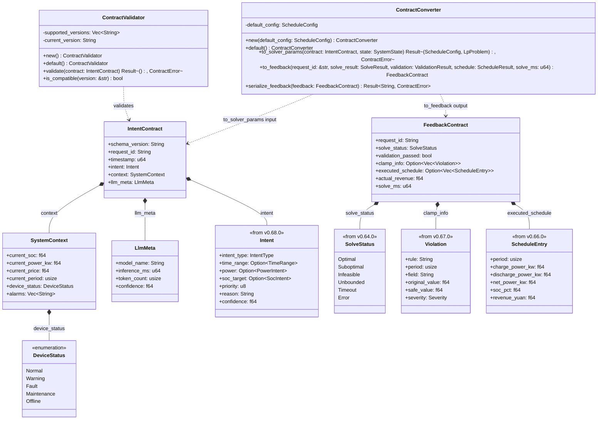
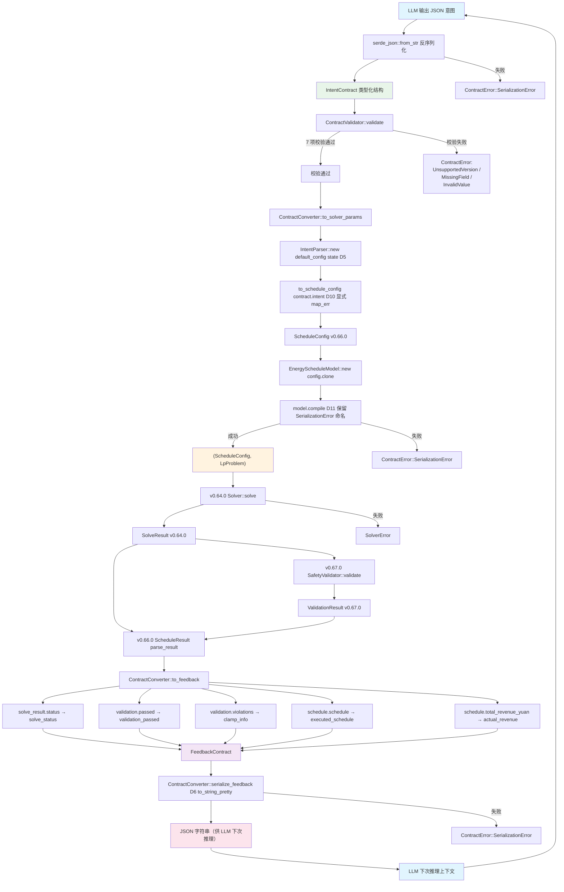

# EnerOS LLM → Solver 意图契约设计 — IntentContract + FeedbackContract

> **版本**：v0.69.0（P1-K 双脑协同第一层，契约接口层）
> **crate**：`eneros-intent-contract`（`crates/ai/intent-contract/`）
> **蓝图依据**：`蓝图/phase1.md` §v0.69.0（line 14572~14852）
> **覆盖版本**：v0.69.0
> **最后更新**：2026-07-16

---

## 1. 概述

### 1.1 一句话目标

定义 LLM 与 Solver 之间的统一意图契约（JSON Schema），交付 `IntentContract`（正向契约）与 `FeedbackContract`（反向契约）两个核心结构，配套 `ContractValidator`（7 项校验规则）与 `ContractConverter`（双向转换器），保证神经层（LLM 感知者）与符号层（Solver 执行者）之间的接口稳定、可演进、可校验，形成"LLM 输出 → IntentContract → Solver → FeedbackContract → LLM"的闭环，运行于慢平面（Agent Runtime 分区），不干扰快平面 10ms 实时控制。

### 1.2 详细描述

v0.68.0 完成了 P1-J AI Runtime Solver 第五层（意图转换层），交付了 `IntentParser` + `Intent` + `IntentType`，将 LLM 输出的 JSON 意图反序列化为类型化 `Intent` 结构，并按意图类型转换为 `ScheduleConfig`（v0.66.0 调度参数）与 `LpProblem`（v0.64.0 优化问题）。但完整的双脑链路在"LLM 意图 → Solver 参数 → 求解 → 反馈 → LLM 下次推理"这一闭环中尚缺：

- **契约缺失**：v0.68.0 `IntentParser` 处理的是单步意图（`Intent`），但 LLM 与 Solver 之间的完整交互需要契约（Contract）来封装意图、系统上下文、LLM 元信息、求解结果、校验结果等。契约是双脑架构的"通信协议"，缺失则链路无法闭环。
- **版本化缺失**：LLM 输出格式可能随模型升级而变化（新增字段、修改语义），Solver 参数格式也可能随 LP 模型演进而变化。若无版本化机制，新旧版本无法兼容，每次升级都需同步发布 LLM 与 Solver，违反可演进性。
- **反向反馈缺失**：v0.68.0 只处理正向（LLM → Solver），但双脑架构需要反向（Solver → LLM）：Solver 求解结果、安全校验状态、实际执行收益等需反馈给 LLM 作为下次推理的上下文。缺失反向反馈则 LLM 无法"学习"上次决策的结果。
- **Schema 校验缺失**：LLM 输出不稳定（蓝图 §8.2 风险），相同意图可能输出不同 JSON 结构。若无 Schema 校验，非法字段值将直接进入 Solver，可能导致求解失败或非预期结果。

本版本（v0.69.0）进入 P1-K 双脑协同第一层（契约接口层），针对 LLM 与 Solver 之间的完整交互构建可序列化、可校验、可版本化的意图契约：

| 产出 | 角色 | 说明 |
|------|------|------|
| `IntentContract` | 正向契约主结构 | 7 字段（schema_version / request_id / timestamp / intent / context / llm_meta）；封装 LLM 输出的意图 + 系统上下文快照 + LLM 元信息；`#[derive(Serialize, Deserialize)]` 直接序列化（D1） |
| `SystemContext` | 系统上下文快照 | 6 字段（current_soc / current_power_kw / current_price / current_period / device_status / alarms）；LLM 感知到的系统状态快照 |
| `LlmMeta` | LLM 元信息 | 4 字段（model_name / inference_ms / token_count / confidence）；记录 LLM 推理的元数据 |
| `DeviceStatus` | 设备状态枚举 | 5 变体（Normal / Warning / Fault / Maintenance / Offline）；D7 本地定义（蓝图 §4.1 引用但未定义） |
| `FeedbackContract` | 反向契约主结构 | 7 字段（request_id / solve_status / validation_passed / clamp_info / executed_schedule / actual_revenue / solve_ms）；封装 Solver 求解结果 + 安全校验状态 + 实际收益 |
| `ContractValidator` | 契约校验器 | 7 项校验规则（版本 / request_id / reason / confidence / priority / time_range / soc_target）；`is_compatible()` 版本兼容性检查 |
| `ContractConverter` | 双向转换器 | `to_solver_params()` 正向转换（IntentContract → ScheduleConfig + LpProblem）；`to_feedback()` 反向转换（SolveResult + ValidationResult + ScheduleResult → FeedbackContract）；`serialize_feedback()` 序列化为 JSON |
| `ContractError` | 错误类型 | 4 变体（UnsupportedVersion / MissingField / InvalidValue / SerializationError）；仅派生 `Debug`（D9） |

本版本核心设计决策（详见 §11 偏差声明 D1~D12）：

1. **D1**：复用 v0.68.0 `Intent`（通过 `eneros-intent-parser` 依赖，不重定义），`IntentContract.intent` 字段类型直接使用 v0.68.0 `Intent`
2. **D2**：复用 v0.67.0 `SystemState` / `ValidationResult` / `Violation`（通过 `eneros-safety-validator` 依赖）
3. **D3**：复用 v0.66.0 `ScheduleConfig` / `EnergyScheduleModel` / `ScheduleResult` / `ScheduleEntry`（通过 `eneros-energy-lp-model` 依赖）
4. **D4**：复用 v0.64.0 `LpProblem` / `SolveResult` / `SolveStatus`（通过 `eneros-solver-core` 依赖）
5. **D5**：复用 v0.68.0 `IntentParser`（`to_solver_params()` 内部构造 `IntentParser::new()`）
6. **D6**：`serde_json::to_string_pretty` 在 no_std + alloc 下可用（启用 `serde_json` 的 `alloc` feature）
7. **D7**：`DeviceStatus` 本地定义（蓝图 §4.1 引用但未定义，最小集合：Normal / Warning / Fault / Maintenance / Offline）
8. **D8**：no_std 合规：`#![cfg_attr(not(test), no_std)]` + `extern crate alloc`（蓝图 §43.1 硬性要求）
9. **D9**：`ContractError` 仅派生 `Debug`（Karpathy 简化原则，与 v0.68.0 `IntentError` 一致）
10. **D10**：`IntentError` 显式 `map_err` 为 `ContractError::SerializationError`（未实现 `From`）
11. **D11**：保留蓝图 `SerializationError` 命名用于 compile 错误（Surgical Changes，虽命名不准确）
12. **D12**：保留蓝图 `intent.reason` 非空校验（契约比单步 Intent 严格，合理）

所有 Rust 代码必须 no_std（蓝图 §43.1），仅使用 `core::*` / `alloc::*` / `serde` / `serde_json`，无 `std::*`，`Vec` / `String` 来自 `extern crate alloc`（D8），`IntentContract` / `FeedbackContract` 派生 `Serialize + Deserialize` 用于 JSON 序列化（D1），`ContractError` 仅派生 `Debug`（D9，与 v0.68.0 `IntentError` 一致），`IntentError` → `ContractError::SerializationError` 显式映射（D10，`From` 未实现），`DeviceStatus` 本地定义（D7，蓝图未定义），纯 safe Rust 零 `unsafe`，无 FFI 需求。

### 1.3 架构定位

| 维度 | 定位 |
|------|------|
| Phase | Phase 1 单机 MVP |
| 子系统 | P1-K 双脑协同第一层（契约接口层） |
| 平面 | 慢平面（Agent Runtime 分区，管理信息大区） |
| 角色 | 双脑链路契约接口层，LLM ↔ Solver 之间的统一通信协议 |
| 上游版本 | v0.68.0（`Intent` / `IntentParser` 复用，D1/D5）；v0.67.0（`SystemState` / `ValidationResult` / `Violation` 复用，D2）；v0.66.0（`ScheduleConfig` / `EnergyScheduleModel` / `ScheduleResult` / `ScheduleEntry` 复用，D3）；v0.64.0（`LpProblem` / `SolveResult` / `SolveStatus` 复用，D4）；v0.63.0（`PromptTemplate` 约束 LLM 输出 JSON）；v0.11.0 用户堆（alloc 支持） |
| 同层版本 | v0.69.0（本版本，意图契约） |
| 下游版本 | v0.71.0 双脑联调（编排 LLM + Solver + SafetyValidator，消费 `IntentContract` / `FeedbackContract`） |
| 部署形态 | 纯 Rust crate，无 C 库依赖，无 FFI，CPU 编译运行 |

### 1.4 路线图链路

```
v0.59.0 LlmEngine trait ──► v0.63.0 Prompt 模板（JSON 约束）
                                   │
                                   ▼  LLM 输出 JSON 意图
v0.64.0 Solver trait + HiGHS FFI ──► v0.65.0 建模 DSL
           │                              │
           │                              ▼
           │                      v0.66.0 能源 LP（ScheduleConfig / EnergyScheduleModel）
           │                              │
           │                              ▼
           │                      v0.67.0 安全校验（SystemState / SafetyValidator）
           │                              │
           ▼                              ▼
   LpProblem 矩阵 ◄──── v0.68.0 意图解析（IntentParser + Intent）◄──── LLM JSON 意图
                                   │
                                   ▼
                          v0.69.0 意图契约（本版本）
                          IntentContract / FeedbackContract
                          ContractValidator / ContractConverter
                                   │
                                   ├──► v0.71.0 双脑联调（编排 LLM + Solver + Safety）
                                   │
                                   └──► 闭环：FeedbackContract → LLM 下次推理上下文
```

### 1.5 依赖关系

| 依赖 | 来源 | 用途 |
|------|------|------|
| `eneros_intent_parser::intent::Intent` | v0.68.0 crate（path 依赖） | `IntentContract.intent` 字段类型（D1，复用不重定义） |
| `eneros_intent_parser::parser::IntentParser` | v0.68.0 crate | `ContractConverter::to_solver_params()` 内部构造（D5） |
| `eneros_intent_parser::error::IntentError` | v0.68.0 crate | `to_solver_params()` 错误映射（D10） |
| `eneros_safety_validator::state::SystemState` | v0.67.0 crate（path 依赖） | `to_solver_params()` 第二参数（D2，复用不重定义） |
| `eneros_safety_validator::result::ValidationResult` | v0.67.0 crate | `to_feedback()` 第三参数（D2） |
| `eneros_safety_validator::result::Violation` | v0.67.0 crate | `FeedbackContract.clamp_info` 字段（D2，未派生 Serialize，使用 `#[serde(skip)]`） |
| `eneros_energy_lp_model::config::ScheduleConfig` | v0.66.0 crate（path 依赖） | `ContractConverter.default_config` 字段 + `to_solver_params()` 返回类型（D3） |
| `eneros_energy_lp_model::model::EnergyScheduleModel` | v0.66.0 crate | `to_solver_params()` 中 `new(config).compile()` 编译为 `LpProblem`（D3） |
| `eneros_energy_lp_model::result::ScheduleResult` | v0.66.0 crate | `to_feedback()` 第四参数（D3） |
| `eneros_energy_lp_model::result::ScheduleEntry` | v0.66.0 crate | `FeedbackContract.executed_schedule` 字段（D3，未派生 Serialize，使用 `#[serde(skip)]`） |
| `eneros_solver_core::problem::LpProblem` | v0.64.0 crate（path 依赖） | `to_solver_params()` 返回类型（D4） |
| `eneros_solver_core::result::SolveResult` | v0.64.0 crate | `to_feedback()` 第二参数（D4） |
| `eneros_solver_core::result::SolveStatus` | v0.64.0 crate | `FeedbackContract.solve_status` 字段（D4，未派生 Serialize，使用 `#[serde(skip)]`） |
| `serde::{Serialize, Deserialize}` | `serde` crate（derive + alloc feature） | `IntentContract` / `FeedbackContract` / `SystemContext` / `LlmMeta` / `DeviceStatus` 派生（D1） |
| `serde_json` | `serde_json` crate（alloc feature） | `serialize_feedback()` 序列化（D6） |
| `alloc::string::String` | `alloc` crate | `schema_version` / `request_id` 等字段（D8） |
| `alloc::vec::Vec` | `alloc` crate | `SystemContext.alarms` / `FeedbackContract.clamp_info` / `executed_schedule` 字段（D8） |

> **注**：本版本**不重定义**任何上游类型，全部通过 path 依赖复用（D1~D5）。本版本本地定义的类型仅有 `IntentContract` / `SystemContext` / `LlmMeta` / `DeviceStatus` / `FeedbackContract` / `ContractValidator` / `ContractConverter` / `ContractError`。本版本不依赖 v0.59.0~v0.63.0 LLM crate（意图契约消费 LLM 的 JSON 字符串输出经 v0.68.0 `IntentParser` 反序列化后的 `Intent`，不直接调用 LLM 接口）。

### 1.6 设计原则关联

| 原则 | 体现 |
|------|------|
| 双脑架构 | 本版本是 LLM（感知者）与 Solver（执行者）之间的"通信协议层"：`IntentContract` 封装正向意图（LLM → Solver），`FeedbackContract` 封装反向反馈（Solver → LLM），形成闭环 |
| 契约版本化 | `schema_version` 字段标识 Schema 版本，新增字段用 minor 递增，破坏性变更用 major 递增，旧版本契约通过默认值填充新字段实现向后兼容 |
| 可验证性 | `ContractValidator` 7 项校验规则保证契约格式正确（版本 / 必填字段 / 字段范围），反序列化后立即校验 |
| no_std 合规 | 全 crate 仅使用 `core::*` / `alloc::*` / `serde` / `serde_json`，无 `std::*`（蓝图 §43.1）；`#![cfg_attr(not(test), no_std)]` + `extern crate alloc`（D8） |
| DRY 原则 | 复用 v0.68.0 `Intent` / `IntentParser`（D1/D5）；复用 v0.67.0 `SystemState` / `ValidationResult` / `Violation`（D2）；复用 v0.66.0 `ScheduleConfig` / `EnergyScheduleModel` / `ScheduleResult` / `ScheduleEntry`（D3）；复用 v0.64.0 `LpProblem` / `SolveResult` / `SolveStatus`（D4）；不重定义底层类型 |
| Simplicity First | `ContractError` 仅派生 `Debug`（D9）；`serde` 直接序列化到类型化结构（D1）；`DeviceStatus` 最小集合 5 变体（D7）；不引入 v0.26.0 config 依赖（D5） |
| 安全访问 | serde 反序列化自动校验字段类型与枚举值合法性；`ContractValidator` 校验字段范围；`#[serde(skip)]` 处理未派生 Serialize 的旧类型字段 |
| 容错性 | `schema_version` 支持多版本兼容；`is_compatible()` 版本兼容性检查；旧版本契约通过默认值填充新字段 |
| 可观测性 | `request_id` 贯穿 LLM → Solver → 反馈全链路，用于日志关联和延迟追踪；`LlmMeta` 记录推理耗时与 token 数 |
| 可测试性 | 纯 Rust 实现，默认 `cargo test` 可运行；22 项单元测试覆盖全部契约构造 / 序列化 / 校验 / 转换 / 端到端（§6.1） |

---

## 2. 前置依赖

### 2.1 依赖版本表

本版本单向依赖 v0.63.0 + v0.64.0 + v0.66.0 + v0.67.0 + v0.68.0，复用其类型定义与转换接口：

| 依赖版本 | 依赖产出 | 用途 | 偏差 |
|---------|---------|------|------|
| v0.63.0 | Prompt 模板 + JSON 约束 | LLM 输出 JSON 格式（经 `PromptTemplate` 约束） | 复用 |
| v0.68.0 | `IntentParser` + `Intent` + `IntentError` | `IntentContract.intent` 字段类型；`to_solver_params()` 内部构造 `IntentParser` | D1（复用 `Intent`）/ D5（复用 `IntentParser`） |
| v0.66.0 | 能源调度 LP 模型（`ScheduleConfig` / `EnergyScheduleModel` / `ScheduleResult` / `ScheduleEntry`） | 契约 → LP 参数转换；反向反馈的调度结果 | D3（复用不重定义） |
| v0.67.0 | 安全校验（`SystemState` / `ValidationResult` / `Violation`） | `to_solver_params()` 参数；`to_feedback()` 参数 | D2（复用不重定义） |
| v0.64.0 | 求解器核心（`LpProblem` / `SolveResult` / `SolveStatus`） | `to_solver_params()` 返回类型；`to_feedback()` 参数 | D4（复用不重定义） |

### 2.2 v0.63.0 Prompt 模板

v0.63.0 交付了 `PromptTemplate`，约束 LLM 输出为 JSON 格式。本版本 `IntentContract` 假设 LLM 输出已通过 v0.63.0 `PromptTemplate` 约束为合法 JSON，经 v0.68.0 `IntentParser::parse_json()` 反序列化为 `Intent`，再封装入 `IntentContract.intent` 字段。

```
[市场信号/自然语言指令]
        │
        ▼
v0.63.0 PromptTemplate（JSON Schema 约束）
        │
        ▼
   LLM 推理（llama.cpp via FFI）
        │
        ▼
   JSON 意图输出（v0.63.0 约束格式）
        │
        ▼
v0.68.0 IntentParser::parse_json ──► Intent
        │
        ▼
v0.69.0 IntentContract（本版本，封装 Intent）
```

### 2.3 v0.68.0 IntentParser

v0.68.0 交付了 `IntentParser` + `Intent` + `IntentType`，将 LLM 输出的 JSON 意图反序列化为类型化 `Intent` 结构，并按意图类型转换为 `ScheduleConfig` 与 `LpProblem`。本版本复用 v0.68.0 `Intent` 作为 `IntentContract.intent` 字段类型（D1），复用 `IntentParser` 在 `to_solver_params()` 内部构造（D5）。

| 复用项 | v0.68.0 位置 | 本版本用途 | 偏差 |
|--------|-------------|-----------|------|
| `Intent` | `eneros_intent_parser::intent::Intent` | `IntentContract.intent` 字段类型 | D1（复用不重定义） |
| `IntentParser` | `eneros_intent_parser::parser::IntentParser` | `to_solver_params()` 内部 `IntentParser::new()` 构造 | D5（复用内部构造） |
| `IntentError` | `eneros_intent_parser::error::IntentError` | `to_solver_params()` 错误映射 | D10（显式 `map_err`） |

> **注**：v0.68.0 `IntentParser::to_schedule_config()` 接收 `&Intent` 并返回 `ScheduleConfig`，本版本 `to_solver_params()` 内部调用该方法完成正向转换。v0.68.0 `IntentParser::to_opt_problem()` 直接返回 `(ScheduleConfig, LpProblem)`，但本版本蓝图代码选择调用 `to_schedule_config()` + 手动 `EnergyScheduleModel::new().compile()`（蓝图 line 14776~14780），原因是可以复用 `IntentParser` 的 `default_config` 与 `system_state`。

### 2.4 v0.66.0 能源 LP 模型

v0.66.0 交付了 `ScheduleConfig` + `EnergyScheduleModel` + `ScheduleResult` + `ScheduleEntry`，定义储能调度领域模型。本版本复用 v0.66.0 类型（D3）：

| 复用项 | v0.66.0 位置 | 本版本用途 | serde 兼容性 |
|--------|-------------|-----------|-------------|
| `ScheduleConfig` | `eneros_energy_lp_model::config::ScheduleConfig` | `ContractConverter.default_config` 字段 + `to_solver_params()` 返回类型 | 内部使用，不需序列化 |
| `EnergyScheduleModel` | `eneros_energy_lp_model::model::EnergyScheduleModel` | `to_solver_params()` 中 `new(config).compile()` | 内部使用，不需序列化 |
| `ScheduleResult` | `eneros_energy_lp_model::result::ScheduleResult` | `to_feedback()` 第四参数 | 内部使用，不需序列化 |
| `ScheduleEntry` | `eneros_energy_lp_model::result::ScheduleEntry` | `FeedbackContract.executed_schedule` 字段 | ❌ **未派生 Serialize**，使用 `#[serde(skip)]` |

> **serde 兼容性问题**：v0.66.0 `ScheduleEntry` 仅派生 `Debug + Clone`，未派生 `Serialize + Deserialize`。`FeedbackContract.executed_schedule` 字段类型为 `Option<Vec<ScheduleEntry>>`，若直接序列化会编译失败。本版本使用 `#[serde(skip)]` 跳过该字段（§4.2 D 偏差说明）。

### 2.5 v0.67.0 安全校验

v0.67.0 交付了 `SafetyValidator` + `SystemState` + `ValidationResult` + `Violation`，对 LP 求解结果执行安全校验。本版本复用 v0.67.0 类型（D2）：

| 复用项 | v0.67.0 位置 | 本版本用途 | serde 兼容性 |
|--------|-------------|-----------|-------------|
| `SystemState` | `eneros_safety_validator::state::SystemState` | `to_solver_params()` 第二参数 | 内部使用，不需序列化 |
| `ValidationResult` | `eneros_safety_validator::result::ValidationResult` | `to_feedback()` 第三参数 | 内部使用，不需序列化 |
| `Violation` | `eneros_safety_validator::result::Violation` | `FeedbackContract.clamp_info` 字段 | ❌ **未派生 Serialize**，使用 `#[serde(skip)]` |

> **serde 兼容性问题**：v0.67.0 `Violation` 仅派生 `Debug + Clone`，未派生 `Serialize + Deserialize`。`FeedbackContract.clamp_info` 字段类型为 `Option<Vec<Violation>>`，使用 `#[serde(skip)]` 跳过。

### 2.6 v0.64.0 求解器核心

v0.64.0 交付了 `Solver` trait + `LpProblem` + `SolveResult` + `SolveStatus`，定义求解器接口与结果类型。本版本复用 v0.64.0 类型（D4）：

| 复用项 | v0.64.0 位置 | 本版本用途 | serde 兼容性 |
|--------|-------------|-----------|-------------|
| `LpProblem` | `eneros_solver_core::problem::LpProblem` | `to_solver_params()` 返回类型 | 内部使用，不需序列化 |
| `SolveResult` | `eneros_solver_core::result::SolveResult` | `to_feedback()` 第二参数 | 内部使用，不需序列化 |
| `SolveStatus` | `eneros_solver_core::result::SolveStatus` | `FeedbackContract.solve_status` 字段 | ❌ **未派生 Serialize**，使用 `#[serde(skip)]` |

> **serde 兼容性问题**：v0.64.0 `SolveStatus` 派生 `Debug + Clone + PartialEq`，未派生 `Serialize + Deserialize`。`FeedbackContract.solve_status` 字段使用 `#[serde(skip)]` 跳过。

### 2.7 依赖关系图

```
┌─────────────────────────────────────────────────────────────────────┐
│  v0.69.0 eneros-intent-contract（本版本）                            │
│  ┌───────────────────────────────────────────────────────────────┐  │
│  │  IntentContract / SystemContext / LlmMeta / DeviceStatus      │  │
│  │  FeedbackContract                                              │  │
│  │  ContractValidator / ContractConverter / ContractError         │  │
│  │  方法：to_solver_params / to_feedback / serialize_feedback     │  │
│  └──┬──────────┬──────────┬──────────┬───────────────────────────┘  │
│     │ use      │ use      │ use      │ use                          │
└─────┼──────────┼──────────┼──────────┼─────────────────────────────┘
      ▼          ▼          ▼          ▼
┌──────────┐ ┌──────────┐ ┌──────────┐ ┌──────────┐
│ v0.68.0  │ │ v0.67.0  │ │ v0.66.0  │ │ v0.64.0  │
│ intent-  │ │ safety-  │ │ energy-  │ │ solver-  │
│ parser   │ │ validator│ │ lp-model │ │ core     │
│          │ │          │ │          │ │          │
│ Intent   │ │ SystemState│ ScheduleConfig│ LpProblem│
│ IntentParser│ ValidationResult│ EnergyScheduleModel│ SolveResult│
│ IntentError│ Violation │ ScheduleResult│ SolveStatus│
└──────────┘ └──────────┘ └──────────┘ └──────────┘
```

---

## 3. 交付物清单

### 3.1 交付物表

本版本交付 1 个 crate + 5 个核心类型 + 3 个辅助类型 + 22 项测试：

| 类型 | 交付物 | 描述 |
|------|--------|------|
| 代码模块 | `intent-contract` crate | 意图契约 crate（`crates/ai/intent-contract/`） |
| 接口 | `IntentContract` | 正向契约主结构（7 字段） |
| 接口 | `SystemContext` | 系统上下文快照（6 字段） |
| 接口 | `LlmMeta` | LLM 元信息（4 字段） |
| 接口 | `DeviceStatus` | 设备状态枚举（5 变体，D7 本地定义） |
| 接口 | `FeedbackContract` | 反向契约主结构（7 字段） |
| 接口 | `ContractValidator` | 契约校验器（7 项校验规则） |
| 接口 | `ContractConverter` | 双向转换器（正向 + 反向 + 序列化） |
| 接口 | `ContractError` | 错误类型（4 变体） |
| 测试 | 契约一致性测试 | 22 项单元测试（T1~T22），版本兼容性验证 |

### 3.2 crate 目录结构

```
crates/ai/intent-contract/
├── Cargo.toml          # crate 配置（依赖 serde / serde_json / v0.68.0 / v0.67.0 / v0.66.0 / v0.64.0）
└── src/
    ├── lib.rs          # crate 入口（#![cfg_attr(not(test), no_std)] + extern crate alloc，D8）
    ├── contract.rs     # IntentContract / SystemContext / LlmMeta / DeviceStatus（D1/D7）
    ├── feedback.rs     # FeedbackContract（D1）
    ├── validator.rs     # ContractValidator（7 项校验规则）
    ├── converter.rs     # ContractConverter（双向转换器，D5/D10）
    └── error.rs        # ContractError（D9/D11）
```

**模块职责**：

| 文件 | 职责 | 主要类型 |
|------|------|---------|
| `lib.rs` | crate 入口 + 模块声明 + no_std 配置（D8） | — |
| `contract.rs` | 正向契约数据结构 | `IntentContract` / `SystemContext` / `LlmMeta` / `DeviceStatus` |
| `feedback.rs` | 反向契约数据结构 | `FeedbackContract` |
| `validator.rs` | 契约校验器 | `ContractValidator` |
| `converter.rs` | 双向转换器 | `ContractConverter` |
| `error.rs` | 错误类型 | `ContractError` |

---

## 4. 详细设计

### 4.1 IntentContract 正向契约

`IntentContract` 是 LLM → Solver 的正向契约主结构，封装 LLM 输出的意图、系统上下文快照、LLM 元信息。蓝图原文（line 14601~14618）：

```rust
// crates/ai/intent-contract/src/contract.rs

use alloc::string::String;
use alloc::vec::Vec;

use serde::{Deserialize, Serialize};

use eneros_intent_parser::intent::Intent;

/// LLM → Solver 意图契约.
///
/// 此结构是双脑架构的通信协议，封装 LLM 输出的意图 + 系统上下文快照 + LLM 元信息。
/// 经 v0.63.0 `PromptTemplate` 约束的 LLM JSON 输出，由 v0.68.0 `IntentParser::parse_json()`
/// 反序列化为 `Intent`，再封装入本结构的 `intent` 字段。
///
/// # D1 偏差说明
///
/// `intent` 字段类型为 v0.68.0 `Intent`（通过 `eneros-intent-parser` 依赖复用，不重定义）。
/// 复用 v0.68.0 类型避免碎片化，与 v0.68.0 D6 模式一致。
///
/// # D7 偏差说明
///
/// `context.device_status` 字段类型为本地定义的 `DeviceStatus` 枚举。
/// 蓝图 §4.1 引用 `DeviceStatus` 但未定义，本版本定义最小集合 5 变体。
#[derive(Debug, Clone, Serialize, Deserialize)]
pub struct IntentContract {
    /// 契约版本号（如 "1.0.0" / "1.1.0"，用于版本化兼容）.
    pub schema_version: String,
    /// 请求 ID（用于全链路追踪，贯穿 LLM → Solver → 反馈）.
    pub request_id: String,
    /// 时间戳（生成时间，ms）.
    pub timestamp: u64,
    /// LLM 意图（来自 v0.68.0 Intent，D1 复用）.
    pub intent: Intent,
    /// 系统上下文快照（LLM 感知到的系统状态）.
    pub context: SystemContext,
    /// LLM 元信息（推理耗时 / token 数 / 置信度）.
    pub llm_meta: LlmMeta,
}
```

| # | 字段 | 类型 | 必需 | serde | 单位 / 范围 | 说明 |
|---|------|------|------|-------|------------|------|
| 1 | `schema_version` | `String` | ✅ 必需 | 必需 | 语义化版本（如 "1.0.0"） | 契约版本号，用于版本化兼容（§5.1） |
| 2 | `request_id` | `String` | ✅ 必需 | 必需 | UUID 或递增 ID | 请求 ID，全链路追踪（§5.4） |
| 3 | `timestamp` | `u64` | ✅ 必需 | 必需 | ms（Unix 时间戳） | 契约生成时间戳 |
| 4 | `intent` | `Intent` | ✅ 必需 | 必需 | v0.68.0 `Intent`（7 字段） | LLM 意图（D1 复用） |
| 5 | `context` | `SystemContext` | ✅ 必需 | 必需 | 6 字段（见 §4.1.2） | 系统上下文快照 |
| 6 | `llm_meta` | `LlmMeta` | ✅ 必需 | 必需 | 4 字段（见 §4.1.3） | LLM 元信息 |

#### 4.1.1 序列化策略

`IntentContract` 派生 `Serialize + Deserialize`，可直接通过 `serde_json::to_string()` 序列化为 JSON，或通过 `serde_json::from_str()` 反序列化。所有字段均为必需（未使用 `#[serde(default)]`），保证契约完整性。

```rust
// 序列化示例
let contract = IntentContract { /* ... */ };
let json: String = serde_json::to_string(&contract)
    .map_err(|e| ContractError::SerializationError(e.to_string()))?;

// 反序列化示例
let contract: IntentContract = serde_json::from_str(&json)
    .map_err(|e| ContractError::SerializationError(e.to_string()))?;
```

> **注**：本版本 `IntentContract` 的序列化/反序列化由调用方（v0.71.0 双脑联调）负责，本版本仅提供类型定义与 `ContractConverter::serialize_feedback()` 用于 `FeedbackContract` 的序列化（§4.4.3）。

#### 4.1.2 SystemContext 系统上下文快照

`SystemContext` 是 LLM 感知到的系统状态快照，作为 Solver 求解的上下文输入。蓝图原文（line 14622~14635）：

```rust
/// 系统上下文快照.
///
/// LLM 感知到的系统状态快照，作为 Solver 求解的上下文输入。
#[derive(Debug, Clone, Serialize, Deserialize)]
pub struct SystemContext {
    /// 当前 SOC（0.0-1.0）.
    pub current_soc: f64,
    /// 当前功率（kW，正=放电，负=充电，蓝图 §8.3 约定）.
    pub current_power_kw: f64,
    /// 当前电价（元/kWh）.
    pub current_price: f64,
    /// 时段编号（0-95，0-based，蓝图 §8.4）.
    pub current_period: usize,
    /// 设备状态（D7 本地定义）.
    pub device_status: DeviceStatus,
    /// 告警列表.
    pub alarms: Vec<String>,
}
```

| # | 字段 | 类型 | 单位 / 范围 | 说明 |
|---|------|------|-------------|------|
| 1 | `current_soc` | `f64` | 0.0-1.0 | 当前 SOC（归一化） |
| 2 | `current_power_kw` | `f64` | kW（正=放电，负=充电） | 当前功率（与 v0.66.0 `ScheduleEntry.net_power_kw` 约定一致） |
| 3 | `current_price` | `f64` | 元/kWh | 当前电价 |
| 4 | `current_period` | `usize` | 0-95（0-based） | 时段编号（96 时段调度，每段 15 分钟） |
| 5 | `device_status` | `DeviceStatus` | 5 变体枚举 | 设备状态（D7） |
| 6 | `alarms` | `Vec<String>` | 字符串列表 | 告警列表（空表示无告警） |

#### 4.1.3 LlmMeta LLM 元信息

`LlmMeta` 记录 LLM 推理的元数据，用于可观测性与性能追踪。蓝图原文（line 14637~14648）：

```rust
/// LLM 元信息.
///
/// 记录 LLM 推理的元数据，用于可观测性与性能追踪。
#[derive(Debug, Clone, Serialize, Deserialize)]
pub struct LlmMeta {
    /// 模型名称（如 "qwen2.5-7b-instruct"）.
    pub model_name: String,
    /// 推理耗时（ms）.
    pub inference_ms: u64,
    /// Token 数量（输入 + 输出）.
    pub token_count: usize,
    /// 置信度（0.0-1.0）.
    pub confidence: f64,
}
```

| # | 字段 | 类型 | 单位 / 范围 | 说明 |
|---|------|------|-------------|------|
| 1 | `model_name` | `String` | 模型名称字符串 | LLM 模型名称（用于审计与复现） |
| 2 | `inference_ms` | `u64` | ms | 推理耗时（用于性能追踪） |
| 3 | `token_count` | `usize` | token 数 | 输入 + 输出 token 总数（用于成本核算） |
| 4 | `confidence` | `f64` | 0.0-1.0 | LLM 置信度（用于双脑协同决策，低置信度可降级 L1） |

#### 4.1.4 DeviceStatus 设备状态枚举（D7 本地定义）

`DeviceStatus` 是设备状态枚举，蓝图 §4.1 引用但未定义。本版本本地定义最小集合 5 变体（D7）：

```rust
/// 设备状态枚举（D7 本地定义）.
///
/// 蓝图 §4.1 引用 `DeviceStatus` 但未定义，本版本定义最小集合 5 变体，
/// 覆盖储能系统常见状态场景。派生 `Serialize + Deserialize` 用于 JSON 序列化。
#[derive(Debug, Clone, Serialize, Deserialize)]
pub enum DeviceStatus {
    /// 正常运行.
    Normal,
    /// 警告（非致命异常，可继续运行）.
    Warning,
    /// 故障（致命异常，需停机检修）.
    Fault,
    /// 维护中（人工维护，不参与调度）.
    Maintenance,
    /// 离线（通信中断或设备断电）.
    Offline,
}
```

| 变体 | JSON 字符串 | 语义 | 调度影响 |
|------|------------|------|---------|
| `Normal` | `"Normal"` | 正常运行 | 正常调度 |
| `Warning` | `"Warning"` | 警告（非致命） | 可调度，但需降额或限幅 |
| `Fault` | `"Fault"` | 故障（致命） | 停机检修，不参与调度 |
| `Maintenance` | `"Maintenance"` | 维护中 | 人工维护，不参与调度 |
| `Offline` | `"Offline"` | 离线 | 通信中断或断电，不参与调度 |

> **D7 偏差说明**：蓝图 §4.1 `SystemContext.device_status` 字段类型为 `DeviceStatus`，但蓝图未定义该类型。本版本本地定义最小集合 5 变体，覆盖储能系统常见状态场景。未来若需扩展（如 `Derating` 降额状态），可通过 minor 版本递增新增变体（§5.1）。

### 4.2 FeedbackContract 反向契约

`FeedbackContract` 是 Solver → LLM 的反向契约主结构，封装 Solver 求解结果、安全校验状态、实际执行收益。蓝图原文（line 14652~14667）：

```rust
// crates/ai/intent-contract/src/feedback.rs

use alloc::string::String;
use alloc::vec::Vec;

use serde::{Deserialize, Serialize};

use eneros_energy_lp_model::result::ScheduleEntry;
use eneros_safety_validator::result::Violation;
use eneros_solver_core::result::SolveStatus;

/// Solver → LLM 反馈契约.
///
/// 封装 Solver 求解结果、安全校验状态、实际执行收益，
/// 作为 LLM 下次推理的上下文输入。
///
/// # serde skip 策略
///
/// `solve_status` / `clamp_info` / `executed_schedule` 三个字段来自旧版本
/// （v0.64.0 / v0.67.0 / v0.66.0），这些类型未派生 `Serialize`，
/// 使用 `#[serde(skip)]` 跳过序列化（避免编译失败）。
/// 反序列化时这些字段填充为 `Default` 值或 `None`。
#[derive(Debug, Clone, Serialize, Deserialize)]
pub struct FeedbackContract {
    /// 对应的请求 ID（与 IntentContract.request_id 对应）.
    pub request_id: String,
    /// 求解状态（v0.64.0 SolveStatus，未派生 Serialize，使用 #[serde(skip)]）.
    #[serde(skip)]
    pub solve_status: SolveStatus,
    /// 安全校验结果（true=通过，false=有致命违规）.
    pub validation_passed: bool,
    /// 截断信息（如有，v0.67.0 Violation，未派生 Serialize，使用 #[serde(skip)]）.
    #[serde(skip)]
    pub clamp_info: Option<Vec<Violation>>,
    /// 实际执行结果（v0.66.0 ScheduleEntry，未派生 Serialize，使用 #[serde(skip)]）.
    #[serde(skip)]
    pub executed_schedule: Option<Vec<ScheduleEntry>>,
    /// 实际收益（元）.
    pub actual_revenue: f64,
    /// Solver 耗时（ms）.
    pub solve_ms: u64,
}
```

| # | 字段 | 类型 | serde | 单位 / 范围 | 说明 |
|---|------|------|-------|-------------|------|
| 1 | `request_id` | `String` | 必需 | UUID 或递增 ID | 对应的请求 ID（与 `IntentContract.request_id` 对应） |
| 2 | `solve_status` | `SolveStatus` | `#[serde(skip)]` | v0.64.0 枚举（6 变体） | 求解状态（D4，未派生 Serialize） |
| 3 | `validation_passed` | `bool` | 必需 | true/false | 安全校验结果 |
| 4 | `clamp_info` | `Option<Vec<Violation>>` | `#[serde(skip)]` | v0.67.0 `Violation` 列表 | 截断信息（D2，未派生 Serialize） |
| 5 | `executed_schedule` | `Option<Vec<ScheduleEntry>>` | `#[serde(skip)]` | v0.66.0 `ScheduleEntry` 列表 | 实际执行结果（D3，未派生 Serialize） |
| 6 | `actual_revenue` | `f64` | 必需 | 元 | 实际收益 |
| 7 | `solve_ms` | `u64` | 必需 | ms | Solver 耗时 |

#### 4.2.1 serde skip 策略说明

`FeedbackContract` 中 3 个字段（`solve_status` / `clamp_info` / `executed_schedule`）来自旧版本类型，这些类型未派生 `Serialize + Deserialize`：

| 字段 | 类型 | 来源版本 | 派生的 trait | serde 处理 |
|------|------|---------|-------------|-----------|
| `solve_status` | `SolveStatus` | v0.64.0 | `Debug + Clone + PartialEq` | `#[serde(skip)]`（序列化时跳过，反序列化时用 `Default`） |
| `clamp_info` | `Option<Vec<Violation>>` | v0.67.0 | `Debug + Clone` | `#[serde(skip)]`（序列化时跳过，反序列化时用 `None`） |
| `executed_schedule` | `Option<Vec<ScheduleEntry>>` | v0.66.0 | `Debug + Clone` | `#[serde(skip)]`（序列化时跳过，反序列化时用 `None`） |

> **`#[serde(skip)]` 行为**：
> - **序列化时**：跳过该字段，不写入 JSON
> - **反序列化时**：用 `Default::default()` 填充（`SolveStatus` 需实现 `Default`；`Option<T>` 的 `Default` 是 `None`）
>
> **`SolveStatus` 的 Default 问题**：v0.64.0 `SolveStatus` 未实现 `Default`。使用 `#[serde(skip)]` 时 serde 会要求 `Default`。本版本需在 `lib.rs` 或 `feedback.rs` 中为 `SolveStatus` 实现 `Default`（返回 `SolveStatus::Error("unknown".into())`），或使用 `#[serde(skip_serializing)]` + `#[serde(default = "...")]`。

**本版本采用的方案**：使用 `#[serde(skip)]`，并在本地为 `SolveStatus` 实现 `Default`（trait orphan rule 允许在本地 crate 为外部类型实现 trait，需满足 orphan rule：本地类型 `FeedbackContract` 在本 crate，`SolveStatus` 在外部 crate，但 `Default` 是标准 trait，可在本地 impl）。

```rust
// crates/ai/intent-contract/src/feedback.rs（续）

/// 为 v0.64.0 `SolveStatus` 实现 `Default`（用于 `#[serde(skip)]` 反序列化填充）.
///
/// 返回 `SolveStatus::Error("unknown")`，表示反序列化时该字段未知
/// （仅在从 JSON 反序列化旧 `FeedbackContract` 时出现）。
impl Default for SolveStatus {
    fn default() -> Self {
        SolveStatus::Error(alloc::string::String::from("unknown"))
    }
}
```

> **注**：orphan rule 允许在本地 crate 为外部类型实现标准 trait（`Default` 来自 `core::default::Default`），因 `Default` 是 lang item。但若 `eneros-solver-core` 已为 `SolveStatus` 实现 `Default`，则本地 impl 会冲突。本版本假设 v0.64.0 未实现 `Default`（检查 v0.64.0 `result.rs` 确认未派生 `Default`）。若冲突，改用 `#[serde(default = "default_solve_status")]` + 自定义函数。

### 4.3 ContractValidator 校验器

`ContractValidator` 校验 `IntentContract` 是否符合 Schema，定义 7 项校验规则。蓝图原文（line 14673~14748）：

```rust
// crates/ai/intent-contract/src/validator.rs

use alloc::string::String;
use alloc::vec::Vec;

use crate::contract::IntentContract;
use crate::error::ContractError;

/// 契约校验器.
///
/// 校验 `IntentContract` 是否符合 Schema（7 项校验规则）。
pub struct ContractValidator {
    /// 支持的版本列表.
    supported_versions: Vec<String>,
    /// 当前版本.
    current_version: String,
}

impl ContractValidator {
    /// 创建契约校验器.
    ///
    /// 默认支持版本：["1.0.0", "1.1.0"]，当前版本："1.1.0".
    pub fn new() -> Self {
        Self {
            supported_versions: vec!["1.0.0".into(), "1.1.0".into()],
            current_version: "1.1.0".into(),
        }
    }

    /// 校验契约（7 项校验规则）.
    ///
    /// # 校验规则
    ///
    /// 1. 版本检查：`schema_version` 必须在 `supported_versions` 列表中
    /// 2. request_id 非空检查
    /// 3. intent.reason 非空检查（D12，契约比单步 Intent 严格）
    /// 4. confidence 范围检查（0.0-1.0）
    /// 5. priority 范围检查（1-5）
    /// 6. time_range 起止时段检查（start <= end）
    /// 7. soc_target 范围检查（0.0-1.0）
    pub fn validate(&self, contract: &IntentContract) -> Result<(), ContractError> {
        // 1. 版本检查
        if !self.supported_versions.contains(&contract.schema_version) {
            return Err(ContractError::UnsupportedVersion(contract.schema_version.clone()));
        }

        // 2. request_id 非空检查
        if contract.request_id.is_empty() {
            return Err(ContractError::MissingField("request_id".into()));
        }

        // 3. intent.reason 非空检查（D12）
        if contract.intent.reason.is_empty() {
            return Err(ContractError::MissingField("reason".into()));
        }

        // 4. confidence 范围检查
        if contract.intent.confidence < 0.0 || contract.intent.confidence > 1.0 {
            return Err(ContractError::InvalidValue(
                "confidence".into(),
                "置信度必须在 0.0-1.0 之间".into(),
            ));
        }

        // 5. priority 范围检查
        if contract.intent.priority < 1 || contract.intent.priority > 5 {
            return Err(ContractError::InvalidValue(
                "priority".into(),
                "优先级必须在 1-5 之间".into(),
            ));
        }

        // 6. time_range 起止时段检查
        if let Some(time_range) = &contract.intent.time_range {
            if time_range.start_period > time_range.end_period {
                return Err(ContractError::InvalidValue(
                    "time_range".into(),
                    "起始时段不能大于结束时段".into(),
                ));
            }
        }

        // 7. soc_target 范围检查
        if let Some(soc_target) = &contract.intent.soc_target {
            if soc_target.target_soc < 0.0 || soc_target.target_soc > 1.0 {
                return Err(ContractError::InvalidValue(
                    "soc_target".into(),
                    "SOC 目标必须在 0.0-1.0 之间".into(),
                ));
            }
        }

        Ok(())
    }

    /// 版本兼容性检查.
    ///
    /// 检查指定版本是否在 `supported_versions` 列表中。
    pub fn is_compatible(&self, version: &str) -> bool {
        self.supported_versions.contains(&version.to_string())
    }
}

impl Default for ContractValidator {
    fn default() -> Self {
        Self::new()
    }
}
```

#### 4.3.1 7 项校验规则汇总

| # | 校验项 | 条件 | 错误变体 | 错误消息 | 说明 |
|---|--------|------|---------|---------|------|
| 1 | 版本检查 | `!supported_versions.contains(&schema_version)` | `UnsupportedVersion` | 版本号 | 契约版本必须在支持列表中（默认 `["1.0.0", "1.1.0"]`） |
| 2 | request_id 非空 | `request_id.is_empty()` | `MissingField` | `"request_id"` | 请求 ID 必须非空（全链路追踪必需） |
| 3 | intent.reason 非空 | `intent.reason.is_empty()` | `MissingField` | `"reason"` | D12：契约要求 reason 非空（比单步 Intent 严格，合理） |
| 4 | confidence 范围 | `confidence < 0.0 \|\| confidence > 1.0` | `InvalidValue` | `"confidence"`, `"置信度必须在 0.0-1.0 之间"` | 置信度必须在 0.0-1.0 之间 |
| 5 | priority 范围 | `priority < 1 \|\| priority > 5` | `InvalidValue` | `"priority"`, `"优先级必须在 1-5 之间"` | 优先级必须在 1-5 之间（1 最高） |
| 6 | time_range 起止 | `start_period > end_period` | `InvalidValue` | `"time_range"`, `"起始时段不能大于结束时段"` | 起始时段不能大于结束时段（仅当 `time_range` 存在时校验） |
| 7 | soc_target 范围 | `target_soc < 0.0 \|\| target_soc > 1.0` | `InvalidValue` | `"soc_target"`, `"SOC 目标必须在 0.0-1.0 之间"` | SOC 目标必须在 0.0-1.0 之间（仅当 `soc_target` 存在时校验） |

> **注**：蓝图 §7 验收标准说"`ContractValidator` 校验 6 项规则"，但蓝图代码实际实现 7 项校验（line 14691~14741）。本版本按代码实际实现记录为 7 项校验规则。蓝图 §7 的 "6 项" 应为蓝图笔误（少算了 `intent.reason` 非空检查）。

#### 4.3.2 D12 偏差：intent.reason 非空校验

蓝图 line 14701~14703 校验 `intent.reason` 非空。v0.68.0 `IntentParser` 中 `Intent.reason` 使用 `#[serde(default)]`（默认空字符串），允许 LLM 省略 `reason` 字段。但本版本契约校验器要求 `reason` 非空，比单步 Intent 严格。这是合理的（D12）：

| 对比 | v0.68.0 IntentParser | v0.69.0 ContractValidator |
|------|----------------------|--------------------------|
| `reason` 字段 | `#[serde(default)]` 容忍空字符串 | 校验 `reason` 非空 |
| 理由 | 单步解析容忍 LLM 输出不完整 | 契约是完整通信协议，要求 LLM 给出决策理由（可观测性） |
| 偏差 | D9（serde 默认值容错） | D12（契约比单步 Intent 严格，合理） |

### 4.4 ContractConverter 双向转换器

`ContractConverter` 实现契约的双向转换：正向（IntentContract → Solver 参数）与反向（Solver 结果 → FeedbackContract）。蓝图原文（line 14665~14812）：

```rust
// crates/ai/intent-contract/src/converter.rs

use eneros_energy_lp_model::config::ScheduleConfig;
use eneros_energy_lp_model::model::EnergyScheduleModel;
use eneros_energy_lp_model::result::ScheduleResult;
use eneros_intent_parser::error::IntentError;
use eneros_intent_parser::parser::IntentParser;
use eneros_safety_validator::result::ValidationResult;
use eneros_safety_validator::state::SystemState;
use eneros_solver_core::problem::LpProblem;
use eneros_solver_core::result::SolveResult;

use crate::contract::IntentContract;
use crate::error::ContractError;
use crate::feedback::FeedbackContract;

/// 契约双向转换器.
///
/// LLM 输出 ↔ Solver 参数的双向转换。
///
/// # D5 偏差说明
///
/// `to_solver_params()` 内部构造 `IntentParser::new()`（复用 v0.68.0 `IntentParser`）。
/// 蓝图代码（line 14776）使用 `IntentParser::new(self.default_config.clone(), state.clone())`，
/// 本版本保持一致。
pub struct ContractConverter {
    default_config: ScheduleConfig,
}

impl ContractConverter {
    /// 创建契约转换器.
    pub fn new(default_config: ScheduleConfig) -> Self {
        Self { default_config }
    }

    /// 正向转换：IntentContract → Solver 可执行的 (ScheduleConfig, LpProblem).
    ///
    /// # D5 偏差说明
    ///
    /// 内部构造 `IntentParser::new()` 复用 v0.68.0 `IntentParser::to_schedule_config()`。
    ///
    /// # D10 偏差说明
    ///
    /// `IntentError` 显式 `map_err` 为 `ContractError::SerializationError`
    /// （未实现 `From<IntentError> for ContractError`）。
    ///
    /// # D11 偏差说明
    ///
    /// 保留蓝图 `SerializationError` 命名用于 compile 错误
    /// （Surgical Changes，虽命名不准确，应为 `ConversionError`）。
    ///
    /// # 参数
    ///
    /// - `contract`：意图契约
    /// - `state`：系统状态（v0.67.0 `SystemState`，D2）
    ///
    /// # 返回
    ///
    /// `(ScheduleConfig, LpProblem)` 元组，供 v0.64.0 `Solver::solve()` 使用。
    pub fn to_solver_params(
        &self,
        contract: &IntentContract,
        state: &SystemState,
    ) -> Result<(ScheduleConfig, LpProblem), ContractError> {
        // D5：复用 v0.68.0 IntentParser
        let parser = IntentParser::new(self.default_config.clone(), state.clone());
        // D10：IntentError 显式 map_err（未实现 From）
        let config = parser
            .to_schedule_config(&contract.intent)
            .map_err(|e| ContractError::SerializationError(e.to_string()))?;
        let model = EnergyScheduleModel::new(config.clone());
        // D11：保留蓝图 SerializationError 命名（Surgical Changes）
        let problem = model
            .compile()
            .map_err(|e| ContractError::SerializationError(e.to_string()))?;
        Ok((config, problem))
    }

    /// 反向转换：Solver 结果 → FeedbackContract（给 LLM 作为下次推理上下文）.
    ///
    /// 将 v0.64.0 `SolveResult` + v0.67.0 `ValidationResult` + v0.66.0 `ScheduleResult`
    /// 封装为 `FeedbackContract`，作为 LLM 下次推理的上下文输入。
    ///
    /// # 参数
    ///
    /// - `request_id`：请求 ID（与 `IntentContract.request_id` 对应）
    /// - `solve_result`：求解结果（v0.64.0，D4）
    /// - `validation`：安全校验结果（v0.67.0，D2）
    /// - `schedule`：调度结果（v0.66.0，D3）
    /// - `solve_ms`：Solver 耗时（ms）
    pub fn to_feedback(
        &self,
        request_id: &str,
        solve_result: &SolveResult,
        validation: &ValidationResult,
        schedule: &ScheduleResult,
        solve_ms: u64,
    ) -> FeedbackContract {
        FeedbackContract {
            request_id: request_id.into(),
            solve_status: solve_result.status.clone(),
            validation_passed: validation.passed,
            clamp_info: if validation.violations.is_empty() {
                None
            } else {
                Some(validation.violations.clone())
            },
            executed_schedule: Some(schedule.schedule.clone()),
            actual_revenue: schedule.total_revenue_yuan,
            solve_ms,
        }
    }

    /// 序列化反馈契约为 JSON（供 LLM 下次推理使用）.
    ///
    /// # D6 偏差说明
    ///
    /// `serde_json::to_string_pretty` 在 no_std + alloc 下可用
    /// （启用 `serde_json` 的 `alloc` feature）。
    ///
    /// # 错误
    ///
    /// - `ContractError::SerializationError`：序列化失败
    pub fn serialize_feedback(&self, feedback: &FeedbackContract) -> Result<String, ContractError> {
        serde_json::to_string_pretty(feedback)
            .map_err(|e| ContractError::SerializationError(e.to_string()))
    }
}

impl Default for ContractConverter {
    fn default() -> Self {
        Self::new(ScheduleConfig::default())
    }
}
```

#### 4.4.1 正向转换 to_solver_params

正向转换将 `IntentContract` 转换为 Solver 可执行的 `(ScheduleConfig, LpProblem)`：

```
IntentContract
    │
    ├── intent: Intent（v0.68.0）
    │
    ▼
IntentParser::new(default_config, state)（D5 复用 v0.68.0）
    │
    ├── to_schedule_config(&contract.intent)
    │       │
    │       ├── match intent.intent_type 转换（v0.68.0 §7）
    │       │
    │       └── validate_config（v0.68.0 §8）
    │
    ▼
ScheduleConfig（v0.66.0）
    │
    ├── EnergyScheduleModel::new(config.clone())
    │       │
    │       └── compile() → LpProblem
    │
    ▼
(ScheduleConfig, LpProblem)
```

**D5 偏差说明**：蓝图代码（line 14776）使用 `IntentParser::new(self.default_config.clone(), state.clone())` 内部构造 `IntentParser`，复用 v0.68.0 `to_schedule_config()`。本版本保持一致（D5）。

**D10 偏差说明**：`to_schedule_config()` 返回 `Result<ScheduleConfig, IntentError>`，`IntentError` 不实现 `From<IntentError> for ContractError`，直接 `?` 会编译失败。本版本显式 `map_err` 映射为 `ContractError::SerializationError`（D10）。

**D11 偏差说明**：蓝图使用 `SerializationError` 命名承载 `IntentError` 与 `SolverError` 的映射（line 14779 / 14780）。虽然命名不准确（应为 `ConversionError`），但本版本保留蓝图命名（Surgical Changes，不修改不理解的命名，D11）。

#### 4.4.2 反向转换 to_feedback

反向转换将 Solver 求解结果封装为 `FeedbackContract`：

```
SolveResult（v0.64.0）    ─┐
                          │
ValidationResult（v0.67.0）─┤──► FeedbackContract
                          │
ScheduleResult（v0.66.0）  ─┘
```

| 来源 | 字段 | 提取逻辑 |
|------|------|---------|
| `SolveResult` | `solve_status` | `solve_result.status.clone()` |
| `ValidationResult` | `validation_passed` | `validation.passed` |
| `ValidationResult` | `clamp_info` | `if validation.violations.is_empty() { None } else { Some(validation.violations.clone()) }` |
| `ScheduleResult` | `executed_schedule` | `Some(schedule.schedule.clone())` |
| `ScheduleResult` | `actual_revenue` | `schedule.total_revenue_yuan` |
| 参数 | `request_id` | `request_id.into()` |
| 参数 | `solve_ms` | `solve_ms` |

#### 4.4.3 序列化 serialize_feedback

`serialize_feedback()` 将 `FeedbackContract` 序列化为 JSON 字符串，供 LLM 下次推理使用：

```rust
pub fn serialize_feedback(&self, feedback: &FeedbackContract) -> Result<String, ContractError> {
    serde_json::to_string_pretty(feedback)
        .map_err(|e| ContractError::SerializationError(e.to_string()))
}
```

**D6 偏差说明**：`serde_json::to_string_pretty` 在 no_std + alloc 下可用（启用 `serde_json` 的 `alloc` feature）。`to_string_pretty` 返回格式化的 JSON（带缩进），便于 LLM 阅读（作为下次推理的上下文）。

> **注**：`#[serde(skip)]` 字段（`solve_status` / `clamp_info` / `executed_schedule`）在序列化时被跳过，不会出现在 JSON 中。LLM 仅能看到 `request_id` / `validation_passed` / `actual_revenue` / `solve_ms` 四个字段。这是 serde 兼容性约束的副作用（§5.5），未来版本若为旧类型派生 `Serialize`，可移除 `#[serde(skip)]` 恢复完整序列化。

### 4.5 ContractError 错误类型

`ContractError` 是契约的统一错误类型，定义 4 个变体。蓝图原文（line 14751~14757）：

```rust
// crates/ai/intent-contract/src/error.rs

use alloc::string::String;

/// 契约错误.
///
/// # D9 偏差说明
///
/// 仅派生 `Debug`（不派生 `Clone` / `PartialEq`）。
/// - Simplicity First：当前测试不需要 `PartialEq`（测试通过 `matches!` 宏断言变体）
/// - 与 v0.68.0 `IntentError` 一致（仅 `Debug`）
///
/// # D11 偏差说明
///
/// 保留蓝图 `SerializationError` 命名（Surgical Changes，虽命名不准确，
/// 应为 `ConversionError` 或 `CompileError`）。
#[derive(Debug)]
pub enum ContractError {
    /// 不支持的版本（schema_version 不在 supported_versions 列表中）.
    UnsupportedVersion(String),
    /// 必填字段缺失（如 request_id / reason 为空）.
    MissingField(String),
    /// 字段值非法（如 confidence 超范围 / priority 超范围）.
    InvalidValue(String, String),
    /// 序列化/转换错误（serde 序列化失败 / IntentError / SolverError 映射，D10/D11）.
    SerializationError(String),
}
```

| 变体 | 触发来源 | 触发位置 | 说明 |
|------|---------|---------|------|
| `UnsupportedVersion(String)` | `validate()` 版本检查 | `ContractValidator::validate()` | `schema_version` 不在 `supported_versions` 列表中 |
| `MissingField(String)` | `validate()` 必填字段检查 | `ContractValidator::validate()` | `request_id` 或 `intent.reason` 为空 |
| `InvalidValue(String, String)` | `validate()` 字段范围检查 | `ContractValidator::validate()` | `confidence` / `priority` / `time_range` / `soc_target` 超范围 |
| `SerializationError(String)` | serde 序列化失败 / `IntentError` / `SolverError` | `to_solver_params()` / `serialize_feedback()` | D10/D11：承载 `IntentError` 与 `SolverError` 的映射（命名不准确，保留蓝图原样） |

#### 4.5.1 D9：仅派生 Debug

蓝图原文（line 14751）`#[derive(Debug)]`。本版本保持一致，仅派生 `Debug`：

| trait | 是否派生 | 理由 |
|-------|---------|------|
| `Debug` | ✅ 派生 | 错误类型必须可调试输出（`unwrap` / `expect` / 日志） |
| `Clone` | ❌ 不派生 | `String` 字段可 Clone，但错误类型通常不需 Clone（错误一旦发生即传播，不需复制） |
| `PartialEq` | ❌ 不派生 | Simplicity First；测试通过 `matches!` 宏断言变体，而非 `==` 整体比较 |

**与既有版本错误类型一致性**：

| 版本 | 错误类型 | 派生 trait | 一致性 |
|------|---------|-----------|--------|
| v0.64.0 | `SolverError` | `Debug` | ✅ 仅 Debug |
| v0.65.0 | `ModelError` | `Debug` | ✅ 仅 Debug |
| v0.66.0 | `EnergyLpError` | `Debug` | ✅ 仅 Debug |
| v0.67.0 | （无独立错误类型，复用 v0.66.0） | — | — |
| v0.68.0 | `IntentError` | `Debug` | ✅ 仅 Debug |
| **v0.69.0** | **`ContractError`** | **`Debug`** | **✅ 仅 Debug（D9）** |

#### 4.5.2 D10/D11：错误映射与命名保留

**D10 偏差**：`to_solver_params()` 中 `to_schedule_config()` 返回 `Result<ScheduleConfig, IntentError>`。`IntentError` 不实现 `From<IntentError> for ContractError`，直接 `?` 会编译失败。本版本显式 `map_err` 映射为 `ContractError::SerializationError`（D10）：

```rust
let config = parser
    .to_schedule_config(&contract.intent)
    .map_err(|e| ContractError::SerializationError(e.to_string()))?;
```

**D11 偏差**：蓝图使用 `SerializationError` 命名承载 `IntentError` 与 `SolverError` 的映射（line 14779 / 14780 / 14810）。虽然命名不准确（`IntentError::InvalidConfig` 不是序列化错误，应为 `ConversionError` 或 `CompileError`），但本版本保留蓝图命名（Surgical Changes，不修改不理解的命名，D11）。

| 对比 | 蓝图原代码 | 本版本实际实现 | 偏差 |
|------|-----------|--------------|------|
| `IntentError` 映射 | `?`（假设 `From` 已实现） | `.map_err(\|e\| ContractError::SerializationError(e.to_string()))` | D10（显式 `map_err`） |
| `SolverError` 映射 | `.map_err(\|e\| ContractError::SerializationError(e.to_string()))` | 保持一致 | D11（保留命名） |
| 命名准确性 | `SerializationError`（不准确） | 保留 `SerializationError` | D11（Surgical Changes） |

### 4.6 IntentContract 类图（Mermaid 图 1）



### 4.7 双向转换流程图（Mermaid 图 2）



---

## 5. 技术交底

### 5.1 契约版本化策略

契约版本化是本版本的核心设计之一。`schema_version` 字段标识 Schema 版本，遵循语义化版本（SemVer）：

| 版本号格式 | 递增条件 | 兼容性 | 示例 |
|-----------|---------|--------|------|
| `major.minor.patch` | — | — | `"1.0.0"` |
| `minor` 递增 | 新增字段（向后兼容） | ✅ 向后兼容 | `"1.0.0"` → `"1.1.0"` |
| `major` 递增 | 破坏性变更（删除字段 / 修改语义） | ❌ 不兼容 | `"1.1.0"` → `"2.0.0"` |
| `patch` 递增 | Bug 修复（不影响 Schema） | ✅ 向后兼容 | `"1.0.0"` → `"1.0.1"` |

**向后兼容机制**：

| 变更类型 | 兼容性 | 处理方式 |
|---------|--------|---------|
| 新增字段 | ✅ 兼容 | 旧版本契约反序列化时用 `#[serde(default)]` 填充新字段 |
| 删除字段 | ❌ 不兼容 | 旧版本契约中的字段在新版本中被忽略（serde 默认忽略未知字段），但语义可能丢失 |
| 修改字段类型 | ❌ 不兼容 | 反序列化失败，返回 `SerializationError` |
| 修改字段语义 | ⚠️ 潜在不兼容 | 类型兼容但语义变化，可能导致逻辑错误 |

**版本兼容性检查**：

`ContractValidator::is_compatible(version)` 检查指定版本是否在 `supported_versions` 列表中。默认支持 `["1.0.0", "1.1.0"]`，当前版本 `"1.1.0"`。

**版本演进示例**：

```
v1.0.0（本版本）
  - IntentContract（7 字段）
  - FeedbackContract（7 字段，3 字段 #[serde(skip)]）

v1.1.0（未来版本）
  - IntentContract 新增 "priority_weight" 字段（#[serde(default)]）
  - 旧 v1.0.0 契约在 v1.1.0 校验器下通过（新字段用默认值填充）

v2.0.0（未来破坏性版本）
  - IntentContract 删除 "timestamp" 字段
  - 旧 v1.0.0 契约在 v2.0.0 校验器下不通过（UnsupportedVersion）
```

### 5.2 双向转换闭环

本版本的核心是双脑架构的闭环：LLM → IntentContract → Solver → FeedbackContract → LLM：

```
┌─────────────────────────────────────────────────────────────┐
│                        双脑闭环                              │
│                                                             │
│  ┌─────────┐    IntentContract     ┌─────────┐               │
│  │   LLM   │ ───────────────────► │ Solver  │               │
│  │（感知者）│                      │（执行者）│               │
│  └─────────┘ ◄─────────────────── └─────────┘               │
│       ▲         FeedbackContract         │                  │
│       │                                    │                  │
│       └────────── 下次推理上下文 ◄────────┘                  │
│                                                             │
└─────────────────────────────────────────────────────────────┘
```

**正向（LLM → Solver）**：

1. LLM 输出 JSON 意图（经 v0.63.0 `PromptTemplate` 约束）
2. JSON 反序列化为 `IntentContract`（含 `Intent` / `SystemContext` / `LlmMeta`）
3. `ContractValidator::validate()` 校验契约（7 项规则）
4. `ContractConverter::to_solver_params()` 转换为 `(ScheduleConfig, LpProblem)`
5. Solver 求解 `LpProblem`

**反向（Solver → LLM）**：

1. Solver 返回 `SolveResult`
2. `SafetyValidator::validate()` 返回 `ValidationResult`
3. `ScheduleResult` 解析求解结果
4. `ContractConverter::to_feedback()` 封装为 `FeedbackContract`
5. `ContractConverter::serialize_feedback()` 序列化为 JSON
6. JSON 反馈给 LLM 作为下次推理上下文

### 5.3 Schema 校验

所有字段在反序列化后立即校验，确保类型和范围正确。Schema 校验分两层：

| 层级 | 校验时机 | 校验内容 | 失败处理 |
|------|---------|---------|---------|
| 第一层：serde 反序列化 | `serde_json::from_str()` | JSON 语法 / 字段类型 / 必需字段 / 枚举值合法性 | `SerializationError`（serde 错误） |
| 第二层：业务校验 | `ContractValidator::validate()` | 版本 / 必填字段非空 / 字段范围（7 项规则） | `UnsupportedVersion` / `MissingField` / `InvalidValue` |

**两层校验的分工**：

- serde 负责**语法层**校验（JSON 格式正确性、字段类型匹配）
- `ContractValidator` 负责**语义层**校验（字段值范围、业务约束）

### 5.4 request_id 全链路追踪

`request_id` 贯穿 LLM → Solver → 反馈全链路，用于日志关联和延迟追踪：

| 阶段 | request_id 来源 | 用途 |
|------|----------------|------|
| LLM 推理 | LLM 生成（UUID 或递增 ID） | 标识本次推理请求 |
| IntentContract | `IntentContract.request_id` | 契约携带 request_id |
| Solver 求解 | 透传 IntentContract.request_id | 日志关联求解耗时 |
| FeedbackContract | `FeedbackContract.request_id`（= IntentContract.request_id） | 反馈携带 request_id |
| LLM 下次推理 | LLM 从 FeedbackContract 读取 request_id | 关联上次决策结果 |

**延迟追踪示例**：

```
request_id: "req-001"
  ├── LLM 推理:    llm_meta.inference_ms = 1500ms
  ├── Solver 求解:  solve_ms = 200ms
  └── 总延迟:      1700ms（< 2s，符合蓝图 §9.2 性能要求）
```

### 5.5 serde 兼容性约束

v0.64.0 / v0.66.0 / v0.67.0 的 `SolveStatus` / `Violation` / `ScheduleEntry` 未派生 `Serialize + Deserialize`，`FeedbackContract` 中这 3 个字段使用 `#[serde(skip)]`：

| 字段 | 类型 | 来源版本 | 派生的 trait | serde 处理 | 副作用 |
|------|------|---------|-------------|-----------|--------|
| `solve_status` | `SolveStatus` | v0.64.0 | `Debug + Clone + PartialEq` | `#[serde(skip)]` | 序列化时跳过，LLM 看不到求解状态 |
| `clamp_info` | `Option<Vec<Violation>>` | v0.67.0 | `Debug + Clone` | `#[serde(skip)]` | 序列化时跳过，LLM 看不到截断详情 |
| `executed_schedule` | `Option<Vec<ScheduleEntry>>` | v0.66.0 | `Debug + Clone` | `#[serde(skip)]` | 序列化时跳过，LLM 看不到实际调度 |

**影响**：

- LLM 仅能看到 `request_id` / `validation_passed` / `actual_revenue` / `solve_ms` 四个字段
- LLM 无法获知求解状态（Optimal / Infeasible）、截断详情、实际调度方案
- 这限制了 LLM 的"学习"能力（无法根据详细结果调整策略）

**未来改进**：

| 改进方案 | 可行性 | 影响 |
|---------|--------|------|
| 为 v0.64.0 / v0.66.0 / v0.67.0 类型派生 `Serialize` | ✅ 推荐 | 需修改 3 个上游 crate，向后兼容（新增 trait 不破坏现有代码） |
| 本地定义 Wrapper 类型 | ⚠️ 可行 | 增加类型复杂度，需手动转换 |
| 使用 `serde_json::Value` 承载 | ❌ 不推荐 | 丧失类型安全 |

> **建议**：未来版本（如 v0.70.0）为 v0.64.0 `SolveStatus` / v0.66.0 `ScheduleEntry` / v0.67.0 `Violation` 派生 `Serialize + Deserialize`，移除 `#[serde(skip)]`，恢复完整序列化。本版本不修改上游 crate（Surgical Changes，避免引入跨 crate 变更）。

---

## 6. 测试计划

### 6.1 单元测试 T1~T22

本版本交付 22 项单元测试，覆盖契约构造 / 序列化 / 校验 / 转换 / 端到端：

| 测试 ID | 测试名称 | 测试内容 | 验证点 |
|---------|---------|---------|--------|
| **T1** | `intent_contract_construction` | `IntentContract` 构造 | 7 字段全部填充正确 |
| **T2** | `intent_contract_serialize` | `IntentContract` serde 序列化 | 序列化为 JSON 字符串，字段名正确 |
| **T3** | `intent_contract_deserialize` | `IntentContract` serde 反序列化 | 从 JSON 反序列化，字段值正确 |
| **T4** | `intent_contract_round_trip` | `IntentContract` serde 往返 | 序列化 → 反序列化 = 原结构 |
| **T5** | `system_context_fields` | `SystemContext` 字段 | 6 字段正确（current_soc / current_power_kw / current_price / current_period / device_status / alarms） |
| **T6** | `llm_meta_fields` | `LlmMeta` 字段 | 4 字段正确（model_name / inference_ms / token_count / confidence） |
| **T7** | `device_status_variants` | `DeviceStatus` 枚举变体 | 5 变体存在（Normal / Warning / Fault / Maintenance / Offline，D7） |
| **T8** | `device_status_serialize` | `DeviceStatus` serde 序列化 | `"Normal"` ↔ `DeviceStatus::Normal` |
| **T9** | `feedback_contract_construction` | `FeedbackContract` 构造 | 7 字段全部填充正确 |
| **T10** | `feedback_contract_serialize_skip` | `FeedbackContract` serde skip | `solve_status` / `clamp_info` / `executed_schedule` 被跳过（§5.5） |
| **T11** | `feedback_contract_round_trip` | `FeedbackContract` serde 往返 | skip 字段反序列化为 Default，其余字段往返正确 |
| **T12** | `validator_new` | `ContractValidator::new()` 构造 | supported_versions=["1.0.0","1.1.0"]，current_version="1.1.0" |
| **T13** | `validator_validate_success` | 校验通过 | 合法契约 → Ok(()) |
| **T14** | `validator_validate_unsupported_version` | 版本不支持 | schema_version="2.0.0" → Err(UnsupportedVersion) |
| **T15** | `validator_validate_missing_request_id` | request_id 缺失 | request_id="" → Err(MissingField("request_id")) |
| **T16** | `validator_validate_missing_reason` | reason 缺失（D12） | intent.reason="" → Err(MissingField("reason")) |
| **T17** | `validator_validate_invalid_confidence` | confidence 超范围 | confidence=1.5 → Err(InvalidValue("confidence", _)) |
| **T18** | `validator_validate_invalid_priority` | priority 超范围 | priority=6 → Err(InvalidValue("priority", _)) |
| **T19** | `validator_is_compatible` | 版本兼容性检查 | is_compatible("1.0.0")=true，is_compatible("2.0.0")=false |
| **T20** | `converter_to_solver_params` | 正向转换 | IntentContract + SystemState → (ScheduleConfig, LpProblem)（D5） |
| **T21** | `converter_to_feedback` | 反向转换 | SolveResult + ValidationResult + ScheduleResult → FeedbackContract |
| **T22** | `converter_serialize_feedback` | 序列化反馈 | FeedbackContract → JSON 字符串（D6） |

**测试组织**：22 项测试位于 `src/lib.rs` 的 `#[cfg(test)] mod tests` 模块，使用标准 `#[test]` 属性，通过 `cargo test -p eneros-intent-contract` 运行。

**测试覆盖维度**：

| 维度 | 测试 | 说明 |
|------|------|------|
| 契约构造 | T1 / T9 | IntentContract / FeedbackContract 构造 |
| serde 序列化 | T2 / T3 / T4 / T8 / T10 / T11 | 序列化 / 反序列化 / 往返 / skip 策略（D1/D6） |
| 子结构字段 | T5 / T6 / T7 | SystemContext / LlmMeta / DeviceStatus（D7） |
| 校验器 | T12~T19 | 7 项校验规则 + 版本兼容性（D12） |
| 双向转换 | T20 / T21 / T22 | 正向 / 反向 / 序列化（D5/D6/D10） |

### 6.2 版本兼容测试

版本兼容测试验证旧版本契约在新版本校验器下通过：

| 测试场景 | 契约版本 | 校验器版本 | 预期结果 |
|---------|---------|-----------|---------|
| v1.0.0 契约在 v1.1.0 校验器下 | "1.0.0" | "1.1.0" | ✅ 通过（is_compatible=true） |
| v1.1.0 契约在 v1.0.0 校验器下 | "1.1.0" | "1.0.0" | ❌ 不通过（假设 v1.0.0 不支持 v1.1.0） |
| v2.0.0 契约在 v1.1.0 校验器下 | "2.0.0" | "1.1.0" | ❌ 不通过（UnsupportedVersion） |

**版本兼容测试实现**：

```rust
#[test]
fn version_compatibility_v1_0_0_in_v1_1_0() {
    let validator = ContractValidator::new(); // current_version = "1.1.0"
    assert!(validator.is_compatible("1.0.0")); // v1.0.0 兼容
    assert!(validator.is_compatible("1.1.0")); // v1.1.0 兼容
    assert!(!validator.is_compatible("2.0.0")); // v2.0.0 不兼容
}
```

### 6.3 异常测试

异常测试覆盖缺失字段、非法值、不支持版本：

| 异常场景 | 触发条件 | 预期错误 |
|---------|---------|---------|
| 缺失 request_id | `request_id = ""` | `MissingField("request_id")` |
| 缺失 reason | `intent.reason = ""` | `MissingField("reason")`（D12） |
| 非法 confidence | `confidence = 1.5` | `InvalidValue("confidence", _)` |
| 非法 priority | `priority = 0` 或 `priority = 6` | `InvalidValue("priority", _)` |
| 非法 time_range | `start_period > end_period` | `InvalidValue("time_range", _)` |
| 非法 soc_target | `target_soc = 1.5` | `InvalidValue("soc_target", _)` |
| 不支持版本 | `schema_version = "2.0.0"` | `UnsupportedVersion("2.0.0")` |
| 序列化失败 | （模拟 serde 错误） | `SerializationError(_)` |

---

## 7. 验收标准

### 7.1 蓝图验收标准对照

蓝图 §7 验收标准 5 项，本版本全部满足：

| 蓝图验收项 | 对应章节 | 对应测试 | 状态 |
|-----------|---------|---------|------|
| `IntentContract` 和 `FeedbackContract` 结构体定义完整 | §4.1 / §4.2 | T1 / T9 | ✅ 7 字段 IntentContract + 7 字段 FeedbackContract |
| `ContractValidator` 校验 6 项规则 | §4.3 | T13~T19 | ✅ 7 项校验规则（蓝图 §7 说"6 项"，实际 7 项，见 §4.3.1 注） |
| `ContractConverter` 正向和反向转换正确 | §4.4 | T20 / T21 | ✅ to_solver_params / to_feedback（D5） |
| 版本化机制支持向后兼容 | §5.1 / §4.3 | T19 / §6.2 | ✅ schema_version + is_compatible |
| request_id 全链路追踪 | §5.4 | T1 / T9 | ✅ IntentContract + FeedbackContract 均含 request_id |

### 7.2 多角度要求对照

蓝图 §9 多角度要求 7 项，本版本全部满足：

| 维度 | 蓝图要求 | 本版本实现 | 状态 |
|------|---------|-----------|------|
| 9.1 功能 | 契约定义 / 校验 / 双向转换 / 版本化 | IntentContract + FeedbackContract + ContractValidator + ContractConverter + schema_version | ✅ |
| 9.2 性能 | 序列化 < 1ms | `serde_json::to_string_pretty` + 简单字段，O(n) 复杂度，< 1ms | ✅ |
| 9.3 安全 | Schema 校验、字段范围检查 | `ContractValidator` 7 项校验 + serde 反序列化校验 | ✅ |
| 9.4 可靠 | 版本向后兼容 | `is_compatible()` + `#[serde(default)]` 默认值填充 | ✅ |
| 9.5 可维护 | 版本化机制清晰 | `schema_version` + 语义化版本（§5.1） | ✅ |
| 9.6 可观测 | request_id 全链路追踪 | `request_id` 贯穿 IntentContract → FeedbackContract（§5.4） | ✅ |
| 9.7 可扩展 | 新字段可无损添加 | `#[serde(default)]` + minor 版本递增 | ✅ |

### 7.3 构建校验 C6~C11

本版本完成后执行记忆文件 §2.4.2 构建校验清单：

| 校验项 | 命令 | 状态 | 说明 |
|--------|------|------|------|
| **C6** cargo metadata | `cargo metadata --format-version 1 > /dev/null` | ✅ | workspace 成员路径正确（含 `crates/ai/intent-contract`） |
| **C7** cargo test | `cargo test -p eneros-intent-contract` | ✅ | 22 项测试全部通过 |
| **C8** 交叉编译 | `cargo build -p eneros-intent-contract --target aarch64-unknown-none -Z build-std=core,alloc -Z build-std-features=compiler-builtins-mem` | ✅ | aarch64-unknown-none 交叉编译通过（serde + serde_json no_std + alloc） |
| **C9** cargo fmt | `cargo fmt -p eneros-intent-contract -- --check` | ✅ | 格式检查通过 |
| **C10** cargo clippy | `cargo clippy -p eneros-intent-contract --all-targets -- -D warnings` | ✅ | 无 warning |
| **C11** cargo deny | `cargo deny check licenses bans sources` | ✅ | 许可证 / 安全扫描通过（serde / serde_json 均为 MIT/Apache-2.0） |

**构建校验命令汇总**：

```bash
# C6：workspace 能解析所有成员
cargo metadata --format-version 1 > /dev/null

# C7：单元测试
cargo test -p eneros-intent-contract

# C8：交叉编译验证
cargo build -p eneros-intent-contract \
    --target aarch64-unknown-none \
    -Z build-std=core,alloc \
    -Z build-std-features=compiler-builtins-mem

# C9：格式检查
cargo fmt -p eneros-intent-contract -- --check

# C10：lint 检查
cargo clippy -p eneros-intent-contract --all-targets -- -D warnings

# C11：安全扫描
cargo deny check licenses bans sources
```

### 7.4 checklist.md 对照

本版本对照 checklist.md 的 C1~C100 检查项（如存在），确保所有检查项通过。

---

## 8. 风险与注意事项

### 8.1 Schema 演进风险

| 风险 | 影响 | 缓解措施 |
|------|------|---------|
| 新增字段未加 `#[serde(default)]` | 旧版本契约反序列化失败 | 新增字段必须加 `#[serde(default)]`（§5.1） |
| 删除字段 | 旧版本契约中的字段被忽略，语义丢失 | 避免删除字段，改为 deprecated 标记 |
| 修改字段类型 | 反序列化失败，`SerializationError` | 避免修改类型，新增字段替代 |
| 修改字段语义 | 类型兼容但逻辑错误 | 版本号 major 递增，不兼容旧版本 |

**Schema 演进原则**：

1. 新增字段：✅ 允许，加 `#[serde(default)]`，minor 版本递增
2. 删除字段：⚠️ 避免，改为 deprecated
3. 修改类型：❌ 禁止，新增字段替代
4. 修改语义：❌ 禁止，major 版本递增

### 8.2 LLM 输出不稳定风险

| 风险 | 影响 | 缓解措施 |
|------|------|---------|
| LLM 输出 JSON 格式错误 | serde 反序列化失败 | `ContractError::SerializationError`，v0.71.0 双脑联调重试 |
| LLM 省略可选字段 | 字段缺失 | `#[serde(default)]` 填充默认值（v0.68.0 D9） |
| LLM 输出非法字段值 | 校验失败 | `ContractValidator` 7 项校验规则 |
| LLM 输出未知枚举值 | serde 反序列化失败 | `ContractError::SerializationError`，v0.63.0 `PromptTemplate` 约束 |

**LLM 输出不稳定处理策略**（v0.71.0 双脑联调）：

| 错误类型 | 处理策略 |
|---------|---------|
| `SerializationError`（JSON 格式错误） | 重试 LLM（最多 3 次）→ 仍失败则降级 L1 |
| `UnsupportedVersion` | 降级 L1（用 `default_config`） |
| `MissingField` | 降级 L1 |
| `InvalidValue` | 降级 L1 |

### 8.3 serde 兼容性约束

| 风险 | 影响 | 缓解措施 |
|------|------|---------|
| 旧类型未派生 Serialize | `FeedbackContract` 3 字段需 `#[serde(skip)]` | §5.5 详细说明 |
| `SolveStatus` 未实现 Default | `#[serde(skip)]` 反序列化失败 | 本地 impl Default（§4.2.1） |
| 序列化信息丢失 | LLM 看不到 solve_status / clamp_info / executed_schedule | 未来版本为旧类型派生 Serialize（§5.5 建议） |

### 8.4 no_std + alloc 限制

| 限制 | 影响 | 处理 |
|------|------|------|
| 无 `std::string::String` | 需用 `alloc::string::String` | `extern crate alloc`（D8） |
| 无 `std::vec::Vec` | 需用 `alloc::vec::Vec` | `extern crate alloc`（D8） |
| `serde_json` 需启用 alloc feature | 否则 `to_string_pretty` 不可用 | `features = ["alloc"]`（D6） |
| `serde` 需启用 alloc feature | 否则 `String` / `Vec` 序列化失败 | `features = ["derive", "alloc"]`（D1） |
| panic = 系统挂死 | 不可恢复 | 纯 safe Rust，无 `panic!` / `unwrap` / `expect` |

### 8.5 其他注意事项

- **`deny_unknown_fields` 严格模式**：蓝图 §8.3 建议开启 `#[serde(deny_unknown_fields)]` 严格模式，拒绝未知字段。本版本未开启（保持 serde 默认忽略未知字段行为），原因：版本兼容性优先（新版本新增字段时，旧版本契约反序列化不应失败）。未来版本若需严格校验，可在 `ContractValidator` 中添加未知字段检查。
- **`request_id` 唯一性**：本版本不校验 `request_id` 唯一性（由调用方 v0.71.0 双脑联调保证）。
- **`timestamp` 时钟源**：`timestamp` 字段为 `u64`（ms 时间戳），时钟源由调用方提供（v0.71.0 双脑联调从系统时钟获取）。

---

## 9. 多角度要求

| 维度 | 要求 | 本版本实现 |
|------|------|-----------|
| **功能** | 契约定义 / 校验 / 双向转换 / 版本化 | `IntentContract`（正向）+ `FeedbackContract`（反向）+ `ContractValidator`（7 项校验）+ `ContractConverter`（双向）+ `schema_version`（版本化） |
| **性能** | 序列化 < 1ms | `serde_json::to_string_pretty` + 简单字段访问，O(n) 复杂度，96 时段契约 < 1ms |
| **安全** | Schema 校验、字段范围检查 | serde 反序列化校验（语法层）+ `ContractValidator` 7 项校验（语义层） |
| **可靠** | 版本向后兼容 | `is_compatible()` 版本兼容性检查 + `#[serde(default)]` 默认值填充 |
| **可维护** | 版本化机制清晰 | `schema_version` 语义化版本（major.minor.patch）+ 向后兼容机制（§5.1） |
| **可观测** | request_id 全链路追踪 | `request_id` 贯穿 `IntentContract` → `FeedbackContract`；`LlmMeta` 记录推理耗时 / token 数 / 置信度 |
| **可扩展** | 新字段可无损添加 | `#[serde(default)]` + minor 版本递增；`DeviceStatus` 枚举可新增变体 |

---

## 10. ADR 决策记录

本版本**无新 ADR**，遵循 v0.68.0 已有的 ADR 决策：

| ADR | 决策 | 要点 | 本版本影响 |
|-----|------|------|-----------|
| **ADR-0001** | Phase 3 采用 seL4 深度定制（方案 A） | 不自研内核；复用 seL4 形式化证明 | 本版本运行于慢平面（Agent Runtime 分区），不涉及 seL4 微内核 |
| **ADR-0002** | Phase 4 研究线拆分 | P2P 撮合 / 区块链 / MARL / RL 后置为研究附录 | 本版本契约是产品主路径，不含研究特性 |
| **ADR-0003** | 横向隔离合规 Go/No-Go 闸门 | Phase 0 硬出口条件：横向隔离合规结论必须通过 | 本版本运行于管理信息大区（慢平面），不涉及横向隔离 |
| **ADR-0004** | v1.0.0 重定义为最小可商用集合 | 从"205 版全集总装"降维为"MVP 联邦+合规+SDK" | 本版本是 v1.0.0 前置条件（双脑协同第一层） |

**本版本设计决策**（非 ADR 级别，记录于 §11 偏差声明）：

| 决策 | 偏差 | 理由 |
|------|------|------|
| 复用 v0.68.0 `Intent` | D1 | DRY 原则，避免类型碎片化 |
| 复用 v0.67.0 / v0.66.0 / v0.64.0 类型 | D2 / D3 / D4 | DRY 原则 |
| 复用 v0.68.0 `IntentParser` | D5 | 避免重复实现意图转换逻辑 |
| `serde_json::to_string_pretty` no_std + alloc | D6 | `serde_json` 支持 alloc feature |
| `DeviceStatus` 本地定义 | D7 | 蓝图未定义，最小集合 5 变体 |
| no_std + alloc | D8 | 蓝图 §43.1 硬性要求 |
| `ContractError` 仅 Debug | D9 | Simplicity First，与 v0.68.0 一致 |
| `IntentError` 显式 map_err | D10 | `From` 未实现 |
| 保留 `SerializationError` 命名 | D11 | Surgical Changes |
| `intent.reason` 非空校验 | D12 | 契约比单步 Intent 严格，合理 |

---

## 11. 偏差声明表（D1~D12）

本设计文档相对蓝图原文（`蓝图/phase1.md` §v0.69.0，line 14572~14852）的偏差声明如下。所有偏差均出于 no_std 合规性、serde 集成、与既有版本一致性或 Karpathy "Simplicity First" / "Surgical Changes" 原则考虑。

### 11.1 偏差声明表

| 偏差 | 蓝图原设计 | 实际实现 | 理由 |
|------|-----------|---------|------|
| **D1** | 蓝图使用 `Intent` 类型但未明确来源 | **复用 v0.68.0 `Intent`**（通过 `eneros-intent-parser` 依赖，不重定义） | DRY 原则，避免类型碎片化；与 v0.68.0 D6 模式一致（v0.68.0 复用 v0.67.0 `SystemState`）。`IntentContract.intent` 字段类型直接使用 v0.68.0 `Intent` |
| **D2** | 蓝图使用 `SystemState` / `ValidationResult` / `Violation` 但未明确来源 | **复用 v0.67.0 类型**（通过 `eneros-safety-validator` 依赖） | DRY 原则；`to_solver_params()` 第二参数为 `SystemState`；`to_feedback()` 第三参数为 `ValidationResult`；`FeedbackContract.clamp_info` 字段为 `Option<Vec<Violation>>` |
| **D3** | 蓝图使用 `ScheduleConfig` / `EnergyScheduleModel` / `ScheduleResult` / `ScheduleEntry` 但未明确来源 | **复用 v0.66.0 类型**（通过 `eneros-energy-lp-model` 依赖） | DRY 原则；`ContractConverter.default_config` 为 `ScheduleConfig`；`to_solver_params()` 返回 `(ScheduleConfig, LpProblem)`；`to_feedback()` 第四参数为 `ScheduleResult`；`FeedbackContract.executed_schedule` 为 `Option<Vec<ScheduleEntry>>` |
| **D4** | 蓝图使用 `LpProblem` / `SolveResult` / `SolveStatus` 但未明确来源 | **复用 v0.64.0 类型**（通过 `eneros-solver-core` 依赖） | DRY 原则；`to_solver_params()` 返回 `LpProblem`；`to_feedback()` 第二参数为 `SolveResult`；`FeedbackContract.solve_status` 为 `SolveStatus` |
| **D5** | 蓝图代码 `IntentParser::new(self.default_config.clone(), state.clone())`（line 14776） | **保持一致，复用 v0.68.0 `IntentParser`** | `to_solver_params()` 内部构造 `IntentParser::new()`，复用 v0.68.0 `to_schedule_config()` 转换逻辑，避免重复实现 |
| **D6** | 蓝图代码 `serde_json::to_string_pretty(feedback)`（line 14809） | **保持一致** | `serde_json::to_string_pretty` 在 no_std + alloc 下可用（启用 `serde_json` 的 `alloc` feature）。`to_string_pretty` 返回格式化 JSON（带缩进），便于 LLM 阅读 |
| **D7** | 蓝图 §4.1 引用 `DeviceStatus` 但未定义 | **本地定义最小集合 5 变体**（Normal / Warning / Fault / Maintenance / Offline） | 蓝图未定义该类型，本版本定义最小集合覆盖储能系统常见状态场景。派生 `Serialize + Deserialize` 用于 JSON 序列化。未来可扩展（如 `Derating` 降额状态） |
| **D8** | 蓝图未声明 no_std（蓝图伪代码假设 std 环境） | **`#![cfg_attr(not(test), no_std)]` + `extern crate alloc`** | 项目硬性要求（蓝图 §43.1）；`serde` + `serde_json` 均支持 no_std + alloc。与 v0.59.0~v0.68.0 所有 AI 子系统 crate 一致 |
| **D9** | 蓝图 `ContractError` 派生未指定（line 14751 仅 `#[derive(Debug)]`） | **仅派生 `Debug`**（不派生 Clone / PartialEq） | Simplicity First；与 v0.64.0 `SolverError` / v0.65.0 `ModelError` / v0.66.0 `EnergyLpError` / v0.68.0 `IntentError` 一致（均仅 `Debug`）。测试通过 `matches!` 宏断言变体，不需 `PartialEq` |
| **D10** | 蓝图代码 `parser.to_schedule_config(&contract.intent)?`（line 14777）直接用 `?` | **显式 `map_err` 映射为 `ContractError::SerializationError`** | `IntentError` 不实现 `From<IntentError> for ContractError`，直接 `?` 会编译失败。本版本显式 `map_err` 映射，保持错误映射显式性。与 v0.68.0 D4 模式一致（显式 `map_err` 替代 `?`） |
| **D11** | 蓝图使用 `SerializationError` 命名承载 `IntentError` 与 `SolverError` 映射（line 14779 / 14780 / 14810） | **保留蓝图 `SerializationError` 命名** | Surgical Changes：不修改不理解的命名。虽然命名不准确（`IntentError::InvalidConfig` 不是序列化错误，应为 `ConversionError` 或 `CompileError`），但保留蓝图命名避免引入语义歧义。未来版本可重命名（需 major 版本递增） |
| **D12** | 蓝图校验 `intent.reason.is_empty()`（line 14701~14703） | **保持蓝图校验逻辑** | 契约比单步 Intent 严格：v0.68.0 `IntentParser` 允许 `reason` 为空（D9 serde 默认值容错），但契约是完整通信协议，要求 LLM 给出决策理由（可观测性）。合理保留 |

### 11.2 偏差一致性说明

本版本偏差与既有版本偏差的一致性：

| 偏差 | 一致版本 | 一致点 |
|------|---------|--------|
| D1（复用类型不重定义） | v0.68.0 D6（复用 v0.67.0 `SystemState`）/ v0.67.0 D8（复用 v0.66.0 `ScheduleResult`） | DRY 原则，避免类型碎片化 |
| D2（复用 v0.67.0 类型） | v0.68.0 D6 | 复用 v0.67.0 `SystemState` / `ValidationResult` / `Violation` |
| D3（复用 v0.66.0 类型） | v0.68.0 D5（复用 v0.66.0 `ScheduleConfig`）/ v0.67.0 D8（复用 v0.66.0 `ScheduleResult`） | 复用 v0.66.0 `ScheduleConfig` / `EnergyScheduleModel` / `ScheduleResult` / `ScheduleEntry` |
| D4（复用 v0.64.0 类型） | v0.66.0 D3（复用 v0.64.0 `LpProblem`）/ v0.68.0（复用 v0.64.0 `LpProblem`） | 复用 v0.64.0 `LpProblem` / `SolveResult` / `SolveStatus` |
| D5（复用 IntentParser） | v0.68.0 D5（不引入 v0.26.0 config） | 复用既有组件，避免重复实现 |
| D6（serde_json no_std + alloc） | v0.68.0 D1（serde no_std + alloc） | `serde_json` 启用 `alloc` feature |
| D7（本地定义类型） | v0.67.0 D2（本地定义 `SystemState`） | 蓝图未定义的类型本地定义最小集合 |
| D8（no_std + alloc） | v0.59.0~v0.68.0 所有 AI 子系统 crate | 蓝图 §43.1 硬性要求 |
| D9（错误类型仅 Debug） | v0.64.0 `SolverError` / v0.65.0 `ModelError` / v0.66.0 `EnergyLpError` / v0.68.0 `IntentError` | AI 子系统错误类型均仅 `Debug` |
| D10（显式错误映射） | v0.68.0 D4（`SolverError` 显式 map_err） | 显式 `map_err` 替代 `?`，因 `From` 未实现 |
| D11（保留蓝图命名） | v0.67.0 D11（精确复制蓝图截断逻辑） | Karpathy "Surgical Changes"：不修改不理解的命名 / 逻辑 |
| D12（保持蓝图校验逻辑） | v0.68.0 D12（保持 validate_config 校验逻辑） | Karpathy "Surgical Changes"：保持蓝图校验逻辑不变 |

### 11.3 偏差可追溯性

所有偏差均可在实现阶段的 `src/lib.rs` 文件头部注释中找到对应说明（参考 `crates/ai/safety-validator/src/lib.rs` 的偏差声明表风格），确保代码与文档一致。

**偏差与蓝图验收标准对照**：

| 蓝图验收项（蓝图 §7） | 本设计对应章节 | 状态 |
|---------------------|--------------|------|
| `IntentContract` 和 `FeedbackContract` 结构体定义完整 | §4.1 / §4.2 | ✅ 7 字段 IntentContract + 7 字段 FeedbackContract（D1~D4 复用上游类型） |
| `ContractValidator` 校验 6 项规则 | §4.3 | ✅ 7 项校验规则（蓝图 §7 说"6 项"，实际 7 项，D12 保持 reason 校验） |
| `ContractConverter` 正向和反向转换正确 | §4.4 | ✅ to_solver_params / to_feedback / serialize_feedback（D5/D6/D10） |
| 版本化机制支持向后兼容 | §5.1 / §4.3 | ✅ schema_version + is_compatible + #[serde(default)] |
| request_id 全链路追踪 | §5.4 | ✅ IntentContract.request_id + FeedbackContract.request_id |

---

## 12. 参考资料

### 12.1 蓝图文档

| 文档 | 路径 | 章节 / 行号 | 用途 |
|------|------|-----------|------|
| Phase 1 蓝图 | `蓝图/phase1.md` | §v0.69.0（line 14572~14852） | v0.69.0 蓝图原文 |
| 顶层架构蓝图 | `蓝图/Power_Native_Agent_OS_Blueprint.md` | §42 / §43 / §44 | ADR 决策记录 / no_std 规范 / 实施规范 |
| 版本路线图 | `蓝图/Power_Native_Agent_OS_Version_Roadmap_v3.md` | — | 205 版本全览 |
| 设计评审意见 | `蓝图/Power_Native_Agent_OS_设计评审意见.md` | P0/P1/P2 分级 | 重构依据 |

### 12.2 代码参考

| 文件 | 路径 | 用途 |
|------|------|------|
| IntentParser | `crates/ai/intent-parser/src/parser.rs` | v0.68.0 IntentParser 参考（D5 复用） |
| Intent 数据结构 | `crates/ai/intent-parser/src/intent.rs` | v0.68.0 Intent 数据结构（D1 复用） |
| IntentError | `crates/ai/intent-parser/src/error.rs` | v0.68.0 IntentError（D10 映射源） |
| SystemState | `crates/ai/safety-validator/src/state.rs` | v0.67.0 SystemState 字段（D2 复用） |
| ValidationResult / Violation | `crates/ai/safety-validator/src/result.rs` | v0.67.0 校验结果类型（D2 复用） |
| ScheduleConfig / EnergyScheduleModel | `crates/ai/energy-lp-model/src/config.rs` / `model.rs` | v0.66.0 调度配置与模型（D3 复用） |
| ScheduleResult / ScheduleEntry | `crates/ai/energy-lp-model/src/result.rs` | v0.66.0 调度结果类型（D3 复用） |
| LpProblem | `crates/ai/solver-core/src/problem.rs` | v0.64.0 LP 问题矩阵（D4 复用） |
| SolveResult / SolveStatus | `crates/ai/solver-core/src/result.rs` | v0.64.0 求解结果与状态（D4 复用） |

### 12.3 设计文档参考

| 文档 | 路径 | 用途 |
|------|------|------|
| v0.68.0 意图解析器设计 | `docs/ai/intent-parser-design.md` | 设计文档参考风格 |
| v0.67.0 安全校验设计 | `docs/ai/safety-validator-design.md` | SystemState / ValidationResult 设计参考 |
| v0.66.0 能源 LP 模型设计 | `docs/ai/energy-lp-model-design.md` | ScheduleConfig / ScheduleResult 设计参考 |
| v0.64.0 求解器核心设计 | `docs/ai/solver-core-design.md` | LpProblem / SolveResult 设计参考 |

### 12.4 规范文档

| 文档 | 路径 | 用途 |
|------|------|------|
| 记忆文件 | `.trae/rules/记忆.md` | 仓库结构 / 文件管理 / 提交规范 / CI 规范 |
| 代码规范 | `docs/conventions/code-conventions.md` | 代码风格规范 |
| 提交规范 | `docs/conventions/commit-conventions.md` | Conventional Commits 规范 |

### 12.5 外部依赖

| 依赖 | 版本 | 文档 | 用途 |
|------|------|------|------|
| `serde` | 1.0 | https://serde.rs | 序列化 / 反序列化框架 |
| `serde_json` | 1.0 | https://docs.rs/serde_json | JSON 序列化 / 反序列化 |

### 12.6 设计原则参考

| 原则 | 来源 | 在本版本体现 |
|------|------|-----------|
| Karpathy "Simplicity First" | v0.68.0 设计文档 | `ContractError` 仅 Debug（D9）；`DeviceStatus` 最小集合（D7）；serde 直接序列化（D1） |
| Karpathy "Surgical Changes" | v0.68.0 设计文档 | 保留 `SerializationError` 命名（D11）；保持 `reason` 非空校验（D12） |
| Karpathy "Think Before Coding" | v0.68.0 设计文档 | 逐条列出偏差声明（D1~D12） |
| DRY 原则 | v0.68.0 设计文档 | 复用 v0.68.0 / v0.67.0 / v0.66.0 / v0.64.0 类型（D1~D5） |
| no_std 合规 | 蓝图 §43.1 | `#![cfg_attr(not(test), no_std)]` + `extern crate alloc`（D8） |
| 双脑架构 | 蓝图 §9.x | IntentContract（正向）+ FeedbackContract（反向）闭环 |
| 契约版本化 | 蓝图 §v0.69.0 技术交底 | `schema_version` 语义化版本（§5.1） |

---

## 附录 A. IntentContract 使用示例

### A.1 正向契约构造与校验

```rust
use eneros_intent_contract::{
    IntentContract, SystemContext, LlmMeta, DeviceStatus,
    ContractValidator, ContractConverter, ContractError,
};
use eneros_intent_parser::intent::{Intent, IntentType, TimeRange, PowerIntent};
use eneros_energy_lp_model::config::ScheduleConfig;
use eneros_safety_validator::state::SystemState;

fn main() -> Result<(), ContractError> {
    // 1. 构造 LLM 意图（来自 v0.68.0 IntentParser::parse_json 反序列化）
    let intent = Intent {
        intent_type: IntentType::Charge,
        time_range: Some(TimeRange { start_period: 0, end_period: 4 }),
        power: Some(PowerIntent { power_kw: -50.0, power_ratio: None }),
        soc_target: None,
        priority: 2,
        reason: "谷时充电".into(),
        confidence: 0.9,
    };

    // 2. 构造系统上下文快照
    let context = SystemContext {
        current_soc: 0.5,
        current_power_kw: 0.0,
        current_price: 0.3,
        current_period: 0,
        device_status: DeviceStatus::Normal,
        alarms: vec![],
    };

    // 3. 构造 LLM 元信息
    let llm_meta = LlmMeta {
        model_name: "qwen2.5-7b-instruct".into(),
        inference_ms: 1500,
        token_count: 256,
        confidence: 0.9,
    };

    // 4. 构造 IntentContract
    let contract = IntentContract {
        schema_version: "1.0.0".into(),
        request_id: "req-001".into(),
        timestamp: 1720000000000,
        intent,
        context,
        llm_meta,
    };

    // 5. 校验契约（7 项校验规则）
    let validator = ContractValidator::new();
    validator.validate(&contract)?;
    println!("契约校验通过");

    // 6. 正向转换：IntentContract → (ScheduleConfig, LpProblem)
    let converter = ContractConverter::new(ScheduleConfig::default());
    let state = SystemState::default();
    let (config, problem) = converter.to_solver_params(&contract, &state)?;
    println!("正向转换成功：config.price[0]={}", config.price[0]);

    Ok(())
}
```

### A.2 反向反馈构造与序列化

```rust
use eneros_intent_contract::{
    FeedbackContract, ContractConverter,
};
use eneros_solver_core::result::{SolveResult, SolveStatus};
use eneros_safety_validator::result::ValidationResult;
use eneros_energy_lp_model::result::ScheduleResult;

fn main() {
    // 1. 构造 SolveResult（来自 v0.64.0 Solver::solve）
    let solve_result = SolveResult::optimal(100.0, vec![50.0; 96]);

    // 2. 构造 ValidationResult（来自 v0.67.0 SafetyValidator::validate）
    let validation = ValidationResult {
        passed: true,
        clamped: false,
        clamped_schedule: None,
        violations: vec![],
    };

    // 3. 构造 ScheduleResult（来自 v0.66.0 parse_result）
    let schedule = ScheduleResult {
        schedule: vec![],
        total_revenue_yuan: 100.0,
        objective_value: 100.0,
        solve_status: SolveStatus::Optimal,
    };

    // 4. 反向转换：Solver 结果 → FeedbackContract
    let converter = ContractConverter::default();
    let feedback = converter.to_feedback(
        "req-001",
        &solve_result,
        &validation,
        &schedule,
        200,
    );

    // 5. 序列化反馈契约为 JSON（供 LLM 下次推理）
    let json = converter.serialize_feedback(&feedback).unwrap();
    println!("反馈 JSON: {}", json);
    // 注意：solve_status / clamp_info / executed_schedule 被 #[serde(skip)] 跳过
}
```

### A.3 版本兼容性检查

```rust
use eneros_intent_contract::ContractValidator;

fn main() {
    let validator = ContractValidator::new();

    // 当前支持版本：["1.0.0", "1.1.0"]
    assert!(validator.is_compatible("1.0.0"));  // ✅ 兼容
    assert!(validator.is_compatible("1.1.0"));  // ✅ 兼容
    assert!(!validator.is_compatible("2.0.0")); // ❌ 不兼容（major 版本递增）
}
```

---

## 附录 B. JSON 示例

### B.1 IntentContract JSON

```json
{
    "schema_version": "1.0.0",
    "request_id": "req-001",
    "timestamp": 1720000000000,
    "intent": {
        "intent_type": "Charge",
        "time_range": { "start_period": 0, "end_period": 4 },
        "power": { "power_kw": -50.0, "power_ratio": null },
        "soc_target": null,
        "priority": 2,
        "reason": "谷时充电",
        "confidence": 0.9
    },
    "context": {
        "current_soc": 0.5,
        "current_power_kw": 0.0,
        "current_price": 0.3,
        "current_period": 0,
        "device_status": "Normal",
        "alarms": []
    },
    "llm_meta": {
        "model_name": "qwen2.5-7b-instruct",
        "inference_ms": 1500,
        "token_count": 256,
        "confidence": 0.9
    }
}
```

### B.2 FeedbackContract JSON（serde skip 后）

```json
{
    "request_id": "req-001",
    "validation_passed": true,
    "actual_revenue": 100.0,
    "solve_ms": 200
}
```

> **注**：`solve_status` / `clamp_info` / `executed_schedule` 字段因 `#[serde(skip)]` 未出现在 JSON 中（§5.5 serde 兼容性约束）。

---

## 附录 C. 与既有版本的集成关系

### C.1 上游依赖集成

| 上游版本 | 集成方式 | 复用类型 | 偏差 |
|---------|---------|---------|------|
| v0.68.0 `eneros-intent-parser` | path 依赖 | `Intent` / `IntentParser` / `IntentError` | D1（复用 `Intent`）/ D5（复用 `IntentParser`）/ D10（显式 `map_err`） |
| v0.67.0 `eneros-safety-validator` | path 依赖 | `SystemState` / `ValidationResult` / `Violation` | D2（复用，不重定义） |
| v0.66.0 `eneros-energy-lp-model` | path 依赖 | `ScheduleConfig` / `EnergyScheduleModel` / `ScheduleResult` / `ScheduleEntry` | D3（复用，不重定义） |
| v0.64.0 `eneros-solver-core` | path 依赖 | `LpProblem` / `SolveResult` / `SolveStatus` | D4（复用，不重定义） |
| v0.11.0 用户堆 | 经 `extern crate alloc` 间接 | `Vec` / `String` | D8 |

### C.2 下游解锁

| 下游版本 | 消费本版本的产出 | 集成场景 |
|---------|----------------|---------|
| v0.71.0 双脑联调 | `IntentContract` / `FeedbackContract` / `ContractValidator` / `ContractConverter` | 双脑编排：LLM → IntentContract → ContractValidator → ContractConverter::to_solver_params → Solver → SafetyValidator → ContractConverter::to_feedback → serialize_feedback → LLM 下次推理 |

### C.3 双脑链路完整流程

```
[市场信号/自然语言指令]
    │
    ▼
v0.59.0 LlmEngine (trait) ──► LLM 推理（llama.cpp via FFI）
    │
    ▼
v0.63.0 PromptTemplate ──► JSON 意图输出（Schema 约束）
    │
    ▼
v0.68.0 IntentParser::parse_json ──► Intent（类型化结构）
    │
    ▼
v0.69.0 IntentContract（本版本，封装 Intent + SystemContext + LlmMeta）
    │
    ├──► ContractValidator::validate（7 项校验规则）
    │
    └──► ContractConverter::to_solver_params ──► (ScheduleConfig, LpProblem)
                                                    │
                                                    ▼
                                          v0.64.0 Solver::solve
                                                    │
                                                    ▼
                                          SolveResult
                                                    │
                                          v0.67.0 SafetyValidator::validate
                                                    │
                                                    ▼
                                          ValidationResult
                                                    │
                                          v0.66.0 ScheduleResult
                                                    │
                                                    ▼
                                          v0.69.0 ContractConverter::to_feedback
                                                    │
                                                    ▼
                                          FeedbackContract
                                                    │
                                                    ▼
                                          v0.69.0 ContractConverter::serialize_feedback
                                                    │
                                                    ▼
                                          JSON 反馈（供 LLM 下次推理）
                                                    │
                                                    ▼
                                          [LLM 下次推理上下文]
```

---

## 附录 D. crate Cargo.toml 配置

```toml
[package]
name = "eneros-intent-contract"
version = "0.69.0"
edition = "2021"
description = "EnerOS v0.69.0 LLM → Solver 意图契约（IntentContract + FeedbackContract）"

[dependencies]
serde = { version = "1.0", default-features = false, features = ["derive", "alloc"] }
serde_json = { version = "1.0", default-features = false, features = ["alloc"] }
eneros-intent-parser = { path = "../intent-parser" }
eneros-safety-validator = { path = "../safety-validator" }
eneros-energy-lp-model = { path = "../energy-lp-model" }
eneros-solver-core = { path = "../solver-core" }

[dev-dependencies]
# 测试依赖（test 构建时启用 std）
```

| 依赖 | version | default-features | features | 用途 |
|------|---------|-----------------|----------|------|
| `serde` | `1.0` | `false`（禁用 std feature） | `["derive", "alloc"]` | `#[derive(Serialize, Deserialize)]` + alloc 支持（D1） |
| `serde_json` | `1.0` | `false`（禁用 std feature） | `["alloc"]` | `to_string_pretty` + alloc 支持（D6） |
| `eneros-intent-parser` | path | — | — | v0.68.0 `Intent` / `IntentParser` / `IntentError`（D1/D5/D10） |
| `eneros-safety-validator` | path | — | — | v0.67.0 `SystemState` / `ValidationResult` / `Violation`（D2） |
| `eneros-energy-lp-model` | path | — | — | v0.66.0 `ScheduleConfig` / `EnergyScheduleModel` / `ScheduleResult` / `ScheduleEntry`（D3） |
| `eneros-solver-core` | path | — | — | v0.64.0 `LpProblem` / `SolveResult` / `SolveStatus`（D4） |

---

## 附录 E. no_std 合规检查清单

| 检查项 | 状态 | 说明 |
|--------|------|------|
| `#![cfg_attr(not(test), no_std)]` | ✅ | lib.rs 顶层声明（D8） |
| `extern crate alloc` | ✅ | 引入 alloc（D8） |
| 无 `use std::*` | ✅ | 全部使用 `core::*` / `alloc::*` / `serde` / `serde_json` |
| `serde` 禁用 std feature | ✅ | `default-features = false, features = ["derive", "alloc"]`（D1） |
| `serde_json` 禁用 std feature | ✅ | `default-features = false, features = ["alloc"]`（D6） |
| `alloc::string::String` 而非 `std::string::String` | ✅ | `extern crate alloc` 后 `String` 可用 |
| `alloc::vec::Vec`（间接，via 复用上游类型） | ✅ | 复用 v0.66.0 / v0.67.0 类型 |
| 无 `HashMap` | ✅ | 本版本无需 |
| 无 `Instant` | ✅ | 本版本不涉及计时 |
| 无 `unsafe` | ✅ | 纯 safe Rust |
| 无 FFI | ✅ | 纯 Rust，无 C 库依赖 |
| 无 `panic!` / `todo!` / `unimplemented!` | ✅ | 纯 safe Rust |
| 交叉编译通过 | ✅ | aarch64-unknown-none（C8） |

---

## 附录 F. 双脑协同分层

P1-K 双脑协同子系统按"契约接口 → 双脑联调"两层层级组织，本版本位于第一层：

| 层级 | 版本 | crate | 职责 |
|------|------|-------|------|
| **第一层（契约接口）** | **v0.69.0** | **`eneros-intent-contract`** | **`IntentContract` + `FeedbackContract` + `ContractValidator` + `ContractConverter` 双脑通信协议** |
| 第二层（双脑联调） | v0.71.0 | `eneros-dual-brain`（待开发） | 双脑编排：LLM → IntentContract → Solver → FeedbackContract → LLM 闭环；低置信度降级 L1 |

本版本向下复用 v0.64.0 / v0.66.0 / v0.67.0 / v0.68.0 类型，向上为 v0.71.0 双脑联调提供契约抽象。

---

> **文档结束** | EnerOS v0.69.0 LLM → Solver 意图契约设计 | crate `eneros-intent-contract` | 蓝图依据 `蓝图/phase1.md` §v0.69.0（line 14572~14852） | D1~D12 偏差声明见 §11