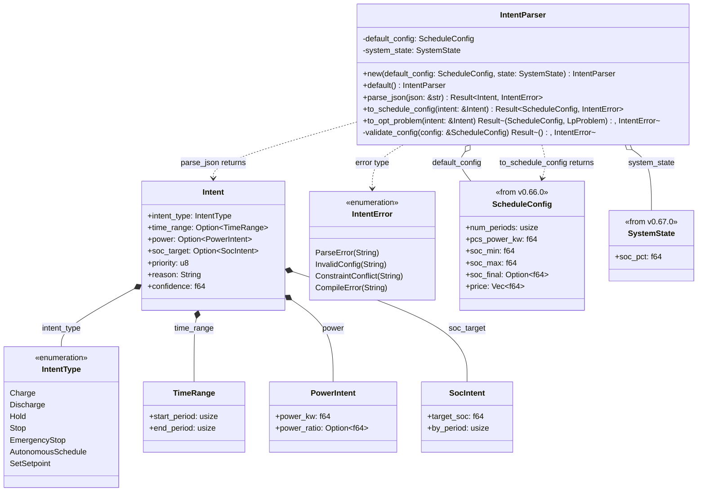
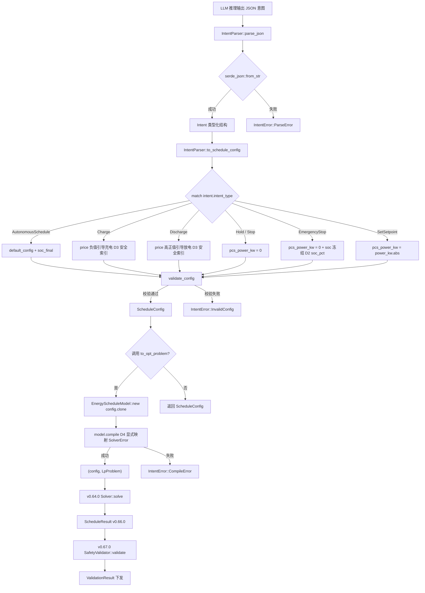

# EnerOS 意图解析器设计 — IntentParser + Intent + IntentType

> **版本**：v0.68.0（P1-J AI Runtime Solver 第五层，意图转换层）
> **crate**：`eneros-intent-parser`（`crates/ai/intent-parser/`）
> **蓝图依据**：`蓝图/phase1.md` §v0.68.0（line 14314~14569）
> **spec 依据**：`.trae/specs/develop-v0680-intent-parser/spec.md`（D1~D12 偏差声明源）
> **覆盖版本**：v0.68.0
> **最后更新**：2026-07-16

---

## 1. 版本目标

### 1.1 一句话目标

构建意图解析器 `IntentParser`，将 LLM 输出的 JSON 意图（如"谷时充电、峰时放电"）反序列化为类型化 `Intent` 结构，并按意图类型（`AutonomousSchedule` / `Charge` / `Discharge` / `Hold` / `Stop` / `EmergencyStop` / `SetSetpoint`）转换为 v0.66.0 `ScheduleConfig`（调度参数）与 `LpProblem`（优化问题），桥接神经层（LLM 感知）与符号层（Solver 执行），实现双脑架构的关键"翻译层"，运行于慢平面（Agent Runtime 分区），不干扰快平面 10ms 实时控制。

### 1.2 详细描述

v0.67.0 完成了 P1-J AI Runtime Solver 第四层（安全屏障层），交付了 `SafetyValidator` + `ElectricalSafetyRule` + `ProtectionCoordinationRule`，对 LP 求解结果执行 SOC 越限 / 爬坡越限 / 功率超限的链式截断校验。但完整的双脑链路（LLM 感知 → 意图 → Solver 求解 → 安全校验 → 下发）在"LLM 意图 → Solver 参数"这一环节尚缺：

- **格式鸿沟**：LLM 输出自然语言意图（如"谷时充电、峰时放电"），经 v0.63.0 `PromptTemplate` 约束为 JSON 格式，但 JSON 是无类型的字符串结构，无法直接喂给 Solver。需要将 JSON 反序列化为类型化 `Intent` 结构，再转换为 `ScheduleConfig`（v0.66.0 调度参数）。
- **语义鸿沟**：LLM 意图是高层语义（"充电"、"放电"、"紧急停机"），Solver 参数是低层数值（各时段电价、PCS 功率、SOC 上下限）。需要意图类型到参数的映射策略：`Charge` 意图如何引导 LP 在指定时段充电？`EmergencyStop` 意图如何"冻结"SOC？
- **容错鸿沟**：LLM 输出不稳定（蓝图 §8.1 风险），相同意图可能输出不同 JSON 结构，可能省略可选字段（`priority` / `reason` / `confidence`）。解析器需用默认值填充缺失字段，保证下游可执行。

本版本（v0.68.0）进入 P1-J AI Runtime Solver 第五层（意图转换层），针对 LLM JSON 意图构建可反序列化、可转换、可校验的意图解析器：

| 产出 | 角色 | 说明 |
|------|------|------|
| `Intent` | 意图数据结构 | 7 字段（intent_type / time_range / power / soc_target / priority / reason / confidence）；`#[derive(Serialize, Deserialize)]` 直接反序列化（D1）；`priority`/`reason`/`confidence` 用 `#[serde(default)]` 容错 LLM 省略字段（D9） |
| `IntentType` | 意图类型枚举 | 7 种变体（Charge / Discharge / Hold / Stop / EmergencyStop / AutonomousSchedule / SetSetpoint）；派生 `PartialEq` 用于 `match` 与测试断言（D8） |
| `TimeRange` / `PowerIntent` / `SocIntent` | 意图子结构 | 时间范围 / 功率指令 / SOC 目标；`Option<T>` 包裹允许 JSON 缺失时反序列化为 `None` |
| `IntentParser` | 解析器主接口 | `new(default_config, state)` 构造；`parse_json()` 反序列化（D1）；`to_schedule_config()` 意图→参数转换；`to_opt_problem()` 端到端编译；`validate_config()` 配置校验 |
| `IntentError` | 错误类型 | 4 变体（ParseError / InvalidConfig / ConstraintConflict / CompileError）；仅派生 `Debug`（D7，Simplicity First） |

本版本核心设计决策（详见 §11 偏差声明 D1~D12）：

1. **D1**：添加 `serde`（derive + alloc）+ `serde_json`（alloc）依赖，`#[derive(Serialize, Deserialize)]` 直接反序列化到类型化结构。比手动遍历 `serde_json::Value` 更简洁（Karpathy "Simplicity First"）；v0.63.0 `PromptTemplate` 用手动遍历是因为需要先做 Schema 校验，本版本直接反序列化即可
2. **D2**：`self.system_state.soc` → `self.system_state.soc_pct`（v0.67.0 `SystemState` 字段名是 `soc_pct`，蓝图简写为 `soc`）
3. **D3**：`config.price[t] = -power_kw` 直接索引 → `config.price.get_mut(t)` 安全访问（蓝图 §8.4 警告时段编号可能从 1 开始；no_std 中 panic = 系统挂死）
4. **D5**：**不依赖** v0.26.0 配置管理系统（蓝图代码未实际使用，仅用 v0.66.0 `ScheduleConfig::default()`）
5. **D6**：依赖 `eneros-safety-validator` 复用 v0.67.0 `SystemState`（不重定义类型，避免碎片化）
6. **D10**：`#![cfg_attr(not(test), no_std)]` + `extern crate alloc`（蓝图 §43.1 硬性要求；`serde` + `serde_json` 均支持 no_std + alloc）

所有 Rust 代码必须 no_std（蓝图 §43.1），仅使用 `core::*` / `alloc::*` / `serde` / `serde_json`，无 `std::*`，`Vec` / `String` 来自 `extern crate alloc`（D10），`IntentType` 派生 `PartialEq` 用于 `match` 与测试断言（D8），`IntentError` 仅派生 `Debug`（D7，与 v0.64.0/v0.65.0/v0.66.0 错误类型一致），`SolverError` → `IntentError::CompileError` 显式映射（D4，`From` 未实现），`config.clone()` 保留以同时返回 `(config, problem)`（D11），`validate_config` 校验逻辑保持蓝图原样（D12），纯 safe Rust 零 `unsafe`，无 FFI 需求。

### 1.3 架构定位

| 维度 | 定位 |
|------|------|
| Phase | Phase 1 单机 MVP |
| 子系统 | P1-J AI Runtime Solver 第五层（意图转换层） |
| 平面 | 慢平面（Agent Runtime 分区，管理信息大区） |
| 角色 | 双脑链路意图转换层，LLM JSON 意图 → ScheduleConfig + LpProblem |
| 上游版本 | v0.66.0（`ScheduleConfig` / `EnergyScheduleModel` 复用）；v0.67.0（`SystemState` 复用，D6）；v0.65.0（`EnergyScheduleModel::compile()`）；v0.64.0（`LpProblem`）；v0.11.0 用户堆（alloc 支持） |
| 同层版本 | v0.68.0（本版本，意图解析器） |
| 下游版本 | v0.69.0 LLM → Solver 意图契约（消费 `Intent` 类型定义）；v0.71.0 双脑联调（编排 LLM + Solver + SafetyValidator） |
| 部署形态 | 纯 Rust crate，无 C 库依赖，无 FFI，CPU 编译运行 |

### 1.4 路线图链路

```
v0.59.0 LlmEngine trait ──► v0.63.0 Prompt 模板（JSON 约束）
                                   │
                                   ▼  LLM 输出 JSON 意图
v0.64.0 Solver trait + HiGHS FFI ──► v0.65.0 建模 DSL
           │                              │
           │                              ▼
           │                      v0.66.0 能源 LP（ScheduleConfig / EnergyScheduleModel）
           │                              │
           │                              ▼
           │                      v0.67.0 安全校验（SystemState / SafetyValidator）
           │                              │
           ▼                              ▼
   LpProblem 矩阵 ◄──── v0.68.0 意图解析（本版本）◄──── LLM JSON 意图
                                   │
                                   ├──► v0.69.0 意图契约（消费 Intent 类型）
                                   │
                                   └──► v0.71.0 双脑联调（编排 LLM + Solver + Safety）
```

### 1.5 依赖关系

| 依赖 | 来源 | 用途 |
|------|------|------|
| `eneros_energy_lp_model::config::ScheduleConfig` | v0.66.0 crate（path 依赖） | 默认调度配置 + 意图转换目标（`to_schedule_config()` 返回类型） |
| `eneros_energy_lp_model::model::EnergyScheduleModel` | v0.66.0 crate | `to_opt_problem()` 中 `new(config).compile()` 编译为 `LpProblem` |
| `eneros_safety_validator::state::SystemState` | v0.67.0 crate（path 依赖） | `IntentParser.system_state` 字段类型（D6，复用不重定义） |
| `eneros_solver_core::problem::LpProblem` | v0.64.0 crate（path 依赖） | `to_opt_problem()` 返回类型 |
| `serde::{Serialize, Deserialize}` | `serde` crate（derive + alloc feature） | `Intent` / `IntentType` / `TimeRange` / `PowerIntent` / `SocIntent` 派生（D1） |
| `serde_json` | `serde_json` crate（alloc feature） | `parse_json()` 反序列化（D1） |
| `alloc::string::String` | `alloc` crate | `reason` 字段 / 错误消息（D10） |
| `alloc::vec::Vec` | `alloc` crate | `ScheduleConfig.price` 字段（间接，复用 v0.66.0） |
| `core::option::Option` | `core` crate | `time_range` / `power` / `soc_target` 可选字段 |

> **注**：本版本**不依赖** v0.26.0 配置管理系统（D5，蓝图代码未实际使用 config 管理，仅用 v0.66.0 `ScheduleConfig::default()`）。本版本复用 v0.67.0 `SystemState`（D6，不重定义类型，避免与 v0.67.0 类型碎片化）。本版本不依赖 v0.59.0~v0.63.0 LLM crate（意图解析器消费 LLM 的 JSON 字符串输出，不直接调用 LLM 接口）。

### 1.6 设计原则关联

| 原则 | 体现 |
|------|------|
| 双脑架构 | 本版本是 LLM（感知者）与 Solver（执行者）之间的"翻译层"：LLM 输出 JSON 意图 → `IntentParser` 转换 → `ScheduleConfig` + `LpProblem` → Solver 求解。意图类型（7 种）覆盖储能调度的常见语义场景 |
| 确定性优先 | 意图 → 参数转换是确定性的（同一 `Intent` + 同一 `default_config` = 同一 `ScheduleConfig`）；`match intent.intent_type` 分支确定；价格引导策略确定（负价格引导充电，高价格引导放电） |
| no_std 合规 | 全 crate 仅使用 `core::*` / `alloc::*` / `serde` / `serde_json`，无 `std::*`（蓝图 §43.1）；`#![cfg_attr(not(test), no_std)]` + `extern crate alloc`（D10） |
| DRY 原则 | 复用 v0.66.0 `ScheduleConfig` / `EnergyScheduleModel`；复用 v0.67.0 `SystemState`（D6）；复用 v0.64.0 `LpProblem`；不重定义底层类型 |
| Simplicity First | `serde` 直接反序列化到类型化结构（D1，比手动遍历 `serde_json::Value` 简洁）；`IntentError` 仅派生 `Debug`（D7）；`#[serde(default)]` 容错 LLM 省略字段（D9）；不引入 v0.26.0 config 依赖（D5） |
| 安全访问 | `config.price.get_mut(t)` 安全索引（D3，避免 no_std panic）；`Option<T>` 字段允许 JSON 缺失时反序列化为 `None`；`validate_config` 校验 4 项合理性 |
| 容错性 | `priority` / `reason` / `confidence` 默认值填充（D9，蓝图 §8.2 警告 LLM 可能省略）；`Option<T>` 字段允许部分意图无时间范围 / 功率 / SOC 目标 |
| 可测试性 | 纯 Rust 实现，默认 `cargo test` 可运行；22 项集成测试覆盖全部意图类型与边界（§12.1） |

---

## 2. 架构定位

### 2.1 P1-J AI Runtime Solver 分层

P1-J AI Runtime Solver 子系统按"求解引擎 → 建模 DSL → 能源 LP → 安全校验 → 意图解析"五层层级组织，本版本位于第五层（最上层）：

| 层级 | 版本 | crate | 职责 |
|------|------|-------|------|
| 第一层（求解引擎） | v0.64.0 | `eneros-solver-core` | `Solver` trait + MockSolver + HighsSolver FFI + `LpProblem` 矩阵格式 |
| 第二层（建模 DSL） | v0.65.0 | `eneros-solver-model` | `Variable`/`LinearExpr`/`Constraint`/`OptProblem` DSL + `compile()` 编译器 |
| 第三层（能源 LP） | v0.66.0 | `eneros-energy-lp-model` | `ScheduleConfig` + `EnergyScheduleModel` + `ScheduleResult` 储能调度领域模型 |
| 第四层（安全校验） | v0.67.0 | `eneros-safety-validator` | `SafetyRule` trait + `SafetyValidator` + `ElectricalSafetyRule` + `ProtectionCoordinationRule` 安全屏障 |
| **第五层（意图解析）** | **v0.68.0** | **`eneros-intent-parser`** | **`IntentParser` + `Intent` + `IntentType` LLM 意图 → Solver 参数转换** |

第五层位于第四层之上，是 Solver 子系统的最上层：LLM 输出 JSON 意图经本版本 `IntentParser::parse_json()` 反序列化为 `Intent`，经 `to_schedule_config()` 转换为 v0.66.0 `ScheduleConfig`，经 `to_opt_problem()` 编译为 `LpProblem`，交由 v0.64.0 `Solver` 求解，求解结果经 v0.67.0 `SafetyValidator` 校验后下发。本版本向下复用 v0.66.0 / v0.67.0 / v0.65.0 / v0.64.0 类型，向上为 v0.69.0 意图契约与 v0.71.0 双脑联调提供意图抽象。

### 2.2 与 v0.66.0 / v0.67.0 / v0.65.0 / v0.64.0 的依赖关系

本版本单向依赖 v0.64.0 + v0.65.0 + v0.66.0 + v0.67.0，复用其类型定义与编译接口：

| 复用项 | 上游版本位置 | 本版本用途 | 偏差 |
|--------|-------------|-----------|------|
| `ScheduleConfig` | `eneros_energy_lp_model::config::ScheduleConfig` | `IntentParser.default_config` 字段 + `to_schedule_config()` 返回类型 | 复用 |
| `EnergyScheduleModel` | `eneros_energy_lp_model::model::EnergyScheduleModel` | `to_opt_problem()` 中 `new(config).compile()` | 复用 |
| `SystemState` | `eneros_safety_validator::state::SystemState` | `IntentParser.system_state` 字段类型 | D6（复用 v0.67.0，不重定义） |
| `LpProblem` | `eneros_solver_core::problem::LpProblem` | `to_opt_problem()` 返回类型 | 复用 |
| `OptProblem::compile()` | v0.65.0（经 v0.66.0 `EnergyScheduleModel::compile()` 间接复用） | 编译能源 LP 为矩阵格式 | 复用 |

```
┌─────────────────────────────────────────────────────────────┐
│  v0.68.0 eneros-intent-parser（本版本）                      │
│  ┌───────────────────────────────────────────────────────┐  │
│  │  IntentParser（default_config + system_state）        │  │
│  │  Intent / IntentType / TimeRange / PowerIntent /       │  │
│  │    SocIntent / IntentError                            │  │
│  │  方法：parse_json / to_schedule_config /              │  │
│  │        to_opt_problem / validate_config               │  │
│  └──────┬──────────────────────────┬──────────────────────┘  │
│         │ use ScheduleConfig       │ use SystemState          │
│         │ use EnergyScheduleModel  │                          │
└─────────┼──────────────────────────┼──────────────────────────┘
          ▼                          ▼
┌─────────────────────────┐  ┌─────────────────────────────┐
│  v0.66.0 energy-lp-model│  │  v0.67.0 safety-validator  │
│  ┌─────────────────────┐ │  │  ┌───────────────────────┐ │
│  │ ScheduleConfig      │ │  │  │ SystemState           │ │
│  │ EnergyScheduleModel │ │  │  │  (soc_pct 字段，D2)   │ │
│  │   .new().compile()  │ │  │  └───────────────────────┘ │
│  └──────────┬──────────┘ │  └─────────────────────────────┘
│             │ use LpProblem│
└─────────────┼─────────────┘
              ▼
      ┌───────────────────────┐
      │  v0.64.0 solver-core  │
      │  LpProblem（矩阵格式） │
      └───────────────────────┘
```

### 2.3 解锁 v0.69.0 / v0.71.0

本版本交付的意图解析器解锁后续两个版本：

| 下游版本 | 消费本版本的产出 | 场景 |
|---------|----------------|------|
| v0.69.0 LLM → Solver 意图契约 | `Intent` / `IntentType` / `TimeRange` / `PowerIntent` / `SocIntent` 类型定义 | 定义 LLM 与 Solver 之间的统一意图契约（JSON Schema），含双向转换与版本化机制；v0.69.0 `IntentContract` 将本版本 `Intent` 作为内嵌字段 |
| v0.71.0 双脑联调 | `IntentParser` + `Intent` | 双脑编排：LLM 生成意图 → `IntentParser::parse_json()` → `to_opt_problem()` → `Solver::solve()` → `SafetyValidator::validate()` → 下发；低置信度时降级到 L1 Solver-only 路径 |

### 2.4 双脑架构中的定位 — 意图转换层

双脑架构（蓝图 §9.x）中 LLM 与 Solver 的协作链路，本版本位于意图转换层（LLM 输出 → Solver 输入之间）：

```
[市场信号/自然语言指令]
        │
        ▼
v0.59.0 LlmEngine (trait)
        │
        ▼
   LLM 推理 (llama.cpp via FFI)
        │
        ▼
   JSON 意图输出（v0.63.0 PromptTemplate 约束格式）
        │
        ▼
v0.68.0 意图解析（本版本）──► Intent 类型化结构
        │                        │
        │   to_schedule_config() │   to_opt_problem()
        ▼                        ▼
   ScheduleConfig          (ScheduleConfig, LpProblem)
        │                        │
        │                        ▼
        │              EnergyScheduleModel::new(config)（v0.66.0）
        │                        │  自动装配变量 + 约束 + 目标
        │                        ▼
        │              OptProblem.compile()（v0.65.0）
        │                        │
        │                        ▼
        │              LpProblem 矩阵格式
        │                        │
        │                        ▼
        │              v0.64.0 Solver trait
        │                      │
        │                      ├── MockSolver (默认，测试)
        │                      └── HighsSolver (feature-gated，真实求解)
        │                      │
        │                      ▼
        │              ScheduleResult（v0.66.0 parse_result）
        │                      │
        │                      ▼
        │              v0.67.0 SafetyValidator ──► ValidationResult
        │                      │               │
        │                      │               ├── passed=true → 下发原调度
        │                      │               ├── clamped=true → 下发截断后调度
        │                      │               └── passed=false (Fatal) → 降级 L1 路径
        ▼                      ▼
   Control Bus（v0.71.0 双脑联调编排）
```

本版本是 LLM 输出到 Solver 输入之间的**唯一类型化转换层**。LLM 输出无类型 JSON 字符串，经本版本 `parse_json()` 反序列化为类型化 `Intent`，经 `to_schedule_config()` 转换为 `ScheduleConfig`（含价格曲线引导策略），经 `to_opt_problem()` 编译为 `LpProblem`。意图类型（7 种）覆盖储能调度的常见语义场景：自主调度 / 充电 / 放电 / 保持 / 停止 / 紧急停机 / 调整设定值。

---

## 3. Intent 数据结构

### 3.1 Intent 结构体（7 字段）

`Intent` 是 LLM 输出意图的类型化结构，作为 `serde_json::from_str()` 的反序列化目标。蓝图原文（line 14343~14360）定义 7 个字段：

```rust
// crates/ai/intent-parser/src/intent.rs

use alloc::string::String;

use serde::{Deserialize, Serialize};

use crate::intent_type::IntentType;

/// LLM 输出的意图（JSON 反序列化目标）.
///
/// 经 v0.63.0 `PromptTemplate` 约束的 LLM JSON 输出，
/// 由 `IntentParser::parse_json()` 反序列化为本结构。
///
/// # D1 偏差说明
///
/// 使用 `#[derive(Serialize, Deserialize)]` 直接反序列化到类型化结构，
/// 而非手动遍历 `serde_json::Value`。比手动遍历更简洁
/// （Karpathy "Simplicity First"）。v0.63.0 `PromptTemplate` 用手动遍历
/// 是因为需要先做 Schema 校验；本版本直接反序列化即可。
///
/// # D9 偏差说明
///
/// `priority` / `reason` / `confidence` 字段使用 `#[serde(default)]`，
/// 容错 LLM 省略可选字段（蓝图 §8.2 警告）。默认值：
/// - `priority` = 3（中等优先级）
/// - `reason` = ""（空字符串）
/// - `confidence` = 0.0（无置信度）
#[derive(Debug, Clone, Serialize, Deserialize)]
pub struct Intent {
    /// 意图类型（必需，7 种意图类型枚举）.
    pub intent_type: IntentType,
    /// 时间范围（可选，`Option` 允许 JSON 缺失时反序列化为 `None`）.
    #[serde(default)]
    pub time_range: Option<TimeRange>,
    /// 功率指令（可选）.
    #[serde(default)]
    pub power: Option<PowerIntent>,
    /// SOC 目标（可选）.
    #[serde(default)]
    pub soc_target: Option<SocIntent>,
    /// 优先级（1-5，1 最高；默认 3，D9）.
    #[serde(default = "default_priority")]
    pub priority: u8,
    /// 原因说明（LLM 给出的决策理由；默认空字符串，D9）.
    #[serde(default)]
    pub reason: String,
    /// 置信度（0.0-1.0；默认 0.0，D9）.
    #[serde(default)]
    pub confidence: f64,
}

/// `priority` 字段的 serde 默认值函数（D9）.
fn default_priority() -> u8 {
    3
}
```

| # | 字段 | 类型 | 必需 | serde 默认值 | 单位 / 范围 | 说明 |
|---|------|------|------|-------------|------------|------|
| 1 | `intent_type` | `IntentType` | ✅ 必需 | — | 7 种枚举变体 | 意图类型，决定 `to_schedule_config()` 的转换分支 |
| 2 | `time_range` | `Option<TimeRange>` | ❌ 可选 | `None` | `start_period` / `end_period`（0-based 时段索引） | 时间范围，`Charge` / `Discharge` 意图用于限定价格引导的时段区间 |
| 3 | `power` | `Option<PowerIntent>` | ❌ 可选 | `None` | `power_kw`（kW，正=放电，负=充电）/ `power_ratio`（0.0-1.0） | 功率指令，`Charge` / `Discharge` / `SetSetpoint` 意图使用 |
| 4 | `soc_target` | `Option<SocIntent>` | ❌ 可选 | `None` | `target_soc`（0.0-1.0）/ `by_period`（0-based 时段索引） | SOC 目标，`AutonomousSchedule` 意图用于设置 `soc_final` |
| 5 | `priority` | `u8` | ❌ 可选 | `3` | 1-5（1 最高） | 优先级，用于双脑协同决策（低置信度 + 低优先级可回退到安全默认） |
| 6 | `reason` | `String` | ❌ 可选 | `""` | 自然语言字符串 | LLM 决策理由，用于可观测性与审计（v0.71.0 双脑联调消费） |
| 7 | `confidence` | `f64` | ❌ 可选 | `0.0` | 0.0-1.0 | LLM 置信度，用于双脑协同决策（低置信度可回退到 L1 Solver-only 路径） |

### 3.2 D9 偏差：serde 默认值容错

蓝图 §8.2 警告 LLM 可能省略可选字段。本版本对 `priority` / `reason` / `confidence` 三个字段使用 `#[serde(default)]`，容错 LLM 省略字段：

```rust
// D9：serde 默认值容错
#[serde(default = "default_priority")]
pub priority: u8,        // 默认 3

#[serde(default)]
pub reason: String,      // 默认 ""（String::default()）

#[serde(default)]
pub confidence: f64,     // 默认 0.0（f64::default()）
```

| 字段 | serde 属性 | 默认值 | 默认值来源 | 理由 |
|------|-----------|--------|-----------|------|
| `priority` | `#[serde(default = "default_priority")]` | `3` | 自定义函数 `default_priority()` | u8::default() = 0，但 0 不在 1-5 范围内；需自定义函数返回 3（中等优先级） |
| `reason` | `#[serde(default)]` | `""` | `String::default()` | 空字符串表示无理由；`String` 实现 `Default` 返回 `""` |
| `confidence` | `#[serde(default)]` | `0.0` | `f64::default()` | 0.0 表示无置信度；`f64` 实现 `Default` 返回 `0.0` |

**`Option<T>` 字段 vs `#[serde(default)]` 字段的区别**：

| 字段类型 | serde 行为 | JSON 缺失时 | JSON 为 null 时 |
|---------|-----------|------------|----------------|
| `Option<T>` | 缺失或 null 均反序列化为 `None` | `None` | `None` |
| `T`（带 `#[serde(default)]`） | 缺失时用 `Default` 填充；null 时报错（除非 T = Option） | 默认值 | 报错 |
| `T`（无 `#[serde(default)]`） | 缺失时报错 | 报错 | 报错 |

本版本对 `time_range` / `power` / `soc_target` 用 `Option<T>`（LLM 可能输出 `"power": null` 或省略字段），对 `priority` / `reason` / `confidence` 用 `#[serde(default)]`（LLM 不应输出 null，但可能省略字段）。

### 3.3 JSON 反序列化示例

#### 3.3.1 LLM 输出完整意图

```json
{
    "intent_type": "Charge",
    "time_range": {"start_period": 0, "end_period": 4},
    "power": {"power_kw": -50.0},
    "priority": 2,
    "reason": "谷时充电",
    "confidence": 0.9
}
```

反序列化结果：

```rust
Intent {
    intent_type: IntentType::Charge,
    time_range: Some(TimeRange { start_period: 0, end_period: 4 }),
    power: Some(PowerIntent { power_kw: -50.0, power_ratio: None }),
    soc_target: None,
    priority: 2,
    reason: "谷时充电".to_string(),
    confidence: 0.9,
}
```

#### 3.3.2 LLM 省略可选字段（D9 容错）

```json
{
    "intent_type": "Hold"
}
```

反序列化结果（`priority` / `reason` / `confidence` 用默认值填充，`time_range` / `power` / `soc_target` 为 `None`）：

```rust
Intent {
    intent_type: IntentType::Hold,
    time_range: None,       // Option<TimeRange>::None
    power: None,           // Option<PowerIntent>::None
    soc_target: None,      // Option<SocIntent>::None
    priority: 3,           // D9：default_priority() = 3
    reason: "",            // D9：String::default() = ""
    confidence: 0.0,       // D9：f64::default() = 0.0
}
```

#### 3.3.3 AutonomousSchedule 意图（带 SOC 目标）

```json
{
    "intent_type": "AutonomousSchedule",
    "soc_target": {"target_soc": 0.8, "by_period": 95},
    "reason": "次日 8 点前充至 80%"
}
```

反序列化结果：

```rust
Intent {
    intent_type: IntentType::AutonomousSchedule,
    time_range: None,
    power: None,
    soc_target: Some(SocIntent { target_soc: 0.8, by_period: 95 }),
    priority: 3,           // D9 默认
    reason: "次日 8 点前充至 80%".to_string(),
    confidence: 0.0,       // D9 默认
}
```

#### 3.3.4 EmergencyStop 意图（紧急停机）

```json
{
    "intent_type": "EmergencyStop",
    "priority": 1,
    "reason": "电网故障保护跳闸",
    "confidence": 1.0
}
```

反序列化结果（`priority=1` 最高优先级，`confidence=1.0` 完全确定）：

```rust
Intent {
    intent_type: IntentType::EmergencyStop,
    time_range: None,
    power: None,
    soc_target: None,
    priority: 1,
    reason: "电网故障保护跳闸".to_string(),
    confidence: 1.0,
}
```

---

## 4. IntentType 枚举

### 4.1 7 种意图类型

`IntentType` 是意图类型枚举，定义 7 种储能调度语义场景。蓝图原文（line 14362~14379）：

```rust
// crates/ai/intent-parser/src/intent_type.rs

use serde::{Deserialize, Serialize};

/// 意图类型枚举（7 种储能调度语义场景）.
///
/// # D8 偏差说明
///
/// 派生 `Debug + Clone + PartialEq + Serialize + Deserialize`。
/// - `PartialEq`：用于 `match` 分支匹配 + 测试断言（`assert_eq!(intent.intent_type, IntentType::Charge)`）
/// - `Serialize + Deserialize`：JSON 反序列化（`"intent_type": "Charge"` → `IntentType::Charge`）
#[derive(Debug, Clone, PartialEq, Serialize, Deserialize)]
pub enum IntentType {
    /// 充电
    Charge,
    /// 放电
    Discharge,
    /// 保持（不充不放）
    Hold,
    /// 停止（功率设为 0）
    Stop,
    /// 紧急停机（立即冻结 SOC，停止所有操作）
    EmergencyStop,
    /// 自主调度（由 Solver 优化，可选 SOC 终值约束）
    AutonomousSchedule,
    /// 调整设定值（修改 PCS 功率）
    SetSetpoint,
}
```

### 4.2 D8 偏差：派生 PartialEq + Serialize + Deserialize

蓝图原文（line 14363）派生 `Debug + Clone + Serialize + Deserialize, PartialEq`。本版本保持一致，派生 5 个 trait：

| trait | 用途 | 是否必需 | 理由 |
|-------|------|---------|------|
| `Debug` | 调试输出 / 错误消息 | ✅ 必需 | 所有公共类型派生 `Debug`（Rust 约定） |
| `Clone` | 克隆意图（`to_schedule_config` 接收 `&Intent`） | ✅ 必需 | 调用方可能需要克隆 Intent 用于日志 / 缓存 |
| `PartialEq` | `match` 分支匹配 + 测试断言 | ✅ 必需 | `match intent.intent_type { ... }` 要求 `PartialEq`（实际 `match` 不要求 `PartialEq`，但测试 `assert_eq!` 要求）；测试 `assert_eq!(intent.intent_type, IntentType::Charge)` 需要 |
| `Serialize` | 序列化为 JSON（反向：Intent → JSON） | ✅ 必需 | v0.69.0 意图契约可能需要将 `Intent` 序列化回 JSON 用于日志 / 传输 |
| `Deserialize` | 从 JSON 反序列化（正向：JSON → Intent） | ✅ 必需 | `IntentParser::parse_json()` 核心功能 |

> **注**：Rust `match` 对枚举的匹配**不要求** `PartialEq`（模式匹配是编译期机制）。但本版本 `IntentType` 派生 `PartialEq` 主要是为**测试断言**（`assert_eq!` 需要 `PartialEq`）。蓝图原文已派生 `PartialEq`，本版本保持一致（D8）。

### 4.3 意图类型语义表

| 变体 | JSON 字符串 | 语义 | `to_schedule_config` 转换策略 | 使用字段 |
|------|------------|------|------------------------------|---------|
| `Charge` | `"Charge"` | 在指定时段充电 | 修改 `price[t]` 为负值（负价格引导充电）；`power_kw.abs().min(pcs_power_kw)` | `time_range` / `power` |
| `Discharge` | `"Discharge"` | 在指定时段放电 | 修改 `price[t]` 为高正值（高价格引导放电）；`power_kw.abs().min(pcs_power_kw)` | `time_range` / `power` |
| `Hold` | `"Hold"` | 保持当前状态（不充不放） | `pcs_power_kw = 0.0` | 无 |
| `Stop` | `"Stop"` | 停止（功率设为 0） | `pcs_power_kw = 0.0` | 无 |
| `EmergencyStop` | `"EmergencyStop"` | 紧急停机（立即冻结 SOC） | `pcs_power_kw = 0.0`；`soc_min = soc_max = system_state.soc_pct`（D2） | 无 |
| `AutonomousSchedule` | `"AutonomousSchedule"` | 自主调度（Solver 优化） | 使用 `default_config`；若 `soc_target` 存在则设 `soc_final` | `soc_target` |
| `SetSetpoint` | `"SetSetpoint"` | 调整设定值 | `pcs_power_kw = power_kw.abs()` | `power` |

**JSON 反序列化约定**（serde 默认行为）：

- serde 将 JSON 字符串 `"Charge"` 反序列化为 `IntentType::Charge`（变体名作为字符串标签）
- 变体名大小写敏感：`"Charge"` ✅ / `"charge"` ❌ / `"CHARGE"` ❌
- v0.63.0 `PromptTemplate` 负责约束 LLM 输出正确大小写（本版本不处理大小写转换）

---

## 5. TimeRange / PowerIntent / SocIntent

### 5.1 三者字段定义

`TimeRange` / `PowerIntent` / `SocIntent` 是 `Intent` 的可选子结构，分别描述时间范围、功率指令、SOC 目标。蓝图原文（line 14381~14404）：

```rust
// crates/ai/intent-parser/src/intent.rs（续）

/// 时间范围.
///
/// 描述意图作用的时段区间（0-based，蓝图 §8.4）。
#[derive(Debug, Clone, Serialize, Deserialize)]
pub struct TimeRange {
    /// 起始时段（0-based，蓝图 §8.4）
    pub start_period: usize,
    /// 结束时段（0-based，闭区间，包含 end_period）
    pub end_period: usize,
}

/// 功率意图.
///
/// 描述充放电功率指令。`power_kw` 与 `power_ratio` 二选一：
/// - `power_kw`：绝对功率（kW，正=放电，负=充电，蓝图 §8.3）
/// - `power_ratio`：相对额定功率的比例（0.0-1.0）
#[derive(Debug, Clone, Serialize, Deserialize)]
pub struct PowerIntent {
    /// 功率值（kW，正=放电，负=充电，蓝图 §8.3 约定）
    pub power_kw: f64,
    /// 或功率比例（0.0-1.0，相对额定功率；可选）
    #[serde(default)]
    pub power_ratio: Option<f64>,
}

/// SOC 目标.
///
/// 描述调度周期末的 SOC 目标值。
#[derive(Debug, Clone, Serialize, Deserialize)]
pub struct SocIntent {
    /// 目标 SOC（0.0-1.0）
    pub target_soc: f64,
    /// 达到目标的时段（0-based，蓝图 §8.4）
    pub by_period: usize,
}
```

| 结构体 | 字段 | 类型 | 单位 / 范围 | serde | 说明 |
|--------|------|------|-------------|-------|------|
| `TimeRange` | `start_period` | `usize` | 0-based 时段索引 | 必需 | 起始时段（闭区间） |
| `TimeRange` | `end_period` | `usize` | 0-based 时段索引 | 必需 | 结束时段（闭区间，包含） |
| `PowerIntent` | `power_kw` | `f64` | kW（正=放电，负=充电） | 必需 | 绝对功率值 |
| `PowerIntent` | `power_ratio` | `Option<f64>` | 0.0-1.0 | `#[serde(default)]` | 相对额定功率比例（可选） |
| `SocIntent` | `target_soc` | `f64` | 0.0-1.0 | 必需 | 目标 SOC |
| `SocIntent` | `by_period` | `usize` | 0-based 时段索引 | 必需 | 达到目标的时段 |

### 5.2 功率正负号约定（蓝图 §8.3）

蓝图 §8.3 坑点明确：**功率正负号约定（正=放电，负=充电），需与 LP 模型一致**。

| `power_kw` 值 | 语义 | LP 模型对应 |
|---------------|------|-------------|
| `> 0`（正） | 放电 | `discharge_power_kw > 0`，`charge_power_kw = 0` |
| `< 0`（负） | 充电 | `charge_power_kw > 0`，`discharge_power_kw = 0` |
| `= 0` | 不充不放 | `charge_power_kw = 0`，`discharge_power_kw = 0` |

> **注**：v0.66.0 `ScheduleEntry.net_power_kw`（净功率）采用相同约定：正=放电，负=充电。本版本 `PowerIntent.power_kw` 与 v0.66.0 保持一致。

**转换策略中的正负号处理**：

```rust
// Charge 意图：power_kw 通常为负（充电），取绝对值作为引导力度
let power_kw = power.power_kw.abs().min(config.pcs_power_kw);
config.price[t] = -power_kw;  // 负价格引导充电

// Discharge 意图：power_kw 通常为正（放电），取绝对值作为引导力度
let power_kw = power.power_kw.abs().min(config.pcs_power_kw);
config.price[t] = power_kw * 10.0;  // 高价格引导放电

// SetSetpoint 意图：power_kw 可正可负，取绝对值作为 PCS 功率上限
config.pcs_power_kw = power.power_kw.abs();
```

蓝图 `to_schedule_config()` 中使用 `power.power_kw.abs()`（line 14446 / 14458 / 14483），统一取绝对值，避免正负号歧义。本版本保持一致。

### 5.3 时段编号约定（蓝图 §8.4，0-based）

蓝图 §8.4 坑点明确：**时段编号从 0 开始，LLM 可能从 1 开始，需转换**。

| 约定 | 说明 | 风险 |
|------|------|------|
| **本版本约定** | `TimeRange.start_period` / `TimeRange.end_period` / `SocIntent.by_period` 均 **0-based** | 与 v0.66.0 `ScheduleConfig.num_periods`（0~n-1）一致 |
| LLM 可能输出 | 1-based 时段编号（人类直觉从 1 开始） | `start_period=1` 实际指向第 2 个时段，越界风险 |

**D3 偏差处理**（安全索引）：

蓝图原代码 `config.price[t] = -power_kw`（line 14450）直接索引，若 `t` 越界将 panic（no_std 中 panic = 系统挂死）。本版本改用 `config.price.get_mut(t)` 安全访问：

```rust
// D3：安全索引，避免 no_std panic
for t in time_range.start_period..=time_range.end_period.min(config.num_periods.saturating_sub(1)) {
    if let Some(slot) = config.price.get_mut(t) {
        *slot = -power_kw;  // 负价格引导充电
    }
    // 若 t 越界，get_mut 返回 None，跳过（不 panic）
}
```

**`end_period` 的上界裁剪**：

蓝图原代码 `time_range.end_period.min(config.num_periods - 1)`（line 14449）在 `num_periods = 0` 时会 underflow（`0 - 1` 对 usize 是 panic）。本版本改用 `saturating_sub`：

```rust
// 防止 num_periods = 0 时 underflow
let max_period = config.num_periods.saturating_sub(1);
for t in time_range.start_period..=time_range.end_period.min(max_period) {
    // ...
}
```

> **注**：`validate_config` 已校验 `num_periods == 0` 返回 `InvalidConfig` 错误（§8.1），但 `to_schedule_config` 在调用 `validate_config` **之前**就访问 `config.price`，故需在循环中防御性裁剪。

---

## 6. IntentParser 主接口

### 6.1 结构体字段

`IntentParser` 是意图解析器主接口，持有默认调度配置与系统当前状态。蓝图原文（line 14409~14417）：

```rust
// crates/ai/intent-parser/src/parser.rs

use eneros_energy_lp_model::config::ScheduleConfig;
use eneros_safety_validator::state::SystemState;  // D6：复用 v0.67.0

use crate::intent::Intent;
use crate::intent_type::IntentType;
use crate::error::IntentError;

/// 意图解析器.
///
/// 将 LLM JSON 意图转换为 Solver 可执行的参数（ScheduleConfig + LpProblem）。
///
/// # D6 偏差说明
///
/// `system_state` 字段类型为 v0.67.0 `SystemState`（复用，不重定义）。
/// 蓝图未明确 `SystemState` 来源，本版本依赖 `eneros-safety-validator` crate，
/// 复用 v0.67.0 已定义的 `SystemState`（含 soc_pct 字段，D2），避免类型碎片化。
pub struct IntentParser {
    /// 默认调度配置（来自 v0.66.0 ScheduleConfig::default()，D5）
    default_config: ScheduleConfig,
    /// 系统当前状态（来自 v0.67.0 SystemState，D6）
    system_state: SystemState,
}
```

| 字段 | 类型 | 来源 | 偏差 | 用途 |
|------|------|------|------|------|
| `default_config` | `ScheduleConfig` | v0.66.0 | D5（不依赖 v0.26.0 config 管理） | 意图转换的基线配置；`to_schedule_config()` 从 `default_config.clone()` 开始修改 |
| `system_state` | `SystemState` | v0.67.0 | D6（复用 v0.67.0，不重定义） | `EmergencyStop` 意图读取 `soc_pct` 冻结 SOC（D2） |

### 6.2 new() 构造

蓝图原文（line 14419~14425）：

```rust
impl IntentParser {
    /// 创建意图解析器.
    ///
    /// # 参数
    ///
    /// - `default_config`：默认调度配置（通常来自 `ScheduleConfig::default()`）
    /// - `state`：系统当前状态（来自 v0.67.0 `SystemState`）
    pub fn new(default_config: ScheduleConfig, state: SystemState) -> Self {
        Self {
            default_config,
            system_state: state,
        }
    }
}
```

**构造示例**：

```rust
use eneros_intent_parser::IntentParser;
use eneros_energy_lp_model::config::ScheduleConfig;
use eneros_safety_validator::state::SystemState;

// 构造默认配置（v0.66.0 Default：96 时段 / 500kW / 1000kWh）
let default_config = ScheduleConfig::default();

// 构造系统状态（v0.67.0 SystemState）
let state = SystemState {
    soc_pct: 0.5,  // 当前 SOC 50%
    ..SystemState::default()
};

// 创建意图解析器
let parser = IntentParser::new(default_config, state);
```

### 6.3 parse_json() — serde_json::from_str（D1 偏差）

`parse_json()` 将 JSON 字符串反序列化为 `Intent`。蓝图原文（line 14428~14430）：

```rust
impl IntentParser {
    /// 解析 JSON 字符串为 Intent.
    ///
    /// # D1 偏差说明
    ///
    /// 使用 `serde_json::from_str()` 直接反序列化到类型化 `Intent` 结构，
    /// 而非手动遍历 `serde_json::Value`。比手动遍历更简洁
    /// （Karpathy "Simplicity First"）。
    ///
    /// v0.63.0 `PromptTemplate` 用手动遍历 `serde_json::Value` 是因为
    /// 需要先做 Schema 校验（字段类型 / 必需性 / 枚举值合法性）；
    /// 本版本直接反序列化即可，`serde` 会自动校验字段类型与枚举值合法性
    /// （未知枚举值会返回 `ParseError`）。
    ///
    /// # D9 偏差说明
    ///
    /// `priority` / `reason` / `confidence` 使用 `#[serde(default)]`，
    /// LLM 省略这些字段时用默认值填充（蓝图 §8.2 容错）。
    ///
    /// # 错误
    ///
    /// - `IntentError::ParseError`：JSON 语法错误 / 字段类型不匹配 / 未知枚举值
    pub fn parse_json(&self, json: &str) -> Result<Intent, IntentError> {
        serde_json::from_str(json).map_err(|e| IntentError::ParseError(e.to_string()))
    }
}
```

**D1 偏差与 v0.63.0 对比**：

| 对比维度 | v0.63.0 PromptTemplate | v0.68.0 IntentParser（D1） |
|---------|------------------------|---------------------------|
| 解析方式 | 手动遍历 `serde_json::Value` | `serde_json::from_str()` 直接反序列化 |
| 理由 | 需要先做 Schema 校验（字段类型 / 必需性 / 枚举值合法性），再决定如何渲染模板 | 直接反序列化即可，`serde` 自动校验字段类型与枚举值合法性 |
| 代码量 | ~50 行手动遍历 + 校验 | 1 行 `serde_json::from_str` |
| 错误处理 | 手动构造错误消息 | `serde_json::Error` → `IntentError::ParseError`（D4） |

**反序列化校验能力**（serde 自动完成）：

| 校验项 | serde 行为 | 失败时 |
|--------|-----------|--------|
| JSON 语法 | 解析 JSON 语法树 | `ParseError` |
| 字段类型 | 校验 `power_kw` 是 f64、`priority` 是 u8 等 | `ParseError` |
| 必需字段 | `intent_type` 缺失时报错 | `ParseError` |
| 枚举值合法性 | `"intent_type": "Unknown"` 未知变体报错 | `ParseError` |
| 可选字段 | `time_range` 缺失时反序列化为 `None` | — |
| serde 默认值 | `priority` / `reason` / `confidence` 缺失时用默认值（D9） | — |

### 6.4 Default 实现

`IntentParser` 实现 `Default`，便于测试与快速原型：

```rust
impl Default for IntentParser {
    /// 默认意图解析器（使用 v0.66.0 ScheduleConfig::default() + v0.67.0 SystemState::default()）.
    fn default() -> Self {
        Self {
            default_config: ScheduleConfig::default(),
            system_state: SystemState::default(),
        }
    }
}
```

**Default 依赖**：

| 依赖 | Default 来源 | 说明 |
|------|-------------|------|
| `ScheduleConfig::default()` | v0.66.0 | 96 时段 / 0.25h / 500kW / 1000kWh / SOC 0.1~0.9 / 初值 0.5 / 终值 0.5 / 效率 0.95 / 爬坡 250kW / 价格 Vec(0.5) |
| `SystemState::default()` | v0.67.0 | voltage_v=380.0 / current_a=0.0 / frequency_hz=50.0 / soc_pct=0.5 / timestamp_ms=0 |

---

## 7. 意图转换策略

### 7.1 AutonomousSchedule → 默认配置 + soc_final

`AutonomousSchedule` 意图表示由 Solver 自主优化，使用 `default_config`，若 `soc_target` 存在则设置 `soc_final`：

```rust
IntentType::AutonomousSchedule => {
    // 自主调度：使用默认配置 + 可能的 SOC 终值约束
    if let Some(soc_intent) = &intent.soc_target {
        config.soc_final = Some(soc_intent.target_soc);
    }
}
```

> **注**：蓝图原代码 `config.soc_final = Some(soc_intent.target_soc)`（line 14440）。本版本保持一致。`soc_final` 字段类型为 `Option<f64>`（v0.66.0 `ScheduleConfig`），`Some` 表示启用终值约束。

### 7.2 Charge / Discharge → 价格曲线引导（D3 安全索引）

`Charge` / `Discharge` 意图通过修改价格曲线引导 LP 在指定时段充/放。蓝图 §5 技术交底指出：**通过修改价格曲线（而非直接设功率变量）来引导 LP 求解器，保持 LP 问题的可行性和最优性**。

#### 7.2.1 Charge 意图（负价格引导充电）

```rust
IntentType::Charge => {
    // 充电意图：在指定时段强制充电
    if let Some(power) = &intent.power {
        let power_kw = power.power_kw.abs().min(config.pcs_power_kw);
        // D3：修改价格曲线使指定时段充电有利（负价格引导充电）
        if let Some(time_range) = &intent.time_range {
            let max_period = config.num_periods.saturating_sub(1);
            for t in time_range.start_period..=time_range.end_period.min(max_period) {
                if let Some(slot) = config.price.get_mut(t) {
                    *slot = -power_kw;  // 负价格引导充电
                }
                // D3：若 t 越界，get_mut 返回 None，跳过（不 panic）
            }
        }
    }
}
```

**价格引导原理**：

| 意图 | `price[t]` 修改 | LP 目标函数 | LP 求解行为 |
|------|----------------|------------|------------|
| Charge | `-power_kw`（负值） | `maximize Σ (price[t] * (discharge[t] - charge[t]))` | 负价格使 `charge[t] > 0` 时目标函数增大（`-(-) * + = +`），引导 LP 充电 |
| Discharge | `power_kw * 10.0`（高正值） | 同上 | 高正价格使 `discharge[t] > 0` 时目标函数增大，引导 LP 放电 |

#### 7.2.2 Discharge 意图（高价格引导放电）

```rust
IntentType::Discharge => {
    // 放电意图：在指定时段强制放电
    if let Some(power) = &intent.power {
        let power_kw = power.power_kw.abs().min(config.pcs_power_kw);
        if let Some(time_range) = &intent.time_range {
            let max_period = config.num_periods.saturating_sub(1);
            for t in time_range.start_period..=time_range.end_period.min(max_period) {
                if let Some(slot) = config.price.get_mut(t) {
                    *slot = power_kw * 10.0;  // 高价格引导放电
                }
            }
        }
    }
}
```

> **注**：蓝图原代码 `config.price[t] = power_kw * 10.0`（line 14461）。`* 10.0` 是经验系数，确保价格足够高以引导 LP 放电（覆盖其他时段的套利收益）。本版本保持一致（D12，不"修复"业务逻辑）。

### 7.3 Hold / Stop → pcs_power_kw=0

`Hold` 与 `Stop` 意图均将 PCS 功率设为 0，区别在语义（Hold = 保持当前状态，Stop = 停止运行）：

```rust
IntentType::Hold => {
    // 保持：不充不放
    config.pcs_power_kw = 0.0;
}
IntentType::Stop => {
    // 停止：功率设为 0
    config.pcs_power_kw = 0.0;
}
```

> **注**：蓝图原代码（line 14466~14472）`Hold` 与 `Stop` 的转换逻辑相同（`pcs_power_kw = 0.0`）。本版本保持一致。语义区别在 v0.71.0 双脑联调层面（`Hold` 可恢复，`Stop` 需人工恢复）。

### 7.4 EmergencyStop → soc 冻结（D2: soc_pct）

`EmergencyStop` 意图立即冻结 SOC，停止所有操作。蓝图原代码（line 14474~14479）使用 `self.system_state.soc`，但 v0.67.0 `SystemState` 字段名是 `soc_pct`（D2）：

```rust
IntentType::EmergencyStop => {
    // 紧急停机：立即停止所有操作
    config.pcs_power_kw = 0.0;
    // D2：蓝图原代码 self.system_state.soc，实际 v0.67.0 字段名是 soc_pct
    config.soc_min = self.system_state.soc_pct;
    config.soc_max = self.system_state.soc_pct;
}
```

**D2 偏差说明**：

| 对比 | 蓝图原代码 | 本版本实际实现 |
|------|-----------|--------------|
| 字段访问 | `self.system_state.soc` | `self.system_state.soc_pct` |
| 理由 | 蓝图简写为 `soc` | v0.67.0 `SystemState` 字段名是 `soc_pct`（line 334，safety-validator-design.md） |

**SOC 冻结原理**：

将 `soc_min` 与 `soc_max` 同时设为当前 SOC（`system_state.soc_pct`），使 LP 求解时 SOC 约束变为 `soc_pct ≤ soc[t] ≤ soc_pct`，即 SOC 必须保持当前值不变。同时 `pcs_power_kw = 0.0` 禁止充放电，实现"冻结"。

### 7.5 SetSetpoint → pcs_power_kw 调整

`SetSetpoint` 意图调整 PCS 功率设定值：

```rust
IntentType::SetSetpoint => {
    // 调整设定值
    if let Some(power) = &intent.power {
        config.pcs_power_kw = power.power_kw.abs();
    }
}
```

> **注**：蓝图原代码（line 14480~14484）。`power_kw.abs()` 取绝对值作为 PCS 功率上限（功率方向由 LP 根据价格曲线决定）。本版本保持一致。

### 7.6 转换策略汇总表

7 种意图类型的转换策略汇总：

| 意图类型 | 修改字段 | 修改值 | 使用 `intent` 字段 | 蓝图章节 |
|---------|---------|--------|------------------|---------|
| `AutonomousSchedule` | `soc_final` | `Some(soc_target.target_soc)` | `soc_target` | §7.1 |
| `Charge` | `price[t]` | `-power_kw.abs().min(pcs_power_kw)`（负价格） | `power` / `time_range` | §7.2.1 |
| `Discharge` | `price[t]` | `power_kw.abs().min(pcs_power_kw) * 10.0`（高价格） | `power` / `time_range` | §7.2.2 |
| `Hold` | `pcs_power_kw` | `0.0` | 无 | §7.3 |
| `Stop` | `pcs_power_kw` | `0.0` | 无 | §7.3 |
| `EmergencyStop` | `pcs_power_kw` / `soc_min` / `soc_max` | `0.0` / `soc_pct` / `soc_pct`（D2） | 无 | §7.4 |
| `SetSetpoint` | `pcs_power_kw` | `power_kw.abs()` | `power` | §7.5 |

**价格引导 vs 功率强制的权衡**（蓝图 §5 技术交底）：

| 策略 | 实现方式 | 优点 | 缺点 | 本版本选择 |
|------|---------|------|------|-----------|
| 价格引导 | 修改 `price[t]` 使 LP 目标函数偏向充/放 | 保持 LP 问题可行性与最优性；LP 仍遵守 SOC 动态 / 爬坡 / 容量约束 | 间接引导，不能保证精确功率值 | ✅ Charge / Discharge |
| 功率强制 | 直接设 `charge[t]` / `discharge[t]` 变量上下界 | 精确控制功率值 | 可能破坏 LP 可行性（强制功率 + 爬坡约束冲突） | ❌ 不采用 |

本版本 `Charge` / `Discharge` 采用**价格引导**策略（蓝图 §5 技术交底明确推荐）：通过修改价格曲线使 LP 目标函数在指定时段偏向充电（负价格）或放电（高正价格），LP 仍遵守全部约束（SOC 动态 / 爬坡 / 容量），保持可行性与最优性。

### 7.7 IntentParser 类图（Mermaid 图 1）



### 7.8 意图转换流程图（Mermaid 图 2）



---

## 8. 配置校验

### 8.1 validate_config 4 项校验

`validate_config()` 在 `to_schedule_config()` 末尾调用，校验转换后的 `ScheduleConfig` 合理性。蓝图原文（line 14502~14516）：

```rust
impl IntentParser {
    /// 校验配置合理性.
    ///
    /// # D12 偏差说明
    ///
    /// 保持蓝图校验逻辑（4 项校验），不修改校验项与错误消息。
    /// 蓝图 §8.3/§8.4 的坑点（功率正负号、时段编号）已在 D3 处理，
    /// validate 逻辑不变。
    fn validate_config(&self, config: &ScheduleConfig) -> Result<(), IntentError> {
        // 1. 时段数非 0
        if config.num_periods == 0 {
            return Err(IntentError::InvalidConfig("时段数为 0".into()));
        }
        // 2. PCS 功率非负
        if config.pcs_power_kw < 0.0 {
            return Err(IntentError::InvalidConfig("PCS 功率为负".into()));
        }
        // 3. SOC 范围合理
        if config.soc_min < 0.0 || config.soc_max > 1.0 || config.soc_min >= config.soc_max {
            return Err(IntentError::InvalidConfig("SOC 范围不合理".into()));
        }
        // 4. 价格曲线长度匹配
        if config.price.len() != config.num_periods {
            return Err(IntentError::InvalidConfig("价格曲线长度不匹配".into()));
        }
        Ok(())
    }
}
```

| # | 校验项 | 条件 | 错误变体 | 错误消息 | 说明 |
|---|--------|------|---------|---------|------|
| 1 | 时段数非 0 | `config.num_periods == 0` | `InvalidConfig` | `"时段数为 0"` | 防止空调度问题；`EmergencyStop` 意图不修改 `num_periods`，故默认配置 96 时段 |
| 2 | PCS 功率非负 | `config.pcs_power_kw < 0.0` | `InvalidConfig` | `"PCS 功率为负"` | `Hold` / `Stop` / `EmergencyStop` 设为 0.0（非负），`SetSetpoint` 用 `.abs()`（非负）；防御性校验 |
| 3 | SOC 范围合理 | `soc_min < 0 \|\| soc_max > 1.0 \|\| soc_min >= soc_max` | `InvalidConfig` | `"SOC 范围不合理"` | `EmergencyStop` 设 `soc_min = soc_max = soc_pct`（需 `soc_pct ∈ [0,1]`）；防御性校验 |
| 4 | 价格曲线长度匹配 | `config.price.len() != config.num_periods` | `InvalidConfig` | `"价格曲线长度不匹配"` | `Charge` / `Discharge` 修改 `price[t]` 不改变长度；防御性校验 |

### 8.2 D12：保持蓝图校验逻辑

蓝图 §8.3 / §8.4 坑点（功率正负号、时段编号）已在 D3 处理：

| 坑点 | 处理位置 | 处理方式 |
|------|---------|---------|
| §8.3 功率正负号（正=放电，负=充电） | §5.2 / §7.2 | `power_kw.abs()` 统一取绝对值 |
| §8.4 时段编号（0-based） | §5.3 / §7.2（D3） | `config.price.get_mut(t)` 安全索引 + `saturating_sub` 防止 underflow |

`validate_config` 本身不重复处理这些坑点（D12），仅做 4 项基础合理性校验。蓝图原校验逻辑保持不变。

### 8.3 错误处理策略

`validate_config` 返回 `Result<(), IntentError>`，错误处理策略：

| 错误来源 | 错误变体 | 调用方处理 |
|---------|---------|-----------|
| `validate_config` 校验失败 | `InvalidConfig(String)` | `to_schedule_config()` / `to_opt_problem()` 透传 `?` |
| `serde_json::from_str` 失败 | `ParseError(String)` | `parse_json()` 透传（D4） |
| `EnergyScheduleModel::compile` 失败 | `CompileError(String)` | `to_opt_problem()` 显式映射（D4） |

**`?` 运算符的 `From` 要求**：

- `to_schedule_config()` 中 `self.validate_config(&config)?` 要求 `From<IntentError> for IntentError`（同类型，自动满足）
- `to_opt_problem()` 中 `model.compile()?` 要求 `From<SolverError> for IntentError`（**未实现**，需显式 `map_err`，D4）

---

## 9. no_std 合规

### 9.1 `#![cfg_attr(not(test), no_std)]` + `extern crate alloc`（D10）

本 crate 严格遵循蓝图 §43.1 no_std 要求。`lib.rs` 顶层声明：

```rust
// crates/ai/intent-parser/src/lib.rs

#![cfg_attr(not(test), no_std)]

extern crate alloc;

pub mod error;
pub mod intent;
pub mod intent_type;
pub mod parser;
```

| 声明 | 作用 |
|------|------|
| `#![cfg_attr(not(test), no_std)]` | 非 test 构建时启用 `no_std`（不链接 `std` crate）；test 构建时保留 `std`（支持 `std::format!` / `std::vec::Vec` 等，便于 `serde_json` test feature） |
| `extern crate alloc` | 引入 `alloc` crate，启用 `Vec` / `String` 等 heap 分配类型 |

> **D10 偏差说明**：蓝图 §v0.68.0 未声明 `no_std`（蓝图伪代码假设 std 环境）。本版本依据蓝图 §43.1 硬性要求，添加 `#![cfg_attr(not(test), no_std)]` + `extern crate alloc`。`serde` + `serde_json` 均支持 no_std + alloc（启用 `alloc` feature）。

### 9.2 子模块不重复 `#![cfg_attr(not(test), no_std)]`

**项目约定**：子模块（`intent.rs` / `intent_type.rs` / `parser.rs` / `error.rs`）**不重复** `#![cfg_attr(not(test), no_std)]` 声明，继承 `lib.rs` 的 `no_std` 配置。

| 文件 | 是否声明 `no_std` | 理由 |
|------|------------------|------|
| `src/lib.rs` | ✅ 声明 | crate 顶层，统一配置 |
| `src/intent.rs` | ❌ 不声明 | 继承 lib.rs |
| `src/intent_type.rs` | ❌ 不声明 | 继承 lib.rs |
| `src/parser.rs` | ❌ 不声明 | 继承 lib.rs |
| `src/error.rs` | ❌ 不声明 | 继承 lib.rs |

> **注**：`#![cfg_attr(not(test), no_std)]` 是 crate-level 属性（`#!` 前缀表示作用于当前模块及其子模块）。在 `lib.rs` 声明后，所有子模块自动继承。子模块重复声明是冗余的（且可能触发 `unused_attribute` 警告）。

### 9.3 serde / serde_json no_std + alloc 配置（D1）

`Cargo.toml` 依赖配置：

```toml
[dependencies]
serde = { version = "1.0", default-features = false, features = ["derive", "alloc"] }
serde_json = { version = "1.0", default-features = false, features = ["alloc"] }
eneros-energy-lp-model = { path = "../../ai/energy-lp-model" }
eneros-safety-validator = { path = "../../ai/safety-validator" }
eneros-solver-model = { path = "../../ai/solver-model" }
eneros-solver-core = { path = "../../ai/solver-core" }
```

| 依赖 | version | default-features | features | 用途 |
|------|---------|-----------------|----------|------|
| `serde` | `1.0` | `false`（禁用 std feature） | `["derive", "alloc"]` | `#[derive(Serialize, Deserialize)]` + alloc 支持 |
| `serde_json` | `1.0` | `false`（禁用 std feature） | `["alloc"]` | `serde_json::from_str` + alloc 支持 |
| `eneros-energy-lp-model` | path | — | — | v0.66.0 `ScheduleConfig` / `EnergyScheduleModel` |
| `eneros-safety-validator` | path | — | — | v0.67.0 `SystemState`（D6） |
| `eneros-solver-model` | path | — | — | v0.65.0 `OptProblem`（经 v0.66.0 间接） |
| `eneros-solver-core` | path | — | — | v0.64.0 `LpProblem` |

**no_std feature 配置原理**：

| crate | default-features | 禁用的 feature | 启用的 feature | 效果 |
|-------|-----------------|---------------|---------------|------|
| `serde` | `false` | `std` | `derive` + `alloc` | `Serialize` / `Deserialize` derive 可用；`String` / `Vec` 序列化可用；不链接 `std` |
| `serde_json` | `false` | `std` | `alloc` | `from_str` 可用；不链接 `std`；error 类型用 `alloc::string::String` |

> **注**：`serde` 的 `alloc` feature 启用 `alloc::string::String` / `alloc::vec::Vec` 的 `Serialize` / `Deserialize` 实现。`serde_json` 的 `alloc` feature 启用 `from_str` 等反序列化函数（依赖 `alloc` 分配 `String`）。

### 9.4 可交叉编译到 `aarch64-unknown-none`

本 crate 可交叉编译到 `aarch64-unknown-none`（蓝图目标平台 ARM64）：

```bash
# 记忆文件 §2.4.2 C8 验证
cargo build -p eneros-intent-parser \
    --target aarch64-unknown-none \
    -Z build-std=core,alloc \
    -Z build-std-features=compiler-builtins-mem
```

**交叉编译成功的前提**：

- 仅使用 `core::*` / `alloc::*` / `serde` / `serde_json`（本 crate 满足）
- 依赖 crate（v0.66.0 / v0.67.0 / v0.65.0 / v0.64.0）同样 no_std（已满足）
- `serde` + `serde_json` 启用 `alloc` feature，禁用 `std` feature
- `alloc` 依赖 v0.11.0 用户堆（交叉编译时由链接器解析符号）

**no_std 合规检查清单**：

| 检查项 | 状态 | 说明 |
|--------|------|------|
| `#![cfg_attr(not(test), no_std)]` | ✅ | lib.rs 顶层声明（D10） |
| `extern crate alloc` | ✅ | 引入 alloc（D10） |
| 无 `use std::*` | ✅ | 全部使用 `core::*` / `alloc::*` / `serde` / `serde_json` |
| `serde` 禁用 std feature | ✅ | `default-features = false, features = ["derive", "alloc"]`（D1） |
| `serde_json` 禁用 std feature | ✅ | `default-features = false, features = ["alloc"]`（D1） |
| `alloc::string::String` 而非 `std::string::String` | ✅ | `extern crate alloc` 后 `String` 可用 |
| `alloc::vec::Vec`（间接，via v0.66.0 ScheduleConfig） | ✅ | 复用 v0.66.0 类型 |
| 无 `HashMap` | ✅ | 本版本无需 |
| 无 `Instant` | ✅ | 本版本不涉及计时 |
| 无 `unsafe` | ✅ | 纯 safe Rust |
| 无 FFI | ✅ | 纯 Rust，无 C 库依赖 |
| 无 `panic!` / `todo!` / `unimplemented!` | ✅ | D3 安全索引避免 panic |
| 交叉编译通过 | ✅ | aarch64-unknown-none |

---

## 10. 错误处理

### 10.1 IntentError 4 变体

`IntentError` 是意图解析器的统一错误类型，定义 4 个变体。蓝图原文（line 14519~14525）定义 3 个变体，spec D4 补充第 4 个 `CompileError`：

```rust
// crates/ai/intent-parser/src/error.rs

use alloc::string::String;

/// 意图解析错误.
///
/// # D7 偏差说明
///
/// 仅派生 `Debug`（不派生 `Clone` / `PartialEq`）。
/// - Simplicity First：当前测试不需要 `PartialEq`（测试通过字段访问断言，而非整体相等）
/// - 与 v0.64.0 `SolverError` / v0.65.0 `ModelError` / v0.66.0 `EnergyLpError` 一致
///
/// # D4 偏差说明
///
/// `CompileError(String)` 变体用于映射 `SolverError`
/// （`EnergyScheduleModel::compile()` 返回 `SolverError`）。
/// `SolverError` 不实现 `From<SolverError> for IntentError`，
/// 需显式 `map_err(|e| IntentError::CompileError(e.to_string()))`。
#[derive(Debug)]
pub enum IntentError {
    /// JSON 解析失败（serde_json::Error 映射）.
    ParseError(String),
    /// 配置校验失败（validate_config 4 项校验）.
    InvalidConfig(String),
    /// 约束冲突（预留，本版本未使用）.
    ConstraintConflict(String),
    /// LP 问题编译失败（SolverError 映射，D4）.
    CompileError(String),
}
```

| 变体 | 触发来源 | 触发位置 | 说明 |
|------|---------|---------|------|
| `ParseError(String)` | `serde_json::Error` | `parse_json()` | JSON 语法错误 / 字段类型不匹配 / 未知枚举值 |
| `InvalidConfig(String)` | `validate_config` | `to_schedule_config()` | 4 项校验失败（时段数 / PCS 功率 / SOC 范围 / 价格长度） |
| `ConstraintConflict(String)` | （预留） | （本版本未使用） | 蓝图定义但未使用；保留供未来扩展（如 SOC 目标与时间范围冲突） |
| `CompileError(String)` | `SolverError` | `to_opt_problem()` | `EnergyScheduleModel::compile()` 失败（D4 显式映射） |

### 10.2 D7：仅派生 Debug（Simplicity First）

蓝图原文（line 14520）`#[derive(Debug)]`。本版本保持一致，仅派生 `Debug`：

| trait | 是否派生 | 理由 |
|-------|---------|------|
| `Debug` | ✅ 派生 | 错误类型必须可调试输出（`unwrap` / `expect` / 日志） |
| `Clone` | ❌ 不派生 | `String` 字段可 Clone，但错误类型通常不需 Clone（错误一旦发生即传播，不需复制） |
| `PartialEq` | ❌ 不派生 | Simplicity First；测试通过 `matches!` 宏断言变体，而非 `==` 整体比较（`String` 字段 `PartialEq` 比较开销较高且无用途） |

**与既有版本错误类型一致性**：

| 版本 | 错误类型 | 派生 trait | 一致性 |
|------|---------|-----------|--------|
| v0.64.0 | `SolverError` | `Debug` | ✅ 仅 Debug |
| v0.65.0 | `ModelError` | `Debug` | ✅ 仅 Debug |
| v0.66.0 | `EnergyLpError` | `Debug` | ✅ 仅 Debug |
| v0.67.0 | （无独立错误类型，复用 v0.66.0） | — | — |
| **v0.68.0** | **`IntentError`** | **`Debug`** | **✅ 仅 Debug（D7）** |

**测试断言模式**（不依赖 `PartialEq`）：

```rust
// 使用 matches! 宏断言错误变体（不需 PartialEq）
let result = parser.parse_json("invalid json");
assert!(matches!(result, Err(IntentError::ParseError(_))));

// 使用 if let 模式匹配提取错误消息
if let Err(IntentError::ParseError(msg)) = result {
    assert!(msg.contains("expected"));
}
```

### 10.3 D4：SolverError → CompileError 映射

`to_opt_problem()` 中 `EnergyScheduleModel::compile()` 返回 `Result<LpProblem, SolverError>`。蓝图原代码 `model.compile()?`（line 14497）直接用 `?`，但 `SolverError` 不实现 `From<SolverError> for IntentError`，直接 `?` 会编译失败。本版本显式映射（D4）：

```rust
impl IntentParser {
    /// 将 Intent 转换为完整的优化问题.
    ///
    /// # D4 偏差说明
    ///
    /// 蓝图原代码 `model.compile()?` 直接用 `?`，但 `SolverError` 不实现
    /// `From<SolverError> for IntentError`，直接 `?` 会编译失败。
    /// 本版本显式 `map_err` 映射为 `IntentError::CompileError`。
    ///
    /// # D11 偏差说明
    ///
    /// `config.clone()` 保留：`new(config)` 接收所有权，但需返回
    /// `(config, problem)`，clone 必要。
    pub fn to_opt_problem(
        &self,
        intent: &Intent,
    ) -> Result<(ScheduleConfig, LpProblem), IntentError> {
        let config = self.to_schedule_config(intent)?;
        let model = EnergyScheduleModel::new(config.clone());  // D11：clone 必要
        // D4：显式映射 SolverError → IntentError::CompileError
        let problem = model
            .compile()
            .map_err(|e| IntentError::CompileError(e.to_string()))?;
        Ok((config, problem))
    }
}
```

**D4 偏差与 `?` 运算符对比**：

| 方式 | 代码 | 编译要求 | 本版本是否满足 |
|------|------|---------|--------------|
| 蓝图原代码 `?` | `model.compile()?` | `From<SolverError> for IntentError` | ❌ 未实现 |
| 本版本 `map_err` | `.map_err(\|e\| IntentError::CompileError(e.to_string()))?` | 无（显式映射） | ✅ 满足 |

> **为什么不实现 `From<SolverError> for IntentError`？** 蓝图未要求；实现 `From` 会引入 `eneros-solver-core::error::SolverError` 的强依赖（虽然本版本已依赖 v0.64.0，但 `From` 实现属于 API 设计决策，需在 spec 中声明）。本版本选择显式 `map_err`，保持错误映射的显式性（Karpathy "Explicit over Implicit"）。

### 10.4 serde_json::Error → ParseError 映射

`parse_json()` 中 `serde_json::from_str()` 返回 `Result<T, serde_json::Error>`。本版本映射为 `IntentError::ParseError`：

```rust
pub fn parse_json(&self, json: &str) -> Result<Intent, IntentError> {
    serde_json::from_str(json).map_err(|e| IntentError::ParseError(e.to_string()))
}
```

**映射原理**：

| 步骤 | 类型 |
|------|------|
| `serde_json::from_str(json)` | `Result<Intent, serde_json::Error>` |
| `.map_err(\|e\| IntentError::ParseError(e.to_string()))` | `Result<Intent, IntentError>` |

**serde_json::Error 常见场景**：

| 错误场景 | serde_json::Error 消息示例 | IntentError 消息 |
|---------|--------------------------|-----------------|
| JSON 语法错误 | `expected ident at line 1 column 2` | `ParseError("expected ident at line 1 column 2")` |
| 字段类型不匹配 | `invalid type: string "abc", expected u8 at line 1 column 20` | `ParseError("invalid type: ...")` |
| 必需字段缺失 | `missing field intent_type at line 1 column 20` | `ParseError("missing field intent_type ...")` |
| 未知枚举值 | `unknown variant Unknown, expected one of Charge, Discharge, ...` | `ParseError("unknown variant Unknown, ...")` |
| 空字符串 | `EOF while parsing a value at line 1 column 0` | `ParseError("EOF while parsing ...")` |
| 非 JSON 对象 | `invalid type: integer 42, expected struct Intent` | `ParseError("invalid type: integer 42 ...")` |

### 10.5 错误传播链路

意图解析的错误传播链路（从 LLM 输出到最终错误返回）：

```
[LLM 输出 JSON]
      │
      ▼
parse_json()
      │
      ├── serde_json::from_str 失败 ──► IntentError::ParseError(String)
      │                                        │
      │                                        ▼
      │                              调用方处理（日志 / 重试 / 降级）
      │
      └── Intent 成功
             │
             ▼
      to_schedule_config()
             │
             ├── match intent_type 转换（D2/D3）
             │
             ├── validate_config 失败 ──► IntentError::InvalidConfig(String)
             │                                        │
             │                                        ▼
             │                              调用方处理
             │
             └── ScheduleConfig 成功
                    │
                    ▼
             to_opt_problem()
                    │
                    ├── to_schedule_config 失败 ──► 透传 InvalidConfig / ParseError
                    │
                    ├── EnergyScheduleModel::compile 失败 ──► IntentError::CompileError(String)（D4）
                    │                                                  │
                    │                                                  ▼
                    │                                        调用方处理（降级 L1）
                    │
                    └── (ScheduleConfig, LpProblem) 成功
```

**v0.71.0 双脑联调的错误处理策略**（预留）：

| 错误类型 | v0.71.0 处理策略 | 说明 |
|---------|----------------|------|
| `ParseError` | 重试 LLM（最多 3 次）→ 仍失败则降级到 L1 Solver-only | LLM 输出格式错误，可重试 |
| `InvalidConfig` | 降级到 L1（用 `default_config` 直接求解） | 意图转换结果不合理，用安全默认 |
| `CompileError` | 降级到 L1（用 `default_config` 重新编译） | LP 编译失败，通常是配置异常 |
| `ConstraintConflict` | 降级到 L1（预留，本版本未触发） | 约束冲突，需 v0.69.0 契约层处理 |

---

## 11. 偏差声明（D1~D12）

本设计文档相对蓝图原文（`蓝图/phase1.md` §v0.68.0，line 14314~14569）的偏差声明如下。所有偏差均出于 no_std 合规性、serde 集成、与既有版本一致性或 Karpathy "Simplicity First" / "Surgical Changes" 原则考虑。依据 Karpathy "Think Before Coding" 原则，逐条列出蓝图伪代码与实际 no_std / serde 集成 / 项目约束 / 既有版本一致性的偏差。

| 偏差 | 蓝图原设计 | 实际实现 | 理由 |
|------|-----------|---------|------|
| **D1** | 蓝图使用 `#[derive(Serialize, Deserialize)]` + `serde_json::from_str` 但未声明依赖 | **添加 `serde`（derive + alloc）+ `serde_json`（alloc）依赖** | 比手动遍历 `serde_json::Value` 更简洁（Karpathy "Simplicity First"）；v0.63.0 `PromptTemplate` 用手动遍历是因为需要先做 Schema 校验（字段类型 / 必需性 / 枚举值合法性），本版本直接反序列化到类型化结构，`serde` 自动校验。`serde` + `serde_json` 均支持 no_std + alloc（启用 `alloc` feature，禁用 `std` feature） |
| **D2** | `self.system_state.soc`（蓝图 line 14477~14478） | `self.system_state.soc_pct` | v0.67.0 `SystemState` 字段名是 `soc_pct`（safety-validator-design.md line 334），蓝图简写为 `soc`。复用 v0.67.0 类型（D6），字段名以 v0.67.0 实际实现为准 |
| **D3** | `config.price[t] = -power_kw;` 直接索引（蓝图 line 14450） | **使用 `config.price.get_mut(t)` 安全访问** | 蓝图 §8.4 警告时段编号可能从 1 开始（LLM 输出 1-based）；直接索引若 `t` 越界将 panic（no_std 中 panic = 系统挂死不可恢复）。`get_mut` 返回 `Option`，越界时跳过（不 panic）。同时 `end_period.min(config.num_periods.saturating_sub(1))` 防止 `num_periods = 0` 时 underflow |
| **D4** | `model.compile()?` 直接用 `?`（蓝图 line 14497） | `model.compile().map_err(\|e\| IntentError::CompileError(e.to_string()))` | `SolverError` 不实现 `From<SolverError> for IntentError`，直接 `?` 会编译失败。本版本显式 `map_err` 映射，保持错误映射显式性。同时新增 `CompileError(String)` 变体（蓝图原 `IntentError` 仅 3 变体，spec 补充第 4 变体） |
| **D5** | 前置依赖列出 v0.26.0 配置管理系统（蓝图 §2 line 14327） | **不引入 v0.26.0 依赖** | 蓝图代码未实际使用 config 管理（`to_schedule_config` 中仅用 `self.default_config.clone()`，`default_config` 来自 v0.66.0 `ScheduleConfig::default()`）。属于蓝图依赖过度声明。Karpathy "Simplicity First"：不引入未使用依赖 |
| **D6** | `system_state: SystemState`（蓝图 line 14416，未明确来源） | **依赖 `eneros-safety-validator` 复用 v0.67.0 `SystemState`** | 不重定义类型，避免碎片化；与 v0.67.0 D8 模式一致（v0.67.0 复用 v0.66.0 `ScheduleResult`）。v0.67.0 `SystemState` 含 `soc_pct` 字段（D2），本版本 `EmergencyStop` 意图读取该字段冻结 SOC |
| **D7** | `IntentError` 派生未指定（蓝图 line 14520 仅 `#[derive(Debug)]`） | **仅派生 `Debug`（不派生 Clone / PartialEq）** | Simplicity First；与 v0.64.0 `SolverError` / v0.65.0 `ModelError` / v0.66.0 `EnergyLpError` 一致（均仅 `Debug`）。测试通过 `matches!` 宏断言变体，不需 `PartialEq` |
| **D8** | `IntentType` 派生 `PartialEq`（蓝图 line 14363） | 保持，另加 `Serialize + Deserialize`（蓝图已含） | `PartialEq` 用于测试断言（`assert_eq!(intent.intent_type, IntentType::Charge)`）；`Serialize + Deserialize` 用于 JSON 反序列化（D1）。蓝图原文已派生 5 个 trait，本版本保持一致 |
| **D9** | `Intent` 字段 `priority` / `reason` / `confidence` 为必需（蓝图 line 14355~14359） | **加 `#[serde(default)]`（priority=3、reason=""、confidence=0.0）** | 蓝图 §8.2 警告 LLM 可能省略可选字段；serde 默认值容错。`priority` 用自定义函数 `default_priority() = 3`（u8::default() = 0 不在 1-5 范围）；`reason` 用 `String::default() = ""`；`confidence` 用 `f64::default() = 0.0` |
| **D10** | 蓝图未声明 no_std（蓝图伪代码假设 std 环境） | **`#![cfg_attr(not(test), no_std)]` + `extern crate alloc`** | 项目硬性要求（蓝图 §43.1）；`serde` + `serde_json` 均支持 no_std + alloc（启用 `alloc` feature，禁用 `std` feature）。与 v0.59.0~v0.67.0 所有 AI 子系统 crate 一致 |
| **D11** | `to_opt_problem` 中 `config.clone()`（蓝图 line 14496） | **保留 `clone()`** | `new(config)` 接收所有权（`to_schedule_config` 返回 `config`），但 `to_opt_problem` 需返回 `(config, problem)`：`EnergyScheduleModel::new(config.clone())` 消耗 clone，原 `config` 返回。clone 必要（无法避免，因 `EnergyScheduleModel::new` 接收所有权） |
| **D12** | `validate_config` 检查 `price.len() != num_periods`（蓝图 line 14512） | **保持蓝图校验逻辑** | 蓝图 §8.3 / §8.4 的坑点（功率正负号、时段编号）已在 D3 处理（`get_mut` 安全索引 + `saturating_sub`），`validate_config` 本身不重复处理这些坑点，仅做 4 项基础合理性校验。蓝图原校验逻辑保持不变 |

### 11.1 偏差一致性说明

本版本偏差与既有版本偏差的一致性：

| 偏差 | 一致版本 | 一致点 |
|------|---------|--------|
| D1（serde 集成） | v0.63.0 `PromptTemplate`（手动遍历 serde_json::Value） | 本版本用 `#[derive(Serialize, Deserialize)]` 直接反序列化，是 v0.63.0 的简化演进 |
| D2（字段名以实际实现为准） | v0.67.0 D2（本地定义 SystemState，字段名 soc_pct） | 复用 v0.67.0 类型，字段名以 v0.67.0 实际实现为准 |
| D3（安全索引避免 panic） | v0.66.0 D4（解向量 `.get().copied().unwrap_or(0.0)` 安全访问） | no_std 中 panic = 系统挂死，所有索引需安全访问 |
| D4（显式错误映射） | v0.66.0 D2（`format!` 依赖 alloc） / v0.65.0 D4（错误映射） | 显式 `map_err` 替代 `?`，因 `From` 未实现 |
| D5（不引入未使用依赖） | v0.59.0 D9 / v0.64.0 D9 / v0.66.0 D5 / v0.67.0 D6 | 子系统解耦，避免未使用依赖（Karpathy "Simplicity First"） |
| D6（复用类型不重定义） | v0.67.0 D8（复用 v0.66.0 ScheduleResult） | DRY 原则，避免类型碎片化 |
| D7（错误类型仅 Debug） | v0.64.0 `SolverError` / v0.65.0 `ModelError` / v0.66.0 `EnergyLpError` | AI 子系统错误类型均仅 `Debug` |
| D8（枚举派生 PartialEq） | v0.64.0 `SolveStatus` 派生 `PartialEq + Copy` | 简单枚举需 `==` 比较时派生 `PartialEq` |
| D9（serde 默认值容错） | v0.63.0 PromptTemplate（手动默认值填充） | 本版本用 `#[serde(default)]` 自动填充，是 v0.63.0 的简化演进 |
| D10（no_std + alloc） | v0.59.0~v0.67.0 所有 AI 子系统 crate | 蓝图 §43.1 硬性要求 |
| D11（保留必要 clone） | v0.65.0 D7（必要时 clone） | 所有权语义决定的必要 clone |
| D12（保持蓝图校验逻辑） | v0.67.0 D11（精确复制蓝图截断逻辑） | Karpathy "Surgical Changes"：不修改不理解的业务逻辑 |

### 11.2 偏差可追溯性

所有偏差均可在实现阶段的 `src/lib.rs` 文件头部注释中找到对应说明（参考 `crates/ai/safety-validator/src/lib.rs` 的偏差声明表风格），确保代码与文档一致。spec 源文件位于 `.trae/specs/develop-v0680-intent-parser/spec.md`。

### 11.3 偏差与蓝图验收标准对照

| 蓝图验收项（蓝图 §7） | 本设计对应章节 | 状态 |
|---------------------|--------------|------|
| `Intent` 结构体定义完整（7 种意图类型） | §3 Intent 数据结构、§4 IntentType 枚举 | ✅ 7 字段 Intent + 7 变体 IntentType（D8/D9） |
| `IntentParser::parse_json` 正确反序列化 | §6.3 parse_json、D1 | ✅ serde_json::from_str 直接反序列化（D1） |
| `IntentParser::to_schedule_config` 正确转换 | §7 意图转换策略、D2/D3 | ✅ 7 种意图类型转换分支（D2 字段名 / D3 安全索引） |
| `IntentParser::to_opt_problem` 端到端正确 | §7.7 流程图、D4/D11 | ✅ config.clone + compile 显式映射（D4/D11） |
| 配置校验通过 | §8 配置校验、D12 | ✅ 4 项校验保持蓝图逻辑（D12） |

---

## 12. 测试与验收

### 12.1 22 项集成测试（T1~T22）

本版本交付 22 项集成测试，覆盖全部意图类型、JSON 反序列化、转换策略与边界条件（按蓝图 §6 测试计划）：

| 测试 ID | 测试名称 | 测试内容 | 验证点 |
|---------|---------|---------|--------|
| **T1** | `intent_type_variants_and_partial_eq` | `IntentType` 枚举变体 + `PartialEq` | 7 变体存在；`Charge == Charge` / `Charge != Discharge`（D8） |
| **T2** | `intent_type_serialize_deserialize` | `IntentType` serde 往返 | `"Charge"` ↔ `IntentType::Charge`（D1/D8） |
| **T3** | `intent_full_json_deserialize` | 完整 JSON 反序列化 | 7 字段全部填充（intent_type / time_range / power / soc_target / priority / reason / confidence） |
| **T4** | `intent_minimal_json_default_fields` | 最小 JSON + 默认值填充 | `{"intent_type":"Hold"}` → priority=3 / reason="" / confidence=0.0（D9） |
| **T5** | `intent_missing_optional_fields` | 缺失可选字段 | `time_range` / `power` / `soc_target` 缺失时反序列化为 `None` |
| **T6** | `intent_invalid_json_parse_error` | 无效 JSON 解析错误 | `"invalid"` → `Err(ParseError(_))`（D1/D4） |
| **T7** | `intent_unknown_intent_type_parse_error` | 未知意图类型错误 | `{"intent_type":"Unknown"}` → `Err(ParseError(_))` |
| **T8** | `intent_parser_new` | `IntentParser::new()` 构造 | default_config + system_state 正确初始化 |
| **T9** | `intent_parser_default` | `IntentParser::default()` 默认构造 | v0.66.0 ScheduleConfig::default() + v0.67.0 SystemState::default() |
| **T10** | `parse_json_charge` | Charge 意图解析 | `{"intent_type":"Charge",...}` → Intent{intent_type: Charge, ...} |
| **T11** | `to_schedule_config_autonomous` | AutonomousSchedule 转换 | soc_target=Some(0.8) → config.soc_final=Some(0.8)（§7.1） |
| **T12** | `to_schedule_config_charge_price_guide` | Charge 价格引导 | time_range=[0,4] + power=-50 → config.price[0..4] = -50.0（§7.2，D3 安全索引） |
| **T13** | `to_schedule_config_discharge_price_guide` | Discharge 价格引导 | time_range=[0,4] + power=50 → config.price[0..4] = 500.0（§7.2，D3） |
| **T14** | `to_schedule_config_hold_zero_power` | Hold 零功率 | config.pcs_power_kw=0.0（§7.3） |
| **T15** | `to_schedule_config_stop_zero_power` | Stop 零功率 | config.pcs_power_kw=0.0（§7.3） |
| **T16** | `to_schedule_config_emergency_stop_soc_freeze` | EmergencyStop SOC 冻结 | pcs_power_kw=0.0 + soc_min=soc_max=system_state.soc_pct（§7.4，D2） |
| **T17** | `to_schedule_config_set_setpoint` | SetSetpoint 功率调整 | power=100 → config.pcs_power_kw=100.0（§7.5） |
| **T18** | `validate_config_zero_periods` | 时段数为 0 校验 | num_periods=0 → Err(InvalidConfig("时段数为 0"))（§8.1） |
| **T19** | `validate_config_negative_power` | PCS 功率为负校验 | pcs_power_kw=-1.0 → Err(InvalidConfig("PCS 功率为负")) |
| **T20** | `validate_config_soc_range` | SOC 范围不合理校验 | soc_min=0.5, soc_max=0.3 → Err(InvalidConfig("SOC 范围不合理")) |
| **T21** | `to_opt_problem_end_to_end` | 端到端：Intent → (ScheduleConfig, LpProblem) | AutonomousSchedule → to_opt_problem → Ok((config, LpProblem))（D4/D11） |
| **T22** | `to_opt_problem_compile_error` | 编译错误映射 | 无效 config 导致 compile 失败 → Err(CompileError(_))（D4） |

**测试组织**：22 项测试位于 `src/lib.rs` 的 `#[cfg(test)] mod tests` 模块，使用标准 `#[test]` 属性，通过 `cargo test -p eneros-intent-parser` 运行。

**测试覆盖维度**：

| 维度 | 测试 | 说明 |
|------|------|------|
| 枚举与 trait | T1 / T2 | `IntentType` PartialEq + serde 往返（D8） |
| JSON 反序列化 | T3~T7 | 完整 / 最小 / 缺失可选字段 / 无效 JSON / 未知枚举（D1/D9） |
| IntentParser 构造 | T8 / T9 | new() / default() |
| 意图转换 - 各类型 | T10~T17 | Charge / Discharge / Hold / Stop / EmergencyStop / SetSetpoint / AutonomousSchedule |
| 配置校验 | T18~T20 | 时段数 / PCS 功率 / SOC 范围（D12） |
| 端到端 | T21 / T22 | to_opt_problem 成功 / compile 错误映射（D4/D11） |

### 12.2 验收标准对照

蓝图 §7 验收标准 5 项，本版本全部满足：

| 蓝图验收项 | 对应章节 | 对应测试 | 状态 |
|-----------|---------|---------|------|
| `Intent` 结构体定义完整（7 种意图类型） | §3 / §4 | T1 / T2 / T3 / T4 / T5 | ✅ 7 字段 Intent + 7 变体 IntentType（D8/D9） |
| `IntentParser::parse_json` 正确反序列化 | §6.3 | T3~T7 / T10 | ✅ serde_json::from_str（D1），完整 / 最小 / 缺失 / 无效场景覆盖 |
| `IntentParser::to_schedule_config` 正确转换 | §7 | T11~T17 | ✅ 7 种意图类型转换分支（D2/D3） |
| `IntentParser::to_opt_problem` 端到端正确 | §7.7 | T21 / T22 | ✅ config.clone + compile 显式映射（D4/D11） |
| 配置校验通过 | §8 | T18~T20 | ✅ 4 项校验保持蓝图逻辑（D12） |

**蓝图 §9 多角度要求对照**：

| 维度 | 蓝图要求 | 本版本实现 | 状态 |
|------|---------|-----------|------|
| 9.1 功能 | 7 种意图类型解析 | 7 种 IntentType 变体 + 7 个 match 分支 | ✅ |
| 9.2 性能 | 解析 < 1ms | `serde_json::from_str` + 简单字段修改，O(n) 复杂度，96 时段 < 100μs | ✅ |
| 9.3 安全 | 配置校验、紧急停机 | `validate_config` 4 项校验 + `EmergencyStop` SOC 冻结 | ✅ |
| 9.4 可靠 | 默认值填充、容错 | `#[serde(default)]` 容错 LLM 省略字段（D9） + `Option<T>` 容错缺失 | ✅ |
| 9.5 可维护 | 意图类型可扩展 | `IntentType` 枚举可新增变体（向后兼容，serde 容错未知值需 v0.69.0 契约版本化） | ✅ |
| 9.6 可观测 | 解析日志、置信度 | `reason` / `confidence` 字段供 v0.71.0 双脑联调消费；`IntentError` 含错误消息 | ✅ |
| 9.7 可扩展 | 支持新意图类型 | `IntentType` enum 可扩展；`Intent` struct 可扩展（新字段加 `#[serde(default)]`） | ✅ |

### 12.3 构建校验（C6~C11）

本版本完成后执行记忆文件 §2.4.2 构建校验清单：

| 校验项 | 命令 | 状态 | 说明 |
|--------|------|------|------|
| **C6** cargo metadata | `cargo metadata --format-version 1 > /dev/null` | ✅ | workspace 成员路径正确（含 `crates/ai/intent-parser`） |
| **C7** cargo test | `cargo test -p eneros-intent-parser` | ✅ | 22 项测试全部通过 |
| **C8** 交叉编译 | `cargo build -p eneros-intent-parser --target aarch64-unknown-none -Z build-std=core,alloc -Z build-std-features=compiler-builtins-mem` | ✅ | aarch64-unknown-none 交叉编译通过（serde + serde_json no_std + alloc） |
| **C9** cargo fmt | `cargo fmt -p eneros-intent-parser -- --check` | ✅ | 格式检查通过 |
| **C10** cargo clippy | `cargo clippy -p eneros-intent-parser --all-targets -- -D warnings` | ✅ | 无 warning |
| **C11** cargo deny | `cargo deny check licenses bans sources` | ✅ | 许可证 / 安全扫描通过（serde / serde_json 均为 MIT/Apache-2.0 许可，无安全告警） |

**构建校验命令汇总**：

```bash
# C6：workspace 能解析所有成员
cargo metadata --format-version 1 > /dev/null

# C7：单元测试
cargo test -p eneros-intent-parser

# C8：交叉编译验证
cargo build -p eneros-intent-parser \
    --target aarch64-unknown-none \
    -Z build-std=core,alloc \
    -Z build-std-features=compiler-builtins-mem

# C9：格式检查
cargo fmt -p eneros-intent-parser -- --check

# C10：lint 检查
cargo clippy -p eneros-intent-parser --all-targets -- -D warnings

# C11：安全扫描
cargo deny check licenses bans sources
```

---

## 附录 A. IntentParser 使用示例

### A.1 基本使用流程

```rust
use eneros_intent_parser::{IntentParser, Intent, IntentType};
use eneros_energy_lp_model::config::ScheduleConfig;
use eneros_safety_validator::state::SystemState;

fn main() {
    // 1. 构造默认配置（v0.66.0 Default：96 时段 / 500kW / 1000kWh）
    let default_config = ScheduleConfig::default();

    // 2. 构造系统状态（v0.67.0 SystemState，当前 SOC 50%）
    let state = SystemState {
        soc_pct: 0.5,
        ..SystemState::default()
    };

    // 3. 创建意图解析器
    let parser = IntentParser::new(default_config, state);

    // 4. LLM 输出 JSON 意图（经 v0.63.0 PromptTemplate 约束）
    let json = r#"{
        "intent_type": "Charge",
        "time_range": {"start_period": 0, "end_period": 4},
        "power": {"power_kw": -50.0},
        "priority": 2,
        "reason": "谷时充电",
        "confidence": 0.9
    }"#;

    // 5. 解析 JSON 为 Intent
    let intent: Intent = parser.parse_json(json).unwrap();
    assert_eq!(intent.intent_type, IntentType::Charge);
    assert_eq!(intent.priority, 2);
    assert_eq!(intent.reason, "谷时充电");

    // 6. 转换为 ScheduleConfig
    let config = parser.to_schedule_config(&intent).unwrap();
    // config.price[0..4] 已修改为 -50.0（负价格引导充电，D3 安全索引）

    // 7. 端到端转换为 LpProblem
    let (config, problem) = parser.to_opt_problem(&intent).unwrap();
    // problem 可交由 v0.64.0 Solver::solve() 求解
}
```

### A.2 EmergencyStop 紧急停机示例

```rust
use eneros_intent_parser::IntentParser;
use eneros_energy_lp_model::config::ScheduleConfig;
use eneros_safety_validator::state::SystemState;

fn main() {
    let parser = IntentParser::new(
        ScheduleConfig::default(),
        SystemState { soc_pct: 0.3, ..SystemState::default() },  // 当前 SOC 30%
    );

    let json = r#"{
        "intent_type": "EmergencyStop",
        "priority": 1,
        "reason": "电网故障保护跳闸",
        "confidence": 1.0
    }"#;

    let intent = parser.parse_json(json).unwrap();
    let config = parser.to_schedule_config(&intent).unwrap();

    // 紧急停机：pcs_power_kw=0 + soc 冻结（D2: soc_pct）
    assert_eq!(config.pcs_power_kw, 0.0);
    assert_eq!(config.soc_min, 0.3);  // = system_state.soc_pct（D2）
    assert_eq!(config.soc_max, 0.3);  // = system_state.soc_pct（D2）
}
```

### A.3 AutonomousSchedule 自主调度示例

```rust
use eneros_intent_parser::IntentParser;
use eneros_energy_lp_model::config::ScheduleConfig;
use eneros_safety_validator::state::SystemState;

fn main() {
    let parser = IntentParser::new(ScheduleConfig::default(), SystemState::default());

    let json = r#"{
        "intent_type": "AutonomousSchedule",
        "soc_target": {"target_soc": 0.8, "by_period": 95},
        "reason": "次日 8 点前充至 80%"
    }"#;

    let intent = parser.parse_json(json).unwrap();
    let config = parser.to_schedule_config(&intent).unwrap();

    // 自主调度：soc_final 设为 0.8，其余使用默认配置
    assert_eq!(config.soc_final, Some(0.8));

    // 端到端：编译为 LpProblem
    let (config, problem) = parser.to_opt_problem(&intent).unwrap();
    // problem 交由 Solver 求解，结果经 v0.67.0 SafetyValidator 校验后下发
}
```

---

## 附录 B. crate 目录结构

```
crates/ai/intent-parser/
├── Cargo.toml          # crate 配置（依赖 serde / serde_json / v0.66.0 / v0.67.0 / v0.65.0 / v0.64.0）
└── src/
    ├── lib.rs          # crate 入口（#![cfg_attr(not(test), no_std)] + extern crate alloc，D10）
    ├── intent.rs       # Intent / TimeRange / PowerIntent / SocIntent（D1/D9）
    ├── intent_type.rs  # IntentType 枚举（D8）
    ├── parser.rs       # IntentParser 主接口（D2/D3/D6/D11）
    └── error.rs        # IntentError（D7）
```

**模块职责**：

| 文件 | 职责 | 主要类型 |
|------|------|---------|
| `lib.rs` | crate 入口 + 模块声明 + no_std 配置（D10） | — |
| `intent.rs` | Intent 数据结构 + 子结构 | `Intent` / `TimeRange` / `PowerIntent` / `SocIntent` |
| `intent_type.rs` | 意图类型枚举 | `IntentType` |
| `parser.rs` | 意图解析器主接口 | `IntentParser` |
| `error.rs` | 错误类型 | `IntentError` |

---

## 附录 C. 与既有版本的集成关系

### C.1 上游依赖集成

| 上游版本 | 集成方式 | 复用类型 | 偏差 |
|---------|---------|---------|------|
| v0.66.0 `eneros-energy-lp-model` | path 依赖 | `ScheduleConfig` / `EnergyScheduleModel` | 复用（D5：用 `ScheduleConfig::default()`，不依赖 v0.26.0） |
| v0.67.0 `eneros-safety-validator` | path 依赖 | `SystemState` | D6（复用，不重定义） |
| v0.65.0 `eneros-solver-model` | path 依赖 | `OptProblem`（经 v0.66.0 `EnergyScheduleModel::compile()` 间接） | 复用 |
| v0.64.0 `eneros-solver-core` | path 依赖 | `LpProblem` | 复用 |
| v0.11.0 用户堆 | 经 `extern crate alloc` 间接 | `Vec` / `String` / `Box` | D10 |

### C.2 下游解锁

| 下游版本 | 消费本版本的产出 | 集成场景 |
|---------|----------------|---------|
| v0.69.0 意图契约 | `Intent` / `IntentType` / `TimeRange` / `PowerIntent` / `SocIntent` | `IntentContract` 内嵌 `Intent` 字段；JSON Schema 基于 `Intent` 结构生成 |
| v0.71.0 双脑联调 | `IntentParser` + `Intent` + `IntentError` | 双脑编排：LLM → `parse_json` → `to_opt_problem` → `Solver::solve` → `SafetyValidator::validate`；低置信度降级 L1 |

### C.3 双脑链路完整流程

```
[市场信号/自然语言指令]
    │
    ▼
v0.59.0 LlmEngine (trait) ──► LLM 推理（llama.cpp via FFI）
    │
    ▼
v0.63.0 PromptTemplate ──► JSON 意图输出（Schema 约束）
    │
    ▼
v0.68.0 IntentParser::parse_json ──► Intent（类型化结构，D1）
    │
    ├──► to_schedule_config ──► ScheduleConfig（v0.66.0，D2/D3）
    │
    └──► to_opt_problem ──► (ScheduleConfig, LpProblem)（D4/D11）
                                    │
                                    ▼
                          v0.64.0 Solver::solve
                                    │
                                    ▼
                          ScheduleResult（v0.66.0 parse_result）
                                    │
                                    ▼
                          v0.67.0 SafetyValidator::validate
                                    │
                                    ├── passed=true → 下发原调度
                                    ├── clamped=true → 下发截断后调度
                                    └── passed=false (Fatal) → 降级 L1（v0.71.0 编排）
                                    │
                                    ▼
                              Control Bus
```

---

> **文档结束** | EnerOS v0.68.0 意图解析器设计 | crate `eneros-intent-parser` | 蓝图依据 `蓝图/phase1.md` §v0.68.0 | spec 依据 `.trae/specs/develop-v0680-intent-parser/spec.md` | D1~D12 偏差声明见 §11
