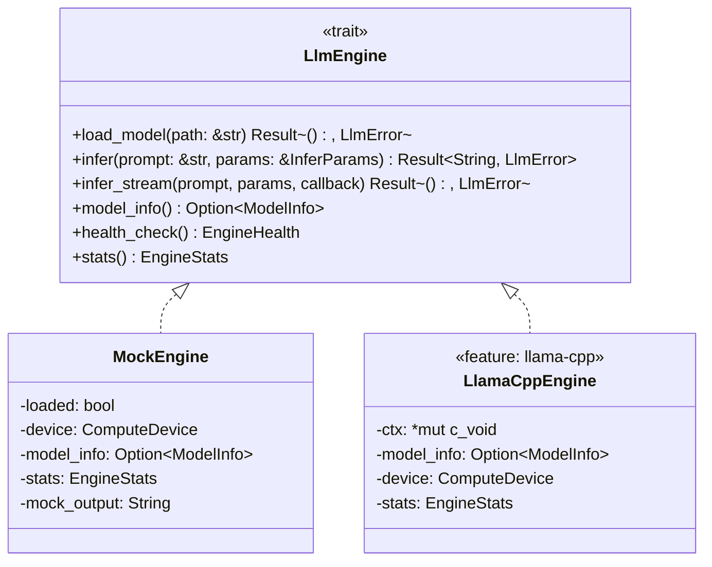
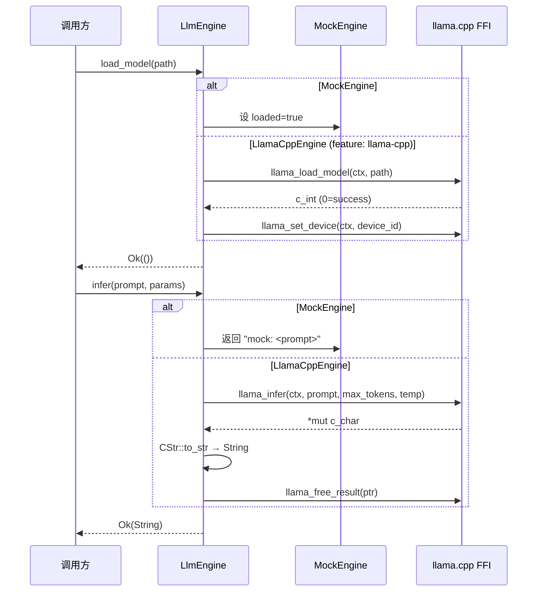

# EnerOS LLM 推理引擎选型与 FFI 封装设计 — LlmEngine trait + llama.cpp FFI + MockEngine

> **版本**：v0.59.0（P1-I AI Runtime LLM 第一层，双脑链路起点）
> **crate**：`eneros-llm-engine`（`crates/ai/llm-engine/`）
> **蓝图依据**：`蓝图/phase1.md` §v0.59.0
> **最后更新**：2026-07-16

---

## 1. 版本目标

### 1.1 一句话目标

定义 LLM 推理引擎的统一 trait（`LlmEngine`）并提供 llama.cpp FFI 封装（`LlamaCppEngine`，feature-gated）与纯 Rust 测试实现（`MockEngine`，默认可用），为双脑架构（LLM + Solver）的 LLM 感知层奠定接口基础，使后续 v0.60.0~v0.63.0 模型加载/量化/调度/模板版本可基于该 trait 扩展而不耦合具体推理后端。

### 1.2 详细描述

v0.58.0 完成了 P1-H RTOS 组件收官（看门狗降级流程），本版本进入 P1-I AI Runtime LLM 第一层。双脑架构中 LLM 是"感知者"，负责理解市场信号与自然语言指令并输出 JSON 意图，Solver（LP/MILP，v0.71.0 联调）是"执行者"。两者通过统一接口解耦：上层（v0.61.0 推理调度器、v0.71.0 双脑联调）依赖 `LlmEngine` trait，不直接依赖 llama.cpp C 库。

本版本交付三项核心产出：

| 产出 | 角色 | 默认可用 | 说明 |
|------|------|---------|------|
| `LlmEngine` trait | 推理接口抽象 | ✅ | 6 个方法（load_model / infer / infer_stream / model_info / health_check / stats） |
| `MockEngine` | 测试与无 C 库场景实现 | ✅ | 纯 Rust，无外部依赖；模拟加载/推理/流式/统计 |
| `LlamaCppEngine` | 真实推理实现 | ❌ feature-gated | 通过 FFI 调用 llama.cpp C 库；需 `--features llama-cpp` 启用 |

同时交付配套类型（`InferParams` / `ModelInfo` / `Quantization` / `ComputeDevice` / `EngineStats` / `EngineHealth` / `LlmError`）与 FFI 模块（`extern "C"` 声明，feature-gated）。所有 Rust 代码必须 no_std（D1，蓝图 §43.1），仅使用 `core::*` / `alloc::*`，无 `std::*`。

### 1.3 架构定位

| 维度 | 定位 |
|------|------|
| Phase | Phase 1 单机 MVP |
| 子系统 | P1-I AI Runtime LLM 第一层 |
| 平面 | 慢平面（Agent Runtime 分区，管理信息大区） |
| 角色 | 双脑链路起点（LLM 感知层），统一推理接口 |
| 上游版本 | v0.26.0 配置服务（模型路径来源）、v0.11.0 用户堆（alloc 支持） |
| 同层版本 | v0.59.0（本版本，LLM 引擎接口）；v0.71.0 双脑联调时与 Solver 协作 |
| 下游版本 | v0.60.0 模型加载、v0.61.0 推理调度、v0.62.0 量化、v0.63.0 Prompt 模板 |
| 部署形态 | 边缘 LLM 推理统一采用 llama.cpp（C API），禁止 PyTorch（蓝图 §43.3） |

### 1.4 设计原则关联

| 原则 | 体现 |
|------|------|
| no_std 合规 | 全 crate 仅使用 `core::*` / `alloc::*`，无 `std::*`（D1，蓝图 §43.1） |
| 默认集成优先 | llama.cpp 作为边缘 LLM 推理首选（记忆文件 §5.5），不自研推理后端 |
| 可测试性 | `MockEngine` 默认可用，CI 无 C 库环境下可编译/可测试（D3） |
| GPU 优先 | GPU 加速通过 llama.cpp `n_gpu_layers` 参数（C 库内部），非 PyTorch `model.to("cuda")`（D4） |
| 故障隔离 | FFI 边界集中封装（D10），`unsafe` 块带 SAFETY 注释，指针所有权明确 |
| 可观测 | 6 个统计字段 + 4 个健康字段（D5，普通 u64，无 AtomicU64） |
| 复用优先 | 复用 `alloc::ffi::CString` / `core::ffi::*` 类型，不引入 cstr_core 等额外 crate |

---

## 2. 架构定位

### 2.1 P1-I AI Runtime LLM 分层

P1-I AI Runtime LLM 子系统按"引擎接口 → 模型加载 → 推理调度 → 量化 → Prompt 模板"五层层级组织，本版本位于第一层：

| 层级 | 版本 | crate | 职责 |
|------|------|-------|------|
| **第一层（引擎接口）** | **v0.59.0** | **`eneros-llm-engine`** | **`LlmEngine` trait + MockEngine + LlamaCppEngine FFI** |
| 第二层（模型加载） | v0.60.0 | （后续） | 模型文件加载、校验、元信息解析 |
| 第三层（推理调度） | v0.61.0 | （后续） | 推理请求排队、超时控制、并发限制 |
| 第四层（量化） | v0.62.0 | （后续） | INT4/INT8 量化配置、动态切换 |
| 第五层（Prompt 模板） | v0.63.0 | （后续） | Prompt 模板渲染、JSON 输出约束 |

第一层为后续四层提供 trait 抽象：v0.60.0 实现 `load_model` 的具体逻辑；v0.61.0 在 trait 之上构建调度器；v0.62.0 通过 `Quantization` enum 配置量化；v0.63.0 通过 `infer` / `infer_stream` 注入模板渲染结果。所有上层版本依赖本版本的 `LlmEngine` trait 与类型定义，不直接依赖 llama.cpp。

### 2.2 双脑链路起点

双脑架构（蓝图 §9.x）中 LLM 与 Solver 的协作链路如下：

```
[市场信号/自然语言指令]
        │
        ▼
v0.59.0 LlmEngine (本版本)
        │
        ▼
   LLM 推理 (llama.cpp via FFI)
        │
        ▼
   JSON 意图输出
        │
        ▼
v0.71.0 双脑联调 ──► Solver (LP/MILP, HiGHS)
                        │
                        ▼
                   优化决策 (L1 主路径)
                        │
                        ▼
                   控制命令下发
```

| 路径 | 内容 | MVP 可验收 | 说明 |
|------|------|-----------|------|
| L1 主路径 | Solver-only（LP/MILP） | ✅ 是 | 实时控制 < 500ms，不依赖 LLM |
| L2 增强路径 | LLM + Solver（双脑） | ❌ 否 | 离线复杂规划/自然语言交互，降级到 L1 |

本版本为 L2 增强路径的起点：定义 `LlmEngine` trait 使 LLM 推理可插拔。L2 路径在 LLM 不可用时降级到 L1（Solver-only），由 v0.71.0 双脑联调实现降级逻辑。本版本仅提供引擎接口与默认实现，不实现降级编排。

### 2.3 GPU 优先测试规则 — llama.cpp `n_gpu_layers`，非 PyTorch

> **关键澄清**：记忆文件 user_profile 的 GPU 优先规则适用于 Python 测试代码（`model.to("cuda")`、`with torch.no_grad():`）。本 crate 是 Rust no_std，无 PyTorch 依赖，GPU 加速路径完全不同。

| 维度 | Python 测试场景（user_profile） | 本 crate 场景（Rust no_std） |
|------|------------------------------|---------------------------|
| 语言 | Python | Rust no_std |
| 框架 | PyTorch | 无（直接 FFI 调 C 库） |
| GPU 加速方式 | `model.to("cuda")` | llama.cpp `n_gpu_layers` 参数（C 库内部） |
| 梯度计算 | `with torch.no_grad():` | 不适用（推理 only，无梯度） |
| GPU 不可用降级 | `device = "cpu"` | `ComputeDevice::Cpu`，`n_gpu_layers = 0` |
| 禁止项 | — | ❌ 禁止在边缘侧使用 PyTorch（蓝图 §43.3） |

本 crate 的 GPU 优先策略通过以下机制实现（D4 详述）：
1. `ComputeDevice` enum 声明目标设备（Cpu / Cuda / Metal / Npu）；
2. `LlamaCppEngine::new(device)` 接受设备参数；
3. 内部映射到 `n_gpu_layers`（Cpu=0，Cuda/Metal/Npu=99 全 offload）；
4. GPU 不可用时 `load_model` 返回 `Err(LlmError::GpuUnavailable)`，由调用方降级到 `ComputeDevice::Cpu`。

### 2.4 与同层组件的职责边界

| 组件 | 输入 | 输出 | 与本引擎关系 |
|------|------|------|-------------|
| `LlmEngine` trait（v0.59.0） | prompt + params | String / stream callback | 推理接口抽象，上层依赖 |
| `MockEngine`（v0.59.0） | prompt + params | "mock: \<prompt\>" | 测试与无 C 库场景实现 |
| `LlamaCppEngine`（v0.59.0） | prompt + params | llama.cpp 生成文本 | 真实推理实现（feature-gated） |
| 推理调度器（v0.61.0） | 推理请求队列 | 调用 `LlmEngine::infer` | 上层，依赖本 trait |
| 双脑联调（v0.71.0） | LLM 输出 + Solver | 控制决策 | 上层，编排 LLM 与 Solver |

### 2.5 上下游依赖图

```
v0.26.0 配置服务 ──► 模型路径 (&str) ──┐
                                       │
v0.11.0 用户堆 ──► alloc 支持 ──┤
                                       │
                                       ▼
                          v0.59.0 LlmEngine trait
                          ├── MockEngine (默认)
                          └── LlamaCppEngine (feature: llama-cpp)
                                       │
                                       ▼
                          v0.60.0 模型加载 (实现 load_model)
                                       │
                                       ▼
                          v0.61.0 推理调度
                                       │
                                       ▼
                          v0.71.0 双脑联调 (LLM + Solver)
```

### 2.6 为 v0.60.0~v0.63.0 奠定基础

本版本为后续四个 LLM 子系统版本提供接口基础：

| 产出 | 下游版本用途 |
|------|-------------|
| `LlmEngine` trait | v0.60.0~v0.63.0 均依赖该 trait，不直接依赖 llama.cpp |
| `InferParams` | v0.61.0 调度器构造推理参数；v0.63.0 模板渲染后注入 |
| `ModelInfo` | v0.60.0 加载后填充；v0.62.0 量化切换后更新 |
| `Quantization` enum | v0.62.0 量化配置 |
| `ComputeDevice` enum | v0.60.0 设备选择；v0.61.0 调度器 GPU 优先逻辑 |
| `EngineStats` / `EngineHealth` | v0.61.0 调度器监控推理负载与健康状态 |
| `LlmError` | v0.71.0 双脑联调降级决策（`GpuUnavailable` → 降级 L1） |
| `MockEngine` | v0.60.0~v0.63.0 单元测试均使用 MockEngine 验证上层逻辑 |

### 2.7 不做的事（职责边界）

本引擎**不负责**以下职责，避免与上下游重叠：

| 不做的事 | 归属版本 | 理由 |
|---------|---------|------|
| 模型文件校验与元信息解析 | v0.60.0 | 本版本仅定义 `load_model` 接口，具体加载逻辑由 v0.60.0 实现 |
| 推理请求排队与超时控制 | v0.61.0 | 本版本仅提供单次推理接口，调度由 v0.61.0 编排 |
| 量化切换与校准 | v0.62.0 | 本版本仅定义 `Quantization` enum，切换逻辑由 v0.62.0 实现 |
| Prompt 模板渲染 | v0.63.0 | 本版本接收已渲染的 prompt 字符串，模板由 v0.63.0 渲染 |
| 双脑降级编排 | v0.71.0 | 本版本仅返回 `LlmError`，降级决策由 v0.71.0 编排 |
| llama.cpp C 库编译与链接 | 构建系统 | 本版本仅声明 FFI，C 库编译由 `tools/setup-toolchain.sh` 处理 |
| 多模型并发管理 | v0.61.0 | 本版本单引擎单模型，多模型由 v0.61.0 调度器管理 |

---

## 3. LlmEngine trait（D2：无 Send + Sync）

### 3.1 trait 定义

```rust
use crate::error::LlmError;
use crate::params::InferParams;
use crate::model::ModelInfo;
use crate::stats::{EngineStats, EngineHealth};

/// LLM 推理引擎统一 trait（D2：无 Send + Sync bound）。
///
/// 定义 LLM 推理引擎的统一接口，供上层（v0.61.0 推理调度器、
/// v0.71.0 双脑联调）依赖。具体实现：
/// - `MockEngine`：默认可用，纯 Rust 测试实现
/// - `LlamaCppEngine`：feature-gated，通过 FFI 调用 llama.cpp
///
/// **D2：不要求 `Send + Sync`**。no_std RTOS 单线程（与 v0.57.0 D6 /
/// v0.58.0 D6 一致），`Send + Sync` 在单线程下无意义；且
/// `*mut c_void`（FFI 上下文）非 `Send`，强加会导致
/// `LlamaCppEngine` 无法实现 trait。
pub trait LlmEngine {
    /// 加载模型文件。
    ///
    /// - `path`：模型文件路径（UTF-8 字符串，D6：保留 `&str` 签名）
    /// - 返回 `Ok(())`：加载成功，内部 `model_info` 更新
    /// - 返回 `Err(LlmError::LoadFailed)`：加载失败
    /// - 返回 `Err(LlmError::GpuUnavailable)`：GPU 不可用且 device 要求 GPU
    fn load_model(&mut self, path: &str) -> Result<(), LlmError>;

    /// 同步推理。
    ///
    /// - `prompt`：输入提示词
    /// - `params`：推理参数（max_tokens / temperature / top_p / ...）
    /// - 返回 `Ok(String)`：生成文本
    /// - 返回 `Err(LlmError::ModelNotLoaded)`：未加载模型
    fn infer(&mut self, prompt: &str, params: &InferParams) -> Result<String, LlmError>;

    /// 流式推理（D8：`&mut dyn FnMut` callback）。
    ///
    /// - `callback`：每生成一个 token 调用一次，返回 `false` 停止生成
    /// - 返回 `Ok(())`：生成完成
    /// - 返回 `Err(LlmError::ModelNotLoaded)`：未加载模型
    fn infer_stream(
        &mut self,
        prompt: &str,
        params: &InferParams,
        callback: &mut dyn FnMut(&str) -> bool,
    ) -> Result<(), LlmError>;

    /// 返回已加载模型信息（未加载返回 `None`）。
    fn model_info(&self) -> Option<&ModelInfo>;

    /// 健康检查（返回当前引擎状态快照）。
    fn health_check(&self) -> EngineHealth;

    /// 返回累计统计（只读引用）。
    fn stats(&self) -> &EngineStats;
}
```

### 3.2 6 个方法说明

| # | 方法 | 签名 | 说明 |
|---|------|------|------|
| 1 | `load_model` | `&mut self, path: &str -> Result<(), LlmError>` | 加载模型文件，更新 `model_info`，`stats.model_load_count += 1` |
| 2 | `infer` | `&mut self, prompt: &str, params: &InferParams -> Result<String, LlmError>` | 同步推理，返回完整生成文本；`stats.inference_count += 1` |
| 3 | `infer_stream` | `&mut self, prompt, params, callback -> Result<(), LlmError>` | 流式推理，逐 token 调用 callback；callback 返回 `false` 停止 |
| 4 | `model_info` | `&self -> Option<&ModelInfo>` | 返回已加载模型信息引用（未加载返回 `None`） |
| 5 | `health_check` | `&self -> EngineHealth` | 返回引擎健康状态快照（loaded / device / gpu_layers / last_error） |
| 6 | `stats` | `&self -> &EngineStats` | 返回累计统计只读引用 |

### 3.3 为什么不要求 Send + Sync（D2）

| 维度 | 说明 |
|------|------|
| no_std 单线程 | 本 crate 运行于 Agent Runtime 分区单线程（与 v0.57.0 D6 / v0.58.0 D6 一致），`Send + Sync` 在单线程下无意义 |
| FFI 指针非 Send | `LlamaCppEngine` 持有 `ctx: *mut c_void`（llama.cpp 上下文），裸指针非 `Send`；若 trait 要求 `Send`，`LlamaCppEngine` 无法实现 trait |
| 一致性 | 与 v0.51.0 `PointAccess`（D2）、v0.54.0 D6、v0.55.0 D6、v0.56.0 D6、v0.57.0 D6 一致 |
| 跨核访问 | LLM 推理在 Agent Runtime 分区（管理信息大区）单核运行，无跨核共享需求 |
| 蓝图原文 | 蓝图 `pub trait LlmEngine: Send + Sync`，本设计移除该 bound（D2） |

### 3.4 trait UML 类图



图 1：`LlmEngine` trait UML 类图。`MockEngine` 与 `LlamaCppEngine` 均实现 `LlmEngine` trait；`LlamaCppEngine` 标注 `<<feature: llama-cpp>>` 表示 feature-gated。

### 3.5 trait 对象安全

`LlmEngine` trait 的方法均接收 `&self` / `&mut self`，返回 `Result` / `Option` / 引用，不涉及 `Self` 类型，因此是对象安全的，可作为 `Box<dyn LlmEngine>` 使用。但本版本默认不使用 trait 对象（避免堆分配与动态分发），上层可直接使用具体类型（`MockEngine` / `LlamaCppEngine`）。v0.61.0 调度器若需多后端切换可使用 `Box<dyn LlmEngine>`。

---

## 4. 类型定义

### 4.1 类型总表

| 类型 | 类别 | 说明 | 默认值 |
|------|------|------|--------|
| `InferParams` | struct（6 字段） | 推理参数 | max_tokens=128, temperature=0.7 |
| `ModelInfo` | struct（5 字段） | 模型元信息 | name=空, quantization=Q4_K_M |
| `Quantization` | enum（4 变体，D11） | 量化级别 | Q4_K_M |
| `ComputeDevice` | enum（4 变体，D12） | 计算设备 | Cpu |
| `EngineStats` | struct（6 字段，D5） | 累计统计 | 全 0 |
| `EngineHealth` | struct（4 字段） | 健康快照 | loaded=false |
| `LlmError` | enum（8 变体，D7） | 错误类型 | — |

### 4.2 InferParams

```rust
use alloc::vec::Vec;

/// 推理参数（6 字段）。
///
/// 封装 llama.cpp 推理所需的采样参数。`MockEngine` 仅使用
/// `max_tokens`（控制 mock 输出长度），其余字段由 `LlamaCppEngine`
/// 传递给 llama.cpp FFI。
#[derive(Debug, Clone, Default)]
pub struct InferParams {
    /// 最大生成 token 数（默认 128）
    pub max_tokens: u32,
    /// 采样温度（默认 0.7，越高越随机）
    pub temperature: f32,
    /// top-p 采样阈值（默认 0.9）
    pub top_p: f32,
    /// top-k 采样阈值（默认 40）
    pub top_k: u32,
    /// 重复惩罚（默认 1.1）
    pub repeat_penalty: f32,
    /// 停止 token 列表（默认空）
    pub stop_tokens: Vec<String>,
}

impl InferParams {
    /// 创建默认推理参数。
    pub fn new() -> Self {
        Self::default()
    }
}
```

默认值对照（C27）：

| 字段 | 默认值 | 说明 |
|------|--------|------|
| `max_tokens` | 128 | 单次推理最大 token 数 |
| `temperature` | 0.7 | 适中随机性 |
| `top_p` | 0.9 | 核采样阈值 |
| `top_k` | 40 | top-k 采样阈值 |
| `repeat_penalty` | 1.1 | 轻度惩罚重复 |
| `stop_tokens` | `Vec::new()` | 无停止 token |

### 4.3 Quantization（D11：默认 Q4_K_M）

```rust
/// 量化级别（4 变体，D11：默认 Q4_K_M）。
///
/// 派生 `Default`，`#[default]` 标注 `Q4_K_M`（nightly feature，
/// 项目已使用 nightly-2026-04-04）。Q4_K_M 是 llama.cpp 推荐的
/// 边缘部署量化级别（4 bit + K-quant 均衡）。
#[derive(Debug, Clone, Copy, PartialEq, Eq, Default)]
pub enum Quantization {
    /// FP16 半精度（无量化）
    F16,
    /// INT8 量化
    Q8_0,
    /// INT4 基础量化
    Q4_0,
    /// INT4 K-quant 均衡量化（默认，推荐边缘部署）
    #[default]
    Q4_K_M,
}
```

| 维度 | 说明 |
|------|------|
| 为什么默认 Q4_K_M | llama.cpp 推荐的边缘部署量化级别，4 bit 显存占用最小且质量损失可控（蓝图 §43.3） |
| `#[default]` 属性 | nightly feature，项目 `rust-toolchain.toml` 已锁定 nightly-2026-04-04 |
| 与 `ModelInfo` 的关系 | `ModelInfo.quantization` 字段类型为 `Quantization`，需 `Default` |
| 一致性 | D11 偏差声明 |

### 4.4 ComputeDevice（D12：默认 Cpu）

```rust
/// 计算设备（4 变体，D12：默认 Cpu）。
///
/// 派生 `Default`，`#[default]` 标注 `Cpu`。GPU 优先是 opt-in
/// （D4），默认 CPU 保证可用性。GPU 不可用时退到 Cpu
/// （与 user_profile GPU 优先规则一致）。
#[derive(Debug, Clone, Copy, PartialEq, Eq, Default)]
pub enum ComputeDevice {
    /// CPU 推理（默认，n_gpu_layers = 0）
    #[default]
    Cpu,
    /// NVIDIA CUDA（n_gpu_layers = 99，全 offload）
    Cuda,
    /// Apple Metal（n_gpu_layers = 99）
    Metal,
    /// NPU（n_gpu_layers = 99）
    Npu,
}

impl ComputeDevice {
    /// 判断是否为 GPU 设备（Cpu=false，其余=true）。
    pub fn is_gpu(&self) -> bool {
        !matches!(self, ComputeDevice::Cpu)
    }

    /// 映射到 llama.cpp `n_gpu_layers` 参数（D4）。
    ///
    /// - Cpu：0（纯 CPU 推理）
    /// - Cuda/Metal/Npu：99（全 offload 到 GPU）
    pub fn n_gpu_layers(&self) -> u32 {
        match self {
            ComputeDevice::Cpu => 0,
            _ => 99,
        }
    }
}
```

| 设备 | `is_gpu()` | `n_gpu_layers()` | 说明 |
|------|-----------|------------------|------|
| `Cpu` | `false` | 0 | 默认，纯 CPU 推理 |
| `Cuda` | `true` | 99 | NVIDIA GPU 全 offload |
| `Metal` | `true` | 99 | Apple Metal 全 offload |
| `Npu` | `true` | 99 | NPU 全 offload |

### 4.5 ModelInfo

```rust
/// 模型元信息（5 字段）。
///
/// `load_model` 成功后填充。`MockEngine` 填充 `name = path`，
/// `LlamaCppEngine` 从 llama.cpp 上下文读取真实元信息。
#[derive(Debug, Clone, Default)]
pub struct ModelInfo {
    /// 模型名称（通常为文件名或路径）
    pub name: String,
    /// 模型文件大小（字节）
    pub size_bytes: u64,
    /// 量化级别（默认 Q4_K_M，D11）
    pub quantization: Quantization,
    /// 上下文长度（默认 2048）
    pub context_length: u32,
    /// 加载时使用的计算设备（默认 Cpu，D12）
    pub device: ComputeDevice,
}
```

默认值对照（C23）：

| 字段 | 默认值 |
|------|--------|
| `name` | `String::new()`（空字符串） |
| `size_bytes` | 0 |
| `quantization` | `Quantization::Q4_K_M`（D11） |
| `context_length` | 2048 |
| `device` | `ComputeDevice::Cpu`（D12） |

### 4.6 EngineStats（D5：普通 u64，无 AtomicU64）

```rust
/// 引擎累计统计（6 字段，D5：普通 u64/u32，无 AtomicU64）。
///
/// 单线程读写（LlmEngine 所在 Agent Runtime 分区单线程），
/// 无并发，无需原子操作。与 v0.54.0 D8、v0.55.0 D7、
/// v0.56.0 D7、v0.57.0 D7 一致。
#[derive(Debug, Clone, Default)]
pub struct EngineStats {
    /// 累计推理次数（infer + infer_stream 调用次数）
    pub inference_count: u64,
    /// 累计生成 token 数
    pub total_tokens_generated: u64,
    /// 累计推理耗时（纳秒）
    pub total_inference_ns: u64,
    /// 上次推理耗时（纳秒）
    pub last_inference_ns: u64,
    /// 累计模型加载次数
    pub model_load_count: u64,
    /// 当前 GPU offload 层数（n_gpu_layers，D4）
    pub gpu_layers: u32,
}
```

### 4.7 EngineHealth

```rust
/// 引擎健康快照（4 字段）。
///
/// `health_check()` 返回值，反映调用时刻的引擎状态。
#[derive(Debug, Clone)]
pub struct EngineHealth {
    /// 模型是否已加载
    pub loaded: bool,
    /// 当前计算设备
    pub device: ComputeDevice,
    /// 当前 GPU offload 层数
    pub gpu_layers: u32,
    /// 上次错误（None 表示无错误）
    pub last_error: Option<LlmError>,
}
```

### 4.8 类型依赖关系

```
LlmEngine (trait)
    ├── load_model(path: &str) ──► LlmError
    ├── infer(prompt, params) ──► InferParams / String / LlmError
    ├── infer_stream(prompt, params, callback) ──► InferParams / LlmError
    ├── model_info() ──► ModelInfo
    │                        ├── quantization: Quantization (D11)
    │                        └── device: ComputeDevice (D12)
    ├── health_check() ──► EngineHealth
    │                        ├── device: ComputeDevice
    │                        └── last_error: Option<LlmError>
    └── stats() ──► EngineStats
                          └── gpu_layers: u32 (D4)
```

---

## 5. MockEngine（D3：默认可用）

### 5.1 结构定义

```rust
use alloc::string::String;

use crate::device::ComputeDevice;
use crate::engine::LlmEngine;
use crate::error::LlmError;
use crate::model::ModelInfo;
use crate::params::InferParams;
use crate::stats::{EngineHealth, EngineStats};

/// Mock 推理引擎（D3：默认可用，纯 Rust 无外部依赖）。
///
/// 用于单元测试与无 llama.cpp C 库环境下的接口验证。
/// 不执行真实推理，返回 mock 输出（默认 "mock: <prompt>"）。
///
/// `mock_output` 字段允许调用方自定义输出（通过 `with_output` 构造），
/// 用于测试上层（v0.61.0 调度器、v0.71.0 双脑联调）对特定输出的处理。
pub struct MockEngine {
    /// 模型是否已加载
    loaded: bool,
    /// 计算设备（D4：记录用于测试断言 GPU 优先逻辑）
    device: ComputeDevice,
    /// 已加载模型信息（未加载为 None）
    model_info: Option<ModelInfo>,
    /// 累计统计（D5：普通 u64）
    stats: EngineStats,
    /// mock 输出模板（默认 "mock: <prompt>"）
    mock_output: String,
}
```

### 5.2 字段说明

| # | 字段 | 类型 | 说明 |
|---|------|------|------|
| 1 | `loaded` | `bool` | 模型是否已加载，初始 `false`；`load_model` 设 `true` |
| 2 | `device` | `ComputeDevice` | 计算设备，由 `new(device)` 注入；用于测试断言 GPU 优先逻辑（D4） |
| 3 | `model_info` | `Option<ModelInfo>` | 已加载模型信息；`load_model` 设 `Some(ModelInfo { name: path, ... })` |
| 4 | `stats` | `EngineStats` | 累计统计（D5：普通 u64）；每次推理后更新 |
| 5 | `mock_output` | `String` | mock 输出模板；默认 `"mock: <prompt>"`；`with_output` 可自定义 |

### 5.3 构造函数

```rust
impl MockEngine {
    /// 构造 MockEngine（初始 loaded=false）。
    ///
    /// - `device`：计算设备（D4：记录用于测试断言）
    pub fn new(device: ComputeDevice) -> Self {
        Self {
            loaded: false,
            device,
            model_info: None,
            stats: EngineStats::default(),
            mock_output: String::new(),
        }
    }

    /// builder：自定义 mock 输出（默认 "mock: <prompt>"）。
    ///
    /// 若 `output` 为空，`infer` 返回 `"mock: <prompt>"`；
    /// 否则返回 `output`（用于测试上层对特定输出的处理）。
    pub fn with_output(output: &str) -> Self {
        Self {
            loaded: false,
            device: ComputeDevice::default(),
            model_info: None,
            stats: EngineStats::default(),
            mock_output: String::from(output),
        }
    }
}
```

### 5.4 LlmEngine trait 实现

```rust
impl LlmEngine for MockEngine {
    fn load_model(&mut self, path: &str) -> Result<(), LlmError> {
        self.loaded = true;
        self.model_info = Some(ModelInfo {
            name: String::from(path),
            size_bytes: 0,
            quantization: Quantization::Q4_K_M,
            context_length: 2048,
            device: self.device,
        });
        self.stats.model_load_count += 1;
        Ok(())
    }

    fn infer(&mut self, prompt: &str, _params: &InferParams) -> Result<String, LlmError> {
        if !self.loaded {
            return Err(LlmError::ModelNotLoaded);
        }
        let output = if self.mock_output.is_empty() {
            alloc::format!("mock: {}", prompt)
        } else {
            self.mock_output.clone()
        };
        // 模拟统计：假设生成 token 数 = output 字符数 / 4
        let tokens = (output.len() / 4) as u64;
        self.stats.inference_count += 1;
        self.stats.total_tokens_generated += tokens;
        Ok(output)
    }

    fn infer_stream(
        &mut self,
        prompt: &str,
        params: &InferParams,
        callback: &mut dyn FnMut(&str) -> bool,
    ) -> Result<(), LlmError> {
        if !self.loaded {
            return Err(LlmError::ModelNotLoaded);
        }
        // 模拟流式：按字符切分 mock 输出
        let output = if self.mock_output.is_empty() {
            alloc::format!("mock: {}", prompt)
        } else {
            self.mock_output.clone()
        };
        let mut tokens: u64 = 0;
        for ch in output.chars() {
            let token = alloc::format!("{}", ch);
            if !callback(&token) {
                break;  // callback 返回 false 停止
            }
            tokens += 1;
            if tokens >= params.max_tokens as u64 {
                break;
            }
        }
        self.stats.inference_count += 1;
        self.stats.total_tokens_generated += tokens;
        Ok(())
    }

    fn model_info(&self) -> Option<&ModelInfo> {
        self.model_info.as_ref()
    }

    fn health_check(&self) -> EngineHealth {
        EngineHealth {
            loaded: self.loaded,
            device: self.device,
            gpu_layers: self.device.n_gpu_layers(),
            last_error: None,
        }
    }

    fn stats(&self) -> &EngineStats {
        &self.stats
    }
}
```

### 5.5 MockEngine 如何模拟推理

| 维度 | 模拟方式 |
|------|---------|
| 加载模型 | `load_model` 设 `loaded=true`，`model_info` 填充（name=path） |
| 同步推理 | 返回 `"mock: <prompt>"` 或自定义 `mock_output` |
| 流式推理 | 按字符切分 mock 输出，逐字符调用 callback；callback 返回 `false` 停止 |
| token 计数 | `output.len() / 4`（粗略估算，仅供统计测试） |
| 统计更新 | `inference_count += 1`、`total_tokens_generated += tokens` |
| 未加载推理 | 返回 `Err(LlmError::ModelNotLoaded)` |
| GPU 优先断言 | `device` 字段记录，测试可断言 `MockEngine::new(Cuda)` 时 `health_check().device == Cuda` |

### 5.6 推理时序图（MockEngine 与 LlamaCppEngine 对比）



图 2：推理时序图。MockEngine 与 LlamaCppEngine 均实现 `LlmEngine` trait，调用方无感知后端差异。LlamaCppEngine 路径仅当启用 `llama-cpp` feature 时编译。

---

## 6. LlamaCppEngine FFI（D3：feature-gated，D10：FFI 安全）

### 6.1 ffi 模块声明（feature-gated）

```rust
//! FFI 绑定模块（D3：feature-gated，D10：FFI 安全）。
//!
//! 仅当启用 `llama-cpp` feature 时编译。声明 llama.cpp C 库的
//! `extern "C"` 函数，使用 `core::ffi::*` 类型（c_void / c_char /
//! c_int / c_uint / c_float）。
//!
//! **D10：FFI 安全**。本模块仅声明 FFI 函数，不调用；调用在
//! `LlamaCppEngine` 方法内通过 `unsafe` 块完成，每个 `unsafe`
//! 块带 SAFETY 注释说明不变量。

#[cfg(feature = "llama-cpp")]
mod ffi {
    use core::ffi::{c_char, c_float, c_int, c_uint, c_void};

    extern "C" {
        /// 初始化 llama.cpp 上下文。
        ///
        /// 返回 `*mut c_void` 上下文指针（NULL 表示失败）。
        /// 调用方负责通过 `llama_free` 释放。
        pub fn llama_init() -> *mut c_void;

        /// 加载模型文件。
        ///
        /// - `ctx`：`llama_init` 返回的上下文指针
        /// - `path`：模型文件路径（C 字符串，UTF-8 + NUL 结尾）
        /// - 返回：0=成功，非 0=失败
        pub fn llama_load_model(ctx: *mut c_void, path: *const c_char) -> c_int;

        /// 设置计算设备与 GPU offload 层数。
        ///
        /// - `ctx`：上下文指针
        /// - `device_id`：0=CPU，1=CUDA，2=Metal，3=NPU
        /// - `n_gpu_layers`：GPU offload 层数（0=纯 CPU，99=全 offload）
        /// - 返回：0=成功，非 0=失败（如 GPU 不可用）
        pub fn llama_set_device(ctx: *mut c_void, device_id: c_int, n_gpu_layers: c_uint) -> c_int;

        /// 同步推理。
        ///
        /// - `ctx`：上下文指针
        /// - `prompt`：输入提示词（C 字符串）
        /// - `max_tokens`：最大生成 token 数
        /// - `temperature`：采样温度
        /// - 返回：生成文本的 C 字符串指针（调用方负责通过
        ///   `llama_free_result` 释放；NULL 表示失败）
        pub fn llama_infer(
            ctx: *mut c_void,
            prompt: *const c_char,
            max_tokens: c_uint,
            temperature: c_float,
        ) -> *mut c_char;

        /// 释放 `llama_infer` 返回的字符串指针。
        ///
        /// - `ptr`：`llama_infer` 返回的指针
        pub fn llama_free_result(ptr: *mut c_char);

        /// 释放 `llama_init` 返回的上下文指针。
        ///
        /// - `ctx`：上下文指针
        pub fn llama_free(ctx: *mut c_void);
    }
}
```

### 6.2 extern "C" 函数清单

| # | 函数 | 签名 | 所有权 |
|---|------|------|--------|
| 1 | `llama_init` | `() -> *mut c_void` | 返回指针由 `LlamaCppEngine` 持有，`Drop` 时 `llama_free` |
| 2 | `llama_load_model` | `(ctx, path: *const c_char) -> c_int` | path 由调用方构造（CString），调用后可释放 |
| 3 | `llama_set_device` | `(ctx, device_id, n_gpu_layers) -> c_int` | 无指针所有权转移 |
| 4 | `llama_infer` | `(ctx, prompt, max_tokens, temp) -> *mut c_char` | 返回指针由调用方立即拷贝为 String 后 `llama_free_result` |
| 5 | `llama_free_result` | `(ptr: *mut c_char)` | 释放 `llama_infer` 返回的指针 |
| 6 | `llama_free` | `(ctx: *mut c_void)` | 释放 `llama_init` 返回的上下文 |

### 6.3 LlamaCppEngine 结构定义

```rust
use core::ffi::c_void;
use alloc::string::String;

use crate::device::ComputeDevice;
use crate::engine::LlmEngine;
use crate::error::LlmError;
use crate::model::ModelInfo;
use crate::params::InferParams;
use crate::stats::{EngineHealth, EngineStats};

/// llama.cpp FFI 推理引擎（D3：feature-gated）。
///
/// 仅当启用 `llama-cpp` feature 且链接 llama.cpp C 库时编译。
/// 通过 FFI 调用 llama.cpp 执行真实推理。
///
/// **指针所有权**（D10）：
/// - `ctx: *mut c_void` 由本结构持有，`Drop` 时调用 `llama_free`
/// - `llama_infer` 返回的 `*mut c_char` 立即转 `CStr` 拷贝为 `String`，
///   再调用 `llama_free_result` 释放
#[cfg(feature = "llama-cpp")]
pub struct LlamaCppEngine {
    /// llama.cpp 上下文指针（由 `llama_init` 返回，`Drop` 时释放）
    ctx: *mut c_void,
    /// 已加载模型信息
    model_info: Option<ModelInfo>,
    /// 计算设备（D4：决定 n_gpu_layers）
    device: ComputeDevice,
    /// 累计统计（D5：普通 u64）
    stats: EngineStats,
}
```

### 6.4 构造函数

```rust
#[cfg(feature = "llama-cpp")]
impl LlamaCppEngine {
    /// 构造 LlamaCppEngine（调用 ffi::llama_init 获取上下文）。
    ///
    /// - `device`：计算设备（D4：决定 n_gpu_layers）
    /// - 返回 `LlamaCppEngine` 实例
    ///
    /// # Panics
    ///
    /// 若 `llama_init()` 返回 NULL（C 库初始化失败），panic。
    /// 这是不可恢复错误，应在系统启动阶段处理。
    pub fn new(device: ComputeDevice) -> Self {
        // SAFETY: llama_init 无参数，返回有效指针或 NULL。
        // NULL 表示 C 库初始化失败，属不可恢复错误。
        let ctx = unsafe { ffi::llama_init() };
        if ctx.is_null() {
            panic!("llama_init returned NULL");
        }
        Self {
            ctx,
            model_info: None,
            device,
            stats: EngineStats {
                gpu_layers: device.n_gpu_layers(),
                ..EngineStats::default()
            },
        }
    }
}
```

### 6.5 LlmEngine trait 实现

```rust
#[cfg(feature = "llama-cpp")]
impl LlmEngine for LlamaCppEngine {
    fn load_model(&mut self, path: &str) -> Result<(), LlmError> {
        // D6：&str 转 CString（alloc::ffi::CString 在 no_std 可用）
        let c_path = alloc::ffi::CString::new(path)
            .map_err(|_| LlmError::InvalidPath)?;

        // SAFETY: ctx 由 llama_init 返回且非 NULL（构造函数保证）；
        // c_path 为有效 C 字符串，调用期间不释放。
        let ret = unsafe { ffi::llama_load_model(self.ctx, c_path.as_ptr()) };
        if ret != 0 {
            return Err(LlmError::LoadFailed);
        }

        // D4：设置设备与 GPU offload 层
        let device_id = match self.device {
            ComputeDevice::Cpu => 0,
            ComputeDevice::Cuda => 1,
            ComputeDevice::Metal => 2,
            ComputeDevice::Npu => 3,
        };
        // SAFETY: ctx 有效；device_id 与 n_gpu_layers 为合法值。
        let ret = unsafe {
            ffi::llama_set_device(self.ctx, device_id, self.device.n_gpu_layers())
        };
        if ret != 0 && self.device.is_gpu() {
            // GPU 不可用
            return Err(LlmError::GpuUnavailable);
        }

        self.model_info = Some(ModelInfo {
            name: String::from(path),
            size_bytes: 0,  // v0.60.0 从 llama.cpp 读取真实大小
            quantization: Quantization::Q4_K_M,
            context_length: 2048,
            device: self.device,
        });
        self.stats.model_load_count += 1;
        Ok(())
    }

    fn infer(&mut self, prompt: &str, params: &InferParams) -> Result<String, LlmError> {
        if !self.model_info.is_some() {
            return Err(LlmError::ModelNotLoaded);
        }

        let c_prompt = alloc::ffi::CString::new(prompt)
            .map_err(|_| LlmError::InvalidPrompt)?;

        // SAFETY: ctx 有效；c_prompt 为有效 C 字符串；
        // 返回的 ptr 由本块内 llama_free_result 释放。
        let ptr = unsafe {
            ffi::llama_infer(
                self.ctx,
                c_prompt.as_ptr(),
                params.max_tokens,
                params.temperature,
            )
        };
        if ptr.is_null() {
            return Err(LlmError::InferFailed);
        }

        // SAFETY: ptr 由 llama_infer 返回，指向有效 C 字符串。
        let c_str = unsafe { core::ffi::CStr::from_ptr(ptr) };
        let result = c_str
            .to_str()
            .map_err(|_| LlmError::Utf8Error)
            .map(String::from);

        // SAFETY: ptr 由 llama_infer 返回，需通过 llama_free_result 释放。
        unsafe { ffi::llama_free_result(ptr) };

        let output = result?;

        // 统计更新（D5）
        self.stats.inference_count += 1;
        self.stats.total_tokens_generated += (output.len() / 4) as u64;

        Ok(output)
    }

    fn infer_stream(
        &mut self,
        _prompt: &str,
        _params: &InferParams,
        _callback: &mut dyn FnMut(&str) -> bool,
    ) -> Result<(), LlmError> {
        // v0.59.0 暂未实现流式 FFI（llama.cpp 流式 API 较复杂）
        // v0.61.0 推理调度器版本实现
        // D3：feature-gated 的 LlamaCppEngine 例外，可用 unimplemented!
        // （checklist C100）
        unimplemented!("stream inference via FFI will be implemented in v0.61.0")
    }

    fn model_info(&self) -> Option<&ModelInfo> {
        self.model_info.as_ref()
    }

    fn health_check(&self) -> EngineHealth {
        EngineHealth {
            loaded: self.model_info.is_some(),
            device: self.device,
            gpu_layers: self.device.n_gpu_layers(),
            last_error: None,
        }
    }

    fn stats(&self) -> &EngineStats {
        &self.stats
    }
}
```

### 6.6 Drop 实现（D10：指针所有权）

```rust
#[cfg(feature = "llama-cpp")]
impl Drop for LlamaCppEngine {
    fn drop(&mut self) {
        // SAFETY: ctx 由 llama_init 返回且非 NULL（构造函数保证）；
        // 本结构持有唯一所有权，drop 时释放一次。
        if !self.ctx.is_null() {
            unsafe { ffi::llama_free(self.ctx) };
            self.ctx = core::ptr::null_mut();
        }
    }
}
```

### 6.7 FFI 安全设计（D10）

| 维度 | 设计 |
|------|------|
| `unsafe` 集中封装 | `extern "C"` 声明在 `ffi` 模块；调用在 `LlamaCppEngine` 方法内的 `unsafe` 块 |
| SAFETY 注释 | 每个 `unsafe` 块带 SAFETY 注释，说明不变量（指针有效性、所有权、生命周期） |
| 指针所有权 | `ctx: *mut c_void` 由 `LlamaCppEngine` 持有，`Drop` 时 `llama_free` |
| 临时指针释放 | `llama_infer` 返回的 `*mut c_char` 立即拷贝为 `String` 后 `llama_free_result` |
| NULL 检查 | `llama_init` 返回 NULL 时 panic（不可恢复）；`llama_infer` 返回 NULL 时返回 `Err(InferFailed)` |
| CString 转换 | `alloc::ffi::CString::new(path)` 转换 `&str` 为 C 字符串（D6） |
| CStr 转换 | `core::ffi::CStr::from_ptr(ptr)` 转 `&str`，再 `String::from` 拷贝 |

---

## 7. GPU 优先策略（D4）

### 7.1 llama.cpp `n_gpu_layers` vs PyTorch `model.to("cuda")`

| 维度 | PyTorch（user_profile） | llama.cpp（本 crate） |
|------|------------------------|----------------------|
| 适用场景 | Python 模型训练/校准（云端） | 边缘 LLM 推理（Rust no_std） |
| GPU 加速 API | `model.to("cuda")` | `n_gpu_layers` 参数（C 库内部） |
| 梯度计算 | `with torch.no_grad():` | 不适用（推理 only） |
| 调用方式 | Python 方法 | FFI 传整数参数 |
| 禁止项 | — | ❌ 禁止在边缘侧使用 PyTorch（蓝图 §43.3） |

**关键澄清**：本 crate 是 Rust no_std，无 PyTorch 依赖。GPU 加速通过 llama.cpp 的 `n_gpu_layers` 参数控制（C 库内部实现），Rust 侧仅通过 `ComputeDevice` enum 声明目标设备 + FFI 传递 `n_gpu_layers` 整数。这与 user_profile 的 GPU 优先规则（Python `model.to("cuda")`）完全不同，但精神一致：GPU 可用时优先使用 GPU，不可用时退到 CPU。

### 7.2 ComputeDevice enum 映射

| `ComputeDevice` | `is_gpu()` | `n_gpu_layers()` | llama.cpp `device_id` | 说明 |
|-----------------|-----------|------------------|----------------------|------|
| `Cpu`（默认，D12） | `false` | 0 | 0 | 纯 CPU 推理 |
| `Cuda` | `true` | 99 | 1 | NVIDIA GPU 全 offload |
| `Metal` | `true` | 99 | 2 | Apple Metal 全 offload |
| `Npu` | `true` | 99 | 3 | NPU 全 offload |

### 7.3 GPU 优先与 CPU 降级流程

```rust
// GPU 优先逻辑（调用方实现，本 crate 提供接口）
fn create_engine(gpu_available: bool) -> MockEngine {
    let device = if gpu_available {
        ComputeDevice::Cuda  // GPU 可用，优先 GPU
    } else {
        ComputeDevice::Cpu   // GPU 不可用，降级 CPU
    };
    MockEngine::new(device)
}

// LlamaCppEngine 的 GPU 降级（load_model 时检测）
// 若 device = Cuda 但 llama_set_device 返回非 0（GPU 不可用），
// load_model 返回 Err(LlmError::GpuUnavailable)，
// 调用方应捕获并退到 ComputeDevice::Cpu 重新构造引擎。
```

| 场景 | 行为 |
|------|------|
| GPU 可用 | `ComputeDevice::Cuda`，`n_gpu_layers=99`，全 offload |
| GPU 不可用（`load_model` 时） | 返回 `Err(LlmError::GpuUnavailable)`，调用方降级到 `Cpu` |
| 默认（无 GPU 信息） | `ComputeDevice::Cpu`（D12），`n_gpu_layers=0` |

### 7.4 与 user_profile GPU 优先规则的一致性

user_profile 规则要求："所有测试代码必须优先使用 GPU，模型和数据需显式迁移至 cuda 设备（如 `model.to("cuda")`）。若 GPU 不可用退到 CPU。"

本 crate 的对应实现：

| user_profile 规则 | 本 crate 实现 |
|------------------|--------------|
| 优先使用 GPU | `ComputeDevice::Cuda`（GPU 可用时） |
| 显式迁移至 cuda | `LlamaCppEngine::new(Cuda)` + `llama_set_device(device_id=1)` |
| 禁用梯度计算 | 不适用（推理 only，无梯度） |
| GPU 不可用退到 CPU | `LlmError::GpuUnavailable` → 调用方退到 `ComputeDevice::Cpu` |

单元测试（C77/C78）验证：
- T14 GPU 优先逻辑：`MockEngine::new(Cuda)` 时 `health_check().device == Cuda`
- T15 CPU 降级逻辑：`MockEngine::new(Cpu)` 时 `health_check().device == Cpu`

---

## 8. 错误处理（D7）

### 8.1 LlmError 枚举

```rust
/// LLM 引擎错误枚举（8 变体，D7）。
///
/// 派生 `Debug`，实现 `core::fmt::Display`（no_std 无 std::error::Error）。
#[derive(Debug, Clone, PartialEq)]
pub enum LlmError {
    /// 模型加载失败（文件不存在/格式错误/llama.cpp 返回非 0）
    LoadFailed,
    /// 推理失败（llama_infer 返回 NULL）
    InferFailed,
    /// 无效路径（包含 NUL 字节，CString::new 失败）
    InvalidPath,
    /// 无效 prompt（包含 NUL 字节）
    InvalidPrompt,
    /// UTF-8 转换错误（CStr::to_str 失败）
    Utf8Error,
    /// GPU 不可用（device 要求 GPU 但 llama_set_device 失败）
    GpuUnavailable,
    /// 模型未加载（infer/infer_stream 在 loaded=false 时调用）
    ModelNotLoaded,
    /// 内存不足（llama.cpp 内部分配失败）
    OutOfMemory,
}
```

### 8.2 错误变体与触发场景

| # | 变体 | 触发场景 | 处理策略 | 是否可恢复 |
|---|------|---------|---------|-----------|
| 1 | `LoadFailed` | `llama_load_model` 返回非 0（文件不存在/格式错误） | 检查路径与模型文件 | ✅ 修正路径后重试 |
| 2 | `InferFailed` | `llama_infer` 返回 NULL | 检查模型状态与参数 | ✅ 重试或降级 |
| 3 | `InvalidPath` | `CString::new(path)` 失败（路径含 NUL 字节） | 检查路径合法性 | ✅ 修正路径 |
| 4 | `InvalidPrompt` | `CString::new(prompt)` 失败（prompt 含 NUL 字节） | 检查 prompt 合法性 | ✅ 修正 prompt |
| 5 | `Utf8Error` | `CStr::to_str` 失败（生成文本非 UTF-8） | llama.cpp 应返回 UTF-8；若失败属 C 库 bug | ⚠️ 重试或报告 |
| 6 | `GpuUnavailable` | `llama_set_device` 返回非 0 且 device 要求 GPU | 降级到 `ComputeDevice::Cpu`（D4） | ✅ CPU 降级 |
| 7 | `ModelNotLoaded` | `infer`/`infer_stream` 在 `loaded=false` 时调用 | 先调用 `load_model` | ✅ 加载后重试 |
| 8 | `OutOfMemory` | llama.cpp 内部分配失败（模型过大/内存不足） | 减小模型/量化级别；触发 OOM handler（记忆文件 §5.6） | ⚠️ 缩减规模 |

### 8.3 Display 实现

```rust
use core::fmt;

impl fmt::Display for LlmError {
    fn fmt(&self, f: &mut fmt::Formatter<'_>) -> fmt::Result {
        match self {
            LlmError::LoadFailed => write!(f, "model load failed"),
            LlmError::InferFailed => write!(f, "inference failed"),
            LlmError::InvalidPath => write!(f, "invalid model path (contains NUL)"),
            LlmError::InvalidPrompt => write!(f, "invalid prompt (contains NUL)"),
            LlmError::Utf8Error => write!(f, "UTF-8 conversion error"),
            LlmError::GpuUnavailable => write!(f, "GPU unavailable"),
            LlmError::ModelNotLoaded => write!(f, "model not loaded"),
            LlmError::OutOfMemory => write!(f, "out of memory"),
        }
    }
}
```

### 8.4 不使用 std::error::Error

no_std 下 `std::error::Error` 不可用（蓝图 §43.1）。本 crate 仅实现 `core::fmt::Display` 与 `Debug`，不实现 `Error` trait。上层若需统一错误处理可通过 `Display` 输出错误信息，或通过 `match` 处理具体变体。

### 8.5 错误传播路径

```
load_model
  ├── CString::new 失败 ──► InvalidPath
  ├── llama_load_model 非 0 ──► LoadFailed
  └── llama_set_device 非 0 + GPU ──► GpuUnavailable

infer
  ├── model_info.is_none() ──► ModelNotLoaded
  ├── CString::new 失败 ──► InvalidPrompt
  ├── llama_infer NULL ──► InferFailed
  ├── CStr::to_str 失败 ──► Utf8Error
  └── llama_free_result（无错误，仅释放）

infer_stream
  └── v0.59.0 unimplemented!（feature-gated 例外，C100）
```

---

## 9. 统计与可观测（D5）

### 9.1 EngineStats 结构（6 字段）

```rust
/// 引擎累计统计（6 字段，D5：普通 u64/u32，无 AtomicU64）。
#[derive(Debug, Clone, Default)]
pub struct EngineStats {
    pub inference_count: u64,
    pub total_tokens_generated: u64,
    pub total_inference_ns: u64,
    pub last_inference_ns: u64,
    pub model_load_count: u64,
    pub gpu_layers: u32,
}
```

### 9.2 统计字段说明

| # | 字段 | 类型 | 触发条件 | 用途 |
|---|------|------|---------|------|
| 1 | `inference_count` | `u64` | 每次 `infer`/`infer_stream` 调用 | 推理负载监控 |
| 2 | `total_tokens_generated` | `u64` | 每次推理后累加生成 token 数 | 吞吐量监控 |
| 3 | `total_inference_ns` | `u64` | 每次推理后累加耗时（纳秒） | 累计耗时监控 |
| 4 | `last_inference_ns` | `u64` | 每次推理后更新为本次耗时 | 单次延迟监控 |
| 5 | `model_load_count` | `u64` | 每次 `load_model` 成功 | 模型加载频率监控 |
| 6 | `gpu_layers` | `u32` | 构造时设置（`device.n_gpu_layers()`） | GPU offload 监控（D4） |

### 9.3 EngineHealth 结构（4 字段）

```rust
/// 引擎健康快照（4 字段）。
#[derive(Debug, Clone)]
pub struct EngineHealth {
    pub loaded: bool,
    pub device: ComputeDevice,
    pub gpu_layers: u32,
    pub last_error: Option<LlmError>,
}
```

| # | 字段 | 类型 | 说明 |
|---|------|------|------|
| 1 | `loaded` | `bool` | 模型是否已加载 |
| 2 | `device` | `ComputeDevice` | 当前计算设备 |
| 3 | `gpu_layers` | `u32` | 当前 GPU offload 层数 |
| 4 | `last_error` | `Option<LlmError>` | 上次错误（None 表示无错误） |

### 9.4 统计累加方式

| 操作 | 累加字段 |
|------|---------|
| `load_model` 成功 | `model_load_count += 1` |
| `infer` 成功 | `inference_count += 1`、`total_tokens_generated += tokens`、`total_inference_ns += elapsed`、`last_inference_ns = elapsed` |
| `infer_stream` 成功 | 同 `infer` |
| 构造引擎 | `gpu_layers = device.n_gpu_layers()`（仅一次） |

> **注**：`total_inference_ns` 与 `last_inference_ns` 的纳秒时间戳由调用方注入（与 v0.54.0 D1、v0.55.0 D1、v0.56.0 D12 一致，no_std 无 `MonotonicTime::now()`）。本版本 `MockEngine` 暂不更新耗时字段（无时间源），`LlamaCppEngine` 由 v0.61.0 调度器注入时间戳后更新。

### 9.5 不使用 AtomicU64（D5）

| 维度 | 说明 |
|------|------|
| 访问模型 | `EngineStats` 仅由 `LlmEngine` 在 Agent Runtime 分区单线程读写 |
| 读者 | 调度器 / 监控组件通过 `stats()` 读取 `&EngineStats` 引用，无并发写入 |
| 原子开销 | `AtomicU64` 的 `fetch_add` 在 ARM64 需 `LDXR`/`STXR` 循环，比普通 `+=` 慢 |
| 单线程原子性 | 单线程下普通 `u64` 读写天然原子（64 位对齐访问无撕裂） |
| 一致性 | 与 v0.54.0 D8、v0.55.0 D7、v0.56.0 D7、v0.57.0 D7 一致 |

### 9.6 与 v0.61.0 调度器的衔接

本引擎的统计为 v0.61.0 推理调度器提供输入：

| 本引擎统计信号 | v0.61.0 用途 |
|--------------|-------------|
| `inference_count` 持续上升 | 调度器活跃度监控 |
| `total_tokens_generated` | 吞吐量评估，调度器据此调整并发 |
| `last_inference_ns` | 单次延迟监控，超时降级 |
| `gpu_layers` | GPU offload 状态监控 |
| `health_check().loaded` | 引擎可用性检查 |
| `health_check().last_error` | 错误监控，触发降级（如 `GpuUnavailable` → L1） |

---

## 10. 内存管理

### 10.1 D1：no_std 合规 — `alloc::*` 替代 `std::*`

| 维度 | 说明 |
|------|------|
| 蓝图要求 | 所有 Rust 代码必须 no_std（蓝图 §43.1，覆盖全项目） |
| 蓝图伪代码 | `pub struct InferParams { stop_tokens: Vec<String> }` 隐含 `std::string::String` 与 `std::vec::Vec` |
| 本设计实现 | 使用 `alloc::string::String` 与 `alloc::vec::Vec` |
| crate 入口 | `lib.rs` 顶部 `#![cfg_attr(not(test), no_std)]` + `extern crate alloc` |
| 子模块 | 不重复 `#![cfg_attr(not(test), no_std)]`（继承 lib.rs，C102） |
| 禁止项 | ❌ `use std::*`；✅ `use alloc::*` / `use core::*` |

```rust
// lib.rs 顶部
#![cfg_attr(not(test), no_std)]
extern crate alloc;

// 模块内使用
use alloc::string::String;
use alloc::vec::Vec;
use alloc::ffi::CString;  // D6：no_std 下可用
use core::ffi::{c_void, c_char, c_int, c_uint, c_float};  // D10
```

### 10.2 D6：`&str` path 参数保留

| 维度 | 说明 |
|------|------|
| 蓝图签名 | `fn load_model(&mut self, path: &str) -> Result<(), LlmError>` |
| no_std 兼容性 | `&str` 在 no_std 下可用（`core::str`） |
| 模型路径来源 | v0.26.0 配置服务，UTF-8 字符串 |
| FFI 转换 | `LlamaCppEngine` 内部通过 `alloc::ffi::CString::new(path)` 转换为 C 字符串 |
| 转换失败 | 路径含 NUL 字节时返回 `Err(LlmError::InvalidPath)` |

> **注**：`alloc::ffi::CString` 在 no_std 可用（无需 `std::ffi::CString`）。`core::ffi::CStr` 用于从 C 指针读取字符串。两者均为 no_std 兼容。

### 10.3 FFI 指针所有权（D10）

本 crate 涉及两类 FFI 指针，所有权明确：

| 指针 | 来源 | 所有权 | 释放 |
|------|------|--------|------|
| `ctx: *mut c_void` | `llama_init()` 返回 | `LlamaCppEngine` 持有 | `Drop` 时 `llama_free(ctx)` |
| `*mut c_char`（infer 结果） | `llama_infer()` 返回 | 调用方临时持有 | 立即 `llama_free_result(ptr)` |

#### 10.3.1 ctx 指针生命周期

```
LlamaCppEngine::new()
    │
    ├── ffi::llama_init() ──► ctx: *mut c_void
    │                          │
    │                          └── 由 LlamaCppEngine.ctx 持有
    │
    ├── load_model / infer / infer_stream 使用 ctx
    │
    └── Drop::drop()
            │
            └── ffi::llama_free(ctx) ──► 释放
```

#### 10.3.2 infer 结果指针生命周期

```
LlamaCppEngine::infer()
    │
    ├── ffi::llama_infer() ──► ptr: *mut c_char
    │                           │
    │                           └── 临时持有
    │
    ├── CStr::from_ptr(ptr) ──► &str
    │
    ├── String::from(&str) ──► 拷贝为 Rust String
    │
    └── ffi::llama_free_result(ptr) ──► 释放（立即）
```

### 10.4 Drop trait 实现

```rust
#[cfg(feature = "llama-cpp")]
impl Drop for LlamaCppEngine {
    fn drop(&mut self) {
        // SAFETY: ctx 由 llama_init 返回且非 NULL（构造函数保证）；
        // 本结构持有唯一所有权，drop 时释放一次。
        if !self.ctx.is_null() {
            unsafe { ffi::llama_free(self.ctx) };
            self.ctx = core::ptr::null_mut();
        }
    }
}
```

| 维度 | 说明 |
|------|------|
| 为什么需要 Drop | `ctx` 是 C 库分配的资源，Rust 不会自动释放，需 `Drop` 调用 `llama_free` |
| NULL 检查 | 防止双重释放（构造函数 panic 后 ctx 可能未初始化） |
| 置空 | `self.ctx = core::ptr::null_mut()` 防止悬垂指针 |
| feature-gated | `Drop` 实现在 `#[cfg(feature = "llama-cpp")]` 下，与 `LlamaCppEngine` 一致 |

### 10.5 内存预算（记忆文件 §5.6）

| 组件 | 预算 | OOM 策略 | 说明 |
|------|------|---------|------|
| LlmEngine trait + 类型 | < 1 KB | — | 静态分配，无堆 |
| MockEngine | < 2 KB | — | `mock_output` 等少量 String |
| LlamaCppEngine | < 1 KB（ctx 指针） | — | ctx 指向 C 库内部分配 |
| LLM 7B INT4 模型 | ≤ 4 GB | 降级到 Solver-only（L1 路径） | llama.cpp 内存映射加载（蓝图 §43.6） |
| Agent Runtime 分区 | ≤ 64 MB | 降级到规则引擎 | v0.11.0 用户堆配额管理 |

> **注**：LLM 模型内存（≤ 4 GB）由 llama.cpp C 库管理，通过内存映射加载，不计入 Rust 堆。Rust 侧仅持有 `ctx` 指针。OOM 由 llama.cpp 内部返回 `LlmError::OutOfMemory`，触发 Agent Runtime 降级到 L1（Solver-only）。

---

## 11. feature 门控（D3）

### 11.1 Cargo.toml feature 声明

```toml
[package]
name = "eneros-llm-engine"
version = "0.59.0"
edition = "2021"

[features]
# llama-cpp：启用 LlamaCppEngine + ffi 模块（默认关闭，D3）
# 启用后需链接 llama.cpp C 库（libllama.a / libllama.so）
llama-cpp = []

[lib]
# no_std 配置在 src/lib.rs 顶部
```

### 11.2 为什么 MockEngine 默认可用

| 维度 | 说明 |
|------|------|
| CI 环境约束 | CI 无 GPU、无 CUDA toolkit，无法编译 llama.cpp C++ 库 |
| 测试需求 | v0.59.0~v0.63.0 的单元测试需在无 C 库环境下运行 |
| 交叉编译 | 默认配置需可交叉编译到 aarch64-unknown-none（C5） |
| 接口验证 | MockEngine 允许上层（v0.61.0 调度器、v0.71.0 双脑联调）在不依赖 C 库时验证逻辑 |
| no_std 合规 | MockEngine 纯 Rust，无 `extern "C"`，no_std 友好 |

### 11.3 为什么 LlamaCppEngine feature-gated

| 维度 | 说明 |
|------|------|
| C++ 库依赖 | llama.cpp 是 C++ 库，需 cmake 编译并提供 `libllama.a` / `libllama.so` |
| 链接器要求 | `extern "C"` 调用 C++ 库需要 `std` 链接器（除非用 cstr_core 等，复杂度高） |
| CI 限制 | CI 环境无法编译 llama.cpp，feature-gated 避免默认编译失败 |
| 交叉编译 | aarch64-unknown-none 目标无 C++ 标准库，feature-gated 避免交叉编译失败 |
| 部署灵活性 | 边缘设备按需启用：有 GPU/NPU 的设备启用 `llama-cpp`，纯 CPU 设备仅用 MockEngine（或后续轻量后端） |

### 11.4 如何启用 llama-cpp feature

```bash
# 编译（需先编译 llama.cpp C 库并设置链接路径）
cargo build -p eneros-llm-engine --features llama-cpp

# 测试（LlamaCppEngine 相关测试需 C 库）
cargo test -p eneros-llm-engine --features llama-cpp

# 交叉编译（aarch64-unknown-none 目标通常不启用 llama-cpp，
# 因目标平台无 C++ 标准库；实际部署在 aarch64 Linux 上启用）
cargo build -p eneros-llm-engine --features llama-cpp --target aarch64-unknown-linux-gnu
```

### 11.5 feature 门控的代码组织

```rust
// src/lib.rs
#![cfg_attr(not(test), no_std)]
extern crate alloc;

mod error;       // LlmError（默认可用）
mod params;      // InferParams（默认可用）
mod model;       // ModelInfo + Quantization（默认可用）
mod device;      // ComputeDevice（默认可用）
mod stats;       // EngineStats + EngineHealth（默认可用）
mod engine;      // LlmEngine trait（默认可用）
mod mock;        // MockEngine（默认可用，D3）

#[cfg(feature = "llama-cpp")]
mod ffi;         // extern "C" 声明（feature-gated，D3/D10）

#[cfg(feature = "llama-cpp")]
mod llama_cpp;   // LlamaCppEngine（feature-gated，D3）
```

### 11.6 CI 考量

| CI 步骤 | 命令 | feature | 说明 |
|---------|------|---------|------|
| 默认构建 | `cargo build -p eneros-llm-engine` | 无 | 验证 MockEngine 默认可用（C55） |
| 默认测试 | `cargo test -p eneros-llm-engine` | 无 | 15 个测试（C89） |
| 交叉编译 | `cargo build -p eneros-llm-engine --target aarch64-unknown-none` | 无 | no_std 验证（C90） |
| clippy | `cargo clippy -p eneros-llm-engine -- -D warnings` | 无 | lint 检查（C92） |
| fmt | `cargo fmt -p eneros-llm-engine -- --check` | 无 | 格式检查（C91） |
| feature 构建 | `cargo build -p eneros-llm-engine --features llama-cpp` | llama-cpp | 验证 feature 编译（需 C 库，CI 跳过或用 mock C 库） |

> **注**：CI 默认不启用 `llama-cpp` feature（无 C 库环境）。feature 编译验证在部署环境或专用 CI runner（有 GPU + CUDA toolkit）中执行。

### 11.7 feature 门控的 SAFETY 保证

| 维度 | 说明 |
|------|------|
| 默认配置无 `unsafe` | 默认 feature 下仅编译 MockEngine，无 `extern "C"`，无 `unsafe` 块 |
| feature-gated 的 `unsafe` | `llama-cpp` feature 下的 `ffi` 模块与 `LlamaCppEngine` 含 `unsafe`，但集中封装（D10） |
| `unimplemented!` 例外 | `LlamaCppEngine::infer_stream` 使用 `unimplemented!`（C100 例外，仅 feature-gated 下） |
| CI 拦截 | clippy 在默认 feature 下检查；`llama-cpp` feature 的 clippy 在专用 runner 检查 |

---

## 12. 偏差声明（D1~D12）

本设计文档相对蓝图原文（`蓝图/phase1.md` §v0.59.0）的偏差声明如下。所有偏差均出于 no_std 合规性、可测试性、与既有版本一致性或 FFI 安全考虑。依据 Karpathy "Think Before Coding" 原则，逐条列出蓝图伪代码与实际 no_std / 项目约束的偏差。

| D# | 蓝图设计 | 实际偏差 | 决策理由 |
|----|---------|---------|---------|
| **D1** | `pub struct InferParams { stop_tokens: Vec<String> }` / `pub struct ModelInfo { name: String, ... }`，隐含 `std::string::String` 与 `std::vec::Vec` | 使用 `alloc::string::String` 与 `alloc::vec::Vec`；`lib.rs` 顶部 `#![cfg_attr(not(test), no_std)]` + `extern crate alloc`；子模块不重复 `#![cfg_attr(not(test), no_std)]`（继承 lib.rs） | 本项目所有 Rust 代码必须 no_std（蓝图 §43.1，覆盖全项目）；`alloc::*` 在 no_std 可用 |
| **D2** | `pub trait LlmEngine: Send + Sync` | `pub trait LlmEngine`（无 Send + Sync bound） | no_std RTOS 单线程（与 v0.57.0 D6 / v0.58.0 D6 一致）；`Send + Sync` 在单线程下无意义；`*mut c_void`（FFI 上下文）非 `Send`，强加会导致 `LlamaCppEngine` 无法实现 |
| **D3** | `LlamaCppEngine` 为默认实现，假设 llama.cpp C 库已链接 | `LlmEngine` trait + 类型 + `MockEngine` 默认可用（纯 Rust，无外部依赖）；`LlamaCppEngine` + `ffi` 模块通过 `#[cfg(feature = "llama-cpp")]` 门控；`Cargo.toml` 声明 `[features] llama-cpp = []`（默认关闭） | llama.cpp 是 C++ 库需 cmake 编译，CI 环境无 GPU/CUDA 无法编译；测试需在无 C 库环境下运行；保证 crate 在默认配置下可编译、可测试、可交叉编译到 aarch64-unknown-none；实际部署时通过 `--features llama-cpp` 启用真实推理 |
| **D4** | §43.3 已明确"边缘 LLM 推理统一采用 llama.cpp（C API），禁止在边缘侧使用 PyTorch" | GPU 加速通过 llama.cpp 的 `n_gpu_layers` 参数控制（C 库内部实现）；Rust 侧仅通过 `ComputeDevice` enum 声明目标设备 + FFI 传递 `n_gpu_layers` 整数（Cpu=0，Cuda/Metal/Npu=99 全 offload）；GPU 不可用时 `load_model` 返回 `Err(LlmError::GpuUnavailable)`，调用方降级到 `ComputeDevice::Cpu` | 本 crate 是 Rust no_std，无 PyTorch 依赖；与 user_profile GPU 优先规则（Python `model.to("cuda")`）精神一致但实现路径不同；单元测试验证 GPU 优先与 CPU 降级逻辑 |
| **D5** | 蓝图未定义 `EngineStats`，但 `LlamaCppEngine { stats: EngineStats }` 暗示需要统计 | `EngineStats { inference_count: u64, total_tokens_generated: u64, total_inference_ns: u64, last_inference_ns: u64, model_load_count: u64, gpu_layers: u32 }`，全部普通 `u64`/`u32`，派生 `Default`，无 AtomicU64 | 与 v0.54.0 D8 / v0.55.0 D7 / v0.56.0 D7 / v0.57.0 D7 一致，单线程无需原子操作；普通 `u64` 读写天然原子（64 位对齐访问无撕裂） |
| **D6** | `fn load_model(&mut self, path: &str) -> Result<(), LlmError>` | 保留 `&str` 签名；`LlamaCppEngine` 内部通过 `alloc::ffi::CString::new(path)` 转换为 C 字符串（`alloc::ffi::CString` 在 no_std 可用）；转换失败（路径含 NUL）返回 `Err(LlmError::InvalidPath)` | `&str` 在 no_std 下可用（`core::str`）；模型路径来自配置（v0.26.0），是 UTF-8 字符串；`alloc::ffi::CString` 无需 `std::ffi::CString` |
| **D7** | 蓝图未定义 `LlmError` 变体 | `LlmError` 枚举（`LoadFailed` / `InferFailed` / `InvalidPath` / `InvalidPrompt` / `Utf8Error` / `GpuUnavailable` / `ModelNotLoaded` / `OutOfMemory`）；派生 `Debug`，实现 `core::fmt::Display`（no_std 无 `std::error::Error`） | 需要完整错误类型供 trait 返回；8 变体覆盖加载/推理/路径/prompt/UTF-8/GPU/未加载/OOM 全场景 |
| **D8** | `fn infer_stream(&mut self, prompt: &str, params: &InferParams, callback: &mut dyn FnMut(&str) -> bool) -> Result<(), LlmError>` | 保留蓝图签名；`MockEngine` 实现模拟流式（按字符切分 prompt 回调）；`LlamaCppEngine` v0.59.0 暂 `unimplemented!`（feature-gated 例外，C100），v0.61.0 实现 | `&mut dyn FnMut` 是 trait object 引用（非 `Box<dyn>`），no_std 兼容；回调返回 `bool`（`true` 继续，`false` 停止） |
| **D9** | 蓝图交付物 `llm-engine` crate，未指定位置 | `crates/ai/llm-engine/`；同时新增 `docs/ai/` 目录存放 AI 相关文档 | 项目规则 §2.3.1 要求所有 crate 放入 `crates/<subsystem>/`；`crates/ai/` 是 AI Runtime 子系统（LLM + Solver，Phase 2+）；子系统归属判定见记忆文件 §2.3.2 |
| **D10** | 直接在 `LlamaCppEngine` 方法内调用 `unsafe { ffi::llama_*() }` | `ffi` 模块声明 `extern "C"` 函数（feature-gated）；`LlamaCppEngine` 方法内调用 `unsafe` 块，但每个 `unsafe` 块有 SAFETY 注释说明不变量；指针所有权明确：`llama_init` 返回的 `*mut c_void` 由 `LlamaCppEngine` 持有，`Drop` 时调用 `llama_free`；`llama_infer` 返回的 `*mut c_char` 立即转 `CStr` 拷贝为 `String`，再调用 `llama_free_result` 释放 | FFI 边界需集中封装，避免 `unsafe` 扩散；SAFETY 注释便于审计；指针所有权明确防止内存泄漏与双重释放 |
| **D11** | `Quantization` enum（F16 / Q8_0 / Q4_0 / Q4_K_M），推荐 Q4_K_M | 派生 `Default`，`#[default]` 标注 `Q4_K_M`（nightly feature，项目已使用 nightly-2026-04-04） | `ModelInfo` 含 `quantization: Quantization` 字段，需 `Default`；Q4_K_M 是 llama.cpp 推荐的边缘部署量化级别（4 bit + K-quant 均衡） |
| **D12** | `ComputeDevice` enum（Cpu / Cuda / Metal / Npu） | 派生 `Default`，`#[default]` 标注 `Cpu`（GPU 优先是 opt-in，默认 CPU 保证可用性）；`is_gpu()` 与 `n_gpu_layers()` 方法 | `LlamaCppEngine::new(device)` + `MockEngine::new(device)` 需默认值；默认 CPU 保证无 GPU 环境下可用；GPU 优先通过显式传入 `ComputeDevice::Cuda` 实现（D4） |

### 12.1 偏差一致性说明

本版本偏差与既有版本偏差的一致性：

| 偏差 | 一致版本 | 一致点 |
|------|---------|--------|
| D1（no_std，`alloc::*` 替代 `std::*`） | 全项目所有 crate | 蓝图 §43.1 硬性要求 |
| D2（无 `Send + Sync` bound） | v0.51.0 D2、v0.54.0 D6、v0.55.0 D6、v0.56.0 D6、v0.57.0 D6、v0.58.0 D6 | no_std 单线程无需该约束 |
| D3（feature-gated C 库依赖） | v0.12.0 北斗（条件编译）、v0.28.0 smoltcp（feature-gated） | C 库依赖 feature-gated 保证默认可编译 |
| D5（统计用普通 u64，无 AtomicU64） | v0.54.0 D8、v0.55.0 D7、v0.56.0 D7、v0.57.0 D7 | 单线程 no_std 无需原子 |
| D6（`&str` path 保留） | v0.26.0 配置路径、v0.50.0 点路径 | no_std 下 `&str` 兼容 |
| D7（错误类型 + Display） | v0.51.0 D3、v0.54.0 D2、v0.56.0 D3 | no_std 无 `std::error::Error`，仅 `Display` |
| D9（crate 位置 `crates/<subsystem>/`） | v0.54.0 D2、v0.55.0 D2、v0.56.0 D11、v0.57.0 D1 | 记忆文件 §2.3.1 强制 |
| D10（FFI 集中封装 + SAFETY 注释） | v0.31.0 国密 FFI、v0.39.0 能力 Token FFI | FFI 边界集中封装，避免 unsafe 扩散 |

### 12.2 偏差可追溯性

所有偏差均可在实现阶段的 `src/lib.rs` 文件头部注释中找到对应说明（参考 `crates/kernel/rtos-degrade/src/lib.rs` 的偏差声明表风格），确保代码与文档一致。

### 12.3 偏差与蓝图验收标准对照

| 蓝图验收项 | 本设计对应章节 | 状态 |
|-----------|--------------|------|
| 定义 `LlmEngine` trait | §3 LlmEngine trait、图 1 UML | ✅ 6 方法 |
| llama.cpp FFI 封装 | §6 LlamaCppEngine FFI、图 2 时序图 | ✅ feature-gated |
| MockEngine 默认可用 | §5 MockEngine、§11 feature 门控 | ✅ 默认可用 |
| InferParams / ModelInfo / Quantization / ComputeDevice 类型 | §4 类型定义 | ✅ 4 类型 |
| EngineStats / EngineHealth 统计 | §9 统计与可观测 | ✅ 6+4 字段 |
| LlmError 错误类型 | §8 错误处理 | ✅ 8 变体 |
| no_std 合规 | §10 内存管理、D1 | ✅ 仅 core::*/alloc::* |
| GPU 优先策略 | §7 GPU 优先策略、D4 | ✅ n_gpu_layers，非 PyTorch |
| 解锁 v0.60.0~v0.63.0 | §2.6 为下游奠定基础 | ✅ 提供 trait + 类型 + MockEngine |

---

## 附录 A. 文件布局

```
crates/ai/llm-engine/
├── Cargo.toml                      # [features] llama-cpp = []（D3）
└── src/
    ├── lib.rs                      # 模块导出 + no_std 声明 + D1~D12 偏差声明表
    ├── error.rs                    # LlmError 枚举（8 变体，D7）+ Display
    ├── params.rs                   # InferParams（6 字段）
    ├── model.rs                    # ModelInfo（5 字段）+ Quantization（4 变体，D11）
    ├── device.rs                   # ComputeDevice（4 变体，D12）+ is_gpu/n_gpu_layers
    ├── stats.rs                    # EngineStats（6 字段，D5）+ EngineHealth（4 字段）
    ├── engine.rs                   # LlmEngine trait（D2：无 Send + Sync）
    ├── mock.rs                     # MockEngine（D3：默认可用）
    ├── ffi.rs                      # extern "C" 声明（D3/D10：feature-gated）
    ├── llama_cpp.rs                # LlamaCppEngine（D3/D10：feature-gated）+ Drop
    └── tests.rs                    # 单元测试（15 tests，T1~T15）
```

## 附录 B. 测试计划摘要

| 测试 ID | 覆盖项 | 目标 |
|--------|--------|------|
| T1 | `ComputeDevice::is_gpu()` | C64/C18 验证（Cpu=false，其余=true） |
| T2 | `ComputeDevice::n_gpu_layers()` | C65/C17 验证（Cpu=0，其余=99，D4） |
| T3 | `ComputeDevice::default()` | C66/C15 验证（Cpu，D12） |
| T4 | `Quantization::default()` | C67/C20 验证（Q4_K_M，D11） |
| T5 | `ModelInfo::default()` | C68/C23 验证（5 字段默认值） |
| T6 | `InferParams::default()` | C69/C27 验证（6 字段默认值） |
| T7 | `EngineStats::default()` | C70/C31 验证（全 0） |
| T8 | MockEngine 构造 + 加载 + 推理 | C71/C43~C48 验证 |
| T9 | MockEngine 未加载推理返回 Err | C72/C49 验证（ModelNotLoaded） |
| T10 | MockEngine 流式推理 | C73/C50 验证（按字符切分） |
| T11 | MockEngine 流式 callback 返回 false 停止 | C74/C50 验证 |
| T12 | MockEngine 统计累加 | C75/C34 验证 |
| T13 | MockEngine health_check | C76 验证（loaded/device/gpu_layers） |
| T14 | GPU 优先逻辑（MockEngine::new(Cuda)） | C77 验证（device=Cuda，D4） |
| T15 | CPU 降级逻辑（MockEngine::new(Cpu)） | C78 验证（device=Cpu，D4） |

## 附录 C. 验收标准对照

| 蓝图验收项 | 本设计对应章节 | 状态 |
|-----------|--------------|------|
| 定义 `LlmEngine` trait | §3、图 1 | ✅ 6 方法 |
| llama.cpp FFI 封装（feature-gated） | §6、图 2、D3 | ✅ extern "C" + unsafe 封装 |
| MockEngine 默认可用 | §5、§11、D3 | ✅ 纯 Rust 无依赖 |
| 类型定义完整 | §4 | ✅ 7 类型 |
| no_std 合规 | §10、D1 | ✅ 仅 core::*/alloc::* |
| GPU 优先策略 | §7、D4 | ✅ n_gpu_layers，非 PyTorch |
| 错误处理完整 | §8、D7 | ✅ 8 变体 + Display |
| 统计与可观测 | §9、D5 | ✅ 6+4 字段，无 AtomicU64 |
| FFI 安全 | §6、§10、D10 | ✅ 集中封装 + SAFETY 注释 + Drop |
| 解锁 v0.60.0~v0.63.0 | §2.6 | ✅ 提供 trait + 类型 + MockEngine |

## 附录 D. 与 v0.58.0 及既有版本的协作

### D.1 与 v0.58.0 看门狗降级流程的衔接

v0.58.0 完成 P1-H RTOS 组件收官后，本版本进入 P1-I AI Runtime。两者处于不同分区：

| 维度 | v0.58.0（快平面） | v0.59.0（慢平面） |
|------|------------------|------------------|
| 分区 | RTOS 控制大区（Core 0） | Agent Runtime（管理信息大区） |
| 实时性 | 硬实时（10ms 周期） | 软实时（秒级推理） |
| 内存预算 | ≤ 32 MB | ≤ 64 MB（含 LLM 引擎） |
| 交互 | LLM 降级时通过双脑联调（v0.71.0）通知快平面 | — |

### D.2 与 v0.11.0 用户堆的依赖

本 crate 使用 `alloc::string::String` / `alloc::vec::Vec` / `alloc::ffi::CString`，依赖 v0.11.0 用户堆（记忆文件 §5.3 依赖链）。Agent Runtime 分区内存预算 ≤ 64 MB（记忆文件 §5.6），LLM 引擎自身占用 < 2 KB，模型内存（≤ 4 GB）由 llama.cpp C 库通过内存映射管理，不计入 Rust 堆。

### D.3 与 v0.26.0 配置服务的依赖

`load_model(path: &str)` 的 `path` 参数来自 v0.26.0 配置服务。系统初始化阶段从配置文件加载模型路径，注入 `LlmEngine::load_model`。本 crate 不直接依赖 `eneros-config` crate，仅通过 `&str` 参数接收路径（D6）。

---

> **参考**：
> - `蓝图/phase1.md` §v0.59.0 — 蓝图原文
> - `蓝图/Power_Native_Agent_OS_Blueprint.md` §43.1 — no_std 合规要求
> - `蓝图/Power_Native_Agent_OS_Blueprint.md` §43.3 — GPU 优先测试规则（边缘 LLM 用 llama.cpp，禁止 PyTorch）
> - `蓝图/Power_Native_Agent_OS_Blueprint.md` §43.6 — 内存预算（每分区量化）
> - `.trae/specs/develop-v0590-llm-engine/spec.md` — D1~D12 偏差声明源
> - `.trae/specs/develop-v0590-llm-engine/checklist.md` — C79~C84 文档要求
> - `docs/kernel/degrade-engine-design.md` — v0.57.0 降级规则引擎设计（文档结构参考、偏差一致性参考）
> - `docs/kernel/cmd-executor-design.md` — v0.56.0 命令执行器设计（偏差一致性参考）
> - 记忆文件 §2.3.1 — crate 分组规则；§2.3.2 — 子系统归属判定（ai 子系统）；§5.5 — 默认集成清单（llama.cpp）；§5.6 — 内存预算；§4.3 — no_std 合规性
