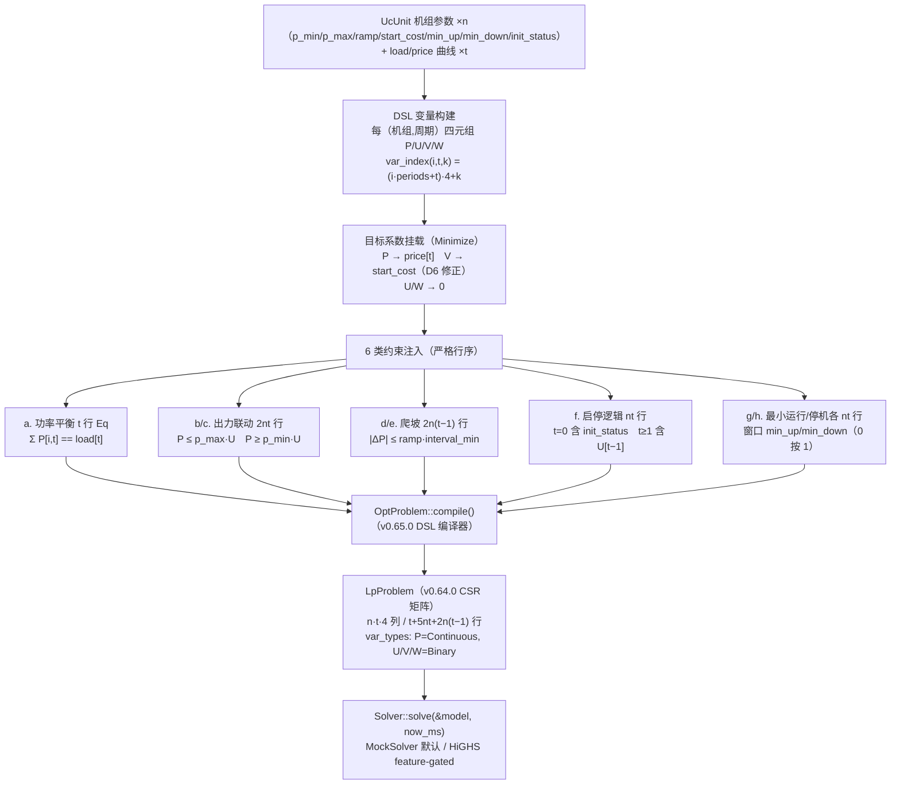
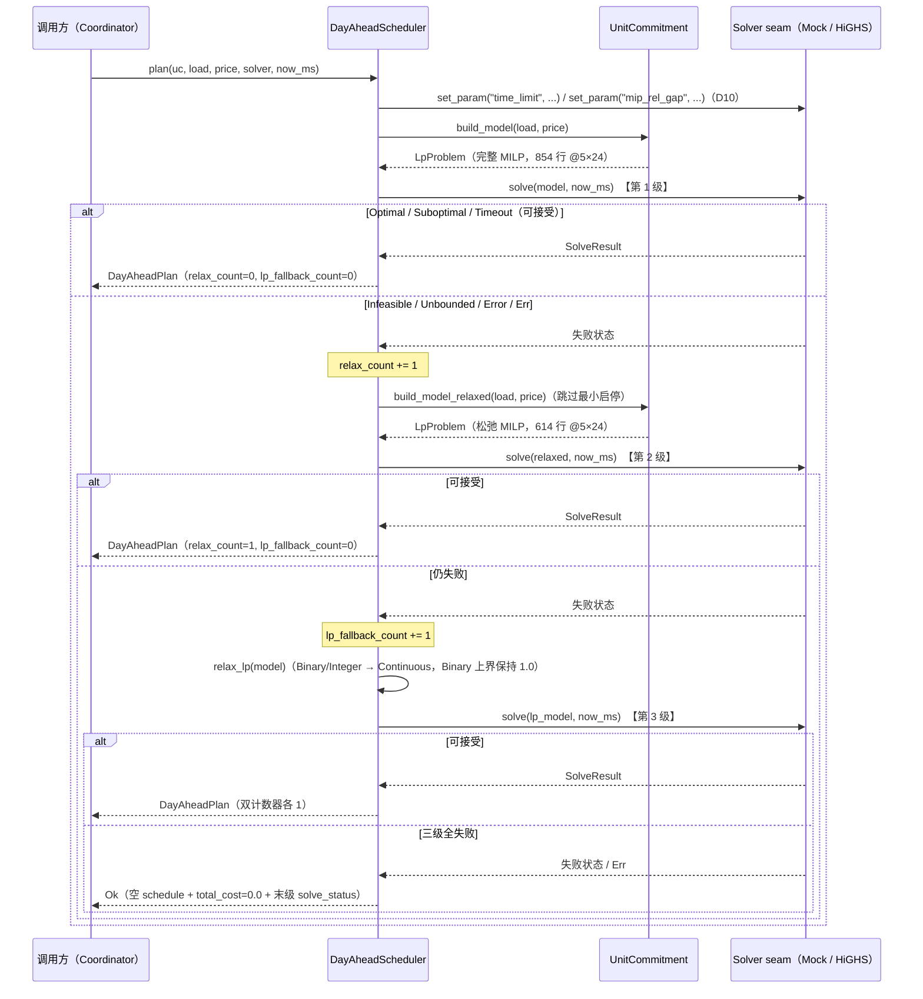

# EnerOS UC 机组组合 MILP 求解器设计 — UnitCommitment + DayAheadScheduler + 三级降级链

> **版本**：v0.102.0（P2-F Solver 扩展第 1 版：Solver 从 LP 扩展到 MILP）
> **crate**：`eneros-solver-milp`（`crates/ai/solver-milp/`）+ `eneros-solver-core` feature-gated FFI 增量
> **蓝图依据**：`蓝图/phase2.md` §v0.102.0（9 节齐全）
> **spec 依据**：`.trae/specs/develop-v10200-milp-solver/spec.md`（D1~D12 偏差声明源）
> **覆盖版本**：v0.102.0（无 v0.102.x 刚性子版本，Phase 2 刚性子版本仅 v0.98.1）
> **最后更新**：2026-07-19

---

## 1. 版本目标

### 1.1 一句话目标

将 EnerOS Solver 子系统从 LP（连续变量）扩展到 MILP（混合整数线性规划）：基于 v0.65.0 `OptProblem` DSL 与 v0.64.0 `LpProblem`（`var_types` 已含 Binary/Integer）构建机组组合（Unit Commitment, UC）日前调度 MILP 模型，实现机组启停 0-1 离散决策 + 日前计划生成 + 确定性三级降级链，为 v0.103.0 热启动 / v0.104.0 Pareto 多目标提供 MILP 基座。

### 1.2 详细描述

日前调度需要机组启停（UC）0-1 离散决策，v0.66.0 纯 LP（连续变量）无法表达"开/停机"：连续变量只能给出 [0, p_max] 区间内的出力值，无法刻画"机组在线/离线"的二元状态，启停成本（start_cost）与最小运行/停机时间约束均不可量化。蓝图 §v0.102.0 将本版本定位为 P2-F 第 1 版，业务价值为"日前路径支持混合整数规划，机组启停（UC）决策可量化经济性"，出口关联联邦多机协同的日前优化基础。

本版本交付三项核心能力：

| 能力 | 载体 | 说明 |
|------|------|------|
| UC MILP 建模 | `uc_model.rs`（`UcUnit` / `UnitCommitment`） | 每（机组, 周期）四元组 P/U/V/W 决策变量，6 类标准 UC 约束（D7 完整集，非蓝图桩），`build_model` 完整模型 / `build_model_relaxed` 松弛模型 |
| 日前计划生成 | `day_ahead.rs`（`UnitSchedule` / `DayAheadPlan` / `DayAheadScheduler`） | 注入 `&mut dyn Solver` seam 求解，解向量解析为各机组启停序列 + 出力序列 + 总成本 + 求解状态 |
| 确定性降级链 | `DayAheadScheduler::plan` | 完整 MILP →（失败）→ 松弛 MILP →（仍失败）→ LP 松弛；`relax_count` / `lp_fallback_count` 双计数器可观测（D9） |

同步交付 solver-core 的 feature-gated FFI 增量：`ffi.rs` 追加 `Highs_passMip` extern 声明，`highs.rs` `solve()` 在问题含非连续变量时分派 MILP 路径（纯连续问题走原 `Highs_passLp` 路径，LP 行为零变化，D5）。

本版本核心修正两处蓝图缺陷（详见 §5 技术交底与 §11 偏差声明）：

- **D6 蓝图 Bug 修正**：蓝图 §4.5 `col_cost[base+1] = start_cost` 注释自称"V 启动成本"，但 [P,U,V,W] 布局下 base+1=U，启动成本实际误挂 U。本实现按注释语义挂 V（base+2），U/W 目标系数为 0。
- **D7 约束桩补全**：蓝图 §4.5 `num_constraints = t + n·t·3` 为桩公式，`min_up/min_down/ramp_up/ramp_down/init_status` 字段不进约束则为死重。本实现构建完整标准 UC 约束集，总行数 `t + 5nt + 2n(t−1)`。

### 1.3 架构定位

| 维度 | 定位 |
|------|------|
| Phase | Phase 2 多机联邦 |
| 子系统 | P2-F Solver 扩展第 1 版（`crates/ai/` AI 子系统） |
| 平面 | 慢平面（Agent Runtime 分区，管理信息大区），日前计划粒度（如 24 周期 × 15 分钟） |
| 角色 | Solver 从 LP 扩展到 MILP 的基座版本：UC 建模 + 日前计划 + 降级链 |
| 上游版本 | v0.64.0 solver-core（Solver trait + LpProblem + MockSolver + highs-ffi）；v0.65.0 solver-model（DSL）；v0.66.0 energy-lp-model（LP 调度先例）；v0.96.0 Coordinator（日前计划消费方） |
| 下游版本 | v0.103.0 神经部分热启动（消费 MILP 基座 + 历史解）；v0.104.0 Pareto 多目标（MILP 基座上扩展多目标） |
| 部署形态 | 纯 Rust crate（no_std + alloc，零第三方依赖，零 unsafe）；真实求解经 solver-core `highs-ffi` feature 链接 HiGHS 1.7.2 C 库，默认构建 Mock 零 C 依赖 |

### 1.4 路线图链路

```
v0.64.0 Solver trait + LpProblem + HiGHS LP FFI
        │
        ▼
v0.65.0 建模 DSL（OptProblem / VarBuilder / LinearExpr / Constraint）
        │
        ▼
v0.66.0 能源 LP（储能连续变量调度，慢平面先例）
        │
        ▼
v0.102.0 UC MILP（本版本：启停 0-1 决策 + 日前计划 + 三级降级链）
        │  ├─ solver-core 增量：Highs_passMip 分派（feature-gated，D5）
        │
        ├──► v0.103.0 Solver 神经部分热启动（MILP 基座 + 历史解，加速 ≥30%）
        │
        └──► v0.104.0 Pareto 多目标（MILP 基座上扩展多目标权衡）
```

---

## 2. 前置依赖

### 2.1 版本依赖

| 依赖版本 | crate | 本版本复用项 | 复用方式 |
|---------|-------|-------------|---------|
| v0.64.0 | `eneros-solver-core` | `Solver` trait / `LpProblem`（`var_types` 已含 Binary/Integer，即 MILP 模型载体）/ `SolveResult` / `SolveStatus`（蓝图 `Feasible` 由既有 `Suboptimal` 承载）/ `SolverError` / `MockSolver` | path 依赖 `../solver-core`；D4 类型零重定义（v0.66.0 D8/D9 复用先例） |
| v0.65.0 | `eneros-solver-model` | `OptProblem` / `VarBuilder`（`.binary()` / `.range()`）/ `LinearExpr` / `Constraint`（Le/Ge/Eq）/ `compile()` | path 依赖 `../solver-model`；UC 模型经 DSL 构建后编译为 `LpProblem` |
| v0.66.0 | `eneros-energy-lp-model` | LP 调度先例（偏差先例体系：D3 蓝图 Bug 修正 / D4 安全访问 / D7 Mock 端到端 / D8/D9 类型复用） | 无代码依赖，方法论先例 |
| v0.96.0 | Coordinator | 日前计划消费方（蓝图 §2 前序） | 无代码依赖，`DayAheadPlan` 由其判定消费 |

### 2.2 外部依赖

| 依赖 | 版本 | 性质 | 说明 |
|------|------|------|------|
| HiGHS | 1.7.2（`HighsSolver::version()` 锁定） | C 库，MIT 开源 | 经 solver-core `highs-ffi` feature FFI 绑定；**feature-gated**，默认构建（Mock）零 C 依赖、零 unsafe；开源无出口限制（蓝图 §5.6，附录 §12.3） |

### 2.3 假设（蓝图 §2）

- 日前负荷预测曲线 `load: &[f64]` 与电价信号 `price: &[f64]` 可用，长度等于调度周期数 `periods`（长度不符时 `build_model` 返回 `Err(SolverError::InvalidProblem)`，D8）。
- 阻塞项说明：无 HiGHS FFI 则真实 MILP 无法运行——本版本以 `highs-ffi` feature-gated 隔离该依赖，默认构建与全部单元测试不依赖 C 库（D11）。

### 2.4 no_std 与工具链前提

- 本 crate：`#![cfg_attr(not(test), no_std)]` + `extern crate alloc`，仅使用 `alloc::*` 与 `core::*`，零第三方依赖，零 `unsafe`（FFI 增量在 solver-core `#[cfg(feature = "highs-ffi")]` 门控路径）。
- alloc 依赖 v0.11.0 用户堆；交叉编译目标 `aarch64-unknown-none`（记忆 §2.4.2 C8）。
- 测试模块内 `std`（`Instant` 性能测量）位于 `#[cfg(test)]` 下，项目惯例允许（checklist C15）。

---

## 3. 交付物清单

| # | 交付物 | 位置 | 说明 |
|---|--------|------|------|
| 1 | 新 crate `eneros-solver-milp` | `crates/ai/solver-milp/`（D1） | `src/uc_model.rs`（UcUnit / UnitCommitment / build_model / build_model_relaxed）+ `src/day_ahead.rs`（UnitSchedule / DayAheadPlan / DayAheadScheduler）+ `src/lib.rs`（模块声明 + 重导出 + crate 文档含 D1~D12 偏差表）；no_std + alloc，零第三方依赖，零 unsafe，无 `[features]` |
| 2 | solver-core FFI 增量 | `crates/ai/solver-core/src/ffi.rs` / `src/highs.rs`（D5） | `ffi.rs` 追加 `Highs_passMip` extern 声明（既有声明零改动）；`highs.rs` `solve()` 检测非连续 `var_types` 分派 `Highs_passMip`（Continuous→0 / Integer→1 / Binary→1）；全部 `#[cfg(feature = "highs-ffi")]` 门控，默认构建不编译 |
| 3 | solver-core 文档与描述 | `crates/ai/solver-core/src/lib.rs` / `Cargo.toml` | crate 文档追加 v0.102.0 一句说明（既有偏差表不动）；`highs-ffi` feature 语义从"LP FFI"扩展为"LP/MILP FFI"；description 追加 v0.102.0 |
| 4 | 求解参数配置 | `configs/milp-solver.toml` | `[milp]` 段 `time_limit_s`（默认 30.0，蓝图 §4.5）/ `mip_rel_gap` + 中文注释 ≥6 点（HiGHS 选型 / 超时返回当前最优 / 松弛链 D9 / 内存预算 ≤128MB / 性能口径 / 整数规模 n·t·4） |
| 5 | 设计文档 | `docs/ai/milp-solver-design.md`（本文档，D2） | 12 章节 + ≥2 Mermaid + D1~D12 偏差表 |
| 6 | 单元测试 31 个 | src 内嵌 `#[cfg(test)]`（D3，项目惯例） | `uc_model.rs` TU1~TU15（15 个）+ `day_ahead.rs` TD16~TD31（16 个） |
| 7 | 版本同步 | 根 `Cargo.toml` / `Makefile` / `.github/workflows/ci.yml` / `ci/src/gate.rs` | workspace version 0.101.0 → 0.102.0，members 追加 `"crates/ai/solver-milp"`；版本注释与 gate.rs 注释串尾 2 处同步 |

**无 BREAKING**：既有全部 crate 公共 API 零改动（solver-core 变更仅 feature-gated 追加；纯连续问题仍走 `Highs_passLp`，LP 路径行为与 v0.64.0 完全一致）。

---

## 4. 详细设计

### 4.1 决策变量布局

每（机组 i, 周期 t）创建四元组决策变量，索引公式（checklist C28 锁定）：

```
var_index(i, t, k) = (i · periods + t) · 4 + k
```

| k | 变量 | 类型 | 下界 | 上界 | 物理含义 |
|---|------|------|------|------|---------|
| 0 | P[i,t] | Continuous | 0.0 | `p_max_i` | 机组 i 周期 t 出力（MW） |
| 1 | U[i,t] | Binary | 0.0 | 1.0 | 运行状态（1=在线，0=离线） |
| 2 | V[i,t] | Binary | 0.0 | 1.0 | 启动动作（1=本周期启动） |
| 3 | W[i,t] | Binary | 0.0 | 1.0 | 停机动作（1=本周期停机） |

变量总数 `num_vars() = n · t · 4`（5 机组 × 24 周期 = 480；10 机组 × 24 周期 = 960）。`OptProblem::add_var` 按添加顺序分配索引，添加顺序严格对齐 `var_index` 布局（i 外层、t 内层、P/U/V/W 内序），编译后列索引一致。

### 4.2 目标函数（Minimize，D6 修正）

```
min  Σ_{i,t} ( price[t] · P[i,t]  +  start_cost_i · V[i,t] )
```

| 变量位 | 目标系数 | 说明 |
|--------|---------|------|
| P[i,t]（base+0） | `price[t]` | 发电成本（蓝图语义） |
| U[i,t]（base+1） | 0.0 | **D6**：蓝图 §4.5 误将 start_cost 挂此位，本实现置 0 |
| V[i,t]（base+2） | `start_cost_i` | **D6 修正**：启动成本挂 V（启动动作），与蓝图注释语义一致 |
| W[i,t]（base+3） | 0.0 | 停机动作不计成本 |

sense = `ObjectiveSense::Minimize`。TU5 断言锁定：`objective[var_index(2,5,2)] == 120.0`（机组 2 start_cost），U/W 位系数 == 0.0。

### 4.3 约束集（6 类 8 行组，D7 完整集）

设 n = 机组数，t = 周期数。约束严格按以下顺序注入（组内机组优先：i 外层、t 内层），编译为 CSR 矩阵后行区间固定：

| 组 | 类别 | 行区间 | 行数 | 约束形式 |
|----|------|--------|------|---------|
| a | ① 功率平衡 | `[0, t)` | t | `Eq(Σ_i P[i,t], load[t])`：各周期总出力 == 负荷 |
| b | ② 出力联动（pmax） | `[t, t+nt)` | nt | `Le(P[i,t] − p_max_i·U[i,t], 0)`：在线时出力不超额定 |
| c | ② 出力联动（pmin） | `[t+nt, t+2nt)` | nt | `Ge(P[i,t] − p_min_i·U[i,t], 0)`：在线时出力不低于最小技术出力 |
| d | ③ 爬坡（上行） | `[t+2nt, t+2nt+n(t−1))` | n(t−1) | `Le(P[i,t] − P[i,t−1], ramp_up_i · interval_min)` |
| e | ③ 爬坡（下行） | `[t+2nt+n(t−1), t+2nt+2n(t−1))` | n(t−1) | `Le(P[i,t−1] − P[i,t], ramp_down_i · interval_min)` |
| f | ④ 启停逻辑 | 接下 | nt | t=0：`Eq(V−W−U, −init_status)`（常数项进 RHS）；t≥1：`Eq(V[i,t]−W[i,t]−U[i,t]+U[i,t−1], 0)` |
| g | ⑤ 最小运行 | 接下 | nt | `Le(Σ_τ V[i,τ] − U[i,t], 0)`，窗口 τ ∈ [max(0, t+1−min_up), t] |
| h | ⑥ 最小停机 | 末 nt 行 | nt | `Le(Σ_τ W[i,τ] + U[i,t], 1)`，窗口 τ ∈ [max(0, t+1−min_down), t] |

**关键语义**：

- **爬坡量纲换算（D12）**：`ramp_up` / `ramp_down` 单位为 MW/min，乘 `interval_min`（分钟/周期）得 MW/周期，约束 RHS = `ramp · interval_min`。
- **t=0 启停逻辑**：`U[i,−1]` 由 `init_status` 代入，`V − W − U == −init`（init=true 时 RHS = −1.0，false 时 0.0）。
- **min_up/min_down == 0 按 1 处理**（checklist C43）：有效窗口 `min_up_eff = max(1, min_up)`，窗口 = 当期，不产生空表达式行。
- **总行数**：`t + 5nt + 2n(t−1)`（5×24 → 24 + 600 + 230 = **854**）；CSR 一致性 `row_start.len() == 行数 + 1`（855），`col_index` / `values` 等长于 nnz。
- **松弛模型**（`build_model_relaxed`）：跳过 g/h 两组（最小运行/停机），行数 `t + 3nt + 2n(t−1)`（5×24 → **614**），且为完整模型前 614 行的严格前缀（rhs 与 CSR 值逐元素一致，TU15 锁定）；与 `build_model` 复用同一构建路径（布尔开关 `include_min_time`，无代码复制，C45）。
- **输入校验（D8）**：`load.len() != periods` 或 `price.len() != periods` 返回 `Err(SolverError::InvalidProblem)`，no_std 禁 panic。

### 4.4 UC 建模流程（图 1）



### 4.5 DayAheadScheduler 状态机与三级降级链（D9/D10）

#### 4.5.1 状态判定

`DayAheadScheduler::plan` 对每次求解结果按下表分流：

| 求解返回 | 判定 | 动作 |
|---------|------|------|
| `Ok(Optimal)` / `Ok(Suboptimal)` / `Ok(Timeout)` | **可接受**（蓝图 §4.4 超时返回当前最优可行解） | 解析解向量 → 返回 `DayAheadPlan`，计数器不动 |
| `Ok(Infeasible)` / `Ok(Unbounded)` / `Ok(Error(_))` / `Err(_)` | 本级失败 | 进入下一级，对应计数器 += 1，**不传播 Err**（蓝图 §4.4 FFI 崩溃降级语义） |

#### 4.5.2 三级降级链

1. **第 1 级 完整 MILP**：`set_param("time_limit"/"mip_rel_gap")` 注入（D10，任何一次 solve 之前；注入失败直接传播，属配置错误不走降级链）→ `build_model` → `solve`。失败 → `relax_count += 1`，进入第 2 级。
2. **第 2 级 松弛 MILP**：`build_model_relaxed`（跳过最小运行/停机约束，614 行）→ `solve`。失败 → `lp_fallback_count += 1`，进入第 3 级。
3. **第 3 级 LP 松弛**：对第 1 级完整模型做 `relax_lp` 去整数化 → `solve`。可接受 → 解析返回；仍失败 → 返回 `Ok`（空 `schedule` + `total_cost = 0.0` + 末级 `solve_status`），`Err(_)` 转 `SolveStatus::Error(<末次错误描述>)` 承载——状态字段承载失败，上层 Coordinator 可判定，非静默吞没，非 panic。

#### 4.5.3 relax_lp 语义（checklist C48）

`DayAheadScheduler::relax_lp(model)`：Clone 源模型 → 全部 `var_types` 转 `Continuous`；原 **Binary** 变量位上界显式保持 1.0（Binary 本即 [0,1]，显式赋值兜底），P 位上界不动（仍 `p_max`）；objective / constraints / rhs / sense 等其余字段 Clone 透传；源模型不被修改（TD23 锁定）。

#### 4.5.4 结果解析

- `commitments[i][t] = (solution[var_index(i,t,1)] > 0.5)`（U 位严格大于 0.5 判定开机，TD17）
- `generation[i][t] = solution[var_index(i,t,0)]`（P 位解值透传，TD18）
- `total_cost = objective_value`；`solve_status` 透传末级求解状态（TD19/TD20）
- `schedule` 顺序与 `uc.units` 一致，`unit_id` 取自 `UcUnit.id`（TD26）
- 解向量安全访问 `.get().copied().unwrap_or(0.0)`，长度不足不 panic（D8，v0.66.0 D4 先例，TD27/C57）

#### 4.5.5 降级链时序（图 2）



### 4.6 solver-core MILP 分派（D5，feature-gated）

`highs.rs` `solve()` 在 `#[cfg(feature = "highs-ffi")]` 门控内增量分派：

```
has_integer = var_types 任一 != Continuous
├─ false → 原 Highs_passLp 路径（LP 行为零变化，checklist C18）
└─ true  → 构建 integrality 数组（Continuous→0 / Integer→1 / Binary→1，
           长度 == num_col，生命周期覆盖 FFI 调用，SAFETY 注释 C20）
           → Highs_passMip（签名 = Highs_passLp 参数 + 尾部 integrality: *const c_int）
```

`ffi.rs` 仅追加 `Highs_passMip` 一条 extern 声明，既有 Highs_create/destroy/passLp/run/getModelStatus/getObjectiveValue/getSolution/setStringOptionValue/setDoubleOptionValue 全部零改动（C17）；默认构建（Mock）不编译该路径（C21），`cargo build -p eneros-solver-core --features highs-ffi` 编译通过（C22）。

---

## 5. 技术交底

### 5.1 求解器选型对比（蓝图 §5.1）

| 求解器 | 开源许可 | MILP | 性能 | no_std FFI 可行性 | 国产化 / 出口限制 | 结论 |
|--------|---------|------|------|------------------|------------------|------|
| **HiGHS** | ✅ MIT | ✅ | 中高 | ✅ C API 成熟（`Highs_passLp`/`Highs_passMip`），v0.64.0 LP FFI 已落地，NonNull+Drop RAII 复用 | ✅ 开源软件，无出口限制（蓝图 §5.6） | ⭐ **采用** |
| CBC | ✅ EPL-2.0 | ✅ | 中 | ⚠️ 以 C++ 接口为主，C API 薄弱，no_std FFI 封装成本高 | ✅ 开源无出口限制 | 备选 |
| Gurobi | ❌ 商业许可 | ✅ | 高 | ⚠️ 闭源动态库 + 商业授权，边缘侧部署与审计不可控 | ❌ 商业授权与出口合规风险 | 排除 |
| LP 松弛 | ✅（复用 HiGHS LP 路径） | ❌ | 高 | ✅ 已具备 | ✅ | 精度不足（无法表达 0-1 启停），仅作降级链末级 |

选型结论：HiGHS 是唯一同时满足"开源 MILP + C API 成熟 + no_std FFI 已验证 + 无出口限制"的求解器；LP 松弛因无法表达离散启停决策被排除为主路径，但保留为降级链第 3 级（确定性兜底）。

### 5.2 LLM 必要性声明（蓝图 §43.7 P1-5）

**本版本不引入 LLM**。UC 日前计划是确定性混合整数优化问题：目标函数与 6 类约束均可线性精确建模，MILP 求解器可在多项式可界定的分支定界框架内给出可证明的最优/次优解，无需 LLM 介入。本版本属 **L1 主路径**（Solver-only），满足"实时控制不依赖 LLM"的架构约束。L2 增强路径（LLM + Solver 双脑）由意图解析/双脑联调链路与 v0.103.0 神经热启动承载，与本版本解耦；本版本不依赖 v0.59.0~v0.63.0 任何 LLM crate。

### 5.3 D6 蓝图 Bug 修正论证

蓝图 §4.5 `build_model` 关键代码原文：

```rust
// 蓝图 §4.5 原文（变量布局 [P, U, V, W]，base = (i*t + tt)*4）
col_cost[base] = price[tt];                    // P: 发电成本
col_cost[base + 1] = self.units[i].start_cost; // V: 启动成本  ← 注释与索引矛盾
```

矛盾点：蓝图自身声明的布局为 `[P, U, V, W]`（同段代码 `integrality[base+1..base+3] = true` 依次对应 U/V/W，且 `col_upper[base+1] = 1.0; // U: 二元`），则 `base+1` 是 **U（运行状态）** 而非 **V（启动动作）**。启动成本的正确语义是"每次启动动作发生一次计费"，应挂 V（base+2）；若挂 U，则机组每个在线周期都被重复计启动成本，目标函数语义错误，求解结果将系统性抑制机组在线、扭曲启停决策。

修正（本实现，TU5 断言锁定）：

| 位 | 蓝图（错误） | 本实现（D6 修正） |
|----|-------------|------------------|
| U（base+1） | `start_cost` | `0.0` |
| V（base+2） | `0.0` | `start_cost_i` |
| W（base+3） | `0.0` | `0.0` |

先例：v0.66.0 D3 蓝图数学错误修正（SOC 放电系数），同属"蓝图伪代码非权威，按语义/物理正确性修正"。

### 5.4 D7 约束桩补全论证

蓝图 §4.5 约束部分仅有注释"约束： 功率平衡、爬坡、最小启停时间（省略详细构建）"与桩公式 `num_constraints = t + n·t·3`。但蓝图 §4.1 `UcUnit` 声明了 `min_up/min_down/ramp_up/ramp_down/init_status` 字段——若这些字段不进约束则为死重，UC 语义不成立（无最小启停约束则机组可逐周期抖动，无爬坡约束则出力可阶跃）。按记忆 §4.4"瓶颈版本骨架可用，不能 stub"要求，本实现构建完整标准 UC 约束集（§4.3，6 类 8 行组，`t + 5nt + 2n(t−1)` 行），仅求解器以 Mock 替代（D11）。

### 5.5 关键技术

- **HiGHS FFI 安全封装**：复用 solver-core `NonNull<c_void>` 句柄 + `Drop` 调 `Highs_destroy` 的 RAII 模式；本版增量 `integrality` 数组长度 == num_col，生命周期覆盖 FFI 调用（SAFETY 注释，checklist C20）；FFI 单一归属 solver-core，不重复 extern 声明（Karpathy Simplicity First，D5）。
- **CSR 稀疏矩阵**：约束经 v0.65.0 `compile()` 产出 CSR（`row_start`/`col_index`/`values`），HiGHS 原生支持；UC 矩阵高度稀疏（平衡行 n 非零，联动/爬坡/启停行 2~4 非零，最小启停行 ≤ min_up+1 非零）。
- **求解时间控制（蓝图 §5.4 难点）**：`time_limit` + `mip_rel_gap` 双参数经 `Solver::set_param` 注入（D10）；Timeout 返回当前最优可行解并视为可接受；整数变量规模 n·t·4（10 机组 ×24 周期 = 960 变量 / 720 Binary）为 HiGHS 中等规模。

---

## 6. 测试计划

### 6.1 测试矩阵（31 个，src 内嵌 `#[cfg(test)]`，D3）

| 文件 | 编号 | 数量 | 覆盖 |
|------|------|------|------|
| uc_model.rs | TU1~TU15 | 15 | UcUnit/new 字段 / 变量数 n·t·4 / var_types 抽查 / 目标系数（D6 修正）/ 变量边界 / 平衡 t 行 / 联动 2nt 行 / 爬坡 2n(t−1) 行 / 启停 nt 行（含 t=0 init_status）/ 最小启停 2nt 行 / 总行数+CSR 一致性 / Minimize / 长度校验 Err / relaxed 行数 |
| day_ahead.rs | TD16~TD31 | 16 | e2e 5×24（蓝图 §6.2）/ commitments 阈值解析 / generation 解析 / total_cost / status 透传 / Infeasible→relax（计数+plan 来源）/ relax 失败→LP / relax_lp 类型转换+上界保持 / Err→降级链 / Optimal 零降级 / unit_id 顺序 / 2×3 手工解映射 / 全链 LP Ok 双计数 / 模型构建性能（Instant，cfg(test) std 允许）/ set_param 参数注入（记录型 stub）/ 三级全失败空 plan+末级状态 |

### 6.2 uc_model.rs 测试明细（TU1~TU15）

| 编号 | 测试 | 覆盖点 |
|------|------|--------|
| TU1 | `tu1_uc_unit_fields` | UcUnit 9 字段构造逐项断言 |
| TU2 | `tu2_unit_commitment_new` | new 三字段 + num_vars == n·t·4 + var_index 公式（含边界 (4,23,3)=479） |
| TU3 | `tu3_build_model_var_count` | 5×24 变量数 == 480，var_types/objective 等长 |
| TU4 | `tu4_var_types` | P Continuous、U/V/W Binary（首末机组抽查） |
| TU5 | `tu5_objective_coeffs` | **D6 修正断言**：P 系数 == price[t]，V 系数 == start_cost，U/W 系数 == 0 |
| TU6 | `tu6_var_bounds` | P ∈ [0, p_max]，U/V/W ∈ [0, 1] |
| TU7 | `tu7_power_balance_rows` | 平衡行 [0, t)：Eq 型、n 个非零、系数全 1.0、列为各机组 P |
| TU8 | `tu8_pmax_pmin_rows` | pmax 行 Le 型（U 系数 −p_max）/ pmin 行 Ge 型（U 系数 −p_min） |
| TU9 | `tu9_ramp_rows` | 爬坡行 rhs == ramp·interval_min（5×15=75），系数 ±1，相邻周期 P 列 |
| TU10 | `tu10_startup_logic_rows` | 启停逻辑：t=0 rhs == −init（Eq），t≥1 rhs == 0 且 4 非零（U[t−1]/U[t]/V/W） |
| TU11 | `tu11_min_up_down_rows` | 最小运行/停机窗口项数与 rhs（1 机组 × 8 周期小模型，CSR 列升序） |
| TU12 | `tu12_total_rows_and_csr` | 总行数 854（t+5nt+2n(t−1)）+ CSR 一致性（row_start 855、nnz 三数组等长） |
| TU13 | `tu13_sense_minimize` | 目标方向 == Minimize |
| TU14 | `tu14_invalid_input` | load/price 长度非法 → `Err(InvalidProblem)`（含 relaxed 路径），无 panic |
| TU15 | `tu15_relaxed_rows` | 松弛模型 614 行，且为完整模型前 614 行严格前缀（rhs/CSR 逐元素一致） |

### 6.3 day_ahead.rs 测试明细（TD16~TD31）

| 编号 | 测试 | 覆盖点 |
|------|------|--------|
| TD16 | `td16_e2e_5x24` | 端到端 5×24（蓝图 §6.2）：MockSolver 480 维最优解 → schedule 5×24，计数器双 0 |
| TD17 | `td17_commitments_threshold` | U 位 0.8→true / 0.2→false / 0.5→false（严格大于） |
| TD18 | `td18_generation_parse` | P 位解值 50.0 透传 generation |
| TD19 | `td19_total_cost` | total_cost == objective_value（1234.5） |
| TD20 | `td20_status_propagated` | Optimal/Suboptimal 均可接受并透传，计数器双 0 |
| TD21 | `td21_infeasible_triggers_relax` | Infeasible → relaxed 重解接受；relax_count=1 / lp=0；solve 调用 2 次 |
| TD22 | `td22_relax_fail_triggers_lp` | relaxed 仍 Infeasible → LP 松弛接受；双计数器各 1；solve 调用 3 次 |
| TD23 | `td23_relax_lp_types` | relax_lp：类型全 Continuous、原 Binary 位上界 1.0、P 位上界 p_max、源模型不被修改 |
| TD24 | `td24_err_triggers_chain` | `Err(RunFailed)` 触发降级链（不传播 Err） |
| TD25 | `td25_optimal_no_fallback` | 单次 Optimal 零降级，solve 仅 1 次 |
| TD26 | `td26_unit_id_order` | schedule 顺序与机组一致（"G1".."G5"） |
| TD27 | `td27_small_2x3_hand_mapped` | 2×3 手工解映射：U=1.0/P=50.0 → commitments/generation 正确定位 |
| TD28 | `td28_full_chain_lp_ok` | 完整链 Err → Infeasible → LP 松弛 Optimal，双计数各 1 |
| TD29 | `td29_build_perf_10x24` | **性能实测**：10×24 模型构建 < 1s（Instant，行数 1684 断言） |
| TD30 | `td30_param_injected` | 记录型 stub：set_param 以 "time_limit"/"mip_rel_gap" 键与配置值注入，且注入先于首次 solve |
| TD31 | `td31_all_fail_empty_plan` | 三级全 Err → Ok 空 plan + 末级 Error 状态 + 双计数各 1 |

### 6.4 测试 seam 与桩

- **MockSolver seam**：`plan()` 注入 `&mut dyn Solver`（C61），`MockSolver::with_result` 驱动单次结果路径（TD16~TD20/TD26/TD27）。
- **记录型 stub（RecordingSolver）**：结果队列 + 游标表达"第 k 次失败第 k+1 次成功"（MockSolver 每次返回同一结果无法表达），同时记录 `set_param` 键值对与 solve 调用计数，验证 D10 参数注入先于求解（TD21/TD22/TD24/TD25/TD28/TD30/TD31）。
- **now_ms 透传**：`plan(..., now_ms)` 透传 `solver.solve`（时钟注入惯例，C62）。

### 6.5 性能测试口径（D11，checklist C78）

- **模型构建 < 1s 为本版实测**：TD29 以 `std::time::Instant`（`#[cfg(test)]` 内 std 允许）实测 10 机组 × 24 周期（960 变量 / 1684 行）`build_model` 耗时 < 1s。
- **10 机组求解 < 5s 为 HiGHS 硬件集成验证项**（蓝图 §6.3/§7.2）：真实 HiGHS FFI 需编译 C 库，超出单元测试范围（v0.64.0 D7 / v0.66.0 D7 先例），本版**不实测、不声称实测**，留待 `highs-ffi` 硬件集成环境验证。
- GPU 规则：不涉及（蓝图 §6.6；Solver CPU 求解）。

---

## 7. 验收标准

| # | 验收项 | 标准 |
|---|--------|------|
| 1 | 单元测试 | `cargo test -p eneros-solver-milp` **31/31 通过**（TU1~TU15 + TD16~TD31） |
| 2 | 零回归 | `cargo test -p eneros-solver-core` 18/18 零回归；energy-lp-model 22 / solver-model 零回归；全 workspace 回归全绿 |
| 3 | 交叉编译 | `cargo build -p eneros-solver-milp --target aarch64-unknown-none -Z build-std=core,alloc -Z build-std-features=compiler-builtins-mem` 通过；solver-core 同命令通过；`cargo build -p eneros-solver-core --features highs-ffi` 编译通过 |
| 4 | 代码质量 | `cargo fmt --all -- --check` 通过；`cargo clippy --workspace --exclude eneros-kernel --exclude eneros-hello --all-targets -- -D warnings` 0 warning；`cargo deny check advisories licenses bans sources` 通过（零新增第三方依赖，SBOM 不变） |
| 5 | 功能验收（蓝图 §7.1） | 日前调度计划生成可用：e2e 5 机组 × 24 周期 plan 输出（TD16），`DayAheadPlan` 含各机组启停序列 + 出力序列 + 总成本 + 求解状态 |
| 6 | 性能口径（蓝图 §7.2） | 模型构建 < 1s 本版实测（TD29）；10 机组求解 < 5s 声明为 HiGHS 硬件集成验证项（D11） |
| 7 | 安全验收（蓝图 §7.3） | FFI 内存安全：复用 solver-core NonNull+Drop RAII，integrality 生命周期 SAFETY 注释；新 crate 零 unsafe、无 `use std::*`/`panic!`/`todo!`/`unimplemented!`/`async` |

---

## 8. 风险

| # | 风险 | 影响 | 缓解 |
|---|------|------|------|
| R1 | HiGHS C 库交叉编译依赖（蓝图 §8.2：编译环境） | `highs-ffi` 目标环境需交叉编译 HiGHS C 库，工具链复杂 | feature-gated 隔离：全部 FFI 增量位于 `#[cfg(feature = "highs-ffi")]` 门控内，默认构建（Mock）零 C 依赖、零 unsafe，CI 与单元测试不触碰 C 库；HiGHS 锁定 1.7.2（蓝图 §8.4 版本升级风险，`HighsSolver::version()` 锚定） |
| R2 | MILP 求解时间不可控（蓝图 §8.1：大规模 MILP 超时） | 整数规模 n·t·4 随机组数增长，分支定界最坏情况超时 | 三重保障：① `time_limit` 注入封顶求解时长（D10）；② `mip_rel_gap` 允许次优提前收敛；③ 三级降级链（relaxed → LP 松弛）确定性兜底，Timeout/Suboptimal 视为可接受（蓝图 §4.4 超时返回当前最优可行解） |
| R3 | 蓝图 D6/D7 缺陷传导 | 启动成本错挂 U 导致目标语义错误；约束桩导致 UC 语义不成立 | 已在 spec 评审锁定（D6/D7 偏差），TU5（目标系数）/ TU12（854 行）/ TU15（614 行前缀）断言固化，防回归 |
| R4 | 求解器内存占用（蓝图 §8.3） | 大规模 MILP 分支定界树内存膨胀 | 内存预算声明：Solver 分区 ≤ 128MB（蓝图 §5.6）；5×24 模型 480 列 / 854 行稀疏 CSR（KB 级）远低于预算；`time_limit` 间接约束分支定界树规模 |
| R5 | 降级链误触发掩盖模型缺陷 | 频繁降级使日前计划质量下降但无感知 | 双计数器可观测（`relax_count`/`lp_fallback_count` 字段化 metric，D9），上层 Coordinator 可统计降级频次并告警；三级全失败显式返回末级状态，非静默吞没 |

---

## 9. 多角度要求

| 角度 | 要求 | 落地 |
|------|------|------|
| **功能** | UC 建模完整 + 日前计划生成 | 6 类约束完整集（D7：功率平衡 / 出力联动 / 爬坡 / 启停逻辑 / 最小运行 / 最小停机），854 行 @5×24；e2e plan 输出（TD16）；启停 V/U/W + init_status 全字段生效（蓝图 §9 功能） |
| **可靠** | 超时降级保证 | 三级降级链（MILP → relaxed → LP 松弛）；Timeout/Suboptimal 接受（蓝图 §4.4）；三级全失败返回 Ok 空 plan + 末级状态（非 panic 非静默）；双计数器可观测（`relax_count`/`lp_fallback_count`） |
| **性能** | 构建快、求解有时限 | 模型构建 < 1s **本版实测**（TD29，10×24 → 960 变量 / 1684 行）；10 机组求解 < 5s 为 **HiGHS 硬件集成验证项**（D11，本版不实测）；`time_limit`/`mip_rel_gap` 双参数控制求解时长 |
| **安全** | FFI 内存安全 | solver-core 复用 NonNull 非空句柄 + Drop RAII（`Highs_destroy`）；integrality 数组长度 == num_col 且生命周期覆盖 FFI 调用（SAFETY 注释）；全部 FFI 增量 feature-gated，默认构建零 unsafe；**新 crate 零 unsafe**；解向量安全访问不 panic（D8） |
| **可维护** | 参数配置化 | `time_limit_s`/`mip_rel_gap` 由 `configs/milp-solver.toml` 配置、`DayAheadScheduler::new` 注入，代码无硬编码默认参数（C70）；`Solver::set_param` seam 归并，不新增 trait（D10） |
| **可观测** | 求解状态 metric | no_std 无 log crate，metric 字段化（D9）：`solve_status` 透传 + 双计数器累计降级频次 |
| **可扩展** | 支持更多机组 | 变量/约束规模线性（n·t·4 变量，t+5nt+2n(t−1) 行）；CSR 稀疏存储；10 机组规模已验证构建路径（TD29） |

---

## 10. 接口契约

与 `.trae/specs/develop-v10200-milp-solver/spec.md` 接口契约节逐字一致：

```rust
// uc_model.rs
pub struct UcUnit {
    pub id: String, pub p_min: f64, pub p_max: f64,
    pub ramp_up: f64, pub ramp_down: f64,          // MW/min
    pub start_cost: f64,
    pub min_up: usize, pub min_down: usize,         // 周期数；0 按 1 处理（窗口=当期）
    pub init_status: bool,
}  // Debug/Clone
pub struct UnitCommitment {
    pub units: Vec<UcUnit>, pub periods: usize, pub interval_min: u32,
}  // Debug/Clone
impl UnitCommitment {
    pub fn new(units: Vec<UcUnit>, periods: usize, interval_min: u32) -> Self;
    pub fn num_vars(&self) -> usize;                                  // n·t·4
    pub fn var_index(&self, unit: usize, period: usize, kind: usize) -> usize; // (i·t+t)·4+k
    pub fn build_model(&self, load: &[f64], price: &[f64]) -> Result<LpProblem, SolverError>;
    pub fn build_model_relaxed(&self, load: &[f64], price: &[f64]) -> Result<LpProblem, SolverError>; // 跳过最小启停
}

// day_ahead.rs
pub struct UnitSchedule {
    pub unit_id: String, pub commitments: Vec<bool>, pub generation: Vec<f64>,
}  // Debug/Clone
pub struct DayAheadPlan {
    pub schedule: Vec<UnitSchedule>, pub total_cost: f64, pub solve_status: SolveStatus,
}  // Debug/Clone
pub struct DayAheadScheduler {
    pub time_limit_s: f64, pub mip_rel_gap: f64,
    pub relax_count: u64, pub lp_fallback_count: u64,   // 可观测（D9）
}
impl DayAheadScheduler {
    pub fn new(time_limit_s: f64, mip_rel_gap: f64) -> Self;
    pub fn plan(
        &mut self, uc: &UnitCommitment, load: &[f64], price: &[f64],
        solver: &mut dyn Solver, now_ms: u64,
    ) -> Result<DayAheadPlan, SolverError>;
    pub fn relax_lp(model: &LpProblem) -> LpProblem;   // Binary/Integer → Continuous（上界保持 1.0）
}

// solver-core ffi.rs 增量（#[cfg(feature = "highs-ffi")])
extern "C" { pub fn Highs_passMip(highs: HighsPtr, /* 同 Highs_passLp 参数..., */ integrality: *const c_int) -> c_int; }
```

---

## 11. 偏差声明（D1~D12，相对蓝图 §3/§4/§5）

与 `.trae/specs/develop-v10200-milp-solver/spec.md` 偏差表逐字一致：

| 编号 | 偏差 | 理由 |
|------|------|------|
| **D1** | 蓝图 `crates/solver_milp/` → `crates/ai/solver-milp/` | 记忆 §2.3.1 强制：crate 归 `crates/<subsystem>/`；与 solver-core/solver-model/energy-lp-model 同 AI 子系统 |
| **D2** | 蓝图 `docs/phase2/milp_solver.md` → `docs/ai/milp-solver-design.md` | 记忆 §2.3.3 强制：文档按方向分类 |
| **D3** | 蓝图 `tests/milp_day_ahead.rs` → src 内嵌 `#[cfg(test)]` | v0.87.0~v0.101.0 项目惯例，不新增 tests/ 文件 |
| **D4** | 不重定义 `MilpSolver`/`MilpModel`/`MilpSolution`/`SolveStatus` | 复用 v0.64.0 `Solver` trait + `LpProblem`（`var_types` 已含 Binary/Integer，即 MILP 模型）+ `SolveResult` + `SolveStatus` + `SolverError`（v0.66.0 D8/D9 复用先例）；蓝图 `Feasible` 变体由既有 `Suboptimal` 承载 |
| **D5** | 蓝图 `highs_ffi.rs` 独立模块 → solver-core `ffi.rs`/`highs.rs` 增量 `Highs_passMip` + 分派 | 避免重复 extern 声明 Highs_create/destroy（Karpathy Simplicity First）；FFI 单一归属；全部 feature-gated，默认构建零 unsafe 零改动 |
| **D6** | **蓝图 Bug 修正**：§4.5 `col_cost[base+1] = start_cost`（注释自称"V 启动成本"，但布局 base+1=U）→ 启动成本挂 V（base+2），U/W 系数 0 | 矩阵布局 [P,U,V,W] 与成本挂载自相矛盾，按注释语义修正（v0.66.0 D3 蓝图 Bug 修正先例） |
| **D7** | 蓝图 `num_constraints = t + n·t·3` 桩 → 完整标准 UC 约束集：t + 5nt + 2n(t−1) | 蓝图 §4.1 `min_up/min_down/ramp_up/ramp_down/init_status` 字段若不进约束则为死重；"骨架可用"要求约束构建真实完整（仅求解器以 Mock 替代） |
| **D8** | `build_model` 返回 `Result<LpProblem, SolverError>`（蓝图为裸返回） | load/price 长度校验，no_std 禁 panic（v0.66.0 D4 安全访问先例） |
| **D9** | 错误处理落地为**状态驱动降级链**：Infeasible/Unbounded/Error → relaxed 重建 → LP 松弛；`relax_count`/`lp_fallback_count` 计数器替代告警日志 | no_std `panic = "abort"` 无 panic 钩子可挂（蓝图 §4.4"panic 钩子捕获"不适用）；no_std 无 log crate，metric 字段化（v0.99.0 D12/v0.101.0 D7 先例）；Timeout/Suboptimal 视为可接受（蓝图 §4.4 超时返回当前最优可行解） |
| **D10** | 蓝图 `MilpSolver::set_time_limit` → 复用 `Solver::set_param("time_limit"/"mip_rel_gap", ...)` seam | 接口归并，不新增 trait；`DayAheadScheduler::new(time_limit_s, mip_rel_gap)` 持参、plan 前注入 |
| **D11** | 测试用 `MockSolver`；性能基准测**模型构建**耗时（10×24 < 1s） | 真实 HiGHS FFI 需编译 C 库，超出单元测试范围（v0.64.0 D7/v0.66.0 D7 先例）；蓝图 §6.3"10 机组 < 5s"真实求解性能留待硬件集成验证，设计文档声明口径 |
| **D12** | `String`/`Vec` = `alloc::*`；`f64::INFINITY` = `core::f64`；`interval_min` 参与爬坡约束（ramp·interval_min = MW/周期） | no_std 合规；爬坡率单位 MW/min 换算每周期 MW |

---

## 12. 附录

### 12.1 上游复用关系

| 上游 | 复用内容 | 复用形式 |
|------|---------|---------|
| v0.64.0 `eneros-solver-core` | `Solver` trait（solve/set_param/name/version/status seam）/ `LpProblem` + `ConstraintMatrix` CSR / `VarType`（Continuous/Integer/Binary）/ `ObjectiveSense` / `SolveResult` / `SolveStatus` / `SolverError` / `MockSolver` | path 依赖 + 类型零重定义（D4）；本版 feature-gated 增量 `Highs_passMip` 分派反哺（D5），LP 路径零回归 |
| v0.65.0 `eneros-solver-model` | `OptProblem` / `VarBuilder`（`.binary()` / `.range()`）/ `LinearExpr` / `Constraint`（Le/Ge/Eq）/ `compile()` | path 依赖；UC 模型经 DSL 构建编译为 `LpProblem`，不重复实现编译器 |
| v0.66.0 `eneros-energy-lp-model` | LP 调度先例与偏差先例体系（D3 蓝图 Bug 修正 / D4 安全访问 / D7 Mock 端到端 / D8/D9 类型复用） | 方法论先例，无代码依赖；本版 D6/D8/D11 直接引用其先例 |
| v0.96.0 Coordinator | 日前计划消费方（蓝图 §2 前序） | 无代码依赖；`DayAheadPlan.solve_status` 承载失败状态供其判定（D9） |

### 12.2 下游解锁声明

| 下游版本 | 消费本版本的产出 | 解锁内容 |
|---------|----------------|---------|
| v0.103.0 Solver 神经部分热启动 | MILP 基座（`UnitCommitment`/`LpProblem` 含 Binary var_types）+ 历史 `DayAheadPlan` 解 | 神经启发式生成初始候选解注入 MILP 热启动，求解加速 ≥30%；无本版 MILP 基座则热启动无问题载体 |
| v0.104.0 Pareto 多目标 | MILP 基座 + 求解 seam | 在 UC MILP 上扩展多目标权衡（成本/排放/备用），Pareto 前沿生成 |

### 12.3 HiGHS 国产化声明（蓝图 §5.6）

HiGHS 为 MIT 许可的开源软件，无出口限制，满足信创/国产化合规要求（蓝图 §v0.102.0 §5.6"HiGHS 为开源软件，无出口限制"）。集成方式为 C API FFI（`highs-ffi` feature-gated），核心调度逻辑（建模/降级链/计划解析）全部自研 Rust no_std 代码，符合记忆 §5.5 默认集成清单"MILP/LP Solver 默认集成 HiGHS，仅 Rust FFI 封装 + 能源建模层自研"的选型决策。SBOM 经 `cargo deny check` 持续扫描，本版零新增第三方 Rust 依赖。

### 12.4 与 v0.66.0 energy-lp-model 的层次区分声明

| 维度 | v0.66.0 energy-lp-model | v0.102.0 solver-milp（本版本） |
|------|------------------------|-------------------------------|
| 对象 | 储能系统（BESS） | 发电机组群（UC 机组组合） |
| 变量 | 全连续（charge/discharge/soc） | 连续 P + **Binary U/V/W**（0-1 启停） |
| 问题类型 | LP | **MILP**（失败后降级 LP 松弛） |
| 时间尺度 | 日内/实时调度（96 时段 × 15min 慢平面） | **日前计划**（24 周期，启停决策） |
| 目标 | 最大化峰谷套利收益 | 最小化总成本（发电成本 + 启动成本） |
| 约束特征 | SOC 动态守恒 / 充放电爬坡 / 初终值 | 功率平衡 / 出力联动 / 爬坡 / 启停逻辑 / 最小运行停机 |

两者**互补不重叠**：储能 LP 无整数变量、面向连续功率调度；UC MILP 核心是离散启停决策、面向日前机组组合。两者共享 v0.64.0/v0.65.0 求解与建模底座，分别覆盖慢平面两类典型能源优化场景。

### 12.5 合规与预算声明汇总

| 项 | 声明 |
|----|------|
| no_std | `#![cfg_attr(not(test), no_std)]` + `extern crate alloc`；仅 `core::*`/`alloc::*`；零第三方依赖；零 unsafe（FFI 在 solver-core `highs-ffi` feature-gated 路径）；可交叉编译 `aarch64-unknown-none` |
| 内存预算 | Solver 分区 ≤ 128MB（蓝图 §5.6）；5×24 模型（480 列/854 行稀疏 CSR）为 KB 级，远低于预算 |
| GPU 规则 | 不涉及（蓝图 §6.6；Solver LP/MILP 为 CPU 求解，蓝图 §4.2 GPU 规则不适用） |
| LLM | 不引入（L1 纯 Solver 主路径，§5.2 必要性声明） |
| 测试性能口径 | 模型构建 <1s 本版实测（TD29）；10 机组求解 <5s 为 HiGHS 硬件集成验证项（D11），本版不实测 |

### 12.6 参考文件

- `蓝图/phase2.md` §v0.102.0 — 本版本蓝图原文（9 节）
- `.trae/specs/develop-v10200-milp-solver/spec.md` — 偏差声明与接口契约源
- `.trae/specs/develop-v10200-milp-solver/checklist.md` — C1~C105 验收清单
- `crates/ai/solver-milp/src/{lib,uc_model,day_ahead}.rs` — 本版实现
- `crates/ai/solver-core/src/{ffi,highs}.rs` — FFI 增量（feature-gated）
- `configs/milp-solver.toml` — 求解参数配置
- `docs/ai/solver-core-design.md` — v0.64.0 Solver trait + LpProblem 设计
- `docs/ai/solver-model-design.md` — v0.65.0 OptProblem DSL 设计
- `docs/ai/energy-lp-model-design.md` — v0.66.0 能源 LP 设计（层次区分参考）
- `e:\eneros\.trae\rules\记忆.md` §2.3/§4.3/§5.5/§5.6 — 目录规范 / no_std / 集成清单 / 内存预算
- HiGHS 开源 LP/MILP 求解器文档 — https://highs.dev/

---

> **文档结束**。本设计文档覆盖 v0.102.0 MILP 求解器集成的全部设计内容，含 12 章节 + 2 Mermaid 图（UC 建模流程图、三级降级链时序图）+ D1~D12 偏差表（12 行，与 spec.md 逐字一致）。D6 蓝图 Bug 修正（§5.3）与 D7 约束桩补全（§5.4）为本版本对蓝图的两处关键修正，已由 TU5/TU12/TU15 断言固化。
