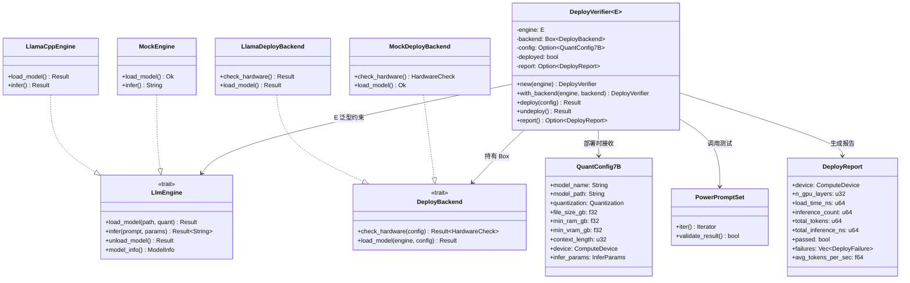
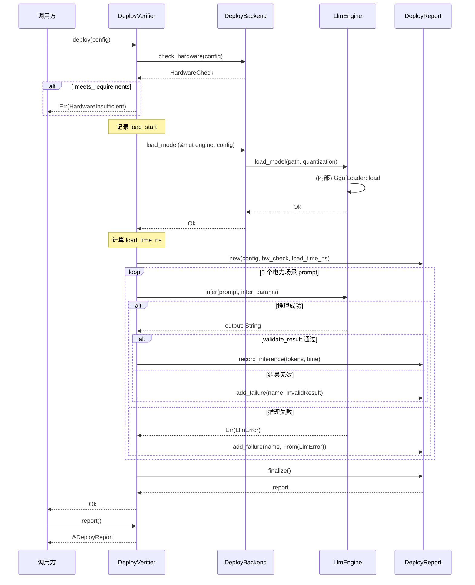

# EnerOS 7B INT4 量化模型部署设计 — QuantConfig7B + DeployVerifier + DeployBackend

> **版本**：v0.61.0（P1-I AI Runtime LLM 第三层，7B INT4 量化模型部署与验证）
> **crate**：`eneros-model-deploy`（`crates/ai/model-deploy/`）
> **蓝图依据**：`蓝图/phase1.md` §v0.61.0
> **最后更新**：2026-07-16

---

## 1. 版本目标

### 1.1 一句话目标

定义 7B INT4 量化模型的部署配置（`QuantConfig7B`）、部署验证器（`DeployVerifier<E: LlmEngine>`，泛型不绑定具体引擎）、硬件抽象后端（`DeployBackend` trait + `MockDeployBackend` 默认实现 + `LlamaDeployBackend` feature-gated 实现）、电力场景测试集（`PowerPromptSet`）与部署报告（`DeployReport`），将 v0.59.0 推理接口与 v0.60.0 模型加载能力组合为"可验证的端到端部署流程"，使 LLM 推理链路从"模型可用"进入"部署可验证"阶段。

### 1.2 详细描述

v0.59.0（[LlmEngine 设计文档](./llm-engine-design.md)）完成了 P1-I AI Runtime LLM 第一层：定义 `LlmEngine` trait（6 个方法）+ `MockEngine`（默认可用）+ `LlamaCppEngine`（feature-gated FFI 封装）。v0.60.0（[GgufLoader 设计文档](./gguf-loader-design.md)）完成了第二层：GGUF 模型文件解析、内存映射加载（`MmapBackend` 抽象）、模型卸载与内存统计。

本版本（v0.61.0）进入 P1-I LLM 第三层，专注于"部署可验证"：将"硬件检查 → 模型加载 → 多轮推理 → 指标采集 → 通过/失败判定"封装为标准化的 `DeployVerifier` 流程，使运维人员或 CI 可在部署目标机器（飞腾/鲲鹏/QEMU）上一键验证 7B INT4 模型是否可正常加载与推理。本版本不实现新的推理后端，而是复用 v0.59.0 `LlmEngine` 与 v0.60.0 `GgufLoader` 的能力，组合成可复用的部署验证工具。

双脑架构（蓝图 §9.x）中 LLM 是"感知者"，负责理解市场信号与自然语言指令并输出 JSON 意图，Solver（LP/MILP，v0.71.0 联调）是"执行者"。LLM 要在生产中可靠工作，必须在部署阶段就验证：硬件资源是否充足、模型文件是否可加载、电力场景 prompt 是否可正常推理且输出符合预期。本版本交付的 `DeployVerifier` 即承担此"部署闸门"职责——未通过部署验证的模型不得进入生产推理链路。

本版本交付七项核心产出：

| 产出 | 角色 | 默认可用 | 说明 |
|------|------|---------|------|
| `QuantConfig7B` | 7B INT4 部署配置 | ✅ | model_name / model_path / quantization / file_size_gb / min_ram_gb / min_vram_gb / context_length / device / infer_params |
| `DeployVerifier<E: LlmEngine>` | 部署验证器主结构 | ✅ | 泛型 over `LlmEngine`（D2），不绑定 `LlamaCppEngine` |
| `DeployBackend` trait | 硬件抽象后端 | ✅ | `check_hardware` + `load_model` 两个方法 |
| `MockDeployBackend` | 默认后端（CI 可测） | ✅ | 不做真实硬件检查，使用 `MockEngine`（D3/D12） |
| `LlamaDeployBackend` | 生产后端 | ❌ feature-gated | 通过 `LlmEngine::load_model` 加载真实模型（D3） |
| `PowerPrompt` / `PowerPromptSet` | 5 个电力场景测试 prompt | ✅ | 储能策略 / 价格响应 / 异常处理 / 负荷预测 / 故障诊断 |
| `DeployReport` / `DeployFailure` / `HardwareCheck` / `DeployError` | 报告与错误类型 | ✅ | 部署结果、失败记录、硬件检查、7 类错误 |

所有 Rust 代码必须 no_std（D1，蓝图 §43.1），仅使用 `core::*` / `alloc::*`，无 `std::*`。`DeployVerifier` 不实现 `Drop`（D8），采用显式 `deploy` / `undeploy` 接口，适配长时运行的部署状态。

### 1.3 路线图定位

v0.61.0 在 P1-I AI Runtime LLM 子系统的版本链中位置：

```
v0.59.0 (LlmEngine trait + MockEngine + LlamaCppEngine FFI)
    ↓
v0.60.0 (GgufLoader + MmapBackend + ModelMemoryManager)
    ↓
v0.61.0 (QuantConfig7B + DeployVerifier + DeployBackend)  ← 本版本
    ↓
v0.62.0 (INT4/INT8 量化配置、动态切换)
    ↓
v0.63.0 (Prompt 模板渲染、JSON 输出约束)
```

### 1.4 前置依赖

| 依赖版本 | 提供能力 | 本版本用途 |
|---------|---------|-----------|
| v0.59.0 | `LlmEngine` trait、`MockEngine`、`ComputeDevice`、`Quantization`、`InferParams`、`LlmError`、`ModelInfo`、`EngineStats` | `DeployVerifier<E: LlmEngine>` 泛型约束（D2）；复用 `Quantization` / `InferParams` / `ComputeDevice`（D11）；`From<LlmError>` 错误传播（D7） |
| v0.60.0 | `GgufLoader`、`MmapBackend`、`GgufMetadata`、`GgufTensorInfo` | `LlamaDeployBackend::load_model` 间接通过 `LlmEngine::load_model` 触发 `GgufLoader::load`（D11） |
| v0.11.0 | 用户堆（alloc 支持） | `String` / `Vec` 堆分配 |
| v0.26.0 | 配置服务 | 模型路径来源（`QuantConfig7B::model_path`） |

### 1.5 设计原则关联

| 原则 | 体现 |
|------|------|
| no_std 合规 | 全 crate 仅使用 `core::*` / `alloc::*`，无 `std::*`（D1，蓝图 §43.1） |
| 默认集成优先 | 复用 llama.cpp 推理后端（记忆文件 §5.5），不自研推理后端 |
| 可测试性 | `MockDeployBackend` + `MockEngine` 默认可用，CI 无 C 库环境下可编译/可测试（D3/D12） |
| GPU 优先 | GPU 加速通过 `n_gpu_layers` 追踪（`ComputeDevice` 来自 v0.59.0），非 PyTorch（D4） |
| 故障隔离 | 部署失败不阻塞流程，逐条 prompt 验证并记录 `DeployFailure`（D7） |
| 可观测 | `DeployReport` 8 字段统计（D5，普通 u64，无 AtomicU64） |
| 资源安全 | `DeployVerifier` 不实现 `Drop`，显式 `deploy` / `undeploy` 接口（D8） |
| 内存预算 | 对接蓝图 §43.6（LLM 7B INT4 ≤ 4GB），`HardwareCheck` 预检 RAM/VRAM |
| 复用优先 | 复用 v0.59.0 `Quantization` / `InferParams` / `ComputeDevice` / `LlmError`（D11），不重复定义 |

---

## 2. 架构定位

### 2.1 P1-I AI Runtime LLM 分层

P1-I AI Runtime LLM 子系统按"引擎接口 → 模型加载 → 推理调度 → 量化 → Prompt 模板"五层层级组织，本版本位于第三层：

| 层级 | 版本 | crate | 职责 |
|------|------|-------|------|
| 第一层（引擎接口） | v0.59.0 | `eneros-llm-engine` | `LlmEngine` trait + MockEngine + LlamaCppEngine FFI |
| 第二层（模型加载） | v0.60.0 | `eneros-gguf-loader` | GGUF 文件解析、内存映射加载、模型卸载、内存统计 |
| **第三层（部署验证）** | **v0.61.0** | **`eneros-model-deploy`** | **7B INT4 部署配置、部署验证器、硬件抽象后端、电力场景测试** |
| 第四层（量化） | v0.62.0 | （后续） | INT4/INT8 量化配置、动态切换 |
| 第五层（Prompt 模板） | v0.63.0 | （后续） | Prompt 模板渲染、JSON 输出约束 |

第三层组合第一层与第二层的能力：`DeployVerifier<E: LlmEngine>` 持有一个 `LlmEngine` 实例（第一层 trait），通过 `DeployBackend::load_model` 间接调用 `GgufLoader`（第二层）完成模型加载。本版本不引入新的推理后端，只引入"部署编排"逻辑。

### 2.2 与 LlmEngine 的关系

`DeployVerifier<E: LlmEngine>` 是泛型结构（D2），不绑定具体的 `LlmEngine` 实现：

- **测试场景**：`DeployVerifier<MockEngine>` + `MockDeployBackend` —— 纯 Rust，CI 可在无 C 库、无模型文件环境运行
- **生产场景**：`DeployVerifier<LlamaCppEngine>` + `LlamaDeployBackend`（feature-gated）—— 真实 7B INT4 模型加载与推理

上层（v0.71.0 双脑联调）可复用 `DeployVerifier` 验证部署状态后再启动推理链路。

### 2.3 与 GgufLoader 的关系

`DeployBackend::load_model` 不直接调用 `GgufLoader`，而是通过 `LlmEngine::load_model(path, quantization)` 间接触发：

```
DeployVerifier::deploy()
    └─ DeployBackend::load_model(&mut self.engine, &config)
        └─ E::load_model(path, quantization)   // E: LlmEngine
            └─ (内部) GgufLoader::load(path)    // v0.60.0
```

这种间接调用保证 `DeployBackend` 不直接依赖 `eneros-gguf-loader` crate，仅依赖 `eneros-llm-engine` trait（D11）。

### 2.4 双脑架构中的角色

双脑架构（蓝图 §9.x）中 LLM 与 Solver 的协作链路：

```
[市场信号/自然语言指令]
        │
        ▼
   ┌─────────────┐     ┌──────────────┐
   │  LLM 感知者  │ ──→ │  Solver 执行者 │
   │ (v0.59.0+)  │JSON │ (v0.71.0+)   │
   └─────────────┘     └──────────────┘
        ↑                     ↑
   [部署验证闸门]         [Solver 校验]
   v0.61.0 DeployVerifier
```

`DeployVerifier` 是 LLM 进入双脑链路前的"部署闸门"：未通过验证的模型不得参与推理，避免运行时才发现模型不可加载或推理失败。

---

## 3. QuantConfig7B 量化配置

### 3.1 结构定义

`QuantConfig7B` 是 7B INT4 量化模型的部署配置，承载部署所需的全部参数：

```rust
use alloc::string::String;
use crate::{Quantization, InferParams, ComputeDevice}; // 来自 v0.59.0（D11）

/// 7B INT4 量化模型部署配置
#[derive(Clone, Debug)]
pub struct QuantConfig7B {
    /// 模型名称（如 "Qwen2.5-7B-Instruct"）
    pub model_name: String,
    /// 模型文件路径（GGUF 文件绝对路径）
    pub model_path: String,
    /// 量化方式（默认 Q4_K_M）
    pub quantization: Quantization,
    /// 模型文件大小（GB）
    pub file_size_gb: f32,
    /// 最小 RAM 要求（GB）
    pub min_ram_gb: f32,
    /// 最小 VRAM 要求（GB，0 表示 CPU-only 部署）
    pub min_vram_gb: f32,
    /// 上下文长度（token 数）
    pub context_length: u32,
    /// 计算设备（CPU/Cuda/Metal/Npu）
    pub device: ComputeDevice,
    /// 推理参数（temperature 等）
    pub infer_params: InferParams,
}
```

### 3.2 字段说明

| 字段 | 类型 | 默认值 | 说明 |
|------|------|--------|------|
| `model_name` | `String` | `"Qwen2.5-7B-Instruct"` | 模型标识，用于日志与报告 |
| `model_path` | `String` | `""` | GGUF 文件路径，`deploy()` 时校验非空 |
| `quantization` | `Quantization` | `Quantization::Q4_K_M` | INT4 量化方式（v0.59.0 enum） |
| `file_size_gb` | `f32` | `4.0` | 模型文件大小，用于 `HardwareCheck` 估算 |
| `min_ram_gb` | `f32` | `8.0` | 最小 RAM（含加载缓冲区），低于此值 `HardwareInsufficient` |
| `min_vram_gb` | `f32` | `6.0` | 最小 VRAM（仅 GPU 部署时校验；CPU-only 时为 0） |
| `context_length` | `u32` | `4096` | 上下文窗口 |
| `device` | `ComputeDevice` | `ComputeDevice::Cpu` | 计算设备（D4：默认 CPU，GPU opt-in） |
| `infer_params` | `InferParams` | `temperature=0.1` | 推理参数（低温度保证输出稳定） |

### 3.3 Builder 方法

`QuantConfig7B` 提供 builder 风格的构造方法，遵循 no_std 下的"消费 self 返回 self"模式（D1）：

```rust
impl QuantConfig7B {
    /// 创建默认配置（Qwen2.5-7B-Instruct, Q4_K_M, CPU）
    pub fn new(model_name: &str, model_path: &str) -> Self {
        Self {
            model_name: String::from(model_name),
            model_path: String::from(model_path),
            quantization: Quantization::Q4_K_M,
            file_size_gb: 4.0,
            min_ram_gb: 8.0,
            min_vram_gb: 6.0,
            context_length: 4096,
            device: ComputeDevice::Cpu,
            infer_params: InferParams::default(),
        }
    }

    /// 设置计算设备（D4：启用 GPU 优先策略）
    pub fn with_device(mut self, device: ComputeDevice) -> Self {
        self.device = device;
        self
    }

    /// 设置模型路径
    pub fn with_path(mut self, path: &str) -> Self {
        self.model_path = String::from(path);
        self
    }

    /// 设置量化方式
    pub fn with_quantization(mut self, q: Quantization) -> Self {
        self.quantization = q;
        self
    }

    /// 设置上下文长度
    pub fn with_context_length(mut self, len: u32) -> Self {
        self.context_length = len;
        self
    }

    /// 设置推理参数
    pub fn with_infer_params(mut self, params: InferParams) -> Self {
        self.infer_params = params;
        self
    }
}
```

### 3.4 默认配置示例

```rust
// 默认配置（CPU-only 部署）
let config = QuantConfig7B::new("Qwen2.5-7B-Instruct", "/models/qwen2.5-7b-instruct-q4_k_m.gguf");

// GPU 优先配置（D4）
let config_gpu = QuantConfig7B::new("Qwen2.5-7B-Instruct", "/models/qwen2.5-7b-instruct-q4_k_m.gguf")
    .with_device(ComputeDevice::Cuda);
```

---

## 4. DeployVerifier 部署验证器

### 4.1 泛型设计（D2）

`DeployVerifier` 泛型 over `LlmEngine`，不绑定具体的 `LlamaCppEngine`：

```rust
use crate::LlmEngine; // 来自 v0.59.0

/// 部署验证器
///
/// 泛型参数 `E` 约束为 `LlmEngine`，使验证器可用于任意推理引擎实现：
/// - 测试场景：`DeployVerifier<MockEngine>` + `MockDeployBackend`
/// - 生产场景：`DeployVerifier<LlamaCppEngine>` + `LlamaDeployBackend`（feature-gated）
pub struct DeployVerifier<E: LlmEngine> {
    /// 推理引擎实例
    engine: E,
    /// 部署后端
    backend: Box<dyn DeployBackend>,
    /// 当前配置（deploy 后填充）
    config: Option<QuantConfig7B>,
    /// 部署状态：是否已部署
    deployed: bool,
    /// 部署报告（finalize 后填充）
    report: Option<DeployReport>,
}
```

### 4.2 构造方法

```rust
impl<E: LlmEngine> DeployVerifier<E> {
    /// 默认构造：使用 `MockDeployBackend`（D12，CI 可测）
    pub fn new(engine: E) -> Self {
        Self::with_backend(engine, Box::new(MockDeployBackend::new()))
    }

    /// 自定义后端构造（用于 `LlamaDeployBackend` 等生产后端）
    pub fn with_backend(engine: E, backend: Box<dyn DeployBackend>) -> Self {
        Self {
            engine,
            backend,
            config: None,
            deployed: false,
            report: None,
        }
    }
}
```

### 4.3 deploy 流程

`deploy()` 是核心方法，执行完整的部署验证流程：

```rust
impl<E: LlmEngine> DeployVerifier<E> {
    /// 执行部署验证
    ///
    /// 流程：硬件检查 → 加载模型 → 运行测试 prompt → 采集指标 → 生成报告
    pub fn deploy(&mut self, config: QuantConfig7B) -> Result<(), DeployError> {
        // 1. 硬件检查
        let hw_check = self.backend.check_hardware(&config)?;
        if !hw_check.meets_requirements {
            return Err(DeployError::HardwareInsufficient);
        }

        // 2. 加载模型（通过 DeployBackend 间接调用 LlmEngine::load_model）
        let load_start = current_time_ns();
        self.backend.load_model(&mut self.engine, &config)?;
        let load_time_ns = current_time_ns() - load_start;

        // 3. 初始化报告
        let mut report = DeployReport::new(&config, hw_check, load_time_ns);

        // 4. 运行电力场景测试 prompt
        for prompt in PowerPromptSet::default().iter() {
            match self.engine.infer(prompt.prompt_str(), &config.infer_params) {
                Ok(output) => {
                    if PowerPromptSet::validate_result(prompt, &output) {
                        report.record_inference(output.len() as u64, infer_time_ns);
                    } else {
                        report.add_failure(prompt.name(), DeployError::InvalidResult);
                    }
                }
                Err(e) => {
                    report.add_failure(prompt.name(), DeployError::from(e));
                }
            }
        }

        // 5. 生成报告
        report.finalize();
        self.report = Some(report);
        self.deployed = true;
        self.config = Some(config);

        Ok(())
    }

    /// 卸载部署（D8：显式 undeploy，不实现 Drop）
    pub fn undeploy(&mut self) -> Result<(), DeployError> {
        if !self.deployed {
            return Err(DeployError::NotDeployed);
        }
        self.engine.unload_model()?;
        self.deployed = false;
        Ok(())
    }

    /// 获取部署报告
    pub fn report(&self) -> Option<&DeployReport> {
        self.report.as_ref()
    }
}
```

### 4.4 不实现 Drop（D8）

`DeployVerifier` 不实现 `Drop` trait，原因：

1. **长时运行状态**：部署验证器可能长期持有模型（如生产环境的部署监控），`Drop` 自动卸载会破坏长时运行语义
2. **显式控制**：调用方应在不需要时显式调用 `undeploy()`，使资源释放时机明确
3. **错误可观测**：`undeploy()` 返回 `Result<(), DeployError>`，卸载失败可被上层捕获；`Drop` 无法返回错误

### 4.5 类图（Mermaid）



---

## 5. DeployBackend 抽象

### 5.1 trait 定义

`DeployBackend` 是硬件抽象后端，封装"硬件检查"与"模型加载"两个与具体环境相关的操作：

```rust
use crate::LlmEngine;

/// 部署后端抽象
///
/// 抽象两类环境相关操作：
/// 1. `check_hardware`：检查 RAM/VRAM 是否满足 `QuantConfig7B` 要求
/// 2. `load_model`：通过 `LlmEngine::load_model` 加载模型（间接调用 v0.60.0 GgufLoader）
pub trait DeployBackend {
    /// 硬件检查
    fn check_hardware(&self, config: &QuantConfig7B) -> Result<HardwareCheck, DeployError>;

    /// 加载模型
    ///
    /// 通过 `engine.load_model(path, quantization)` 间接加载，
    /// 不直接依赖 `eneros-gguf-loader` crate（D11）。
    fn load_model(&self, engine: &mut dyn LlmEngine, config: &QuantConfig7B) -> Result<(), DeployError>;
}
```

### 5.2 HardwareCheck 结构

```rust
/// 硬件检查结果
#[derive(Clone, Debug)]
pub struct HardwareCheck {
    /// 可用 RAM（GB）
    pub ram_gb: f32,
    /// 可用 VRAM（GB，CPU-only 时为 0）
    pub vram_gb: f32,
    /// 是否满足 `QuantConfig7B` 要求
    pub meets_requirements: bool,
}
```

### 5.3 MockDeployBackend（默认，D3/D12）

`MockDeployBackend` 是默认后端，不做真实硬件检查，使用 `MockEngine`：

```rust
/// 默认部署后端（CI 可测，D3/D12）
///
/// - 不做真实硬件检查（返回固定值，meets_requirements=true）
/// - 不加载真实模型（`load_model` 直接返回 Ok）
/// - 适用于 CI 环境（无 C 库、无模型文件）
pub struct MockDeployBackend {
    /// 模拟可用 RAM（GB）
    pub mock_ram_gb: f32,
    /// 模拟可用 VRAM（GB）
    pub mock_vram_gb: f32,
}

impl Default for MockDeployBackend {
    fn default() -> Self {
        Self {
            mock_ram_gb: 16.0, // 默认 16GB RAM（高于 min_ram_gb=8）
            mock_vram_gb: 8.0, // 默认 8GB VRAM（高于 min_vram_gb=6）
        }
    }
}

impl DeployBackend for MockDeployBackend {
    fn check_hardware(&self, config: &QuantConfig7B) -> Result<HardwareCheck, DeployError> {
        let meets = self.mock_ram_gb >= config.min_ram_gb
            && (config.min_vram_gb == 0.0 || self.mock_vram_gb >= config.min_vram_gb);
        Ok(HardwareCheck {
            ram_gb: self.mock_ram_gb,
            vram_gb: self.mock_vram_gb,
            meets_requirements: meets,
        })
    }

    fn load_model(&self, _engine: &mut dyn LlmEngine, _config: &QuantConfig7B) -> Result<(), DeployError> {
        Ok(()) // 模拟加载成功
    }
}
```

### 5.4 LlamaDeployBackend（feature-gated，D3）

`LlamaDeployBackend` 是生产后端，通过 `LlmEngine::load_model` 加载真实模型：

```rust
#[cfg(feature = "llama-cpp")]
pub struct LlamaDeployBackend {
    /// 实际可用 RAM（GB），由 `check_hardware` 探测
    pub available_ram_gb: f32,
    /// 实际可用 VRAM（GB），由 `check_hardware` 探测
    pub available_vram_gb: f32,
}

#[cfg(feature = "llama-cpp")]
impl DeployBackend for LlamaDeployBackend {
    fn check_hardware(&self, config: &QuantConfig7B) -> Result<HardwareCheck, DeployError> {
        let meets = self.available_ram_gb >= config.min_ram_gb
            && (config.min_vram_gb == 0.0 || self.available_vram_gb >= config.min_vram_gb);
        Ok(HardwareCheck {
            ram_gb: self.available_ram_gb,
            vram_gb: self.available_vram_gb,
            meets_requirements: meets,
        })
    }

    fn load_model(&self, engine: &mut dyn LlmEngine, config: &QuantConfig7B) -> Result<(), DeployError> {
        // 间接调用 LlmEngine::load_model（D11）
        // 内部触发 v0.60.0 GgufLoader::load
        engine.load_model(&config.model_path, config.quantization)
            .map_err(DeployError::from)
    }
}
```

### 5.5 deploy 流程时序图（Mermaid）



---

## 6. PowerPromptSet 电力场景测试

### 6.1 PowerPrompt 结构

```rust
use alloc::string::String;

/// 电力场景测试 prompt
#[derive(Clone, Debug)]
pub struct PowerPrompt {
    /// prompt 名称（如 "storage_strategy"）
    pub name: String,
    /// prompt 内容
    pub prompt: String,
    /// 期望输出的关键词列表（用于 `validate_result`）
    pub expected_keywords: &'static [&'static str],
}

impl PowerPrompt {
    pub fn name(&self) -> &str {
        &self.name
    }

    pub fn prompt_str(&self) -> &str {
        &self.prompt
    }
}
```

### 6.2 5 个电力场景 prompt

`PowerPromptSet` 包含 5 个覆盖能源行业核心场景的测试 prompt：

| # | 场景 | prompt 名称 | 验证关键词 | 说明 |
|---|------|-----------|-----------|------|
| 1 | 储能策略 | `storage_strategy` | `["充放电", "SOC", "策略"]` | 储能充放电策略制定 |
| 2 | 价格响应 | `price_response` | `["电价", "需求", "响应"]` | 市场价格信号响应 |
| 3 | 异常处理 | `anomaly_handling` | `["异常", "告警", "处理"]` | 设备异常识别与处置 |
| 4 | 负荷预测 | `load_forecast` | `["负荷", "预测", "时段"]` | 短期负荷预测 |
| 5 | 故障诊断 | `fault_diagnosis` | `["故障", "诊断", "原因"]` | 设备故障根因分析 |

```rust
/// 电力场景测试集
pub struct PowerPromptSet {
    prompts: [PowerPrompt; 5],
}

impl Default for PowerPromptSet {
    fn default() -> Self {
        Self {
            prompts: [
                PowerPrompt {
                    name: String::from("storage_strategy"),
                    prompt: String::from(
                        "你是一名储能电站运维专家。当前电池 SOC 为 60%，电价为峰时段，请给出充放电策略建议。"
                    ),
                    expected_keywords: &["充放电", "SOC", "策略"],
                },
                PowerPrompt {
                    name: String::from("price_response"),
                    prompt: String::from(
                        "你是一名电力市场交易专家。当前现货电价上涨 30%，需求侧响应已启动，请给出响应建议。"
                    ),
                    expected_keywords: &["电价", "需求", "响应"],
                },
                PowerPrompt {
                    name: String::from("anomaly_handling"),
                    prompt: String::from(
                        "你是一名电力设备运维专家。某变压器油温告警 85℃，请给出异常处理建议。"
                    ),
                    expected_keywords: &["异常", "告警", "处理"],
                },
                PowerPrompt {
                    name: String::from("load_forecast"),
                    prompt: String::from(
                        "你是一名电力负荷预测专家。请根据昨日负荷曲线，预测今日 10:00-12:00 的负荷水平。"
                    ),
                    expected_keywords: &["负荷", "预测", "时段"],
                },
                PowerPrompt {
                    name: String::from("fault_diagnosis"),
                    prompt: String::from(
                        "你是一名电力故障诊断专家。某线路电流突增且电压下降，请诊断可能的故障原因。"
                    ),
                    expected_keywords: &["故障", "诊断", "原因"],
                },
            ],
        }
    }
}

impl PowerPromptSet {
    /// 返回 prompt 迭代器
    pub fn iter(&self) -> impl Iterator<Item = &PowerPrompt> {
        self.prompts.iter()
    }

    /// 验证推理结果
    ///
    /// 规则：输出非空 + 至少包含一个期望关键词
    pub fn validate_result(prompt: &PowerPrompt, output: &str) -> bool {
        if output.is_empty() {
            return false;
        }
        prompt.expected_keywords.iter().any(|kw| output.contains(kw))
    }
}
```

### 6.3 可扩展性

`PowerPromptSet` 支持自定义扩展，便于上层版本（如 v0.63.0 Prompt 模板）注入更多场景：

```rust
impl PowerPromptSet {
    /// 自定义构造（用于扩展场景）
    pub fn new(prompts: [PowerPrompt; 5]) -> Self {
        Self { prompts }
    }
}
```

---

## 7. DeployReport 部署报告

### 7.1 结构定义

```rust
use alloc::vec::Vec;
use crate::ComputeDevice; // 来自 v0.59.0

/// 部署验证报告
#[derive(Clone, Debug)]
pub struct DeployReport {
    /// 部署设备
    pub device: ComputeDevice,
    /// GPU 层数（D4：Cpu=0, Cuda/Metal/Npu=99）
    pub n_gpu_layers: u32,
    /// 模型加载耗时（纳秒）
    pub load_time_ns: u64,
    /// 推理次数
    pub inference_count: u64,
    /// 总 token 数
    pub total_tokens: u64,
    /// 总推理耗时（纳秒）
    pub total_inference_ns: u64,
    /// 平均 token/秒
    pub avg_tokens_per_sec: f64,
    /// 是否通过（所有 prompt 推理成功且结果有效）
    pub passed: bool,
    /// 失败记录列表
    pub failures: Vec<DeployFailure>,
}
```

### 7.2 DeployFailure 与 HardwareCheck

```rust
/// 部署失败记录
#[derive(Clone, Debug)]
pub struct DeployFailure {
    /// 失败的 prompt 名称
    pub prompt: String,
    /// 失败原因
    pub error: DeployError,
}

/// 硬件检查结果（同 §5.2）
#[derive(Clone, Debug)]
pub struct HardwareCheck {
    pub ram_gb: f32,
    pub vram_gb: f32,
    pub meets_requirements: bool,
}
```

### 7.3 报告方法

```rust
impl DeployReport {
    /// 初始化报告
    pub fn new(config: &QuantConfig7B, hw_check: HardwareCheck, load_time_ns: u64) -> Self {
        let n_gpu_layers = match config.device {
            ComputeDevice::Cpu => 0,
            ComputeDevice::Cuda | ComputeDevice::Metal | ComputeDevice::Npu => 99,
        };
        Self {
            device: config.device,
            n_gpu_layers,
            load_time_ns,
            inference_count: 0,
            total_tokens: 0,
            total_inference_ns: 0,
            avg_tokens_per_sec: 0.0,
            passed: true, // 初始为 true，失败时置 false
            failures: Vec::new(),
        }
    }

    /// 记录一次推理（成功且结果有效）
    pub fn record_inference(&mut self, tokens: u64, infer_time_ns: u64) {
        self.inference_count += 1;
        self.total_tokens += tokens;
        self.total_inference_ns += infer_time_ns;
    }

    /// 记录一次失败
    pub fn add_failure(&mut self, prompt: &str, error: DeployError) {
        self.passed = false;
        self.failures.push(DeployFailure {
            prompt: String::from(prompt),
            error,
        });
    }

    /// 完成报告，计算 `avg_tokens_per_sec`
    pub fn finalize(&mut self) {
        if self.total_inference_ns > 0 {
            let secs = self.total_inference_ns as f64 / 1_000_000_000.0;
            self.avg_tokens_per_sec = self.total_tokens as f64 / secs;
        }
    }
}
```

### 7.4 avg_tokens_per_sec 计算公式

```
avg_tokens_per_sec = total_tokens / (total_inference_ns / 1_000_000_000)
                  = total_tokens * 1_000_000_000 / total_inference_ns
```

注意：仅统计成功的推理（失败的不计入 `total_tokens` / `total_inference_ns`）。

### 7.5 通过/失败语义

| 状态 | `passed` | 说明 |
|------|----------|------|
| 通过 | `true` | 所有 5 个 prompt 推理成功且结果有效（`failures` 为空） |
| 失败 | `false` | 至少一个 prompt 推理失败或结果无效（`failures` 非空） |

---

## 8. GPU 策略

### 8.1 D4：n_gpu_layers 追踪

GPU 加速通过 `n_gpu_layers` 字段追踪（`ComputeDevice` 来自 v0.59.0），不使用 PyTorch（蓝图 §4.2）：

| `ComputeDevice` | `n_gpu_layers` | 说明 |
|-----------------|----------------|------|
| `Cpu` | `0` | 纯 CPU 推理（默认） |
| `Cuda` | `99` | GPU 全量 offload（Nvidia） |
| `Metal` | `99` | GPU 全量 offload（Apple） |
| `Npu` | `99` | NPU 全量 offload（飞腾/华为） |

`n_gpu_layers=99` 表示将所有 transformer 层 offload 到 GPU/NPU，由 llama.cpp C 库内部实现（非 Rust 侧调用 `model.to("cuda")`）。

### 8.2 GPU 是 opt-in（默认 CPU，D12）

默认配置 `ComputeDevice::Cpu`，`n_gpu_layers=0`，纯 CPU 推理。原因：

1. **CI 可测**：CI 环境无 GPU，默认 CPU 保证 CI 可运行（D12）
2. **降级友好**：CPU-only 是 L1 路径的最低保障，GPU 是 L2 增强路径
3. **资源可控**：GPU 资源稀缺，默认不占用，需要时显式启用

### 8.3 启用 GPU 优先

通过 `QuantConfig7B::with_device(ComputeDevice::Cuda)` 启用 GPU：

```rust
// GPU 优先配置
let config = QuantConfig7B::new("Qwen2.5-7B-Instruct", "/models/qwen.gguf")
    .with_device(ComputeDevice::Cuda);

// deploy 时，DeployReport.n_gpu_layers = 99
verifier.deploy(config)?;
```

### 8.4 与项目规则 §4.2 的关系

项目记忆文件 §4.2 明确：

> **边缘 LLM 推理**：有 NPU/GPU → llama.cpp GPU 后端；无 → CPU + INT4 量化
> **边缘 LLM 用 PyTorch** → 违反 no_std + 内存爆炸；边缘推理必须用 llama.cpp

本版本的 GPU 策略完全符合：

- 使用 llama.cpp C 库的 GPU 后端（通过 `LlamaCppEngine` FFI）
- 不使用 PyTorch（`model.to("cuda")`）
- GPU 不可用时降级到 CPU + INT4 量化（`ComputeDevice::Cpu` + `Quantization::Q4_K_M`）

---

## 9. 错误处理

### 9.1 D7：DeployError 7 variants

```rust
use alloc::string::String;
use crate::LlmError; // 来自 v0.59.0

/// 部署错误
#[derive(Clone, Debug)]
pub enum DeployError {
    /// 硬件资源不足
    HardwareInsufficient,
    /// 模型加载失败
    ModelLoadFailed,
    /// 推理失败
    InferenceFailed,
    /// 推理结果无效（如输出为空或不包含期望关键词）
    InvalidResult,
    /// 部署超时
    Timeout,
    /// 后端错误
    BackendError(String),
    /// 未部署（调用 undeploy 但当前未部署）
    NotDeployed,
}
```

### 9.2 From\<LlmError\> 转换

```rust
impl From<LlmError> for DeployError {
    fn from(e: LlmError) -> Self {
        match e {
            LlmError::ModelNotLoaded => DeployError::ModelLoadFailed,
            LlmError::InferenceFailed(_) => DeployError::InferenceFailed,
            LlmError::Timeout => DeployError::Timeout,
            LlmError::BackendError(msg) => DeployError::BackendError(msg),
            _ => DeployError::BackendError(String::from("unknown llm error")),
        }
    }
}
```

### 9.3 LlmError → DeployError 转换表

| `LlmError`（v0.59.0） | `DeployError` | 说明 |
|------------------------|---------------|------|
| `ModelNotLoaded` | `ModelLoadFailed` | 模型未加载或加载失败 |
| `InferenceFailed(_)` | `InferenceFailed` | 推理过程失败 |
| `Timeout` | `Timeout` | 推理超时 |
| `BackendError(msg)` | `BackendError(msg)` | 后端错误透传 |
| 其他 | `BackendError("unknown llm error")` | 兜底处理 |

### 9.3 错误传播链

`deploy()` 流程中的错误传播：

```
deploy() 流程：
  ├─ check_hardware → HardwareInsufficient（直接返回）
  ├─ load_model → ModelLoadFailed / BackendError（直接返回）
  └─ infer × 5:
      ├─ 推理失败 → InferenceFailed / Timeout → add_failure（不中断）
      └─ 结果无效 → InvalidResult → add_failure（不中断）

错误处理策略：
  ├─ 硬件不足 / 模型加载失败：致命错误，立即返回
  └─ 推理失败 / 结果无效：非致命，记录后继续下一个 prompt
```

### 9.4 Display 实现

```rust
use core::fmt;

impl fmt::Display for DeployError {
    fn fmt(&self, f: &mut fmt::Formatter<'_>) -> fmt::Result {
        match self {
            DeployError::HardwareInsufficient => write!(f, "硬件资源不足"),
            DeployError::ModelLoadFailed => write!(f, "模型加载失败"),
            DeployError::InferenceFailed => write!(f, "推理失败"),
            DeployError::InvalidResult => write!(f, "推理结果无效"),
            DeployError::Timeout => write!(f, "部署超时"),
            DeployError::BackendError(msg) => write!(f, "后端错误: {}", msg),
            DeployError::NotDeployed => write!(f, "未部署"),
        }
    }
}
```

---

## 10. feature 门控

### 10.1 Cargo.toml features

```toml
[features]
default = []
llama-cpp = ["eneros-llm-engine/llama-cpp"]
```

### 10.2 默认 vs feature-gated

| 场景 | feature | 后端 | 引擎 | 说明 |
|------|---------|------|------|------|
| CI 测试 | `default` | `MockDeployBackend` | `MockEngine` | 无 C 库、无模型文件，纯 Rust（D3/D12） |
| 生产部署 | `--features llama-cpp` | `LlamaDeployBackend` | `LlamaCppEngine` | 真实 7B INT4 模型加载与推理 |

### 10.3 feature-gated 代码

```rust
// 默认可用（MockDeployBackend）
pub mod mock;
pub use mock::MockDeployBackend;

// feature-gated（LlamaDeployBackend）
#[cfg(feature = "llama-cpp")]
pub mod llama;
#[cfg(feature = "llama-cpp")]
pub use llama::LlamaDeployBackend;
```

### 10.4 CI 使用方式

```bash
# CI 默认构建（无 C 库）
cargo build -p eneros-model-deploy
cargo test -p eneros-model-deploy

# 生产构建（需要 llama.cpp C 库）
cargo build -p eneros-model-deploy --features llama-cpp
```

---

## 11. 内存预算

### 11.1 对接蓝图 §43.6

依据项目记忆文件 §5.6，LLM 7B INT4 分区内存预算：

| 分区 | 预算 | OOM 策略 | 本版本说明 |
|------|------|---------|-----------|
| LLM 7B INT4 | ≤ 4 GB | 降级到 Solver-only（L1 路径） | Q4_K_M 模型文件约 4GB |
| Agent Runtime | ≤ 64 MB | 降级到规则引擎 | 本版本 `DeployVerifier` 占用极小 |
| Solver（LP/MILP） | ≤ 128 MB | 缩减问题规模/超时降级 | 不受本版本影响 |

### 11.2 本版本组件内存占用

| 组件 | 内存占用 | 说明 |
|------|---------|------|
| `QuantConfig7B` | ~256 B | 结构体本身（String + 数值字段） |
| `DeployVerifier<E>` | ~1 KB | 结构体本身（引擎与后端通过 Box 持有，引擎内存单独计算） |
| `MockDeployBackend` | ~16 B | 两个 f32 字段 |
| `LlamaDeployBackend` | ~16 B | 两个 f32 字段（feature-gated） |
| `PowerPromptSet` | ~5 KB | 5 个 prompt，每个约 1KB（含 prompt 文本与关键词） |
| `DeployReport` | ~1 KB | 统计字段 + `failures` 列表（默认 5 个 prompt，最多 5 条失败） |
| `DeployFailure` | ~64 B | prompt 名称 + error |
| `HardwareCheck` | ~12 B | 两个 f32 + bool |

### 11.3 OOM 策略

依据项目记忆文件 §5.6，本版本 OOM 策略：

1. **加载前预检**：`DeployBackend::check_hardware` 校验 RAM/VRAM，不足则返回 `HardwareInsufficient`，不进入加载流程
2. **加载失败处理**：`load_model` 失败返回 `ModelLoadFailed`，不进入推理流程
3. **推理失败降级**：单条 prompt 推理失败记录到 `failures`，不中断后续 prompt
4. **整体降级**：若部署验证不通过（`passed=false`），上层（v0.71.0 双脑联调）应降级到 Solver-only（L1 路径），不启用 LLM 推理

### 11.4 内存预算声明

> **本版本新增内存占用**：约 7 KB（`QuantConfig7B` + `DeployVerifier` + `PowerPromptSet` + `DeployReport`）
> **模型文件内存**：约 4 GB（Q4_K_M GGUF 文件，由 `LlamaCppEngine` 内部管理，非本 crate 直接持有）
> **OOM 阈值**：若总用量 > 90%（含模型文件），触发 OOM handler：冻结非关键 Agent

---

## 12. 偏差声明（D1~D12）

| 偏差 ID | 蓝图描述 | 实际实现 | 决策理由 |
|---------|---------|---------|---------|
| **D1** | no_std 合规（蓝图 §43.1） | 使用 `alloc::string::String` / `alloc::vec::Vec`；`#![cfg_attr(not(test), no_std)]` + `extern crate alloc`；子模块继承；Python `deploy_verify` 脚本翻译为 Rust `DeployVerifier` | 蓝图 §43.1 硬性要求全项目 no_std；Python 脚本无法在 RTOS 运行，需翻译为 Rust |
| **D2** | `DeployVerifier` 不绑定具体引擎 | `DeployVerifier<E: LlmEngine>` 泛型 over `LlmEngine`；`MockEngine` 用于测试，`LlamaCppEngine` 用于生产 | 解耦验证器与推理后端，支持多后端测试 |
| **D3** | 默认后端 + feature-gated 后端 | `MockDeployBackend` 默认可用；`LlamaDeployBackend` 通过 `#[cfg(feature = "llama-cpp")]` 门控 | CI 无 C 库环境需可编译可测试 |
| **D4** | GPU 优先 | 通过 `n_gpu_layers` 追踪（`ComputeDevice` 来自 v0.59.0）；GPU 是 opt-in（默认 Cpu） | 蓝图 §4.2 禁止 PyTorch，GPU 加速通过 llama.cpp C 库内部实现 |
| **D5** | 统计字段用普通 u64 | `DeployReport` 8 字段均为 `u64` / `f64`，无 `AtomicU64` | 单线程场景，无需原子操作 |
| **D6** | 路径用 `&str` | `QuantConfig7B::new(model_name: &str, model_path: &str)`；内部转 `String` | no_std 下避免 `Path` 依赖，保持与 v0.59.0/v0.60.0 风格一致 |
| **D7** | `DeployError` 7 variants | `HardwareInsufficient` / `ModelLoadFailed` / `InferenceFailed` / `InvalidResult` / `Timeout` / `BackendError(String)` / `NotDeployed`；实现 `Display` + `From<LlmError>` | 覆盖部署全流程错误，`From<LlmError>` 简化错误传播 |
| **D8** | `DeployVerifier` 不实现 `Drop` | 显式 `deploy()` / `undeploy()` 接口 | 部署验证器可能长时运行（生产监控），`Drop` 自动卸载会破坏长时运行语义；`undeploy()` 返回 `Result` 使错误可观测 |
| **D9** | crate 位置 | `crates/ai/model-deploy/`（AI 子系统） | 记忆文件 §2.3.1 强制 crate 归入 `crates/<subsystem>/`，AI Runtime 属 `crates/ai/` |
| **D10** | 无 FFI 声明 | 不直接声明 `extern "C"`；通过 `LlmEngine` trait 间接调用（FFI 由 v0.59.0 `LlamaCppEngine` 封装） | 本版本不引入新的 FFI 边界，复用 v0.59.0 已有的 FFI 封装 |
| **D11** | 复用 v0.59.0/v0.60.0 类型 | 复用 `Quantization` / `InferParams` / `ComputeDevice` / `LlmError` / `ModelInfo`（来自 v0.59.0）；`LlamaDeployBackend::load_model` 间接调用 `GgufLoader`（通过 `LlmEngine::load_model`） | 避免重复定义，保持类型一致性 |
| **D12** | `MockDeployBackend` 作为默认后端 | `DeployVerifier::new(engine)` 默认使用 `MockDeployBackend`；CI 无模型文件环境下可编译可测试 | 保证 CI 可在无 GPU、无 C 库、无模型文件环境运行 |

---

## 附录：交叉引用

| 引用 | 路径 |
|------|------|
| [v0.59.0 设计文档](./llm-engine-design.md) | `docs/ai/llm-engine-design.md` |
| [v0.60.0 设计文档](./gguf-loader-design.md) | `docs/ai/gguf-loader-design.md` |
| 蓝图 phase1 | `蓝图/phase1.md` §v0.61.0 |
| 项目记忆文件 | `.trae/rules/记忆.md` §2.3.1 / §4.2 / §5.6 / §5.5 |
| ADR-0002 | 蓝图 §44（研究线拆分，LLM 路径 L1/L2） |
