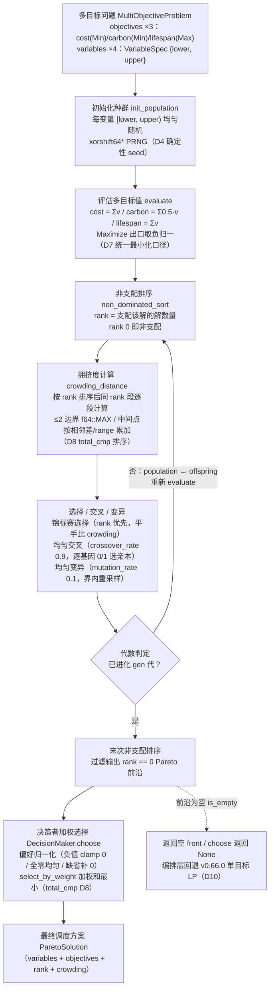
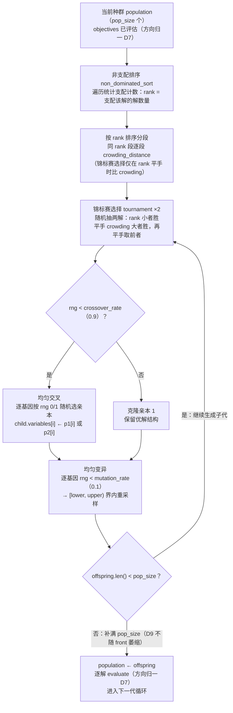

# EnerOS Solver 多目标 Pareto 优化设计 — NSGA-II 前沿生成 + 决策者加权选择

> **版本**：v0.104.0（P2-F 第 3 版 Solver 扩展收尾：多目标 Pareto 优化）
> **crate**：`eneros-solver-pareto`（`crates/ai/solver-pareto/`）
> **蓝图依据**：`蓝图/phase2.md` §v0.104.0（9 节齐全）
> **spec 依据**：`.trae/specs/develop-v10400-pareto/spec.md`（D1~D12 偏差声明源）
> **覆盖版本**：v0.104.0（蓝图检索确认无 v0.104.x 刚性子版本，Phase 2 刚性子版本仅 v0.98.1）
> **最后更新**：2026-07-19

---

## 1. 版本定位与目标

### 1.1 一句话目标

日前/联邦调度需兼顾经济性、碳排放、设备寿命三目标，单目标 LP/MILP 无法表达目标间权衡：基于 v0.64.0 `SolverError`（D11 复用）与 v0.103.0 热启动加速底座，实现 NSGA-II 多目标 Pareto 前沿生成（非支配排序 + 拥挤度 + 锦标赛选择 + 均匀交叉/变异）+ 决策者加权选择，为联邦多目标协调奠基（P2-F 闭环）。

### 1.2 详细描述

v0.66.0 已落地单目标 LP（energy-lp），v0.102.0/v0.103.0 已落地 UC MILP 基座与神经热启动加速，但单目标求解只能表达"经济最优"一个口径；蓝图 §v0.104.0 要求引入多目标优化：以 NSGA-II 进化算法在目标空间生成 Pareto 前沿（互不支配的非支配解集，覆盖经济↔碳排↔寿命的完整权衡面），再由决策者（DecisionMaker）按偏好权重从前沿中选出最终调度方案。

本版本交付三项核心能力：

| 能力 | 载体 | 说明 |
|------|------|------|
| 多目标数据结构与核心算法 | `pareto_front.rs`（`MultiObjectiveProblem` / `Objective` / `OptDirection` / `VariableSpec` / `ParetoSolution` / `ParetoFront` + `dominates` + `ParetoSolver` trait） | 支配判定统一最小化口径（D7）；`non_dominated` 过滤 rank 0；`select_by_weight` 权重归一化加权和最小（负值 clamp / 全零均匀 / total_cmp 取最小 D8） |
| NSGA-II 求解器 | `nsga2.rs`（`Nsga2Solver` + 内置 xorshift64* PRNG） | 确定性 seed 注入（D4）；初始化 → 评估（方向归一 D7）→ 逐代 {非支配排序 + 分层拥挤度 + 锦标赛 + 均匀交叉 + 均匀变异补满 pop_size（D9）} → 输出 rank 0 前沿 |
| 决策者选择 | `decision.rs`（`DecisionMaker`） | 偏好权重归一化委托 `select_by_weight`，返回 `Option<&ParetoSolution>`；单目标问题退化为最小值选择；空前沿返回 None |

### 1.3 架构定位

| 维度 | 定位 |
|------|------|
| Phase | Phase 2 多机联邦 |
| 子系统 | P2-F Solver 扩展第 3 版（`crates/ai/` AI 子系统，Solver 扩展收尾） |
| 平面 | 慢平面（Agent Runtime 分区，管理信息大区），日前/联邦调度粒度 |
| 角色 | 多目标权衡：Pareto 前沿生成 + 决策者加权选择 |
| 上游版本 | v0.64.0 solver-core（`SolverError` 复用，D11）；v0.103.0 solver-warm（热启动加速底座，P2-F 第 2 版）；v0.66.0 energy-lp（单目标 LP，前沿为空时编排层兜底，D10） |
| 下游版本 | v0.109.0 故障录波；联邦多目标协调（Phase 2 出口） |
| 部署形态 | 纯 Rust crate（no_std + alloc，零第三方依赖、零 unsafe、零 C 依赖，仅 path 依赖 eneros-solver-core） |

### 1.4 路线图链路

```
v0.64.0 solver-core（SolverError 错误体系，D11 复用源）
        │
v0.66.0 energy-lp 单目标 LP（前沿为空时编排层兜底，D10）
        │
v0.103.0 神经部分热启动（MILP 加速底座，P2-F 第 2 版）
        │
        ▼
v0.104.0 多目标 Pareto 优化（本版本：NSGA-II 前沿 + 决策者加权选择，P2-F 第 3 版收尾）
        │
        ├──► v0.109.0 故障录波
        │
        └──► 联邦多目标协调（Phase 2 出口）
```

---

## 2. 前置依赖

### 2.1 版本依赖

| 依赖版本 | crate | 本版本复用项 | 复用方式 |
|---------|-------|-------------|---------|
| v0.64.0 | `eneros-solver-core` | `SolverError`（`InvalidProblem` 变体，D11 复用，不新建 ParetoError） | path 依赖 `../solver-core`；蓝图 §4.2 签名即 `SolverError`；v0.103.0 复用先例 |
| v0.103.0 | `eneros-solver-warm` | 热启动加速底座（P2-F 第 2 版，多目标求解可复用热启动后的 MILP 加速路径） | 无代码依赖，序列先例（D5 无 Send+Sync / D12 性能 cfg(test) 口径同源） |
| v0.66.0 | `eneros-energy-lp` | 单目标 LP（前沿为空时编排层兜底回退，D10） | 无 crate 代码依赖（兜底逻辑在编排层，非本 crate 内联） |

### 2.2 外部依赖

| 依赖 | 版本 | 性质 | 说明 |
|------|------|------|------|
| 无 | — | — | **零第三方依赖**：Cargo.toml dependencies 仅 `eneros-solver-core`（path）；内置 xorshift64* PRNG 替代 rand（D4：rand 依赖 std 违反 no_std）；无 C 库、无 FFI |

### 2.3 假设（蓝图 §2）

- 决策变量为连续 `f64`，界约束由 `VariableSpec.{lower, upper}` 表达；功能约束属目标评估层（D6 不引入蓝图未定义的 `Constraint` 死字段）。
- 目标评估口径内建三目标：`cost`（Min，Σv）/ `carbon`（Min，Σ0.5·v）/ `lifespan`（Max，Σv，评估出口取负归一 D7）；未知目标名按 0.0 处理。
- `objectives` / `variables` 非空、`pop_size > 0`——否则返回 `Err(SolverError::InvalidProblem(_))`，不 panic（NS21）。

### 2.4 no_std 与工具链前提

- 本 crate：`#![cfg_attr(not(test), no_std)]` + `extern crate alloc`，仅使用 `alloc::*` 与 `core::*`，零第三方依赖，零 `unsafe`，生产路径零 `panic!`/`todo!`/`unimplemented!`/`unwrap()`（`f64::total_cmp` 替代 `partial_cmp + unwrap`，D8）。
- alloc 依赖 v0.11.0 用户堆；交叉编译目标 `aarch64-unknown-none`（记忆 §2.4.2 C8）；`std::time::Instant` 仅 `#[cfg(test)]` 内用于性能断言（D12）。

---

## 3. 交付物清单

| # | 交付物 | 位置 | 说明 |
|---|--------|------|------|
| 1 | 新 crate `eneros-solver-pareto` | `crates/ai/solver-pareto/`（D1） | `src/pareto_front.rs`（MultiObjectiveProblem/Objective/OptDirection/VariableSpec/ParetoSolution/ParetoFront + dominates + ParetoSolver trait + 支配/拥挤度核心算法）+ `src/nsga2.rs`（Xorshift64 私有 PRNG + Nsga2Solver + eval_objective）+ `src/decision.rs`（DecisionMaker）+ `src/lib.rs`（模块声明 + 重导出 + crate 文档含 D1~D12 偏差表） |
| 2 | Pareto 参数配置 | `configs/solver-pareto.toml` | `[pareto]` 段 `pop_size = 100` / `gen = 50` / `crossover_rate = 0.9` / `mutation_rate = 0.1` / `seed = 42` + `[pareto.weights]` 三目标权重（0.6/0.3/0.1 经济优先示例）+ 中文注释 7 点（NSGA-II 选型 §5.1 / 性能 <10s §6.3 / 确定性 seed D4 / 方向归一 D7 / LP 兜底编排层 D10 / 内存预算 ≤128MB §5.6 / GPU 不适用 §6.6） |
| 3 | 设计文档 | `docs/ai/pareto-design.md`（本文档，D2） | 12 章节 + 2 Mermaid + D1~D12 偏差表 + 性能口径声明（D12） |
| 4 | 单元测试 30 个 | src 内嵌 `#[cfg(test)]`（D3，项目惯例） | `pareto_front.rs` PF1~PF10（10 个）+ `nsga2.rs` NS11~NS22（12 个）+ `decision.rs` DM23~DM30（8 个） |
| 5 | 版本同步 | 根 `Cargo.toml` / `Makefile` / `.github/workflows/ci.yml` / `ci/src/gate.rs` | workspace version 0.103.0 → 0.104.0，members 追加 `"crates/ai/solver-pareto"`（字母序 ai 段）；版本注释与 gate.rs 注释串尾 2 处追加 v0.104.0 类型清单（9 类型） |

**无 BREAKING**：纯新增 crate，既有 crate（solver-core / solver-milp / solver-warm / energy-lp 等）零改动，diff 为空（C8/C89）。

---

## 4. 架构设计

### 4.1 模块划分

| 模块 | 类型 | 职责 |
|------|------|------|
| `pareto_front.rs` | `MultiObjectiveProblem` / `Objective` / `OptDirection` / `VariableSpec` / `ParetoSolution` / `ParetoFront` / `dominates` / `ParetoSolver` | 多目标问题与前沿数据结构；支配判定（统一最小化口径 D7）；`non_dominated` rank 0 过滤；`select_by_weight` 权重归一化加权选择（负值 clamp / 全零均匀 / total_cmp D8）；`is_empty`/`len` 空前沿可判（D10）；求解器 trait（无 Send+Sync D5） |
| `nsga2.rs` | `Xorshift64`（私有）/ `Nsga2Solver` / `eval_objective`（私有） | 确定性 PRNG（D4）；NSGA-II 求解：init → evaluate（方向归一 D7）→ 逐代 {非支配排序 + 分层拥挤度 + 锦标赛 + 均匀交叉 + 均匀变异补满（D9）} → rank 0 前沿；非法输入 `InvalidProblem` |
| `decision.rs` | `DecisionMaker` | 偏好权重持有与选择委托：归一化由 `select_by_weight` 承担，本模块仅委托；单目标退化最小值选择 |
| `lib.rs` | 模块声明 + 重导出 | crate 文档含版本定位 + 核心类型清单 + D1~D12 偏差表 + no_std 合规声明（风格对齐 solver-warm） |

### 4.2 类型依赖关系

```
                 ┌──────────────────────┐
                 │ eneros-solver-core    │
                 │  SolverError          │
                 │  (InvalidProblem, D11)│
                 └───────┬──────────────┘
                         │
        ┌────────────────┼─────────────────┐
        │                │                 │
        ▼                ▼                 ▼
┌──────────────┐ ┌───────────────┐ ┌───────────────┐
│pareto_front. │ │ nsga2.rs      │ │ decision.rs   │
│rs            │ │ Xorshift64    │ │ DecisionMaker │
│ MultiObject- │◄│ (私有, D4)     │ │ preferences   │
│ iveProblem   │ │ Nsga2Solver   │ │ choose ──────┐│
│ Objective/   │ │  implements   │ └──────────────┼┘
│ OptDirection │ │  ParetoSolver │                │
│ VariableSpec │ │ eval_objective│                │ 委托
│ ParetoSolut- │ │ (方向归一 D7)  │                ▼
│ ion/Pareto-  │ └───────────────┘   ParetoFront::select_by_weight
│ Front        │                        （归一化 + total_cmp 最小，D8）
│ dominates    │
│ ParetoSolver │ ──► solve(problem, pop_size, gen)
│ (无 Send+Sync│      -> Result<ParetoFront, SolverError>
│  D5)         │
└──────────────┘
```

### 4.3 技术交底：多目标优化算法选型对比（蓝图 §5.1）

| 方案 | 前沿质量 | 实现复杂度 | 说明 | 结论 |
|------|---------|-----------|------|------|
| **NSGA-II** | **高**（非支配排序 + 拥挤度保持解集多样性，非凸前沿可覆盖） | 中（排序 + 拥挤度 + 三种算子） | 工业界成熟方案，确定性 seed 可复现（D4） | ⭐ **采用** |
| MOEA/D | 高 | 高（权重向量 + 邻域分解设计复杂） | 分解法，参数敏感 | 备选 |
| 加权和法 | 低（非凸前沿无法覆盖，结果对权重敏感） | 低（压成单目标 LP） | 丢失目标间权衡信息，违背本版目标 | 排除（前沿质量低） |
| ε-约束法 | 中 | 中（需逐 ε 多次求解 LP） | 每次求解为完整 LP，耗时叠加 | 备选 |

选型结论：NSGA-II 以前沿质量与实现复杂度的最佳平衡被蓝图 §5.1 采用——非支配排序 + 拥挤度机制保证前沿覆盖度与均匀性；种群规模/代数经 `pop_size`/`gen` 参数化（蓝图 §6.2 基准 50 代 × 100 种群），性能实测约 3.3ms 远低于 10s 目标（§6.3，D12 口径见 §12）。

### 4.4 LLM 必要性声明（蓝图 §43.7 P1-5）

**本版本不引入 LLM**。多目标 Pareto 优化是经典进化算法问题：NSGA-II 的非支配排序/拥挤度/遗传算子有严格数学定义，无需 LLM 介入；本版属 **L1 主路径**（Solver-only 多目标扩展），满足"实时控制不依赖 LLM"的架构约束。L2 增强路径（LLM + Solver 双脑）与本版解耦。

---

## 5. 核心流程（蓝图 §4.3 NSGA-II 流程图重绘，图 1）

日前/联邦多目标调度的完整 Pareto 链路：多目标问题（三目标 + 变量界）经初始化种群、多目标评估（方向归一）、非支配排序、拥挤度计算、选择/交叉/变异逐代进化，代数满足后输出 rank 0 Pareto 前沿，决策者按偏好权重加权选出最终调度方案；前沿为空时由编排层回退 v0.66.0 单目标 LP（D10）：



**关键语义**：

- **三目标口径**（蓝图 §6.2，C4）：`cost`（Minimize，Σv）/ `carbon`（Minimize，Σ0.5·v）/ `lifespan`（Maximize，Σv）——lifespan 等 Maximize 目标在评估出口统一取负（D7），下游 dominates/crowding/select 全程最小化口径。
- **确定性复现**（D4）：内置 xorshift64* PRNG 以 seed 构造注入（`Nsga2Solver::with_seed(seed)`，`new()` 默认固定 seed），同 seed 两次求解结果逐比特一致（NS13 锚定），测试/审计/故障复盘可精确复现。
- **空前沿职责边界**（D10）：crate 不内联 LP 兜底——`solve` 前沿为空返回空 front（`is_empty()` 可判）、`choose`/`select_by_weight` 返回 None，回退 v0.66.0 单目标 LP 为编排层职责（crate 无 LP 问题输入，内联 LP 造成依赖反转）。

---

## 6. solve 一代进化细节（图 2）

`Nsga2Solver::solve` 的每一代：非支配排序赋 rank → 按 rank 排序分层、同 rank 段逐段计算拥挤度（锦标赛选择仅同 rank 比 crowding）→ 循环 {锦标赛选择两亲本 → 按 crossover_rate 均匀交叉或克隆 → 逐基因均匀变异} 直至补满 pop_size（D9，种群不随 front 萎缩）→ 子代评估进入下一代：



### 6.1 一代进化算子真值表

| 步骤 | 输入 | 规则 | 锚定测试 |
|------|------|------|---------|
| 非支配排序 | 种群（已评估） | `rank[i]` = 支配 `pop[i]` 的解数量；rank 0 即非支配（NS17） | NS17 |
| 拥挤度计算 | 同 rank 段 | 段长 ≤ 2 → 全置 `f64::MAX`（NS18）；否则逐目标 `total_cmp` 排序，首尾 MAX，中间点累加 `(next[k] − prev[k]) / range`，range == 0 跳过（NS19） | NS18/NS19 |
| 锦标赛选择 | 种群 + rng | 随机两解：rank 小者胜；平手 crowding 大者胜；再平手取前者 | NS20（e2e） |
| 均匀交叉 | p1/p2 + rng | `rng < 0.9` → 逐基因按 rng 最低位 0/1 选亲本；否则克隆 p1 | NS20（e2e） |
| 均匀变异 | child + rng | 逐基因 `rng < 0.1` → `[lower, upper)` 重采样 | NS20（e2e） |
| 子代评估 | offspring | 逐目标 `eval_objective`：cost=Σv / carbon=Σ0.5·v / lifespan=Σv；Maximize 出口取负（D7） | NS15/NS16 |

### 6.2 补满 pop_size 与蓝图简化版差异（D9）

蓝图 solve 每代 `population = front1.take(pop_size)`：种群随 front 萎缩、无真实交叉变异（蓝图注释自承"简化"）。本实现按蓝图 §4.3 Mermaid（选择/交叉/变异为流程必经节点）与 §5.1"NSGA-II 采用"承诺落地完整算子链：每代经锦标赛 + 均匀交叉 + 均匀变异**重新生成满编 pop_size 子代**，种群规模恒定，收敛行为符合 NSGA-II 标准语义（记忆 §4.4 骨架可用标准）。

---

## 7. 接口契约

与 `.trae/specs/develop-v10400-pareto/spec.md` 接口契约节一致（另：lib.rs 重导出 `dominates` 与全部 9 个公共类型）：

```rust
// pareto_front.rs
pub struct MultiObjectiveProblem {
    pub objectives: Vec<Objective>, pub variables: Vec<VariableSpec>,
}  // Debug/Clone
pub struct Objective {
    pub name: String, pub direction: OptDirection, pub weight: f64,
}  // Debug/Clone
pub enum OptDirection { Minimize, Maximize }  // Debug/Clone/Copy/PartialEq
pub struct VariableSpec { pub lower: f64, pub upper: f64 }  // Debug/Clone/Copy
pub struct ParetoSolution {
    pub variables: Vec<f64>, pub objectives: Vec<f64>,
    pub rank: usize, pub crowding: f64,
}  // Debug/Clone
pub struct ParetoFront { pub solutions: Vec<ParetoSolution> }  // Debug/Clone/Default
impl ParetoFront {
    pub fn non_dominated(&self) -> Vec<&ParetoSolution>;           // rank == 0
    pub fn select_by_weight(&self, weights: &[f64]) -> Option<&ParetoSolution>; // 归一化加权和最小
    pub fn is_empty(&self) -> bool;
    pub fn len(&self) -> usize;
}
pub fn dominates(a: &ParetoSolution, b: &ParetoSolution) -> bool;  // 统一最小化口径（D7）
pub trait ParetoSolver {        // 无 Send+Sync（D5）
    fn solve(&self, problem: &MultiObjectiveProblem, pop_size: usize, gen: usize)
        -> Result<ParetoFront, SolverError>;   // SolverError 复用 solver-core（D11）
}

// nsga2.rs
pub struct Nsga2Solver {
    pub crossover_rate: f64, pub mutation_rate: f64, pub seed: u64,
}  // Debug/Clone（另实现 Default，委托 new()）
impl Nsga2Solver {
    pub fn new() -> Self;                  // 0.9 / 0.1 / 默认固定 seed 0x0005_DEEC_E66D（D4）
    pub fn with_seed(seed: u64) -> Self;
}
impl ParetoSolver for Nsga2Solver { /* init → evaluate(方向归一 D7) → gen × {排序+拥挤度+锦标赛+均匀交叉+变异} → rank0 */ }
// 私有：Xorshift64（D4 确定性 PRNG）/ eval_objective（蓝图三目标口径 + Maximize 取负）

// decision.rs
pub struct DecisionMaker { pub preferences: Vec<f64> }  // Debug/Clone
impl DecisionMaker {
    pub fn new(preferences: Vec<f64>) -> Self;
    pub fn choose<'a>(&self, front: &'a ParetoFront) -> Option<&'a ParetoSolution>; // 归一化 → select_by_weight
}
```

---

## 8. 核心算法规范

### 8.1 支配判定与统一最小化口径（D7）

- **支配定义**（蓝图 §4.5）：`dominates(a, b) == true` 当且仅当全目标 `a[k] <= b[k]`（不劣）且至少一项 `a[k] < b[k]`（更优）；相等向量互不支配（PF3/PF4/PF5 锚定）。
- **方向归一**（D7）：Maximize 目标在**评估出口**统一取负（蓝图 `"lifespan" => -sum` 硬编码的一般化），`ParetoSolution.objectives` 自评估后即恒为最小化口径；dominates / crowding / select_by_weight 不再感知方向，算法与方向解耦，新增目标仅需声明 `direction`（蓝图 §8.4/§9 可扩展要求，NS16 锚定）。
- **三目标口径**（C4）：`cost` = Σv（Min）；`carbon` = Σ(0.5·v)（Min）；`lifespan` = Σv（Max → 取负）；未知目标名按 0.0 处理（NS15 锚定）。

### 8.2 非支配排序支配计数

`non_dominated_sort`：`rank[i]` = 种群中支配 `pop[i]` 的解数量（rank 0 即非支配，蓝图算法）；实现上内层循环只读 `pop[j]`、只写局部计数，最后一次性写回 `pop[i].rank`，避免 `pop[i]`/`pop[j]` 同时可变借用。复杂度 O(pop² × obj)，为全算法主开销（NS17 锚定：[1,2]/[2,3]/[3,1] → rank 0/1/0）。

### 8.3 拥挤度边界 MAX + 中间点累加

`crowding_distance`（作用于同 rank 段）：

- 段长 ≤ 2 → 全部置 `f64::MAX`（边界解永久优先保留，NS18 锚定）。
- 否则逐目标以 `f64::total_cmp` 排序（D8），首尾置 MAX；中间点累加 `(next[k] − prev[k]) / range`（range = 该目标极差；range == 0 时该目标跳过不累加）。
- 多目标累加（NS19 锚定：单目标 [1]/[2]/[4] 中间 = 1.0；双目标 [0,0]/[1,1]/[2,2] 中间 = 2.0）。

### 8.4 total_cmp 排序（D8）

蓝图 `partial_cmp(...).unwrap()` 在 NaN 输入时 panic，违反 no_std 禁 `panic!`（项目规则）：全部排序/取最小改用 `f64::total_cmp`（core 可用，≥1.62，全序确定性）——拥挤度逐目标排序、`select_by_weight` 加权和最小选取均经 total_cmp；平手取首个。

### 8.5 xorshift64* PRNG（D4）

- **选型理由**：rand crate 依赖 std，违反全项目 no_std（记忆 §4.3，蓝图 §43.1）；内置 ~20 行私有 `Xorshift64`，零 unsafe。
- **算法**：迁移序列 `x ^= x >> 12; x ^= x << 25; x ^= x >> 27;`，输出 `x * 0x2545F4914F6CDD1D`（wrapping_mul）。
- **零状态防护**：seed == 0 时以固定非零常量 `0x9E37_79B9_7F4A_7C15` 替换，防止零状态锁死。
- **f64 映射**：取 `next_u64` 高 53 位（`>> 11`）映射 `[0, 1)`，避免低位短周期偏差；`gen_range_f64(lower, upper)` 输出 `[lower, upper)`。
- **确定性**：`Nsga2Solver::new()` 默认固定 seed `0x0005_DEEC_E66D`，`with_seed(seed)` 注入；同 seed 两次 solve 的 variables/objectives 逐比特一致（NS13），异 seed 不同（NS14）。

---

## 9. 测试计划

### 9.1 测试矩阵（solver-pareto 30 个，src 内嵌 `#[cfg(test)]`，D3）

| 文件 | 编号 | 数量 | 覆盖 |
|------|------|------|------|
| pareto_front.rs | PF1~PF10 | 10 | Objective/OptDirection 构造 / VariableSpec 界 / dominates 全劣支配 / 单项更优即支配 / 相等互不支配 / non_dominated 过滤 rank0 / 空 front is_empty / select_by_weight 加权最小 / 空 front None / 负权重 clamp+全零均匀 |
| nsga2.rs | NS11~NS22 | 12 | init 种群界内 / 种群大小==pop_size / 同 seed 逐比特一致 / 异 seed 不同 / evaluate 三目标值（cost/carbon/lifespan 口径）/ Maximize 取负归一 / non_dominated_sort rank 赋值 / crowding ≤2 边界 MAX / crowding 中间值累加 / solve e2e rank0 非空且 objectives.len==3 / InvalidProblem（空 variables/objectives/pop_size 0）/ 50×100 < 10s |
| decision.rs | DM23~DM30 | 8 | preferences 归一化选择 / 纯成本 vs 纯碳不同选择 / 全零偏好均匀 / 单目标退化最小值 / 空 front None / 与 select_by_weight 一致性 / DecisionMaker Debug/Clone / 偏好长度 < 目标数缺省补 0 不 panic |

### 9.2 测试 seam 与桩

- **内置 PRNG 同模块可达**：`Xorshift64` 为 nsga2.rs 私有 struct，测试（同文件 `#[cfg(test)] mod tests`）可直接构造驱动 `init_population`（NS11/NS12）；确定性 seed 使全部随机行为可复现断言（NS13/NS14）。
- **纯函数直接驱动**：dominates / non_dominated_sort / crowding_distance / select_by_weight 均为纯函数/纯方法，手工构造解向量锚定手算值（PF3~PF5、NS17~NS19）。
- **e2e 锚定**：NS20 以蓝图 §6.2 基准（4 变量三目标、50 代 × 100 种群）断言 front 非空、每解 objectives.len()==3、全部 rank==0、variables 界内。

### 9.3 性能测试口径（D12）

- **NS22**：50 代 × 100 种群 `std::time::Instant` 断言 < 10s（仅 `#[cfg(test)]`，no_std 无计时器，测试外不注入计时以保持 solve 签名与蓝图一致——v0.64.0 D1 `now_ms` 注入先例）。
- **实测参考**：开发机实测约 3.3ms，余量约 3000 倍；算法复杂度 O(gen × pop² × obj) 声明于 §12。
- GPU 规则：不涉及（蓝图 §6.6；NSGA-II 种群算法不适合 GPU 加速，纯 CPU 求解）。

---

## 10. 验收标准

| # | 验收项 | 标准 |
|---|--------|------|
| 1 | 单元测试 | `cargo test -p eneros-solver-pareto` **30/30 通过**（PF1~PF10 + NS11~NS22 + DM23~DM30） |
| 2 | 零回归 | 全 workspace 回归全绿（solver-core 20 / solver-milp 31 / solver-warm 30 等依赖方零改动编译通过，C8 无 BREAKING 验证） |
| 3 | 交叉编译 | `cargo build -p eneros-solver-pareto --target aarch64-unknown-none -Z build-std=core,alloc -Z build-std-features=compiler-builtins-mem` 通过 |
| 4 | 代码质量 | `cargo fmt --all -- --check` 通过；`cargo clippy --workspace --exclude eneros-kernel --exclude eneros-hello --all-targets -- -D warnings` 0 warning；`cargo deny check` 通过（零新增第三方依赖，SBOM 不变） |
| 5 | 功能验收（蓝图 §6.2） | 三目标前沿生成功能可用：4 变量三目标 e2e（NS20：front 非空、objectives.len()==3、rank==0）；确定性复现（NS13 同 seed 逐比特一致）；非法输入三分支（NS21：空 variables/objectives/pop_size 0 → InvalidProblem 不 panic） |
| 6 | 性能口径（蓝图 §6.3） | 50 代 × 100 种群 < 10s（NS22 cfg(test) Instant 断言，D12）；实测约 3.3ms；复杂度 O(gen × pop² × obj) 声明（§12） |
| 7 | no_std/安全验收 | 新 crate 默认构建零 unsafe、零第三方依赖（仅 eneros-solver-core）、无 `use std::*`/`panic!`/`todo!`/`unimplemented!`/生产路径 `unwrap()`（total_cmp 替代，D8）；零 GPU 代码（蓝图 §6.6） |

---

## 11. 风险与偏差声明

### 11.1 风险

| # | 风险 | 影响 | 缓解 |
|---|------|------|------|
| R1 | NSGA-II 为启发式算法，不保证收敛到全局 Pareto 最优（蓝图 §8 风险面） | 前沿可能近似/覆盖不全 | pop_size/gen 配置化（蓝图 §6.2 基准 50×100，实测约 3.3ms 余量大可上调）；rank 0 前沿非空 e2e 锚定（NS20）；前沿为空时编排层回退单目标 LP（D10）保证始终有解 |
| R2 | 内置 xorshift64* PRNG 非密码学级 | 随机序列统计性质弱于 CSPRNG | 仅用于优化采样，不用于任何安全场景（密钥/令牌另有国密链路）；确定性 seed 为本版特性而非缺陷（D4 测试可复现） |
| R3 | 目标评估口径内建（cost/carbon/lifespan），未知目标按 0.0 | 新目标需改 eval_objective | 评估集中于单一私有函数 `eval_objective`，方向归一（D7）已使算法与目标解耦；后续版本可将评估器抽为注入 seam（蓝图 §8.4/§9 可扩展方向） |
| R4 | 前沿为空（极端退化问题） | 多目标路径无解 | `is_empty()` 可判 + `select_by_weight`/`choose` 返回 None（PF9/DM27 锚定）；编排层回退 v0.66.0 单目标 LP（D10），crate 不内联兜底避免依赖反转 |
| R5 | 更大规模问题性能外推（pop² 项） | 超出 10s 预算 | 复杂度 O(gen × pop² × obj) 显式声明（§12.2）；NS22 实测约 3.3ms 余量约 3000 倍；超预算时缩减 pop_size/gen 配置降级（与内存 OOM 策略同口径） |

### 11.2 偏差声明（D1~D12，相对蓝图 §3/§4/§6）

与 `.trae/specs/develop-v10400-pareto/spec.md` 偏差表逐字一致：

| 编号 | 偏差 | 理由 |
|------|------|------|
| **D1** | 蓝图 `crates/solver_pareto/` → `crates/ai/solver-pareto/` | 记忆 §2.3.1 强制：crate 归 `crates/<subsystem>/`；与 solver-core/solver-milp/solver-warm 同 AI 子系统 |
| **D2** | 蓝图 `docs/phase2/pareto.md` → `docs/ai/pareto-design.md` | 记忆 §2.3.3 强制：文档按方向分类 |
| **D3** | 蓝图 `tests/pareto_front.rs` → src 内嵌 `#[cfg(test)]` | v0.87.0~v0.103.0 项目惯例，不新增 tests/ 文件 |
| **D4** | 蓝图 `use rand::Rng` + `thread_rng()` → 内置确定性 xorshift64* PRNG（~20 行），seed 构造注入（`Nsga2Solver::with_seed(seed)`，`new()` 默认固定 seed） | rand crate 依赖 std，违反全项目 no_std（记忆 §4.3，蓝图 §43.1）；确定性 seed 使测试可复现（Karpathy Goal-Driven） |
| **D5** | 蓝图 `ParetoSolver: Send + Sync` → 去除 bound | 与 v0.64.0 `Solver`/v0.103.0 `WarmStartProvider` 惯例一致；NSGA-II 单线程种群算法无跨线程需求 |
| **D6** | 蓝图 §4.1 `constraints: Vec<Constraint>` 删除（`Constraint` 类型蓝图未定义且算法全程未消费） | 界约束已由 `VariableSpec.{lower,upper}` 表达；功能约束属目标评估层（Karpathy Simplicity First，不引入死字段） |
| **D7** | Maximize 目标在评估出口统一取负（蓝图 `"lifespan" => -sum` 硬编码的一般化），dominates/crowding/select 统一最小化口径 | 蓝图支配判定隐含全最小化假设但未声明；归一化后算法与方向解耦，目标可扩展（蓝图 §8.4/§9 可扩展要求） |
| **D8** | 蓝图 `partial_cmp(...).unwrap()` → `f64::total_cmp` | NaN 输入时 unwrap 会 panic，违反 no_std 禁 `panic!`（项目规则）；total_cmp 全序确定性（core 可用，≥1.62） |
| **D9** | 蓝图 solve 每代 `population = front1.take(pop_size)`（种群随 front 萎缩、无真实交叉变异，注释自承"简化"）→ 实现锦标赛选择（rank 优先、平手比拥挤度）+ 均匀交叉 + 均匀变异补满 pop_size | 对齐蓝图 §4.3 Mermaid（选择/交叉/变异为流程必经节点）与 §5.1"NSGA-II 采用"承诺；骨架可用标准（记忆 §4.4） |
| **D10** | 蓝图 §4.4"前沿为空 → 返回 LP 单目标解" → 本 crate 不内联 LP 兜底：`solve` 前沿为空时返回空 front（`is_empty()` 可判），由编排层回退 v0.66.0 单目标 LP | crate 无 LP 问题输入，内联 LP 造成依赖反转（Simplicity First）；`select_by_weight`/`choose` 空 front 返回 None |
| **D11** | `SolverError` 复用 eneros-solver-core（`InvalidProblem` 变体），不新建 ParetoError | 蓝图 §4.2 签名即 `SolverError`；v0.103.0 复用先例；避免平行错误体系 |
| **D12** | 性能 50 代 × 100 种群 < 10s 落地为 `#[cfg(test)]` 断言（std `Instant` 仅测试可用）；算法复杂度 O(gen × pop² × obj) 声明于文档 | no_std 无计时器（v0.64.0 D1 `now_ms` 注入先例；测试外不注入计时，保持 solve 签名与蓝图一致） |

---

## 12. 性能口径声明

### 12.1 50 代 × 100 种群 < 10s 口径（蓝图 §6.3，D12）

**< 10s 为 `#[cfg(test)]` Instant 断言**：no_std 无计时器（v0.64.0 D1 `now_ms` 注入先例），测试外不注入计时，保持 `solve` 签名与蓝图一致；性能断言落地为 NS22（`std::time::Instant` 仅测试可用），断言 `elapsed.as_secs() < 10`。**开发机实测约 3.3ms**，余量约 3000 倍，蓝图 §6.3 目标充分满足。

### 12.2 算法复杂度声明（D12）

复杂度 **O(gen × pop² × obj)**：每代非支配排序为 pop² × obj 次支配比较（主开销）；拥挤度逐目标排序为 O(pop × log pop × obj)；锦标赛/交叉/变异为 O(pop × vars)。蓝图 §6.2 基准（gen=50、pop=100、obj=3、vars=4）下绝对耗时毫秒级；扩大规模时按 pop² 项外推并以 NS22 实测复核。

### 12.3 GPU 规则声明（蓝图 §6.6）

**NSGA-II 不适用 GPU 规则**（记忆 §4.2）：种群迭代算法逐代存在排序/选择同步点，并行粒度细、分支密集，不适合 GPU 加速；GPU 优先规则仅适用云端模型训练/校准与数字孪生仿真加速，不适用边缘推理与 Solver 求解路径——本 crate **零 GPU 代码**，纯 CPU 种群算法（C6）。

### 12.4 内存预算声明（蓝图 §5.6/记忆 §5.6）

Solver 分区内存预算 **≤ 128MB**。本版开销：种群 100 × 4 变量（100×4×8B ≈ 3.2KB）+ 目标值/rank/拥挤度（100×(3×8+8+8)B ≈ 4KB）+ 子代缓冲同量级——**总计 KB 级，远低于预算**。OOM 策略与 v0.102.0/v0.103.0 一致：缩减问题规模 / 超时降级；总用量 > 90% 触发 OOM handler 冻结非关键 Agent（蓝图 §43.6）。

### 12.5 LP 兜底编排层职责声明（D10）

**前沿为空的 LP 兜底在编排层，不在本 crate**：`solve` 前沿为空时返回空 front（`is_empty()` 可判），`select_by_weight`/`choose` 返回 None（PF9/DM27 锚定）；编排层检测空前沿后回退 v0.66.0 energy-lp 单目标 LP。crate 无 LP 问题输入，内联 LP 会造成依赖反转（Simplicity First）；正常三目标问题前沿非空由 NS20 锚定。

---

> **文档结束**。本设计文档覆盖 v0.104.0 多目标 Pareto 优化的全部设计内容，含 12 章节 + 2 Mermaid 图（蓝图 §4.3 NSGA-II 流程图重绘、solve 一代进化细节图）+ D1~D12 偏差表（12 行，与 spec.md 逐字一致）。性能 <10s 口径（§12.1）、算法复杂度（§12.2）、GPU 规则（§12.3）、内存预算（§12.4）与 LP 兜底编排层职责（§12.5）均已按 D12/蓝图 §6.6/蓝图 §5.6/D10 声明。
