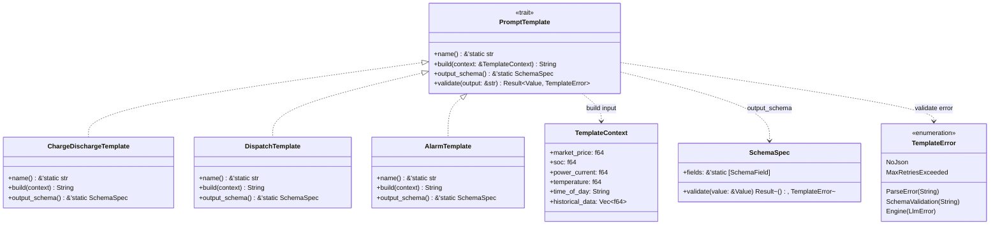
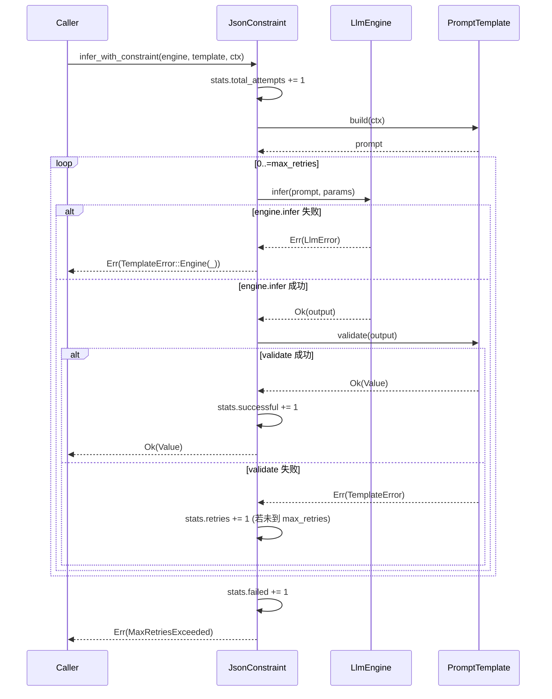

# EnerOS v0.63.0 Prompt 模板系统 + JSON 输出约束 设计文档

> 版本：v0.63.0
> 覆盖版本：v0.63.0
> 蓝图参考：phase1.md §v0.63.0
> 最后更新：2026-07-16

---

## 1. 版本目标

### 1.1 一句话目标

实现电力专用 Prompt 模板系统和 JSON 输出约束，确保 LLM 输出结构化 JSON 意图（而非自然语言），供 v0.68.0 IntentParser 解析，作为 LLM → Solver 的桥梁。

### 1.2 详细描述

双脑架构（蓝图 §9.x）中 LLM 是"感知者"，负责理解市场信号与自然语言指令并输出 JSON 意图，Solver（LP/MILP，v0.71.0 联调）是"执行者"。LLM 的输出必须为结构化 JSON（而非自由文本），才能被下游 v0.68.0 IntentParser 可靠解析、被 v0.69.0 意图契约校验、最终驱动 Solver 求解。

本版本（v0.63.0）是 P1-I AI Runtime LLM 推理层五层架构的收官版本，在 v0.59.0 引擎接口、v0.60.0 模型加载、v0.61.0 模型部署、v0.62.0 推理调度之上，构建两层能力：

| 能力层 | 产出 | 角色 |
|--------|------|------|
| Prompt 模板系统 | `PromptTemplate` trait + 3 个电力场景模板 | 将 `TemplateContext` 电力上下文渲染为 LLM 可读的 prompt 文本 |
| JSON 输出约束 | `JsonConstraint` + `SchemaSpec` + `extract_json` | 对 LLM 输出进行 JSON 提取、解析、Schema 校验、失败重试 |

核心交付清单：

| 产出 | 类型 | 说明 |
|------|------|------|
| `PromptTemplate` trait | 接口 | 3 个必需方法（name / build / output_schema）+ 1 个默认方法（validate） |
| `TemplateContext` | 结构体 | 6 字段电力场景输入上下文 |
| `SchemaSpec` / `SchemaField` / `SchemaType` | 类型 | 最小 JSON Schema 验证器（D5：仅 required/type/enum/minimum/maximum） |
| `ChargeDischargeTemplate` | 实现 | 充放电策略模板（action/power_kw/reason/confidence） |
| `DispatchTemplate` | 实现 | 功率调度模板（target_power/ramp_rate/duration_minutes/reason） |
| `AlarmTemplate` | 实现 | 告警处理模板（alarm_type/severity/action/target_device） |
| `JsonConstraint` + `ConstraintStats` | 结构体 | 带重试的约束推理器 + 统计 |
| `extract_json` | 函数 | 处理纯 JSON / markdown 代码块 / 含多余文字三种格式 |
| `TemplateError` | 枚举 | 5 变体独立错误类型（D2：不污染 `LlmError`） |

所有 Rust 代码必须 no_std（D1，蓝图 §43.1），仅使用 `core::*` / `alloc::*`，无 `std::*`，无 FFI 声明，无 `unsafe` 块（D10，纯安全 Rust）。

### 1.3 架构定位

| 维度 | 定位 |
|------|------|
| Phase | Phase 1 单机 MVP |
| 子系统 | P1-I AI Runtime LLM 第五层（Prompt 模板，收官层） |
| 平面 | 慢平面（Agent Runtime 分区，管理信息大区） |
| 角色 | LLM → Solver 的桥梁，将电力上下文渲染为 prompt，将 LLM 自由文本约束为 JSON |
| 上游版本 | v0.59.0 `LlmEngine` trait + `InferParams` + `LlmError`；v0.11.0 用户堆（alloc 支持） |
| 同层版本 | v0.63.0（本版本，Prompt 模板 + JSON 约束） |
| 下游版本 | v0.68.0 IntentParser（解析 JSON 意图）；v0.69.0 意图契约（校验 JSON 格式）；v0.71.0 双脑联调（编排 LLM + Solver） |
| 部署形态 | 边缘 LLM 推理统一采用 llama.cpp（C API），禁止 PyTorch（蓝图 §43.3） |

### 1.4 前置依赖

| 依赖 | 来源版本 | 用途 |
|------|---------|------|
| `LlmEngine` trait | v0.59.0（[设计文档](./llm-engine-design.md)） | `infer_with_constraint` 内通过 `&mut dyn LlmEngine` 调用 `engine.infer(prompt, params)` |
| `InferParams` | v0.59.0 | 传给 `engine.infer` 的推理参数（max_tokens / temperature / top_p） |
| `LlmError` | v0.59.0 | `TemplateError::Engine(LlmError)` 变体，`From<LlmError>` 转换 |
| `alloc::string::String` | `alloc` crate | prompt 文本与 JSON 字符串（D1） |
| `alloc::vec::Vec` | `alloc` crate | `TemplateContext.historical_data` 字段 |
| `serde_json` | 外部 crate（alloc feature） | JSON 解析（`serde_json::Value` / `serde_json::from_str`），no_std 配置参考 v0.26.0 eneros-config 模式 |

> **注**：本版本**仅依赖 v0.59.0**，不依赖 v0.60.0（模型加载）、v0.61.0（模型部署）、v0.62.0（推理调度）。Prompt 模板通过 `LlmEngine` trait 抽象调用推理引擎，与具体实现（`MockEngine` / `LlamaCppEngine`）及调度器解耦（D11）。

### 1.5 设计原则关联

| 原则 | 体现 |
|------|------|
| no_std 合规 | 全 crate 仅使用 `core::*` / `alloc::*`，无 `std::*`（D1，蓝图 §43.1） |
| 结构化输出 | JSON Schema 校验确保 LLM 输出可被下游 IntentParser 可靠解析 |
| Simplicity First | 最小 JSON Schema 验证器（D5：仅 5 类校验），不实现完整 draft 7+ |
| 安全优先 | 无 FFI 声明，无 `unsafe` 块，纯安全 Rust（D10） |
| 复用优先 | 复用 v0.59.0 类型（`LlmEngine` / `InferParams` / `LlmError`），不重新定义（D11） |
| 错误分离 | `TemplateError` 独立于 `LlmError`，模板层错误不污染引擎层（D2/D3） |
| 编译期常量 | `SchemaSpec` + `SchemaField` 使用 `&'static` 静态常量，运行时零分配（D4） |
| GPU 优先 | 通过 `&mut dyn LlmEngine` 间接调用，GPU 策略由调用方决定（D7/D12） |

---

## 2. 架构定位

### 2.1 P1-I AI Runtime LLM 五层架构

P1-I AI Runtime LLM 子系统按"引擎接口 → 模型加载 → 模型部署 → 推理调度 → Prompt 模板"五层层级组织，本版本位于第五层（收官层）：

| 层级 | 版本 | crate | 职责 |
|------|------|-------|------|
| 第一层（引擎接口） | v0.59.0 | `eneros-llm-engine` | `LlmEngine` trait + MockEngine + LlamaCppEngine FFI |
| 第二层（模型加载） | v0.60.0 | `eneros-gguf-loader` | GGUF 模型文件加载、校验、元信息解析 |
| 第三层（模型部署） | v0.61.0 | `eneros-model-deploy` | 模型部署、量化配置、运行时管理 |
| 第四层（推理调度） | v0.62.0 | `eneros-infer-scheduler` | 优先级调度 + KV Cache 追踪 + 超时控制 + 并发限制 |
| **第五层（Prompt 模板）** | **v0.63.0** | **`eneros-prompt-template`** | **Prompt 模板渲染 + JSON 输出约束 + Schema 校验 + 重试** |

第五层在前四层之上引入两项收官能力：① 电力专用 Prompt 模板系统（将电力上下文渲染为结构化 prompt）；② JSON 输出约束（提取 / 解析 / Schema 校验 / 重试）。前四层负责"如何推理"，第五层负责"推理什么"与"输出什么"。

```
[市场信号/自然语言指令]
        │
        ▼
v0.63.0 PromptTemplate.build(ctx)  ──►  prompt 文本
        │
        ▼
v0.62.0 InferScheduler（可选） / 直接调用
        │
        ▼
v0.59.0 LlmEngine.infer(prompt, params)
        │
        ▼
   LLM 推理 (llama.cpp via FFI)
        │
        ▼
   自由文本输出
        │
        ▼
v0.63.0 extract_json(output)  ──►  JSON 字符串
        │
        ▼
v0.63.0 serde_json::from_str  ──►  serde_json::Value
        │
        ▼
v0.63.0 SchemaSpec.validate(&value)  ──►  Ok(()) / Err(SchemaValidation)
        │
        ▼
   结构化 JSON 意图
        │
        ▼
v0.68.0 IntentParser 解析  ──►  v0.69.0 意图契约校验  ──►  v0.71.0 Solver 求解
```

### 2.2 与 v0.68.0 IntentParser 的关系

本版本输出的结构化 JSON 是 v0.68.0 IntentParser 的输入：

| 维度 | v0.63.0（本版本） | v0.68.0（下游） |
|------|-------------------|----------------|
| 角色 | Prompt 模板 + JSON 约束 | 意图解析器 |
| 输入 | `TemplateContext`（电力上下文） | JSON Value（本版本输出） |
| 输出 | `serde_json::Value`（结构化 JSON） | `Intent` 对象（强类型意图） |
| 校验 | `SchemaSpec`（最小 JSON Schema） | 意图契约（v0.69.0） |
| 失败处理 | 重试（`max_retries`） | 降级到 L1（Solver-only） |

JSON 输出格式示例（`ChargeDischargeTemplate` 输出）：

```json
{
  "action": "charge",
  "power_kw": -50.0,
  "reason": "谷时电价低，SOC 偏低",
  "confidence": 0.85
}
```

v0.68.0 IntentParser 解析该 JSON 为 `Intent::ChargeDischarge { action, power_kw, reason, confidence }` 强类型对象，供 v0.71.0 双脑联调驱动 Solver。

### 2.3 与 v0.69.0 意图契约的关系

v0.69.0 意图契约定义 Intent 的强类型结构与跨脑通信协议，依赖本版本的 JSON 格式约束：

| 维度 | v0.63.0（本版本） | v0.69.0（下游） |
|------|-------------------|----------------|
| 校验层次 | JSON Schema（字段存在性 / 类型 / 枚举 / 范围） | 意图契约（业务语义 / 跨脑协议） |
| 校验时机 | LLM 推理后立即校验（`validate`） | IntentParser 解析后校验 |
| 失败处理 | 重试（`max_retries`） | 降级到 L1 或拒绝意图 |
| 数据形态 | `serde_json::Value`（弱类型 JSON） | `Intent` 强类型对象 |

本版本的 `SchemaSpec` 是 v0.69.0 意图契约的"前置闸门"：LLM 输出必须先通过本版本的 Schema 校验，才能进入 v0.69.0 的业务语义校验。两层校验分离确保职责清晰。

### 2.4 双脑架构中的定位

```
[市场信号/自然语言指令]
        │
        ▼
v0.63.0 PromptTemplate + JsonConstraint (本版本)
        │
        ▼
v0.59.0 LlmEngine (trait)
        │
        ▼
   LLM 推理 (llama.cpp via FFI)
        │
        ▼
   JSON 意图输出
        │
        ▼
v0.68.0 IntentParser ──► v0.69.0 意图契约 ──► v0.71.0 双脑联调 ──► Solver (LP/MILP, HiGHS)
                                                                       │
                                                                       ▼
                                                                  优化决策 (L1 主路径)
                                                                       │
                                                                       ▼
                                                                  控制命令下发
```

| 路径 | 内容 | MVP 可验收 | 说明 |
|------|------|-----------|------|
| L1 主路径 | Solver-only（LP/MILP） | ✅ 是 | 实时控制 < 500ms，不依赖 LLM |
| L2 增强路径 | LLM + Solver（双脑） | ❌ 否 | 离线复杂规划/自然语言交互，降级到 L1 |

本版本为 L2 增强路径的"感知终点"：上层（v0.71.0 双脑联调）通过 `JsonConstraint::infer_with_constraint` 调用 LLM 并获得结构化 JSON 意图。L2 路径在 LLM 不可用或 JSON 输出连续失败时降级到 L1（Solver-only），降级编排由 v0.71.0 实现；本版本在 `max_retries` 耗尽时返回 `TemplateError::MaxRetriesExceeded`，由上层决策降级。

### 2.5 上下游依赖图

```
v0.59.0 LlmEngine trait ──┐
v0.59.0 InferParams ──────┤
v0.59.0 LlmError ─────────┤
                          │
v0.11.0 用户堆 ──► alloc ─┤
                          │
serde_json (alloc) ───────┤
                          │
                          ▼
             v0.63.0 Prompt 模板系统
             ├── PromptTemplate trait
             ├── TemplateContext
             ├── SchemaSpec / SchemaField / SchemaType
             ├── ChargeDischargeTemplate
             ├── DispatchTemplate
             ├── AlarmTemplate
             ├── JsonConstraint + ConstraintStats
             ├── extract_json
             └── TemplateError
                          │
                          ▼
             v0.68.0 IntentParser
                          │
                          ▼
             v0.69.0 意图契约
                          │
                          ▼
             v0.71.0 双脑联调
```

### 2.6 不做的事（职责边界）

本版本**不负责**以下职责，避免与上下游重叠：

| 不做的事 | 归属版本 | 理由 |
|---------|---------|------|
| LLM 推理执行 | v0.59.0 `LlmEngine` | 本版本通过 `&mut dyn LlmEngine` trait 对象调用，不直接 FFI |
| 模型加载/校验 | v0.60.0 / v0.61.0 | 本版本假设引擎已加载模型 |
| 推理调度排队 | v0.62.0 `InferScheduler` | 本版本可绕过调度器直接调用 `engine.infer`，或由上层先调用调度器再调用本版本 |
| 意图强类型解析 | v0.68.0 IntentParser | 本版本仅输出 `serde_json::Value`，强类型化由下游负责 |
| 业务语义校验 | v0.69.0 意图契约 | 本版本仅校验 JSON Schema（字段/类型/枚举/范围），不校验业务逻辑 |
| 双脑降级编排 | v0.71.0 双脑联调 | 本版本仅返回 `TemplateError`，降级决策由上层编排 |
| 完整 JSON Schema draft 7+ | — | 仅实现最小验证器（D5，Simplicity First） |

---

## 3. PromptTemplate trait

### 3.1 trait 定义（D1：无 Send + Sync）

```rust
use alloc::string::String;
use alloc::string::ToString;

use serde_json::Value;

use crate::context::TemplateContext;
use crate::error::TemplateError;
use crate::extract::extract_json;
use crate::schema::SchemaSpec;

/// Prompt 模板 trait（D1：无 Send + Sync）。
///
/// 定义电力场景 Prompt 模板的统一接口。每个实现负责：
/// - 渲染 prompt 文本（`build`）
/// - 声明输出 JSON Schema（`output_schema`）
/// - 校验 LLM 输出（`validate`，默认实现）
///
/// **D1**：不派生 `Send + Sync`，与 v0.59.0 `LlmEngine` trait 一致。
/// 单线程 no_std 无需 Send/Sync；Agent Runtime 分区单线程访问。
///
/// **D9**：`output_schema()` 返回 `&'static SchemaSpec`（验证规范），
/// `validate()` 返回 `serde_json::Value`（解析结果），职责分离。
pub trait PromptTemplate {
    /// 模板名称（用于日志与统计）。
    fn name(&self) -> &'static str;

    /// 构建 prompt 文本。
    ///
    /// 将 `TemplateContext` 电力上下文渲染为 LLM 可读的 prompt 字符串。
    /// prompt 末尾通常要求 LLM "只输出 JSON，不要其他文字"。
    fn build(&self, context: &TemplateContext) -> String;

    /// 输出 JSON Schema（验证规范）。
    ///
    /// 返回 `&'static SchemaSpec` 编译期常量（D4），运行时零分配。
    fn output_schema(&self) -> &'static SchemaSpec;

    /// 校验 LLM 输出。
    ///
    /// 默认实现三步流程：
    /// 1. `extract_json(output)` — 提取 JSON（处理 markdown 包裹与多余文字）
    /// 2. `serde_json::from_str(&json_str)` — 解析为 `serde_json::Value`
    /// 3. `self.output_schema().validate(&value)` — Schema 校验
    ///
    /// - `output`：LLM 原始输出（可能含 markdown 代码块或多余文字）
    /// - 返回 `Ok(Value)`：JSON 符合 schema
    /// - 返回 `Err(TemplateError)`：提取/解析/校验失败
    fn validate(&self, output: &str) -> Result<Value, TemplateError> {
        // 1. 提取 JSON
        let json_str = extract_json(output)?;
        // 2. 解析 JSON
        let value: Value = serde_json::from_str(&json_str)
            .map_err(|e| TemplateError::ParseError(e.to_string()))?;
        // 3. Schema 校验
        self.output_schema().validate(&value)?;
        Ok(value)
    }
}
```

### 3.2 方法说明

| 方法 | 签名 | 必需/默认 | 说明 |
|------|------|----------|------|
| `name` | `fn name(&self) -> &'static str` | 必需 | 模板名称，`&'static str` 零分配 |
| `build` | `fn build(&self, context: &TemplateContext) -> String` | 必需 | 渲染 prompt，返回 `String`（临时堆分配） |
| `output_schema` | `fn output_schema(&self) -> &'static SchemaSpec` | 必需 | 返回编译期常量 Schema（D4） |
| `validate` | `fn validate(&self, output: &str) -> Result<Value, TemplateError>` | 默认 | 三步流程：extract_json → from_str → schema.validate |

### 3.3 为什么不派生 Send + Sync（D1）

| 维度 | 说明 |
|------|------|
| **D1 决策** | `pub trait PromptTemplate` 不派生 `Send + Sync` |
| 蓝图原文 | `pub trait PromptTemplate: Send + Sync` |
| 偏差理由 | 与 v0.59.0 `LlmEngine` trait 保持一致（v0.59.0 D2）；单线程 no_std 无真正并发，无需 Send/Sync；Agent Runtime 分区单线程访问模板 |
| 一致性 | 与 v0.59.0 `LlmEngine` / v0.62.0 `InferScheduler` 一致（均无 Send/Sync） |
| 影响 | 模板不可跨线程传递，但单线程场景无影响 |

### 3.4 Mermaid 类图



图 1：`PromptTemplate` trait 类图。trait 定义 4 个方法（3 必需 + 1 默认），3 个电力场景模板实现该 trait。`build` 接收 `TemplateContext` 输入，`output_schema` 返回 `&'static SchemaSpec`，`validate` 默认实现调用 `extract_json` → `serde_json::from_str` → `SchemaSpec::validate`，失败返回 `TemplateError`。

### 3.5 validate 默认实现的三步流程

```
LLM 原始输出（output: &str）
        │
        ▼
步骤 1：extract_json(output)
        │  处理 markdown 代码块（```json ... ```）
        │  处理前后多余文字
        │  返回纯 JSON 字符串
        │
        ├── Err(NoJson) ──► 返回 Err(TemplateError::NoJson)
        │
        ▼ Ok(json_str)
步骤 2：serde_json::from_str(&json_str)
        │  解析 JSON 字符串为 serde_json::Value
        │
        ├── Err(e) ──► 返回 Err(TemplateError::ParseError(e.to_string()))
        │
        ▼ Ok(Value)
步骤 3：self.output_schema().validate(&value)
        │  Schema 校验（required / type / enum / minimum / maximum）
        │
        ├── Err(SchemaValidation(msg)) ──► 返回 Err(TemplateError::SchemaValidation(msg))
        │
        ▼ Ok(())
返回 Ok(Value)
```

---

## 4. TemplateContext 输入上下文

### 4.1 结构定义

```rust
use alloc::string::String;
use alloc::vec::Vec;

/// 模板输入上下文（6 字段，电力场景输入）。
///
/// 封装储能系统实时状态，供 `PromptTemplate::build` 渲染 prompt。
/// 所有字段为电力调度决策的核心输入。
#[derive(Debug, Clone)]
pub struct TemplateContext {
    /// 市场电价（元/kWh）
    pub market_price: f64,
    /// 电池 SOC（State of Charge，百分比，0.0~100.0）
    pub soc: f64,
    /// 当前功率（kW，正为放电，负为充电）
    pub power_current: f64,
    /// 电池温度（℃）
    pub temperature: f64,
    /// 时段（如 "谷时" / "平时" / "峰时" / "尖时"）
    pub time_of_day: String,
    /// 历史数据（近期功率/电价序列，供 LLM 参考趋势）
    pub historical_data: Vec<f64>,
}
```

### 4.2 字段说明

| # | 字段 | 类型 | 单位 | 说明 |
|---|------|------|------|------|
| 1 | `market_price` | `f64` | 元/kWh | 市场电价，影响充放电策略经济性 |
| 2 | `soc` | `f64` | % | 电池荷电状态，0.0~100.0，影响可用容量 |
| 3 | `power_current` | `f64` | kW | 当前功率，正为放电，负为充电 |
| 4 | `temperature` | `f64` | ℃ | 电池温度，影响安全约束 |
| 5 | `time_of_day` | `String` | — | 时段标签（谷/平/峰/尖），影响电价策略 |
| 6 | `historical_data` | `Vec<f64>` | 视场景 | 历史功率/电价序列，供 LLM 参考趋势 |

### 4.3 构造方法

```rust
impl TemplateContext {
    /// 构造模板上下文。
    ///
    /// - `market_price`：市场电价（元/kWh）
    /// - `soc`：电池 SOC（%）
    /// - `power_current`：当前功率（kW）
    /// - `temperature`：电池温度（℃）
    /// - `time_of_day`：时段标签
    /// - `historical_data`：历史数据序列
    pub fn new(
        market_price: f64,
        soc: f64,
        power_current: f64,
        temperature: f64,
        time_of_day: &str,
        historical_data: Vec<f64>,
    ) -> Self {
        Self {
            market_price,
            soc,
            power_current,
            temperature,
            time_of_day: String::from(time_of_day),
            historical_data,
        }
    }
}

impl Default for TemplateContext {
    /// 默认上下文（用于测试）。
    ///
    /// 提供一组合理的默认值，便于单元测试构造上下文。
    fn default() -> Self {
        Self {
            market_price: 0.5,
            soc: 50.0,
            power_current: 0.0,
            temperature: 25.0,
            time_of_day: String::from("平时"),
            historical_data: Vec::new(),
        }
    }
}
```

### 4.4 在 build() 中的使用

`TemplateContext` 由调用方构造，传入 `PromptTemplate::build`。模板实现通过 `format!` 宏将字段值插入 prompt 文本：

```rust
// ChargeDischargeTemplate::build 示例
fn build(&self, ctx: &TemplateContext) -> String {
    alloc::format!(
        r#"你是一个储能系统调度助手。根据以下信息输出充放电策略。

当前电价: {:.2} 元/kWh
电池 SOC: {:.1}%
当前功率: {:.1} kW
温度: {:.1}℃
时段: {}

请输出 JSON 格式的充放电策略，包含以下字段：
{{
  "action": "charge" | "discharge" | "standby",
  "power_kw": <浮点数，正为放电，负为充电>,
  "reason": "<简短理由>",
  "confidence": <0.0~1.0 置信度>
}}

只输出 JSON，不要其他文字。"#,
        ctx.market_price, ctx.soc, ctx.power_current, ctx.temperature, ctx.time_of_day
    )
}
```

| 字段 | prompt 中的占位 | 渲染示例 |
|------|---------------|---------|
| `market_price` | `{:.2} 元/kWh` | `0.50 元/kWh` |
| `soc` | `{:.1}%` | `80.0%` |
| `power_current` | `{:.1} kW` | `0.0 kW` |
| `temperature` | `{:.1}℃` | `25.0℃` |
| `time_of_day` | `{}` | `谷时` |
| `historical_data` | （可选展开） | 历史功率趋势描述 |

---

## 5. SchemaSpec 最小 JSON Schema 验证器

### 5.1 设计原则（D5：最小验证器）

| 维度 | 说明 |
|------|------|
| **D5 决策** | 实现最小 JSON Schema 验证器，不实现完整 draft 7+ |
| 校验项 | 仅 5 类：`required`（字段存在性）/ `type`（类型匹配）/ `enum`（枚举值）/ `minimum`（数值下界）/ `maximum`（数值上界） |
| 不实现 | `$ref` / `pattern` / `format` / `additionalProperties` / `oneOf` / `anyOf` / `allOf` 等高级特性 |
| 理由 | 电力场景仅需字段存在性、类型、枚举值、数值范围校验；完整 JSON Schema 是过度工程（违反 Simplicity First） |
| 数据来源 | 蓝图 §v0.63.0 各模板的 JSON Schema 定义 |

### 5.2 SchemaType 枚举

```rust
/// Schema 字段类型枚举（5 变体）。
///
/// 对应 JSON Schema 的 `type` 关键字，仅支持电力场景所需的基础类型。
/// 不支持 `null` / `integer`（与 `number` 合并）等高级类型。
#[derive(Debug, Clone, Copy, PartialEq, Eq)]
pub enum SchemaType {
    /// JSON 字符串
    String,
    /// JSON 数值（含整数与浮点数）
    Number,
    /// JSON 布尔值
    Boolean,
    /// JSON 对象
    Object,
    /// JSON 数组
    Array,
}
```

### 5.3 SchemaField 结构体

```rust
use alloc::string::String;
use alloc::vec::Vec;

/// Schema 字段定义（5 字段）。
///
/// 描述单个 JSON 字段的验证规则。所有字段使用 `Option` 包裹可选约束，
/// `None` 表示不校验该项。
#[derive(Debug, Clone)]
pub struct SchemaField {
    /// 字段名
    pub name: &'static str,
    /// 字段类型
    pub field_type: SchemaType,
    /// 是否必需（true 表示字段必须存在）
    pub required: bool,
    /// 枚举值约束（如 `["charge", "discharge", "standby"]`）
    pub enum_values: &'static [&'static str],
    /// 数值下界（仅对 Number 类型有效）
    pub minimum: Option<f64>,
    /// 数值上界（仅对 Number 类型有效）
    pub maximum: Option<f64>,
}
```

### 5.4 SchemaSpec 结构体（D4：'static 静态常量）

```rust
/// JSON Schema 规范（1 字段，D4：'static 静态常量）。
///
/// **D4**：使用 `&'static [SchemaField]` 编译期常量，运行时零分配。
/// 替代蓝图伪代码的 `lazy_static! { static ref ... = json!({...}); }`（std-only）。
///
/// **D9**：`SchemaSpec` 是验证规范（描述 JSON 应符合的结构），
/// 与 `serde_json::Value`（解析结果）职责分离。
#[derive(Debug, Clone)]
pub struct SchemaSpec {
    /// 字段列表（编译期常量）
    pub fields: &'static [SchemaField],
}
```

### 5.5 validate() 方法：5 步校验流程

```rust
use serde_json::Value;

use crate::error::TemplateError;

impl SchemaSpec {
    /// 校验 JSON Value 是否符合 Schema。
    ///
    /// **D5**：最小验证器，5 步校验流程：
    /// 1. Object 检查（顶层必须为 JSON 对象）
    /// 2. required 检查（必需字段必须存在）
    /// 3. type 检查（字段类型必须匹配）
    /// 4. enum 检查（字符串字段值必须在 enum_values 列表中）
    /// 5. range 检查（数值字段必须在 [minimum, maximum] 范围内）
    ///
    /// - `value`：待校验的 JSON Value
    /// - 返回 `Ok(())`：校验通过
    /// - 返回 `Err(TemplateError::SchemaValidation(msg))`：校验失败，含字段名与原因
    pub fn validate(&self, value: &Value) -> Result<(), TemplateError> {
        // 步骤 1：Object 检查
        let obj = value.as_object().ok_or_else(|| {
            TemplateError::SchemaValidation(String::from("expected top-level JSON object"))
        })?;

        // 步骤 2~5：逐字段校验
        for field in self.fields {
            // 步骤 2：required 检查
            let field_value = match obj.get(field.name) {
                Some(v) => v,
                None => {
                    if field.required {
                        return Err(TemplateError::SchemaValidation(format!(
                            "missing required field: {}",
                            field.name
                        )));
                    }
                    continue;  // 可选字段缺失，跳过
                }
            };

            // 步骤 3：type 检查
            Self::check_type(field, field_value)?;

            // 步骤 4：enum 检查
            Self::check_enum(field, field_value)?;

            // 步骤 5：range 检查
            Self::check_range(field, field_value)?;
        }

        Ok(())
    }
}
```

### 5.6 5 步校验流程详解

| 步骤 | 校验项 | 触发条件 | 错误信息示例 |
|------|--------|---------|-------------|
| 1 | Object 检查 | `value.as_object()` 为 None | `expected top-level JSON object` |
| 2 | required 检查 | `obj.get(name)` 为 None 且 `required == true` | `missing required field: action` |
| 3 | type 检查 | 字段类型与 `field_type` 不匹配 | `field action: expected string, got number` |
| 4 | enum 检查 | 字符串字段值不在 `enum_values` 列表 | `field action: invalid enum value "idle"` |
| 5 | range 检查 | 数值字段超出 `[minimum, maximum]` | `field confidence: 1.5 exceeds maximum 1.0` |

### 5.7 类型检查实现

```rust
impl SchemaSpec {
    /// 检查字段类型是否匹配。
    fn check_type(field: &SchemaField, value: &Value) -> Result<(), TemplateError> {
        let type_ok = match field.field_type {
            SchemaType::String => value.is_string(),
            SchemaType::Number => value.is_number(),
            SchemaType::Boolean => value.is_boolean(),
            SchemaType::Object => value.is_object(),
            SchemaType::Array => value.is_array(),
        };
        if !type_ok {
            return Err(TemplateError::SchemaValidation(format!(
                "field {}: type mismatch, expected {:?}",
                field.name, field.field_type
            )));
        }
        Ok(())
    }

    /// 检查枚举值是否合法（仅对 String 类型有效）。
    fn check_enum(field: &SchemaField, value: &Value) -> Result<(), TemplateError> {
        if field.enum_values.is_empty() {
            return Ok(());  // 无 enum 约束
        }
        if let Some(s) = value.as_str() {
            if !field.enum_values.contains(&s) {
                return Err(TemplateError::SchemaValidation(format!(
                    "field {}: invalid enum value \"{}\"",
                    field.name, s
                )));
            }
        }
        Ok(())
    }

    /// 检查数值范围是否合规（仅对 Number 类型有效）。
    fn check_range(field: &SchemaField, value: &Value) -> Result<(), TemplateError> {
        if let Some(n) = value.as_f64() {
            if let Some(min) = field.minimum {
                if n < min {
                    return Err(TemplateError::SchemaValidation(format!(
                        "field {}: {} below minimum {}",
                        field.name, n, min
                    )));
                }
            }
            if let Some(max) = field.maximum {
                if n > max {
                    return Err(TemplateError::SchemaValidation(format!(
                        "field {}: {} exceeds maximum {}",
                        field.name, n, max
                    )));
                }
            }
        }
        Ok(())
    }
}
```

### 5.8 为什么不实现完整 JSON Schema draft 7+（D5 详解）

| 维度 | 完整 JSON Schema draft 7+ | 最小验证器（本设计，D5） |
|------|--------------------------|------------------------|
| 校验项 | 30+ 关键字 | 5 类（required/type/enum/minimum/maximum） |
| 复杂度 | 高（需解析 `$ref` / `pattern` / `format`） | 低（纯 Rust 结构体 + match） |
| 依赖 | 需 `jsonschema` crate（std-only） | 无外部依赖 |
| no_std 兼容 | ❌ `jsonschema` crate 依赖 std | ✅ 纯 `core::*` / `alloc::*` |
| 电力场景需求 | 仅需 5 类校验 | 完全满足 |
| 代码量 | 数千行 | ~150 行 |
| 可维护性 | 低（复杂规范） | 高（简单清晰） |

**决策**：采用最小验证器（D5）。电力场景的 JSON Schema 仅涉及字段存在性、类型、枚举值、数值范围，完整 JSON Schema draft 7+ 是过度工程（违反 Simplicity First）。若未来需更复杂校验，可在后续版本扩展 `SchemaField` 字段。

---

## 6. 3 个电力场景模板

### 6.1 ChargeDischargeTemplate（充放电策略）

#### 6.1.1 输出 Schema

```rust
/// 充放电策略 Schema（编译期常量，D4）。
pub static CHARGE_DISCHARGE_SCHEMA: SchemaSpec = SchemaSpec {
    fields: &[
        SchemaField {
            name: "action",
            field_type: SchemaType::String,
            required: true,
            enum_values: &["charge", "discharge", "standby"],
            minimum: None,
            maximum: None,
        },
        SchemaField {
            name: "power_kw",
            field_type: SchemaType::Number,
            required: true,
            enum_values: &[],
            minimum: None,
            maximum: None,
        },
        SchemaField {
            name: "reason",
            field_type: SchemaType::String,
            required: true,
            enum_values: &[],
            minimum: None,
            maximum: None,
        },
        SchemaField {
            name: "confidence",
            field_type: SchemaType::Number,
            required: true,
            enum_values: &[],
            minimum: Some(0.0),
            maximum: Some(1.0),
        },
    ],
};
```

#### 6.1.2 prompt 文本示例

```rust
pub struct ChargeDischargeTemplate;

impl PromptTemplate for ChargeDischargeTemplate {
    fn name(&self) -> &'static str {
        "charge_discharge_strategy"
    }

    fn build(&self, ctx: &TemplateContext) -> String {
        alloc::format!(
            r#"你是一个储能系统调度助手。根据以下信息输出充放电策略。

当前电价: {:.2} 元/kWh
电池 SOC: {:.1}%
当前功率: {:.1} kW
温度: {:.1}℃
时段: {}

请输出 JSON 格式的充放电策略，包含以下字段：
{{
  "action": "charge" | "discharge" | "standby",
  "power_kw": <浮点数，正为放电，负为充电>,
  "reason": "<简短理由>",
  "confidence": <0.0~1.0 置信度>
}}

只输出 JSON，不要其他文字。"#,
            ctx.market_price, ctx.soc, ctx.power_current, ctx.temperature, ctx.time_of_day
        )
    }

    fn output_schema(&self) -> &'static SchemaSpec {
        &CHARGE_DISCHARGE_SCHEMA
    }
}
```

### 6.2 DispatchTemplate（功率调度）

#### 6.2.1 输出 Schema

```rust
/// 功率调度 Schema（编译期常量，D4）。
pub static DISPATCH_SCHEMA: SchemaSpec = SchemaSpec {
    fields: &[
        SchemaField {
            name: "target_power",
            field_type: SchemaType::Number,
            required: true,
            enum_values: &[],
            minimum: None,
            maximum: None,
        },
        SchemaField {
            name: "ramp_rate",
            field_type: SchemaType::Number,
            required: true,
            enum_values: &[],
            minimum: Some(0.0),
            maximum: None,
        },
        SchemaField {
            name: "duration_minutes",
            field_type: SchemaType::Number,
            required: true,
            enum_values: &[],
            minimum: Some(0.0),
            maximum: None,
        },
        SchemaField {
            name: "reason",
            field_type: SchemaType::String,
            required: true,
            enum_values: &[],
            minimum: None,
            maximum: None,
        },
    ],
};
```

#### 6.2.2 prompt 文本示例

```rust
pub struct DispatchTemplate;

impl PromptTemplate for DispatchTemplate {
    fn name(&self) -> &'static str {
        "power_dispatch"
    }

    fn build(&self, ctx: &TemplateContext) -> String {
        alloc::format!(
            r#"你是一个储能系统功率调度助手。根据以下信息输出功率调度策略。

当前电价: {:.2} 元/kWh
电池 SOC: {:.1}%
当前功率: {:.1} kW
温度: {:.1}℃
时段: {}

请输出 JSON 格式的功率调度策略，包含以下字段：
{{
  "target_power": <浮点数，目标功率 kW>,
  "ramp_rate": <浮点数，功率变化率 kW/min，≥0>,
  "duration_minutes": <浮点数，持续分钟数，≥0>,
  "reason": "<简短理由>"
}}

只输出 JSON，不要其他文字。"#,
            ctx.market_price, ctx.soc, ctx.power_current, ctx.temperature, ctx.time_of_day
        )
    }

    fn output_schema(&self) -> &'static SchemaSpec {
        &DISPATCH_SCHEMA
    }
}
```

### 6.3 AlarmTemplate（告警处理）

#### 6.3.1 输出 Schema

```rust
/// 告警处理 Schema（编译期常量，D4）。
pub static ALARM_SCHEMA: SchemaSpec = SchemaSpec {
    fields: &[
        SchemaField {
            name: "alarm_type",
            field_type: SchemaType::String,
            required: true,
            enum_values: &["over_temperature", "over_voltage", "under_voltage", "over_current", "soc_low", "communication_loss"],
            minimum: None,
            maximum: None,
        },
        SchemaField {
            name: "severity",
            field_type: SchemaType::String,
            required: true,
            enum_values: &["info", "warning", "critical"],
            minimum: None,
            maximum: None,
        },
        SchemaField {
            name: "action",
            field_type: SchemaType::String,
            required: true,
            enum_values: &["notify", "reduce_power", "shutdown", "isolate"],
            minimum: None,
            maximum: None,
        },
        SchemaField {
            name: "target_device",
            field_type: SchemaType::String,
            required: true,
            enum_values: &[],
            minimum: None,
            maximum: None,
        },
    ],
};
```

#### 6.3.2 prompt 文本示例

```rust
pub struct AlarmTemplate;

impl PromptTemplate for AlarmTemplate {
    fn name(&self) -> &'static str {
        "alarm_handling"
    }

    fn build(&self, ctx: &TemplateContext) -> String {
        alloc::format!(
            r#"你是一个储能系统告警处理助手。根据以下信息输出告警处理策略。

当前温度: {:.1}℃
电池 SOC: {:.1}%
当前功率: {:.1} kW
时段: {}

请输出 JSON 格式的告警处理策略，包含以下字段：
{{
  "alarm_type": "over_temperature" | "over_voltage" | "under_voltage" | "over_current" | "soc_low" | "communication_loss",
  "severity": "info" | "warning" | "critical",
  "action": "notify" | "reduce_power" | "shutdown" | "isolate",
  "target_device": "<目标设备标识>"
}}

只输出 JSON，不要其他文字。"#,
            ctx.temperature, ctx.soc, ctx.power_current, ctx.time_of_day
        )
    }

    fn output_schema(&self) -> &'static SchemaSpec {
        &ALARM_SCHEMA
    }
}
```

### 6.4 模板对比

| 模板 | 字段数 | 枚举字段 | 数值范围字段 | prompt 长度 |
|------|--------|---------|-------------|------------|
| `ChargeDischargeTemplate` | 4 | action（3 值） | confidence（0.0~1.0） | ~350 字节 |
| `DispatchTemplate` | 4 | 无 | ramp_rate（≥0）/ duration_minutes（≥0） | ~330 字节 |
| `AlarmTemplate` | 4 | alarm_type（6 值）/ severity（3 值）/ action（4 值） | 无 | ~400 字节 |

---

## 7. extract_json 函数

### 7.1 函数定义

```rust
use alloc::string::{String, ToString};

use crate::error::TemplateError;

/// 从 LLM 输出中提取 JSON 字符串。
///
/// 处理三种输出格式：
/// 1. 纯 JSON（`{...}`）
/// 2. markdown 代码块包裹（` ```json ... ``` ` 或 ` ``` ... ``` `）
/// 3. JSON 前后含多余文字
///
/// - `output`：LLM 原始输出
/// - 返回 `Ok(String)`：提取的 JSON 字符串
/// - 返回 `Err(TemplateError::NoJson)`：未找到 JSON
pub fn extract_json(output: &str) -> Result<String, TemplateError> {
    let trimmed = output.trim();

    // 空字符串
    if trimmed.is_empty() {
        return Err(TemplateError::NoJson);
    }

    // 格式 2：markdown 代码块包裹
    if trimmed.starts_with("```") {
        // 找第一个换行（跳过 ```json 或 ``` 行）
        let start = trimmed.find('\n').ok_or(TemplateError::NoJson)?;
        // 找最后的 ```（rfind 确保取最后一个，避免 JSON 内含 ``` 的边界）
        let end = trimmed.rfind("```").ok_or(TemplateError::NoJson)?;
        if end <= start {
            return Err(TemplateError::NoJson);
        }
        let json_str = trimmed[start + 1..end].trim();
        if json_str.is_empty() {
            return Err(TemplateError::NoJson);
        }
        return Ok(json_str.to_string());
    }

    // 格式 1/3：查找第一个 { 到最后一个 }
    let start = trimmed.find('{').ok_or(TemplateError::NoJson)?;
    let end = trimmed.rfind('}').ok_or(TemplateError::NoJson)?;
    if end < start {
        return Err(TemplateError::NoJson);
    }

    Ok(trimmed[start..=end].to_string())
}
```

### 7.2 算法流程图

```
LLM 原始输出（output: &str）
        │
        ▼
trim()
        │
        ▼
空字符串检查
        │
        ├── 是 ──► 返回 Err(NoJson)
        │
        ▼ 否
starts_with("```") ?
        │
        ├── 是（markdown 代码块格式）
        │     │
        │     ▼
        │     find('\n') 跳过 ```json 行
        │     │
        │     ├── None ──► 返回 Err(NoJson)
        │     │
        │     ▼ Ok(start)
        │     rfind("```") 找结束标记
        │     │
        │     ├── None 或 end <= start ──► 返回 Err(NoJson)
        │     │
        │     ▼
        │     提取 [start+1..end].trim()
        │     │
        │     ├── 空字符串 ──► 返回 Err(NoJson)
        │     │
        │     ▼
        │     返回 Ok(json_str)
        │
        ▼ 否（纯 JSON 或含多余文字格式）
find('{') ?
        │
        ├── None ──► 返回 Err(NoJson)
        │
        ▼ Ok(start)
rfind('}') ?
        │
        ├── None 或 end < start ──► 返回 Err(NoJson)
        │
        ▼ Ok(end)
返回 Ok(trimmed[start..=end])
```

### 7.3 三种格式处理示例

```rust
// 格式 1：纯 JSON
let output = r#"{"action":"charge","power_kw":-50.0}"#;
assert_eq!(extract_json(output).unwrap(), r#"{"action":"charge","power_kw":-50.0}"#);

// 格式 2：markdown 代码块包裹（```json ... ```）
let output = "```json\n{\"action\":\"charge\"}\n```";
assert_eq!(extract_json(output).unwrap(), r#"{"action":"charge"}"#);

// 格式 2 变体：markdown 代码块包裹（``` ... ```，无 json 标签）
let output = "```\n{\"action\":\"charge\"}\n```";
assert_eq!(extract_json(output).unwrap(), r#"{"action":"charge"}"#);

// 格式 3：JSON 前后含多余文字
let output = "Result: {\"action\":\"charge\"} done";
assert_eq!(extract_json(output).unwrap(), r#"{"action":"charge"}"#);
```

### 7.4 边界情况处理

| 边界情况 | 输入示例 | 输出 | 处理方式 |
|---------|---------|------|---------|
| 空字符串 | `""` | `Err(NoJson)` | `trim().is_empty()` 检查 |
| 纯空白 | `"   \n  "` | `Err(NoJson)` | `trim()` 后空字符串检查 |
| 无 JSON | `"no json here"` | `Err(NoJson)` | `find('{')` 返回 None |
| 只有 `{` | `"{ incomplete"` | `Err(NoJson)` | `rfind('}')` 返回 None |
| 只有 `}` | `"incomplete }"` | `Err(NoJson)` | `find('{')` 返回 None |
| 嵌套 `{}` | `{"a":{"b":1}}` | `Ok({"a":{"b":1}})` | `find('{')` 取第一个，`rfind('}')` 取最后一个 |
| markdown 无换行 | ` ```json{"a":1}``` ` | `Err(NoJson)` | `find('\n')` 返回 None |
| markdown 无结束 | ` ```json\n{"a":1}` | `Err(NoJson)` | `rfind("```")` 找到开头位置，`end <= start` |

### 7.5 嵌套 {} 处理说明

`extract_json` 使用 `find('{')` 取第一个 `{`，`rfind('}')` 取最后一个 `}`。对于嵌套 JSON（如 `{"a":{"b":1}}`），该策略正确提取最外层对象：

```
输入：{"a":{"b":1}}
      ^           ^
      first {     last }
      └───────────┘
      提取范围
```

该策略不处理 `}` 出现在字符串值内部的情况（如 `{"reason":"包含}字符"}`），但电力场景模板的 JSON 值通常不含 `}` 字符，该边界可接受。

---

## 8. JsonConstraint 重试机制

### 8.1 ConstraintStats 结构体

```rust
/// 约束推理统计（4 字段，D5：普通 u64，无 AtomicU64）。
///
/// 单线程读写（Agent Runtime 分区单线程），无并发，无需原子操作。
/// 与 v0.54.0 D8、v0.59.0 D5、v0.62.0 D5 一致。
#[derive(Debug, Clone, Default)]
pub struct ConstraintStats {
    /// 累计尝试次数（每次 `infer_with_constraint` 调用 +1）
    pub total_attempts: u64,
    /// 累计成功次数（含重试后成功）
    pub successful: u64,
    /// 累计失败次数（`max_retries` 耗尽）
    pub failed: u64,
    /// 累计重试次数（首次失败后重试的次数，含重试后成功与失败）
    pub retries: u64,
}
```

### 8.2 JsonConstraint 结构体

```rust
use eneros_llm_engine::{InferParams, LlmEngine};
use serde_json::Value;

use crate::context::TemplateContext;
use crate::error::TemplateError;
use crate::template::PromptTemplate;

/// JSON 约束推理器（2 字段）。
///
/// 对 LLM 推理输出施加 JSON 约束：提取 JSON → 解析 → Schema 校验 → 失败重试。
///
/// **D3**：`infer_with_constraint` 返回 `Result<Value, TemplateError>`（而非 `LlmError`）。
///
/// **D6**：失败时静默重试，计入 `ConstraintStats` 统计（不调用 `log_warn!`）。
pub struct JsonConstraint {
    /// 最大重试次数（实际尝试次数 = max_retries + 1）
    pub max_retries: u8,
    /// 统计
    pub stats: ConstraintStats,
}
```

### 8.3 构造函数

```rust
impl JsonConstraint {
    /// 构造 JSON 约束推理器。
    ///
    /// - `max_retries`：最大重试次数（0 表示不重试，仅尝试 1 次）
    pub fn new(max_retries: u8) -> Self {
        Self {
            max_retries,
            stats: ConstraintStats::default(),
        }
    }
}
```

### 8.4 infer_with_constraint() 流程

```rust
impl JsonConstraint {
    /// 带约束的推理（自动重试）。
    ///
    /// **D3**：返回 `Result<Value, TemplateError>`（而非 `LlmError`）。
    ///
    /// **D6**：失败时静默重试，计入 `stats.retries`（不调用 `log_warn!`）。
    ///
    /// # 流程
    ///
    /// 1. `stats.total_attempts += 1`
    /// 2. `template.build(context)` 渲染 prompt
    /// 3. 循环 `0..=max_retries`：
    ///    a. `engine.infer(&prompt, &InferParams::default())` 调用推理
    ///    b. 推理失败 → 立即返回 `Err(TemplateError::Engine(_))`（不重试）
    ///    c. 推理成功 → `template.validate(&output)` 校验
    ///    d. 校验成功 → 返回 `Ok(Value)`，`stats.successful += 1`
    ///    e. 校验失败 → `stats.retries += 1`，继续循环
    /// 4. 循环结束未成功 → `stats.failed += 1`，返回 `Err(MaxRetriesExceeded)`
    ///
    /// # 重试计数规则
    ///
    /// - 首次成功：`retries` 不增（`successful += 1`，`retries` 不变）
    /// - 重试成功：`retries += 1`（`successful += 1`，`retries += 1`）
    /// - 全部失败：`retries += max_retries`（`failed += 1`，`retries += max_retries`）
    pub fn infer_with_constraint(
        &mut self,
        engine: &mut dyn LlmEngine,
        template: &dyn PromptTemplate,
        context: &TemplateContext,
    ) -> Result<Value, TemplateError> {
        // 步骤 1：统计累计尝试
        self.stats.total_attempts += 1;

        // 步骤 2：渲染 prompt
        let prompt = template.build(context);

        // 步骤 3：循环重试
        for attempt in 0..=self.max_retries {
            // 3a. 调用推理
            let output = match engine.infer(&prompt, &InferParams::default()) {
                Ok(text) => text,
                Err(e) => {
                    // 3b. 推理失败，立即返回（不重试，通过 From<LlmError> 转换）
                    return Err(TemplateError::from(e));
                }
            };

            // 3c. 校验输出
            match template.validate(&output) {
                Ok(value) => {
                    // 3d. 校验成功
                    self.stats.successful += 1;
                    return Ok(value);
                }
                Err(_) => {
                    // 3e. 校验失败，准备重试
                    if attempt < self.max_retries {
                        self.stats.retries += 1;
                        // 继续循环重试
                    }
                    // 若 attempt == max_retries，循环自然结束
                }
            }
        }

        // 步骤 4：重试次数耗尽
        self.stats.failed += 1;
        Err(TemplateError::MaxRetriesExceeded)
    }
}
```

### 8.5 engine.infer 失败立即返回（不重试）

| 维度 | 说明 |
|------|------|
| 决策 | `engine.infer` 返回 `Err(LlmError)` 时立即返回 `Err(TemplateError::Engine(_))`，不重试 |
| 理由 | 推理失败通常是引擎层错误（`ModelNotLoaded` / `GpuUnavailable` / `OutOfMemory`），重试无意义；仅 JSON 解析/Schema 校验失败才重试（LLM 输出不稳定，重试可能成功） |
| 转换 | 通过 `From<LlmError> for TemplateError` 转换为 `TemplateError::Engine(LlmError)` |
| 对比 | 蓝图伪代码 `engine.infer(...)?` 使用 `?` 传播 `LlmError`，本设计显式 match 并转换 |

### 8.6 重试计数规则

| 场景 | `total_attempts` | `successful` | `failed` | `retries` |
|------|------------------|-------------|----------|-----------|
| 首次成功 | +1 | +1 | 0 | 0 |
| 重试 1 次后成功（`max_retries=3`） | +1 | +1 | 0 | +1 |
| 重试 2 次后成功（`max_retries=3`） | +1 | +1 | 0 | +2 |
| 全部失败（`max_retries=3`，尝试 4 次） | +1 | 0 | +1 | +3 |

> **注**：`retries` 统计的是"重试次数"而非"失败次数"。首次尝试失败后重试，`retries += 1`；重试成功后 `successful += 1`，`retries` 不再增加。

### 8.7 Mermaid 时序图



图 2：`infer_with_constraint` 时序图。展示三种场景：① 首次推理 + 校验成功 → 返回 `Ok(Value)`；② 推理成功但校验失败 → 重试（`stats.retries += 1`）；③ 推理失败 → 立即返回 `Err(Engine(_))`（不重试）；④ 全部重试耗尽 → 返回 `Err(MaxRetriesExceeded)`。

### 8.8 三种场景示例

```rust
// 场景 1：首次成功
let mut constraint = JsonConstraint::new(3);
let mut engine = MockEngine::new(ComputeDevice::Cpu);
engine.set_output(r#"{"action":"charge","power_kw":-50.0,"reason":"谷时","confidence":0.9}"#);
let template = ChargeDischargeTemplate;
let ctx = TemplateContext::default();

let result = constraint.infer_with_constraint(&mut engine, &template, &ctx);
assert!(result.is_ok());
assert_eq!(constraint.stats.total_attempts, 1);
assert_eq!(constraint.stats.successful, 1);
assert_eq!(constraint.stats.failed, 0);
assert_eq!(constraint.stats.retries, 0);

// 场景 2：重试 1 次后成功
let mut constraint = JsonConstraint::new(3);
let mut engine = MockEngine::new(ComputeDevice::Cpu);
engine.set_outputs(vec![
    r#"invalid output"#,  // 首次失败
    r#"{"action":"charge","power_kw":-50.0,"reason":"谷时","confidence":0.9}"#,  // 重试成功
]);

let result = constraint.infer_with_constraint(&mut engine, &template, &ctx);
assert!(result.is_ok());
assert_eq!(constraint.stats.successful, 1);
assert_eq!(constraint.stats.retries, 1);

// 场景 3：全部失败
let mut constraint = JsonConstraint::new(2);  // 尝试 3 次
let mut engine = MockEngine::new(ComputeDevice::Cpu);
engine.set_output(r#"invalid output"#);  // 始终失败

let result = constraint.infer_with_constraint(&mut engine, &template, &ctx);
assert!(matches!(result, Err(TemplateError::MaxRetriesExceeded)));
assert_eq!(constraint.stats.failed, 1);
assert_eq!(constraint.stats.retries, 2);  // 重试 2 次
```

---

## 9. 错误处理

### 9.1 TemplateError 枚举（D2：独立于 LlmError）

```rust
use core::fmt;

use eneros_llm_engine::LlmError;

/// 模板错误枚举（5 变体，D2）。
///
/// **D2**：独立于 v0.59.0 `LlmError`。v0.59.0 `LlmError` 仅 8 变体
/// （LoadFailed/InferFailed/InvalidPath/InvalidPrompt/Utf8Error/
///   GpuUnavailable/ModelNotLoaded/OutOfMemory），无 `JsonParseFailed`。
/// JSON 解析/Schema 校验失败属于模板层错误，不应污染 `LlmError`。
///
/// **D3**：`infer_with_constraint` 返回 `Result<Value, TemplateError>`
/// （而非 `Result<Value, LlmError>`）。
///
/// 派生 `Debug`，实现 `core::fmt::Display`（no_std 无 `std::error::Error`）。
/// 实现 `From<LlmError>` 支持 `?` 传播引擎错误。
///
/// **手动 PartialEq**：因 `LlmError` 未派生 `PartialEq`，使用
/// `core::mem::discriminant` 比较 `Engine` 变体的判别式。
#[derive(Debug, Clone)]
pub enum TemplateError {
    /// 未找到 JSON（`extract_json` 失败）
    NoJson,
    /// JSON 解析失败（`serde_json::from_str` 失败）
    ParseError(String),
    /// Schema 校验失败（字段缺失/类型不匹配/枚举值非法/数值超范围）
    SchemaValidation(String),
    /// 重试次数耗尽（`max_retries` 次重试均失败）
    MaxRetriesExceeded,
    /// LLM 引擎错误（包装 `LlmError`）
    Engine(LlmError),
}
```

### 9.2 错误变体说明

| # | 变体 | 触发场景 | 处理策略 | 是否可恢复 |
|---|------|---------|---------|-----------|
| 1 | `NoJson` | `extract_json` 未找到 JSON（空输出/无 `{}`/markdown 无内容） | 重试（LLM 可能输出有效 JSON） | ✅ 重试 |
| 2 | `ParseError(String)` | `serde_json::from_str` 失败（JSON 语法错误） | 重试（LLM 可能输出合法 JSON） | ✅ 重试 |
| 3 | `SchemaValidation(String)` | `SchemaSpec::validate` 失败（字段缺失/类型不匹配/枚举非法/数值超范围） | 重试（LLM 可能输出符合 Schema 的 JSON） | ✅ 重试 |
| 4 | `MaxRetriesExceeded` | `max_retries` 次重试均失败 | 上层降级到 L1（Solver-only，由 v0.71.0 编排） | ⚠️ 降级 |
| 5 | `Engine(LlmError)` | `engine.infer` 返回 `Err(LlmError)` | 根据 `LlmError` 变体处理（见下表） | 视变体而定 |

### 9.3 Engine(LlmError) 变体的子错误处理

`TemplateError::Engine(LlmError)` 包装 v0.59.0 的 `LlmError`，其变体处理策略：

| `LlmError` 变体 | 处理策略 | 是否可恢复 |
|----------------|---------|-----------|
| `LoadFailed` | 检查模型路径与文件 | ✅ 修正后重试 |
| `InferFailed` | 检查模型状态与参数 | ⚠️ 重试或降级 |
| `InvalidPath` | 检查路径合法性 | ✅ 修正路径 |
| `InvalidPrompt` | 检查 prompt 合法性（含 NUL 字节） | ✅ 修正 prompt |
| `Utf8Error` | llama.cpp 应返回 UTF-8；失败属 C 库 bug | ⚠️ 重试或报告 |
| `GpuUnavailable` | 降级到 `ComputeDevice::Cpu` | ✅ CPU 降级 |
| `ModelNotLoaded` | 先调用 `load_model` | ✅ 加载后重试 |
| `OutOfMemory` | 减小模型/量化级别；触发 OOM handler | ⚠️ 缩减规模 |

### 9.4 Display 实现

```rust
impl fmt::Display for TemplateError {
    fn fmt(&self, f: &mut fmt::Formatter<'_>) -> fmt::Result {
        match self {
            TemplateError::NoJson => write!(f, "no JSON found in output"),
            TemplateError::ParseError(msg) => write!(f, "JSON parse error: {}", msg),
            TemplateError::SchemaValidation(msg) => write!(f, "schema validation failed: {}", msg),
            TemplateError::MaxRetriesExceeded => write!(f, "max retries exceeded"),
            TemplateError::Engine(e) => write!(f, "engine error: {}", e),
        }
    }
}
```

### 9.5 From<LlmError> 转换

```rust
impl From<LlmError> for TemplateError {
    /// 将 `LlmError` 转换为 `TemplateError::Engine(LlmError)`。
    ///
    /// 支持 `infer_with_constraint` 内将引擎错误转换为模板错误（D3）。
    fn from(e: LlmError) -> Self {
        TemplateError::Engine(e)
    }
}
```

| 转换前 | 转换后 | 场景 |
|--------|--------|------|
| `LlmError::ModelNotLoaded` | `TemplateError::Engine(LlmError::ModelNotLoaded)` | 推理时模型未加载 |
| `LlmError::InferFailed` | `TemplateError::Engine(LlmError::InferFailed)` | 推理失败 |
| `LlmError::GpuUnavailable` | `TemplateError::Engine(LlmError::GpuUnavailable)` | GPU 不可用 |
| `LlmError::OutOfMemory` | `TemplateError::Engine(LlmError::OutOfMemory)` | 引擎内存不足 |
| 其他 `LlmError` 变体 | `TemplateError::Engine(...)` | 同理包装 |

### 9.6 手动 PartialEq 实现（LlmError 未派生 PartialEq）

```rust
impl PartialEq for TemplateError {
    /// 手动 PartialEq 实现。
    ///
    /// `LlmError` 未派生 `PartialEq`，因此 `Engine(LlmError)` 变体
    /// 使用 `core::mem::discriminant` 比较判别式（不比较内部数据）。
    ///
    /// 其他变体按常规比较。
    fn eq(&self, other: &Self) -> bool {
        match (self, other) {
            (TemplateError::NoJson, TemplateError::NoJson) => true,
            (TemplateError::ParseError(a), TemplateError::ParseError(b)) => a == b,
            (TemplateError::SchemaValidation(a), TemplateError::SchemaValidation(b)) => a == b,
            (TemplateError::MaxRetriesExceeded, TemplateError::MaxRetriesExceeded) => true,
            (TemplateError::Engine(a), TemplateError::Engine(b)) => {
                core::mem::discriminant(a) == core::mem::discriminant(b)
            }
            _ => false,
        }
    }
}
```

| 维度 | 说明 |
|------|------|
| 问题 | `LlmError` 未派生 `PartialEq`（v0.59.0 设计决策），`#[derive(PartialEq)]` 会失败 |
| 解决 | 手动实现 `PartialEq`，`Engine` 变体用 `core::mem::discriminant` 比较判别式 |
| 局限 | `Engine(LlmError::LoadFailed)` 与 `Engine(LlmError::LoadFailed)` 判等，但不比较 `LlmError` 内部数据（`LlmError` 变体无内部数据，无影响） |
| 一致性 | `Eq` 未实现（因 `Engine` 变体的 `discriminant` 比较不满足 `Eq` 的严格全序要求；实际场景无需 `Eq`） |

### 9.7 不使用 std::error::Error

no_std 下 `std::error::Error` 不可用（蓝图 §43.1）。本 crate 仅实现 `core::fmt::Display` 与 `Debug`，不实现 `Error` trait。上层若需统一错误处理可通过 `Display` 输出错误信息，或通过 `match` 处理具体变体。

### 9.8 错误传播路径

```
infer_with_constraint(engine, template, ctx)
  │
  ├── template.build(ctx)
  │     └── 无错误（build 仅渲染文本）
  │
  └── 循环 0..=max_retries
        ├── engine.infer(prompt, params)
        │     ├── Ok(output) ──► 继续 validate
        │     │
        │     └── Err(LlmError) ──► 立即返回 Err(TemplateError::Engine(LlmError))
        │                              （不重试）
        │
        └── template.validate(output)
              ├── extract_json(output)
              │     └── Err(NoJson) ──► 重试（stats.retries += 1）
              │
              ├── serde_json::from_str(json_str)
              │     └── Err(e) ──► Err(ParseError(e.to_string())) ──► 重试
              │
              └── schema.validate(&value)
                    ├── Ok(()) ──► 返回 Ok(Value)
                    │              （stats.successful += 1）
                    │
                    └── Err(SchemaValidation(msg)) ──► 重试

  循环结束未成功 ──► 返回 Err(MaxRetriesExceeded)
                      （stats.failed += 1）
```

---

## 10. GPU 策略

### 10.1 v0.63.0 是纯 Rust crate（无 FFI）

| 维度 | 说明 |
|------|------|
| crate 性质 | 纯 Rust，无 FFI 声明，无 `unsafe` 块（D10） |
| 不直接调用 llama.cpp | `infer_with_constraint` 通过 `&mut dyn LlmEngine` trait 对象间接调用 |
| GPU 控制权 | 由调用方决定：传入 `LlamaCppEngine`（v0.59.0 feature-gated）时使用 GPU，传入 `MockEngine` 时 CPU |

### 10.2 GPU 优先由调用方决定

```rust
use eneros_llm_engine::{ComputeDevice, LlmEngine, MockEngine};
// use eneros_llm_engine::LlamaCppEngine;  // feature-gated, 需 --features llama-cpp

use eneros_prompt_template::{JsonConstraint, ChargeDischargeTemplate, TemplateContext};

fn create_engine(gpu_available: bool) -> Box<dyn LlmEngine> {
    if gpu_available {
        // GPU 可用，使用 LlamaCppEngine（v0.59.0 feature-gated）
        // llama.cpp 通过 n_gpu_layers 控制 GPU offload（非 model.to("cuda")）
        // LlamaCppEngine::new(ComputeDevice::Cuda, n_gpu_layers=-1)
        #![allow(unreachable_code)]
        unimplemented!("启用 llama-cpp feature 后实现")
    } else {
        // GPU 不可用，退到 CPU
        Box::new(MockEngine::new(ComputeDevice::Cpu))
    }
}

// 调用示例
let gpu_available = false;  // 实际场景由运行时检测
let mut engine = create_engine(gpu_available);

let mut constraint = JsonConstraint::new(3);
let template = ChargeDischargeTemplate;
let ctx = TemplateContext::default();

let result = constraint.infer_with_constraint(&mut *engine, &template, &ctx);
```

### 10.3 GPU 优先与 ComputeDevice

| `ComputeDevice` | `is_gpu()` | `n_gpu_layers()` | 调用方传入引擎 | 说明 |
|-----------------|-----------|------------------|---------------|------|
| `Cpu`（默认） | `false` | 0 | `MockEngine::new(Cpu)` | 纯 CPU 推理，测试用 |
| `Cuda` | `true` | 99 | `LlamaCppEngine::new(Cuda, -1)` | NVIDIA GPU 全 offload |
| `Metal` | `true` | 99 | `LlamaCppEngine::new(Metal, -1)` | Apple Metal 全 offload |
| `Npu` | `true` | 99 | `LlamaCppEngine::new(Npu, -1)` | NPU 全 offload |

### 10.4 D7：蓝图 Python 测试改为 Rust MockEngine 测试

| 维度 | 说明 |
|------|------|
| **D7 决策** | 蓝图 Python 测试代码（`test_prompt_template_gpu`）改为等价 Rust 测试（`MockEngine` + 固定 JSON 输出） |
| 蓝图原文 | `test_prompt_template_gpu`（Python，使用 `LlamaCppEngine` / `llama_gpu_available`） |
| 偏差理由 | 项目规则：v0.63.0 是 Rust no_std；GPU 优先测试通过 `ComputeDevice` 控制（v0.59.0 已实现），无需 Python；`MockEngine` 用于单元测试，`LlamaCppEngine`（feature-gated in v0.59.0）用于集成测试 |
| 测试策略 | 单元测试用 `MockEngine`（设置固定 JSON 输出，验证 Schema 校验与重试逻辑）；集成测试用 `LlamaCppEngine`（需 `--features llama-cpp`，需真实 GPU/模型） |

### 10.5 不使用 PyTorch（蓝图 §43.3）

| 维度 | 说明 |
|------|------|
| 蓝图要求 | 边缘 LLM 推理统一采用 llama.cpp（C API），禁止 PyTorch |
| 本 crate 实现 | 通过 v0.59.0 `LlmEngine` trait 调用 llama.cpp（FFI），无 PyTorch 依赖 |
| GPU 加速方式 | llama.cpp `n_gpu_layers` 参数（C 库内部），非 `model.to("cuda")` |
| 测试 GPU 优先 | 单元测试用 `MockEngine::new(Cuda)` 验证 GPU 优先逻辑（无真实 GPU） |

### 10.6 与 user_profile GPU 优先规则的一致性

user_profile 规则要求："所有测试代码必须优先使用 GPU，模型和数据需显式迁移至 cuda 设备。若 GPU 不可用退到 CPU。"

本 crate 的对应实现：

| user_profile 规则 | 本 crate 实现 |
|------------------|--------------|
| 优先使用 GPU | 调用方传入 `LlamaCppEngine::new(Cuda, -1)` 时使用 GPU |
| 显式迁移至 cuda | llama.cpp 通过 `n_gpu_layers=-1` 全 offload（非 `model.to("cuda")`） |
| 禁用梯度计算 | 不适用（推理 only，无梯度） |
| GPU 不可用退到 CPU | 调用方检测 GPU 不可用时传入 `MockEngine::new(Cpu)` 或 `LlamaCppEngine::new(Cpu, 0)` |
| PyTorch | ❌ 禁止（蓝图 §43.3，边缘 LLM 用 llama.cpp） |

---

## 11. 内存预算

### 11.1 PromptTemplate trait + 3 个模板结构体：零大小类型（ZST）

| 组件 | 大小 | 说明 |
|------|------|------|
| `PromptTemplate` trait | 0（trait 对象 vtable 由编译器管理） | trait 定义无字段 |
| `ChargeDischargeTemplate` | 0（ZST） | 无字段结构体 |
| `DispatchTemplate` | 0（ZST） | 无字段结构体 |
| `AlarmTemplate` | 0（ZST） | 无字段结构体 |

3 个模板结构体均为零大小类型（Zero-Sized Type），无堆分配，无栈分配（编译器优化）。

### 11.2 TemplateContext：约 56 字节 + Vec 堆分配

```rust
pub struct TemplateContext {
    pub market_price: f64,         // 8 B
    pub soc: f64,                  // 8 B
    pub power_current: f64,        // 8 B
    pub temperature: f64,          // 8 B
    pub time_of_day: String,       // 24 B（String 头部：ptr + len + cap）
    pub historical_data: Vec<f64>, // 24 B（Vec 头部：ptr + len + cap）
}
// 结构本身：80 B（4×8 + 24 + 24）
// + time_of_day 字符串内容（平均 ~10 B，如 "谷时"）
// + historical_data 堆分配（视数据量，平均 10 个 f64 = 80 B）
// 实际每个 TemplateContext 约 170 B
```

> **注**：任务描述中"约 56 字节"指核心字段（4 个 f64 = 32 B + String 头部 24 B = 56 B），不含 `historical_data` Vec 头部。完整结构约 80 B（不含堆分配内容）。

### 11.3 SchemaSpec + SchemaField：'static 静态常量，零运行时分配

| 组件 | 大小 | 说明 |
|------|------|------|
| `SchemaSpec` | 16 B（`&'static [SchemaField]` = ptr + len） | 编译期常量，零运行时分配 |
| `SchemaField`（每个） | 56 B（name: 16 B + field_type: 1 B + required: 1 B + enum_values: 16 B + minimum: 9 B + maximum: 9 B + padding） | 编译期常量 |
| `CHARGE_DISCHARGE_SCHEMA` | 16 B + 4×56 B = 240 B | 编译期常量，在 .rodata 段 |
| `DISPATCH_SCHEMA` | 16 B + 4×56 B = 240 B | 编译期常量 |
| `ALARM_SCHEMA` | 16 B + 4×56 B = 240 B | 编译期常量 |

所有 Schema 常量在编译期生成，存储在 `.rodata` 段，运行时零分配。

### 11.4 JsonConstraint：33 字节

```rust
pub struct JsonConstraint {
    pub max_retries: u8,       // 1 B
    pub stats: ConstraintStats, // 32 B（4 个 u64）
}
// 总计：33 B（1 + 32，含对齐 padding 可能 40 B）
```

### 11.5 ConstraintStats：32 字节

```rust
pub struct ConstraintStats {
    pub total_attempts: u64,  // 8 B
    pub successful: u64,      // 8 B
    pub failed: u64,          // 8 B
    pub retries: u64,         // 8 B
}
// 总计：32 B
```

### 11.6 临时堆分配

| 组件 | 分配时机 | 大小 | 释放时机 |
|------|---------|------|---------|
| `extract_json` 返回 `String` | `validate` 调用时 | JSON 长度（平均 ~100 B） | `validate` 返回后 |
| `build()` 返回 `String` | `infer_with_constraint` 调用时 | prompt 长度（~300-500 B） | `infer_with_constraint` 返回后 |
| `serde_json::Value` | `validate` 解析时 | JSON 结构大小（~200 B） | `infer_with_constraint` 返回后（Value 所有权转移给调用方） |
| `TemplateError::ParseError(String)` / `SchemaValidation(String)` | 错误发生时 | 错误信息长度（~50 B） | 错误被处理后 |

### 11.7 总内存预算

| 组件 | 大小 | 说明 |
|------|------|------|
| 3 个模板结构体 | 0（ZST） | 零大小类型 |
| `TemplateContext` | ~170 B | 含 String 与 Vec 堆分配 |
| 3 个 Schema 常量 | 720 B（.rodata） | 编译期常量，不计入运行时内存 |
| `JsonConstraint` | 40 B | max_retries + stats |
| 临时堆分配 | ~1 KB | extract_json + build + Value（调用后释放） |
| **总运行时内存** | **< 1.5 KB** | 不含 LLM 推理本身 |

> **关键**：总内存预算 **< 1.5 KB**（不含 LLM 推理本身，由 v0.59.0/v0.60.0/v0.61.0/v0.62.0 负责）。本版本仅负责 prompt 渲染与 JSON 校验，内存占用极小。

### 11.8 与记忆文件 §5.6 的一致性

| 记忆文件 §5.6 分区 | 预算 | 本版本占用 | 占比 |
|-------------------|------|-----------|------|
| RTOS 控制大区 | ≤ 32 MB | 0（不在该分区） | 0% |
| Agent Runtime（管理信息大区） | ≤ 64 MB | < 1.5 KB | < 0.003% |
| LLM 7B INT4 | ≤ 4 GB | 0（推理由 v0.59.0/v0.62.0 负责） | 0% |
| Solver（LP/MILP） | ≤ 128 MB | 0（不在该分区） | 0% |
| 文件系统缓存 | ≤ 16 MB | 0（不涉及） | 0% |

### 11.9 OOM 策略

| 场景 | 策略 | 触发条件 |
|------|------|---------|
| prompt 渲染 OOM | `format!` 分配失败（极少发生） | prompt 异常长 |
| JSON 解析 OOM | `serde_json::from_str` 分配失败 | JSON 异常大 |
| 引擎 OOM | 返回 `TemplateError::Engine(LlmError::OutOfMemory)` | `engine.infer()` 返回 `OutOfMemory` |
| 分区 OOM | 触发 OOM handler，冻结非关键 Agent（记忆文件 §5.6） | Agent Runtime 分区用量 > 90% |
| LLM 不可用降级 | 降级到 Solver-only（L1 路径，由 v0.71.0 编排） | 连续失败或 OOM |

---

## 12. 偏差声明（D1~D12）

本设计文档相对蓝图原文（`蓝图/phase1.md` §v0.63.0）的偏差声明如下。所有偏差均出于 no_std 合规性、可测试性、与既有版本一致性或安全考虑。依据 Karpathy "Think Before Coding / Simplicity First / Surgical Changes" 原则，逐条列出蓝图伪代码与实际 no_std / 项目约束的偏差。

| D# | 蓝图描述 | 实际实现 | 决策理由 |
|----|---------|---------|---------|
| **D1** | `pub trait PromptTemplate: Send + Sync` | 不派生 `Send + Sync`，`pub trait PromptTemplate` 无超 trait 约束 | 与 v0.59.0 `LlmEngine` trait 保持一致；单线程 no_std 无真正并发，无需 Send/Sync；Agent Runtime 分区单线程访问模板；项目内存约束已记录此规范 |
| **D2** | `LlmError::JsonParseFailed`（蓝图伪代码引用） | 新增独立 `TemplateError` 枚举（5 变体：NoJson / ParseError / SchemaValidation / MaxRetriesExceeded / Engine） | v0.59.0 `LlmError` 仅 8 变体（LoadFailed/InferFailed/InvalidPath/InvalidPrompt/Utf8Error/GpuUnavailable/ModelNotLoaded/OutOfMemory），无 `JsonParseFailed`；JSON 解析/Schema 校验失败属于模板层错误，不应污染 `LlmError`；错误类型分离职责清晰 |
| **D3** | `infer_with_constraint(...) -> Result<Value, LlmError>` | 返回 `Result<Value, TemplateError>` | 错误类型分离：推理错误（`LlmError`）通过 `From<LlmError>` 转换为 `TemplateError::Engine(_)`；Schema 校验错误属于模板层，不应返回 `LlmError`；调用方通过 `match` 区分引擎错误与模板错误 |
| **D4** | `lazy_static! { static ref CHARGE_DISCHARGE_SCHEMA: JsonSchema = json!({...}); }` | 改用 `SchemaSpec` 结构体 + `pub static` 静态常量 + `&'static [SchemaField]` 编译期常量 | `lazy_static!` 是 std-only crate，no_std 不可用；`pub static` + `&'static` 在编译期生成，存储在 `.rodata` 段，运行时零分配；与 v0.59.0 D9（`Quantization` / `ComputeDevice` 编译期常量）风格一致 |
| **D5** | 完整 JSON Schema draft 7+ 校验 | 实现最小验证器：仅 `required` / `type` / `enum` / `minimum` / `maximum` 5 类校验 | 电力场景仅需字段存在性、类型、枚举值、数值范围；完整 JSON Schema draft 7+ 含 30+ 关键字（`$ref` / `pattern` / `format` / `additionalProperties` / `oneOf` / `anyOf` / `allOf`），是过度工程（违反 Simplicity First）；最小验证器 ~150 行纯 Rust，无外部依赖，no_std 兼容 |
| **D6** | `log_warn!("JSON parse attempt {} failed: {:?}", attempt, e)` | 静默重试，失败计入 `ConstraintStats` 统计（`stats.retries += 1`） | `log_warn!` 在 no_std 不可用（需 `log` crate + std 后端）；统计计数器比日志更适合 no_std 场景；调用方通过 `stats()` 方法读取统计，决定是否降级；与 v0.62.0 D5（统计用普通 u64）一致 |
| **D7** | 蓝图 Python 测试代码（`test_prompt_template_gpu`） | 实现等价 Rust 测试（`MockEngine` + 固定 JSON 输出） | 项目规则：v0.63.0 是 Rust no_std crate；GPU 优先测试通过 `ComputeDevice` 控制（v0.59.0 已实现），无需 Python；`MockEngine` 用于单元测试（设置固定 JSON 输出验证 Schema 校验与重试逻辑），`LlamaCppEngine`（feature-gated in v0.59.0）用于集成测试（需真实 GPU/模型）；与 user_profile GPU 优先规则一致（通过 `ComputeDevice::Cuda` 表达 GPU 优先） |
| **D8** | crate 位置未明确 | 路径 `crates/ai/prompt-template/` | 遵循记忆文件 §2.3.1 crate 分组规则（AI 子系统）；与 v0.59.0/v0.60.0/v0.61.0/v0.62.0 同级（`crates/ai/llm-engine/`、`crates/ai/gguf-loader/`、`crates/ai/model-deploy/`、`crates/ai/infer-scheduler/`）；子系统归属判定见记忆文件 §2.3.2 |
| **D9** | `JsonSchema = serde_json::Value`（蓝图类型混用） | 分离 `SchemaSpec`（验证规范）与 `serde_json::Value`（解析输出） | 蓝图将"JSON Schema 验证规范"（描述 JSON 应符合的结构）与"JSON 解析结果"（实际解析得到的 JSON）混为 `serde_json::Value`；分离后职责清晰：`SchemaSpec` 定义验证规则（`&'static` 编译期常量，D4），`serde_json::Value` 承载解析结果（运行时分配）；`validate()` 接收 `&Value` 校验，返回 `Ok(())` 或 `Err(SchemaValidation)` |
| **D10** | 无 `unsafe` 块声明 | 显式声明无 `unsafe`（纯 safe Rust），无 FFI 声明 | Prompt 模板不涉及 FFI/内存操作/原子操作；所有 JSON 操作通过 `serde_json`（safe Rust）完成；推理通过 `&mut dyn LlmEngine` trait 对象间接调用（FFI 由 v0.59.0 `LlamaCppEngine` 封装）；与 v0.62.0 D10 一致（纯安全 Rust crate） |
| **D11** | 依赖未明确 | 仅依赖 `eneros-llm-engine`（`LlmEngine` / `InferParams` / `LlmError`）+ `serde_json`（alloc feature） | 不依赖 v0.60.0（GgufLoader）/ v0.61.0（model-deploy）/ v0.62.0（infer-scheduler）— Prompt 模板与模型加载/部署/调度解耦；`serde_json` 使用 `{ version = "1.0", default-features = false, features = ["alloc"] }` no_std 配置（参考 eneros-config v0.26.0 模式）；`Cargo.toml` 依赖 `eneros-llm-engine = { path = "../llm-engine" }` |
| **D12** | 无 feature 门控声明 | 无 `[features]` 段（纯 Rust，无 FFI） | Prompt 模板不直接调用 llama.cpp；`infer_with_constraint` 通过 `&mut dyn LlmEngine` trait 对象间接调用，由调用方决定是否启用 `llama-cpp` feature（v0.59.0）；与 v0.62.0 D3 一致（无 FFI 的 crate 无 feature 门控）；默认配置即可编译、测试、交叉编译 |

### 12.1 偏差一致性说明

本版本偏差与既有版本偏差的一致性：

| 偏差 | 一致版本 | 一致点 |
|------|---------|--------|
| D1（trait 无 Send/Sync） | v0.59.0 D2（`LlmEngine` 无 Send/Sync） | 单线程 no_std 无需 Send/Sync |
| D2（独立错误类型） | v0.51.0 D3、v0.54.0 D2、v0.56.0 D3、v0.59.0 D7、v0.62.0 D7 | 错误类型分离，no_std 无 `std::error::Error` |
| D3（返回独立错误类型） | v0.62.0 D7（`SchedulerError` 独立于 `LlmError`） | 上层错误类型包装下层，通过 `From` 转换 |
| D4（编译期常量替代 lazy_static） | v0.59.0 D9（`Quantization` / `ComputeDevice` 编译期常量） | no_std 无 `lazy_static!`，用 `pub static` |
| D5（最小实现，Simplicity First） | v0.54.0~v0.58.0（避免过度工程） | Karpathy "Simplicity First" 原则 |
| D6（统计替代日志） | v0.54.0 D8、v0.55.0 D7、v0.59.0 D5、v0.62.0 D5 | no_std 无 `log_warn!`，用统计计数器 |
| D7（Rust 测试替代 Python） | v0.59.0 D3（`MockEngine` 默认可用） | 项目规则：Rust no_std crate 用 Rust 测试 |
| D8（crate 位置 `crates/<subsystem>/`） | v0.54.0 D2、v0.59.0 D9、v0.62.0 D9 | 记忆文件 §2.3.1 强制 |
| D9（类型职责分离） | v0.59.0 D9（`Quantization` / `ComputeDevice` 分离） | 职责清晰，避免类型混用 |
| D10（无 FFI，无 unsafe） | v0.54.0~v0.58.0、v0.62.0 D10（纯 Rust crate） | 无 C 库依赖则无 unsafe |
| D11（复用既有类型） | v0.59.0 复用 `alloc::ffi::CString`、v0.62.0 D11 | 记忆文件 §5.5 默认集成清单 |
| D12（无 feature 门控） | v0.54.0~v0.58.0、v0.62.0 D3（无 FFI 的 crate 无 feature） | 无 FFI 则无需 feature-gated |

### 12.2 偏差可追溯性

所有偏差均已在 `crates/ai/prompt-template/src/lib.rs` 文件头部注释中声明（参考 v0.62.0 `infer-scheduler/src/lib.rs` 的偏差声明表风格），确保代码与文档一致。spec.md（`.trae/specs/develop-v0630-prompt-template/spec.md`）中的 D1~D12 偏差声明表与本设计文档第 12 章一致。

### 12.3 偏差与蓝图验收标准对照

| 蓝图验收项 | 本设计对应章节 | 状态 |
|-----------|--------------|------|
| 至少 3 个电力场景模板（充放电/调度/告警） | §6 3 个电力场景模板 | ✅ 3 个模板 + Schema |
| JSON 输出正确率 >95% | §8 JsonConstraint 重试机制 | ✅ 重试机制（max_retries 可调） |
| JSON Schema 校验通过 | §5 SchemaSpec 验证器、§3 validate | ✅ 5 步校验流程 |
| 重试机制工作正常 | §8 infer_with_constraint | ✅ 重试 + 统计 |
| ★ GPU 优先推理（GPU 不可用退到 CPU） | §10 GPU 策略、D7 | ✅ 通过 `ComputeDevice` 控制 |
| no_std 合规 | §1.5、§11、D1 | ✅ 仅 core::*/alloc::* |
| 无 FFI，无 unsafe | §10.1、D10 | ✅ 纯安全 Rust |
| 内存预算 | §11 内存预算 | ✅ < 1.5 KB（不含 LLM 推理） |
| crate 位置 | §2.5、D8 | ✅ crates/ai/prompt-template/ |
| 解锁 v0.68.0 / v0.69.0 / v0.71.0 | §2.5 上下游依赖图 | ✅ 提供模板 + JSON 约束 |

---

## 附录 A. 文件布局

```
crates/ai/prompt-template/
├── Cargo.toml                      # 依赖 eneros-llm-engine（path = "../llm-engine"）+ serde_json（alloc），无 [features]
└── src/
    ├── lib.rs                      # 模块导出 + no_std 声明 + D1~D12 偏差声明表
    ├── template.rs                 # PromptTemplate trait（D1：无 Send/Sync）+ validate 默认实现
    ├── context.rs                  # TemplateContext（6 字段）+ new + default
    ├── schema.rs                   # SchemaSpec + SchemaField + SchemaType（D4/D5/D9）+ validate 5 步
    ├── templates.rs                # ChargeDischargeTemplate + DispatchTemplate + AlarmTemplate + 3 个 static Schema
    ├── extract.rs                  # extract_json 函数（处理 3 种格式）
    ├── constraint.rs               # JsonConstraint + ConstraintStats + infer_with_constraint（D3/D6）
    ├── error.rs                    # TemplateError（5 变体，D2）+ Display + From<LlmError> + 手动 PartialEq
    └── tests.rs                    # 单元测试（MockEngine + 固定 JSON 输出，D7）
```

## 附录 B. 测试计划摘要

| 测试 ID | 覆盖项 | 目标 |
|--------|--------|------|
| T1 | `TemplateContext::new` | 验证 6 字段构造 |
| T2 | `TemplateContext::default` | 验证默认值（market_price=0.5, soc=50.0, ...） |
| T3 | `ChargeDischargeTemplate::name` | 验证返回 "charge_discharge_strategy" |
| T4 | `ChargeDischargeTemplate::build` | 验证 prompt 含上下文参数 |
| T5 | `ChargeDischargeTemplate::output_schema` | 验证返回 `&CHARGE_DISCHARGE_SCHEMA` |
| T6 | `DispatchTemplate::build` | 验证 prompt 含调度字段 |
| T7 | `AlarmTemplate::build` | 验证 prompt 含告警字段 |
| T8 | `extract_json` 纯 JSON | 验证格式 1 提取 |
| T9 | `extract_json` markdown 包裹 | 验证格式 2 提取（```json 与 ```） |
| T10 | `extract_json` 含多余文字 | 验证格式 3 提取 |
| T11 | `extract_json` 空字符串 | 验证返回 `Err(NoJson)` |
| T12 | `extract_json` 无 JSON | 验证返回 `Err(NoJson)` |
| T13 | `extract_json` 嵌套 {} | 验证正确提取最外层 |
| T14 | `SchemaSpec::validate` 合法 JSON | 验证返回 `Ok(())` |
| T15 | `SchemaSpec::validate` 缺 required | 验证返回 `Err(SchemaValidation)` |
| T16 | `SchemaSpec::validate` 类型不匹配 | 验证返回 `Err(SchemaValidation)` |
| T17 | `SchemaSpec::validate` 枚举值非法 | 验证返回 `Err(SchemaValidation)` |
| T18 | `SchemaSpec::validate` 数值超范围 | 验证返回 `Err(SchemaValidation)` |
| T19 | `PromptTemplate::validate` 合法输出 | 验证返回 `Ok(Value)` |
| T20 | `PromptTemplate::validate` markdown 包裹 | 验证提取 + 解析 + 校验 |
| T21 | `TemplateError::From<LlmError>` | 验证转换包装为 Engine 变体 |
| T22 | `TemplateError::PartialEq` | 验证手动 PartialEq（含 Engine 变体 discriminant） |
| T23 | `JsonConstraint::infer_with_constraint` 首次成功 | 验证 `stats.successful=1, retries=0` |
| T24 | `JsonConstraint::infer_with_constraint` 重试成功 | 验证 `stats.successful=1, retries=1` |
| T25 | `JsonConstraint::infer_with_constraint` 全部失败 | 验证返回 `Err(MaxRetriesExceeded)` |
| T26 | `JsonConstraint::infer_with_constraint` 引擎失败 | 验证立即返回 `Err(Engine(_))`（不重试） |
| T27 | `ConstraintStats` 累加 | 验证 total_attempts/successful/failed/retries 统计 |
| T28 | 3 个模板 validate 集成 | 验证 3 个模板的 Schema 校验端到端 |

## 附录 C. 验收标准对照

| 蓝图验收项 | 本设计对应章节 | 状态 |
|-----------|--------------|------|
| 至少 3 个电力场景模板 | §6、图 1 | ✅ 充放电/调度/告警 3 个模板 |
| JSON 输出正确率 >95% | §8、图 2 | ✅ 重试机制（max_retries 可调） |
| JSON Schema 校验通过 | §5、§3.5 | ✅ 5 步校验流程 |
| 重试机制工作正常 | §8、图 2 | ✅ infer_with_constraint + ConstraintStats |
| ★ GPU 优先推理 | §10、D7 | ✅ 通过 ComputeDevice + LlmEngine trait |
| no_std 合规 | §1.5、§11、D1 | ✅ 仅 core::*/alloc::* |
| 无 FFI，无 unsafe | §10.1、D10 | ✅ 纯安全 Rust |
| 内存预算 | §11 | ✅ < 1.5 KB（不含 LLM 推理） |
| crate 位置 | §附录 A、D8 | ✅ crates/ai/prompt-template/ |
| 错误类型独立 | §9、D2/D3 | ✅ TemplateError 5 变体 |
| 解锁 v0.68.0 / v0.69.0 / v0.71.0 | §2.5 | ✅ 提供模板 + JSON 约束 |

## 附录 D. 与 v0.59.0 的协作

### D.1 类型复用清单

本版本复用 v0.59.0 的以下类型（D11）：

| v0.59.0 类型 | 本版本用途 |
|-------------|-----------|
| `LlmEngine` trait | `infer_with_constraint(engine: &mut dyn LlmEngine, ...)` 参数 |
| `InferParams` | `engine.infer(&prompt, &InferParams::default())` 参数 |
| `LlmError` | `TemplateError::Engine(LlmError)` 变体 + `From<LlmError>` |

### D.2 Cargo.toml 依赖

```toml
[package]
name = "eneros-prompt-template"
version.workspace = true
edition.workspace = true
authors.workspace = true
license.workspace = true
description = "EnerOS v0.63.0 Power-scene prompt templates with JSON output constraint and retry"

[dependencies]
eneros-llm-engine = { path = "../llm-engine" }
# no_std 配置（参考 eneros-config v0.26.0 模式）：
# 关闭默认 features（移除 std），启用 alloc feature。
serde_json = { version = "1.0", default-features = false, features = ["alloc"] }

# 无 [features] 段（D12：无 feature 门控）
```

### D.3 调用链路

```
v0.71.0 双脑联调
    │
    ├── JsonConstraint::infer_with_constraint(engine, template, ctx)
    │       │
    │       ├── template: &dyn PromptTemplate  ◄── 本 crate trait
    │       │       │
    │       │       ├── ChargeDischargeTemplate (本 crate)
    │       │       ├── DispatchTemplate (本 crate)
    │       │       └── AlarmTemplate (本 crate)
    │       │
    │       ├── engine: &mut dyn LlmEngine  ◄── v0.59.0 trait
    │       │       │
    │       │       ├── MockEngine (v0.59.0，测试用)
    │       │       └── LlamaCppEngine (v0.59.0，feature-gated)
    │       │
    │       └──► Result<Value, TemplateError>
    │
    └── v0.68.0 IntentParser 解析 Value ──► Intent
```

---

> **参考**：
> - `蓝图/phase1.md` §v0.63.0 — 蓝图原文
> - `蓝图/Power_Native_Agent_OS_Blueprint.md` §43.1 — no_std 合规要求
> - `蓝图/Power_Native_Agent_OS_Blueprint.md` §43.3 — GPU 优先测试规则（边缘 LLM 用 llama.cpp，禁止 PyTorch）
> - `蓝图/Power_Native_Agent_OS_Blueprint.md` §43.6 — 内存预算（每分区量化）
> - `.trae/specs/develop-v0630-prompt-template/spec.md` — v0.63.0 Spec（D1~D12 偏差声明来源）
> - [v0.59.0 LLM 引擎设计文档](./llm-engine-design.md) — `LlmEngine` trait + `InferParams` + `LlmError` 定义来源
> - [v0.62.0 推理调度器设计文档](./infer-scheduler-design.md) — 上游版本，`InferScheduler` 设计参考
> - 记忆文件 §2.3.1 — crate 分组规则；§2.3.2 — 子系统归属判定（ai 子系统）；§5.5 — 默认集成清单（llama.cpp）；§5.6 — 内存预算；§4.3 — no_std 合规性
