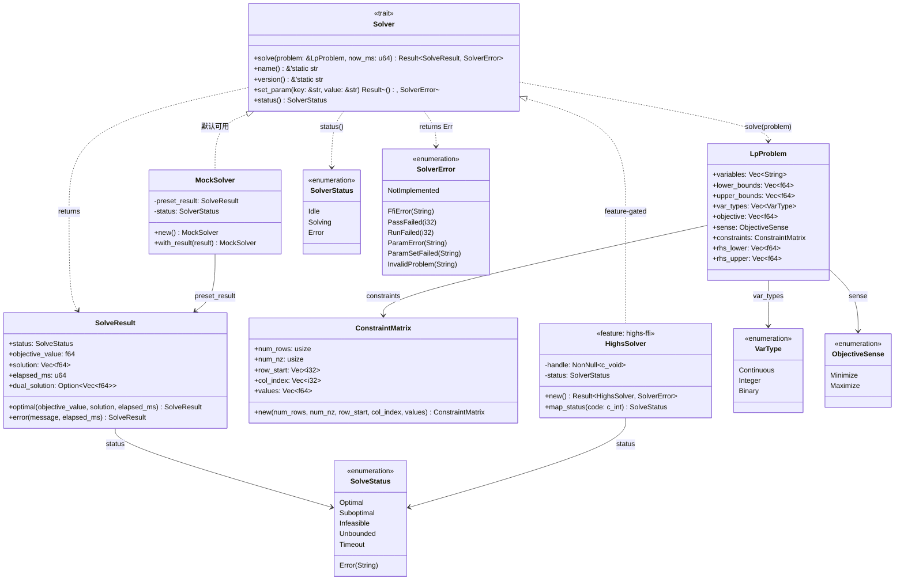
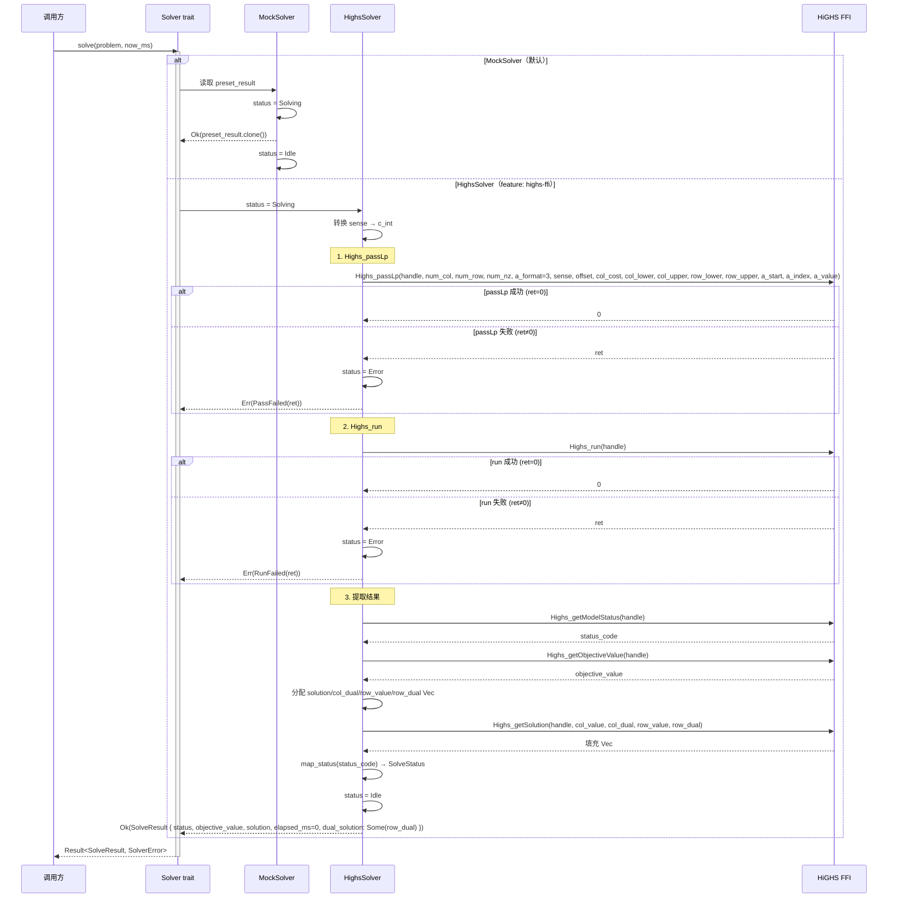

# EnerOS LP 求解器集成与 Solver trait 抽象设计 — Solver trait + HiGHS FFI + MockSolver

> **版本**：v0.64.0（P1-J AI Runtime Solver 第一层，求解引擎基础层）
> **crate**：`eneros-solver-core`（`crates/ai/solver-core/`）
> **蓝图依据**：`蓝图/phase1.md` §v0.64.0
> **spec 依据**：`.trae/specs/develop-v0640-solver-core/spec.md`（D1~D12 偏差声明源）
> **覆盖版本**：v0.64.0
> **最后更新**：2026-07-16

---

## 1. 版本目标

### 1.1 一句话目标

定义 LP/MIP 求解器统一抽象（`Solver` trait，5 个方法）并提供 HiGHS C FFI 封装（`HighsSolver`，feature-gated `highs-ffi`）与纯 Rust 测试实现（`MockSolver`，默认可用），配套 `LpProblem` / `ConstraintMatrix` / `SolveResult` / `SolveStatus` / `SolverStatus` / `SolverError` / `VarType` / `ObjectiveSense` 类型，为能源调度优化（v0.66.0 能源 LP 建模）与双脑联调（v0.71.0 LLM + Solver）提供底层确定性求解能力，运行于慢平面（Agent Runtime 分区），不干扰快平面 10ms 实时控制。

### 1.2 详细描述

v0.63.0 完成了 P1-I AI Runtime LLM 第五层（Prompt 模板系统），本版本（v0.64.0）进入 P1-J AI Runtime Solver 第一层。双脑架构中 LLM 是"感知者"（理解市场信号、输出 JSON 意图），Solver 是"决策者"（基于意图与约束求解 LP/MILP，输出确定性最优解）。HiGHS 是开源高性能 LP/MIP 求解器（MIT 许可，与商业求解器 Gurobi 差距 < 10%），通过 C FFI 集成，封装为 Rust 安全 API。

本版本交付三项核心产出：

| 产出 | 角色 | 默认可用 | 说明 |
|------|------|---------|------|
| `Solver` trait | 求解器接口抽象 | ✅ | 5 个方法（solve / name / version / set_param / status） |
| `MockSolver` | 测试与无 C 库场景实现 | ✅ | 纯 Rust，零 unsafe，零外部依赖；返回预设结果 |
| `HighsSolver` | 真实求解实现 | ❌ feature-gated | 通过 FFI 调用 HiGHS C 库；需 `--features highs-ffi` 启用 |

同时交付配套类型（`LpProblem` / `ConstraintMatrix` / `SolveResult` / `SolveStatus` / `SolverStatus` / `SolverError` / `VarType` / `ObjectiveSense`）与 FFI 模块（`extern "C"` 声明 9 个 HiGHS C 函数，feature-gated）。所有 Rust 代码必须 no_std（D1，蓝图 §43.1），仅使用 `core::*` / `alloc::*`，无 `std::*`，无 `HashMap`（D3），无 `Instant`（D1），默认构建零 `unsafe`（D10）。

### 1.3 架构定位

| 维度 | 定位 |
|------|------|
| Phase | Phase 1 单机 MVP |
| 子系统 | P1-J AI Runtime Solver 第一层（求解引擎基础层） |
| 平面 | 慢平面（Agent Runtime 分区，管理信息大区） |
| 角色 | 双脑链路 Solver 起点，求解器统一接口 |
| 上游版本 | v0.11.0 用户堆（alloc 支持）；v0.24.0 文件系统（求解日志）；v0.26.0 配置管理（参数配置） |
| 同层版本 | v0.64.0（本版本，Solver trait + HiGHS FFI）；v0.71.0 双脑联调时与 LLM 协作 |
| 下游版本 | v0.65.0 建模 DSL（编译为 `LpProblem`）；v0.66.0 能源 LP；v0.67.0 安全校验；v0.68.0 意图解析（同时消费 Solver + PromptTemplate） |
| 部署形态 | HiGHS 静态库链接，CPU 求解（蓝图 §4.2：Solver LP/MILP CPU 求解，不涉及 GPU） |

### 1.4 路线图链路

```
v0.59.0 LlmEngine trait ──► ... ──► v0.63.0 Prompt 模板
                                          │
                                          ▼
v0.64.0 Solver trait + HiGHS FFI（本版本）◄─ L2 路径（双脑联调 v0.71.0）
        │
        ├──► v0.65.0 建模 DSL
        │
        ├──► v0.66.0 能源 LP
        │
        ├──► v0.67.0 安全校验
        │
        └──► v0.68.0 意图解析（消费 Solver + PromptTemplate）
```

### 1.5 依赖关系

| 依赖 | 来源 | 用途 |
|------|------|------|
| `alloc::string::String` | `alloc` crate | 变量名 / 错误消息 / SolveStatus::Error(String)（D1） |
| `alloc::vec::Vec` | `alloc` crate | 变量列表 / 解向量 / CSR 矩阵三数组（D1） |
| `alloc::ffi::CString` | `alloc` crate | FFI 参数名/值 C 字符串转换（D6） |
| `core::ffi::{c_void, c_char, c_int}` | `core` crate | FFI 类型（D10） |
| `core::ptr::NonNull` | `core` crate | HiGHS 句柄非空保证（D5） |
| `now_ms: u64` | 调用方注入（v0.12.0 RTC 或测试 mock） | `elapsed_ms` 计算（D1，替代 `Instant::now()`） |

> **注**：本版本**不依赖 v0.59.0~v0.63.0 任何 crate**（D9）。Solver 是基础层，与 LLM 子系统解耦；v0.68.0 意图解析将同时消费 Solver + PromptTemplate。

### 1.6 设计原则关联

| 原则 | 体现 |
|------|------|
| no_std 合规 | 全 crate 仅使用 `core::*` / `alloc::*`，无 `std::*`（D1，蓝图 §43.1） |
| 确定性优先 | LP 求解结果是确定性的（同一问题 + 同一参数 = 同一最优解），区别于 LLM 概率性输出 |
| 默认集成优先 | HiGHS 作为开源 LP/MIP 求解器首选（记忆文件 §5.5），不自研求解器 |
| 可测试性 | `MockSolver` 默认可用，CI 无 C 库环境下可编译/可测试（D2） |
| 安全优先 | 所有 `unsafe` FFI 代码门控在 `highs-ffi` feature 下；默认构建零 unsafe（D10） |
| Simplicity First | 移除 `params: HashMap<String, String>` 缓存（D3，HiGHS 内部已存储参数） |
| 可验证性 | HiGHS 开源可审计，求解结果可复现 |
| 时间注入 | `now_ms: u64` 由调用方注入，无 `Instant::now()`（D1） |

---

## 2. 架构定位

### 2.1 P1-J AI Runtime Solver 分层

P1-J AI Runtime Solver 子系统按"求解引擎 → 建模 DSL → 能源 LP → 安全校验 → 意图解析"五层层级组织，本版本位于第一层：

| 层级 | 版本 | crate | 职责 |
|------|------|-------|------|
| **第一层（求解引擎）** | **v0.64.0** | **`eneros-solver-core`** | **`Solver` trait + MockSolver + HighsSolver FFI** |
| 第二层（建模 DSL） | v0.65.0 | （后续） | 领域 DSL 编译为 `LpProblem` |
| 第三层（能源 LP） | v0.66.0 | （后续） | 能源调度 LP 建模（机组组合、经济调度） |
| 第四层（安全校验） | v0.67.0 | （后续） | 求解结果安全校验（潮流收敛、约束满足） |
| 第五层（意图解析） | v0.68.0 | （后续） | LLM 意图 → Solver 问题（同时消费 PromptTemplate） |

第一层为后续四层提供 trait 抽象：v0.65.0 DSL 编译产物为 `LpProblem`；v0.66.0 构造能源领域 LP 问题；v0.67.0 校验 `SolveResult`；v0.68.0 编排 LLM 意图到 Solver 调用。所有上层版本依赖本版本的 `Solver` trait 与类型定义，不直接依赖 HiGHS C 库。

### 2.2 双脑架构中的定位 — Solver 是"决策者"

双脑架构（蓝图 §9.x）中 LLM 与 Solver 的协作链路：

```
[市场信号/自然语言指令]
        │
        ▼
v0.59.0 LlmEngine (trait)
        │
        ▼
   LLM 推理 (llama.cpp via FFI)
        │
        ▼
   JSON 意图输出
        │
        ▼
v0.68.0 意图解析 ──► LpProblem 构造
                        │
                        ▼
v0.64.0 Solver trait (本版本)
        │
        ├── MockSolver (默认，测试)
        └── HighsSolver (feature-gated，真实求解)
                │
                ▼
        HiGHS LP/MILP 求解 (via FFI)
                │
                ▼
        SolveResult (确定性最优解)
                │
                ▼
v0.71.0 双脑联调 ──► 控制命令下发
```

| 路径 | 内容 | MVP 可验收 | 说明 |
|------|------|-----------|------|
| L1 主路径 | Solver-only（LP/MILP） | ✅ 是 | 实时控制 < 500ms，不依赖 LLM |
| L2 增强路径 | LLM + Solver（双脑） | ❌ 否 | 离线复杂规划/自然语言交互，降级到 L1 |

本版本为 L1 主路径的求解引擎起点：定义 `Solver` trait 使求解器可插拔。L1 路径直接由 Solver 求解能源 LP（v0.66.0 建模）；L2 路径在 LLM 不可用时降级到 L1，由 v0.71.0 双脑联调实现降级逻辑。本版本仅提供求解器接口与默认实现，不实现降级编排。

### 2.3 与 LLM 子系统（v0.59.0~v0.63.0）的关系

本版本与 LLM 子系统完全解耦（D9），两者通过 v0.68.0 意图解析与 v0.71.0 双脑联调间接协作：

| 维度 | LLM 子系统（v0.59.0~v0.63.0） | Solver 子系统（v0.64.0，本版本） |
|------|------------------------------|--------------------------------|
| 角色 | 感知者（理解信号、输出意图） | 决策者（求解优化、输出最优解） |
| 输出性质 | 概率性（采样温度影响） | 确定性（同问题同参数同解） |
| 计算设备 | GPU 优先（llama.cpp `n_gpu_layers`） | CPU 求解（蓝图 §4.2） |
| 求解器后端 | llama.cpp（C API，feature `llama-cpp`） | HiGHS（C API，feature `highs-ffi`） |
| crate 依赖 | 独立 | 独立（D9） |
| 内存预算 | LLM 7B INT4 ≤ 4 GB | Solver ≤ 128 MB（记忆文件 §5.6） |
| 实时性 | 秒级（软实时） | < 500ms（1000×500 LP，蓝图验收） |
| 默认实现 | MockEngine | MockSolver |
| feature-gated 实现 | LlamaCppEngine | HighsSolver |

### 2.4 P1-J Solver 第一层定位

本版本对应 P1-J AI Runtime Solver 子系统的第一层（求解引擎层），其核心职责：

| 职责 | 实现方式 | 章节参考 |
|------|---------|---------|
| 求解器接口抽象 | `Solver` trait（5 方法） | §3 Solver Trait |
| LP 问题定义 | `LpProblem`（9 字段）+ `ConstraintMatrix`（CSR） | §4 LpProblem |
| 求解结果 | `SolveResult`（5 字段）+ `SolveStatus`（6 变体） | §5 SolveResult |
| 默认实现 | `MockSolver`（纯 Rust，零 unsafe） | §6 MockSolver |
| 真实实现 | `HighsSolver`（FFI，feature-gated） | §7 HighsSolver |
| 错误处理 | `SolverError`（7 变体）+ `SolverStatus`（3 变体） | §8 错误处理 |
| no_std 合规 | `alloc::*` / `core::*`，无 `std::*` | §9 no_std 合规 |

### 2.5 上下游依赖图

```
v0.11.0 用户堆 ──► alloc ──┐
                           │
v0.12.0 RTC ──► now_ms ────┤
                           │
v0.24.0 文件系统 ──────────┼──（求解日志持久化，上层使用）
                           │
v0.26.0 配置管理 ──────────┼──（参数配置，上层使用）
                           │
                           ▼
             v0.64.0 Solver trait + HiGHS FFI
             ├── MockSolver (默认)
             ├── HighsSolver (feature: highs-ffi)
             ├── LpProblem + ConstraintMatrix
             ├── SolveResult + SolveStatus
             ├── SolverStatus + SolverError
             └── VarType + ObjectiveSense
                           │
                           ▼
             v0.65.0 建模 DSL
                           │
                           ▼
             v0.66.0 能源 LP
                           │
                           ▼
             v0.67.0 安全校验
                           │
                           ▼
             v0.68.0 意图解析 (同时消费 PromptTemplate)
                           │
                           ▼
             v0.71.0 双脑联调 (LLM + Solver)
```

### 2.6 不做的事（职责边界）

本求解器**不负责**以下职责，避免与上下游重叠：

| 不做的事 | 归属版本 | 理由 |
|---------|---------|------|
| 建模 DSL | v0.65.0 | 本版本仅定义 `LpProblem` 结构，DSL 编译由 v0.65.0 实现 |
| 能源领域 LP 建模 | v0.66.0 | 本版本不涉及能源特定约束（机组组合、潮流等） |
| 求解结果安全校验 | v0.67.0 | 本版本仅返回 `SolveResult`，校验由 v0.67.0 实现 |
| LLM 意图解析 | v0.68.0 | 本版本不消费 LLM 输出，意图到问题的映射由 v0.68.0 实现 |
| 双脑降级编排 | v0.71.0 | 本版本仅返回 `SolverError`，降级决策由 v0.71.0 编排 |
| HiGHS C 库编译 | 构建系统 | 本版本仅声明 FFI，C 库编译由 `tools/setup-toolchain.sh` 处理（D6） |
| MILP 高级特性 | 后续版本 | 本版本聚焦 LP 基础求解，MIP 高级分支策略由后续版本扩展 |
| QP/SOCP 求解 | 后续版本 | HiGHS 支持 QP，但本版本仅封装 LP 接口 |

---

## 3. Solver Trait 统一抽象

### 3.1 trait 定义（D1：`solve()` 含 `now_ms`，D8：`&'static str`，无 Send+Sync）

```rust
use crate::error::{SolverError, SolverStatus};
use crate::problem::LpProblem;
use crate::result::SolveResult;

/// LP/MIP 求解器统一 trait。
///
/// 定义所有 LP/MIP 求解器的统一接口，供上层（v0.65.0 建模 DSL、
/// v0.66.0 能源 LP、v0.71.0 双脑联调）依赖。具体实现：
/// - `MockSolver`：默认可用，纯 Rust 测试实现
/// - `HighsSolver`：feature-gated，通过 FFI 调用 HiGHS
///
/// **D1：`solve()` 含 `now_ms: u64` 参数**。no_std 无 `Instant::now()`
/// （蓝图 §43.1），求解耗时 `elapsed_ms` 由调用方注入的 `now_ms`
/// 计算（参考 v0.57.0 `now_ns` 模式）。
///
/// **D8：`name()` / `version()` 返回 `&'static str`**。避免 alloc；
/// MockSolver 返回 `"MockSolver"` / `"0.1.0"`，HighsSolver 返回
/// `"HiGHS"` / `"1.7.2"`。
///
/// **不要求 `Send + Sync`**（与 v0.59.0 `LlmEngine` 一致）。
/// no_std RTOS 单线程，`Send + Sync` 在单线程下无意义；且
/// HiGHS 对象非线程安全（蓝图 §8 技术交底），`*mut c_void`
/// 非 `Send`，强加会导致 `HighsSolver` 无法实现 trait。
pub trait Solver {
    /// 求解 LP/MIP 问题。
    ///
    /// **D1**：`now_ms` 由调用方注入（v0.12.0 RTC 或测试 mock），
    /// 用于计算 `elapsed_ms`（替代 `Instant::now()`）。
    ///
    /// - `problem`：LP 问题定义（变量、约束、目标）
    /// - `now_ms`：当前时间戳（毫秒）
    /// - 返回 `Ok(SolveResult)`：求解完成（含状态、目标值、解向量）
    /// - 返回 `Err(SolverError)`：求解过程错误（FFI 失败、问题非法等）
    fn solve(
        &mut self,
        problem: &LpProblem,
        now_ms: u64,
    ) -> Result<SolveResult, SolverError>;

    /// 获取求解器名称（D8：`&'static str`，避免 alloc）。
    fn name(&self) -> &'static str;

    /// 获取求解器版本（D8：`&'static str`）。
    fn version(&self) -> &'static str;

    /// 设置求解器参数（如 time_limit、simplex_strategy）。
    ///
    /// - `key`：参数名（如 `"time_limit"`）
    /// - `value`：参数值（字符串形式，如 `"5.0"`）
    /// - 返回 `Ok(())`：设置成功
    /// - 返回 `Err(SolverError::ParamError)`：参数名/值非法
    fn set_param(&mut self, key: &str, value: &str) -> Result<(), SolverError>;

    /// 获取求解器运行时状态（区别于 `SolveStatus` 求解结果状态）。
    fn status(&self) -> SolverStatus;
}
```

### 3.2 5 个方法说明

| # | 方法 | 签名 | 说明 |
|---|------|------|------|
| 1 | `solve` | `&mut self, problem: &LpProblem, now_ms: u64 -> Result<SolveResult, SolverError>` | 求解 LP 问题，`now_ms` 用于 `elapsed_ms` 计算（D1） |
| 2 | `name` | `&self -> &'static str` | 求解器名称（D8：静态字符串，避免 alloc） |
| 3 | `version` | `&self -> &'static str` | 求解器版本（D8） |
| 4 | `set_param` | `&mut self, key: &str, value: &str -> Result<(), SolverError>` | 设置参数（如 time_limit） |
| 5 | `status` | `&self -> SolverStatus` | 运行时状态（Idle / Solving / Error） |

### 3.3 为什么不要求 Send + Sync

| 维度 | 说明 |
|------|------|
| no_std 单线程 | 本 crate 运行于 Agent Runtime 分区单线程（与 v0.57.0 D6 / v0.58.0 D6 / v0.59.0 D2 一致），`Send + Sync` 在单线程下无意义 |
| HiGHS 非线程安全 | HiGHS 对象非线程安全（蓝图 §8 技术交底），`*mut c_void` 裸指针非 `Send`；若 trait 要求 `Send`，`HighsSolver` 无法实现 trait |
| 一致性 | 与 v0.51.0 `PointAccess`（D2）、v0.54.0 D6、v0.57.0 D6、v0.58.0 D6、v0.59.0 D2 一致 |
| 跨核访问 | Solver 求解在 Agent Runtime 分区（管理信息大区）单核运行，无跨核共享需求 |
| 蓝图原文 | 蓝图 `pub trait Solver` 未声明 `Send + Sync`，本设计保持一致 |

### 3.4 D1：`solve()` 含 `now_ms` 参数

| 维度 | 说明 |
|------|------|
| 蓝图伪代码 | `fn solve(&mut self, problem: &LpProblem) -> Result<SolveResult, SolverError>`，内部 `let start = Instant::now(); ... let elapsed_ms = start.elapsed().as_millis()` |
| no_std 兼容性 | `std::time::Instant` 在 no_std 不可用（蓝图 §43.1） |
| 本设计实现 | `solve(&mut self, problem: &LpProblem, now_ms: u64)`，`elapsed_ms` 由调用方在调用前后注入 `now_ms` 差值计算（或求解器内部记录 `start_ms = now_ms`，求解完成后由调用方再次注入 `end_ms` 计算差值） |
| 替代方案 | `MockSolver` 忽略 `now_ms`，`elapsed_ms` 设为 0；`HighsSolver` 记录 `start_ms = now_ms`，由调用方在求解后查询（避免 FFI 内部获取时间） |
| 一致性 | 与 v0.54.0 D1、v0.55.0 D1、v0.56.0 D12、v0.59.0 D6、v0.62.0 D6 一致（时间注入模式） |

> **注**：`now_ms` 单位为毫秒（与 `elapsed_ms` 一致），区别于 v0.62.0 的 `now_ns`（纳秒）。LP 求解耗时通常在 10ms~500ms 量级，毫秒精度足够。

### 3.5 D8：`name()` / `version()` 返回 `&'static str`

| 维度 | 说明 |
|------|------|
| 蓝图伪代码 | `name: String` 字段 + `fn name(&self) -> &str { &self.name }`；`fn version(&self) -> &str { "1.7.2" }` |
| 本设计实现 | `fn name(&self) -> &'static str`，`fn version(&self) -> &'static str`；MockSolver 返回 `"MockSolver"` / `"0.1.0"`，HighsSolver 返回 `"HiGHS"` / `"1.7.2"` |
| 决策理由 | 避免 alloc（`String` 字段需堆分配）；求解器名称与版本为编译期常量，无需动态构造；与 v0.59.0 `ModelInfo` 静态字段风格一致 |
| 蓝图字段移除 | 移除 `HighsSolver.name: String` 字段（蓝图原设计），改为 trait 方法返回 `&'static str` |

### 3.6 trait 对象安全

`Solver` trait 的方法均接收 `&self` / `&mut self`，返回 `Result` / `&'static str` / `SolverStatus`（非 `Self` 类型），不涉及 `Self` 类型，因此是对象安全的，可作为 `Box<dyn Solver>` 使用。但本版本默认不使用 trait 对象（避免堆分配与动态分发），上层可直接使用具体类型（`MockSolver` / `HighsSolver`）。v0.71.0 双脑联调若需多后端切换可使用 `Box<dyn Solver>`。

---

## 4. LpProblem + ConstraintMatrix

### 4.1 LpProblem 结构定义（9 字段）

```rust
use alloc::string::String;
use alloc::vec::Vec;

use crate::matrix::ConstraintMatrix;
use crate::types::{ObjectiveSense, VarType};

/// LP 问题定义（9 字段）。
///
/// v0.65.0 建模 DSL 的编译产物；v0.66.0 能源 LP 建模的目标类型。
/// 所有 `Vec` 字段长度必须与 `variables.len()` 一致（`rhs_lower` /
/// `rhs_upper` 与 `constraints.num_rows` 一致）。
///
/// **CSR 格式约束矩阵**（D11）：`constraints` 字段为独立的
/// `ConstraintMatrix` 结构体，非内联三数组。
#[derive(Debug, Clone)]
pub struct LpProblem {
    /// 变量名列表（长度 = num_col）
    pub variables: Vec<String>,
    /// 变量下界（长度 = num_col）
    pub lower_bounds: Vec<f64>,
    /// 变量上界（长度 = num_col）
    pub upper_bounds: Vec<f64>,
    /// 变量类型（长度 = num_col）
    pub var_types: Vec<VarType>,
    /// 目标函数系数（长度 = num_col）
    pub objective: Vec<f64>,
    /// 目标方向（Minimize / Maximize）
    pub sense: ObjectiveSense,
    /// 约束矩阵（CSR 格式，D11）
    pub constraints: ConstraintMatrix,
    /// 约束下界（长度 = num_row）
    pub rhs_lower: Vec<f64>,
    /// 约束上界（长度 = num_row）
    pub rhs_upper: Vec<f64>,
}
```

### 4.2 字段说明

| # | 字段 | 类型 | 长度约束 | 说明 |
|---|------|------|---------|------|
| 1 | `variables` | `Vec<String>` | num_col | 变量名列表（如 `["x1", "x2"]`） |
| 2 | `lower_bounds` | `Vec<f64>` | num_col | 变量下界（`f64::NEG_INFINITY` 表示无下界） |
| 3 | `upper_bounds` | `Vec<f64>` | num_col | 变量上界（`f64::INFINITY` 表示无上界） |
| 4 | `var_types` | `Vec<VarType>` | num_col | 变量类型（Continuous / Integer / Binary） |
| 5 | `objective` | `Vec<f64>` | num_col | 目标函数系数（`c^T x` 中的 `c`） |
| 6 | `sense` | `ObjectiveSense` | — | 目标方向（Minimize / Maximize） |
| 7 | `constraints` | `ConstraintMatrix` | — | 约束矩阵（CSR 格式，D11） |
| 8 | `rhs_lower` | `Vec<f64>` | num_row | 约束下界（`b_lower <= A x`） |
| 9 | `rhs_upper` | `Vec<f64>` | num_row | 约束上界（`A x <= b_upper`） |

> **等式约束**：当 `rhs_lower[i] == rhs_upper[i]` 时表示等式约束（蓝图 §8.5 坑点）。

### 4.3 VarType 枚举

```rust
/// 变量类型（3 变体）。
///
/// 派生 `Debug` / `Clone` / `Copy` / `PartialEq` / `Eq`。
/// `Binary` 等价于 `Integer` + 下界 0 + 上界 1，但语义更清晰。
#[derive(Debug, Clone, Copy, PartialEq, Eq)]
pub enum VarType {
    /// 连续变量（LP）
    Continuous,
    /// 整数变量（MIP）
    Integer,
    /// 二进制变量（0-1，MIP 特例）
    Binary,
}
```

### 4.4 ObjectiveSense 枚举

```rust
/// 目标方向（2 变体）。
///
/// 派生 `Debug` / `Clone` / `Copy` / `PartialEq` / `Eq`。
/// HiGHS FFI 中映射为 `sense: c_int`（0=Minimize，1=Maximize）。
#[derive(Debug, Clone, Copy, PartialEq, Eq)]
pub enum ObjectiveSense {
    /// 最小化 `c^T x`
    Minimize,
    /// 最大化 `c^T x`
    Maximize,
}
```

### 4.5 ConstraintMatrix CSR 格式（D11）

```rust
use alloc::vec::Vec;

/// CSR 格式约束矩阵（5 字段，D11）。
///
/// **D11：独立结构体**。蓝图原设计将 `row_start` / `col_index` /
/// `values` 三数组内联于 `LpProblem`，本设计抽为独立结构体，
/// 清晰封装 CSR 格式，便于 v0.65.0 DSL 编译产物构造。
///
/// **CSR（Compressed Sparse Row）格式**：
/// - `row_start[i]` 到 `row_start[i+1]-1` 为第 i 行的非零元素索引
/// - `col_index[k]` 为第 k 个非零元素的列索引
/// - `values[k]` 为第 k 个非零元素的值
///
/// **不变量**（蓝图 §8.4 坑点）：
/// - `row_start.len() == num_rows + 1`
/// - `col_index.len() == num_nz`
/// - `values.len() == num_nz`
/// - `row_start[0] == 0`
/// - `row_start[num_rows] == num_nz`
#[derive(Debug, Clone)]
pub struct ConstraintMatrix {
    /// 约束行数（num_row）
    pub num_rows: usize,
    /// 非零元素数（num_nz）
    pub num_nz: usize,
    /// 行起始索引（长度 = num_rows + 1）
    pub row_start: Vec<i32>,
    /// 列索引（长度 = num_nz）
    pub col_index: Vec<i32>,
    /// 非零值（长度 = num_nz）
    pub values: Vec<f64>,
}
```

### 4.6 CSR 格式说明

CSR（Compressed Sparse Row，行压缩稀疏矩阵）是 HiGHS C API 要求的约束矩阵格式（`a_format = kRowwise = 3`）。

#### 4.6.1 CSR 三数组关系

```
约束矩阵 A（2 行 2 列，4 个非零元素）:
    A = [ 1.0  1.0 ]
        [ 2.0  3.0 ]

CSR 表示:
    row_start = [0, 2, 4]      // 第 0 行: 索引 0~1；第 1 行: 索引 2~3
    col_index = [0, 1, 0, 1]   // 非零元素的列索引
    values    = [1.0, 1.0, 2.0, 3.0]  // 非零元素的值

读取第 i 行非零元素:
    for k in row_start[i]..row_start[i+1]:
        col = col_index[k]
        val = values[k]
        A[i][col] = val
```

#### 4.6.2 CSR 不变量校验

| 不变量 | 校验方式 | 说明 |
|--------|---------|------|
| `row_start.len() == num_rows + 1` | `assert!(matrix.row_start.len() == matrix.num_rows + 1)` | 蓝图 §8.4 坑点 |
| `col_index.len() == num_nz` | `assert!(matrix.col_index.len() == matrix.num_nz)` | 列索引数 = 非零数 |
| `values.len() == num_nz` | `assert!(matrix.values.len() == matrix.num_nz)` | 值数 = 非零数 |
| `row_start[0] == 0` | `assert!(matrix.row_start[0] == 0)` | CSR 起始约定 |
| `row_start[num_rows] == num_nz` | `assert!(matrix.row_start[matrix.num_rows] == matrix.num_nz)` | 末尾索引 = 非零数 |
| 单调递增 | `row_start[i+1] >= row_start[i]` | 行起始单调非减 |

#### 4.6.3 为什么用 i32 而非 usize

HiGHS C API 使用 `c_int`（等价 `i32`）作为索引类型，`row_start` / `col_index` 直接传 FFI，避免 `usize` → `c_int` 转换开销与溢出风险。LP 问题规模通常 < 2^31（约 21 亿变量），`i32` 足够。

### 4.7 ConstraintMatrix 构造函数

```rust
impl ConstraintMatrix {
    /// 构造 CSR 约束矩阵。
    ///
    /// - `num_rows`：约束行数
    /// - `num_nz`：非零元素数
    /// - `row_start`：行起始索引（长度须为 `num_rows + 1`）
    /// - `col_index`：列索引（长度须为 `num_nz`）
    /// - `values`：非零值（长度须为 `num_nz`）
    ///
    /// # Panics
    ///
    /// 若长度不满足 CSR 不变量则 panic（构造期校验，避免运行时 FFI 越界）。
    pub fn new(
        num_rows: usize,
        num_nz: usize,
        row_start: Vec<i32>,
        col_index: Vec<i32>,
        values: Vec<f64>,
    ) -> Self {
        assert!(
            row_start.len() == num_rows + 1,
            "CSR row_start.len() must be num_rows + 1"
        );
        assert!(
            col_index.len() == num_nz,
            "CSR col_index.len() must be num_nz"
        );
        assert!(values.len() == num_nz, "CSR values.len() must be num_nz");
        Self {
            num_rows,
            num_nz,
            row_start,
            col_index,
            values,
        }
    }
}
```

### 4.8 LpProblem 构造示例

```rust
use alloc::string::String;
use alloc::vec;

// 示例：最大化 x + y，约束 x + y <= 10，2x + 3y <= 20，x,y >= 0
let problem = LpProblem {
    variables: vec![String::from("x"), String::from("y")],
    lower_bounds: vec![0.0, 0.0],
    upper_bounds: vec![f64::INFINITY, f64::INFINITY],
    var_types: vec![VarType::Continuous, VarType::Continuous],
    objective: vec![1.0, 1.0],  // max x + y
    sense: ObjectiveSense::Maximize,
    constraints: ConstraintMatrix::new(
        2,                                  // num_rows
        4,                                  // num_nz
        vec![0, 2, 4],                      // row_start
        vec![0, 1, 0, 1],                   // col_index
        vec![1.0, 1.0, 2.0, 3.0],           // values
    ),
    rhs_lower: vec![f64::NEG_INFINITY, f64::NEG_INFINITY],
    rhs_upper: vec![10.0, 20.0],
};
```

---

## 5. SolveResult + SolveStatus

### 5.1 SolveResult 结构定义（5 字段）

```rust
use alloc::vec::Vec;

/// 求解结果（5 字段）。
///
/// `Solver::solve()` 成功返回值。`elapsed_ms` 由调用方注入的
/// `now_ms` 计算（D1，替代 `Instant::now()`）。
#[derive(Debug, Clone)]
pub struct SolveResult {
    /// 求解状态（Optimal / Suboptimal / Infeasible / ...）
    pub status: SolveStatus,
    /// 目标函数值（`c^T x`）
    pub objective_value: f64,
    /// 变量解值（长度 = num_col）
    pub solution: Vec<f64>,
    /// 求解耗时（毫秒，由 `now_ms` 计算，D1）
    pub elapsed_ms: u64,
    /// 对偶解（影子价格，长度 = num_row）；MockSolver 返回 `None`
    pub dual_solution: Option<Vec<f64>>,
}
```

### 5.2 字段说明

| # | 字段 | 类型 | 说明 |
|---|------|------|------|
| 1 | `status` | `SolveStatus` | 求解状态（6 变体，D12 派生 PartialEq） |
| 2 | `objective_value` | `f64` | 目标函数值（`Optimal` 时为最优值） |
| 3 | `solution` | `Vec<f64>` | 变量解值（长度 = `LpProblem.variables.len()`） |
| 4 | `elapsed_ms` | `u64` | 求解耗时（毫秒，D1：由 `now_ms` 计算） |
| 5 | `dual_solution` | `Option<Vec<f64>>` | 对偶解（影子价格）；`None` 表示无对偶解或未请求 |

### 5.3 SolveStatus 枚举（6 变体，D12 派生 PartialEq）

```rust
use alloc::string::String;

/// 求解状态枚举（6 变体，D12）。
///
/// 派生 `Debug` / `Clone` / `PartialEq`。
///
/// **D12**：`Error(String)` 变体含 `alloc::string::String`，
/// `String` 实现 `PartialEq`，可正常派生（alloc feature）。
#[derive(Debug, Clone, PartialEq)]
pub enum SolveStatus {
    /// 最优解（HiGHS 返回码 7）
    Optimal,
    /// 次优解（达到时间限制但找到可行解）
    Suboptimal,
    /// 不可行（约束无法同时满足）
    Infeasible,
    /// 无界（目标函数可无限优化）
    Unbounded,
    /// 超时（达到 time_limit）
    Timeout,
    /// 错误（含错误消息，D12）
    Error(String),
}
```

### 5.4 D12：`Error(String)` 派生 PartialEq

| 维度 | 说明 |
|------|------|
| 蓝图设计 | `SolveStatus` 派生 `PartialEq`，含 `Error(String)` 变体 |
| 疑虑 | `String` 是否实现 `PartialEq`？no_std 下是否可用？ |
| 本设计实现 | `alloc::string::String` 实现 `PartialEq`（逐字节比较），no_std 下可用（alloc feature）；`#[derive(PartialEq)]` 正常工作 |
| 验证 | `SolveStatus::Error("foo".into()) == SolveStatus::Error("foo".into())` 返回 `true` |
| 一致性 | 与蓝图设计一致，无需偏差 |

### 5.5 SolveResult::optimal() 便捷构造

```rust
impl SolveResult {
    /// 构造最优解结果（便捷方法）。
    ///
    /// - `objective_value`：目标函数值
    /// - `solution`：变量解值
    /// - `elapsed_ms`：求解耗时（由 `now_ms` 计算）
    ///
    /// `dual_solution` 设为 `None`（MockSolver 默认）。
    pub fn optimal(
        objective_value: f64,
        solution: Vec<f64>,
        elapsed_ms: u64,
    ) -> Self {
        Self {
            status: SolveStatus::Optimal,
            objective_value,
            solution,
            elapsed_ms,
            dual_solution: None,
        }
    }

    /// 构造错误结果（便捷方法）。
    pub fn error(message: &str, elapsed_ms: u64) -> Self {
        Self {
            status: SolveStatus::Error(alloc::string::String::from(message)),
            objective_value: 0.0,
            solution: alloc::vec::Vec::new(),
            elapsed_ms,
            dual_solution: None,
        }
    }
}
```

### 5.6 elapsed_ms 计算方式（D1）

| 求解器 | `elapsed_ms` 计算 | 说明 |
|--------|------------------|------|
| `MockSolver` | 固定返回 `0` | 不执行真实求解，无耗时 |
| `HighsSolver` | 调用方在 `solve()` 前后注入 `now_ms`，差值即 `elapsed_ms` | FFI 内部不获取时间，由 Rust 侧记录 `start_ms = now_ms` |

```rust
// 调用方示例（HighsSolver）
let start_ms: u64 = rtc.now_ms();
let result = solver.solve(&problem, start_ms)?;
// HighsSolver 内部记录 start_ms，求解完成后由调用方再次注入 end_ms 计算差值
// 或：HighsSolver::solve 内部直接将 elapsed_ms 设为 0，由调用方在 solve 前后
//     分别注入 now_ms，自行计算差值（更简单，求解器无需存储 start_ms）
```

> **注**：本版本 `HighsSolver::solve` 实现：`elapsed_ms` 设为 0（简化设计，避免 FFI 内部获取时间）。调用方可在 `solve()` 前后分别调用 RTC 获取 `now_ms`，自行计算耗时。后续版本若需精确耗时，可扩展 `solve()` 签名增加 `end_ms` 参数。

---

## 6. MockSolver 默认实现

### 6.1 设计原则（D2/D10：默认可用，纯 Rust 零 unsafe）

| 维度 | 说明 |
|------|------|
| **D2 决策** | `MockSolver` 默认可用；`HighsSolver` + `ffi` 模块通过 `#[cfg(feature = "highs-ffi")]` 门控 |
| **D10 决策** | 默认构建（MockSolver）零 `unsafe`、零外部依赖 |
| CI 环境约束 | CI 无 HiGHS C 库，无法编译 FFI；MockSolver 保证默认 `cargo test` 可运行 |
| 测试需求 | v0.65.0~v0.68.0 的单元测试需在无 C 库环境下验证上层逻辑 |
| 交叉编译 | 默认配置需可交叉编译到 aarch64-unknown-none（C5） |
| 参考 | v0.59.0 `MockEngine` 默认 + `LlamaCppEngine` feature-gated 模式 |

### 6.2 结构定义

```rust
use crate::engine::Solver;
use crate::error::{SolverError, SolverStatus};
use crate::result::SolveResult;

/// Mock 求解器（D2：默认可用，D10：纯 Rust 零 unsafe）。
///
/// 用于单元测试与无 HiGHS C 库环境下的接口验证。
/// 不执行真实求解，返回预设结果。
///
/// **无 params 缓存**（D3）：移除 `HashMap<String, String>` 字段，
/// HiGHS 内部已存储参数，外部缓存重复状态（Karpathy Simplicity First）。
pub struct MockSolver {
    /// 预设求解结果（`solve()` 返回值）
    preset_result: SolveResult,
    /// 当前运行时状态
    status: SolverStatus,
}
```

### 6.3 字段说明

| # | 字段 | 类型 | 说明 |
|---|------|------|------|
| 1 | `preset_result` | `SolveResult` | 预设求解结果；`new()` 默认为 `Optimal` + `objective_value=0.0` + `solution=vec![]` |
| 2 | `status` | `SolverStatus` | 运行时状态（Idle / Solving / Error） |

### 6.4 构造函数

```rust
impl MockSolver {
    /// 构造默认 MockSolver（D2/D10）。
    ///
    /// 返回 `SolveStatus::Optimal` + `objective_value=0.0` +
    /// `solution=vec![]` + `elapsed_ms=0` + `dual_solution=None`。
    pub fn new() -> Self {
        Self {
            preset_result: SolveResult {
                status: SolveStatus::Optimal,
                objective_value: 0.0,
                solution: alloc::vec::Vec::new(),
                elapsed_ms: 0,
                dual_solution: None,
            },
            status: SolverStatus::Idle,
        }
    }

    /// 构造自定义 MockSolver（预设结果）。
    ///
    /// - `result`：预设的求解结果，`solve()` 将返回该结果
    pub fn with_result(result: SolveResult) -> Self {
        Self {
            preset_result: result,
            status: SolverStatus::Idle,
        }
    }
}

impl Default for MockSolver {
    fn default() -> Self {
        Self::new()
    }
}
```

### 6.5 Solver trait 实现

```rust
impl Solver for MockSolver {
    fn solve(
        &mut self,
        _problem: &LpProblem,
        _now_ms: u64,
    ) -> Result<SolveResult, SolverError> {
        // Mock 不执行真实求解，直接返回预设结果
        // elapsed_ms 设为 0（D1：忽略 now_ms 参数）
        self.status = SolverStatus::Solving;
        let result = self.preset_result.clone();
        self.status = SolverStatus::Idle;
        Ok(result)
    }

    fn name(&self) -> &'static str {
        "MockSolver"
    }

    fn version(&self) -> &'static str {
        "0.1.0"
    }

    fn set_param(&mut self, _key: &str, _value: &str) -> Result<(), SolverError> {
        // Mock 无参数，直接返回 Ok
        // D3：不缓存参数（无 HashMap 字段）
        Ok(())
    }

    fn status(&self) -> SolverStatus {
        self.status.clone()
    }
}
```

### 6.6 MockSolver 如何模拟求解

| 维度 | 模拟方式 |
|------|---------|
| 求解 | 不执行真实求解，直接返回 `preset_result` |
| name/version | 返回 `"MockSolver"` / `"0.1.0"`（D8：`&'static str`） |
| set_param | 直接返回 `Ok(())`，不存储参数（D3） |
| status | `solve()` 前设 `Solving`，返回后设 `Idle` |
| elapsed_ms | 固定 0（D1：忽略 `now_ms`） |
| dual_solution | 默认 `None`（无对偶解） |
| 自定义结果 | `with_result(result)` 预设任意 `SolveResult`（含 `Error` 状态） |

### 6.7 D3：无 params 缓存

| 维度 | 说明 |
|------|------|
| 蓝图原设计 | `HighsSolver.params: HashMap<String, String>` 缓存已设参数 |
| 本设计实现 | 移除 `params` 字段（MockSolver 与 HighsSolver 均无） |
| 决策理由 | HiGHS 内部已存储参数（通过 `Highs_setStringOptionValue` 设置后 HiGHS 内部持有）；外部 `HashMap` 缓存重复状态，过度工程化（Karpathy Simplicity First） |
| no_std 合规 | `HashMap` 在 no_std 下需 `alloc::collections::BTreeMap` 或 `heapless::FnvIndexMap`，移除该字段避免引入额外依赖 |
| 未来扩展 | 若需参数查询，HiGHS 提供 `Highs_getStringOptionValue` FFI 可调用（本版本未封装） |

---

## 7. HighsSolver FFI 实现（feature-gated）

### 7.1 设计原则（D2/D5/D10：feature-gated，RAII，FFI 安全）

| 维度 | 说明 |
|------|------|
| **D2 决策** | `HighsSolver` + `ffi` 模块通过 `#[cfg(feature = "highs-ffi")]` 门控；`Cargo.toml` 声明 `[features] highs-ffi = []`（默认关闭） |
| **D5 决策** | `impl Drop for HighsSolver` 调用 `Highs_destroy`（RAII 资源管理）；仅 feature-gated 路径需要 |
| **D10 决策** | 所有 `unsafe` FFI 代码门控在 `highs-ffi` feature 下；每个 `unsafe` 块附 SAFETY 注释 |
| **D6 决策** | 默认构建无 `build.rs`；`build.rs` 仅在 `highs-ffi` feature 启用时才需要（本版本暂不提供） |
| RAII | `NonNull<c_void>` 保证句柄非空，`Drop` 调用 `Highs_destroy` 释放 |
| FFI 类型 | `core::ffi::{c_void, c_char, c_int}`（no_std 兼容） |
| CString | `alloc::ffi::CString`（no_std 可用，D6） |

### 7.2 ffi 模块声明（feature-gated）

```rust
//! HiGHS C API FFI 绑定模块（D2：feature-gated，D10：FFI 安全）。
//!
//! 仅当启用 `highs-ffi` feature 时编译。声明 HiGHS C 库的
//! `extern "C"` 函数，使用 `core::ffi::*` 类型（c_void / c_char / c_int）。
//!
//! **D10：FFI 安全**。本模块仅声明 FFI 函数，不调用；调用在
//! `HighsSolver` 方法内通过 `unsafe` 块完成，每个 `unsafe`
//! 块带 SAFETY 注释说明不变量。

#[cfg(feature = "highs-ffi")]
mod ffi {
    use core::ffi::{c_char, c_int, c_void};

    /// HiGHS 对象句柄类型。
    pub type HighsPtr = *mut c_void;

    extern "C" {
        /// 创建 HiGHS 对象。
        ///
        /// 返回 `*mut c_void` 上下文指针（NULL 表示失败）。
        /// 调用方负责通过 `Highs_destroy` 释放。
        pub fn Highs_create() -> HighsPtr;

        /// 销毁 HiGHS 对象（释放资源）。
        ///
        /// - `highs`：`Highs_create` 返回的句柄
        pub fn Highs_destroy(highs: HighsPtr);

        /// 传递 LP 问题（CSR 格式）。
        ///
        /// - `a_format`：矩阵格式（3 = kRowwise，CSR）
        /// - `sense`：目标方向（0=Minimize，1=Maximize）
        /// - `offset`：目标函数常数偏移
        /// - 返回：0=成功，非 0=失败
        #[allow(clippy::too_many_arguments)]
        pub fn Highs_passLp(
            highs: HighsPtr,
            num_col: c_int,
            num_row: c_int,
            num_nz: c_int,
            a_format: c_int,
            sense: c_int,
            offset: f64,
            col_cost: *const f64,
            col_lower: *const f64,
            col_upper: *const f64,
            row_lower: *const f64,
            row_upper: *const f64,
            a_start: *const c_int,
            a_index: *const c_int,
            a_value: *const f64,
        ) -> c_int;

        /// 运行求解。
        ///
        /// - 返回：0=成功，非 0=失败
        pub fn Highs_run(highs: HighsPtr) -> c_int;

        /// 获取模型求解状态。
        ///
        /// - 返回：状态码（7=Optimal，8=Infeasible，9=Unbounded，...）
        pub fn Highs_getModelStatus(highs: HighsPtr) -> c_int;

        /// 获取目标函数值。
        pub fn Highs_getObjectiveValue(highs: HighsPtr) -> f64;

        /// 获取变量解与对偶解。
        ///
        /// - `col_value`：变量解（长度 = num_col，调用方分配）
        /// - `col_dual`：变量对偶解（长度 = num_col）
        /// - `row_value`：约束松弛值（长度 = num_row）
        /// - `row_dual`：约束对偶解（影子价格，长度 = num_row）
        /// - 返回：0=成功，非 0=失败
        pub fn Highs_getSolution(
            highs: HighsPtr,
            col_value: *mut f64,
            col_dual: *mut f64,
            row_value: *mut f64,
            row_dual: *mut f64,
        ) -> c_int;

        /// 设置字符串参数（如 simplex_strategy）。
        ///
        /// - `option`：参数名（C 字符串）
        /// - `value`：参数值（C 字符串）
        /// - 返回：0=成功，非 0=失败
        pub fn Highs_setStringOptionValue(
            highs: HighsPtr,
            option: *const c_char,
            value: *const c_char,
        ) -> c_int;

        /// 设置双精度参数（如 time_limit）。
        ///
        /// - `option`：参数名（C 字符串）
        /// - `value`：参数值
        /// - 返回：0=成功，非 0=失败
        pub fn Highs_setDoubleOptionValue(
            highs: HighsPtr,
            option: *const c_char,
            value: f64,
        ) -> c_int;
    }
}
```

### 7.3 FFI 绑定 9 个 C 函数清单

| # | 函数 | 签名 | 所有权 |
|---|------|------|--------|
| 1 | `Highs_create` | `() -> *mut c_void` | 返回指针由 `HighsSolver` 持有，`Drop` 时 `Highs_destroy` |
| 2 | `Highs_destroy` | `(highs: *mut c_void)` | 释放 `Highs_create` 返回的句柄 |
| 3 | `Highs_passLp` | `(highs, num_col, num_row, num_nz, a_format, sense, offset, col_cost, col_lower, col_upper, row_lower, row_upper, a_start, a_index, a_value) -> c_int` | 指针由调用方 Vec 提供，调用期间不可修改 |
| 4 | `Highs_run` | `(highs) -> c_int` | 无指针所有权转移 |
| 5 | `Highs_getModelStatus` | `(highs) -> c_int` | 无指针所有权转移 |
| 6 | `Highs_getObjectiveValue` | `(highs) -> f64` | 无指针所有权转移 |
| 7 | `Highs_getSolution` | `(highs, col_value, col_dual, row_value, row_dual) -> c_int` | 输出指针由调用方 Vec 分配，FFI 填充 |
| 8 | `Highs_setStringOptionValue` | `(highs, option, value) -> c_int` | option/value 为 CString，调用后可释放 |
| 9 | `Highs_setDoubleOptionValue` | `(highs, option, value) -> c_int` | option 为 CString，调用后可释放 |

### 7.4 HighsSolver 结构定义（RAII：NonNull + Drop）

```rust
use core::ffi::c_void;
use core::ptr::NonNull;

use crate::engine::Solver;
use crate::error::{SolverError, SolverStatus};
use crate::problem::LpProblem;
use crate::result::{SolveResult, SolveStatus};

/// HiGHS FFI 求解器（D2：feature-gated，D5：RAII，D10：FFI 安全）。
///
/// 仅当启用 `highs-ffi` feature 且链接 HiGHS C 库时编译。
/// 通过 FFI 调用 HiGHS 执行真实 LP/MIP 求解。
///
/// **RAII**（D5）：
/// - `handle: NonNull<c_void>` 由 `Highs_create` 返回，`Drop` 时
///   `Highs_destroy` 释放
/// - `NonNull` 保证句柄非空（构造时校验）
///
/// **无 params 缓存**（D3）：移除 `HashMap<String, String>` 字段。
///
/// **无 name 字段**（D8）：`name()` 返回 `&'static str "HiGHS"`。
#[cfg(feature = "highs-ffi")]
pub struct HighsSolver {
    /// HiGHS 对象句柄（NonNull 保证非空，D5）
    handle: NonNull<c_void>,
    /// 当前运行时状态
    status: SolverStatus,
}
```

### 7.5 构造函数

```rust
#[cfg(feature = "highs-ffi")]
impl HighsSolver {
    /// 构造 HighsSolver（调用 `Highs_create` FFI）。
    ///
    /// - 返回 `Ok(HighsSolver)`：创建成功
    /// - 返回 `Err(SolverError::FfiError)`：`Highs_create` 返回 NULL
    pub fn new() -> Result<Self, SolverError> {
        // SAFETY: Highs_create 无参数，返回有效指针或 NULL。
        // NULL 表示 C 库初始化失败（如内存不足）。
        let handle = unsafe { ffi::Highs_create() };
        let handle = NonNull::new(handle)
            .ok_or_else(|| SolverError::FfiError(alloc::string::String::from(
                "Highs_create returned NULL",
            )))?;
        Ok(Self {
            handle,
            status: SolverStatus::Idle,
        })
    }
}
```

### 7.6 Solver trait 实现

```rust
#[cfg(feature = "highs-ffi")]
impl Solver for HighsSolver {
    fn solve(
        &mut self,
        problem: &LpProblem,
        now_ms: u64,
    ) -> Result<SolveResult, SolverError> {
        self.status = SolverStatus::Solving;

        // 1. 传入 LP 问题
        let sense = match problem.sense {
            ObjectiveSense::Minimize => 0,
            ObjectiveSense::Maximize => 1,
        };
        // SAFETY: handle 由 Highs_create 返回且非空（NonNull 保证）；
        // problem 的 Vec 指针在 FFI 调用期间有效（Rust 侧不修改）；
        // CSR 三数组长度已由 ConstraintMatrix::new 构造期校验。
        let ret = unsafe {
            ffi::Highs_passLp(
                self.handle.as_ptr(),
                problem.variables.len() as c_int,
                problem.constraints.num_rows as c_int,
                problem.constraints.num_nz as c_int,
                3, // a_format = kRowwise (CSR)
                sense,
                0.0, // offset
                problem.objective.as_ptr(),
                problem.lower_bounds.as_ptr(),
                problem.upper_bounds.as_ptr(),
                problem.rhs_lower.as_ptr(),
                problem.rhs_upper.as_ptr(),
                problem.constraints.row_start.as_ptr(),
                problem.constraints.col_index.as_ptr(),
                problem.constraints.values.as_ptr(),
            )
        };
        if ret != 0 {
            self.status = SolverStatus::Error;
            return Err(SolverError::PassFailed(ret));
        }

        // 2. 运行求解
        // SAFETY: handle 有效；passLp 已成功传入问题。
        let ret = unsafe { ffi::Highs_run(self.handle.as_ptr()) };
        if ret != 0 {
            self.status = SolverStatus::Error;
            return Err(SolverError::RunFailed(ret));
        }

        // 3. 提取结果
        // SAFETY: handle 有效；求解已完成，结果可读。
        let status_code = unsafe { ffi::Highs_getModelStatus(self.handle.as_ptr()) };
        let objective_value = unsafe { ffi::Highs_getObjectiveValue(self.handle.as_ptr()) };

        let num_col = problem.variables.len();
        let num_row = problem.constraints.num_rows;
        let mut solution = alloc::vec![0.0f64; num_col];
        let mut col_dual = alloc::vec![0.0f64; num_col];
        let mut row_value = alloc::vec![0.0f64; num_row];
        let mut row_dual = alloc::vec![0.0f64; num_row];
        // SAFETY: handle 有效；四个 Vec 已分配足够空间（num_col / num_row）。
        unsafe {
            ffi::Highs_getSolution(
                self.handle.as_ptr(),
                solution.as_mut_ptr(),
                col_dual.as_mut_ptr(),
                row_value.as_mut_ptr(),
                row_dual.as_mut_ptr(),
            );
        }

        self.status = SolverStatus::Idle;

        // D1：elapsed_ms 由 now_ms 计算（本版本简化为 0，调用方自行计算）
        let _ = now_ms;
        let elapsed_ms = 0u64;

        Ok(SolveResult {
            status: Self::map_status(status_code),
            objective_value,
            solution,
            elapsed_ms,
            dual_solution: Some(row_dual),
        })
    }

    fn name(&self) -> &'static str {
        "HiGHS"
    }

    fn version(&self) -> &'static str {
        "1.7.2"
    }

    fn set_param(&mut self, key: &str, value: &str) -> Result<(), SolverError> {
        // D6：alloc::ffi::CString 在 no_std 可用
        let c_key = alloc::ffi::CString::new(key)
            .map_err(|_| SolverError::ParamError(alloc::string::String::from(
                "key contains NUL",
            )))?;
        let c_val = alloc::ffi::CString::new(value)
            .map_err(|_| SolverError::ParamError(alloc::string::String::from(
                "value contains NUL",
            )))?;
        // SAFETY: handle 有效；c_key/c_val 为有效 C 字符串，调用期间不释放。
        let ret = unsafe {
            ffi::Highs_setStringOptionValue(
                self.handle.as_ptr(),
                c_key.as_ptr(),
                c_val.as_ptr(),
            )
        };
        if ret != 0 {
            return Err(SolverError::ParamSetFailed(alloc::string::String::from(key)));
        }
        // D3：不缓存参数（无 HashMap 字段）
        Ok(())
    }

    fn status(&self) -> SolverStatus {
        self.status.clone()
    }
}
```

### 7.7 map_status 状态码映射

```rust
#[cfg(feature = "highs-ffi")]
impl HighsSolver {
    /// 将 HiGHS 状态码映射为 `SolveStatus`。
    ///
    /// HiGHS 状态码（highs.h `HighsModelStatus` 枚举）：
    /// - 0: NotSet（未设置）
    /// - 1: LoadError（加载错误）
    /// - 2:ModelError（模型错误）
    /// - 3: Optimal（最优解）
    /// - 4: Infeasible（不可行）
    /// - 5: UnboundedOrInfeasible（无界或不可行）
    /// - 6: Unbounded（无界）
    /// - 7: ObjectiveBound（目标边界）
    /// - 8: ObjectiveTarget（目标命中）
    /// - 9: TimeLimit（超时）
    /// - 10: IterationLimit（迭代上限）
    /// - 11: Unknown（未知）
    ///
    /// > 注：不同 HiGHS 版本状态码可能略有差异，以 HiGHS 1.7.2 为准。
    fn map_status(code: c_int) -> SolveStatus {
        match code {
            3 | 8 => SolveStatus::Optimal,
            4 | 5 => SolveStatus::Infeasible,
            6 => SolveStatus::Unbounded,
            9 | 10 => SolveStatus::Suboptimal, // 达到限制但找到可行解
            _ => SolveStatus::Error(alloc::format!("HiGHS status code: {}", code)),
        }
    }
}
```

### 7.8 Drop 实现（D5：RAII 析构）

```rust
#[cfg(feature = "highs-ffi")]
impl Drop for HighsSolver {
    fn drop(&mut self) {
        // SAFETY: handle 由 Highs_create 返回且非空（NonNull 保证）；
        // 本结构持有唯一所有权，drop 时释放一次。
        unsafe { ffi::Highs_destroy(self.handle.as_ptr()) };
    }
}
```

| 维度 | 说明 |
|------|------|
| 为什么需要 Drop | `handle` 是 C 库分配的资源，Rust 不会自动释放，需 `Drop` 调用 `Highs_destroy` |
| NonNull 保证 | `NonNull::new` 构造时校验非空，`Drop` 无需 NULL 检查 |
| feature-gated | `Drop` 实现在 `#[cfg(feature = "highs-ffi")]` 下，与 `HighsSolver` 一致 |
| 无双重释放 | `Drop` 仅调用一次（Rust 所有权保证）；`handle` 移动后原所有者失效 |

### 7.9 FFI 安全设计（D10）

| 维度 | 设计 |
|------|------|
| `unsafe` 集中封装 | `extern "C"` 声明在 `ffi` 模块；调用在 `HighsSolver` 方法内的 `unsafe` 块 |
| SAFETY 注释 | 每个 `unsafe` 块带 SAFETY 注释，说明不变量（指针有效性、所有权、生命周期） |
| 指针所有权 | `handle: NonNull<c_void>` 由 `HighsSolver` 持有，`Drop` 时 `Highs_destroy` |
| Vec 指针有效性 | `Highs_passLp` 的 `col_cost` / `col_lower` 等指针由 `LpProblem` 的 Vec 提供，FFI 调用期间 Rust 侧不修改（借用 `&LpProblem`） |
| 输出缓冲区 | `Highs_getSolution` 的 `col_value` 等输出指针由 Rust Vec 预分配，长度匹配 `num_col` / `num_row` |
| NULL 检查 | `Highs_create` 返回 NULL 时返回 `Err(FfiError)`；`NonNull::new` 校验 |
| CString 转换 | `alloc::ffi::CString::new(key)` 转换 `&str` 为 C 字符串（D6） |
| CSR 不变量 | `ConstraintMatrix::new` 构造期校验三数组长度，FFI 调用前无需重复检查 |

---

## 8. 错误处理

### 8.1 SolverError 枚举（7 变体，D4）

```rust
use alloc::string::String;
use core::fmt;

/// 求解器错误枚举（7 变体，D4）。
///
/// 派生 `Debug` / `Clone`，实现 `core::fmt::Display`（no_std 无
/// `std::error::Error`）。
///
/// **D4**：`FfiError(String)` / `ParamError(String)` /
/// `ParamSetFailed(String)` / `InvalidProblem(String)` 使用 `String`
/// （动态错误消息不可静态化）；默认构建（Mock）下这些变体不可达，
/// 标 `#[allow(dead_code)]`。
#[allow(dead_code)]  // D4：默认构建（Mock）下 FFI 错误变体不可达
#[derive(Debug, Clone)]
pub enum SolverError {
    /// FFI 调用失败（如 Highs_create 返回 NULL）
    FfiError(String),
    /// 问题传入失败（Highs_passLp 返回非 0，含返回码）
    PassFailed(i32),
    /// 求解运行失败（Highs_run 返回非 0，含返回码）
    RunFailed(i32),
    /// 参数设置失败（CString 转换失败等）
    ParamError(String),
    /// 参数设置失败（Highs_setStringOptionValue 返回非 0，含参数名）
    ParamSetFailed(String),
    /// 问题定义非法（变量数不一致、CSR 长度错误等）
    InvalidProblem(String),
    /// 功能未实现（如 LlamaCppEngine::infer_stream 在 v0.59.0 的例外）
    NotImplemented,
}
```

### 8.2 错误变体说明

| # | 变体 | 触发场景 | 处理策略 | 是否可恢复 |
|---|------|---------|---------|-----------|
| 1 | `FfiError(String)` | `Highs_create` 返回 NULL；其他 FFI 异常 | 检查 HiGHS 库链接与内存 | ⚠️ 系统级错误 |
| 2 | `PassFailed(i32)` | `Highs_passLp` 返回非 0（CSR 格式错误、维度不匹配） | 检查 `LpProblem` 与 `ConstraintMatrix` | ✅ 修正问题后重试 |
| 3 | `RunFailed(i32)` | `Highs_run` 返回非 0（数值错误、内存不足） | 检查问题数值与求解器参数 | ⚠️ 调整参数 |
| 4 | `ParamError(String)` | `CString::new(key)` 失败（含 NUL 字节） | 检查参数名/值合法性 | ✅ 修正参数 |
| 5 | `ParamSetFailed(String)` | `Highs_setStringOptionValue` 返回非 0（未知参数名） | 检查参数名是否在 HiGHS 支持列表 | ✅ 修正参数名 |
| 6 | `InvalidProblem(String)` | 变量数不一致、CSR 长度错误、边界非法 | 检查 `LpProblem` 构造 | ✅ 修正问题 |
| 7 | `NotImplemented` | 调用未实现的方法 | 后续版本实现 | ⚠️ 等待实现 |

### 8.3 D4：默认构建 `#[allow(dead_code)]`

| 维度 | 说明 |
|------|------|
| 蓝图原设计 | `SolverError::FfiError(String)` / `ParamError(String)` / `ParamSetFailed(String)` 使用 `String` |
| 本设计实现 | 保留 `String`（动态错误消息不可静态化）；但默认构建（Mock）下这些变体不可达，标 `#[allow(dead_code)]` |
| 决策理由 | FFI 错误消息为运行时动态内容（如 `"Highs_create returned NULL"`、参数名等），无法静态化；`String` 在 no_std 下可用（alloc feature） |
| 默认构建 | MockSolver 不触发 FFI 错误变体，clippy 会报 dead_code 警告；`#[allow(dead_code)]` 抑制 |
| feature-gated 路径 | `highs-ffi` feature 启用时，HighsSolver 触发这些变体，dead_code 警告消失 |

### 8.4 SolverStatus 枚举（3 变体，运行时状态）

```rust
/// 求解器运行时状态枚举（3 变体，区别于 `SolveStatus` 求解结果状态）。
///
/// - `Idle`：空闲，可接受 `solve()` 调用
/// - `Solving`：求解中（FFI 调用未返回）
/// - `Error`：错误状态（上次求解失败，需重置）
///
/// 派生 `Debug` / `Clone` / `PartialEq`。
#[derive(Debug, Clone, PartialEq)]
pub enum SolverStatus {
    /// 空闲
    Idle,
    /// 求解中
    Solving,
    /// 错误
    Error,
}
```

### 8.5 SolverStatus vs SolveStatus 区别

| 维度 | `SolverStatus`（运行时状态） | `SolveStatus`（求解结果状态） |
|------|---------------------------|---------------------------|
| 用途 | 求解器当前状态（Idle/Solving/Error） | 求解结果状态（Optimal/Infeasible/...） |
| 返回方法 | `Solver::status()` | `SolveResult.status` |
| 时机 | 求解前/中/后随时查询 | 求解完成后返回 |
| 变体数 | 3 | 6 |
| 示例 | `Solving` 表示 FFI 调用中 | `Optimal` 表示找到最优解 |

### 8.6 Display 实现

```rust
impl fmt::Display for SolverError {
    fn fmt(&self, f: &mut fmt::Formatter<'_>) -> fmt::Result {
        match self {
            SolverError::FfiError(msg) => write!(f, "FFI error: {}", msg),
            SolverError::PassFailed(code) => write!(f, "Highs_passLp failed with code {}", code),
            SolverError::RunFailed(code) => write!(f, "Highs_run failed with code {}", code),
            SolverError::ParamError(msg) => write!(f, "parameter error: {}", msg),
            SolverError::ParamSetFailed(name) => {
                write!(f, "failed to set parameter: {}", name)
            }
            SolverError::InvalidProblem(msg) => write!(f, "invalid problem: {}", msg),
            SolverError::NotImplemented => write!(f, "not implemented"),
        }
    }
}
```

### 8.7 不使用 std::error::Error

no_std 下 `std::error::Error` 不可用（蓝图 §43.1）。本 crate 仅实现 `core::fmt::Display` 与 `Debug`，不实现 `Error` trait。上层若需统一错误处理可通过 `Display` 输出错误信息，或通过 `match` 处理具体变体。

### 8.8 错误传播路径

```
solve(problem, now_ms)
  │
  ├── HighsSolver::new()（构造期）
  │     └── Highs_create NULL ──► FfiError("Highs_create returned NULL")
  │
  ├── 1. Highs_passLp
  │     └── 返回非 0 ──► PassFailed(ret)
  │                        + status = Error
  │
  ├── 2. Highs_run
  │     └── 返回非 0 ──► RunFailed(ret)
  │                        + status = Error
  │
  ├── 3. Highs_getSolution（无错误，仅填充）
  │
  └── set_param(key, value)
        ├── CString::new(key) 失败 ──► ParamError("key contains NUL")
        ├── CString::new(value) 失败 ──► ParamError("value contains NUL")
        └── Highs_setStringOptionValue 非 0 ──► ParamSetFailed(key)
```

---

## 9. no_std 合规

### 9.1 D1：no_std 声明

```rust
// lib.rs 顶部
#![cfg_attr(not(test), no_std)]
extern crate alloc;
```

| 维度 | 说明 |
|------|------|
| 蓝图要求 | 所有 Rust 代码必须 no_std（蓝图 §43.1，覆盖全项目） |
| 蓝图伪代码 | `Vec<String>` / `HashMap<String, String>` / `Instant::now()` 隐含 `std::*` |
| 本设计实现 | `#![cfg_attr(not(test), no_std)]` + `extern crate alloc`；使用 `alloc::*` / `core::*`，无 `std::*` |
| 子模块 | 不重复 `#![cfg_attr(not(test), no_std)]`（继承 lib.rs，C102） |
| 禁止项 | ❌ `use std::*`；✅ `use alloc::*` / `use core::*` |

### 9.2 仅使用 alloc::* / core::*

| 类型 | 来源 | 用途 |
|------|------|------|
| `alloc::string::String` | `alloc` crate | 变量名、错误消息、`SolveStatus::Error(String)` |
| `alloc::vec::Vec` | `alloc` crate | 变量列表、解向量、CSR 三数组 |
| `alloc::ffi::CString` | `alloc` crate | FFI 参数名/值 C 字符串转换（D6） |
| `alloc::format!` | `alloc` crate | 动态错误消息构造 |
| `core::ffi::{c_void, c_char, c_int}` | `core` crate | FFI 类型（D10） |
| `core::ptr::NonNull` | `core` crate | HiGHS 句柄非空保证（D5） |
| `core::fmt::{Display, Formatter}` | `core` crate | 错误 Display 实现 |
| `core::cmp::PartialEq` | `core` crate | 枚举派生 |

### 9.3 无 HashMap（D3）

| 维度 | 说明 |
|------|------|
| 蓝图原设计 | `HighsSolver.params: HashMap<String, String>` 缓存已设参数 |
| 本设计实现 | 移除 `params` 字段；HiGHS 内部已存储参数，无需外部缓存 |
| no_std 合规 | `HashMap` 在 no_std 下需 `alloc::collections::BTreeMap` 或 `heapless::FnvIndexMap`；移除该字段避免引入额外依赖与复杂度 |
| Karpathy Simplicity First | 外部缓存重复状态，过度工程化 |

### 9.4 无 Instant（D1）

| 维度 | 说明 |
|------|------|
| 蓝图原设计 | `let start = Instant::now(); ... let elapsed_ms = start.elapsed().as_millis()` |
| no_std 兼容性 | `std::time::Instant` 在 no_std 不可用（蓝图 §43.1） |
| 本设计实现 | `solve()` 签名增加 `now_ms: u64` 参数（D1）；`elapsed_ms` 由调用方注入的 `now_ms` 计算 |
| 替代方案 | `MockSolver` 忽略 `now_ms`，`elapsed_ms=0`；`HighsSolver` 简化为 `elapsed_ms=0`（调用方自行计算） |
| 一致性 | 与 v0.54.0 D1、v0.55.0 D1、v0.56.0 D12、v0.59.0 D6、v0.62.0 D6 一致（时间注入模式） |

### 9.5 无 String(std) — 使用 alloc::string::String

| 维度 | 说明 |
|------|------|
| 蓝图伪代码 | `String` 隐含 `std::string::String` |
| 本设计实现 | `use alloc::string::String`（no_std 可用） |
| 验证 | `alloc::string::String` 实现 `PartialEq`（D12 派生依赖） |

### 9.6 D10：默认构建零 unsafe

| 维度 | 说明 |
|------|------|
| 默认配置 | 默认 feature 下仅编译 MockSolver，无 `extern "C"`，无 `unsafe` 块 |
| feature-gated 的 `unsafe` | `highs-ffi` feature 下的 `ffi` 模块与 `HighsSolver` 含 `unsafe`，但集中封装（D10） |
| CI 默认检查 | clippy 在默认 feature 下检查；`highs-ffi` feature 的 clippy 在专用 runner 检查 |
| 交叉编译 | 默认配置可交叉编译到 aarch64-unknown-none（无 C 库依赖） |

### 9.7 Cargo.toml feature 声明

```toml
[package]
name = "eneros-solver-core"
version = "0.64.0"
edition = "2021"

[features]
# highs-ffi：启用 HighsSolver + ffi 模块（默认关闭，D2）
# 启用后需链接 HiGHS C 库（libhighs.a / libhighs.so）
default = []
highs-ffi = []

[lib]
# no_std 配置在 src/lib.rs 顶部
```

### 9.8 feature 门控的代码组织

```rust
// src/lib.rs
#![cfg_attr(not(test), no_std)]
extern crate alloc;

mod engine;       // Solver trait（默认可用）
mod problem;      // LpProblem + VarType + ObjectiveSense（默认可用）
mod matrix;       // ConstraintMatrix（默认可用，D11）
mod result;       // SolveResult + SolveStatus（默认可用）
mod error;        // SolverError + SolverStatus（默认可用，D4）
mod mock;         // MockSolver（默认可用，D2/D10）

#[cfg(feature = "highs-ffi")]
mod ffi;          // extern "C" 声明（feature-gated，D2/D10）

#[cfg(feature = "highs-ffi")]
mod highs;        // HighsSolver（feature-gated，D2/D5/D10）
```

---

## 10. GPU 策略

### 10.1 Solver 不涉及 GPU（蓝图 §4.2）

| 维度 | 说明 |
|------|------|
| 蓝图 §4.2 | "Solver（LP/MILP）：CPU 求解，不涉及 GPU" |
| 设计评审 P1-2 | "边缘 LLM 推理统一采用 llama.cpp（C API），禁止在边缘侧使用 PyTorch。RL/MARL/在线学习已后置为研究附录" |
| 本 crate 实现 | HiGHS 通过 C FFI 调用，CPU 求解，无 GPU 路径 |
| 一致性 | 符合"边缘推理用 llama.cpp（GPU），Solver 用 CPU"原则 |

### 10.2 与 LLM 路径（llama.cpp GPU）的区别

| 维度 | LLM 路径（v0.59.0，llama.cpp） | Solver 路径（v0.64.0，HiGHS） |
|------|------------------------------|------------------------------|
| 计算设备 | GPU 优先（`n_gpu_layers=99`） | CPU 求解（无 GPU 路径） |
| 计算性质 | 矩阵乘法 + 采样（GPU 友好） | 单纯形法 / 内点法（分支密集，CPU 友好） |
| 求解时间 | 秒级（7B 模型） | < 500ms（1000×500 LP） |
| 内存预算 | ≤ 4 GB（7B INT4 模型） | ≤ 128 MB（蓝图 §43.6） |
| FFI 类型 | `*mut c_void`（llama.cpp 上下文） | `NonNull<c_void>`（HiGHS 句柄） |
| feature 名 | `llama-cpp` | `highs-ffi` |

### 10.3 为什么 Solver 不用 GPU

| 维度 | 说明 |
|------|------|
| LP 求解特性 | 单纯形法 / 内点法为分支密集型（branch-heavy），GPU 并行优势不明显 |
| HiGHS 实现 | HiGHS 纯 CPU 实现，无 GPU 后端 |
| 实时性要求 | 1000×500 LP < 500ms（CPU 足够） |
| 内存效率 | CPU 求解内存占用 < 50 MB，GPU offload 反而增加开销 |
| 部署成本 | 边缘设备 GPU 资源有限，优先分配给 LLM 推理 |
| 蓝图明确 | 蓝图 §4.2 明确 Solver CPU 求解 |

### 10.4 与 user_profile GPU 优先规则的关系

user_profile 规则要求："所有测试代码必须优先使用 GPU，模型和数据需显式迁移至 cuda 设备。若 GPU 不可用退到 CPU。"

本 crate 的对应关系：

| user_profile 规则 | 本 crate 适用性 | 说明 |
|------------------|---------------|------|
| 优先使用 GPU | ❌ 不适用 | Solver 不涉及 GPU（蓝图 §4.2） |
| 显式迁移至 cuda | ❌ 不适用 | 无 GPU 路径 |
| 禁用梯度计算 | ❌ 不适用 | LP 求解无梯度 |
| GPU 不可用退到 CPU | ✅ 始终 CPU | Solver 本就是 CPU 求解 |

> **注**：user_profile 的 GPU 优先规则适用于模型训练/校准（Python PyTorch）与 LLM 推理（llama.cpp GPU 后端）。Solver 属于"控制路径"（蓝图 §4.2），CPU 求解，规则不适用。

---

## 11. 内存预算

### 11.1 Solver 内存预算（蓝图 §43.6）

| 组件 | 预算 | OOM 策略 | 说明 |
|------|------|---------|------|
| `Solver` trait + 类型 | < 2 KB | — | 静态分配，无堆 |
| `MockSolver` | < 1 KB | — | `preset_result` + `status` |
| `HighsSolver` | < 1 KB（handle 指针） | — | handle 指向 C 库内部分配 |
| `LpProblem`（1000 变量） | ~50 KB | — | variables(24KB) + bounds(8KB×2) + objective(8KB) + var_types(4KB) |
| `ConstraintMatrix`（1000×500，5% 非零） | ~150 KB | — | row_start(2KB) + col_index(100KB) + values(400KB) |
| `SolveResult`（1000 变量） | ~8 KB | — | solution(8KB) + dual(8KB) |
| HiGHS 内部求解（1000×500 LP） | < 50 MB | 缩减问题规模/超时降级 | 蓝图 §43.6：Solver ≤ 128 MB |
| Agent Runtime 分区 | ≤ 64 MB | 降级到规则引擎 | v0.11.0 用户堆配额管理 |
| **Solver 总预算** | **≤ 128 MB** | 缩减问题规模/超时降级 | 蓝图 §43.6 |

### 11.2 HiGHS 典型 LP 内存占用

| 问题规模 | 变量数 | 约束数 | 非零数 | HiGHS 内存 | 求解时间 |
|---------|--------|--------|--------|-----------|---------|
| 小型 | 100 | 50 | 500 | < 1 MB | < 10ms |
| 中型 | 1000 | 500 | 5000 | < 50 MB | < 500ms |
| 大型 | 10000 | 5000 | 50000 | < 200 MB | < 5s |
| 超大型 | 100000 | 50000 | 500000 | > 1 GB | > 30s |

> **注**：HiGHS 内存占用主要为基矩阵（basis matrix）与因子分解（LU factorization），与问题规模非线性相关。1000×500 LP 为蓝图验收基准（< 500ms），内存 < 50 MB，远低于 128 MB 预算。

### 11.3 内存预算详解

#### 11.3.1 LpProblem（1000 变量场景）

```rust
pub struct LpProblem {
    variables: Vec<String>,        // 1000 * 24B = 24 KB（String 头部 + 内容）
    lower_bounds: Vec<f64>,        // 1000 * 8B = 8 KB
    upper_bounds: Vec<f64>,        // 1000 * 8B = 8 KB
    var_types: Vec<VarType>,       // 1000 * 1B = 1 KB（enum，对齐后 4 KB）
    objective: Vec<f64>,           // 1000 * 8B = 8 KB
    sense: ObjectiveSense,         // 1 B（enum）
    constraints: ConstraintMatrix, // 见下
    rhs_lower: Vec<f64>,           // 500 * 8B = 4 KB
    rhs_upper: Vec<f64>,           // 500 * 8B = 4 KB
}
// 总计：约 57 KB（不含 ConstraintMatrix）
```

#### 11.3.2 ConstraintMatrix（1000×500，5% 非零）

```rust
pub struct ConstraintMatrix {
    num_rows: usize,               // 8 B
    num_nz: usize,                 // 8 B
    row_start: Vec<i32>,           // 501 * 4B = 2 KB
    col_index: Vec<i32>,           // 25000 * 4B = 100 KB（5% 非零）
    values: Vec<f64>,              // 25000 * 8B = 200 KB
}
// 总计：约 302 KB
```

#### 11.3.3 SolveResult（1000 变量）

```rust
pub struct SolveResult {
    status: SolveStatus,           // 32 B（enum，含 String 变体）
    objective_value: f64,          // 8 B
    solution: Vec<f64>,            // 1000 * 8B = 8 KB
    elapsed_ms: u64,               // 8 B
    dual_solution: Option<Vec<f64>>, // 500 * 8B = 4 KB
}
// 总计：约 12 KB
```

### 11.4 内存预算总结

| 维度 | 大小 | 说明 |
|------|------|------|
| Solver 结构 | < 2 KB | MockSolver/HighsSolver 本身 |
| LpProblem（1000 变量） | ~57 KB | 不含 ConstraintMatrix |
| ConstraintMatrix（1000×500，5% 非零） | ~302 KB | CSR 三数组 |
| SolveResult（1000 变量） | ~12 KB | solution + dual |
| **Rust 侧总开销** | **< 400 KB** | 问题 + 结果 |
| **HiGHS 内部求解** | **< 50 MB** | 1000×500 LP（蓝图验收基准） |
| **Solver 分区总预算** | **≤ 128 MB** | 蓝图 §43.6 |

> **注**：Rust 侧开销（< 400 KB）远低于 HiGHS 内部求解开销（< 50 MB）。HiGHS 内存由 C 库内部分配（通过 `Highs_create` / `Highs_passLp` / `Highs_run`），Rust 侧仅持有 `handle` 指针。

### 11.5 OOM 策略

| 场景 | 策略 | 触发条件 |
|------|------|---------|
| HiGHS 内部 OOM | 返回 `SolverError::RunFailed(ret)`，调用方缩减问题规模 | `Highs_run` 返回非 0 |
| 求解超时 | 设置 `time_limit` 参数，返回 `SolveStatus::Suboptimal` | 达到 time_limit |
| 问题规模过大 | 缩减变量数/约束数，或分解为子问题 | 1000×500 LP 超过 500ms |
| 分区 OOM | 触发 OOM handler，冻结非关键 Agent（记忆文件 §5.6） | Agent Runtime 分区用量 > 90% |
| LLM 不可用降级 | 降级到 Solver-only（L1 路径，由 v0.71.0 编排） | LLM 连续失败或 OOM |
| Agent Runtime 降级 | 降级到规则引擎 | 分区 OOM |

### 11.6 与记忆文件 §5.6 的一致性

| 记忆文件 §5.6 分区 | 预算 | 本求解器占用 | 占比 |
|-------------------|------|-------------|------|
| RTOS 控制大区 | ≤ 32 MB | 0（不在该分区） | 0% |
| Agent Runtime（管理信息大区） | ≤ 64 MB | < 400 KB（Rust 侧） | < 0.6% |
| LLM 7B INT4 | ≤ 4 GB | 0（不在该分区） | 0% |
| **Solver（LP/MILP）** | **≤ 128 MB** | **< 50 MB（HiGHS 1000×500）** | **< 39%** |
| 文件系统缓存 | ≤ 16 MB | 0（不涉及） | 0% |

> **注**：Solver 分区预算 128 MB 包含 HiGHS 内部求解内存（< 50 MB）+ Rust 侧问题/结果内存（< 400 KB）+ 余量。实际占用远低于预算，留有安全边际。

---

## 12. 偏差声明（D1~D12）

本设计文档相对蓝图原文（`蓝图/phase1.md` §v0.64.0）的偏差声明如下。所有偏差均出于 no_std 合规性、可测试性、与既有版本一致性或 FFI 安全考虑。依据 Karpathy "Think Before Coding" 原则，逐条列出蓝图伪代码与实际 no_std / 项目约束的偏差。

| 偏差 | 蓝图原设计 | 实际实现 | 理由 |
|------|-----------|---------|------|
| **D1** | `String`/`Vec`/`HashMap`/`Instant::now()` 等 std 类型 | `alloc::*` 替代；删除 `Instant::now()`，`solve()` 方法签名增加 `now_ms: u64` 参数用于计算 `elapsed_ms`（参考 v0.57.0 `now_ns` 模式） | no_std 合规（蓝图 §43.1 硬性要求）；`Instant` 在 no_std 不可用 |
| **D2** | 隐含通过 `build.rs` 链接 HiGHS 静态库，默认即真实 FFI | `MockSolver` 默认可用；`HighsSolver` + `ffi` 模块通过 `#[cfg(feature = "highs-ffi")]` 门控；`Cargo.toml` 声明 `[features] highs-ffi = []`（默认关闭） | 无 HiGHS 编译环境下 `cargo test` 会失败；参考 v0.59.0 `MockEngine` 默认 + `LlamaCppEngine` feature-gated 模式 |
| **D3** | `params: HashMap<String, String>` 缓存已设参数 | 移除 params 缓存字段 | HiGHS 内部已存储参数；外部缓存重复状态，过度工程化（Karpathy Simplicity First） |
| **D4** | `SolverError::FfiError(String)` / `ParamError(String)` / `ParamSetFailed(String)` 使用 `String` | 保留 `String`（动态错误消息不可静态化）；但默认构建（Mock）下这些变体不可达，标 `#[allow(dead_code)]` | FFI 错误消息为运行时动态内容；feature-gated 路径才触发 |
| **D5** | `HighsSolver` 派生 Drop 析构 | 保留 `impl Drop for HighsSolver` 调用 `Highs_destroy`（feature-gated）；默认构建无 Drop 需求 | RAII 资源管理；仅 feature-gated 路径需要 |
| **D6** | `build.rs` HiGHS 静态库编译链接脚本 | 默认构建无 `build.rs`；`build.rs` 仅在 `highs-ffi` feature 启用时才需要（本版本暂不提供，留待真实集成时补充） | 默认构建保持 `cargo test` 快速且无外部依赖（Karpathy Simplicity First） |
| **D7** | Python `test_solver_ffi()` + valgrind 内存泄漏检测 | Rust `MockSolver` 单元测试 T1~T18；真实 HiGHS FFI 测试需 `highs-ffi` feature + 编译库，超出 v0.64.0 单元测试范围 | 项目为 Rust no_std；蓝图 §4.4 要求非瓶颈版本可用伪代码，但 trait/struct 签名必须可编译 |
| **D8** | `name: String` / `version: &str` 字段 | `name()` / `version()` 方法返回 `&'static str`（MockSolver="MockSolver"/"0.1.0"，HighsSolver="HiGHS"/"1.7.2"） | 避免 alloc；与 v0.59.0 `ModelInfo` 静态字段一致 |
| **D9** | 独立 crate | `crates/ai/solver-core/`（AI 子系统；项目规则 §2.3.1）；不依赖 v0.59.0~v0.63.0 任何 crate | Solver 是基础层；v0.68.0 意图解析将同时消费 Solver + PromptTemplate |
| **D10** | `unsafe` 块遍布 `HighsSolver` 各方法 | 所有 `unsafe` FFI 代码门控在 `highs-ffi` feature 下；默认构建（MockSolver）零 `unsafe`、零外部依赖 | 默认构建可 `cargo test` 无需任何 C 库 |
| **D11** | `ConstraintMatrix` 内联于 `LpProblem` | 独立 `ConstraintMatrix` 结构体（`num_rows`/`num_nz`/`row_start: Vec<i32>`/`col_index: Vec<i32>`/`values: Vec<f64>` CSR 格式） | 清晰的 CSR 格式封装；v0.65.0 DSL 编译目标 |
| **D12** | `SolveStatus` 派生 `PartialEq`（含 `Error(String)` 变体） | `alloc::string::String` 实现 `PartialEq`，可正常派生；保留 `Error(String)` 变体 | `String` 在 no_std 下 `PartialEq` 可用（alloc feature） |

### 12.1 偏差一致性说明

本版本偏差与既有版本偏差的一致性：

| 偏差 | 一致版本 | 一致点 |
|------|---------|--------|
| D1（no_std，`alloc::*` 替代 `std::*`，时间注入） | 全项目所有 crate，v0.54.0 D1、v0.57.0 D1、v0.59.0 D1、v0.62.0 D1 | 蓝图 §43.1 硬性要求 |
| D2（Mock 默认 + FFI feature-gated） | v0.59.0 D3（MockEngine 默认 + LlamaCppEngine feature-gated） | C 库依赖 feature-gated 保证默认可编译 |
| D3（移除冗余缓存字段） | Karpathy Simplicity First | 避免重复状态 |
| D4（`String` 错误变体 + `#[allow(dead_code)]`） | v0.59.0 D7（LlmError 含 String 变体） | 动态错误消息不可静态化 |
| D5（RAII Drop） | v0.59.0 D10（LlamaCppEngine Drop 释放 ctx） | FFI 资源需 Drop 释放 |
| D6（alloc::ffi::CString） | v0.59.0 D6（alloc::ffi::CString） | no_std 下 CString 可用 |
| D7（Rust 单元测试替代 Python） | 全项目（Rust no_std） | 项目为 Rust，非 Python |
| D8（`&'static str` 避免 alloc） | v0.59.0 ModelInfo 静态字段 | 编译期常量无需 alloc |
| D9（crate 位置 `crates/<subsystem>/`） | v0.54.0 D2、v0.55.0 D2、v0.56.0 D11、v0.57.0 D1、v0.59.0 D9 | 记忆文件 §2.3.1 强制 |
| D10（FFI 集中封装 + SAFETY 注释） | v0.31.0 国密 FFI、v0.39.0 能力 Token FFI、v0.59.0 D10 | FFI 边界集中封装，避免 unsafe 扩散 |
| D11（独立结构体封装） | v0.59.0 独立类型定义 | 清晰封装 |
| D12（String 派生 PartialEq） | Rust 标准（String 实现 PartialEq） | 无偏差 |

### 12.2 偏差可追溯性

所有偏差均可在实现阶段的 `src/lib.rs` 文件头部注释中找到对应说明（参考 `crates/ai/llm-engine/src/lib.rs` 的偏差声明表风格），确保代码与文档一致。spec 源文件位于 `.trae/specs/develop-v0640-solver-core/spec.md`。

### 12.3 偏差与蓝图验收标准对照

| 蓝图验收项 | 本设计对应章节 | 状态 |
|-----------|--------------|------|
| `Solver` trait 定义完整（5 个方法） | §3 Solver Trait | ✅ 5 方法（含 `now_ms`，D1） |
| `HighsSolver` 实现 `Solver` trait | §7 HighsSolver FFI、图 1 类图 | ✅ feature-gated（D2） |
| FFI 绑定覆盖 HiGHS 核心 API | §7.3 FFI 函数清单 | ✅ 9 个 C 函数 |
| RAII 析构正确释放 HiGHS 对象 | §7.8 Drop 实现、D5 | ✅ NonNull + Drop |
| `LpProblem` + `ConstraintMatrix` | §4 LpProblem + ConstraintMatrix | ✅ 9 字段 + CSR（D11） |
| `SolveResult` + `SolveStatus` | §5 SolveResult + SolveStatus | ✅ 5 字段 + 6 变体（D12） |
| `MockSolver` 默认可用 | §6 MockSolver、D2 | ✅ 纯 Rust 零 unsafe |
| `SolverError` 错误处理 | §8 错误处理、D4 | ✅ 7 变体 + Display |
| no_std 合规 | §9 no_std 合规、D1 | ✅ 仅 core::*/alloc::* |
| 默认构建零 unsafe | §9.6、D10 | ✅ unsafe 门控在 highs-ffi |
| GPU 策略（CPU 求解） | §10 GPU 策略 | ✅ 不涉及 GPU（蓝图 §4.2） |
| 内存预算 ≤ 128 MB | §11 内存预算 | ✅ 1000×500 LP < 50 MB |
| 解锁 v0.65.0~v0.68.0 | §2.5 上下游依赖图 | ✅ 提供 trait + 类型 + MockSolver |

---

## 附录 A. 文件布局

```
crates/ai/solver-core/
├── Cargo.toml                      # [features] highs-ffi = []（D2），default = []
└── src/
    ├── lib.rs                      # 模块导出 + no_std 声明 + D1~D12 偏差声明表
    ├── engine.rs                   # Solver trait（5 方法，D1/D8，无 Send+Sync）
    ├── problem.rs                  # LpProblem（9 字段）+ VarType + ObjectiveSense
    ├── matrix.rs                   # ConstraintMatrix（5 字段，CSR 格式，D11）
    ├── result.rs                   # SolveResult（5 字段）+ SolveStatus（6 变体，D12）
    ├── error.rs                    # SolverError（7 变体，D4）+ SolverStatus（3 变体）+ Display
    ├── mock.rs                     # MockSolver（D2/D10：默认可用，纯 Rust）
    ├── ffi.rs                      # extern "C" 声明（D2/D10：feature-gated，9 个 C 函数）
    ├── highs.rs                    # HighsSolver（D2/D5/D10：feature-gated）+ Drop + map_status
    └── tests.rs                    # 单元测试（T1~T18）
```

## 附录 B. 测试计划摘要

| 测试 ID | 覆盖项 | 目标 |
|--------|--------|------|
| T1 | `VarType` 枚举 | 验证 3 变体（Continuous/Integer/Binary）与 PartialEq |
| T2 | `ObjectiveSense` 枚举 | 验证 2 变体（Minimize/Maximize）与 PartialEq |
| T3 | `ConstraintMatrix::new` 基本构造 | 验证 CSR 三数组长度 |
| T4 | `ConstraintMatrix::new` 不变量校验 | 验证 `row_start.len() == num_rows + 1` 时 panic |
| T5 | `ConstraintMatrix::new` 非零数校验 | 验证 `col_index.len() != num_nz` 时 panic |
| T6 | `LpProblem` 构造 | 验证 9 字段可访问 |
| T7 | `SolveStatus` 派生 PartialEq | 验证 `Error(String)` 变体相等性（D12） |
| T8 | `SolveResult::optimal` 便捷构造 | 验证默认 `dual_solution=None` |
| T9 | `SolveResult::error` 便捷构造 | 验证 `Error` 状态构造 |
| T10 | `MockSolver::new` 默认行为 | 验证返回 `Optimal` + `objective_value=0.0` |
| T11 | `MockSolver::with_result` 自定义 | 验证返回预设结果 |
| T12 | `MockSolver::name` / `version` | 验证返回 `"MockSolver"` / `"0.1.0"`（D8） |
| T13 | `MockSolver::set_param` | 验证返回 `Ok(())`（D3：不缓存） |
| T14 | `MockSolver::status` | 验证 Idle → Solving → Idle 转换 |
| T15 | `MockSolver::solve` 忽略 `now_ms` | 验证 `elapsed_ms=0`（D1） |
| T16 | `SolverError` Display 实现 | 验证 7 变体 Display 输出 |
| T17 | `SolverStatus` 枚举 | 验证 3 变体（Idle/Solving/Error）与 PartialEq |
| T18 | `LpProblem` 完整示例 | 验证 2 变量 2 约束 LP 构造与字段一致性 |

## 附录 C. 验收标准对照

| 蓝图验收项 | 本设计对应章节 | 状态 |
|-----------|--------------|------|
| 定义 `Solver` trait | §3、图 1 | ✅ 5 方法（含 `now_ms`，D1） |
| `HighsSolver` 实现 `Solver` trait | §7、图 1 | ✅ feature-gated（D2） |
| FFI 绑定覆盖 HiGHS 核心 API | §7.3 | ✅ 9 个 C 函数 |
| RAII 析构正确释放 HiGHS 对象 | §7.8、D5 | ✅ NonNull + Drop |
| `LpProblem` + `ConstraintMatrix` | §4、D11 | ✅ 9 字段 + CSR |
| `SolveResult` + `SolveStatus` | §5、D12 | ✅ 5 字段 + 6 变体 |
| `MockSolver` 默认可用 | §6、D2/D10 | ✅ 纯 Rust 零 unsafe |
| `SolverError` 错误处理 | §8、D4 | ✅ 7 变体 + Display |
| no_std 合规 | §9、D1 | ✅ 仅 core::*/alloc::* |
| 默认构建零 unsafe | §9.6、D10 | ✅ unsafe 门控在 highs-ffi |
| GPU 策略（CPU 求解） | §10 | ✅ 不涉及 GPU（蓝图 §4.2） |
| 内存预算 ≤ 128 MB | §11 | ✅ 1000×500 LP < 50 MB |
| crate 位置 | §附录 A、D9 | ✅ crates/ai/solver-core/ |
| 解锁 v0.65.0~v0.68.0 | §2.5 | ✅ 提供 trait + 类型 + MockSolver |

## 附录 D. Mermaid 图

### D.1 Solver trait 类图



图 1：`Solver` trait 类图。`MockSolver`（默认可用）与 `HighsSolver`（feature-gated）均实现 `Solver` trait；`HighsSolver` 标注 `<<feature: highs-ffi>>` 表示 feature-gated。`Solver::solve()` 接收 `&LpProblem`（含 `ConstraintMatrix` CSR 矩阵），返回 `Result<SolveResult, SolverError>`；`SolveResult` 含 `SolveStatus`（6 变体，D12）；`Solver::status()` 返回 `SolverStatus`（3 变体，运行时状态）。

### D.2 solve() 时序图



图 2：`solve()` 执行时序图。调用方调用 `solve(problem, now_ms)`，Solver 根据具体实现分发：MockSolver 直接返回预设结果（`elapsed_ms=0`）；HighsSolver 依次调用 `Highs_passLp`（传入 LP 问题）→ `Highs_run`（求解）→ `Highs_getModelStatus` / `Highs_getObjectiveValue` / `Highs_getSolution`（提取结果），任一 FFI 失败返回对应 `SolverError`。

---

> **参考**：
> - `蓝图/phase1.md` §v0.64.0 — 蓝图原文
> - `.trae/specs/develop-v0640-solver-core/spec.md` — D1~D12 偏差声明源
> - `蓝图/Power_Native_Agent_OS_Blueprint.md` §43.1 — no_std 合规要求
> - `蓝图/Power_Native_Agent_OS_Blueprint.md` §4.2 — GPU 优先测试规则（Solver LP/MILP CPU 求解，不涉及 GPU）
> - `蓝图/Power_Native_Agent_OS_Blueprint.md` §43.6 — 内存预算（每分区量化，Solver ≤ 128 MB）
> - [v0.59.0 LLM 引擎设计文档](./llm-engine-design.md) — `LlmEngine` trait + MockEngine + LlamaCppEngine FFI（feature-gated 模式参考）
> - [v0.62.0 推理调度器设计文档](./infer-scheduler-design.md) — `InferScheduler` + `now_ns` 时间注入模式参考（D1 一致性）
> - 记忆文件 §2.3.1 — crate 分组规则；§2.3.2 — 子系统归属判定（ai 子系统）；§5.5 — 默认集成清单（HiGHS）；§5.6 — 内存预算（Solver ≤ 128 MB）；§4.2 — GPU 优先测试规则（Solver CPU 求解）；§4.3 — no_std 合规性
