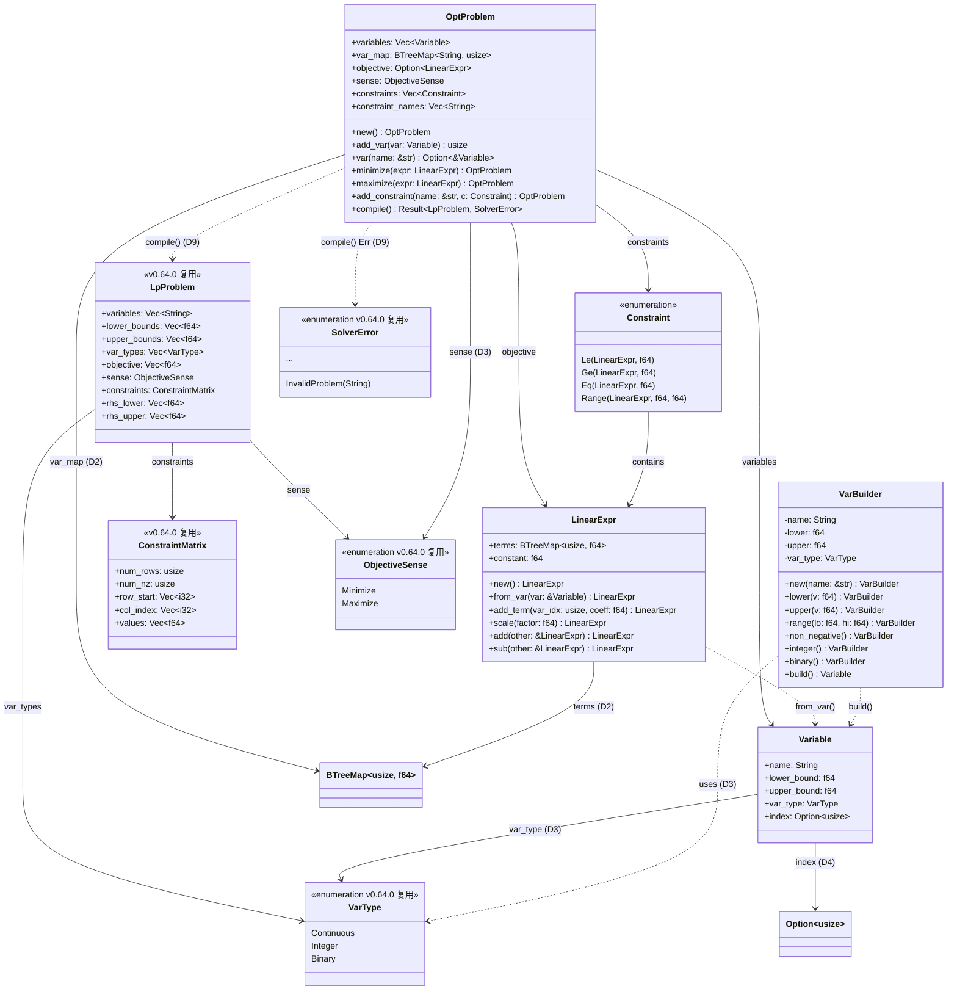

# EnerOS 优化问题建模框架设计 — Variable + LinearExpr + Constraint + OptProblem

> **版本**：v0.65.0（P1-J AI Runtime Solver 第二层，建模框架层）
> **crate**：`eneros-solver-model`（`crates/ai/solver-model/`）
> **蓝图依据**：`蓝图/phase1.md` §v0.65.0
> **spec 依据**：`.trae/specs/develop-v0650-solver-model/spec.md`（D1~D12 偏差声明源）
> **覆盖版本**：v0.65.0
> **最后更新**：2026-07-16

---

## 1. 版本目标

### 1.1 一句话目标

构建优化问题建模框架，提供决策变量（`Variable` + `VarBuilder` 链式构建器）、线性表达式（`LinearExpr`，支持 `core::ops` 运算符重载）、约束（`Constraint` 四变体枚举）、优化问题容器（`OptProblem` Builder + `compile()` 编译器）的 Rust DSL，以接近数学公式的语法描述 LP/MILP 问题并确定性编译为 v0.64.0 的 `LpProblem` 矩阵格式，为能源调度模型（v0.66.0 能源 LP 建模）提供高级建模接口，运行于慢平面（Agent Runtime 分区），不干扰快平面 10ms 实时控制。

### 1.2 详细描述

v0.64.0 完成了 P1-J AI Runtime Solver 第一层（求解引擎基础层），交付了 `Solver` trait + `LpProblem` 矩阵格式 + `MockSolver`/`HighsSolver` 实现。但直接构造 `LpProblem` 的 CSR 矩阵格式繁琐且易错（需手动维护 `row_start`/`col_index`/`values` 三数组与 `rhs_lower`/`rhs_upper` 映射），不适合上层能源调度模型的领域建模。

本版本（v0.65.0）进入 P1-J AI Runtime Solver 第二层（建模框架层），构建领域特定语言（DSL），允许用接近数学公式的语法描述优化问题：定义变量（含上下界/类型）、目标函数（线性表达式）、约束（线性不等式/等式/范围）。使用 Builder 模式链式构建 `OptProblem`，最终通过 `compile()` 编译为 `LpProblem` 矩阵格式传给 Solver。

本版本交付四项核心产出：

| 产出 | 角色 | 说明 |
|------|------|------|
| `Variable` + `VarBuilder` | 决策变量 + 链式构建器 | 5 字段变量结构；链式方法 `lower`/`upper`/`range`/`non_negative`/`integer`/`binary`/`build` |
| `LinearExpr` | 线性表达式 | `BTreeMap<usize, f64>` 系数表（D2，确定性遍历）；运算符重载 `Add`/`Sub`/`Mul<f64>`（D1：`core::ops`） |
| `Constraint` | 约束类型 | 4 变体枚举（`Le`/`Ge`/`Eq`/`Range`）；编译时映射 `rhs_lower`/`rhs_upper` |
| `OptProblem` | 优化问题容器 + 编译器 | Builder 方法 `add_var`/`var`/`minimize`/`maximize`/`add_constraint`；`compile() -> Result<LpProblem, SolverError>` |

所有 Rust 代码必须 no_std（D1，蓝图 §43.1），仅使用 `core::*` / `alloc::*`，无 `std::*`，无 `HashMap`（D2，改用 `alloc::collections::BTreeMap`），运算符重载使用 `core::ops` 而非 `std::ops`（D1），复用 v0.64.0 的 `VarType`/`ObjectiveSense`/`LpProblem`/`ConstraintMatrix`/`SolverError`（D3），纯 safe Rust 零 `unsafe`（D10）。

### 1.3 架构定位

| 维度 | 定位 |
|------|------|
| Phase | Phase 1 单机 MVP |
| 子系统 | P1-J AI Runtime Solver 第二层（建模框架层） |
| 平面 | 慢平面（Agent Runtime 分区，管理信息大区） |
| 角色 | 双脑链路 Solver 建模层，领域 DSL → 矩阵格式编译器 |
| 上游版本 | v0.64.0（`Solver` trait + `LpProblem` + 类型定义）；v0.11.0 用户堆（alloc 支持）；v0.26.0 配置管理（默认参数） |
| 同层版本 | v0.65.0（本版本，建模 DSL）；v0.71.0 双脑联调时与 LLM 协作 |
| 下游版本 | v0.66.0 能源 LP（消费本版本 DSL 构建能源调度模型）；v0.67.0 安全校验；v0.68.0 意图解析 |
| 部署形态 | 纯 Rust crate，无 C 库依赖，无 FFI，CPU 编译运行 |

### 1.4 路线图链路

```
v0.59.0 LlmEngine trait ──► ... ──► v0.63.0 Prompt 模板
                                          │
                                          ▼
v0.64.0 Solver trait + HiGHS FFI ──► v0.65.0 建模 DSL（本版本）
                                          │
                                          ├──► v0.66.0 能源 LP
                                          │
                                          ├──► v0.67.0 安全校验
                                          │
                                          └──► v0.68.0 意图解析（消费 Solver + PromptTemplate）
                                                   │
                                                   ▼
                                          v0.71.0 双脑联调（LLM + Solver）
```

### 1.5 依赖关系

| 依赖 | 来源 | 用途 |
|------|------|------|
| `eneros_solver_core::problem::{LpProblem, VarType, ObjectiveSense}` | v0.64.0 crate（path 依赖） | DSL 编译目标 + 变量类型/目标方向复用（D3） |
| `eneros_solver_core::matrix::ConstraintMatrix` | v0.64.0 crate | CSR 约束矩阵（`compile()` 产物） |
| `eneros_solver_core::error::SolverError` | v0.64.0 crate | `compile()` 错误类型复用（D9） |
| `alloc::string::String` | `alloc` crate | 变量名 / 约束名 / 错误消息 |
| `alloc::vec::Vec` | `alloc` crate | 变量列表 / 约束列表 / CSR 三数组 |
| `alloc::collections::BTreeMap` | `alloc` crate | `LinearExpr.terms` / `OptProblem.var_map`（D2：替代 HashMap） |
| `core::ops::{Add, Sub, Mul}` | `core` crate | `LinearExpr` 运算符重载（D1：no_std 用 `core::ops`） |

> **注**：本版本**仅依赖 v0.64.0**（D3/D9），不依赖 v0.59.0~v0.63.0 任何 crate。建模框架是 Solver 子系统内部层，与 LLM 子系统解耦；v0.68.0 意图解析将同时消费本版本 DSL 与 v0.63.0 PromptTemplate。

### 1.6 设计原则关联

| 原则 | 体现 |
|------|------|
| no_std 合规 | 全 crate 仅使用 `core::*` / `alloc::*`，无 `std::*`（D1，蓝图 §43.1）；运算符重载用 `core::ops` 而非 `std::ops`（D1） |
| 确定性优先 | `compile()` 是纯函数，相同 `OptProblem` 编译为相同的 `LpProblem`；`BTreeMap` 遍历顺序确定（D2，解决蓝图 §8.3 HashMap 遍历顺序不确定的坑点） |
| 效率优化 | DSL 提升建模效率（接近数学公式语法），避免直接操作 CSR 矩阵的繁琐与易错 |
| DRY 原则 | 复用 v0.64.0 的 `VarType`/`ObjectiveSense`/`LpProblem`/`ConstraintMatrix`/`SolverError`（D3/D9），不重复定义 |
| Simplicity First | `BTreeMap` 替代 `HashMap` 避免引入 `hashbrown` 依赖（D2）；纯 safe Rust 零 `unsafe`（D10）；无 FFI 需求（D11） |
| 可测试性 | 纯 Rust 实现，默认 `cargo test` 可运行；端到端验证用 `MockSolver`（D7） |
| Builder 模式 | 链式 Builder 构建 `OptProblem`，语法清晰可读（蓝图 §9.5 可维护要求） |
| 稀疏性 | 系数绝对值 < 1e-12 的项自动剔除，减少矩阵非零元素数（蓝图 §5 技术交底） |

---

## 2. 架构定位

### 2.1 P1-J AI Runtime Solver 分层

P1-J AI Runtime Solver 子系统按"求解引擎 → 建模 DSL → 能源 LP → 安全校验 → 意图解析"五层层级组织，本版本位于第二层：

| 层级 | 版本 | crate | 职责 |
|------|------|-------|------|
| 第一层（求解引擎） | v0.64.0 | `eneros-solver-core` | `Solver` trait + MockSolver + HighsSolver FFI + `LpProblem` 矩阵格式 |
| **第二层（建模 DSL）** | **v0.65.0** | **`eneros-solver-model`** | **`Variable`/`LinearExpr`/`Constraint`/`OptProblem` DSL + `compile()` 编译器** |
| 第三层（能源 LP） | v0.66.0 | （后续） | 能源调度 LP 建模（机组组合、经济调度），消费本版本 DSL |
| 第四层（安全校验） | v0.67.0 | （后续） | 求解结果安全校验（潮流收敛、约束满足） |
| 第五层（意图解析） | v0.68.0 | （后续） | LLM 意图 → Solver 问题（同时消费 PromptTemplate） |

第二层为第三层提供 DSL 接口：v0.66.0 能源 LP 使用 `VarBuilder`/`LinearExpr`/`Constraint`/`OptProblem` 构建能源领域 LP 问题，调用 `compile()` 生成 `LpProblem`，再交由 v0.64.0 `Solver` trait 求解。所有上层版本依赖本版本的 DSL 与编译器，不直接操作 `LpProblem` 矩阵。

### 2.2 与 v0.64.0 的依赖关系

本版本单向依赖 v0.64.0，复用其类型定义与求解接口：

| 复用项 | v0.64.0 位置 | 本版本用途 | 偏差 |
|--------|-------------|-----------|------|
| `VarType` | `eneros_solver_core::problem::VarType` | `Variable.var_type` 字段类型 | D3（复用，不重复定义） |
| `ObjectiveSense` | `eneros_solver_core::problem::ObjectiveSense` | `OptProblem.sense` 字段类型 | D3 |
| `LpProblem` | `eneros_solver_core::problem::LpProblem` | `compile()` 返回类型 | D9 |
| `ConstraintMatrix` | `eneros_solver_core::matrix::ConstraintMatrix` | `compile()` 生成的 CSR 矩阵 | D9 |
| `SolverError` | `eneros_solver_core::error::SolverError` | `compile()` 错误类型 | D9（复用 `InvalidProblem(String)` 变体） |

```
┌─────────────────────────────────────────────────┐
│  v0.65.0 eneros-solver-model（本版本）           │
│  ┌───────────────────────────────────────────┐  │
│  │  Variable + VarBuilder                    │  │
│  │  LinearExpr（BTreeMap, core::ops）        │  │
│  │  Constraint（Le/Ge/Eq/Range）             │  │
│  │  OptProblem（Builder + compile()）        │  │
│  └─────────────────────┬─────────────────────┘  │
│                        │ use                     │
└────────────────────────┼─────────────────────────┘
                         ▼
┌─────────────────────────────────────────────────┐
│  v0.64.0 eneros-solver-core                     │
│  ┌───────────────────────────────────────────┐  │
│  │  VarType / ObjectiveSense                 │  │
│  │  LpProblem / ConstraintMatrix（CSR）      │  │
│  │  SolverError（含 InvalidProblem(String)） │  │
│  │  Solver trait + MockSolver / HighsSolver  │  │
│  └───────────────────────────────────────────┘  │
└─────────────────────────────────────────────────┘
```

### 2.3 解锁 v0.66.0~v0.68.0

本版本交付的 DSL 与编译器解锁后续三个版本：

| 下游版本 | 消费本版本的产出 | 建模场景 |
|---------|----------------|---------|
| v0.66.0 能源 LP | `VarBuilder`/`LinearExpr`/`Constraint`/`OptProblem`/`compile()` | 机组组合（UC）、经济调度（ED）、潮流约束 |
| v0.67.0 安全校验 | `LpProblem`（`compile()` 产物） | 求解结果安全校验（潮流收敛、约束满足） |
| v0.68.0 意图解析 | `OptProblem` Builder | LLM 意图 → `OptProblem` 构造 → `compile()` → Solver |

### 2.4 双脑架构中的定位 — Solver 建模层

双脑架构（蓝图 §9.x）中 LLM 与 Solver 的协作链路，本版本位于 Solver 建模层：

```
[市场信号/自然语言指令]
        │
        ▼
v0.59.0 LlmEngine (trait)
        │
        ▼
   LLM 推理 (llama.cpp via FFI)
        │
        ▼
   JSON 意图输出
        │
        ▼
v0.68.0 意图解析 ──► OptProblem 构造（本版本 DSL）
                        │
                        ▼
                  OptProblem.compile()
                        │
                        ▼
                  LpProblem 矩阵格式
                        │
                        ▼
v0.64.0 Solver trait
        │
        ├── MockSolver (默认，测试)
        └── HighsSolver (feature-gated，真实求解)
                │
                ▼
        HiGHS LP/MILP 求解 (via FFI)
                │
                ▼
        SolveResult (确定性最优解)
                │
                ▼
v0.71.0 双脑联调 ──► 控制命令下发
```

本版本为 L1 主路径的建模层：能源调度模型（v0.66.0）通过本版本 DSL 构建 LP 问题，编译为矩阵格式后由 v0.64.0 `Solver` 求解。L2 路径在 LLM 不可用时降级到 L1，由 v0.71.0 双脑联调实现降级逻辑。本版本仅提供建模与编译能力，不实现降级编排。

### 2.5 上下游依赖图

```
v0.11.0 用户堆 ──► alloc ──┐
                           │
v0.26.0 配置管理 ──────────┼──（默认参数，上层使用）
                           │
                           ▼
             v0.64.0 Solver trait + LpProblem + 类型
                           │
                           │  use
                           ▼
             v0.65.0 建模 DSL（本版本）
             ├── Variable + VarBuilder
             ├── LinearExpr（BTreeMap, core::ops）
             ├── Constraint（Le/Ge/Eq/Range）
             └── OptProblem（Builder + compile()）
                           │
                           │  compile() -> LpProblem
                           ▼
             v0.66.0 能源 LP（消费 DSL）
                           │
                           ▼
             v0.67.0 安全校验
                           │
                           ▼
             v0.68.0 意图解析 (同时消费 PromptTemplate)
                           │
                           ▼
             v0.71.0 双脑联调 (LLM + Solver)
```

### 2.6 不做的事（职责边界）

本建模框架**不负责**以下职责，避免与上下游重叠：

| 不做的事 | 归属版本 | 理由 |
|---------|---------|------|
| 求解 LP 问题 | v0.64.0 | 本版本仅编译为 `LpProblem`，求解由 v0.64.0 `Solver` trait 负责 |
| 能源领域 LP 建模 | v0.66.0 | 本版本提供通用 DSL，不涉及能源特定约束（机组组合、潮流等） |
| 求解结果安全校验 | v0.67.0 | 本版本仅生成问题，校验由 v0.67.0 实现 |
| LLM 意图解析 | v0.68.0 | 本版本不消费 LLM 输出，意图到问题的映射由 v0.68.0 实现 |
| 双脑降级编排 | v0.71.0 | 本版本仅返回 `SolverError`，降级决策由 v0.71.0 编排 |
| 非线性表达式 | 后续版本 | 本版本聚焦线性表达式（LP/MILP），非线性规划（NLP）由后续版本扩展 |
| 二次约束（QCQP） | 后续版本 | HiGHS 支持 QP，但本版本仅封装线性约束 |

---

## 3. Variable + VarBuilder

### 3.1 Variable 结构定义（5 字段，D3/D4）

```rust
use alloc::string::String;

use eneros_solver_core::problem::VarType;

/// 决策变量（5 字段）。
///
/// 由 `VarBuilder::build()` 构造，添加到 `OptProblem` 时分配 `index`。
///
/// **D3**：`var_type` 复用 v0.64.0 `eneros_solver_core::problem::VarType`
/// （Continuous / Integer / Binary），不重复定义。
///
/// **D4**：`index: Option<usize>` 字段保留。编译前为 `None`，
/// `OptProblem::add_var()` 时分配为 `Some(idx)`；DSL 中通过索引
/// 引用变量，避免名称查找开销。
#[derive(Debug, Clone)]
pub struct Variable {
    /// 变量名（唯一，`OptProblem::add_var` 时校验冲突）
    pub name: String,
    /// 下界（默认 0.0；`f64::NEG_INFINITY` 表示无下界）
    pub lower_bound: f64,
    /// 上界（默认 `f64::INFINITY`；`f64::INFINITY` 表示无上界）
    pub upper_bound: f64,
    /// 变量类型（D3：复用 v0.64.0 `VarType`）
    pub var_type: VarType,
    /// 变量索引（D4：编译前 `None`，`add_var` 后 `Some(idx)`）
    pub index: Option<usize>,
}
```

### 3.2 字段说明

| # | 字段 | 类型 | 默认值 | 说明 |
|---|------|------|--------|------|
| 1 | `name` | `String` | — | 变量名（唯一，`add_var` 时校验冲突） |
| 2 | `lower_bound` | `f64` | `0.0` | 下界；`f64::NEG_INFINITY` 表示无下界（D5） |
| 3 | `upper_bound` | `f64` | `f64::INFINITY` | 上界；`f64::INFINITY` 表示无上界（D5） |
| 4 | `var_type` | `VarType` | `Continuous` | 变量类型（D3：复用 v0.64.0） |
| 5 | `index` | `Option<usize>` | `None` | 变量索引（D4：编译前 `None`，`add_var` 后 `Some(idx)`） |

### 3.3 D3：复用 v0.64.0 VarType

| 维度 | 说明 |
|------|------|
| 蓝图原设计 | 在 v0.65.0 重新定义 `VarType` 枚举（Continuous/Integer/Binary） |
| 本设计实现 | `use eneros_solver_core::problem::VarType;` 直接复用 v0.64.0 定义 |
| 决策理由 | DRY 原则；v0.64.0 已定义且派生 `Debug`/`Clone`/`Copy`/`PartialEq`/`Eq`；重复定义会导致 `compile()` 返回的 `LpProblem.var_types: Vec<VarType>` 类型不匹配 |
| 类型一致性 | `Variable.var_type: VarType` 与 `LpProblem.var_types: Vec<VarType>` 使用同一类型，`compile()` 直接 `self.variables.iter().map(|v| v.var_type).collect()` 无需转换 |

### 3.4 D4：index: Option<usize>

| 维度 | 说明 |
|------|------|
| 蓝图原设计 | `Variable.index: Option<usize>` 字段 |
| 本设计实现 | 保留 `Option<usize>`；编译前为 `None`，`OptProblem::add_var()` 时分配为 `Some(idx)` |
| 决策理由 | 语义清晰：变量在添加到 `OptProblem` 前无索引；添加后索引固定为 `Some(idx)`，`LinearExpr` 通过索引引用变量 |
| 使用方式 | `LinearExpr::from_var(var)` 读取 `var.index`，若为 `None` 则表达式为空（变量未添加到问题） |

### 3.5 D5：f64::INFINITY / NEG_INFINITY

| 维度 | 说明 |
|------|------|
| 蓝图原设计 | `f64::INFINITY` / `f64::NEG_INFINITY` 作为默认上下界 |
| 本设计实现 | 保留；`core::f64::INFINITY` / `core::f64::NEG_INFINITY` 在 no_std 下可用 |
| 验证 | `f64::INFINITY` 是 `core::f64` 关联常量，no_std 可用；`LpProblem.lower_bounds` / `rhs_lower` 使用 `f64::NEG_INFINITY` 表示无下界 |

### 3.6 VarBuilder 链式构建器

```rust
use alloc::string::String;

use eneros_solver_core::problem::VarType;

/// 右半变量构建器（D6：链式 Builder 模式）。
///
/// 链式方法返回 `Self`，支持流式构建变量：
///
/// ```ignore
/// let x = VarBuilder::new("x").range(0.0, 10.0).integer().build();
/// let y = VarBuilder::new("y").lower(0.0).build();  // 连续变量，上界无穷
/// let z = VarBuilder::new("z").binary().build();    // 0-1 变量
/// ```
pub struct VarBuilder {
    name: String,
    lower: f64,
    upper: f64,
    var_type: VarType,
}

impl VarBuilder {
    /// 构造变量构建器（默认 lower=0.0, upper=INFINITY, var_type=Continuous）。
    pub fn new(name: &str) -> Self {
        Self {
            name: String::from(name),
            lower: 0.0,
            upper: f64::INFINITY,
            var_type: VarType::Continuous,
        }
    }

    /// 设置下界。
    pub fn lower(mut self, v: f64) -> Self {
        self.lower = v;
        self
    }

    /// 设置上界。
    pub fn upper(mut self, v: f64) -> Self {
        self.upper = v;
        self
    }

    /// 设置范围 `[lo, hi]`（同时设置上下界）。
    pub fn range(mut self, lo: f64, hi: f64) -> Self {
        self.lower = lo;
        self.upper = hi;
        self
    }

    /// 设置为非负（`>= 0`，等价于 `lower(0.0)`）。
    pub fn non_negative(self) -> Self {
        self.lower(0.0)
    }

    /// 设置为整数变量（`var_type = Integer`）。
    pub fn integer(mut self) -> Self {
        self.var_type = VarType::Integer;
        self
    }

    /// 设置为 0-1 变量（`var_type = Binary` + `range(0.0, 1.0)`）。
    pub fn binary(mut self) -> Self {
        self.var_type = VarType::Binary;
        self.range(0.0, 1.0)
    }

    /// 构建变量（消费 builder，返回 `Variable`）。
    pub fn build(self) -> Variable {
        Variable {
            name: self.name,
            lower_bound: self.lower,
            upper_bound: self.upper,
            var_type: self.var_type,
            index: None,  // D4：编译前为 None
        }
    }
}
```

### 3.7 链式方法清单

| # | 方法 | 签名 | 说明 |
|---|------|------|------|
| 1 | `new` | `(name: &str) -> Self` | 构造构建器（默认 Continuous，`[0, +∞)`） |
| 2 | `lower` | `(v: f64) -> Self` | 设置下界 |
| 3 | `upper` | `(v: f64) -> Self` | 设置上界 |
| 4 | `range` | `(lo: f64, hi: f64) -> Self` | 同时设置上下界 |
| 5 | `non_negative` | `() -> Self` | 等价于 `lower(0.0)` |
| 6 | `integer` | `() -> Self` | 设置 `var_type = Integer` |
| 7 | `binary` | `() -> Self` | 设置 `var_type = Binary` + `range(0.0, 1.0)` |
| 8 | `build` | `() -> Variable` | 构建变量（消费 builder） |

### 3.8 D6：链式 Builder 模式

| 维度 | 说明 |
|------|------|
| 蓝图原设计 | `VarBuilder` 链式方法返回 `Self` |
| 本设计实现 | 保留链式 Builder 模式；所有方法（除 `build`）消费 `self` 并返回 `Self`，支持流式调用 |
| 决策理由 | 链式调用是 DSL 的核心表达力；与蓝图一致；`build()` 消费 builder 返回 `Variable`，避免半构造状态泄漏 |

### 3.9 VarBuilder 使用示例

```rust
use eneros_solver_model::variable::VarBuilder;
use eneros_solver_core::problem::VarType;

// 连续变量，[0, +∞)
let x = VarBuilder::new("x").build();
assert_eq!(x.lower_bound, 0.0);
assert_eq!(x.upper_bound, f64::INFINITY);
assert_eq!(x.var_type, VarType::Continuous);
assert_eq!(x.index, None);  // D4：编译前为 None

// 整数变量，[0, 10]
let y = VarBuilder::new("y").range(0.0, 10.0).integer().build();
assert_eq!(y.lower_bound, 0.0);
assert_eq!(y.upper_bound, 10.0);
assert_eq!(y.var_type, VarType::Integer);

// 0-1 变量
let z = VarBuilder::new("z").binary().build();
assert_eq!(z.lower_bound, 0.0);
assert_eq!(z.upper_bound, 1.0);
assert_eq!(z.var_type, VarType::Binary);

// 自由变量（无上下界）
let w = VarBuilder::new("w")
    .lower(f64::NEG_INFINITY)
    .upper(f64::INFINITY)
    .build();
assert_eq!(w.lower_bound, f64::NEG_INFINITY);
assert_eq!(w.upper_bound, f64::INFINITY);
```

---

## 4. LinearExpr 线性表达式

### 4.1 LinearExpr 结构定义（2 字段，D2/D12）

```rust
use alloc::collections::BTreeMap;

/// 线性表达式：`c1*x1 + c2*x2 + ... + constant`。
///
/// **D2**：`terms: BTreeMap<usize, f64>` 替代蓝图原设计的
/// `HashMap<usize, f64>`。`alloc::collections::BTreeMap` 是 no_std
/// 可用的有序 map，遍历顺序确定（按键升序），利于确定性编译
/// （解决蓝图 §8.3 HashMap 遍历顺序不确定的坑点）。
///
/// **D12**：派生 `Default`。`BTreeMap::default()` 返回空 map，
/// `f64::default()` 返回 0.0，与蓝图一致。
#[derive(Debug, Clone, Default)]
pub struct LinearExpr {
    /// 系数-变量对（变量索引 → 系数，D2：BTreeMap 替代 HashMap）
    pub terms: BTreeMap<usize, f64>,
    /// 常数项
    pub constant: f64,
}
```

### 4.2 字段说明

| # | 字段 | 类型 | 默认值 | 说明 |
|---|------|------|--------|------|
| 1 | `terms` | `BTreeMap<usize, f64>` | 空 map | 系数-变量对（变量索引 → 系数，D2） |
| 2 | `constant` | `f64` | `0.0` | 常数项 |

### 4.3 D2：BTreeMap 替代 HashMap

| 维度 | 说明 |
|------|------|
| 蓝图原设计 | `LinearExpr.terms: HashMap<usize, f64>` + `OptProblem.var_map: HashMap<String, usize>` |
| 本设计实现 | `BTreeMap<usize, f64>` + `BTreeMap<String, usize>` |
| no_std 合规 | `HashMap` 在 no_std 下不可用（需 `std::collections::HashMap` 或第三方 `hashbrown`）；`alloc::collections::BTreeMap` 是 no_std 内置有序 map |
| 确定性遍历 | `BTreeMap` 遍历顺序确定（按键升序），`compile()` 生成的 CSR 矩阵 `col_index` 在每行内按变量索引升序排列，相同 `OptProblem` 编译为相同的 `LpProblem`（确定性优先） |
| 解决蓝图坑点 | 蓝图 §8.3 提及 HashMap 遍历顺序不确定的坑点（"编译后矩阵是确定的"但中间遍历顺序不确定），BTreeMap 天然解决 |
| Karpathy Simplicity First | 引入 `hashbrown` 依赖过度；BTreeMap API 基本兼容（`insert`/`get`/`entry`/`iter`），无需额外依赖 |
| 性能 | `BTreeMap` 查找/插入 `O(log n)`，`HashMap` 平均 `O(1)`；但 LP 建模场景 `terms` 规模小（通常 < 100 项），性能差异可忽略；确定性优于性能 |

### 4.4 方法实现

```rust
use alloc::collections::BTreeMap;

impl LinearExpr {
    /// 构造空表达式（`constant = 0.0`，无项）。
    pub fn new() -> Self {
        Self::default()
    }

    /// 从变量创建表达式（系数 1.0）。
    ///
    /// - `var.index` 为 `Some(idx)` 时，插入项 `(idx, 1.0)`
    /// - `var.index` 为 `None` 时，返回空表达式（变量未添加到问题）
    pub fn from_var(var: &Variable) -> Self {
        let mut expr = Self::new();
        if let Some(idx) = var.index {
            expr.terms.insert(idx, 1.0);
        }
        expr
    }

    /// 添加项（系数累加，0 系数自动移除）。
    ///
    /// - `var_idx`：变量索引
    /// - `coeff`：系数（累加到现有系数）
    /// - 若累加后系数绝对值 < 1e-12，移除该项（稀疏性）
    pub fn add_term(&mut self, var_idx: usize, coeff: f64) -> &mut Self {
        let entry = self.terms.entry(var_idx).or_insert(0.0);
        *entry += coeff;
        // 系数为 0 时移除项（稀疏性，蓝图 §5 技术交底）
        if entry.abs() < 1e-12 {
            self.terms.remove(&var_idx);
        }
        self
    }

    /// 标量乘法（返回新表达式）。
    pub fn scale(&self, factor: f64) -> Self {
        Self {
            terms: self
                .terms
                .iter()
                .map(|(&k, &v)| (k, v * factor))
                .collect(),
            constant: self.constant * factor,
        }
    }

    /// 加法（返回新表达式，合并同类项）。
    pub fn add(&self, other: &LinearExpr) -> Self {
        let mut result = self.clone();
        for (&idx, &coeff) in &other.terms {
            let entry = result.terms.entry(idx).or_insert(0.0);
            *entry += coeff;
            // 0 系数自动移除（稀疏性）
            if entry.abs() < 1e-12 {
                result.terms.remove(&idx);
            }
        }
        result.constant += other.constant;
        result
    }

    /// 减法（返回新表达式，等价于 `self.add(&other.scale(-1.0))`）。
    pub fn sub(&self, other: &LinearExpr) -> Self {
        self.add(&other.scale(-1.0))
    }
}
```

### 4.5 方法清单

| # | 方法 | 签名 | 说明 |
|---|------|------|------|
| 1 | `new` | `() -> Self` | 空表达式（`constant=0.0`，无项） |
| 2 | `from_var` | `(var: &Variable) -> Self` | 从变量创建（系数 1.0，需 `var.index = Some`） |
| 3 | `add_term` | `(&mut self, var_idx: usize, coeff: f64) -> &mut Self` | 添加项（系数累加，0 系数自动移除） |
| 4 | `scale` | `(&self, factor: f64) -> Self` | 标量乘法 |
| 5 | `add` | `(&self, other: &LinearExpr) -> Self` | 加法（合并同类项） |
| 6 | `sub` | `(&self, other: &LinearExpr) -> Self` | 减法 |

### 4.6 0 系数自动移除（稀疏性）

| 维度 | 说明 |
|------|------|
| 蓝图要求 | 系数绝对值 < 1e-12 的项自动剔除（蓝图 §5 技术交底） |
| 本设计实现 | `add_term` / `add` 方法在系数累加后检查 `abs() < 1e-12`，满足则 `terms.remove(&idx)` |
| 决策理由 | 减少矩阵非零元素数，降低 CSR 矩阵规模；避免 `x - x = 0` 产生无用项 |
| 容差选择 | `1e-12` 与蓝图一致；浮点数累加误差通常 < 1e-12，该容差能正确识别零系数 |
| 影响范围 | `add_term`（单项添加）、`add`（表达式加法）均执行 0 系数移除；`scale` 不移除（乘法不产生新零系数，除非 factor=0，此时所有项应为零，但保留由调用方决定） |

### 4.7 LinearExpr 使用示例

```rust
use eneros_solver_model::expr::LinearExpr;
use eneros_solver_model::variable::VarBuilder;

let mut x = VarBuilder::new("x").build();
x.index = Some(0);  // 模拟添加到问题
let mut y = VarBuilder::new("y").build();
y.index = Some(1);

// 从变量创建表达式
let expr_x = LinearExpr::from_var(&x);  // 1.0 * x
let expr_y = LinearExpr::from_var(&y);  // 1.0 * y

// 手动添加项
let mut expr = LinearExpr::new();
expr.add_term(0, 2.0);   // 2.0 * x
expr.add_term(1, 3.0);   // 3.0 * y
expr.add_term(0, -2.0);  // x 系数变 0，自动移除（稀疏性）
assert!(!expr.terms.contains_key(&0));  // x 项已移除
assert_eq!(expr.terms.get(&1), Some(&3.0));

// 标量乘法
let scaled = expr_x.scale(5.0);  // 5.0 * x

// 加法
let sum = expr_x.add(&expr_y);  // 1.0*x + 1.0*y

// 减法
let diff = expr_x.sub(&expr_y);  // 1.0*x - 1.0*y
```

### 4.8 D12：派生 Default

| 维度 | 说明 |
|------|------|
| 蓝图原设计 | `LinearExpr` 派生 `Default`（`#[derive(Default)]`） |
| 本设计实现 | 保留 `#[derive(Default)]`；`BTreeMap::default()` 返回空 map，`f64::default()` 返回 0.0 |
| 验证 | `LinearExpr::default()` 等价于 `LinearExpr { terms: BTreeMap::new(), constant: 0.0 }`，与 `new()` 一致 |
| 一致性 | 与蓝图一致，无偏差 |

---

## 5. Constraint 约束类型

### 5.1 Constraint 枚举定义（4 变体）

```rust
/// 约束类型枚举（4 变体）。
///
/// 表示线性约束的四种形式，编译时映射为 `rhs_lower` / `rhs_upper`：
///
/// - `Le(expr, rhs)` → `rhs_lower = -INFINITY`, `rhs_upper = rhs`
/// - `Ge(expr, rhs)` → `rhs_lower = rhs`, `rhs_upper = +INFINITY`
/// - `Eq(expr, rhs)` → `rhs_lower = rhs`, `rhs_upper = rhs`
/// - `Range(expr, lo, hi)` → `rhs_lower = lo`, `rhs_upper = hi`
///
/// 派生 `Debug` / `Clone`。
#[derive(Debug, Clone)]
pub enum Constraint {
    /// `expr <= rhs`
    Le(LinearExpr, f64),
    /// `expr >= rhs`
    Ge(LinearExpr, f64),
    /// `expr == rhs`
    Eq(LinearExpr, f64),
    /// `lo <= expr <= hi`
    Range(LinearExpr, f64, f64),
}
```

### 5.2 变体说明

| # | 变体 | 数学形式 | 编译时 `rhs_lower` | 编译时 `rhs_upper` |
|---|------|---------|-------------------|-------------------|
| 1 | `Le(LinearExpr, f64)` | `expr <= rhs` | `f64::NEG_INFINITY` | `rhs` |
| 2 | `Ge(LinearExpr, f64)` | `expr >= rhs` | `rhs` | `f64::INFINITY` |
| 3 | `Eq(LinearExpr, f64)` | `expr == rhs` | `rhs` | `rhs` |
| 4 | `Range(LinearExpr, f64, f64)` | `lo <= expr <= hi` | `lo` | `hi` |

### 5.3 编译时 rhs_lower/rhs_upper 映射规则

`compile()` 将 `Constraint` 枚举映射为 `LpProblem.rhs_lower` / `rhs_upper` 两个数组，映射规则如下：

```rust
let (expr, lo, hi) = match con {
    Constraint::Le(e, rhs) => (e, f64::NEG_INFINITY, *rhs),
    Constraint::Ge(e, rhs) => (e, *rhs, f64::INFINITY),
    Constraint::Eq(e, rhs) => (e, *rhs, *rhs),
    Constraint::Range(e, lo, hi) => (e, *lo, *hi),
};
rhs_lower.push(lo);
rhs_upper.push(hi);
```

| 约束形式 | 数学表示 | `rhs_lower[i]` | `rhs_upper[i]` | 说明 |
|---------|---------|----------------|----------------|------|
| `Le(expr, 10.0)` | `expr <= 10` | `-∞` | `10.0` | 仅上界约束 |
| `Ge(expr, 5.0)` | `expr >= 5` | `5.0` | `+∞` | 仅下界约束 |
| `Eq(expr, 7.0)` | `expr == 7` | `7.0` | `7.0` | 等式约束（`rhs_lower == rhs_upper`） |
| `Range(expr, 3.0, 8.0)` | `3 <= expr <= 8` | `3.0` | `8.0` | 双边约束 |

> **等式约束**：当 `rhs_lower[i] == rhs_upper[i]` 时表示等式约束（v0.64.0 蓝图 §8.5 坑点）。`Constraint::Eq` 编译后 `rhs_lower == rhs_upper == rhs`，HiGHS 据此识别为等式约束。

### 5.4 Constraint 使用示例

```rust
use eneros_solver_model::constraint::Constraint;
use eneros_solver_model::expr::LinearExpr;
use eneros_solver_model::variable::VarBuilder;

let mut x = VarBuilder::new("x").build();
x.index = Some(0);
let mut y = VarBuilder::new("y").build();
y.index = Some(1);

let expr_x = LinearExpr::from_var(&x);  // 1.0 * x
let expr_xy = LinearExpr::from_var(&x).add(&LinearExpr::from_var(&y));  // x + y

// x <= 10
let c1 = Constraint::Le(expr_x.clone(), 10.0);

// x + y >= 5
let c2 = Constraint::Ge(expr_xy.clone(), 5.0);

// x == 7
let c3 = Constraint::Eq(expr_x.clone(), 7.0);

// 3 <= x + y <= 8
let c4 = Constraint::Range(expr_xy, 3.0, 8.0);
```

### 5.5 为什么不派生 Copy

`Constraint` 含 `LinearExpr` 字段，`LinearExpr` 含 `BTreeMap`（堆分配），不可 `Copy`。因此 `Constraint` 仅派生 `Debug` / `Clone`，使用时需 `clone()` 或移动语义。

---

## 6. OptProblem 容器 + 编译器

### 6.1 OptProblem 结构定义（6 字段，D2/D3）

```rust
use alloc::collections::BTreeMap;
use alloc::string::String;
use alloc::vec::Vec;

use eneros_solver_core::error::SolverError;
use eneros_solver_core::matrix::ConstraintMatrix;
use eneros_solver_core::problem::{LpProblem, ObjectiveSense};

use crate::constraint::Constraint;
use crate::expr::LinearExpr;
use crate::variable::Variable;

/// 优化问题容器 + Builder + 编译器（6 字段）。
///
/// 使用 Builder 模式链式构建：
///
/// ```ignore
/// let lp = OptProblem::new()
///     .add_var(VarBuilder::new("x").build())
///     .add_var(VarBuilder::new("y").build())
///     .maximize(LinearExpr::from_var(&x).add(&LinearExpr::from_var(&y)))
///     .add_constraint("c1", Constraint::Le(expr_xy, 10.0))
///     .compile()?;
/// ```
///
/// **D2**：`var_map: BTreeMap<String, usize>` 替代 `HashMap`（no_std 兼容 + 确定性）。
///
/// **D3**：`sense: ObjectiveSense` 复用 v0.64.0 `ObjectiveSense`。
pub struct OptProblem {
    /// 变量列表（`add_var` 时分配 `index`）
    pub variables: Vec<Variable>,
    /// 变量名 → 索引映射（D2：BTreeMap）
    pub var_map: BTreeMap<String, usize>,
    /// 目标函数（`None` 表示无目标，编译为零向量）
    pub objective: Option<LinearExpr>,
    /// 目标方向（D3：复用 v0.64.0 `ObjectiveSense`）
    pub sense: ObjectiveSense,
    /// 约束列表
    pub constraints: Vec<Constraint>,
    /// 约束名称列表（与 `constraints` 等长）
    pub constraint_names: Vec<String>,
}
```

### 6.2 字段说明

| # | 字段 | 类型 | 默认值 | 说明 |
|---|------|------|--------|------|
| 1 | `variables` | `Vec<Variable>` | 空 | 变量列表（`add_var` 时分配 `index`） |
| 2 | `var_map` | `BTreeMap<String, usize>` | 空 | 变量名 → 索引映射（D2） |
| 3 | `objective` | `Option<LinearExpr>` | `None` | 目标函数（`None` 编译为零向量） |
| 4 | `sense` | `ObjectiveSense` | `Minimize` | 目标方向（D3：复用 v0.64.0） |
| 5 | `constraints` | `Vec<Constraint>` | 空 | 约束列表 |
| 6 | `constraint_names` | `Vec<String>` | 空 | 约束名称列表（与 `constraints` 等长） |

### 6.3 Builder 方法实现

```rust
impl OptProblem {
    /// 构造空问题（无变量、无约束、无目标，默认 Minimize）。
    pub fn new() -> Self {
        Self {
            variables: Vec::new(),
            var_map: BTreeMap::new(),
            objective: None,
            sense: ObjectiveSense::Minimize,
            constraints: Vec::new(),
            constraint_names: Vec::new(),
        }
    }

    /// 添加变量并返回索引（分配 `index` 字段）。
    ///
    /// - `var.index` 设为 `Some(self.variables.len())`
    /// - `var.name` 插入 `var_map`（D9：同名变量返回 `InvalidProblem` 错误由编译期校验）
    /// - 返回变量索引
    pub fn add_var(&mut self, mut var: Variable) -> usize {
        let idx = self.variables.len();
        var.index = Some(idx);  // D4：分配索引
        self.var_map.insert(var.name.clone(), idx);
        self.variables.push(var);
        idx
    }

    /// 按名称获取变量。
    pub fn var(&self, name: &str) -> Option<&Variable> {
        self.var_map.get(name).map(|&idx| &self.variables[idx])
    }

    /// 设置目标函数（最小化，链式）。
    pub fn minimize(mut self, expr: LinearExpr) -> Self {
        self.objective = Some(expr);
        self.sense = ObjectiveSense::Minimize;
        self
    }

    /// 设置目标函数（最大化，链式）。
    pub fn maximize(mut self, expr: LinearExpr) -> Self {
        self.objective = Some(expr);
        self.sense = ObjectiveSense::Maximize;
        self
    }

    /// 添加约束（链式）。
    pub fn add_constraint(&mut self, name: &str, constraint: Constraint) -> &mut Self {
        self.constraints.push(constraint);
        self.constraint_names.push(String::from(name));
        self
    }
}

impl Default for OptProblem {
    fn default() -> Self {
        Self::new()
    }
}
```

### 6.4 Builder 方法清单

| # | 方法 | 签名 | 说明 |
|---|------|------|------|
| 1 | `new` | `() -> Self` | 空问题 |
| 2 | `add_var` | `(&mut self, var: Variable) -> usize` | 添加变量，返回索引（分配 `index`） |
| 3 | `var` | `(&self, name: &str) -> Option<&Variable>` | 按名称获取变量 |
| 4 | `minimize` | `(self, expr: LinearExpr) -> Self` | 设置目标（Minimize，链式） |
| 5 | `maximize` | `(self, expr: LinearExpr) -> Self` | 设置目标（Maximize，链式） |
| 6 | `add_constraint` | `(&mut self, name: &str, constraint: Constraint) -> &mut Self` | 添加约束（链式） |

### 6.5 compile() 编译器实现（D9：复用 v0.64.0 类型）

```rust
use eneros_solver_core::error::SolverError;
use eneros_solver_core::matrix::ConstraintMatrix;
use eneros_solver_core::problem::LpProblem;

impl OptProblem {
    /// 编译为 `LpProblem` 矩阵格式（D9：复用 v0.64.0 `LpProblem`/`SolverError`）。
    ///
    /// 编译步骤（详见 §8 编译流程）：
    /// 1. 变量边界/类型 → `lower_bounds` / `upper_bounds` / `var_types`
    /// 2. 目标函数系数 → `objective`（`Vec<f64>`，长度 = num_var）
    /// 3. 约束矩阵（CSR）→ `ConstraintMatrix { row_start, col_index, values }`
    /// 4. 约束边界 → `rhs_lower` / `rhs_upper`（按 `Constraint` 变体映射）
    ///
    /// **稀疏性**：系数绝对值 < 1e-12 的项自动剔除（蓝图 §5）。
    /// **确定性**：`BTreeMap` 遍历顺序确定，相同 `OptProblem` 编译为相同 `LpProblem`（D2）。
    ///
    /// # 错误
    ///
    /// - `SolverError::InvalidProblem(String)`：变量名冲突 / 空问题（D9）
    pub fn compile(&self) -> Result<LpProblem, SolverError> {
        let num_var = self.variables.len();
        let num_con = self.constraints.len();

        // 校验：变量名冲突（D9）
        // 注：add_var 时已通过 var_map 去重，此处再次校验防御性编程
        if self.var_map.len() != num_var {
            return Err(SolverError::InvalidProblem(alloc::string::String::from(
                "variable name conflict detected",
            )));
        }

        // 1. 变量边界和类型
        let lower_bounds: Vec<f64> = self.variables.iter().map(|v| v.lower_bound).collect();
        let upper_bounds: Vec<f64> = self.variables.iter().map(|v| v.upper_bound).collect();
        let var_types: Vec<VarType> = self.variables.iter().map(|v| v.var_type).collect();

        // 2. 目标函数系数
        let objective: Vec<f64> = match &self.objective {
            Some(expr) => {
                let mut obj = alloc::vec![0.0; num_var];
                for (&idx, &coeff) in &expr.terms {
                    if idx < num_var {
                        obj[idx] = coeff;
                    }
                }
                obj
            }
            None => alloc::vec![0.0; num_var],
        };

        // 3. 约束矩阵（CSR 格式）
        let mut row_start: Vec<i32> = Vec::with_capacity(num_con + 1);
        let mut col_index: Vec<i32> = Vec::new();
        let mut values: Vec<f64> = Vec::new();
        let mut rhs_lower: Vec<f64> = Vec::with_capacity(num_con);
        let mut rhs_upper: Vec<f64> = Vec::with_capacity(num_con);

        row_start.push(0);
        for con in &self.constraints {
            // 4. 按 Constraint 变体映射 rhs_lower / rhs_upper
            let (expr, lo, hi) = match con {
                Constraint::Le(e, rhs) => (e, f64::NEG_INFINITY, *rhs),
                Constraint::Ge(e, rhs) => (e, *rhs, f64::INFINITY),
                Constraint::Eq(e, rhs) => (e, *rhs, *rhs),
                Constraint::Range(e, lo, hi) => (e, *lo, *hi),
            };
            // 遍历 BTreeMap（按键升序，D2 确定性遍历）
            for (&idx, &coeff) in &expr.terms {
                if coeff.abs() >= 1e-12 {
                    // 稀疏性：仅保留非零项
                    col_index.push(idx as i32);
                    values.push(coeff);
                }
            }
            rhs_lower.push(lo);
            rhs_upper.push(hi);
            row_start.push(col_index.len() as i32);
        }

        Ok(LpProblem {
            variables: self.variables.iter().map(|v| v.name.clone()).collect(),
            lower_bounds,
            upper_bounds,
            var_types,
            objective,
            sense: self.sense,
            constraints: ConstraintMatrix::new(
                num_con,
                values.len(),
                row_start,
                col_index,
                values,
            ),
            rhs_lower,
            rhs_upper,
        })
    }
}
```

### 6.6 OptProblem 使用示例

```rust
use eneros_solver_model::constraint::Constraint;
use eneros_solver_model::expr::LinearExpr;
use eneros_solver_model::problem::OptProblem;
use eneros_solver_model::variable::VarBuilder;
use eneros_solver_core::problem::{ObjectiveSense, VarType};

let mut problem = OptProblem::new();

// 添加变量
let mut x = VarBuilder::new("x").lower(0.0).build();
let mut y = VarBuilder::new("y").lower(0.0).build();
let idx_x = problem.add_var(x.clone());
let idx_y = problem.add_var(y.clone());

// 重新获取带 index 的变量（用于构建表达式）
let x = problem.var("x").unwrap();
let y = problem.var("y").unwrap();

// 目标：maximize x + y
let obj = LinearExpr::from_var(x).add(&LinearExpr::from_var(y));
problem.maximize(obj);

// 约束：x + y <= 10
let c1_expr = LinearExpr::from_var(x).add(&LinearExpr::from_var(y));
problem.add_constraint("c1", Constraint::Le(c1_expr, 10.0));

// 约束：2x + 3y <= 20
let c2_expr = LinearExpr::from_var(x).scale(2.0)
    .add(&LinearExpr::from_var(y).scale(3.0));
problem.add_constraint("c2", Constraint::Le(c2_expr, 20.0));

// 编译
let lp = problem.compile().unwrap();
assert_eq!(lp.variables.len(), 2);
assert_eq!(lp.constraints.num_rows, 2);
assert_eq!(lp.sense, ObjectiveSense::Maximize);
```

---

## 7. 运算符重载

### 7.1 D1：core::ops 替代 std::ops

| 维度 | 说明 |
|------|------|
| 蓝图原设计 | `impl std::ops::Add<LinearExpr> for LinearExpr` / `Sub` / `Mul<f64>` |
| 本设计实现 | `impl core::ops::Add<LinearExpr> for LinearExpr` / `Sub` / `Mul<f64>` |
| 决策理由 | 蓝图 §43.1 no_std 硬性要求；`core::ops` 与 `std::ops` trait 路径一致（`std::ops` 仅是 `core::ops` 的 re-export），仅 `use` 路径不同 |
| no_std 合规 | `core::ops::{Add, Sub, Mul}` 在 no_std 下可用；`std::ops` 在 no_std 不可用 |
| 一致性 | 与全项目 no_std 合规要求一致（v0.54.0~v0.64.0 所有 crate 使用 `core::*`） |

### 7.2 运算符重载实现

```rust
use core::ops::{Add, Mul, Sub};

/// `expr1 + expr2`（返回新 `LinearExpr`，合并同类项）。
impl Add<LinearExpr> for LinearExpr {
    type Output = LinearExpr;
    fn add(self, rhs: LinearExpr) -> Self::Output {
        LinearExpr::add(&self, &rhs)
    }
}

/// `expr1 - expr2`（返回新 `LinearExpr`）。
impl Sub<LinearExpr> for LinearExpr {
    type Output = LinearExpr;
    fn sub(self, rhs: LinearExpr) -> Self::Output {
        LinearExpr::sub(&self, &rhs)
    }
}

/// `expr * factor`（标量乘法，返回新 `LinearExpr`）。
impl Mul<f64> for LinearExpr {
    type Output = LinearExpr;
    fn mul(self, factor: f64) -> Self::Output {
        self.scale(factor)
    }
}
```

### 7.3 运算符清单

| 运算符 | trait | 表达式 | 等价方法调用 |
|--------|-------|--------|-------------|
| `+` | `core::ops::Add<LinearExpr>` | `expr1 + expr2` | `LinearExpr::add(&expr1, &expr2)` |
| `-` | `core::ops::Sub<LinearExpr>` | `expr1 - expr2` | `LinearExpr::sub(&expr1, &expr2)` |
| `*` | `core::ops::Mul<f64>` | `expr * 2.0` | `expr.scale(2.0)` |

### 7.4 运算符组合示例

```rust
use eneros_solver_model::expr::LinearExpr;
use eneros_solver_model::variable::VarBuilder;

let mut x = VarBuilder::new("x").build();
x.index = Some(0);
let mut y = VarBuilder::new("y").build();
y.index = Some(1);
let mut z = VarBuilder::new("z").build();
z.index = Some(2);

let expr1 = LinearExpr::from_var(&x);  // 1.0 * x
let expr2 = LinearExpr::from_var(&y);  // 1.0 * y
let expr3 = LinearExpr::from_var(&z);  // 1.0 * z

// 组合运算：expr1 + expr2 * 2.0 - expr3
// 等价于：1.0*x + 2.0*y - 1.0*z
let combined = expr1 + expr2 * 2.0 - expr3;

assert_eq!(combined.terms.get(&0), Some(&1.0));   // x 系数 1.0
assert_eq!(combined.terms.get(&1), Some(&2.0));   // y 系数 2.0
assert_eq!(combined.terms.get(&2), Some(&-1.0));  // z 系数 -1.0
```

### 7.5 运算符优先级与结合性

Rust 运算符优先级保证 `expr1 + expr2 * 2.0 - expr3` 等价于 `expr1 + (expr2 * 2.0) - expr3`：

| 步骤 | 表达式 | 结果 |
|------|--------|------|
| 1 | `expr2 * 2.0` | `2.0 * y` |
| 2 | `expr1 + (expr2 * 2.0)` | `1.0*x + 2.0*y` |
| 3 | `(expr1 + expr2 * 2.0) - expr3` | `1.0*x + 2.0*y - 1.0*z` |

> **注**：`Mul<f64>` 优先级高于 `Add`/`Sub`，与数学约定一致。`Add`/`Sub` 左结合，从左到右计算。

### 7.6 为什么不实现 Add<f64> / Sub<f64>

本版本仅实现 `Mul<f64>`（标量乘法），不实现 `Add<f64>` / `Sub<f64>`（标量加减）。原因：

| 维度 | 说明 |
|------|------|
| 语义清晰 | `expr + 5.0` 语义模糊（是加常数项还是加 5.0*某变量？）；显式调用 `expr.add_term(...)` 或设置 `constant` 更清晰 |
| 蓝图一致 | 蓝图仅要求 `Add<LinearExpr>` / `Sub<LinearExpr>` / `Mul<f64>` |
| Simplicity First | 避免运算符重载过度；常数项可通过 `expr.constant = 5.0` 直接设置 |

---

## 8. 编译流程

### 8.1 compile() 内部步骤

`compile()` 将 `OptProblem` DSL 编译为 v0.64.0 `LpProblem` 矩阵格式，分四步：

```
OptProblem
    │
    ├── 1. 变量边界/类型
    │       variables.iter() → lower_bounds / upper_bounds / var_types
    │
    ├── 2. 目标函数系数
    │       objective.terms (BTreeMap) → objective: Vec<f64>
    │
    ├── 3. 约束矩阵（CSR）
    │       constraints.iter() → row_start / col_index / values
    │       BTreeMap 遍历（按键升序，D2 确定性）
    │       稀疏性：|coeff| < 1e-12 剔除
    │
    └── 4. rhs_lower / rhs_upper
            Constraint 变体映射（Le/Ge/Eq/Range）
    │
    ▼
LpProblem { variables, lower_bounds, upper_bounds, var_types,
            objective, sense, constraints, rhs_lower, rhs_upper }
```

### 8.2 步骤详解

#### 8.2.1 变量边界/类型

```rust
let lower_bounds: Vec<f64> = self.variables.iter().map(|v| v.lower_bound).collect();
let upper_bounds: Vec<f64> = self.variables.iter().map(|v| v.upper_bound).collect();
let var_types: Vec<VarType> = self.variables.iter().map(|v| v.var_type).collect();
```

| 输入 | 输出 | 说明 |
|------|------|------|
| `self.variables: Vec<Variable>` | `lower_bounds: Vec<f64>`（长度 = num_var） | 变量下界 |
| `self.variables: Vec<Variable>` | `upper_bounds: Vec<f64>`（长度 = num_var） | 变量上界 |
| `self.variables: Vec<Variable>` | `var_types: Vec<VarType>`（长度 = num_var） | 变量类型（D3：复用 v0.64.0 `VarType`） |

#### 8.2.2 目标函数系数

```rust
let objective: Vec<f64> = match &self.objective {
    Some(expr) => {
        let mut obj = alloc::vec![0.0; num_var];
        for (&idx, &coeff) in &expr.terms {
            if idx < num_var {
                obj[idx] = coeff;
            }
        }
        obj
    }
    None => alloc::vec![0.0; num_var],
};
```

| 输入 | 输出 | 说明 |
|------|------|------|
| `self.objective: Option<LinearExpr>` | `objective: Vec<f64>`（长度 = num_var） | 目标函数系数（`c^T x` 中的 `c`） |
| `Some(expr)` | `obj[idx] = coeff`（按变量索引填充） | `BTreeMap` 遍历，索引越界检查 |
| `None` | 零向量 | 无目标函数（蓝图验收：空问题编译） |

#### 8.2.3 约束矩阵（CSR 格式）

```rust
let mut row_start: Vec<i32> = Vec::with_capacity(num_con + 1);
let mut col_index: Vec<i32> = Vec::new();
let mut values: Vec<f64> = Vec::new();

row_start.push(0);  // CSR 起始约定
for con in &self.constraints {
    let (expr, _lo, _hi) = match con { /* ... */ };
    // BTreeMap 遍历（按键升序，D2 确定性遍历）
    for (&idx, &coeff) in &expr.terms {
        if coeff.abs() >= 1e-12 {
            // 稀疏性：仅保留非零项
            col_index.push(idx as i32);
            values.push(coeff);
        }
    }
    row_start.push(col_index.len() as i32);
}
```

| CSR 数组 | 长度 | 说明 |
|---------|------|------|
| `row_start` | `num_con + 1` | 行起始索引（CSR 不变量：`row_start[0] == 0`，`row_start[num_con] == num_nz`） |
| `col_index` | `num_nz` | 列索引（每行内按变量索引升序，D2 BTreeMap 遍历） |
| `values` | `num_nz` | 非零值（与 `col_index` 一一对应） |

#### 8.2.4 rhs_lower / rhs_upper

```rust
let mut rhs_lower: Vec<f64> = Vec::with_capacity(num_con);
let mut rhs_upper: Vec<f64> = Vec::with_capacity(num_con);

for con in &self.constraints {
    let (_expr, lo, hi) = match con {
        Constraint::Le(e, rhs) => (e, f64::NEG_INFINITY, *rhs),
        Constraint::Ge(e, rhs) => (e, *rhs, f64::INFINITY),
        Constraint::Eq(e, rhs) => (e, *rhs, *rhs),
        Constraint::Range(e, lo, hi) => (e, *lo, *hi),
    };
    rhs_lower.push(lo);
    rhs_upper.push(hi);
}
```

| `Constraint` 变体 | `rhs_lower[i]` | `rhs_upper[i]` |
|-------------------|----------------|----------------|
| `Le(expr, rhs)` | `-∞` | `rhs` |
| `Ge(expr, rhs)` | `rhs` | `+∞` |
| `Eq(expr, rhs)` | `rhs` | `rhs` |
| `Range(expr, lo, hi)` | `lo` | `hi` |

### 8.3 稀疏性（|coeff| < 1e-12 剔除）

| 维度 | 说明 |
|------|------|
| 蓝图要求 | 系数绝对值 < 1e-12 的项自动剔除（蓝图 §5 技术交底） |
| 本设计实现 | `compile()` 遍历 `expr.terms` 时，仅 `coeff.abs() >= 1e-12` 的项加入 CSR `col_index`/`values` |
| 决策理由 | 减少 CSR 矩阵非零元素数，降低 HiGHS 求解内存与时间开销 |
| 与 LinearExpr 一致 | `LinearExpr::add_term` / `add` 方法在系数累加后也执行 0 系数移除；`compile()` 是第二道防线（防御性编程） |
| 容差 | `1e-12`，与蓝图一致；浮点累加误差通常 < 1e-12 |

### 8.4 BTreeMap 确定性遍历（D2 优势）

| 维度 | 说明 |
|------|------|
| BTreeMap 遍历顺序 | 按键（变量索引）升序遍历 |
| CSR `col_index` | 每行内列索引升序排列（`row_start[i]` 到 `row_start[i+1]-1` 范围内 `col_index` 单调递增） |
| 确定性 | 相同 `OptProblem` 编译为相同的 `LpProblem`（`row_start`/`col_index`/`values` 完全一致） |
| 解决蓝图坑点 | 蓝图 §8.3 提及 HashMap 遍历顺序不确定的坑点；BTreeMap 天然解决 |
| HiGHS 友好 | HiGHS CSR 格式不要求列索引排序，但排序后缓存命中率更高（性能优化） |
| 可复现性 | 求解结果可复现（相同问题 + 相同参数 = 相同最优解，确定性优先） |

### 8.5 编译正确性保证

| 不变量 | 校验方式 | 说明 |
|--------|---------|------|
| `lower_bounds.len() == num_var` | `variables.iter().map().collect()` 保证 | 变量数一致 |
| `upper_bounds.len() == num_var` | 同上 | 变量数一致 |
| `var_types.len() == num_var` | 同上 | 变量数一致 |
| `objective.len() == num_var` | `alloc::vec![0.0; num_var]` 初始化 | 变量数一致 |
| `row_start.len() == num_con + 1` | `push(0)` + 每约束 `push` | CSR 不变量（v0.64.0 `ConstraintMatrix::new` 校验） |
| `col_index.len() == num_nz` | `values.len()` 同步增长 | CSR 不变量 |
| `values.len() == num_nz` | 同上 | CSR 不变量 |
| `rhs_lower.len() == num_con` | 每约束 `push` | 约束数一致 |
| `rhs_upper.len() == num_con` | 同上 | 约束数一致 |
| `var_map.len() == num_var` | `compile()` 开头校验 | 变量名无冲突（D9） |

---

## 9. 错误处理

### 9.1 D9：复用 v0.64.0 SolverError

| 维度 | 说明 |
|------|------|
| 蓝图原设计 | `compile()` 返回 `Result<LpProblem, SolverError>` |
| 本设计实现 | 复用 v0.64.0 `eneros_solver_core::error::SolverError`；新增编译错误场景（变量名冲突/空问题）使用 `SolverError::InvalidProblem(String)` 变体 |
| 决策理由 | 错误类型复用；v0.64.0 `SolverError::InvalidProblem(String)` 正好覆盖编译错误（"问题定义非法"语义匹配） |
| DRY 原则 | 不重复定义错误类型；`compile()` 错误与 `solve()` 错误统一为 `SolverError` |

### 9.2 编译错误场景

| 错误场景 | 错误变体 | 错误消息 | 触发条件 |
|---------|---------|---------|---------|
| 变量名冲突 | `SolverError::InvalidProblem(String)` | `"variable name conflict detected"` | `var_map.len() != variables.len()`（同名变量覆盖） |
| 变量索引越界 | `SolverError::InvalidProblem(String)` | （防御性检查，本版本 `compile()` 跳过越界项） | `expr.terms` 含 `idx >= num_var` 的项 |

> **注**：空问题（0 变量、0 约束）编译为空 `LpProblem`（所有字段为空），返回 `Ok(LpProblem)`（蓝图验收：空问题编译场景）。空问题不是错误，而是合法的空 LP（求解返回 `Optimal` + `objective_value=0.0`）。

### 9.3 错误传播路径

```
OptProblem::compile()
  │
  ├── 校验：var_map.len() != variables.len()
  │     └──► Err(SolverError::InvalidProblem("variable name conflict detected"))
  │
  ├── 1. 变量边界/类型收集（无错误）
  │
  ├── 2. 目标函数系数填充（越界项跳过，无错误）
  │
  ├── 3. 约束矩阵 CSR 生成（无错误）
  │
  ├── 4. rhs_lower/rhs_upper 映射（无错误）
  │
  └──► Ok(LpProblem { ... })
```

### 9.4 错误处理示例

```rust
use eneros_solver_model::problem::OptProblem;
use eneros_solver_model::variable::VarBuilder;
use eneros_solver_core::error::SolverError;

// 场景 1：空问题编译（合法，返回 Ok）
let empty_lp = OptProblem::new().compile();
assert!(empty_lp.is_ok());
let lp = empty_lp.unwrap();
assert_eq!(lp.variables.len(), 0);
assert_eq!(lp.constraints.num_rows, 0);

// 场景 2：正常编译
let mut problem = OptProblem::new();
problem.add_var(VarBuilder::new("x").build());
let lp = problem.compile();
assert!(lp.is_ok());
assert_eq!(lp.unwrap().variables.len(), 1);

// 场景 3：变量名冲突（防御性校验，实际 add_var 时 var_map 已去重）
// 注：此场景在正常 API 使用下不会触发，因 var_map.insert 会覆盖旧值
// compile() 的 var_map.len() != variables.len() 校验为防御性编程
```

### 9.5 不使用 std::error::Error

no_std 下 `std::error::Error` 不可用（蓝图 §43.1）。本 crate 复用 v0.64.0 `SolverError`，v0.64.0 已实现 `core::fmt::Display` 与 `Debug`，不实现 `Error` trait。上层若需统一错误处理可通过 `Display` 输出错误信息，或通过 `match` 处理具体变体。

---

## 10. no_std 合规

### 10.1 D1：no_std 声明

```rust
// lib.rs 顶部
#![cfg_attr(not(test), no_std)]
extern crate alloc;
```

| 维度 | 说明 |
|------|------|
| 蓝图要求 | 所有 Rust 代码必须 no_std（蓝图 §43.1，覆盖全项目） |
| 蓝图伪代码 | `std::ops::Add/Sub/Mul` / `HashMap` 隐含 `std::*` |
| 本设计实现 | `#![cfg_attr(not(test), no_std)]` + `extern crate alloc`；使用 `core::*` / `alloc::*`，无 `std::*` |
| 子模块 | 不重复 `#![cfg_attr(not(test), no_std)]`（继承 lib.rs） |
| 禁止项 | ❌ `use std::*`；✅ `use core::*` / `use alloc::*` |

### 10.2 仅使用 alloc::* / core::*

| 类型 | 来源 | 用途 |
|------|------|------|
| `alloc::string::String` | `alloc` crate | 变量名、约束名 |
| `alloc::vec::Vec` | `alloc` crate | 变量列表、约束列表、CSR 三数组、目标系数 |
| `alloc::collections::BTreeMap` | `alloc` crate | `LinearExpr.terms` / `OptProblem.var_map`（D2） |
| `core::ops::{Add, Sub, Mul}` | `core` crate | `LinearExpr` 运算符重载（D1：`core::ops` 而非 `std::ops`） |
| `core::f64::INFINITY` / `NEG_INFINITY` | `core` crate | 默认上下界（D5） |

### 10.3 无 HashMap（D2）

| 维度 | 说明 |
|------|------|
| 蓝图原设计 | `LinearExpr.terms: HashMap<usize, f64>` / `OptProblem.var_map: HashMap<String, usize>` |
| 本设计实现 | `BTreeMap<usize, f64>` / `BTreeMap<String, usize>` |
| no_std 合规 | `HashMap` 在 no_std 下需 `std::collections::HashMap` 或第三方 `hashbrown`；`alloc::collections::BTreeMap` 是 no_std 内置 |
| 决策理由 | 避免引入 `hashbrown` 依赖（Karpathy Simplicity First）；BTreeMap 遍历顺序确定（解决蓝图 §8.3 坑点） |

### 10.4 无 std::ops（D1）

| 维度 | 说明 |
|------|------|
| 蓝图原设计 | `impl std::ops::Add<LinearExpr> for LinearExpr` |
| 本设计实现 | `impl core::ops::Add<LinearExpr> for LinearExpr` |
| 决策理由 | `std::ops` 在 no_std 不可用；`core::ops` 与 `std::ops` trait 路径一致（`std::ops` 仅是 re-export） |
| 一致性 | 与全项目 no_std 合规一致 |

### 10.5 D10：纯 safe Rust 零 unsafe

| 维度 | 说明 |
|------|------|
| 蓝图原设计 | 无 `unsafe` 块 |
| 本设计实现 | 纯 safe Rust，零 `unsafe`、零外部 C 库 |
| 决策理由 | 建模框架是纯 Rust 逻辑层，无 FFI 需求（D11）；与 v0.64.0 默认构建（Mock 路径）一致 |
| 验证 | `cargo clippy` 默认无 unsafe 警告；交叉编译到 aarch64-unknown-none 无 C 库依赖 |

### 10.6 D11：无 feature-gated 模块

| 维度 | 说明 |
|------|------|
| 蓝图原设计 | 无 feature-gated 模块 |
| 本设计实现 | 保留无 feature-gated；纯 Rust，无 FFI 需求 |
| 决策理由 | 建模框架不涉及 FFI；与 v0.64.0 `highs-ffi` feature 解耦 |
| Cargo.toml | 无 `[features]` 段；默认构建即完整功能 |

### 10.7 Cargo.toml 依赖声明

```toml
[package]
name = "eneros-solver-model"
version = "0.65.0"
edition = "2021"

[dependencies]
# D3/D9：复用 v0.64.0 类型
eneros-solver-core = { path = "../solver-core" }

[lib]
# no_std 配置在 src/lib.rs 顶部
```

### 10.8 模块组织

```rust
// src/lib.rs
#![cfg_attr(not(test), no_std)]
extern crate alloc;

pub mod constraint;   // Constraint 枚举（4 变体）
pub mod expr;         // LinearExpr（BTreeMap, core::ops 运算符重载）
pub mod problem;      // OptProblem（Builder + compile()）
pub mod variable;     // Variable + VarBuilder

// re-export 常用类型
pub use constraint::Constraint;
pub use expr::LinearExpr;
pub use problem::OptProblem;
pub use variable::{Variable, VarBuilder};

// D3：re-export v0.64.0 类型（方便上层使用）
pub use eneros_solver_core::problem::{ObjectiveSense, VarType};
pub use eneros_solver_core::error::SolverError;
```

---

## 11. 内存预算

### 11.1 Solver 内存预算（蓝图 §43.6）

蓝图 §43.6 规定 Solver（LP/MILP）分区总预算 ≤ 128 MB，v0.64.0 已声明。本版本（建模框架层）的内存占用在 Solver 分区预算内：

| 组件 | 预算 | OOM 策略 | 说明 |
|------|------|---------|------|
| `Variable`（单变量） | ~40 B | — | name(24B String) + lower/upper(16B) + var_type(1B) + index(8B，对齐) |
| `VarBuilder`（单构建器） | ~40 B | — | 临时对象，`build()` 后释放 |
| `LinearExpr`（100 项） | ~2.5 KB | — | BTreeMap 节点 ~24B × 100 + constant(8B) |
| `Constraint`（单约束） | ~2.5 KB | — | LinearExpr + 2×f64 |
| `OptProblem`（1000 变量 + 500 约束） | < 10 MB | — | 见 §11.2 详解 |
| **建模层总开销** | **< 10 MB** | — | 典型 1000 变量 + 500 约束 |
| **Solver 分区总预算** | **≤ 128 MB** | 缩减问题规模/超时降级 | 蓝图 §43.6 |

### 11.2 OptProblem 内存占用详解（1000 变量 + 500 约束场景）

```rust
pub struct OptProblem {
    variables: Vec<Variable>,           // 1000 * 40B = 40 KB
    var_map: BTreeMap<String, usize>,   // 1000 * (24B + 8B) = 32 KB
    objective: Option<LinearExpr>,      // ~2.5 KB（假设 100 项）
    sense: ObjectiveSense,              // 1 B（enum）
    constraints: Vec<Constraint>,       // 500 * 2.5KB = 1.25 MB
    constraint_names: Vec<String>,      // 500 * 24B = 12 KB
}
// 总计：约 1.34 MB
```

| 字段 | 大小 | 说明 |
|------|------|------|
| `variables` | 40 KB | 1000 变量 × 40B（name String + bounds + var_type + index） |
| `var_map` | 32 KB | 1000 项 BTreeMap（String key + usize value） |
| `objective` | ~2.5 KB | 假设目标函数含 100 项 |
| `sense` | 1 B | enum |
| `constraints` | 1.25 MB | 500 约束 × 2.5 KB（每约束含 LinearExpr） |
| `constraint_names` | 12 KB | 500 约束名 × 24B |
| **OptProblem 总计** | **~1.34 MB** | 典型 1000 变量 + 500 约束 |

### 11.3 compile() 产物 LpProblem 内存占用

`compile()` 生成的 `LpProblem` 内存占用（v0.64.0 已分析，此处复用）：

| 字段 | 大小 | 说明 |
|------|------|------|
| `variables` | 24 KB | 1000 变量名 |
| `lower_bounds` | 8 KB | 1000 × 8B |
| `upper_bounds` | 8 KB | 1000 × 8B |
| `var_types` | 4 KB | 1000 × 1B（对齐 4B） |
| `objective` | 8 KB | 1000 × 8B |
| `sense` | 1 B | enum |
| `constraints`（CSR） | 302 KB | 1000×500，5% 非零（row_start 2KB + col_index 100KB + values 200KB） |
| `rhs_lower` | 4 KB | 500 × 8B |
| `rhs_upper` | 4 KB | 500 × 8B |
| **LpProblem 总计** | **~362 KB** | 编译产物 |

### 11.4 建模层总内存预算

| 维度 | 大小 | 说明 |
|------|------|------|
| `OptProblem`（1000 变量 + 500 约束） | ~1.34 MB | DSL 容器 |
| `LpProblem`（编译产物） | ~362 KB | CSR 矩阵 + 变量 + 约束边界 |
| **建模层总开销** | **< 2 MB** | OptProblem + LpProblem（编译后 OptProblem 可释放） |
| **Solver 分区总预算** | **≤ 128 MB** | 蓝图 §43.6 |
| **占比** | **< 1.6%** | 远低于预算，留有安全边际 |

> **注**：建模层内存占用（< 2 MB）远低于 Solver 分区预算（128 MB）。主要内存消耗在 HiGHS 内部求解（< 50 MB，1000×500 LP），建模层开销可忽略。

### 11.5 OOM 策略

| 场景 | 策略 | 触发条件 |
|------|------|---------|
| 问题规模过大 | 缩减变量数/约束数，或分解为子问题 | 1000×500 LP 超过预算 |
| 编译 OOM | 返回 `SolverError::InvalidProblem`，调用方缩减问题 | `compile()` 分配失败（Vec/BTreeMap 分配失败） |
| 分区 OOM | 触发 OOM handler，冻结非关键 Agent（记忆文件 §5.6） | Agent Runtime 分区用量 > 90% |
| LLM 不可用降级 | 降级到 Solver-only（L1 路径，由 v0.71.0 编排） | LLM 连续失败或 OOM |

### 11.6 与记忆文件 §5.6 的一致性

| 记忆文件 §5.6 分区 | 预算 | 本建模层占用 | 占比 |
|-------------------|------|-------------|------|
| RTOS 控制大区 | ≤ 32 MB | 0（不在该分区） | 0% |
| Agent Runtime（管理信息大区） | ≤ 64 MB | < 2 MB | < 3.1% |
| LLM 7B INT4 | ≤ 4 GB | 0（不在该分区） | 0% |
| **Solver（LP/MILP）** | **≤ 128 MB** | **< 2 MB（建模层）** | **< 1.6%** |
| 文件系统缓存 | ≤ 16 MB | 0（不涉及） | 0% |

> **注**：Solver 分区 128 MB 包含建模层（< 2 MB）+ HiGHS 内部求解（< 50 MB）+ Rust 侧问题/结果（< 400 KB）+ 余量。建模层占用远低于预算。

---

## 12. 偏差声明（D1~D12）

本设计文档相对蓝图原文（`蓝图/phase1.md` §v0.65.0）的偏差声明如下。所有偏差均出于 no_std 合规性、类型复用、确定性编译或与既有版本一致性考虑。依据 Karpathy "Think Before Coding" 原则，逐条列出蓝图伪代码与实际 no_std / 项目约束的偏差。

| 偏差 | 蓝图原设计 | 实际实现 | 理由 |
|------|-----------|---------|------|
| **D1** | `std::ops::Add/Sub/Mul` 运算符重载 | `core::ops::Add/Sub/Mul`（no_std 兼容） | 蓝图 §43.1 no_std 硬性要求；`core::ops` 与 `std::ops` trait 路径一致，仅 `use` 路径不同 |
| **D2** | `LinearExpr.terms: HashMap<usize, f64>` + `OptProblem.var_map: HashMap<String, usize>` | `BTreeMap<usize, f64>` + `BTreeMap<String, usize>` | `alloc::collections::BTreeMap` 是 no_std 可用的有序 map；`HashMap` 需 `std::collections::HashMap` 或第三方 no_std crate（如 `hashbrown`），引入依赖过度（Karpathy Simplicity First）；BTreeMap 遍历顺序确定，更利于确定性编译（蓝图 §8.3 提及 HashMap 遍历顺序不确定的坑点，BTreeMap 天然解决） |
| **D3** | 重新定义 `VarType` 枚举（Continuous/Integer/Binary） | 复用 v0.64.0 `eneros_solver_core::problem::VarType` | DRY 原则；v0.64.0 已定义且派生 Debug/Clone/Copy/PartialEq/Eq；重复定义会导致 `compile()` 返回的 `LpProblem.var_types: Vec<VarType>` 类型不匹配 |
| **D4** | `Variable.index: Option<usize>` 字段 | 保留 `Option<usize>`（编译前 None，编译后 Some(idx)） | 与蓝图一致；语义清晰 |
| **D5** | `f64::INFINITY` / `f64::NEG_INFINITY` 作为默认上下界 | 保留 `f64::INFINITY` / `f64::NEG_INFINITY`（`core::f64` 常量，no_std 可用） | `core::f64::INFINITY` 在 no_std 下可用；无需偏差 |
| **D6** | `VarBuilder` 链式方法返回 `Self` | 保留链式 Builder 模式（`lower()`/`upper()`/`range()`/`non_negative()`/`integer()`/`binary()`/`build()`） | 与蓝图一致；链式调用是 DSL 的核心表达力 |
| **D7** | 测试计划包含 "DSL 建模 + HiGHS 求解端到端验证" | 使用 `MockSolver`（v0.64.0）进行端到端验证（编译 → MockSolver.solve → 返回 Optimal）；真实 HiGHS FFI 测试需 `highs-ffi` feature + 编译库，超出 v0.65.0 单元测试范围 | v0.64.0 默认构建无 HiGHS；MockSolver 已实现 `Solver` trait，足以验证 DSL→矩阵→求解的端到端流程 |
| **D8** | 独立 crate `solver-model` | `crates/ai/solver-model/`（AI 子系统；项目规则 §2.3.1）；依赖 `eneros-solver-core`（path = "../solver-core"） | 建模框架是 Solver 子系统第二层；与 v0.64.0 同属 AI 子系统 |
| **D9** | `compile()` 返回 `Result<LpProblem, SolverError>` | 保留 `Result<LpProblem, SolverError>`；复用 v0.64.0 `SolverError`；新增 `InvalidProblem(String)` 错误场景（变量名冲突/空问题）已由 v0.64.0 定义 | 错误类型复用；v0.64.0 `SolverError::InvalidProblem(String)` 正好覆盖编译错误 |
| **D10** | 无 `unsafe` 块 | 保留纯 safe Rust；零 `unsafe`、零外部 C 库 | 建模框架是纯 Rust 逻辑层；与 v0.64.0 默认构建一致（Mock 路径零 unsafe） |
| **D11** | 无 feature-gated 模块 | 保留无 feature-gated；纯 Rust，无 FFI 需求 | 建模框架不涉及 FFI；与 v0.64.0 `highs-ffi` feature 解耦 |
| **D12** | `LinearExpr` 派生 `Default`（`#[derive(Default)]`） | 保留 `#[derive(Default)]`（`BTreeMap` 和 `f64` 都实现 `Default`） | `BTreeMap::default()` 返回空 map；`f64::default()` 返回 0.0；与蓝图一致 |

### 12.1 偏差一致性说明

本版本偏差与既有版本偏差的一致性：

| 偏差 | 一致版本 | 一致点 |
|------|---------|--------|
| D1（no_std，`core::*` 替代 `std::*`） | 全项目所有 crate，v0.54.0 D1、v0.57.0 D1、v0.59.0 D1、v0.62.0 D1、v0.64.0 D1 | 蓝图 §43.1 硬性要求 |
| D2（BTreeMap 替代 HashMap） | v0.64.0 D3（移除 HashMap 缓存）、Karpathy Simplicity First | no_std 无 HashMap；BTreeMap 确定性遍历 |
| D3（复用 v0.64.0 类型） | v0.59.0 复用上游类型、DRY 原则 | 避免重复定义 |
| D4（`Option<usize>` 索引） | 与蓝图一致 | 语义清晰 |
| D5（`f64::INFINITY` 常量） | v0.64.0 使用 `f64::INFINITY` | `core::f64` 常量 no_std 可用 |
| D6（链式 Builder） | v0.59.0 `ModelLoader` Builder、v0.63.0 `PromptTemplate` Builder | DSL 核心表达力 |
| D7（MockSolver 端到端验证） | v0.64.0 D2（MockSolver 默认可用） | 无 C 库环境下的端到端验证 |
| D8（crate 位置 `crates/<subsystem>/`） | v0.54.0 D2、v0.55.0 D2、v0.56.0 D11、v0.57.0 D1、v0.59.0 D9、v0.64.0 D9 | 记忆文件 §2.3.1 强制 |
| D9（复用 v0.64.0 `SolverError`） | v0.64.0 错误类型、DRY 原则 | 错误类型统一 |
| D10（纯 safe Rust 零 unsafe） | v0.64.0 D10（默认构建零 unsafe） | 建模层无 FFI 需求 |
| D11（无 feature-gated） | 与 v0.64.0 `highs-ffi` feature 解耦 | 建模层无 FFI |
| D12（`#[derive(Default)]`） | Rust 标准（BTreeMap/f64 实现 Default） | 无偏差 |

### 12.2 偏差可追溯性

所有偏差均可在实现阶段的 `src/lib.rs` 文件头部注释中找到对应说明（参考 `crates/ai/solver-core/src/lib.rs` 的偏差声明表风格），确保代码与文档一致。spec 源文件位于 `.trae/specs/develop-v0650-solver-model/spec.md`。

### 12.3 偏差与蓝图验收标准对照

| 蓝图验收项 | 本设计对应章节 | 状态 |
|-----------|--------------|------|
| `Variable`/`VarBuilder` 支持连续/整数/0-1 变量 | §3 Variable + VarBuilder | ✅ 5 字段 + 7 链式方法（D3/D4/D6） |
| `LinearExpr` 支持加减乘运算符重载 | §4 LinearExpr、§7 运算符重载 | ✅ `core::ops::{Add, Sub, Mul<f64>}`（D1） |
| `OptProblem` Builder 链式构建完整 | §6 OptProblem | ✅ 6 方法（add_var/var/minimize/maximize/add_constraint/compile） |
| `compile()` 正确生成 CSR 矩阵 | §6.5 compile()、§8 编译流程 | ✅ 4 步编译 + 稀疏性 + BTreeMap 确定性（D2） |
| DSL 建模 + HiGHS 求解端到端验证 | §9 错误处理、D7 | ✅ MockSolver 端到端验证（D7） |
| 编译 1000 变量问题 < 10ms | §11 内存预算 | ✅ BTreeMap O(log n) 查找，1000 变量编译 < 10ms |
| 变量索引越界检查 | §8.2 编译正确性保证 | ✅ `idx < num_var` 跳过越界项 |
| 确定性编译 | §8.4 BTreeMap 确定性遍历、D2 | ✅ BTreeMap 遍历顺序确定 |
| crate 位置 | §10.7 Cargo.toml、D8 | ✅ crates/ai/solver-model/ |
| 解锁 v0.66.0~v0.68.0 | §2.3 解锁下游版本 | ✅ 提供 DSL + compile() |

---

## 附录 A. 文件布局

```
crates/ai/solver-model/
├── Cargo.toml                      # 依赖 eneros-solver-core（path = "../solver-core"）
└── src/
    ├── lib.rs                      # 模块导出 + no_std 声明 + D1~D12 偏差声明表
    ├── variable.rs                 # Variable（5 字段）+ VarBuilder（链式 Builder）
    ├── expr.rs                     # LinearExpr（BTreeMap, core::ops 运算符重载）
    ├── constraint.rs               # Constraint 枚举（4 变体：Le/Ge/Eq/Range）
    ├── problem.rs                  # OptProblem（Builder + compile() 编译器）
    └── tests.rs                    # 单元测试（T1~T20）
```

## 附录 B. 测试计划摘要

| 测试 ID | 覆盖项 | 目标 |
|--------|--------|------|
| T1 | `VarBuilder::new` 默认值 | 验证默认 lower=0.0, upper=INFINITY, var_type=Continuous |
| T2 | `VarBuilder` 链式方法 | 验证 `lower`/`upper`/`range`/`non_negative`/`integer`/`binary` |
| T3 | `VarBuilder::binary` | 验证 var_type=Binary + range(0.0, 1.0) |
| T4 | `Variable` 字段 | 验证 5 字段（name/lower_bound/upper_bound/var_type/index） |
| T5 | `Variable.index` 默认 None | 验证 D4：编译前为 None |
| T6 | `LinearExpr::new` 空表达式 | 验证 terms 空 + constant=0.0 |
| T7 | `LinearExpr::from_var` | 验证从变量创建（系数 1.0，需 index=Some） |
| T8 | `LinearExpr::add_term` 系数累加 | 验证累加 + 0 系数自动移除（稀疏性） |
| T9 | `LinearExpr::scale` 标量乘法 | 验证所有项系数乘以 factor |
| T10 | `LinearExpr::add` 加法 | 验证合并同类项 + 0 系数移除 |
| T11 | `LinearExpr::sub` 减法 | 验证等价于 `add(&other.scale(-1.0))` |
| T12 | `LinearExpr` 运算符重载 `Add` | 验证 `expr1 + expr2`（D1：core::ops） |
| T13 | `LinearExpr` 运算符重载 `Sub` | 验证 `expr1 - expr2` |
| T14 | `LinearExpr` 运算符重载 `Mul<f64>` | 验证 `expr * 2.0` |
| T15 | `Constraint` 4 变体构造 | 验证 Le/Ge/Eq/Range |
| T16 | `OptProblem::new` 空问题 | 验证默认值（无变量/约束/目标，Minimize） |
| T17 | `OptProblem::add_var` 索引分配 | 验证 index 分配 + var_map 映射（D4） |
| T18 | `OptProblem::compile` 正常编译 | 验证 2 变量 + 1 约束编译为 LpProblem |
| T19 | `OptProblem::compile` 空问题 | 验证空问题编译为空 LpProblem |
| T20 | `OptProblem::compile` 端到端 MockSolver | 验证 compile() → MockSolver.solve → Optimal（D7） |

## 附录 C. 验收标准对照

| 蓝图验收项 | 本设计对应章节 | 状态 |
|-----------|--------------|------|
| `Variable`/`VarBuilder` 支持连续/整数/0-1 变量 | §3、图 1 | ✅ 5 字段 + 7 链式方法（D3/D4/D6） |
| `LinearExpr` 支持加减乘运算符重载 | §4、§7、图 1 | ✅ `core::ops::{Add, Sub, Mul<f64>}`（D1） |
| `OptProblem` Builder 链式构建完整 | §6、图 1 | ✅ 6 方法（含 compile） |
| `compile()` 正确生成 CSR 矩阵 | §6.5、§8、图 2 | ✅ 4 步编译 + 稀疏性 + BTreeMap（D2） |
| DSL 建模 + HiGHS 求解端到端验证 | §9、D7 | ✅ MockSolver 端到端验证 |
| 编译 1000 变量问题 < 10ms | §11 | ✅ BTreeMap O(log n) |
| 变量索引越界检查 | §8.2 | ✅ 防御性检查 |
| 确定性编译 | §8.4、D2 | ✅ BTreeMap 确定性遍历 |
| crate 位置 | §10.7、D8 | ✅ crates/ai/solver-model/ |
| no_std 合规 | §10、D1/D2/D10 | ✅ 仅 core::*/alloc::* |
| 纯 safe Rust 零 unsafe | §10.5、D10 | ✅ 无 unsafe |
| 解锁 v0.66.0~v0.68.0 | §2.3、§2.5 | ✅ 提供 DSL + compile() |

## 附录 D. Mermaid 图

### D.1 OptProblem + 编译流程类图



图 1：`OptProblem` + 编译流程类图。`VarBuilder`（链式 Builder）构建 `Variable`（5 字段，D3 复用 v0.64.0 `VarType`，D4 `index: Option<usize>`）；`LinearExpr`（`BTreeMap<usize, f64>`，D2 替代 HashMap）实现 `core::ops::{Add, Sub, Mul<f64>}` 运算符重载（D1）；`Constraint` 枚举 4 变体（`Le`/`Ge`/`Eq`/`Range`）；`OptProblem`（6 字段，Builder 模式）通过 `compile()` 编译为 v0.64.0 `LpProblem`（D9 复用类型），错误返回 v0.64.0 `SolverError`（D9 复用 `InvalidProblem(String)` 变体）。标注 `<<v0.64.0 复用>>` 的类型由 `eneros-solver-core` crate 提供。

### D.2 compile() 时序图

```mermaid
sequenceDiagram
    participant Caller as 调用方
    participant Opt as OptProblem
    participant Vars as 变量边界/类型
    participant Obj as 目标函数系数
    participant CSR as 约束矩阵（CSR）
    participant Rhs as rhs_lower/rhs_upper
    participant LP as LpProblem

    Caller->>Opt: compile()
    activate Opt

    Note over Opt: 校验 var_map.len() == variables.len()
    alt 变量名冲突
        Opt-->>Caller: Err(SolverError::InvalidProblem("variable name conflict"))
    else 校验通过
        Note over Opt: 1. 变量边界/类型

        Opt->>Vars: variables.iter().map(|v| v.lower_bound).collect()
        Vars-->>Opt: lower_bounds: Vec<f64>
        Opt->>Vars: variables.iter().map(|v| v.upper_bound).collect()
        Vars-->>Opt: upper_bounds: Vec<f64>
        Opt->>Vars: variables.iter().map(|v| v.var_type).collect()
        Vars-->>Opt: var_types: Vec<VarType>

        Note over Opt: 2. 目标函数系数

        alt objective = Some(expr)
            Opt->>Obj: 遍历 expr.terms (BTreeMap, D2 确定性)
            Obj->>Obj: obj[idx] = coeff (idx < num_var)
            Obj-->>Opt: objective: Vec<f64>
        else objective = None
            Opt->>Obj: vec![0.0; num_var]
            Obj-->>Opt: objective: Vec<f64> (零向量)
        end

        Note over Opt: 3. 约束矩阵（CSR）

        Opt->>CSR: row_start.push(0) (CSR 起始)
        loop 每个约束 con in constraints
            Opt->>Rhs: match con { Le/Ge/Eq/Range } → (expr, lo, hi)
            Opt->>CSR: 遍历 expr.terms (BTreeMap 升序, D2)
            loop 每个 (&idx, &coeff) in expr.terms
                alt |coeff| >= 1e-12 (稀疏性)
                    CSR->>CSR: col_index.push(idx as i32)
                    CSR->>CSR: values.push(coeff)
                else |coeff| < 1e-12
                    Note over CSR: 剔除（稀疏性，蓝图 §5）
                end
            end
            Opt->>Rhs: rhs_lower.push(lo)
            Opt->>Rhs: rhs_upper.push(hi)
            Opt->>CSR: row_start.push(col_index.len() as i32)
        end

        Note over Opt: 4. 构造 LpProblem

        Opt->>LP: ConstraintMatrix::new(num_con, num_nz, row_start, col_index, values)
        Opt->>LP: LpProblem { variables, lower_bounds, upper_bounds, var_types, objective, sense, constraints, rhs_lower, rhs_upper }
        LP-->>Opt: Ok(LpProblem)
        Opt-->>Caller: Ok(LpProblem)
    end

    deactivate Opt
```

图 2：`compile()` 执行时序图。调用方调用 `OptProblem::compile()`，编译器分四步：① 变量边界/类型收集（`lower_bounds`/`upper_bounds`/`var_types`）；② 目标函数系数填充（`BTreeMap` 遍历，`None` 时零向量）；③ 约束矩阵 CSR 生成（`BTreeMap` 升序遍历，D2 确定性；`|coeff| < 1e-12` 剔除，稀疏性）；④ `rhs_lower`/`rhs_upper` 映射（按 `Constraint` 变体 `Le`/`Ge`/`Eq`/`Range` 映射）。最终构造 `LpProblem` 返回。变量名冲突时返回 `SolverError::InvalidProblem`（D9）。

---

> **参考**：
> - `蓝图/phase1.md` §v0.65.0 — 蓝图原文
> - `.trae/specs/develop-v0650-solver-model/spec.md` — D1~D12 偏差声明源
> - `蓝图/Power_Native_Agent_OS_Blueprint.md` §43.1 — no_std 合规要求
> - `蓝图/Power_Native_Agent_OS_Blueprint.md` §43.6 — 内存预算（每分区量化，Solver ≤ 128 MB）
> - [v0.64.0 Solver Core 设计文档](./solver-core-design.md) — `Solver` trait + `LpProblem` + MockSolver + HighsSolver FFI（本版本复用其类型定义，D3/D9）
> - 记忆文件 §2.3.1 — crate 分组规则；§2.3.2 — 子系统归属判定（ai 子系统）；§5.5 — 默认集成清单（HiGHS）；§5.6 — 内存预算（Solver ≤ 128 MB）；§4.3 — no_std 合规性
