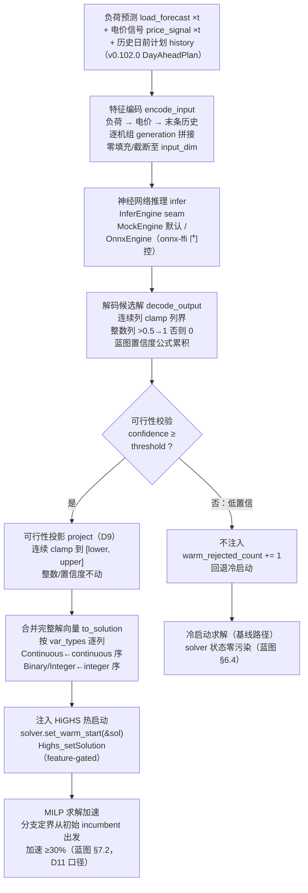
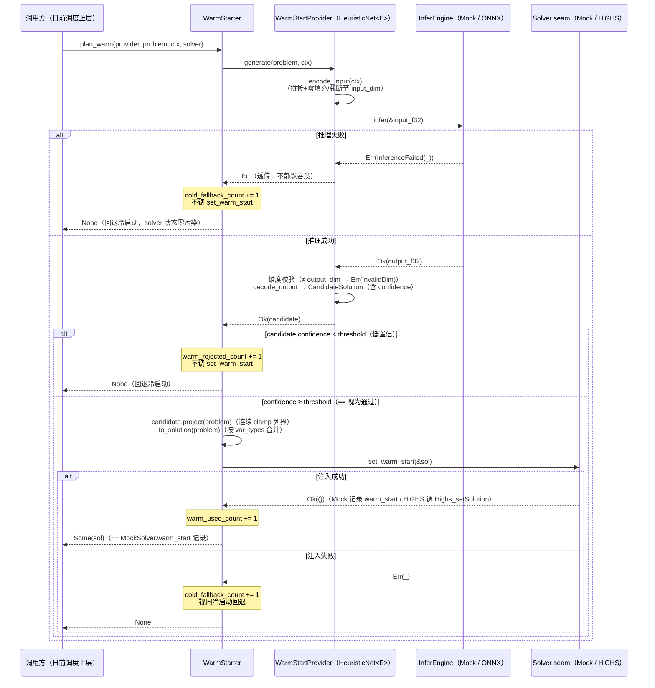

# EnerOS Solver 神经部分热启动设计 — HeuristicNet + WarmStarter + 冷启动降级链

> **版本**：v0.103.0（P2-F Solver 扩展第 2 版：MILP 神经热启动）
> **crate**：`eneros-solver-warm`（`crates/ai/solver-warm/`）+ `eneros-solver-core` 热启动注入增量（默认方法，feature-gated FFI）
> **蓝图依据**：`蓝图/phase2.md` §v0.103.0（9 节齐全）
> **spec 依据**：`.trae/specs/develop-v10300-warm-start/spec.md`（D1~D12 偏差声明源）
> **覆盖版本**：v0.103.0（蓝图检索确认无 v0.103.x 刚性子版本，Phase 2 刚性子版本仅 v0.98.1）
> **最后更新**：2026-07-19

---

## 1. 版本定位与目标

### 1.1 一句话目标

日前 MILP 冷启动求解耗时分钟级：基于 v0.102.0 UC MILP 基座与 v0.64.0 `LpProblem` 矩阵格式，用神经网络启发式（ONNX 推理）生成 MILP 初始候选解注入 HiGHS 热启动（加速 ≥ 30%，D11 口径），实现特征编解码 + 可行性投影 + 置信度阈值判定 + 冷启动降级链，为 v0.104.0 Pareto 提供加速底座。

### 1.2 详细描述

v0.102.0 已落地 UC MILP 基座（`UnitCommitment` / `DayAheadScheduler`），但分支定界从空白起点搜索，10 机组 × 24 周期（960 变量 / 720 Binary）求解为分钟级。蓝图 §v0.103.0 要求引入神经热启动：神经网络从历史日前计划中学习"负荷预测 + 电价信号 → 机组启停模式"的映射，推理产出候选解注入 HiGHS `Highs_setSolution`，使分支定界从高质量初始 incumbent 出发，剪枝效率显著提升（蓝图 §7.2 目标：加速 ≥ 30%）。

本版本交付四项核心能力：

| 能力 | 载体 | 说明 |
|------|------|------|
| 候选解与可行性投影 | `candidate.rs`（`CandidateSolution`） | 连续 clamp 列界 / 整数 0.5 阈值二值化（D9）；按 `var_types` 逐列合并为完整解向量 |
| 神经网络编解码 | `heuristic_net.rs`（`InferEngine` seam + `MockEngine` + `HeuristicNet<E>`） | `encode_input` 三特征源拼接 + 零填充/截断；`decode_output` clamp + 二值化 + 蓝图置信度公式 |
| 热启动编排与降级 | `warm_start.rs`（`WarmStartProvider` + `WarmStarter`） | 生成 → 置信度阈值判定 → 投影 → 合并 → 注入；Err/低置信/注入失败三分支回退冷启动；三计数器可观测（D10） |
| solver-core 注入 seam | `solver.rs` 默认方法 `set_warm_start` + `ffi.rs`/`highs.rs` feature-gated 增量 | 默认 no-op 非 BREAKING；`MockSolver` 覆写记录可断言；`HighsSolver` 覆写调 `Highs_setSolution` |

### 1.3 架构定位

| 维度 | 定位 |
|------|------|
| Phase | Phase 2 多机联邦 |
| 子系统 | P2-F Solver 扩展第 2 版（`crates/ai/` AI 子系统） |
| 平面 | 慢平面（Agent Runtime 分区，管理信息大区），日前计划粒度 |
| 角色 | MILP 加速底座：神经启发式候选解生成 + 热启动注入 + 冷启动降级 |
| 上游版本 | v0.64.0 solver-core（Solver trait + LpProblem + set_warm_start 注入点）；v0.102.0 solver-milp（UC MILP 基座 + DayAheadPlan 历史解）；v0.59.0 LLM 引擎（推理框架 seam 复用先例） |
| 下游版本 | v0.104.0 Pareto 多目标（热启动加速底座）；v0.116.0 模型签名校验（蓝图 §7.3 预留集成点） |
| 部署形态 | 纯 Rust crate（no_std + alloc，零第三方依赖，默认构建零 unsafe）；真实推理由 `onnx-ffi` feature 链接 ONNX Runtime C 库，默认构建 Mock 零 C 依赖 |

### 1.4 路线图链路

```
v0.64.0 Solver trait + LpProblem + HiGHS LP FFI
        │
        ▼
v0.102.0 UC MILP 基座（UnitCommitment / DayAheadScheduler / 三级降级链）
        │  └─ solver-core 增量：Solver::set_warm_start 默认方法（非 BREAKING）
        │                       + Highs_setSolution FFI（feature-gated）
        ▼
v0.103.0 神经部分热启动（本版本：候选解 + 编解码 + 编排 + 冷启动降级）
        │
        ├──► v0.104.0 Pareto 多目标（热启动加速底座上扩展多目标权衡）
        │
        └──► v0.116.0 模型签名校验（蓝图 §7.3 预留集成点）
```

---

## 2. 前置依赖

### 2.1 版本依赖

| 依赖版本 | crate | 本版本复用项 | 复用方式 |
|---------|-------|-------------|---------|
| v0.64.0 | `eneros-solver-core` | `Solver` trait（本版追加 `set_warm_start` 默认方法）/ `LpProblem`（`var_types`/`lower_bounds`/`upper_bounds`/`variables.len()`，D4 类型零重定义）/ `SolverError` / `MockSolver`（覆写记录注入向量） | path 依赖 `../solver-core`；D4 复用 v0.102.0 D4 先例 |
| v0.102.0 | `eneros-solver-milp` | `DayAheadPlan` / `UnitSchedule`（历史日前计划，`SolveContext.history` 载体）/ UC MILP 问题基座 | path 依赖 `../solver-milp`；历史解 generation 为第三特征源 |
| v0.59.0 | LLM 引擎 | 推理框架 seam 复用先例（`InferEngine` 与 `LlmEngine` 同 seam 模式） | 无代码依赖，方法论先例 |

### 2.2 外部依赖

| 依赖 | 版本 | 性质 | 说明 |
|------|------|------|------|
| ONNX Runtime | C API（`ort_create_session`/`ort_run_session`/`ort_free_session`） | C 库 | 经 `onnx-ffi` feature FFI 绑定；**feature-gated 默认关闭**，默认构建（MockEngine）零 C 依赖、零 unsafe；开源支持国产 NPU（蓝图 §5.6），CPU 推理为边缘默认 |

### 2.3 假设（蓝图 §2）

- 负荷预测曲线 `load_forecast` 与电价信号 `price_signal` 可用（由日前预测链路提供）。
- 历史日前计划 `history` 可为空（空 history 时编码仅 负荷+电价+零填充，C40）。
- 阻塞项说明：无 ONNX C 库则真实推理无法运行——本版以 `onnx-ffi` feature-gated 隔离该依赖，默认构建与全部单元测试不依赖 C 库（D6）。

### 2.4 no_std 与工具链前提

- 本 crate：`#![cfg_attr(not(test), no_std)]` + `extern crate alloc`，仅使用 `alloc::*` 与 `core::*`，零第三方依赖，默认构建零 `unsafe`（unsafe 仅在 `onnx-ffi` feature-gated 路径）。
- alloc 依赖 v0.11.0 用户堆；交叉编译目标 `aarch64-unknown-none`（记忆 §2.4.2 C8）。

---

## 3. 交付物清单

| # | 交付物 | 位置 | 说明 |
|---|--------|------|------|
| 1 | 新 crate `eneros-solver-warm` | `crates/ai/solver-warm/`（D1） | `src/candidate.rs`（CandidateSolution + 投影 + 合并）+ `src/heuristic_net.rs`（WarmError + InferEngine + MockEngine + HeuristicNet 编解码）+ `src/warm_start.rs`（SolveContext + WarmStartProvider + WarmStarter）+ `src/ffi.rs`（onnx-ffi 门控）+ `src/lib.rs`（模块声明 + 重导出 + crate 文档含 D1~D12 偏差表） |
| 2 | solver-core 热启动注入增量 | `crates/ai/solver-core/src/{solver,mock,ffi,highs,lib}.rs` + `Cargo.toml` | `solver.rs` 追加默认方法 `set_warm_start`（非 BREAKING）；`mock.rs` 覆写记录 `pub warm_start: Option<Vec<f64>>`；`ffi.rs` 追加 `Highs_setSolution` extern 声明（纯追加）；`highs.rs` 覆写调 `Highs_setSolution`（SAFETY 注释）；lib.rs 文档 + description 追加 v0.103.0 |
| 3 | 热启动参数配置 | `configs/warm-start.toml` | `[warm_start]` 段 `model_path` / `confidence_threshold`（默认 0.5，D8）/ `input_dim` / `output_dim` + 中文注释 7 点（NN 选型 / 加速 ≥30% 口径 / 冷启动回退 / 投影 D9 / CPU 非 GPU / 内存预算 ≤128MB / 模型签名预留） |
| 4 | 设计文档 | `docs/ai/warm-start-design.md`（本文档，D2） | 12 章节 + 2 Mermaid + D1~D12 偏差表 |
| 5 | 单元测试 30 个 | src 内嵌 `#[cfg(test)]`（D3，项目惯例） | `candidate.rs` TC1~TC8（8 个）+ `heuristic_net.rs` TH9~TH20（12 个）+ `warm_start.rs` TW21~TW30（10 个）；solver-core T19/T20（2 个） |
| 6 | 版本同步 | 根 `Cargo.toml` / `Makefile` / `.github/workflows/ci.yml` / `ci/src/gate.rs` | workspace version 0.102.0 → 0.103.0，members 追加 `"crates/ai/solver-warm"`；版本注释与 gate.rs 注释串尾 2 处同步 |

**无 BREAKING**：`Solver::set_warm_start` 为默认方法（`{ Ok(()) }`），既有全部实现（MockSolver/HighsSolver/各 crate stub）零改动可编译；solver-core 18 旧测试零回归。

---

## 4. 架构设计

### 4.1 模块划分

| 模块 | 类型 | 职责 |
|------|------|------|
| `candidate.rs` | `CandidateSolution` | 热启动候选解（continuous / integer / confidence 三字段）；`project` 可行性投影（D9）；`to_solution` 按 `var_types` 合并完整解向量 |
| `heuristic_net.rs` | `WarmError` / `InferEngine` / `MockEngine` / `HeuristicNet<E>` | 推理 seam 与编解码纯 Rust 逻辑；MockEngine 默认可测（预设输出 / 模拟失败，零 unsafe） |
| `warm_start.rs` | `SolveContext` / `WarmStartProvider` / `WarmStarter` | 求解上下文（负荷 + 电价 + 历史计划）；provider trait（D5 无 Send+Sync）；编排器（阈值判定 + 降级链 + 三计数器） |
| `ffi.rs` | `OnnxEngine` + `ort_*` extern 声明 | `#[cfg(feature = "onnx-ffi")]` 门控；NonNull session + Drop RAII（D6/D7） |
| `lib.rs` | 模块声明 + 重导出 | crate 文档含 D1~D12 偏差表；`onnx-ffi` feature 声明 |

### 4.2 类型依赖关系

```
                 ┌──────────────────────┐
                 │ eneros-solver-core    │
                 │  Solver (set_warm_    │
                 │   start 默认方法)     │
                 │  LpProblem / VarType  │
                 └───────┬──────────────┘
                         │
        ┌────────────────┼─────────────────┐
        │                │                 │
        ▼                ▼                 ▼
┌──────────────┐ ┌───────────────┐ ┌───────────────┐
│ candidate.rs │ │heuristic_net. │ │ warm_start.rs │
│ Candidate-   │ │rs             │ │ SolveContext  │
│ Solution     │ │ InferEngine   │ │ WarmStart-    │
│ project/     │◄│ MockEngine    │ │ Provider      │
│ to_solution  │ │ HeuristicNet  │ │ WarmStarter   │
└──────────────┘ │ <E>           │ │ plan_warm     │
                 └──────┬────────┘ └───────┬───────┘
                        │ implements       │ 注入 &dyn Solver
                        ▼                  ▼
                 WarmStartProvider   solver-core Mock/HiGHS
                        ▲
                        │ (onnx-ffi feature)
                 ┌──────┴───────┐
                 │ ffi.rs       │
                 │ OnnxEngine   │ ──► ort_create/run/free_session (C API)
                 └──────────────┘
```

### 4.3 技术交底：候选解生成方案选型对比（蓝图 §5.1）

| 方案 | 加速预期（蓝图 §5.1） | 学习能力 | 实现复杂度 | 结论 |
|------|---------------------|---------|-----------|------|
| **神经网络启发式** | **≥ 30%** | ✅ 从历史解学习负荷/电价→启停模式非线性映射，泛化强 | 中（ONNX 推理 + 编解码） | ⭐ **采用** |
| 贪心启发式 | 10-15% | ❌ 固定规则，无泛化 | 低 | 备选 |
| 历史平均 | 5-10% | ❌ 均值平滑丢失启停结构 | 低 | 排除（加速不足） |
| 无热启动（冷启动） | 0%（基线） | — | 零 | 降级兜底路径 |

选型结论：神经网络启发式加速预期显著高于规则法（≥30% vs 10-15% vs 5-10%），且 v0.102.0 `DayAheadPlan` 历史解天然构成训练/推理数据底座；冷启动保留为降级链兜底（蓝图 §4.4），非主路径。

### 4.4 LLM 必要性声明（蓝图 §43.7 P1-5）

**本版本不引入 LLM**。热启动候选解生成是"历史数据 → 固定维度向量"的回归/分类问题：小型前馈网络（72 维输入 / 96 维输出）足以表达，无需 LLM 介入；本版属 **L1 主路径**（Solver-only 加速增强），满足"实时控制不依赖 LLM"的架构约束。L2 增强路径（LLM + Solver 双脑）与本版解耦。

---

## 5. 核心流程（蓝图 §4.3 热启动流程图，图 1）

日前调度的完整热启动链路：负荷预测 + 电价信号 + 历史日前计划作为输入，经特征编码、神经网络推理、解码候选解、可行性校验/投影后注入 HiGHS，MILP 从高质量初始 incumbent 出发加速求解：



**关键语义**：

- **三特征源**（蓝图 §5.2）：负荷预测 + 电价信号 + 历史调度（末条 `DayAheadPlan` 逐机组 generation），覆盖"需求-价格-先例"三类先验。
- **可行性双保险**：`decode_output` 内已做 clamp/二值化（D9 即蓝图 decode 语义），注入前 `project` 再次 clamp 兜底——两道界内投影保证 `Highs_setSolution` 收到的解向量必在变量界内，不做约束级 LP 投影（需求解 LP，过度工程化）。
- **置信度判前判后**：置信度在 decode 时按蓝图公式累积（§8.2），阈值判定在 project 之前（低置信解不值得投影注入）。

---

## 6. plan_warm 判定与降级链（图 2）

`WarmStarter::plan_warm` 是编排核心，注入 `&dyn WarmStartProvider` + `&mut dyn Solver` 双 seam（C58），三分支降级路径与计数器真值一一对应：



### 6.1 三分支计数器真值表（C57）

| 分支 | 触发条件 | warm_used_count | warm_rejected_count | cold_fallback_count | 返回值 | set_warm_start |
|------|---------|-----------------|---------------------|---------------------|--------|----------------|
| Err 回退 | `generate` 返回 Err（推理失败/维度不匹配） | 不变 | 不变 | **+1** | `None` | 不调用 |
| 低置信拒绝 | `confidence < threshold` | 不变 | **+1** | 不变 | `None` | 不调用 |
| 成功注入 | `confidence ≥ threshold` 且注入 Ok | **+1** | 不变 | 不变 | `Some(sol)` | 调用并记录 |
| 注入失败回退 | `set_warm_start` 返回 Err | 不变 | 不变 | **+1** | `None` | 调用但失败 |

### 6.2 冷启动一致性（蓝图 §6.4）

所有回退路径均**不污染 solver 状态**：Err 回退与低置信拒绝完全不触碰 solver；注入失败路径 HiGHS `Highs_setSolution` 失败不改变模型本身（解注入仅提供初始 incumbent 提示），后续 `solve` 即等价冷启动。阈值边界 `confidence == threshold` 视为通过（`>=` 判定，C53）。

---

## 7. 接口契约

与 `.trae/specs/develop-v10300-warm-start/spec.md` 接口契约节一致：

```rust
// candidate.rs
pub struct CandidateSolution {
    pub continuous: Vec<f64>, pub integer: Vec<i32>, pub confidence: f64,
}  // Debug/Clone
impl CandidateSolution {
    pub fn new(continuous: Vec<f64>, integer: Vec<i32>, confidence: f64) -> Self;
    pub fn project(&mut self, problem: &LpProblem);          // 连续 clamp 列界（D9）
    pub fn to_solution(&self, problem: &LpProblem) -> Vec<f64>; // 按 var_types 合并
}

// heuristic_net.rs
pub trait InferEngine {
    fn infer(&self, input: &[f32]) -> Result<Vec<f32>, WarmError>;
    fn input_dim(&self) -> usize;
    fn output_dim(&self) -> usize;
}
pub struct MockEngine { /* 预设输出 / 模拟失败 */ }          // 默认可用
pub struct OnnxEngine { /* NonNull session + Drop */ }       // feature = "onnx-ffi"
pub struct HeuristicNet<E: InferEngine> { pub engine: E }
impl<E: InferEngine> HeuristicNet<E> {
    pub fn new(engine: E) -> Self;
    pub fn encode_input(&self, ctx: &SolveContext) -> Vec<f64>;   // 拼接+零填充/截断
    pub fn decode_output(&self, output: &[f64], problem: &LpProblem) -> CandidateSolution; // D9 投影+蓝图置信度公式
}

// warm_start.rs
pub struct SolveContext {
    pub load_forecast: Vec<f64>, pub price_signal: Vec<f64>,
    pub history: Vec<DayAheadPlan>,   // 复用 v0.102.0 eneros-solver-milp
}  // Debug/Clone/Default
pub trait WarmStartProvider {         // 无 Send+Sync（D5）
    fn generate(&self, problem: &LpProblem, ctx: &SolveContext) -> Result<CandidateSolution, WarmError>;
}
impl<E: InferEngine> WarmStartProvider for HeuristicNet<E> { /* encode → infer → decode */ }
pub struct WarmStarter {
    pub confidence_threshold: f64,
    pub warm_used_count: u64, pub warm_rejected_count: u64, pub cold_fallback_count: u64,
}
impl WarmStarter {
    pub fn new(confidence_threshold: f64) -> Self;
    pub fn plan_warm(
        &mut self, provider: &dyn WarmStartProvider, problem: &LpProblem,
        ctx: &SolveContext, solver: &mut dyn Solver,
    ) -> Option<Vec<f64>>;   // Some=已注入；None=回退冷启动（D10 计数器可观测）
}
pub enum WarmError { ModelLoadFailed, InferenceFailed(i32), InvalidDim }  // Debug/Clone/PartialEq

// solver-core solver.rs 增量（默认方法，非 BREAKING）
pub trait Solver {
    /* 既有方法零改动 */
    fn set_warm_start(&mut self, _solution: &[f64]) -> Result<(), SolverError> { Ok(()) }
}
// solver-core ffi.rs 增量（#[cfg(feature = "highs-ffi")]）
extern "C" { pub fn Highs_setSolution(highs: HighsPtr, col_value: *const f64) -> c_int; }
```

---

## 8. 特征编解码规范

### 8.1 encode_input 编码规范（C38~C40）

拼接顺序严格固定（蓝图 §4.4）：

```
input = load_forecast ‖ price_signal ‖ 末条 history 逐机组 generation（机组序 × 周期序）
```

- **零填充/截断**：拼接结果不足 `engine.input_dim()` 时末尾补 `0.0`，超出时截断（`resize(dim, 0.0)` 一步完成），输出长度恒等于 `input_dim`。
- **空 history**：`history.last()` 为 None 时仅 负荷 + 电价 + 零填充，不 panic（C40）。
- **历史取末条**：仅取 `history` 末条 `DayAheadPlan`（最近一日先例），其 `schedule` 按机组序遍历、每台机组 `generation` 按周期序拼接（机组外层、周期内层）。
- **典型维度**（configs/warm-start.toml）：24 负荷 + 24 电价 + 2 机组 × 24 周期 = 72（`input_dim = 72`）。
- **f32 转换**：`generate` 内将 f64 特征转 f32 喂入 `InferEngine::infer`（ONNX 默认 f32 张量），输出 f32 回转 f64 解码（C44）。

### 8.2 decode_output 解码规范（C41~C43）

逐列按 `problem.var_types` 判定（列索引与输出向量一一对应，缺省值 `0.0`）：

| 列类型 | 取值规则 | 置信度累积 |
|--------|---------|-----------|
| Continuous | `clamp(v, lower_bounds[i], upper_bounds[i])`（缺省下界 0.0 / 上界 +∞）→ 入 `continuous` 序 | 不累积 |
| Binary / Integer | `v > 0.5 → 1`，否则 `0` → 入 `integer` 序 | **蓝图公式**：`confidence *= 1.0 − |v−0.5|·2` |

- **蓝图置信度公式**：整数列逐列累积 `1 − |v−0.5|·2`（v 越接近 0/1 因子越大，越接近 0.5 因子越小），最终 `confidence /= num_vars` 归一化；任一整数列输出恰为 0.5（最大不确定）时因子为 0，整体置信度归零（TH16 锚定）。
- **置信度与投影分离**：decode 内的 clamp/二值化即 D9 投影语义（产出已在界内）；`project` 不修改 confidence（C27），置信度只反映神经网络输出的确定性，不被投影篡改。

### 8.3 维度契约

- 编码输出长度 == `engine.input_dim()`；推理输出长度 ≠ `engine.output_dim()` → `Err(WarmError::InvalidDim)` 回退冷启动（C45）。
- 蓝图 72/96 维度硬编码消除：`input_dim`/`output_dim` 来自 engine 构造参数（D7），配置化为 `configs/warm-start.toml` 的 `input_dim`/`output_dim`。

---

## 9. 测试计划

### 9.1 测试矩阵（solver-warm 30 个 + solver-core 2 个，src 内嵌 `#[cfg(test)]`，D3）

| 文件 | 编号 | 数量 | 覆盖 |
|------|------|------|------|
| candidate.rs | TC1~TC8 | 8 | 构造字段 / 投影 clamp 上下界 / 投影不改整数不改信度 / to_solution 合并顺序（4 列混排）/ 长度==num_vars / 全连续问题 / 全整数问题 / 空候选 |
| heuristic_net.rs | TH9~TH20 | 12 | encode 维度==input_dim / 拼接顺序（负荷→电价→历史 generation）/ 零填充 / 截断 / 空 history / decode 连续 clamp / decode 二值化 0.9→1 / 0.5→0 信度归零 / 蓝图置信度公式累积 / MockEngine 驱动 generate e2e / infer Err 透传 / 维度 mismatch InvalidDim |
| warm_start.rs | TW21~TW30 | 10 | 成功注入 Some+Mock 记录 / 低置信 None+rejected 计数 / 推理失败 None+fallback 计数 / 计数器真值（三分支各 1）/ threshold 边界 ==判定通过 / 解向量内容==合并投影结果 / 空 ctx 可用 / WarmStarter::new 计数器清零 / WarmError 变体 / provider dyn seam |
| solver-core | T19/T20 | 2 | MockSolver 记录注入（含覆盖末次）/ 默认方法 no-op（自定义 stub 不覆写） |

### 9.2 测试 seam 与桩

- **MockEngine seam**：预设输出驱动 generate e2e（TH18）；`failing()` 模拟推理失败验证 Err 透传（TH19）；`with_input_dim` 显式维度验证编码路径（TH9~TH13）。
- **MockSolver seam**：`plan_warm` 注入 `&mut dyn Solver`（C58），`warm_start: Option<Vec<f64>>` 记录断言注入向量与返回 Some 一致（TW21/TW26，C56）。
- **计数器真值**：TW25 一次成功 + 一次低置信 + 一次 Err 各 1，三计数器逐一断言（C57）。

### 9.3 性能测试口径（D11）

- **本版断言注入路径正确性**：30/30 单测验证 generate → 投影 → 注入链路逻辑正确（Mock 记录断言），不对加速比实测断言。
- **加速 ≥30% 为硬件集成验证项**（蓝图 §7.2）：需真实 ONNX 模型 + HiGHS 环境实测，超出单元测试范围（v0.102.0 D11 先例），本版**不实测、不声称实测**。
- GPU 规则：不涉及（蓝图 §6.6；ONNX Runtime CPU 推理，Solver 不适用 GPU 规则）。

---

## 10. 验收标准

| # | 验收项 | 标准 |
|---|--------|------|
| 1 | 单元测试 | `cargo test -p eneros-solver-warm` **30/30 通过**（TC1~TC8 + TH9~TH20 + TW21~TW30）；`cargo test -p eneros-solver-core` 20/20（18 旧 + T19/T20 新） |
| 2 | 零回归 | 全 workspace 回归全绿（solver-milp 31 / energy-lp-model / solver-model 等依赖方零改动编译通过，C100 无 BREAKING 验证） |
| 3 | 交叉编译 | `cargo build -p eneros-solver-warm --target aarch64-unknown-none -Z build-std=core,alloc -Z build-std-features=compiler-builtins-mem` 通过；`cargo build -p eneros-solver-warm --features onnx-ffi` 编译通过（C37）；`cargo build -p eneros-solver-core --features highs-ffi` 编译通过 |
| 4 | 代码质量 | `cargo fmt --all -- --check` 通过；`cargo clippy --workspace --exclude eneros-kernel --exclude eneros-hello --all-targets -- -D warnings` 0 warning；`cargo deny check` 通过（零新增第三方依赖，SBOM 不变） |
| 5 | 功能验收（蓝图 §7.1） | 热启动候选解生成功能可用：generate → 投影 → 注入 e2e（TW21）；编码完整覆盖三特征源（蓝图 §5.2，TH10）；错误处理三路径（蓝图 §4.4：TW22 低置信 / TW23 推理失败 / TW24 注入 Err） |
| 6 | 性能口径（蓝图 §7.2） | 加速 ≥30% 声明为硬件集成验证项（D11）；本版注入路径正确性 30/30 单测锁定 |
| 7 | 安全验收（蓝图 §7.3） | ONNX FFI 内存安全（NonNull+Drop RAII + SAFETY 注释）；模型签名校验 v0.116.0 预留集成点声明；新 crate 默认构建零 unsafe、无 `use std::*`/`panic!`/`todo!`/`unimplemented!`/`async` |

---

## 11. 风险与偏差声明

### 11.1 风险

| # | 风险 | 影响 | 缓解 |
|---|------|------|------|
| R1 | ONNX Runtime C 库交叉编译依赖（蓝图 §8 风险面） | `onnx-ffi` 目标环境需交叉编译 ONNX C 库 | feature-gated 隔离（D6）：默认构建（MockEngine）零 C 依赖、零 unsafe，CI 与单元测试不触碰 C 库；extern 声明与蓝图 §4.5 签名一致 |
| R2 | 模型质量不足导致频繁回退 | 低置信解被拒绝，热启动命中率低 | `confidence_threshold` 配置化（D8，默认 0.5）；三计数器可观测（D10），上层可统计命中率并告警；回退路径等价冷启动，无正确性损失 |
| R3 | 神经网络输出不可行解 | 越界/非整数解注入 HiGHS 行为未定义 | 双保险投影（D9）：decode 内 clamp/二值化 + 注入前 project 再 clamp；不做约束级投影（过度工程化），界内投影已满足 `Highs_setSolution` 要求 |
| R4 | 维度配置与模型不匹配 | 推理输出维度错误 | `InvalidDim` 显式报错回退冷启动（C45），不静默吞没；`input_dim`/`output_dim` 配置化（D7）与模型文件配套管理 |
| R5 | FFI 内存安全 | session 泄漏/悬垂指针 | `OnnxEngine` NonNull 非空句柄 + `Drop` 调 `ort_free_session` RAII；全部 unsafe 块附 SAFETY 注释；默认构建零 unsafe（C60） |

### 11.2 偏差声明（D1~D12，相对蓝图 §3/§4/§5）

与 `.trae/specs/develop-v10300-warm-start/spec.md` 偏差表逐字一致：

| 编号 | 偏差 | 理由 |
|------|------|------|
| **D1** | 蓝图 `crates/solver_warm/` → `crates/ai/solver-warm/` | 记忆 §2.3.1 强制：crate 归 `crates/<subsystem>/`；与 solver-core/solver-milp 同 AI 子系统 |
| **D2** | 蓝图 `docs/phase2/warm_start.md` → `docs/ai/warm-start-design.md` | 记忆 §2.3.3 强制：文档按方向分类 |
| **D3** | 蓝图 `tests/warm_start_bench.rs` → src 内嵌 `#[cfg(test)]` | v0.87.0~v0.102.0 项目惯例，不新增 tests/ 文件 |
| **D4** | 不重定义 `MilpModel`；蓝图 `model.integrality/col_lower/col_upper/num_vars` → 复用 v0.64.0 `LpProblem.var_types/lower_bounds/upper_bounds/variables.len()`（v0.102.0 D4 复用先例） | 避免平行类型体系（Karpathy Simplicity First） |
| **D5** | 蓝图 `WarmStartProvider: Send + Sync` → 去除 bound | 与 v0.64.0 `Solver`/v0.59.0 `LlmEngine` 惯例一致；ONNX session 原始指针本非 Send/Sync，bound 与 FFI 设计自相矛盾 |
| **D6** | ONNX FFI 独立 feature `onnx-ffi`（默认关闭）；`InferEngine` seam + `MockEngine` 默认可测 | 真实 ONNX C 库编译超出单元测试范围（v0.64.0 D2/D10、v0.102.0 D5 先例）；默认构建零 unsafe 零 C 依赖 |
| **D7** | 蓝图 `HeuristicNet::load(path, device)` 返回具体 struct → `HeuristicNet<E: InferEngine>` 泛型 + `OnnxEngine::load`（feature-gated）/ `MockEngine::new` | 推理后端可注入（记录型 stub 验证编码路径）；蓝图 72/96 维度硬编码改为构造参数 `input_dim/output_dim` |
| **D8** | 蓝图"置信度过低 → 忽略"未量化 → `confidence_threshold` 构造注入（默认 0.5，配置化） | 判定阈值显式化（D10 参数配置化惯例） |
| **D9** | 可行性投影落地为 连续 clamp + 整数 0.5 二值化（即蓝图 decode_output 语义），不做约束级 LP 投影 | 约束级投影需求解 LP，过度工程化；界内投影已满足 HiGHS setSolution 要求 |
| **D10** | 加速 metric 落地为 `warm_used_count/warm_rejected_count/cold_fallback_count` 计数器 | no_std 无 log crate，metric 字段化（v0.102.0 D9 先例） |
| **D11** | 加速 ≥30% 为硬件集成验证项（真实 ONNX 模型 + HiGHS）；本版测试注入路径正确性（Mock 记录断言），不对加速比实测断言 | v0.102.0 D11 性能口径先例；设计文档声明口径 |
| **D12** | `ComputeDevice` 仅保留 `Cpu` 变体（蓝图 `Gpu(String)` 删除）；边缘推理 CPU-only（蓝图 §6.6 GPU 规则不适用 Solver） | 蓝图自相矛盾（§4.1 定义 Gpu 变体 vs §6.6 声明不适用 GPU）；避免死代码 |

---

## 12. 性能口径声明

### 12.1 加速 ≥30% 口径（蓝图 §7.2，D11）

**加速 ≥30% 为硬件集成验证项**：需在真实 ONNX 模型 + HiGHS FFI 环境中实测 MILP 求解时间对比（热启动 vs 冷启动基线），属硬件集成测试范围，本版本单元测试**不对加速比做实测断言**。本版本验收边界为**注入路径正确性**：30/30 单测锁定 generate → 置信度判定 → 投影 → 合并 → `set_warm_start` 注入全链路的逻辑正确性（Mock 记录断言，`MockSolver.warm_start` 与返回 `Some(sol)` 逐元素一致）。

先例：v0.102.0 D11（10 机组求解 <5s 留待 HiGHS 硬件集成验证）、v0.64.0 D7、v0.66.0 D7，同属"性能指标留待真实 C 库集成环境验证，单测验证逻辑正确性"。

### 12.2 GPU 规则声明（蓝图 §6.6，D12）

**Solver 热启动不适用 GPU 规则**（记忆 §4.2）：边缘推理采用 ONNX Runtime **CPU** 后端，无 PyTorch/CUDA；`ComputeDevice` 仅保留 `Cpu` 变体（蓝图 `Gpu(String)` 删除，D12 避免死代码）。GPU 优先规则仅适用云端模型训练/校准与数字孪生仿真加速，不适用本边缘推理与 Solver 求解路径。

### 12.3 内存预算声明（蓝图 §5.6/记忆 §5.6）

Solver 分区内存预算 **≤ 128MB**（含 MILP 模型 + 分支定界树 + 热启动增量）。本版热启动增量开销：特征向量 `input_dim` × f64（72×8B ≈ 0.6KB）+ 推理输出 `output_dim` × f32（96×4B ≈ 0.4KB）+ 候选解/合并解向量（n·t·4 级，KB 级）——**总计 KB 级，远低于预算**。OOM 策略与 v0.102.0 一致：缩减问题规模 / 超时降级；总用量 > 90% 触发 OOM handler 冻结非关键 Agent（蓝图 §43.6）。

### 12.4 安全与国产化声明

- **ONNX FFI 内存安全**：`OnnxEngine` `NonNull<c_void>` session 句柄 + `Drop` 调 `ort_free_session` RAII；`load` 空指针检查返回 `ModelLoadFailed`；全部 unsafe 块附 SAFETY 注释（指针有效、长度匹配、生命周期覆盖调用）；unsafe 仅存在于 `onnx-ffi` feature-gated 路径，默认构建零 unsafe。
- **模型签名校验预留**（蓝图 §7.3）：模型文件加载前的签名校验为 **v0.116.0 预留集成点**——本版 `OnnxEngine::load(path, ...)` 仅加载模型，SM2 签名 + SM3 摘要校验由 v0.116.0 在加载前注入校验 seam，本版接口已预留路径透传，无 BREAKING 变更。
- **国产化支持**：ONNX Runtime 为开源软件、支持国产 NPU（蓝图 §5.6），CPU 推理为边缘默认部署形态；核心编解码/投影/编排逻辑全部自研 Rust no_std 代码，符合记忆 §5.5 默认集成清单"仅 Rust 封装层自研"的选型决策。SBOM 经 `cargo deny check` 持续扫描，本版零新增第三方 Rust 依赖。

---

> **文档结束**。本设计文档覆盖 v0.103.0 Solver 神经部分热启动的全部设计内容，含 12 章节 + 2 Mermaid 图（蓝图 §4.3 热启动流程图重绘、plan_warm 判定/降级时序图）+ D1~D12 偏差表（12 行，与 spec.md 逐字一致）。加速 ≥30% 性能口径（§12.1）、GPU 规则（§12.2）与内存预算（§12.3）均已按 D11/蓝图 §6.6/蓝图 §5.6 声明。
