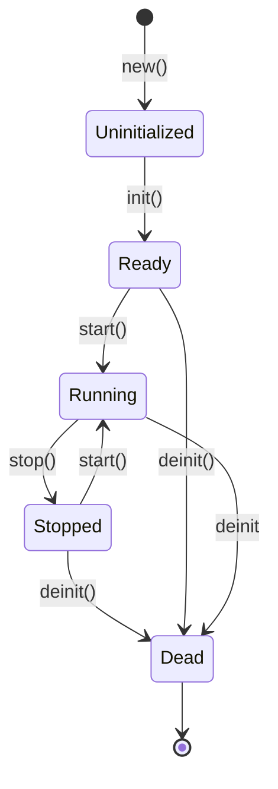
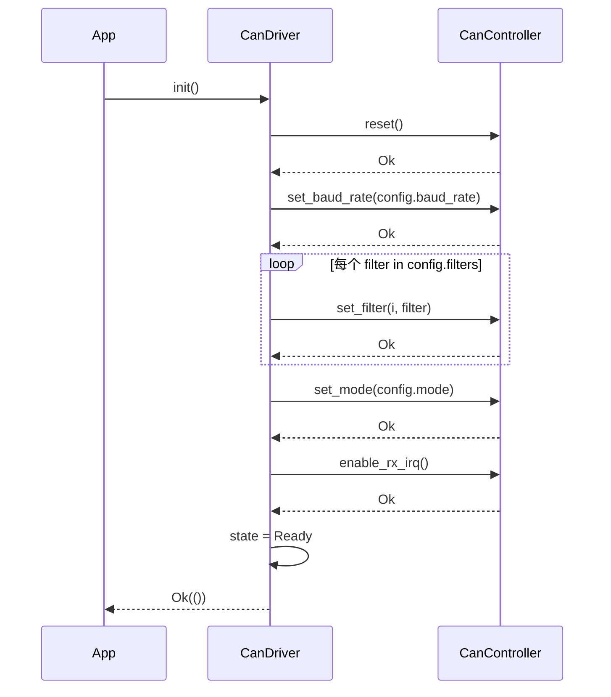
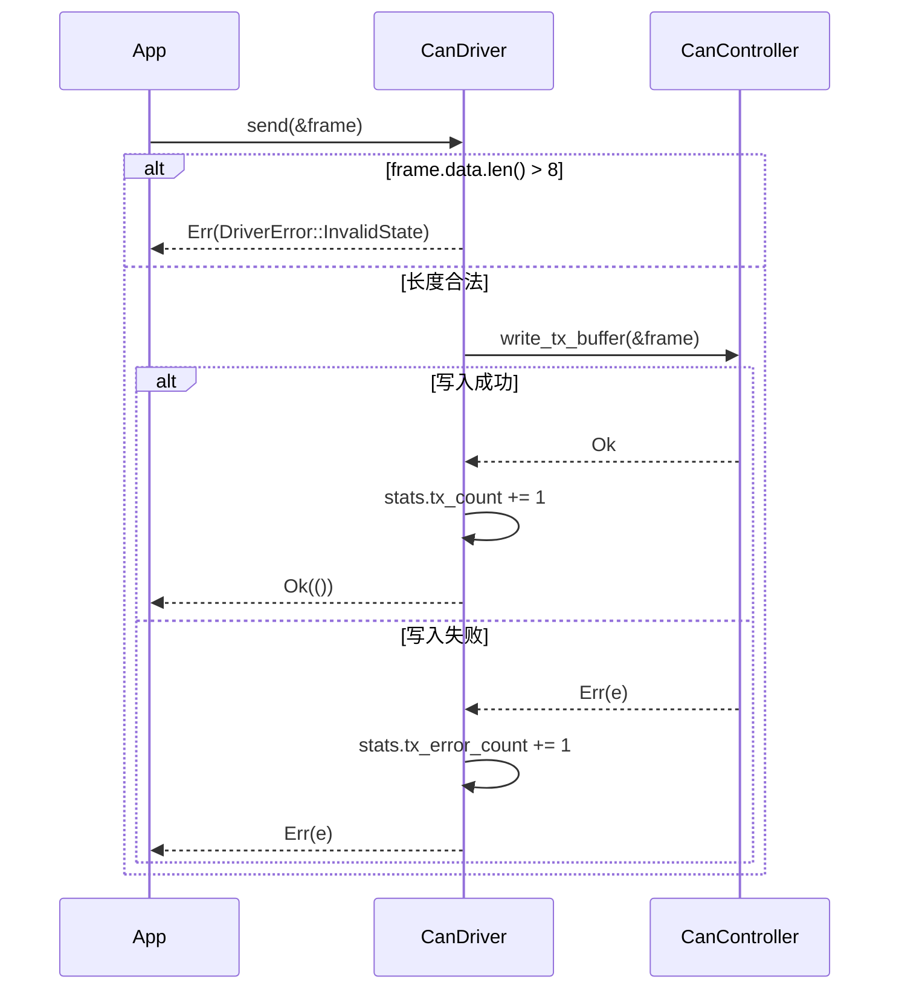
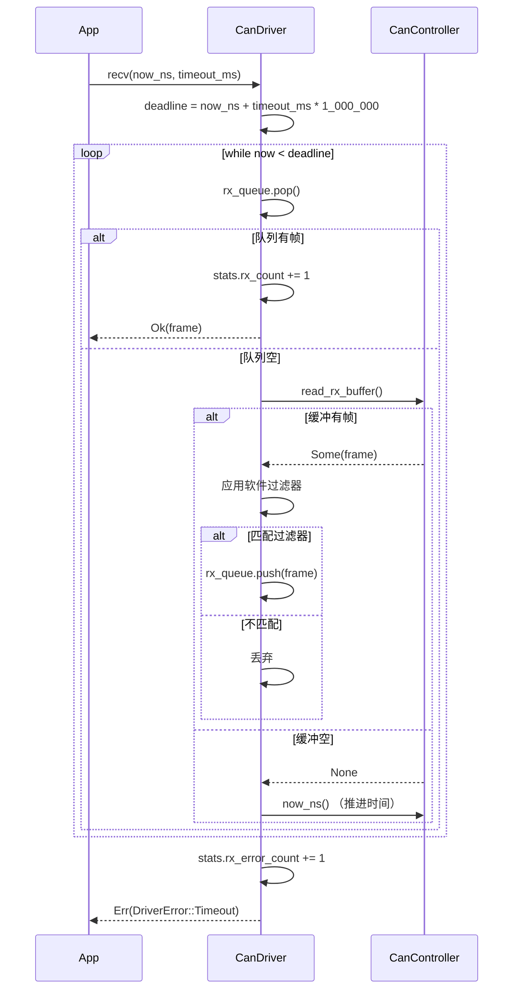
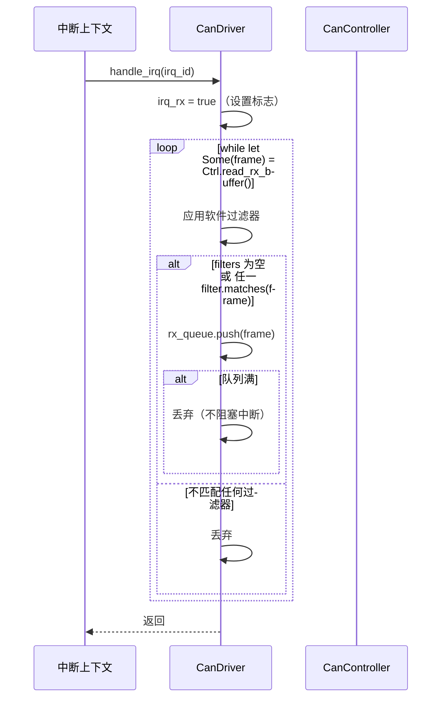

# CAN 驱动设计文档（v0.47.0）

> **版本**：v0.47.0
> **蓝图参考**：`蓝图/phase1.md` §8391-8643
> **前置版本**：v0.43.0（驱动框架）
> **后续版本**：v0.48.0+（CANopen 协议栈）
> **最后更新**：2026-07-15

---

## 1. 概述

CAN（Controller Area Network）是汽车与工业控制领域广泛使用的高可靠性串行总线协议，凭借其内置的 CRC 校验、ACK 机制、位仲裁与错误管理，在储能系统 BMS / PCS / 逆变器等设备通信中占据主导地位。本版本实现 CAN 2.0A/B 帧驱动，为后续上层 CAN 协议提供统一传输基础。

- **一句话目标**：实现 CAN 2.0A/B 帧驱动，支持 11 位标准 ID 与 29 位扩展 ID、ID 过滤（accept_all / match_exact / match_prefix）以及 Normal / ListenOnly / Loopback 三种工作模式。
- **架构定位**：P1-F 设备协议栈第五层，位于 v0.43.0 驱动框架 / v0.44.0 RS485 / v0.45.0 Modbus RTU / v0.46.0 Modbus TCP 之上，为 Phase 2+ 的 CANopen / UDS / 储能专用 CAN 协议提供物理层 + 链路层传输能力。
- **设计原则关联**：高可靠性（CAN 自带 CRC + ACK + 错误计数）、实时性（CAN 帧 ID 优先级仲裁）、可维护性（`CanController` trait 抽象使硬件实现可替换，D1 / D9）。
- **后续解锁**：CANopen 协议栈（v0.48.0+）、储能专用 CAN 协议（Phase 2）、UDS（Unified Diagnostic Services）over CAN、J1939 车辆 CAN 协议。

---

## 2. 版本目标

基于 v0.43.0 驱动框架（`DeviceDriver` trait + `DriverError` / `DriverId` / `DriverState` / `DriverType` / `DriverHealth`）实现 CAN 总线驱动 `CanDriver`，提供 CAN 2.0A/B 帧收发、ID 过滤与多模式工作能力。

| # | 目标 | 说明 |
|---|------|------|
| G1 | 实现 `CanDriver` 并实现 `DeviceDriver` trait | 复用 v0.43.0 框架生命周期（init / start / stop / deinit / handle_irq / health_check） |
| G2 | 支持 CAN 2.0A 标准 11 位 ID 帧 | `CanId::Standard(u16)`，掩码 `0x7FF` |
| G3 | 支持 CAN 2.0B 扩展 29 位 ID 帧 | `CanId::Extended(u32)`，掩码 `0x1FFFFFFF` |
| G4 | 实现 ID 过滤器 | `accept_all` / `match_exact` / `match_prefix` 三种构造 + `matches()` 匹配（D7） |
| G5 | 支持 Normal / ListenOnly / Loopback 三种模式 | `CanMode` 枚举 |
| G6 | 抽象 CAN 控制器硬件访问 | 本地 `CanController` trait（D1 / D9），不依赖 `eneros-hal` crate |
| G7 | no_std 合规 | `#![cfg_attr(not(test), no_std)]` + `extern crate alloc`，仅用 `alloc::*` / `core::*` |

---

## 3. 前置依赖

| 依赖版本 | 依赖产出 | 用途 |
|---------|---------|------|
| v0.43.0 | `DeviceDriver` trait + `DriverError` / `DriverId` / `DriverState` / `DriverType` / `DriverHealth` | 驱动生命周期与错误模型，`CanDriver` 实现此 trait |
| v0.7.0 | HAL SPI / GPIO / IRQ | **概念依赖**（D9）：CAN 控制器寄存器访问所需，但不直接依赖 `eneros-hal` crate，由 `CanController` trait 的实现者负责桥接 |

> **依赖说明**：v0.7.0 HAL 在本 crate 中仅为概念依赖（D9）。蓝图 §8399-8403 假设 HAL 直接提供 CAN 控制器接口，但实际 `eneros-hal` 仅有 `HalSpi` / `HalGpio`，无 CAN 控制器专有方法。因此本 crate 定义本地 `CanController` trait（D1）抽象硬件操作，与 `eneros-hal` 解耦，便于 mock 测试与多控制器实现替换。详见 §5.7 偏差声明 D1 / D9。

---

## 4. 交付物清单

| 类型 | 交付物 | 路径 |
|------|--------|------|
| 代码 crate | `eneros-can` | `crates/drivers/can/`（D8） |
| crate 清单 | `Cargo.toml` | `crates/drivers/can/Cargo.toml` |
| crate 入口 | `lib.rs` | `crates/drivers/can/src/lib.rs` |
| 帧结构 | `CanFrame` / `CanId` / `FrameType` | `crates/drivers/can/src/frame.rs` |
| 过滤器 | `CanFilter` | `crates/drivers/can/src/filter.rs` |
| 配置 | `CanConfig` / `CanMode` / `CanControllerType` | `crates/drivers/can/src/config.rs` |
| 硬件抽象 | `CanController` trait + `CanStats` | `crates/drivers/can/src/controller.rs` |
| 驱动实现 | `CanDriver` | `crates/drivers/can/src/driver.rs` |
| 环形缓冲 | `RingBuffer<T, N>` | `crates/drivers/can/src/ring.rs`（D4） |
| 测试桩 | `MockCanController` | `crates/drivers/can/src/mock.rs`（`#[cfg(test)]`） |
| 设计文档 | 本文档 | `docs/drivers/can-driver-design.md` |
| 配置变更 | 根 `Cargo.toml` | workspace `version` `0.46.0` → `0.47.0`，`members` 新增 `"crates/drivers/can"` |

---

## 5. 详细设计

### 5.1 模块结构

```
crates/drivers/can/
├── Cargo.toml          # crate 清单（依赖 eneros-driver-framework；不依赖 eneros-hal，D9）
└── src/
    ├── lib.rs          # crate 根：no_std 声明 + extern crate alloc + 模块声明 + re-export
    ├── frame.rs        # CanId / FrameType / CanFrame 帧结构（无 timestamp，D3）
    ├── filter.rs       # CanFilter 过滤器（D7 增强：标准/扩展互斥）
    ├── config.rs       # CanConfig / CanMode / CanControllerType（D2：仅配置标识）
    ├── controller.rs   # CanController trait（D1）+ CanStats
    ├── driver.rs       # CanDriver + DeviceDriver trait 实现
    ├── ring.rs         # RingBuffer<T, const N: usize> 本地实现（D4）
    └── mock.rs         # MockCanController 测试桩（#[cfg(test)]）
```

各模块职责：

| 文件 | 职责 |
|------|------|
| `lib.rs` | crate 根：声明 `#![cfg_attr(not(test), no_std)]` + `extern crate alloc`；声明子模块；re-export 公有 API |
| `frame.rs` | 定义 `FrameType` / `CanId` / `CanFrame` 帧结构，含 `new_standard` / `new_extended` / `new_remote` 构造方法 |
| `filter.rs` | 定义 `CanFilter`，提供 `accept_all` / `match_exact` / `match_prefix` 构造与 `matches()` 匹配 |
| `config.rs` | 定义 `CanMode` / `CanControllerType` / `CanConfig`（含 `Default`） |
| `controller.rs` | 定义 `CanController` trait（HAL 抽象，D1）与 `CanStats` 统计结构 |
| `driver.rs` | 定义 `CanDriver` 并实现 `DeviceDriver` trait，含 `send` / `recv` / `handle_irq` / `health_check` |
| `ring.rs` | `RingBuffer<T, const N: usize>` 固定容量环形缓冲（不依赖 v0.44.0 RS485 的 ring.rs，D4） |
| `mock.rs` | `MockCanController` 测试桩，实现 `CanController` trait，支持预填充接收帧 / 记录发送帧 / 推进时间 |

### 5.2 核心数据类型

#### 5.2.1 FrameType 帧类型

```rust
/// CAN 帧类型
#[derive(Debug, Clone, Copy, PartialEq, Eq)]
pub enum FrameType {
    Data,         // 数据帧
    Remote,       // 远程帧
    Error,        // 错误帧
    Overload,     // 过载帧
}
```

| 变体 | 说明 |
|------|------|
| `Data` | 数据帧，承载 0~8 字节用户数据 |
| `Remote` | 远程帧，请求对应 ID 的节点发送数据，无数据字段 |
| `Error` | 错误帧，由硬件在检测到总线错误时产生 |
| `Overload` | 过载帧，用于延迟下一帧的传输 |

#### 5.2.2 CanId 标识符

```rust
/// CAN 标识符类型
#[derive(Debug, Clone, Copy, PartialEq, Eq)]
pub enum CanId {
    Standard(u16),  // 11 位标准 ID（0x000~0x7FF）
    Extended(u32),  // 29 位扩展 ID（0x00000000~0x1FFFFFFF）
}
```

构造时对 ID 做位掩码截断：标准 ID `& 0x7FF`、扩展 ID `& 0x1FFFFFFF`，确保不越界。标准帧与扩展帧的 ID 空间相互独立（CAN 协议规定），过滤器需分别匹配（D7）。

#### 5.2.3 CanFrame 帧（D3：无 timestamp）

```rust
/// CAN 帧（不含 timestamp 字段，D3）
#[derive(Debug, Clone)]
pub struct CanFrame {
    pub id: CanId,            // 帧标识符
    pub frame_type: FrameType,// 帧类型
    pub data: Vec<u8>,        // 数据字段（0~8 字节）
    pub dlc: u8,              // Data Length Code，0~8
}
```

> **D3 偏差**：蓝图 §8444 的 `CanFrame` 含 `pub timestamp: MonotonicTime` 字段，但 EnerOS 当前无 `MonotonicTime` 类型。遵循 RS485 驱动 D3 模式，移除 `timestamp` 字段；时间戳由应用层在 `recv()` 调用时通过 `now_ns: u64` 参数注入（D5）。

构造方法：

```rust
impl CanFrame {
    /// 创建标准数据帧（ID 自动 & 0x7FF 截断）
    pub fn new_standard(id: u16, data: &[u8]) -> Self {
        Self {
            id: CanId::Standard(id & 0x7FF),
            frame_type: FrameType::Data,
            data: data.to_vec(),
            dlc: data.len() as u8,
        }
    }

    /// 创建扩展数据帧（ID 自动 & 0x1FFFFFFF 截断）
    pub fn new_extended(id: u32, data: &[u8]) -> Self {
        Self {
            id: CanId::Extended(id & 0x1FFFFFFF),
            frame_type: FrameType::Data,
            data: data.to_vec(),
            dlc: data.len() as u8,
        }
    }

    /// 创建远程帧（data 为空，dlc=0）
    pub fn new_remote(id: u32, is_extended: bool) -> Self {
        let can_id = if is_extended {
            CanId::Extended(id & 0x1FFFFFFF)
        } else {
            CanId::Standard((id & 0x7FF) as u16)
        };
        Self {
            id: can_id,
            frame_type: FrameType::Remote,
            data: Vec::new(),
            dlc: 0,
        }
    }
}
```

#### 5.2.4 CanFilter 过滤器

```rust
/// CAN 接收过滤器（D7：含标准/扩展互斥检查）
#[derive(Debug, Clone, Copy, PartialEq, Eq)]
pub struct CanFilter {
    pub filter_id: u32,    // 过滤 ID
    pub filter_mask: u32,  // 掩码（1=匹配，0=忽略）
    pub extended: bool,    // 是否匹配扩展帧
}
```

构造方法：

| 方法 | 行为 |
|------|------|
| `accept_all()` | `filter_mask = 0`，任何帧都匹配 |
| `match_exact(id, extended)` | `filter_mask = 0x7FF`（标准）或 `0x1FFFFFFF`（扩展），精确匹配单个 ID |
| `match_prefix(prefix, prefix_bits, extended)` | 高位掩码匹配，掩码 = 高 `prefix_bits` 位置 1 |

详见 §5.4 匹配规则。

#### 5.2.5 CanMode 工作模式

```rust
/// CAN 工作模式
#[derive(Debug, Clone, Copy, PartialEq, Eq)]
pub enum CanMode {
    Normal,      // 正常模式：收发均可，参与 ACK
    ListenOnly,  // 只听模式：只接收不发送 ACK，不参与总线冲突
    Loopback,    // 回环模式：自发自收，用于测试
}
```

#### 5.2.6 CanControllerType 控制器类型（D2）

```rust
/// CAN 控制器类型（D2：仅作配置标识，不实现寄存器级操作）
#[derive(Debug, Clone, Copy, PartialEq, Eq)]
pub enum CanControllerType {
    Mcp2515,   // 外置 SPI CAN 控制器（Microchip MCP2515）
    Internal,  // SoC 集成 CAN 控制器
    Sja1000,   // 独立 CAN 控制器（NXP SJA1000）
}
```

> **D2 偏差**：`CanControllerType` 仅作 `CanConfig` 中的配置标识，不绑定具体寄存器级操作。MVP 不实现特定硬件的寄存器读写；具体寄存器操作由 `CanController` trait 的实现者负责。

#### 5.2.7 CanConfig 配置

```rust
/// CAN 驱动配置
#[derive(Debug, Clone)]
pub struct CanConfig {
    pub controller_type: CanControllerType, // 控制器类型（D2）
    pub baud_rate: u32,                      // 波特率（125k/250k/500k/1M）
    pub mode: CanMode,                       // 工作模式
    pub filters: Vec<CanFilter>,             // 接收过滤器列表
    pub auto_retransmit: bool,               // 自动重传
}
```

`Default` 实现：

```rust
impl Default for CanConfig {
    fn default() -> Self {
        Self {
            controller_type: CanControllerType::Internal,
            baud_rate: 500_000,          // 500kbps（储能系统常用）
            mode: CanMode::Normal,
            filters: Vec::new(),         // 默认无过滤器（接收全部由软件判定）
            auto_retransmit: true,
        }
    }
}
```

#### 5.2.8 CanStats 统计

```rust
/// CAN 收发统计
#[derive(Debug, Clone, Default)]
pub struct CanStats {
    pub tx_count: u32,          // 成功发送帧数
    pub rx_count: u32,          // 成功接收帧数
    pub rx_error_count: u32,    // 接收错误次数（含超时）
    pub tx_error_count: u32,    // 发送错误次数
    pub bus_off_count: u32,     // Bus-Off 进入次数
}
```

### 5.3 CanController trait（D1）

蓝图 §8519-8525 假设 HAL 提供 `CanController` 接口，但实际 `eneros-hal` 仅有 `HalSpi` / `HalGpio`，无 CAN 控制器专有方法。类比 v0.44.0 RS485 的 `UartHw` trait，本 crate 定义本地 `CanController` trait 抽象 CAN 控制器寄存器访问（D1 / D9）。

```rust
/// CAN 控制器硬件抽象 trait（D1 / D9）
///
/// 抽象 CAN 控制器（MCP2515 / 集成 / SJA1000）的寄存器级操作。
/// 实现者负责通过 SPI / MMIO 等方式访问具体硬件。
pub trait CanController: Send + Sync {
    /// 硬件复位（进入 Configuration 模式）
    fn reset(&mut self) -> Result<(), DriverError>;

    /// 配置波特率（设置 CNF1/CNF2/CNF3 或等价寄存器）
    fn set_baud_rate(&mut self, baud_rate: u32) -> Result<(), DriverError>;

    /// 配置工作模式（Normal / ListenOnly / Loopback）
    fn set_mode(&mut self, mode: CanMode) -> Result<(), DriverError>;

    /// 配置硬件过滤器（index 为过滤器序号，filter 为过滤规则）
    fn set_filter(&mut self, index: usize, filter: &CanFilter) -> Result<(), DriverError>;

    /// 使能接收中断
    fn enable_rx_irq(&mut self) -> Result<(), DriverError>;

    /// 禁用接收中断
    fn disable_rx_irq(&mut self) -> Result<(), DriverError>;

    /// 读取 RX 缓冲中的下一帧（D6：驱动级抽象，返回 Option<CanFrame>）
    ///
    /// 返回 None 表示缓冲区空。本方法由 `CanDriver::handle_irq` 在中断上下文中调用，
    /// 也可由 `CanDriver::recv` 在轮询模式下调用。
    fn read_rx_buffer(&mut self) -> Option<CanFrame>;

    /// 写入 TX 缓冲并发送（触发 CAN 控制器发送一帧）
    fn write_tx_buffer(&mut self, frame: &CanFrame) -> Result<(), DriverError>;

    /// 获取当前时间戳（纳秒，D5：注入式时间源）
    ///
    /// 用于 `CanDriver::recv` 计算超时截止时间。
    fn now_ns(&self) -> u64;
}
```

`Send + Sync` 超级 trait 确保 `CanDriver` 可实现 `DeviceDriver: Send + Sync`，从而可注册到 `DriverRegistry`。trait 持有方式为 `Box<dyn CanController>`，避免泛型污染 `CanDriver` 类型签名。

### 5.4 CanFilter 匹配规则（D7）

#### 5.4.1 匹配算法

`matches()` 采用经典的 CAN ID + 掩码匹配算法，并增加标准/扩展帧互斥检查（D7）：

```rust
impl CanFilter {
    pub fn matches(&self, frame: &CanFrame) -> bool {
        let (id, is_extended) = match frame.id {
            CanId::Standard(v) => (v as u32, false),
            CanId::Extended(v) => (v, true),
        };
        // 标准/扩展帧互斥：类型不同直接拒绝
        if is_extended != self.extended {
            return false;
        }
        // ID + 掩码匹配：(frame_id & mask) == (filter_id & mask)
        (id & self.filter_mask) == (self.filter_id & self.filter_mask)
    }
}
```

#### 5.4.2 三种构造模式

| 构造方法 | filter_id | filter_mask | 行为 |
|---------|-----------|-------------|------|
| `accept_all()` | 0 | 0 | 任何帧都匹配（mask=0 时 `id & 0 == 0` 恒成立） |
| `match_exact(id, ext)` | `id` | `0x7FF` 或 `0x1FFFFFFF` | 精确匹配单个 ID |
| `match_prefix(prefix, bits, ext)` | `prefix & mask` | 高 `bits` 位置 1 | 高位前缀匹配（用于 ID 段过滤） |

#### 5.4.3 匹配示例

| 帧 ID | 过滤器 | 匹配结果 | 说明 |
|-------|--------|---------|------|
| `Standard(0x123)` | `accept_all()` | ✅ | mask=0，全匹配 |
| `Standard(0x123)` | `match_exact(0x123, false)` | ✅ | ID 精确相等 |
| `Standard(0x124)` | `match_exact(0x123, false)` | ❌ | ID 不等 |
| `Extended(0x123)` | `match_exact(0x123, false)` | ❌ | 标准/扩展互斥（D7） |
| `Standard(0x120)` | `match_prefix(0x100, 8, false)` | ✅ | 高 8 位匹配 `0x1` |
| `Standard(0x130)` | `match_prefix(0x100, 8, false)` | ✅ | 高 8 位匹配 `0x1` |
| `Standard(0x200)` | `match_prefix(0x100, 8, false)` | ❌ | 高 8 位为 `0x2`，不匹配 |
| `Extended(0x1FFFFFFF)` | `match_prefix(0x1F000000, 5, true)` | ✅ | 高 5 位匹配 `0x1F` |

> **D7 偏差**：蓝图 §8506-8513 已定义 ID + 掩码匹配，本实现照实现并明确增加标准/扩展帧互斥检查（蓝图通过 `if ext != self.extended { return false; }` 表达，本设计将其作为 D7 显式声明）。

### 5.5 CanDriver 状态机

`CanDriver` 实现 `DeviceDriver` trait，遵循 v0.43.0 框架定义的状态机：



状态转换与操作对照：

| 方法 | 起始状态 | 目标状态 | 操作 |
|------|---------|---------|------|
| `new()` | — | Uninitialized | 构造驱动对象，`name` 按 `controller_type` 生成 |
| `init()` | Uninitialized | Ready | `controller.reset` → `set_baud_rate` → 循环 `set_filter` → `set_mode` → `enable_rx_irq` |
| `start()` | Ready / Stopped | Running | 使能收发（具体由硬件实现决定，状态机层仅标记状态） |
| `stop()` | Running | Stopped | 禁用 RX 中断（`controller.disable_rx_irq`） |
| `deinit()` | Ready / Stopped / Running | Dead | 标记销毁，资源由 `Drop` 释放 |
| `handle_irq(irq_id)` | Running | Running | 读取 RX 缓冲 → 应用软件过滤器 → 入队 `rx_queue` |
| `health_check()` | 任意 | — | 基于 `rx_error_count` 返回 Healthy / Degraded / Unhealthy |

### 5.6 CanDriver 结构与收发流程

#### 5.6.1 CanDriver 结构

```rust
/// CAN 驱动
pub struct CanDriver {
    id: DriverId,
    name: String,
    config: CanConfig,
    state: DriverState,
    controller: Box<dyn CanController>,   // D1/D9：CAN 控制器硬件抽象
    rx_queue: RingBuffer<CanFrame, 64>,   // D4：接收帧队列（容量 64）
    filters: Vec<CanFilter>,              // 软件过滤器（与硬件过滤器协同）
    stats: CanStats,
    irq_rx: AtomicBool,                   // 接收中断标志（与 RS485 D6 一致）
}
```

#### 5.6.2 init() 流程



#### 5.6.3 send() 流程



#### 5.6.4 recv() 流程（D5：now_ns 注入）



> **D5 偏差**：`recv()` 接受 `now_ns: u64` 参数注入时间戳，而非调用 `MonotonicTime::now()`。与 RS485 驱动一致，便于测试和无 HAL 环境运行。`CanController::now_ns()` 由实现者提供时间源，`recv` 内部据此计算超时。

#### 5.6.5 handle_irq() 流程



#### 5.6.6 health_check() 分级

基于 `CanStats.rx_error_count` 与 `bus_off_count` 判定健康状态：

| 条件 | 健康状态 |
|------|---------|
| `rx_error_count == 0` 且 `bus_off_count == 0` | `DriverHealth::Healthy` |
| `0 < rx_error_count < 10` | `DriverHealth::Degraded` |
| `rx_error_count >= 10` 或 `bus_off_count > 0` | `DriverHealth::Unhealthy` |

### 5.7 偏差声明表（D1~D9）

本节汇总 v0.47.0 实现与蓝图 §8391-8643 之间的所有偏差，逐项声明并说明理由。偏差编号 D1~D9 与 `e:\eneros\.trae\specs\develop-v0470-can-driver\spec.md` 完全一致。

| 偏差 | 说明 | 理由 |
|------|------|------|
| **D1** | 定义本地 `CanController` trait（HAL 仅有 `HalSpi`/`HalGpio`，无 CAN 控制器专有方法） | 类比 v0.44.0 RS485 的 `UartHw`，CAN 控制器寄存器访问需本地抽象 |
| **D2** | `CanControllerType` 枚举仅作配置标识（MCP2515/Internal/SJA1000），不实现具体寄存器级操作 | MVP 不绑定特定硬件；具体寄存器操作由 `CanController` trait 的实现负责 |
| **D3** | `CanFrame` 不含 `timestamp: MonotonicTime` 字段（蓝图引用但 EnerOS 无 `MonotonicTime` 类型） | 时间戳由应用层注入，遵循 RS485 驱动 D3 模式 |
| **D4** | `RingBuffer<T, N>` 本地实现（不依赖 v0.44.0 RS485 的 ring.rs） | 遵循 Surgical Changes 原则：不跨 crate 共享内部实现，避免 crate 间耦合；后续可考虑提取到 driver-framework |
| **D5** | `recv()` 接受 `now_ns: u64` 参数注入时间戳（不使用 `MonotonicTime::now()`） | 与 RS485 驱动一致，便于测试和无 HAL 环境运行 |
| **D6** | `CanController::read_rx_buffer()` 返回 `Option<CanFrame>`（驱动级抽象） | 蓝图的 `CanFrame` 含 `MonotonicTime`，简化为不含时间戳 |
| **D7** | `CanFilter::matches()` 实现 ID+掩码匹配（蓝图定义）+ 标准帧/扩展帧互斥检查 | 蓝图已定义，照实现 |
| **D8** | crate 放入 `crates/drivers/can/`（遵循 §2.3.1 crate 分组规则） | 同属 drivers 子系统，与 rs485/框架同级 |
| **D9** | 不依赖 `eneros-hal` crate（HAL 抽象由本地 `CanController` trait 提供） | 解耦驱动与 HAL 实现，便于 mock 测试 |

---

## 6. 测试计划

测试基于 `MockCanController` 测试桩（§`crates/drivers/can/src/mock.rs`），覆盖所有公有 API 与边界场景。预计 ≥35 个测试。

| 测试类别 | 测试内容 | 预计数量 |
|---------|---------|---------|
| CanFrame 单元测试 | 标准数据帧构造 / 扩展数据帧构造 / 远程帧构造 + ID 掩码截断（0x7FF / 0x1FFFFFFF）+ 数据长度边界（0 字节 / 8 字节） | 6 |
| CanFilter 单元测试 | `accept_all` 全匹配 / `match_exact` 精确匹配 / `match_prefix` 高位匹配 + 标准/扩展互斥 + 边界 ID（0x000 / 0x7FF / 0x1FFFFFFF） | 8 |
| CanConfig 单元测试 | `Default` 值校验（500kbps / Normal / 空 filters / auto_retransmit=true）+ 各字段读写访问 | 3 |
| CanStats 单元测试 | `Default` 全零 + 字段递增（tx/rx/error_count） | 2 |
| CanDriver 状态转换 | init → Ready / start → Running / stop → Stopped / restart → Running / deinit → Dead | 5 |
| CanDriver send() 测试 | 成功发送 + tx_count 递增 / 数据 >8 字节返回 `InvalidState` / 多帧连续发送 | 3 |
| CanDriver recv() 测试 | 成功接收 + rx_count 递增 / 超时返回 `Timeout` + rx_error_count 递增 / 单帧接收 | 3 |
| CanDriver handle_irq() 测试 | 匹配过滤器入队 / 不匹配丢弃 / `irq_rx` 标志设置与清除 | 3 |
| CanDriver health_check() 测试 | Healthy（error_count=0）/ Degraded（0<error<10）/ Unhealthy（error≥10 或 bus_off>0） | 3 |
| Trait object 兼容性 | `Box<dyn DeviceDriver>` 动态分发可用 | 1 |
| 集成测试 | Loopback 模式自发自收（mock 模拟）+ 多帧收发（5 帧）+ 过滤器集成（仅匹配帧入队） | 3 |

`MockCanController` 提供以下辅助方法以支撑测试：

| 方法 | 用途 |
|------|------|
| `push_rx_frame(frame)` | 预填充接收帧到内部 `rx_queue: VecDeque<CanFrame>` |
| `set_now_ns(ns)` | 设置 `now_ns()` 返回值，控制时间推进 |
| `tx_frames()` | 获取已发送帧列表（验证 `send` 调用） |
| `clear()` | 清空内部状态（rx_queue + tx_frames） |

---

## 7. 验收标准

- [ ] **A1**：`CanDriver` 实现 `DeviceDriver` trait（init / start / stop / deinit / handle_irq / health_check 全部实现）
- [ ] **A2**：支持标准帧（11 位 ID，`CanId::Standard`）与扩展帧（29 位 ID，`CanId::Extended`）
- [ ] **A3**：ID 过滤器工作正确（`accept_all` / `match_exact` / `match_prefix` 三种模式均通过测试）
- [ ] **A4**：Loopback 模式自发自收验证通过（mock 模拟）
- [ ] **A5**：CAN 帧收发逻辑通过 mock 验证（`send` 写入 `write_tx_buffer` + `tx_count` 递增；`recv` 从 `rx_queue` 弹出 + `rx_count` 递增）

> **A4 说明**：蓝图 §8623 要求"能与真实 CAN 设备通信"，但 MVP 无真实硬件（R1 风险），故 A4 降级为 Loopback 模式 mock 模拟自发自收。真实设备通信延后至 Phase 2 接入实际 BMS / PCS 时验证。

---

## 8. 风险

| # | 风险 | 缓解措施 |
|---|------|---------|
| R1 | 无真实硬件 | 仅 `MockCanController` 测试，真实设备通信延后至 Phase 2；A4 降级为 Loopback mock 验证 |
| R2 | 特定控制器（MCP2515 / SJA1000）寄存器操作延后 | `CanController` trait 划清边界，寄存器操作由实现者负责（D2） |
| R3 | Bus-Off 恢复未实现 | MVP 不实现 Bus-Off 自动恢复；`CanStats.bus_off_count` 仅统计，恢复逻辑延后至后续版本 |
| R4 | 无 timestamp 字段（D3） | 应用层在 `recv()` 时通过 `now_ns` 参数注入时间戳；需时间戳的应用需自行维护 |
| R5 | RX 队列固定 64 帧 | 高吞吐场景可能溢出；`handle_irq` 中队列满时丢弃新帧（不阻塞中断），后续可考虑配置化队列容量 |

---

## 9. 多角度要求

| 维度 | 要求 | 实现方式 |
|------|------|---------|
| 性能 | `send` / `recv` 队列操作 O(1)；过滤器匹配 O(filters.len()) | `RingBuffer` push/pop 固定时间；`matches` 线性遍历 filters |
| 内存 | `CanDriver` ~200 字节 + `rx_queue` 64 * `sizeof(CanFrame)` | `CanFrame` 含 `Vec<u8>`（24 字节栈 + 堆分配），`rx_queue` 容量 64 |
| 安全 | 无 `unsafe` 代码；mock 测试覆盖 | 仅使用 `alloc::*` / `core::*`；`RingBuffer` 用 `MaybeUninit` 安全封装 |
| 可维护性 | 清晰 trait 边界；`CanController` 实现可替换 | D1 / D9 解耦驱动与 HAL；`Box<dyn CanController>` 持有 |
| no_std 合规 | `#![cfg_attr(not(test), no_std)]` + `extern crate alloc` | 仅用 `alloc::*` / `core::*`；测试态可用 `std`（`#[cfg(test)]`） |
| 测试覆盖 | ≥35 个测试覆盖所有公有 API 与边界场景 | 见 §6 测试计划；含状态转换 / 收发 / 过滤 / 健康分级 / trait object |
| 可观测性 | 收发统计 + 错误计数 + 总线状态 | `CanStats`（tx/rx/error_count/bus_off_count）+ `health_check` 三级 |
| 可扩展性 | 支持 CAN FD（Phase 2）/ 多控制器 | `CanController` trait 可扩展；`CanControllerType` 枚举可新增变体 |

---

## 10. 蓝图对照

本节逐项对照蓝图 `蓝图/phase1.md` §8391-8643 与本设计的实现差异，并标注对应偏差编号。

| 蓝图条目 | 蓝图定义（§8391-8643） | 本设计实现 | 偏差 |
|---------|----------------------|-----------|------|
| CanFrame（§8437-8445） | 含 `timestamp: MonotonicTime` 字段 | 移除 timestamp 字段 | **D3** |
| CanFrame 构造（§8447-8469） | `new_standard` / `new_extended` 调用 `MonotonicTime::now()` | 构造时不注入时间戳；时间戳由 `recv()` 的 `now_ns` 参数提供 | **D3 / D5** |
| CanFilter（§8474-8514） | `filter_id` / `filter_mask` / `extended` + `matches()` ID+掩码 | 完全一致 + 明确声明标准/扩展互斥为 D7 | **D7** |
| CanConfig（§8531-8538） | `controller` / `baud_rate` / `mode` / `filters` / `auto_retransmit` | 字段名调整为 `controller_type`；其余一致 | — |
| CanMode（§8540-8545） | Normal / ListenOnly / Loopback | 完全一致 | — |
| CanControllerType（§8533） | MCP2515 / 内置 / SJA1000 | 完全一致；仅作配置标识，不实现寄存器操作 | **D2** |
| CanController（§8519-8525） | 蓝图假设 HAL 提供 | 本地定义 trait（D1），不依赖 `eneros-hal`（D9） | **D1 / D9** |
| CanDriver.send（§8578-8585） | 数据 >8 字节返回 `InvalidParam` | 数据 >8 字节返回 `InvalidState`（按 spec.md 统一） | — |
| CanDriver.recv（§8588-8599） | 使用 `MonotonicTime::now()` 计算超时 | 接受 `now_ns: u64` 参数注入时间戳 | **D5** |
| CanDriver.handle_irq（§8565-8573） | 读取 RX 缓冲 + 软件过滤 + 入队 | 一致；额外设置 `irq_rx` 标志 | — |
| read_rx_buffer 返回类型（§8567） | 蓝图含 `MonotonicTime` 的 `CanFrame` | 返回 `Option<CanFrame>`（不含 timestamp） | **D6** |
| RingBuffer（§8526） | 蓝图未指定来源 | 本地实现 `RingBuffer<T, N>`，不依赖 RS485 ring.rs | **D4** |
| crate 位置（§8408） | `driver-can` crate | `crates/drivers/can/`（遵循 §2.3.1） | **D8** |
| 验收标准（§8618-8623） | "能与真实 CAN 设备通信" | A4 降级为 Loopback mock 验证（R1） | R1 |

---

## 11. 后续解锁

本版本为 P1-F 设备协议栈第五层，向上解锁以下协议与能力：

| 后续版本 / 阶段 | 解锁内容 | 说明 |
|---------------|---------|------|
| v0.48.0+ | CANopen 协议栈 | 基于 CAN 2.0A/B 的工业应用层协议（SDO / PDO / NMT），储能 BMS / PCS 通信常用 |
| Phase 2 | 储能专用 CAN 协议 | 针对储能系统的定制 CAN 协议（厂商私有 / 行业规范） |
| Phase 2+ | UDS（Unified Diagnostic Services）over CAN | 车辆/设备诊断协议（ISO 14229），基于 CAN 2.0B 扩展帧 |
| Phase 2+ | J1939 车辆 CAN 协议 | 商用车/重型设备 CAN 协议（基于 29 位扩展 ID 的参数组编号 PGN） |
| Phase 2+ | CAN FD 支持 | CAN with Flexible Data-Rate，数据帧最大 64 字节，波特率自适应 |
| 后续 | Bus-Off 自动恢复 | R3 风险项的缓解；实现 TEC/REC 监控与自动恢复逻辑 |

---

## 12. 架构图

```
┌──────────────────────────────────────────────────────────┐
│        Phase 2+ CANopen / UDS / 储能专用 CAN 协议          │
│        (CANopenMaster / UdsSession / StorageCan)          │
└──────────────────────────┬───────────────────────────────┘
                           │ send() / recv()
                           ▼
┌──────────────────────────────────────────────────────────┐
│                v0.47.0 CAN Driver                         │
│  ┌────────────────────────────────────────────────────┐  │
│  │ CanDriver (DeviceDriver)                           │  │
│  │  ├── CanConfig (controller_type/baud/mode/filters) │  │
│  │  ├── RingBuffer<CanFrame, 64> (接收帧队列, D4)      │  │
│  │  ├── Vec<CanFilter> (软件过滤器, D7)                │  │
│  │  ├── CanStats (收发/错误统计)                       │  │
│  │  └── AtomicBool (IRQ 接收标志)                      │  │
│  └──────────────────┬─────────────────────────────────┘  │
│                     │ CanController trait (D1/D9)          │
└─────────────────────┼────────────────────────────────────┘
                      ▼
┌──────────────────────────────────────────────────────────┐
│          CanController 实现（BSP / MockCanController）     │
│  ├── reset() / set_baud_rate() / set_mode()              │
│  ├── set_filter() / enable_rx_irq() / disable_rx_irq()   │
│  ├── read_rx_buffer() -> Option<CanFrame> (D6)           │
│  ├── write_tx_buffer(&frame)                              │
│  └── now_ns() -> u64 (D5)                                 │
└──────────────────────────────────────────────────────────┘
                      │
                      ▼
┌──────────────────────────────────────────────────────────┐
│   硬件 CAN 控制器（MCP2515 / 内置 / SJA1000，D2）           │
│   通过 SPI / MMIO 访问寄存器（由 CanController 实现桥接）   │
└──────────────────────────────────────────────────────────┘
```

---

## 13. 参考

- 蓝图：`蓝图/phase1.md` §8391-8643（v0.47.0 CAN 驱动）
- Spec：`e:\eneros\.trae\specs\develop-v0470-can-driver\spec.md`
- 任务清单：`e:\eneros\.trae\specs\develop-v0470-can-driver\tasks.md`
- 模式参考：`docs/drivers/rs485-driver-design.md`（v0.44.0 RS485，D3/D4 模式同源）
- 驱动框架：v0.43.0 `eneros-driver-framework`（`DeviceDriver` / `DriverError` / `DriverId` / `DriverState` / `DriverType` / `DriverHealth`）
- 规范：`e:\eneros\.trae\rules\记忆.md` §2.3.1（crate 分组规则）、§4.3（no_std 合规）、§5.5（默认集成清单）
