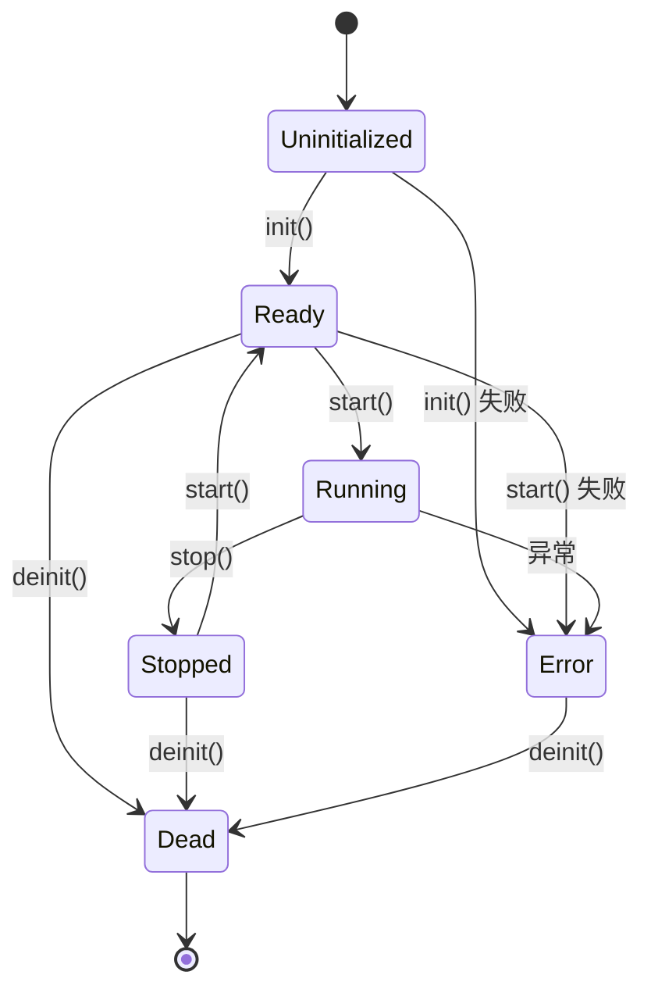
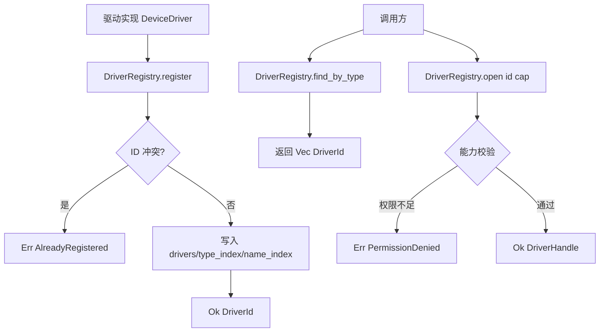

# v0.43.0 用户态驱动框架设计文档

> 版本：v0.43.0
> 蓝图依据：`蓝图/phase1.md` §7450-7659
> 前置版本：v0.42.1（System Agent 故障恢复编排 + 本地 HMI）
> 解锁版本：v0.44.0（RS485 串口驱动）
> crate：`eneros-driver-framework`（`crates/drivers/framework/`）
> 依赖：零外部依赖（仅 `alloc` / `core`），no_std
> 最后更新：2026-07-15

本文档描述 EnerOS v0.43.0 引入的用户态设备驱动框架（`eneros-driver-framework`）。该框架为所有用户态设备驱动提供统一的 `DeviceDriver` trait、驱动注册表、能力令牌与生命周期状态机，是 P1-F 设备协议栈的基石。框架零外部依赖，仅使用 `alloc` 与 `core`，严格遵守 no_std 合规要求（蓝图 §43.1）。

---

## 目录

1. [概述与版本定位](#1-概述与版本定位)
2. [架构定位](#2-架构定位)
3. [DeviceDriver trait 设计](#3-devicedriver-trait-设计)
4. [核心类型定义](#4-核心类型定义)
5. [DriverRegistry 注册表设计](#5-driverregistry-注册表设计)
6. [DriverHandle 与 DriverCapability 能力模型](#6-driverhandle-与-drivercapability-能力模型)
7. [驱动生命周期状态机](#7-驱动生命周期状态机)
8. [注册表数据流](#8-注册表数据流)
9. [测试策略](#9-测试策略)
10. [偏差声明](#10-偏差声明)
11. [未来演进](#11-未来演进)

---

## 1. 概述与版本定位

v0.43.0 建立用户态设备驱动统一抽象：通过 `DeviceDriver` trait 统一所有设备驱动（串口、网卡、CAN、存储、GPIO、I2C、SPI、自定义）的标识、状态、生命周期与中断接口，通过 `DriverRegistry` 提供按 ID/类型/名称的注册与发现，通过 `DriverCapability` 能力令牌实现 `open()` 访问控制。

一句话目标：为所有用户态设备驱动提供"统一接口 + 统一注册表 + 统一能力模型"三件套，使后续驱动版本只需实现 trait 即可被 Agent/RTOS 发现并使用。

### 1.1 P1-F 基石地位

P1-F 设备协议栈（v0.44.0~v0.51.0）覆盖 RS485 串口、Modbus、CAN、IEC104、IEC61850 等能源行业主流现场协议。这些协议的底层都依赖一个统一的驱动抽象——v0.43.0 即为此抽象层。没有 v0.43.0，每个协议版本将各自定义驱动接口与注册逻辑，导致接口碎片化、重复造轮子（违反蓝图 §5.5 默认集成清单精神与 §43.2 代码可用性要求）。

### 1.2 核心交付物

| 交付物 | 文件 | 说明 |
|--------|------|------|
| `DeviceDriver` trait | `src/lib.rs` | 10 方法的驱动统一接口 |
| `DriverId` / `DriverType` / `DriverState` / `DriverHealth` | `src/lib.rs` | 核心枚举与标识类型 |
| `DriverError` | `src/lib.rs` | 9 变体的错误枚举 |
| `DriverRegistry` + `DriverStats` | `src/registry.rs` | BTreeMap 三索引注册表 |
| `DriverHandle` / `DriverCapability` / `DriverPermission` | `src/handle.rs` | 自包含能力令牌 |
| `MockDriver` | `src/mock.rs` | 测试桩驱动 |
| 集成测试 | `tests/driver_framework_test.rs` | 10 个端到端测试 |

### 1.3 版本依赖关系

- 前置：v0.42.1（System Agent 故障恢复编排 + 本地 HMI）已完成
- 解锁：v0.44.0（RS485 串口驱动）→ v0.45.0~v0.51.0 各协议驱动
- 无新增外部依赖，不修改既有 crate 的公共 API

---

## 2. 架构定位

### 2.1 P1-F 第一层

P1-F 设备协议栈自下而上分三层，v0.43.0 是第一层（trait 抽象层）：

| 层 | 版本 | 职责 |
|----|------|------|
| 第一层（本版本） | v0.43.0 | `DeviceDriver` trait + 注册表 + 能力模型 |
| 第二层 | v0.44.0~v0.47.0 | 具体总线驱动（RS485 / CAN / 以太网） |
| 第三层 | v0.48.0~v0.51.0 | 协议栈（Modbus / IEC104 / IEC61850） |

后续每个驱动版本只需：实现 `DeviceDriver` trait → 注册到 `DriverRegistry` → 调用方通过 `find_by_type` / `open` 获取句柄使用。

### 2.2 设计原则关联

| 蓝图原则 | 本版本体现 |
|---------|-----------|
| 混合关键性分离（蓝图 §42.3） | 驱动框架是用户态抽象，与 RTOS 控制大区隔离；驱动 panic 不影响控制路径 |
| 能力模型安全（蓝图 §42.5） | `DriverCapability` 自包含令牌，`open()` 校验权限位集，遵循最小权限原则 |
| no_std 全覆盖（蓝图 §43.1） | 框架 `#![cfg_attr(not(test), no_std)]` + `extern crate alloc`，零外部依赖 |
| 优先集成而非自研（蓝图 §5.5） | trait 层是能源行业特有的统一抽象（无开源替代），属合理自研范围 |
| Surgical Changes | 框架不涉及 DMA / 线程管理 / seL4 隔离（见偏差 D4/D7/D9），留给后续版本 |

### 2.3 模块结构

```
crates/drivers/framework/
├── Cargo.toml          # 零外部依赖
├── src/
│   ├── lib.rs          # DeviceDriver trait + DriverId/Type/State/Health/Error
│   ├── registry.rs     # DriverRegistry + DriverStats + DriverEntry
│   ├── handle.rs       # DriverHandle + DriverCapability + DriverPermission
│   └── mock.rs         # MockDriver 测试桩
└── tests/
    └── driver_framework_test.rs   # 10 个集成测试
```

---

## 3. DeviceDriver trait 设计

`DeviceDriver` 是所有用户态设备驱动的统一接口，要求 `Send + Sync`（支持跨线程注册与共享引用访问），共 10 个方法，分三类：标识查询（4 个）、生命周期管理（4 个）、运行时行为（2 个）。

### 3.1 trait 签名

```rust
pub trait DeviceDriver: Send + Sync {
    /// 返回驱动唯一标识的引用
    fn id(&self) -> &DriverId;
    /// 返回驱动名称
    fn name(&self) -> &str;
    /// 返回驱动类型
    fn driver_type(&self) -> DriverType;
    /// 返回当前驱动状态
    fn state(&self) -> DriverState;
    /// 初始化驱动（Uninitialized -> Ready）
    fn init(&mut self) -> Result<(), DriverError>;
    /// 启动驱动（Ready/Stopped -> Running）
    fn start(&mut self) -> Result<(), DriverError>;
    /// 停止驱动（Running -> Stopped）
    fn stop(&mut self) -> Result<(), DriverError>;
    /// 反初始化驱动（Stopped/Ready -> Dead）
    fn deinit(&mut self) -> Result<(), DriverError>;
    /// 处理中断
    fn handle_irq(&mut self, irq_id: u32);
    /// 健康检查
    fn health_check(&self) -> DriverHealth;
}
```

### 3.2 方法逐一说明

| 方法 | 类别 | 返回 | 说明 |
|------|------|------|------|
| `id()` | 标识 | `&DriverId` | 驱动唯一标识，注册时作为主键；返回引用避免 Copy 大对象 |
| `name()` | 标识 | `&str` | 人类可读名称，用于 `find_by_name` 索引 |
| `driver_type()` | 标识 | `DriverType` | 驱动类型，用于 `find_by_type` 索引；Copy 类型 |
| `state()` | 标识 | `DriverState` | 当前生命周期状态，调用方据此判断可用性 |
| `init()` | 生命周期 | `Result<(), DriverError>` | 初始化硬件资源，成功则 `Uninitialized → Ready`；失败返回 `InitFailed` |
| `start()` | 生命周期 | `Result<(), DriverError>` | 启动驱动运行，`Ready/Stopped → Running`；失败返回 `StartFailed` |
| `stop()` | 生命周期 | `Result<(), DriverError>` | 停止驱动，`Running → Stopped`；失败返回 `StopFailed` |
| `deinit()` | 生命周期 | `Result<(), DriverError>` | 释放硬件资源，`Stopped/Ready → Dead`；失败返回 `DeinitFailed` |
| `handle_irq()` | 运行时 | `()` | 中断处理回调，`irq_id` 由中断路由器注入（D4：Phase 3 seL4 notification 路由） |
| `health_check()` | 运行时 | `DriverHealth` | 健康自检，供 `SystemAgent`（v0.41.0）周期性轮询 |

### 3.3 Send + Sync 约束

`Send + Sync` 约束保证：
- 驱动实例可在多核间移动（`Send`）
- 多个线程可共享 `&driver` 引用并发调用 `id()`/`name()`/`state()`/`health_check()`（`Sync`）
- 生命周期方法（`init`/`start`/`stop`/`deinit`/`handle_irq`）需 `&mut self`，由调用方通过外部同步（如 `spin::Mutex`，v0.19.0 调度器线程模型注入，见偏差 D7）保证独占

### 3.4 DriverError 错误枚举

```rust
pub enum DriverError {
    AlreadyRegistered,   // 驱动已注册
    NotFound,            // 驱动未找到
    PermissionDenied,    // 权限不足
    InvalidState,        // 当前状态不允许此操作
    InitFailed,          // 初始化失败
    StartFailed,         // 启动失败
    StopFailed,          // 停止失败
    DeinitFailed,        // 反初始化失败
    NotRegistered,       // 驱动未注册
}
```

`DriverError` 实现 `Display` 与 `core::error::Error`，9 个变体覆盖注册表操作（`AlreadyRegistered`/`NotFound`/`NotRegistered`/`PermissionDenied`/`InvalidState`）与生命周期失败（`InitFailed`/`StartFailed`/`StopFailed`/`DeinitFailed`）两类场景。

---

## 4. 核心类型定义

### 4.1 DriverId — 驱动唯一标识

```rust
#[derive(Clone, Copy, Debug, PartialEq, Eq, PartialOrd, Ord, Hash)]
pub struct DriverId(pub u64);
```

`DriverId(pub u64)` 是新类型（newtype）封装，字段公开以便构造。派生全部常用 trait：`Copy`（轻量 u64）、`Ord`（BTreeMap 主键所需）、`Hash`（预留 HashMap 升级）。框架内定义 `DriverId` 而非复用 agent 的 `DeviceId`，避免驱动传递依赖 agent runtime（偏差 D6）。

### 4.2 DriverType — 驱动类型枚举

```rust
pub enum DriverType {
    Serial,        // 串口（RS232/RS485/RS422）
    Network,       // 网卡
    Can,           // CAN 总线
    Storage,       // 存储设备
    Gpio,          // GPIO
    I2c,           // I2C
    Spi,           // SPI
    Custom(u16),   // 自定义类型（扩展用）
}
```

7 个具名变体覆盖能源行业主流外设类型，`Custom(u16)` 提供扩展位（如特殊协议控制器）。`DriverType` 派生 `Ord`，作为 `type_index: BTreeMap<DriverType, Vec<DriverId>>` 的键。

### 4.3 DriverState — 驱动状态机

```rust
pub enum DriverState {
    Uninitialized,  // 未初始化
    Ready,          // 就绪（已初始化，未运行）
    Running,        // 运行中
    Stopped,        // 已停止
    Error,          // 错误状态
    Dead,           // 已销毁（不可恢复）
}
```

6 态状态机（详见第 7 章）。`Ready` 与 `Stopped` 都可 `start()` 进入 `Running`，支持"停止后重启"场景。`Dead` 为终态，不可恢复。

### 4.4 DriverHealth — 健康状态

```rust
pub enum DriverHealth {
    Healthy,    // 健康
    Degraded,   // 降级（可运行但功能受限）
    Unhealthy,  // 不健康（需干预）
    Unknown,    // 未知（未检测或无法检测）
}
```

4 级健康状态供 `SystemAgent`（v0.41.0）周期性轮询。`Degraded` 用于驱动部分功能失效但核心可用（如 RS485 通信降速）；`Unhealthy` 触发故障恢复编排（v0.42.0）；`Unknown` 用于尚未实现健康检查的驱动。

---

## 5. DriverRegistry 注册表设计

### 5.1 数据结构

`DriverRegistry` 采用 BTreeMap 三索引结构（偏差 D2：no_std 无 HashMap）：

```rust
pub struct DriverRegistry {
    /// 驱动表：DriverId -> DriverEntry
    drivers: BTreeMap<DriverId, DriverEntry>,
    /// 类型索引：DriverType -> Vec<DriverId>
    type_index: BTreeMap<DriverType, Vec<DriverId>>,
    /// 名称索引：name -> DriverId
    name_index: BTreeMap<String, DriverId>,
}

struct DriverEntry {
    driver: Box<dyn DeviceDriver>,       // 驱动实例（trait 对象）
    required_perms: DriverPermission,    // 访问所需权限
    created_at: u64,                     // 创建时间戳（D3：注入）
    stats: DriverStats,                  // 运行统计
}
```

`drivers` 为主表（持有所有权），`type_index` 与 `name_index` 为派生索引（仅存 `DriverId`），三者保持一致。`Box<dyn DeviceDriver>` 存储 trait 对象，注册后驱动所有权转移至注册表。

### 5.2 register — 注册驱动

```rust
pub fn register(
    &mut self,
    driver: Box<dyn DeviceDriver>,
    required_perms: DriverPermission,
    now: u64,                              // D3：时间戳由调用方注入
) -> Result<DriverId, DriverError>
```

注册流程：
1. 读取 `driver.id()` / `driver_type()` / `name()`
2. 若 `drivers` 已含该 ID → 返回 `Err(AlreadyRegistered)`
3. 构造 `DriverEntry`（含默认 `DriverStats`），插入 `drivers`
4. `type_index[dtype].push(id)`，`name_index[name] = id`
5. 返回 `Ok(id)`

`now: u64` 参数注入时间戳（偏差 D3），因 no_std 无系统时钟，遵循 v0.41.0 `tick(now)` 注入时间模式。

### 5.3 查找方法

| 方法 | 签名 | 复杂度 | 说明 |
|------|------|--------|------|
| `find_by_id` | `(&DriverId) -> Option<DriverId>` | O(log n) | 主表查找 |
| `find_by_type` | `(DriverType) -> Vec<DriverId>` | O(log n) | 类型索引查找，返回所有同类型驱动 |
| `find_by_name` | `(&str) -> Option<DriverId>` | O(log n) | 名称索引查找 |

### 5.4 open — 能力校验访问

```rust
pub fn open(
    &self,
    id: &DriverId,
    cap: &DriverCapability,
) -> Result<DriverHandle, DriverError>
```

流程：
1. `drivers.get(id)` → 不存在返回 `Err(NotFound)`
2. `cap.can_access(entry.required_perms)` → 权限不足返回 `Err(PermissionDenied)`
3. 返回 `Ok(DriverHandle::new(*id, *cap))`

成功后返回 `DriverHandle` 作为访问凭证（详见第 6 章）。注意 `open()` 取 `&self`（不可变借用），因此 `open_count` 统计需通过独立的 `record_open(&mut self, id)` 方法更新（可变借用）。

### 5.5 unregister — 注销驱动

```rust
pub fn unregister(&mut self, id: &DriverId) -> Result<(), DriverError>
```

注销流程：
1. `drivers.remove(id)` → 不存在返回 `Err(NotRegistered)`
2. 从 `type_index[dtype]` 中移除该 ID，若 Vec 空则删除键
3. `name_index.retain(|_, v| v != id)` 清理名称索引

### 5.6 辅助方法

| 方法 | 说明 |
|------|------|
| `list() -> Vec<DriverId>` | 列出所有驱动 ID |
| `count() -> usize` | 驱动数量 |
| `stats(&DriverId) -> Option<&DriverStats>` | 查询运行统计 |
| `created_at(&DriverId) -> Option<u64>` | 查询创建时间戳 |
| `required_perms(&DriverId) -> Option<DriverPermission>` | 查询所需权限 |
| `record_open(&mut self, &DriverId)` | 记录一次 open 调用（递增 `open_count`） |

### 5.7 DriverStats — 运行统计

```rust
pub struct DriverStats {
    pub open_count: u32,                    // open() 调用次数
    pub error_count: u32,                   // 错误次数
    pub last_error: Option<DriverError>,    // 最近一次错误
    pub irq_count: u32,                     // IRQ 处理次数
}

impl DriverStats {
    pub fn record_open(&mut self);          // +1 open_count
    pub fn record_error(&mut self, err);    // +1 error_count，记录 last_error
    pub fn record_irq(&mut self);           // +1 irq_count
}
```

`DriverStats` 在框架内定义（偏差 D5：蓝图引用但未定义），供 `health_check` 与可观测性使用。字段公开（`pub`），允许调用方直接读取，但变更通过 `record_*` 方法以保证原子性。

---

## 6. DriverHandle 与 DriverCapability 能力模型

### 6.1 设计目标

采用自包含能力令牌（capability token）模型，而非集中式 ACL。能力令牌是不可伪造的 POD（Plain Old Data）值，持有者凭令牌中声明的权限访问驱动。该设计零外部依赖，不依赖 eneros-agent 的 `CapabilityToken`（偏差 D1）。

### 6.2 DriverPermission — 权限位集

```rust
pub struct DriverPermission(pub u32);

impl DriverPermission {
    pub const OPEN:   Self = Self(0x01);   // 打开驱动
    pub const CONFIG: Self = Self(0x02);   // 配置驱动
    pub const IRQ:    Self = Self(0x04);   // 中断处理
    pub const ALL:    Self = Self(0xFF);   // 全部权限

    pub fn bits(&self) -> u32;
    pub fn from_bits(bits: u32) -> Self;
    pub fn contains(&self, other: Self) -> bool;
    pub fn is_empty(&self) -> bool;
    pub fn is_all(&self) -> bool;
}

impl core::ops::BitOr for DriverPermission { ... }       // a | b
impl core::ops::BitOrAssign for DriverPermission { ... } // a |= b
```

手动实现的 bitflags（不依赖 `bitflags` crate，保持零外部依赖）。权限位定义：

| 常量 | 位值 | 含义 |
|------|------|------|
| `OPEN` | `0x01` | 打开驱动（调用 `open()`） |
| `CONFIG` | `0x02` | 配置驱动参数 |
| `IRQ` | `0x04` | 注册/处理中断 |
| `ALL` | `0xFF` | 全部权限 |

支持 `BitOr`（`OPEN | CONFIG`）与 `BitOrAssign`（`perm |= IRQ`）组合权限。

### 6.3 DriverCapability — 能力令牌

```rust
pub struct DriverCapability {
    owner_id: u64,                    // 所有者 ID
    permissions: DriverPermission,    // 权限位集
}

impl DriverCapability {
    pub fn new(owner_id: u64, permissions: DriverPermission) -> Self;
    pub fn new_full(owner_id: u64) -> Self;      // 全权限
    pub fn new_empty(owner_id: u64) -> Self;     // 无权限
    pub fn can_access(&self, required: DriverPermission) -> bool;
    pub fn owner(&self) -> u64;
    pub fn permissions(&self) -> DriverPermission;
}
```

`DriverCapability` 派生 `Copy`（偏差 D8：内部仅 u64+u32，POD 类型 Copy 更自然）。`can_access(required)` 通过 `permissions.contains(required)` 校验权限位集包含关系。

### 6.4 can_access 校验逻辑

```rust
pub fn can_access(&self, required: DriverPermission) -> bool {
    self.permissions.contains(required)
}

// contains 实现
pub fn contains(&self, other: Self) -> bool {
    (self.0 & other.0) == other.0
}
```

按位与后等于所需位集即授权。例如：
- 令牌权限 `0x03`（OPEN|CONFIG），所需 `0x01`（OPEN）→ `(0x03 & 0x01) == 0x01` → 授权
- 令牌权限 `0x01`（OPEN），所需 `0x02`（CONFIG）→ `(0x01 & 0x02) == 0x00 ≠ 0x02` → 拒绝

### 6.5 DriverHandle — 驱动句柄

```rust
pub struct DriverHandle {
    id: DriverId,               // 驱动 ID
    cap: DriverCapability,      // 能力令牌
}

impl DriverHandle {
    pub fn new(id: DriverId, cap: DriverCapability) -> Self;
    pub fn id(&self) -> DriverId;
    pub fn cap(&self) -> DriverCapability;
}
```

`DriverHandle` 派生 `Copy`（D8），是 `open()` 成功后的访问凭证。句柄携带的能力令牌记录了调用方对该驱动的授权范围，后续驱动操作可再次校验具体权限（如 `CONFIG` 操作需校验句柄 `cap` 含 CONFIG 位）。

---

## 7. 驱动生命周期状态机

驱动生命周期遵循 6 态状态机，`init`/`start`/`stop`/`deinit` 方法驱动状态转换，异常进入 `Error` 态，`deinit` 进入终态 `Dead`。



### 7.1 状态转换说明

| 起始状态 | 操作 | 目标状态 | 失败错误 |
|---------|------|---------|---------|
| Uninitialized | `init()` | Ready | `InitFailed`（停留 Uninitialized） |
| Ready | `start()` | Running | `StartFailed`（进入 Error） |
| Stopped | `start()` | Running | `StartFailed`（进入 Error） |
| Running | `stop()` | Stopped | `StopFailed`（进入 Error） |
| Ready | `deinit()` | Dead | `DeinitFailed`（进入 Error） |
| Stopped | `deinit()` | Dead | `DeinitFailed`（进入 Error） |
| Error | `deinit()` | Dead | `DeinitFailed`（停留 Error） |
| Dead | （任何） | Dead | 终态不可恢复 |

### 7.2 关键设计点

- **Stopped → Ready 不可逆为 Ready**：图示 `Stopped --> Running: start()` 直接从停止态重启，无需重新 init。这支持"停止-重启"场景（如配置变更后重启驱动）。
- **Error 是可恢复中间态**：驱动进入 Error 后仍可 `deinit()` 释放资源进入 Dead，避免资源泄漏。
- **Dead 是终态**：进入 Dead 后驱动实例不可再用，需重新构造并注册。
- **状态校验由驱动实现负责**：trait 层定义状态语义，具体的状态转换守卫（如 `Uninitialized` 下 `start()` 返回 `InvalidState`）由各驱动实现。`MockDriver` 实现了可配置失败的生命周期，供测试验证。

---

## 8. 注册表数据流

下图展示驱动从实现、注册、发现到获取句柄的完整数据流：



### 8.1 注册流程

1. 驱动实现 `DeviceDriver` trait，构造为 `Box<dyn DeviceDriver>`
2. 调用 `registry.register(driver, required_perms, now)`
3. 注册表检查 ID 冲突：冲突返回 `Err(AlreadyRegistered)`
4. 无冲突则写入三索引（drivers / type_index / name_index），返回 `Ok(DriverId)`

### 8.2 发现流程

调用方（Agent / RTOS）通过三种方式发现驱动：
- **按 ID**：`find_by_id(&DriverId)` — 已知 ID 直接定位
- **按类型**：`find_by_type(DriverType::Serial)` — 查找所有串口驱动（典型场景：Agent 需要所有 RS485 接口）
- **按名称**：`find_by_name("uart0")` — 按人类可读名称查找

### 8.3 打开流程

1. 调用方持 `DriverCapability`（由能力管理器 v0.40.0 签发，或自构造）
2. 调用 `registry.open(&id, &cap)`
3. 注册表查找驱动：不存在返回 `Err(NotFound)`
4. 校验 `cap.can_access(entry.required_perms)`：权限不足返回 `Err(PermissionDenied)`
5. 通过则返回 `Ok(DriverHandle { id, cap })`，调用方凭句柄使用驱动

### 8.4 典型使用示例

```rust
// 1. 注册 RS485 驱动（v0.44.0 将实现）
let driver = Box::new(Rs485Driver::new(DriverId(1), "rs485-0", ...));
let id = registry.register(driver, DriverPermission::OPEN, now)?;

// 2. Agent 发现串口驱动
let serials = registry.find_by_type(DriverType::Serial);

// 3. 打开驱动（需 OPEN 权限）
let cap = DriverCapability::new(agent_id, DriverPermission::OPEN);
let handle = registry.open(&serials[0], &cap)?;

// 4. 通过 handle 使用驱动
// driver_ops(handle, ...);
```

---

## 9. 测试策略

### 9.1 测试分层

| 层级 | 文件 | 用例数 | 覆盖范围 |
|------|------|--------|---------|
| 单元测试 | `src/lib.rs` | 6 | DriverId / DriverType / DriverState / DriverHealth / DriverError |
| 单元测试 | `src/handle.rs` | 8 | DriverPermission 位运算 / DriverCapability 授权 / DriverHandle 访问器 |
| 单元测试 | `src/registry.rs` | 14 | 注册 / 三索引查找 / open 能力校验 / 注销 / 统计 |
| 单元测试 | `src/mock.rs` | 10 | MockDriver 全生命周期 / 失败注入 / IRQ 记录 / 健康检查 |
| 集成测试 | `tests/driver_framework_test.rs` | 10 | 端到端：生命周期 / 注册发现 / 能力校验 / 注销 / 统计 |
| **合计** | | **38 + 10 = 48** | |

### 9.2 单元测试覆盖（38 个）

**类型层（lib.rs，6 个）**：
- `test_driver_id_construct_and_compare` — DriverId 构造与全序比较
- `test_driver_type_variants` — 7 具名变体 + Custom 携带值
- `test_driver_state_all_variants` — 6 态两两不相等
- `test_driver_health_all_variants` — 4 级健康两两不相等
- `test_driver_error_display` — 9 变体 Display 输出
- `test_driver_error_eq` — 错误变体相等性

**能力层（handle.rs，8 个）**：
- `test_permission_bitor` — `OPEN | CONFIG` 组合
- `test_permission_contains` — ALL 包含校验
- `test_permission_empty_and_all` — 空权限 / 全权限 / from_bits 往返
- `test_capability_can_access_granted` — 全权限令牌通过任意校验
- `test_capability_can_access_denied` — 空权限 / 部分权限拒绝
- `test_capability_new_full_and_empty` — 构造器与访问器
- `test_handle_construct_and_accessors` — 句柄构造与 id/cap 访问
- `test_capability_copy_semantics` — Copy 语义（赋值不移动）

**注册表层（registry.rs，14 个）**：覆盖空注册表、注册成功、重复注册、按 ID/类型/名称查找、open 成功/权限拒绝/未找到、注销成功/未注册、list/count、stats 查询。

**Mock 驱动层（mock.rs，10 个）**：覆盖构造初始态、init 成功/失败、start 成功/失败、stop、deinit、IRQ 记录、健康检查四态、Custom 类型变体。

### 9.3 集成测试覆盖（10 个）

`tests/driver_framework_test.rs` 通过 `MockDriver` 验证端到端行为：

| 用例 | 验证点 |
|------|--------|
| `test_mock_driver_lifecycle` | init→start→stop→deinit 全流程状态转换 |
| `test_registry_register_and_find_by_id` | 注册后按 ID 查找命中/未命中 |
| `test_registry_find_by_type` | 多类型注册后按类型筛选 |
| `test_registry_find_by_name` | 按名称查找命中/未命中 |
| `test_registry_duplicate_register` | 重复注册返回 AlreadyRegistered |
| `test_registry_open_with_capability` | 持 OPEN 权限令牌成功打开 |
| `test_registry_open_permission_denied` | 无权限令牌被拒绝 |
| `test_registry_open_not_found` | 打开不存在驱动返回 NotFound |
| `test_registry_unregister` | 注销后查找为空，重复注销返回 NotRegistered |
| `test_registry_stats_and_list` | list/count/stats 查询与 record_open 递增 |

### 9.4 MockDriver 测试桩设计

`MockDriver` 是框架自带的测试桩，实现 `DeviceDriver` trait，特点：
- 可配置失败注入：`set_init_fails(true)` / `set_start_fails(true)` 模拟生命周期失败
- IRQ 调用记录：`handle_irq(irq_id)` 追加到 `irq_log: Vec<u32>`，可回放验证
- 健康状态可设：`set_health(DriverHealth::Degraded)` 模拟降级
- 状态直读：`current_state()` 提供 trait `state()` 外的直接访问，便于断言

`MockDriver` 既是框架自身的测试工具，也将作为后续驱动版本（v0.44.0+）开发初期的占位实现，降低协议栈开发的启动成本。

---

## 10. 偏差声明

本章节列出 v0.43.0 实现相对蓝图设计的 9 项偏差，与 `spec.md` 偏差声明一致。所有偏差均经评审，遵循 no_std 合规、零外部依赖、Surgical Changes 原则。

| 偏差 | 蓝图设计 | 实际实现 | 理由 |
|------|---------|---------|------|
| **D1** | `CapabilityToken`（来自 eneros-agent），`open()` 调用 `cap.can_access(owner())` + `CapabilityToken::new_owner_only()` | 自包含 `DriverCapability`（owner_id + permissions 位集），`open()` 调用 `cap.can_access(required_perms)` | 真实 `CapabilityToken` API 不存在 `new_owner_only`/`can_access(owner)`；避免驱动传递依赖 agent runtime |
| **D2** | `HashMap` / `HashSet` + `String` 名称索引 | `BTreeMap` / `BTreeSet` + `String`（alloc） | no_std 无 `HashMap`（需 `hashbrown` 依赖）；BTreeMap 零依赖且有序，遵循 v0.42.0 D1 先例 |
| **D3** | `DriverEntry.created_at: MonotonicTime` + `MonotonicTime::now()` | `created_at: u64`，时间戳由 `register()` 调用方传入 `now: u64` 参数 | no_std 无系统时钟；遵循 v0.41.0 `tick(now)` 注入时间模式 |
| **D4** | seL4 CNode 隔离 + notification IRQ 路由 + 分区级 panic 隔离 | 框架提供 `handle_irq()` trait 方法签名与状态机；seL4 真实隔离在 Phase 3 集成 | ADR-0001：Phase 3（v0.127.0+）才定制 seL4 |
| **D5** | 蓝图 `DriverStats` 被引用但未定义 | 框架内定义 `DriverStats { open_count, error_count, last_error, irq_count }` | 蓝图引用但缺定义；自包含类型供 `health_check` 与可观测性使用 |
| **D6** | 复用 agent `DeviceId`（隐含） | 框架内 `DriverId(pub u64)` | 不依赖 eneros-agent（D1）；DriverId 自包含，避免传递依赖 |
| **D7** | 蓝图 §5 "每个驱动独占一个线程" | 单线程注册表；线程模型由调用方（RTOS/Agent）决定 | 线程管理依赖 v0.19.0 调度器；框架聚焦 trait/注册/发现，不绑定线程策略 |
| **D8** | `DriverHandle` 持 `cap: CapabilityToken`（Clone） | `DriverHandle` 持 `cap: DriverCapability`（Copy，内部仅 u64+u32） | D1 一致性；DriverCapability 为 POD 类型，Copy 语义更自然 |
| **D9** | 蓝图 §8.4 "DMA 缓冲区需 seL4 SharedMemory 授权" | 框架不涉及 DMA 缓冲区管理（由具体驱动如 v0.44.0 RS485 处理） | 框架是 trait 层，DMA 是驱动实现细节；遵循 Surgical Changes 不引入未要求的抽象 |

---

## 11. 未来演进

### 11.1 Phase 3 seL4 集成（v0.127.0+）

依据 ADR-0001，Phase 3 采用 seL4 深度定制（方案 A），驱动框架将集成以下能力：

- **CNode 隔离**：每个驱动分配独立 CNode，驱动间能力隔离；`DriverRegistry` 注册时关联 CNode 引用
- **notification IRQ 路由**：`handle_irq()` 由 seL4 notification 触发，中断号经 badge 标识来源驱动；替代当前的 `irq_id: u32` 直接调用
- **分区级 panic 隔离**：驱动 panic 不影响其他分区，由 seL4 fault handler 捕获并标记驱动为 `Dead`（对应配置 `panic_strategy = "kill"`）
- **DMA 缓冲区 SharedMemory**：偏差 D9 中预留的 DMA 授权通过 seL4 SharedMemory 对象实现，驱动注册时声明 DMA 内存需求

### 11.2 线程模型注入（v0.19.0 调度器）

当前框架为单线程注册表（偏差 D7）。v0.19.0 分区调度器就绪后，调用方可为每个驱动分配独立线程：
- 驱动生命周期方法（`init`/`start`/`stop`/`deinit`/`handle_irq`）在驱动专属线程中执行
- `DriverRegistry` 通过 `spin::Mutex` 保护，支持多线程注册与发现
- IRQ 路由到驱动线程的 message queue，避免中断上下文执行驱动代码

### 11.3 健康检查与可观测性

- `health_check()` 与 `DriverStats` 将接入 `SystemAgent`（v0.41.0）的周期性轮询
- `DriverStats.last_error` 上报至故障恢复编排（v0.42.0），触发驱动级故障恢复
- 后续版本可扩展 `DriverStats` 字段（如 `last_active_at`、`bytes_transferred`）支持更细粒度可观测性

### 11.4 驱动版本路线

v0.43.0 解锁的 P1-F 设备协议栈版本：

| 版本 | 内容 |
|------|------|
| v0.44.0 | RS485 串口驱动（首个基于本框架的驱动） |
| v0.45.0~v0.47.0 | CAN / 以太网 / 存储等总线驱动 |
| v0.48.0~v0.51.0 | Modbus / IEC104 / IEC61850 协议栈 |

每个版本只需实现 `DeviceDriver` trait 并注册到 `DriverRegistry`，无需重复定义接口与注册逻辑，充分体现框架的基石价值。
