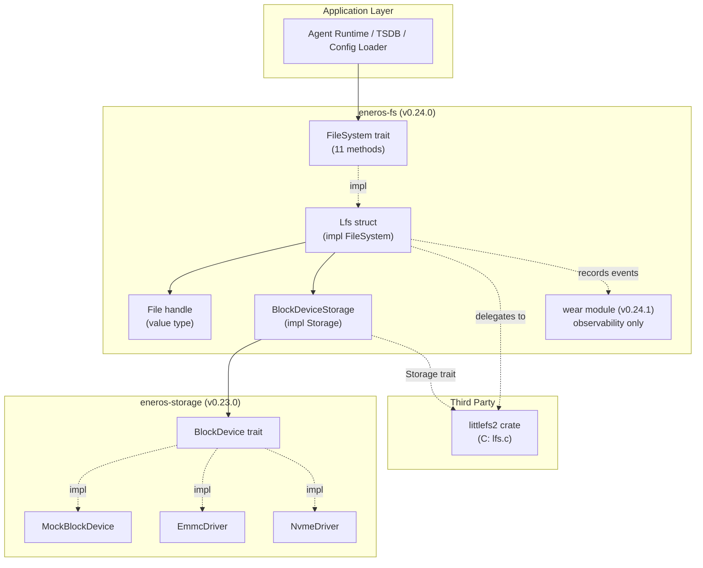

# EnerOS File System Design — v0.24.0

> **Scope**: Log-structured, power-loss safe, wear-leveled file system based on
> the `littlefs2` crate, providing a unified `FileSystem` trait on top of the
> v0.23.0 `BlockDevice` abstraction.
>
> **Crate**: `eneros-fs` (`crates/drivers/fs/`)
> **Version**: v0.24.0 (Phase 1 P1-A — ★ bottleneck version)
> **Status**: Implemented — host tests pass, aarch64 cross-build verified.

---

## 1. Overview

The `eneros-fs` crate provides EnerOS's primary persistent file storage layer.
It is a thin Rust facade over the mature `littlefs2` crate (BSD-3-Clause),
adding an EnerOS-idiomatic `FileSystem` trait, a value-type `File` handle, and
a `BlockDevice → littlefs2::driver::Storage` adapter that bridges the v0.23.0
block device trait.

### Why littlefs2?

Per project rules §5.5 (Default Integration List) and §8.1 #14 (No
Reinventing Wheels), EnerOS integrates `littlefs2` rather than self-implementing
an LFS. This decision was reaffirmed in blueprint §42.4: the original 8-module
self-built LFS was assessed as moderate over-engineering with no energy-industry
specific value beyond what littlefs2 provides.

littlefs2 provides out of the box:

- **Copy-on-write (COW) metadata** — power-loss safe; the filesystem is never
  left in an inconsistent state.
- **Dynamic wear leveling** — littlefs2's allocator selects less-worn blocks.
- **Bad block management** — failed blocks are retired transparently.
- **Compact metadata** — a 4 KB block can hold many small files.

v0.24.1 adds a monitoring/observability layer on top (see
`wear-leveling-design.md`).

### v0.24.0 Deliverables

| Component             | Status   | Notes                                                          |
| --------------------- | -------- | -------------------------------------------------------------- |
| `FileSystem` trait    | Complete | 11 methods: open/create/remove/rename/stat/mkdir/rmdir/readdir/sync/df |
| `File` handle         | Complete | Value type: read/write/seek/close/truncate                     |
| `FsError`             | Complete | 14 variants + `is_corruption()`                               |
| `FileMode`/`OpenFlags`| Complete | bitflags-based                                                 |
| `FileStat`/`DirEntry` | Complete | Stat/metadata types                                            |
| `DiskUsage`/`SeekFrom`| Complete | df + seek enums                                                |
| `Lfs` impl            | Complete | `FileSystem` for littlefs2 backend                             |
| `LfsConfig`           | Complete | 6 fields + `Default`                                           |
| `BlockDeviceStorage`  | Complete | `Storage` trait adapter for `BlockDevice`                      |

---

## 2. Architecture



The `FileSystem` trait is the single integration point for callers. The `Lfs`
struct implements it by delegating to `littlefs2::Filesystem` operations.
`BlockDeviceStorage` adapts the EnerOS `BlockDevice` trait to littlefs2's
`Storage` trait (which uses compile-time constant geometry).

---

## 3. The `FileSystem` Trait

```rust
pub trait FileSystem {
    fn open(&mut self, path: &str, flags: OpenFlags) -> Result<File, FsError>;
    fn create(&mut self, path: &str, mode: FileMode) -> Result<File, FsError>;
    fn remove(&mut self, path: &str) -> Result<(), FsError>;
    fn rename(&mut self, from: &str, to: &str) -> Result<(), FsError>;
    fn stat(&mut self, path: &str) -> Result<FileStat, FsError>;
    fn mkdir(&mut self, path: &str) -> Result<(), FsError>;
    fn rmdir(&mut self, path: &str) -> Result<(), FsError>;
    fn readdir(&mut self, path: &str) -> Result<Vec<DirEntry>, FsError>;
    fn sync(&mut self) -> Result<(), FsError>;
    fn df(&mut self) -> Result<DiskUsage, FsError>;
}
```

### Design Notes

- **Trait-based, not closure-based**: littlefs2's native API uses
  `mount_and_then(|fs| ...)` closures to manage lifetimes. EnerOS exposes a
  traditional trait-based API for ergonomic use by Agent Runtime / TSDB code.
- **`&mut self` for all ops**: each operation may need to re-mount the
  littlefs2 instance (see §4 below), requiring exclusive access.
- **`File` is a value type**: see §5.

---

## 4. `BlockDeviceStorage` Adapter

The core bridge between v0.23.0 `BlockDevice` and littlefs2's `Storage` trait.

```rust
pub struct BlockDeviceStorage {
    device: RefCell<Box<dyn BlockDevice>>,
}

impl littlefs2::driver::Storage for BlockDeviceStorage {
    const BLOCK_SIZE: usize = 4096;
    const BLOCK_COUNT: usize = 64;
    type CACHE_SIZE = U4096;
    type LOOKAHEAD_SIZE = U8;

    fn read_block(&self, block: u32, offset: usize, buf: &mut [u8]) -> Result<(), ()> { ... }
    fn write_block(&self, block: u32, offset: usize, data: &[u8]) -> Result<(), ()> { ... }
    fn erase_block(&self, block: u32) -> Result<(), ()> { ... }
}
```

### Compile-Time Geometry

littlefs2's `Storage` trait requires `BLOCK_SIZE`, `BLOCK_COUNT`, `CACHE_SIZE`,
and `LOOKAHEAD_SIZE` as compile-time constants (the latter two via `typenum`).
The adapter uses fixed values:

- `BLOCK_SIZE = 4096` — matches the EnerOS default page size for eMMC/NVMe.
- `BLOCK_COUNT = 64` — minimum viable for littlefs2 metadata; the adapter
  validates at runtime that the underlying `BlockDevice` has at least this many
  blocks.
- `CACHE_SIZE = typenum::U4096` — 4 KB read/write cache (one block).
- `LOOKAHEAD_SIZE = typenum::U8` — 8-block allocation lookahead bitmap.

### Interior Mutability

`Storage::read_block` takes `&self`, but `BlockDevice::read_block` is also
`&self`-safe (the mock does interior mutability for bad-block injection).
For `write_block`/`erase_block`, littlefs2 still passes `&self`, but the
underlying `BlockDevice` methods are `&mut self`. We resolve this with
`RefCell<Box<dyn BlockDevice>>`:

```rust
fn write_block(&self, block: u32, offset: usize, data: &[u8]) -> Result<(), ()> {
    self.device.borrow_mut()
        .write_block(block as u64, data)
        .map_err(|_| ())
}
```

This is sound because littlefs2 guarantees no re-entrancy within a single
operation.

---

## 5. Value-Type `File` Handle

The `File` struct stores only `path`, `offset`, and `flags` — not a borrowed
reference to an open littlefs2 file handle:

```rust
pub struct File {
    path: String,
    offset: u64,
    flags: OpenFlags,
}
```

Each I/O operation (`read`/`write`/`seek`) re-opens the file via littlefs2's
`open_and_then` closure, performs the operation, and closes it. This avoids
the lifetime gymnastics that would arise from holding a `littlefs2::File`
borrow across calls.

### Trade-offs

- **Pro**: simple ownership story; `File` is `Send` and `'static`.
- **Pro**: no per-file descriptor table; resource usage is bounded by
  littlefs2's `max_open_files` config (compile-time).
- **Con**: each I/O incurs an open+close pair. Overhead is small (a metadata
  block read), but high-frequency writers should buffer at the caller.

---

## 6. Power-Loss Safety

littlefs2 uses copy-on-write for all metadata updates:

1. A new metadata block is written to a free location.
2. The previous metadata block's "parent" pointer is atomically updated.
3. The old block is freed.

If power is lost between steps 1 and 2, the new block is orphaned and the
filesystem reverts to its last-synced state. If lost between steps 2 and 3,
the orphan is reclaimed on next mount.

### EnerOS Guarantees

- **After `sync()` returns**: all prior writes are durable.
- **Without `sync()`**: the filesystem remains mountable; the most recent
  un-synced writes may be lost but no corruption occurs.
- **`is_corruption()` on `FsError`**: distinguishes recoverable I/O errors
  from structural corruption (CRC mismatch, bad superblock).

---

## 7. Error Handling

`FsError` has 14 variants covering POSIX-style errors and littlefs2-specific
corruption signals:

```rust
pub enum FsError {
    NotFound, AlreadyExists, NotADirectory, IsADirectory,
    InvalidPath, NoSpace, ReadOnly, IoError,
    CorruptedBlock, CrcMismatch, BadSuperBlock,
    TooManyOpenFiles, InvalidArgument,
    CrossDeviceLink, DirectoryNotEmpty,
}
```

The `From<littlefs2::io::Error>` and `From<StorageError>` conversions map
external errors to the appropriate variant. `is_corruption()` returns `true`
for `CorruptedBlock`, `CrcMismatch`, and `BadSuperBlock` — callers should
trigger a reformat or recovery procedure in this case.

---

## 8. no_std Compliance

The crate is `no_std` with `alloc`:

```rust
#![cfg_attr(not(test), no_std)]
extern crate alloc;
```

- Uses `alloc::string::String`, `alloc::vec::Vec`, `alloc::boxed::Box`.
- No `std::sync::Mutex` — global state (v0.24.1) uses `spin::Mutex`.
- littlefs2's `c-stubs` feature provides the missing `strcpy` symbol for
  `no_std` targets.

---

## 9. Build & Test

```bash
# Host tests
cargo test -p eneros-fs

# Cross-compile for aarch64 (no_std + C)
cargo build -p eneros-fs --target aarch64-unknown-none \
    -Z build-std=core,alloc -Z build-std-features=compiler-builtins-mem

# Lint
cargo clippy -p eneros-fs --all-targets -- -D warnings
```

The C portion (`lfs.c`) is compiled by `littlefs2-sys` using
`aarch64-linux-gnu-gcc`, which is already required for the seL4 kernel build.

---

## 10. Integration with v0.23.0

The adapter wraps `Box<dyn BlockDevice>` from `eneros-storage`. The `Lfs::format`
and `Lfs::mount` constructors take ownership of the device:

```rust
let dev: Box<dyn BlockDevice> = Box::new(MockBlockDevice::new(64, 4096));
let mut fs = Lfs::format(dev)?;
```

The `eneros-storage` crate is unmodified — `eneros-fs` only consumes its trait.

---

## 11. References

- littlefs2 crate: https://crates.io/crates/littlefs2
- littlefs project: https://github.com/ARMmbed/littlefs
- EnerOS storage driver design: `docs/drivers/storage-driver-design.md`
- Wear leveling design (v0.24.1): `docs/drivers/wear-leveling-design.md`
- Blueprint §5.5 (Default Integration List), §42.4 (LFS integration decision)
