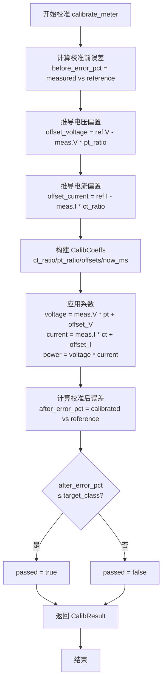

# v0.51.1 电能表校准设计文档

> 版本：v0.51.1（v0.51.0 补强子版本）
> 蓝图依据：`蓝图/phase1.md` P1-F 设备协议栈校准增强章节
> 前置版本：v0.51.0（IEC 61850 协议栈 + 协议抽象层）
> crate：`eneros-calibration`（`crates/drivers/calibration/`）
> 依赖：零外部依赖（仅 `alloc` / `core`），no_std
> 最后更新：2026-07-15

本文档描述 EnerOS v0.51.1 引入的电能表校准 crate（`eneros-calibration`）。该 crate 为电能计量驱动层提供校准系数管理、精度等级判定与校准流程，使协议栈在每次抄表时能将原始采样值映射为合规工程量。crate 零外部依赖，仅使用 `alloc` 与 `core`，严格遵守 no_std 合规要求（蓝图 §43.1）。

---

## 目录

1. [概述](#1-概述)
2. [架构](#2-架构)
3. [校准系数](#3-校准系数)
4. [精度等级](#4-精度等级)
5. [校准流程](#5-校准流程)
6. [校准结果](#6-校准结果)
7. [MeterCalibration trait](#7-metercalibration-trait)
8. [持久化抽象](#8-持久化抽象)
9. [no_std 合规](#9-no_std-合规)
10. [测试策略](#10-测试策略)
11. [与协议栈的关系](#11-与协议栈的关系)
12. [偏差声明](#12-偏差声明)

---

## 1. 概述

v0.51.1 为 P1-F 设备协议栈补齐校准能力。电能表在出厂与现场投运时均需校准：依据标准源读数推导出 CT/PT 变比、相位校正与电压/电流偏置等线性校正参数，使被校表读数逼近标准源。校准系数需持久化存储，协议栈在每次抄表时应用系数完成原始值→工程量的映射。

一句话目标：提供"系数推导 + 精度判定 + 持久化抽象"三件套，使协议栈抄表路径只需一行 `apply_coefficients` 即可获得合规工程量。

### 1.1 核心交付物

| 交付物 | 文件 | 说明 |
|--------|------|------|
| `CalibCoeffs` | `src/coeffs.rs` | 校准系数结构体 + `apply_voltage`/`apply_current` |
| `AccuracyClass` | `src/accuracy.rs` | 4 级精度枚举 + `max_error_pct` + `is_within_class` |
| `MeterReading` / `CalibResult` | `src/result.rs` | 读数与校准结果 |
| `MeterCalibration` trait | `src/trait_def.rs` | 校准抽象（系数应用/误差测量/精度分级） |
| `DefaultCalibrator` | `src/func.rs` | trait 默认实现 |
| `CalibStore` trait + `InMemoryCalibStore` | `src/store.rs` | 持久化抽象 + 内存实现 |
| `calibrate_meter` / `verify_accuracy` | `src/func.rs` | 校准与校验入口函数 |
| 单元测试 | `src/lib.rs` | 12 个测试（10 必需 + 2 辅助） |

### 1.2 版本依赖关系

- 前置：v0.51.0（IEC 61850 协议栈 + 协议抽象层）已完成
- 后续：协议栈抄表路径调用 `apply_coefficients` 完成工程量映射
- 无新增外部依赖，不修改既有 crate 的公共 API

---

## 2. 架构

### 2.1 驱动层定位

校准 crate 位于 `crates/drivers/calibration/`，属于驱动层增强。校准本质是抄表读数的线性数值映射，不涉及通信协议，因此归入 drivers 而非 protocols（详见偏差声明 D8）。

```
┌─────────────────────────────────────────────────┐
│  协议栈（Modbus/IEC104/IEC61850）                  │
│    抄表 → 读到 raw 值 → apply_coefficients → 工程量  │
└──────────────────────┬──────────────────────────┘
                       │ 依赖
┌──────────────────────▼──────────────────────────┐
│  eneros-calibration（本 crate）                   │
│    CalibCoeffs / AccuracyClass / MeterCalibration │
│    calibrate_meter / verify_accuracy              │
│    CalibStore (InMemory / FS-后置)                │
└──────────────────────────────────────────────────┘
```

### 2.2 模块结构

| 模块 | 职责 |
|------|------|
| `coeffs` | 校准系数结构体 + 电压/电流应用方法 |
| `accuracy` | 精度等级枚举 + 最大误差查询 + 合格判定 |
| `result` | 抄表读数 `MeterReading` + 校准结果 `CalibResult` |
| `trait_def` | `MeterCalibration` trait（模块名避开 `trait` 关键字） |
| `store` | `CalibStore` 持久化抽象 + `InMemoryCalibStore` |
| `func` | `DefaultCalibrator` + `calibrate_meter` + `verify_accuracy` |

### 2.3 设计原则关联

| 蓝图原则 | 本版本体现 |
|---------|-----------|
| no_std 合规（蓝图 §43.1） | `#![cfg_attr(not(test), no_std)]` + `extern crate alloc`，零外部依赖 |
| 默认集成清单（蓝图 §5.5） | 不重复造轮子；校准为能源行业特有数值映射，无开源替代，属自研范围 |
| 内存预算（蓝图 §43.6） | `InMemoryCalibStore` 每电表约 80 字节；万只表约 800KB，远低于分区预算 |
| SBOM 最小化（蓝图 §43.8） | 零外部依赖，SBOM 条目数为 0 |

---

## 3. 校准系数

### 3.1 CalibCoeffs 结构体

```rust
pub struct CalibCoeffs {
    pub ct_ratio: f64,         // CT 变比（如 1000/5 = 200.0）
    pub pt_ratio: f64,         // PT 变比（如 10000/100 = 100.0）
    pub phase_correction: f64, // 相位校正（度）
    pub offset_voltage: f64,   // 电压偏置（V）
    pub offset_current: f64,   // 电流偏置（A）
    pub calibrated_at: u64,     // 校准时间戳（ms）
}
```

- 派生 `Debug` / `Clone` / `PartialEq`
- `Default`：`ct_ratio=1.0`、`pt_ratio=1.0`、其余 `0.0`、`calibrated_at=0`（单位增益，无偏置）

### 3.2 线性映射方法

| 方法 | 公式 | 说明 |
|------|------|------|
| `apply_voltage(raw)` | `raw * pt_ratio + offset_voltage` | 原始电压采样 → 工程量 |
| `apply_current(raw)` | `raw * ct_ratio + offset_current` | 原始电流采样 → 工程量 |

`calibrate_meter` 推导偏置时，令 `offset = reference - measured * ratio`，使应用后读数逼近标准源。

### 3.3 相位校正

`phase_correction` 字段为后续版本预留（当前校准流程置 `0.0`）。相位校正需配合采样波形数据，超出本版本线性校正范围。

---

## 4. 精度等级

### 4.1 AccuracyClass 枚举

```rust
pub enum AccuracyClass {
    Class0_2S,  // 0.2S 级（高精度关口表）
    Class0_5S,  // 0.5S 级
    Class1_0,   // 1.0 级
    Class2_0,   // 2.0 级
}
```

对应 GB/T 17215.321 与 IEC 62053 系列标准。

### 4.2 最大允许误差

| 等级 | `max_error_pct()` |
|------|-------------------|
| Class0_2S | 0.2 % |
| Class0_5S | 0.5 % |
| Class1_0 | 1.0 % |
| Class2_0 | 2.0 % |

### 4.3 合格判定

`is_within_class(error_pct, class)` 返回 `|error_pct| <= class.max_error_pct()`，边界值（如 0.2%）判定为合格。

---

## 5. 校准流程

### 5.1 calibrate_meter 函数

```rust
pub fn calibrate_meter(
    ct_ratio: f64,
    pt_ratio: f64,
    measured: &MeterReading,   // 被校表读数
    reference: &MeterReading,   // 标准源读数
    target_class: AccuracyClass,
    now_ms: u64,
) -> CalibResult
```

流程步骤：
1. 计算校准前误差 `before_error_pct`（原始读数 vs 标准源，按有功功率）
2. 推导偏置：`offset_voltage = reference.voltage - measured.voltage * pt_ratio`，电流同理
3. 构建 `CalibCoeffs`（相位校正置 0）
4. 应用系数得到校准后读数，功率由 `校正电压 * 校正电流` 重算
5. 计算校准后误差 `after_error_pct`
6. `passed = is_within_class(after_error_pct, target_class)`

### 5.2 流程图



### 5.3 verify_accuracy 函数

```rust
pub fn verify_accuracy(
    measured: &MeterReading,
    reference: &MeterReading,
    target_class: AccuracyClass,
) -> bool
```

仅计算误差并判定是否落在目标等级内，不推导系数。用于运行时抽检。

---

## 6. 校准结果

### 6.1 CalibResult 结构体

```rust
pub struct CalibResult {
    pub before_error_pct: f64,    // 校准前误差百分比
    pub after_error_pct: f64,     // 校准后误差百分比
    pub target_class: AccuracyClass,
    pub passed: bool,
    pub coeffs: CalibCoeffs,      // 推导出的系数（持久化用）
    pub measured_at: u64,         // 测量时间戳（ms）
}
```

- 派生 `Debug` / `Clone`
- `coeffs` 可直接传给 `CalibStore::save` 持久化

### 6.2 MeterReading 结构体

```rust
pub struct MeterReading {
    pub voltage: f64,   // 电压（V）
    pub current: f64,   // 电流（A）
    pub power: f64,     // 有功功率（W）
    pub energy: f64,    // 累计电度量（Wh）
}
```

- 派生 `Debug` / `Clone` / `PartialEq`（支持存储往返比较）

---

## 7. MeterCalibration trait

### 7.1 trait 定义

```rust
pub trait MeterCalibration {
    fn apply_coefficients(&self, reading: &MeterReading, coeffs: &CalibCoeffs) -> MeterReading;
    fn measure_error(&self, measured: &MeterReading, reference: &MeterReading) -> f64;
    fn classify_accuracy(&self, error_pct: f64) -> AccuracyClass;
}
```

> 模块名为 `trait_def` 而非 `trait`，因 `trait` 是 Rust 关键字。

### 7.2 DefaultCalibrator

`DefaultCalibrator`（零大小单元结构体）提供标准实现：

| 方法 | 实现 |
|------|------|
| `apply_coefficients` | 电压/电流按公式校正；功率 = 校正电压 × 校正电流；电度量按变比乘积缩放 |
| `measure_error` | `(measured.power - reference.power) / reference.power * 100`；参考功率为 0 时返回 0 |
| `classify_accuracy` | 返回误差能落入的最严等级；超出 1.0% 返回 Class2_0 |

### 7.3 扩展点

实现 `MeterCalibration` trait 可支持：
- 非线性校正（分段插值）
- 功率因数补偿
- 谐波分析
- 多档位变比切换

---

## 8. 持久化抽象

### 8.1 CalibStore trait

```rust
pub trait CalibStore {
    fn load(&self, meter_id: u32) -> Option<CalibCoeffs>;
    fn save(&mut self, meter_id: u32, coeffs: &CalibCoeffs);
}
```

按 `meter_id` 存取校准系数。`CalibStore` 不直接依赖文件系统（D9），具体后端可替换：

| 后端 | 状态 | 说明 |
|------|------|------|
| `InMemoryCalibStore` | ✅ 已实现 | 测试/启动期用，基于 `BTreeMap`，重启丢失 |
| littlefs2 文件系统 | 后置 | 生产环境持久化 |
| EEPROM/Flash | 后置 | 设备级非易失存储 |

### 8.2 InMemoryCalibStore

```rust
pub struct InMemoryCalibStore {
    store: BTreeMap<u32, CalibCoeffs>,
}
```

- `new()` 创建空存储，同时实现 `Default`
- 实现 `CalibStore`：`load` 返回克隆，`save` 覆盖写

---

## 9. no_std 合规

本 crate 严格遵守蓝图 §43.1 no_std 要求：

| 合规项 | 状态 |
|--------|------|
| `#![cfg_attr(not(test), no_std)]` | ✅ |
| `extern crate alloc` | ✅ |
| 仅使用 `alloc::*` / `core::*` | ✅ |
| 零外部依赖 | ✅（D10） |
| 交叉编译 `aarch64-unknown-none` | ✅ 验证通过 |
| clippy `-D warnings` | ✅ 无警告 |

使用的 `alloc` 类型：`alloc::collections::BTreeMap`（仅 `InMemoryCalibStore`）。

---

## 10. 测试策略

### 10.1 测试清单

| # | 测试名 | 覆盖点 |
|---|--------|--------|
| 1 | `test_calib_coeffs_default` | 默认值正确 |
| 2 | `test_apply_voltage_current` | 电压/电流公式 + 默认 passthrough |
| 3 | `test_accuracy_class_max_error_pct` | 4 级最大误差 |
| 4 | `test_is_within_class_boundary` | 边界值（含/不含） |
| 5 | `test_store_save_load_roundtrip` | 存储往返一致 |
| 6 | `test_store_load_nonexistent_returns_none` | 不存在返回 None |
| 7 | `test_calibrate_meter_perfect_readings` | 完美读数 0% 误差通过 |
| 8 | `test_calibrate_meter_with_error` | 有误差时偏置推导 + 误差改善 |
| 9 | `test_verify_accuracy_pass` | 小误差通过 |
| 10 | `test_verify_accuracy_fail` | 大误差不通过 |
| 11 | `test_default_calibrator_classify_accuracy` | 精度分级边界 |
| 12 | `test_default_calibrator_apply_coefficients` | 系数应用全字段 |

### 10.2 测试结果

```
running 12 tests
test result: ok. 12 passed; 0 failed; 0 ignored; 0 measured; 0 filtered out
```

---

## 11. 与协议栈的关系

### 11.1 抄表路径集成

协议栈（Modbus/IEC104/IEC61850）抄表时，读到的原始寄存器值需经校准系数映射为工程量：

```
协议栈读寄存器 → raw_value → CalibCoeffs::apply_voltage/apply_current → 工程量 → 上报 UPA 模型
```

### 11.2 校准触发时机

| 时机 | 触发者 | 调用 |
|------|--------|------|
| 出厂校准 | 产线工装 | `calibrate_meter` → `CalibStore::save` |
| 现场投运 | 调试工具 | `calibrate_meter` → `CalibStore::save` |
| 运行时抽检 | 维护 Agent | `verify_accuracy` |
| 每次抄表 | 协议栈 | `CalibStore::load` → `apply_coefficients` |

### 11.3 与 UPA 模型的衔接

校准后的 `MeterReading` 字段（电压/电流/功率/电度量）对应 UPA 模型中 `DataPoint.value`（`PointValue`）。协议栈在适配器层完成校准映射后，将工程量写入 UPA 点表供 Agent 读取。

---

## 12. 偏差声明

| 编号 | 偏差内容 | 理由 |
|------|---------|------|
| D8 | crate 放置于 `crates/drivers/calibration/` | 电能表校准属于驱动层增强（抄表读数的线性校正），归入 drivers 子系统而非 protocols（校准不涉及通信协议，仅做数值映射） |
| D9 | `CalibStore` trait 抽象持久化，不直接依赖文件系统 | 解耦校准逻辑与存储后端；`InMemoryCalibStore` 用于测试/启动期，文件系统（littlefs2）实现后置到后续版本 |
| D10 | 零外部依赖（pure computation + data structures） | 校准仅涉及 f64 运算与 `BTreeMap`，无需任何外部 crate；保证交叉编译零障碍、SBOM 最小化 |
